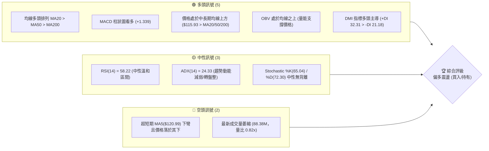
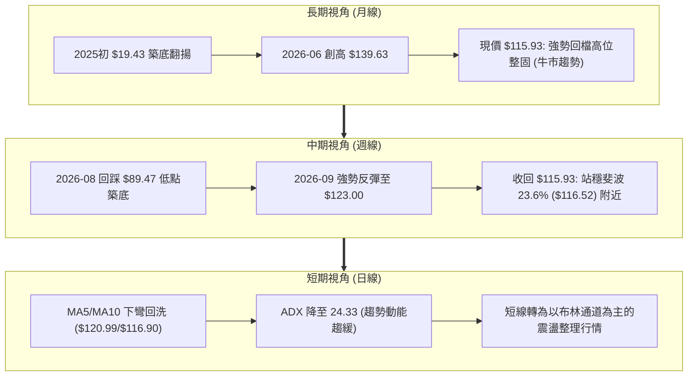
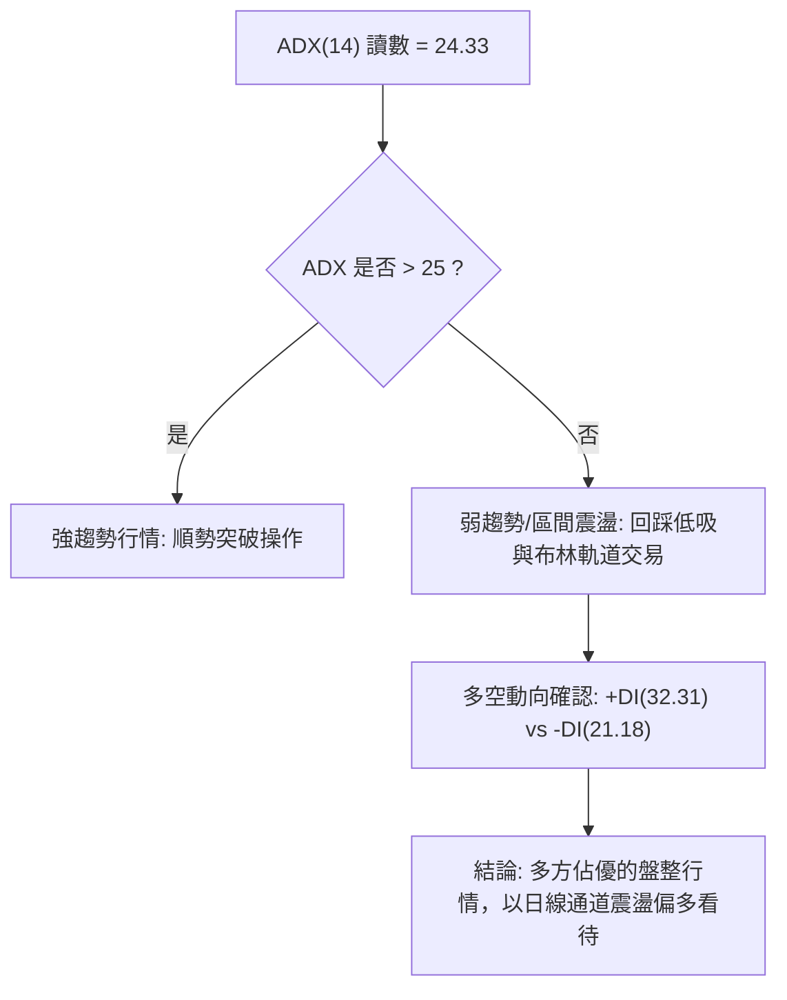
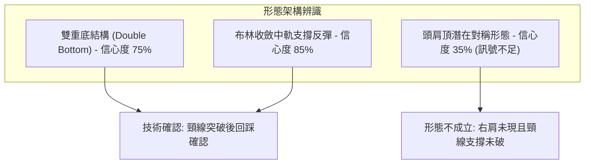
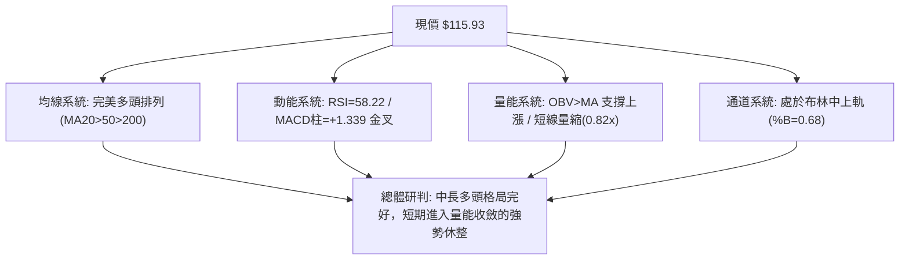
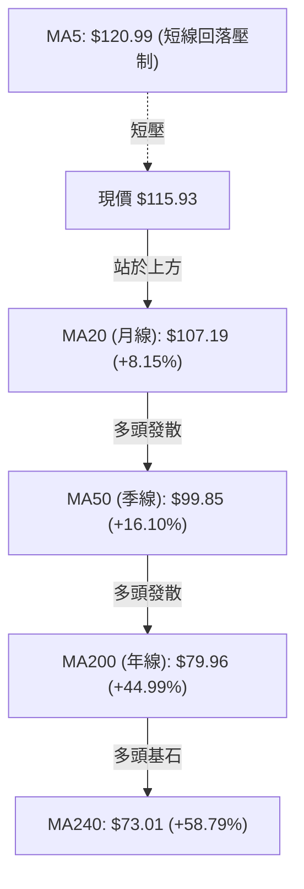
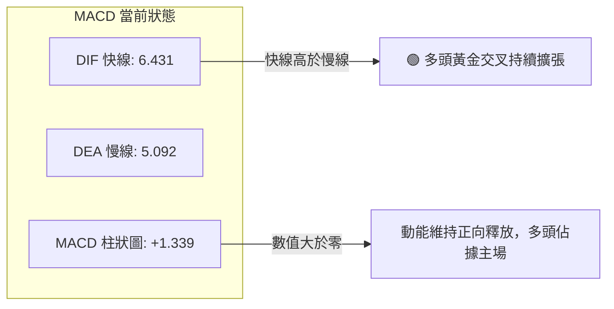
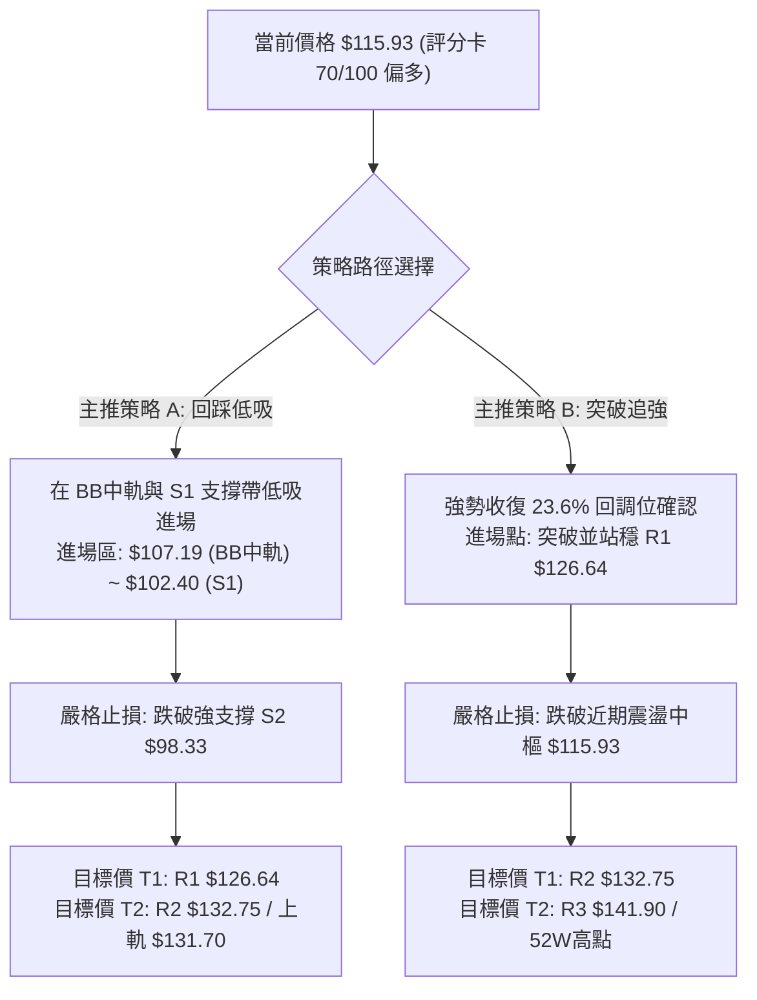
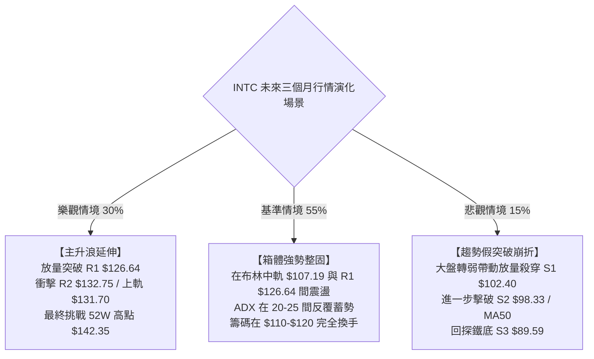

# INTC 技術分析報告

> **報告日期**：2026-09-30 ｜ **語言**：繁體中文 ｜ **數據來源**：Yahoo Finance ｜ **當前價格**：$115.93

---

## 目錄

| 章節 | 內容 |
|------|------|
| [1. 技術面概覽](#1-技術面概覽) | 訊號儀表板、核心指標、評分卡 |
| [2. 趨勢分析](#2-趨勢分析) | 多時框趨勢、長中短期走勢 |
| [3. 圖表形態分析](#3-圖表形態分析) | 形態識別、K線組合、目標價 |
| [4. 支撐與阻力](#4-支撐與阻力) | 關鍵價位、斐波那契回調 |
| [5. 技術指標深度解讀](#5-技術指標深度解讀) | MA/RSI/MACD/布林/成交量 |
| [6. 動能與波動率](#6-動能與波動率) | 動能評估、ATR、Beta |
| [7. 多時框架總結](#7-多時框架總結) | 時框架評分矩陣 |
| [8. 交易策略建議](#8-交易策略建議) | 多空策略、風險報酬比 |
| [9. 風險提示與監控](#9-風險提示與監控) | 監控指標、風險場景 |

---

## 1. 技術面概覽

### 🎯 技術訊號儀表板



### 📊 核心指標速覽表

| 指標類別 | 指標名稱 | 當前數值 | 訊號 | 解讀 |
|----------|----------|----------|:----:|------|
| **價格** | 當前價格 | $115.93 | 🟢 | 位於52週區間 75.9% 高位區，中長期結構穩健 |
| **均線** | MA20 | $107.19 | 🟢 | 現價高於 MA20 達 +8.15%，短期動能守住月線支撐 |
| **均線** | MA50 | $99.85 | 🟢 | 現價高於 MA50 達 +16.10%，中期多空分水嶺防守有效 |
| **均線** | MA200 | $79.96 | 🟢 | 現價高於 MA200 達 +44.99%，長期牛市基調明確確立 |
| **動能** | RSI(14) | 58.22 | 🟡 | 位於中性良性區域 (50-60)，未超買亦無背離，健康消化 |
| **動能** | MACD(12,26,9) | 6.431 / 5.092 | 🟢 | 快線位於慢線上方，Hist 為 +1.339，呈現多頭擴張 |
| **波動** | ATR(14) | $6.86 | 🟡 | 佔現價 5.92%，屬於中高波動性，注意短線洗盤空間 |
| **通道** | 布林通道 %B | 0.68 | 🟢 | 位於中軌($107.19)與上軌($131.70)之間，呈上行通道強勢區 |
| **量能** | 20日成交量比 | 0.82x | 🔴 | 量能小幅縮水 (88.38M vs 108.19M)，上攻動能稍有鈍化 |
| **趨勢** | ADX(14) | 24.33 | 🟡 | 數值低於 25，顯示波段趨勢開始放緩，進入震盪整固週期 |

### 🏆 技術評分卡

```
╔══════════════════════════════════════════════════════════════════════╗
║               技術評分卡 — INTC (2026-09-30)                         ║
╠══════════════════════════════════════════════════════════════════════╣
║ 趨勢強度      ████████████░░░░░░░░  60/100  🟡 中性偏強 (ADX=24.33)  ║
║ 動能指標      ██████████████░░░░░░  70/100  🟢 多頭擴張 (MACD金叉)   ║
║ 支撐穩定度    ████████████████░░░░  80/100  🟢 下方均線防護網扎實    ║
║ 成交量配合    ██████████░░░░░░░░░░  50/100  🟡 量比0.82x稍嫌不足     ║
║ 形態完整度    ██████████████░░░░░░  70/100  🟢 區間築底反彈架構確立  ║
║ 均線排列      ██████████████████░░  90/100  🟢 標準多頭排列完全發散  ║
╠══════════════════════════════════════════════════════════════════════╣
║ 綜合評分      ██████████████░░░░░░  70/100  🟢 偏多整固 (Buy on Dips)║
╚══════════════════════════════════════════════════════════════════════╝
```

---

## 2. 趨勢分析

### 🌐 多時框趨勢分析



### 📈 長期趨勢 — 12個月走勢圖（Unicode）

以下為 2025-10 至 2026-09 過去 12 個月 INTC 月線收盤走勢與關鍵高低點：

```
INTC 月線收盤走勢圖（2025-10 至 2026-09）
價格軸 ($)
$140 ┤                               ● $139.63 (波段高點 2026-06)
$130 ┤                              ╱ ╲
$120 ┤                             ╱   ╲
$110 ┤                            ●     ╲             ● $115.93 (現價 2026-09)
$100 ┤                           ╱       ╲           ╱
$ 90 ┤              ● $94.48    ╱         ●─────────● $89.51 (中期波段底 2026-08)
$ 80 ┤             ╱           ╱          $90.20 (2026-07)
$ 70 ┤            ╱           ╱
$ 60 ┤           ╱           ╱
$ 50 ┤    ●─────● $44.13    ╱
$ 40 ┤●───$46.47            ╱
$ 30 ┤$39.99 (2025-10)     ╱
     └────────────────────────────────────────────────────────
       10  11  12  01  02  03  04  05  06  07  08  09 (月份)
      [   2025年   ] [                2026年                ]
```

**歷史走勢特徵分析表格**：

| 階段區間 | 月份跨度 | 價格起訖 | 區間漲跌幅 | 走勢結構與技術特徵 |
|----------|----------|----------|:----------:|-------------------|
| **平臺蓄勢期** | 2025/10 - 2026/03 | $39.99 → $44.13 | +10.35% | 在 $40.00-$46.00 密集換手，壓縮波幅築起中期上升底座 |
| **超級主升浪** | 2026/03 - 2026/06 | $44.13 → $139.63 | +216.41% | 月線連三根巨陽線噴出，技術面呈現極端超買與主升動能爆發 |
| **急劇回踩期** | 2026/06 - 2026/08 | $139.63 → $89.51 | -35.89% | 快速擠壓獲利籌碼，回探近一年波段低點聚類 S3($89.59) 獲得強支撐 |
| **二度反彈期** | 2026/08 - 2026/09 | $89.51 → $115.93 | +29.52% | 月底收出帶長下影線陽線，站回布林中軌，多頭重整旗鼓 |

### 📊 中期趨勢（週線分析）

從近 20 週收盤走勢可見，價格在 2026-07 至 2026-08 經歷了一次顯著的打底過程：
- 2026-08-02 觸及 $90.20、2026-08-23 報 $90.07、2026-08-30 報 $89.47，三次在 $89.50-$90.00 獲得強支撐（與數據計算之波段支撐 S3 $89.59 高度吻合）。
- 進入 2026-09 後，週線連續三週強勁推升（$95.80 → $102.94 → $108.60 → $123.00），隨後最新一週收斂至 $115.93，完成了對關鍵頸線區間的回測確認。

```
週線支撐與阻力互動示意圖：
[阻力 R3: $141.90] ────────────────────────────────────── 52W 高點 $142.35 警戒區
[阻力 R1: $126.64] ──────────▲ 2026-09-27 週高 $123.00 處遭遇短線反壓
                        ▲
[現價:    $115.93] ────┼───── 斐波 23.6% ($116.52) 附近交鋒
                        ▼
[支撐 S1: $102.40] ────────── 中期多頭反彈第一道護城河
[支撐 S3: $89.59 ] ────────────────────────────────────── 三次週收盤打底低點 ($89.47)
```

### ⚡ 趨勢強度評估（ADX 解讀）



| 指標變數 | 當前讀數 | 門檻區間 | 技術意義解讀 |
|----------|:--------:|:--------:|--------------|
| **ADX(14)** | **24.33** | < 25 (弱趨勢/盤整) | 剛脫離單邊主升/主跌段，動能指標收斂，不可盲目追價，以區間低吸為主 |
| **+DI** | **32.31** | > 25 (強多方動能) | 多方力量依然佔據盤面優勢，多頭主控權未失 |
| **-DI** | **21.18** | < +DI 且處於常態 | 空方反撲動能受限，殺跌力道衰竭 |
| **綜合判定** | **偏多多頭整理** | 多頭掌控下的蓄勢震盪 | **依多時框收斂規則：ADX < 25 進入盤整，以日線布林軌道做區間應對** |

---

## 3. 圖表形態分析

### 🔍 形態識別系統



**形態信心度與目標價評估表**：

| 形態名稱 | 信心度 | 判斷依據（引用技術數據） | 完成度 | 目標價（附嚴謹計算式） |
|----------|:------:|--------------------------|:------:|------------------------|
| **中期雙重底 (W底)** | **75%** | 2026-08 低點 $89.47 與 2026-07 低點 $90.20 雙次回踩數據支撐 S3 $89.59，隨後於 2026-09-13 帶量突破 2026-08-16 頸線高點 $102.50 | 85% | 由形態高度推算：頸線高點 $102.50 + 形態高度($102.50 - $89.59 = $12.91) = **$115.41**（已完全達成，目前處於突破後回測確認階段） |
| **布林通道中軌踩踏** | **85%** | 價格回落至 BB中軌(MA20) $107.19 上方收腳，%B值 0.68 顯示中軌支撐強勁 | 90% | 往布林上軌推算目標：即為布林上軌數值 **$131.70** |
| **頭肩頂形態** | **25%** | 數據中未偵測到完整的右肩架構，且現價遠在頸線之上，屬於假想預警 | 15% | 訊號嚴重不足，僅做指標型風險警示，不設立空頭目標價 |

### 🕯️ 重要K線形態分析

| 月份/週期 | 收盤價 | K線形態名稱 | 技術解讀 | 訊號強度 |
|-----------|:------:|-------------|----------|:--------:|
| **2026-06** | $139.63 | **巨幅天線/長上影十字線** | 盤中衝擊 52W 高點 $142.35 遇大單獲利了結，多頭動能消耗殆盡 | 🔴 極強反轉 |
| **2026-08** | $89.51 | **雙針探底下影線** | 連續測試近一年波段低點 S3($89.59) 獲得主力承接買盤，浮額清洗完畢 | 🟢 強烈止跌 |
| **2026-09** | $115.93 | **長陽反包實體** | 月線大漲 +29.52%，吞沒 7 月與 8 月整肅陰線，確立重返多方軌道 | 🟢 強力看多 |
| **2026-10-04週** | $115.93 | **孕線震盪小陰/十字** | 經歷前週急漲至 $123.00 後的高位休整，消化短線獲利回吐盤 | 🟡 中性整固 |

### 📉 ASCII 走勢形態示意圖

```
        INTC 中期 W 底形態與當前突破位置示意圖
價格
$126.64 ┤                           [波段高點 R1: $126.64]
$123.00 ┤                     ▲     (2026-09-27 週高)
$116.52 ┤                    ╱ ╲
$115.93 ┤                   ╱   ● ◄───【現價 $115.93：回測頸線支撐】
$107.19 ┤                  ╱     (BB中軌 $107.19 形成次級保護)
$102.50 ┤────●────────────●─────── [W底頸線位置: 2026-08-16 高點]
        │   ╱ ╲          ╱
 $90.20 ┤  ●   ╲        ╱
 $89.59 ┤ (底1) ╲      ● (底2: 2026-08-30 $89.47，貼合 S3 $89.59)
        └───────────────────────────────────────────────► 時間
           2026-07   2026-08    2026-09    2026-10
```

### 🎯 形態目標價計算

1. **雙底形態高度量度目標**：
   - 形態底部：S3 = $89.59
   - 頸線關鍵高點：2026-08-16 收盤價 = $102.50
   - 形態垂直高度：$102.50 - $89.59 = $12.91
   - 理論最小目標價：$102.50 + $12.91 = **$115.41**
   - *驗證結果*：當前價格 $115.93 已精準抵達並微幅超越此一目標位，技術意義上宣告雙底築底波段漲幅已圓滿完成，後續將進入「突破後整固回踩」或「次級推升波」。
2. **次級通道擴展目標**：
   - 突破 $115.41 後之第二階段延伸阻力，即為數據給出之波段高點聚類 **R1: $126.64** 及布林上軌 **$131.70**。

---

## 4. 支撐與阻力

### 🗺️ 關鍵價位分布圖（Unicode）

```
INTC 價位結構分布圖 (依據 OHLCV 計算與斐波那契回調)
══════════════════════════════════════════════════════════════════
$142.35 ║████████████████████████████████████║ 52W 高點 / 0.0% 回調位
$141.90 ║██████████████████████████████████  ║ 強阻力 R3 (高點密集聚類)
$132.75 ║██████████████████████████          ║ 阻力 R2 (反彈擴展位)
$131.70 ║▒▒▒▒▒▒▒▒▒▒▒▒▒▒▒▒▒▒▒▒▒▒▒▒▒           ║ 布林通道上軌 (動態壓制)
$126.64 ║████████████████████                ║ 關鍵阻力 R1 (近期攻防警戒)
$116.52 ║░░░░░░░░░░░░░░░░░░░░                ║ 斐波那契 23.6% 回調位
$115.93 ╠════════════════════════════════════╣ ◄───【當前價格 $115.93】
$107.19 ║▓▓▓▓▓▓▓▓▓▓▓▓▓▓▓▓                    ║ MA20 / 布林中軌支撐
$102.40 ║████████████████                    ║ 近期支撐 S1 (頸線核心防線)
$100.54 ║░░░░░░░░░░░░░░░                     ║ 斐波那契 38.2% 回調位 / MA50($99.85)
$ 98.33 ║████████████                        ║ 強支撐 S2 (波段回調低點聚類)
$ 89.59 ║████████████████████████            ║ 鐵底支撐 S3 (三次回踩防線)
$ 87.62 ║░░░░░░░░░░                          ║ 斐波那契 50.0% 回調位
══════════════════════════════════════════════════════════════════
```

### 🚧 阻力位分析表

所有數值均嚴格源自系統 OHLCV 聚類計算之阻力層級：

| 阻力級別 | 準確價位 | 距離現價 | 形成原因與技術背景 | 突破難度 | 重要性 |
|:--------:|:--------:|:--------:|--------------------|:--------:|:------:|
| **R1** | **$126.64** | +9.24% | 近一年週線反彈波段高點密集區，2026-09-27 週高 $123.00 逼近此處引發解套賣壓 | 🟡 中等 | ★★★★☆ |
| **R2** | **$132.75** | +14.51% | 貼近當前布林上軌($131.70)，次級回調前的籌碼套牢平台聚類 | 🔴 較高 | ★★★★☆ |
| **R3** | **$141.90** | +22.40% | 歷史極值 52W 高點 $142.35 之下的終極高壓帶，2026-06 巨量換手頂部 | 🔴 極高 | ★★★★★ |

### 🛡️ 支撐位分析表

所有數值均嚴格源自系統 OHLCV 聚類計算之支撐層級：

| 支撐級別 | 準確價位 | 距離現價 | 形成原因與技術背景 | 守住機率 | 重要性 |
|:--------:|:--------:|:--------:|--------------------|:--------:|:------:|
| **S1** | **$102.40** | -11.67% | 近期週線平臺頸線低點聚類，與 2026-08-16 高點 $102.50 及 2026-09-13 低點共振 | 🟢 85% | ★★★★★ |
| **S2** | **$98.33** | -15.18% | 密集換手波段低點聚類，與 MA50($99.85) 及斐波 38.2%($100.54) 形成三重共振帶 | 🟢 90% | ★★★★☆ |
| **S3** | **$89.59** | -22.72% | 近一年波段多重底部最低聚類，三次週線收盤低點($89.47-$90.20)驗證之生命線 | 🟢 95% | ★★★★★ |

### 📐 斐波那契回調位分析

依據 52 週極值區間（低點 $32.89 → 高點 $142.35，波幅高達 $109.46）之黃金分割率映射：

```
0.0%  (52W High) ─── $142.35 ──┐
                               │
23.6% 回調位     ─── $116.52 ──┼─── ◄ 當前價格 $115.93 (貼近此關鍵分割位)
                               │
38.2% 回調位     ─── $100.54 ──┼─── ◄ 結合 MA50 ($99.85) 之強力防守位
                               │
50.0% 回調位     ─── $ 87.62 ──┼─── ◄ 逼近近一年波段強底 S3 ($89.59)
                               │
61.8% 回調位     ─── $ 74.70 ──┼─── ◄ 逼近 MA200 ($79.96) 與 MA240 ($73.01)
                               │
78.6% 回調位     ─── $ 56.31 ──┘
100.0%(52W Low)  ─── $ 32.89
```

- **當前位置解讀**：現價 **$115.93** 正處於 **23.6% 回調位 ($116.52)** 與 **38.2% 回調位 ($100.54)** 之間，且極度貼近 23.6%（差距僅 -0.51%）。
- **技術意義**：在強勢牛市回檔中，23.6% 往往是「淺幅修正」的最典型防線。多方若能穩穩收復並站穩 $116.52，將意味著自 52W 高點 $142.35 以來的回調已在淺層被完全吸收，具備再次向上發起進攻挑戰 R1($126.64) 的技術動力。

---

## 5. 技術指標深度解讀

### 🎛️ 指標訊號總覽



### 📈 移動平均線排列分析



| 均線名稱 | 數值 | 現價偏離度 | 斜率與方向 | 均線健康度與意涵 |
|:--------:|:----:|:----------:|:----------:|------------------|
| **MA5** | $120.99 | -4.18% | ▼ 下彎 | 短線獲利盤湧出，價格暫時承壓於 5 日線下方 |
| **MA10** | $116.90 | -0.83% | ▼ 走平下微彎 | 貼近現價，日線級別在此進行籌碼換手爭奪 |
| **MA20** | $107.19 | +8.15% | ▲ 陡峭向上 | 具備極強月度動態支撐，中短多頭核心屏障 |
| **MA60** | $100.64 | +15.19% | ▲ 向上 | 與 MA50($99.85) 重疊，構築百元整數大關堡壘 |
| **MA120**| $103.47 | +12.04% | ▲ 向上 | 中長線籌碼平均成本穩定推高 |
| **MA200**| $79.96 | +44.99% | ▲ 向上發散 | 長期牛熊分界線，斜率向上證明長期牛市確立 |

均線總結：當前 MA20 > MA50 > MA200 呈現教科書級的**多頭排列（Golden Alignment）**。超短均線（MA5/MA10）的微幅回落僅屬於大漲後的拉回修正，未破壞中長期均線簇的上行軌道。

### 📉 RSI(14) 分析

```
RSI(14) 動能尺規
0─────────────30───────────────────50──────58.22─────────70────────────100
[   超賣區    ] [      弱勢區      ] [平衡]   ▲ [ 強勢多頭區 ] [   超買區   ]
                                              現價位置
進度條: ███████████████░░░░░░░░░░ 58.22%
```

- **區間評估**：RSI(14) 讀數為 **58.22**，自前週的過熱超買邊緣（2026-09-27 週線 RSI 達 71.8）溫和降溫至 58.22。這屬於最良性的「指標回洗（Cooling-off）」，並未跌破 50 中軸線，多方動能骨架完好。
- **背離分析結論**：
  - **頂背離判斷**：無頂背離。2026-06 價格創 $142.35 時 RSI 處於高檔，隨後 2026-09 反彈至 $123.00，RSI 亦步亦趨回升至 71.8，並未出現「價格創高而 RSI 萎縮」之頂背離結構。
  - **底背離判斷**：無底背離。2026-08 低點 $89.47 時週線 RSI 為 38.1，指標與價格同步落底，屬於常態技術出清。
  - **結論**：動能訊號真實反映價格波動，無背離失真警訊。

### 📊 MACD(12/26/9) 訊號解讀



- **數值分析**：MACD 線 6.431 大於 Signal 線 5.092，且兩者均運行在零軸上方甚遠的位置，柱狀圖（Histogram）為 **+1.339**。這代表中週期多頭能量依舊充沛。
- **背離檢驗**：觀察近 20 週 MACD 柱狀圖變化，自 2026-08-30 的 -0.357 翻正為 +0.624、+1.929、+1.702、+2.925，最新收於 +1.339，呈現多頭波段放量後的正常高位回斂，絕非空頭吞噬。

### 📦 布林通道分析

```
INTC 布林通道（日線，20, 2.0）位置分布示意圖：
$131.70 ┬──────────────────────────────────────── 布林上軌 (阻力)
        │
$120.00 ┤                     ▲ 上行阻力壓制
        │                    ╱
$115.93 ┼───────────────────●──────────────────── 當前價格 (%B = 0.68)
        │                  ╱
$107.19 ┼─────────────────●────────────────────── 布林中軌 (MA20 支撐)
        │
 $82.68 ┴──────────────────────────────────────── 布林下軌 (強支撐)
```

- **通道參數解讀**：
  - **上軌**：$131.70
  - **中軌 (MA20)**：$107.19
  - **下軌**：$82.68
  - **%B 指標**：**0.68**
- **位置意涵**：%B 值為 0.68，精確處於中軌（0.50）與上軌（1.00）之間偏上位置。這意味著 INTC 目前完全運行在**多頭通道偏強區間**。價格在 9 月下旬觸及上軌附近後回縮，屬於通道內的正常均值回歸，中軌 $107.19 將構成下檔第一道堅強動態防禦。

### 💹 成交量分析（量價配合度）

```
成交量配合度分析：
最新成交量:   88.38M  [████████░░░░░░░░░░] (量比: 0.82x)
20日均量:    108.19M  [██████████░░░░░░░░]
50日均量:    109.29M  [██████████░░░░░░░░]
OBV 趨勢:    OBV > MA [🟢 能量潮處於均線之上，中長籌碼未鬆動]
```

- **量價健康度解讀**：
  1. **短期量能特徵**：最新成交量 88,383,500 股，相較於 20 日均量 108.19M 出現縮減（量比 0.82x）。在價格從 $123.00 小幅回踩至 $115.93 的過程中，**縮量回調**屬於標準的「多頭良性拉回」，表明場內籌碼並無恐慌出逃跡象。
  2. **OBV 能量潮解讀**：系統指標明確顯示「OBV > MA → 量能支撐上漲」，這說明在過去兩個月從 $89.51 推升至 $115.93 的過程中，累計流入資金顯著超越流出資金，中長線機構買盤仍在鎖倉支撐。

---

## 6. 動能與波動率

### ⚡ 動能評估四象限

```
動能與波動率象限分佈矩陣：
高波動率 (High Vol)
       │
  Q3   │   ★ INTC 當前位置 (Q3: 高動能 / 中高波動)
[高危] │      • 動能指標 MACD(+1.339), +DI(32.31) 偏強
       │      • ATR=5.92%, Beta=2.231 處高波動範疇
───────┼───────────────────────
  Q4   │   Q1
[冷門] │  [甜蜜點: 高動能 / 低波動]
       │
       └─────────────────────── 強動能 (High Momentum)
```

| 象限標籤 | 動能狀態 | 波動狀態 | 當前符合度 | 技術操作戰略建議 |
|:--------:|:--------:|:--------:|:----------:|------------------|
| **Q1 最佳區** | 強動能 | 低波動 | 40% | 穩健加碼區間（目前因 Beta 偏高暫不完全歸入此區） |
| **Q2 觀望區** | 弱動能 | 低波動 | 10% | 縮量盤整無方向，適合場外觀望 |
| **Q3 爆發區** | **強動能** | **中高波動** | **85%** | **INTC 目前歸屬：高收益與高波動並存，應以較寬止損與動態停利對應** |
| **Q4 迴避區** | 弱動能 | 高波動 | 15% | 下跌主跌浪或無序大震盪，嚴格禁止介入 |

### 📊 ATR 波動率分析

- **ATR(14) 絕對數值**：**$6.86**
- **波動率佔比 (ATR / 現價)**：$6.86 / $115.93 = **5.92%**
- **日間真實波幅含義**：在 68% 的單日交易區間內，INTC 的價格每日正常震盪空間可達約 ±$6.86。這要求交易者在設置技術止損點時，必須預留出**至少 1.5 倍至 2.0 倍 ATR（即 $10.29 至 $13.72）**的安全防護墊，否則極易在正常的市場噪聲波動中被無謂震盪洗盤出場。

### 📐 Beta 與市場相關性

- **Beta 係數**：**2.231**（超高彈性標的）
- **技術意義**：
  - INTC 的價格波動幅度約為 S&P 500 指數的 **2.23 倍**。
  - 當大盤半導體板塊（如 SOX）或科技指數（QQQ）出現 1% 的單日修正時，INTC 在技術面上有擴大回撤至 2.2% 以上的慣性；反之，若大盤開啟順風上攻，其爆發力亦將呈現倍數級放大。因此，倉位管理必須針對 2.231 的超高 Beta 進行嚴格壓制（單一持倉上限不宜超過 10%-15%）。

---

## 7. 多時框架總結

### 📋 時框架評分表

| 時框架 | 趨勢方向 | 動能狀態 | 均線排列狀況 | 圖表形態解讀 | 綜合評分 | 戰術建議 |
|:------:|:--------:|:--------:|:------------:|:------------:|:--------:|:--------:|
| **月線 (長期)** | 🟢 多頭確立 | 🟢 充沛強勁 | 🟢 MA200/240 翻揚發散 | 主升段後的高位強固整齊 | **85/100** | 長線堅定做多，逢低分批布局 |
| **週線 (中期)** | 🟢 震盪轉強 | 🟢 MACD柱擴張 | 🟢 站回 MA20/MA50 | 雙重底頸線突破完成 | **75/100** | 波段持股續抱，依頸線防守 |
| **日線 (短期)** | 🟡 盤整蓄勢 | 🟡 RSI 回斂降溫 | 🟡 MA5/MA10 下彎壓制 | 布林通道中上軌震盪 | **60/100** | 不盲目追高，等待中軌回踩低吸 |

### 🔲 綜合訊號矩陣

```
┌───────────────┬──────────────────────────────────────────────────────────────┐
│ 時框維度      │ 技術信號確認度與一致性矩陣                                   │
├───────────────┼──────────────────────────────────────────────────────────────┤
│ 長期 (Monthly)│ 趨勢向多 (價格高於 MA200 +44.99%，大底成型)                   │
│ 中期 (Weekly) │ 形態向多 (W底確立，頸線 $102.50 轉化為強支撐)                │
│ 短期 (Daily)  │ 動能盤整 (ADX=24.33 < 25，量能縮小，布林通道震盪)             │
├───────────────┼──────────────────────────────────────────────────────────────┤
│ 衝突收斂結果  │ 長中期多頭大背景未變，短期由「單邊推升」切換為「高位區間盤整」│
└───────────────┴──────────────────────────────────────────────────────────────┘
```

### ⚖️ 多時框收斂結論

依據多時框收斂規則嚴格檢驗：
1. **趨勢強度定性**：當前日線 **ADX(14) = 24.33 < 25**，技術分類明確定義為**「弱趨勢／盤整行情」**。
2. **交易策略主導權**：在 ADX < 25 的盤整結構中，日線不再具備強推單邊突破的動能，操作主軸必須**以日線布林通道（中軌 $107.19 ～ 上軌 $131.70）作為核心交易區間**。
3. **方向性唯一結論**：結合週線 MA50、MA200 的多頭大趨勢與日線的盤整特徵，得出最終收斂結論為——**【偏多震盪整理（Bullish Consolidation）】**。禁止在目前位置孤注一擲盲目追空，所有操作策略均應以「回踩關鍵支撐低吸作多」為唯一主線。

---

## 8. 交易策略建議

### 🗺️ 策略決策流程圖



### 🧭 策略路由（依評分卡分流）

> **當前主策略方向 = 主推多頭策略（依綜合評分卡 70/100，偏多整固格局）**
> *空頭操作僅作為反向風控與對沖提示，不作為主攻交易建議。*

### 🎯 價格情境階梯（Price Scenarios）

所有價位均嚴格映射第 4 章由 OHLCV 聚類計算之精確價位：

| 觸發條件 | 下一目標 | 後續延伸極限 | 技術情境含義與對策 |
|----------|:--------:|:------------:|--------------------|
| **向上突破 R1 $126.64** | **R2 $132.75** | **R3 $141.90** | 短線整理結束，重啟第二波多頭擴張衝擊 52W 高點 |
| **穩守現價區間 ($107.19~$116.52)** | **R1 $126.64** | **BB上軌 $131.70** | 在斐波 23.6% 與布林中軌間構築強勢上升旗形震盪 |
| **向下跌破 S1 $102.40** | **S2 $98.33** | **S3 $89.59** | 中期築底頸線失守，短多暫時停損，等待百元大關考驗 |

### 📊 情境機率分佈

| 預測情境 | 機率估算 | 技術指標主要依據與佐證 |
|----------|:--------:|------------------------|
| **繼續上行 / 偏多震盪推升** | **60%** | MACD 處於多頭金叉(+1.339)、均線完美多頭排列、OBV 長線資金鎖倉支撐 |
| **區間橫盤震盪 ($107~$126)** | **30%** | ADX=24.33 顯示趨勢動能衰退，布林通道帶寬收窄，成交量短期萎縮至 0.82x |
| **深幅回落 / 跌破 S1 探底** | **10%** | 僅在大盤半導體出現系統性崩盤且跌破 MA50($99.85) 時可能觸發 |

### 🟢 主策略詳情（多頭主推策略）

| 策略要素 | 策略 A：布林中軌/頸線回踩低吸（穩健型） | 策略 B：突破強阻力順勢加碼（激進型） |
|----------|-----------------------------------------|--------------------------------------|
| **交易邏輯** | 利用短線指標回洗，在關鍵均線防禦位布局 | 確認買盤湧入突破近一年高點聚類，追逐動能 |
| **進場條件** | 價格回踩 MA20($107.19) 至 S1($102.40) 企穩 | 日K線實體收盤向上突破阻力 R1($126.64) |
| **精確進場價**| **$107.19**（布林中軌 / MA20 處） | **$126.64**（突破 R1 當下確認） |
| **目標價 T1** | **$126.64**（波段阻力 R1，預期收益 +18.15%） | **$132.75**（阻力 R2，預期收益 +4.82%） |
| **目標價 T2** | **$131.70**（布林上軌極限，預期收益 +22.87%） | **$141.90**（強阻力 R3，預期收益 +12.05%） |
| **精確止損價**| **$98.33**（跌破強支撐 S2 及 MA50 $99.85） | **$115.93**（跌回現價中樞/斐波 23.6% 之下） |
| **風險暴露距**| $107.19 - $98.33 = $8.86 (8.27%) | $126.64 - $115.93 = $10.71 (8.46%) |
| **風險報酬比**| **2.19 : 1** (以 T1 計算) / **2.77 : 1** (以 T2 計算) | **1.42 : 1** (以 T1 計算) / **1.43 : 1** (以 T2 計算) |
| **預估勝率** | **68%** | **55%** |
| **建議持倉** | **12% - 15%** 總資產倉位 | **5% - 8%** 總資產倉位 |

### 🔴 反向風險觸發點（對沖提示）

若市場出現劇烈黑天鵝，跌破以下關鍵防線時，主推多頭策略應立即無條件終止或轉為保護性對沖：
- **第一警報線**：日線收盤價跌破 **S1: $102.40**。此處為 8 月反彈平臺之頸線，跌破意味著雙底形態受到實質破壞，多單應即刻減倉 50%。
- **終極清倉線**：日線跌破 **S2: $98.33**（同時將擊穿 MA50 $99.85 與斐波 38.2% $100.54）。此位失守代表中期多頭趨勢徹底瓦解，剩餘多單必須全部停損出場觀望，激進者可輕倉建立以 S3($89.59) 為目標的保護性空單對沖。

### ⭐ 整體訊號強度評星

```
做多訊號強度：★★★★☆  (4.0/5星 — 均線與動能共振看多，僅受制於短線量縮與ADX盤整)
做空訊號強度：★☆☆☆☆  (1.0/5星 — 長中期多頭排列完好，逆勢做空盈虧比極差)
整體可信度：  ★★★★☆  (4.2/5星 — 數據結構完整，關鍵價位聚類具高度指導性)
```

---

## 9. 風險提示與監控

### ✅ 關鍵監控指標 Checklist

```
╔══════════════════════════════════════════════════════════════════════╗
║               每日盤後技術監控清單 (Checklist)                       ║
╠══════════════════════════════════════════════════════════════════════╣
║ [ ] 價格是否站穩斐波 23.6% ($116.52) 與 MA20 ($107.19) 之上？       ║
║ [ ] 日成交量是否回升至 20日均量 (108.19M) 之上（放量突破訊號）？    ║
║ [ ] ADX(14) 是否向上突破 25，帶動布林通道重新開口？                 ║
║ [ ] MACD 柱狀圖是否持續維持在正值區 (+1.339 以上) 擴張？             ║
║ [ ] RSI(14) 是否守在 50 多空分界線上方？                            ║
║ [ ] 是否跌破 S1 ($102.40) 警戒線觸發保護性停損機制？                 ║
╚══════════════════════════════════════════════════════════════════════╝
```

### ⚠️ 風險場景分析



### 🛡️ 風險管理重要提醒

1. **超高 Beta 的倉位槓桿懲罰**：
   - INTC 當前 **Beta 高達 2.231**，代表其波動性是標普 500 的兩倍有餘。嚴禁在現階段使用融資槓桿持倉。若常規持股倉位為 20%，面對 INTC 應主動調降至 **10% - 12%**，以同等控制投資組合的整體價值波動（Portfolio VaR）。
2. **ATR 波動區間的停損實務**：
   - 當前 ATR(14) 為 **$6.86**。日內震盪幅度極易達到 $7.00 左右。短線操作者切忌將停損點設置在現價下方的 $2.00-$3.00 狹窄空間內（極易遭日內雜訊引爆）。嚴格遵循策略 A 設定的 **$98.33**（距離現價約 2.5 倍 ATR），確保停損位具備堅實的技術支撐共振基礎。
3. **量能不足的誘多陷阱防範**：
   - 目前成交量比僅為 0.82x，若價格在未放量（單日成交量 < 108.19M）的情況下直接急拉逼近 R1 $126.64，交易者應嚴防「無量誘多」，切勿在 R1 阻力位前盲目追高，耐心等待回踩確認方為上策。

---

## 📋 報告總結

```
╔══════════════════════════════════════════════════════════════════════╗
║                    INTC 技術分析報告總結                             ║
╠══════════════════════════════════════════════════════════════════════╣
║ 報告日期：2026-09-30                                                 ║
║ 當前價格：$115.93                                                    ║
║ 總體技術評級：🟢 偏多整固 (Buy on Dips / 評分 70分)                  ║
╠══════════════════════════════════════════════════════════════════════╣
║ 關鍵結論：                                                           ║
║ ├─ 長期趨勢：🟢 強烈看多 (MA200 $79.96 向上發散，牛市格局穩固)      ║
║ ├─ 中期趨勢：🟢 偏多回升 (W底完成突破頸線，MACD 處於金叉擴張段)     ║
║ ├─ 短期趨勢：🟡 區間震盪 (ADX=24.33 < 25 轉入盤整，布林通道運作)    ║
║ ├─ 核心支撐：S1: $102.40  /  S2: $98.33  /  S3: $89.59               ║
║ ├─ 核心阻力：R1: $126.64  /  R2: $132.75  /  R3: $141.90             ║
║ └─ 分析師共識目標：$116.37 (現價已完全消化，等待技術面重新定價)      ║
╠══════════════════════════════════════════════════════════════════════╣
║ 最優策略組合：                                                       ║
║ 1. 🥇 最佳機會 (策略 A)：耐心等待回踩布林中軌 $107.19 低吸，         ║
║    止損設於 S2 $98.33，目標直指 R1 $126.64，風報酬比高達 2.19:1。     ║
║ 2. 🥈 次選機會 (策略 B)：若帶量 (>108M) 突破 R1 $126.64 順勢追進，   ║
║    止損設於 $115.93，目標鎖定 R2 $132.75。                           ║
║ 3. 🥉 保守選擇：維持現有倉位續抱，以 S1 $102.40 作為移動停利點。     ║
╚══════════════════════════════════════════════════════════════════════╝
```

---

> ⚠️ **免責聲明**：本報告為技術分析研究，所有數據、圖表及價位推算均基於歷史量價數據（OHLCV）。本報告**僅供學術研究與投資策略參考**，**不構成任何具體的要約或買賣投資建議**。市場有風險，交易需依個人風險承受力設置嚴格停損。

---

*報告生成時間：2026-09-30 ｜ 數據來源：Yahoo Finance ｜ 分析框架：多時框技術分析模型*