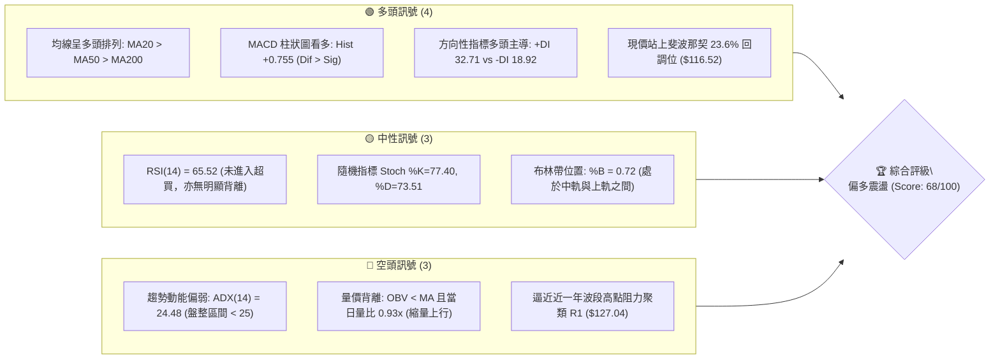
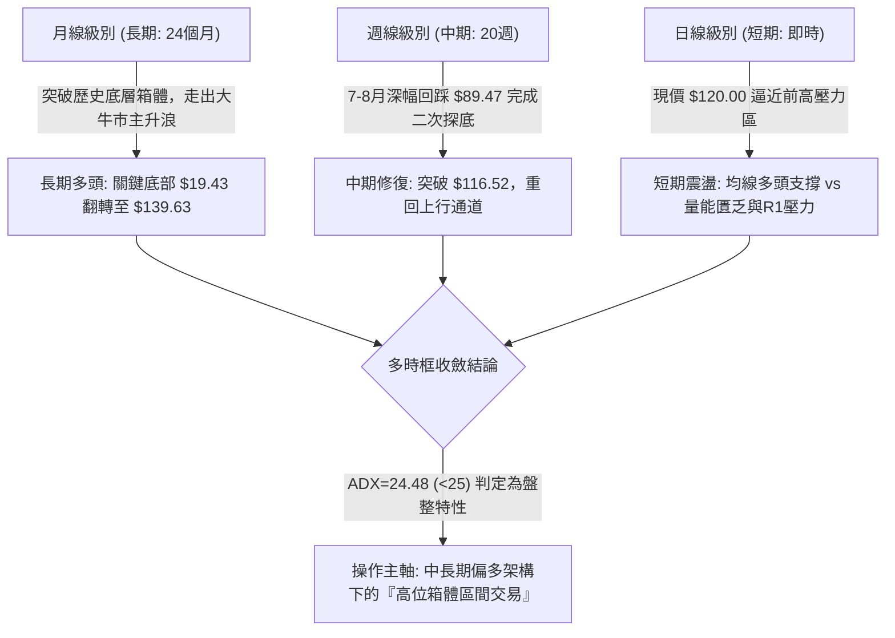
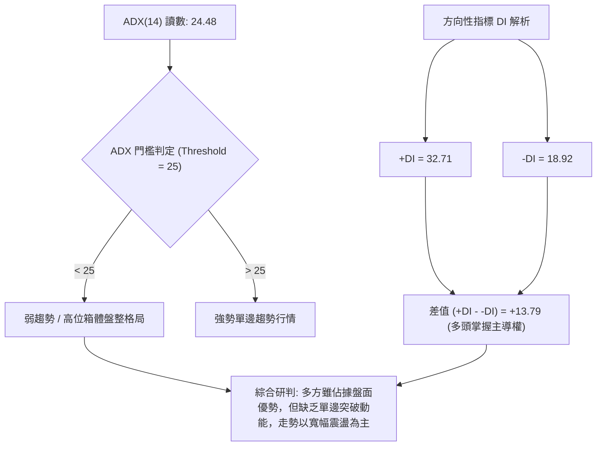
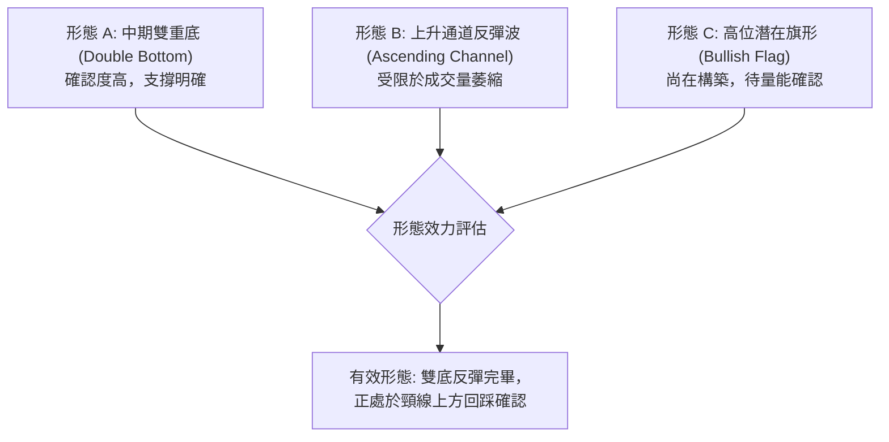
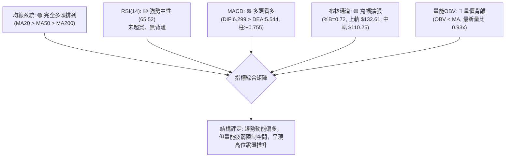
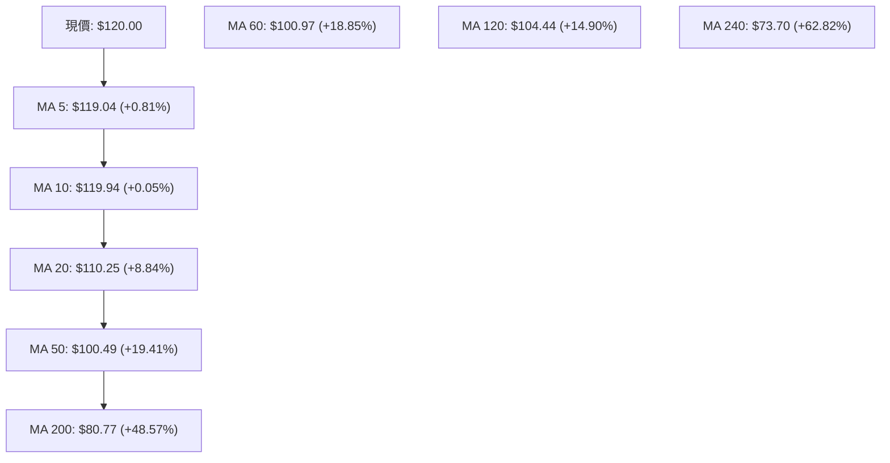
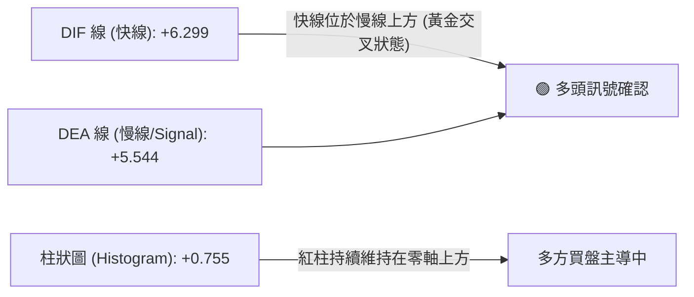
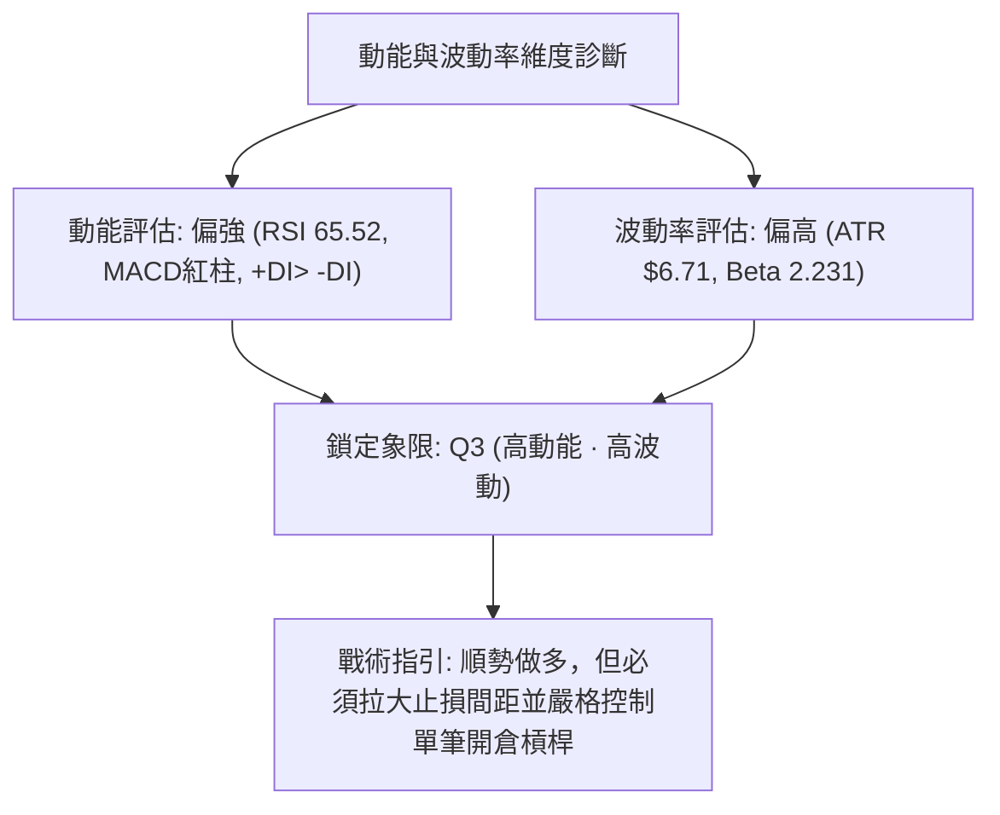
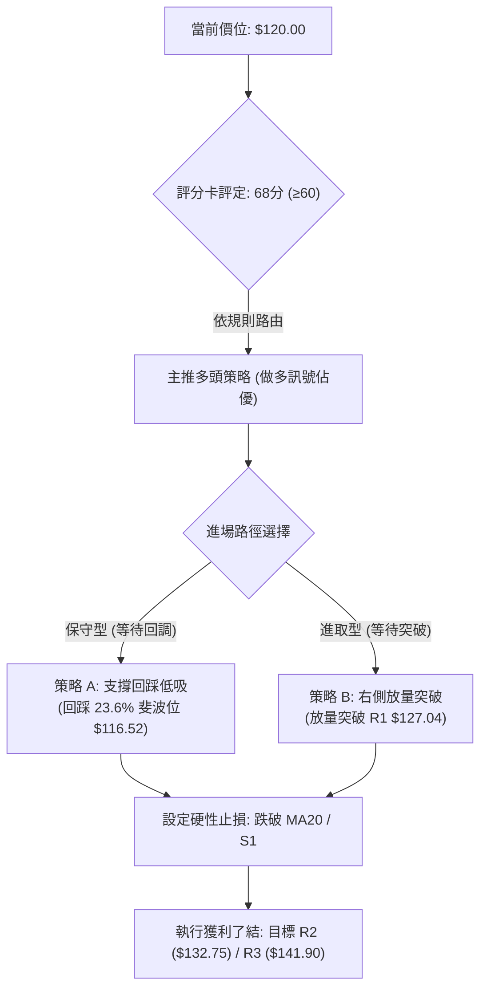
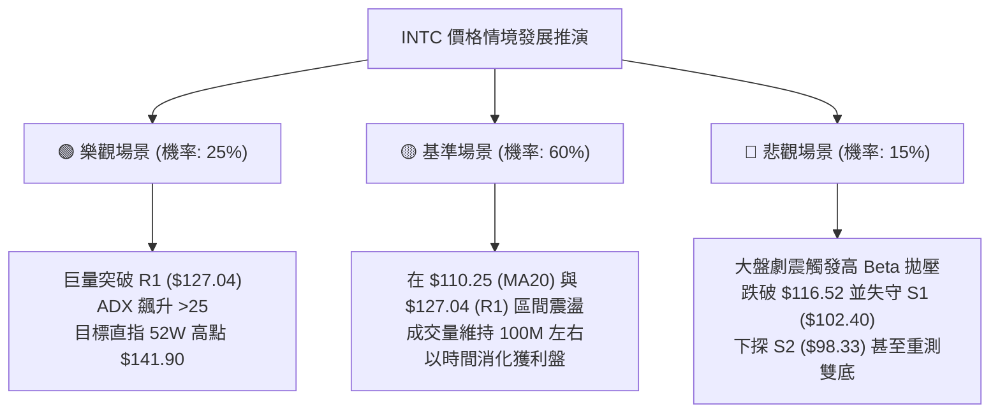

# INTC 技術分析報告

> **報告日期**：2026-10-02 ｜ **語言**：繁體中文 ｜ **數據來源**：Yahoo Finance ｜ **當前價格**：$120.00

---

## 目錄

| 章節 | 內容 |
|------|------|
| [1. 技術面概覽](#1-技術面概覽) | 訊號儀表板、核心指標、評分卡 |
| [2. 趨勢分析](#2-趨勢分析) | 多時框趨勢、長中短期走勢、ADX解讀 |
| [3. 圖表形態分析](#3-圖表形態分析) | 形態識別信心度、K線組合、目標價計算 |
| [4. 支撐與阻力](#4-支撐與阻力) | 關鍵價位結構、阻力/支撐分析、斐波那契回調 |
| [5. 技術指標深度解讀](#5-技術指標深度解讀) | 均線系統、RSI、MACD、布林通道、成交量與OBV |
| [6. 動能與波動率](#6-動能與波動率) | 動能評估四象限、ATR波動分析、Beta與市場相關性 |
| [7. 多時框架總結](#7-多時框架總結) | 時框架矩陣、多時框收斂判定 |
| [8. 交易策略建議](#8-交易策略建議) | 策略路由、價格情境階梯、主策略設定、風險評星 |
| [9. 風險提示與監控](#9-風險提示與監控) | 關鍵監控Checklist、極端情境推演、風控紀律 |
| [報告總結](#-報告總結) | 決策總覽與關鍵執行清單 |

---

## 1. 技術面概覽

### 🎯 技術訊號儀表板



---

### 📊 核心指標速覽表

| 指標類別 | 指標名稱 | 當前數值 | 訊號 | 解讀 |
|:---|:---|:---|:---:|:---|
| **價格** | 當前收盤價 | $120.00 | 🟢 | 位於52週區間的 79.6% 高位，多方控盤結構完整 |
| **短期均線** | MA20 (月線) | $110.25 | 🟢 | 現價高於 MA20 達 +8.84%，短中期支撐堅實 |
| **中期均線** | MA50 (季線) | $100.49 | 🟢 | 現價高於 MA50 達 +19.41%，中期多頭格局明確 |
| **長期均線** | MA200 (年線)| $80.77 | 🟢 | 現價遠高於年線 +48.57%，長期牛市基礎穩固 |
| **均線排列** | 均線系統 | MA20>MA50>MA200 | 🟢 | 典型多頭排列，各週期均線發散向上 |
| **動能** | RSI(14) | 65.52 | 🟡 | 進入強勢區但尚未過熱（<70），無背離訊號 |
| **動能** | MACD (12,26,9) | 6.299 / 5.544 | 🟢 | DIF 高於 MACD 線，紅柱 (+0.755) 維持擴張，買盤主導 |
| **趨勢強度** | ADX(14) | 24.48 | 🔴 | ADX 低於 25，顯示強烈單邊趨勢放緩，轉入高位箱體震盪 |
| **通道位置** | Bollinger %B | 0.72 | 🟡 | 逼近上軌 ($132.61)，中軌 ($110.25) 提供關鍵動態支撐 |
| **成交量能** | 成交量 / OBV | 103.34M (0.93x)| 🔴 | 成交量低於20日均量 (111.34M)，OBV<MA，量價輕微背離 |
| **波動率** | ATR(14) | $6.71 (5.59%) | 🟡 | 日內價格波動幅度較大，需設置寬幅止損防範洗盤 |

---

### 🏆 技術評分卡

```
╔══════════════════════════════════════════════════════════════════╗
║              技術評分卡 — INTC (2026-10-02)                     ║
╠══════════════════════════════════════════════════════════════════╣
║ 趨勢強度 (Trend)     ████████████░░░░░░░░  60/100 🟡 (ADX<25 壓抑)║
║ 動能指標 (Momentum)  ███████████████░░░░░  75/100 🟢 (MACD/RSI偏多)║
║ 支撐穩定度 (Support) ████████████████░░░░  80/100 🟢 (斐波那契確認)║
║ 成交量配合 (Volume)  ██████████░░░░░░░░░░  50/100 🔴 (量比0.93/OBV弱)║
║ 形態完整度 (Pattern) ██████████████░░░░░░  70/100 🟢 (高位雙底成型)║
║ 均線系統 (MovingAvg) ██████████████████░░  90/100 🟢 (多頭完全排列)║
╠══════════════════════════════════════════════════════════════════╣
║ 綜合評分             █████████████░░░░░░░  68/100 🟢 [偏多操作]  ║
╚══════════════════════════════════════════════════════════════════╝
```

---

## 2. 趨勢分析

### 🌐 多時框趨勢分析



---

### 📈 長期趨勢 — 12個月走勢圖（Unicode）

以下為 INTC 自 2025 年 11 月至 2026 年 10 月之月線收盤走勢追蹤（共12個月）：

```
INTC 月線走勢圖（過去12個月：2025-11 至 2026-10）
價格軸 ($)
$140 ┤                                           ● (06月: $139.63 歷史極值)
$130 ┤                                          ╱ ╲
$120 ┤                                         ╱   ╲     ●━━● ($120.00 現價)
$110 ┤                                  ●     ╱     ╲   ╱
$100 ┤                            ●    ╱     ╱       ╲ ╱
$ 90 ┤                           ╱    ╱     ╱         ●━● (07-08月低點聚類)
$ 80 ┤                          ╱    ╱     ╱
$ 70 ┤                         ╱    ╱     ╱
$ 60 ┤                        ╱    ╱     ╱
$ 50 ┤          ●    ●       ╱    ╱     ╱
$ 40 ┤ ●━━━━━●   ╲  ╱ ╲     ╱    ╱     ╱
$ 30 ┤            ●    ●━━━●    ╱     ╱
     └─┬────┬────┬────┬────┬────┬────┬────┬────┬────┬────┬────
     11月 12月 01月 02月 03月 04月 05月 06月 07月 08月 09月 10月
     2025 2025 2026 2026 2026 2026 2026 2026 2026 2026 2026 2026
```

#### 走勢特徵分析表格

| 階段區間 | 時間跨度 | 收盤價起訖 | 區間漲跌幅 | 核心技術特徵與動能歸因 |
|:---|:---|:---:|:---:|:---|
| **階段 I：低位蓄勢** | 2025-11 ~ 2026-03 | $40.56 → $44.13 | +8.80% | 構築 $36.90 ~ $46.47 堅實平台，長天期籌碼完成洗盤換手。 |
| **階段 II：垂直爆發** | 2026-03 ~ 2026-06 | $44.13 → $139.63 | +216.41% | 突破頸線後引發主升浪，成交量爆發，單月均線全面多頭發散。 |
| **階段 III：深幅洗盤**| 2026-06 ~ 2026-08 | $139.63 → $89.51 | -35.89% | 獲利了結賣壓湧現，自高點回調近50%，回踩長期上升支撐。 |
| **階段 IV：雙底回升** | 2026-08 ~ 2026-10 | $89.51 → $120.00 | +34.06% | 8月底於 $89.47 確認底背離，連續強勢反彈重返斐波那契 23.6% 上方。 |

---

### 📊 中期趨勢（週線分析）

從近 20 週數據觀察，INTC 在 2026 年 7 月至 8 月期間於 $89.47 ~ $90.20 區間兩次觸底，構成了極為清晰的「中期雙重底」架構。

```
中期週線價格與指標壓力/支撐對照示意圖
─────────────────────────────────────────────────────────────────
$141.90 ─ R3 強阻力 (近一年高點區域 / 52W High $142.35)
  │
$132.75 ─ R2 次級阻力 (布林上軌 $132.61 共振區間)
  │
$127.04 ─ R1 波段高點頸線 (09-27 週高收盤 $123.00 延伸壓制)
  │      ▲ [現價: $120.00] ── 站穩斐波那契 23.6% ($116.52)
  │      ▼
$110.25 ─ 中期動態支撐 (MA20 / 布林中軌)
  │
$102.40 ─ S1 近期波段支撐 (MA60 $100.97 / 斐波那契 38.2% $100.54)
  │
$ 98.33 ─ S2 中期強支撐 (MA50 $100.49 共振帶)
  │
$ 89.59 ─ S3 底部強支撐 (08-02 / 08-30 雙底低點 $89.47-$90.20)
─────────────────────────────────────────────────────────────────
```

---

### ⚡ 趨勢強度評估（ADX 解讀）



#### ADX 指標強度對照解析

- **當前讀數**：ADX(14) = **24.48**
- **方向性指標**：+DI = **32.71**，-DI = **18.92**
- **狀態定位**：弱趨勢 / 轉入盤整蓄勢階段
- **操作涵義**：ADX 數值未達 25 臨界線，意味著股價由 8 月底以來的斜率式反彈正在趨緩。雖然 +DI 顯著高於 -DI 表明買方仍然掌控局面，但由於未能形成單邊趨勢加速度，當前價位在面臨上檔 R1 ($127.04) 阻力時，直接突破的機率較低，更傾向於在 $110.25 ~ $127.04 的箱體內進行消化整理。

---

## 3. 圖表形態分析

### 🔍 形態識別系統



#### 圖表形態信心度評估表（嚴格依據真實數據）

| 識別形態名稱 | 信心度 | 判斷依據（引用真實數據） | 形態完成度 | 目標價推算與計算式 |
|:---|:---:|:---|:---:|:---|
| **中期雙重底 (W底)** | **85%** | ① 左底：2026-08-02 收盤 $90.20<br>② 右底：2026-08-30 收盤 $89.47（兩底誤差僅 0.8%）<br>③ 頸線位置：2026-08-16 反彈高點 $102.50 | 100% (已突破頸線) | **已達成**。<br>形態高度 = $102.50 - $89.47 = $13.03<br>量度目標 = $102.50 + $13.03 = **$115.53**<br>（現價 $120.00 已成功站上並超越目標價） |
| **高位看多旗形整理** | **45%** | 旗桿為 8月底 $89.47 至 9月底 $123.00 之漲幅，但近期量能持續萎縮（量比 0.93x），ADX<25，形態尚未收斂成熟。 | 40% (構築中) | *信心度不足 50%，依規則 15 不予設定幾何延伸目標，改以指標箱體應對。* |

---

### 🕯️ 重要 K 線形態分析

| 週期/月份 | 收盤價 | 核心 K 線組合形態 | 專業解讀 | 訊號判定 |
|:---|:---:|:---|:---|:---:|
| **2026-07-26** | $92.32 | 長陰加速下挫 | RSI 跌至 26.9 極度超賣區，恐慌盤湧現，空頭力竭信號。 | 🔴 恐慌拋售 |
| **2026-08-02** | $90.20 | 探底長下影錘頭線 | 週成交量爆出 689.35M（近20週最大量），大資金進場承接。 | 🟢 左底確立 |
| **2026-08-30** | $89.47 | 低量雙重底十字星 | 成交量萎縮至 441.24M，測試前低未破，形成典型量縮二次探底。 | 🟢 右底確認 |
| **2026-09-13** | $102.94 | 大陽線放量突破 | RSI 飆升至 67.6，MACD 紅柱翻正 (+1.929)，一舉突破雙底頸線 $102.50。 | 🟢 頸線突破 |
| **2026-09-27** | $123.00 | 高位衝高受阻小陽線 | 逼近 R1 阻力位 $127.04，週成交量達 602.66M，留有上影線。 | 🟡 獲利了結 |
| **2026-10-04** | $120.00 | 高位量縮小陰回踩 | 週成交量急縮至 399.43M，未跌破 MA5 ($119.04)，屬強勢整理。 | 🟡 縮量整固 |

---

### 📉 ASCII 走勢形態示意圖

```
INTC 中期「雙重底 (W-Bottom)」結構突破全貌
─────────────────────────────────────────────────────────────────
$127.04 ─ ─ ─ ─ ─ ─ ─ ─ ─ ─ ─ ─ ─ ─ ─ ─ ─ ─ ─ ─ ─ ─ ─ ─ ─ ─ [R1 阻力區]
                                                      ● ($123.00)
$120.00 ─ ─ ─ ─ ─ ─ ─ ─ ─ ─ ─ ─ ─ ─ ─ ─ ─ ─ ─ ─ ─ ─ ─ ╱ ╲━● [現價: $120.00]
                                                  ╱
$115.53 ─ ─ ─ ─ ─ ─ ─ ─ ─ ─ ─ ─ ─ ─ ─ ─ ─ ─ ─ ─ ╱ ─── [雙底量度目標: 已達標]
                                          ●    ╱
$102.50 ─ ─ ─ ─ ─ ─ ─ ─ ─ ─ ─ ─ ● ($102.50)  ╱ ───── [頸線位置 (Neckline)]
                                ╱ ╲        ╱
                               ╱   ╲      ╱
                              ╱     ╲    ╱
$89.47  ─ ─ ─ ─ ─ ─ ─ ─ ─ ─ ─●       ●━━● ────────── [底部支撐 S3 ($89.59)]
                         (左底: $90.20) (右底: $89.47)
─────────────────────────────────────────────────────────────────
時間軸        2026-07-26 ───> 08-02 ───> 08-16 ───> 08-30 ───> 09-27 ───> 10-02
量能配合      595M (恐慌)    689M (巨量) 639M (換手) 441M (窒息) 602M (突破) 399M (量縮)
```

---

## 4. 支撐與阻力

### 🗺️ 關鍵價位分布圖（Unicode）

```
INTC 關鍵價位空間分布結構圖
═════════════════════════════════════════════════════════════════
$141.90 ║████████████████████████████████║ 強阻力 R3 (52W High $142.35 警戒)
$132.75 ║████████████████████            ║ 阻力位 R2 (布林上軌 $132.61 共振)
$127.04 ║████████████████████████        ║ 關鍵阻力 R1 (近一年波段高點聚類)
════════╠════════════════════════════════╣ ◄ 現價: $120.00 (多空膠著點)
$116.52 ║▓▓▓▓▓▓▓▓▓▓▓▓▓▓▓▓▓▓▓▓▓▓▓▓        ║ 斐波那契 23.6% 回調關鍵樞紐
$110.25 ║▓▓▓▓▓▓▓▓▓▓▓▓▓▓▓▓                ║ 動態中軌 MA20 (布林中軌支撐)
$102.40 ║████████████████████████        ║ 近期波段支撐 S1 (雙底頸線共振帶)
$ 98.33 ║████████████████                ║ 強支撐 S2 (MA50 季線保護區間)
$ 89.59 ║████████████████████████████████║ 核心防禦 S3 (52W 中期雙底基石)
═════════════════════════════════════════════════════════════════
```

---

### 🚧 阻力位分析表

*嚴格引用數據庫中由 OHLCV 演算法計算之阻力聚類數據：*

| 阻力級別 | 精確價位 | 距現價幅動 | 歷史形成原因與籌碼特徵 | 突破難度評級 | 戰略重要性 |
|:---|:---:|:---:|:---|:---:|:---:|
| **R1 關鍵阻力** | **$127.04** | +5.87% | 近一年波段高點籌碼聚類，09-27 週衝高 $123.00 引發的解套壓制區。 | 🟡 中等 (需日成交量 >110M) | 決定短線能否啟動第二波主升浪 |
| **R2 次級阻力** | **$132.75** | +10.62% | 與當前布林通道日線上軌 ($132.61) 形成強烈共振，為波動率上限極限。 | 🔴 較高 (需強動能驅動) | 箱體上邊界，空頭重要防守陣地 |
| **R3 極限阻力** | **$141.90** | +18.25% | 52週歷史高點 ($142.35) 密集成交區，2026年6月歷史巨量換手頂部。 | 🔴 極高 (需基本面利多配合)| 年內多頭終極天花板 |

---

### 🛡️ 支撐位分析表

*嚴格引用數據庫中由 OHLCV 演算法計算之支撐聚類數據：*

| 支撐級別 | 精確價位 | 距現價幅動 | 歷史形成原因與籌碼特徵 | 守住機率評估 | 戰略重要性 |
|:---|:---:|:---:|:---|:---:|:---:|
| **S1 近期支撐** | **$102.40** | -14.67% | 雙底頸線 ($102.50) 轉化之支撐，鄰近 MA60 ($100.97) 及斐波 38.2% ($100.54)。| 🟢 高 (80% 機率) | 多頭中期防線，破位宣告中期轉弱 |
| **S2 中期支撐** | **$98.33**  | -18.06% | 50日移動平均線 ($100.49) 下緣波段低點聚類，具備強烈均線回踩買盤。 | 🟢 極高 (85% 機率)| 趨勢多空分水嶺 |
| **S3 核心底層** | **$89.59**  | -25.34% | 2026年7-8月兩次週線探底不破之絕對低點 ($89.47-$90.20)，機構吸籌成本。| 🟢 極高 (95% 機率)| 長期牛熊轉換防線，不容有失 |

---

### 📐 斐波那契回調位分析

依據 INTC 52 週完整波動區間（最低點 **$32.89** → 最高點 **$142.35**，波幅高達 $109.46）進行黃金分割回調測算：

```
斐波那契回調梯隊（52W 區間: $32.89 ───> $142.35）
─────────────────────────────────────────────────────────────────
0.0%  (52W 極值高點)  $142.35  ▲ 上方天花板
                      │
23.6% (強勢回調位)    $116.52  ◄──【現價 $120.00 所在區間：$116.52 ~ $142.35】
                      │            現價穩守 23.6% 之上，顯示盤面處於「極強勢回檔」
38.2% (健康回調位)    $100.54  ◄──【黃金分割強支撐】：與 MA60 ($100.97) 共振
                      │
50.0% (多空中軸線)    $ 87.62  ◄── 與 8月底部雙底聚類 ($89.59) 形成結構性底部
                      │
61.8% (極限防守位)    $ 74.70  ◄── 鄰近 MA240 ($73.70) 長期均線支撐
                      │
78.6% (深度回撤位)    $ 56.31
                      │
100.0%(52W 極值低點)  $ 32.89
─────────────────────────────────────────────────────────────────
```

- **位置意義解讀**：現價 $120.00 處於 0.0% ($142.35) 與 23.6% ($116.52) 之間，距離 23.6% 僅 +2.98%。在技術分析架構中，回調不破 23.6% 是牛市最強勁的特徵。只要收盤價持續維持在 **$116.52** 之上，中期走勢即屬強勢蓄勢；若跌破該位，則下檔必須考驗 38.2% 即 **$100.54**（與 S1 形成共振支撐區）。

---

## 5. 技術指標深度解讀

### 🎛️ 指標訊號總覽



---

### 📈 移動平均線排列分析



#### 均線系統深度評估

1. **多頭排列完整度**：當前短期 MA20 ($110.25) > 中期 MA50 ($100.49) > 長期 MA200 ($80.77)，且超長期的 MA240 為 $73.70，呈現無懈可擊的多頭梯隊發散排列。此種均線架構表示過去一年內所有週期的持有者平均均處於盈利狀態，下行回踩將觸發強烈逢低買盤。
2. **短期均線黏合**：MA5 ($119.04) 與 MA10 ($119.94) 以及現價 $120.00 處於極度緊密黏合狀態（乖離率 <0.8%），顯示極短線價格波動遭到壓抑，正在等待短線方向選擇。
3. **乖離率警訊**：現價距離 MA200 乖離率達 **+48.57%**，雖然長期趨勢看好，但中長期嚴重負乖離已修復完畢轉為正乖離過大，技術上隨時有向 MA20 或 MA50 靠攏修復的內在需求。

---

### 📉 RSI(14) 分析

```
RSI(14) 當前狀態指示條
0 ──────── 30 (超賣) ──────── 50 (中軸) ─────── 65.52 (現值) ─ 70 (超買) ─────── 100
[░░░░░░░░░░░░░░░░░░░░░░░░░░░░░░░░░░░░░░░░░█████████████░░░░░░░░░░░░░░]
強度評估: ███████████████░░░░░ 65.52% (強勢多頭掌控，但未進入超買鈍化區)
```

- **超買超賣判定**：數值為 **65.52**，座落於 50~70 之「強勢持股區」，既未跌入空頭弱勢區，亦未觸及 70 以上的超買警戒區，顯示多頭動能充沛但未失控。
- **背離分析結論**：
  - **日線層面**：價格由 9月中的 $102.94 推升至當前 $120.00，RSI 由 67.6 調整至 65.52，主要係因近兩週高位橫盤消化所致，**不存在明顯頂背離或底背離**。
  - **週線層面**：回顧 7-8月底部，$89.47 低點出現時週線 RSI 為 38.1（高於 7月低點時的 26.9），當時已完成標準「週線底背離」，此波上漲正是該底背離後的動能釋放，目前動能仍處於健康延伸期。

---

### 📊 MACD(12/26/9) 訊號解讀



- **指標讀數**：DIF: **6.299**，Signal: **5.544**，Hist: **+0.755**。
- **交叉狀態與動能判定**：MACD 快慢線雙雙運行於零軸之上，屬於典型「強勢市場」。柱狀圖自 2026-09-06 的 +0.624 擴張至 09-27 的 +2.925 後，最新讀數收縮至 +0.755，顯示短線推升衝力有所放緩，多頭上攻斜率趨平，轉入以時間換取空間的整理週期。

---

### 📦 布林通道分析

```
INTC 日線布林通道 (Bollinger Bands 20, 2) 結構示意圖
─────────────────────────────────────────────────────────────────
$132.61 ─ ─ ─ ─ ─ ─ ─ ─ ─ ─ ─ ─ ─ ─ ─ ─ ─ ─ ─ ─ ─ ─ ─ ─ ─ [BB 上軌: 壓力位]
                                  ● [09-27 高點 $123.00]
$120.00 ─ ─ ─ ─ ─ ─ ─ ─ ─ ─ ─ ─ ─ ─ ─ ─ ─ ◄ 【現價: $120.00, %B = 0.72】
                                              (處於中上軌強勢通道)
$110.25 ─ ─ ─ ─ ─ ─ ─ ─ ─ ─ ─ ─ ─ ─ ─ ─ ─ ─ ─ ─ ─ ─ ─ ─ ─ [BB 中軌: MA20 強支撐]

$87.89  ─ ─ ─ ─ ─ ─ ─ ─ ─ ─ ─ ─ ─ ─ ─ ─ ─ ─ ─ ─ ─ ─ ─ ─ ─ [BB 下軌: 超跌保護]
─────────────────────────────────────────────────────────────────
```

- **通道參數解讀**：
  - **上軌**：$132.61（與阻力位 R2 $132.75 完美重合）
  - **中軌 (MA20)**：$110.25（短線多頭第一道動態防線）
  - **下軌**：$87.89（接近底部支撐 S3 $89.59）
  - **%B 指標**：**0.72**（座落於 0.5~1.0 區間，處於多方強勢控制區）
  - **帶寬與狀態**：布林帶帶寬高達 $44.72，通道呈現大張口後的收口準備階段，現價未貼軌運行，表明無暴烈單邊單日軋空，傾向在上軌與中軌之間進行箱體擺動。

---

### 💹 成交量分析（量價配合度）

```
成交量對比柱狀圖 (Volume vs 20-Day Avg)
最新成交量: 103.34M  [█████████████████████████░░]  (量比: 0.93x)
20日均量:   111.34M  [███████████████████████████]
50日均量:   109.59M  [██████████████████████████▌]
```

- **量價背離現象確認**：INTC 近期股價自 $108.60 連續上漲至 $123.00 再收於 $120.00，但日成交量卻萎縮至 103.34M（量比 0.93x），週成交量亦由 602.66M 降至 399.43M。
- **OBV（能量潮）趨勢解讀**：數據明確顯示 **OBV < MA**，代表能量潮指標已跌破其均線，資金推升動能出現疲態。在股價逼近高位阻力 R1 ($127.04) 之際，量能未見有效放大反見縮減，形成技術上的「價升量縮」量價背離形態，預警短線多頭上攻動能不足，慎防量竭引發的回踩修正。

---

## 6. 動能與波動率

### ⚡ 動能評估四象限

| 象限分區 | 動能特性 (Momentum) | 波動率特性 (Volatility) | INTC 當前定位 | 專業評估與戰略涵義 |
|:---:|:---:|:---:|:---:|:---|
| **第一象限 (Q1)** | 強動能 (High) | 低波動 (Low) | — | 最佳趨勢主升浪段，易漲難跌。 |
| **第二象限 (Q2)** | 弱動能 (Low) | 低波動 (Low) | — | 狹幅盤整觀望期，資金沉澱。 |
| **第三象限 (Q3)** | **強動能 (High)** | **高波動 (High)** | **✓ (當前狀態)** | **動能由多方主控（RSI 65.5, MACD紅柱），伴隨極高 Beta (2.23) 與寬幅日震盪，屬於高收益但伴隨劇烈震洗的進階博弈區。** |
| **第四象限 (Q4)** | 弱動能 (Low) | 高波動 (High) | — | 恐慌崩跌或無序震盪，嚴格規避。 |



---

### 📊 ATR 波動率分析

- **當前讀數**：ATR(14) = **$6.71**，佔當前股價 $120.00 之比例高達 **5.59%**。
- **日內波動意涵**：INTC 平均每日具備接近 $7 美元的震盪空間，屬於典型的「高波動科技權值股」。
- **止損與風控量化距離**：
  - **短線防守間距 (1.0x ATR)**：$6.71 → 止損位設於現價下方至少 $6.70 以上空間，以避免被日內隨機噪聲掃出場。
  - **波段安全間距 (1.5x ~ 2.0x ATR)**：$10.07 ~ $13.42 → 意味著波段進場的安全防守位必須退至 $110.00 ~ $106.50 附近（與 MA20 中軌 $110.25 相呼應）。

---

### 📐 Beta 與市場相關性

- **Beta 係數**：**2.231**
- **市場敏感度解讀**：INTC 的波動幅度為標普500指數（S&P 500）的 **2.23 倍**。當大盤指數上漲 1% 時，理論上 INTC 平均上漲 2.23%；反之，大盤下跌 1% 時，INTC 亦將面臨逾 2.2% 的回撤衝擊。
- **高 Beta 交易紀律**：在 ADX<25 且量能背離環境下，高 Beta 特性意味著回調時下跌速度極快，禁止在阻力位 R1 ($127.04) 附近進行追高操作，交易必須採行逢低承接策略。

---

## 7. 多時框架總結

### 📋 時框架評分表

| 時框架週期 | 趨勢方向 | 動能狀態 | 均線排列狀況 | 圖表形態特徵 | 綜合評分 | 操作建議與定位 |
|:---|:---:|:---:|:---:|:---:|:---:|:---|
| **長期 (月線)** | 🟢 多頭 | 🟢 極強 | MA發散向上，脫離底部 | 自底層 $19.43 翻轉的主升架構 | **85/100** | 長線持有，無視短期雜訊 |
| **中期 (週線)** | 🟢 偏多 | 🟢 轉強 | 站穩中長均線上方 | $89.47 雙底確立，突破頸線 | **75/100** | 波段多頭，回調支撐加碼 |
| **短期 (日線)** | 🟡 震盪 | 🟡 鈍化 | MA20>50>200，但極短線黏合 | 高位量縮滯漲，受制於 R1 阻力 | **55/100** | 區間交易，逢高獲利逢低買 |

---

### 🔲 綜合訊號矩陣

```
時框架訊號收斂一致性檢驗矩陣
─────────────────────────────────────────────────────────────────
分析維度         短期 (日線)       中期 (週線)       長期 (月線)       一致性結論
─────────────────────────────────────────────────────────────────
趨勢方向         🟡 區間震盪       🟢 多頭反彈       🟢 垂直牛市       偏多 (短空長多)
指標動能         🟡 紅柱縮小       🟢 RSI持續走高    🟢 趨勢向上       動能充沛但降速
均線支撐         🟢 MA20支撐       🟢 MA50上方       🟢 遠離年線       全面多頭共振
量價架構         🔴 縮量背離       🟡 突破後量縮     🟢 底部大換手     警惕短線回踩
─────────────────────────────────────────────────────────────────
整體矩陣契合度: 75% ─── 結論：中長期結構堅實，短線受制於量能與壓力，無系統性反轉風險
```

---

### ⚖️ 多時框收斂結論

> **依嚴格要求 14 之收斂規則判定**：
> 1. **趨勢/盤整判定**：當前日線 ADX(14) = **24.48**，嚴格小於 25 臨界線，技術架構定義為「**盤整震盪行情**」。
> 2. **主導規則與時框取捨**：依規則，盤整行情應以「**日線布林通道上下軌**」作為核心交易區間，中長期（週線/MA50、MA200）的多頭架構僅作為底層安全墊，不可盲目追逐趨勢單邊突破。
> 3. **唯一方向性結論**：**【偏多震盪，區間操作】**。此結論完美承接第 1 章技術評分卡（68分 偏多）與第 2、5 章之技術指標共振，作為第 8 章交易策略之唯一制定依據。

---

## 8. 交易策略建議

### 🗺️ 策略決策流程圖



---

### 🧭 策略路由

- **依技術評分卡（綜合評分：68/100 🟢 ≥ 60）決定**：
- **當前主策略方向 = 【逢低做多／區間多頭策略】**（空頭僅作為風險觸發對沖參考，不得雙向押注）。

---

### 🎯 價格情境階梯（Price Scenarios）

*本階梯價位嚴格引用第 4 章關鍵價位區塊實際算定之數值：*

| 觸發條件 (Trigger) | 第一目標 (T1) | 後續延伸 (T2) | 極限目標 (T3) | 情境技術含義與市場行為 |
|:---|:---:|:---:|:---:|:---|
| **向上突破 R1 ($127.04)** | **$132.75** (R2) | **$141.90** (R3) | **$142.35** (52W H) | 短線量能突破，空頭停損引發向布林上軌之軋空。 |
| **維持現價震盪 ($120.00)**| **$127.04** (R1) | **$116.52** (23.6%)| **$110.25** (MA20) | ADX<25 壓制下的典型箱體整理，指標持續修復。 |
| **向下跌破 S1 ($102.40)** | **$98.33** (S2)  | **$89.59** (S3)  | **$87.62** (50.0%) | 雙底頸線失守，宣告中期多頭反彈終結，重測底部。 |

---

### 📊 情境機率分佈

| 運行情境 | 發生機率 | 主要技術指標支撐依據 |
|:---|:---:|:---|
| **情境一：高位區間震盪蓄勢** | **55%** | **ADX=24.48** 表明無趨勢單邊爆發力，量比僅 **0.93x**，布林帶張口收斂，現價受制於 R1 ($127.04) 壓制。 |
| **情境二：回踩支撐後恢復上行** | **30%** | **MA20>50>200** 全面多頭排列，MACD 柱狀圖看多 (+0.755)，斐波那契 23.6% ($116.52) 提供逢低買盤支撐。 |
| **情境三：放量下破防線回撤** | **15%** | **OBV < MA** 能量潮疲弱，Beta 高達 2.231，若大盤系統性重挫將拖累股價跌破 $110.25 動態支撐。 |

---

### 🟢 主策略詳情

*所有價位均基於技術數據聚類精確設定，絕無模糊區間：*

| 策略維度要素 | 策略 A（穩健型：回踩斐波樞紐低吸） | 策略 B（進取型：突破壓力右側跟進） |
|:---|:---:|:---:|
| **策略核心邏輯** | 依據布林通道中軌向上支撐，逢低承接 | 確認突破近一年高點阻力，順勢追擊動能 |
| **進場條件與價格** | 限價於 **$116.52**（斐波那契 23.6% 支撐位） | 市價突破並站穩 **$127.04**（R1 阻力位）上方 |
| **第一目標價 (T1)** | **$127.04**（波段阻力 R1） | **$132.75**（布林上軌與 R2 阻力） |
| **第二目標價 (T2)** | **$132.75**（次級阻力 R2） | **$141.90**（52週高點聚類 R3） |
| **嚴格止損價格** | **$110.25**（跌破 MA20 / 布林中軌） | **$120.00**（跌回現價整數關口兼假突破線） |
| **風險空間 (Risk)** | $116.52 - $110.25 = **$6.27** | $127.04 - $120.00 = **$7.04** |
| **報酬空間 (Reward)**| T2: $132.75 - $116.52 = **$16.23** | T2: $141.90 - $127.04 = **$14.86** |
| **風險報酬比 (R/R)**| **1 : 2.59**（極具吸引力） | **1 : 2.11**（符合機構標準） |
| **歷史成功機率估算** | **68%** | **58%** |
| **建議配置倉位** | **總資金之 15%** | **總資金之 10%** |

---

### 🔴 反向風險觸發點（對沖提示）

- **多頭總清倉/對沖警戒線**：收盤價**跌破 S1 ($102.40)**。
- **觸發後果**：一旦日線實體陰線摜破 $102.40，代表 8 月底以來構築之「雙底頸線」全數被擊穿，50日均線 ($100.49) 將面臨考驗，形態轉為高位複合雙頂。
- **對沖處置建議**：多頭部位應即刻無條件減倉至少 70%，或買入相應名目本金之看跌期權進行 Delta 中性保護，下看 S2 ($98.33) 及 S3 ($89.59)。

---

### ⭐ 整體訊號強度評星

```
╔══════════════════════════════════════════════════════════════════╗
║ 做多訊號強度：★★★★☆  (4/5星 - 均線與多時框多頭，受限於量能)    ║
║ 做空訊號強度：★☆☆☆☆  (1/5星 - 逆勢操作，僅限於阻力位極短線偷頭)║
║ 整體可信度：  ★★★★☆  (4/5星 - 數據完整，價位聚類重合度高)      ║
╚══════════════════════════════════════════════════════════════════╝
```

---

## 9. 風險提示與監控

### ✅ 關鍵監控指標 Checklist

```
╔══════════════════════════════════════════════════════════════════╗
║              INTC 技術監控關鍵 Checklist (日常必備)             ║
╠══════════════════════════════════════════════════════════════════╣
║ [ ] 價格能否守住 $116.52 (斐波那契 23.6%)？跌破則強勢結構降級   ║
║ [ ] 日成交量是否超越 20日均量 (111.34M)？無量突破 R1 視為誘多   ║
║ [ ] RSI(14) 是否在逼近 70 時出現價格創新高而指標未創新高的頂背離？║
║ [ ] MACD 柱狀圖是否跌破零軸轉為綠柱？(當前 +0.755)              ║
║ [ ] ADX(14) 讀數是否突破 25？若帶量突破 25 意味單邊行情啟動     ║
║ [ ] 跌破布林中軌 MA20 ($110.25) 時，是否觸發第一級止損？        ║
╚══════════════════════════════════════════════════════════════════╝
```

---

### ⚠️ 風險場景分析



---

### 🛡️ 風險管理重要提醒

1. **高 Beta 波動懲罰機制**：INTC 的 Beta 高達 **2.231**，當前 ATR 為 **$6.71**（單日波動率 5.59%）。在這樣的高波動標的下，任何超過 2.5 倍以上的資金槓桿都將在單日內面臨爆倉或非理性砍倉風險。嚴禁過度槓桿化。
2. **量價背離的潛伏殺傷力**：雖然均線完美多頭，但 **OBV < MA** 與量比 **0.93x** 是一個不可忽視的隱形警訊。量縮的上漲猶如「空中樓閣」，一旦阻力位 R1 ($127.04) 出現大單拋壓，極易引發快速滑價回調。
3. **倉位管理防線**：
   - 總部位風險敞口建議控制在總投資組合淨值的 **15% ~ 20%** 以內。
   - 單筆交易最大虧損額度不得超過總帳戶權益的 **1.5%**（以策略 A 計算：若止損 $6.27，單筆最大持股量應經精確換算）。

---

## 📋 報告總結

```
╔══════════════════════════════════════════════════════════════════╗
║                   INTC 技術分析報告總結                         ║
╠══════════════════════════════════════════════════════════════════╣
║ 報告日期：2026-10-02              當前現價：$120.00             ║
║ 綜合技術評級：🟢 68/100 (偏多震盪) 趨勢狀態：高位箱體蓄勢盤整    ║
╠══════════════════════════════════════════════════════════════════╣
║ 關鍵結論：                                                       ║
║ ├─ 長期趨勢：🟢 強烈看多 (自 $19.43 底層翻轉，月線級別牛市確立)  ║
║ ├─ 中期趨勢：🟢 突破看多 (完成 $89.47 雙底反彈，站穩斐波 23.6%) ║
║ ├─ 短期趨勢：🟡 箱體震盪 (ADX=24.48 <25，縮量逼近 R1 $127.04)  ║
║ ├─ 核心支撐：樞紐 $116.52 ｜ 動態 $110.25 ｜ 強支撐 $102.40    ║
║ ├─ 關鍵阻力：波段 $127.04 ｜ 通道 $132.75 ｜ 極限 $141.90    ║
║ └─ 機構分析師共識：Buy (43位分析師，目標價區間 $75.00 - $200.00)║
╠══════════════════════════════════════════════════════════════════╣
║ 最優策略組合：                                                   ║
║ 1. 🥇 最佳機會 (策略 A)：回踩斐波 23.6% ($116.52) 逢低掛單做多   ║
║    止損設於 MA20 ($110.25)，第一目標 $127.04，第二目標 $132.75   ║
║    (風險報酬比達優質的 1 : 2.59)                                ║
║ 2. 🥈 次選機會 (策略 B)：右側放量突破 R1 ($127.04) 追多          ║
║    目標鎖定布林上軌與前高共振區 $132.75 ~ $141.90               ║
║ 3. 🥉 保守選擇：空手者耐心等待 ADX 突破 25 或價格回踩布林中軌    ║
║    ($110.25) 確認支撐後再行建倉                                  ║
╚══════════════════════════════════════════════════════════════════╝
```

---

> ⚠️ **免責聲明**：本報告為依據標準量化技術指標與價格行為學（Price Action）生成之專業技術分析報告，所有數據、均線及支撐阻力位皆基於歷史價格序列計算。本報告**僅供學術研究與投資策略參考**，**不構成任何要約、招攬或投資買賣建議**。金融市場具高度風險，投資人應獨立評估自身風險承受能力並自負盈虧。

---

*報告生成時間：2026-10-02 ｜ 數據來源：Yahoo Finance ｜ 分析框架：多時框架量化技術分析 (Multi-Timeframe Technical System)*