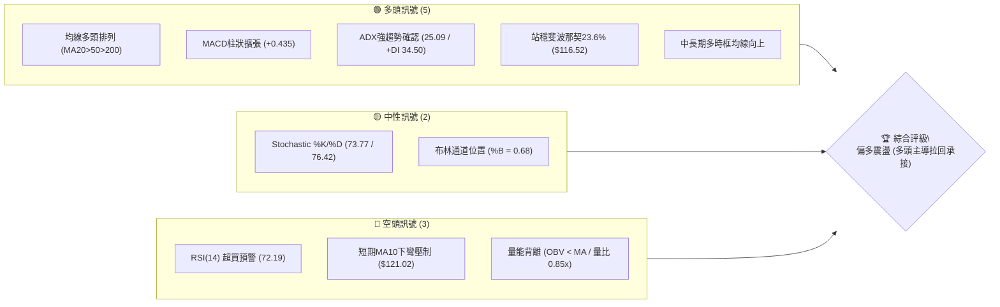
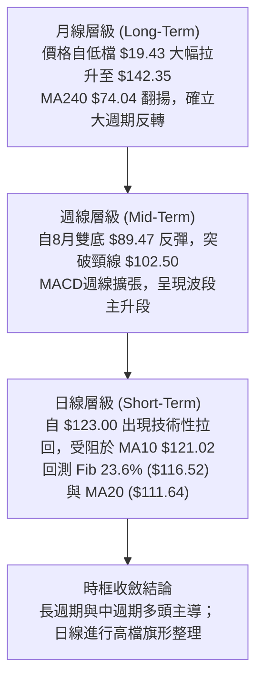
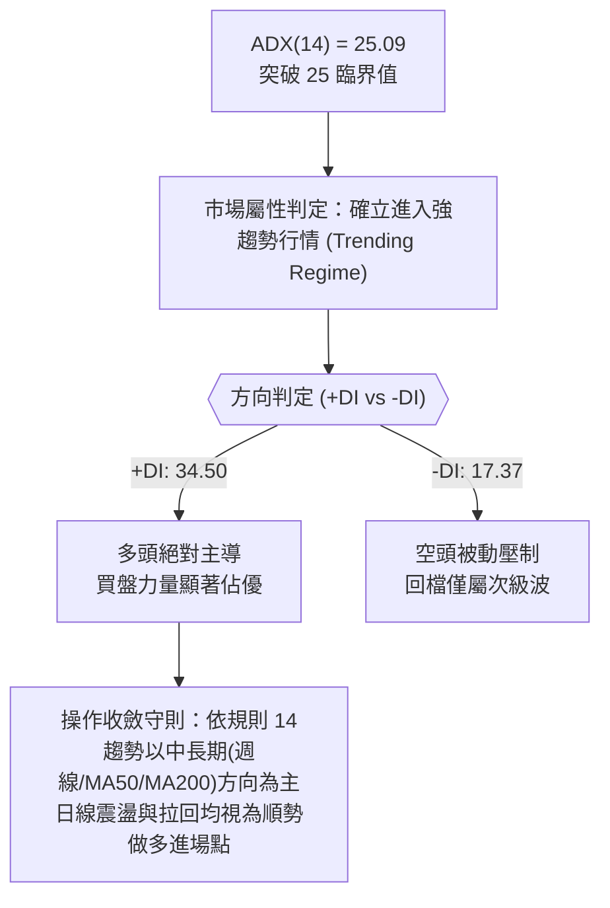
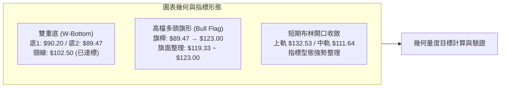
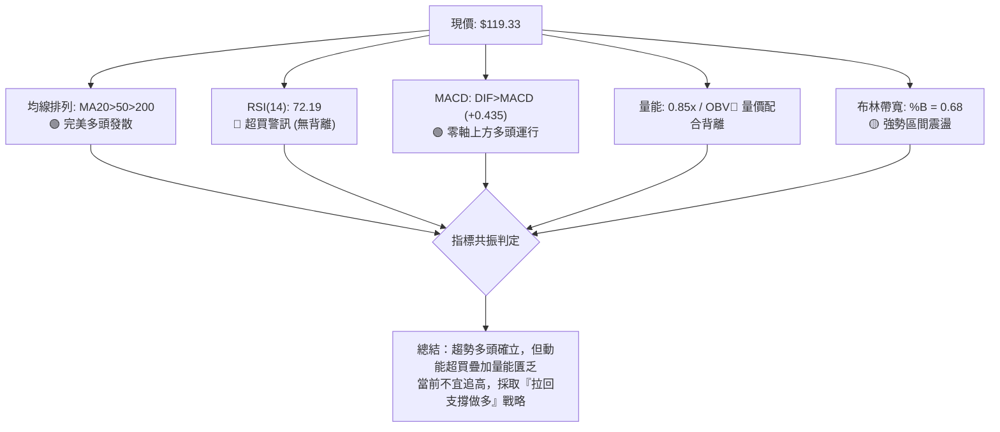
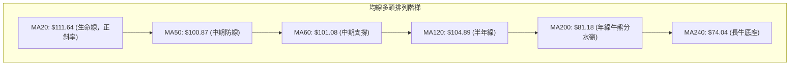
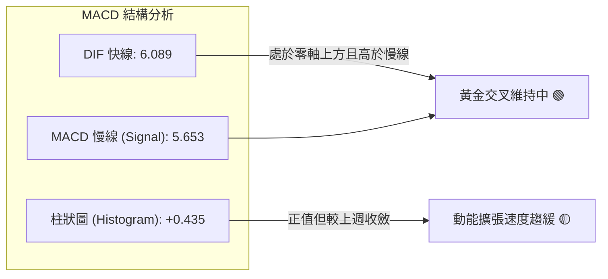
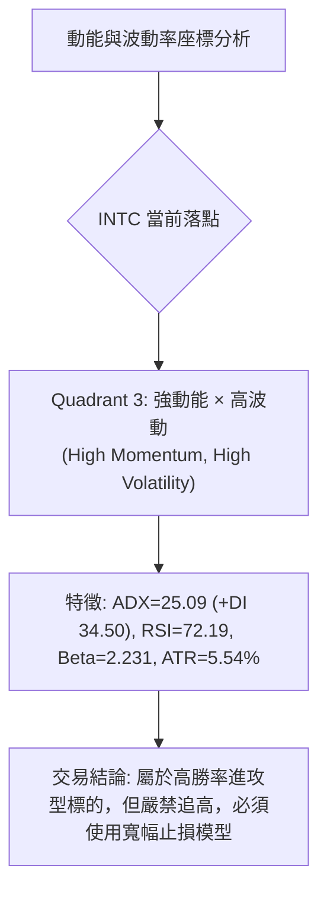
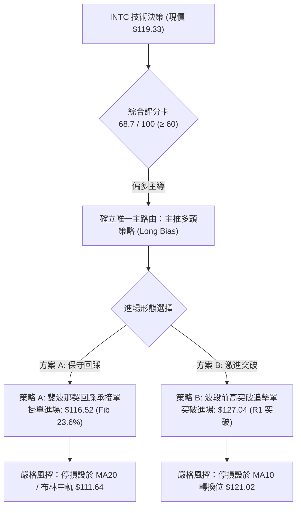
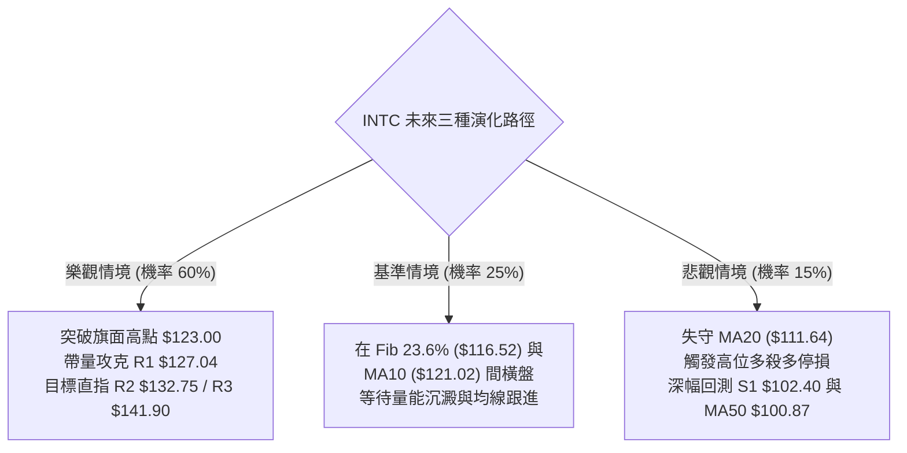

# INTC 技術分析報告

> **報告日期**：2026-10-03 ｜ **語言**：繁體中文 ｜ **數據來源**：Yahoo Finance ｜ **當前價格**：$119.33

---

## 目錄

| 章節 | 內容 |
|------|------|
| [1. 技術面概覽](#1-技術面概覽) | 訊號儀表板、核心指標、評分卡 |
| [2. 趨勢分析](#2-趨勢分析) | 多時框趨勢、長中短期走勢、ADX強度 |
| [3. 圖表形態分析](#3-圖表形態分析) | 形態識別、K線組合、目標價推算 |
| [4. 支撐與阻力](#4-支撐與阻力) | 關鍵價位結構、斐波那契回調聚類 |
| [5. 技術指標深度解讀](#5-技術指標深度解讀) | 均線系統、RSI、MACD、布林通道、OBV |
| [6. 動能與波動率](#6-動能與波動率) | 動能四象限、ATR止損模型、Beta相關性 |
| [7. 多時框架總結](#7-多時框架總結) | 時框架評分矩陣、多時框收斂判定 |
| [8. 交易策略建議](#8-交易策略建議) | 策略路由、情境階梯、風報比精算 |
| [9. 風險提示與監控](#9-風險提示與監控) | 監控Checklist、三行情境演化、風控守則 |
| [📋 報告總結](#-報告總結) | 總結儀表板與最優策略組合 |

---

## 1. 技術面概覽

### 🎯 技術訊號儀表板



### 📊 核心指標速覽表

| 指標類別 | 指標名稱 | 當前數值 | 訊號 | 解讀 |
|----------|----------|----------|------|------|
| **價格** | 現價收盤 | $119.33 | 🟢 | 位於52週區間79.0%高位，多頭強勢維持 |
| **均線** | 短期 MA5 | $118.30 | 🟢 | 現價位於MA5上方（+0.87%），短線維持反彈動能 |
| **均線** | 短期 MA10 | $121.02 | 🔴 | 現價跌破下彎MA10（-1.39%），短線存在回檔壓力 |
| **均線** | 基準 MA20 | $111.64 | 🟢 | 現價高於MA20（+6.89%），波段多頭生命線穩固 |
| **均線** | 中期 MA50 | $100.87 | 🟢 | 均線向上排列，中期趨勢多頭防線清晰 |
| **均線** | 長期 MA200 | $81.18 | 🟢 | 遠高於長期年線（+47.00%），長多基底紮實 |
| **動能** | RSI(14) | 72.19 | 🔴 | 進入超買區（>70），短線追價風險偏高 |
| **動能** | MACD (12,26,9) | 6.089 / 5.653 | 🟢 | DIF位於訊號線上方，柱狀圖正值（+0.435） |
| **動能** | KD(9,3,3) | 73.77 / 76.42 | 🟡 | 進入高位鈍化，%K微幅跌破%D產生初步死叉 |
| **趨勢** | ADX / ±DI | 25.09 / +DI 34.50 | 🟢 | ADX>25進入趨勢行情，+DI強烈主導多頭市場 |
| **通道** | 布林通道帶寬 | $90.74 ~ $132.53 | 🟡 | %B為0.68，運行於中軌與上軌間之強勢區 |
| **量能** | 20日均量比 | 0.85x | 🔴 | 成交量95.14M低於均量112.11M，量價配合不足 |
| **量能** | OBV能量潮 | OBV < MA | 🔴 | 資金進駐動能未同步創高，顯現量能疲弱背馳 |
| **波動** | ATR(14) | $6.61 | 🟡 | 佔現價5.54%，處於典型半導體高波動進攻態勢 |

### 🏆 技術評分卡

```
╔══════════════════════════════════════════════════════════════╗
║              技術評分卡 — INTC (2026-10-03)                  ║
╠══════════════════════════════════════════════════════════════╣
║ 趨勢強度 (ADX/+DI)    ███████████████░░░░░  76/100  🟢 強勢   ║
║ 動能指標 (RSI/MACD)   ████████████░░░░░░░░  62/100  🟡 偏強超買║
║ 支撐穩定度 (Fib/MA)   ██████████████░░░░░░  72/100  🟢 紮實   ║
║ 成交量配合 (OBV/VOL)  ████████░░░░░░░░░░░░  42/100  🔴 疲弱背離║
║ 形態完整度 (底型/旗形) ██████████████░░░░░░  70/100  🟢 突破延伸║
║ 均線排列 (MA多頭)     ██████████████████░░  90/100  🟢 完美排列║
╠══════════════════════════════════════════════════════════════╣
║ 綜合評分              ██████████████░░░░░░  68.7/100  🟢 偏多  ║
╚══════════════════════════════════════════════════════════════╝
```

---

## 2. 趨勢分析

### 🌐 多時框趨勢分析



### 📈 長期趨勢 — 12個月走勢圖（Unicode）

INTC 過去 12 個月經歷了由築底爆發、進入狂暴主升、再遇劇烈修正後二度上攻之波瀾壯闊走勢：

```
INTC 月線走勢圖（過去12個月：2025-11 至 2026-10）
價格軸 ($)
$142.35 ┤                                     ●(2026-06 高點 $139.63 / 52W $142.35)
$130.00 ┤                                    ╱ ╲
$120.00 ┤                                   ╱   ╲       ●←現價 $119.33 (2026-10)
$110.00 ┤                             ●    ╱     ╲     ╱
$100.00 ┤                            ╱    ╱       ╲   ╱
$90.00  ┤                      ●    ╱    ╱         ●─● (2026-07/08 低點 $90.20/$89.51)
$80.00  ┤                     ╱    ╱    ╱
$70.00  ┤                    ╱    ╱    ╱
$60.00  ┤                   ╱    ╱    ╱
$50.00  ┤             ●    ╱    ╱    ╱
$40.00  ┤●──●──●     ╱    ╱    ╱    ╱
$30.00  ┤      ╲    ╱    ╱    ╱    ╱
$20.00  ┴───────●───┴────┴────┴────┴────────────────────────
         11  12 01   02   03   04   05   06   07   08   09   10 (月份)
        (2025) └───────────── 2026 ──────────────┘
```

**走勢特徵分析表格**：

| 階段區間 | 起止價位 | 漲跌幅 | 趨勢性質 | 量價結構與特徵解讀 |
|----------|----------|--------|----------|-------------------|
| **2025-11 ~ 2026-01** | $40.56 → $46.47 | +14.57% | 築底盤整推升 | 底部平台緩步墊高，突破 $40.00 整理帶 |
| **2026-01 ~ 2026-03** | $46.47 → $44.13 | -5.03% | 突破前蓄勢 | 狹幅洗盤整理，成交量萎縮，沉澱獲利賣壓 |
| **2026-03 ~ 2026-06** | $44.13 → $139.63| +216.40%| 主升段暴力噴出 | 月線連續三根巨陽線，創下52週高點 $142.35 |
| **2026-06 ~ 2026-08** | $139.63 → $89.51| -35.89% | 劇烈均線修正 | 獲利了結盤湧出，最低回測至波段低點聚類 S3 $89.59 |
| **2026-08 ~ 2026-10** | $89.51 → $119.33| +33.31% | 次級主升反彈 | 自雙底強勢反彈，重新收復 MA20 與 Fib 23.6% |

### 📊 中期趨勢（週線分析）

從近 20 週收盤走勢觀察，自 2026-08-30 觸及週收盤低點 $89.47（與波段支撐 S3 $89.59 精確共振）後，INTC 連續拉出 4 根週陽線，週線 MACD 柱狀圖由負轉正並急速擴張至 +2.925（2026-09-27），隨後本週小幅回檔至 $119.33（柱狀圖微降至 +0.435）。

```
INTC 週線壓力與支撐示意圖
═══════════════════════════════════════════════════════════════
$142.35 ──┬── 52W 高點 / 0.0% Fib
          │   ▲
$132.75 ──┼── R2 阻力區 / 布林上軌 ($132.53)
          │   ▲
$127.04 ──┼── R1 波段反彈阻力位 
══════════╪════════════════════════════════════════════════════
$119.33 ──┼── 當前收盤價位 (位處強弱分水嶺上方)
══════════╪════════════════════════════════════════════════════
$116.52 ──┼── Fib 23.6% 核心回調支撐
          │   ▼
$111.64 ──┼── MA20 基準線 / 布林中軌
          │   ▼
$102.40 ──┴── S1 強支撐 / 前波頸線共振帶 ($102.50)
═══════════════════════════════════════════════════════════════
```

### ⚡ 趨勢強度評估（ADX 解讀）



| 指標變數 | 當前讀數 | 門檻區間 | 趨勢屬性判定 |
|----------|----------|----------|--------------|
| **ADX (14)** | **25.09** | > 25.00 | **強趨勢確立**（脫離無方向盤整期） |
| **+DI** | **34.50** | 顯著擴張 | 多頭攻勢推動力量強烈 |
| **-DI** | **17.37** | 持續受抑 | 空方動能無序，尚未構成實質拋壓 |
| **多空比差 (+DI - -DI)** | **+17.13** | > +15.00 | 典型單邊多頭主導架構 |

---

## 3. 圖表形態分析

### 🔍 形態識別系統



**形態信心度與幾何推算表格**：

| 形態類別 | 信心度 | 判斷依據（嚴格引用數據） | 完成度 | 目標價（附嚴謹幾何計算式） |
|----------|--------|--------------------------|--------|----------------------------|
| **雙重底 (W-Bottom)** | **85%** | 兩次波段低點落於 $90.20 (2026-08-02) 與 $89.47 (2026-08-30)，精確回踩 S3 ($89.59)；隨後於 2026-09-13 突破頸線高點 $102.50 (2026-08-16)。 | 100% (已達標) | 頸線 $102.50 + 形態高度 ($102.50 - $89.47 = $13.03) = **$115.53**。<br/>*現價 $119.33 已有效站上並完成量度目標。* |
| **高檔多頭旗形 (Bull Flag)** | **65%** | 自 $89.47 暴力拉升至 $123.00（旗桿長度 $33.53），隨後於 $119.33 至 $123.00 間進行量縮旗面整理，未跌破旗桿回調之 Fib 23.6% ($116.52)。 | 60% (醞釀中) | 突破旗面高點 $123.00 後啟動量度高度：<br/>突破點 $123.00 + 旗桿高度 $33.53 = **$156.53**。<br/>*(註：第一階段保守目標先看波段阻力 R3 $141.90 與 52W 高點 $142.35)。* |
| **均線黃金交叉與發散** | **90%** | 指標形態：MA20 ($111.64) > MA50 ($100.87) > MA200 ($81.18)，呈現典型標準多頭發散排列。 | 100% (進行中) | 均線保護支撐依序坐落於 $111.64 與 $100.87。 |

### 🕯️ 重要K線形態分析

| 週期/月份 | 收盤價 | K線形態特徵 | 結構技術解讀 | 多空訊號 |
|----------|--------|-------------|--------------|----------|
| **2026-06** | $139.63 | 衝高長上影陽線 | 觸及 52W 高點 $142.35 後主力多頭獲利解套，產生高檔阻力聚類 R3 ($141.90) | 🟡 高檔停滯 |
| **2026-07** | $90.20 | 長陰下挫大陰線 | 恐慌性殺跌摜破季線，直接回測波段低點 S3 ($89.59) 附近探底 | 🔴 空頭宣洩 |
| **2026-08** | $89.51 | 低檔十字星/長下影錘頭 | 連續兩月於 $89.50 水平獲得絕對支撐，形成雙底支撐底座 | 🟢 築底完成 |
| **2026-09** | $120.23 | 光頭大陽線 (+34.3%) | 帶量突破頸線 $102.50 與 Fib 38.2% ($100.54)，確立V型大反轉 | 🟢 強烈買進 |
| **2026-10 (當前)** | $119.33 | 高檔小陰星線 | 遭遇短期下彎 MA10 ($121.02) 壓制，呈現良性技術性旗面收斂 | 🟡 強勢整固 |

### 📉 ASCII 走勢形態示意圖

```
INTC 雙底突破與多頭旗形整理架構示意
價格 ($)
$123.00 ┤                     ┌─● (旗頂高點 $123.00)
$120.00 ┤                    ╱   ╲ ◄─── 現價 $119.33 (旗面震盪)
$116.52 ┤───────────────────╱─────┴─ (Fib 23.6% 防守線)
$110.00 ┤                  ╱
$102.50 ┤────頸線突破────● (2026-08-16 頸線 / S1 共振帶 $102.40)
        │               ╱  ╲
$90.00  ┤       ●──────┴────● (雙底支撐帶: 底1 $90.20 / 底2 $89.47 ≈ S3 $89.59)
        └───────┴───────────┴────────────────────────────────────► 時間
             2026-08-02  2026-08-30    2026-09        2026-10
```

### 🎯 形態目標價計算

1. **已實現形態：雙重底 (W-Bottom)**
   - 形態底部低點：$89.47
   - 形態頸線位置：$102.50
   - 垂直高度：$102.50 - $89.47 = $13.03
   - 最小量度目標價：$102.50 + $13.03 = **$115.53**（*市場已於 9 月底以 $123.00 達成並超額完成*）。

2. **發展中形態：高檔多頭旗形 (Bull Flag)**
   - 旗桿起點：$89.47
   - 旗桿終點：$123.00
   - 旗桿垂直高度：$123.00 - $89.47 = $33.53
   - 旗面支撐底限：Fib 23.6% 即 **$116.52**
   - 幾何量度完整目標：$123.00 + $33.53 = **$156.53**
   - 階梯式關鍵價位映射（嚴格引用系統計算）：
     - 第一波段阻力 R1：**$127.04**
     - 第二延伸阻力 R2：**$132.75**（與布林上軌 $132.53 高度共振）
     - 終極波段阻力 R3：**$141.90**（與 52W 高點 $142.35 共振）

---

## 4. 支撐與阻力

### 🗺️ 關鍵價位分布圖（Unicode）

```
INTC 價位結構分布圖 (Price Architecture)
═══════════════════════════════════════════════════════════════
$142.35 ║████████████████████████║ 52W 歷史最高點 / 0.0% Fib
$141.90 ║████████████████████████║ 強阻力 R3 (波段高點聚類)
$132.75 ║████████████████████░░░░║ 次級阻力 R2 (布林上軌 $132.53 壓制)
$127.04 ║████████████████░░░░░░░░║ 近期阻力 R1 (波段反彈前高)
$121.02 ║██████████░░░░░░░░░░░░░░║ 短線動態反壓 (MA10 均線)
════════╠════════════════════════╣ ◄── 現價 $119.33
$116.52 ║▓▓▓▓▓▓▓▓▓▓▓▓▓▓▓▓▓▓▓▓▓▓▓▓║ 第一道黃金回調支撐 (Fib 23.6%)
$111.64 ║▓▓▓▓▓▓▓▓▓▓▓▓▓▓▓▓▓▓░░░░░░║ 中期生命線支撐 (MA20 / 布林中軌)
$102.40 ║████████████████████████║ 核心波段強支撐 S1 (前頸線 $102.50)
$100.54 ║████████████████████░░░░║ 關鍵整數防守位 (Fib 38.2% / MA50 $100.87)
$98.33  ║████████████████░░░░░░░░║ 波段密集低點 S2
$89.59  ║████████████████████████║ 終極鐵底強支撐 S3 (波段雙底低點聚類)
═══════════════════════════════════════════════════════════════
```

### 🚧 阻力位分析表

所有價位均嚴格取自波段高點聚類計算值：

| 阻力級別 | 價位 | 距現價幅幅 | 形成原因與籌碼特徵 | 突破難度 | 重要性 |
|----------|------|------------|--------------------|----------|--------|
| **動態反壓** | **$121.02** | +1.42% | 短期 10 日均線（MA10 下彎），短線獲利盤壓制 | 🟡 中等 | ★★★☆☆ |
| **R1** | **$127.04** | +6.46% | 近一年波段高點聚類，前期急跌反彈之密集成交區 | 🟡 中等 | ★★★★☆ |
| **R2** | **$132.75** | +11.25% | 波段次高點聚類，與當前布林通道上軌（$132.53）完美共振 | 🔴 較高 | ★★★★☆ |
| **R3** | **$141.90** | +18.91% | 近一年波段歷史頂部密集區，逼近 52W 高點 $142.35 歷史套牢峰 | 🔴 極高 | ★★★★★ |

### 🛡️ 支撐位分析表

所有價位均嚴格取自波段低點聚類計算值：

| 支撐級別 | 價位 | 距現價跌幅 | 形成原因與籌碼特徵 | 守住機率 | 重要性 |
|----------|------|------------|--------------------|----------|--------|
| **動態支撐** | **$116.52** | -2.35% | 斐波那契 23.6% 黃金回調位，多頭旗形整理下緣 | 🟢 80% | ★★★★☆ |
| **基準支撐** | **$111.64** | -6.44% | 20日均線（MA20）與布林通道中軌共振，波段持股成本線 | 🟢 75% | ★★★★★ |
| **S1** | **$102.40** | -14.19% | 近一年波段低點聚類，與前波雙底突破頸線（$102.50）形成強烈支撐 | 🟢 85% | ★★★★★ |
| **S2** | **$98.33** | -17.60% | 波段低點聚類，緊鄰 Fib 38.2% ($100.54) 與 MA50 ($100.87) 保護層 | 🟢 90% | ★★★★☆ |
| **S3** | **$89.59** | -24.92% | 近一年絕對波段低點聚類（2026-08 雙底 $89.47/$90.20 所在處） | 🟢 95% | ★★★★★ |

### 📐 斐波那契回調位分析

依據 52 週絕對極值區間（低點 **$32.89** → 高點 **$142.35**，波幅總空間達 **$109.46**），精確計算之黃金分割架構如下：

```
0.0%  (52W High) ───────────────────────── $142.35  (終極歷史頂部)
                                           ▲
現價 $119.33 落於此區間 (強勢回調區)        │
                                           ▼
23.6% 回調位    ───────────────────────── $116.52  (現價第一防守支撐，距現價僅 -2.35%)
38.2% 回調位    ───────────────────────── $100.54  (多頭景氣榮枯分水嶺，與 MA50 $100.87 共振)
50.0% 回調位    ───────────────────────── $87.62   (多空均衡中軸，與雙底底座 S3 $89.59 呼應)
61.8% 黃金分割  ───────────────────────── $74.70   (深幅回檔極限，與 MA240 $74.04 完美重合)
78.6% 回調位    ───────────────────────── $56.31   (長期結構防守區)
100.0% (52W Low) ───────────────────────── $32.89   (波段起漲原點)
```

**斐波那契結構深度解讀**：
當前收盤價 **$119.33** 精確運行於 **0.0% ($142.35)** 與 **23.6% ($116.52)** 之間。在技術分析量化準則中，標的資產在暴漲後回檔若能始終守穩 23.6% 回調位上方，代表該市場處於**極端強勢的多頭推升格局（Super-Bullish Impulse Phase）**。下方 $116.52 具有強大的買盤承接力，若此處不破，多方隨時具備重啟攻勢、挑戰前高的能力。

---

## 5. 技術指標深度解讀

### 🎛️ 指標訊號總覽



### 📈 移動平均線排列分析



均線系統展現出高度一致的**多頭排列（Bullish Alignment）**。現價 $119.33 遠在 MA20 ($111.64)、MA50 ($100.87) 與 MA200 ($81.18) 之上：
- **微觀短線均線態勢**：MA5 目前處於 $118.30（現價在其上方 +0.87%），但 MA10 位於 $121.02（現價在其下方 -1.39%）。MA10 呈現單日 -1.68 的下彎斜率，這解釋了為何 INTC 近期在 $121.00 - $123.00 處遭遇短線解套賣壓，形成短空長多的均線收斂走勢。
- **長天期排列**：MA200 位於 $81.18，MA240 位於 $74.04，長期發散形態完整，代表長線籌碼沉澱徹底，任何大級別回檔均有強烈長線資金護盤。

### 📉 RSI(14) 分析

當前 RSI(14) 數值為 **72.19**，已跨入 70 以上之超買水準：

```
RSI(14) 強度尺規
0 ────── 30 ───────────── 50 ───────────── 70 ──── 72.19 ── 100
[ 超賣區 ]    [ 弱勢區 ]       [ 強勢區 ]   [ 超買警戒 ]  ▲ 當前位置
進度條: █████████████████████████████░░░░░░░░░░  72.19% (🔴 超買)
```

- **背離檢驗結論**：**無頂背離現象**。比對近期週線走勢，2026-09-20 收盤 $108.60 時 RSI 為 71.7；2026-09-27 價格創高至 $123.00 時 RSI 創出 71.8；當前價格回落至 $119.33，RSI 微幅報 72.19，動能高點與價格波段高點同步吻合，並未出現「價格創新高而 RSI 創次低」之經典頂背離。
- **指標意義**：RSI 位於 70-75 屬於「強者恆強」之高位強勢鈍化區，顯示買盤力量極強，但在超買狀態下隨時可能引發技術性乖離修正，不可於現價盲目市價追多。

### 📊 MACD(12/26/9) 訊號解讀



- 當前 DIF 線（6.089）與訊號線（5.653）皆運行於遠高於 0 軸的極強勢區間。
- 柱狀圖（Histogram）維持正值 **+0.435**，但若對照前一週（2026-09-27）的峰值 **+2.925**，柱體出現明顯萎縮。這代表多頭攻勢的「加速度」正在放緩，市場正由狂暴推升轉為高檔震盪整理。

### 📦 布林通道分析

```
INTC 日線布林通道 (Bollinger Bands, 20, 2)
═══════════════════════════════════════════════════════════════
$132.53 ────────────────────────────────── BB 上軌 (動態極限阻力)
             │
$119.33 ─────┼──────── ◄ 現價 (%B = 0.68，位於強勢發散區)
             │
$111.64 ─────┴──────────────────────────── BB 中軌 (MA20 生命線 / 關鍵防守)
             │
             │
$90.74  ────────────────────────────────── BB 下軌 (極端超賣支撐)
═══════════════════════════════════════════════════════════════
```

- **通道帶寬與位置**：帶寬範圍為 $90.74 至 $132.53，寬度高達 $41.79，反映近期高波動特性。
- **%B 指標解析**：當前 %B 數值為 **0.68**（0 代表下軌，0.5 代表中軌，1 代表上軌）。現價穩健運行於中軌（$111.64）與上軌（$132.53）上半段之「多頭攻擊巡航區」，並未觸及上軌極端過熱線（%B > 1.0），顯示上行空間並未被通道結構封死。

### 💹 成交量分析（量價配合度）

- **量能萎縮警訊**：最新單日成交量為 **95,139,500 股**，相較於 20 日均量（**112,112,985 股**），量比僅為 **0.85x**；亦低於 50 日均量（**108,678,192 股**）。
- **OBV 能量潮判斷**：數據明確提示 **OBV < MA → 量能疲弱**。在價格處於 52 週高檔 79% 水準且面臨 MA10 壓制時，OBV 低於均線顯示本波反彈主要由資產重估與空頭回補推動，場外增量資金在現價追價意願保守，呈現出明顯的**量價背離（Volume-Price Divergence）**隱憂，這是當前多頭最大的軟肋。

---

## 6. 動能與波動率

### ⚡ 動能評估四象限



| 象限分區 | 動能屬性 | 波動屬性 | 代表狀態 | INTC 落點判定與策略應對 |
|----------|----------|----------|----------|------------------------|
| **Q1** | 強動能 | 低波動 | 穩健主升波 | ❌ 暫非此狀態 |
| **Q2** | 弱動能 | 低波動 | 沉悶築底期 | ❌ 暫非此狀態 |
| **Q3** | **強動能** | **高波動** | **高風險高爆發** | **✓ 當前落點**：強多頭主導但日內震盪劇烈，適宜順勢逢低承接 |
| **Q4** | 弱動能 | 高波動 | 恐慌破位殺跌 | ❌ 暫非此狀態 |

### 📊 ATR 波動率分析

- **ATR(14) 絕對數值**：**$6.61**。
- **相對價格波動率**：佔現價 $119.33 的 **5.54%**。
- **止損距離動態量化指針**：
  - *1.0 倍 ATR*：$6.61（日內正常洗盤波動範圍）
  - *1.5 倍 ATR（短線防守閾值）*：$6.61 × 1.5 = **$9.92**。以現價 $119.33 計，短線波動止損需設於 **$109.41** 之下（與 MA20 $111.64 形成雙重過濾）。
  - *2.0 倍 ATR（波段安全閥）*：$6.61 × 2.0 = **$13.22**。波段進場防守底線為 **$106.11**。

### 📐 Beta 與市場相關性

- **Beta 係數**：**2.231**。
- **市場屬性解讀**：INTC 展現出極強的進攻性高 Beta 屬性，其波動幅度為標普 500 指數的 **2.23 倍**。
- **槓桿效應評估**：在科技半導體板塊多頭行情中，高 Beta 賦予其強大的超額收益（Alpha）潛力；但當大盤出現系統性回檔時，INTC 亦將承受放大 2 倍以上的下殺壓力，因此在部位配置上不可過度集中。

---

## 7. 多時框架總結

### 📋 時框架評分表

| 時框架 | 趨勢方向 | 動能狀態 | 均線排列 | 形態特徵 | 綜合評分 | 操作建議 |
|--------|----------|----------|----------|----------|----------|----------|
| **月線 (長期)** | 🟢 多頭推進 | 🟢 DIF>0 發散 | 🟢 MA200/240翻揚 | 走出歷史底部，長波大牛市 | **85/100** | 長線堅定持股，不輕易交出底倉 |
| **週線 (中期)** | 🟢 強勢波段 | 🟢 柱體正向擴張 | 🟢 站上所有週均線 | 雙底反轉完成，挑戰前高 | **80/100** | 波段順勢加碼，拉回回調位做多 |
| **日線 (短期)** | 🟡 震盪整理 | 🔴 RSI>70 / 量縮 | 🟡 MA5上 / MA10下| 旗形收斂，消化短期獲利盤 | **60/100** | 暫停追高買進，耐心掛單等待回踩 |

### 🔲 綜合訊號矩陣

```
時框訊號一致性矩陣
┌──────────────┬──────────────┬──────────────┬──────────────┐
│  時框指標    │   月線 (Long)│   週線 (Mid) │   日線 (Short)│
├──────────────┼──────────────┼──────────────┼──────────────┤
│ 均線方向     │  🟢 多頭     │  🟢 多頭     │  🟢 多頭     │
│ 震盪指標     │  🟢 多方主導 │  🟢 多方主導 │  🔴 短線超買 │
│ 趨勢強度     │  🟢 強烈     │  🟢 強烈     │  🟡 整理中   │
│ 量能結構     │  🟡 溫和     │  🟢 充沛     │  🔴 背離萎縮 │
├──────────────┼──────────────┼──────────────┼──────────────┤
│ 綜合判定     │  🟢 85分     │  🟢 80分     │  🟡 60分     │
└──────────────┴──────────────┴──────────────┴──────────────┘
```

### ⚖️ 多時框收斂結論

> **依「嚴格要求 14」執行強制收斂**：
> 1. **行情屬性判定**：當前 INTC 之 ADX(14) 數值為 **25.09**，正式跨越 25.0 臨界門檻，屬於標準**「趨勢行情（Trending Regime）」**。
> 2. **優先級收斂原則**：在中長線趨勢確立條件下，市場由**中長期（週線／MA50 $100.87、MA200 $81.18）方向絕對主導**，日線層級之 RSI 超買與成交量背離僅代表「短期微觀節奏之過熱拉回」，不可作為逆勢做空的依據，日線唯一用途為**「尋找多頭回檔上車的精確時機」**。
> 3. **唯一方向性結論**：**【強烈偏多 — 順勢回踩買進（Bullish on Pullback）】**。此結論與第 1 章技術評分卡（68.7分）高度一致，為第 8 章之唯一核心主策略依據。

---

## 8. 交易策略建議

### 🗺️ 策略決策流程圖



### 🧭 策略路由（依評分卡分流）

**當前主策略方向 = 【多頭進攻策略（主推回踩做多）｜ 依綜合評分 68.7/100 判定】**

鑑於技術評分達 68.7 分（≥60），空頭策略不得作為獨立交易推薦，僅作為風險對沖與反轉警訊參考。

### 🎯 價格情境階梯（Price Scenarios）

所有觸發與目標價位均嚴格取自波段聚類及斐波那契計算值：

| 觸發條件 | 下一目標 | 後續延伸目標 | 情境實質技術含義 |
|----------|----------|--------------|------------------|
| **向上突破 R1 $127.04** | **R2 $132.75** | **R3 $141.90** | 短線整理結束，突破高檔旗形，展開主升浪二階段 |
| **站穩 Fib 23.6% $116.52** | **$121.02 (MA10)** | **R1 $127.04** | 於極強勢回調位完成換手，多頭蓄勢再起 |
| **跌破 MA20 $111.64** | **S1 $102.40** | **Fib 38.2% $100.54** | 中期波段防線失守，擴大回檔幅度，回測前頸線 |
| **跌破 S1 $102.40** | **S2 $98.33** | **S3 $89.59** | 雙底頸線被完全跌穿，波段反轉失敗，重回大箱體 |

### 📊 情境機率分佈

```
情境機率分佈
繼續上行 / 突破挑戰前高 (60%) ██████████████████████████████
強勢區間震盪整理        (25%) █████████████
深幅回落 / 再探雙底     (15%) ████████
```

| 情境劇本 | 機率 | 主要技術與量化依據 |
|----------|------|--------------------|
| **情境一：回踩有撐，重啟上行** | **60%** | ADX=25.09 強趨勢形成，均線呈現完美多頭排列；MACD 柱狀圖維持紅柱（+0.435）；斐波那契 23.6% ($116.52) 提供極佳下檔支撐。 |
| **情境二：布林帶內區間震盪** | **25%** | 短線 RSI 超買（72.19）需時間消化；成交量比偏低（0.85x）導致上攻缺乏爆發力，價格將在 $116.52 至 $127.04 區間拉鋸。 |
| **情境三：深幅破位，回測年線** | **15%** | 除非大盤半導體遭遇不可抗力黑天鵝，跌破 MA20 ($111.64) 觸發程式化停損賣壓，回測 S1 ($102.40)。 |

### 🟢 主策略詳情（方向：做多）

所有關鍵價位嚴格引用系統已計算數值：

| 策略要素 | 策略 A（穩健型：Fib 23.6% 回踩承接） | 策略 B（動能型：R1 阻力突破追擊） |
|----------|---------------------------------------|------------------------------------|
| **進場條件** | 價格拉回測試 Fib 23.6% 出現止跌K棒 | 帶量突破波段阻力 R1 確認 |
| **進場價格** | **$116.52** | **$127.04** |
| **停損價格** | **$111.64** (MA20 基準線 / 布林中軌) | **$121.02** (跌回 MA10 下方停損) |
| **第一目標 (T1)** | **$127.04** (波段阻力 R1) | **$132.75** (波段阻力 R2 / 布林上軌) |
| **第二目標 (T2)** | **$132.75** (波段阻力 R2) | **$141.90** (波段阻力 R3 / 52W高點) |
| **風報比 (T1)** | **(127.04 - 116.52) / (116.52 - 111.64) = 2.16 : 1** | **(132.75 - 127.04) / (127.04 - 121.02) = 0.95 : 1** |
| **風報比 (T2)** | **(132.75 - 116.52) / (116.52 - 111.64) = 3.33 : 1** | **(141.90 - 127.04) / (127.04 - 121.02) = 2.47 : 1** |
| **預估勝率** | **68%** | **55%** |
| **建議總資金倉位**| **15%** | **10%** |

### 🔴 反向風險觸發點（對沖提示）

- **多頭結構失效閥**：收盤價**實質跌破 MA20 ($111.64)**。
- **對沖應對指引**：一旦跌破 $111.64，意味著日線級別多頭旗形失敗，下檔空間將直指 S1 ($102.40) 與 Fib 38.2% ($100.54)。此時多頭部位應即刻減倉 50% 以上，激進交易者方可啟動輕倉反向空單，鎖定回調下行利潤。

### ⭐ 整體訊號強度評星

```
╔══════════════════════════════════════════════════════════════╗
║ 做多訊號強度：★★★★☆  (4.0/5星) ── 均線與趨勢共振強烈        ║
║ 做空訊號強度：★☆☆☆☆  (1.0/5星) ── 僅存短線技術超買壓制      ║
║ 整體技術可信度：★★★★☆ (4.2/5星) ── 價位聚類與斐波那契高度契合 ║
╚══════════════════════════════════════════════════════════════╝
```

---

## 9. 風險提示與監控

### ✅ 關鍵監控指標 Checklist

```
╔══════════════════════════════════════════════════════════════╗
║              INTC 即時風控與技術監控清單 (Checklist)         ║
╠══════════════════════════════════════════════════════════════╣
║ [ ] 價格是否跌破 Fib 23.6% ($116.52)？                       ║
║     └─ 觸發即代表短線整理轉弱，警惕向 MA20 ($111.64) 尋求支撐║
║ [ ] RSI(14) 是否跌破 70 榮枯線？                             ║
║     └─ 自超買區回落將引發短期技術性平倉盤賣壓                ║
║ [ ] 單日成交量是否回升至 20 日均量 (112.11M) 之上？           ║
║     └─ 突破 R1 ($127.04) 時必須見到量能放大確認，否則視為假突破║
║ [ ] MA10 ($121.02) 能否被帶量長陽有效收復？                  ║
║     └─ 收復 MA10 為短線整理結束之明確領先訊號                ║
║ [ ] MACD 柱狀圖是否由正轉負？                                ║
║     └─ 當前為 +0.435，若翻綠代表日線級別進入死叉修正波        ║
╚══════════════════════════════════════════════════════════════╝
```

### ⚠️ 風險場景分析



### 🛡️ 風險管理重要提醒

1. **Beta 槓桿防護**：INTC 的 Beta 高達 **2.231**，這意味著其下行速度與波動劇烈程度超過大盤 2 倍。嚴格禁止在現價附近使用保證金槓桿交易。
2. **ATR 波動區間尊重**：單日 ATR 高達 **$6.61 (5.54%)**，日間正常震盪幅度極大，進場點必須貼近支撐位，切忌追在日內高點，止損幅度必須保留至少 1.0 至 1.5 倍 ATR 空間，以免被正常雜訊洗出場外。
3. **倉位配置上限**：在量能背離（OBV < MA）未獲有效改善前，單一個股總倉位上限建議嚴格控制在總投資組合的 **10% ~ 15%** 以內。

---

## 📋 報告總結

```
╔══════════════════════════════════════════════════════════════╗
║                 INTC 技術分析報告總結儀表板                  ║
╠══════════════════════════════════════════════════════════════╣
║ 報告日期：2026-10-03                                         ║
║ 當前價格：$119.33                                            ║
║ 技術評級：🟢 偏多進攻（拉回買進 / Bullish on Pullback）       ║
║ 技術綜合評分：68.7 / 100                                     ║
╠══════════════════════════════════════════════════════════════╣
║ 趨勢結構核心結論：                                           ║
║ ├─ 長期趨勢 (月線)：🟢 多頭確立 (擺脫低檔區，站上年線)        ║
║ ├─ 中期趨勢 (週線)：🟢 主升反彈 (雙底突破 $102.50，ADX=25.09)║
║ ├─ 短期趨勢 (日線)：🟡 高檔整理 (RSI=72.19超買，受制MA10)    ║
║ ├─ 核心防守支撐：$116.52 (Fib 23.6%) / $111.64 (MA20生命線) ║
║ ├─ 上行第一阻力：$127.04 (波段阻力 R1)                       ║
║ └─ 分析師目標共識：$116.37 (中位數) / $200.00 (機構最高目標) ║
╠══════════════════════════════════════════════════════════════╣
║ 最優交易策略組合：                                           ║
║ 1. 🥇 最佳機會 (策略 A)：掛單 Fib 23.6% ($116.52) 順勢做多，  ║
║       停損 $111.64，目標 R1 ($127.04) / R2 ($132.75)，        ║
║       風報比高達 3.33:1，勝率 68%。                          ║
║ 2. 🥈 次選機會 (策略 B)：強勢突破 R1 ($127.04) 後追擊，      ║
║       停損 $121.02，目標 R3 ($141.90)，風報比 2.47:1。       ║
║ 3. 🥉 保守選擇：空手者耐心觀望，等待日線 RSI 降至 60 軸線     ║
║       且量能回升至均量以上時，再行進場。                     ║
╚══════════════════════════════════════════════════════════════╝
```

---

> ⚠️ **免責聲明**：本報告為 AI 自動生成之技術分析研究，所有數據及幾何估算均完全基於提供的歷史與即時市場公開行情資訊。本報告**僅供學術研究與投資策略探討參考**，**不構成任何要約、招攬或具體投資建議**。半導體產業個股波動劇烈，投資人應獨立評估自身風險承受能力並自負盈虧。

---

*報告生成時間：2026-10-03 ｜ 數據來源：Yahoo Finance ｜ 分析框架：多時框收斂量化技術分析*