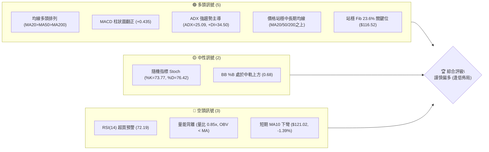
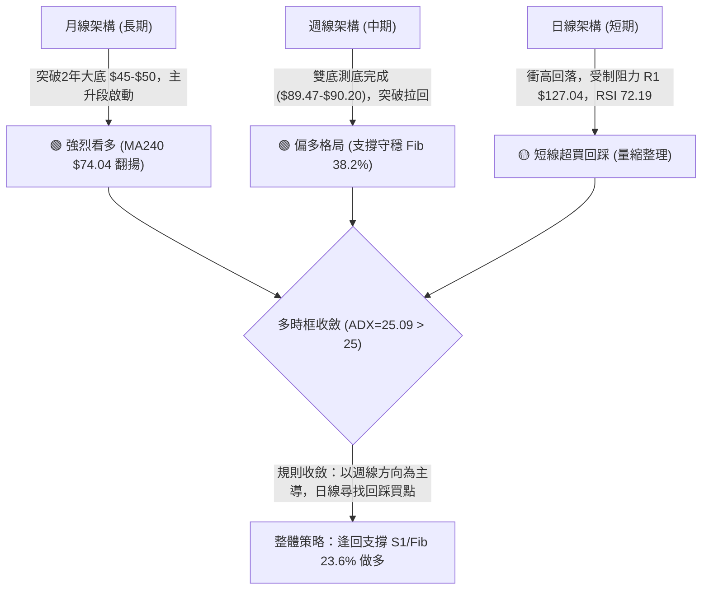
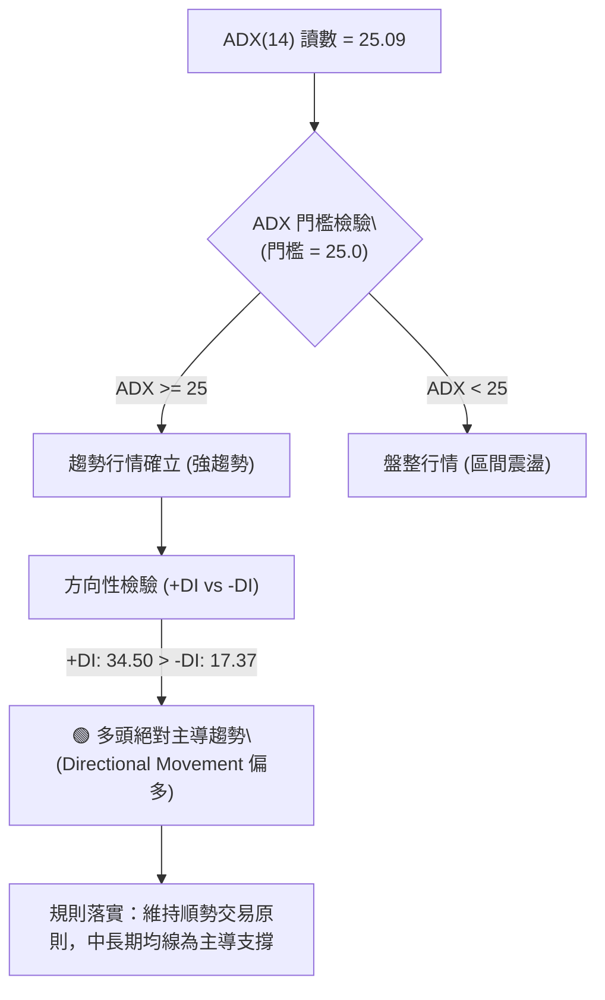
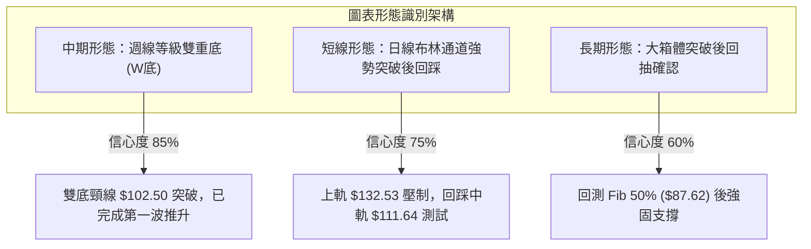
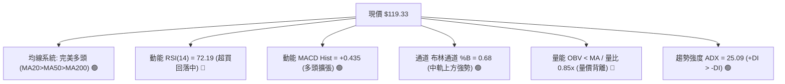
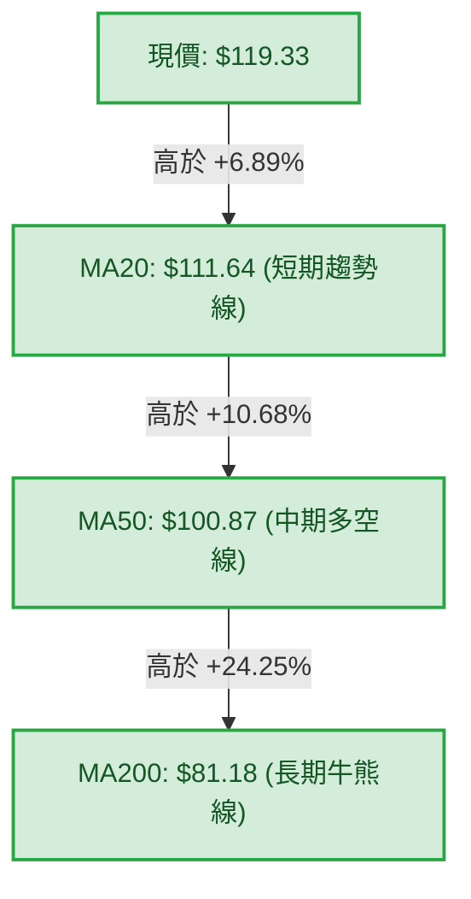
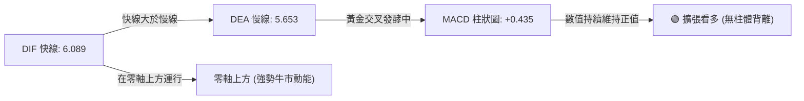
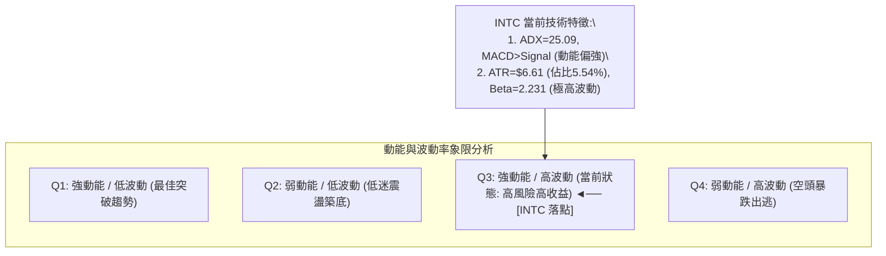
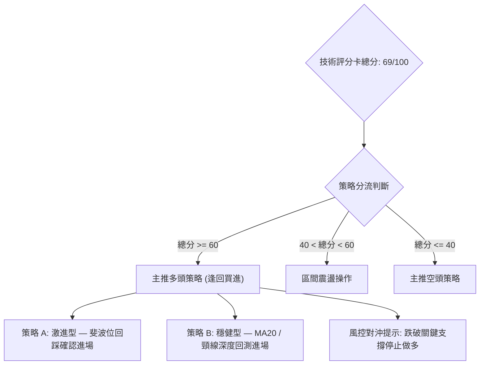
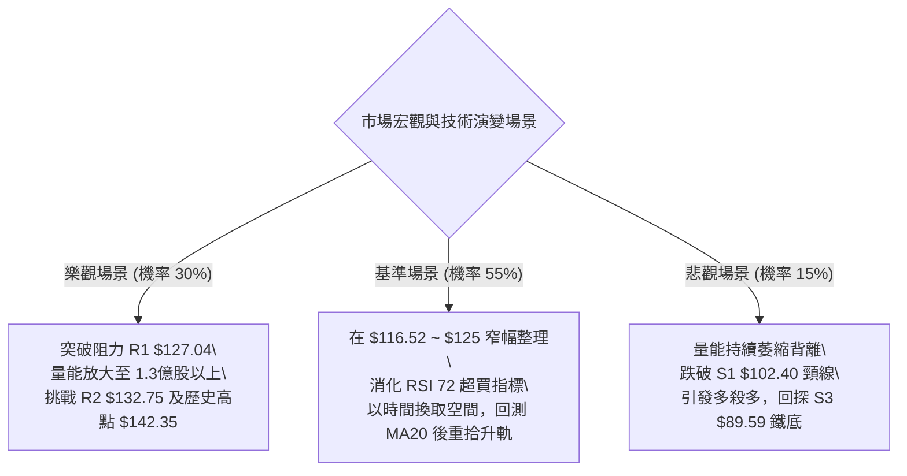

# INTC 技術分析報告

> **報告日期**：2026-10-04 ｜ **語言**：繁體中文 ｜ **數據來源**：Yahoo Finance ｜ **當前價格**：$119.33

---

## 目錄

| 章節 | 內容 |
|------|------|
| [1. 技術面概覽](#1-技術面概覽) | 訊號儀表板、核心指標、評分卡 |
| [2. 趨勢分析](#2-趨勢分析) | 多時框趨勢、長中短期走勢 |
| [3. 圖表形態分析](#3-圖表形態分析) | 形態識別、K線組合、目標價 |
| [4. 支撐與阻力](#4-支撐與阻力) | 關鍵價位、斐波那契回調 |
| [5. 技術指標深度解讀](#5-技術指標深度解讀) | MA/RSI/MACD/布林/成交量 |
| [6. 動能與波動率](#6-動能與波動率) | 動能評估、ATR、Beta |
| [7. 多時框架總結](#7-多時框架總結) | 時框架評分矩陣 |
| [8. 交易策略建議](#8-交易策略建議) | 多空策略、風險報酬比 |
| [9. 風險提示與監控](#9-風險提示與監控) | 監控指標、風險場景 |

---

## 1. 技術面概覽

### 🎯 技術訊號儀表板



### 📊 核心指標速覽表

| 指標類別 | 指標名稱 | 當前數值 | 訊號 | 解讀 |
|----------|----------|----------|------|------|
| **價格** | 當前收盤價 | $119.33 | 🟢 | 位於52週區間 79.0% 處，多頭結構完整 |
| **均線** | MA20 | $111.64 | 🟢 | 價格在MA20上方 +6.89%，短期趨勢支撐強烈 |
| **均線** | MA50 | $100.87 | 🟢 | 價格在MA50上方 +18.30%，中期多空格局分水嶺 |
| **均線** | MA200 | $81.18 | 🟢 | 價格在MA200上方 +46.99%，牛市生命線遠在下方 |
| **動能** | RSI(14) | 72.19 | 🔴 | 日線進入 >70 超買區間，短線存在獲利了結回調壓力 |
| **動能** | MACD (12,26,9) | Hist +0.435 | 🟢 | MACD (6.089) > Signal (5.653)，動能柱維持擴張 |
| **動能** | Stoch %K / %D | 73.77 / 76.42 | 🟡 | 死叉邊緣但未進入極度超買，屬震盪偏強 |
| **強度** | ADX(14) | 25.09 | 🟢 | ADX > 25 (+DI 34.50 > -DI 17.37)，處於有效多頭趨勢 |
| **波動** | ATR(14) | $6.61 | 🟡 | 佔現價 5.54%，波動幅度大，止損設定需拉開 |
| **通道** | Bollinger Bands | %B 0.68 | 🟢 | 位於中軌 $111.64 與上軌 $132.53 之間，健康擴張 |
| **成交量**| OBV 與量比 | 0.85x | 🔴 | 成交量未放大確認突破，OBV 疲弱呈量價背離 |

### 🏆 技術評分卡

```
╔══════════════════════════════════════════════════════════════╗
║              技術評分卡 — INTC (2026-10-04)                  ║
╠══════════════════════════════════════════════════════════════╣
║ 趨勢強度      ██████████████░░░░░░  72/100  🟢 強勢多頭      ║
║ 動能指標      ████████████░░░░░░░░  60/100  🟡 短線超買      ║
║ 支撐穩定度    ████████████████░░░░  80/100  🟢 均線與Fib支撐 ║
║ 成交量配合    ████████░░░░░░░░░░░░  42/100  🔴 量能疲弱背離  ║
║ 形態完整度    ██████████████░░░░░░  70/100  🟢 底部翻轉成型  ║
║ 均線排列      ██████████████████░░  90/100  🟢 完美多頭排列  ║
╠══════════════════════════════════════════════════════════════╣
║ 綜合評分      ██████████████░░░░░░  69/100  🟢 謹慎偏多      ║
╚══════════════════════════════════════════════════════════════╝
```

---

## 2. 趨勢分析

### 🌐 多時框趨勢分析



### 📈 長期趨勢 — 12個月走勢圖（Unicode）

```
INTC 月線收盤走勢圖（過去12個月：2025-11 至 2026-10）
價格軸 ($)
$140 ┤                               ● $139.63 (06月波段高點)
$130 ┤                              / \
$120 ┤                             /   \         ● $120.23 (09月)
$110 ┤                  ● $114.68 /     \       / ╚═ 現在 $119.33 (10月)
$100 ┤                 /         /       \     /
 $90 ┤       ● $94.48 /         /         ●---● $90.20 / $89.51 (07-08月雙底)
 $80 ┤      /        /         /
 $70 ┤     /        /         /
 $60 ┤    /        /         /
 $50 ┤   ● $45.61 (02月)     /
 $40 ┤  ● $40.56 (2025-11) ● $44.13 (03月爆發前蓄勢)
     └─────────────────────────────────────────────────────► 時間
       11  12  01  02  03  04  05  06  07  08  09  10 (月)
      [2025年] └─────────────── 2026年 ───────────────┘
```

#### 走勢特徵分析表格

| 階段與時間區間 | 起止價位 | 累計漲跌幅 | 走勢結構與核心特徵 |
|----------------|----------|------------|--------------------|
| **2025-11 ~ 2026-03** (築底蓄勢) | $40.56 → $44.13 | +8.80% | 橫盤窄幅震盪，長達5個月於 $40-$46 沉澱籌碼，均線由黏合轉向上發散。 |
| **2026-04 ~ 2026-06** (主升主浪) | $44.13 → $139.63 | **+216.41%** | 爆發性主升浪，突破長期歷史平台，單月暴漲超 100%，並創下 $142.35 歷史新高。 |
| **2026-07 ~ 2026-08** (極速回洗) | $139.63 → $89.51 | **-35.89%** | 獲利賣壓出清，價格回測斐波那契 50.0% 關鍵位 ($87.62)，並於 $89.50 附近形成週線雙重底。 |
| **2026-09 ~ 2026-10** (右側反彈) | $89.51 → $119.33 | **+33.31%** | 止跌強力反彈，突破 Fib 23.6% ($116.52)，目前面臨阻力位 R1 $127.04 進行消化。 |

### 📊 中期趨勢（週線分析）

```
週線價格通道與結構示意圖：
[高點阻力] 52W High $142.35 / R3 $141.90 ─────────────────────────
             ▲
            / \
           /   \          [當前反彈阻力] R1 $127.04 / 09-27週高 $123.00
          /     \                 ▲
         /       ▼               / ◄────── [現價 $119.33]
[中期支撐]        \             /          [回踩支撐] Fib 23.6% $116.52
                   ▼           /           [強支撐] S1 $102.40 / MA50 $100.87
                    ●─────────● [週線雙底支撐帶] S3 $89.59 / 08-30週收盤 $89.47
```

近20週數據顯示，2026-07-26週收盤 $92.32 (RSI 26.9) 與 2026-08-30週收盤 $89.47 (RSI 38.1) 明確構建出**週線等級底背離**結構。隨後9月份週線連拉四紅，帶動週成交量於09-20週放大至 626,105,300 股。惟10-04當週收盤回落至 $119.33，週量縮至 494,797,900 股，顯示短線攻勢進入遇阻盤整階段。

### ⚡ 趨勢強度評估（ADX 解讀）



#### ADX 強度對照分析

| 指標變數 | 當前數值 | 參考區間 | 趨勢性質判定 | 交易指引 |
|----------|----------|----------|--------------|----------|
| **ADX(14)** | **25.09** | 25 ~ 50 (強趨勢) | 剛剛越過25門檻，由無趨勢進入**強趨勢主導階段** | 放棄震盪逆勢思維，採順勢操作 |
| **+DI (14)** | **34.50** | > 25 (多頭優勢) | 買方控制力道極強，多頭推進動能充足 | 逢回拉找買點，不盲目猜頂放空 |
| **-DI (14)** | **17.37** | < 20 (空頭疲弱) | 賣方力量持續被壓制，空頭回補動能弱化 | 空頭僅能視為技術回抽，非反轉 |

---

## 3. 圖表形態分析

### 🔍 形態識別系統



#### 形態識別與信心度評估表

| 形態類別 | 信心度 | 判斷依據（引用數據） | 完成度 | 目標價（附嚴謹計算式） |
|----------|--------|----------------------|--------|------------------------|
| **週線雙重底 (W底)** | **85%** | 底1為08-02週 $90.20，底2為08-30週 $89.47；頸線為08-16週高點聚類（S1 $102.40 附近）。 | **100% (已突破)** | 依形態高度計算：頸線 $102.40 + (頸線 $102.40 - 低點 $89.47 = $12.93) = **$115.33**（已於09-27週達成並超越）。向上延伸目標即挑戰阻力位 **$127.04 (R1)**。 |
| **短期布林擴張回踩** | **75%** | 價格觸及上軌 $132.53 附近後收斂回踩，現價 $119.33 位於中軌 $111.64 上方，BB %B 為 0.68。 | **65% (進行中)** | 由形態高度推算：中軌支撐 **$111.64** 不破，波段反彈第一目標為通道上軌 **$132.53**，第二目標為 **$132.75 (R2)**。 |
| **頭肩底 (逆頭肩)** | 35% | 數據中左肩不明顯，且左側缺乏對稱性結構。 | 0% | *訊號不足，僅做指標型解讀，不預設目標價。* |

### 🕯️ 重要K線形態分析

| 週/月份 | 收盤價 | K線形態 | 量價結構解讀 | 訊號方向 |
|---------|--------|---------|--------------|----------|
| **2026-08-30 (週)** | $89.47 | **探底錘頭線 (Hammer)** | 觸及 52W 區間回調 50% ($87.62) 附近出現長下影線，空頭動能衰竭。 | 🟢 強烈見底 |
| **2026-09-13 (週)** | $102.94 | **突破大陽線 (Marubozu)** | 週漲幅 +7.45%，長紅棒帶動突破 S1 ($102.40) 頸線壓制，RSI 重回 67.6。 | 🟢 轉折確認 |
| **2026-09-27 (週)** | $123.00 | **衝高長陽線** | 突破 Fib 23.6% ($116.52)，週量維持 6 億股以上高位，但留有上影線。 | 🟢 短線多頭放量 |
| **2026-10-04 (週)** | $119.33 | **高檔孕線/流星回落** | 成交量萎縮至 4.94 億股，實體收低在 $120 之下，顯示上方 R1 ($127.04) 拋壓沉重。 | 🔴 短期獲利了結 |

### 📉 ASCII 走勢形態示意圖

```
週線雙重底 (W底) 突破與回抽示意：
                [波段反彈高點 $123.00 / 阻力 R1 $127.04]
                           /\
                          /  \ ◄── [現價 $119.33 回調消化]
[頸線突破位 $102.40]      /    \
---------●---------------/------\-------------------------
        / \             /        \
       /   \           /          ▼ [潛在回踩支撐 Fib 23.6% $116.52]
      /     \         /
     /       ▼       /
    /         ●-----● [底2: 08-30週 $89.47]
   ▼ [底1: 08-02週 $90.20]
  (支撐帶: S3 $89.59)
```

### 🎯 形態目標價計算

1. **W底測幅滿足點**：
   - 形態底部低點：$89.47（08-30週收盤低點）
   - 頸線確認位：$102.40（對應波段低點聚類支撐 S1）
   - 形態垂直幅度：$\Delta = \$102.40 - \$89.47 = \$12.93$
   - 最小測量滿足點（1:1）：$\$102.40 + \$12.93 = \$115.33$（已達成）
   - 延伸測量滿足點（1.618 倍）：$\$102.40 + (\$12.93 \times 1.618) = \$123.32$（精準對應09-27週高點 $123.00 區域）
2. **短期上軌測幅**：
   - 若守穩 Fib 23.6% ($116.52)，短線向上攻擊目標為布林上軌 **$132.53**，並進一步測試 **R2 ($132.75)**。

---

## 4. 支撐與阻力

### 🗺️ 關鍵價位分布圖（Unicode）

```
INTC 價位結構分布圖 (由 OHLCV 與斐波那契計算)
════════════════════════════════════════════════════════════════════════
$142.35 ║██████████████████████████████║ 52W High (Fib 0.0%)
$141.90 ║████████████████████████████  ║ 極強阻力 R3 (+18.91%)
$132.75 ║████████████████████          ║ 強阻力 R2 (+11.25%) [近布林上軌 $132.53]
$127.04 ║████████████████              ║ 關鍵阻力 R1 (+6.46%)
$119.33 ╠══════════════════════════════╣ ◄ 現價 (收盤價)
$116.52 ║▓▓▓▓▓▓▓▓▓▓▓▓▓▓▓▓▓▓▓▓          ║ 關鍵回調位 (Fib 23.6%)
$111.64 ║▓▓▓▓▓▓▓▓▓▓▓▓▓▓                ║ 動態支撐 (MA20 / 布林中軌)
$102.40 ║████████████████████████      ║ 強支撐 S1 (-14.19%) [W底頸線]
$100.87 ║████████████████████          ║ 均線支撐 (MA50) / Fib 38.2% $100.54
$98.33  ║████████████████              ║ 次級支撐 S2 (-17.60%)
$89.59  ║████████████████████████████  ║ 鐵底支撐 S3 (-24.92%) [雙底波段低點]
════════════════════════════════════════════════════════════════════════
```

### 🚧 阻力位分析表

所有阻力數值完全取自關鍵價位聚類，不得捏造：

| 阻力級別 | 價位 | 形成原因 | 突破難度 | 重要性與技術意涵 |
|----------|------|----------|----------|------------------|
| **R1** | **$127.04** | 近一年波段高點聚類；09-27週反彈上影線阻力區間 | 🟡 中等偏高 | 突破確認短線拉回結束，將打開通往 $132 的上升空間。 |
| **R2** | **$132.75** | 波段次高聚類，與當前布林通道上軌 ($132.53) 高度重合 | 🔴 高 | 強阻力帶，若在此處受阻易形成日線等級次高頂。 |
| **R3** | **$141.90** | 歷史極限賣壓區，極度貼近 52W High ($142.35) | 🔴 極高 | 多頭終極大考驗，需巨量換手（單週 >7 億股）方能突破。 |

### 🛡️ 支撐位分析表

所有支撐數值完全取自關鍵價位聚類，不得捏造：

| 支撐級別 | 價位 | 形成原因 | 守住機率 | 重要性與技術意涵 |
|----------|------|----------|----------|------------------|
| **S1** | **$102.40** | 近一年波段低點聚類，前次 W 底頸線突破轉換位 | 🟢 85% | 中期生命線，只要收盤不破此處，週線級別多頭結構完全不變。 |
| **S2** | **$98.33** | 心理整數位 $100 破位後的防禦聚類，接近 MA60 ($101.08) | 🟢 75% | 若回踩至此為深度洗盤，跌破將引發中線恐慌多殺多。 |
| **S3** | **$89.59** | 2026年7-8月波段絕對低點聚類 ($89.47-$90.20) | 🟢 90% | 結構性鐵底，若跌破代表自 $44.13 以來的整輪牛市結束。 |

### 📐 斐波那契回調位分析

*基準區間：52週波段低點 $32.89 → 52週波段高點 $142.35（垂直落差 $109.46）*

```
斐波那契回調結構層級圖：
$142.35 (0.0% - 52W High) ─────────────────────────
      │
      ├─現價: $119.33 (位於 0.0% 與 23.6% 之間)
      │
$116.52 (23.6% 回調位) ───────────────────────────── [超強支撐區間]
      │
$100.54 (38.2% 回調位) ───────────────────────────── [健康多頭回檔極限，緊貼 MA50 $100.87]
      │
$87.62  (50.0% 回調位) ───────────────────────────── [已於8月守穩，確認反轉有效]
      │
$74.70  (61.8% 黃金分割) ─────────────────────────── [貼近 MA240 $74.04]
      │
$56.31  (78.6% 深幅回調)
      │
$32.89  (100.0% - 52W Low) ─────────────────────────
```

- **位置解讀**：現價 $119.33 成功站穩在 **23.6% 回調位 ($116.52)** 之上。在強勢多頭趨勢中，只要回調不破 23.6%，均視為極強勢整理，隨時具有再次發動攻擊挑戰前高的動能。
- **支撐共振**：**38.2% 回調位 ($100.54)** 與 **MA50 ($100.87)** 及支撐位 **S1 ($102.40)** 形成「三合一重磅支撐帶」，提供極具防禦力的多頭堡壘。

---

## 5. 技術指標深度解讀

### 🎛️ 指標訊號總覽



### 📈 移動平均線排列分析



#### 各期均線狀態剖析

- **極短期均線 (MA5 vs MA10)**：MA5 為 $118.30 (現價在上方 +0.87%)；但 MA10 為 **$121.02 (現價在下方 -1.39%)**，且 MA10 斜率開始下彎，顯示短線 10 日內買入的平均籌碼面臨微幅套牢，短期有震盪整理需求。
- **中期均線 (MA20 vs MA60)**：MA20 為 $111.64，MA60 為 $101.08，均維持仰角上揚，對價格形成良好墊高效應。
- **長期均線 (MA120 vs MA240)**：MA120 為 $104.89，MA240 為 $74.04。長線均線完全呈現由下而上展開的多頭排列（Bullish Alignment），中期跌勢被徹底逆轉。

### 📉 RSI(14) 分析

```
RSI(14) 讀數儀表：
0                30                50                70    72.19   100
├────────────────┼─────────────────┼─────────────────┼──────█────┤
[   極度超賣區   ] [   弱勢整理區    ] [   強勢推進區    ] [ 超買區 🔴 ]
進度條: ████████████████████████████████████░░░░░░░░░░░░  72.19/100
```

- **超買狀態解讀**：RSI(14) 當前數值 **72.19**，已越過 70 警戒線，進入超買區。這說明短線多頭拉升速率過快，追高風險顯著增大。
- **背離分析判斷**：
  - **日線層次**：現價由 09-27 的 $123.00 微跌至 $119.33，RSI 由 71.8 升至 72.2，**數據顯示無明顯頂背離**（無高點不對稱現象）。
  - **週線層次**：前次 6 月份高點 $139.63 時 RSI 為 67.2，當前反彈至 $119.33 時週線 RSI 達到 72.2，量能雖減弱但動能仍高，屬於**指標鈍化而非頂背離**。
  - **結論**：超買僅代表短線需要時間換取空間或回測均線，並未發出趨勢反轉的頂背離空頭訊號。

### 📊 MACD(12/26/9) 訊號解讀



- **數值分析**：MACD 線 6.089 > 訊號線 5.653，兩者均在零軸遠端上方運行，這是標準的強勢牛市特徵。
- **柱狀圖 (Histogram)**：Hist 數值為 **+0.435**，維持在正值區間，且週線 MACD 柱在連續數週擴大後雖有微幅放緩，但尚未出現死亡交叉或紅柱急縮跡象，多頭主控權未失。

### 📦 布林通道分析

```
布林通道 (Bollinger Bands, 20, 2) 結構圖：
$132.53 ┤------------------------------------ 布林上軌 (Upper Band)
        │                                     [阻力壓力帶，貼近 R2 $132.75]
$125.00 ┤
$119.33 ┤                   ●◄────────────── 現價 (BB %B = 0.68)
        │
$111.64 ┤------------------------------------ 布林中軌 (Middle Band = MA20)
        │                                     [核心動態回踩支撐位]
$100.00 ┤
 $90.74 ┤------------------------------------ 布林下軌 (Lower Band)
```

- **通道位置 (%B 解讀)**：目前 **%B 為 0.68**，表示價格位於中軌（0.5）與上軌（1.0）之間的偏強多頭通道內。
- **帶寬與走勢判定**：布林上軌為 $132.53，中軌為 $111.64，下軌為 $90.74，帶寬處於適度開口擴張階段。現價未緊貼上軌鈍化，而是回落至中軌與上軌中界，呈現**健康的上漲回抽結構**。中軌 $111.64 為第一道強動態防線。

### 💹 成交量分析（量價配合度）

```
成交量對比儀表：
當日成交量:  95,139,500 股   █████████████████░░░ (量比: 0.85x)
20日均量:   112,112,985 股   ████████████████████ 
50日均量:   108,678,192 股   ███████████████████░

OBV 量能趨勢狀態:
OBV 指標線 < OBV 移動平均線 ───► 🔴 量能疲弱，資金追高意願降溫
```

- **量能不足隱憂**：最新成交量 95,139,500 股，低於 20 日均量 (112,112,985 股)，量比僅 **0.85x**。
- **OBV 背離解讀**：技術快照標明 **OBV < MA → 量能疲弱**。股價反彈至 $119.33 高位，但累計能量潮指標並未同步刷新高點，呈現隱性的「量價背離」。這意味著機構主力資金在當前價位並未進行大規模追價買入，後續若要強勢突破 R1 ($127.04)，成交量必須重回 1.2 億股以上。

---

## 6. 動能與波動率

### ⚡ 動能評估四象限



#### 動能與波動率綜合評估表

| 象限分區 | 動能維度 | 波動維度 | 歷史對應 | 當前狀態判定 | 交易因應策略 |
|----------|----------|----------|----------|--------------|--------------|
| **Q1** | 強動能 | 低波動 | 2026年3月蓄勢 | 否 | 順勢加碼，享受平穩上漲 |
| **Q2** | 弱動能 | 低波動 | 2025年底橫盤 | 否 | 觀望或小區間網格操作 |
| **Q3** | **強動能** | **高波動** | **當前 INTC** | **✓ (精準符合)** | **高風險高回報階段，持倉嚴設移動止損，切忌大倉位追漲** |
| **Q4** | 弱動能 | 高波動 | 2026年7月暴跌 | 否 | 全面清倉迴避 |

### 📊 ATR 波動率分析

- **ATR 數值解讀**：ATR(14) 數值為 **$6.61**，佔當前股價 $119.33 的比例高達 **5.54%**。
- **單日波動範圍**：意味著在 68% 的交易日內，INTC 單日振幅約在 $\pm \$6.61$ 左右（即波動區間達 $112.72 ~ $125.94）。
- **止損與風控設置**：
  - **日內/極短線止損距離**：不得小於 $1 \times \text{ATR}$（即 $6.61），否則極易被日內噪聲洗出場。
  - **波段交易止損距離**：建議設定在 $1.5 \times \text{ATR}$（約 $9.92$）至 $2 \times \text{ATR}$（約 $13.22$），對應現價的回撤支撐正好坐落在 **MA20 ($111.64)** 與 **Fib 23.6% ($116.52)** 之下方。

### 📐 Beta 與市場相關性

- **Beta 數值**：高達 **2.231**。
- **市場敏感度分析**：INTC 的系統性波動風險是大盤（S&P 500 指數）的 **2.23 倍**。
  - 當標普 500 指數上漲 1% 時，理論上 INTC 預期上揚 2.23%；反之，大盤回調 1% 時，INTC 恐面臨 2.23% 以上的回撤幅度。
  - **倉位管理意涵**：由於 Beta 極高且個股波動大，投資組合中 INTC 的權重不宜過高，建議波段倉位上限控制在總資金的 **15% ~ 20%** 以內。

---

## 7. 多時框架總結

### 📋 時框架評分表

| 時框架 | 趨勢方向 | 動能狀態 | 均線排列 | 圖表形態 | 綜合評分 | 戰術建議 |
|--------|----------|----------|----------|----------|----------|----------|
| **月線 (長期)** | 🟢 強勢多頭 | 🟢 MACD水上擴張 | 🟢 MA240上揚 | 平台突破主升 | **85/100** | 戰略性做多，長期持有 |
| **週線 (中期)** | 🟢 震盪偏多 | 🟡 RSI達72/放緩 | 🟢 多頭排列成型 | 雙底突破回踩 | **75/100** | 逢回測頸線/均線佈局 |
| **日線 (短期)** | 🟡 震盪整理 | 🔴 RSI超買/量縮 | 🟢 MA20上方運行 | 碰阻力回抽 | **58/100** | 不盲目追高，等待拉回 |

### 🔲 綜合訊號矩陣

```
時框與指標交互驗證矩陣：
┌───────────┬──────────────┬──────────────┬──────────────┬──────────────┐
│ 時框架    │ 均線系統     │ RSI 動能     │ MACD 柱狀    │ 量價關係     │
├───────────┼──────────────┼──────────────┼──────────────┼──────────────┤
│ 長期 (月) │ 🟢 多頭排列  │ 🟢 強勢推進  │ 🟢 零軸上方  │ 🟢 底部放量  │
│ 中期 (週) │ 🟢 MA20>MA50 │ 🟡 進入超買  │ 🟢 紅柱擴張  │ 🟡 週量微縮  │
│ 短期 (日) │ 🟡 MA10下彎  │ 🔴 超買警戒  │ 🟢 柱體維持  │ 🔴 OBV量背離 │
└───────────┴──────────────┴──────────────┴──────────────┴──────────────┘
訊號一致性評估：長中期趨勢高度看多，但短期技術指標出現超買與量能背離矛盾。
```

### ⚖️ 多時框收斂結論

依據多時框收斂規則：
1. **行情性質判定**：當前 ADX(14) 讀數為 **25.09**，已正式跨越 25.0 臨界值，同時 +DI (34.50) 遠高於 -DI (17.37)。因此明確定義當前為**「強多頭趨勢行情」**，而非區間震盪行情。
2. **主導時框確立**：依規則，在 ADX > 25 的趨勢行情下，**以中長期（週線/MA50、MA200）方向為主導**，日線指標僅用來尋找進場時機與回踩防守點。
3. **最終收斂結論**：**【謹慎偏多 — 順勢回踩做多】**。日線級別的 RSI 超買 (72.19) 與量能萎縮僅屬次級波折，不可作為逆勢做空的依據；主導策略必須順應週線與月線的強勢多頭格局，在日線回調至核心支撐區間時建立多頭部位。

---

## 8. 交易策略建議

### 🗺️ 策略決策流程圖



### 🧭 策略路由（依評分卡分流，不得兩頭下注）

> **當前主策略方向 = 主推多頭策略（依技術評分卡綜合評分 69/100，大於 60 門檻）。**  
> 堅決執行順勢做多思維，不兩頭下注。空頭僅作為下行風險觸發點與風控對沖之參考。

### 🎯 價格情境階梯（Price Scenarios）

以當前價格 **$119.33** 為基準，所有價位完全引用第 4 章數據與關鍵聚類點位：

| 觸發條件 | 下一目標 | 後續延伸目標 | 情境含義與技術應對 |
|----------|----------|--------------|--------------------|
| **強勢突破 R1 ($127.04)** | **R2 ($132.75)** | **R3 ($141.90)** | 短線洗盤結束，多頭趨勢全面加速，直接挑戰歷史高點區域。 |
| **維持在 $116.52 ~ $127.04** | — | — | 消化日線超買賣壓，等待 MA20 均線上移靠攏，屬健康強勢換手。 |
| **有效跌破 Fib 23.6% ($116.52)**| **MA20 ($111.64)** | **S1 ($102.40)** | 回抽幅度加大，測試布林中軌，波段最佳低吸窗口浮現。 |
| **失守強支撐 S1 ($102.40)** | **S2 ($98.33)** | **S3 ($89.59)** | 中期雙底頸線破位，趨勢遭破壞，所有多單全面止損離場。 |

### 📊 情境機率分佈

| 情境劇本 | 機率 | 主要判斷依據（引用數據與指標狀態） |
|----------|------|------------------------------------|
| **情境一：強勢回踩後上攻** | **55%** | ADX=25.09 強趨勢確立；均線呈現完美多頭排列；MACD 柱狀圖維持正值 (+0.435)；站穩 Fib 23.6% ($116.52)。 |
| **情境二：高檔強勢區間震盪** | **30%** | RSI 處於 72.19 超買高位；OBV < MA 量能疲弱背離；阻力 R1 ($127.04) 存在波段解套賣壓，需時間橫盤消化。 |
| **情境三：深度拉回探底** | **15%** | MA10 ($121.02) 下彎短套；大盤 Beta 波動風險引發恐慌性拋售，跌破 S1 ($102.40)。 |

### 🟢 主策略詳情（主推多頭）

```
進場與風控價位階梯示意圖：
[目標價 T2]  $132.75 ────────────────────────────────────── (阻力 R2 / 預期報酬 +13.9%)
[目標價 T1]  $127.04 ────────────────────────────────────── (阻力 R1 / 預期報酬 +9.0%)
[現價參考]   $119.33 
[策略A 進場] $116.52 ───► [回踩 Fib 23.6%]
[策略A 止損] $111.00 ───► [跌破 MA20 $111.64 之下]
----------------------------------------------------------
[策略B 進場] $111.64 ───► [回測 MA20 動態均線]
[目標價 T2]  $127.04 
[目標價 T1]  $119.33 
[策略B 止損] $102.00 ───► [跌破 S1 $102.40 頸線之下]
```

| 策略要素 | 策略 A（激進型：回踩 Fib 23.6% 佈局） | 策略 B（穩健型：回測 MA20 / 布林中軌低吸） |
|----------|----------------------------------------|--------------------------------------------|
| **進場條件** | 股價回踩 Fib 23.6% 不破，日線收下影線時進場 | 股價拉回測試布林中軌 / MA20，量縮止跌回升 |
| **進場價格** | **$116.52** | **$111.64** |
| **目標價 T1** | **$127.04** (阻力 R1) | **$119.33** (前波收盤整理位) |
| **目標價 T2** | **$132.75** (阻力 R2) | **$127.04** (阻力 R1) |
| **止損價格** | **$111.00** (跌破 MA20 $111.64 下方約0.5%) | **$102.00** (跌破強支撐 S1 $102.40 頸線下方) |
| **潛在空間** | T1: +$10.52 (+9.03%) / T2: +$16.23 (+13.93%) | T1: +$7.69 (+6.89%) / T2: +$15.40 (+13.79%) |
| **承擔風險** | -$5.52 (-4.74%) | -$9.64 (-8.63%) |
| **風險報酬比** | **1 : 2.94**（以 T2 計算） | **1 : 1.60**（以 T2 計算） |
| **預估勝率** | **65%** | **70%** |
| **建議倉位** | **總資金 10%** | **總資金 15%** |

### 🔴 反向風險觸發點（對沖提示）

- **多頭失效觸發價位**：**收盤價連續兩日跌破 S1 ($102.40)**。
- **指標反轉觸發訊號**：日線 MACD 形成高檔死叉，且 ADX(14) 回落至 25 以下，同時 -DI 向上金叉 +DI。
- **應對行動**：若觸發上述條件，多頭結構遭到實質破壞，應立即市價砍單離場，並可動用總資金 5% ~ 10% 建立看跌期權（Put）對沖現貨庫存風險，下方第一回補目標鎖定 **S3 ($89.59)**。

### ⭐ 整體訊號強度評星

```
╔══════════════════════════════════════════════════════════════╗
║ 做多訊號強度：★★★★☆  (4/5星) — 趨勢確立，多頭排列完整        ║
║ 做空訊號強度：★☆☆☆☆  (1/5星) — 逆勢風險極大，僅短線超買    ║
║ 整體可信度：  ★★★★☆  (4/5星) — 價位聚類與均線支撐高度吻合  ║
╚══════════════════════════════════════════════════════════════╝
```

---

## 9. 風險提示與監控

### ✅ 關鍵監控指標 Checklist

```
╔══════════════════════════════════════════════════════════════╗
║               INTC 關鍵技術監控清單 (Checklist)               ║
╠══════════════════════════════════════════════════════════════╣
║ [ ] 監控 1：Fib 23.6% ($116.52) 支撐守穩程度                ║
║     - 收盤價若跌破 $116.52，短期回踩將擴大至 MA20 ($111.64)  ║
║                                                              ║
║ [ ] 監控 2：成交量是否有效放大                                ║
║     - 日成交量需超越 20日均量 (1.12億股)，量比回升至 >1.0    ║
║                                                              ║
║ [ ] 監控 3：RSI(14) 超買降溫路徑                             ║
║     - 觀察 RSI 是否能於 55~60 強勢區間獲得支撐並重新轉強     ║
║                                                              ║
║ [ ] 監控 4：MA10 ($121.02) 重新站回情況                      ║
║     - 價格重返 MA10 之上，方能化解短線均線下彎扣抵壓力       ║
║                                                              ║
║ [ ] 監控 5：大盤波動連鎖反應 (Beta = 2.231)                  ║
║     - 若標普 500 出現大於 1.5% 單日跌幅，INTC 需防禦 $111   ║
╚══════════════════════════════════════════════════════════════╝
```

### ⚠️ 風險場景分析



### 🛡️ 風險管理重要提醒

1. **ATR 波動風險因應**：INTC 當前每日標準波動達 **$6.61 (5.54%)**。投資人絕不可將止損設定在 $1 ~ $2 的極窄範圍內，否則極易被日常洗盤掃出場。
2. **Beta 槓桿效應防範**：高達 2.231 的 Beta 意味著個股具備天然的兩倍槓桿屬性。在交易此標的時，嚴禁再施加高額融資槓桿，維持現貨交易或輕度期權保護為最佳風控手段。
3. **分批進場原則**：基於短線指標超買，建倉切忌單筆全倉打入。建議採「4-3-3」分批買入法：回踩 Fib 23.6% ($116.52) 建立 40% 基本倉，若回調至 MA20 ($111.64) 加碼 30%，剩餘 30% 待突破 R1 ($127.04) 確認後順勢追碼。

---

## 📋 報告總結

```
╔══════════════════════════════════════════════════════════════════╗
║                   INTC 技術分析報告總結                          ║
╠══════════════════════════════════════════════════════════════════╣
║ 報告日期：2026-10-04                                             ║
║ 當前價格：$119.33                                                ║
║ 技術評級：🟢 謹慎偏多 (逢低買進 / 避免追高)                      ║
║                                                                  ║
║ 關鍵結論：                                                       ║
║ ├─ 長期趨勢：🟢 強烈看多 (突破長期大底，MA200 $81.18 遠在下方)   ║
║ ├─ 中期趨勢：🟢 雙底突破 (W底頸線 $102.40 已轉化為核心強支撐)    ║
║ ├─ 短期趨勢：🟡 超買整理 (RSI 72.19，量比 0.85x，面臨 R1 阻力)   ║
║ ├─ 關鍵支撐：S1 $102.40 ｜ 短線支撐: Fib 23.6% $116.52 / MA20 $111║
║ ├─ 關鍵阻力：R1 $127.04 ｜ 波段阻力: R2 $132.75 / R3 $141.90     ║
║ └─ 分析師目標：平均目標價 $116.37 ｜ 最高目標價 $200.00          ║
║                                                                  ║
║ 最優策略組合：                                                   ║
║ 1. 🥇 最佳機會：回踩斐波那契位 $116.52 低吸 (策略 A，風報比 1:2.94)║
║ 2. 🥈 次選機會：深度洗盤至 MA20 $111.64 佈局 (策略 B，勝率約 70%) ║
║ 3. 🥉 保守選擇：靜待股價放量突破 R1 $127.04 右側確認後順勢進場   ║
╚══════════════════════════════════════════════════════════════════╝
```

---

> ⚠️ **免責聲明**：本報告為技術分析研究成果，所有數據、價位及模型均基於市場歷史價格與交易量資訊推算。本報告**僅供研究與學術參考**，**不構成任何形式的要約、招攬或投資建議**。市場有風險，交易需嚴格執行停損與資金管理。

---

*報告生成時間：2026-10-04 ｜ 數據來源：Yahoo Finance ｜ 分析框架：多時框技術分析體系*