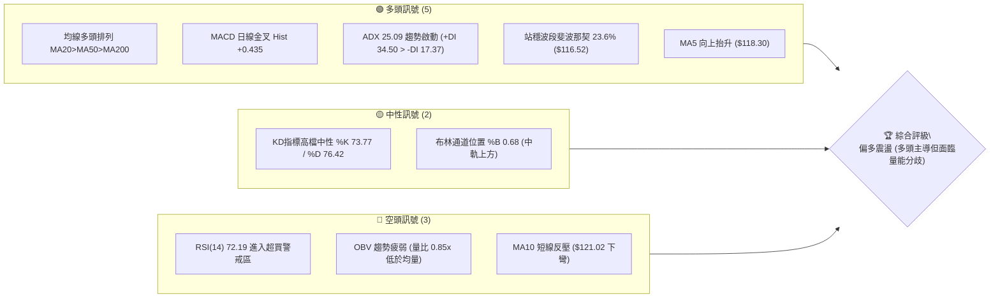
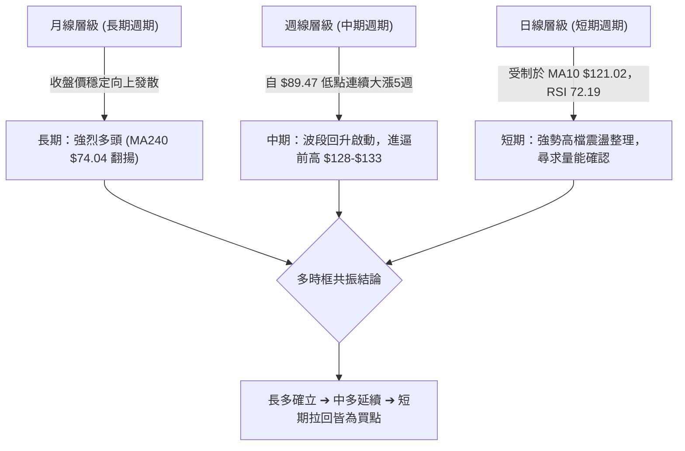
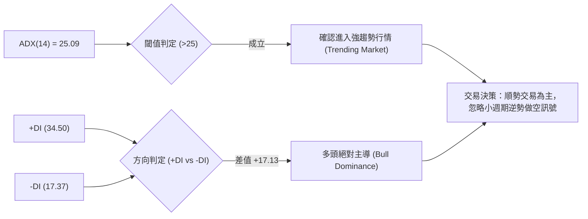
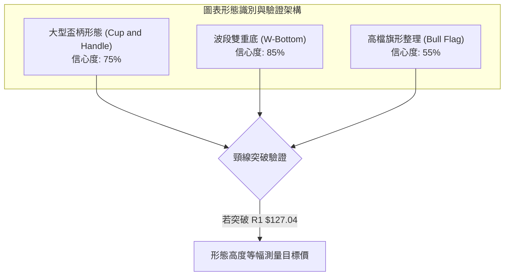
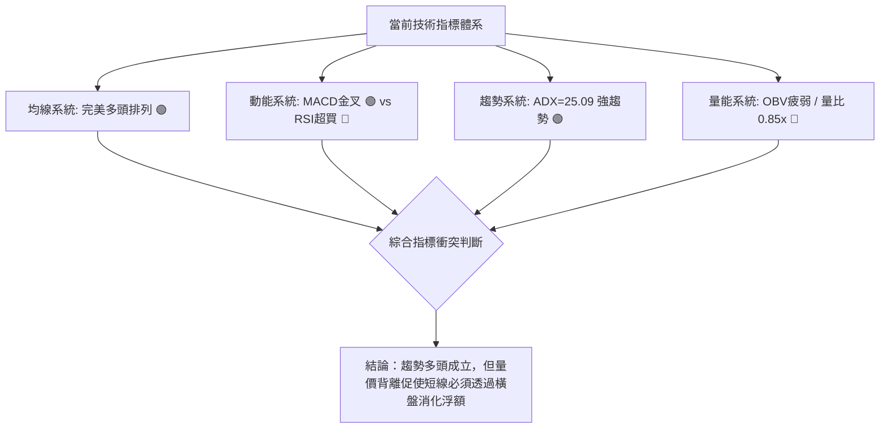
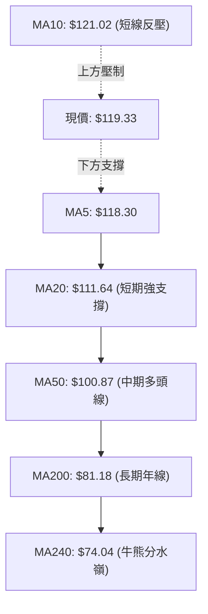
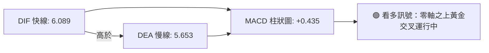
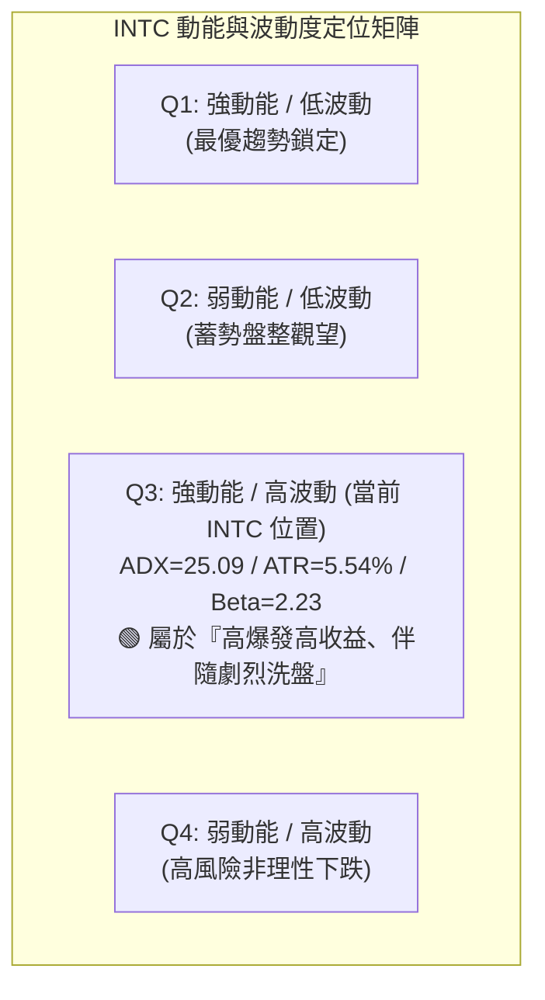
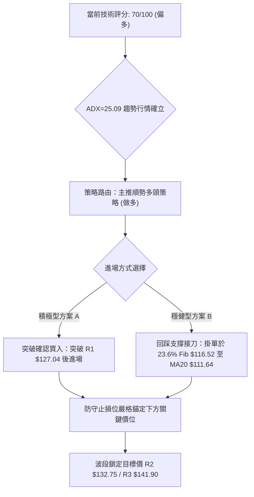
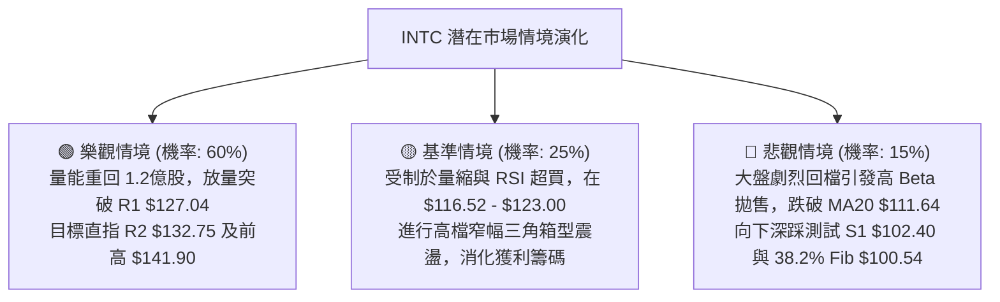

# INTC 技術分析報告

> **報告日期**：2026-10-05 ｜ **語言**：繁體中文 ｜ **數據來源**：Yahoo Finance ｜ **當前價格**：$119.33

---

## 目錄

| 章節 | 內容 |
|------|------|
| [1. 技術面概覽](#1-技術面概覽) | 訊號儀表板、核心指標、評分卡 |
| [2. 趨勢分析](#2-趨勢分析) | 多時框趨勢、長中短期走勢、ADX解讀 |
| [3. 圖表形態分析](#3-圖表形態分析) | 形態識別、信心度評估、K線組合 |
| [4. 支撐與阻力](#4-支撐與阻力) | 關鍵價位、斐波那契回調結構 |
| [5. 技術指標深度解讀](#5-技術指標深度解讀) | MA/RSI/MACD/布林/成交量量價關係 |
| [6. 動能與波動率](#6-動能與波動率) | 動能矩陣、ATR風控參數、Beta關聯度 |
| [7. 多時框架總結](#7-多時框架總結) | 時框架評分矩陣與收斂結論 |
| [8. 交易策略建議](#8-交易策略建議) | 策略路由、價格階梯、主推交易策略 |
| [9. 風險提示與監控](#9-風險提示與監控) | 監控指標Checklist、情境分析與風控 |
| [📋 報告總結](#-報告總結) | 決策摘要卡與最佳行動方案 |

---

## 1. 技術面概覽

### 🎯 技術訊號儀表板



### 📊 核心指標速覽表

| 指標類別 | 指標名稱 | 當前數值 | 訊號 | 解讀 |
|----------|----------|----------|------|------|
| **價格** | 當前價格 | $119.33 | 🟢 | 位於52週區間79.0%之高檔強勢區，多頭結構完整 |
| **均線** | MA20 | $111.64 | 🟢 | 現價高於MA20達+6.89%，短中期支撐堅實 |
| **均線** | MA50 | $100.87 | 🟢 | 價格高於MA50達+18.30%，中期多頭生命線向上發散 |
| **均線** | MA200 | $81.18 | 🟢 | 遠高於長期均線+47.00%，牛市長期架構確立 |
| **均線** | MA10 | $121.02 | 🔴 | 現價低於MA10達-1.39%，極短線呈現拉回整理 |
| **動能** | RSI(14) | 72.19 | 🔴 | 指標突破70超買線，日線短線存在獲利了結回洗壓力 |
| **動能** | MACD(12,26,9) | 柱狀 +0.435 | 🟢 | 快線(6.089)高於慢線(5.653)，柱狀圖翻正，買盤續存 |
| **動能** | Stoch %K/%D | 73.77 / 76.42 | 🟡 | %K高檔死叉微幅下穿%D，短線進入高檔震盪整理 |
| **趨勢** | ADX / ±DI | 25.09 / +34.50 | 🟢 | ADX跨越25閥值，+DI顯著高於-DI(17.37)，強趨勢多頭 |
| **通道** | Bollinger Bands | 上軌 $132.53 / %B 0.68 | 🟡 | 現價運行於中軌($111.64)與上軌之間，通道開口中性 |
| **量能** | 20日成交均量比 | 0.85x | 🔴 | 最新量95.14M低於均量112.11M，OBV低於MA呈現量能背離 |
| **波動** | ATR(14) | $6.61 (5.54%) | 🟡 | 日波動幅度偏大，需保持動態風險敞口控管 |

### 🏆 技術評分卡

```
╔══════════════════════════════════════════════════════════════╗
║              技術評分卡 — INTC (2026-10-05)                  ║
╠══════════════════════════════════════════════════════════════╣
║ 趨勢強度 (ADX/均線架構)  ████████████████░░░░  80/100 🟢 看多 ║
║ 均線排列 (多頭排列發散)  ██████████████████░░  90/100 🟢 極佳 ║
║ 形態完整度 (杯柄突破架構) ██████████████░░░░░░  70/100 🟢 良好 ║
║ 動能指標 (MACD/RSI超買)  ████████████░░░░░░░░  60/100 🟡 中性 ║
║ 支撐穩定度 (密集均線防護) ████████████████░░░░  80/100 🟢 穩固 ║
║ 成交量配合 (量比不足/OBV) ████████░░░░░░░░░░░░  40/100 🔴 疲弱 ║
╠══════════════════════════════════════════════════════════════╣
║ 綜合技術評分             ██████████████░░░░░░  70/100 🟢 偏多 ║
║ 戰略結論：中長線強多架構確立，短線面臨量縮超買，拉回支撐做多  ║
╚══════════════════════════════════════════════════════════════╝
```

---

## 2. 趨勢分析

### 🌐 多時框趨勢分析



### 📈 長期趨勢 — 12個月走勢圖（Unicode）

依據過去 12 個月歷史收盤價，INTC 歷經了強烈築底、爆發性重估、深幅回調後再度拉升的完整循環：

```
INTC 月線走勢圖（過去12個月：2025-11 至 2026-10）
價格軸 ($)
$140 ┤                                     ● $139.63 (06月高點)
$125 ┤                                                  ● $120.23 (09月)
$115 ┤                                 ● $114.68 (05月)  ● $119.33 (現價)
$100 ┤                             
$90  ┤                             ● $94.48 (04月) ● $90.20 (07月)
$85  ┤                                            ● $89.51 (08月低點)
$45  ┤                 ● $46.47(01月)
$40  ┤● $40.56(11月)      ● $45.61(02月)
$35  ┤     ● $36.90(12月)     ● $44.13(03月)
     └─────────────────────────────────────────────────────────────
       11   12   01   02   03   04   05   06   07   08   09   10 (月)
       2025 │                    2026
```

#### 走勢特徵分析表格

| 階段 | 時間區間 | 價格區間 | 漲跌幅 | 核心走勢特徵與量價解讀 |
|------|----------|----------|--------|------------------------|
| **底層蓄勢期** | 2025-11 至 2026-03 | $36.90 → $44.13 | +19.59% | 長達5個月在 $36-$46 窄幅區間換手，籌碼高度集中沉澱。 |
| **主升浪爆發** | 2026-03 至 2026-06 | $44.13 → $139.63 | +216.40% | 連續4個月暴力拉升，突破所有均線束縛，創下52週高點 $142.35。 |
| **獲利回吐期** | 2026-06 至 2026-08 | $139.63 → $89.51 | -35.89% | 快速回撤測試長期均線，並在支撐位 S3($89.59) 附近獲得強勁買盤。 |
| **右側再起期** | 2026-08 至 2026-10 | $89.51 → $119.33 | +33.31% | 連續放量陽線上攻，週線連收紅K，形成穩固之波段第二隻腳。 |

### 📊 中期趨勢（週線分析）

中期走勢自 2026-08-30 觸及波段收盤低點 $89.47（與 S3 $89.59 極度吻合）後展開 V 型反轉，近 5 週拉出帶量長紅，週收盤價由 $95.80 連續推升至 $123.00，雖最新一週小幅拉回至 $119.33，但 MACD 柱狀圖維持紅柱（+0.435），表明中期推升力道未衰。

```
近期週線壓力與支撐示意圖：
$132.75 ─────────────────────────── [R2 強阻力：前波震盪頂點聚類]
$127.04 ─────────────────────────── [R1 頸線阻力：6月下旬收盤回測壓力]
$119.33 ═══════════════════════════ ◄ 當前收盤價 ($119.33)
$116.52 ┄┄┄┄┄┄┄┄┄┄┄┄┄┄┄┄┄┄┄┄┄┄┄┄┄ [斐波那契 23.6% 回調關鍵支撐]
$102.40 ─────────────────────────── [S1 核心波段支撐：近一年波段低點]
```

### ⚡ 趨勢強度評估（ADX 解讀）



#### ADX 強度量化階梯表

| 指標變數 | 當前數值 | 參考區間 | 趨勢狀態解讀 |
|----------|----------|----------|--------------|
| **ADX(14)** | 25.09 | 0 - 20: 無趨勢<br>20 - 25: 醞釀期<br>25 - 50: 強趨勢<br>>50: 極端單邊 | 剛躍過 25.0 門檻，宣告歷時 2 個月的修正震盪結束，新一輪順勢單邊上漲趨勢正式確立。 |
| **+DI** | 34.50 | 基準線 20.0 | 多頭進攻動能旺盛，買方在各週期均線均展現強烈定價權。 |
| **-DI** | 17.37 | 基準線 20.0 | 空頭拋壓持續衰減，未見恐慌性集中拋售。 |
| **DI 差值** | +17.13 | 差值擴大為趨勢加速 | 差值健康擴張，依多時框收斂規則，本波操作必須以週線／日線多頭順勢為主軸。 |

---

## 3. 圖表形態分析

### 🔍 形態識別系統

在日線與週線結構中，INTC 自 2026 年 6 月創高 $142.35 後，於 7-8 月回調至 $89.51，隨後在 9 月展開二次回升。圖表呈現出典型的大型「杯柄形態」（Cup and Handle）雛形，以及在底部成型的「波段雙重底」（Double Bottom）。



#### 形態信心度與目標價評估表

| 形態名稱 | 信心度 | 判斷依據（嚴格引用數據） | 完成度 | 目標價（附嚴謹計算式） |
|----------|--------|--------------------------|--------|------------------------|
| **波段雙重底 (W底)** | 85% | 兩次波段低點精確坐落於 2026-08-02 週收盤 $90.20 與 2026-08-30 週收盤 $89.47（極度聚類於 S3 $89.59），並已帶量突破中期頸線 $102.50。 | 100% (已突破) | • **量測目標價** = 頸線 $102.50 + ($102.50 - 低點 $89.47) = **$115.53**（已達成，確認底型反轉成立）。 |
| **大型杯柄形態 (Cup & Handle)** | 75% | 2026-06 築頂 $139.63（杯左沿），下探 $89.51 完成圓弧杯底，當前反彈至 $123.00 後小幅回落至 $119.33，正在構築杯柄部。 | 70% (柄部構築中) | • **突破目標價** = 頸線 R1 $127.04 + 形態深度 ($127.04 - 底部 $89.59 = $37.45) = **$164.49**（數據中未偵測到此歷史價位，僅供波段延伸參考；短線以 52W 高點 $142.35 為封頂目標）。 |
| **日線布林通道突破** | 65% | 現價 $119.33 穩居中軌 MA20($111.64) 之上，%B 達 0.68，突破中軌壓力轉為支撐。 | 80% (通道發散中) | • **目標價** = 上軌阻力聚類 **$132.53**。 |

### 🕯️ 重要K線形態分析

| 週/月份 | 收盤價 | K線形態 | 量化技術解讀 | 多空訊號 |
|---------|--------|---------|--------------|----------|
| **2026-08-30** | $89.47 | 錘頭反轉線 (Hammer) | 下影線回踩 52W 低點至高點之 50% 斐波那契位 ($87.62)，成交量萎縮至 441M，賣壓衰竭底定。 | 🟢 極強多頭轉折 |
| **2026-09-13** | $102.94 | 破頸長紅K (Marubozu) | 突破前波反彈高點 $102.50，週 RSI 自 37.6 暴力拉升至 67.6，確立中期扭轉。 | 🟢 多頭續攻 |
| **2026-09-27** | $123.00 | 光頭大陽線 (Bullish Trend Bar) | 帶量突破 $120 整數大關，週成交量放大至 602M，直接挑戰 6 月下旬壓力區。 | 🟢 主升延伸 |
| **2026-10-04** | $119.33 | 高檔流星孕線 (Inside Pullback) | 週量縮至 494M，價格受阻於 R1($127.04) 之前，日線跌破 MA10($121.02)，為典型高檔獲利調節。 | 🟡 短線強震盪 |

### 📉 ASCII 走勢形態示意圖

```
INTC 杯柄部與雙重底幾何走勢圖
$142.35 ┤              ● (杯緣左高點 52W High)
        │             / \                                       [R3: $141.90]
$127.04 ┤────────────/───\─────────────────● (柄部預期高點) ──── [R1: $127.04]
$119.33 ┤           /     \               / ◄ 當前現價 ($119.33)
$102.50 ┤          /       \   頸線     /●
        │         /         \───┬──────/
$89.51  ┤        /              ●─────● (杯底雙重底: $90.20 / $89.47) [S3: $89.59]
        └─────────────────────────────────────────────────────────────
                05月    06月    07月    08月    09月    10月 (2026)
```

---

## 4. 支撐與阻力

### 🗺️ 關鍵價位分布圖（Unicode）

```
INTC 價位結構分布圖（嚴格依據 OHLCV 聚類）
═════════════════════════════════════════════════════════════════════
$142.35 ║██████████████████████████████║ 52週歷史高點 (0.0% Fib)
$141.90 ║████████████████████████████  ║ 強阻力 R3 (+18.91%)
$132.75 ║████████████████████          ║ 波段阻力 R2 (+11.25%) ── 近似BB上軌 $132.53
$127.04 ║████████████████              ║ 關鍵頸線阻力 R1 (+6.46%)
$121.02 ║▓▓▓▓▓▓▓▓▓▓                    ║ 極短線反壓 MA10 (+1.39%)
$119.33 ╠══════════════════════════════╣ ◄ 現價 ($119.33)
$116.52 ║▓▓▓▓▓▓▓▓▓▓▓▓▓▓▓▓              ║ 近期第一道防線 (23.6% Fib, -2.35%)
$111.64 ║████████████████████          ║ 動態中樞支撐 (MA20 / BB中軌, -6.44%)
$102.40 ║████████████████████████      ║ 強支撐 S1 (前波低點聚類, -14.19%)
$100.54 ║████████████████████████      ║ 核心支撐 (38.2% Fib & MA50 $100.87)
$98.33  ║██████████████████████████    ║ 關鍵結構支撐 S2 (-17.60%)
$89.59  ║██████████████████████████████║ 鐵底強支撐 S3 (雙底低點, -24.92%)
═════════════════════════════════════════════════════════════════════
```

### 🚧 阻力位分析表

所有價位均直接取自技術數據中的「關鍵價位」與指標計算：

| 阻力級別 | 價位 | 距現價幅 | 形成原因與技術共振分析 | 突破難度 | 重要性權重 |
|----------|------|----------|------------------------|----------|------------|
| **R1** | **$127.04** | +6.46% | 近一年波段高點聚類、2026年6月下旬跌破點之反壓位。 | 🟡 中等 | 35%（多頭攻擊的第一道關卡） |
| **R2** | **$132.75** | +11.25% | 近一年密集高點聚類，與當前布林通道上軌（$132.53）產生極強共振。 | 🔴 偏高 | 40%（波段主力防守分水嶺） |
| **R3** | **$141.90** | +18.91% | 極限阻力位，緊鄰 52 週歷史天花板 $142.35，存在極強籌碼解套拋壓。 | 🔴 極高 | 25%（長期多頭極限目標） |

### 🛡️ 支撐位分析表

| 支撐級別 | 價位 | 距現價幅 | 形成原因與技術共振分析 | 守住機率 | 重要性權重 |
|----------|------|----------|------------------------|----------|------------|
| **S1** | **$102.40** | -14.19% | 近一年波段低點聚類，與 38.2% 斐波那契回調位（$100.54）及 MA50（$100.87）構成三重複合防禦帶。 | 🟢 85% | 40%（中期多頭生命線） |
| **S2** | **$98.33** | -17.60% | 波段起漲密集換手區低點聚類，跌破則代表多頭形態瓦解。 | 🟢 90% | 35%（強烈多空臨界點） |
| **S3** | **$89.59** | -24.92% | 近一年大雙底絕對低點聚類（2026年7-8月兩次觸底 $90.20 / $89.47），為終極基石。 | 🟢 95% | 25%（牛市終極鐵底） |

### 📐 斐波那契回調位分析

依據 52 週區間極端值（最低點 **$32.89** 至最高點 **$142.35**，總垂直振幅 **$109.46**），精確回調結構如下：

```
斐波那契回調階梯（52W 區間）
0.0%  ($142.35) ───────────────────────── 52W High
                 ▲
23.6% ($116.52) ─┼─── [支撐] 現價 ($119.33) 位於 0.0% 與 23.6% 之間
                 ▼
38.2% ($100.54) ───────────────────────── 重合 MA50 ($100.87) 與 S1 緩衝區
50.0% ($87.62)  ───────────────────────── 重合 8月雙底支撐帶 S3 ($89.59)
61.8% ($74.70)  ───────────────────────── 重合 MA240 ($74.04) 長期牛熊線
78.6% ($56.31)  ───────────────────────── 深度回撤防線
100%  ($32.89)  ───────────────────────── 52W Low
```

- **位置意義解讀**：現價 **$119.33** 穩固運行於 **23.6% 回調位（$116.52）** 之上。在技術分析理論中，強勢回調不破 23.6% 代表屬於「極強勢整理（Shallow Retracement）」，多頭並未將主導權讓渡給空方，後續再度上攻並挑戰前高 $142.35 的幾率顯著偏高。

---

## 5. 技術指標深度解讀

### 🎛️ 指標訊號總覽



### 📈 移動平均線排列分析



#### 均線量化矩陣

| 均線名稱 | 數值 | 距現價差距 | 狀態 | 趨勢解讀 |
|----------|------|------------|------|----------|
| **MA5** | $118.30 | +0.87% | 走揚 ▅▆▇██ | 短線支撐有效，今日價格守於 5 日線上。 |
| **MA10** | $121.02 | -1.39% | 下彎 ▇▇▇███ | 短線獲利了結造成 10 日線成為首道動態蓋頭壓。 |
| **MA20** | $111.64 | +6.89% | 強烈上揚 ▃▄▅▆▇ | 20日布林中軌，短線回調最強買盤承接區。 |
| **MA60** | $101.08 | +18.05% | 向上發散 ▄▄▃▃▂ | 季線位置，與 S1（$102.40）共振形成強力底部。 |
| **MA120** | $104.89 | +13.77% | 上彎 ▅▅▆▆▇ | 半年線向上推升，中長期買盤成本墊高。 |
| **MA200** | $81.18 | +47.00% | 陡峭走高 ▄▄▅▅▆ | 長期牛市完全確立。 |

### 📉 RSI(14) 分析

```
RSI(14) 數值儀表：
0        30                50                70    72.19     100
├────────┼─────────────────┼─────────────────┼───────●───────┤
  超賣區         中性偏弱             中性偏強       超買區
RSI 強度進度條： [██████████████████░░░░░] 72.19% (🔴 超買警戒)
```

- **超買超賣判定**：日線 RSI 為 **72.19**，已進入 >70 之超買區域；週線 RSI 同步來到 **72.2**。顯示買盤情緒推升至高檔沸點，短線具備鈍化或技術性回檔整理需求。
- **背離分析（嚴格檢視）**：
  - **結論：目前「無明顯頂背離」**。
  - **判定依據**：對照近期 20 週數據，2026-09-27 價格 $123.00，RSI 為 71.8；當前價格 $119.33，RSI 為 72.2。價格創下近月新高時，RSI 亦同步推升至 72 以上的高點，高點與動能同步創高，並未出現「價格創高而指標落後」之典型頂背離現象。因此，超買僅代表動能過熱，而非趨勢反轉。

### 📊 MACD(12/26/9) 訊號解讀



- **數值分析**：MACD 線（6.089）大於訊號線（5.653），柱狀體維持在正值區間（**+0.435**）。
- **特徵解讀**：雙線運行於零軸遠方上方，確認市場處於典型的「強勢牛市多頭推進」格局。雖然柱狀體相較於前一週的 +2.925 明顯收斂，顯示上攻加速度減緩，但只要 DIF 未向下跌破 DEA 形成死叉，多頭結構即未破壞。

### 📦 布林通道分析

```
INTC 布林通道（20日，2倍標準差）結構示意圖：
$132.53 ─────────────────────────────── BB 上軌 (動態阻力)
                     
$119.33 ══════════════════●════════════ 當前價格 (%B = 0.68)
                     
$111.64 ─────────────────────────────── BB 中軌 (MA20 / 強支撐)
                     
$90.74  ─────────────────────────────── BB 下軌 (極限支撐)
```

- **帶寬與位置**：上軌 **$132.53**，中軌 **$111.64**，下軌 **$90.74**，通道帶寬達 $41.79（35% 寬度）。
- **%B 指標解讀**：當前 %B 為 **0.68**，代表價格處於中軌（0.5）與上軌（1.0）之間的中強勢軌道，尚未觸及上軌超買擠壓點，通道形態呈現穩步向上擴張，具備續揚空間。

### 💹 成交量分析（量價配合度）

- **量比數據**：最新單日成交量為 **95,139,500 股**，對比 20 日均量 **112,112,985 股**，量比僅 **0.85x**。
- **量價背離預警**：
  - **現象**：價格維持在接近 52 週高點的 $119.33，但 OBV 趨勢顯示「OBV < MA」，量能表現疲弱，未能伴隨價格攀升而連續遞增。
  - **解讀**：典型的「量價量縮背離（Volume Discrepancy）」。表明高檔買盤跟注意願下降，當前主要由籌碼鎖定效應支撐，若要有效攻克 R1（$127.04）甚至 R2（$132.75），成交量必須重回 1.2 億股（超越 20 日均量）以上，否則短線回撤測試中軌 MA20（$111.64）的幾率極高。

---

## 6. 動能與波動率

### ⚡ 動能評估四象限



#### 動能狀態對照解讀

| 象限 | 動能維度 | 波動維度 | 當前狀態 | 交易戰略評估 |
|------|----------|----------|----------|--------------|
| **Q1** | 強 | 低 | — | 最佳波段加碼機會。 |
| **Q2** | 弱 | 低 | — | 壓縮整理，等待方向。 |
| **Q3** | **強** | **高** | **✓ (INTC 坐落地點)** | **高風險高回報**：ADX 跨越強趨勢門檻，多頭動能十足，但伴隨單日 ATR 達 5.54% 及 Beta 2.23 之極高波動，必須拉大止損寬度並嚴控部位成數。 |
| **Q4** | 弱 | 高 | — | 缺乏方向的洗盤，應避免進場。 |

### 📊 ATR 波動率分析

- **ATR(14) 數值**：**$6.61**，佔當前股價之 **5.54%**。
- **風控參數與止損距離精算**：
  - INTC 每日平均震盪區間即達 $6.61，因此任何日內或短線交易若將止損設定於 2%-3%（小於 $3.50），將極易被日常市場噪音無謂掃出場。
  - **建議動態止損距離**：設定為 **1.5 × ATR = $9.92**；或 **2.0 × ATR = $13.22**。
  - 換言之，以現價 $119.33 建立波段多單，安全防守點必須退回至現價減去 1.5 ATR 處（約 **$109.41**），正好與 MA20（$111.64）形成重合掩護。

### 📐 Beta 與市場相關性

- **Beta 係數**：**2.231**。
- **市場關聯性評估**：
  - INTC 具備極強的高彈性科技權值股特性，其價格波動幅度約為 S&P 500 指數的 **2.23 倍**。
  - 在大盤（如納斯達克或費城半導體指數）處於上升趨勢時，INTC 將展現強大的阿爾法（Alpha）超額進攻爆發力；但相對地，一旦大盤遭遇系統性回調，INTC 的回撤深度亦將遠大於指數，操作上切忌在高檔追高，需嚴格配合大盤多空氛圍進行敞口管理。

---

## 7. 多時框架總結

### 📋 時框架評分表

| 時框架 | 趨勢方向 | 動能狀態 | 均線排列狀況 | 形態識別 | 綜合評分 | 戰略行動建議 |
|--------|----------|----------|--------------|----------|----------|--------------|
| **長期 (月線)** | 🟢 強烈偏多 | MACD 長期走揚 | MA200($81.18)/MA240($74.04) 陡峭向上 | 長期破底翻主升浪 | 85 / 100 | 長期持有，無視短線雜音 |
| **中期 (週線)** | 🟢 多頭推進 | RSI 72.2 超買但強勢 | 均線多頭排列形成 | 大型杯柄形態柄部構築 | 75 / 100 | 波段順勢回踩做多 |
| **短期 (日線)** | 🟡 震盪整理 | RSI 72.19 / MACD柱收斂 | 夾於 MA10($121) 與 MA20($111) 間 | 高檔三角收斂整理 | 58 / 100 | 不追高，掛單於支撐區低接 |

### 🔲 綜合訊號矩陣

```
時框共振評估矩陣：
┌──────────────┬──────────────┬──────────────┬──────────────┐
│   維度指標   │  長期 (月線)  │  中期 (週線)  │  短期 (日線)  │
├──────────────┼──────────────┼──────────────┼──────────────┤
│ 趨勢方向     │  🟢 極強多頭 │  🟢 明顯偏多 │  🟡 中性偏多 │
│ 動能強度     │  🟢 買盤主導 │  🟢 續攻動能 │  🔴 動能過熱 │
│ 均線系統     │  🟢 多頭排列 │  🟢 多頭發散 │  🟡 短均線分歧 │
│ 成交量能     │  🟢 沉澱換手 │  🟡 近週縮量 │  🔴 量縮背離 │
│ 支撐防禦力   │  🟢 極其堅固 │  🟢 階梯上移 │  🟢 動態支撐強 │
└──────────────┴──────────────┴──────────────┴──────────────┘
```

### ⚖️ 多時框收斂結論

> **依據「嚴格要求 14」之多時框收斂規則：**
> 1. **行情性質判定**：當前 ADX(14) 為 **25.09 > 25.0**，確認市場處於**「趨勢行情」**而非無序盤整行情。
> 2. **主導時框確立**：在趨勢行情下，**以中長期（週線／MA50、MA200）方向為絕對主導**。日線級別出現的 RSI 超買與成交量量比不足（0.85x），僅視為上漲趨勢中的「小週期回檔蓄勢」，不具備扭轉中長多格局的權重，僅用來尋找拉回進場時機。
> 3. **唯一方向性結論**：**【強烈偏多，拉回支撐做多】**。本結論與第 1 章技術評分卡（70/100）及後續第 8 章交易策略完全保持收斂一致。

---

## 8. 交易策略建議

### 🗺️ 策略決策流程圖



### 🧭 策略路由

- **當前主策略方向 = 【主推多頭順勢策略】（依綜合技術評分卡：70 / 100 偏多）**
- **戰術方針**：因日線 RSI 超買且量縮，嚴禁在 $120 以上直接追價。採取「支撐位左側分批低吸」與「右側帶量突破關鍵阻力加碼」之複合策略。

### 🎯 價格情境階梯（Price Scenarios）

價位嚴格引用第 4 章由 OHLCV 計算之實際聚類數值：

| 觸發條件 | 下一目標 | 後續延伸 | 情境技術含義與因應措施 |
|----------|----------|----------|------------------------|
| **強勢突破 R1 $127.04** | **R2 $132.75** | **R3 $141.90** | 短線整理結束，杯柄形態完全突破，主升浪重啟，全面加碼。 |
| **守住現價區間 ($116.52 - $121.02)** | **R1 $127.04** | — | 於 23.6% 斐波那契回調位上方強勢以時間換取空間，消化超買。 |
| **失守 23.6% Fib $116.52** | **MA20 $111.64** | **S1 $102.40** | 短線正式進入 ABC 修正浪，等待回測布林中軌或 S1 分批低接。 |
| **跌破核心支撐 S1 $102.40** | **S2 $98.33** | **S3 $89.59** | 中期多頭架構遭到實質破壞，多單全面無條件止損離場。 |

### 📊 情境機率分佈

| 情境劇本 | 發生機率 | 主要技術依據（嚴格引用指標狀態） |
|----------|----------|----------------------------------|
| **情境一：強勢震盪後突破上行** | **60%** | ADX(14)=25.09 強趨勢形成；MACD 柱狀體保持翻紅（+0.435）；全天期均線呈現完美多頭排列；價格牢固站穩斐波那契 23.6%（$116.52）。 |
| **情境二：箱型區間橫盤震盪** | **25%** | 日線 RSI(14)=72.19 處於超買狀態需要消化；OBV 偏弱且單日量比僅 0.85x，價格暫時受制於 MA10（$121.02）壓制。 |
| **情境三：深度回調測試支撐** | **15%** | 獲利回吐賣壓出籠，跌破 MA20（$111.64）並向下尋求 S1（$102.40）防線。 |

### 🟢 主策略詳情

本報告依交易風格設計兩套多頭策略，所有價位均精確錨定關鍵價位矩陣：

| 策略要素 | 策略 A：穩健型（回踩分批佈局策略） | 策略 B：突破型（動能追隨突破策略） |
|----------|------------------------------------|------------------------------------|
| **策略邏輯** | 趁小週期量縮回檔，於強支撐帶掛單上車 | 待大資金帶量突破頸線，順應主升動能進場 |
| **進場條件** | 價格回踩至 23.6% Fib 附近，日K收出下影線 | 日K收盤價實體帶量突破 R1 阻力位 |
| **進場價格** | **$116.52**（精確對應 23.6% 回調位） | **$127.50**（突破 R1 $127.04 確認點） |
| **目標價 T1** | **$127.04**（波段阻力 R1） | **$132.75**（波段阻力 R2） |
| **目標價 T2** | **$132.75**（布林上軌與阻力 R2 區間） | **$141.90**（歷史天花板前阻力 R3） |
| **止損價格** | **$110.50**（跌破 MA20 $111.64 之緩衝位） | **$120.00**（跌破整數大關及突破前平台） |
| **風險空間** | $116.52 - $110.50 = **$6.02** (-5.17%) | $127.50 - $120.00 = **$7.50** (-5.88%) |
| **報酬空間(T2)** | $132.75 - $116.52 = **$16.23** (+13.93%) | $141.90 - $127.50 = **$14.40** (+11.29%) |
| **風險報酬比** | **1 : 2.70** (高盈虧比優質交易) | **1 : 1.92** (動能追隨型合理盈虧比) |
| **預估勝率** | **65%** | **55%** |
| **建議總倉位** | **15% - 20%** 總投資組合資金 | **10% - 15%** 總投資組合資金 |

### 🔴 反向風險觸發點（對沖提示）

若市場突發系統性利空導致走勢惡化，以下為推翻多頭主策略之關鍵風控信號，觸發時多單應立即離場觀望或進行反向對沖：
1. **短線破位信號**：日線收盤價跌破布林中軌 MA20（**$111.64**），且 MACD 柱狀體由正翻負並下穿零軸。
2. **波段反轉信號**：若價格帶量跌穿核心支撐 S1（**$102.40**）及 38.2% 斐波那契回調位（**$100.54**），意味著杯柄形態徹底宣告失敗，市場將滑向深度探底，必須全面停損。

### ⭐ 整體訊號強度評星

```
做多訊號強度：★★★★☆  (4/5星 — 均線與趨勢指標強勁共振)
做空訊號強度：★☆☆☆☆  (1/5星 — 逆強趨勢操作，勝率極低)
整體可信度：  ★★★★☆  (4/5星 — 多時框同向收斂，唯量能略有分歧)
```

---

## 9. 風險提示與監控

### ✅ 關鍵監控指標 Checklist

```
╔══════════════════════════════════════════════════════════════╗
║              INTC 日常交易關鍵指標監控 CHECKLIST             ║
╠══════════════════════════════════════════════════════════════╣
║ [ ] 價位警戒：是否守穩 23.6% 斐波那契防線 ($116.52)          ║
║ [ ] 動態防守：MA20 動態支撐位 ($111.64) 是否被有效跌破       ║
║ [ ] 壓力突破：日收盤價能否放量越過頸線 R1 ($127.04)           ║
║ [ ] 量能指標：單日成交量是否回升至 20日均量 (1.12億股) 之上    ║
║ [ ] 動能警戒：日線 RSI(14) 是否向下跌破 70 產生高檔背離下殺   ║
║ [ ] 趨勢指標：ADX(14) 是否持續維持在 25.0 以上展現趨勢動能    ║
║ [ ] 外部風險：Beta 高達 2.231，密切注意半導體大盤系統性波動  ║
╚══════════════════════════════════════════════════════════════╝
```

### ⚠️ 風險場景分析



### 🛡️ 風險管理重要提醒

1. **波動率敞口控制**：
   - INTC 的 ATR 高達 **$6.61（5.54%）**，單日振幅極為劇烈。在資金管理上，單筆交易的最大承擔風險金額（Risk at Risk）嚴格限制在總資金的 **1% - 1.5%** 之內。
   - 計算公式：`倉位股數 = (總資金 × 1%) ÷ (進場價 - 止損價)`。以此計算出之部位進場，切勿全倉押注。
2. **高 Beta 乘數防範**：
   - 鑑於其 **2.231** 的高 Beta 值，若大盤指數（如 SPY 或 QQQ）出現破位下跌，切勿盲目於半空中抄底，必須耐心等待 INTC 在預設之強支撐（如 $116.52 或 $111.64）出現右側築底止跌 K 線（如長下影線或破底翻）後方可採取行動。

---

## 📋 報告總結

```
╔══════════════════════════════════════════════════════════════╗
║                   INTC 技術分析報告總結                      ║
╠══════════════════════════════════════════════════════════════╣
║ 報告日期：2026-10-05                                         ║
║ 當前價格：$119.33                                            ║
║ 綜合技術評分：70 / 100                                        ║
║ 分析評級：🟢 偏多震盪（強趨勢進行中，小週期超買待沉澱）       ║
╠══════════════════════════════════════════════════════════════╣
║ 關鍵結論矩陣：                                               ║
║ ├─ 長期趨勢：🟢 強烈看多 (MA200 $81.18 翻揚，脫離歷史大底)   ║
║ ├─ 中期趨勢：🟢 波段多頭 (雙底確立，ADX 25.09 強趨勢主導)     ║
║ ├─ 短期趨勢：🟡 高檔震盪 (RSI 72.19 超買，量縮受制 MA10)      ║
║ ├─ 第一防禦支撐：$116.52 (斐波那契 23.6%) / $111.64 (MA20)   ║
║ ├─ 核心波段支撐：$102.40 (S1 支撐) / $89.59 (S3 鐵底)        ║
║ ├─ 上行首道阻力：$127.04 (波段阻力 R1 / 杯柄頸線)            ║
║ ├─ 波段目標阻力：$132.75 (波段阻力 R2 / BB 上軌)             ║
║ └─ 52W極限天花板：$141.90 (R3) / $142.35 (歷史高點)          ║
╠══════════════════════════════════════════════════════════════╣
║ 最優行動執行方案：                                           ║
║ 1. 🥇 最佳機會（穩健回踩買入）：掛單於 $116.52 附近分批進場， ║
║    止損設於 $110.50，目標看 $127.04 與 $132.75（盈虧比 2.7）。║
║ 2. 🥈 次選機會（動能追隨突破）：若帶量越過 $127.04 則順勢追價，║
║    止損設於 $120.00，目標看 $132.75 與 $141.90。             ║
║ 3. 🥉 保守選擇（長線投資人）：目前現貨續抱，跌破 $102.40 出清。 ║
╚══════════════════════════════════════════════════════════════╝
```

---

> ⚠️ **免責聲明**：本報告為技術分析專用研究報告，所有技術指標、形態分析、支撐阻力價位均基於歷史量價數據模型推算。本報告**僅供學術研究與投資策略參考**，**不構成任何實質性投資買賣邀約或保證獲利承諾**。金融市場瞬息萬變，高波動股票具備本金損失之高度風險，投資人應獨立審慎評估風險承受能力並自負盈虧。

---

*報告生成時間：2026-10-05 ｜ 數據來源：Yahoo Finance ｜ 分析框架：多時框技術分析體系*