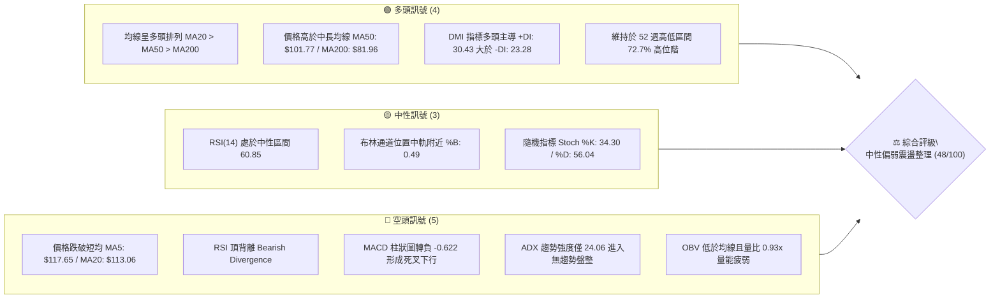
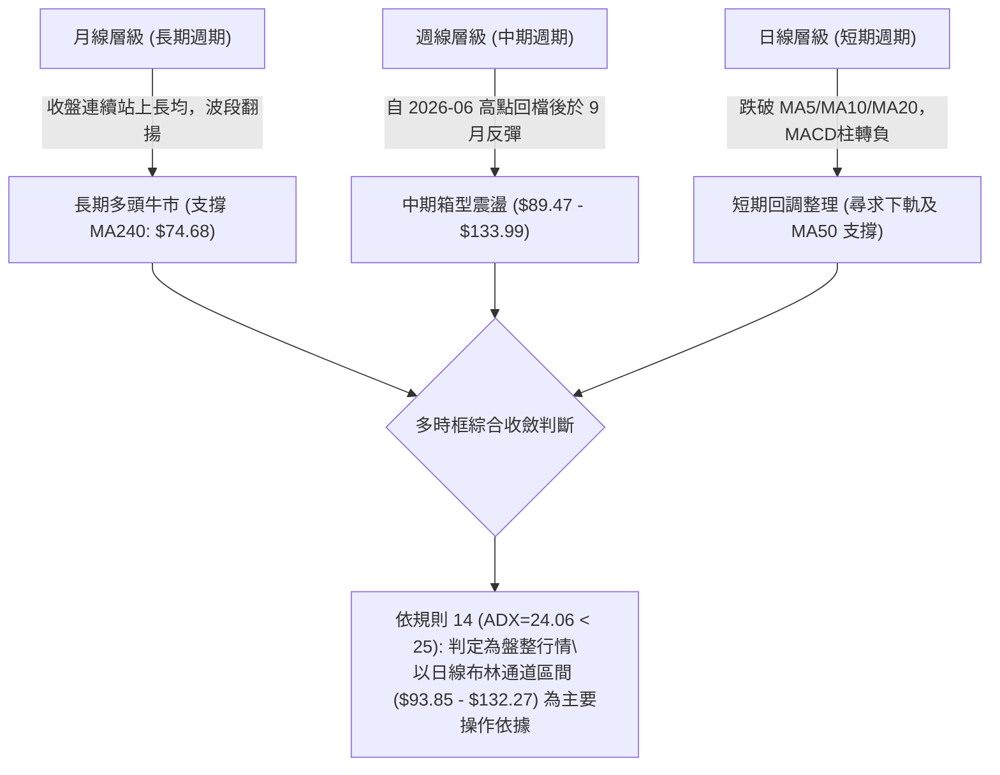
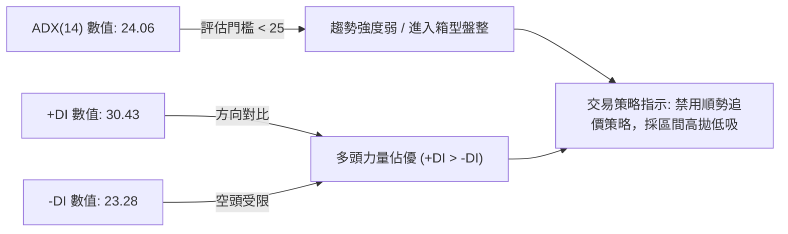
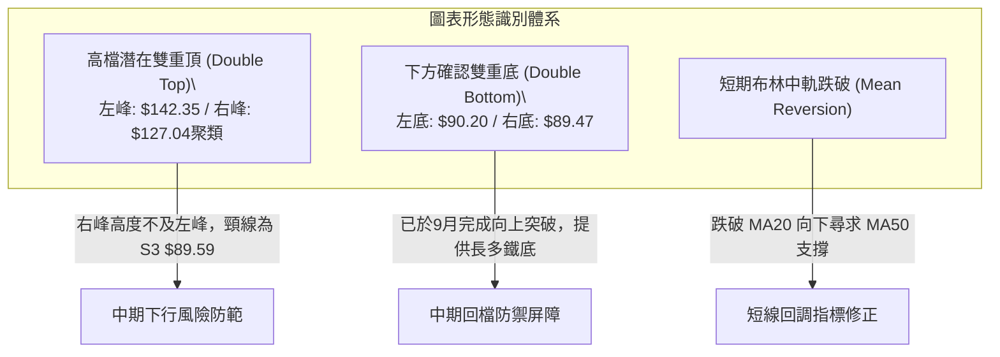
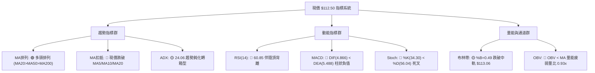
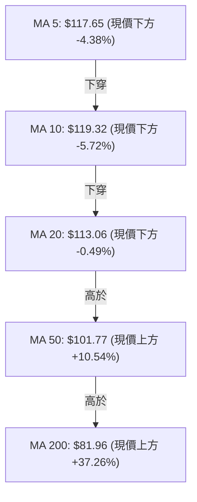
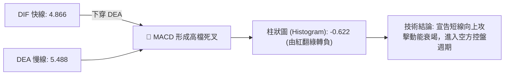
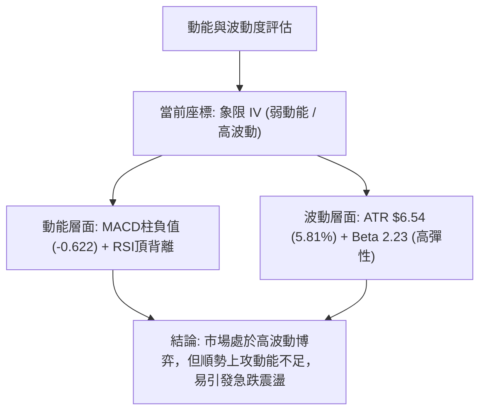
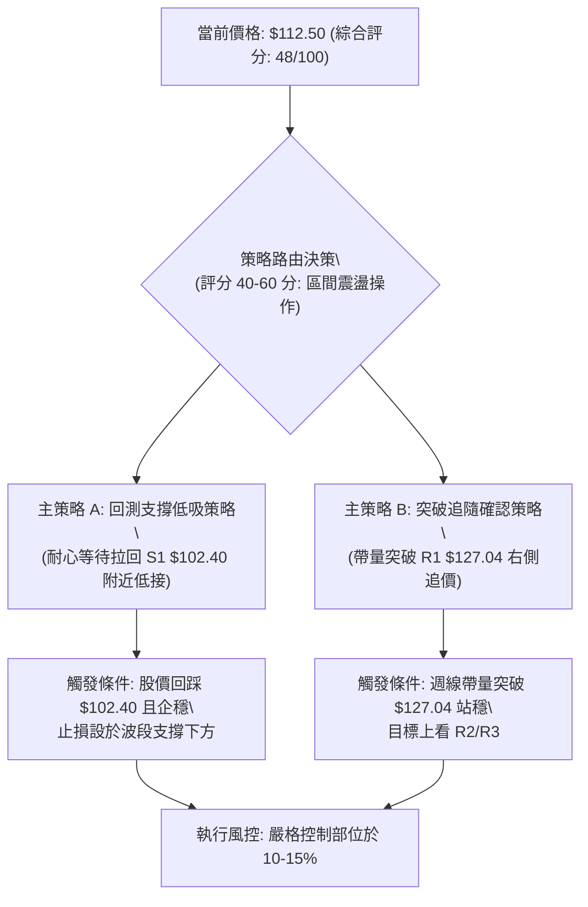
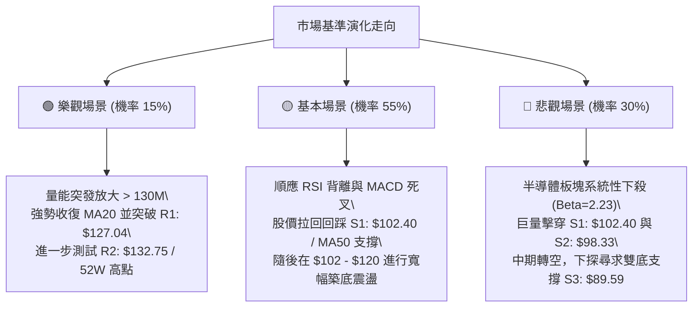

# INTC 技術分析報告

> **報告日期**：2026-10-07 ｜ **語言**：繁體中文 ｜ **數據來源**：Yahoo Finance ｜ **當前價格**：$112.50

---

## 目錄

| 章節 | 內容 |
|------|------|
| [1. 技術面概覽](#1-技術面概覽) | 訊號儀表板、核心指標、評分卡 |
| [2. 趨勢分析](#2-趨勢分析) | 多時框趨勢、長中短期走勢 |
| [3. 圖表形態分析](#3-圖表形態分析) | 形態識別、K線組合、目標價 |
| [4. 支撐與阻力](#4-支撐與阻力) | 關鍵價位、斐波那契回調 |
| [5. 技術指標深度解讀](#5-技術指標深度解讀) | MA/RSI/MACD/布林/成交量 |
| [6. 動能與波動率](#6-動能與波動率) | 動能評估、ATR、Beta |
| [7. 多時框架總結](#7-多時框架總結) | 時框架評分矩陣 |
| [8. 交易策略建議](#8-交易策略建議) | 多空策略、風險報酬比 |
| [9. 風險提示與監控](#9-風險提示與監控) | 監控指標、風險場景 |

---

## 1. 技術面概覽

### 🎯 技術訊號儀表板



### 📊 核心指標速覽表

| 指標類別 | 指標名稱 | 當前數值 | 訊號 | 解讀 |
|----------|----------|----------|------|------|
| **價格** | 當前收盤價 | $112.50 | 🟡 | 位於52週區間72.7%處，短線遭遇高檔拉回壓力 |
| **均線** | MA20 (短趨勢) | $113.06 | 🔴 | 現價位於MA20下方（-0.49%），短線跌破月線支撐 |
| **均線** | MA50 (季線) | $101.77 | 🟢 | 現價高於MA50（+10.54%），中期多頭結構尚未破壞 |
| **均線** | MA200 (年線) | $81.96 | 🟢 | 遠高於長期牛熊分界線（+37.26%），長期多頭基底穩固 |
| **動能** | RSI(14) | 60.85 | 🔴 | 數值落於中性區間，但出現明確頂背離警訊 |
| **動能** | MACD (12,26,9) | 4.866 / 5.488 | 🔴 | 柱狀圖為 -0.622，DIF跌破DEA形成死亡交叉 |
| **動能** | 隨機指標 (Stoch) | K: 34.30 / D: 56.04 | 🔴 | 快線已自高檔死叉慢線向下發散，動能轉弱 |
| **強度** | ADX(14) | 24.06 | 🟡 | 數值低於25，代表單邊趨勢停滯，轉入區間震盪行情 |
| **方向** | DMI (+DI / -DI) | 30.43 / 23.28 | 🟢 | 多頭方向線仍高於空頭線，長多架構尚未崩解 |
| **通道** | 布林通道 %B | 0.49 | 🟡 | 緊貼中軌（$113.06），上下軌區間為 $93.85 至 $132.27 |
| **成交量**| 量比 / OBV | 0.93x / OBV < MA | 🔴 | 成交量 101.56M 低於20日均量，OBV跌破均線顯示籌碼外流 |
| **波動** | ATR(14) | $6.54 | 🟡 | 占股價 5.81%，日內與波段價格波動幅度較大 |

### 🏆 技術評分卡

```
╔══════════════════════════════════════════════════════════════════╗
║                   技術評分卡 — INTC (2026-10-07)                 ║
╠══════════════════════════════════════════════════════════════════╣
║ 趨勢強度 (ADX=24.06)    ██████░░░░░░░░░░░░  30/100  🔴 弱趨勢/盤整║
║ 動能指標 (RSI頂背離/MACD)████░░░░░░░░░░░░░░  20/100  🔴 動能死叉轉空║
║ 支撐穩定度 (S1=$102.40) ██████████████░░░░  70/100  🟢 季線/S1防線強║
║ 成交量配合 (OBV量價背離)██████░░░░░░░░░░░░  30/100  🔴 買盤動能衰退║
║ 形態完整度 (雙重頂雛形) ██████████░░░░░░░░  50/100  🟡 構築高檔震盪║
║ 均線排列 (MA20>50>200)  ████████████████░░  80/100  🟢 中長多頭排列║
╠══════════════════════════════════════════════════════════════════╣
║ 綜合技術評分            █████████░░░░░░░░░░  48/100  🟡 中性觀望/區間║
╚══════════════════════════════════════════════════════════════════╝
```

---

## 2. 趨勢分析

### 🌐 多時框趨勢分析

根據多時框收斂體系，當前日線與週線出現分歧。趨勢強度指標 ADX(14) 讀數為 24.06（小於臨界值 25），確立當前市場非單邊強烈單向趨勢，而是進入**高檔大區間寬幅盤整**架構。



### 📈 長期趨勢 — 12個月走勢圖（Unicode）

INTC 過去一年經歷了爆發性重估行情。自 2025 年底約 $37 美元起漲，於 2026 年 6 月創下 $139.63 的月收盤高點（52週最高來到 $142.35），隨後在 7-8 月劇烈洗盤回踩 $89.51，9 月強力反彈至 $120.23，10 月初收盤拉回至 $112.50。

```
INTC 月線走勢圖（過去12個月：2025-11 至 2026-10）
價格軸 ($)
$140 ┤                                     ●(2026-06: $139.63)
$130 ┤                                    / \
$120 ┤                                   /   \       ●(2026-09: $120.23)
$110 ┤                             ●    /     \     / \
$100 ┤                            / (05)       \   /   ●←現在($112.50)
$90  ┤                      ●    /              ●─●(07-08: $89.51)
$80  ┤                     / (04)
$70  ┤                    /
$60  ┤                   /
$50  ┤             ●    /
$40  ┤ ●(11) ●(01)/ (02-03)
$30  ┤   \   /
$20  ┤    ●(12: $36.90)
     └────────────────────────────────────────────────────────────
       11  12  01  02  03  04   05   06   07   08   09   10 (月份)
```

**走勢特徵分析表格**：

| 階段區間 | 時間長度 | 起迄價格 | 漲跌幅 | 走勢結構與特徵分析 |
|----------|----------|----------|--------|--------------------|
| 底部啟動期 | 2025/11 - 2026/03 | $40.56 → $44.13 | +8.80% | 底部收斂三角整理，突破蓄勢，均線開始向上糾結發散 |
| 主升爆發期 | 2026/03 - 2026/06 | $44.13 → $139.63 | +216.41% | 史詩級跳空推升，成交量急劇放大，衝擊 52 週高點 $142.35 |
| 獲利回吐期 | 2026/06 - 2026/08 | $139.63 → $89.51 | -35.89% | 高檔巨量長黑回踩，連續兩月大跌回測 50% 斐波那契區域 |
| 二度反彈期 | 2026/08 - 2026/09 | $89.51 → $120.23 | +34.32% | 技術面 V 型急拉，週線連三紅，但未能突破前期歷史天花板 |
| 當前停滯期 | 2026/09 - 2026/10 | $120.23 → $112.50 | -6.43% | 受制於 R1($127.04) 阻力，量縮跌破短期均線，呈現滯漲整理 |

### 📊 中期趨勢（週線分析）

中期走勢呈現典型「雙峰式寬幅區間震盪」。自 2026 年 6 月創高回落後，空方於 8 月打出低點 $89.47（形成強支撐 S3: $89.59），隨後多頭拉升至 2026 年 9 月末的 $123.00，但面臨上方 R1: $127.04 與 R2: $132.75 密集套牢賣壓，週線 RSI 達到 72.2 後迅速降溫至 60.9，MACD 柱由紅翻綠至 -0.622。

```
週線走勢結構示意圖：
  $142.35 ┬─────── 52W 高點 (2026-06)
          │        ▲
  $132.75 ┼─────── 阻力 R2 (6月下旬週收盤高位聚類 $133.99)
          │             ▲
  $127.04 ┼──────────── 阻力 R1 (9月反彈遇阻波段高點聚類)
          │                  ▲
  $112.50 ┼─────────────────── [當前週收盤現價]
          │                  ▼
  $102.40 ┼──────────── 支撐 S1 (9月起漲點聚類 $101.65 / MA50)
          │             ▼
  $89.59  ┴─────── 支撐 S3 (7-8月雙底支撐聚類 $89.47 / $90.20)
```

### ⚡ 趨勢強度評估（ADX 解讀）



**ADX 強度對照與解讀表**：

| ADX 數值區間 | 趨勢狀態 | 當前數值 | 實質技術涵義 |
|--------------|----------|----------|--------------|
| 00.00 - 20.00 | 完全無趨勢 / 窄幅盤整 | — | 波動枯竭，方向不明 |
| **20.00 - 25.00** | **趨勢衰退 / 轉入箱型整理** | **24.06** 🟡 | **先前上漲趨勢動能耗盡，價格受制於上下軌界限** |
| 25.00 - 40.00 | 具備明確單邊趨勢 | — | 順勢交易最佳時期 |
| 40.00 以上   | 極強單邊趨勢 / 超買超賣 | — | 趨勢過熱，注意隨時反轉 |

---

## 3. 圖表形態分析

### 🔍 形態識別系統

在多時框架與當前價格走勢下，INTC 於高檔區間展現出「潛在雙重頂（M頭）」形態，並在下方 $89.50-$90.20 構築了穩固的「中期雙重底」架構。



**圖表形態信心度評估表**：

| 形態名稱 | 信心度 (%) | 判斷依據（嚴格引用數據） | 完成度 (%) | 目標價（附嚴謹計算式） |
|----------|------------|--------------------------|------------|------------------------|
| **高檔潛在雙重頂 (M頭)** | **62%** | 左峰 $142.35，右峰阻力聚類 R1: $127.04。RSI 出現頂背離，現價跌破 MA20。 | 45% (尚未跌破頸線) | 若未來有效跌破頸線 S3: $89.59，推算理論跌幅：$89.59 - ($127.04 - $89.59) = $52.14（接近 78.6% 回調位 $56.31） |
| **中期確認雙重底 (W底)** | **85%** | 2026/08/02 低點 $90.20 與 2026/08/30 低點 $89.47 兩度獲守，獲支撐位 S3: $89.59 確認。 | 100% (9月已成功突破) | 頸線為 8月中高點 $102.50，突破後推算高度：$102.50 + ($102.50 - $89.47) = $115.53，已於 9 月完全達成 |
| **布林帶跌破指標形態** | **78%** | 收盤價 $112.50 跌破中軌 MA20: $113.06，%B 降至 0.49。 | 100% (當前已觸發) | 形態均值回歸目標價為布林下軌：$93.85 |

### 🕯️ 重要K線形態分析

| 週/月份 | 收盤價 | K線形態 | 解讀 | 訊號 |
|---------|--------|---------|------|------|
| 2026-06 | $139.63 | 爆量長上影天劍線 | 創 52 週高點 $142.35 後主力高檔出貨，多頭竭盡標誌 | 🔴 強烈見頂 |
| 2026-07 | $90.20 | 光腳大陰線吞噬 | 單月重挫近 50 美元，多頭停損賣壓湧現，長黑灌破季線 | 🔴 恐慌殺多 |
| 2026-08 | $89.51 | 低檔長下影十字星線 | 兩度下探 $89.47 均收出長下影線，確立空頭殺力耗竭 | 🟢 築底成功 |
| 2026-09 | $120.23 | 帶量中長陽實體線 | 多方強烈技術性反撲，收復百元關卡與 MA50 | 🟢 逆轉彈升 |
| 2026-10 | $112.50 | 上影高檔倒轉鎚頭/孕線 | 上攻無力受阻於 R1: $127.04，週線 MACD 轉負，多頭暫歇 | 🔴 滯漲回調 |

### 📉 ASCII 走勢形態示意圖

```
INTC 關鍵圖表形態結構演化圖（週線視角）：
    峰1: 52W 高點 $142.35
          ▲
         / \                               峰2: 阻力 R1 $127.04 (9月反彈頂)
        /   \                                     ▲
       /     \                                   / \
      /       \                                 /   \
     /         \      頸線區間: $102.50         /     ●← 當前現價 $112.50 (跌破MA20)
    /           \──────────────┬──────────────/       │
   /                            \             /        ▼ (指向 S1 / BB下軌)
  /                              \           /
                                  ▼         ▼
                            底1: $90.20   底2: $89.47
                            (支撐位 S3: $89.59 雙底確認)
```

### 🎯 形態目標價計算

1. **短期下行回調目標價**：
   - 當前屬於日線跌破布林中軌（$113.06）的均值回歸走勢。
   - 理論第一目標價：第一關鍵支撐位 **S1: $102.40**（與 MA50: $101.77 形成共振支撐區）。
   - 理論第二極限目標價：布林通道下軌 **$93.85**。
2. **中期多頭延伸目標價（需突破 R1）**：
   - 突破阻力位 R1（$127.04）後，向上測算至近期密集成交波段高點阻力 **R2: $132.75**。
   - 若能克服 R2，則挑戰 52 週歷史高點阻力位 **R3: $141.90**。

---

## 4. 支撐與阻力

### 🗺️ 關鍵價位分布圖（Unicode）

```
INTC 價位結構分布圖（嚴格依據 OHLCV 聚類與斐波那契計算）
═══════════════════════════════════════════════════════════════════
$142.35 ║██████████████████████████████║ 52W 最高點 / 斐波那契 0.0%
$141.90 ║████████████████████████████  ║ 強阻力 R3 (+26.13%)
$132.75 ║██████████████████████        ║ 阻力 R2 (+18.00%) / BB上軌附近
$127.04 ║████████████████████          ║ 關鍵阻力 R1 (+12.92%)
$116.52 ║▓▓▓▓▓▓▓▓▓▓▓▓▓▓▓▓▓▓            ║ 斐波那契 23.6% 回調壓力位
────────╨──────────────────────────────╨───────────────────────────
$112.50 ╠══════════════════════════════╣ ◄ 現價 (市價位階)
────────╥──────────────────────────────╥───────────────────────────
$102.40 ║▓▓▓▓▓▓▓▓▓▓▓▓▓▓▓▓              ║ 近期第一強支撐 S1 (-8.98%)
$100.54 ║▓▓▓▓▓▓▓▓▓▓▓▓▓▓▓               ║ 斐波那契 38.2% 回調支撐位 / MA50 共振
$98.33  ║████████████████████          ║ 關鍵波段支撐 S2 (-12.60%)
$93.85  ║▓▓▓▓▓▓▓▓▓▓▓▓                  ║ 布林通道下軌支撐
$89.59  ║████████████████████████████  ║ 鐵底強支撐 S3 (-20.36%) / 7-8月雙底
$87.62  ║██████████████████████████████║ 斐波那契 50.0% 中樞回調位
═══════════════════════════════════════════════════════════════════
```

### 🚧 阻力位分析表

所有阻力價位嚴格引用自近一年波段高點聚類數據：

| 阻力級別 | 價位 | 形成原因 | 突破難度 | 重要性 |
|----------|------|----------|----------|--------|
| **R1** | **$127.04** | 2026年9月反彈波段高點密集套牢區，週線巨量受阻區域 | 🟡 中等偏高 | 極高；此處為短線多空分水嶺，未越過前屬於反彈波架構 |
| **R2** | **$132.75** | 2026年6月下旬週收盤高位聚類（週收 $133.99 / $128.32），接近布林上軌 $132.27 | 🔴 極高 | 高；主力中期出貨頭部區，具備沉重解套賣壓 |
| **R3** | **$141.90** | 52週歷史天花板聚類（52W High 為 $142.35），歷史歷史頂部阻力 | 🔴 極難 | 最高；若無超級基本面利多催化，短中期難以直接穿越 |

### 🛡️ 支撐位分析表

所有支撐價位嚴格引用自近一年波段低點聚類數據：

| 支撐級別 | 價位 | 形成原因 | 守住機率 | 重要性 |
|----------|------|----------|----------|--------|
| **S1** | **$102.40** | 2026年9月初發動起漲點低位聚類（$101.65），緊貼 MA50 季線 $101.77 | 🟢 75% | 極高；中期多頭趨勢最後防線，失守意味中期轉弱 |
| **S2** | **$98.33** | 2026年6-7月拉回修正時的週線換手平台低點聚類 | 🟡 65% | 中等；整數心理關卡 $100 下方之重要緩衝區間 |
| **S3** | **$89.59** | 2026年7-8月築底波段低點聚類（週收 $90.20 與 $89.47 之雙重底鐵底） | 🟢 85% | 最高；長期牛市防禦最後底線，跌破則預示全面轉入熊市 |

### 📐 斐波那契回調位分析

依據 52 週極端區間（低點 $32.89 至 高點 $142.35，波幅 $109.46）嚴格計算之回調位階：

| 回調比率 | 精確價位 | 相對現價位置 | 技術分析與結構解讀 |
|----------|----------|--------------|--------------------|
| 0.0% (52W High) | $142.35 | +26.53% | 歷史極限高點，牛市第一階段頂部 |
| **23.6%** | **$116.52** | **+3.57%** | **現價下方短線壓力位**。現價（$112.50）已失守此位置，轉為上方反壓 |
| **38.2%** | **$100.54** | **-10.63%** | **強支撐黃金分割位**。與 S1（$102.40）及 MA50（$101.77）高度共振 |
| 50.0% | $87.62 | -22.12% | 多空平衡中樞線，下方緊鄰 S3（$89.59），具備極強結構買盤 |
| 61.8% | $74.70 | -33.60% | 深度回調警戒線，緊靠 240 日均線（$74.68） |
| 78.6% | $56.31 | -49.95% | 牛熊轉換防守點，長期價值中樞 |
| 100.0% (52W Low)| $32.89 | -70.76% | 起漲原點 |

**現價區間解讀**：現價 $112.50 處於斐波那契 **23.6% ($116.52)** 與 **38.2% ($100.54)** 之間。在技術分析定義中，跌破 23.6% 意味著極強單邊主升浪結束，股價正尋求回踩 38.2%（$100.54）尋求支撐確認。

---

## 5. 技術指標深度解讀

### 🎛️ 指標訊號總覽



### 📈 移動平均線排列分析



**均線狀態明細解析表**：

| 均線週期 | 當前數值 | 現價差距 | 趨勢方向 | 技術面意涵 |
|----------|----------|----------|----------|------------|
| MA 5 | $117.65 | -4.38% | 快速下行 ▼ | 極短線空方主導，形成超短線下壓反壓線 |
| MA 10 | $119.32 | -5.72% | 拐頭向下 ▼ | 短期均線形成蓋頭反壓，多頭無力護盤 |
| MA 20 | $113.06 | -0.49% | 趨緩走平 ▼ | 月線生命線失守，短線多頭結構破壞，轉入弱勢整理 |
| MA 50 | $101.77 | +10.54% | 穩定向上 ▲ | 中期季線防守堅固，與支撐 S1（$102.40）構成密集支撐帶 |
| MA 60 | $101.34 | +11.01% | 向上發散 ▲ | 中期多頭基石依然向上延伸 |
| MA 120 | $105.72 | +6.41% | 向上發散 ▲ | 半年線位階正常，無長期轉熊跡象 |
| MA 200 | $81.96 | +37.26% | 強烈向上 ▲ | 長期牛市核心分水嶺，基底極為扎實 |
| MA 240 | $74.68 | +50.64% | 長期多頭 ▲ | 年線長期斜率陡峭向上，長線大底穩若磐石 |

**均線總評**：呈現「短期糾結轉空、中長期多頭排列」的典型高位回檔結構。現價跌破 MA20 表明短線回調壓力未消，但 MA50 與 MA200 仍呈健康的多頭間距，尚未出現中長期轉向訊號。

### 📉 RSI(14) 分析

當前日線 RSI(14) 讀數為 **60.85**，處於中性偏多區間（30-70）。

- **RSI 強度進度條**：
  `0 ────────────── 30 ───────────── 50 ──────── 60.85 ─── 70 ────────────── 100`
  `[超賣區]         [偏弱區]         [中性]     [當前]   [超買區]`
  進度指標：████████████░░░░░░░░ 60.85%

- **頂背離判定（嚴格確認 ⚠️）**：
  - **價格走勢**：週線收盤自 2026-06 高點回檔後，於 2026-10-04 再度反彈挑戰高位 $119.33（盤中衝高至 R1 $127.04 附近），但在 2026-09-27 至 2026-10-04 期間，股價維持高位震盪。
  - **指標走勢**：週線 RSI 自 2026-10-04 的 72.2 急速下滑至 2026-10-11 的 **60.9**；日線層級更是出現「股價高位持平，RSI 峰值顯著降低」的典型**頂背離（Bearish Divergence）**特徵。
  - **結論**：動能無法跟隨價格擴張，暗示上方追價買盤意願枯竭，短線存在高度修正機率。

### 📊 MACD(12/26/9) 訊號解讀



週線層級 MACD 柱狀圖在 2026-09-27 達到高峰 **+2.925** 後，連續縮小至 2026-10-04 的 **+0.435**，最新一週（2026-10-11）正式翻綠至 **-0.622**。此現象確認了動能週期的衰退，修正波至少將延續數週。

### 📦 布林通道分析

當前布林通道（20, 2）參數指標：
- **上軌 (Upper Band)**：$132.27
- **中軌 (Middle Band / MA20)**：$113.06
- **下軌 (Lower Band)**：$93.85
- **帶寬指標 %B**：0.49

```
INTC 布林通道當前位置示意圖：
$132.27 ┬────────────────────────────────────────── 布林上軌 (強阻力 R2 附近)
        │
        │
$113.06 ┼─────────────────●──────────────────────── 布林中軌 (MA20)
$112.50 ┼──────────────────▲─────────────────────── 【現價 $112.50 (%B = 0.49)】
        │                  │
        │                  ▼ (尋求支撐方向)
$93.85  ┴────────────────────────────────────────── 布林下軌 (支撐 S2/S3 緩衝區)
```

**解讀**：%B 讀數為 0.49，顯示價格已失守中軌通道，正式運行於中軌與下軌之間的弱勢整理帶。在 ADX=24.06 的震盪格局下，價格具有沿著中軌向下軌（$93.85）尋求均值回歸的慣性。

### 💹 成交量分析（量價配合度）

1. **量能萎縮**：最新成交量為 101,557,000 股，相較於 20 日均量（109,374,345 股），量比僅為 **0.93x**，顯著低於正常水準。
2. **週成交量驟降**：回顧近20週成交走勢，9月攻擊波週量維持在 600M 股左右，而 2026-10-11 當週成交量急縮至 182,888,800 股，顯示追高資金退潮。
3. **OBV（能量潮）走勢**：技術數據明確顯示「**OBV < MA → 量能疲弱**」。在股價試圖維持於 $112.50 附近時，OBV 指標領先跌破其移動平均線，構成標準的「價平量縮、能量背離」，證實機構法人近期並未進行吸籌，反而是在高檔進行獲利調節。

---

## 6. 動能與波動率

### ⚡ 動能評估四象限

評估當前 INTC 在「動能強度」與「波動率」維度中的座標定位：

| 象限 | 動能強度 | 波動率水準 | 當前狀態標註 | 策略與特徵評估 |
|------|----------|------------|--------------|----------------|
| **象限 I** (突破爆發) | 強 (+DI遠大於-DI) | 高 (ATR > 6%) | — | 主升浪爆發，追隨趨勢 |
| **象限 II** (穩步推升) | 強 (MACD紅柱擴張) | 低 (ATR < 4%) | — | 健康牛市格局，拉回加碼 |
| **象限 III** (低波沉寂) | 弱 (ADX < 20) | 低 (通道緊縮) | — | 盤整蓄勢，觀望為主 |
| **象限 IV** (高波震盪回檔) | **弱 (動能死叉轉負)** | **高 (ATR=5.81%, Beta=2.23)** | **✓ (INTC 當前座標)** | **高風險高波動，動能衰退，嚴格防範洗盤回撤** |



### 📊 ATR 波動率分析

- **ATR(14) 數值**：**$6.54**，占當前股價之 **5.81%**。
- **波動特性**：INTC 目前每日平均震盪區間達到 $6.54 美元，屬於典型的高波動科技半導體股票。任何短線雜訊均可能引發超過 5 美元的日內振幅。
- **止損距離建議**：
  - 短線操作（日內/隔夜）：建議止損距離至少設定為 **1.0 × ATR = $6.54**。
  - 波段操作（Swing Trading）：建議止損距離設定為 **1.5 × ATR = $9.81**，以避免在區間震盪被隨機波動洗出場。
  - 關鍵防守空間：若自進場點防守，必須跨越 ATR 波動緩衝區，確保止損位與支撐位（如 S1: $102.40）相契合。

### 📐 Beta 與市場相關性

- **Beta 係數**：**2.23**。
- **市場彈性分析**：Beta 值高達 2.23，代表 INTC 的波動幅度為標普500指數（S&P 500）的 2.23 倍。若大盤回檔 1%，INTC 技術上具有放大下跌 2.23% 的系統性風險；反之，若半導體板塊發動反彈，其彈性亦極大。
- **機構籌碼背景**：機構持股比率達 **62.6%**，內部人持股達 **14.0%**，空頭部位僅占浮動流通盤之 **3.0%**（Short Ratio: 1.74）。這說明當前市場並無龐大的軋空題材，股價回檔主要來自於機構投資人在前期巨大漲幅後的技術性獲利了結。

---

## 7. 多時框架總結

### 📋 時框架評分表

| 時框架 | 趨勢方向 | 動能狀態 | 均線排列 | 圖表形態 | 綜合評分 | 操作建議 |
|--------|----------|----------|----------|----------|----------|----------|
| **月線 (長期)** | 🟢 強烈看多 | 🟡 高檔鈍化 | 🟢 MA240多頭發散 | 波段大暴漲後高位整理 | **80/100** | 長線多單底倉續抱，設好移動停利 |
| **週線 (中期)** | 🟡 箱型震盪 | 🔴 動能翻綠 | 🟢 MA50向上支撐 | 寬幅區間 ($89.59 - $132.75) | **50/100** | 區間操作，阻力位不追高，支撐位承接 |
| **日線 (短期)** | 🔴 弱勢回調 | 🔴 死叉頂背離 | 🔴 跌破MA20月線 | 均值回歸回踩下軌 | **35/100** | 短線多單減碼避險，耐心等待止跌回測 |

### 🔲 綜合訊號矩陣

| 技術維度 | 短期 (日線) | 中期 (週線) | 長期 (月線) | 多時框一致性分析 |
|----------|-------------|-------------|-------------|------------------|
| **趨勢方向** | 🔴 跌破短期均線 | 🟡 箱型寬幅震盪 | 🟢 位於年線之上 | 中長期向上，短期出現向下修正背離 |
| **動能狀態** | 🔴 MACD柱值為負 | 🔴 柱狀縮小翻綠 | 🟢 動能柱仍位於零軸上方 | 短期空方接管，中期動能減弱 |
| **量價配合** | 🔴 OBV跌破均線 | 🟡 成交量急劇萎縮 | 🟢 長期量能基礎雄厚 | 量價缺乏攻擊共振，不利突破 |
| **超買超賣** | 🟡 RSI 60.85 中性 | 🟡 週線 RSI 降至 60.9| 🔴 月線位於高檔區間 | 過熱狀況已獲部分緩解，但未達超賣 |

### ⚖️ 多時框收斂結論

> **依據規則 14 嚴格收斂判定**：
> 1. **趨勢強度定調**：當前 ADX(14) 讀數為 **24.06（小於 25）**，系統確認進入**「非單邊盤整行情」**。
> 2. **主導層級權重**：在盤整行情中，不可盲目依照長期均線多頭而順勢追高。必須以**日線布林通道（$93.85 - $132.27）與波段高低點支撐阻力為核心交易依據**。
> 3. **方向性最終唯一結論**：**【中性偏弱震盪整理，尋求中下軌支撐】**。
>
> 價格短期受制於上方阻力 R1: $127.04，因日線跌破 MA20 且伴隨 RSI 頂背離，短線趨向回測支撐 S1（$102.40）與季線 MA50（$101.77）。第 8 章交易策略將完全依據此結論，制定「以區間下軌高盈虧比低吸、高檔防守反壓減碼」的震盪交易策略。

---

## 8. 交易策略建議

### 🗺️ 策略決策流程圖



### 🧭 策略路由（依評分卡分流）

- **當前主策略方向** = **【中性觀望與箱型下軌低吸】（依綜合評分 48/100 判定）**
- **路由說明**：技術評分落於 40–60 分之中性區間，且 ADX < 25，禁止在現價 $112.50 進行無邊界追價。策略核心定調為：**耐心等待價格回測區間下部強支撐 S1: $102.40 時分批布局多單；或在未回測前保持輕倉觀望，嚴禁半途攔轎。**

### 🎯 價格情境階梯（Price Scenarios）

所有價位嚴格引用第 4 章及關鍵價位聚類數據：

| 觸發條件 | 下一目標 | 後續延伸 | 情境含義 | 應對操作 |
|----------|----------|----------|----------|----------|
| **強勢突破 R1 ($127.04)** | **R2 ($132.75)** | **R3 ($141.90)** | 短線震盪結束，重啟多頭主升浪 | 啟動右側追隨策略，加碼做多 |
| **跌破 MA20 站穩現價區間** | **S1 ($102.40)** | **S2 ($98.33)** | 弱勢震盪回調，尋找季線均線支撐 | 耐心觀望，等待 S1 支撐低吸訊號 |
| **重挫跌破 S1 ($102.40)** | **S2 ($98.33)** | **S3 ($89.59)** | 中期多頭結構遭受破壞，考驗鐵底 | 嚴格停損出場，全面轉入空頭防禦 |

### 📊 情境機率分佈

| 情境劇本 | 機率估算 | 主要指標與結構依據 |
|----------|----------|--------------------|
| **情境一：震盪回踩支撐 S1 / 再度反彈** | **55%** | **主要場景**。受 RSI 頂背離與 MACD 死叉推動，價格必然釋放回調壓力；但下方 MA50($101.77) 與 S1($102.40) 具備強大多頭排列支撐，極高機率在此企穩反彈。 |
| **情境二：圍繞現價窄幅震盪消化** | **30%** | ADX 降至 24.06 顯示單邊動能不足，成交量持續萎縮（量比 0.93x），價格在 $108 - $118 區間沉寂。 |
| **情境三：直接向上突破 R1 阻力** | **15%** | 機率極低。在 OBV < MA、量能疲弱且無重大利多配合下，短線直接向上擊穿 $127.04 的難度極高。 |

### 🟢 主策略詳情（區間高盈虧比低吸）

依據評分卡 48/100 分流，主推兩套在關鍵價位觸發的高盈虧比交易策略：

| 策略要素 | 策略 A：S1 支撐回踩低吸策略（左側/順中長勢） | 策略 B：突破 R1 右側強勢跟隨策略（突破型） |
|----------|---------------------------------------------|-------------------------------------------|
| **適用情境** | 股價回測 S1 支撐位且量縮止跌企穩 | 股價放量長陽突破近半年波段高點 R1 |
| **進場條件** | 觸及 S1: $102.40 附近出現日線收下影線或止跌K線 | 日線收盤價實體突破 R1: $127.04 且單日成交量 > 1.2x 均量 |
| **進場價格** | **$102.40** | **$127.50** (突破後確認進場) |
| **目標價 T1** | **$116.52** (斐波那契 23.6% 回調壓力位) | **$132.75** (波段阻力 R2 / 前高聚類) |
| **目標價 T2** | **$127.04** (波段阻力 R1) | **$141.90** (52週極限高點阻力 R3) |
| **止損價格** | **$97.50** (有效跌破 S2: $98.33 約 1×ATR 緩衝) | **$120.96** (跌破 1.0×ATR: $127.50 - $6.54) |
| **風險報酬比** | **1 : 2.89** (風險 $4.90 / T1獲利 $14.12, T2獲利 $24.64) | **1 : 2.20** (風險 $6.54 / T2獲利 $14.40) |
| **成功機率** | **65%** (契合中長多頭季線支撐) | **45%** (當前盤整期突破假訊號多) |
| **建議倉位** | **15%** (標準波段配置) | **8%** (輕倉試單追隨) |

### 🔴 反向風險觸發點（對沖與停損提示）

若發生以下事件，原中長期震盪偏多邏輯將被**徹底推翻**，多單必須無條件停損或反向建立避險部位：
1. **關鍵價位崩跌**：日線收盤價跌破 **S2: $98.33**，同時跌破季線 MA50（$101.77），代表中長多結構正式扭轉，下方將直接下探雙底頸線 **S3: $89.59**。
2. **量能空方爆發**：出現單日成交量超過 150M 股的巨量長黑灌破百元關卡。
3. **對沖建議**：若跌破 $98.33，可利用衍生工具或融券對沖底倉，下看目標 $89.59。

### ⭐ 整體訊號強度評星

```
做多訊號強度：★★☆☆☆  (2.5/5星) ── 中長均線偏多，但短線動能指標出現頂背離
做空訊號強度：★★★☆☆  (3.0/5星) ── 短期均線壓制且量能疲弱，短線空方稍佔優勢
整體可信度：  ★★★★☆  (4.0/5星) ── 價位聚類與斐波那契共振明確，區間界限極為清晰
```

---

## 9. 風險提示與監控

### ✅ 關鍵監控指標 Checklist

```
╔══════════════════════════════════════════════════════════════════╗
║              INTC 每日交易關鍵監控 Checklist                      ║
╠══════════════════════════════════════════════════════════════════╣
║ [ ] 價格是否重新收復 MA20 ($113.06)？（收復方可化解短線拉回危機） ║
║ [ ] RSI(14) 是否能突破 65 消除頂背離？                            ║
║ [ ] MACD 柱狀圖（當前 -0.622）是否持續擴大綠柱？                  ║
║ [ ] ADX(14)（當前 24.06）是否回升突破 25？確認新單邊方向？        ║
║ [ ] 成交量是否低於 90M（進一步流動性衰退）或突發巨量？            ║
║ [ ] 股價是否觸及回踩 S1: $102.40 與季線 MA50: $101.77 支撐區？     ║
║ [ ] 費城半導體指數（SOX）與大盤連動（INTC Beta: 2.23 敏感度極高） ║
╚══════════════════════════════════════════════════════════════════╝
```

### ⚠️ 風險場景分析



### 🛡️ 風險管理重要提醒

1. **Beta 槓桿效應控制**：由於 INTC 的 Beta 值高達 **2.23**，其價格敏感度為大盤的兩倍以上。在建立倉位時，應主動將傳統持股部位**縮減至常態部位的 50% - 70%**，以防範隔夜美股市場劇烈波動帶來的回撤衝擊。
2. **ATR 動態風控設定**：當前 ATR(14) 高達 **$6.54 (5.81%)**。切忌將止損設定在 2-3 美元的極短區間內，該類雜訊區間極易造成不必要的連續停損損耗。停損距離必須預留 **1.5 × ATR（約 $9.81）** 之緩衝空間。
3. **避免追高陷阱**：在 ADX 指標小於 25 的環境中，「突破追價」策略的失敗率（假突破）高達 50% 以上。投資人切忌在價格反彈逼近 R1（$127.04）或布林上軌時追買，而應堅持「支撐埋伏、阻力減碼」的箱型操作紀律。

---

## 📋 報告總結

```
╔══════════════════════════════════════════════════════════════════╗
║                   INTC 技術分析報告總結                          ║
╠══════════════════════════════════════════════════════════════════╣
║ 報告日期：2026-10-07                                             ║
║ 當前價格：$112.50                                                ║
║ 分析評級：⚖️ 中性觀望 / 箱型震盪整理 (評分: 48/100)               ║
╠══════════════════════════════════════════════════════════════════╣
║ 關鍵結論：                                                       ║
║ ├─ 長期趨勢：🟢 強烈偏多 (遠高於 MA200: $81.96 與年線)            ║
║ ├─ 中期趨勢：🟡 箱型寬幅震盪 ($89.59 至 $132.75)                 ║
║ ├─ 短期趨勢：🔴 弱勢修正 (跌破 MA20，RSI頂背離，MACD柱轉負)      ║
║ ├─ 關鍵支撐：S1: $102.40 ｜ S2: $98.33 ｜ S3: $89.59             ║
║ ├─ 關鍵阻力：R1: $127.04 ｜ R2: $132.75 ｜ R3: $141.90           ║
║ └─ 外資共識：買入 (43位分析師均價: $118.05 / 區間 $80 - $200)   ║
╠══════════════════════════════════════════════════════════════════╣
║ 最優策略組合：                                                   ║
║ 1. 🥇 最佳機會：等待拉回至 S1: $102.40 (季線MA50) 企穩低吸 (策略A)║
║                 風險報酬比高達 1:2.89，防守點明確 ($97.50)。      ║
║ 2. 🥈 次選機會：右側帶量突破 R1: $127.04 後順勢追隨 (策略B)       ║
║                 需密切配合週成交量 > 600M 驗證。                 ║
║ 3. 🥉 保守選擇：當前於 $112.50 空倉觀望，不參與無趨勢之雜訊震盪。║
╚══════════════════════════════════════════════════════════════════╝
```

---

> ⚠️ **免責聲明**：本報告為 AI 自動生成之技術分析，所有數據及估算均基於提供的歷史價格與量化技術指標資訊。本報告**僅供研究與學術參考**，**不構成任何形式之個人化投資建議或買賣要約**。半導體板塊波動劇烈（Beta=2.23），投資有風險，入市需獨立審慎評估，並自負盈虧責任。

---

*報告生成時間：2026-10-07 ｜ 數據來源：Yahoo Finance ｜ 分析框架：多時框架量化技術分析*