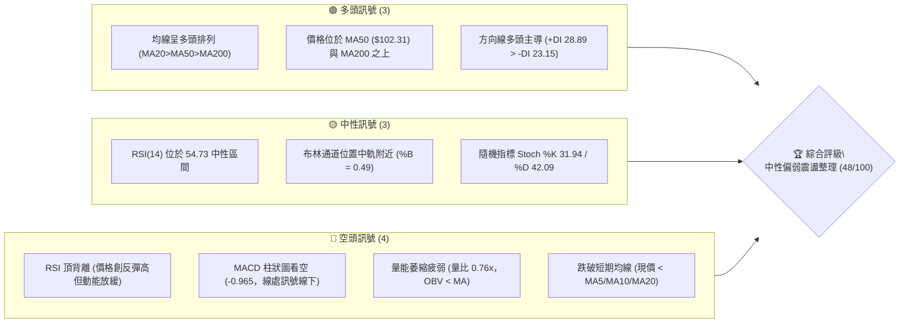
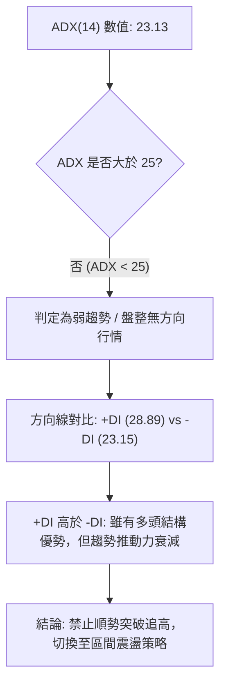
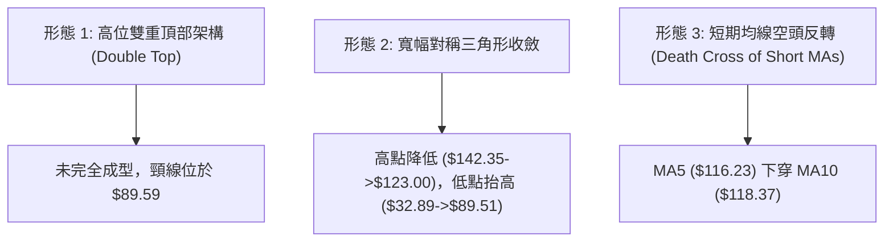
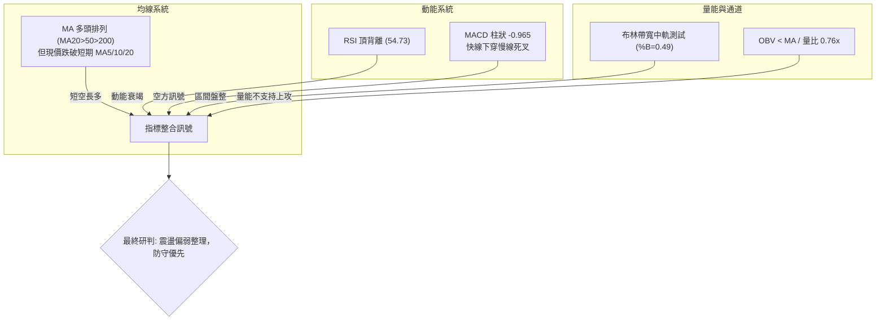
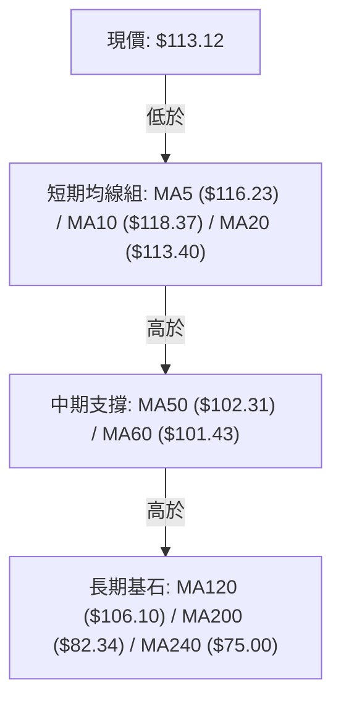
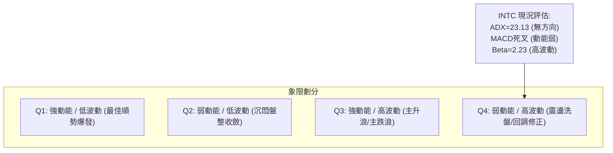
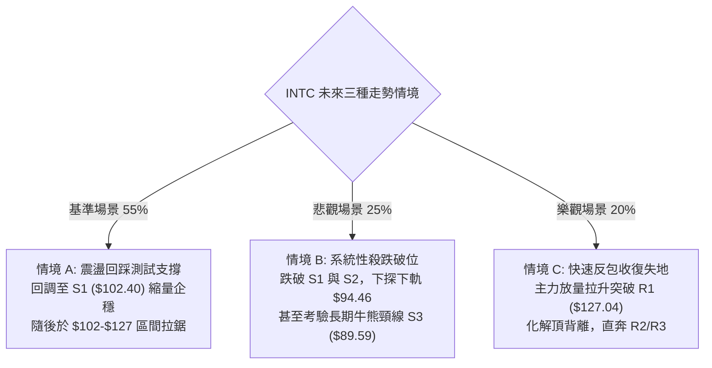

# INTC 技術分析報告

> **報告日期**：2026-10-08 ｜ **語言**：繁體中文 ｜ **數據來源**：Yahoo Finance ｜ **當前價格**：$113.12

---

## 目錄

| 章節 | 內容 |
|------|------|
| [1. 技術面概覽](#1-技術面概覽) | 訊號儀表板、核心指標、評分卡 |
| [2. 趨勢分析](#2-趨勢分析) | 多時框趨勢、長中短期走勢 |
| [3. 圖表形態分析](#3-圖表形態分析) | 形態識別、K線組合、目標價 |
| [4. 支撐與阻力](#4-支撐與阻力) | 關鍵價位、斐波那契回調 |
| [5. 技術指標深度解讀](#5-技術指標深度解讀) | MA/RSI/MACD/布林/成交量 |
| [6. 動能與波動率](#6-動能與波動率) | 動能評估、ATR、Beta |
| [7. 多時框架總結](#7-多時框架總結) | 時框架評分矩陣 |
| [8. 交易策略建議](#8-交易策略建議) | 多空策略、風險報酬比 |
| [9. 風險提示與監控](#9-風險提示與監控) | 監控指標、風險場景 |

---

## 1. 技術面概覽

### 🎯 技術訊號儀表板



### 📊 核心指標速覽表

| 指標類別 | 指標名稱 | 當前數值 | 訊號 | 解讀 |
|----------|----------|----------|------|------|
| **價格** | 當前價格 | $113.12 | 🟡 | 跌破 MA20 ($113.40)，處於短期回調測試中軌狀態 |
| **均線** | MA20 | $113.40 | 🔴 | 現價 $113.12 跌破 MA20 (-0.25%)，短期均線走彎 |
| **均線** | MA50 | $102.31 | 🟢 | 現價高於 MA50 (+10.57%)，中期趨勢保護基底完好 |
| **均線** | MA200 | $82.34 | 🟢 | 現價大幅高於長期年線 (+37.38%)，長期牛市架構未破 |
| **動能** | RSI(14) | 54.73 | 🔴 | 數值中性但具備明確「頂背離」結構，買盤推力衰退 |
| **動能** | MACD(12,26,9) | 4.281 / 5.246 | 🔴 | MACD 柱狀圖 -0.965 翻負，DIF 下穿 MACD 訊號線 |
| **動能** | Stoch %K/%D | 31.94 / 42.09 | 🟡 | 隨機指標指向下行，尚未觸及超賣區，動能偏弱 |
| **趨勢** | ADX(14) | 23.13 | 🟡 | ADX < 25 處於無明顯趨勢之盤整/震盪行情 |
| **通道** | 布林通道 | %B = 0.49 | 🟡 | 現價緊貼 BB 中軌 ($113.40)，通道區間為 $94.46–$132.34 |
| **成交量**| 20日成交量比 | 0.76x (82.51M) | 🔴 | 低於 20 日均量 (108.67M)，OBV < MA 量價背離 |
| **波動** | ATR(14) | $6.10 (5.39%) | 🟡 | 每日平均波動幅度 $6.10，日內波動風險適中 |

### 🏆 技術評分卡

```
╔══════════════════════════════════════════════════════════════════╗
║                   技術評分卡 — INTC (2026-10-08)                 ║
╠══════════════════════════════════════════════════════════════════╣
║ 趨勢強度 (ADX=23.13)   ████████░░░░░░░░░░░░  42/100  🟡 弱趨勢盤整 ║
║ 動能指標 (RSI頂背/MACD) ██████░░░░░░░░░░░░░░  32/100  🔴 動能轉弱  ║
║ 支撐穩定度 (MA50/S1)   ██████████████░░░░░░  68/100  🟢 支撐帶密實 ║
║ 成交量配合 (OBV疲弱)   ██████░░░░░░░░░░░░░░  30/100  🔴 量能萎縮  ║
║ 形態完整度 (回調中繼)   ██████████░░░░░░░░░░  52/100  🟡 寬幅箱體  ║
║ 均線排列 (多頭排列)     ██████████████░░░░░░  70/100  🟢 長多短空  ║
╠══════════════════════════════════════════════════════════════════╣
║ 綜合評分               █████████░░░░░░░░░░░  48/100  🟡 中性觀望   ║
╚══════════════════════════════════════════════════════════════════╝
```

---

## 2. 趨勢分析

### 🌐 多時框趨勢分析

```mermaid
graph TD
    A["月線層級 (長期)"] -->|"MA200 = $82.34 向上<br>低點一路抬高"| B["🟢 長期多頭主升段架構"]
    C["週線層級 (中期)"] -->|"高點 $142.35 回落<br>近期反彈至 $123.00 遇阻"| D["🟡 中期高位寬幅箱體震盪"]
    E["日線層級 (短期)"] -->|"現價跌破 MA5/MA10/MA20<br>MACD柱狀圖翻負 (-0.965)"| F["🔴 短期回調探底走勢"]
    B --> G{"多時框收斂判定"}
    D --> G
    F --> G
    G -->|"ADX("14") = 23.13 < 25<br>依收斂規則第14條"| H["⚖️ 盤整行情：以日線布林通道區間操作為主導"]
```

### 📈 長期趨勢 — 12個月走勢圖（Unicode）

```
INTC 月線走勢圖（2025-11 至 2026-10）
價格軸 ($)
$145 ┤                                                 ● $142.35 (52W High, 2026-06)
$135 ┤                                             ●   │
$125 ┤                                             │   │           ● 2026-09 ($120.23)
$115 ┤                                     ●       │   │           │   ● $113.12 (現價)
$105 ┤                                     │       │   │           │   │
 $95 ┤                             ●       │       │   │   ●   ●   │   │
 $85 ┤                             │       │       │   │   │   │   │   │
 $75 ┤                             │       │       │   │   │   │   │   │
 $65 ┤                             │       │       │   │   │   │   │   │
 $55 ┤                     ●       │       │       │   │   │   │   │   │
 $45 ┤             ●   ●   │       │       │       │   │   │   │   │   │
 $35 ┤ ●   ●   ●   │   │   │       │       │       │   │   │   │   │   │
 $25 ┤ │   │   │   │   │   │       │       │       │   │   │   │   │   │
     └─┴───┴───┴───┴───┴───┴───────┴───────┴───────┴───┴───┴───┴───┴───┴────────
      11  12  01  02  03  04      05      06      07  08  09  10 (月份)
      25  25  26  26  26  26      26      26      26  26  26  26 (年份)
```

**走勢特徵分析表格**：

| 階段 | 時間區間 | 起訖價格 | 區間漲跌幅 | 走勢特徵與結構解讀 |
|------|----------|----------|------------|--------------------|
| 第一階段：築底蓄勢 | 2025-11 至 2026-03 | $40.56 → $44.13 | +8.80% | 股價於 $40–$46 窄幅收斂打底，量能溫和，完成大型底部結構。 |
| 第二階段：主升暴動 | 2026-03 至 2026-06 | $44.13 → $139.63 | +216.41% | 突破爆發性拉升，2026-06 觸及歷史級高點 $142.35，均線多頭發散。 |
| 第三階段：獲利回吐 | 2026-06 至 2026-08 | $139.63 → $89.51 | -35.89% | 高檔巨量長黑回調，直接回踩 50% 斐波那契位及年線上方進行支撐測試。 |
| 第四階段：次級反彈 | 2026-08 至 2026-09 | $89.51 → $120.23 | +34.32% | 低檔逢低買盤湧入反彈，但受制於 R1 ($127.04) 附近拋壓，反彈受挫。 |
| 第五階段：高位滯漲 | 2026-09 至 2026-10 | $120.23 → $113.12 | -5.91% | 週線連續出現上影線回落，現價跌破短期均線，進入區間中軌整理。 |

### 📊 中期趨勢（週線分析）

中期走勢呈現「高點降低、低點受撐」的收斂特徵：
- 近期最高點由 2026-06 的 $142.35 降至 2026-09-27 週的 $123.00，反彈未能刷新高點。
- 支撐在 2026-08 底部的 $89.47–$90.20 構築雙重回踩支撐區。
- 目前週線收盤走跌（自 10-04 週的 $119.33 回落至 10-11 週的 $113.12），週成交量急遽萎縮至 265.78M，顯示買盤追價意願中斷，空方主導短期修正。

```
中期壓力與支撐示意圖：
  $142.35 ──────────────────────────────────── 52W High (強阻力 R3: $141.90)
           ╲
            ╲    $123.00 / $127.04 (波段次高點聚類 R1)
             ▼───────▲──────────────────────── 現階段反彈壓力
                     │   $113.12 (現價：位於中性水準)
             ▲───────▼──────────────────────── 支撐位 S1: $102.40 / MA50: $102.31
            ╱
  $89.59  ──────────────────────────────────── 波段低點雙底支撐 (S3)
```

### ⚡ 趨勢強度評估（ADX 解讀）



**ADX 趨勢強度對照表**：

| ADX 區間 | 趨勢類型 | 當前 INTC 狀態 | 交易指導方針 |
|----------|----------|----------------|--------------|
| 0 – 20 | 無趨勢 / 極度沉寂 | 否 | 觀望，等待突破帶量 |
| **20 – 25** | **弱趨勢 / 盤整震盪** | **✓ (當前 23.13)** | **避免單邊追單，以布林下軌/支撐低吸、上軌高拋為主** |
| 25 – 40 | 強勁趨勢行情 | 否 | 順勢操作，拉回均線加碼 |
| 40 – 60 | 極強單邊爆發 | 否 | 嚴格移動止盈，防止趨勢衰竭反轉 |

---

## 3. 圖表形態分析

### 🔍 形態識別系統



**形態信心度評估表**（依規則 15 嚴格評估）：

| 形態名稱 | 信心度 | 判斷依據（引用數據） | 完成度 | 目標價（附嚴格計算式） |
|----------|--------|----------------------|--------|------------------------|
| **高位次級回調箱體** | 72% | 股價受阻於 R1 ($127.04)，未能突破前高 $142.35，回落至 BB 中軌 $113.40 附近。 | 75% | 箱體下緣目標：引用支撐位 S1 = **$102.40** |
| **中期對稱三角形收斂** | 60% | 波段高點連線下降 ($142.35 → $123.00)，低點自 $32.89 抬升至 S3 ($89.59)。 | 65% | 依形態收斂中樞推算：(123.00 + 89.59) / 2 = **$106.30** |
| **潛在雙重頂 (M頭)** | 38% | 數據中未確認跌破。第一頂 $142.35，次頂 $123.00，頸線支撐 S3 ($89.59) 尚未跌破。 | 35% | 信心度 < 50%，訊號不足，僅做指標型警示，不設立做空目標價。 |

### 🕯️ 重要K線形態分析

| 週/月份 | 收盤價 | K線形態 | 解讀 | 訊號 |
|---------|--------|---------|------|------|
| 2026-06 | $139.63 | 衝高避雷針長上影陽線 | 創 52 週新高 $142.35 後主力高檔派發，頂部阻力沉重 | 🔴 賣壓湧現 |
| 2026-08 | $89.51 | 長下影錘頭探底線 | 股價回踩 $89.59 支撐區快速收復，形成強勁中長線防守盤 | 🟢 觸底反彈 |
| 2026-09-27 週 | $123.00 | 高位吞噬陰線前導星 | 衝擊阻力 R1 ($127.04) 失敗，週成交量達 602.66M 爆量滯漲 | 🟡 反彈力竭 |
| 2026-10-04 週 | $119.33 | 帶上影實體陰線 | 多方反擊乏力，高點下移，RSI 頂背離確認 | 🔴 空方控盤 |
| 2026-10-11 週 | $113.12 | 破位中長陰線 (進行中) | 跌破 MA20 ($113.40)，量能萎縮至 265.78M，買盤全面退守 | 🔴 短期下探 |

### 📉 ASCII 走勢形態示意圖

```
INTC 日線及週線箱體回調形態示意圖：
  $127.04 ─────────── 頂部阻力線 (R1 聚類高點) ───────────
             ▲                 ▲
            ╱ ╲               ╱ ╲   (反彈高點 $123.00)
           ╱   ╲             ╱   ╲
  $118.37 ┼─────╲───────────┼─────╲──── MA10 阻力帶
  $113.40 ┼──────╲──────────┼──────▼─── MA20 / BB中軌 (現價 $113.12 剛跌破)
                  ╲        ╱
                   ╲      ╱
  $102.40 ──────────▼────▲── 箱體下軌支撐 (S1 / MA50: $102.31) ──────────
```

### 🎯 形態目標價計算

1. **短期下行回調目標價**：
   - 當前跌破日線布林中軌（$113.40），向下尋求第一支撐。
   - 引用波段低點聚類支撐：**$102.40 (S1)**。
   - 與中期均線 MA50 ($102.31) 形成重疊共振區。
2. **中期上行修復目標價**：
   - 若在 S1 ($102.40) 獲得確認支撐並反彈，重新收復 MA20，則上行阻力指向 R1。
   - 引用波段高點聚類阻力：**$127.04 (R1)**。

---

## 4. 支撐與阻力

### 🗺️ 關鍵價位分布圖（Unicode）

```
INTC 價位結構分布圖
══════════════════════════════════════════════════════════════════════
$142.35 ║██████████████████████████████║ 歷史天花板 / 52W High
$141.90 ║████████████████████████████  ║ 強阻力 R3 (+25.44%)
$132.75 ║████████████████████          ║ 阻力 R2 / BB上軌 $132.34 (+17.35%)
$127.04 ║████████████████████████      ║ 關鍵阻力 R1 (反彈頸線壓制) (+12.31%)
$116.52 ║▓▓▓▓▓▓▓▓▓▓▓▓▓▓▓▓              ║ 斐波那契 23.6% 回調壓制
────────╫──────────────────────────────╫─────────────────────────────
$113.12 ╠══════════════════════════════╣ ◄ 當前市價 (跌破 MA20 $113.40)
────────╫──────────────────────────────╫─────────────────────────────
$102.40 ║▓▓▓▓▓▓▓▓▓▓▓▓▓▓▓▓▓▓▓▓          ║ 關鍵支撐 S1 / MA50 ($102.31) (-9.48%)
$100.54 ║▓▓▓▓▓▓▓▓▓▓▓▓▓▓                ║ 斐波那契 38.2% 回調位 (-11.12%)
$98.33  ║████████████████████          ║ 支撐 S2 (波段密集成交低點) (-13.07%)
$94.46  ║▓▓▓▓▓▓▓▓▓▓▓▓                  ║ 布林通道下軌支撐
$89.59  ║██████████████████████████████║ 極強防守支撐 S3 (雙底頸線) (-20.80%)
$87.62  ║████████████████              ║ 斐波那契 50.0% 回調位
══════════════════════════════════════════════════════════════════════
```

### 🚧 阻力位分析表

所有阻力數據完全引用自波段高點聚類數值：

| 阻力級別 | 精確價位 | 距現價幅標 | 形成原因與籌碼解讀 | 突破難度 | 重要性 |
|----------|----------|------------|--------------------|----------|--------|
| **R1** | **$127.04** | +12.31% | 2026年9月反彈頂部聚類籌碼解套峰；多頭反撲主要壓力頸線。 | 極高 | ★★★★★ |
| **R2** | **$132.75** | +17.35% | 與當前布林帶上軌 ($132.34) 重疊，前次大跌主跌段起跌點。 | 高 | ★★★★☆ |
| **R3** | **$141.90** | +25.44% | 逼近 52 週歷史峰值 ($142.35)，頂部套牢籌碼密集，缺乏巨量無法逾越。 | 極難 | ★★★★★ |

### 🛡️ 支撐位分析表

所有支撐數據完全引用自波段低點聚類數值：

| 支撐級別 | 精確價位 | 距現價幅標 | 形成原因與籌碼解讀 | 守住機率 | 重要性 |
|----------|----------|------------|--------------------|----------|--------|
| **S1** | **$102.40** | -9.48% | 近一年波段低點聚類，與上升中 MA50 ($102.31) 形成強共振支撐。 | 75% | ★★★★★ |
| **S2** | **$98.33** | -13.07% | 下方整數關卡防線前哨，接近斐波那契 38.2% ($100.54) 下緣。 | 65% | ★★★☆☆ |
| **S3** | **$89.59** | -20.80% | 2026年7-8月兩次探底之波段低點共振底，為牛熊長期分界骨架。 | 88% | ★★★★★ |

### 📐 斐波那契回調位分析

依據 52 週極值區間（低點 $32.89 → 高點 $142.35，波幅 $109.46）計算之精確回調位：

```
0.0%   (52W High) ─── $142.35
23.6%  ────────────── $116.52  ◄── 上方阻力位 (現價受阻於此下方)
[現價 $113.12 區間]
38.2%  ────────────── $100.54  ◄── 下方黃金緩衝區 (與 S1 $102.40 共振)
50.0%  ────────────── $87.62   ◄── 強力回調中軸 (接近 S3 $89.59)
61.8%  ────────────── $74.70   ◄── 多頭極限防守位 (接近 MA240 $75.00)
78.6%  ────────────── $56.31
100.0% (52W Low)  ─── $32.89
```

**斐波那契結構解讀**：
- **位置判斷**：現價 $113.12 精確落於 **23.6% ($116.52)** 與 **38.2% ($100.54)** 兩道關鍵回調線之間。
- **多空意涵**：股價日前反彈短暫觸及 23.6% 回調位上方後再度失守跌破 $116.52，表示第一級極限強勢區間未能站穩，目前價格正順向尋求回踩 38.2% ($100.54) 的健康回調支撐。只要股價維持在 38.2% 回調位之上，中長期主升大波段的回調性質仍屬強勢整理。

---

## 5. 技術指標深度解讀

### 🎛️ 指標訊號總覽



### 📈 移動平均線排列分析



**均線狀態明細表格**：

| 均線名稱 | 數值 | 價格與均線關係 | 乖離率 (Bias) | 趨勢方向 | 作用解讀 |
|----------|------|----------------|---------------|----------|----------|
| **MA 5** | $116.23 | 價格在均線下方 | -2.67% | 走跌 ▼ | 超短期第一道反彈反壓 |
| **MA 10** | $118.37 | 價格在均線下方 | -4.44% | 走跌 ▼ | 短期下行趨勢壓制線 |
| **MA 20** | $113.40 | 價格在均線下方 | -0.25% | 走跌 ▼ | 日線布林中軌，短線跌破轉弱 |
| **MA 50** | $102.31 | 價格在均線上方 | +10.57% | 上揚 ▲ | 中期多頭關鍵防線，接近 S1 |
| **MA 60** | $101.43 | 價格在均線上方 | +11.52% | 上揚 ▲ | 中期波段生命線 |
| **MA 120** | $106.10 | 價格在均線上方 | +6.62% | 上揚 ▲ | 半年線支撐中樞 |
| **MA 200** | $82.34 | 價格在均線上方 | +37.38% | 上揚 ▲ | 牛熊分界線，維持極佳上升角度 |
| **MA 240** | $75.00 | 價格在均線上方 | +50.83% | 上揚 ▲ | 長期年線底部支撐 |

**綜合均線研判**：大週期均線呈現標準的多頭排列（MA20 > MA50 > MA200），確認長期多頭趨勢未變；但小週期 MA5 與 MA10 已向下跌破 MA20 形成短線死亡交叉，現價承壓於短期均線之下，顯示短線處於「長多背景下的次級回調階段」。

### 📉 RSI(14) 分析

- **當前 RSI(14) 數值**：**54.73**
- **進度條展示**：
  ```
  超賣區 (0-30)          中性整理區 (30-70)          超買區 (70-100)
  [░░░░░░░░░░░░░░░][████████████████████░░░░░░░░░░][░░░░░░░░░░░░░░░]
                   ▲ (54.73 - 中性偏中軸)
  ```
- **背離判斷與結論**：
  - **明確存在「頂背離 (Bearish Divergence)」**。
  - **數據比對依據**：回顧 2026-09-20 週收盤價為 $108.60 時，週 RSI 為 71.7；至 2026-09-27 週股價進一步拉升至 $123.00，RSI 僅勉強至 71.8；隨後在 10-04 週股價微跌至 $119.33 時 RSI 鈍化在 72.2；隨後現價滑落至 $113.12，日線 RSI 急速下挫至 54.73。
  - **結論**：日線與週線級別價格在創新反彈高點的過程中，動能並未同步爆發，呈現顯著的動能衰竭信號，頂背離成立，預告短線將有進一步去化浮額的下調風險。

### 📊 MACD(12/26/9) 訊號解讀


- **MACD 快慢線狀態**：DIF (4.281) < Signal (5.246)，兩線在零軸上方形成高位死叉下行。
- **柱狀圖動態**：當前 Hist 為 **-0.965**，柱狀圖在零軸下方延展，表明空頭動能主導短期盤面。
- **背離分析**：MACD 在 2026-09-27 週反彈時柱狀圖僅錄得 +2.925，遠遜於歷史高點時之表現，快慢線開口收斂後向下死叉，證實了多方動能的衰退，價格短線具備下探支撐的要求。

### 📦 布林通道分析

```
INTC 布林通道結構示意圖 (寬度: $37.88)：
  $132.34 ┬───────────────────────────────── BB 上軌 (Upper Band)
          │
          │
  $113.40 ┼──現價 $113.12 剛好跌破─── BB 中軌 (MA20) ◄ %B = 0.49
          │
          │
   $94.46 ┴───────────────────────────────── BB 下軌 (Lower Band)
```

- **軌道邊界**：
  - **上軌**：$132.34
  - **中軌 (MA20)**：$113.40
  - **下軌**：$94.46
- **位置解讀 (%B)**：%B 為 **0.49**，精確位於布林中軌稍下方（0.5 為中軌中界）。股價自上軌向中軌滑落，跌破中軌後，通常會順勢測試布林下軌 $94.46 或前期重要結構支撐 S1 ($102.40)。若中軌連續 3 日無法收復，通道將逐步轉為向下傾斜，加劇回調壓力。

### 💹 成交量分析（量價配合度）

```
成交量柱狀示意 (百萬股)：
  當日量 (82.51M)  ███████████████░░░░░ (0.76x)
  20日均量(108.67M)████████████████████ (基準 1.0x)
  50日均量(104.62M)███████████████████▌
```

- **量比與換手解讀**：當前成交量 82.51M，僅為 20 日均量 (108.67M) 的 **0.76 倍**，處於典型的縮量狀態。
- **量價關係**：
  - 在 2026-09-27 反彈至 $123.00 時成交量達到 602.66M，隨後回跌至 $113.12 過程中成交量大幅萎縮至 265.78M。
  - 縮量下跌雖然意味著暫無恐慌性踩踏拋盤，但缺乏買盤承接；此外，**OBV 趨勢明確認定為 OBV < MA**，代表累積成交量能處於均線下方，量能疲弱，缺乏發動新一輪上攻所需的動能資金。

---

## 6. 動能與波動率

### ⚡ 動能評估四象限

動能評估著眼於「趨勢動能（RSI/MACD）」與「波動率（ATR/Beta）」的交集狀態：



| 象限 | 動能維度 | 波動維度 | 當前狀態 | 評估與應對建議 |
|------|----------|----------|----------|----------------|
| Q1 | 強動能 | 低波動 | — | 突破前期最佳介入點，當前未出現。 |
| Q2 | 弱動能 | 低波動 | — | 狹幅橫盤期，非目前狀態。 |
| Q3 | 強動能 | 高波動 | — | 歷史主升段（如 2026-04 至 06）已過去。 |
| **Q4** | **弱動能** | **高波動** | **✓ (INTC 當前)** | **高 Beta (2.23) 伴隨動能走弱 (MACD死叉)，極易出現寬幅震盪洗盤，嚴禁追漲。** |

### 📊 ATR 波動率分析

- **ATR(14) 數值**：**$6.10**
- **價格百分比**：佔現價之 **5.39%**，代表 INTC 單日正常預期波動區間高達 $6.10。
- **風控與止損建議**：
  - **日內安全緩衝區**：日內波動極大，任何日內掛單必須預留至少 1.0 倍 ATR ($6.10) 的呼吸空間。
  - **波段止損距離建議**：波段交易建議採用 **1.5 至 2.0 倍 ATR** 作為結構性止損距離：
    - $1.5 \times \text{ATR} = 1.5 \times \$6.10 = \$9.15$
    - $2.0 \times \text{ATR} = 2.0 \times \$6.10 = \$12.20$
  - 這意味著在現價 $113.12 建立的多頭部位，若止損設置過窄（小於 $9.00）極易被市場雜訊掃出場。

### 📐 Beta 與市場相關性

- **Beta 數值**：**2.23**
- **市場特徵分析**：
  - INTC 的波動幅度為大盤（S&P 500）的 **2.23 倍**，具備極強的高彈性科技權值股屬性。
  - 當大盤回調 1% 時，理論上 INTC 可能下挫 2.23%；反之，大盤反彈時其彈力亦強。
  - **機構持股與空頭**：機構持股佔比高達 62.6%，內部人持股 14.0%，放空比例僅為 3.0% (Short Ratio 1.74)，表明當前下跌主要為機構獲利結算調倉，並非基本面惡意放空。高 Beta 特性要求交易者必須縮小單筆開倉槓桿與倉位佔比。

---

## 7. 多時框架總結

### 📋 時框架評分表

| 時框架 | 趨勢方向 | 動能狀態 | 均線排列 | 圖表形態 | 綜合評分 | 交易建議 |
|--------|----------|----------|----------|----------|----------|----------|
| **月線 (長期)** | 🟢 多頭向上 | 🟢 強勁維持 | 🟢 多頭排列 (現價>>MA200) | 巨型底部突破後拉回 | **75/100** | 長線多頭趨勢完好，低吸持有 |
| **週線 (中期)** | 🟡 寬幅震盪 | 🔴 動能頂背離 | 🟢 MA50向上支撐 | 次級頂部受阻回落 | **50/100** | 不盲目做多，等待關鍵支撐 |
| **日線 (短期)** | 🔴 震盪偏空 | 🔴 MACD死叉柱負 | 🔴 跌破MA20/5/10 | 跌破布林中軌收陰 | **35/100** | 短線防範探底，禁止盲目接刀 |

### 🔲 綜合訊號矩陣

```
時框維度       短期 (日線)          中期 (週線)          長期 (月線)
─────────────────────────────────────────────────────────────────
趨勢指向       🔴 回調下探          🟡 高位收斂          🟢 穩健多頭
動能指標       🔴 MACD死叉翻負      🔴 RSI 頂背離        🟢 零軸上方
均線支持       🔴 跌破 MA20         🟢 MA50 提供支撐     🟢 遠高於 MA200
量能配合       🔴 量比0.76x/OBV弱   🟡 縮量回調          🟢 突破量能扎實
─────────────────────────────────────────────────────────────────
矩陣結論       短期承壓，中期面臨整理洗盤，長期多頭結構仍為護城河
```

### ⚖️ 多時框收斂結論

依據【嚴格要求 14：多時框收斂規則】進行精確收斂：
1. **行情屬性判定**：當前 **ADX(14) 數值為 23.13**，明確 **小於 25**，依規定判定當前處於**「盤整行情」**。
2. **操作主導依據**：在盤整行情中，不可採用單邊追突破策略，必須**以日線布林通道上下軌 ($94.46 – $132.34) 為主要交易區間**。
3. **時框衝突取捨**：雖然長期均線呈多頭排列，但日線與週線動能指標（RSI 頂背離、MACD 死叉、OBV 疲弱）一致向下發出修正訊號。因此，短期走勢將由回調動能主導，推動價格向下軌方向尋求支撐。
4. **唯一方向性結論**：**【中性觀望，區間下軌防守低吸】**。第 8 章之主策略將嚴格依此展開，以布林通道中下軌區間操作為核心路由。

---

## 8. 交易策略建議

### 🗺️ 策略決策流程圖

```mermaid
graph TD
    A["綜合評分卡: 48/100 (中性區間 40-60)"] --> B{"策略路徑判定"}
    B --> C["主策略: 區間震盪低吸策略<br>(Range Trading / Mean Reversion)"]
    C --> D["等待價格回踩 S1 ($102.40) 或 BB 下軌 ($94.46)"]
    D --> E{"是否出現止跌訊號?"}
    E -- "是 (放量長下影/K線反轉)" --> F["執行策略 A: 支撐低吸波段做多"]
    E -- "否 (直接跌破 S1)" --> G["執行策略 B: 破位測試下軌深跌低吸"]
    B --> H["反向風險觸發: 跌破 S3 ($89.59) 結構完全破壞，全面停損"]
```



### 🧭 策略路由（依評分卡分流）

> **當前主策略方向 = 【區間操作（震盪觀望，等待回踩下軌低吸）】（依技術評分 48/100 判定）**

由於評分處於 40–60 之精確中性區間，且 ADX < 25 確立盤整市場，禁止在高位或中軌附近激進開倉。交易主軸為**「耐受回調、下軌分批低吸、反彈高拋」**。

### 🎯 價格情境階梯（Price Scenarios）

以當前價格 **$113.12** 為基準，所有價位完全引用第 4 章及關鍵價位數值：

| 觸發條件 | 下一目標 | 後續延伸 | 情境含義 |
|----------|----------|----------|----------|
| **強勢突破 R1 ($127.04)** | R2 ($132.75) | R3 ($141.90) | 多頭重啟主升浪，頂背離化解，衝擊歷史峰值 |
| **突破收復 MA20 ($113.40)** | 斐波 23.6% ($116.52) | R1 ($127.04) | 短線止跌，重回布林上部區間偏多震盪 |
| **現價區間震盪 ($108–$114)**| 中軌 ($113.40) | S1 ($102.40) | 均線糾纏黏合，量能極度萎縮，等待外力打破 |
| **回踩跌破現價** | S1 ($102.40) | S2 ($98.33) | 正常波段拉回，測試 MA50 支撐有效性 |
| **極端跌破 S2 ($98.33)** | BB 下軌 ($94.46) | S3 ($89.59) | 深度洗盤，考驗中期牛市底部防線 |

### 📊 情境機率分佈

| 情境類別 | 機率預估 | 主要指標與技術依據 |
|----------|----------|--------------------|
| **區間下探支撐後反彈** | **55%** | **ADX=23.13 盤整、現價跌破 MA20、MACD 柱狀 -0.965 指向下行，但下方 MA50 ($102.31) 與 S1 ($102.40) 支撐厚實。** |
| **直接窄幅橫盤震盪** | **25%** | **成交量縮至 0.76x，市場觀望氣氛濃厚，多空雙方在中軌附近拉鋸對峙。** |
| **直接逆勢暴力拉升** | **20%** | **需克服 RSI 頂背離與短期均線下穿壓力，且缺乏爆量資金配合，直接衝過 R1 機率偏低。** |

### 🟢 主策略詳情（區間低吸主導）

所有價位與目標均引用自系統計算之支撐阻力點位：

| 策略要素 | 策略 A（穩健型：S1 支撐低吸） | 策略 B（激進型：現價回踩分批接刀） |
|----------|-------------------------------|-----------------------------------|
| **進場條件** | 價格回踩 S1 並於 1-2 日內縮量企穩出陽線 | 跌破現價於 S1 與斐波 38.2% 區間掛單進場 |
| **進場價格** | **$102.40** (精確等於 S1) | **$100.54** (精確等於斐波 38.2% 回調位) |
| **第一目標 (T1)**| **$116.52** (斐波那契 23.6% 回調位) | **$113.40** (布林中軌 / MA20) |
| **第二目標 (T2)**| **$127.04** (阻力位 R1) | **$127.04** (阻力位 R1) |
| **止損價格** | **$94.46** (布林通道下軌，跌破止損) | **$89.59** (極強支撐 S3 頸線，跌破止損) |
| **風險空間** | $\$102.40 - \$94.46 = \$7.94$ (約 1.3 倍 ATR) | $\$100.54 - \$89.59 = \$10.95$ (約 1.8 倍 ATR) |
| **獲利空間 (T2)**| $\$127.04 - \$102.40 = \$24.64$ | $\$127.04 - \$100.54 = \$26.50$ |
| **風險報酬比** | **3.10 : 1** | **2.42 : 1** |
| **成功機率估計** | **62%** | **55%** |
| **建議配置倉位** | **15% - 20%** (高 Beta 標的嚴控倉位) | **10%** (試探底倉) |

### 🔴 反向風險觸發點（對沖提示）

- **多單全面撤離點**：若價格帶量有效跌破 **S3 ($89.59)**，代表 2026 年下半年的雙底支撐徹底失效，高位大型頭部成立，應立即將所有多頭倉位無條件停損清倉，並可反向建立防守性空頭避險。
- **追空禁區警告**：在價格接近 **$94.46（BB下軌）** 至 **$102.40（S1）** 區間時，嚴禁任何追空操作，該處隨時存在強烈技術性抽頭反彈。

### ⭐ 整體訊號強度評星

```
做多訊號強度：★★☆☆☆  (2/5星 - 短線缺乏動能，僅支撐位具左側價值)
做空訊號強度：★★★☆☆  (3/5星 - 頂背離與均線死叉壓制，但長多底子仍在)
整體可信度：  ★★★★☆  (4/5星 - 盤整指標 ADX 與布林帶完全吻合)
```

---

## 9. 風險提示與監控

### ✅ 關鍵監控指標 Checklist

```
╔══════════════════════════════════════════════════════════════════╗
║                  INTC 技術監控清單 (Checklist)                   ║
╠══════════════════════════════════════════════════════════════════╣
║ [ ] 價格是否跌破 S1 支撐 ($102.40)？                             ║
║     └─ 若跌破且日線收長黑，意味著將滑向 $98.33 (S2) 或下軌。      ║
║ [ ] RSI(14) 能否於 40-45 支撐區間止跌翻揚？                      ║
║     └─ 若 RSI 跌穿 40，弱勢修正可能演變為中期趨勢破位。           ║
║ [ ] MACD 柱狀圖是否收斂？                                       ║
║     └─ 監控 -0.965 負值何時開始縮短，為空翻多第一信號。          ║
║ [ ] 成交量是否放大至 108.67M (20日均量) 之上？                  ║
║     └─ 無量反彈皆視為誘多，帶量站上 MA20 才是真正轉強。           ║
║ [ ] 股價能否重新收復 MA20 ($113.40)？                            ║
║     └─ 連續 3 日站穩 MA20 則頂背離警報暫時解除。                  ║
╚══════════════════════════════════════════════════════════════════╝
```

### ⚠️ 風險場景分析



### 🛡️ 風險管理重要提醒

1. **高 Beta 波動懲罰機制**：
   - INTC 的 Beta 值高達 **2.23**，在半導體板塊中屬於高彈性標的。任何大盤的大幅震盪都會在其股價上被放大兩倍以上。
   - **部位管理紀律**：單一交易者在 INTC 上的曝險部位不得超過總投資組合的 **15%**。切勿在盤整震盪市場中使用槓桿。
2. **ATR 止損設定原則**：
   - 當前 ATR 為 **$6.10**，意味著日內波動極容易上下掃蕩 $5–$6。在設定止損時，必須與關鍵支撐保留至少 $6.00 以上的空間，防止被「假刺破」洗盤震出場。
3. **事件與財報黑天鵝防範**：
   - 儘管分析師共識目標價為 $118.05（最高達 $200.00，最低 $80.00），但當前遠期本益比高達 54.31，估值容錯率低。若大盤科技股整體估值回調，INTC 技術面之 S3 ($89.59) 將是最終底線，跌破必須無條件執行風控。

---

## 📋 報告總結

```
╔══════════════════════════════════════════════════════════════════╗
║                   INTC 技術分析報告總結卡                         ║
╠══════════════════════════════════════════════════════════════════╣
║ 報告日期：2026-10-08                                             ║
║ 當前價格：$113.12                                                ║
║ 技術評分：48 / 100                                               ║
║ 分析評級：⚖️ 中性觀望 (區間盤整操作)                              ║
╠══════════════════════════════════════════════════════════════════╣
║ 關鍵結論：                                                       ║
║ ├─ 長期趨勢：🟢 偏多 (均線 MA20>MA50>MA200，多頭排列架構完整)    ║
║ ├─ 中期趨勢：🟡 盤整 (ADX=23.13 弱趨勢，波段次頂受阻寬幅震盪)     ║
║ ├─ 短期趨勢：🔴 偏弱 (現價跌破 MA20，RSI 頂背離，MACD 柱狀死叉)   ║
║ ├─ 關鍵支撐：S1: $102.40 ｜ S2: $98.33 ｜ S3: $89.59             ║
║ ├─ 關鍵阻力：R1: $127.04 ｜ R2: $132.75 ｜ R3: $141.90           ║
║ └─ 目標錨定：分析師均價 $118.05 ｜ 布林通道下軌 $94.46           ║
╠══════════════════════════════════════════════════════════════════╣
║ 最優策略組合：                                                   ║
║ 1. 🥇 最佳機會：耐受回調，於 S1 ($102.40) 附近掛單分批低吸做多   ║
║ 2. 🥈 次選機會：突破站穩 MA20 ($113.40) 且量比>1.2 時右側追入     ║
║ 3. 🥉 保守選擇：完全空倉觀望，等待股價觸及布林下軌 $94.46 再行動 ║
╚══════════════════════════════════════════════════════════════════╝
```

---

> ⚠️ **免責聲明**：本報告為 AI 自動生成之技術分析，所有數據及估算均基於提供的歷史價格資訊。本報告**僅供研究與學術參考**，**不構成任何投資建議**。投資有風險，入市需謹慎。

---

*報告生成時間：2026-10-08 ｜ 數據來源：Yahoo Finance ｜ 分析框架：多時框技術分析*