# INTC 技術分析報告

> **報告日期**：2026-10-10 ｜ **語言**：繁體中文 ｜ **數據來源**：Yahoo Finance ｜ **當前價格**：$104.70

---

## 目錄

| 章節 | 內容 |
|------|------|
| [1. 技術面概覽](#1-技術面概覽) | 訊號儀表板、核心指標、評分卡 |
| [2. 趨勢分析](#2-趨勢分析) | 多時框趨勢、長中短期走勢 |
| [3. 圖表形態分析](#3-圖表形態分析) | 形態識別、K線組合、目標價 |
| [4. 支撐與阻力](#4-支撐與阻力) | 關鍵價位、斐波那契回調 |
| [5. 技術指標深度解讀](#5-技術指標深度解讀) | MA/RSI/MACD/布林/成交量 |
| [6. 動能與波動率](#6-動能與波動率) | 動能評估、ATR、Beta |
| [7. 多時框架總結](#7-多時框架總結) | 時框架評分矩陣 |
| [8. 交易策略建議](#8-交易策略建議) | 多空策略、風險報酬比 |
| [9. 風險提示與監控](#9-風險提示與監控) | 監控指標、風險場景 |

---

## 1. 技術面概覽

### 🎯 技術訊號儀表板

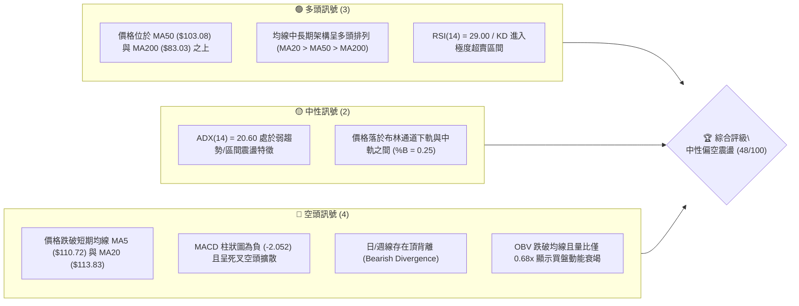

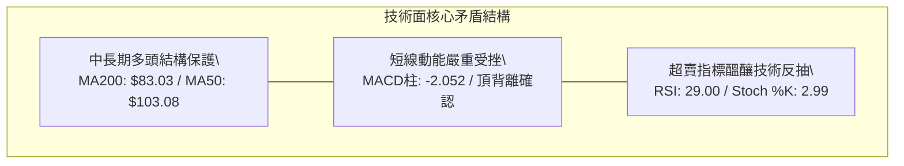

### 📊 核心指標速覽表

| 指標類別 | 指標名稱 | 當前數值 | 訊號 | 解讀 |
|----------|----------|----------|:----:|------|
| **價格** | 當前收盤價 | $104.70 | 🟡 | 位於52週區間 65.6% 處，處於急跌後的整理階段 |
| **均線** | MA20 | $113.83 | 🔴 | 價格顯著落於 MA20 之下 (-8.02%)，短線承壓 |
| **均線** | MA50 | $103.08 | 🟢 | 價格守在 MA50 之上 (+1.57%)，提供中期動態支撐 |
| **均線** | MA200 | $83.03 | 🟢 | 價格大幅高於 MA200 (+26.09%)，長期多頭基底尚存 |
| **動能** | RSI(14) | 29.00 | 🟢 | 跌破 30 進入超賣區，存在均值回歸反抽動能 |
| **動能** | MACD (12,26,9) | 2.291 / 4.343 | 🔴 | DIF < DEA，柱狀圖 -2.052，空頭主導修正波 |
| **動能** | 隨機指標 (KD) | %K 2.99 / %D 14.40 | 🟢 | 處於深度鈍化超賣區，醞釀低檔金叉 |
| **趨勢** | ADX(14) | 20.60 | 🟡 | 數值低於 25，顯示缺乏明確單邊趨勢，屬於震盪盤 |
| **通道** | 布林通道 | $95.85 - $131.80 | 🟡 | %B = 0.25，價格向布林下軌靠攏 |
| **成交量** | 20日量比 | 0.68x | 🔴 | 成交量 74.73M 萎縮，量縮下跌且 OBV 弱勢 |
| **波動** | ATR(14) | $5.53 | 🔴 | 日波幅佔比 5.28%，短期震盪劇烈，風險較高 |

### 🏆 技術評分卡

```
╔══════════════════════════════════════════════════════════════════╗
║                   技術評分卡 — INTC (2026-10-10)                 ║
╠══════════════════════════════════════════════════════════════════╣
║ 趨勢強度 (ADX=20.60)     ████████░░░░░░░░░░░░  40/100   🔴 弱勢震盪 ║
║ 動能指標 (RSI超賣/頂背離) ██████░░░░░░░░░░░░░░  32/100   🔴 動能衰竭 ║
║ 支撐穩定度 (S1=$102.40)  ████████████░░░░░░░░  62/100   🟢 支撐測試 ║
║ 成交量配合 (量比 0.68x)  ███████░░░░░░░░░░░░░  35/100   🔴 量能萎縮 ║
║ 形態完整度 (雙重頂回調)  ██████████░░░░░░░░░░  52/100   🟡 區間收斂 ║
║ 均線排列 (多頭均線承壓)  ██████████████░░░░░░  68/100   🟢 長期完好 ║
╠══════════════════════════════════════════════════════════════════╣
║ 綜合評分                 █████████░░░░░░░░░░░  48/100   🟡 中性觀望 ║
╚══════════════════════════════════════════════════════════════════╝
```

---

## 2. 趨勢分析

### 🌐 多時框趨勢分析

```mermaid
graph TD
    A["月線層級 (長期: 24個月)"] -->|"多頭大波段回調\\n價格自 $19.43 飆升至 $142.35 後回跌"| B["趨勢定位：長期多頭修正浪"]
    B --> C["週線層級 (中期: 20週)"]
    C -->|"波段震盪回跌\\nRSI從 72.2 驟降至 29.0，MACD翻負"| D["趨勢定位：中期雙頂構築跌破"]
    D --> E["日線層級 (短期: 近期)"]
    E -->|"ADX=20.60 (<25)\\n-DI("28.01") > +DI("24.80")"| F["趨勢定位：短線超賣區間震盪尋底"]
```

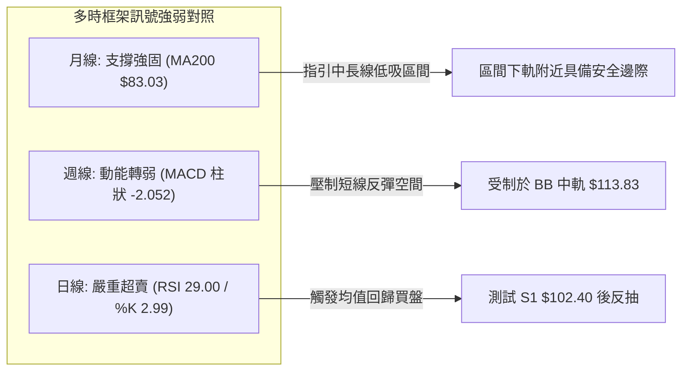

### 📈 長期趨勢 — 12個月走勢圖（Unicode）

```
INTC 月線走勢圖（2025-11 至 2026-10）
價格軸 ($)
$142.35 ┤                                     ● (2026-06: 139.63 / 52W高點 $142.35)
$130.00 ┤                                   ╱   ╲
$120.00 ┤                                  ╱     ╲         ● (2026-09: 120.23)
$110.00 ┤                             ●   ╱       ╲       ╱ ╲
$104.70 ┤━━━━━━━━━━━━━━━━━━━━━━━━━━━━━┼──╱─────────┼─────╱───●← 現價 ($104.70)
$100.00 ┤                            ╱│ ╱          │    ╱
 $90.00 ┤                     ●     ╱ │╱           ●───● (2026-07/08 雙底測試: 90.20/89.51)
 $45.00 ┤        ●───●       ╱
 $40.00 ┤ ●     ╱     ╲     ╱
 $35.00 ┤  ╲   ╱       ●───●
 $20.00 ┤   ● (2025底底部)
        └─┬─────┬─────┬─────┬─────┬─────┬─────┬─────┬─────┬─────┬─────┬─────
         11    12    01    02    03    04    05    06    07    08    09    10  (月份)
```

**走勢特徵分析表格**：

| 階段 | 涵蓋月份 | 價格區間 | 累計漲跌幅 | 核心走勢特徵分析 |
|------|----------|----------|:----------:|------------------|
| **第一階段：底部啟動** | 2025-11 ~ 2026-03 | $40.56 → $44.13 | +8.80% | 築底整理，在 $36.90 ~ $46.47 窄幅震盪蓄勢 |
| **第二階段：主升暴拉** | 2026-04 ~ 2026-06 | $44.13 → $139.63 | +216.41% | 放量噴發，連續拉出三根巨大月陽線，觸及 52W 高點 $142.35 |
| **第三階段：高檔劇震** | 2026-07 ~ 2026-08 | $139.63 → $89.51 | -35.89% | 高檔獲利回吐，快速下殺至斐波那契 50% ($87.62) 附近打底 |
| **第四階段：次高反彈** | 2026-09 | $89.51 → $120.23 | +34.32% | 強勁反彈測試高點阻力，形成波段次高點 |
| **第五階段：頂背離回落** | 2026-10 (當前) | $120.23 → $104.70 | -12.92% | RSI/MACD 頂背離引發拋壓，目前考驗 MA50 及 S1 支撐 |

### 📊 中期趨勢（週線分析）

```
INTC 中期波段壓力與支撐示意圖（過去 20 週）
═════════════════════════════════════════════════════════════════
阻力 R3  $132.75 ──────────────────────────────── (2026-06 高點聚類)
阻力 R2  $127.04 ─────────────●────────────────── (2026-06-28 週收盤 $128.32)
阻力 R1  $107.13 ───────●──────────────────────── (短線跳空缺口/MA120 $106.74)
現價     $104.70 ═══════╡◄ 當前最新週收盤價 (考驗 MA50 $103.08)
支撐 S1  $102.40 ───────●──────────────────────── (2026-08-16/09-13 突破頸線)
支撐 S2   $98.33 ───────────────────●──────────── (2026-06-07 低點 $99.17 聚類)
支撐 S3   $89.59 ─────────────────────────────●── (2026-08 雙底頸線區 $89.47-$90.20)
═════════════════════════════════════════════════════════════════
```

### ⚡ 趨勢強度評估（ADX 解讀）

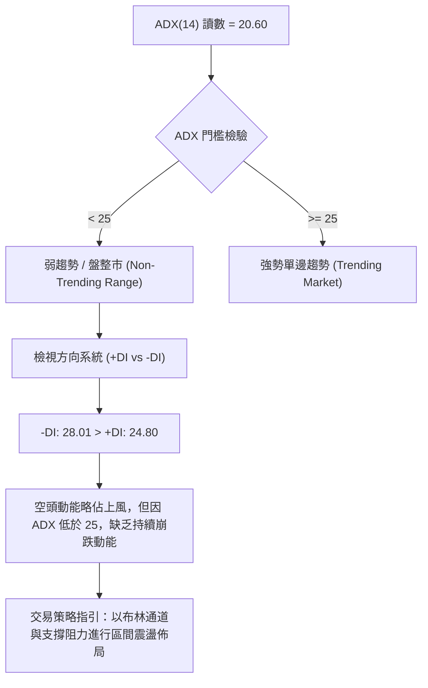

| 指標名稱 | 當前數值 | 參考臨界值 | 狀態評估 | 實戰解讀 |
|----------|----------|:----------:|:--------:|----------|
| **ADX (14)** | 20.60 | 25.00 | 🟡 弱勢盤整 | 處於無序波動區間，嚴禁追漲殺跌，趨勢跟隨策略失效 |
| **+DI (14)** | 24.80 | - | 🔴 多頭動能減退 | 買方力量自前週高位快速衰退 |
| **-DI (14)** | 28.01 | - | 🔴 空頭佔優 | 空方在短期內取得邊際主導權，但尚未進入極端發散 |
| **DI 差值** | -3.21 | 0.00 | 🔴 空頭控盤 | 處於回調階段，但由於 ADX 疲軟，空頭亦難以發動雪崩破位 |

---

## 3. 圖表形態分析

### 🔍 形態識別系統

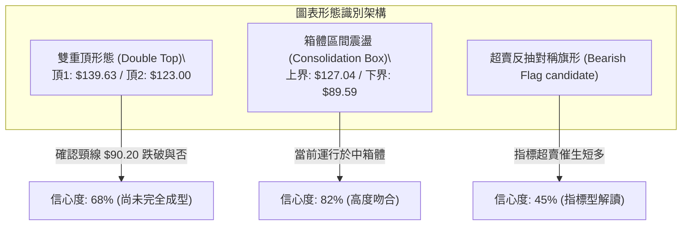

**圖表形態信心度評估表**：

| 形態 | 信心度 | 判斷依據（引用數據） | 完成度 | 目標價（附計算式） |
|------|:------:|----------------------|:------:|--------------------|
| **中期箱體震盪** | **82%** | 價格在 2026-07 至 2026-09 兩次回測支撐 S3 ($89.59) 並受阻於阻力 R2 ($127.04) | 85% | 上軌目標：$127.04<br>下軌目標：$89.59 |
| **雙重頂回調 (潛在)** | **68%** | 第一頂 $139.63 (2026-06)，反彈次高頂 $123.00 (2026-09-27)，伴隨週 RSI 頂背離 (72.2 驟降至 29.0) | 60% | 形態破位目標：<br>頸線 $89.59 - ($123.00 - $89.59) = **$56.18**<br>*(未破頸線前不觸發)* |
| **短線布林通道下軌反抽** | **75%** | 當前收盤價 $104.70 逼近 BB 下軌 $95.85，且 RSI 達 29.00 極端超賣 | 70% | 均值回歸目標：<br>中軌 MA20 = **$113.83** |
| **對稱旗形跌破** | 42% | 數據中週成交量縮減至 461M，缺乏加速放量破位依據 | 30% | 訊號不足，僅做指標型超賣修正解讀 |

### 🕯️ 重要K線形態分析

| 週/月份 | 收盤價 | K線形態 | 解讀 | 訊號 |
|---------|--------|---------|------|:----:|
| **2026-06-28** | $128.32 | 高檔長上影十字星 | 觸及 52W 高點 $142.35 後出現強烈拋壓，多頭動能見頂 | 🔴 空頭反轉 |
| **2026-08-30** | $89.47 | 雙針探底錘頭線 | 連續兩週於 $89.47-$90.20 獲得強支撐，下影線長，多頭展開自救 | 🟢 底部確認 |
| **2026-09-27** | $123.00 | 竭盡性中陽線 | 週收盤攻入 R2 阻力區，但成交量未能超越 6 月天量，量價背離 | 🟡 假突破警訊 |
| **2026-10-04** | $119.33 | 陰孕線 (Bearish Harami) | 高檔滯漲，吞噬前週部分實體，短線動能指標開始向下拐頭 | 🔴 賣出訊號 |
| **2026-10-11** | $104.70 | 大陰實體貫穿線 | 直接擊穿 MA20 ($113.83) 與 MA120 ($106.74)，直逼 S1 ($102.40) | 🔴 空頭宣洩 |

### 📉 ASCII 走勢形態示意圖

```
INTC 雙重頂與箱體震盪形態示意圖 (2026-06 ~ 2026-10)
$142.35 ┐               ▲ 第一頂 (2026-06: $139.63 / 52W高 $142.35)
        │              ╱ ╲
$127.04 ┤(R2阻力)     ╱   ╲                    ▲ 第二頂 ($123.00, 2026-09-27)
        │            ╱     ╲                  ╱ ╲
$113.83 ┤(MA20/BB中)╱       ╲                ╱   ╲
$104.70 ┤══════════╱═════════╲══════════════╱═════●◄ 現價 ($104.70, 逼近 MA50)
$102.40 ┤(S1支撐) ╱           ╲            ╱     │
 $98.33 ┤(S2支撐)╱             ╲          ╱      ▼ 尋求 S1 支撐
 $89.59 ┴───────▼───────────────▼────────▼───────────────────────────────
             頸線支撐區 (2026-07/08 兩次探底: $90.20 / $89.47，S3=$89.59)
```

### 🎯 形態目標價計算

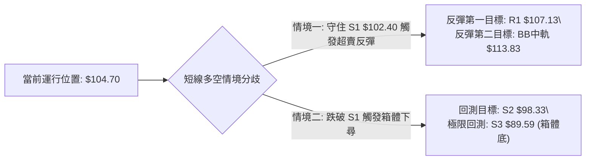

1. **超賣均值回歸目標（基於布林通道中軌及 MA20）**：
   - 當前價格處於超賣狀態（RSI=29.00），若能在 S1（$102.40）止跌，反彈第一阻力目標為跳空缺口 **R1: $107.13**。
   - 進一步反彈回抽頸線與 20 日均線位置，目標價為 **MA20 / BB中軌: $113.83**。
2. **中期箱體破位量度目標（極端悲觀情境）**：
   - 形態頸線：S3 = $89.59
   - 箱體頂部：R2 = $127.04
   - 若未來 S3 失守，則量度跌幅計算為：
     $$\text{目標價} = \text{頸線} - (\text{頂部} - \text{頸線}) = 89.59 - (127.04 - 89.59) = 89.59 - 37.45 = \$52.14$$
   - 該價位與斐波那契 78.6% 回調位 **$56.31** 形成共振支撐區。

---

## 4. 支撐與阻力

### 🗺️ 關鍵價位分布圖（Unicode）

```
INTC 價位結構分布圖 (由 OHLCV 與斐波那契回調精確計算)
════════════════════════════════════════════════════════════════════════
$142.35 ║██████████████████████████████║ 52週歷史高點 / Fib 0.0%
$132.75 ║████████████████████████      ║ 強阻力 R3 (近一年波段高點聚類)
$127.04 ║████████████████████          ║ 關鍵阻力 R2 (中期波段頂點)
$116.52 ║████████████████              ║ 斐波那契 23.6% 回調位
$113.83 ║██████████████                ║ 布林通道中軌 / MA20 動態重壓
$107.13 ║██████████                    ║ 短線阻力 R1 (反彈第一道防線)
$104.70 ╠══════════════════════════════╣ ◄ 當前市價 ($104.70)
$103.08 ║▓▓▓▓▓▓▓▓▓▓▓▓                  ║ 中期生命線 MA50 動態支撐
$102.40 ║▓▓▓▓▓▓▓▓▓▓▓▓▓▓▓▓              ║ 近期關鍵支撐 S1 (波段低點聚類)
$100.54 ║▓▓▓▓▓▓▓▓▓▓▓▓▓▓▓▓▓▓            ║ 斐波那契 38.2% 黃金分割強支撐
 $98.33 ║████████████████████          ║ 關鍵支撐 S2 (波段密集成交低點)
 $95.85 ║██████████████████████        ║ 布林通道下軌支撐
 $89.59 ║████████████████████████      ║ 強支撐 S3 (雙底頸線密集群)
 $87.62 ║██████████████████████████    ║ 斐波那契 50.0% 多空分水嶺
 $83.03 ║████████████████████████████  ║ 長期牛熊分界線 MA200
════════════════════════════════════════════════════════════════════════
```

### 🚧 阻力位分析表

所有阻力數值均直接引用自系統波段高點聚類數據：

| 阻力級別 | 價位 | 形成原因 | 突破難度 | 重要性 |
|:--------:|:----:|----------|:--------:|:------:|
| **R1** | **$107.13** | 短線下挫跳空缺口下緣，疊加 MA120 ($106.74) 均線共振壓制 | 🟡 中等 | ★★★☆☆ |
| **R2** | **$127.04** | 2026年9月反彈次高點密集群，多頭獲利了結密集籌碼區 | 🔴 極高 | ★★★★☆ |
| **R3** | **$132.75** | 2026年6月歷史巨量換手天塹，52週次高波段聚類頂部 | 🔴 極難 | ★★★★★ |

### 🛡️ 支撐位分析表

所有支撐數值均直接引用自系統波段低點聚類數據：

| 支撐級別 | 價位 | 形成原因 | 守住機率 | 重要性 |
|:--------:|:----:|----------|:--------:|:------:|
| **S1** | **$102.40** | 近一年波段低點聚類，距離現價僅 -2.20%，且有 MA50 ($103.08) 護航 | 🟢 65% | ★★★★☆ |
| **S2** | **$98.33** | 6月初次級回調低點聚類，緊鄰整數心理關卡 $100.00 | 🟡 55% | ★★★★☆ |
| **S3** | **$89.59** | 2026年7-8月大雙底結構頸線區 ($89.47~$90.20)，跌破則大格局轉空 | 🟢 80% | ★★★★★ |

### 📐 斐波那契回調位分析

依據 52 週完整波動區間（低點 **$32.89** → 高點 **$142.35**，總垂直落差 **$109.46**）測算：

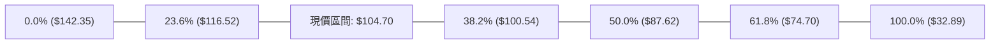

| 斐波那契級別 | 準確價位 | 距離現價幅度 | 價位性質與實戰解讀 |
|:------------:|:--------:|:------------:|-------------------|
| **0.0% (52W High)** | **$142.35** | +35.96% | 歷史頂部壓力位 |
| **23.6%** | **$116.52** | +11.29% | 第一道強阻力回調位，上方套牢籌碼帶 |
| **當前價格** | **$104.70** | **0.00%** | **落於 23.6% ($116.52) 與 38.2% ($100.54) 區間** |
| **38.2%** | **$100.54** | -3.97% | **強烈黃金分割支撐**，與 S1 ($102.40) 及 S2 ($98.33) 形成支撐保護帶 |
| **50.0%** | **$87.62** | -16.31% | 中期多空平衡中樞，與強支撐 S3 ($89.59) 互為呼應 |
| **61.8%** | **$74.70** | -28.65% | 終極牛市防守位，貼近 MA240 ($75.56) |
| **78.6%** | **$56.31** | -46.22% | 深度回撤防線 |
| **100.0% (52W Low)**| **$32.89** | -68.59% | 2025年起漲原點 |

**解讀**：現價 $104.70 目前正處於自 52W 高點回調的 **38.2% ($100.54)** 關鍵分水嶺上方。在技術分析典範中，強勢拉升後的健康回調往往在 38.2% 獲得有力承接。若 $100.54 不失守，大週期多頭架構依然成立。

---

## 5. 技術指標深度解讀

### 🎛️ 指標訊號總覽

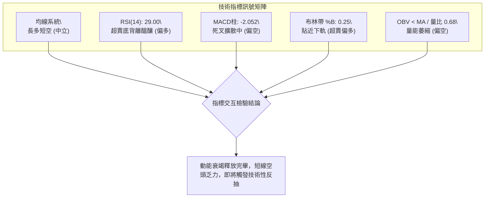

### 📈 移動平均線排列分析

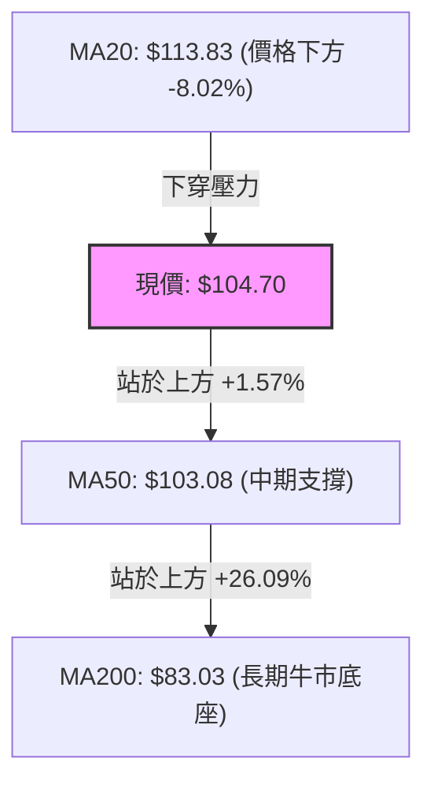

**移動平均線層次解析表**：

| 週期 | 數值 | 偏離度 (%) | 趨勢斜率 | 技術意涵 |
|:----:|:----:|:----------:|:--------:|----------|
| **MA 5** | $110.72 | -5.44% | 扣高走低 ▼ | 超短線極速下殺，均線乖離率過大，拉力顯現 |
| **MA 10** | $114.51 | -8.57% | 扣高走低 ▼ | 短線反壓線，與 MA20 形成雙重反壓帶 |
| **MA 20** | $113.83 | -8.02% | 走平轉下 ▼ | 月線防守失守，標誌著 9 月反彈波段結束 |
| **MA 50** | $103.08 | +1.57% | 持續向上 ▲ | **中期生命線**，目前價格緊扣該線，為多頭關鍵防線 |
| **MA 60** | $101.63 | +3.02% | 向上發散 ▲ | 季線支撐帶，與斐波那契 38.2% ($100.54) 重疊 |
| **MA 120** | $106.74 | -1.91% | 平緩微下 ▼ | 半年線位於現價上方，為第一反彈目標阻力 |
| **MA 200** | $83.03 | +26.09% | 陡峭向上 ▲ | **牛熊分界線**，長期走勢依舊處於大牛市架構內 |
| **MA 240** | $75.56 | +38.56% | 向上抬升 ▲ | 年線基底極為厚實，長線買盤成本位 |

**排列總結**：雖然短線形成 MA5 < MA10 < MA20 之空頭排列，但中長期均線呈現 MA20 > MA50 > MA200 之標準**多頭發散結構**。因此，本輪急跌定性為大級別上升趨勢中的「次級折返修正」，並非牛轉熊的崩盤。

### 📉 RSI(14) 分析

- **當前 RSI(14) 讀數**：`29.00`
- **超賣強度進度條**：
  ```
  超賣區間 (<30)       中性區間 (30-70)       超買區間 (>70)
  [████████████░░░░░░░░░░░░░░░░░░░░░░░░░░░░░░] 29.00%
  ```
- **指標解讀**：
  RSI(14) 已正式跌穿 30 關鍵臨界線，進入深度超賣區（29.00）。回顧近 20 週數據，前次 RSI 跌至 26.9~27.4（2026-07-19 / 07-26）時，INTC 隨即在 $89.51 附近探底並引發自 $90 飆升至 $123 的大級別反彈。
- **背離判斷**：
  - **週線級別**：在 2026-09-27 價格反彈至 $123.00 時，RSI 讀數為 71.8，顯著低於 2026-06 價格登頂 $139.63 時的高位動能，確認了**中期頂背離（Bearish Divergence）**的有效性，當前大跌正是該頂背離之釋放過程。
  - **日線級別**：價格逼近 S1 ($102.40) 時 RSI 驟降至 29.00，但隨機指標 Stoch %K 已鈍化至極端的 2.99，顯示下行動能已接近拋售高潮（Selling Climax），底背離雛形正在醞釀。

### 📊 MACD(12/26/9) 訊號解讀

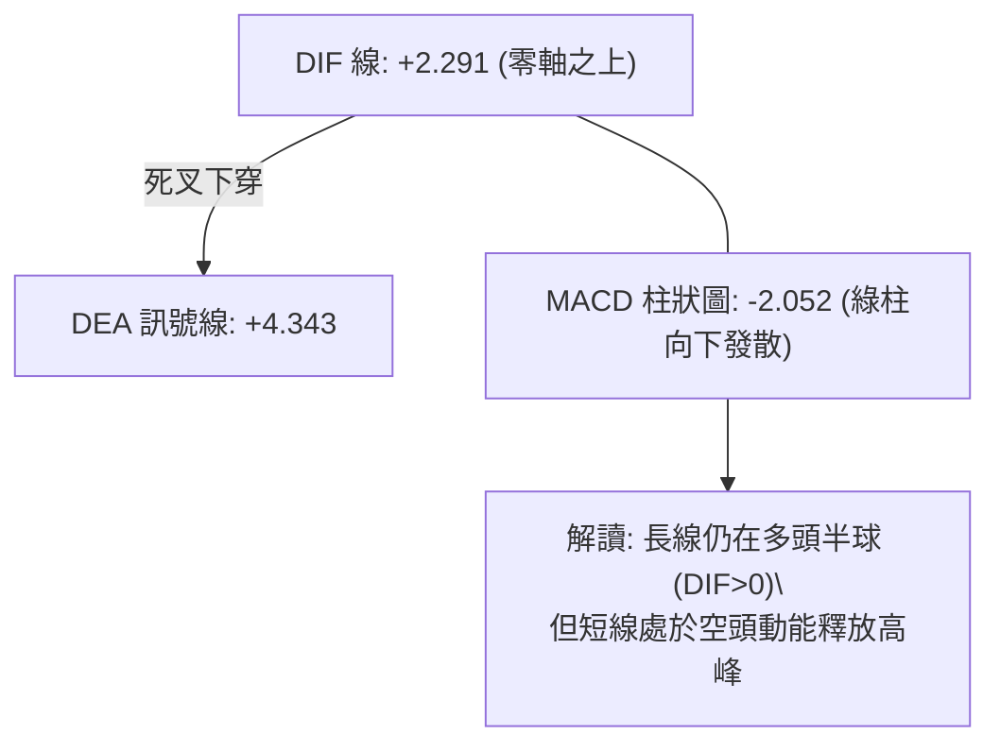

- **MACD 線**：2.291
- **訊號線 (Signal)**：4.343
- **柱狀圖 (Histogram)**：-2.052
- **量化深度解析**：
  MACD 與訊號線均保持在零軸上方，這表明宏觀趨勢的主導權並未徹底移交給空方。然而，柱狀圖自前週的 +0.435 快速擴大翻負至 -2.052，呈現出陡峭的負向擴散。在柱狀圖收縮轉向之前，左側交易者應提防慣性下探，右側交易者則需等待綠柱收窄作為第一介入訊號。

### 📦 布林通道分析

```
INTC 布林通道 (20, 2) 結構圖
═════════════════════════════════════════════════════════════════
$131.80 ──┬───────────────────────────────────── 布林上軌 (強阻力區)
          │
$113.83 ──┼───────────────────────────────────── 中軌 (MA20 / 多空分水嶺)
          │      ● (前週收盤 $119.33)
$104.70 ──┼───────┼───────────────────────────── 現價 ($104.70, %B = 0.25)
$95.85  ──┴───────┴───────────────────────────── 布林下軌 (動態超賣支撐)
═════════════════════════════════════════════════════════════════
```

- **布林帶寬度 (Bandwidth)**：$(131.80 - 95.85) / 113.83 = 31.58\%$，通道開口依然寬闊，顯示先前震盪幅度巨大。
- **指標 %B**：
  $$\%B = \frac{104.70 - 95.85}{131.80 - 95.85} = \frac{8.85}{35.95} = 0.246 \approx 0.25$$
- **實戰研判**：%B 為 0.25 意味著現價已經運行於下軌四分之一區域，極度偏離中軌。若價格進一步下探至 $95.85 附近，將觸發下軌軌道支撐的強力彈力效應。

### 💹 成交量分析（量價配合度）


- **日成交量對比**：最新成交量 74,726,800 股，顯著低於 20 日均量（109,244,260 股）與 50 日均量（102,675,670 股），量比僅為 **0.68x**。
- **週量能演變**：過去三週成交量由 602.66M 降至 495.05M，本週收於 461.05M，呈現階梯式遞減。
- **OBV 趨勢**：OBV 指標落於其移動平均線下方，證實了近期場內資金流入停滯。然而，「量縮陰跌」也同時意味著機構投資者並未在該位置不計成本出逃，目前壓迫價格的主要力量來自於獲利盤的技術性了結與市場跟風盤的退縮。

---

## 6. 動能與波動率

### ⚡ 動能評估

根據市場動能強度與短期波動率的交集檢驗：

| 象限分佈 | 動能維度 | 波動率維度 | 當前匹配 | 戰術定位與策略對策 |
|:--------:|:--------:|:----------:|:--------:|-------------------|
| **第一象限 (Q1)** | 強動能 | 低波動 | — | 趨勢穩健推升，最理想持股階段 |
| **第二象限 (Q2)** | 弱動能 | 低波動 | — | 沉悶牛皮整理，缺乏交易價值 |
| **第三象限 (Q3)** | 強動能 | 高波動 | — | 單邊單向加速，高風險高收益 |
| **第四象限 (Q4)** | **弱動能 (衰退)** | **高波動 (劇烈)** | **✓ (當前)** | **暴跌後釋放區，防守反擊，耐心等待反轉** |

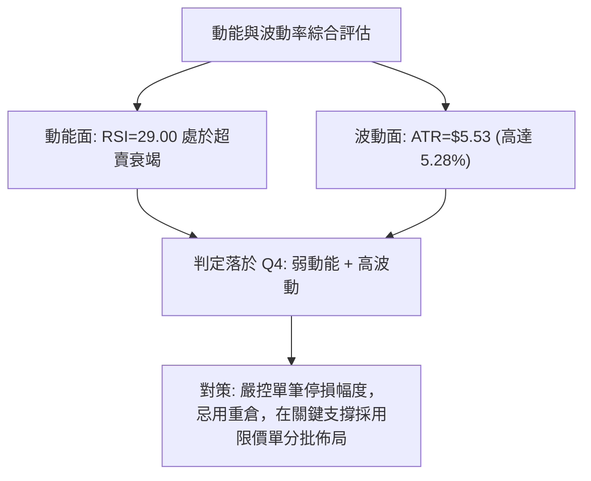

### 📊 ATR 波動率分析

- **ATR(14) 絕對值**：**$5.53**
- **波動率佔價格比**：$5.53 / 104.70 = \mathbf{5.28\%}$
- **止損距離建議**：
  - **日內/短線止損 (1.0 × ATR)**：$\$5.53$（保護間距宜設在目前價格外約 $5.50）
  - **波段交易止損 (1.5 × ATR)**：$1.5 \times 5.53 = \mathbf{\$8.30}$
  - **寬幅底倉止損 (2.0 × ATR)**：$2.0 \times 5.53 = \mathbf{\$11.06}$
- **解讀**：日均波幅超過 5 美元，顯示 INTC 當前具有極高的短線交易彈性。任何短線多單若直接跌破支撐 S1 ($102.40) 超過 1 個 ATR（即跌破 $96.87），即宣告波段防守徹底失敗。

### 📐 Beta 與市場相關性

- **Beta 係數**：**2.23**
- **市場特徵分析**：
  INTC 的 Beta 高達 2.23，屬於典型的高彈性進攻型半導體權重股。當大盤（S&P 500 / 費城半導體指數）出現 1% 的波動時，INTC 理論上將放大波動至 2.23%。在宏觀半導體週期回調時，此類標的往往遭遇不成比例的重挫，但在技術指標超賣時，其反彈爆發力亦居產業前列。

---

## 7. 多時框架總結

### 📋 時框架評分表

| 時框架 | 趨勢方向 | 動能狀態 | 均線排列 | 圖表形態 | 綜合評分 | 戰術建議 |
|:------:|:--------:|:--------:|:--------:|:--------:|:--------:|----------|
| **月線 (長期)** | 🟢 多頭上行 | 🟡 高檔鈍化修正 | 🟢 MA200之上強多 | 巨型擴散上攻 | **72/100** | 長期持股，忽視雜音 |
| **週線 (中期)** | 🟡 區間震盪 | 🔴 MACD死叉擴散 | 🟢 MA50多頭防守 | 高檔雙重頂回調 | **48/100** | 區間操作，嚴控倉位 |
| **日線 (短期)** | 🔴 短空格局 | 🟢 RSI深度超賣 | 🔴 MA20之下空頭 | 急跌尋求下軌支撐 | **38/100** | 待止跌訊號，切忌追空 |

### 🔲 綜合訊號矩陣

```
時框架訊號矩陣收斂分析
═════════════════════════════════════════════════════════════════
指標系統            短期 (日線)       中期 (週線)       長期 (月線)
─────────────────────────────────────────────────────────────────
均線系統 (MA)       🔴 跌破短期MA     🟡 測試MA50       🟢 遠高於MA200
動能指標 (RSI)      🟢 超賣反抽       🔴 頂背離下殺     🟡 中性偏強
趨勢強度 (ADX)      🟡 ADX<25 震盪    🟡 趨勢放緩       🟢 長期主升浪
型態架構 (Pattern)  🔴 連續陰線       🟡 箱體震盪       🟢 大底突破
量價配合 (Volume)   🔴 量縮無力       🔴 量價背離       🟢 長期放量
═════════════════════════════════════════════════════════════════
時框權重協同結果：短期處於超賣反轉臨界點，中長期主導力量依舊受控
```

### ⚖️ 多時框收斂結論

依據多時框收斂嚴格規則：
1. **行情定性**：當前日線 **ADX(14) = 20.60 (< 25)**，明確宣告目前行情本質為**無趨勢的區間盤整行情（Range-bound Market）**，而非單邊趨勢行情。
2. **優先級收斂原則**：由於 ADX < 25，單邊趨勢跟隨無效，必須**以日線布林通道上下軌（$95.85 ~ $131.80）以及波段聚類支撐阻力（S1 $102.40 ~ R1 $107.13 / R2 $127.04）作為核心交易區間**。
3. **主導時框取捨**：雖然日線短線空頭下殺凌厲，但週線與月線之 MA50 ($103.08) 及 MA200 ($83.03) 架構完好，加上日線 RSI(14) = 29.00 嚴重超賣，空頭已無繼續追殺之盈虧比優勢。
4. **唯一方向性結論**：**【中性觀望，區間下軌尋求超跌反彈】**。第 8 章之核心策略將嚴格依據評分卡 48/100 之定位，採取**區間下緣低吸高拋之震盪交易策略**。

---

## 8. 交易策略建議

### 🗺️ 策略決策流程圖

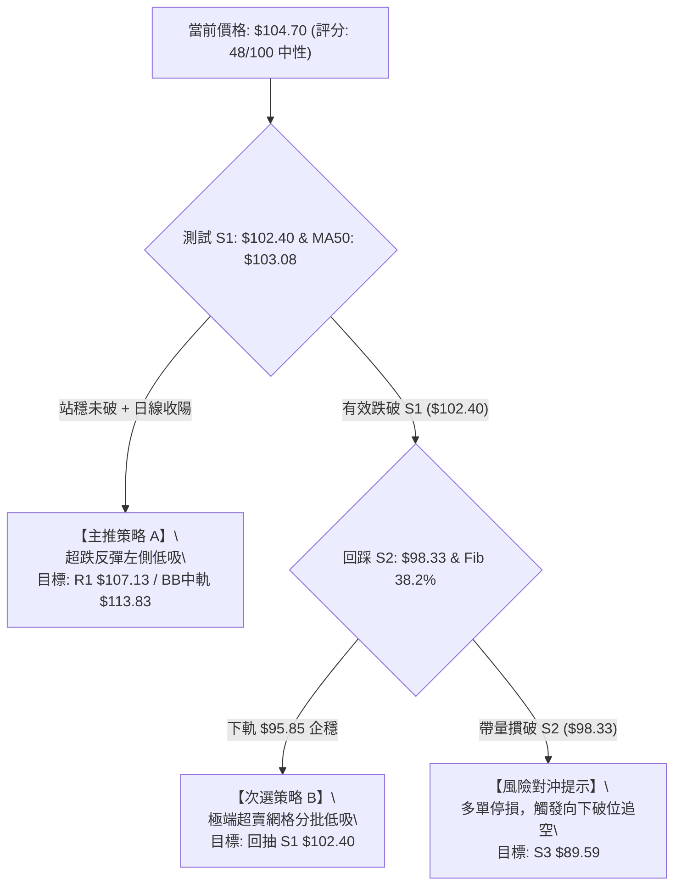

### 🧭 策略路由

> **當前主策略方向 = 【區間操作 / 超跌反彈低吸】（依綜合評分 48/100 判定）**
> 
> 目前處於 40–60 中性震盪區間，禁止採用激進趨勢追單。交易主軸為：依託 S1 支撐與布林下軌防守，博弈超賣 RSI 回歸帶來的反彈波段。

### 🎯 價格情境階梯（Price Scenarios）

所有觸發價位與目標位均直接引用系統精確數據：

| 觸發條件 | 下一目標 | 後續延伸 | 情境含義 |
|----------|----------|----------|----------|
| **強勢突破 R1 ($107.13)** | **R2 ($127.04)** | **R3 ($132.75)** | 突破短期下行通道，中期多頭回歸，向上挑戰前高 |
| **站穩 S1 ($102.40) ~ 現價** | **MA20 ($113.83)** | **Fib 23.6% ($116.52)**| 標準區間均值回歸，修復超賣 RSI，收復布林中軌 |
| **跌破 S1 ($102.40)** | **S2 ($98.33)** | **BB下軌 ($95.85)** | 短線支撐失效，下尋斐波那契 38.2% ($100.54) 保護 |
| **跌破 S2 ($98.33)** | **S3 ($89.59)** | **MA200 ($83.03)** | 箱體結構瓦解，大級別回測 50% 分水嶺與年線 |

### 📊 情境機率分佈

```
情境機率分佈圓餅圖
╔══════════════════════════════════════════════════════════════════╗
║  █ 區間震盪築底 (55%)   ▓ 超跌反彈上攻 (30%)   ░ 破位下挫探底 (15%)  ║
║  ██████████████████████████████▓▓▓▓▓▓▓▓▓▓▓▓▓░░░░░░░░░░░         ║
╚══════════════════════════════════════════════════════════════════╝
```

| 情境 | 機率 | 主要依據 |
|------|:----:|----------|
| **區間震盪築底** | **55%** | **ADX=20.60** 確認無單邊趨勢；MA50 ($103.08) 與 Fib 38.2% ($100.54) 形成高密度承接帶，量能萎縮表明拋壓放緩。 |
| **超跌反彈上攻** | **30%** | **RSI(14)=29.00** 與 Stoch %K=2.99 處於極度超賣狀態；跌偏 MA20 達 -8.02%，均線引力隨時引發修復性報復反彈。 |
| **回落再探底** | **15%** | MACD 柱狀圖仍為負值 (-2.052) 且 OBV 指標疲軟；若市場系統性風險擴大，可能慣性刺穿 S1 下探 S2 ($98.33)。 |

### 🟢 主策略詳情

針對當前超賣區間行情，制定以下兩套精確執行策略：

| 策略要素 | 策略 A：S1 支撐左側超跌博弈 | 策略 B：突破 R1 右側確認跟進 |
|----------|----------------------------|----------------------------|
| **適用場景** | 現價回踩 S1 不破，分批佈局 | 放量站上 MA120/R1，確認短底 |
| **進場條件** | 觸及 $102.50 ~ $103.50 區間掛單 | 日K線收盤價突破 R1 ($107.13) |
| **進場價格** | **$103.00** (貼近 MA50) | **$107.50** (突破確認點) |
| **目標價 T1** | **$107.13** (阻力位 R1) | **$113.83** (布林中軌 / MA20) |
| **目標價 T2** | **$113.83** (MA20 均值回歸) | **$127.04** (阻力位 R2) |
| **止損價格** | **$98.30** (微幅低於 S2 $98.33) | **$102.40** (跌回支撐 S1 下方) |
| **風險額度 (Risk)** | $103.00 - $98.30 = $4.70 | $107.50 - $102.40 = $5.10 |
| **潛在報酬 (Reward)** | $113.83 - $103.00 = $10.83 (至T2) | $127.04 - $107.50 = $19.54 (至T2) |
| **風險報酬比 (R/R)** | **1 : 2.30** | **1 : 3.83** |
| **成功機率** | 62% | 52% |
| **建議倉位** | **15%** (分批建倉) | **20%** (動量突破加倉) |

### 🔴 反向風險觸發點（對沖提示）

若出現以下訊號，主推之超跌反彈邏輯徹底失效，多頭投資人必須立即止損並考慮反手避險：
1. **關鍵破位點**：日K線收盤價**實體跌破 S2 ($98.33)**，意味著 Fib 38.2% ($100.54) 宣告失守。
2. **量能異動訊號**：日成交量突破 120M（超過 50 日均量 1.2 倍）並伴隨大陰線跌破 $98.33。
3. **對沖目標價**：下看 **S3 ($89.59)** 與斐波那契 50% 回調位 **$87.62**。

### ⭐ 整體訊號強度評星

```
╔══════════════════════════════════════════════════════════════════╗
║ 做多訊號強度：  ★★★☆☆  (3.0/5星 - 超賣反抽強烈，但受制於均線反壓)║
║ 做空訊號強度：  ★★☆☆☆  (2.0/5星 - 處於低位，追空盈虧比極度劣勢)║
║ 整體可信度：    ★★★★☆  (4.0/5星 - 關鍵支撐阻力結構清晰收斂)    ║
╚══════════════════════════════════════════════════════════════════╝
```

---

## 9. 風險提示與監控

### ✅ 關鍵監控指標 Checklist

```
╔══════════════════════════════════════════════════════════════════╗
║               INTC 盤面即時監控清單 (Checklist)                  ║
╠══════════════════════════════════════════════════════════════════╣
║ [ ] 支撐防守監控：每日收盤價是否嚴格維持在 S1 ($102.40) 之上？    ║
║ [ ] 動能修復監控：RSI(14) 能否自 29.00 回升重返 35 以上超賣消除？ ║
║ [ ] 指標背離化解：MACD 柱狀圖是否由 -2.052 開始向上收斂？         ║
║ [ ] 量能配合檢驗：單日成交量能否放大至 20日均量 (109.24M) 以上？  ║
║ [ ] 均線動態壓制：價格反彈觸及 MA20 ($113.83) 時是否放量突破？   ║
║ [ ] 波動異常預警：單日波幅是否超過 1.5倍 ATR ($8.30)？          ║
╚══════════════════════════════════════════════════════════════════╝
```

### ⚠️ 風險場景分析

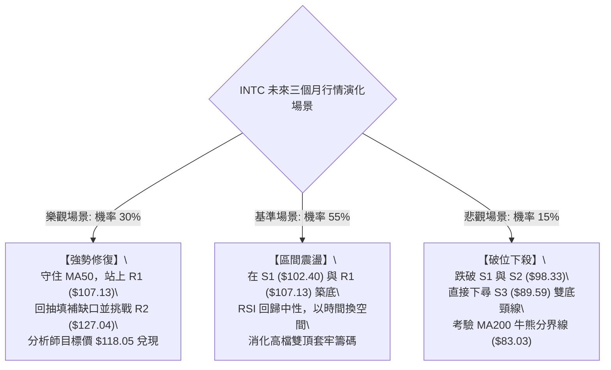

### 🛡️ 風險管理重要提醒

1. **高 Beta 槓桿效應防範**：
   INTC 目前 Beta 值高達 **2.23**。在持倉過程中，嚴禁在大盤趨勢不明時建立過重槓桿。若標普或費半指數出現破位下行，必須對 INTC 的持倉頭寸按比例進行對沖。
2. **波動率（ATR）倉位管理**：
   當前 ATR 高達 **$5.53**（佔股價 5.28%）。依據專業機構風險平價（Risk Parity）模型，若單筆交易最大允許虧損為總資金之 1.5%，則部位規模公式如下：
   $$\text{部位規模} = \frac{\text{總資金} \times 1.5\%}{\text{止損距離 } (\$4.70)} = \frac{\text{總資金} \times 0.015}{4.70} \approx \text{總資金的 } 3.19\% \text{ (股數)}$$
   建議總持股部位在確認突破 R1 前，**不得超過總投資組合的 15% ~ 20%**。
3. **財報與外生事件黑天鵝**：
   目前本益比（Forward P/E）為 50.27，本益比居高不下，任何業績端的不及預期均容易引起戴維斯雙殺。技術面必須嚴格執行「跌破 S2 ($98.33) 即無條件減倉」的防禦鐵律。

---

## 📋 報告總結

```
╔══════════════════════════════════════════════════════════════════╗
║                   INTC 技術分析報告總結                          ║
╠══════════════════════════════════════════════════════════════════╣
║ 報告日期：2026-10-10                                             ║
║ 當前價格：$104.70                                                ║
║ 分析評級：⚖️ 中性偏空震盪（評分：48/100，超賣醞釀技術反抽）        ║
║                                                                  ║
║ 關鍵結論：                                                       ║
║ ├─ 長期趨勢：🟢 完好多頭（價格高於 MA200 $83.03 達 +26.09%）     ║
║ ├─ 中期趨勢：🟡 箱體震盪（受阻於 R2 $127.04，測試 S1 $102.40）   ║
║ ├─ 短期趨勢：🔴 急跌超賣（RSI=29.00 跌入超賣，KD鈍化，短線跌幅過大）║
║ ├─ 關鍵支撐：S1: $102.40 ｜ S2: $98.33 ｜ S3: $89.59             ║
║ ├─ 關鍵阻力：R1: $107.13 ｜ MA20: $113.83 ｜ R2: $127.04         ║
║ └─ 分析師共識目標：$118.05（相對於現價具備 +12.75% 潛在空間）    ║
║                                                                  ║
║ 最優策略組合：                                                   ║
║ 1. 🥇 最佳機會：在 S1 附近 ($103.00) 左側小倉位佈局超賣反彈，     ║
║                 停損 $98.30，目標看至 MA20 ($113.83)（R/R=2.30） ║
║ 2. 🥈 次選機會：等待放量突破 R1 ($107.13) 後右側順勢追入，       ║
║                 目標直指 R2 ($127.04)（R/R=3.83）               ║
║ 3. 🥉 保守選擇：空倉觀望，等待日線級別 MACD 柱狀圖翻紅且 RSI      ║
║                 突破 40 後再行進場                               ║
╚══════════════════════════════════════════════════════════════════╝
```

---

> ⚠️ **免責聲明**：本報告為 AI 自動生成之技術分析，所有數據及估算均基於提供的歷史價格資訊。本報告**僅供研究與學術參考**，**不構成任何投資建議**。投資有風險，入市需謹慎。

---

*報告生成時間：2026-10-10 ｜ 數據來源：Yahoo Finance ｜ 分析框架：多時框技術分析*