<details>
<summary>📊 靜態圖表 (點擊展開)</summary>
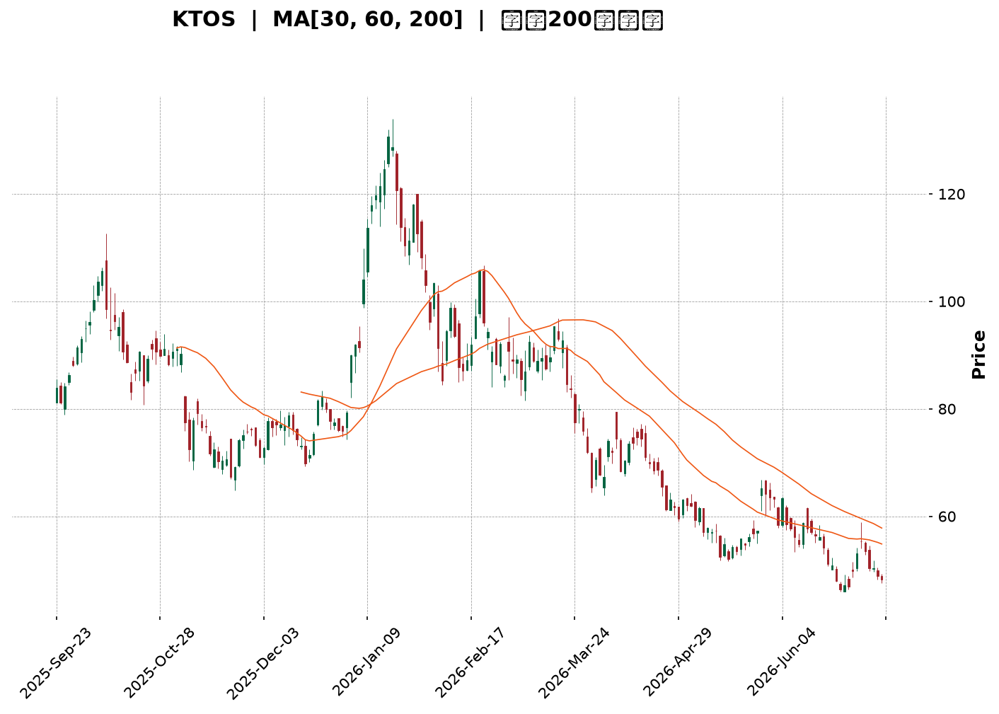
</details>

<html>
<head><meta charset="utf-8" /></head>
<body>
    <div style="height:500px; width:100%;">                        <script>window.PlotlyConfig = {MathJaxConfig: 'local'};</script>
        <script charset="utf-8" src="https://cdn.plot.ly/plotly-3.7.0.min.js" integrity="sha256-jvTGqxNp8AGWEcvNLVuKr+8j5dGe9Yw51LQkmDH+IYA=" crossorigin="anonymous"></script>                <div id="candlestick-chart" class="plotly-graph-div" style="height:100%; width:100%;"></div>            <script>                window.PLOTLYENV=window.PLOTLYENV || {};                                if (document.getElementById("candlestick-chart")) {                    Plotly.newPlot(                        "candlestick-chart",                        [{"close":{"dtype":"f8","bdata":"AAAAoJn5VEAAAAAghUtUQAAAAMDMDFVAAAAAgOuRVUAAAADAHgVWQAAAACCu11ZAAAAAoHA9V0AAAACA68FXQAAAAAApDFhAAAAAAAAQWUAAAAAAKexZQAAAAEDhalpAAAAAQDOjWEAAAADgUahXQAAAAIDrEVhAAAAAQDPTV0AAAADAHqVWQAAAACCuJ1ZAAAAAIK7HVEAAAACgmalVQAAAACCup1ZAAAAAQDMTVUAAAADgelRWQAAAACCFy1ZAAAAAIIWrVkAAAACA63FWQAAAAKBwzVZAAAAAQDMTVkAAAABgZqZWQAAAAGBmxlZAAAAAgBSOVkAAAACAPVpTQAAAAIA9GlJAAAAA4FF4U0AAAAAghctTQAAAAIDCJVNAAAAAwMwsU0AAAAAAKexRQAAAAMDMHFJAAAAAIFyPUUAAAABACpdRQAAAAEDhqlFAAAAAANfTUEAAAADA9UhRQAAAAEAKh1JAAAAAQDPDUkAAAACgR\u002fFSQAAAAGBmBlNAAAAAoHBNUkAAAACgcL1RQAAAAIDrMVJAAAAAIIVrU0AAAAAAACBTQAAAAIDrQVNAAAAAgOtBU0AAAACAPTpTQAAAAIDrsVNAAAAAoHD9UkAAAADgo5BSQAAAAOBRSFJAAAAAoEdxUUAAAACgmdlRQAAAAMD12FJAAAAAgOthVEAAAABAM5NUQAAAAIAU\u002flNAAAAAwMxsU0AAAACAFF5TQAAAAGC4\u002flJAAAAAgD36UkAAAABgj9JTQAAAACCFe1ZAAAAAIIX7VkAAAAAAKdxWQAAAAGCPAlpAAAAAwMxsXEAAAABACnddQAAAAIAU7l1AAAAAAABgXkAAAAAA1yNfQAAAAEAKV2BAAAAAgMIVYEAAAACAwiVeQAAAAGBmdlxAAAAAwPWYW0AAAADgetRbQAAAAADXg11AAAAAQOEqXEAAAACAPQpbQAAAAOCjwFlAAAAAgD0KWEAAAAAgrtdZQAAAAMAe1VZAAAAAAABQVUAAAACAPZpXQAAAAADXs1hAAAAAYLheV0AAAACA6\u002fFVQAAAAEAzw1VAAAAAANdDVkAAAACAFP5WQAAAAKBwTVhAAAAAQOFqWkAAAADAHgVYQAAAAADXk1dAAAAAIIWrVkAAAABguA5WQAAAAMD1CFdAAAAAIIWLVUAAAACAFK5WQAAAAMDMPFZAAAAA4FFIVkAAAABgj2JVQAAAAAAAwFVAAAAAgBQeV0AAAACgcD1WQAAAAEDhOlZAAAAAoHBdVkAAAACA6+FVQAAAAIDrYVZAAAAAANfTV0AAAABgj0JXQAAAAIDrMVdAAAAAIK4nVUAAAAAAKexUQAAAACBcX1NAAAAAYLj+U0AAAABACvdSQAAAAAAp\u002fFFAAAAAgOtRUEAAAADgo6BRQAAAAMDM7FBAAAAAANfTUEAAAACAwoVSQAAAAKBw\u002fVFAAAAAoHCdUkAAAADAHhVRQAAAAIDClVFAAAAAQDNjUkAAAACAPWpSQAAAAIA9qlJAAAAAgD2aUkAAAAAgXL9RQAAAAMAedVFAAAAAQDMjUUAAAABACidRQAAAAKBHYVBAAAAAoEehTkAAAADgepRPQAAAAOB61E5AAAAAIK7HTUAAAABgZoZPQAAAAGBmBk9AAAAAQAr3TkAAAAAgrqdNQAAAAGCPwk5AAAAAAACATEAAAACA6\u002fFMQAAAAGC4fkxAAAAAgD2qTEAAAABguD5KQAAAAMDMbEtAAAAAIIULSkAAAAAAKRxLQAAAAAApvEpAAAAAwPXoS0AAAACAwlVLQAAAAEAKF0xAAAAAYGZmTEAAAABgZqZMQAAAAAApTFBAAAAA4FEIUEAAAABguL5PQAAAAGCPok9AAAAAQAo3TUAAAABAM7NPQAAAAGCPQk1AAAAAoHDdTEAAAADgURhMQAAAAMD1aEtAAAAAANdjTUAAAAAAAOBMQAAAAGCPgkxAAAAAIIUrTEAAAADgehRMQAAAAEDhGktAAAAAIIWLSUAAAABgZmZJQAAAAKCZ+UdAAAAAwPUoR0AAAABA4ZpHQAAAAKCZeUdAAAAAgBTuSEAAAADAHoVKQAAAAMDMrEtAAAAAwB7FSkAAAAAghStJQAAAAOCjMElAAAAAwMxsSEAAAADgURhIQA=="},"high":{"dtype":"f8","bdata":"AAAAYLheVUAAAAAAAEBVQAAAAOBROFVAAAAAgMK1VUAAAABA4WpWQAAAACCu91ZAAAAAoEdhV0AAAACgmRlYQAAAACCuh1hAAAAAAADAWUAAAACgcC1aQAAAAADXk1pAAAAA4HokXEAAAACgmalZQAAAAAAAYFlAAAAAYGZGWEAAAAAgXJ9YQAAAAIDCJVdAAAAAoEehVUAAAACAFC5WQAAAAEAzs1ZAAAAAAACAVkAAAADAzHxWQAAAACCFO1dAAAAAYGamV0AAAADAzBxXQAAAACCud1dAAAAAAADAVkAAAACgmQlXQAAAAIAU7lZAAAAAgMLlVkAAAAAAAKBUQAAAAIAU3lNAAAAAYGaWU0AAAAAAAIBUQAAAACBcv1NAAAAAQOGKU0AAAACgmflSQAAAAKBHcVJAAAAAwMw8UkAAAAAAANBRQAAAACCFC1JAAAAAYLieUkAAAACAwlVRQAAAAAApnFJAAAAAIIULU0AAAABA4UpTQAAAACBcH1NAAAAAYGYmU0AAAABgZqZSQAAAAAAAQFJAAAAA4HqUU0AAAADgUYhTQAAAAOB6hFNAAAAAgD3qU0AAAACgcJ1TQAAAAIAU3lNAAAAAoJnZU0AAAABA4RpTQAAAAOBRqFJAAAAAIFyPUkAAAACAPRpSQAAAAGCP8lJAAAAAIK53VEAAAACAPdpUQAAAAAApfFRAAAAAgD36U0AAAACAFI5TQAAAAAApjFNAAAAAgBQ+U0AAAABguO5TQAAAAEAKh1ZAAAAAgOsBV0AAAADgetRXQAAAAEAzc1tAAAAAwMzcXEAAAADgUehdQAAAAOB6ZF5AAAAAoHD9XkAAAAAA15NfQAAAAAAAgGBAAAAAAADAYEAAAAAAAABgQAAAAEAzU15AAAAAgOvhXEAAAABA4WpcQAAAAMD1iF1AAAAAAAAAXkAAAADAzMxcQAAAAAAAMFtAAAAAwPVIWUAAAAAgXN9ZQAAAAAAAwFlAAAAAYGYmV0AAAABA4apXQAAAAIDr8VhAAAAAAADgWEAAAABAMyNYQAAAAIDCZVZAAAAAIFwPV0AAAABgZlZXQAAAAAAAIFlAAAAAgD16WkAAAABA4apaQAAAAMAexVdAAAAAIFzvVkAAAACA61FXQAAAAAApHFdAAAAAoJmZVUAAAABgZkZYQAAAAIAUTldAAAAAYGaGVkAAAAAgXF9WQAAAAOBRuFZAAAAAQOFqV0AAAABAMxNXQAAAAGC4vlZAAAAAIK7XVkAAAACgmflWQAAAAEAz81ZAAAAAYGbWV0AAAADgUThYQAAAAAAAoFdAAAAAAAAAV0AAAAAA15NVQAAAAKBHwVRAAAAAACk8VEAAAACA6+FTQAAAAOBRGFNAAAAAoJn5UUAAAACAFL5RQAAAAEAzM1JAAAAA4KNgUUAAAACAPZpSQAAAAKCZOVJAAAAAACncU0AAAAAAAKBSQAAAAIDroVFAAAAAYGaGUkAAAADgeiRTQAAAAGCPElNAAAAAgBROU0AAAADA9ThTQAAAAKBw7VFAAAAAoJm5UUAAAABguL5RQAAAACBcL1FAAAAA4KNwUEAAAAAghRtQQAAAAKCZWU9AAAAAoEfhTkAAAABACpdPQAAAAAAAwE9AAAAA4FEIUEAAAADAHmVPQAAAAGC43k5AAAAAwB7FTkAAAADgUfhMQAAAAEDh2kxAAAAA4KNQTUAAAAAAAEBMQAAAAAAp\u002fEtAAAAAQDPzSkAAAAAAKVxLQAAAACCFS0tAAAAA4KPwS0AAAAAA14NLQAAAAAAAYExAAAAAYGamTUAAAACAFK5MQAAAAMAetVBAAAAAAACwUEAAAADAzIxQQAAAAEAz009AAAAAwMzsTkAAAAAghctPQAAAAMDMDE9AAAAAAADgTUAAAABgZqZNQAAAAGBmZkxAAAAAgOtxTUAAAACgmdlOQAAAAAAAwE1AAAAAgOuxTEAAAABAMzNNQAAAAAAAYExAAAAAQDMTS0AAAAAghStKQAAAAMAeZUlAAAAAANfjR0AAAADgUZhIQAAAAIDrcUhAAAAAACm8SUAAAADgoxBLQAAAAOCjcE1AAAAAwMysS0AAAABgj0JLQAAAACCu50lAAAAAoHA9SUAAAABgZqZIQA=="},"hovertemplate":"\u003cb\u003e%{x|%Y-%m-%d}\u003c\u002fb\u003e\u003cbr\u003e\u958b: $%{open:.2f}\u003cbr\u003e\u9ad8: $%{high:.2f}\u003cbr\u003e\u4f4e: $%{low:.2f}\u003cbr\u003e\u6536: $%{close:.2f}\u003cextra\u003e\u003c\u002fextra\u003e","low":{"dtype":"f8","bdata":"AAAAYGZGVEAAAABgZjZUQAAAACCut1NAAAAAIIUbVUAAAABAM\u002fNVQAAAAGBmBlZAAAAA4FEoVkAAAACA6yFXQAAAAEAKd1dAAAAAoEeBWEAAAAAAAABZQAAAAKCZeVlAAAAAQDMzWEAAAACgmTlXQAAAAEDhqldAAAAAYI+yVkAAAACAPUpWQAAAACBcH1ZAAAAAoHBtVEAAAADAzExVQAAAAMDMTFVAAAAAANczVEAAAAAgrjdVQAAAACCFS1ZAAAAA4KMQVkAAAAAAKWxWQAAAAKBwfVZAAAAAYI8CVkAAAACAPfpVQAAAAMDM\u002fFVAAAAA4Hq0VUAAAABgZvZSQAAAAKBHkVFAAAAAoJkpUUAAAABAM0NTQAAAAMD1+FJAAAAAAADgUkAAAAAA19NRQAAAAAAAQFFAAAAAYGY2UUAAAACA6\u002fFQQAAAAEAzU1FAAAAAgD26UEAAAABAMzNQQAAAAMD1SFFAAAAAoJkpUkAAAAAA19NSQAAAAOCjwFJAAAAAIIU7UkAAAAAgrrdRQAAAACCFa1FAAAAAgOsRUkAAAADgo7BSQAAAAKCZyVJAAAAAANcDU0AAAADAzExSQAAAAEAzs1JAAAAAwMzMUkAAAABgZkZSQAAAAEDhGlJAAAAAANdTUUAAAADA9YhRQAAAAGC4zlFAAAAAANczU0AAAABgZvZTQAAAAIDr0VNAAAAAYGYGU0AAAACgmQlTQAAAAEAz81JAAAAA4FG4UkAAAADAHpVSQAAAAOBRiFRAAAAAwMysVUAAAADgo6BWQAAAAKBHsVhAAAAAoJkpWkAAAAAAAKBcQAAAAMDMTF1AAAAAAACAXEAAAACgR1FdQAAAAAAAQF9AAAAAAADAX0AAAACA65FcQAAAAGC4zltAAAAAQAoXW0AAAACgR7FaQAAAAADXw1tAAAAA4KNQW0AAAACAwoVaQAAAAOBRaFlAAAAAoEexV0AAAACgmUlYQAAAAEDhulVAAAAAAAAgVUAAAAAAAABWQAAAAMDMTFdAAAAAoHBNV0AAAACgR0FVQAAAAAAAUFVAAAAAoEfBVUAAAADgesRVQAAAAMDMPFdAAAAAYLg+WEAAAAAghdtXQAAAAAAAwFZAAAAAYI8CVUAAAACgcA1WQAAAAMD1qFVAAAAAAAAAVUAAAADAHlVVQAAAAGBmplVAAAAAAABwVUAAAACgmZlUQAAAAAAAYFRAAAAAwMzMVUAAAADA9ShWQAAAACCup1VAAAAAwPVYVUAAAADAzMxVQAAAAKCZuVVAAAAAIFyPVkAAAACAPSpXQAAAAMD16FVAAAAAYGbGVEAAAADgeoRUQAAAAKBH4VJAAAAAANdTU0AAAACgmclSQAAAAMDM7FFAAAAAIK4XUEAAAABAM2NQQAAAAGBm5lBAAAAAIIXrT0AAAADAzIxRQAAAAEAzc1FAAAAAQDMjUkAAAACA6xFRQAAAACCF21BAAAAAQApnUUAAAACgRyFSQAAAAAAAUFJAAAAA4KNAUkAAAACAPZpRQAAAAEAKN1FAAAAA4Hr0UEAAAADA9ehQQAAAAMAe5U9AAAAAoEeBTkAAAADgUZhOQAAAAAApHE5AAAAAIK6HTUAAAACA69FNQAAAAKCZeU5AAAAAoEfhTkAAAACgRwFNQAAAAEAKN01AAAAAwB4lTEAAAACgcN1LQAAAAKBHgUtAAAAAgBSOS0AAAAAghetJQAAAAGC4PkpAAAAA4HrUSUAAAACAPQpKQAAAAADXY0pAAAAAQDNTSkAAAAAgrudKQAAAAEDhOktAAAAAQDPzS0AAAAAAAIBLQAAAAAAAgE5AAAAAgD0KTkAAAABAM5NOQAAAAEAK105AAAAAQDPzTEAAAADgUfhMQAAAAAAAwExAAAAAIFyvTEAAAAAgrqdKQAAAAAAAIEtAAAAAwPUIS0AAAADgenRMQAAAAEAKV0xAAAAAoEeBS0AAAADAzMxLQAAAAOBReEpAAAAAQApXSUAAAAAgrgdJQAAAAADX40dAAAAAoEcBR0AAAADAHgVHQAAAAIDCNUdAAAAAgMJVSEAAAABguN5IQAAAAIA9CktAAAAAIFxvSkAAAACgR+FIQAAAAOB61EhAAAAAQOEaSEAAAAAgrsdHQA=="},"name":"\u50f9\u683c","open":{"dtype":"f8","bdata":"AAAAYGZGVEAAAAAgrhdVQAAAAAAAAFRAAAAAAABAVUAAAADAzDxWQAAAAMD1GFZAAAAAAACgVkAAAAAAAMBXQAAAAAAp7FdAAAAAYGaWWEAAAACgmUlZQAAAAOB6xFlAAAAAwPXoWkAAAADAzKxXQAAAAIAUXlhAAAAAgBRuV0AAAADAzHxYQAAAACBc\u002f1ZAAAAAQOE6VUAAAACA69FVQAAAAEAKx1VAAAAAAACAVkAAAADAzExVQAAAAOBRCFdAAAAA4HpEV0AAAADgesRWQAAAAAAAgFZAAAAAAACAVkAAAAAAAGBWQAAAAMAetVZAAAAAYLgOVkAAAAAgrpdUQAAAAMDMfFNAAAAAQDOTUUAAAAAghVtUQAAAAGC4blNAAAAAgOsxU0AAAAAAKbxSQAAAAIA9SlFAAAAAgMIFUkAAAAAgXC9RQAAAAMAeZVFAAAAAYLieUkAAAAAA17NQQAAAAEDhWlFAAAAAgD2KUkAAAABAM\u002fNSQAAAAGC4DlNAAAAAYGYmU0AAAAAgrodSQAAAAOCjwFFAAAAAoEchUkAAAAAAKWxTQAAAAIDCZVNAAAAA4HokU0AAAAAAAABTQAAAACBcL1NAAAAAIIW7U0AAAACgRxFTQAAAAAAAQFJAAAAA4FFIUkAAAAAAKbxRQAAAAIDr4VFAAAAAAABAU0AAAACAFB5UQAAAAEAKR1RAAAAAgD36U0AAAACgcD1TQAAAAAApjFNAAAAAQDMzU0AAAABAMyNTQAAAAIA9OlVAAAAAwPV4VkAAAADgUShXQAAAAIDr4VhAAAAAYLheWkAAAABgZjZdQAAAAIA9ul1AAAAAAACgXUAAAADA9fhdQAAAAKBwbV9AAAAAIIUDYEAAAABgj+JfQAAAAOCjQF5AAAAAwB51XEAAAADAzCxbQAAAAADXw1tAAAAAAAAAXkAAAADgUbhcQAAAAOB6dFpAAAAAgD36WEAAAABgZqZYQAAAAKBwXVlAAAAAgBQeVkAAAABgZkZWQAAAAGBmpldAAAAA4Hq0WEAAAACAPfpXQAAAAKCZGVZAAAAAIFzPVUAAAADAHgVWQAAAAMD1SFdAAAAAoHBtWEAAAAAAKWxaQAAAAKBHUVdAAAAAAAAwVkAAAAAAKTxXQAAAAAAp\u002fFVAAAAAQDNTVUAAAABA4RpXQAAAAKBwTVZAAAAA4KMgVkAAAABgZjZWQAAAAOBR2FRAAAAAQAr3VUAAAAAAKdxWQAAAAIDrwVVAAAAAACk8VkAAAAAAAIBWQAAAAIDCNVZAAAAAQAq3VkAAAACAPZpXQAAAAOCjoFZAAAAAwMzcVkAAAACAwvVUQAAAAEDhqlRAAAAAYI\u002fyU0AAAADgUZhTQAAAAEAKt1JAAAAA4KPwUUAAAACgmblQQAAAAMD1KFJAAAAAgOtRUEAAAADgUchRQAAAAAAAEFJAAAAA4FHYU0AAAADAzIxSQAAAAKBHAVFAAAAAYGaGUUAAAACAPapSQAAAAAAp7FJAAAAAANcTU0AAAAAghdtSQAAAAGCPglFAAAAA4KOQUUAAAAAgrodRQAAAAMDMHFFAAAAA4KNwUEAAAADgUZhOQAAAAOBR+E5AAAAAYLjeTkAAAADAHiVOQAAAAOB6tE9AAAAAACk8T0AAAADgUVhPQAAAAIA9ik1AAAAAwB7FTkAAAACAPYpMQAAAACBcb0xAAAAAIIWrTEAAAADgejRMQAAAAKBHYUpAAAAAYLi+SkAAAACgRyFKQAAAAGC4HktAAAAAoJn5SkAAAAAAAIBLQAAAAMAepUtAAAAA4HrUTEAAAACgcH1MQAAAAEDh+k9AAAAAgD2qUEAAAAAAKTxQQAAAAMD1yE9AAAAAIFzPTkAAAACAFC5NQAAAAIDr0U5AAAAAACncTUAAAAAgrgdNQAAAAMDMzEtAAAAAwPVoS0AAAABguL5OQAAAAOBRmE1AAAAAgBROTEAAAADgo9BLQAAAAAApHExAAAAAYI\u002fiSkAAAAAgrgdJQAAAAEAKF0lAAAAAQDOzR0AAAADAHgVHQAAAAMDMLEhAAAAAgBQOSUAAAADAHiVJQAAAAIDrsUtAAAAAwPWIS0AAAACgcN1KQAAAAEDhGklAAAAAQDPzSEAAAADgo3BIQA=="},"x":["2025-09-23T00:00:00-04:00","2025-09-24T00:00:00-04:00","2025-09-25T00:00:00-04:00","2025-09-26T00:00:00-04:00","2025-09-29T00:00:00-04:00","2025-09-30T00:00:00-04:00","2025-10-01T00:00:00-04:00","2025-10-02T00:00:00-04:00","2025-10-03T00:00:00-04:00","2025-10-06T00:00:00-04:00","2025-10-07T00:00:00-04:00","2025-10-08T00:00:00-04:00","2025-10-09T00:00:00-04:00","2025-10-10T00:00:00-04:00","2025-10-13T00:00:00-04:00","2025-10-14T00:00:00-04:00","2025-10-15T00:00:00-04:00","2025-10-16T00:00:00-04:00","2025-10-17T00:00:00-04:00","2025-10-20T00:00:00-04:00","2025-10-21T00:00:00-04:00","2025-10-22T00:00:00-04:00","2025-10-23T00:00:00-04:00","2025-10-24T00:00:00-04:00","2025-10-27T00:00:00-04:00","2025-10-28T00:00:00-04:00","2025-10-29T00:00:00-04:00","2025-10-30T00:00:00-04:00","2025-10-31T00:00:00-04:00","2025-11-03T00:00:00-05:00","2025-11-04T00:00:00-05:00","2025-11-05T00:00:00-05:00","2025-11-06T00:00:00-05:00","2025-11-07T00:00:00-05:00","2025-11-10T00:00:00-05:00","2025-11-11T00:00:00-05:00","2025-11-12T00:00:00-05:00","2025-11-13T00:00:00-05:00","2025-11-14T00:00:00-05:00","2025-11-17T00:00:00-05:00","2025-11-18T00:00:00-05:00","2025-11-19T00:00:00-05:00","2025-11-20T00:00:00-05:00","2025-11-21T00:00:00-05:00","2025-11-24T00:00:00-05:00","2025-11-25T00:00:00-05:00","2025-11-26T00:00:00-05:00","2025-11-28T00:00:00-05:00","2025-12-01T00:00:00-05:00","2025-12-02T00:00:00-05:00","2025-12-03T00:00:00-05:00","2025-12-04T00:00:00-05:00","2025-12-05T00:00:00-05:00","2025-12-08T00:00:00-05:00","2025-12-09T00:00:00-05:00","2025-12-10T00:00:00-05:00","2025-12-11T00:00:00-05:00","2025-12-12T00:00:00-05:00","2025-12-15T00:00:00-05:00","2025-12-16T00:00:00-05:00","2025-12-17T00:00:00-05:00","2025-12-18T00:00:00-05:00","2025-12-19T00:00:00-05:00","2025-12-22T00:00:00-05:00","2025-12-23T00:00:00-05:00","2025-12-24T00:00:00-05:00","2025-12-26T00:00:00-05:00","2025-12-29T00:00:00-05:00","2025-12-30T00:00:00-05:00","2025-12-31T00:00:00-05:00","2026-01-02T00:00:00-05:00","2026-01-05T00:00:00-05:00","2026-01-06T00:00:00-05:00","2026-01-07T00:00:00-05:00","2026-01-08T00:00:00-05:00","2026-01-09T00:00:00-05:00","2026-01-12T00:00:00-05:00","2026-01-13T00:00:00-05:00","2026-01-14T00:00:00-05:00","2026-01-15T00:00:00-05:00","2026-01-16T00:00:00-05:00","2026-01-20T00:00:00-05:00","2026-01-21T00:00:00-05:00","2026-01-22T00:00:00-05:00","2026-01-23T00:00:00-05:00","2026-01-26T00:00:00-05:00","2026-01-27T00:00:00-05:00","2026-01-28T00:00:00-05:00","2026-01-29T00:00:00-05:00","2026-01-30T00:00:00-05:00","2026-02-02T00:00:00-05:00","2026-02-03T00:00:00-05:00","2026-02-04T00:00:00-05:00","2026-02-05T00:00:00-05:00","2026-02-06T00:00:00-05:00","2026-02-09T00:00:00-05:00","2026-02-10T00:00:00-05:00","2026-02-11T00:00:00-05:00","2026-02-12T00:00:00-05:00","2026-02-13T00:00:00-05:00","2026-02-17T00:00:00-05:00","2026-02-18T00:00:00-05:00","2026-02-19T00:00:00-05:00","2026-02-20T00:00:00-05:00","2026-02-23T00:00:00-05:00","2026-02-24T00:00:00-05:00","2026-02-25T00:00:00-05:00","2026-02-26T00:00:00-05:00","2026-02-27T00:00:00-05:00","2026-03-02T00:00:00-05:00","2026-03-03T00:00:00-05:00","2026-03-04T00:00:00-05:00","2026-03-05T00:00:00-05:00","2026-03-06T00:00:00-05:00","2026-03-09T00:00:00-04:00","2026-03-10T00:00:00-04:00","2026-03-11T00:00:00-04:00","2026-03-12T00:00:00-04:00","2026-03-13T00:00:00-04:00","2026-03-16T00:00:00-04:00","2026-03-17T00:00:00-04:00","2026-03-18T00:00:00-04:00","2026-03-19T00:00:00-04:00","2026-03-20T00:00:00-04:00","2026-03-23T00:00:00-04:00","2026-03-24T00:00:00-04:00","2026-03-25T00:00:00-04:00","2026-03-26T00:00:00-04:00","2026-03-27T00:00:00-04:00","2026-03-30T00:00:00-04:00","2026-03-31T00:00:00-04:00","2026-04-01T00:00:00-04:00","2026-04-02T00:00:00-04:00","2026-04-06T00:00:00-04:00","2026-04-07T00:00:00-04:00","2026-04-08T00:00:00-04:00","2026-04-09T00:00:00-04:00","2026-04-10T00:00:00-04:00","2026-04-13T00:00:00-04:00","2026-04-14T00:00:00-04:00","2026-04-15T00:00:00-04:00","2026-04-16T00:00:00-04:00","2026-04-17T00:00:00-04:00","2026-04-20T00:00:00-04:00","2026-04-21T00:00:00-04:00","2026-04-22T00:00:00-04:00","2026-04-23T00:00:00-04:00","2026-04-24T00:00:00-04:00","2026-04-27T00:00:00-04:00","2026-04-28T00:00:00-04:00","2026-04-29T00:00:00-04:00","2026-04-30T00:00:00-04:00","2026-05-01T00:00:00-04:00","2026-05-04T00:00:00-04:00","2026-05-05T00:00:00-04:00","2026-05-06T00:00:00-04:00","2026-05-07T00:00:00-04:00","2026-05-08T00:00:00-04:00","2026-05-11T00:00:00-04:00","2026-05-12T00:00:00-04:00","2026-05-13T00:00:00-04:00","2026-05-14T00:00:00-04:00","2026-05-15T00:00:00-04:00","2026-05-18T00:00:00-04:00","2026-05-19T00:00:00-04:00","2026-05-20T00:00:00-04:00","2026-05-21T00:00:00-04:00","2026-05-22T00:00:00-04:00","2026-05-26T00:00:00-04:00","2026-05-27T00:00:00-04:00","2026-05-28T00:00:00-04:00","2026-05-29T00:00:00-04:00","2026-06-01T00:00:00-04:00","2026-06-02T00:00:00-04:00","2026-06-03T00:00:00-04:00","2026-06-04T00:00:00-04:00","2026-06-05T00:00:00-04:00","2026-06-08T00:00:00-04:00","2026-06-09T00:00:00-04:00","2026-06-10T00:00:00-04:00","2026-06-11T00:00:00-04:00","2026-06-12T00:00:00-04:00","2026-06-15T00:00:00-04:00","2026-06-16T00:00:00-04:00","2026-06-17T00:00:00-04:00","2026-06-18T00:00:00-04:00","2026-06-22T00:00:00-04:00","2026-06-23T00:00:00-04:00","2026-06-24T00:00:00-04:00","2026-06-25T00:00:00-04:00","2026-06-26T00:00:00-04:00","2026-06-29T00:00:00-04:00","2026-06-30T00:00:00-04:00","2026-07-01T00:00:00-04:00","2026-07-02T00:00:00-04:00","2026-07-06T00:00:00-04:00","2026-07-07T00:00:00-04:00","2026-07-08T00:00:00-04:00","2026-07-09T00:00:00-04:00","2026-07-10T00:00:00-04:00"],"type":"candlestick"},{"hovertemplate":"MA30: $%{y:.2f}\u003cextra\u003e\u003c\u002fextra\u003e","line":{"color":"#2196F3","dash":"dash","width":2},"mode":"lines","name":"MA30","x":["2025-09-23T00:00:00-04:00","2025-09-24T00:00:00-04:00","2025-09-25T00:00:00-04:00","2025-09-26T00:00:00-04:00","2025-09-29T00:00:00-04:00","2025-09-30T00:00:00-04:00","2025-10-01T00:00:00-04:00","2025-10-02T00:00:00-04:00","2025-10-03T00:00:00-04:00","2025-10-06T00:00:00-04:00","2025-10-07T00:00:00-04:00","2025-10-08T00:00:00-04:00","2025-10-09T00:00:00-04:00","2025-10-10T00:00:00-04:00","2025-10-13T00:00:00-04:00","2025-10-14T00:00:00-04:00","2025-10-15T00:00:00-04:00","2025-10-16T00:00:00-04:00","2025-10-17T00:00:00-04:00","2025-10-20T00:00:00-04:00","2025-10-21T00:00:00-04:00","2025-10-22T00:00:00-04:00","2025-10-23T00:00:00-04:00","2025-10-24T00:00:00-04:00","2025-10-27T00:00:00-04:00","2025-10-28T00:00:00-04:00","2025-10-29T00:00:00-04:00","2025-10-30T00:00:00-04:00","2025-10-31T00:00:00-04:00","2025-11-03T00:00:00-05:00","2025-11-04T00:00:00-05:00","2025-11-05T00:00:00-05:00","2025-11-06T00:00:00-05:00","2025-11-07T00:00:00-05:00","2025-11-10T00:00:00-05:00","2025-11-11T00:00:00-05:00","2025-11-12T00:00:00-05:00","2025-11-13T00:00:00-05:00","2025-11-14T00:00:00-05:00","2025-11-17T00:00:00-05:00","2025-11-18T00:00:00-05:00","2025-11-19T00:00:00-05:00","2025-11-20T00:00:00-05:00","2025-11-21T00:00:00-05:00","2025-11-24T00:00:00-05:00","2025-11-25T00:00:00-05:00","2025-11-26T00:00:00-05:00","2025-11-28T00:00:00-05:00","2025-12-01T00:00:00-05:00","2025-12-02T00:00:00-05:00","2025-12-03T00:00:00-05:00","2025-12-04T00:00:00-05:00","2025-12-05T00:00:00-05:00","2025-12-08T00:00:00-05:00","2025-12-09T00:00:00-05:00","2025-12-10T00:00:00-05:00","2025-12-11T00:00:00-05:00","2025-12-12T00:00:00-05:00","2025-12-15T00:00:00-05:00","2025-12-16T00:00:00-05:00","2025-12-17T00:00:00-05:00","2025-12-18T00:00:00-05:00","2025-12-19T00:00:00-05:00","2025-12-22T00:00:00-05:00","2025-12-23T00:00:00-05:00","2025-12-24T00:00:00-05:00","2025-12-26T00:00:00-05:00","2025-12-29T00:00:00-05:00","2025-12-30T00:00:00-05:00","2025-12-31T00:00:00-05:00","2026-01-02T00:00:00-05:00","2026-01-05T00:00:00-05:00","2026-01-06T00:00:00-05:00","2026-01-07T00:00:00-05:00","2026-01-08T00:00:00-05:00","2026-01-09T00:00:00-05:00","2026-01-12T00:00:00-05:00","2026-01-13T00:00:00-05:00","2026-01-14T00:00:00-05:00","2026-01-15T00:00:00-05:00","2026-01-16T00:00:00-05:00","2026-01-20T00:00:00-05:00","2026-01-21T00:00:00-05:00","2026-01-22T00:00:00-05:00","2026-01-23T00:00:00-05:00","2026-01-26T00:00:00-05:00","2026-01-27T00:00:00-05:00","2026-01-28T00:00:00-05:00","2026-01-29T00:00:00-05:00","2026-01-30T00:00:00-05:00","2026-02-02T00:00:00-05:00","2026-02-03T00:00:00-05:00","2026-02-04T00:00:00-05:00","2026-02-05T00:00:00-05:00","2026-02-06T00:00:00-05:00","2026-02-09T00:00:00-05:00","2026-02-10T00:00:00-05:00","2026-02-11T00:00:00-05:00","2026-02-12T00:00:00-05:00","2026-02-13T00:00:00-05:00","2026-02-17T00:00:00-05:00","2026-02-18T00:00:00-05:00","2026-02-19T00:00:00-05:00","2026-02-20T00:00:00-05:00","2026-02-23T00:00:00-05:00","2026-02-24T00:00:00-05:00","2026-02-25T00:00:00-05:00","2026-02-26T00:00:00-05:00","2026-02-27T00:00:00-05:00","2026-03-02T00:00:00-05:00","2026-03-03T00:00:00-05:00","2026-03-04T00:00:00-05:00","2026-03-05T00:00:00-05:00","2026-03-06T00:00:00-05:00","2026-03-09T00:00:00-04:00","2026-03-10T00:00:00-04:00","2026-03-11T00:00:00-04:00","2026-03-12T00:00:00-04:00","2026-03-13T00:00:00-04:00","2026-03-16T00:00:00-04:00","2026-03-17T00:00:00-04:00","2026-03-18T00:00:00-04:00","2026-03-19T00:00:00-04:00","2026-03-20T00:00:00-04:00","2026-03-23T00:00:00-04:00","2026-03-24T00:00:00-04:00","2026-03-25T00:00:00-04:00","2026-03-26T00:00:00-04:00","2026-03-27T00:00:00-04:00","2026-03-30T00:00:00-04:00","2026-03-31T00:00:00-04:00","2026-04-01T00:00:00-04:00","2026-04-02T00:00:00-04:00","2026-04-06T00:00:00-04:00","2026-04-07T00:00:00-04:00","2026-04-08T00:00:00-04:00","2026-04-09T00:00:00-04:00","2026-04-10T00:00:00-04:00","2026-04-13T00:00:00-04:00","2026-04-14T00:00:00-04:00","2026-04-15T00:00:00-04:00","2026-04-16T00:00:00-04:00","2026-04-17T00:00:00-04:00","2026-04-20T00:00:00-04:00","2026-04-21T00:00:00-04:00","2026-04-22T00:00:00-04:00","2026-04-23T00:00:00-04:00","2026-04-24T00:00:00-04:00","2026-04-27T00:00:00-04:00","2026-04-28T00:00:00-04:00","2026-04-29T00:00:00-04:00","2026-04-30T00:00:00-04:00","2026-05-01T00:00:00-04:00","2026-05-04T00:00:00-04:00","2026-05-05T00:00:00-04:00","2026-05-06T00:00:00-04:00","2026-05-07T00:00:00-04:00","2026-05-08T00:00:00-04:00","2026-05-11T00:00:00-04:00","2026-05-12T00:00:00-04:00","2026-05-13T00:00:00-04:00","2026-05-14T00:00:00-04:00","2026-05-15T00:00:00-04:00","2026-05-18T00:00:00-04:00","2026-05-19T00:00:00-04:00","2026-05-20T00:00:00-04:00","2026-05-21T00:00:00-04:00","2026-05-22T00:00:00-04:00","2026-05-26T00:00:00-04:00","2026-05-27T00:00:00-04:00","2026-05-28T00:00:00-04:00","2026-05-29T00:00:00-04:00","2026-06-01T00:00:00-04:00","2026-06-02T00:00:00-04:00","2026-06-03T00:00:00-04:00","2026-06-04T00:00:00-04:00","2026-06-05T00:00:00-04:00","2026-06-08T00:00:00-04:00","2026-06-09T00:00:00-04:00","2026-06-10T00:00:00-04:00","2026-06-11T00:00:00-04:00","2026-06-12T00:00:00-04:00","2026-06-15T00:00:00-04:00","2026-06-16T00:00:00-04:00","2026-06-17T00:00:00-04:00","2026-06-18T00:00:00-04:00","2026-06-22T00:00:00-04:00","2026-06-23T00:00:00-04:00","2026-06-24T00:00:00-04:00","2026-06-25T00:00:00-04:00","2026-06-26T00:00:00-04:00","2026-06-29T00:00:00-04:00","2026-06-30T00:00:00-04:00","2026-07-01T00:00:00-04:00","2026-07-02T00:00:00-04:00","2026-07-06T00:00:00-04:00","2026-07-07T00:00:00-04:00","2026-07-08T00:00:00-04:00","2026-07-09T00:00:00-04:00","2026-07-10T00:00:00-04:00"],"y":{"dtype":"f8","bdata":"AAAAAAAA+H8AAAAAAAD4fwAAAAAAAPh\u002fAAAAAAAA+H8AAAAAAAD4fwAAAAAAAPh\u002fAAAAAAAA+H8AAAAAAAD4fwAAAAAAAPh\u002fAAAAAAAA+H8AAAAAAAD4fwAAAAAAAPh\u002fAAAAAAAA+H8AAAAAAAD4fwAAAAAAAPh\u002fAAAAAAAA+H8AAAAAAAD4fwAAAAAAAPh\u002fAAAAAAAA+H8AAAAAAAD4fwAAAAAAAPh\u002fAAAAAAAA+H8AAAAAAAD4fwAAAAAAAPh\u002fAAAAAAAA+H8AAAAAAAD4fwAAAAAAAPh\u002fAAAAAAAA+H8AAAAAAAD4fwAAANCF1FZAAAAAYAHiVkBERER09tlWQLy7u4vPwFZAZmZmBuSuVkAAAABw55tWQFVVVZVffFZAREREdK9ZVkBERES05CdWQO\u002fu7n4\u002f9VVAiYiICDq1VUCJiIhoH25VQN7d3b10I1VAiYiIiM\u002fgVECJiIiYbqpUQCIiItIie1RA7+7unu9PVEAiIiJiVzBUQKuqqsqhFVRAvLu7m30AVEBmZmbGBN9TQBEREcH1uFNAmpmZWdaqU0C8u7vrfI9TQCIiIiJNcVNAmpmZaS5UU0De3d2tuThTQN7d3T01HlNARERE9OEDU0AzMzMjBuFSQO\u002fu7h6wulJAERERsQ+PUkDe3d1tPYJSQHd3d+eYiFJAq6qqSmKQUkCrqqo6CpdSQJqZmSlAnlJAvLu7S2KgUkAiIiLytqxSQM3MzMw+tFJAERERYVfAUkCamZlZZNNSQBEREeF6\u002fFJA7+7urgAxU0BVVVV1k2BTQKuqqjptoFNAd3d3R+HyU0CJiIgIrExUQO\u002fu7l66qVRAZmZmJr8QVUBVVVXlF4NVQM3MzNyy\u002flVAiYiIqH9rVkDNzMysjslWQN7d3U0bGFdAAAAAUEZfV0AiIiLCrqhXQAAAAOB6\u002fFdA3t3dbctKWECamZlZHZNYQBEREdHb0lhAd3d3RygLWUCamZkpXE9ZQHd3d4ddcVlAVVVVJU15WUAiIiLSIpNZQImIiPhTu1lAVVVV9f3cWUB3d3eX\u002fPJZQJqZmUmaClpAAAAA8KcmWkCJiIjotEFaQCIiIsI8UVpAERERoYxuWkAAAACwcnhaQO\u002fu7s6wY1pAIiIi0pQyWkBERETkXvNZQImIiIiIuFlAq6qqGi9tWUBERET0\u002fSRZQGZmZvbhy1hAREREZIJ3WEC8u7trvCxYQN7d3b1081dAiYiICDrNV0De3d19hp1XQKuqqipcX1dAmpmZadgtV0De3d2t1QFXQM3MzMwT5VZAVVVVlUPjVkBmZmYGOs1WQKuqqupR0FZAq6qq2vnOVkDe3d1NG7hWQN7d3b2filZAERER8dJtVkCJiIgIZVRWQFVVVfUoNFZAiYiI6G0BVkAzMzPjpdNVQN7d3X2xlFVAERER0dtCVUB3d3dX8hNVQDMzM0NE5FRAq6qq+qnBVEDNzMzsNZdUQHd3dze0aFRA3t3djcJNVEBVVVWFXSlUQHd3d0fhClRAMzMzM3rrU0BVVVX1b8xTQJqZmdnOp1NAd3d3V8d0U0B3d3eHXUlTQCIiIgJyF1NAREREDEnbUkB3d3fHS6dSQDMzMwvXa1JAd3d3x5IfUkBVVVU9mN9RQAAAAJAJnlFAvLu7y6FtUUCJiIgQnzlRQBEREVGNF1FAvLu7K4fmUEB3d3cnMcBQQN7d3XVMoFBAvLu7s1aPUEARERFh5WhQQBEREZF7TVBAMzMzawMtUECJiIjAnwJQQO\u002fu7n5btk9AVVVVpdNmT0B3d3dHiyxPQJqZmckg8E5AERERUamoTkBERETU22JOQAAAABB0Ok5A3t3djZcOTkDv7u6Ol+5NQJqZmUma0k1AvLu7i2ynTUBmZmbWMZFNQJqZmflTc01AZmZmRkRkTUDNzMwsh0ZNQCIiIhJYKU1AmpmZGQQmTUBmZmYWZw9NQM3MzPzw+UxAd3d3NxfiTEAzMzOTptRMQKuqqhp2tUxA7+7uzj6cTEAzMzOj\u002fn1MQLy7u4tsV0xAAAAAsHIoTEBERESE6xFMQM3MzJw28EtAvLu727LmS0C8u7v7qeFLQBEREXGv6UtAMzMzE\u002fXfS0AAAACQe81LQKuqqmq8tEtAVVVV5dCSS0CJiIhY8mtLQA=="},"type":"scatter"},{"hovertemplate":"MA60: $%{y:.2f}\u003cextra\u003e\u003c\u002fextra\u003e","line":{"color":"#9C27B0","dash":"dash","width":2},"mode":"lines","name":"MA60","x":["2025-09-23T00:00:00-04:00","2025-09-24T00:00:00-04:00","2025-09-25T00:00:00-04:00","2025-09-26T00:00:00-04:00","2025-09-29T00:00:00-04:00","2025-09-30T00:00:00-04:00","2025-10-01T00:00:00-04:00","2025-10-02T00:00:00-04:00","2025-10-03T00:00:00-04:00","2025-10-06T00:00:00-04:00","2025-10-07T00:00:00-04:00","2025-10-08T00:00:00-04:00","2025-10-09T00:00:00-04:00","2025-10-10T00:00:00-04:00","2025-10-13T00:00:00-04:00","2025-10-14T00:00:00-04:00","2025-10-15T00:00:00-04:00","2025-10-16T00:00:00-04:00","2025-10-17T00:00:00-04:00","2025-10-20T00:00:00-04:00","2025-10-21T00:00:00-04:00","2025-10-22T00:00:00-04:00","2025-10-23T00:00:00-04:00","2025-10-24T00:00:00-04:00","2025-10-27T00:00:00-04:00","2025-10-28T00:00:00-04:00","2025-10-29T00:00:00-04:00","2025-10-30T00:00:00-04:00","2025-10-31T00:00:00-04:00","2025-11-03T00:00:00-05:00","2025-11-04T00:00:00-05:00","2025-11-05T00:00:00-05:00","2025-11-06T00:00:00-05:00","2025-11-07T00:00:00-05:00","2025-11-10T00:00:00-05:00","2025-11-11T00:00:00-05:00","2025-11-12T00:00:00-05:00","2025-11-13T00:00:00-05:00","2025-11-14T00:00:00-05:00","2025-11-17T00:00:00-05:00","2025-11-18T00:00:00-05:00","2025-11-19T00:00:00-05:00","2025-11-20T00:00:00-05:00","2025-11-21T00:00:00-05:00","2025-11-24T00:00:00-05:00","2025-11-25T00:00:00-05:00","2025-11-26T00:00:00-05:00","2025-11-28T00:00:00-05:00","2025-12-01T00:00:00-05:00","2025-12-02T00:00:00-05:00","2025-12-03T00:00:00-05:00","2025-12-04T00:00:00-05:00","2025-12-05T00:00:00-05:00","2025-12-08T00:00:00-05:00","2025-12-09T00:00:00-05:00","2025-12-10T00:00:00-05:00","2025-12-11T00:00:00-05:00","2025-12-12T00:00:00-05:00","2025-12-15T00:00:00-05:00","2025-12-16T00:00:00-05:00","2025-12-17T00:00:00-05:00","2025-12-18T00:00:00-05:00","2025-12-19T00:00:00-05:00","2025-12-22T00:00:00-05:00","2025-12-23T00:00:00-05:00","2025-12-24T00:00:00-05:00","2025-12-26T00:00:00-05:00","2025-12-29T00:00:00-05:00","2025-12-30T00:00:00-05:00","2025-12-31T00:00:00-05:00","2026-01-02T00:00:00-05:00","2026-01-05T00:00:00-05:00","2026-01-06T00:00:00-05:00","2026-01-07T00:00:00-05:00","2026-01-08T00:00:00-05:00","2026-01-09T00:00:00-05:00","2026-01-12T00:00:00-05:00","2026-01-13T00:00:00-05:00","2026-01-14T00:00:00-05:00","2026-01-15T00:00:00-05:00","2026-01-16T00:00:00-05:00","2026-01-20T00:00:00-05:00","2026-01-21T00:00:00-05:00","2026-01-22T00:00:00-05:00","2026-01-23T00:00:00-05:00","2026-01-26T00:00:00-05:00","2026-01-27T00:00:00-05:00","2026-01-28T00:00:00-05:00","2026-01-29T00:00:00-05:00","2026-01-30T00:00:00-05:00","2026-02-02T00:00:00-05:00","2026-02-03T00:00:00-05:00","2026-02-04T00:00:00-05:00","2026-02-05T00:00:00-05:00","2026-02-06T00:00:00-05:00","2026-02-09T00:00:00-05:00","2026-02-10T00:00:00-05:00","2026-02-11T00:00:00-05:00","2026-02-12T00:00:00-05:00","2026-02-13T00:00:00-05:00","2026-02-17T00:00:00-05:00","2026-02-18T00:00:00-05:00","2026-02-19T00:00:00-05:00","2026-02-20T00:00:00-05:00","2026-02-23T00:00:00-05:00","2026-02-24T00:00:00-05:00","2026-02-25T00:00:00-05:00","2026-02-26T00:00:00-05:00","2026-02-27T00:00:00-05:00","2026-03-02T00:00:00-05:00","2026-03-03T00:00:00-05:00","2026-03-04T00:00:00-05:00","2026-03-05T00:00:00-05:00","2026-03-06T00:00:00-05:00","2026-03-09T00:00:00-04:00","2026-03-10T00:00:00-04:00","2026-03-11T00:00:00-04:00","2026-03-12T00:00:00-04:00","2026-03-13T00:00:00-04:00","2026-03-16T00:00:00-04:00","2026-03-17T00:00:00-04:00","2026-03-18T00:00:00-04:00","2026-03-19T00:00:00-04:00","2026-03-20T00:00:00-04:00","2026-03-23T00:00:00-04:00","2026-03-24T00:00:00-04:00","2026-03-25T00:00:00-04:00","2026-03-26T00:00:00-04:00","2026-03-27T00:00:00-04:00","2026-03-30T00:00:00-04:00","2026-03-31T00:00:00-04:00","2026-04-01T00:00:00-04:00","2026-04-02T00:00:00-04:00","2026-04-06T00:00:00-04:00","2026-04-07T00:00:00-04:00","2026-04-08T00:00:00-04:00","2026-04-09T00:00:00-04:00","2026-04-10T00:00:00-04:00","2026-04-13T00:00:00-04:00","2026-04-14T00:00:00-04:00","2026-04-15T00:00:00-04:00","2026-04-16T00:00:00-04:00","2026-04-17T00:00:00-04:00","2026-04-20T00:00:00-04:00","2026-04-21T00:00:00-04:00","2026-04-22T00:00:00-04:00","2026-04-23T00:00:00-04:00","2026-04-24T00:00:00-04:00","2026-04-27T00:00:00-04:00","2026-04-28T00:00:00-04:00","2026-04-29T00:00:00-04:00","2026-04-30T00:00:00-04:00","2026-05-01T00:00:00-04:00","2026-05-04T00:00:00-04:00","2026-05-05T00:00:00-04:00","2026-05-06T00:00:00-04:00","2026-05-07T00:00:00-04:00","2026-05-08T00:00:00-04:00","2026-05-11T00:00:00-04:00","2026-05-12T00:00:00-04:00","2026-05-13T00:00:00-04:00","2026-05-14T00:00:00-04:00","2026-05-15T00:00:00-04:00","2026-05-18T00:00:00-04:00","2026-05-19T00:00:00-04:00","2026-05-20T00:00:00-04:00","2026-05-21T00:00:00-04:00","2026-05-22T00:00:00-04:00","2026-05-26T00:00:00-04:00","2026-05-27T00:00:00-04:00","2026-05-28T00:00:00-04:00","2026-05-29T00:00:00-04:00","2026-06-01T00:00:00-04:00","2026-06-02T00:00:00-04:00","2026-06-03T00:00:00-04:00","2026-06-04T00:00:00-04:00","2026-06-05T00:00:00-04:00","2026-06-08T00:00:00-04:00","2026-06-09T00:00:00-04:00","2026-06-10T00:00:00-04:00","2026-06-11T00:00:00-04:00","2026-06-12T00:00:00-04:00","2026-06-15T00:00:00-04:00","2026-06-16T00:00:00-04:00","2026-06-17T00:00:00-04:00","2026-06-18T00:00:00-04:00","2026-06-22T00:00:00-04:00","2026-06-23T00:00:00-04:00","2026-06-24T00:00:00-04:00","2026-06-25T00:00:00-04:00","2026-06-26T00:00:00-04:00","2026-06-29T00:00:00-04:00","2026-06-30T00:00:00-04:00","2026-07-01T00:00:00-04:00","2026-07-02T00:00:00-04:00","2026-07-06T00:00:00-04:00","2026-07-07T00:00:00-04:00","2026-07-08T00:00:00-04:00","2026-07-09T00:00:00-04:00","2026-07-10T00:00:00-04:00"],"y":{"dtype":"f8","bdata":"AAAAAAAA+H8AAAAAAAD4fwAAAAAAAPh\u002fAAAAAAAA+H8AAAAAAAD4fwAAAAAAAPh\u002fAAAAAAAA+H8AAAAAAAD4fwAAAAAAAPh\u002fAAAAAAAA+H8AAAAAAAD4fwAAAAAAAPh\u002fAAAAAAAA+H8AAAAAAAD4fwAAAAAAAPh\u002fAAAAAAAA+H8AAAAAAAD4fwAAAAAAAPh\u002fAAAAAAAA+H8AAAAAAAD4fwAAAAAAAPh\u002fAAAAAAAA+H8AAAAAAAD4fwAAAAAAAPh\u002fAAAAAAAA+H8AAAAAAAD4fwAAAAAAAPh\u002fAAAAAAAA+H8AAAAAAAD4fwAAAAAAAPh\u002fAAAAAAAA+H8AAAAAAAD4fwAAAAAAAPh\u002fAAAAAAAA+H8AAAAAAAD4fwAAAAAAAPh\u002fAAAAAAAA+H8AAAAAAAD4fwAAAAAAAPh\u002fAAAAAAAA+H8AAAAAAAD4fwAAAAAAAPh\u002fAAAAAAAA+H8AAAAAAAD4fwAAAAAAAPh\u002fAAAAAAAA+H8AAAAAAAD4fwAAAAAAAPh\u002fAAAAAAAA+H8AAAAAAAD4fwAAAAAAAPh\u002fAAAAAAAA+H8AAAAAAAD4fwAAAAAAAPh\u002fAAAAAAAA+H8AAAAAAAD4fwAAAAAAAPh\u002fAAAAAAAA+H8AAAAAAAD4f3d3d\u002feax1RAiYiIiIi4VEARERHxGa5UQJqZmTm0pFRAiYiIKKOfVEBVVVXVeJlUQHd3d99PjVRAAAAA4Ah9VEAzMzPTTWpUQN7d3SW\u002fVFRAzczMtMg6VEARERHhwSBUQHd3d8\u002f3D1RAvLu7G+gIVEDv7u4GgQVUQGZmZgbIDVRAMzMzc2ghVEBVVVW1gT5UQM3MzBSuX1RAERERYZ6IVEDe3d1VDrFUQO\u002fu7k7U21RAERERASsLVUBERETMhSxVQAAAADi0RFVAzczMXLpZVUAAAAA4tHBVQO\u002fu7g5YjVVAERERsVanVUBmZma+EbpVQAAAAPjFxlVARERE\u002fBvNVUC8u7vLzOhVQHd3dzf7\u002fFVAAAAAuNcEVkBmZmaGFhVWQBERERHKLFZAiYiIILA+VkDNzMzE2U9WQDMzM4tsX1ZAiYiIqH9zVkARERGhjIpWQJqZmdHbplZAAAAAqMbPVkCrqqoSg+xWQM3MzAQPAldAzczMDLsSV0BmZmZ2BSBXQLy7u3MhMVdAiYiIIPc+V0DNzMzsClRXQJqZmWlKZVdAZmZmBoFxV0BERESMJXtXQN7d3QXIhVdARERELECWV0AAAACgGqNXQFVVVYXrrVdAvLu761G8V0C8u7uDecpXQO\u002fu7s7321dAZmZm7jX3V0AAAAAYSw5YQBEREbnXIFhAAAAAgCMkWEAAAAAQnyVYQDMzM9v5IlhAMzMzc2glWEAAAADQsCNYQHd3d59hH1hARERE7AoUWEDe3d1lrQpYQAAAACD38ldAERERObTYV0C8u7uDMsZXQBEREYn6o1dAZmZmZh96V0CJiIhoSkVXQAAAAGCeEFdARERE1HjdVkDNzMy8LadWQO\u002fu7p5ha1ZAvLu7S34xVkCJiIgwlvxVQLy7u8uhzVVAAAAAsAChVUCrqqoCcnNVQGZmZhZnO1VA7+7uupAEVUCrqqq6kNRUQAAAAGx1qFRAZmZmLmuBVEDe3d0haVZUQFVVVb0tN1RAMzMz000eVEAzMzMv3fhTQHd3d4cW0VNAZmZmDi2qU0AAAAAYS4pTQJqZmbU6alNAIiIiTmJIU0AiIiKiRR5TQHd3d4cW8VJAIiIinu+3UkAAAAAMSYtSQFVVVQG5X1JAq6qq5ok6UkBERETIvRZSQCIiIk5i8FFAMzMzmwvRUUC8u7u3Za1RQLy7u6cNlFFAERER\u002fWJ5UUBmZmbe3WFRQDMzM\u002f+NSFFAq6qqzj4kUUBVVVU5+whRQHd3d\u002f+N6FBAvLu7l7XGUEDv7u6uR6VQQCIiIopBgFBAIiIiakpZUEBERETkpTNQQDMzMweBDVBAd3d3Z63eT0AiIiJa8qNPQGZmZl5Ick9AMzMzk6Y0T0ARERF5MP9OQLy7u7sCzE5AvLu7C5CjTkAzMzMj23FOQHd3d9+WRU5AERER2VwgTkBmZma+dPNNQAAAAHgF0E1AREREXGSjTUC8u7trA31NQCIiIppuUk1AMzMzG70dTUBmZmYWZ+dMQA=="},"type":"scatter"},{"hovertemplate":"MA200: $%{y:.2f}\u003cextra\u003e\u003c\u002fextra\u003e","line":{"color":"#FF6F00","dash":"solid","width":2},"mode":"lines","name":"MA200","x":["2025-09-23T00:00:00-04:00","2025-09-24T00:00:00-04:00","2025-09-25T00:00:00-04:00","2025-09-26T00:00:00-04:00","2025-09-29T00:00:00-04:00","2025-09-30T00:00:00-04:00","2025-10-01T00:00:00-04:00","2025-10-02T00:00:00-04:00","2025-10-03T00:00:00-04:00","2025-10-06T00:00:00-04:00","2025-10-07T00:00:00-04:00","2025-10-08T00:00:00-04:00","2025-10-09T00:00:00-04:00","2025-10-10T00:00:00-04:00","2025-10-13T00:00:00-04:00","2025-10-14T00:00:00-04:00","2025-10-15T00:00:00-04:00","2025-10-16T00:00:00-04:00","2025-10-17T00:00:00-04:00","2025-10-20T00:00:00-04:00","2025-10-21T00:00:00-04:00","2025-10-22T00:00:00-04:00","2025-10-23T00:00:00-04:00","2025-10-24T00:00:00-04:00","2025-10-27T00:00:00-04:00","2025-10-28T00:00:00-04:00","2025-10-29T00:00:00-04:00","2025-10-30T00:00:00-04:00","2025-10-31T00:00:00-04:00","2025-11-03T00:00:00-05:00","2025-11-04T00:00:00-05:00","2025-11-05T00:00:00-05:00","2025-11-06T00:00:00-05:00","2025-11-07T00:00:00-05:00","2025-11-10T00:00:00-05:00","2025-11-11T00:00:00-05:00","2025-11-12T00:00:00-05:00","2025-11-13T00:00:00-05:00","2025-11-14T00:00:00-05:00","2025-11-17T00:00:00-05:00","2025-11-18T00:00:00-05:00","2025-11-19T00:00:00-05:00","2025-11-20T00:00:00-05:00","2025-11-21T00:00:00-05:00","2025-11-24T00:00:00-05:00","2025-11-25T00:00:00-05:00","2025-11-26T00:00:00-05:00","2025-11-28T00:00:00-05:00","2025-12-01T00:00:00-05:00","2025-12-02T00:00:00-05:00","2025-12-03T00:00:00-05:00","2025-12-04T00:00:00-05:00","2025-12-05T00:00:00-05:00","2025-12-08T00:00:00-05:00","2025-12-09T00:00:00-05:00","2025-12-10T00:00:00-05:00","2025-12-11T00:00:00-05:00","2025-12-12T00:00:00-05:00","2025-12-15T00:00:00-05:00","2025-12-16T00:00:00-05:00","2025-12-17T00:00:00-05:00","2025-12-18T00:00:00-05:00","2025-12-19T00:00:00-05:00","2025-12-22T00:00:00-05:00","2025-12-23T00:00:00-05:00","2025-12-24T00:00:00-05:00","2025-12-26T00:00:00-05:00","2025-12-29T00:00:00-05:00","2025-12-30T00:00:00-05:00","2025-12-31T00:00:00-05:00","2026-01-02T00:00:00-05:00","2026-01-05T00:00:00-05:00","2026-01-06T00:00:00-05:00","2026-01-07T00:00:00-05:00","2026-01-08T00:00:00-05:00","2026-01-09T00:00:00-05:00","2026-01-12T00:00:00-05:00","2026-01-13T00:00:00-05:00","2026-01-14T00:00:00-05:00","2026-01-15T00:00:00-05:00","2026-01-16T00:00:00-05:00","2026-01-20T00:00:00-05:00","2026-01-21T00:00:00-05:00","2026-01-22T00:00:00-05:00","2026-01-23T00:00:00-05:00","2026-01-26T00:00:00-05:00","2026-01-27T00:00:00-05:00","2026-01-28T00:00:00-05:00","2026-01-29T00:00:00-05:00","2026-01-30T00:00:00-05:00","2026-02-02T00:00:00-05:00","2026-02-03T00:00:00-05:00","2026-02-04T00:00:00-05:00","2026-02-05T00:00:00-05:00","2026-02-06T00:00:00-05:00","2026-02-09T00:00:00-05:00","2026-02-10T00:00:00-05:00","2026-02-11T00:00:00-05:00","2026-02-12T00:00:00-05:00","2026-02-13T00:00:00-05:00","2026-02-17T00:00:00-05:00","2026-02-18T00:00:00-05:00","2026-02-19T00:00:00-05:00","2026-02-20T00:00:00-05:00","2026-02-23T00:00:00-05:00","2026-02-24T00:00:00-05:00","2026-02-25T00:00:00-05:00","2026-02-26T00:00:00-05:00","2026-02-27T00:00:00-05:00","2026-03-02T00:00:00-05:00","2026-03-03T00:00:00-05:00","2026-03-04T00:00:00-05:00","2026-03-05T00:00:00-05:00","2026-03-06T00:00:00-05:00","2026-03-09T00:00:00-04:00","2026-03-10T00:00:00-04:00","2026-03-11T00:00:00-04:00","2026-03-12T00:00:00-04:00","2026-03-13T00:00:00-04:00","2026-03-16T00:00:00-04:00","2026-03-17T00:00:00-04:00","2026-03-18T00:00:00-04:00","2026-03-19T00:00:00-04:00","2026-03-20T00:00:00-04:00","2026-03-23T00:00:00-04:00","2026-03-24T00:00:00-04:00","2026-03-25T00:00:00-04:00","2026-03-26T00:00:00-04:00","2026-03-27T00:00:00-04:00","2026-03-30T00:00:00-04:00","2026-03-31T00:00:00-04:00","2026-04-01T00:00:00-04:00","2026-04-02T00:00:00-04:00","2026-04-06T00:00:00-04:00","2026-04-07T00:00:00-04:00","2026-04-08T00:00:00-04:00","2026-04-09T00:00:00-04:00","2026-04-10T00:00:00-04:00","2026-04-13T00:00:00-04:00","2026-04-14T00:00:00-04:00","2026-04-15T00:00:00-04:00","2026-04-16T00:00:00-04:00","2026-04-17T00:00:00-04:00","2026-04-20T00:00:00-04:00","2026-04-21T00:00:00-04:00","2026-04-22T00:00:00-04:00","2026-04-23T00:00:00-04:00","2026-04-24T00:00:00-04:00","2026-04-27T00:00:00-04:00","2026-04-28T00:00:00-04:00","2026-04-29T00:00:00-04:00","2026-04-30T00:00:00-04:00","2026-05-01T00:00:00-04:00","2026-05-04T00:00:00-04:00","2026-05-05T00:00:00-04:00","2026-05-06T00:00:00-04:00","2026-05-07T00:00:00-04:00","2026-05-08T00:00:00-04:00","2026-05-11T00:00:00-04:00","2026-05-12T00:00:00-04:00","2026-05-13T00:00:00-04:00","2026-05-14T00:00:00-04:00","2026-05-15T00:00:00-04:00","2026-05-18T00:00:00-04:00","2026-05-19T00:00:00-04:00","2026-05-20T00:00:00-04:00","2026-05-21T00:00:00-04:00","2026-05-22T00:00:00-04:00","2026-05-26T00:00:00-04:00","2026-05-27T00:00:00-04:00","2026-05-28T00:00:00-04:00","2026-05-29T00:00:00-04:00","2026-06-01T00:00:00-04:00","2026-06-02T00:00:00-04:00","2026-06-03T00:00:00-04:00","2026-06-04T00:00:00-04:00","2026-06-05T00:00:00-04:00","2026-06-08T00:00:00-04:00","2026-06-09T00:00:00-04:00","2026-06-10T00:00:00-04:00","2026-06-11T00:00:00-04:00","2026-06-12T00:00:00-04:00","2026-06-15T00:00:00-04:00","2026-06-16T00:00:00-04:00","2026-06-17T00:00:00-04:00","2026-06-18T00:00:00-04:00","2026-06-22T00:00:00-04:00","2026-06-23T00:00:00-04:00","2026-06-24T00:00:00-04:00","2026-06-25T00:00:00-04:00","2026-06-26T00:00:00-04:00","2026-06-29T00:00:00-04:00","2026-06-30T00:00:00-04:00","2026-07-01T00:00:00-04:00","2026-07-02T00:00:00-04:00","2026-07-06T00:00:00-04:00","2026-07-07T00:00:00-04:00","2026-07-08T00:00:00-04:00","2026-07-09T00:00:00-04:00","2026-07-10T00:00:00-04:00"],"y":{"dtype":"f8","bdata":"AAAAAAAA+H8AAAAAAAD4fwAAAAAAAPh\u002fAAAAAAAA+H8AAAAAAAD4fwAAAAAAAPh\u002fAAAAAAAA+H8AAAAAAAD4fwAAAAAAAPh\u002fAAAAAAAA+H8AAAAAAAD4fwAAAAAAAPh\u002fAAAAAAAA+H8AAAAAAAD4fwAAAAAAAPh\u002fAAAAAAAA+H8AAAAAAAD4fwAAAAAAAPh\u002fAAAAAAAA+H8AAAAAAAD4fwAAAAAAAPh\u002fAAAAAAAA+H8AAAAAAAD4fwAAAAAAAPh\u002fAAAAAAAA+H8AAAAAAAD4fwAAAAAAAPh\u002fAAAAAAAA+H8AAAAAAAD4fwAAAAAAAPh\u002fAAAAAAAA+H8AAAAAAAD4fwAAAAAAAPh\u002fAAAAAAAA+H8AAAAAAAD4fwAAAAAAAPh\u002fAAAAAAAA+H8AAAAAAAD4fwAAAAAAAPh\u002fAAAAAAAA+H8AAAAAAAD4fwAAAAAAAPh\u002fAAAAAAAA+H8AAAAAAAD4fwAAAAAAAPh\u002fAAAAAAAA+H8AAAAAAAD4fwAAAAAAAPh\u002fAAAAAAAA+H8AAAAAAAD4fwAAAAAAAPh\u002fAAAAAAAA+H8AAAAAAAD4fwAAAAAAAPh\u002fAAAAAAAA+H8AAAAAAAD4fwAAAAAAAPh\u002fAAAAAAAA+H8AAAAAAAD4fwAAAAAAAPh\u002fAAAAAAAA+H8AAAAAAAD4fwAAAAAAAPh\u002fAAAAAAAA+H8AAAAAAAD4fwAAAAAAAPh\u002fAAAAAAAA+H8AAAAAAAD4fwAAAAAAAPh\u002fAAAAAAAA+H8AAAAAAAD4fwAAAAAAAPh\u002fAAAAAAAA+H8AAAAAAAD4fwAAAAAAAPh\u002fAAAAAAAA+H8AAAAAAAD4fwAAAAAAAPh\u002fAAAAAAAA+H8AAAAAAAD4fwAAAAAAAPh\u002fAAAAAAAA+H8AAAAAAAD4fwAAAAAAAPh\u002fAAAAAAAA+H8AAAAAAAD4fwAAAAAAAPh\u002fAAAAAAAA+H8AAAAAAAD4fwAAAAAAAPh\u002fAAAAAAAA+H8AAAAAAAD4fwAAAAAAAPh\u002fAAAAAAAA+H8AAAAAAAD4fwAAAAAAAPh\u002fAAAAAAAA+H8AAAAAAAD4fwAAAAAAAPh\u002fAAAAAAAA+H8AAAAAAAD4fwAAAAAAAPh\u002fAAAAAAAA+H8AAAAAAAD4fwAAAAAAAPh\u002fAAAAAAAA+H8AAAAAAAD4fwAAAAAAAPh\u002fAAAAAAAA+H8AAAAAAAD4fwAAAAAAAPh\u002fAAAAAAAA+H8AAAAAAAD4fwAAAAAAAPh\u002fAAAAAAAA+H8AAAAAAAD4fwAAAAAAAPh\u002fAAAAAAAA+H8AAAAAAAD4fwAAAAAAAPh\u002fAAAAAAAA+H8AAAAAAAD4fwAAAAAAAPh\u002fAAAAAAAA+H8AAAAAAAD4fwAAAAAAAPh\u002fAAAAAAAA+H8AAAAAAAD4fwAAAAAAAPh\u002fAAAAAAAA+H8AAAAAAAD4fwAAAAAAAPh\u002fAAAAAAAA+H8AAAAAAAD4fwAAAAAAAPh\u002fAAAAAAAA+H8AAAAAAAD4fwAAAAAAAPh\u002fAAAAAAAA+H8AAAAAAAD4fwAAAAAAAPh\u002fAAAAAAAA+H8AAAAAAAD4fwAAAAAAAPh\u002fAAAAAAAA+H8AAAAAAAD4fwAAAAAAAPh\u002fAAAAAAAA+H8AAAAAAAD4fwAAAAAAAPh\u002fAAAAAAAA+H8AAAAAAAD4fwAAAAAAAPh\u002fAAAAAAAA+H8AAAAAAAD4fwAAAAAAAPh\u002fAAAAAAAA+H8AAAAAAAD4fwAAAAAAAPh\u002fAAAAAAAA+H8AAAAAAAD4fwAAAAAAAPh\u002fAAAAAAAA+H8AAAAAAAD4fwAAAAAAAPh\u002fAAAAAAAA+H8AAAAAAAD4fwAAAAAAAPh\u002fAAAAAAAA+H8AAAAAAAD4fwAAAAAAAPh\u002fAAAAAAAA+H8AAAAAAAD4fwAAAAAAAPh\u002fAAAAAAAA+H8AAAAAAAD4fwAAAAAAAPh\u002fAAAAAAAA+H8AAAAAAAD4fwAAAAAAAPh\u002fAAAAAAAA+H8AAAAAAAD4fwAAAAAAAPh\u002fAAAAAAAA+H8AAAAAAAD4fwAAAAAAAPh\u002fAAAAAAAA+H8AAAAAAAD4fwAAAAAAAPh\u002fAAAAAAAA+H8AAAAAAAD4fwAAAAAAAPh\u002fAAAAAAAA+H8AAAAAAAD4fwAAAAAAAPh\u002fAAAAAAAA+H8AAAAAAAD4fwAAAAAAAPh\u002fAAAAAAAA+H+amZnxY6RTQA=="},"type":"scatter"}],                        {"template":{"data":{"barpolar":[{"marker":{"line":{"color":"rgb(17,17,17)","width":0.5},"pattern":{"fillmode":"overlay","size":10,"solidity":0.2}},"type":"barpolar"}],"bar":[{"error_x":{"color":"#f2f5fa"},"error_y":{"color":"#f2f5fa"},"marker":{"line":{"color":"rgb(17,17,17)","width":0.5},"pattern":{"fillmode":"overlay","size":10,"solidity":0.2}},"type":"bar"}],"carpet":[{"aaxis":{"endlinecolor":"#A2B1C6","gridcolor":"#506784","linecolor":"#506784","minorgridcolor":"#506784","startlinecolor":"#A2B1C6"},"baxis":{"endlinecolor":"#A2B1C6","gridcolor":"#506784","linecolor":"#506784","minorgridcolor":"#506784","startlinecolor":"#A2B1C6"},"type":"carpet"}],"choropleth":[{"colorbar":{"outlinewidth":0,"ticks":""},"type":"choropleth"}],"contourcarpet":[{"colorbar":{"outlinewidth":0,"ticks":""},"type":"contourcarpet"}],"contour":[{"colorbar":{"outlinewidth":0,"ticks":""},"colorscale":[[0.0,"#0d0887"],[0.1111111111111111,"#46039f"],[0.2222222222222222,"#7201a8"],[0.3333333333333333,"#9c179e"],[0.4444444444444444,"#bd3786"],[0.5555555555555556,"#d8576b"],[0.6666666666666666,"#ed7953"],[0.7777777777777778,"#fb9f3a"],[0.8888888888888888,"#fdca26"],[1.0,"#f0f921"]],"type":"contour"}],"heatmap":[{"colorbar":{"outlinewidth":0,"ticks":""},"colorscale":[[0.0,"#0d0887"],[0.1111111111111111,"#46039f"],[0.2222222222222222,"#7201a8"],[0.3333333333333333,"#9c179e"],[0.4444444444444444,"#bd3786"],[0.5555555555555556,"#d8576b"],[0.6666666666666666,"#ed7953"],[0.7777777777777778,"#fb9f3a"],[0.8888888888888888,"#fdca26"],[1.0,"#f0f921"]],"type":"heatmap"}],"histogram2dcontour":[{"colorbar":{"outlinewidth":0,"ticks":""},"colorscale":[[0.0,"#0d0887"],[0.1111111111111111,"#46039f"],[0.2222222222222222,"#7201a8"],[0.3333333333333333,"#9c179e"],[0.4444444444444444,"#bd3786"],[0.5555555555555556,"#d8576b"],[0.6666666666666666,"#ed7953"],[0.7777777777777778,"#fb9f3a"],[0.8888888888888888,"#fdca26"],[1.0,"#f0f921"]],"type":"histogram2dcontour"}],"histogram2d":[{"colorbar":{"outlinewidth":0,"ticks":""},"colorscale":[[0.0,"#0d0887"],[0.1111111111111111,"#46039f"],[0.2222222222222222,"#7201a8"],[0.3333333333333333,"#9c179e"],[0.4444444444444444,"#bd3786"],[0.5555555555555556,"#d8576b"],[0.6666666666666666,"#ed7953"],[0.7777777777777778,"#fb9f3a"],[0.8888888888888888,"#fdca26"],[1.0,"#f0f921"]],"type":"histogram2d"}],"histogram":[{"marker":{"pattern":{"fillmode":"overlay","size":10,"solidity":0.2}},"type":"histogram"}],"mesh3d":[{"colorbar":{"outlinewidth":0,"ticks":""},"type":"mesh3d"}],"parcoords":[{"line":{"colorbar":{"outlinewidth":0,"ticks":""}},"type":"parcoords"}],"pie":[{"automargin":true,"type":"pie"}],"scatter3d":[{"line":{"colorbar":{"outlinewidth":0,"ticks":""}},"marker":{"colorbar":{"outlinewidth":0,"ticks":""}},"type":"scatter3d"}],"scattercarpet":[{"marker":{"colorbar":{"outlinewidth":0,"ticks":""}},"type":"scattercarpet"}],"scattergeo":[{"marker":{"colorbar":{"outlinewidth":0,"ticks":""}},"type":"scattergeo"}],"scattergl":[{"marker":{"line":{"color":"#283442"}},"type":"scattergl"}],"scattermapbox":[{"marker":{"colorbar":{"outlinewidth":0,"ticks":""}},"type":"scattermapbox"}],"scattermap":[{"marker":{"colorbar":{"outlinewidth":0,"ticks":""}},"type":"scattermap"}],"scatterpolargl":[{"marker":{"colorbar":{"outlinewidth":0,"ticks":""}},"type":"scatterpolargl"}],"scatterpolar":[{"marker":{"colorbar":{"outlinewidth":0,"ticks":""}},"type":"scatterpolar"}],"scatter":[{"marker":{"line":{"color":"#283442"}},"type":"scatter"}],"scatterternary":[{"marker":{"colorbar":{"outlinewidth":0,"ticks":""}},"type":"scatterternary"}],"surface":[{"colorbar":{"outlinewidth":0,"ticks":""},"colorscale":[[0.0,"#0d0887"],[0.1111111111111111,"#46039f"],[0.2222222222222222,"#7201a8"],[0.3333333333333333,"#9c179e"],[0.4444444444444444,"#bd3786"],[0.5555555555555556,"#d8576b"],[0.6666666666666666,"#ed7953"],[0.7777777777777778,"#fb9f3a"],[0.8888888888888888,"#fdca26"],[1.0,"#f0f921"]],"type":"surface"}],"table":[{"cells":{"fill":{"color":"#506784"},"line":{"color":"rgb(17,17,17)"}},"header":{"fill":{"color":"#2a3f5f"},"line":{"color":"rgb(17,17,17)"}},"type":"table"}]},"layout":{"annotationdefaults":{"arrowcolor":"#f2f5fa","arrowhead":0,"arrowwidth":1},"autotypenumbers":"strict","coloraxis":{"colorbar":{"outlinewidth":0,"ticks":""}},"colorscale":{"diverging":[[0,"#8e0152"],[0.1,"#c51b7d"],[0.2,"#de77ae"],[0.3,"#f1b6da"],[0.4,"#fde0ef"],[0.5,"#f7f7f7"],[0.6,"#e6f5d0"],[0.7,"#b8e186"],[0.8,"#7fbc41"],[0.9,"#4d9221"],[1,"#276419"]],"sequential":[[0.0,"#0d0887"],[0.1111111111111111,"#46039f"],[0.2222222222222222,"#7201a8"],[0.3333333333333333,"#9c179e"],[0.4444444444444444,"#bd3786"],[0.5555555555555556,"#d8576b"],[0.6666666666666666,"#ed7953"],[0.7777777777777778,"#fb9f3a"],[0.8888888888888888,"#fdca26"],[1.0,"#f0f921"]],"sequentialminus":[[0.0,"#0d0887"],[0.1111111111111111,"#46039f"],[0.2222222222222222,"#7201a8"],[0.3333333333333333,"#9c179e"],[0.4444444444444444,"#bd3786"],[0.5555555555555556,"#d8576b"],[0.6666666666666666,"#ed7953"],[0.7777777777777778,"#fb9f3a"],[0.8888888888888888,"#fdca26"],[1.0,"#f0f921"]]},"colorway":["#636efa","#EF553B","#00cc96","#ab63fa","#FFA15A","#19d3f3","#FF6692","#B6E880","#FF97FF","#FECB52"],"font":{"color":"#f2f5fa"},"geo":{"bgcolor":"rgb(17,17,17)","lakecolor":"rgb(17,17,17)","landcolor":"rgb(17,17,17)","showlakes":true,"showland":true,"subunitcolor":"#506784"},"hoverlabel":{"align":"left"},"hovermode":"closest","mapbox":{"style":"dark"},"paper_bgcolor":"rgb(17,17,17)","plot_bgcolor":"rgb(17,17,17)","polar":{"angularaxis":{"gridcolor":"#506784","linecolor":"#506784","ticks":""},"bgcolor":"rgb(17,17,17)","radialaxis":{"gridcolor":"#506784","linecolor":"#506784","ticks":""}},"scene":{"xaxis":{"backgroundcolor":"rgb(17,17,17)","gridcolor":"#506784","gridwidth":2,"linecolor":"#506784","showbackground":true,"ticks":"","zerolinecolor":"#C8D4E3"},"yaxis":{"backgroundcolor":"rgb(17,17,17)","gridcolor":"#506784","gridwidth":2,"linecolor":"#506784","showbackground":true,"ticks":"","zerolinecolor":"#C8D4E3"},"zaxis":{"backgroundcolor":"rgb(17,17,17)","gridcolor":"#506784","gridwidth":2,"linecolor":"#506784","showbackground":true,"ticks":"","zerolinecolor":"#C8D4E3"}},"shapedefaults":{"line":{"color":"#f2f5fa"}},"sliderdefaults":{"bgcolor":"#C8D4E3","bordercolor":"rgb(17,17,17)","borderwidth":1,"tickwidth":0},"ternary":{"aaxis":{"gridcolor":"#506784","linecolor":"#506784","ticks":""},"baxis":{"gridcolor":"#506784","linecolor":"#506784","ticks":""},"bgcolor":"rgb(17,17,17)","caxis":{"gridcolor":"#506784","linecolor":"#506784","ticks":""}},"title":{"x":0.05},"updatemenudefaults":{"bgcolor":"#506784","borderwidth":0},"xaxis":{"automargin":true,"gridcolor":"#283442","linecolor":"#506784","ticks":"","title":{"standoff":15},"zerolinecolor":"#283442","zerolinewidth":2},"yaxis":{"automargin":true,"gridcolor":"#283442","linecolor":"#506784","ticks":"","title":{"standoff":15},"zerolinecolor":"#283442","zerolinewidth":2}}},"xaxis":{"rangeslider":{"visible":false},"title":{"text":"\u65e5\u671f"}},"font":{"size":11},"title":{"text":"KTOS  |  MA(30\u002f60\u002f200)  |  \u6700\u8fd1200\u4ea4\u6613\u65e5"},"yaxis":{"title":{"text":"\u80a1\u50f9 (USD)"}},"hovermode":"x unified","height":500},                        {"responsive": true}                    )                };            </script>        </div>
</body>
</html>

# KTOS 技術分析報告

> **報告日期**：2026-07-11 ｜ **語言**：繁體中文 ｜ **數據來源**：Yahoo Finance ｜ **當前價格**：$48.19

---

## 目錄

| 章節 | 內容 |
|------|------|
| [1. 技術面概覽](#1-技術面概覽) | 訊號儀表板、核心指標、評分卡 |
| [2. 趨勢分析](#2-趨勢分析) | 多時框趨勢、長中短期走勢 |
| [3. 圖表形態分析](#3-圖表形態分析) | 形態識別、K線組合、目標價 |
| [4. 支撐與阻力](#4-支撐與阻力) | 關鍵價位、斐波那契回調 |
| [5. 技術指標深度解讀](#5-技術指標深度解讀) | MA/RSI/MACD/布林/成交量 |
| [6. 動能與波動率](#6-動能與波動率) | 動能評估、ATR、Beta |
| [7. 多時框架總結](#7-多時框架總結) | 時框架評分矩陣 |
| [8. 交易策略建議](#8-交易策略建議) | 多空策略、風險報酬比 |
| [9. 風險提示與監控](#9-風險提示與監控) | 監控指標、風險場景 |

---

## 1. 技術面概覽

KTOS 目前股價 $48.19，位於其52週區間的極低點，距離52週低點 $44.85 僅約 3.7% 的距離。技術指標顯示出多空交織的訊號，短期內存在超賣反彈的可能性，但整體中長期趨勢仍偏空。

### 🎯 技術訊號儀表板

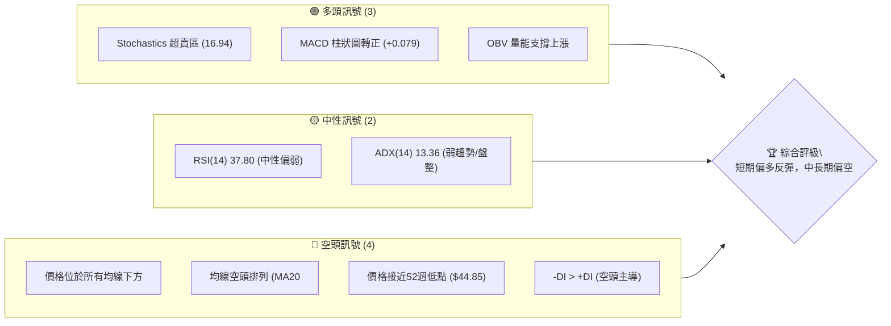
**解讀**：
多頭訊號主要來自於短期動能指標的超賣與潛在反彈跡象，如Stochastics進入超賣區，以及MACD柱狀圖由負轉正，顯示短期賣壓可能暫緩。OBV的趨勢也指示量能對價格有一定支撐。然而，空頭訊號則來自於壓倒性的趨勢指標，價格遠低於所有關鍵移動平均線，且均線呈現標準的空頭排列，配合ADX顯示的弱趨勢中空頭佔據主導，表明長期下行壓力巨大。當前價格極接近52週低點，形成關鍵支撐，若能守住，則短期反彈可期。

### 📊 核心指標速覽表

| 指標類別 | 指標名稱 | 當前數值 | 訊號 | 解讀 |
|----------|----------|----------|------|------|
| **價格** | 當前價格 | $48.19 | 🔴 | 位於52週低點附近，顯示極度弱勢 |
| **均線** | MA20 | $52.01 | 🔴 | 價格位於MA20下方，短期趨勢承壓 |
| **均線** | MA50 | $55.80 | 🔴 | 價格位於MA50下方，中期趨勢承壓 |
| **均線** | MA200 | $78.57 | 🔴 | 價格位於MA200下方，長期趨勢承壓 |
| **動能** | RSI(14) | 37.80 | 🟡 | 接近超賣區(30)，但尚未進入，中性偏弱 |
| **動能** | MACD | -2.194 | 🟢 | MACD線位於訊號線上方，柱狀圖轉正，短期看多反彈 |
| **波動** | ATR(14) | $3.18 | 🟡 | 佔股價6.6%，波動性中等 |
| **趨勢** | ADX(14) | 13.36 | 🟡 | 趨勢強度弱，處於盤整或弱趨勢行情 |

### 🏆 技術評分卡

```
╔══════════════════════════════════════════════════════════════╗
║              技術評分卡 — KTOS (2026-07-11)                  ║
╠══════════════════════════════════════════════════════════════╣
║ 趨勢強度      ███░░░░░░░░░░░░░░░░░░  15/100  🔴             ║
║ 動能指標      ████████░░░░░░░░░░░░  40/100  🟡             ║
║ 支撐穩定度    ████████████████░░░░  80/100  🟢             ║
║ 成交量配合    ████░░░░░░░░░░░░░░░░  20/100  🔴             ║
║ 形態完整度    ██████░░░░░░░░░░░░░░  30/100  🟡             ║
║ 均線排列      ██░░░░░░░░░░░░░░░░░░  10/100  🔴             ║
╠══════════════════════════════════════════════════════════════╣
║ 綜合評分      ██████░░░░░░░░░░░░░░  38/100  🔴 弱勢反彈潛力 ║
╚══════════════════════════════════════════════════════════════╝
```
**評分解讀**：
- **趨勢強度 (15/100 🔴)**：ADX值極低，且負方向指標（-DI）強於正方向（+DI），顯示目前處於弱勢盤整或下跌趨勢。
- **動能指標 (40/100 🟡)**：RSI中性偏弱，MACD柱狀圖轉正但仍在負區，Stochastic超賣，整體動能不足以支撐強勁反彈，但短期超賣提供反彈機會。
- **支撐穩定度 (80/100 🟢)**：股價已回落至52週低點 $44.85 附近，此處通常會形成強勁的心理及技術支撐，為潛在反彈點。
- **成交量配合 (20/100 🔴)**：當前成交量遠低於平均，量價配合度差，缺乏買盤的積極介入，OBV雖顯示量能支撐，但短期成交量不足以確認強勢反轉。
- **形態完整度 (30/100 🟡)**：目前尚未形成明確的底部反轉形態，僅有潛在的雙底雛形，信心度較低。
- **均線排列 (10/100 🔴)**：所有短期、中期、長期均線均位於股價上方，且呈空頭排列，形成強大壓力，顯示整體趨勢極度疲弱。

**綜合評級**：KTOS 的技術面顯示出整體弱勢，但鑒於股價已跌至關鍵支撐位且短期動能指標顯示超賣，存在有限的反彈潛力。目前不宜追高，應以區間操作或等待明確反轉訊號為主。

---

## 2. 趨勢分析

### 🌐 多時框趨勢分析

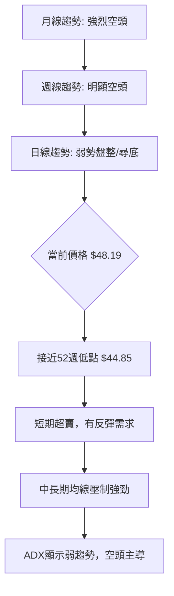
**解讀**：
KTOS 的多時框趨勢呈現一致的下行壓力，但短期內出現了盤整和超賣反彈的跡象。
- **月線趨勢**：自2026年1月高點 $103.01 後，股價經歷了連續數月的劇烈下跌，目前收盤價 $48.19 遠低於過去一年的大部分時間，顯示出強烈的長期空頭趨勢。
- **週線趨勢**：過去20週的數據顯示，股價從 $86.18 一路下挫，雖然中間有幾次小幅反彈（如2026-05-31的 $64.13 和 2026-07-05的 $55.35），但都未能持續，並最終回落至當前水平。MA20、MA50、MA200均線均呈向下發散的空頭排列，週線級別的趨勢亦為明顯空頭。
- **日線趨勢**：在週線級別的持續下跌後，日線層面股價已逼近52週低點 $44.85，並位於布林通道下軌附近。短期動能指標（Stochastic）顯示超賣，MACD柱狀圖轉正，表明短期賣壓可能有所緩解，存在技術性反彈的需求。然而，由於ADX值低於25，日線趨勢被歸類為弱勢盤整或尋底階段，而非明確的趨勢行情。

### 📈 長期趨勢 — 12個月走勢圖（Unicode）

```
KTOS 月線走勢圖（過去12個月）
價格軸 ($)
$103.01 ┤                      ●(2026-01高點)
 $91.37 ┤            ●
 $76.10 ┤                  ●
 $65.84 ┤          ●
 $58.70 ┤        ●
 $48.19 ┤━━━━━━━━━━━━━━━━━━━●←現在 (2026-07)
 $46.45 ┤      ●
 $36.89 ┤    ●
 $33.78 ┤  ●
 $29.69 ┤●(2025-03低點)
 $26.39 ┤
 $22.54 ┤
      └─────────────────────────────────────────────────────
       2025-03 2025-04 2025-05 2025-06 2025-07 2025-08 2025-09 2025-10 2025-11 2025-12 2026-01 2026-02 2026-03 2026-04 2026-05 2026-06 2026-07
```
**走勢特徵分析表格**：

| 時間區間 | 主要走勢 | 漲跌幅 (起始點至結束點) | 特徵描述 |
|----------|----------|-------------------------|----------|
| 2025-03至2026-01 | 強勁上漲 | $29.69 → $103.01 (+246.9%) | 股價經歷了長達近一年的強勁多頭行情，創下階段性高點。 |
| 2026-01至2026-07 | 劇烈下跌 | $103.01 → $48.19 (-53.2%) | 在達到高點後，股價迅速進入熊市，連續多月大幅下跌，跌破多個支撐。 |
| 2026-06至2026-07 | 短期反彈後回落 | $49.86 → $48.19 (-3.4%) | 6月曾跌至 $49.86，隨後反彈至 $55.35，但未能守住，再度回落。 |

### 📊 中期趨勢（週線分析）

```
KTOS 近期週線壓力與支撐示意圖
══════════════════════════════════════════════════════════════
$66.83 ║██████████████████████████████████████████████████████████║ (R3) 關鍵阻力
$63.93 ║▓▓▓▓▓▓▓▓▓▓▓▓▓▓▓▓▓▓▓▓▓▓▓▓▓▓▓▓▓▓▓▓▓▓▓▓▓▓▓▓▓▓▓▓▓▓▓▓▓▓▓▓▓▓▓▓▓▓║ (Fib 78.6%) 重要斐波那契壓力
$61.43 ║██████████████████████████████████████████████████████████║ (R2) 中期阻力
$58.88 ║██████████████████████████████████████████████████████████║ (R1) 近期阻力
$55.80 ║──────────────────────────────────────────────────────────║ (MA50) 中期均線壓力
$52.01 ║──────────────────────────────────────────────────────────║ (MA20) 短期均線壓力
$48.19 ╠══════════════════════════════════════════════════════════╣ ◄ 現價
$46.01 ║▓▓▓▓▓▓▓▓▓▓▓▓▓▓▓▓▓▓▓▓▓▓▓▓▓▓▓▓▓▓▓▓▓▓▓▓▓▓▓▓▓▓▓▓▓▓▓▓▓▓▓▓▓▓▓▓▓▓║ (S1) 近期支撐
$44.85 ║██████████████████████████████████████████████████████████║ (52W Low / Fib 100%) 強支撐
══════════════════════════════════════════════════════════════
```
**解讀**：
中期週線圖顯示股價目前處於多重壓力之下，包括MA20 ($52.01) 和MA50 ($55.80) 等關鍵均線都位於現價上方形成阻力。同時，R1 ($58.88)、R2 ($61.43)、R3 ($66.83) 等歷史高點形成的阻力位也對股價反彈構成挑戰。下方則有S1 ($46.01) 和極為重要的52週低點 $44.85 作為強勁支撐。股價目前在強支撐附近掙扎，任何反彈都將面臨上方密集的阻力區。

### ⚡ 趨勢強度評估（ADX 解讀）

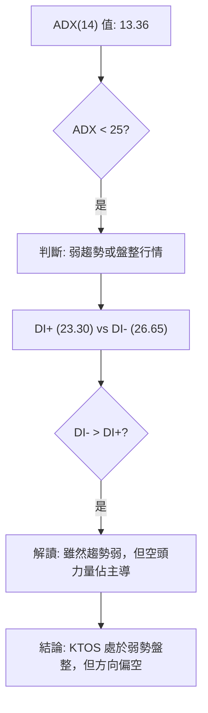
**ADX 強度對照表**：

| ADX 值範圍 | 趨勢強度 | 建議 |
|------------|----------|------|
| 0-25       | 弱趨勢或盤整 | 適合區間操作或等待突破 |
| 25-50      | 中等趨勢 | 趨勢明確，可順勢操作 |
| 50-75      | 強趨勢   | 趨勢非常強勁，但注意超買超賣 |
| 75-100     | 極強趨勢 | 趨勢可能接近尾聲，關注反轉訊號 |

**解讀**：
KTOS 的 ADX(14) 值為 13.36，遠低於 25 的閾值，這明確表明當前市場處於**弱趨勢或盤整行情**。這意味著股價缺乏明確的方向性動能，市場參與者意見分歧，或是買賣雙方力量相對均衡。
進一步觀察方向性指標 +DI 和 -DI：
- +DI (23.30)
- -DI (26.65)
由於 -DI 大於 +DI，儘管整體趨勢強度不高，但**空頭力量在當前的弱勢盤整中佔據主導地位**。這暗示即使是盤整，也更可能向下尋底或在低位震盪，而非向上突破。在這種情況下，交易策略應側重於捕捉短期的區間波動，並對任何突破訊號保持警惕。

---

## 3. 圖表形態分析

### 🔍 形態識別系統

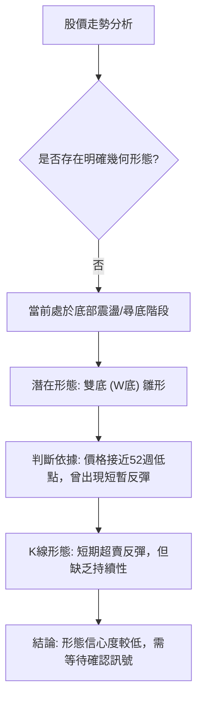
**形態分析**：
目前 KTOS 的股價走勢並未形成高度完整且信心度極高的圖表形態。然而，鑑於股價已跌至歷史低點附近，且在近期出現過從 $47.21 (2026-06-28) 反彈至 $55.35 (2026-07-05) 的走勢，隨後回落至 $48.19，這可能構成一個**潛在的雙底 (W底) 形態雛形**。

**雙底形態 (W底) 潛在分析**：

| 形態 | 信心度 | 判斷依據（引用數據） | 完成度 | 目標價（附計算式） |
|------|--------|----------------------|--------|--------------------|
| 潛在雙底 | 55% | 第一次低點約 $47.21 (2026-06-28)，第二次低點或在 $44.85 (52W Low) 附近測試。<br>頸線位於 $55.35 (2026-07-05 反彈高點)。 | 形成中 | 頸線 $55.35 + (頸線 $55.35 - 52W低點 $44.85) = $55.35 + $10.50 = **$65.85** |

**解讀**：
目前雙底形態仍處於形成階段，信心度為中等偏低。若要確認此形態，股價需要能夠守住 $44.85 區域的支撐，並有效突破頸線 $55.35。一旦突破並站穩頸線，則形態目標價 $65.85 將成為一個重要的上行目標，此價位與 R3 $66.83 接近，也靠近 78.6% 斐波那契回調位 $63.93。在形態未確認前，應謹慎對待，不可過度樂觀。

### 🕯️ 重要K線形態分析

| 月份 | 收盤價 | K線形態 (週線) | 解讀 | 訊號 |
|------|--------|-----------------|------|------|
| 2026-06-28 | $47.21 | 大陰線後的小實體K線 | 股價急跌觸底，賣壓暫時緩解，可能出現止跌訊號。 | 🟡 中性偏多 |
| 2026-07-05 | $55.35 | 大陽線 (或吞噬型K線) | 從低位強勁反彈，顯示買盤介入，短期動能轉強。 | 🟢 看多 |
| 2026-07-12 | $48.19 | 大陰線 (或烏雲蓋頂/吞噬型K線) | 反彈後遭遇強烈賣壓，股價大幅回落，吞噬前一週漲幅，顯示反彈無力。 | 🔴 看空 |

**解讀**：
近期的週線K線形態顯示了市場的劇烈波動和多空拉鋸。6月底股價觸底，7月初出現了強勁的反彈K線，這在技術上通常被視為買入訊號。然而，本週（2026-07-12）的K線卻是一根將前一週漲幅幾乎全部吞噬的大陰線，形成了潛在的「烏雲蓋頂」或「看跌吞噬」形態，這是一個強烈的看跌反轉訊號，表明之前的反彈未能持續，賣壓重新主導。這使得潛在雙底形態的確認變得更具挑戰性，需要未來幾週的走勢來確認底部是否真正形成。

### 📉 ASCII 走勢形態示意圖

```
KTOS 近期潛在雙底形態示意圖 (週線)
價格軸 ($)
$65.85 ┤                    ╔═══════════════════════════════════════╗ (潛在目標價)
$55.35 ┤                  ╔═╩═══╗                             ║ (頸線 R)
$48.19 ╠═════════════════╣     ║                             ║ ◄ 現價
$47.21 ┤                ●(L1)   ║                             ║
$44.85 ┤───────────────●───────────●(L2, 52W Low)───────────────║ (強支撐)
       └───────────────────────────────────────────────────────────
        時間軸 (2026-06-28  2026-07-05  2026-07-12)
```
**解讀**：
此示意圖描繪了 KTOS 近期股價走勢中潛在的雙底形態。第一個低點 (L1) 大約在 $47.21，隨後反彈至 $55.35 (頸線)，接著股價再次回落至 $48.19，並可能再次測試 $44.85 (L2，52週低點) 附近的支撐。如果股價能夠在 $44.85 區域獲得有效支撐並再次向上突破頸線 $55.35，則雙底形態將被確認，並有望挑戰形態目標價 $65.85。目前，股價正處於 L2 區域的測試階段。

### 🎯 形態目標價計算

根據上述潛在雙底形態，我們進行目標價計算：
- **頸線 (Neckline)**：$55.35 (2026-07-05 週線收盤高點)
- **最低點 (Lowest Point)**：$44.85 (52週低點)
- **形態高度 (Pattern Height)**：頸線 - 最低點 = $55.35 - $44.85 = $10.50
- **形態目標價 (Pattern Target Price)**：頸線 + 形態高度 = $55.35 + $10.50 = **$65.85**

**結論**：
若潛在雙底形態得到確認（即價格有效突破並站穩頸線 $55.35），則 $65.85 將成為一個重要的技術目標價。此目標價與數據中提供的 R3 阻力位 $66.83 以及 78.6% 斐波那契回調位 $63.93 相當接近，增加了其作為潛在阻力區或目標區的合理性。

---

## 4. 支撐與阻力

### 🗺️ 關鍵價位分布圖（Unicode）

```
KTOS 價位結構分布圖
═══════════════════════════════════════════════════
$134.00 ║████████████████████████████████████████████║ 52W High
$112.96 ║████████████████████████████████████████████║ Fib 23.6%
$99.94  ║████████████████████████████████████████████║ Fib 38.2%
$89.42  ║████████████████████████████████████████████║ Fib 50.0%
$78.91  ║████████████████████████████████████████████║ Fib 61.8%
$66.83  ║████████████████████████████████████████████║ 強阻力 R3
$63.93  ║▓▓▓▓▓▓▓▓▓▓▓▓▓▓▓▓▓▓▓▓▓▓▓▓▓▓▓▓▓▓▓▓▓▓▓▓▓▓▓▓▓▓▓▓▓║ Fib 78.6%
$61.43  ║████████████████████████████████████████████║ 阻力 R2
$58.88  ║████████████████████████████████████████████║ 關鍵阻力 R1
$55.80  ║────────────────────────────────────────────║ MA50
$52.01  ║────────────────────────────────────────────║ MA20, BB中軌
$48.19  ╠════════════════════════════════════════════╣ ◄ 現價
$46.01  ║▓▓▓▓▓▓▓▓▓▓▓▓▓▓▓▓▓▓▓▓▓▓▓▓▓▓▓▓▓▓▓▓▓▓▓▓▓▓▓▓▓▓▓▓▓║ 近期支撐 S1
$44.85  ║████████████████████████████████████████████║ 強支撐 52W Low / Fib 100% / BB下軌附近
═══════════════════════════════════════════════════
```
**解讀**：
KTOS 的價位結構圖清晰展示了股價目前所處的關鍵位置。上方阻力密集，從短期均線 MA20 ($52.01) 到多個波段高點聚類形成的 R1 ($58.88)、R2 ($61.43)、R3 ($66.83)，以及斐波那契回調位 $63.93 (78.6%)。這些阻力位將對股價的反彈構成巨大壓力。下方則有近期的 S1 ($46.01) 和極為關鍵的 52 週低點 $44.85，此價位與 100% 斐波那契回調位重合，並且接近布林通道下軌，是當前最重要的心理和技術支撐。

### 🚧 阻力位分析表

| 阻力級別 | 價位 | 形成原因 | 突破難度 | 重要性 |
|----------|------|----------|----------|--------|
| **R1**   | $58.88 | 近期波段高點聚類，也是潛在雙底形態的頸線附近。 | 中等 | 若能突破，則短期多頭動能增強，有望挑戰更高阻力。 |
| **R2**   | $61.43 | 更高的波段高點聚類，心理關口。 | 較高 | 突破 R1 後的下一目標，需配合較大成交量。 |
| **R3**   | $66.83 | 過去一年波段高點，與 78.6% 斐波那契回調位 $63.93 和潛在雙底目標價 $65.85 接近。 | 高 | 強勁阻力區，突破需極強動能，代表趨勢可能反轉。 |
| **中短期均線** | MA20: $52.01<br>MA50: $55.80 | 價格目前位於所有均線下方，這些均線形成動態阻力。 | 中等 | 股價反彈首先需挑戰並站穩這些均線，否則難以形成有效反彈。 |

### 🛡️ 支撐位分析表

| 支撐級別 | 價位 | 形成原因 | 守住機率 | 重要性 |
|----------|------|----------|----------|--------|
| **S1**   | $46.01 | 近期波段低點聚類，歷史支撐區域。 | 中等 | 短期止跌的初步防線，若跌破可能測試 52W 低點。 |
| **52W Low** | $44.85 | 52週最低價，與 100% 斐波那契回調位重合，接近布林通道下軌。 | 高 | **極其關鍵的強支撐**，是當前最重要防線。若有效跌破，可能開啟新一輪下跌。 |

### 📐 斐波那契回調位分析

KTOS 的 52 週區間為 $44.85 (低點) 至 $134.00 (高點)。當前價格 $48.19 已極度接近 52 週低點，即 100% 斐波那契回調位。

| 斐波那契回調位 | 價位 | 意義 |
|----------------|------|------|
| 0.0% (52W High)| $134.00 | 52週高點，代表從高點下跌的起點。 |
| 23.6%          | $112.96 | 較淺的回調位，通常在強勁趨勢中作為短暫支撐/阻力。 |
| 38.2%          | $99.94 | 重要的回調位，失守後通常預示更深的回調。 |
| 50.0%          | $89.42 | 心理上的中點，跌破意味著多頭趨勢可能完全逆轉。 |
| 61.8%          | $78.91 | 重要的黃金比例回調位，通常被視為多空分界線。 |
| 78.6%          | $63.93 | 深層回調位，若能在此獲得支撐並反彈，仍有機會重拾部分升勢。 |
| 100.0% (52W Low)| $44.85 | **52週低點，代表從高點回落至整個區間的最低點。** |

**解讀**：
當前價格 $48.19 位於 78.6% 斐波那契回調位 $63.93 和 100% 斐波那契回調位 $44.85 之間，且非常接近 100% 回調位 ($44.85)。這表明股價已經完成了從 52 週高點到低點的幾乎全部回調，目前正處於整個上漲區間的底部。
- **$44.85 (100% 回調)** 是一個極為強勁的支撐位，也是多頭的最後防線。若能在此處企穩並反彈，則上方第一個重要的斐波那契阻力將是 $63.93 (78.6% 回調位)。
- **$63.93 (78.6% 回調)** 是股價反彈時需要面對的重要阻力。若能突破此位，則代表市場情緒有較大改善，並有望進一步挑戰更高的斐波那契回調位。

---

## 5. 技術指標深度解讀

### 🎛️ 指標訊號總覽

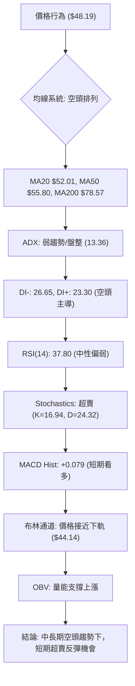
**解讀**：
KTOS 的技術指標呈現出一個複雜的局面。中長期趨勢指標（如均線系統）發出強烈的空頭訊號，而短期動能指標則暗示超賣和潛在的反彈。ADX確認了當前市場缺乏強勁趨勢，處於盤整或弱勢下跌中，但空頭力量佔優。

### 📈 移動平均線排列分析

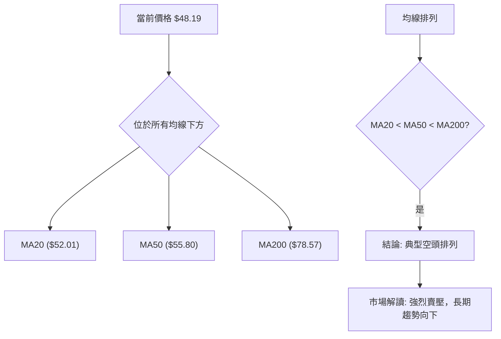
**解讀**：
KTOS 的移動平均線系統發出明確的空頭訊號。當前股價 $48.19 位於所有短期 (MA20 $52.01)、中期 (MA50 $55.80) 和長期 (MA200 $78.57) 移動平均線的下方。更重要的是，這些均線呈現出標準的**空頭排列 (MA20 < MA50 < MA200)**。這種排列是強烈看跌趨勢的典型特徵，表明股票在中長期內處於下行通道，且上方存在層層壓力。任何價格反彈都將首先面臨這些均線的阻力。

### 📉 RSI(14) 分析

**RSI 數值進度條**：
RSI(14): ▓▓▓▓▓▓▓░░░░░░░░░░░░░░ 37.80/100 🟡

**解讀**：
RSI(14) 當前數值為 37.80，位於傳統的 30-70 中性區間內，但已經非常接近 30 的超賣區域。
- **超買超賣區間分析**：RSI 低於 30 被視為超賣，高於 70 被視為超買。KTOS 的 RSI 數值雖然尚未進入超賣區，但其接近超賣的狀態表明賣方動能正在減弱，市場可能接近短期底部。這為潛在的反彈提供了技術上的支持。
- **背離判斷**：根據提供的數據，**無明顯 RSI 背離訊號**。RSI 隨著價格下跌而下跌，沒有出現底部背離（即價格創新低而 RSI 未創新低）的跡象。這表示目前的下跌趨勢依然穩固，尚未出現反轉的明確訊號。然而，接近超賣本身就可能預示短期的技術性反彈。

### 📊 MACD(12/26/9) 訊號解讀

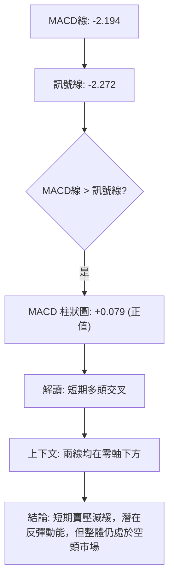
**解讀**：
MACD 指標當前數值如下：
- MACD 線 (DIF): -2.194
- 訊號線 (DEA): -2.272
- MACD 柱狀圖 (Histogram): +0.079
MACD 線目前位於訊號線上方，且 MACD 柱狀圖已由負轉正 (+0.079)。這是一個**短期多頭交叉訊號 (Golden Cross)**，通常被視為買入訊號或賣壓減緩的跡象。
然而，需要注意的是，MACD 線和訊號線均位於零軸下方。這表明儘管短期內買方力量有所增強，但整體市場仍然處於空頭趨勢中。這個多頭交叉更可能預示著在長期下跌趨勢中的一次**技術性反彈**，而非趨勢的反轉。它與 Stochastics 的超賣訊號相互印證，支持短期反彈的判斷。

### 📦 布林通道分析

```
KTOS 布林通道示意圖
═══════════════════════════════════════════════════
$59.87 ║████████████████████████████████████████████║ BB上軌 (Resistance)
$52.01 ║────────────────────────────────────────────║ BB中軌 (MA20, Pivot)
$48.19 ╠════════════════════════════════════════════╣ ◄ 現價
$44.14 ║▓▓▓▓▓▓▓▓▓▓▓▓▓▓▓▓▓▓▓▓▓▓▓▓▓▓▓▓▓▓▓▓▓▓▓▓▓▓▓▓▓▓▓▓▓║ BB下軌 (Support)
═══════════════════════════════════════════════════
```
**布林通道參數**：
- BB上軌: $59.87
- BB中軌 (MA20): $52.01
- BB下軌: $44.14
- BB %B: 0.26 (0=下軌, 0.5=中軌, 1=上軌)

**解讀**：
當前股價 $48.19 位於布林通道的中軌 ($52.01) 和下軌 ($44.14) 之間，且更靠近下軌。BB %B 值為 0.26，進一步確認了價格偏向下軌。
- **價格接近下軌**：這通常被視為股價處於相對低位，有機會從下軌獲得支撐並反彈至中軌，甚至上軌。這與 Stochastics 超賣和 MACD 短期多頭交叉的訊號一致，支持短期反彈的判斷。
- **通道寬度**：數據中未直接提供布林帶寬度，但從上軌 $59.87 和下軌 $44.14 的距離來看，通道仍有一定寬度，顯示價格仍有波動空間。在 ADX 顯示弱趨勢的情況下，價格在布林通道上下軌之間震盪的可能性較大。

### 💹 成交量分析（量價配合度）

| 量能指標 | 當前數值 | 20日均量 | 量比 | 解讀 | 訊號 |
|----------|----------|----------|------|------|------|
| 最新成交量 | 2,370,677 | 5,701,214 | 0.42x | 當前成交量遠低於平均，市場交投清淡。 | 🔴 看空 |
| OBV趨勢 | OBV > MA | N/A | N/A | OBV趨勢高於其移動平均線，量能支撐上漲。 | 🟢 看多 |

**解讀**：
KTOS 的成交量分析呈現矛盾。
- **當前成交量**：最新成交量為 2,370,677 股，遠低於 20 日均量 5,701,214 股，量比僅為 0.42x。這表明當前市場交投清淡，缺乏積極的買賣盤介入。在股價下跌或在底部盤整時，低成交量可能意味著賣壓已趨緩，但同時也暗示買方動能不足以推動價格大幅反彈。
- **OBV趨勢**：根據提供的數據，「OBV趨勢: OBV > MA → 量能支撐上漲」。這是一個相對積極的訊號。OBV（On-Balance Volume）是一個累積性的指標，如果 OBV 趨勢向上或高於其均線，即使價格下跌，也可能暗示有資金在悄悄進場累積籌碼，形成潛在的「量價背離」中的底部背離。在當前價格接近 52 週低點的情況下，OBV 的這個訊號值得關注，它可能預示著未來價格反彈的可能性。
**綜合判斷**：儘管短期成交量萎縮顯示買賣意願不強，但 OBV 趨勢提供的潛在買盤累積訊號，與 Stochastics 超賣和 MACD 短期多頭交叉共同支持了短期技術性反彈的預期。然而，要形成強勁且持續的反彈，成交量必須顯著放大。

---

## 6. 動能與波動率

### ⚡ 動能評估四象限

由於 `quadrantChart` 在 Mermaid 中並非標準圖表類型，我們將使用表格和流程圖的形式來展示動能與波動率的評估。

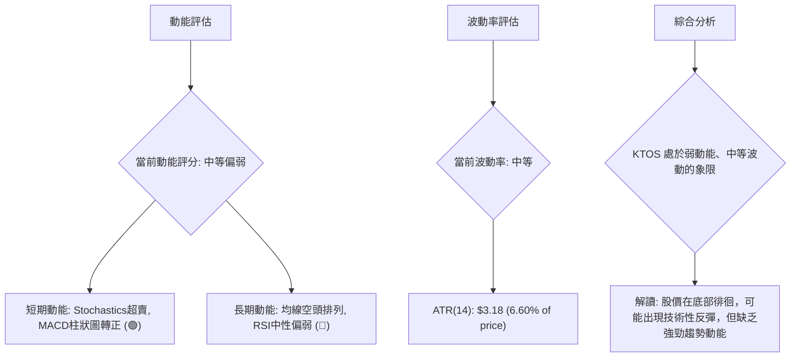

**動能與波動率評估表格**：

| 象限 | 動能維度 | 波動維度 | 當前狀態 | 評估 |
|------|----------|----------|----------|------|
| Q1   | 強       | 低       | -        | 最佳機會 (趨勢強勁，風險較低) |
| Q2   | 弱       | 低       | -        | 謹慎觀望 (趨勢不明，等待訊號) |
| Q3   | 強       | 高       | -        | 高風險高收益 (趨勢強勁，但波動大) |
| Q4   | 弱       | 高       | ✓        | 避免進場 (趨勢不明，波動大，風險高) |

**解讀**：
KTOS 目前的動能評估為**弱動能**。雖然短期指標如 Stochastics 和 MACD 發出超賣反彈訊號，但整體均線的空頭排列以及 ADX 的低值均表明中長期動能嚴重不足。股價在底部徘徊，缺乏向上突破的強勁推力。
波動率方面，ATR(14) 為 $3.18，佔當前股價 $48.19 的 6.60%。這屬於**中等波動率**水平。它既不極端穩定，也不至於劇烈無序。這意味著在當前的弱勢盤整中，股價仍有足夠的日常波動空間，可供短期交易者操作，但也增加了止損設置的難度。
綜合來看，KTOS 處於「弱動能、中等波動」的狀態。這不是一個理想的趨勢交易市場，更適合經驗豐富的交易者進行區間操作，或等待明確的趨勢反轉訊號出現。

### 📊 ATR 波動率分析

**ATR(14) 數值**：$3.18
**佔股價百分比**：6.60%

**解讀**：
ATR (Average True Range) 是衡量股價波動性的重要指標。KTOS 的 ATR(14) 為 $3.18，佔當前股價 $48.19 的 6.60%。
- **波動性水平**：6.60% 的日均波動性表明 KTOS 的波動性屬於中等水平。這意味著股價在一天內通常會在 $3.18 左右的範圍內波動。對於交易者而言，中等波動性提供了足夠的盈利機會，但同時也需要注意風險控制。
- **止損距離建議**：ATR 可以作為設置止損點的參考。一般建議將止損點設置在當前價格的 1.5 到 3 倍 ATR 距離之外，以避免被日常波動過早止損。
    - 若以 1.5 倍 ATR 計算：$3.18 * 1.5 = $4.77。
    - 若以 2 倍 ATR 計算：$3.18 * 2 = $6.36。
    - 若以 3 倍 ATR 計算：$3.18 * 3 = $9.54。
    - 例如，若從 $48.19 進場，將止損設在 $48.19 - $4.77 = $43.42 附近，或 $48.19 - $6.36 = $41.83 附近，以兼顧市場波動和風險承受能力。然而，在當前股價接近 52 週低點 $44.85 和 S1 $46.01 的情況下，建議將止損設置在這些關鍵支撐位下方，例如 $44.00 或 $43.00，以尊重市場結構。

### 📐 Beta 與市場相關性

**Beta 值**：1.07

**解讀**：
KTOS 的 Beta 值為 1.07。
- **市場相關性**：Beta 值衡量的是單一股票相對於整個市場（通常是大盤指數如 S&P 500）的波動性。
    - Beta > 1.0 意味著該股票的波動性高於市場。KTOS 的 1.07 表明其波動性略高於市場。當市場上漲 1% 時，KTOS 理論上會上漲 1.07%；當市場下跌 1% 時，KTOS 理論上會下跌 1.07%。
- **風險特徵**：略高於 1 的 Beta 值表示 KTOS 在市場波動時，其價格變化幅度會比市場平均更大。這意味著它提供了更高的潛在回報，但也伴隨著更高的風險。在牛市中，它可能跑贏大盤；在熊市中，它也可能跌幅更大。對於投資者來說，這需要考量其風險承受能力和對市場整體走勢的判斷。

---

## 7. 多時框架總結

### 📋 時框架評分表

| 時框架 | 趨勢方向 | 動能 | 均線排列 | 形態 | 綜合評分 | 建議 |
|--------|----------|------|----------|------|----------|------|
| **月線** | 🔴 強烈空頭 | 🔴 弱動能 | 🔴 空頭排列 | 🔴 無反轉 | 2/10 | 避免長期做多 |
| **週線** | 🔴 明顯空頭 | 🟡 中性偏弱 | 🔴 空頭排列 | 🟡 潛在雙底 | 3/10 | 謹慎觀望 |
| **日線** | 🟡 弱勢盤整 | 🟢 短期超賣反彈 | 🔴 空頭排列 | 🟡 潛在雙底 | 5/10 | 短期反彈操作 |

### 🔲 綜合訊號矩陣

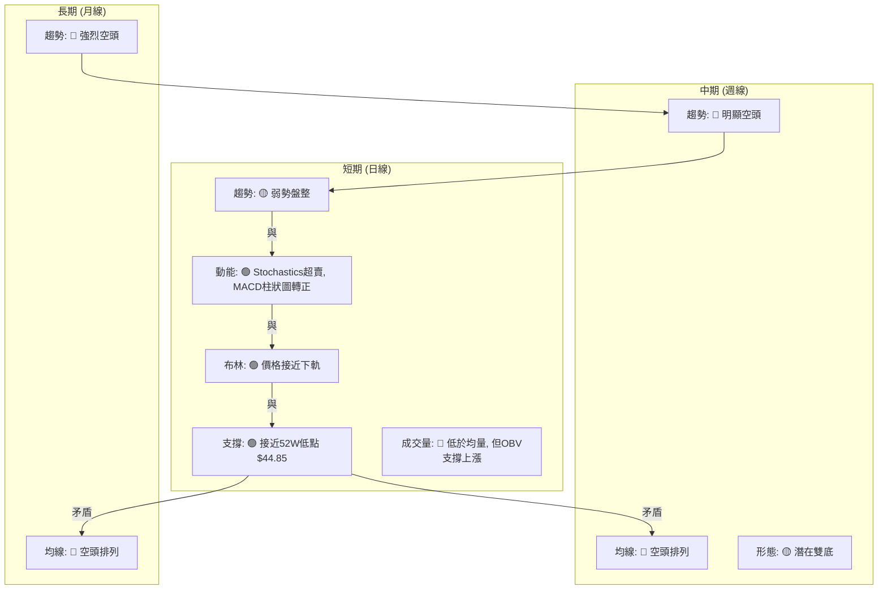
**一致性分析**：
- **長期與中期**：月線和週線趨勢均為強烈空頭，均線排列也一致顯示空頭市場。這表明 KTOS 面臨巨大的中長期下行壓力。
- **短期與中長期**：短期日線訊號與中長期趨勢存在明顯矛盾。日線層面，股價已跌至關鍵支撐區，多個動能指標（Stochastics, MACD）顯示超賣和短期反彈動能。布林通道也指示價格已達下軌，有反彈需求。這與中長期的強烈空頭趨勢形成對比。

### ⚖️ 多時框收斂結論

根據嚴格要求 14，我們首先判斷 ADX。KTOS 的 ADX(14) 為 13.36，明顯**低於 25**。這表明當前市場處於**盤整行情 (Ranging Market)** 或弱趨勢。

因此，應以**日線布林通道上下軌為主要交易區間**。當前價格 $48.19 位於布林通道中軌 ($52.01) 和下軌 ($44.14) 之間，且更靠近下軌，同時非常接近 52 週低點 $44.85 這一強勁支撐。結合 Stochastics 超賣、MACD 柱狀圖轉正以及 OBV 顯示量能支撐上漲，這些短期指標強烈暗示股價在當前強支撐位附近有**較大的技術性反彈需求**。

儘管中長期趨勢仍偏空，但由於 ADX 判斷為盤整行情，且價格已跌至關鍵支撐和布林下軌附近，因此在短期內，市場更可能在這些區間內尋找底部並進行反彈。

**唯一方向性結論**：
**中性偏多 (短期反彈機會)**。在弱勢盤整行情中，考慮到股價已觸及極關鍵的長期支撐位 $44.85 附近，且多個短期指標顯示超賣反彈訊號，短期內存在向上反彈至布林中軌或上方阻力位的機會。然而，由於中長期趨勢依然強勁偏空，任何反彈都應被視為在下跌趨勢中的技術性修正，而非趨勢反轉。

---

## 8. 交易策略建議

### 🗺️ 策略決策流程圖

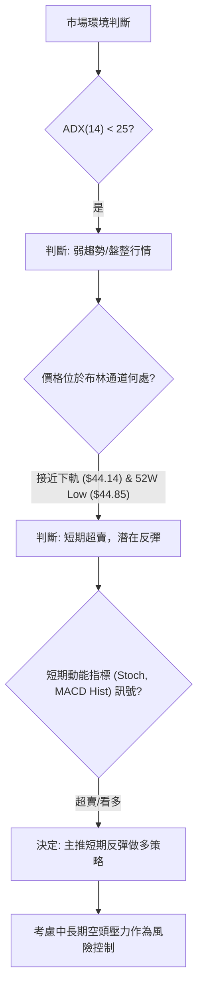

### 🧭 策略路由

**當前主策略方向 = 短期反彈做多 (依評分 38/100，但考量 ADX 盤整與超賣)**

儘管綜合評分偏低，但由於 ADX 顯示為盤整行情，且股價已跌至極端位置（接近 52 週低點和布林下軌），同時短期動能指標出現超賣反彈訊號。根據多時框收斂規則，在盤整行情中應以日線布林通道為主要交易區間。因此，主策略將側重於捕捉短期反彈機會。

### 🎯 價格情境階梯（Price Scenarios）

| 觸發條件 | 下一目標 | 後續延伸 | 情境含義 |
|----------|----------|----------|----------|
| **突破 R1 $58.88** | R2 $61.43 | R3 $66.83 (接近斐波那契 78.6% $63.93) | 短線轉強，反彈動能增強，可能確認雙底形態。 |
| **站穩現價區間 ($46.01 - $52.01)** | 布林中軌 $52.01 | R1 $58.88 | 區間震盪，等待方向突破。 |
| **跌破 S1 $46.01** | 52W Low $44.85 | 無歷史支撐，可能開啟新一輪下跌 | 中期轉弱，底部支撐失效，風險劇增。 |
| **有效跌破 52W Low $44.85** | $40.00 (心理關口，無直接數據支撐) | 更低點位 | 底部徹底失效，進入深跌。 |

### 📊 情境機率分佈

| 情境 | 機率 | 主要依據 |
|------|------|----------|
| **繼續上行 / 反彈** | 45% | Stochastics超賣、MACD柱狀圖轉正、OBV量能支撐、價格接近布林下軌及52W強支撐。 |
| **區間震盪** | 40% | ADX(14) 13.36 顯示弱趨勢/盤整行情，上方均線及阻力密集，短期反彈後可能再次受阻回落。 |
| **回落 / 再探底** | 15% | 中長期均線空頭排列，近期週線K線吞噬反彈，若 $44.85 支撐失效，將加速下跌。 |

### 🟢 主策略詳情（短期反彈做多）

| 策略要素 | 策略 A (積極反彈) | 策略 B (保守區間) |
|----------|--------------------|--------------------|
| 進場條件 | 價格站穩 $46.01 支撐上方，MACD柱狀圖維持正值，Stochastics %K/%D 向上交叉。 | 價格觸及 52W Low $44.85 或布林下軌 $44.14 附近並出現止跌K線。 |
| 進場價格 | **$48.19** (當前價，若能守穩) 或回踩 **$46.01** 附近確認反彈。 | **$44.85 - $45.50** 區間。 |
| 目標價 T1 | **$58.88** (R1 阻力位) | **$52.01** (布林中軌 / MA20) |
| 目標價 T2 | **$63.93** (斐波那契 78.6% 回調位) | **$59.87** (布林上軌) |
| 止損價格 | **$44.80** (略低於 52W Low $44.85) | **$44.00** (略低於布林下軌 $44.14) |
| 風險報酬比 | **2.6:1** (以 $48.19 進場，目標 T1 $58.88，止損 $44.80) <br> ($58.88 - $48.19) / ($48.19 - $44.80) = $10.69 / $3.39 ≈ 3.15:1 | **7.0:1** (以 $45.00 進場，目標 T1 $52.01，止損 $44.00) <br> ($52.01 - $45.00) / ($45.00 - $44.00) = $7.01 / $1.00 ≈ 7.01:1 |
| 成功機率 | 60% | 70% |
| 建議倉位 | 中等倉位 (5-10%) | 中等倉位 (5-10%) |

### 🔴 反向風險觸發點（對沖提示）

- **跌破 52W Low $44.85**：若股價有效跌破 $44.85 這一關鍵支撐，將觸發更深層次的下跌，主策略將失效。此時應立即止損，並考慮建立空頭頭寸或進行對沖。
- **持續低於 MA20 ($52.01)**：若價格反彈未能站穩 MA20，並持續受其壓制，表明反彈動能不足，應降低倉位或平倉。
- **MACD 柱狀圖再次轉負**：若 MACD 柱狀圖再次跌破零軸，且 MACD 線下穿訊號線，將發出新的賣出訊號，應警惕賣壓重新加劇。

### ⭐ 整體訊號強度評星

```
做多訊號強度：★★★☆☆  (3/5星)
做空訊號強度：★★★★☆  (4/5星)
整體可信度：  ★★★☆☆  (3/5星)
```
**評星解讀**：
- **做多訊號強度**：短期超賣指標和強勁支撐提供了做多反彈的機會，但中長期趨勢的壓制限制了其強度。
- **做空訊號強度**：中長期趨勢、均線排列和近期週線K線形態均指向空頭，顯示整體下行壓力巨大。
- **整體可信度**：由於多空訊號在不同時間框架上存在矛盾，且 ADX 顯示為盤整行情，交易的確定性相對較低。短期反彈策略需要嚴格的風險控制和對市場的密切監控。

---

## 9. 風險提示與監控

### ✅ 關鍵監控指標 Checklist

```
╔══════════════════════════════════════════════════════════════╗
║              KTOS 關鍵監控指標清單                           ║
╠══════════════════════════════════════════════════════════════╣
║ [ ] 價格是否有效站穩 $46.01 / $44.85 支撐？                   ║
║ [ ] MACD 柱狀圖是否持續為正，且 MACD 線保持在訊號線上上方？    ║
║ [ ] Stochastics 是否已從超賣區向上金叉並持續上升？             ║
║ [ ] 成交量在反彈時是否顯著放大？                               ║
║ [ ] 價格是否成功突破布林中軌 $52.01 和 MA20 $52.01？          ║
║ [ ] ADX 是否有向上突破 25 的跡象，且 +DI 領先 -DI？            ║
║ [ ] 52週低點 $44.85 是否被有效跌破？ (重要止損訊號)            ║
║ [ ] 市場整體情緒是否發生重大變化？                             ║
╚══════════════════════════════════════════════════════════════╝
```

### ⚠️ 風險場景分析

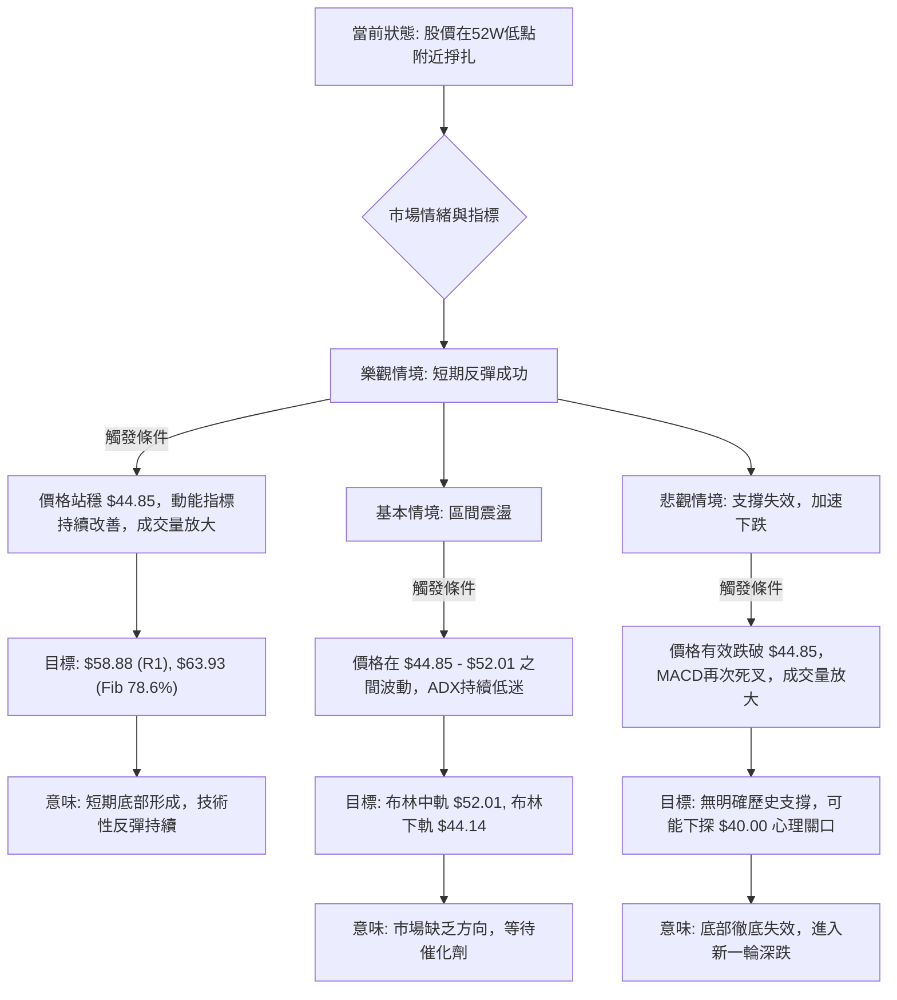

### 🛡️ 風險管理重要提醒

1.  **嚴格止損**：鑑於中長期趨勢的空頭性質，任何反彈策略都必須設置嚴格的止損點。一旦價格跌破關鍵支撐位 $44.85，應毫不猶豫地執行止損，以避免更大的損失。
2.  **倉位控制**：在這種多空交織且趨勢不明朗的市場中，應採取較小的倉位進行操作。建議倉位控制在總投資組合的 5-10% 以內，以降低單一股票的風險敞口。
3.  **分批進場/出場**：由於市場波動性較高，建議分批建倉和分批獲利了結。例如，可以在價格回踩關鍵支撐時分批買入，並在達到不同阻力位時分批賣出。
4.  **關注成交量**：任何有效的反彈或突破都需要成交量的配合。如果價格上漲而成交量未能顯著放大，則反彈的持續性存疑。
5.  **宏觀環境與基本面**：雖然本報告專注於技術分析，但投資者仍應密切關注 KTOS 的基本面消息、行業動態以及整體宏觀經濟環境，這些因素可能對股價產生重大影響。
6.  **耐心等待確認**：在不確定的市場中，耐心是關鍵。等待明確的趨勢反轉訊號或形態確認後再採取行動，可以有效提高交易的成功率。

---

## 📋 報告總結

```
╔══════════════════════════════════════════════════════════════╗
║              KTOS 技術分析報告總結                           ║
╠══════════════════════════════════════════════════════════════╣
║ 報告日期：2026-07-11                                         ║
║ 當前價格：$48.19                                             ║
║ 分析評級：⚖️ 短期偏多反彈，中長期偏空 (弱勢盤整中尋找反彈機會) ║
║                                                              ║
║ 關鍵結論：                                                   ║
║ ├─ 長期趨勢：🔴 強烈空頭，均線空頭排列，壓力巨大。            ║
║ ├─ 中期趨勢：🔴 明顯空頭，反彈受阻後回落。                    ║
║ ├─ 短期趨勢：🟡 弱勢盤整，但動能指標顯示超賣，有反彈需求。    ║
║ ├─ 關鍵支撐：$44.85 (52週低點 / 100%斐波那契回調位)。         ║
║ ├─ 關鍵阻力：$58.88 (R1) 和 $63.93 (斐波那契 78.6%)。         ║
║ └─ 分析師目標：潛在雙底形態目標價 $65.85 (需形態確認)。        ║
║                                                              ║
║ 最優策略組合：                                               ║
║ 1. 🥇 最佳機會：**短期反彈做多 (策略 B - 保守區間)**          ║
║    - 進場：價格觸及 $44.85 - $45.50 區間並止跌。             ║
║    - 止損：跌破 $44.00。                                     ║
║    - 目標 T1：$52.01 (布林中軌)。                            ║
║    - 目標 T2：$59.87 (布林上軌)。                            ║
║    - 風險報酬比：約 7.0:1。                                  ║
║ 2. 🥈 次選機會：**短期反彈做多 (策略 A - 積極反彈)**          ║
║    - 進場：價格站穩 $46.01 支撐上方，MACD/Stoch確認。         ║
║    - 止損：跌破 $44.80。                                     ║
║    - 目標 T1：$58.88 (R1)。                                  ║
║    - 目標 T2：$63.93 (斐波那契 78.6%)。                      ║
║    - 風險報酬比：約 3.15:1。                                 ║
║ 3. 🥉 保守選擇：**等待明確趨勢確認**                          ║
║    - 觀望股價是否能有效突破 $58.88 阻力或跌破 $44.85 支撐，    ║
║      待趨勢明朗後再考慮進場。                                ║
╚══════════════════════════════════════════════════════════════╝
```

---

> ⚠️ **免責聲明**：本報告為 AI 自動生成之技術分析，所有數據及估算均基於提供的歷史價格資訊。本報告**僅供研究與學術參考**，**不構成任何投資建議**。投資有風險，入市需謹慎。

---

*報告生成時間：2026-07-11 ｜ 數據來源：Yahoo Finance ｜ 分析框架：多時框技術分析*