<details>
<summary>📊 靜態圖表 (點擊展開)</summary>

</details>

<html>
<head><meta charset="utf-8" /></head>
<body>
    <div style="height:500px; width:100%;">                        <script>window.PlotlyConfig = {MathJaxConfig: 'local'};</script>
        <script charset="utf-8" src="https://cdn.plot.ly/plotly-3.7.0.min.js" integrity="sha256-jvTGqxNp8AGWEcvNLVuKr+8j5dGe9Yw51LQkmDH+IYA=" crossorigin="anonymous"></script>                <div id="candlestick-chart" class="plotly-graph-div" style="height:100%; width:100%;"></div>            <script>                window.PLOTLYENV=window.PLOTLYENV || {};                                if (document.getElementById("candlestick-chart")) {                    Plotly.newPlot(                        "candlestick-chart",                        [{"close":{"dtype":"f8","bdata":"AAAAoJn5VEAAAAAghUtUQAAAAMDMDFVAAAAAgOuRVUAAAADAHgVWQAAAACCu11ZAAAAAoHA9V0AAAACA68FXQAAAAAApDFhAAAAAAAAQWUAAAAAAKexZQAAAAEDhalpAAAAAQDOjWEAAAADgUahXQAAAAIDrEVhAAAAAQDPTV0AAAADAHqVWQAAAACCuJ1ZAAAAAIK7HVEAAAACgmalVQAAAACCup1ZAAAAAQDMTVUAAAADgelRWQAAAACCFy1ZAAAAAIIWrVkAAAACA63FWQAAAAKBwzVZAAAAAQDMTVkAAAABgZqZWQAAAAGBmxlZAAAAAgBSOVkAAAACAPVpTQAAAAIA9GlJAAAAA4FF4U0AAAAAghctTQAAAAIDCJVNAAAAAwMwsU0AAAAAAKexRQAAAAMDMHFJAAAAAIFyPUUAAAABACpdRQAAAAEDhqlFAAAAAANfTUEAAAADA9UhRQAAAAEAKh1JAAAAAQDPDUkAAAACgR\u002fFSQAAAAGBmBlNAAAAAoHBNUkAAAACgcL1RQAAAAIDrMVJAAAAAIIVrU0AAAAAAACBTQAAAAIDrQVNAAAAAgOtBU0AAAACAPTpTQAAAAIDrsVNAAAAAoHD9UkAAAADgo5BSQAAAAOBRSFJAAAAAoEdxUUAAAACgmdlRQAAAAMD12FJAAAAAgOthVEAAAABAM5NUQAAAAIAU\u002flNAAAAAwMxsU0AAAACAFF5TQAAAAGC4\u002flJAAAAAgD36UkAAAABgj9JTQAAAACCFe1ZAAAAAIIX7VkAAAAAAKdxWQAAAAGCPAlpAAAAAwMxsXEAAAABACnddQAAAAIAU7l1AAAAAAABgXkAAAAAA1yNfQAAAAEAKV2BAAAAAgMIVYEAAAACAwiVeQAAAAGBmdlxAAAAAwPWYW0AAAADgetRbQAAAAADXg11AAAAAQOEqXEAAAACAPQpbQAAAAOCjwFlAAAAAgD0KWEAAAAAgrtdZQAAAAMAe1VZAAAAAAABQVUAAAACAPZpXQAAAAADXs1hAAAAAYLheV0AAAACA6\u002fFVQAAAAEAzw1VAAAAAANdDVkAAAACAFP5WQAAAAKBwTVhAAAAAQOFqWkAAAADAHgVYQAAAAADXk1dAAAAAIIWrVkAAAABguA5WQAAAAMD1CFdAAAAAIIWLVUAAAACAFK5WQAAAAMDMPFZAAAAA4FFIVkAAAABgj2JVQAAAAAAAwFVAAAAAgBQeV0AAAACgcD1WQAAAAEDhOlZAAAAAoHBdVkAAAACA6+FVQAAAAIDrYVZAAAAAANfTV0AAAABgj0JXQAAAAIDrMVdAAAAAIK4nVUAAAAAAKexUQAAAACBcX1NAAAAAYLj+U0AAAABACvdSQAAAAAAp\u002fFFAAAAAgOtRUEAAAADgo6BRQAAAAMDM7FBAAAAAANfTUEAAAACAwoVSQAAAAKBw\u002fVFAAAAAoHCdUkAAAADAHhVRQAAAAIDClVFAAAAAQDNjUkAAAACAPWpSQAAAAIA9qlJAAAAAgD2aUkAAAAAgXL9RQAAAAMAedVFAAAAAQDMjUUAAAABACidRQAAAAKBHYVBAAAAAoEehTkAAAADgepRPQAAAAOB61E5AAAAAIK7HTUAAAABgZoZPQAAAAGBmBk9AAAAAQAr3TkAAAAAgrqdNQAAAAGCPwk5AAAAAAACATEAAAACA6\u002fFMQAAAAGC4fkxAAAAAgD2qTEAAAABguD5KQAAAAMDMbEtAAAAAIIULSkAAAAAAKRxLQAAAAAApvEpAAAAAwPXoS0AAAACAwlVLQAAAAEAKF0xAAAAAYGZmTEAAAABgZqZMQAAAAAApTFBAAAAA4FEIUEAAAABguL5PQAAAAGCPok9AAAAAQAo3TUAAAABAM7NPQAAAAGCPQk1AAAAAoHDdTEAAAADgURhMQAAAAMD1aEtAAAAAANdjTUAAAAAAAOBMQAAAAGCPgkxAAAAAIIUrTEAAAADgehRMQAAAAEDhGktAAAAAIIWLSUAAAABgZmZJQAAAAKCZ+UdAAAAAwPUoR0AAAABA4ZpHQAAAAKCZeUdAAAAAgBTuSEAAAADAHoVKQAAAAMDMrEtAAAAAwB7FSkAAAAAghStJQAAAAOCjMElAAAAAwMxsSEAAAADgURhIQA=="},"high":{"dtype":"f8","bdata":"AAAAYLheVUAAAAAAAEBVQAAAAOBROFVAAAAAgMK1VUAAAABA4WpWQAAAACCu91ZAAAAAoEdhV0AAAACgmRlYQAAAACCuh1hAAAAAAADAWUAAAACgcC1aQAAAAADXk1pAAAAA4HokXEAAAACgmalZQAAAAAAAYFlAAAAAYGZGWEAAAAAgXJ9YQAAAAIDCJVdAAAAAoEehVUAAAACAFC5WQAAAAEAzs1ZAAAAAAACAVkAAAADAzHxWQAAAACCFO1dAAAAAYGamV0AAAADAzBxXQAAAACCud1dAAAAAAADAVkAAAACgmQlXQAAAAIAU7lZAAAAAgMLlVkAAAAAAAKBUQAAAAIAU3lNAAAAAYGaWU0AAAAAAAIBUQAAAACBcv1NAAAAAQOGKU0AAAACgmflSQAAAAKBHcVJAAAAAwMw8UkAAAAAAANBRQAAAACCFC1JAAAAAYLieUkAAAACAwlVRQAAAAAApnFJAAAAAIIULU0AAAABA4UpTQAAAACBcH1NAAAAAYGYmU0AAAABgZqZSQAAAAAAAQFJAAAAA4HqUU0AAAADgUYhTQAAAAOB6hFNAAAAAgD3qU0AAAACgcJ1TQAAAAIAU3lNAAAAAoJnZU0AAAABA4RpTQAAAAOBRqFJAAAAAIFyPUkAAAACAPRpSQAAAAGCP8lJAAAAAIK53VEAAAACAPdpUQAAAAAApfFRAAAAAgD36U0AAAACAFI5TQAAAAAApjFNAAAAAgBQ+U0AAAABguO5TQAAAAEAKh1ZAAAAAgOsBV0AAAADgetRXQAAAAEAzc1tAAAAAwMzcXEAAAADgUehdQAAAAOB6ZF5AAAAAoHD9XkAAAAAA15NfQAAAAAAAgGBAAAAAAADAYEAAAAAAAABgQAAAAEAzU15AAAAAgOvhXEAAAABA4WpcQAAAAMD1iF1AAAAAAAAAXkAAAADAzMxcQAAAAAAAMFtAAAAAwPVIWUAAAAAgXN9ZQAAAAAAAwFlAAAAAYGYmV0AAAABA4apXQAAAAIDr8VhAAAAAAADgWEAAAABAMyNYQAAAAIDCZVZAAAAAIFwPV0AAAABgZlZXQAAAAAAAIFlAAAAAgD16WkAAAABA4apaQAAAAMAexVdAAAAAIFzvVkAAAACA61FXQAAAAAApHFdAAAAAoJmZVUAAAABgZkZYQAAAAIAUTldAAAAAYGaGVkAAAAAgXF9WQAAAAOBRuFZAAAAAQOFqV0AAAABAMxNXQAAAAGC4vlZAAAAAIK7XVkAAAACgmflWQAAAAEAz81ZAAAAAYGbWV0AAAADgUThYQAAAAAAAoFdAAAAAAAAAV0AAAAAA15NVQAAAAKBHwVRAAAAAACk8VEAAAACA6+FTQAAAAOBRGFNAAAAAoJn5UUAAAACAFL5RQAAAAEAzM1JAAAAA4KNgUUAAAACAPZpSQAAAAKCZOVJAAAAAACncU0AAAAAAAKBSQAAAAIDroVFAAAAAYGaGUkAAAADgeiRTQAAAAGCPElNAAAAAgBROU0AAAADA9ThTQAAAAKBw7VFAAAAAoJm5UUAAAABguL5RQAAAACBcL1FAAAAA4KNwUEAAAAAghRtQQAAAAKCZWU9AAAAAoEfhTkAAAABACpdPQAAAAAAAwE9AAAAA4FEIUEAAAADAHmVPQAAAAGC43k5AAAAAwB7FTkAAAADgUfhMQAAAAEDh2kxAAAAA4KNQTUAAAAAAAEBMQAAAAAAp\u002fEtAAAAAQDPzSkAAAAAAKVxLQAAAACCFS0tAAAAA4KPwS0AAAAAA14NLQAAAAAAAYExAAAAAYGamTUAAAACAFK5MQAAAAMAetVBAAAAAAACwUEAAAADAzIxQQAAAAEAz009AAAAAwMzsTkAAAAAghctPQAAAAMDMDE9AAAAAAADgTUAAAABgZqZNQAAAAGBmZkxAAAAAgOtxTUAAAACgmdlOQAAAAAAAwE1AAAAAgOuxTEAAAABAMzNNQAAAAAAAYExAAAAAQDMTS0AAAAAghStKQAAAAMAeZUlAAAAAANfjR0AAAADgUZhIQAAAAIDrcUhAAAAAACm8SUAAAADgoxBLQAAAAOCjcE1AAAAAwMysS0AAAABgj0JLQAAAACCu50lAAAAAoHA9SUAAAABgZqZIQA=="},"hovertemplate":"\u003cb\u003e%{x|%Y-%m-%d}\u003c\u002fb\u003e\u003cbr\u003e\u958b: $%{open:.2f}\u003cbr\u003e\u9ad8: $%{high:.2f}\u003cbr\u003e\u4f4e: $%{low:.2f}\u003cbr\u003e\u6536: $%{close:.2f}\u003cextra\u003e\u003c\u002fextra\u003e","low":{"dtype":"f8","bdata":"AAAAYGZGVEAAAABgZjZUQAAAACCut1NAAAAAIIUbVUAAAABAM\u002fNVQAAAAGBmBlZAAAAA4FEoVkAAAACA6yFXQAAAAEAKd1dAAAAAoEeBWEAAAAAAAABZQAAAAKCZeVlAAAAAQDMzWEAAAACgmTlXQAAAAEDhqldAAAAAYI+yVkAAAACAPUpWQAAAACBcH1ZAAAAAoHBtVEAAAADAzExVQAAAAMDMTFVAAAAAANczVEAAAAAgrjdVQAAAACCFS1ZAAAAA4KMQVkAAAAAAKWxWQAAAAKBwfVZAAAAAYI8CVkAAAACAPfpVQAAAAMDM\u002fFVAAAAA4Hq0VUAAAABgZvZSQAAAAKBHkVFAAAAAoJkpUUAAAABAM0NTQAAAAMD1+FJAAAAAAADgUkAAAAAA19NRQAAAAAAAQFFAAAAAYGY2UUAAAACA6\u002fFQQAAAAEAzU1FAAAAAgD26UEAAAABAMzNQQAAAAMD1SFFAAAAAoJkpUkAAAAAA19NSQAAAAOCjwFJAAAAAIIU7UkAAAAAgrrdRQAAAACCFa1FAAAAAgOsRUkAAAADgo7BSQAAAAKCZyVJAAAAAANcDU0AAAADAzExSQAAAAEAzs1JAAAAAwMzMUkAAAABgZkZSQAAAAEDhGlJAAAAAANdTUUAAAADA9YhRQAAAAGC4zlFAAAAAANczU0AAAABgZvZTQAAAAIDr0VNAAAAAYGYGU0AAAACgmQlTQAAAAEAz81JAAAAA4FG4UkAAAADAHpVSQAAAAOBRiFRAAAAAwMysVUAAAADgo6BWQAAAAKBHsVhAAAAAoJkpWkAAAAAAAKBcQAAAAMDMTF1AAAAAAACAXEAAAACgR1FdQAAAAAAAQF9AAAAAAADAX0AAAACA65FcQAAAAGC4zltAAAAAQAoXW0AAAACgR7FaQAAAAADXw1tAAAAA4KNQW0AAAACAwoVaQAAAAOBRaFlAAAAAoEexV0AAAACgmUlYQAAAAEDhulVAAAAAAAAgVUAAAAAAAABWQAAAAMDMTFdAAAAAoHBNV0AAAACgR0FVQAAAAAAAUFVAAAAAoEfBVUAAAADgesRVQAAAAMDMPFdAAAAAYLg+WEAAAAAghdtXQAAAAAAAwFZAAAAAYI8CVUAAAACgcA1WQAAAAMD1qFVAAAAAAAAAVUAAAADAHlVVQAAAAGBmplVAAAAAAABwVUAAAACgmZlUQAAAAAAAYFRAAAAAwMzMVUAAAADA9ShWQAAAACCup1VAAAAAwPVYVUAAAADAzMxVQAAAAKCZuVVAAAAAIFyPVkAAAACAPSpXQAAAAMD16FVAAAAAYGbGVEAAAADgeoRUQAAAAKBH4VJAAAAAANdTU0AAAACgmclSQAAAAMDM7FFAAAAAIK4XUEAAAABAM2NQQAAAAGBm5lBAAAAAIIXrT0AAAADAzIxRQAAAAEAzc1FAAAAAQDMjUkAAAACA6xFRQAAAACCF21BAAAAAQApnUUAAAACgRyFSQAAAAAAAUFJAAAAA4KNAUkAAAACAPZpRQAAAAEAKN1FAAAAA4Hr0UEAAAADA9ehQQAAAAMAe5U9AAAAAoEeBTkAAAADgUZhOQAAAAAApHE5AAAAAIK6HTUAAAACA69FNQAAAAKCZeU5AAAAAoEfhTkAAAACgRwFNQAAAAEAKN01AAAAAwB4lTEAAAACgcN1LQAAAAKBHgUtAAAAAgBSOS0AAAAAghetJQAAAAGC4PkpAAAAA4HrUSUAAAACAPQpKQAAAAADXY0pAAAAAQDNTSkAAAAAgrudKQAAAAEDhOktAAAAAQDPzS0AAAAAAAIBLQAAAAAAAgE5AAAAAgD0KTkAAAABAM5NOQAAAAEAK105AAAAAQDPzTEAAAADgUfhMQAAAAAAAwExAAAAAIFyvTEAAAAAgrqdKQAAAAAAAIEtAAAAAwPUIS0AAAADgenRMQAAAAEAKV0xAAAAAoEeBS0AAAADAzMxLQAAAAOBReEpAAAAAQApXSUAAAAAgrgdJQAAAAADX40dAAAAAoEcBR0AAAADAHgVHQAAAAIDCNUdAAAAAgMJVSEAAAABguN5IQAAAAIA9CktAAAAAIFxvSkAAAACgR+FIQAAAAOB61EhAAAAAQOEaSEAAAAAgrsdHQA=="},"name":"\u50f9\u683c","open":{"dtype":"f8","bdata":"AAAAYGZGVEAAAAAgrhdVQAAAAAAAAFRAAAAAAABAVUAAAADAzDxWQAAAAMD1GFZAAAAAAACgVkAAAAAAAMBXQAAAAAAp7FdAAAAAYGaWWEAAAACgmUlZQAAAAOB6xFlAAAAAwPXoWkAAAADAzKxXQAAAAIAUXlhAAAAAgBRuV0AAAADAzHxYQAAAACBc\u002f1ZAAAAAQOE6VUAAAACA69FVQAAAAEAKx1VAAAAAAACAVkAAAADAzExVQAAAAOBRCFdAAAAA4HpEV0AAAADgesRWQAAAAAAAgFZAAAAAAACAVkAAAAAAAGBWQAAAAMAetVZAAAAAYLgOVkAAAAAgrpdUQAAAAMDMfFNAAAAAQDOTUUAAAAAghVtUQAAAAGC4blNAAAAAgOsxU0AAAAAAKbxSQAAAAIA9SlFAAAAAgMIFUkAAAAAgXC9RQAAAAMAeZVFAAAAAYLieUkAAAAAA17NQQAAAAEDhWlFAAAAAgD2KUkAAAABAM\u002fNSQAAAAGC4DlNAAAAAYGYmU0AAAAAgrodSQAAAAOCjwFFAAAAAoEchUkAAAAAAKWxTQAAAAIDCZVNAAAAA4HokU0AAAAAAAABTQAAAACBcL1NAAAAAIIW7U0AAAACgRxFTQAAAAAAAQFJAAAAA4FFIUkAAAAAAKbxRQAAAAIDr4VFAAAAAAABAU0AAAACAFB5UQAAAAEAKR1RAAAAAgD36U0AAAACgcD1TQAAAAAApjFNAAAAAQDMzU0AAAABAMyNTQAAAAIA9OlVAAAAAwPV4VkAAAADgUShXQAAAAIDr4VhAAAAAYLheWkAAAABgZjZdQAAAAIA9ul1AAAAAAACgXUAAAADA9fhdQAAAAKBwbV9AAAAAIIUDYEAAAABgj+JfQAAAAOCjQF5AAAAAwB51XEAAAADAzCxbQAAAAADXw1tAAAAAAAAAXkAAAADgUbhcQAAAAOB6dFpAAAAAgD36WEAAAABgZqZYQAAAAKBwXVlAAAAAgBQeVkAAAABgZkZWQAAAAGBmpldAAAAA4Hq0WEAAAACAPfpXQAAAAKCZGVZAAAAAIFzPVUAAAADAHgVWQAAAAMD1SFdAAAAAoHBtWEAAAAAAKWxaQAAAAKBHUVdAAAAAAAAwVkAAAAAAKTxXQAAAAAAp\u002fFVAAAAAQDNTVUAAAABA4RpXQAAAAKBwTVZAAAAA4KMgVkAAAABgZjZWQAAAAOBR2FRAAAAAQAr3VUAAAAAAKdxWQAAAAIDrwVVAAAAAACk8VkAAAAAAAIBWQAAAAIDCNVZAAAAAQAq3VkAAAACAPZpXQAAAAOCjoFZAAAAAwMzcVkAAAACAwvVUQAAAAEDhqlRAAAAAYI\u002fyU0AAAADgUZhTQAAAAEAKt1JAAAAA4KPwUUAAAACgmblQQAAAAMD1KFJAAAAAgOtRUEAAAADgUchRQAAAAAAAEFJAAAAA4FHYU0AAAADAzIxSQAAAAKBHAVFAAAAAYGaGUUAAAACAPapSQAAAAAAp7FJAAAAAANcTU0AAAAAghdtSQAAAAGCPglFAAAAA4KOQUUAAAAAgrodRQAAAAMDMHFFAAAAA4KNwUEAAAADgUZhOQAAAAOBR+E5AAAAAYLjeTkAAAADAHiVOQAAAAOB6tE9AAAAAACk8T0AAAADgUVhPQAAAAIA9ik1AAAAAwB7FTkAAAACAPYpMQAAAACBcb0xAAAAAIIWrTEAAAADgejRMQAAAAKBHYUpAAAAAYLi+SkAAAACgRyFKQAAAAGC4HktAAAAAoJn5SkAAAAAAAIBLQAAAAMAepUtAAAAA4HrUTEAAAACgcH1MQAAAAEDh+k9AAAAAgD2qUEAAAAAAKTxQQAAAAMD1yE9AAAAAIFzPTkAAAACAFC5NQAAAAIDr0U5AAAAAACncTUAAAAAgrgdNQAAAAMDMzEtAAAAAwPVoS0AAAABguL5OQAAAAOBRmE1AAAAAgBROTEAAAADgo9BLQAAAAAApHExAAAAAYI\u002fiSkAAAAAgrgdJQAAAAEAKF0lAAAAAQDOzR0AAAADAHgVHQAAAAMDMLEhAAAAAgBQOSUAAAADAHiVJQAAAAIDrsUtAAAAAwPWIS0AAAACgcN1KQAAAAEDhGklAAAAAQDPzSEAAAAAAAIBIQA=="},"x":["2025-09-23T00:00:00-04:00","2025-09-24T00:00:00-04:00","2025-09-25T00:00:00-04:00","2025-09-26T00:00:00-04:00","2025-09-29T00:00:00-04:00","2025-09-30T00:00:00-04:00","2025-10-01T00:00:00-04:00","2025-10-02T00:00:00-04:00","2025-10-03T00:00:00-04:00","2025-10-06T00:00:00-04:00","2025-10-07T00:00:00-04:00","2025-10-08T00:00:00-04:00","2025-10-09T00:00:00-04:00","2025-10-10T00:00:00-04:00","2025-10-13T00:00:00-04:00","2025-10-14T00:00:00-04:00","2025-10-15T00:00:00-04:00","2025-10-16T00:00:00-04:00","2025-10-17T00:00:00-04:00","2025-10-20T00:00:00-04:00","2025-10-21T00:00:00-04:00","2025-10-22T00:00:00-04:00","2025-10-23T00:00:00-04:00","2025-10-24T00:00:00-04:00","2025-10-27T00:00:00-04:00","2025-10-28T00:00:00-04:00","2025-10-29T00:00:00-04:00","2025-10-30T00:00:00-04:00","2025-10-31T00:00:00-04:00","2025-11-03T00:00:00-05:00","2025-11-04T00:00:00-05:00","2025-11-05T00:00:00-05:00","2025-11-06T00:00:00-05:00","2025-11-07T00:00:00-05:00","2025-11-10T00:00:00-05:00","2025-11-11T00:00:00-05:00","2025-11-12T00:00:00-05:00","2025-11-13T00:00:00-05:00","2025-11-14T00:00:00-05:00","2025-11-17T00:00:00-05:00","2025-11-18T00:00:00-05:00","2025-11-19T00:00:00-05:00","2025-11-20T00:00:00-05:00","2025-11-21T00:00:00-05:00","2025-11-24T00:00:00-05:00","2025-11-25T00:00:00-05:00","2025-11-26T00:00:00-05:00","2025-11-28T00:00:00-05:00","2025-12-01T00:00:00-05:00","2025-12-02T00:00:00-05:00","2025-12-03T00:00:00-05:00","2025-12-04T00:00:00-05:00","2025-12-05T00:00:00-05:00","2025-12-08T00:00:00-05:00","2025-12-09T00:00:00-05:00","2025-12-10T00:00:00-05:00","2025-12-11T00:00:00-05:00","2025-12-12T00:00:00-05:00","2025-12-15T00:00:00-05:00","2025-12-16T00:00:00-05:00","2025-12-17T00:00:00-05:00","2025-12-18T00:00:00-05:00","2025-12-19T00:00:00-05:00","2025-12-22T00:00:00-05:00","2025-12-23T00:00:00-05:00","2025-12-24T00:00:00-05:00","2025-12-26T00:00:00-05:00","2025-12-29T00:00:00-05:00","2025-12-30T00:00:00-05:00","2025-12-31T00:00:00-05:00","2026-01-02T00:00:00-05:00","2026-01-05T00:00:00-05:00","2026-01-06T00:00:00-05:00","2026-01-07T00:00:00-05:00","2026-01-08T00:00:00-05:00","2026-01-09T00:00:00-05:00","2026-01-12T00:00:00-05:00","2026-01-13T00:00:00-05:00","2026-01-14T00:00:00-05:00","2026-01-15T00:00:00-05:00","2026-01-16T00:00:00-05:00","2026-01-20T00:00:00-05:00","2026-01-21T00:00:00-05:00","2026-01-22T00:00:00-05:00","2026-01-23T00:00:00-05:00","2026-01-26T00:00:00-05:00","2026-01-27T00:00:00-05:00","2026-01-28T00:00:00-05:00","2026-01-29T00:00:00-05:00","2026-01-30T00:00:00-05:00","2026-02-02T00:00:00-05:00","2026-02-03T00:00:00-05:00","2026-02-04T00:00:00-05:00","2026-02-05T00:00:00-05:00","2026-02-06T00:00:00-05:00","2026-02-09T00:00:00-05:00","2026-02-10T00:00:00-05:00","2026-02-11T00:00:00-05:00","2026-02-12T00:00:00-05:00","2026-02-13T00:00:00-05:00","2026-02-17T00:00:00-05:00","2026-02-18T00:00:00-05:00","2026-02-19T00:00:00-05:00","2026-02-20T00:00:00-05:00","2026-02-23T00:00:00-05:00","2026-02-24T00:00:00-05:00","2026-02-25T00:00:00-05:00","2026-02-26T00:00:00-05:00","2026-02-27T00:00:00-05:00","2026-03-02T00:00:00-05:00","2026-03-03T00:00:00-05:00","2026-03-04T00:00:00-05:00","2026-03-05T00:00:00-05:00","2026-03-06T00:00:00-05:00","2026-03-09T00:00:00-04:00","2026-03-10T00:00:00-04:00","2026-03-11T00:00:00-04:00","2026-03-12T00:00:00-04:00","2026-03-13T00:00:00-04:00","2026-03-16T00:00:00-04:00","2026-03-17T00:00:00-04:00","2026-03-18T00:00:00-04:00","2026-03-19T00:00:00-04:00","2026-03-20T00:00:00-04:00","2026-03-23T00:00:00-04:00","2026-03-24T00:00:00-04:00","2026-03-25T00:00:00-04:00","2026-03-26T00:00:00-04:00","2026-03-27T00:00:00-04:00","2026-03-30T00:00:00-04:00","2026-03-31T00:00:00-04:00","2026-04-01T00:00:00-04:00","2026-04-02T00:00:00-04:00","2026-04-06T00:00:00-04:00","2026-04-07T00:00:00-04:00","2026-04-08T00:00:00-04:00","2026-04-09T00:00:00-04:00","2026-04-10T00:00:00-04:00","2026-04-13T00:00:00-04:00","2026-04-14T00:00:00-04:00","2026-04-15T00:00:00-04:00","2026-04-16T00:00:00-04:00","2026-04-17T00:00:00-04:00","2026-04-20T00:00:00-04:00","2026-04-21T00:00:00-04:00","2026-04-22T00:00:00-04:00","2026-04-23T00:00:00-04:00","2026-04-24T00:00:00-04:00","2026-04-27T00:00:00-04:00","2026-04-28T00:00:00-04:00","2026-04-29T00:00:00-04:00","2026-04-30T00:00:00-04:00","2026-05-01T00:00:00-04:00","2026-05-04T00:00:00-04:00","2026-05-05T00:00:00-04:00","2026-05-06T00:00:00-04:00","2026-05-07T00:00:00-04:00","2026-05-08T00:00:00-04:00","2026-05-11T00:00:00-04:00","2026-05-12T00:00:00-04:00","2026-05-13T00:00:00-04:00","2026-05-14T00:00:00-04:00","2026-05-15T00:00:00-04:00","2026-05-18T00:00:00-04:00","2026-05-19T00:00:00-04:00","2026-05-20T00:00:00-04:00","2026-05-21T00:00:00-04:00","2026-05-22T00:00:00-04:00","2026-05-26T00:00:00-04:00","2026-05-27T00:00:00-04:00","2026-05-28T00:00:00-04:00","2026-05-29T00:00:00-04:00","2026-06-01T00:00:00-04:00","2026-06-02T00:00:00-04:00","2026-06-03T00:00:00-04:00","2026-06-04T00:00:00-04:00","2026-06-05T00:00:00-04:00","2026-06-08T00:00:00-04:00","2026-06-09T00:00:00-04:00","2026-06-10T00:00:00-04:00","2026-06-11T00:00:00-04:00","2026-06-12T00:00:00-04:00","2026-06-15T00:00:00-04:00","2026-06-16T00:00:00-04:00","2026-06-17T00:00:00-04:00","2026-06-18T00:00:00-04:00","2026-06-22T00:00:00-04:00","2026-06-23T00:00:00-04:00","2026-06-24T00:00:00-04:00","2026-06-25T00:00:00-04:00","2026-06-26T00:00:00-04:00","2026-06-29T00:00:00-04:00","2026-06-30T00:00:00-04:00","2026-07-01T00:00:00-04:00","2026-07-02T00:00:00-04:00","2026-07-06T00:00:00-04:00","2026-07-07T00:00:00-04:00","2026-07-08T00:00:00-04:00","2026-07-09T00:00:00-04:00","2026-07-10T00:00:00-04:00"],"type":"candlestick"},{"hovertemplate":"MA30: $%{y:.2f}\u003cextra\u003e\u003c\u002fextra\u003e","line":{"color":"#2196F3","dash":"dash","width":2},"mode":"lines","name":"MA30","x":["2025-09-23T00:00:00-04:00","2025-09-24T00:00:00-04:00","2025-09-25T00:00:00-04:00","2025-09-26T00:00:00-04:00","2025-09-29T00:00:00-04:00","2025-09-30T00:00:00-04:00","2025-10-01T00:00:00-04:00","2025-10-02T00:00:00-04:00","2025-10-03T00:00:00-04:00","2025-10-06T00:00:00-04:00","2025-10-07T00:00:00-04:00","2025-10-08T00:00:00-04:00","2025-10-09T00:00:00-04:00","2025-10-10T00:00:00-04:00","2025-10-13T00:00:00-04:00","2025-10-14T00:00:00-04:00","2025-10-15T00:00:00-04:00","2025-10-16T00:00:00-04:00","2025-10-17T00:00:00-04:00","2025-10-20T00:00:00-04:00","2025-10-21T00:00:00-04:00","2025-10-22T00:00:00-04:00","2025-10-23T00:00:00-04:00","2025-10-24T00:00:00-04:00","2025-10-27T00:00:00-04:00","2025-10-28T00:00:00-04:00","2025-10-29T00:00:00-04:00","2025-10-30T00:00:00-04:00","2025-10-31T00:00:00-04:00","2025-11-03T00:00:00-05:00","2025-11-04T00:00:00-05:00","2025-11-05T00:00:00-05:00","2025-11-06T00:00:00-05:00","2025-11-07T00:00:00-05:00","2025-11-10T00:00:00-05:00","2025-11-11T00:00:00-05:00","2025-11-12T00:00:00-05:00","2025-11-13T00:00:00-05:00","2025-11-14T00:00:00-05:00","2025-11-17T00:00:00-05:00","2025-11-18T00:00:00-05:00","2025-11-19T00:00:00-05:00","2025-11-20T00:00:00-05:00","2025-11-21T00:00:00-05:00","2025-11-24T00:00:00-05:00","2025-11-25T00:00:00-05:00","2025-11-26T00:00:00-05:00","2025-11-28T00:00:00-05:00","2025-12-01T00:00:00-05:00","2025-12-02T00:00:00-05:00","2025-12-03T00:00:00-05:00","2025-12-04T00:00:00-05:00","2025-12-05T00:00:00-05:00","2025-12-08T00:00:00-05:00","2025-12-09T00:00:00-05:00","2025-12-10T00:00:00-05:00","2025-12-11T00:00:00-05:00","2025-12-12T00:00:00-05:00","2025-12-15T00:00:00-05:00","2025-12-16T00:00:00-05:00","2025-12-17T00:00:00-05:00","2025-12-18T00:00:00-05:00","2025-12-19T00:00:00-05:00","2025-12-22T00:00:00-05:00","2025-12-23T00:00:00-05:00","2025-12-24T00:00:00-05:00","2025-12-26T00:00:00-05:00","2025-12-29T00:00:00-05:00","2025-12-30T00:00:00-05:00","2025-12-31T00:00:00-05:00","2026-01-02T00:00:00-05:00","2026-01-05T00:00:00-05:00","2026-01-06T00:00:00-05:00","2026-01-07T00:00:00-05:00","2026-01-08T00:00:00-05:00","2026-01-09T00:00:00-05:00","2026-01-12T00:00:00-05:00","2026-01-13T00:00:00-05:00","2026-01-14T00:00:00-05:00","2026-01-15T00:00:00-05:00","2026-01-16T00:00:00-05:00","2026-01-20T00:00:00-05:00","2026-01-21T00:00:00-05:00","2026-01-22T00:00:00-05:00","2026-01-23T00:00:00-05:00","2026-01-26T00:00:00-05:00","2026-01-27T00:00:00-05:00","2026-01-28T00:00:00-05:00","2026-01-29T00:00:00-05:00","2026-01-30T00:00:00-05:00","2026-02-02T00:00:00-05:00","2026-02-03T00:00:00-05:00","2026-02-04T00:00:00-05:00","2026-02-05T00:00:00-05:00","2026-02-06T00:00:00-05:00","2026-02-09T00:00:00-05:00","2026-02-10T00:00:00-05:00","2026-02-11T00:00:00-05:00","2026-02-12T00:00:00-05:00","2026-02-13T00:00:00-05:00","2026-02-17T00:00:00-05:00","2026-02-18T00:00:00-05:00","2026-02-19T00:00:00-05:00","2026-02-20T00:00:00-05:00","2026-02-23T00:00:00-05:00","2026-02-24T00:00:00-05:00","2026-02-25T00:00:00-05:00","2026-02-26T00:00:00-05:00","2026-02-27T00:00:00-05:00","2026-03-02T00:00:00-05:00","2026-03-03T00:00:00-05:00","2026-03-04T00:00:00-05:00","2026-03-05T00:00:00-05:00","2026-03-06T00:00:00-05:00","2026-03-09T00:00:00-04:00","2026-03-10T00:00:00-04:00","2026-03-11T00:00:00-04:00","2026-03-12T00:00:00-04:00","2026-03-13T00:00:00-04:00","2026-03-16T00:00:00-04:00","2026-03-17T00:00:00-04:00","2026-03-18T00:00:00-04:00","2026-03-19T00:00:00-04:00","2026-03-20T00:00:00-04:00","2026-03-23T00:00:00-04:00","2026-03-24T00:00:00-04:00","2026-03-25T00:00:00-04:00","2026-03-26T00:00:00-04:00","2026-03-27T00:00:00-04:00","2026-03-30T00:00:00-04:00","2026-03-31T00:00:00-04:00","2026-04-01T00:00:00-04:00","2026-04-02T00:00:00-04:00","2026-04-06T00:00:00-04:00","2026-04-07T00:00:00-04:00","2026-04-08T00:00:00-04:00","2026-04-09T00:00:00-04:00","2026-04-10T00:00:00-04:00","2026-04-13T00:00:00-04:00","2026-04-14T00:00:00-04:00","2026-04-15T00:00:00-04:00","2026-04-16T00:00:00-04:00","2026-04-17T00:00:00-04:00","2026-04-20T00:00:00-04:00","2026-04-21T00:00:00-04:00","2026-04-22T00:00:00-04:00","2026-04-23T00:00:00-04:00","2026-04-24T00:00:00-04:00","2026-04-27T00:00:00-04:00","2026-04-28T00:00:00-04:00","2026-04-29T00:00:00-04:00","2026-04-30T00:00:00-04:00","2026-05-01T00:00:00-04:00","2026-05-04T00:00:00-04:00","2026-05-05T00:00:00-04:00","2026-05-06T00:00:00-04:00","2026-05-07T00:00:00-04:00","2026-05-08T00:00:00-04:00","2026-05-11T00:00:00-04:00","2026-05-12T00:00:00-04:00","2026-05-13T00:00:00-04:00","2026-05-14T00:00:00-04:00","2026-05-15T00:00:00-04:00","2026-05-18T00:00:00-04:00","2026-05-19T00:00:00-04:00","2026-05-20T00:00:00-04:00","2026-05-21T00:00:00-04:00","2026-05-22T00:00:00-04:00","2026-05-26T00:00:00-04:00","2026-05-27T00:00:00-04:00","2026-05-28T00:00:00-04:00","2026-05-29T00:00:00-04:00","2026-06-01T00:00:00-04:00","2026-06-02T00:00:00-04:00","2026-06-03T00:00:00-04:00","2026-06-04T00:00:00-04:00","2026-06-05T00:00:00-04:00","2026-06-08T00:00:00-04:00","2026-06-09T00:00:00-04:00","2026-06-10T00:00:00-04:00","2026-06-11T00:00:00-04:00","2026-06-12T00:00:00-04:00","2026-06-15T00:00:00-04:00","2026-06-16T00:00:00-04:00","2026-06-17T00:00:00-04:00","2026-06-18T00:00:00-04:00","2026-06-22T00:00:00-04:00","2026-06-23T00:00:00-04:00","2026-06-24T00:00:00-04:00","2026-06-25T00:00:00-04:00","2026-06-26T00:00:00-04:00","2026-06-29T00:00:00-04:00","2026-06-30T00:00:00-04:00","2026-07-01T00:00:00-04:00","2026-07-02T00:00:00-04:00","2026-07-06T00:00:00-04:00","2026-07-07T00:00:00-04:00","2026-07-08T00:00:00-04:00","2026-07-09T00:00:00-04:00","2026-07-10T00:00:00-04:00"],"y":{"dtype":"f8","bdata":"AAAAAAAA+H8AAAAAAAD4fwAAAAAAAPh\u002fAAAAAAAA+H8AAAAAAAD4fwAAAAAAAPh\u002fAAAAAAAA+H8AAAAAAAD4fwAAAAAAAPh\u002fAAAAAAAA+H8AAAAAAAD4fwAAAAAAAPh\u002fAAAAAAAA+H8AAAAAAAD4fwAAAAAAAPh\u002fAAAAAAAA+H8AAAAAAAD4fwAAAAAAAPh\u002fAAAAAAAA+H8AAAAAAAD4fwAAAAAAAPh\u002fAAAAAAAA+H8AAAAAAAD4fwAAAAAAAPh\u002fAAAAAAAA+H8AAAAAAAD4fwAAAAAAAPh\u002fAAAAAAAA+H8AAAAAAAD4fwAAANCF1FZAAAAAYAHiVkBERER09tlWQLy7u4vPwFZAZmZmBuSuVkAAAABw55tWQFVVVZVffFZAREREdK9ZVkBERES05CdWQO\u002fu7n4\u002f9VVAiYiICDq1VUCJiIhoH25VQN7d3b10I1VAiYiIiM\u002fgVECJiIiYbqpUQCIiItIie1RA7+7unu9PVEAiIiJiVzBUQKuqqsqhFVRAvLu7m30AVEBmZmbGBN9TQBEREcH1uFNAmpmZWdaqU0C8u7vrfI9TQCIiIiJNcVNAmpmZaS5UU0De3d2tuThTQN7d3T01HlNARERE9OEDU0AzMzMjBuFSQO\u002fu7h6wulJAERERsQ+PUkDe3d1tPYJSQHd3d+eYiFJAq6qqSmKQUkCrqqo6CpdSQJqZmSlAnlJAvLu7S2KgUkAiIiLytqxSQM3MzMw+tFJAERERYVfAUkCamZlZZNNSQBEREeF6\u002fFJA7+7urgAxU0BVVVV1k2BTQKuqqjptoFNAd3d3R+HyU0CJiIgIrExUQO\u002fu7l66qVRAZmZmJr8QVUBVVVXlF4NVQM3MzNyy\u002flVAiYiIqH9rVkDNzMysjslWQN7d3U0bGFdAAAAAUEZfV0AiIiLCrqhXQAAAAOB6\u002fFdA3t3dbctKWECamZlZHZNYQBEREdHb0lhAd3d3RygLWUCamZkpXE9ZQHd3d4ddcVlAVVVVJU15WUAiIiLSIpNZQImIiPhTu1lAVVVV9f3cWUB3d3eX\u002fPJZQJqZmUmaClpAAAAA8KcmWkCJiIjotEFaQCIiIsI8UVpAERERoYxuWkAAAACwcnhaQO\u002fu7s6wY1pAIiIi0pQyWkBERETkXvNZQImIiIiIuFlAq6qqGi9tWUBERET0\u002fSRZQGZmZvbhy1hAREREZIJ3WEC8u7trvCxYQN7d3b1081dAiYiICDrNV0De3d19hp1XQKuqqipcX1dAmpmZadgtV0De3d2t1QFXQM3MzMwT5VZAVVVVlUPjVkBmZmYGOs1WQKuqqupR0FZAq6qq2vnOVkDe3d1NG7hWQN7d3b2filZAERER8dJtVkCJiIgIZVRWQFVVVfUoNFZAiYiI6G0BVkAzMzPjpdNVQN7d3X2xlFVAERER0dtCVUB3d3dX8hNVQDMzM0NE5FRAq6qq+qnBVEDNzMzsNZdUQHd3dze0aFRA3t3djcJNVEBVVVWFXSlUQHd3d0fhClRAMzMzM3rrU0BVVVX1b8xTQJqZmdnOp1NAd3d3V8d0U0B3d3eHXUlTQCIiIgJyF1NAREREDEnbUkB3d3fHS6dSQDMzMwvXa1JAd3d3x5IfUkBVVVU9mN9RQAAAAJAJnlFAvLu7y6FtUUCJiIgQnzlRQBEREVGNF1FAvLu7K4fmUEB3d3cnMcBQQN7d3XVMoFBAvLu7s1aPUEARERFh5WhQQBEREZF7TVBAMzMzawMtUECJiIjAnwJQQO\u002fu7n5btk9AVVVVpdNmT0B3d3dHiyxPQJqZmckg8E5AERERUamoTkBERETU22JOQAAAABB0Ok5A3t3djZcOTkDv7u6Ol+5NQJqZmUma0k1AvLu7i2ynTUBmZmbWMZFNQJqZmflTc01AZmZmRkRkTUDNzMwsh0ZNQCIiIhJYKU1AmpmZGQQmTUBmZmYWZw9NQM3MzPzw+UxAd3d3NxfiTEAzMzOTptRMQKuqqhp2tUxA7+7uzj6cTEAzMzOj\u002fn1MQLy7u4tsV0xAAAAAsHIoTEBERESE6xFMQM3MzJw28EtAvLu727LmS0C8u7v7qeFLQBEREXGv6UtAMzMzE\u002fXfS0AAAACQe81LQKuqqmq8tEtAVVVV5dCSS0CJiIhY8mtLQA=="},"type":"scatter"},{"hovertemplate":"MA60: $%{y:.2f}\u003cextra\u003e\u003c\u002fextra\u003e","line":{"color":"#9C27B0","dash":"dash","width":2},"mode":"lines","name":"MA60","x":["2025-09-23T00:00:00-04:00","2025-09-24T00:00:00-04:00","2025-09-25T00:00:00-04:00","2025-09-26T00:00:00-04:00","2025-09-29T00:00:00-04:00","2025-09-30T00:00:00-04:00","2025-10-01T00:00:00-04:00","2025-10-02T00:00:00-04:00","2025-10-03T00:00:00-04:00","2025-10-06T00:00:00-04:00","2025-10-07T00:00:00-04:00","2025-10-08T00:00:00-04:00","2025-10-09T00:00:00-04:00","2025-10-10T00:00:00-04:00","2025-10-13T00:00:00-04:00","2025-10-14T00:00:00-04:00","2025-10-15T00:00:00-04:00","2025-10-16T00:00:00-04:00","2025-10-17T00:00:00-04:00","2025-10-20T00:00:00-04:00","2025-10-21T00:00:00-04:00","2025-10-22T00:00:00-04:00","2025-10-23T00:00:00-04:00","2025-10-24T00:00:00-04:00","2025-10-27T00:00:00-04:00","2025-10-28T00:00:00-04:00","2025-10-29T00:00:00-04:00","2025-10-30T00:00:00-04:00","2025-10-31T00:00:00-04:00","2025-11-03T00:00:00-05:00","2025-11-04T00:00:00-05:00","2025-11-05T00:00:00-05:00","2025-11-06T00:00:00-05:00","2025-11-07T00:00:00-05:00","2025-11-10T00:00:00-05:00","2025-11-11T00:00:00-05:00","2025-11-12T00:00:00-05:00","2025-11-13T00:00:00-05:00","2025-11-14T00:00:00-05:00","2025-11-17T00:00:00-05:00","2025-11-18T00:00:00-05:00","2025-11-19T00:00:00-05:00","2025-11-20T00:00:00-05:00","2025-11-21T00:00:00-05:00","2025-11-24T00:00:00-05:00","2025-11-25T00:00:00-05:00","2025-11-26T00:00:00-05:00","2025-11-28T00:00:00-05:00","2025-12-01T00:00:00-05:00","2025-12-02T00:00:00-05:00","2025-12-03T00:00:00-05:00","2025-12-04T00:00:00-05:00","2025-12-05T00:00:00-05:00","2025-12-08T00:00:00-05:00","2025-12-09T00:00:00-05:00","2025-12-10T00:00:00-05:00","2025-12-11T00:00:00-05:00","2025-12-12T00:00:00-05:00","2025-12-15T00:00:00-05:00","2025-12-16T00:00:00-05:00","2025-12-17T00:00:00-05:00","2025-12-18T00:00:00-05:00","2025-12-19T00:00:00-05:00","2025-12-22T00:00:00-05:00","2025-12-23T00:00:00-05:00","2025-12-24T00:00:00-05:00","2025-12-26T00:00:00-05:00","2025-12-29T00:00:00-05:00","2025-12-30T00:00:00-05:00","2025-12-31T00:00:00-05:00","2026-01-02T00:00:00-05:00","2026-01-05T00:00:00-05:00","2026-01-06T00:00:00-05:00","2026-01-07T00:00:00-05:00","2026-01-08T00:00:00-05:00","2026-01-09T00:00:00-05:00","2026-01-12T00:00:00-05:00","2026-01-13T00:00:00-05:00","2026-01-14T00:00:00-05:00","2026-01-15T00:00:00-05:00","2026-01-16T00:00:00-05:00","2026-01-20T00:00:00-05:00","2026-01-21T00:00:00-05:00","2026-01-22T00:00:00-05:00","2026-01-23T00:00:00-05:00","2026-01-26T00:00:00-05:00","2026-01-27T00:00:00-05:00","2026-01-28T00:00:00-05:00","2026-01-29T00:00:00-05:00","2026-01-30T00:00:00-05:00","2026-02-02T00:00:00-05:00","2026-02-03T00:00:00-05:00","2026-02-04T00:00:00-05:00","2026-02-05T00:00:00-05:00","2026-02-06T00:00:00-05:00","2026-02-09T00:00:00-05:00","2026-02-10T00:00:00-05:00","2026-02-11T00:00:00-05:00","2026-02-12T00:00:00-05:00","2026-02-13T00:00:00-05:00","2026-02-17T00:00:00-05:00","2026-02-18T00:00:00-05:00","2026-02-19T00:00:00-05:00","2026-02-20T00:00:00-05:00","2026-02-23T00:00:00-05:00","2026-02-24T00:00:00-05:00","2026-02-25T00:00:00-05:00","2026-02-26T00:00:00-05:00","2026-02-27T00:00:00-05:00","2026-03-02T00:00:00-05:00","2026-03-03T00:00:00-05:00","2026-03-04T00:00:00-05:00","2026-03-05T00:00:00-05:00","2026-03-06T00:00:00-05:00","2026-03-09T00:00:00-04:00","2026-03-10T00:00:00-04:00","2026-03-11T00:00:00-04:00","2026-03-12T00:00:00-04:00","2026-03-13T00:00:00-04:00","2026-03-16T00:00:00-04:00","2026-03-17T00:00:00-04:00","2026-03-18T00:00:00-04:00","2026-03-19T00:00:00-04:00","2026-03-20T00:00:00-04:00","2026-03-23T00:00:00-04:00","2026-03-24T00:00:00-04:00","2026-03-25T00:00:00-04:00","2026-03-26T00:00:00-04:00","2026-03-27T00:00:00-04:00","2026-03-30T00:00:00-04:00","2026-03-31T00:00:00-04:00","2026-04-01T00:00:00-04:00","2026-04-02T00:00:00-04:00","2026-04-06T00:00:00-04:00","2026-04-07T00:00:00-04:00","2026-04-08T00:00:00-04:00","2026-04-09T00:00:00-04:00","2026-04-10T00:00:00-04:00","2026-04-13T00:00:00-04:00","2026-04-14T00:00:00-04:00","2026-04-15T00:00:00-04:00","2026-04-16T00:00:00-04:00","2026-04-17T00:00:00-04:00","2026-04-20T00:00:00-04:00","2026-04-21T00:00:00-04:00","2026-04-22T00:00:00-04:00","2026-04-23T00:00:00-04:00","2026-04-24T00:00:00-04:00","2026-04-27T00:00:00-04:00","2026-04-28T00:00:00-04:00","2026-04-29T00:00:00-04:00","2026-04-30T00:00:00-04:00","2026-05-01T00:00:00-04:00","2026-05-04T00:00:00-04:00","2026-05-05T00:00:00-04:00","2026-05-06T00:00:00-04:00","2026-05-07T00:00:00-04:00","2026-05-08T00:00:00-04:00","2026-05-11T00:00:00-04:00","2026-05-12T00:00:00-04:00","2026-05-13T00:00:00-04:00","2026-05-14T00:00:00-04:00","2026-05-15T00:00:00-04:00","2026-05-18T00:00:00-04:00","2026-05-19T00:00:00-04:00","2026-05-20T00:00:00-04:00","2026-05-21T00:00:00-04:00","2026-05-22T00:00:00-04:00","2026-05-26T00:00:00-04:00","2026-05-27T00:00:00-04:00","2026-05-28T00:00:00-04:00","2026-05-29T00:00:00-04:00","2026-06-01T00:00:00-04:00","2026-06-02T00:00:00-04:00","2026-06-03T00:00:00-04:00","2026-06-04T00:00:00-04:00","2026-06-05T00:00:00-04:00","2026-06-08T00:00:00-04:00","2026-06-09T00:00:00-04:00","2026-06-10T00:00:00-04:00","2026-06-11T00:00:00-04:00","2026-06-12T00:00:00-04:00","2026-06-15T00:00:00-04:00","2026-06-16T00:00:00-04:00","2026-06-17T00:00:00-04:00","2026-06-18T00:00:00-04:00","2026-06-22T00:00:00-04:00","2026-06-23T00:00:00-04:00","2026-06-24T00:00:00-04:00","2026-06-25T00:00:00-04:00","2026-06-26T00:00:00-04:00","2026-06-29T00:00:00-04:00","2026-06-30T00:00:00-04:00","2026-07-01T00:00:00-04:00","2026-07-02T00:00:00-04:00","2026-07-06T00:00:00-04:00","2026-07-07T00:00:00-04:00","2026-07-08T00:00:00-04:00","2026-07-09T00:00:00-04:00","2026-07-10T00:00:00-04:00"],"y":{"dtype":"f8","bdata":"AAAAAAAA+H8AAAAAAAD4fwAAAAAAAPh\u002fAAAAAAAA+H8AAAAAAAD4fwAAAAAAAPh\u002fAAAAAAAA+H8AAAAAAAD4fwAAAAAAAPh\u002fAAAAAAAA+H8AAAAAAAD4fwAAAAAAAPh\u002fAAAAAAAA+H8AAAAAAAD4fwAAAAAAAPh\u002fAAAAAAAA+H8AAAAAAAD4fwAAAAAAAPh\u002fAAAAAAAA+H8AAAAAAAD4fwAAAAAAAPh\u002fAAAAAAAA+H8AAAAAAAD4fwAAAAAAAPh\u002fAAAAAAAA+H8AAAAAAAD4fwAAAAAAAPh\u002fAAAAAAAA+H8AAAAAAAD4fwAAAAAAAPh\u002fAAAAAAAA+H8AAAAAAAD4fwAAAAAAAPh\u002fAAAAAAAA+H8AAAAAAAD4fwAAAAAAAPh\u002fAAAAAAAA+H8AAAAAAAD4fwAAAAAAAPh\u002fAAAAAAAA+H8AAAAAAAD4fwAAAAAAAPh\u002fAAAAAAAA+H8AAAAAAAD4fwAAAAAAAPh\u002fAAAAAAAA+H8AAAAAAAD4fwAAAAAAAPh\u002fAAAAAAAA+H8AAAAAAAD4fwAAAAAAAPh\u002fAAAAAAAA+H8AAAAAAAD4fwAAAAAAAPh\u002fAAAAAAAA+H8AAAAAAAD4fwAAAAAAAPh\u002fAAAAAAAA+H8AAAAAAAD4f3d3d\u002feax1RAiYiIiIi4VEARERHxGa5UQJqZmTm0pFRAiYiIKKOfVEBVVVXVeJlUQHd3d99PjVRAAAAA4Ah9VEAzMzPTTWpUQN7d3SW\u002fVFRAzczMtMg6VEARERHhwSBUQHd3d8\u002f3D1RAvLu7G+gIVEDv7u4GgQVUQGZmZgbIDVRAMzMzc2ghVEBVVVW1gT5UQM3MzBSuX1RAERERYZ6IVEDe3d1VDrFUQO\u002fu7k7U21RAERERASsLVUBERETMhSxVQAAAADi0RFVAzczMXLpZVUAAAAA4tHBVQO\u002fu7g5YjVVAERERsVanVUBmZma+EbpVQAAAAPjFxlVARERE\u002fBvNVUC8u7vLzOhVQHd3dzf7\u002fFVAAAAAuNcEVkBmZmaGFhVWQBERERHKLFZAiYiIILA+VkDNzMzE2U9WQDMzM4tsX1ZAiYiIqH9zVkARERGhjIpWQJqZmdHbplZAAAAAqMbPVkCrqqoSg+xWQM3MzAQPAldAzczMDLsSV0BmZmZ2BSBXQLy7u3MhMVdAiYiIIPc+V0DNzMzsClRXQJqZmWlKZVdAZmZmBoFxV0BERESMJXtXQN7d3QXIhVdARERELECWV0AAAACgGqNXQFVVVYXrrVdAvLu761G8V0C8u7uDecpXQO\u002fu7s7321dAZmZm7jX3V0AAAAAYSw5YQBEREbnXIFhAAAAAgCMkWEAAAAAQnyVYQDMzM9v5IlhAMzMzc2glWEAAAADQsCNYQHd3d59hH1hARERE7AoUWEDe3d1lrQpYQAAAACD38ldAERERObTYV0C8u7uDMsZXQBEREYn6o1dAZmZmZh96V0CJiIhoSkVXQAAAAGCeEFdARERE1HjdVkDNzMy8LadWQO\u002fu7p5ha1ZAvLu7S34xVkCJiIgwlvxVQLy7u8uhzVVAAAAAsAChVUCrqqoCcnNVQGZmZhZnO1VA7+7uupAEVUCrqqq6kNRUQAAAAGx1qFRAZmZmLmuBVEDe3d0haVZUQFVVVb0tN1RAMzMz000eVEAzMzMv3fhTQHd3d4cW0VNAZmZmDi2qU0AAAAAYS4pTQJqZmbU6alNAIiIiTmJIU0AiIiKiRR5TQHd3d4cW8VJAIiIinu+3UkAAAAAMSYtSQFVVVQG5X1JAq6qq5ok6UkBERETIvRZSQCIiIk5i8FFAMzMzmwvRUUC8u7u3Za1RQLy7u6cNlFFAERER\u002fWJ5UUBmZmbe3WFRQDMzM\u002f+NSFFAq6qqzj4kUUBVVVU5+whRQHd3d\u002f+N6FBAvLu7l7XGUEDv7u6uR6VQQCIiIopBgFBAIiIiakpZUEBERETkpTNQQDMzMweBDVBAd3d3Z63eT0AiIiJa8qNPQGZmZl5Ick9AMzMzk6Y0T0ARERF5MP9OQLy7u7sCzE5AvLu7C5CjTkAzMzMj23FOQHd3d9+WRU5AERER2VwgTkBmZma+dPNNQAAAAHgF0E1AREREXGSjTUC8u7trA31NQCIiIppuUk1AMzMzG70dTUBmZmYWZ+dMQA=="},"type":"scatter"},{"hovertemplate":"MA200: $%{y:.2f}\u003cextra\u003e\u003c\u002fextra\u003e","line":{"color":"#FF6F00","dash":"solid","width":2},"mode":"lines","name":"MA200","x":["2025-09-23T00:00:00-04:00","2025-09-24T00:00:00-04:00","2025-09-25T00:00:00-04:00","2025-09-26T00:00:00-04:00","2025-09-29T00:00:00-04:00","2025-09-30T00:00:00-04:00","2025-10-01T00:00:00-04:00","2025-10-02T00:00:00-04:00","2025-10-03T00:00:00-04:00","2025-10-06T00:00:00-04:00","2025-10-07T00:00:00-04:00","2025-10-08T00:00:00-04:00","2025-10-09T00:00:00-04:00","2025-10-10T00:00:00-04:00","2025-10-13T00:00:00-04:00","2025-10-14T00:00:00-04:00","2025-10-15T00:00:00-04:00","2025-10-16T00:00:00-04:00","2025-10-17T00:00:00-04:00","2025-10-20T00:00:00-04:00","2025-10-21T00:00:00-04:00","2025-10-22T00:00:00-04:00","2025-10-23T00:00:00-04:00","2025-10-24T00:00:00-04:00","2025-10-27T00:00:00-04:00","2025-10-28T00:00:00-04:00","2025-10-29T00:00:00-04:00","2025-10-30T00:00:00-04:00","2025-10-31T00:00:00-04:00","2025-11-03T00:00:00-05:00","2025-11-04T00:00:00-05:00","2025-11-05T00:00:00-05:00","2025-11-06T00:00:00-05:00","2025-11-07T00:00:00-05:00","2025-11-10T00:00:00-05:00","2025-11-11T00:00:00-05:00","2025-11-12T00:00:00-05:00","2025-11-13T00:00:00-05:00","2025-11-14T00:00:00-05:00","2025-11-17T00:00:00-05:00","2025-11-18T00:00:00-05:00","2025-11-19T00:00:00-05:00","2025-11-20T00:00:00-05:00","2025-11-21T00:00:00-05:00","2025-11-24T00:00:00-05:00","2025-11-25T00:00:00-05:00","2025-11-26T00:00:00-05:00","2025-11-28T00:00:00-05:00","2025-12-01T00:00:00-05:00","2025-12-02T00:00:00-05:00","2025-12-03T00:00:00-05:00","2025-12-04T00:00:00-05:00","2025-12-05T00:00:00-05:00","2025-12-08T00:00:00-05:00","2025-12-09T00:00:00-05:00","2025-12-10T00:00:00-05:00","2025-12-11T00:00:00-05:00","2025-12-12T00:00:00-05:00","2025-12-15T00:00:00-05:00","2025-12-16T00:00:00-05:00","2025-12-17T00:00:00-05:00","2025-12-18T00:00:00-05:00","2025-12-19T00:00:00-05:00","2025-12-22T00:00:00-05:00","2025-12-23T00:00:00-05:00","2025-12-24T00:00:00-05:00","2025-12-26T00:00:00-05:00","2025-12-29T00:00:00-05:00","2025-12-30T00:00:00-05:00","2025-12-31T00:00:00-05:00","2026-01-02T00:00:00-05:00","2026-01-05T00:00:00-05:00","2026-01-06T00:00:00-05:00","2026-01-07T00:00:00-05:00","2026-01-08T00:00:00-05:00","2026-01-09T00:00:00-05:00","2026-01-12T00:00:00-05:00","2026-01-13T00:00:00-05:00","2026-01-14T00:00:00-05:00","2026-01-15T00:00:00-05:00","2026-01-16T00:00:00-05:00","2026-01-20T00:00:00-05:00","2026-01-21T00:00:00-05:00","2026-01-22T00:00:00-05:00","2026-01-23T00:00:00-05:00","2026-01-26T00:00:00-05:00","2026-01-27T00:00:00-05:00","2026-01-28T00:00:00-05:00","2026-01-29T00:00:00-05:00","2026-01-30T00:00:00-05:00","2026-02-02T00:00:00-05:00","2026-02-03T00:00:00-05:00","2026-02-04T00:00:00-05:00","2026-02-05T00:00:00-05:00","2026-02-06T00:00:00-05:00","2026-02-09T00:00:00-05:00","2026-02-10T00:00:00-05:00","2026-02-11T00:00:00-05:00","2026-02-12T00:00:00-05:00","2026-02-13T00:00:00-05:00","2026-02-17T00:00:00-05:00","2026-02-18T00:00:00-05:00","2026-02-19T00:00:00-05:00","2026-02-20T00:00:00-05:00","2026-02-23T00:00:00-05:00","2026-02-24T00:00:00-05:00","2026-02-25T00:00:00-05:00","2026-02-26T00:00:00-05:00","2026-02-27T00:00:00-05:00","2026-03-02T00:00:00-05:00","2026-03-03T00:00:00-05:00","2026-03-04T00:00:00-05:00","2026-03-05T00:00:00-05:00","2026-03-06T00:00:00-05:00","2026-03-09T00:00:00-04:00","2026-03-10T00:00:00-04:00","2026-03-11T00:00:00-04:00","2026-03-12T00:00:00-04:00","2026-03-13T00:00:00-04:00","2026-03-16T00:00:00-04:00","2026-03-17T00:00:00-04:00","2026-03-18T00:00:00-04:00","2026-03-19T00:00:00-04:00","2026-03-20T00:00:00-04:00","2026-03-23T00:00:00-04:00","2026-03-24T00:00:00-04:00","2026-03-25T00:00:00-04:00","2026-03-26T00:00:00-04:00","2026-03-27T00:00:00-04:00","2026-03-30T00:00:00-04:00","2026-03-31T00:00:00-04:00","2026-04-01T00:00:00-04:00","2026-04-02T00:00:00-04:00","2026-04-06T00:00:00-04:00","2026-04-07T00:00:00-04:00","2026-04-08T00:00:00-04:00","2026-04-09T00:00:00-04:00","2026-04-10T00:00:00-04:00","2026-04-13T00:00:00-04:00","2026-04-14T00:00:00-04:00","2026-04-15T00:00:00-04:00","2026-04-16T00:00:00-04:00","2026-04-17T00:00:00-04:00","2026-04-20T00:00:00-04:00","2026-04-21T00:00:00-04:00","2026-04-22T00:00:00-04:00","2026-04-23T00:00:00-04:00","2026-04-24T00:00:00-04:00","2026-04-27T00:00:00-04:00","2026-04-28T00:00:00-04:00","2026-04-29T00:00:00-04:00","2026-04-30T00:00:00-04:00","2026-05-01T00:00:00-04:00","2026-05-04T00:00:00-04:00","2026-05-05T00:00:00-04:00","2026-05-06T00:00:00-04:00","2026-05-07T00:00:00-04:00","2026-05-08T00:00:00-04:00","2026-05-11T00:00:00-04:00","2026-05-12T00:00:00-04:00","2026-05-13T00:00:00-04:00","2026-05-14T00:00:00-04:00","2026-05-15T00:00:00-04:00","2026-05-18T00:00:00-04:00","2026-05-19T00:00:00-04:00","2026-05-20T00:00:00-04:00","2026-05-21T00:00:00-04:00","2026-05-22T00:00:00-04:00","2026-05-26T00:00:00-04:00","2026-05-27T00:00:00-04:00","2026-05-28T00:00:00-04:00","2026-05-29T00:00:00-04:00","2026-06-01T00:00:00-04:00","2026-06-02T00:00:00-04:00","2026-06-03T00:00:00-04:00","2026-06-04T00:00:00-04:00","2026-06-05T00:00:00-04:00","2026-06-08T00:00:00-04:00","2026-06-09T00:00:00-04:00","2026-06-10T00:00:00-04:00","2026-06-11T00:00:00-04:00","2026-06-12T00:00:00-04:00","2026-06-15T00:00:00-04:00","2026-06-16T00:00:00-04:00","2026-06-17T00:00:00-04:00","2026-06-18T00:00:00-04:00","2026-06-22T00:00:00-04:00","2026-06-23T00:00:00-04:00","2026-06-24T00:00:00-04:00","2026-06-25T00:00:00-04:00","2026-06-26T00:00:00-04:00","2026-06-29T00:00:00-04:00","2026-06-30T00:00:00-04:00","2026-07-01T00:00:00-04:00","2026-07-02T00:00:00-04:00","2026-07-06T00:00:00-04:00","2026-07-07T00:00:00-04:00","2026-07-08T00:00:00-04:00","2026-07-09T00:00:00-04:00","2026-07-10T00:00:00-04:00"],"y":{"dtype":"f8","bdata":"AAAAAAAA+H8AAAAAAAD4fwAAAAAAAPh\u002fAAAAAAAA+H8AAAAAAAD4fwAAAAAAAPh\u002fAAAAAAAA+H8AAAAAAAD4fwAAAAAAAPh\u002fAAAAAAAA+H8AAAAAAAD4fwAAAAAAAPh\u002fAAAAAAAA+H8AAAAAAAD4fwAAAAAAAPh\u002fAAAAAAAA+H8AAAAAAAD4fwAAAAAAAPh\u002fAAAAAAAA+H8AAAAAAAD4fwAAAAAAAPh\u002fAAAAAAAA+H8AAAAAAAD4fwAAAAAAAPh\u002fAAAAAAAA+H8AAAAAAAD4fwAAAAAAAPh\u002fAAAAAAAA+H8AAAAAAAD4fwAAAAAAAPh\u002fAAAAAAAA+H8AAAAAAAD4fwAAAAAAAPh\u002fAAAAAAAA+H8AAAAAAAD4fwAAAAAAAPh\u002fAAAAAAAA+H8AAAAAAAD4fwAAAAAAAPh\u002fAAAAAAAA+H8AAAAAAAD4fwAAAAAAAPh\u002fAAAAAAAA+H8AAAAAAAD4fwAAAAAAAPh\u002fAAAAAAAA+H8AAAAAAAD4fwAAAAAAAPh\u002fAAAAAAAA+H8AAAAAAAD4fwAAAAAAAPh\u002fAAAAAAAA+H8AAAAAAAD4fwAAAAAAAPh\u002fAAAAAAAA+H8AAAAAAAD4fwAAAAAAAPh\u002fAAAAAAAA+H8AAAAAAAD4fwAAAAAAAPh\u002fAAAAAAAA+H8AAAAAAAD4fwAAAAAAAPh\u002fAAAAAAAA+H8AAAAAAAD4fwAAAAAAAPh\u002fAAAAAAAA+H8AAAAAAAD4fwAAAAAAAPh\u002fAAAAAAAA+H8AAAAAAAD4fwAAAAAAAPh\u002fAAAAAAAA+H8AAAAAAAD4fwAAAAAAAPh\u002fAAAAAAAA+H8AAAAAAAD4fwAAAAAAAPh\u002fAAAAAAAA+H8AAAAAAAD4fwAAAAAAAPh\u002fAAAAAAAA+H8AAAAAAAD4fwAAAAAAAPh\u002fAAAAAAAA+H8AAAAAAAD4fwAAAAAAAPh\u002fAAAAAAAA+H8AAAAAAAD4fwAAAAAAAPh\u002fAAAAAAAA+H8AAAAAAAD4fwAAAAAAAPh\u002fAAAAAAAA+H8AAAAAAAD4fwAAAAAAAPh\u002fAAAAAAAA+H8AAAAAAAD4fwAAAAAAAPh\u002fAAAAAAAA+H8AAAAAAAD4fwAAAAAAAPh\u002fAAAAAAAA+H8AAAAAAAD4fwAAAAAAAPh\u002fAAAAAAAA+H8AAAAAAAD4fwAAAAAAAPh\u002fAAAAAAAA+H8AAAAAAAD4fwAAAAAAAPh\u002fAAAAAAAA+H8AAAAAAAD4fwAAAAAAAPh\u002fAAAAAAAA+H8AAAAAAAD4fwAAAAAAAPh\u002fAAAAAAAA+H8AAAAAAAD4fwAAAAAAAPh\u002fAAAAAAAA+H8AAAAAAAD4fwAAAAAAAPh\u002fAAAAAAAA+H8AAAAAAAD4fwAAAAAAAPh\u002fAAAAAAAA+H8AAAAAAAD4fwAAAAAAAPh\u002fAAAAAAAA+H8AAAAAAAD4fwAAAAAAAPh\u002fAAAAAAAA+H8AAAAAAAD4fwAAAAAAAPh\u002fAAAAAAAA+H8AAAAAAAD4fwAAAAAAAPh\u002fAAAAAAAA+H8AAAAAAAD4fwAAAAAAAPh\u002fAAAAAAAA+H8AAAAAAAD4fwAAAAAAAPh\u002fAAAAAAAA+H8AAAAAAAD4fwAAAAAAAPh\u002fAAAAAAAA+H8AAAAAAAD4fwAAAAAAAPh\u002fAAAAAAAA+H8AAAAAAAD4fwAAAAAAAPh\u002fAAAAAAAA+H8AAAAAAAD4fwAAAAAAAPh\u002fAAAAAAAA+H8AAAAAAAD4fwAAAAAAAPh\u002fAAAAAAAA+H8AAAAAAAD4fwAAAAAAAPh\u002fAAAAAAAA+H8AAAAAAAD4fwAAAAAAAPh\u002fAAAAAAAA+H8AAAAAAAD4fwAAAAAAAPh\u002fAAAAAAAA+H8AAAAAAAD4fwAAAAAAAPh\u002fAAAAAAAA+H8AAAAAAAD4fwAAAAAAAPh\u002fAAAAAAAA+H8AAAAAAAD4fwAAAAAAAPh\u002fAAAAAAAA+H8AAAAAAAD4fwAAAAAAAPh\u002fAAAAAAAA+H8AAAAAAAD4fwAAAAAAAPh\u002fAAAAAAAA+H8AAAAAAAD4fwAAAAAAAPh\u002fAAAAAAAA+H8AAAAAAAD4fwAAAAAAAPh\u002fAAAAAAAA+H8AAAAAAAD4fwAAAAAAAPh\u002fAAAAAAAA+H8AAAAAAAD4fwAAAAAAAPh\u002fAAAAAAAA+H8AAAAAAAD4fwAAAAAAAPh\u002fAAAAAAAA+H+amZnxY6RTQA=="},"type":"scatter"}],                        {"template":{"data":{"barpolar":[{"marker":{"line":{"color":"rgb(17,17,17)","width":0.5},"pattern":{"fillmode":"overlay","size":10,"solidity":0.2}},"type":"barpolar"}],"bar":[{"error_x":{"color":"#f2f5fa"},"error_y":{"color":"#f2f5fa"},"marker":{"line":{"color":"rgb(17,17,17)","width":0.5},"pattern":{"fillmode":"overlay","size":10,"solidity":0.2}},"type":"bar"}],"carpet":[{"aaxis":{"endlinecolor":"#A2B1C6","gridcolor":"#506784","linecolor":"#506784","minorgridcolor":"#506784","startlinecolor":"#A2B1C6"},"baxis":{"endlinecolor":"#A2B1C6","gridcolor":"#506784","linecolor":"#506784","minorgridcolor":"#506784","startlinecolor":"#A2B1C6"},"type":"carpet"}],"choropleth":[{"colorbar":{"outlinewidth":0,"ticks":""},"type":"choropleth"}],"contourcarpet":[{"colorbar":{"outlinewidth":0,"ticks":""},"type":"contourcarpet"}],"contour":[{"colorbar":{"outlinewidth":0,"ticks":""},"colorscale":[[0.0,"#0d0887"],[0.1111111111111111,"#46039f"],[0.2222222222222222,"#7201a8"],[0.3333333333333333,"#9c179e"],[0.4444444444444444,"#bd3786"],[0.5555555555555556,"#d8576b"],[0.6666666666666666,"#ed7953"],[0.7777777777777778,"#fb9f3a"],[0.8888888888888888,"#fdca26"],[1.0,"#f0f921"]],"type":"contour"}],"heatmap":[{"colorbar":{"outlinewidth":0,"ticks":""},"colorscale":[[0.0,"#0d0887"],[0.1111111111111111,"#46039f"],[0.2222222222222222,"#7201a8"],[0.3333333333333333,"#9c179e"],[0.4444444444444444,"#bd3786"],[0.5555555555555556,"#d8576b"],[0.6666666666666666,"#ed7953"],[0.7777777777777778,"#fb9f3a"],[0.8888888888888888,"#fdca26"],[1.0,"#f0f921"]],"type":"heatmap"}],"histogram2dcontour":[{"colorbar":{"outlinewidth":0,"ticks":""},"colorscale":[[0.0,"#0d0887"],[0.1111111111111111,"#46039f"],[0.2222222222222222,"#7201a8"],[0.3333333333333333,"#9c179e"],[0.4444444444444444,"#bd3786"],[0.5555555555555556,"#d8576b"],[0.6666666666666666,"#ed7953"],[0.7777777777777778,"#fb9f3a"],[0.8888888888888888,"#fdca26"],[1.0,"#f0f921"]],"type":"histogram2dcontour"}],"histogram2d":[{"colorbar":{"outlinewidth":0,"ticks":""},"colorscale":[[0.0,"#0d0887"],[0.1111111111111111,"#46039f"],[0.2222222222222222,"#7201a8"],[0.3333333333333333,"#9c179e"],[0.4444444444444444,"#bd3786"],[0.5555555555555556,"#d8576b"],[0.6666666666666666,"#ed7953"],[0.7777777777777778,"#fb9f3a"],[0.8888888888888888,"#fdca26"],[1.0,"#f0f921"]],"type":"histogram2d"}],"histogram":[{"marker":{"pattern":{"fillmode":"overlay","size":10,"solidity":0.2}},"type":"histogram"}],"mesh3d":[{"colorbar":{"outlinewidth":0,"ticks":""},"type":"mesh3d"}],"parcoords":[{"line":{"colorbar":{"outlinewidth":0,"ticks":""}},"type":"parcoords"}],"pie":[{"automargin":true,"type":"pie"}],"scatter3d":[{"line":{"colorbar":{"outlinewidth":0,"ticks":""}},"marker":{"colorbar":{"outlinewidth":0,"ticks":""}},"type":"scatter3d"}],"scattercarpet":[{"marker":{"colorbar":{"outlinewidth":0,"ticks":""}},"type":"scattercarpet"}],"scattergeo":[{"marker":{"colorbar":{"outlinewidth":0,"ticks":""}},"type":"scattergeo"}],"scattergl":[{"marker":{"line":{"color":"#283442"}},"type":"scattergl"}],"scattermapbox":[{"marker":{"colorbar":{"outlinewidth":0,"ticks":""}},"type":"scattermapbox"}],"scattermap":[{"marker":{"colorbar":{"outlinewidth":0,"ticks":""}},"type":"scattermap"}],"scatterpolargl":[{"marker":{"colorbar":{"outlinewidth":0,"ticks":""}},"type":"scatterpolargl"}],"scatterpolar":[{"marker":{"colorbar":{"outlinewidth":0,"ticks":""}},"type":"scatterpolar"}],"scatter":[{"marker":{"line":{"color":"#283442"}},"type":"scatter"}],"scatterternary":[{"marker":{"colorbar":{"outlinewidth":0,"ticks":""}},"type":"scatterternary"}],"surface":[{"colorbar":{"outlinewidth":0,"ticks":""},"colorscale":[[0.0,"#0d0887"],[0.1111111111111111,"#46039f"],[0.2222222222222222,"#7201a8"],[0.3333333333333333,"#9c179e"],[0.4444444444444444,"#bd3786"],[0.5555555555555556,"#d8576b"],[0.6666666666666666,"#ed7953"],[0.7777777777777778,"#fb9f3a"],[0.8888888888888888,"#fdca26"],[1.0,"#f0f921"]],"type":"surface"}],"table":[{"cells":{"fill":{"color":"#506784"},"line":{"color":"rgb(17,17,17)"}},"header":{"fill":{"color":"#2a3f5f"},"line":{"color":"rgb(17,17,17)"}},"type":"table"}]},"layout":{"annotationdefaults":{"arrowcolor":"#f2f5fa","arrowhead":0,"arrowwidth":1},"autotypenumbers":"strict","coloraxis":{"colorbar":{"outlinewidth":0,"ticks":""}},"colorscale":{"diverging":[[0,"#8e0152"],[0.1,"#c51b7d"],[0.2,"#de77ae"],[0.3,"#f1b6da"],[0.4,"#fde0ef"],[0.5,"#f7f7f7"],[0.6,"#e6f5d0"],[0.7,"#b8e186"],[0.8,"#7fbc41"],[0.9,"#4d9221"],[1,"#276419"]],"sequential":[[0.0,"#0d0887"],[0.1111111111111111,"#46039f"],[0.2222222222222222,"#7201a8"],[0.3333333333333333,"#9c179e"],[0.4444444444444444,"#bd3786"],[0.5555555555555556,"#d8576b"],[0.6666666666666666,"#ed7953"],[0.7777777777777778,"#fb9f3a"],[0.8888888888888888,"#fdca26"],[1.0,"#f0f921"]],"sequentialminus":[[0.0,"#0d0887"],[0.1111111111111111,"#46039f"],[0.2222222222222222,"#7201a8"],[0.3333333333333333,"#9c179e"],[0.4444444444444444,"#bd3786"],[0.5555555555555556,"#d8576b"],[0.6666666666666666,"#ed7953"],[0.7777777777777778,"#fb9f3a"],[0.8888888888888888,"#fdca26"],[1.0,"#f0f921"]]},"colorway":["#636efa","#EF553B","#00cc96","#ab63fa","#FFA15A","#19d3f3","#FF6692","#B6E880","#FF97FF","#FECB52"],"font":{"color":"#f2f5fa"},"geo":{"bgcolor":"rgb(17,17,17)","lakecolor":"rgb(17,17,17)","landcolor":"rgb(17,17,17)","showlakes":true,"showland":true,"subunitcolor":"#506784"},"hoverlabel":{"align":"left"},"hovermode":"closest","mapbox":{"style":"dark"},"paper_bgcolor":"rgb(17,17,17)","plot_bgcolor":"rgb(17,17,17)","polar":{"angularaxis":{"gridcolor":"#506784","linecolor":"#506784","ticks":""},"bgcolor":"rgb(17,17,17)","radialaxis":{"gridcolor":"#506784","linecolor":"#506784","ticks":""}},"scene":{"xaxis":{"backgroundcolor":"rgb(17,17,17)","gridcolor":"#506784","gridwidth":2,"linecolor":"#506784","showbackground":true,"ticks":"","zerolinecolor":"#C8D4E3"},"yaxis":{"backgroundcolor":"rgb(17,17,17)","gridcolor":"#506784","gridwidth":2,"linecolor":"#506784","showbackground":true,"ticks":"","zerolinecolor":"#C8D4E3"},"zaxis":{"backgroundcolor":"rgb(17,17,17)","gridcolor":"#506784","gridwidth":2,"linecolor":"#506784","showbackground":true,"ticks":"","zerolinecolor":"#C8D4E3"}},"shapedefaults":{"line":{"color":"#f2f5fa"}},"sliderdefaults":{"bgcolor":"#C8D4E3","bordercolor":"rgb(17,17,17)","borderwidth":1,"tickwidth":0},"ternary":{"aaxis":{"gridcolor":"#506784","linecolor":"#506784","ticks":""},"baxis":{"gridcolor":"#506784","linecolor":"#506784","ticks":""},"bgcolor":"rgb(17,17,17)","caxis":{"gridcolor":"#506784","linecolor":"#506784","ticks":""}},"title":{"x":0.05},"updatemenudefaults":{"bgcolor":"#506784","borderwidth":0},"xaxis":{"automargin":true,"gridcolor":"#283442","linecolor":"#506784","ticks":"","title":{"standoff":15},"zerolinecolor":"#283442","zerolinewidth":2},"yaxis":{"automargin":true,"gridcolor":"#283442","linecolor":"#506784","ticks":"","title":{"standoff":15},"zerolinecolor":"#283442","zerolinewidth":2}}},"xaxis":{"rangeslider":{"visible":false},"title":{"text":"\u65e5\u671f"}},"font":{"size":11},"title":{"text":"KTOS  |  MA(30\u002f60\u002f200)  |  \u6700\u8fd1200\u4ea4\u6613\u65e5"},"yaxis":{"title":{"text":"\u80a1\u50f9 (USD)"}},"hovermode":"x unified","height":500},                        {"responsive": true}                    )                };            </script>        </div>
</body>
</html>

# KTOS 技術分析報告

> **報告日期**：2026-07-12 ｜ **語言**：繁體中文 ｜ **數據來源**：Yahoo Finance ｜ **當前價格**：$48.19

---

## 目錄

| 章節 | 內容 |
|------|------|
| [1. 技術面概覽](#1-技術面概覽) | 訊號儀表板、核心指標、評分卡 |
| [2. 趨勢分析](#2-趨勢分析) | 多時框趨勢、長中短期走勢 |
| [3. 圖表形態分析](#3-圖表形態分析) | 形態識別、K線組合、目標價 |
| [4. 支撐與阻力](#4-支撐與阻力) | 關鍵價位、斐波那契回調 |
| [5. 技術指標深度解讀](#5-技術指標深度解讀) | MA/RSI/MACD/布林/成交量 |
| [6. 動能與波動率](#6-動能與波動率) | 動能評估、ATR、Beta |
| [7. 多時框架總結](#7-多時框架總結) | 時框架評分矩陣 |
| [8. 交易策略建議](#8-交易策略建議) | 多空策略、風險報酬比 |
| [9. 風險提示與監控](#9-風險提示與監控) | 監控指標、風險場景 |

---

## 1. 技術面概覽

### 🎯 技術訊號儀表板

KTOS 當前技術訊號呈現多空交織的複雜局面，整體偏向中性偏空，但短期存在反彈動能。長期均線空頭排列，趨勢強度較弱，然而超賣的震盪指標顯示價格可能已達短期底部區域，具備反彈潛力。

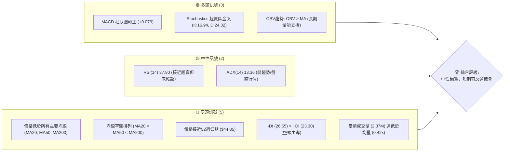

### 📊 核心指標速覽表

| 指標類別 | 指標名稱 | 當前數值 | 訊號 | 解讀 |
|----------|----------|----------|------|------|
| **價格** | 當前價格 | $48.19 | 🔴 | 價格位於52週區間底部3.7%，並處於所有主要均線下方 |
| **均線** | MA20 | $52.01 | 🔴 | 價格位於MA20下方，短期趨勢承壓 |
| **均線** | MA50 | $55.80 | 🔴 | 價格位於MA50下方，中期趨勢顯著下行 |
| **均線** | MA200 | $78.57 | 🔴 | 價格位於MA200下方，長期趨勢嚴重偏空 |
| **動能** | RSI(14) | 37.80 | 🟡 | 處於中性區間底部，接近超賣，反彈潛力積聚 |
| **動能** | MACD柱狀圖 | +0.079 | 🟢 | MACD線與訊號線形成金叉，短期動能轉多，但仍在零軸下方 |
| **動能** | Stoch %K/%D | 16.94/24.32 | 🟢 | 處於超賣區，並已形成金叉，顯示短期反彈機會較高 |
| **波動** | ATR(14) | $3.18 | 🟡 | 每日波動約6.60%，處於中等水平，適合區間操作 |
| **趨勢** | ADX(14) | 13.36 | 🟡 | 趨勢強度極弱，市場處於盤整或弱勢下跌階段 |
| **成交量** | 量比(20日) | 0.42x | 🔴 | 當前成交量顯著萎縮，缺乏買盤或賣盤的強烈推動 |

### 🏆 技術評分卡

KTOS 的技術評分顯示，儘管動能指標出現短期改善，但整體趨勢和均線排列仍指向空頭，且趨勢強度不足。支撐穩定性是目前唯一的亮點。

╔══════════════════════════════════════════════════════════════╗
║              技術評分卡 — KTOS (2026-07-12)                    ║
╠══════════════════════════════════════════════════════════════╣
║ 趨勢強度      ███████░░░░░░░░░░░░░░  35/100  🔴 (ADX弱，均線空頭) ║
║ 動能指標      ████████████░░░░░░░░  60/100  🟢 (Stoch超賣金叉，MACD柱轉正) ║
║ 支撐穩定度    ████████████████░░░░  80/100  🟢 (接近52W低點及S1，具潛在支撐) ║
║ 成交量配合    ████░░░░░░░░░░░░░░░░  20/100  🔴 (成交量萎縮，量價背離) ║
║ 形態完整度    ██████░░░░░░░░░░░░░░  30/100  🟡 (無明確高信心度形態) ║
║ 均線排列      ██░░░░░░░░░░░░░░░░░░  10/100  🔴 (典型空頭排列) ║
╠══════════════════════════════════════════════════════════════╣
║ 綜合評分      ██████░░░░░░░░░░░░░░  40/100  ⚖️ 中性偏空           ║
╚══════════════════════════════════════════════════════════════╝

---

## 2. 趨勢分析

### 🌐 多時框趨勢分析

KTOS 的多時框架分析顯示，該股正處於長期和中期下跌趨勢中，短期雖有超跌反彈跡象，但整體趨勢強度不足，市場缺乏明確的方向性。

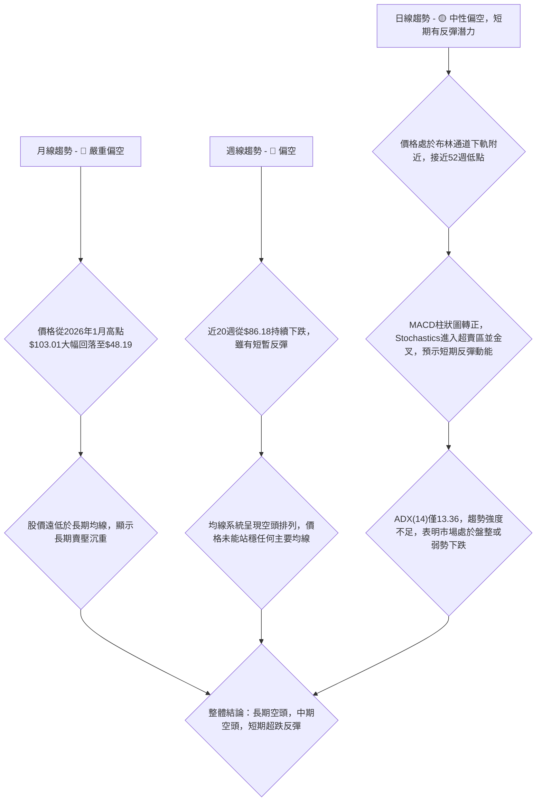

### 📈 長期趨勢 — 12個月走勢圖（Unicode）

KTOS 在過去12個月經歷了從強勁上漲到急劇下跌的過山車行情。2025年下半年股價從$58.70一路攀升至2026年1月的$103.01高點，隨後便進入漫長的下跌通道，至2026年7月已跌至$48.19，接近52週低點。

```
KTOS 月線走勢圖（過去12個月）
價格軸 ($)
$130 ┤                                        
$120 ┤                                        
$110 ┤                                        
$100 ┤                          ●(2026-01 $103.01)
$ 90 ┤                ●(2025-09 $91.37) ●(2025-10 $90.60)
$ 80 ┤                            ●(2026-02 $86.18)
$ 70 ┤        ●(2025-08 $65.84)         ●(2026-03 $70.51)
$ 60 ┤  ●(2025-07 $58.70)                 ●(2026-04 $63.05) ●(2026-05 $64.13)
$ 50 ┤                                        ●(2026-06 $49.86)
$ 40 ┤                                                ●(2026-07 $48.19)
     └────────────────────────────────────────────────────────
      2025-07 08  09  10  11  12  2026-01 02  03  04  05  06  07

關鍵高點：2026-01 $103.01
關鍵低點：2026-07 $48.19 (接近52週低點 $44.85)
```

**走勢特徵分析表格**

| 階段 | 時間區間 | 價格區間 | 漲跌幅 | 主要特徵 |
|------|------------|------------|--------|----------|
| **上漲期** | 2025-07 至 2026-01 | $58.70 至 $103.01 | +75.49% | 強勁多頭趨勢，成交量放大，突破多個阻力位，創下52週新高。 |
| **下跌期** | 2026-02 至 2026-07 | $103.01 至 $48.19 | -53.22% | 急劇空頭趨勢，價格持續跌破關鍵支撐，均線系統完全轉空，成交量在下跌初期放大，近期萎縮。 |
| **當前狀態** | 2026-07 | $48.19 | - | 價格接近52週低點和關鍵支撐，短期超賣，但趨勢強度弱，處於盤整或尋底階段。 |

### 📊 中期趨勢（週線分析）

從近20週的週線數據來看，KTOS 的中期趨勢呈現明顯的下跌通道。從2026年3月初的$86.18一路下行，雖然在6月底跌至$47.21後有一波反彈，但未能持續，目前再次回落至$48.19。

```
KTOS 中期壓力與支撐示意圖 (週線)

價格 ($)
$87.53 ┤                          ╭─R3 ($87.53, 2026-03-15高點)
       │                        ╱
$86.18 ┤                      ╱
       │                    ╱
$70.99 ┤                  ╭─R2 ($70.99, 2026-04-19高點)
       │                ╱
       │              ╱
$64.13 ┤            ╭─R1 ($64.13, 2026-05-31高點)
       │          ╱
$58.88 ┤        ╭─MA20 ($52.01) → 阻力
       │      ╱
$55.35 ┤    ╱
$52.01 ┼───● (MA20)
$48.19 ├───────● 現價
$46.01 ┤    ╰───S1 ($46.01) → 關鍵支撐
$44.85 ┤      ╰───52W Low ($44.85) → 強支撐
       └───────────────────────────────────
```
中期來看，價格在$64.13 (2026-05-31高點) 附近形成了一個較為明顯的阻力區域，而$46.01 (S1) 和$44.85 (52週低點) 則構成了重要的中期支撐區間。目前價格正處於這個支撐區間的上方邊緣。

### ⚡ 趨勢強度評估（ADX 解讀）

ADX (Average Directional Index) 用於衡量趨勢的強度，而非方向。當前 KTOS 的 ADX(14) 為 13.36，遠低於25的閾值，這明確指出市場處於**弱趨勢或盤整行情**。在此情境下，價格波動可能較為震盪，難以形成持續性的單邊走勢。

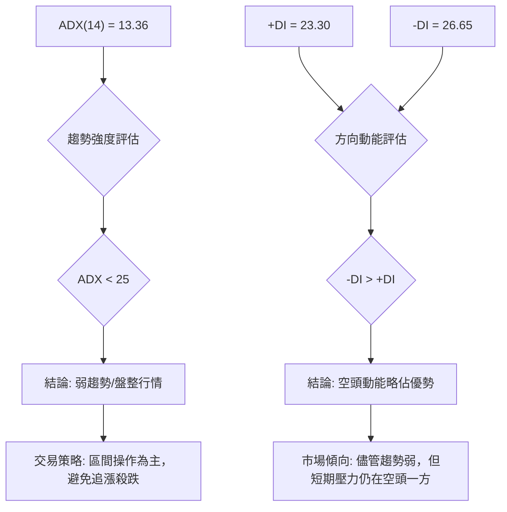

**ADX 強度對照表**

| ADX 數值 | 趨勢強度 | 市場解讀 |
|----------|----------|----------|
| 0-25     | 弱趨勢/無趨勢 | 盤整、震盪、缺乏方向性 |
| 25-50    | 中等趨勢 | 趨勢形成，可順勢操作 |
| 50-75    | 強趨勢 | 趨勢明確，動能強勁 |
| 75-100   | 極強趨勢 | 趨勢過熱，可能面臨回調 |

**當前 ADX(14) 13.36 (弱趨勢/盤整 <25)**: 這意味著儘管股價近期下跌劇烈，但目前的下跌動能已顯著減弱，市場可能正在尋找新的平衡點，或進入一段震盪築底的過程。在這種情況下，單純的順勢交易策略風險較高，更適合採取區間操作或等待趨勢明確。同時，-DI (26.65) 略高於 +DI (23.30) 表明在當前弱勢市場中，空頭的力量仍略佔上風。

---

## 3. 圖表形態分析

### 🔍 形態識別系統

根據 ADX 判斷，KTOS 目前處於弱趨勢或盤整行情。在這種市場環境下，形成高信心度的複雜圖表形態（如頭肩頂/底、雙頂/底）的可能性較低，或仍在形成初期，尚未完全確認。從提供的數據來看，目前沒有明確且已完成的經典幾何形態。然而，可以觀察到價格在接近52週低點 ($44.85) 和關鍵支撐 S1 ($46.01) 附近進行盤整，這可能是一個潛在的築底區域。

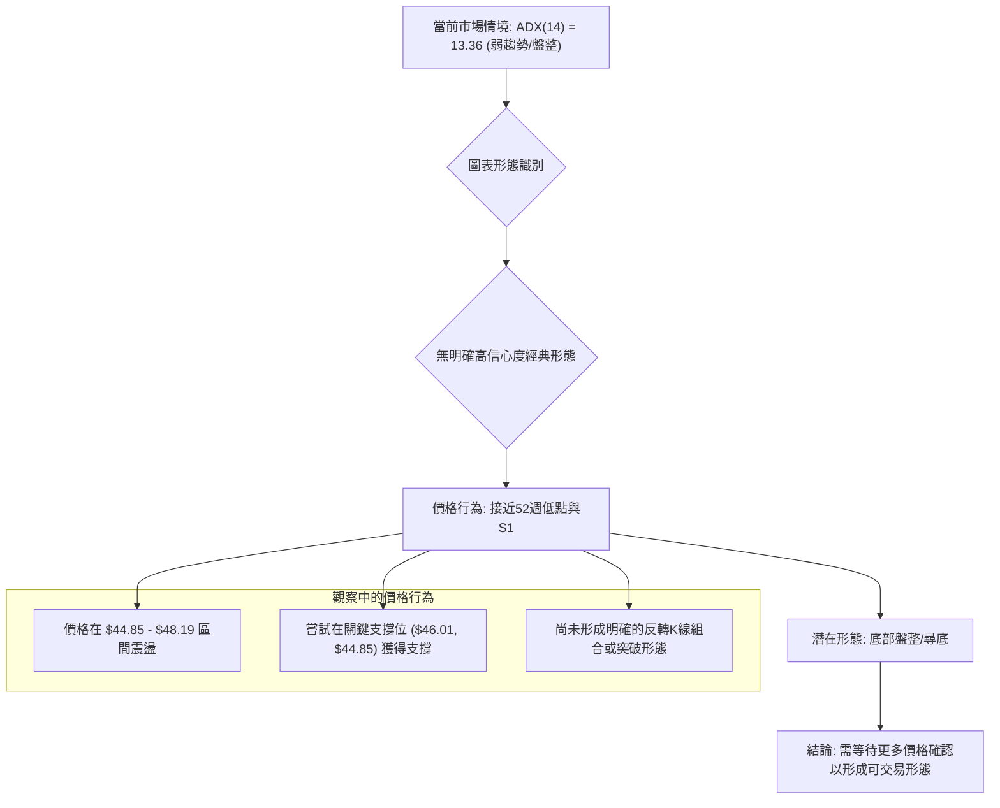

**形態信心度表格**

| 形態 | 信心度 | 判斷依據（引用數據） | 完成度 | 目標價（附計算式） |
|------|--------|----------------------|--------|--------------------|
| 潛在雙底 | 30% | 價格在 $44.85 (52W Low) 和 S1 ($46.01) 附近形成低點，2026-06-28 曾探至 $47.21，隨後反彈。目前再次回落至 $48.19，有形成第二個低點的可能。 | 30% | 需等待頸線突破確認，目前無有效頸線可計算。 |
| 底部盤整 | 55% | ADX 顯示弱趨勢，價格在長期下跌後於52週低點附近震盪。MACD柱狀圖轉正，Stochastics超賣金叉，暗示短期動能積聚，可能在築底。 | 60% | 區間操作目標價：上沿 $52.01 (MA20/布林中軌)，下沿 $44.14 (布林下軌)。 |
| 下降通道 | 65% | 從2026年1月高點 $103.01 至目前 $48.19，價格K線呈現一系列的更低的高點和更低的低點，形成一個明顯的下降趨勢通道。 | 90% | 通道上軌約在 $60-$65 區間，下軌約在 $44-$45 區間。 |

由於目前尚未有高信心度的明確反轉形態，我們將主要依賴指標型解讀和區間操作。

### 🕯️ 重要K線形態分析

近期週線K線走勢顯示了空頭力量的減弱和多頭嘗試反彈的跡象，但尚未形成強烈的反轉信號。

| 月份 | 收盤價 | K線形態 | 解讀 | 訊號 |
|------|--------|---------|------|------|
| 2026-06-28 | $47.21 | 潛在錘子線 (或長下影線) | 價格在下跌後觸及低點，並在收盤時大幅收回，顯示下方買盤支撐。RSI 23.1 處於超賣。 | 🟡 潛在反彈 |
| 2026-07-05 | $55.35 | 大陽線 (或吞噬前週陰線) | 價格在經歷前週低點後強勁反彈，收盤價大幅高於前週。MACD柱狀圖轉正。 | 🟢 短期看多 |
| 2026-07-12 | $48.19 | 陰線 (回調) | 價格在前週反彈後回落，但仍維持在06-28低點之上。成交量萎縮。 | 🟡 短期回調 |

### 📉 ASCII 走勢形態示意圖

以下示意圖展示了 KTOS 近期的價格走勢，從高點大幅下跌後，在低位區域進行盤整和試探性反彈。

```
KTOS 近期走勢形態示意圖
價格 ($)
$86.18 ┤                  ╭──下降通道上軌 (虛擬)
       │                ╱
       │              ╱
$70.51 ┤            ╱
       │          ╱
       │        ╱
$55.35 ┤      ╱  ●(07-05反彈高點)
       │    ╱
$48.19 ├────● (現價 07-12)
$47.21 ┤  ╰──●(06-28低點)
$46.01 ┤    ╰───S1 支撐
$44.85 ┤      ╰───52W Low 支撐
       └───────────────────────────
        時間軸 (週)

圖示：
- 從高點 $86.18 (2026-03-01) 形成明顯的下降趨勢。
- 價格在 $47.21 (2026-06-28) 觸及一個短期低點，RSI 進入超賣區。
- 隨後反彈至 $55.35 (2026-07-05)，形成一個小型的反彈波段。
- 目前價格回落至 $48.19，測試 $46.01 (S1) 和 $44.85 (52W Low) 附近的支撐區域。
- 整個形態顯示為一個在下降通道內的底部盤整和尋找支撐的過程。
```

### 🎯 形態目標價計算

由於目前沒有高信心度的已完成圖表形態可供計算明確的形態目標價，我們主要根據價格行為和關鍵支撐阻力位來設定目標。

1.  **底部盤整區間目標價**：
    *   若價格能在 $44.85 - $46.01 區間獲得有效支撐並反彈，其短期目標將是布林通道中軌 (MA20) $52.01。
    *   若能進一步突破布林中軌，下一個目標將是近期阻力 R1 $58.88，以及布林通道上軌 $59.87。
2.  **下降通道目標價**：
    *   若價格繼續沿下降通道運行，則上方阻力將是通道上軌（約 $60-$65 區間）。
    *   若跌破 $44.85 的52週低點，則下方將進入新的尋底階段，缺乏明確的形態目標價，需參考更長期的歷史數據或估值模型。

**結論**：在當前弱趨勢/盤整行情下，不建議依賴尚未形成的複雜形態進行交易。應更注重關鍵支撐與阻力位的區間操作，以及指標提供的短期動能信號。

---

## 4. 支撐與阻力

### 🗺️ 關鍵價位分布圖（Unicode）

KTOS 的價格目前位於其52週區間的底部，面臨多重阻力，但同時也靠近強勁的歷史支撐位。

```
KTOS 價位結構分布圖
═══════════════════════════════════════════════════
$134.00 ║████████████████████████║ 52W High (絕對高點)
$112.96 ║████████████████████    ║ 斐波那契 23.6% 回調
$ 99.94 ║████████████████████████║ 斐波那契 38.2% 回調
$ 89.42 ║████████████████████    ║ 斐波那契 50.0% 回調
$ 78.91 ║████████████████████████║ 斐波那契 61.8% 回調 (強阻力)
$ 66.83 ║████████████████████    ║ 強阻力 R3
$ 63.93 ║████████████████████████║ 斐波那契 78.6% 回調
$ 61.43 ║████████████████████    ║ 阻力 R2
$ 59.87 ║████████████████████████║ 布林上軌 (短期阻力)
$ 58.88 ║████████████████████    ║ 關鍵阻力 R1
$ 55.80 ║████████████████████████║ MA50 (中期阻力)
$ 52.01 ║████████████████████    ║ MA20 / 布林中軌 (短期阻力)
$ 48.19 ╠════════════════════════╣ ◄ 現價
$ 46.01 ║▓▓▓▓▓▓▓▓▓▓▓▓▓▓▓▓        ║ 近期支撐 S1
$ 44.85 ║████████████████████████║ 52W Low / 斐波那契 100% 回調 (強支撐)
═══════════════════════════════════════════════════
```

### 🚧 阻力位分析表

KTOS 面臨的阻力位分佈密集，顯示上方套牢盤壓力較大，短期反彈需克服多重障礙。

| 阻力級別 | 價位 | 形成原因 | 突破難度 | 重要性 |
|----------|------|----------|----------|--------|
| **短期阻力** | $52.01 | MA20 / 布林中軌 | 中等 | 短期反彈的首個考驗，突破則有機會向上測試更高阻力。 |
| **關鍵阻力 R1** | $58.88 | 近一年波段高點聚類之一 | 較高 | 突破此位將意味著短期下跌趨勢的初步扭轉，並可能挑戰布林上軌。 |
| **中期阻力** | $59.87 | 布林上軌 | 中等 | 在盤整行情中，布林上軌是重要的壓力位，常作為區間操作的賣出目標。 |
| **中期阻力 R2** | $61.43 | 近一年波段高點聚類之一 | 較高 | 突破R1後的下一個挑戰，代表更強的反彈動能。 |
| **強阻力 R3** | $66.83 | 近一年波段高點聚類之一 | 高 | 若能突破此位，可能意味著中期趨勢的轉變，但目前看來距離較遠。 |
| **斐波那契阻力** | $78.91 | 斐波那契 61.8% 回調位 | 極高 | 從52週高點回調的關鍵價位，若能收復此位，將是極強的多頭信號。 |

### 🛡️ 支撐位分析表

當前價格接近關鍵支撐區間，這為潛在的反彈提供了基礎。

| 支撐級別 | 價位 | 形成原因 | 守住機率 | 重要性 |
|----------|------|----------|----------|--------|
| **近期支撐 S1** | $46.01 | 近一年波段低點聚類之一 | 中等 | 當前價格下方的直接支撐，若能守住，則有助於短期築底。 |
| **強支撐** | $44.85 | 52週低點 / 斐波那契100%回調 | 高 | 極其重要的心理和技術支撐位。跌破此位將確認更深的下跌趨勢，並可能引發恐慌性拋售。 |

### 📐 斐波那契回調位分析

KTOS 的價格已從其52週高點 $134.00 經歷了大幅回調，目前位於 $48.19，非常接近其52週低點 $44.85，這也對應著斐波那契回調的 100% 水平。

| 斐波那契回調 | 價位 | 意義 |
|--------------|------|------|
| 0.0% (52W High) | $134.00 | 52週最高點，代表下跌的起點。 |
| 23.6%        | $112.96 | 較淺的回調位，突破此位顯示強勁的多頭力量，目前已遠離。 |
| 38.2%        | $99.94 | 重要的回調位，通常為強勢股的回調極限，目前已跌破。 |
| 50.0%        | $89.42 | 心理學上的重要位，通常代表多空力量的平衡點，目前已跌破。 |
| 61.8%        | $78.91 | 黃金分割位，若跌破此位，常被視為趨勢反轉的信號，目前已跌破。 |
| 78.6%        | $63.93 | 深層回調位，跌破此位通常預示著對前一波漲勢的完全否定。 |
| 100.0% (52W Low) | $44.85 | 52週最低點，代表前一波漲勢的起點，也是當前最關鍵的長期支撐。 |

**解讀**：當前價格 $48.19 位於斐波那契 78.6% 回調位 ($63.93) 和 100% 回調位 ($44.85) 之間，且更接近 100% 回調位 (即52週低點)。這表明從52週高點開始的下跌趨勢已經非常深，幾乎完全回吐了過去一年的漲幅。價格正在測試極限支撐，若 $44.85 能夠守住，則可能形成一個雙底或更複雜的底部形態；一旦跌破，則意味著下跌空間可能進一步打開。這個位置是多空力量的關鍵戰場。

---

## 5. 技術指標深度解讀

### 🎛️ 指標訊號總覽

以下圖表展示了 KTOS 各項技術指標的當前狀態及其相互關係，幫助我們形成一個整體性的市場判斷。

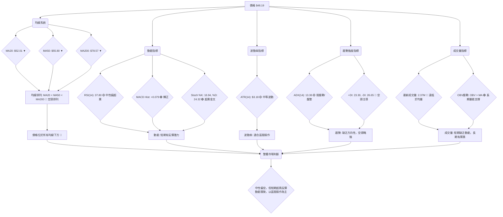

### 📈 移動平均線排列分析

KTOS 的移動平均線系統呈現典型的空頭排列，且所有短期、中期、長期均線均向下傾斜，反映出強勁的下跌趨勢。

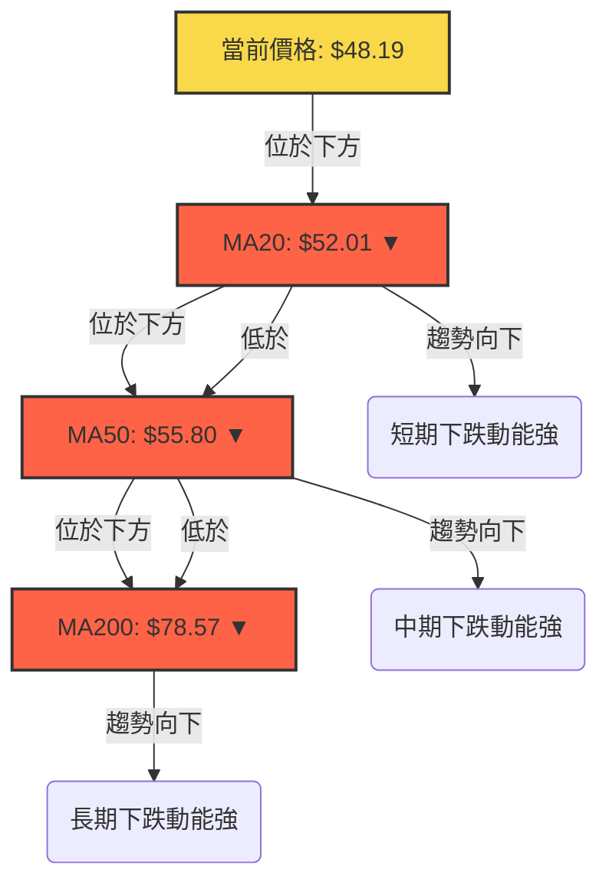

**當前均線排列狀態：**

| 均線 | 當前數值 | 價格關係 | 走勢 | 訊號 |
|------|----------|----------|------|------|
| MA5  | $50.26   | 價格下方 | ▼    | 🔴 |
| MA10 | $50.37   | 價格下方 | ▼    | 🔴 |
| MA20 | $52.01   | 價格下方 | ▼    | 🔴 |
| MA50 | $55.80   | 價格下方 | ▼    | 🔴 |
| MA60 | $57.81   | 價格下方 | ▼    | 🔴 |
| MA120| $74.21   | 價格下方 | ▼    | 🔴 |
| MA240| $76.53   | 價格下方 | ▼    | 🔴 |

**解讀**：
*   **空頭排列 (MA20 < MA50 < MA200)**：這是最為明確的空頭趨勢信號，表明短期、中期、長期趨勢均向下。所有均線均位於當前價格上方，構成層層阻力。
*   **均線下行**：所有列出的移動平均線均呈現向下趨勢 (▼)，進一步確認了下降趨勢的持續性。
*   **結論**：從均線系統來看，KTOS 處於強烈的空頭市場，任何反彈都可能在均線附近遇到阻力。要扭轉這種局面，價格需要首先站穩短期均線，並逐步推動均線向上交叉。

### 📉 RSI(14) 分析

RSI (Relative Strength Index) 用於衡量價格變動的速度和幅度，判斷超買超賣狀態。

**RSI(14) 數值進度條：**
RSI(14): 37.80 ▓▓▓▓▓▓▓░░░░░░░░░░░░░░░░░░░░░░░░░░░░░░░░░░ (37.8%) 🟡

**超買超賣區間分析：**
*   RSI 數值介於 0-100。
*   傳統上，RSI 高於 70 視為超買區，低於 30 視為超賣區。
*   當前 RSI(14) 為 37.80，位於中性區間，但**非常接近超賣區 (30)**。這表明股票在近期下跌後賣壓有所減輕，但尚未完全進入極度超賣狀態。
*   **解讀**：雖然未達極端超賣，但其位置暗示了短期下跌動能的衰竭，並為潛在的反彈提供了空間。在弱趨勢/盤整行情中，RSI 接近超賣區是尋找短期買入機會的信號。

**RSI 背離判斷：**
根據提供的數據，「RSI 背離: 無明顯背離」。這表示在近期價格下跌的過程中，RSI 並未出現明顯的底背離（即價格創新低而 RSI 未創新低），因此無法確認由 RSI 背離所指示的強烈反轉信號。儘管如此，RSI 接近超賣本身仍是超跌的表現。

### 📊 MACD(12/26/9) 訊號解讀

MACD (Moving Average Convergence Divergence) 用於識別趨勢的動能和方向。

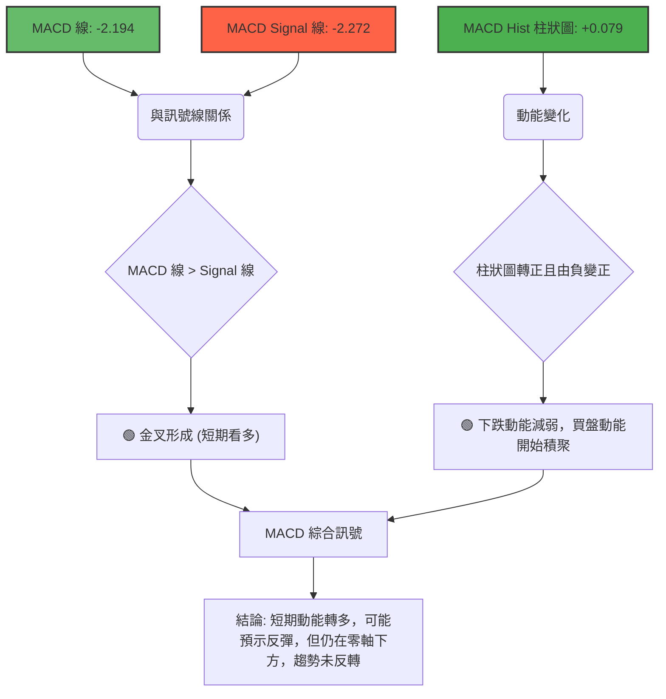

**MACD 訊號解讀：**
*   **MACD 線 (-2.194) 與 Signal 線 (-2.272) 關係**：MACD 線當前數值略高於 Signal 線，這意味著MACD已形成**金叉 (Bullish Crossover)**。這是一個短期買入信號。
*   **MACD 柱狀圖 (+0.079)**：柱狀圖從負值轉為正值，且數值為正，這確認了 MACD 線已上穿 Signal 線。柱狀圖轉正表示空頭動能減弱，多頭動能開始積聚。
*   **零軸位置**：儘管出現金叉和柱狀圖轉正，但 MACD 線和 Signal 線均位於零軸下方。這表明當前的多頭動能是在一個整體空頭趨勢中的反彈，而非趨勢的反轉。
*   **結論**：MACD 指標提供了短期看多信號，支持價格可能從當前低位反彈。然而，由於其仍在零軸下方，反彈的持續性和強度仍需觀察，並可能在零軸附近遇到阻力。

### 📦 布林通道分析

布林通道 (Bollinger Bands) 用於衡量價格的波動區間和相對高低。

```
KTOS 布林通道示意圖
價格 ($)
$59.87 ┤              ╭─── BB上軌 ($59.87)
       │            ╱
       │          ╱
       │        ╱
$52.01 ┼──────● MA20 / BB中軌 ($52.01)
       │      ╲
       │        ╲
$48.19 ├───────● 現價
       │          ╲
       │            ╲
$44.14 ┤              ╰─── BB下軌 ($44.14)
       └───────────────────────────
        時間軸

當前 BB %B: 0.26
```

**布林通道分析：**
*   **布林上軌：$59.87**
*   **布林中軌 (MA20)：$52.01**
*   **布林下軌：$44.14**
*   **當前價格：$48.19**
*   **BB %B：0.26**
*   **解讀**：
    *   當前價格 $48.19 位於布林通道中軌 (MA20 $52.01) 和下軌 ($44.14) 之間，且更靠近下軌。BB %B 為 0.26，確認價格處於通道的下四分之一區間。
    *   這表明價格在近期下跌後，已接近布林通道的下限，可能預示著短期超賣和反彈的機會。
    *   中軌 $52.01 將構成短期反彈的阻力，而下軌 $44.14 則提供了強勁的支撐。
    *   通道帶寬：從上軌 $59.87 到下軌 $44.14，帶寬約 $15.73。ATR $3.18 佔當前價格 6.6%，顯示波動性中等，布林通道帶寬相對較大，為區間操作提供了空間。
    *   **結論**：布林通道支持在下軌附近尋找買入機會，並以中軌或上軌作為短期獲利目標的區間操作策略。

### 💹 成交量分析（量價配合度）

成交量是價格走勢的動能，量價配合是判斷趨勢可信度的關鍵。

| 指標 | 數值 | 解讀 | 訊號 |
|------|------|------|------|
| 最新成交量 | 2,373,000 | 顯著萎縮 | 🔴 |
| 20日均量 | 5,701,330 | 基準 | |
| 50日均量 | 5,059,696 | 基準 | |
| 量比 (vs 20日均量) | 0.42x | 遠低於平均 | 🔴 |
| OBV 趨勢 | OBV > MA | 量能支撐上漲 | 🟢 |

**量價配合分析：**
*   **當前成交量極度萎縮**：最新成交量僅為 2,373,000 股，遠低於其20日均量 (5,701,330) 和50日均量 (5,059,696)，量比僅為 0.42x。這是一個重要的空頭信號，表明當前價格的反彈或盤整缺乏市場參與者的積極認可。在缺乏成交量的情況下，任何價格變動都可能不可持續。
*   **OBV (On-Balance Volume) 趨勢**：數據顯示 "OBV趨勢: OBV > MA → 量能支撐上漲"。這是一個較為矛盾的信號。通常，OBV 上穿其移動平均線被視為買入信號，表明累積性買盤力量強於賣盤，支持價格上漲。然而，這與當前萎縮的成交量和下跌的價格形成對比。
    *   **解釋**：此處的 "OBV > MA" 可能反映的是**長期累積性量能**，即在過去一段時間內，儘管價格下跌，但總體上資金流入的累積量仍較高。然而，**短期來看，當前交易日的成交量極低**，這意味著儘管長期可能存在買盤興趣，但短期內缺乏足夠的活躍交易來推動價格形成有力的反彈。
*   **結論**：當前成交量嚴重不足，削弱了任何短期反彈的可信度，也使得價格難以有效突破阻力。雖然 OBV 的長期趨勢可能暗示著潛在的累積，但就短期而言，量能的缺乏是一個明顯的弱點。若要形成有效反彈或趨勢反轉，必須伴隨著成交量的顯著放大。

---

## 6. 動能與波動率

### ⚡ 動能評估四象限

根據當前 KTOS 的技術指標，我們可以將其動能和波動率狀態歸類如下：

| 象限 | 動能 | 波動 | 當前狀態 | 評估 |
|------|------|------|----------|------|
| Q1 | 強 | 低 | - | 最佳機會 (穩定上漲) |
| Q2 | 弱 | 低 | - | 謹慎觀望 (築底或盤整) |
| Q3 | 強 | 高 | - | 高風險高收益 (趨勢突破) |
| Q4 | 弱 | 高 | ✓ | **當前 KTOS** |

**KTOS 當前評估**：
*   **動能**：MA 均線空頭排列，價格持續下跌，ADX 顯示弱趨勢，這些都指向**弱動能**。儘管 MACD 柱狀圖轉正和 Stochastics 超賣金叉提供了短期反彈動能，但這是在整體弱勢中的反彈，而非強勁的趨勢動能。因此，動能評估為「弱」。
*   **波動**：ATR(14) 為 $3.18，佔當前價格 $48.19 的 6.60%。這屬於**中等偏高波動**。股價從高點 $134.00 跌至 $48.19，跌幅巨大，波動性顯著。
*   **結論**：KTOS 目前處於 **Q4 (弱動能，高波動)**。這是一個風險較高的市場環境，價格可能在寬幅區間內震盪，缺乏明確的方向性。對於投資者來說，這意味著需要高度謹慎，避免重倉，更適合短線區間操作或等待趨勢明確。

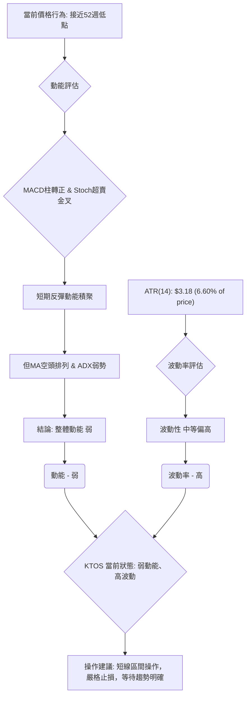

### 📊 ATR 波動率分析

ATR (Average True Range) 是衡量資產價格波動性的指標。

*   **ATR(14): $3.18**
*   **佔當前價格 ($48.19) 比例: 6.60%**

**解讀**：
*   ATR 數值 $3.18 表示在過去14天中，KTOS 的平均每日價格波動範圍約為 $3.18。
*   6.60% 的比例顯示 KTOS 是一隻波動性中等偏高的股票。這意味著其每日價格變動幅度相對較大，為短線交易者提供了機會，但同時也增加了風險。
*   **止損距離建議**：對於短線交易者，可以參考 ATR 來設定止損。例如，將止損設置為 1.5 倍至 2 倍 ATR 的距離。
    *   若以當前價格 $48.19 計算：
        *   1.5 * ATR = 1.5 * $3.18 = $4.77
        *   2.0 * ATR = 2.0 * $3.18 = $6.36
    *   若在 $46.00 附近進場，止損可以設置在 $46.00 - $4.77 = $41.23 或 $46.00 - $6.36 = $39.64。但由於 $44.85 是52週低點，更合理的止損應設置在 $44.85 之下，例如 $44.00，這約為 1.5 ATR 距離 ($46.00 - $44.00 = $2.00，約 0.6 ATR，相對較緊)。若考慮短期反彈，將止損設定在重要支撐下方是關鍵。
*   **結論**：中等偏高的波動性使得 KTOS 適合有經驗的交易者進行短線區間操作，但必須搭配嚴格的資金管理和止損策略。

### 📐 Beta 與市場相關性

Beta 值衡量股票相對於整體市場（通常是標普500指數）的波動性。

*   **Beta: 1.07**

**解讀**：
*   Beta 值為 1.07 意味著 KTOS 的股價波動性略高於整體市場。
*   如果市場上漲 1%，KTOS 理論上會上漲 1.07%。
*   如果市場下跌 1%，KTOS 理論上會下跌 1.07%。
*   **市場相關性**：Beta 值接近 1 表明 KTOS 與大盤的走勢高度相關，但略有放大。這意味著在市場上漲時，KTOS 可能表現稍好；在市場下跌時，KTOS 可能跌幅稍大。
*   **結論**：在當前市場環境下，投資 KTOS 需要密切關注大盤走勢，因為其價格波動受大盤影響較大。若市場進入熊市或調整，KTOS 可能會承受更大的壓力。

---

## 7. 多時框架總結

### 📋 時框架評分表

此表整合了不同時框架下的趨勢、動能和形態信號，以提供全面的視角。

| 時框架 | 趨勢方向 | 動能 | 均線排列 | 形態 | 綜合評分 (1-10) | 建議 |
|--------|----------|------|----------|------|-----------------|------|
| **月線** | 🔴 嚴重偏空 | 🔴 弱 | 🔴 空頭排列 | 🔴 下降趨勢 | 2 | 長期觀望/避險 |
| **週線** | 🔴 偏空 | 🟡 減弱 | 🔴 空頭排列 | 🟡 下降通道 | 3 | 謹慎，尋找築底跡象 |
| **日線** | 🟡 盤整偏空 | 🟢 積聚 | 🔴 空頭排列 | 🟡 底部盤整 | 5 | 區間操作，短線反彈 |

### 🔲 綜合訊號矩陣

以下矩陣展示了不同時框架下各項指標的一致性。

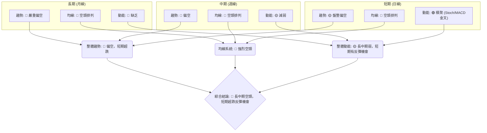

**一致性分析**：
*   **趨勢方向**：月線和週線均明確指向空頭，而日線則表現為盤整偏空，但有超跌反彈跡象。長中期趨勢的下行壓力顯著。
*   **均線排列**：所有時框架的均線系統均呈現空頭排列，這是最為一致且強烈的空頭信號。
*   **動能指標**：長中期動能顯著減弱或缺乏，但短期動能指標（如 Stochastics 和 MACD 柱狀圖）已發出潛在反彈信號。
*   **結論**：長中期趨勢的空頭壓力巨大，但短期內價格已超跌，並在關鍵支撐位附近積聚反彈動能。這種矛盾使得市場處於一個關鍵的轉折點，但缺乏明確的趨勢反轉信號。

### ⚖️ 多時框收斂結論

根據嚴格要求 14，我們首先判斷 KTOS 的趨勢強度。

*   **ADX(14) 為 13.36，遠低於 25**。這明確指示 KTOS 當前處於**盤整行情或弱勢趨勢**。
*   因此，根據規則，我們應以**日線布林通道上下軌為主要交易區間**。

**主導時框與方向性結論**：
儘管月線和週線均顯示長期和中期趨勢為空頭，且均線系統呈現強烈空頭排列，但由於 ADX 指示當前為盤整行情，且日線級別的動能指標 (Stochastics, MACD 柱狀圖) 顯示超賣並出現短期反彈信號，價格也接近52週低點和布林通道下軌。

綜合這些因素，我們的結論是：KTOS 股票的**長中期趨勢為空頭，但短期價格已嚴重超跌，目前處於弱勢盤整並積聚反彈動能。因此，當前應以日線級別的區間操作為主，尋找在關鍵支撐位附近買入並在阻力位附近賣出的機會。**

**方向性結論：中性偏空，但短期有反彈機會，應以區間操作為主。**

---

## 8. 交易策略建議

### 🗺️ 策略決策流程圖

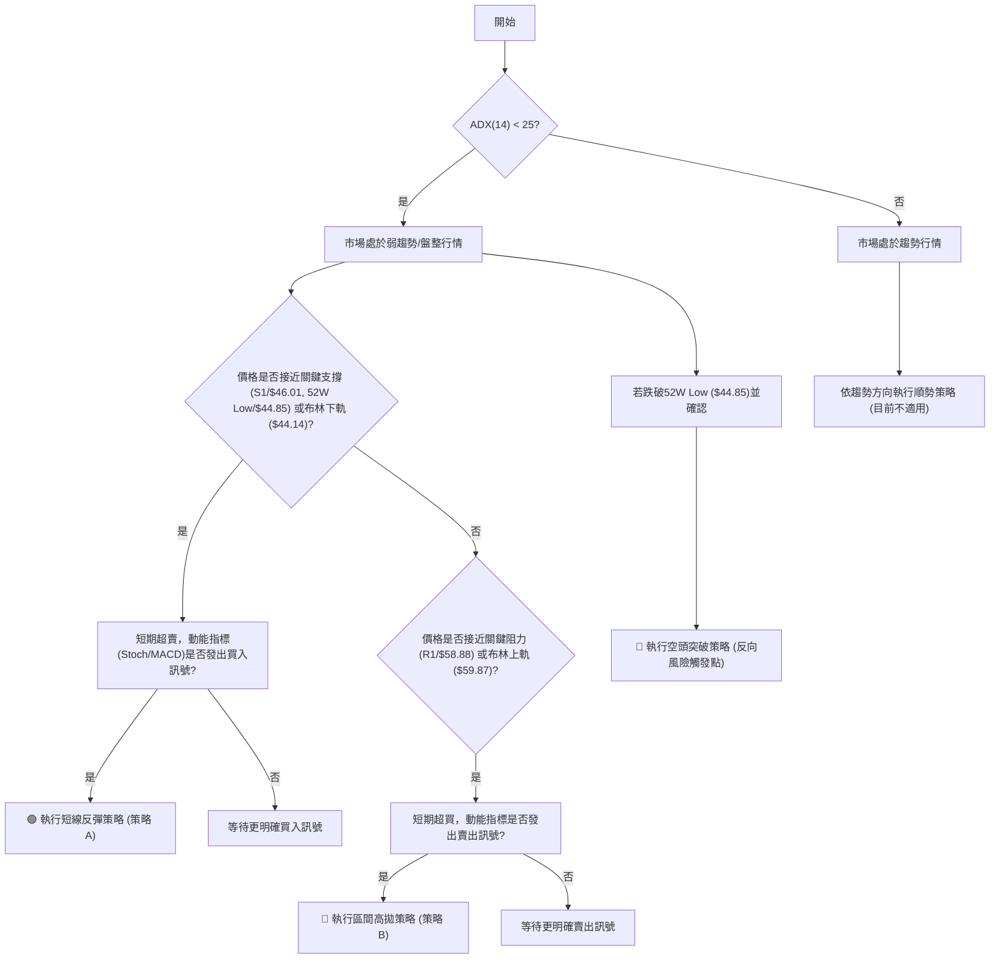

### 🧭 策略路由（依評分卡分流，不得兩頭下注）

根據第 1 章「技術評分卡」的綜合評分，KTOS 獲得 40/100 分，屬於**中性偏空**的區間。因此，我們將主要推薦**區間操作策略**，並密切關注短期反彈機會，同時警惕下行風險。

**當前主策略方向 = 中性偏空，以區間操作為主 (評分 40/100)**

### 🎯 價格情境階梯（Price Scenarios）

以下情境分析基於當前價格 $48.19 和關鍵支撐阻力位。

| 觸發條件 | 下一目標 | 後續延伸 | 情境含義 |
|----------|----------|----------|----------|
| **向上突破** | | | |
| 站穩 $52.01 (MA20/BB中軌) | R1 $58.88 | R2 $61.43 / BB上軌 $59.87 | 短線反彈動能增強，有望脫離底部區間。 |
| 突破 R1 $58.88 | R2 $61.43 | R3 $66.83 / 斐波那契78.6% $63.93 | 中期趨勢可能開始築底反轉，但上方阻力仍重。 |
| **區間震盪** | | | |
| 站穩現價區間 ($46.01 - $52.01) | — | — | 價格在52W低點附近盤整，等待方向選擇，高波動。 |
| **向下突破** | | | |
| 跌破 S1 $46.01 | 52W Low $44.85 | — | 短期支撐失效，考驗最關鍵的長期支撐。 |
| 跌破 52W Low $44.85 | 歷史低點 / 形態推算 | 更深層次下跌 | 最壞情況，確認中期轉弱，將進入新的尋底階段。 |

### 📊 情境機率分佈

| 情境 | 機率 | 主要依據 |
|------|------|----------|
| 繼續上行 / 反彈 | 35% | Stochastics超賣金叉、MACD柱狀圖轉正、價格接近關鍵支撐、OBV長期積累。 |
| 區間震盪 | 45% | ADX弱趨勢、價格位於布林通道下半區、成交量萎縮、長中期均線空頭排列形成阻力。 |
| 回落 / 再探底 | 20% | 長中期均線空頭排列壓力、成交量萎縮、若無法有效守住S1和52W Low。 |
| **總計** | **100%** | |

### 🟢 主策略詳情（區間操作與短線反彈）

鑑於 ADX 顯示為盤整行情且多數長中期指標偏空，但短期動能指標顯示超賣反彈機會，因此主策略為以布林通道為核心的區間操作，並尋找短線反彈機會。

| 策略要素 | 策略 A (短線反彈買入) | 策略 B (區間高拋賣出) |
|----------|-----------------------|-----------------------|
| **策略類型** | 區間底部買入/短線反彈 | 區間頂部賣出/短期回調 |
| **進場條件** | 價格接近S1或布林下軌，Stochastics維持超賣區金叉，MACD柱狀圖擴大，成交量適度放大。 | 價格接近R1或布林上軌，RSI進入超買區，MACD柱狀圖收縮或死叉。 |
| **進場價格** | **$45.50 - $46.50** (靠近S1 $46.01 及布林下軌 $44.14) | **$58.50 - $59.50** (靠近R1 $58.88 及布林上軌 $59.87) |
| **目標價 T1** | **$52.01** (MA20 / 布林中軌) | **$52.01** (MA20 / 布林中軌) |
| **目標價 T2** | **$58.88** (R1) | **$46.01** (S1) |
| **止損價格** | **$44.00** (略低於52W低點 $44.85 及布林下軌) | **$60.50** (略高於R1 $58.88 及布林上軌) |
| **風險報酬比** | (以進場 $46.00 為例) <br> vs T1: ($52.01-$46.00) / ($46.00-$44.00) = $6.01/$2.00 = **3.01:1** <br> vs T2: ($58.88-$46.00) / ($46.00-$44.00) = $12.88/$2.00 = **6.44:1** | (以進場 $59.00 為例) <br> vs T1: ($59.00-$52.01) / ($60.50-$59.00) = $6.99/$1.50 = **4.66:1** <br> vs T2: ($59.00-$46.01) / ($60.50-$59.00) = $12.99/$1.50 = **8.66:1** |
| **成功機率** | 60% (基於超賣和支撐) | 55% (基於阻力與弱趨勢) |
| **建議倉位** | 小型至中型 (5-10% 總投資組合) | 小型 (3-5% 總投資組合) |

### 🔴 反向風險觸發點（對沖提示）

以下是可能推翻上述主策略，並觸發更深層次下跌風險的關鍵信號：

*   **跌破 52W Low 且收盤確認**：若價格有效跌破 $44.85 並收盤於其下方，則短線反彈策略失效，並可能觸發恐慌性拋售，下方缺乏明確支撐，需考慮止損或建立空頭頭寸。
*   **MA20 ($52.01) 無法突破並形成有效壓力**：若價格反彈至 MA20 附近即受阻回落，且成交量未能放大，則表示反彈動能不足，應謹慎對待。
*   **MACD 柱狀圖再次轉負**：若短期多頭動能未能持續，MACD 柱狀圖再次轉為負值，則表明反彈失敗，空頭力量再度佔優。
*   **成交量持續萎縮**：如果價格在支撐位附近未能吸引足夠的成交量，任何反彈都將缺乏可持續性。

### ⭐ 整體訊號強度評星

基於多時框架分析和策略路由，KTOS 的交易機會存在於短線區間操作，但整體風險較高。

```
做多訊號強度：★★☆☆☆  (2/5星) (短期超賣反彈機會，但長中期趨勢偏空)
做空訊號強度：★★★☆☆  (3/5星) (長中期趨勢空頭，若跌破關鍵支撐則做空機會增大)
整體可信度：  ★★★☆☆  (3/5星) (策略基於 ADX 盤整判斷，但需嚴格遵守止損)
```

---

## 9. 風險提示與監控

### ✅ 關鍵監控指標 Checklist

為了有效管理 KTOS 的交易風險，以下關鍵指標需密切監控：

╔══════════════════════════════════════════════════════════════╗
║              KTOS 關鍵監控指標清單                             ║
╠══════════════════════════════════════════════════════════════╣
║ ├─ **價格行為**                                             ║
║ ║    [ ] 價格是否有效站穩 S1 ($46.01) 及 52W Low ($44.85)     ║
║ ║    [ ] 價格是否成功突破 MA20 ($52.01) 及 R1 ($58.88)        ║
║ ║    [ ] 是否形成明確的底部反轉 K 線形態或圖表形態             ║
║ ├─ **動能指標**                                             ║
║ ║    [ ] RSI(14) 是否脫離超賣區並持續上升 (突破 50)            ║
║ ║    [ ] MACD 線是否持續位於 Signal 線上方並上穿零軸           ║
║ ║    [ ] Stochastics 是否持續在超賣區上方運行                  ║
║ ├─ **趨勢與均線**                                           ║
║ ║    [ ] ADX(14) 是否開始上升並突破 25，且 +DI 向上突破 -DI     ║
║ ║    [ ] MA20 是否上穿 MA50 (金叉)                             ║
║ ║    [ ] 價格是否重新站穩 MA50 ($55.80)                        ║
║ ├─ **成交量**                                               ║
║ ║    [ ] 反彈時成交量是否顯著放大，量比是否超過 1x             ║
║ ║    [ ] OBV 是否持續上升並確認價格上漲                        ║
║ ├─ **布林通道**                                             ║
║ ║    [ ] 價格是否能維持在布林中軌 ($52.01) 之上                 ║
║ ║    [ ] 布林通道帶寬是否收斂或擴張，預示趨勢變化                ║
╚══════════════════════════════════════════════════════════════╝

### ⚠️ 風險場景分析

以下是 KTOS 可能面臨的三種情境及其影響：

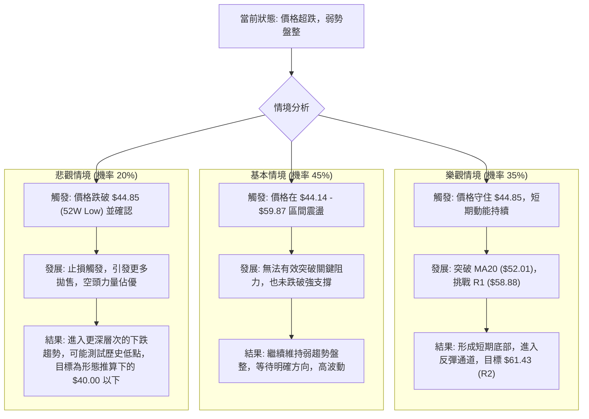

### 🛡️ 風險管理重要提醒

1.  **嚴格止損**：鑑於 KTOS 波動性較高且長中期趨勢偏空，任何交易策略都必須設定嚴格的止損點。一旦價格觸及止損位，應毫不猶豫地執行，避免虧損擴大。對於短線反彈策略，跌破 52W Low ($44.85) 是絕對止損點。
2.  **倉位控制**：在弱趨勢/盤整行情中，應採取較小的倉位，避免重倉操作。即使出現反彈信號，也應逐步建倉，而非一次性投入。
3.  **分批操作**：無論是建倉還是獲利了結，都建議採取分批操作。例如，在接近支撐位時分批買入，在達到不同目標價位時分批賣出，以鎖定利潤並分散風險。
4.  **關注大盤**：Beta 值為 1.07，表示 KTOS 與大盤高度相關。若大盤出現系統性風險或下跌，KTOS 可能會跌幅更大。因此，需密切關注整體市場動態。
5.  **避免追漲殺跌**：在盤整行情中，追漲殺跌往往容易被套。應耐心等待價格回調至關鍵支撐位或反彈至關鍵阻力位時再進行操作。
6.  **基本面配合**：雖然本報告專注於技術分析，但仍建議投資者結合基本面分析（如公司財報、產業新聞、分析師評級）來確認技術信號的可靠性，尤其是在判斷長期趨勢反轉時。當前分析師平均目標價 $109.86 遠高於現價，但技術面顯示短期壓力巨大，需謹慎對待。

---

## 📋 報告總結

```
KTOS 技術分析報告總結
════════════════════════════════════════════════════════
報告日期：2026-07-12
當前價格：$48.19
分析評級：⚖️ 中性偏空，但短期有反彈機會，以區間操作為主。

關鍵結論：
├─ 長期趨勢：🔴 嚴重偏空，價格從高點大幅回落，均線呈空頭排列。
├─ 中期趨勢：🔴 偏空，價格持續下跌，未能有效站穩主要均線。
├─ 短期趨勢：🟡 盤整偏空，ADX顯示趨勢弱，但動能指標顯示超賣反彈潛力。
├─ 關鍵支撐：$46.01 (S1) / $44.85 (52W Low / BB下軌)，此區間為多空關鍵戰場。
├─ 關鍵阻力：$52.01 (MA20 / BB中軌) / $58.88 (R1)，上方阻力密集。
└─ 分析師目標：$109.86 (平均目標，與技術面短期判斷存在較大差異，需謹慎)

最優策略組合：
1. 🥇 最佳機會：**短線反彈買入** - 在 $45.50 - $46.50 區間尋找支撐買點，止損 $44.00，目標 T1 $52.01，T2 $58.88。
2. 🥈 次選機會：**區間高拋賣出** - 若價格反彈至 $58.50 - $59.50 區間遇阻，可考慮輕倉賣出，止損 $60.50，目標 T1 $52.01，T2 $46.01。
3. 🥉 保守選擇：**觀望等待趨勢確認** - 若無法接受區間操作風險，建議等待 ADX 突破 25，形成明確趨勢後再入場。
════════════════════════════════════════════════════════
```

---

> ⚠️ **免責聲明**：本報告為 AI 自動生成之技術分析，所有數據及估算均基於提供的歷史價格資訊。本報告**僅供研究與學術參考**，**不構成任何投資建議**。投資有風險，入市需謹慎。

---

*報告生成時間：2026-07-12 ｜ 數據來源：Yahoo Finance ｜ 分析框架：多時框技術分析*