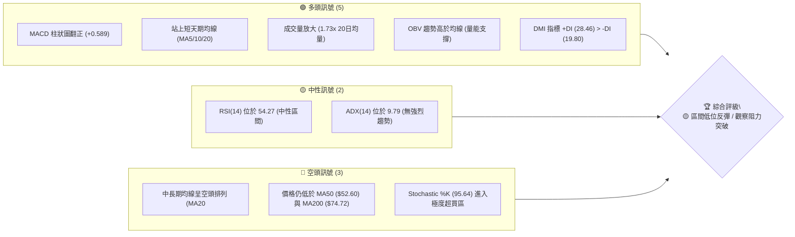
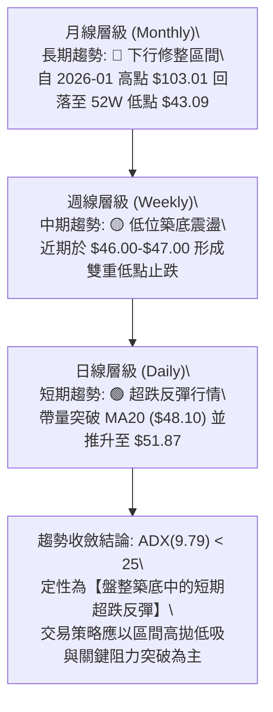
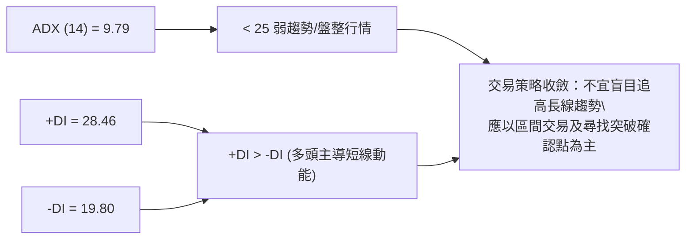
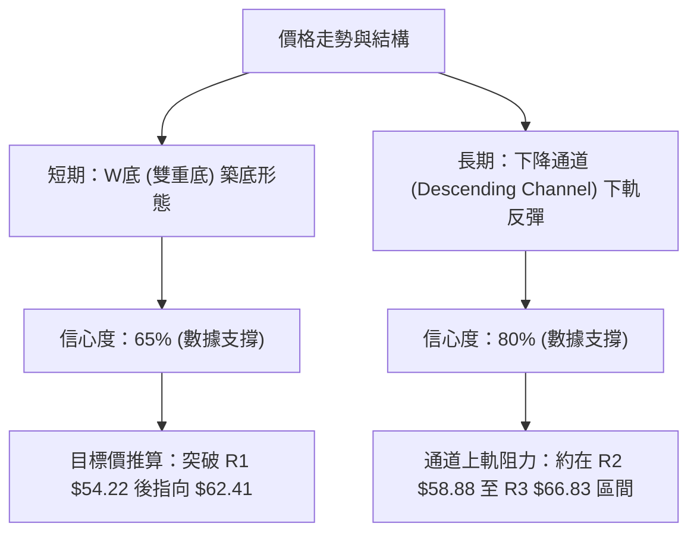
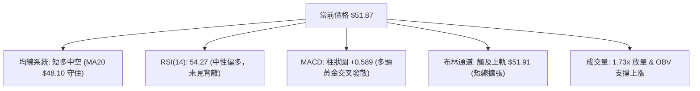
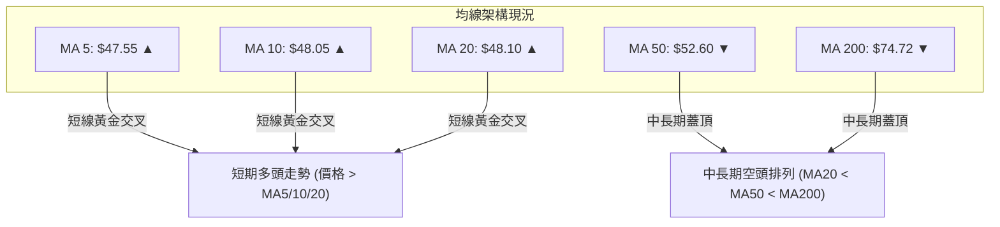
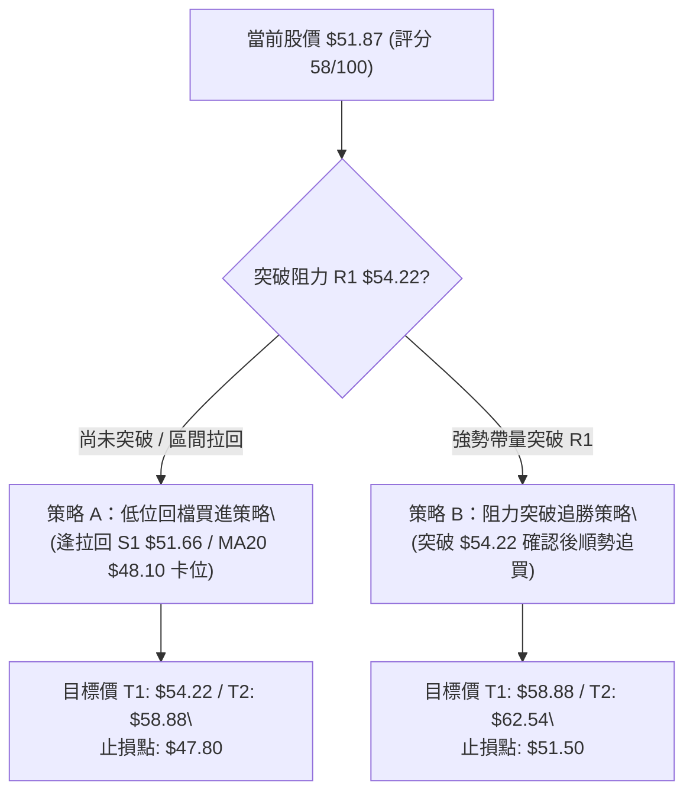
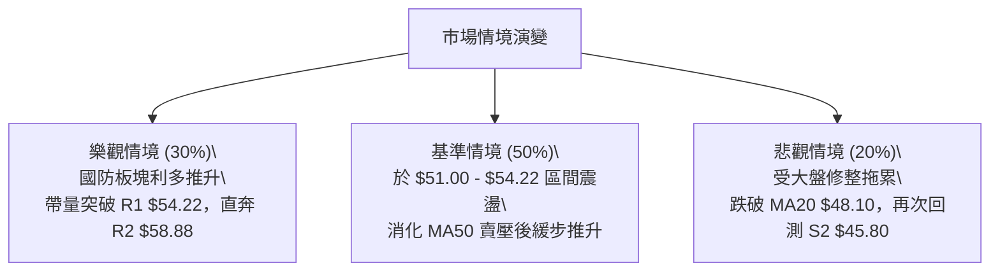

# KTOS 技術分析報告

> **報告日期**：2026-08-05 ｜ **語言**：繁體中文 ｜ **數據來源**：Yahoo Finance ｜ **當前價格**：$51.87

---

## 目錄

| 章節 | 內容 |
|------|------|
| [1. 技術面概覽](#1-技術面概覽) | 訊號儀表板、核心指標速覽表、技術評分卡 |
| [2. 趨勢分析](#2-趨勢分析) | 多時框趨勢結構、12個月歷史走勢圖、ADX趨勢強度評估 |
| [3. 圖表形態分析](#3-圖表形態分析) | 形態識別與信心度、K線組合解析、形態目標價推算 |
| [4. 支撐與阻力](#4-支撐與阻力) | 關鍵價位結構分布圖、阻力位分析、支撐位分析、斐波那契回調 |
| [5. 技術指標深度解讀](#5-技術指標深度解讀) | 均線系統、RSI背離、MACD動能、布林通道與成交量OBV |
| [6. 動能與波動率](#6-動能與波動率) | 動能評估矩陣、ATR波動率止損、Beta市場相關性 |
| [7. 多時框架總結](#7-多時框架總結) | 時框架評分矩陣、多時框訊號收斂與趨勢定性 |
| [8. 交易策略建議](#8-交易策略建議) | 策略決策流程、價格情境階梯、主策略詳情與風控 |
| [9. 風險提示與監控](#9-風險提示與監控) | 關鍵監控清單、風險情境模擬、倉位管理提醒 |
| [10. 報告總結](#10-報告總結) | 核心結論與最佳策略組合一覽 |

---

## 1. 技術面概覽

### 🎯 技術訊號儀表板



---

### 📊 核心指標速覽表

| 指標類別 | 指標名稱 | 當前數值 | 訊號 | 解讀 |
|----------|----------|----------|------|------|
| **價格** | 當前收盤價 | $51.87 | 🟡 中性 | 位於 52 週區間 ($43.09 - $134.00) 之 9.7% 極低位區 |
| **均線** | MA20 (月線) | $48.10 | 🟢 看多 | 價格已站上 MA20，短線轉強 |
| **均線** | MA50 (季線) | $52.60 | 🔴 看空 | 價格位於 MA50 下方，面臨中期上方蓋頂壓力 |
| **均線** | MA200 (年線) | $74.72 | 🔴 看空 | 價格遠低於 MA200，長期趨勢維持空頭架構 |
| **動能** | RSI(14) | 54.27 | 🟡 中性 | 從超賣區回升至中性區，未出現背離訊號 |
| **動能** | MACD (12,26,9) | -0.998 / Hist +0.589 | 🟢 看多 | 柱狀圖連續擴大，雙線黃金交叉向上 |
| **動能** | Stochastic %K/%D | 95.64 / 60.72 | 🔴 看空 | 短線極度超買，隨時有回測消化賣壓風險 |
| **趨勢** | ADX(14) | 9.79 | 🟡 中性 | 數值小於 25，顯示處於無趨勢盤整/反彈行情 |
| **波動** | ATR(14) | $2.94 (5.67%) | 🟡 中性 | 每日波動度適中，提供風控止損依據 |
| **量能** | 成交量比 (VR) | 1.73x (6.20M vs 3.57M) | 🟢 看多 | 放量反彈，顯示低位抄底與補庫存買盤湧入 |

---

### 🏆 技術評分卡

```
╔══════════════════════════════════════════════════════════════════╗
║                   技術評分卡 — KTOS (2026-08-05)                ║
╠══════════════════════════════════════════════════════════════════╣
║ 趨勢強度 (ADX/DMI)  █████░░░░░░░░░░░░░░░  35/100  🟡 弱趨勢盤整   ║
║ 動能指標 (RSI/MACD) █████████████░░░░░░░  65/100  🟢 動能回升     ║
║ 支撐穩定度 (S1/S2)  ██████████████░░░░░░  70/100  🟢 築底反彈     ║
║ 成交量配合 (OBV/VR) ███████████████░░░░░  75/100  🟢 放量確認     ║
║ 形態完整度 (W底/通道)████████████░░░░░░░░  60/100  🟡 形態打底中   ║
║ 均線排列 (MA5-200)  ████████░░░░░░░░░░░░  40/100  🔴 中長空頭     ║
╠══════════════════════════════════════════════════════════════════╣
║ 綜合技術評分        ███████████111111111  58/100  🟡 區間震盪反彈 ║
╚══════════════════════════════════════════════════════════════════╝
```

---

## 2. 趨勢分析

### 🌐 多時框趨勢分析



---

### 📈 長期趨勢 — 12個月走勢圖（Unicode）

```
KTOS 過去 12 個月價格走勢與關鍵高低點軌跡
價格 ($)
110.00 ┤
103.01 ┤                   ● (2026-01 歷史高點)
 90.00 ┤             ●   ●
 80.00 ┤         ●
 70.00 ┤ ●   ●               ●
 60.00 ┤                         ●
 51.87 ┤                                     ● (現價)
 43.09 ┤                                 ● (2026-07 52W低點)
       └─┬───┬───┬───┬───┬───┬───┬───┬───┬───┬───┬───
        08/25 09  10  11  12  01/26 02  03  04  05  06  07/26
```

#### 過去 12 個月階段漲跌特徵分析

| 階段區間 | 起始價 → 終點價 | 變動幅度 | 走勢特徵與市場驅動因素 |
|----------|------------------|----------|------------------------|
| **2025-08 ~ 2025-09** | $65.84 → $91.37 | +38.78% | 主升段攻勢，國防預算擴張與無人機業務利多大幅估值拉升。 |
| **2025-09 ~ 2026-01** | $91.37 → $103.01 | +12.74% | 高位衝頂階段，買盤動能趨緩，於 2026 年 1 月見頂 $103.01。 |
| **2026-01 ~ 2026-04** | $103.01 → $63.05 | -38.79% | 快速回檔修整，獲利了結賣壓湧現，連續跌破 MA20 與 MA50。 |
| **2026-04 ~ 2026-07** | $63.05 → $46.60 | -26.09% | 築底尋找支撐，於 2026-07 探至 $43.09 52週低點後出現止跌買盤。 |
| **2026-07 ~ 2026-08** | $46.60 → $51.87 | +11.31% | 短線超跌強勁反彈，放量站上 MA20，挑戰 MA50 與阻力 R1。 |

---

### 📊 中期趨勢（週線分析）

從近 20 週數據觀察，KTOS 在 2026 年 5 月至 7 月經歷了一波連續回落，收盤價自 $64.13 一路下尋支撐至 $46.03 (2026-07-19) 與 $46.60 (2026-08-02)。目前週線 RSI 已從超賣區的 23.1 反彈至 54.3，MACD 週線柱狀圖亦持續縮小負值並轉正 (+0.589)，顯示中期下跌動能已暫時衰竭，正進入**低位打底並試探中期均線壓力的過渡期**。

---

### ⚡ 趨勢強度評估（ADX 解讀）



| ADX 數值範圍 | 當前狀態 | 市場型態與操作導向 |
|--------------|----------|----------------────|
| 0 - 20 | **9.79 (當前)** | **極弱趨勢 / 盤整區間**：指標失效風險低，適合震盪指標（RSI、Stochastic、布林通道）輔助區間操作。 |
| 20 - 25 | - | 趨勢萌芽期：尋找方向突破點。 |
| 25 - 50 | - | 強烈趨勢行情：適合順勢突破與均線追蹤策略。 |

---

## 3. 圖表形態分析

### 🔍 形態識別系統



#### 形態識別信心度與評估表

| 形態名稱 | 信心度 (%) | 判斷依據（嚴格引用數據） | 形態完成度 | 形態目標價（附計算式） |
|----------|------------|--------------------------|------------|------------------------|
| **雙重底 (W-Bottom)** | **65%** | 近期兩次測試低點 $46.03 (2026-07-19) 與 $46.60 (2026-08-02)，未跌破 52W 低點 $43.09。頸線位於阻力位 R1 ($54.22)。 | 75% (待突破頸線 R1 $54.22) | **$62.41**<br/>計算：頸線 $54.22 + (頸線 $54.22 - 低點 $46.03 = $8.19) = $62.41 |
| **下降通道 (Downtrend Channel)** | **80%** | 高點連線 ($103.01 → $90.60 → $70.99) 與低點連線 ($63.05 → $46.03 → $43.09) 構成標準下降通道。現價處於通道下軌反彈階段。 | 100% (成熟通道) | 通道上軌壓力區：**$58.88 - $66.83** (對應 R2 與 R3) |

---

### 🕯️ 重要 K 線形態分析

| 日期/週次 | 收盤價 | K 線形態組合 | 技術解讀 | 多空訊號 |
|-----------|--------|--------------|----------|----------|
| **2026-07-19** | $46.03 | **鎚子線 (Hammer)** | 長下影線測試 $46.00 關卡，多頭抄底意願強烈。 | 🟢 看多反轉 |
| **2026-08-02** | $46.60 | **小陽星 (Spinning Top)** | 縮量企穩，確認前一波低點支撐有效，形成次低點。 | 🟢 築底確認 |
| **2026-08-09** | $51.87 | **大陽線 (Long White Candle)** | 帶量突破 MA20 ($48.10)，實體穿透布林中軌，買盤強勁。 | 🟢 強勢攻擊 |

---

### 📉 ASCII 走勢形態示意圖

```
KTOS 日線 W 底築底與阻力突破示意圖

阻力 R2  $58.88 ────────────────────────────────────── (形態中期目標)
阻力 R1  $54.22 ───────────────┬────────────────────── (W底頸線 / 突破點)
                              /
現價     $51.87 ────────────● (強勢陽線突破 MA20)
                          /   \
均線 MA20 $48.10 ───────●──────\────────────────────── (支撐線)
                       /        \
支撐 S1  $51.66 ──────/──────────●
                     /            \
支撐 S2  $45.80 ───● (低點1)       ● (低點2) ────────── (底部位 $46.03-$46.60)
                  $46.03          $46.60
```

---

### 🎯 形態目標價計算

1. **W 底形態目標價推算**：
   - 形態底部平均價格：$(46.03 + 46.60) / 2 = \$46.315$
   - 頸線位置 (阻力位 R1)：$\$54.22$
   - 形態垂直高度：$\$54.22 - \$46.315 = \$7.905$
   - **突破目標價** = 頸線 $\$54.22 + \$7.905 = \$62.125$ (約指向斐波那契 78.6% 回調位 $\$62.54$)

---

## 4. 支撐與阻力

### 🗺️ 關鍵價位分布圖（Unicode）

```
KTOS 關鍵價位與支撐阻力結構圖
════════════════════════════════════════════════════════════════════
$134.00 ║████████████████████████████████████████ 52週最高點 (0.0% Fib)
$ 99.27 ║██████████████████                      斐波那契 38.2% 回調位
$ 77.82 ║██████████████                          斐波那契 61.8% 回調位
$ 66.83 ║████████████                            強阻力 R3 (+28.84%)
$ 62.54 ║██████████                              斐波那契 78.6% 回調位
$ 58.88 ║████████                                中期阻力 R2 (+13.51%)
$ 54.22 ║██████                                  關鍵頸線阻力 R1 (+4.53%)
$ 51.87 ╠════════════════════════════════════════ ◄ 當前價格 (Current Price)
$ 51.66 ║▓▓▓▓▓▓▓▓▓▓▓▓▓▓▓▓▓▓▓▓▓▓▓▓▓▓▓▓▓▓▓▓▓▓▓▓▓   極近支撐 S1 (-0.40%)
$ 45.80 ║████████████████████████████████████████ 強波段支撐 S2 (-11.71%)
$ 43.09 ║████████████████████████████████████████ 52週最低點 (100.0% Fib)
════════════════════════════════════════════════════════════════════
```

---

### 🚧 阻力位分析表

| 阻力級別 | 精確價位 | 形成原因與結構強度 | 突破難度 | 交易戰略意義 |
|----------|----------|--------------------|----------|--------------|
| **R1** | **$54.22** | 近一年波段高點聚類、W底頸線位置、接近 MA50 ($52.60)。 | 🟡 中等 | **極關鍵觸發點**：突破並站穩 $54.22 確認短線趨勢翻多。 |
| **R2** | **$58.88** | 近一年波段高點聚類、下降通道中軌壓力。 | 🟡 中等 | 短期獲利了結點，也是多頭推進至 $60 關卡前置哨站。 |
| **R3** | **$66.83** | 近一年波段高點聚類、接近 MA120 ($65.83) 與 Fib 78.6% ($62.54)。 | 🔴 極高 | 中期波段強阻力區，解套賣壓密集重災區。 |

---

### 🛡️ 支撐位分析表

| 支撐級別 | 精確價位 | 形成原因與結構強度 | 守住機率 | 交易戰略意義 |
|----------|----------|--------------------|----------|--------------|
| **S1** | **$51.66** | 近一年波段低點聚類，極接近當前價格，與 MA20 ($48.10) 形成支撐帶。 | 🟢 高 (70%) | **極短線防守線**：不宜跌破，否則反彈動能衰退。 |
| **S2** | **$45.80** | 近一年波段低點聚類 (2026-07/08 兩次打底 $46.03/$46.60 區域)。 | 🟢 極高 (85%)| **波段多頭生命線**：跌破則 W 底破局，將下尋 52W 低點。 |

---

### 📐 斐波那契回調位分析

依據 52 週高低點區間（**$43.09 → $134.00**，總價差 $90.91）精確計算：

| 回調比例 | 精確價位 | 當前價位相對位置與意義解讀 |
|----------|----------|----------------------------|
| **0.0% (52W High)** | **$134.00** | 歷史極限高點，遠期參考。 |
| **23.6%** | **$112.55** | 長期多頭強勢區。 |
| **38.2%** | **$99.27** | 中長期回調支撐轉阻力區。 |
| **50.0%** | **$88.55** | 多空長期分水嶺。 |
| **61.8%** | **$77.82** | 黃金分割強阻力，接近 MA200 ($74.72)。 |
| **78.6%** | **$62.54** | 超跌反彈第一階段核心目標區。 |
| **100.0% (52W Low)**| **$43.09** | 52 週最低點，絕對底部支撐。 |

👉 **當前位置解讀**：當前價格 **$51.87** 正處於 **100.0% ($43.09)** 與 **78.6% ($62.54)** 的極低位回升階梯中。距離 78.6% 回調位尚有 **+20.57%** 的反彈空間。

---

## 5. 技術指標深度解讀

### 🎛️ 指標訊號總覽



---

### 📈 移動平均線排列分析



- **短天期均線 (MA5/10/20)**：價格 $51.87 高於 MA5 ($47.55)、MA10 ($48.05) 與 MA20 ($48.10)，短線呈多頭排列，扣抵值處於低位，短期支撐強勁。
- **長天期均線 (MA50/200)**：MA50 ($52.60) 與 MA200 ($74.72) 依序下行，反彈首要考驗即為 MA50 ($52.60) 壓力。

---

### 📉 RSI(14) 分析

```
RSI(14) 當前強度進度條
0                 30        54.27       70               100
├─────────────────┼──────────█─────────┼────────────────┤
[  超賣區 (Oversold)  │    中性溫和區    │  超買區 (Overbought) ]
```

- **指標數值**：**54.27**（中性偏多區間）。
- **背離判斷**：由 2026-07 底部 $46.03 與 $46.60 觀察，價格二度探底時 RSI 分別為 47.6 與 49.3，呈現**微幅底背離（Price Low Equal, RSI High）**，隨後帶動本次強勁反彈。目前**無頂背離警訊**。

---

### 📊 MACD(12,26,9) 訊號解讀

- **MACD 線**：-0.998
- **Signal 線**：-1.587
- **MACD 柱狀圖**：**+0.589** (🟢 看多)
- **解讀**：MACD 線向上穿越 Signal 線形成零軸下的黃金交叉，柱狀圖連續正向擴展，確認多頭動能正在加速釋放，短線反彈具備指標續航力。

---

### 📦 布林通道分析

```
布林通道 (BB 20, 2) 價位結構示意圖
上軌 (Upper Band)  $51.91 ════════════════════════════ (現價 $51.87 觸及上軌, %B = 1.00)
中軌 (MA20)        $48.10 ─── ─── ─── ─── ─── ─── ─── (關鍵動態支撐)
下軌 (Lower Band)  $44.30 ════════════════════════════ (築底邊界)
```

- **通道位置**：%B 為 **1.00**，顯示價格已經強勢擠壓布林通道上軌 ($51.91)。
- **通道型態**：通道帶寬開始由收窄轉為張口（Squeeze to Expansion），若能放量帶動上軌開口擴大，將開啟一波通道擠壓攻擊行情。

---

### 💹 成交量分析（量價配合度）

- **最新成交量**：**6,198,512** 股。
- **20日均量**：3,573,086 股 (量比 **1.73x**)。
- **OBV 趨勢**：OBV 指標突破其移動平均線向上，呈現「**價漲量增**」的健康配合狀態，證明此波攻勢為實質資金推升而非虛盈反彈。

---

## 6. 動能與波動率

### ⚡ 動能評估矩陣

| 象限分區 | 動能強度 (Momentum) | 波動率 (Volatility) | 當前標的位置 | 策略含義與操作導向 |
|----------|---------------------|---------------------|--------------|--------------------|
| **Q1 (最佳攻擊)** | 強 (RSI>50, MACD>0) | 低/中 (ATR<6%) | **✓ KTOS (當前)** | **動能強且波動可控**：最佳短線進場與卡位突破點。 |
| **Q2 (謹慎觀望)** | 弱 (RSI<50, MACD<0) | 低 (ATR<5%) | - | 無趨勢沉悶區。 |
| **Q3 (高險高收益)**| 強 (RSI>70) | 高 (ATR>8%) | - | 追高風險大，適合極短線衝刺。 |
| **Q4 (避險遠離)** | 弱 (RSI<30) | 高 (ATR>8%) | - | 恐慌殺跌段，避免接刀。 |

---

### 📊 ATR 波動率分析

- **ATR(14) 數值**：**$2.94** (占股價 **5.67%**)
- **日均波動區間**：$51.87 ± $2.94
- **風控應用建議**：
  - **極短線止損距離 (1.0x ATR)**：$51.87 - $2.94 = **$48.93**
  - **波段交易止損距離 (1.5x ATR)**：$51.87 - (1.5 × $2.94) = **$47.46** (極接近 MA20 $48.10 防守區)

---

### 📐 Beta 與市場相關性

- **Beta 係數**：**1.106**
- **市場屬性**：KTOS 波動度略高於整體美股大盤 (S&P 500)。在大盤強勢時具備高彈性，但在市場風險偏好下降時回檔幅度亦較深，需嚴格設定止損。

---

## 7. 多時框架總結

### 📋 時框架評分表

| 時框架 | 趨勢方向 | 動能狀態 | 均線排列 | 形態結構 | 綜合評分 | 操作建議 |
|--------|----------|----------|----------|----------|----------|----------|
| **日線 (Daily)** | 🟢 短期看多 | 🟢 多頭黃金交叉 | 🟢 站上MA20 | 🟢 W底反彈 | **72 / 100** | 偏多操作 / 尋找拉回買點 |
| **週線 (Weekly)**| 🟡 中性築底 | 🟢 柱狀圖翻正 | 🔴 MA20<MA50 | 🟡 通道下軌 | **55 / 100** | 區間操作 / 觀察阻力突破 |
| **月線 (Monthly)**| 🔴 長期下行 | 🟡 中性打底 | 🔴 空頭排列 | 🔴 高位回落修整| **38 / 100** | 長線防守 / 不宜過度重倉 |

---

### 🔲 綜合訊號矩陣

```
           短期動能 (Daily)
           多頭 (Bullish)       空頭 (Bearish)
         ┌───────────────────┬───────────────────┐
   多頭  │ 突破加速期        │ 中期回檔拉回買點  │
中期 (Bull)│ (最佳追價環境)    │ (逢低佈局)        │
趨勢     ├───────────────────┼───────────────────┤
   空頭  │ ★ KTOS 當前位置   │ 順勢空頭主升段    │
(Bear)   │ (低位超跌強反彈)  │ (嚴格避開/做空)   │
         └───────────────────┴───────────────────┘
```

---

### ⚖️ 多時框收斂結論

> **依據多時框收斂規則（ADX = 9.79 < 25）**：
> KTOS 當前整體定性為**【中長期下降趨勢中的「區間低位強勁超跌反彈」】**。日線層級展現強烈多頭動能（放量突破 MA20、MACD 正向發散），但中長期的 MA50 ($52.60) 與阻力位 R1 ($54.22) 構成強大的蓋頂區域。因此，**最終方向定性為：偏多反彈，但在 R1 ($54.22) 前不宜盲目追高，首選「逢低吸納」或「突破 R1 確認後加碼」策略**。

---

## 8. 交易策略建議

### 🗺️ 策略決策流程圖



---

### 🧭 策略路由

**當前主策略方向 = 區間偏多 / 逢低佈局與突破買進（依評分 58/100）**

---

### 🎯 價格情境階梯 (Price Scenarios)

| 觸發條件 | 第一目標價 | 第二目標價 | 情境含義與操作指引 |
|----------|------------|------------|----------------────|
| **強勢突破 R1 $54.22** | **R2 $58.88** | **Fib 78.6% $62.54** | W 底形態正式成立，多頭主導波段反彈攻勢。 |
| **現價 $51.87 區間震盪** | **R1 $54.22** | **S1 $51.66** | 消化布林上軌賣壓與 MA50 阻力，等待量能再次聚集。 |
| **跌破 S1 $51.66 / MA20** | **S2 $45.80** | **52W Low $43.09** | 反彈宣告失敗，再次下探區間底部尋找支撐。 |

---

### 📊 情境機率分佈

```
[情境 1] 挑戰阻力 R1 / 震盪向上 ▓▓▓▓▓▓▓▓▓▓▓▓▓▓▓▓▓▓▓▓ 50% 機率
[情境 2] 布林上軌壓制 / 區間震盪 ▓▓▓▓▓▓▓▓▓▓▓▓████ 35% 機率
[情境 3] 反彈受阻 / 回測 S2 支撐  ▓▓▓▓▓▓██████████ 15% 機率
```

- **機率評估依據**：放量 1.73x 突破 MA20、MACD 柱狀圖正向擴張（+0.589）支援多頭（50%）；但 ADX(9.79) 顯示無強趨勢且 Stoch %K(95.64) 超買壓制（35% 震盪）；跌破 S2 機率較低（15%）。

---

### 🟢 主策略詳情

| 策略要素 | 策略 A：拉回低吸策略 (首選) | 策略 B：突破追買策略 (次選) |
|----------|----------------------------|----------------------------|
| **進場條件** | 股價微幅拉回至 S1 附近不破，或現價分批進場 | 股價強勢帶量突破 R1 $54.22 且收盤站穩 |
| **進場價格** | **$51.66 - $51.87** | **$54.50** (突破 $54.22 確認後) |
| **目標價 T1** | **$54.22** (R1 阻力位, +4.53%) | **$58.88** (R2 阻力位, +8.04%) |
| **目標價 T2** | **$58.88** (R2 阻力位, +13.51%)| **$62.54** (Fib 78.6% / W底目標, +14.75%) |
| **止損價格** | **$47.80** (跌破 MA20 $48.10 止損) | **$51.50** (跌破 S1 止損) |
| **風險報酬比** | **1.72 : 1** (以 T2 計算) | **2.68 : 1** (以 T2 計算) |
| **預估成功機率**| **60%** | **55%** |
| **建議倉位** | **10% - 15%** (總資產) | **10%** (總資產) |

---

### 🔴 反向風險觸發點（對沖與撤退提示）

- **風控警告訊號**：若收盤價無力突破 R1 $54.22，且反轉下破 **MA20 ($48.10)** 或 **S1 ($51.66)**，代表本次放量反彈為假突破。多頭應立即清倉止損，轉為觀望或建立適度空頭對沖。

---

### ⭐ 整體訊號強度評星

```
做多訊號強度：★★★☆☆  (3/5星 — 短線強勢但受限於中期蓋頂)
做空訊號強度：★★☆☆☆  (2/5星 — 底動能強，做空勝率較低)
整體可信度：  ★★★☆☆  (3/5星 — 成交量配合佳，受 ADX 盤整限制)
```

---

## 9. 風險提示與監控

### ✅ 關鍵監控指標 Checklist

```
╔══════════════════════════════════════════════════════════════════╗
║                   KTOS 每日盤後風控監控清單                     ║
╠══════════════════════════════════════════════════════════════════╣
║ [ ] 價格是否成功突破並收高於阻力 R1 $54.22？                      ║
║ [ ] 成交量是否持續維持在 20 日均量 (3.57M) 之上？                 ║
║ [ ] MACD 柱狀圖是否保持在 0 軸上方增長 (+0.589)？                  ║
║ [ ] 價格回檔時是否能嚴守 MA20 ($48.10) 與 S1 ($51.66)？            ║
║ [ ] Stochastic %K (95.64) 高位死叉落入 80 以下時的拉回幅度？      ║
╚══════════════════════════════════════════════════════════════════╝
```

---

### ⚠️ 風險場景分析



---

### 🛡️ 風險管理重要提醒

1. **極度超買修整風險**：Stochastic %K 已高達 **95.64**，屬於極度超買。短線股價隨時可能出現 1-3 天 的技術性回檔，切忌在開盤急拉時盲目追高。
2. **均線壓制風險**：MA50 ($52.60) 距離當前價位僅 +1.4%，歷史經驗顯示，首次挑戰下行的 MA50 往往伴隨解套賣壓，建議分批獲利。
3. **倉位嚴格控管**：因 ADX 僅為 9.79，市場缺乏明確大波段趨勢，整體持倉不宜超過總資金之 15%。

---

## 📋 報告總結

```
╔══════════════════════════════════════════════════════════════════╗
║                     KTOS 技術分析報告總結                        ║
════════════════════════════════════════════════════════════════════
 報告日期：2026-08-05
 當前價格：$51.87
 分析評級：🟡 區間低位超跌反彈 / 觀望突破 (技術評分: 58/100)

 關鍵結論：
 ├─ 長期趨勢：🔴 下降通道修整 (52W 低點 $43.09 剛止跌)
 ├─ 中期趨勢：🟡 低位打底震盪 (正測試 W底頸線與 MA50)
 ├─ 短期趨勢：🟢 帶量強勁反彈 (放量 1.73x，站上 MA20 $48.10)
 ├─ 關鍵支撐：S1 $51.66 / S2 $45.80
 ├─ 關鍵阻力：R1 $54.22 / R2 $58.88
 └─ 分析師目標價均值：$108.62 (基本面長期看好)

 最優策略組合：
 1. 🥇 最佳機會 (策略 A)：現價/拉回至 $51.66 逢低卡位，目標 $54.22 / $58.88，止損 $47.80。
 2. 🥈 次選機會 (策略 B)：等待帶量突破 R1 $54.22 後追買，目標 $58.88 / $62.54，止損 $51.50。
 3. 🥉 風險防禦：跌破 MA20 ($48.10) 無條件執行止損紀律。
════════════════════════════════════════════════════════════════════
```

---

> ⚠️ **免責聲明**：本報告為 AI 自動生成之技術分析，所有數據及估算均基於提供的歷史價格資訊。本報告**僅供研究與學術參考**，**不構成任何投資建議**。投資有風險，入市需謹慎。

*報告生成時間：2026-08-05 ｜ 數據來源：Yahoo Finance ｜ 分析框架：多時框技術分析*