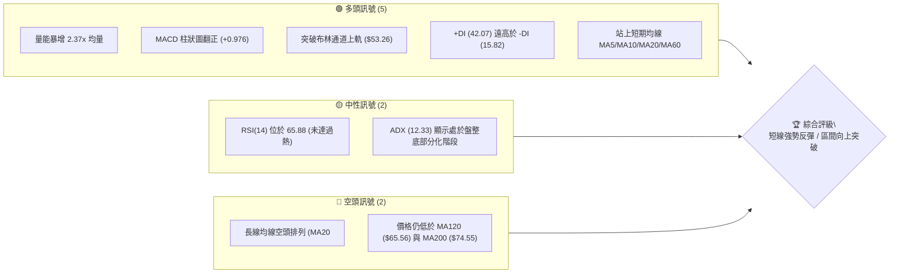
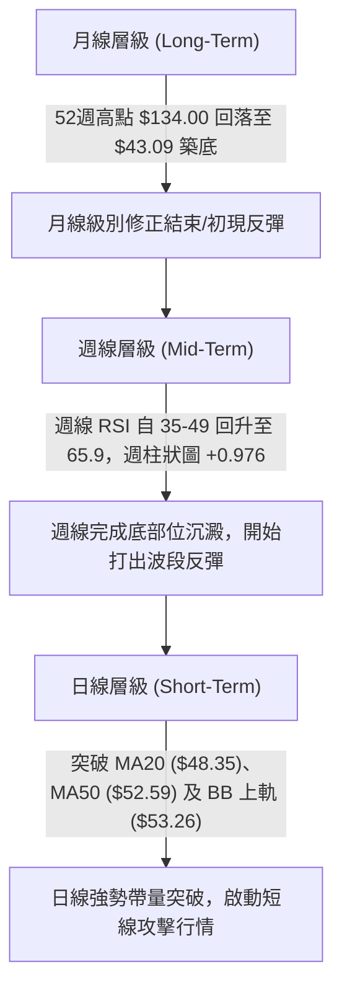
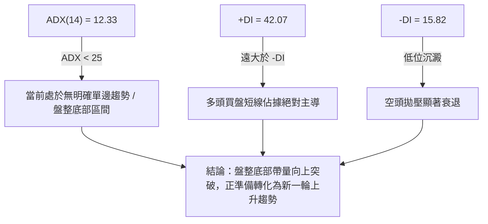
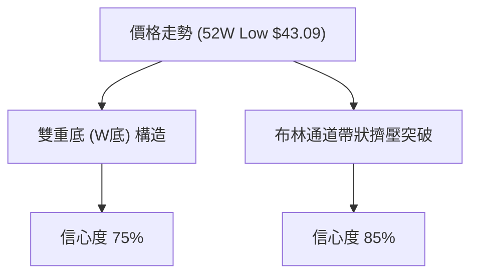
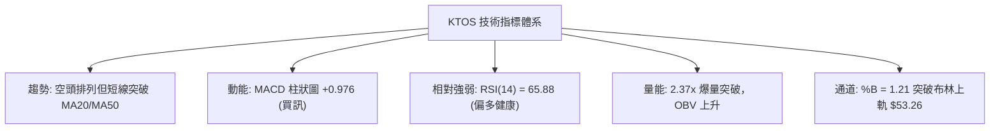
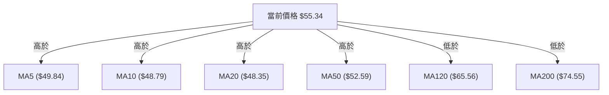
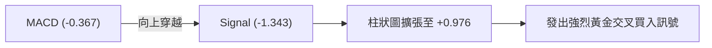
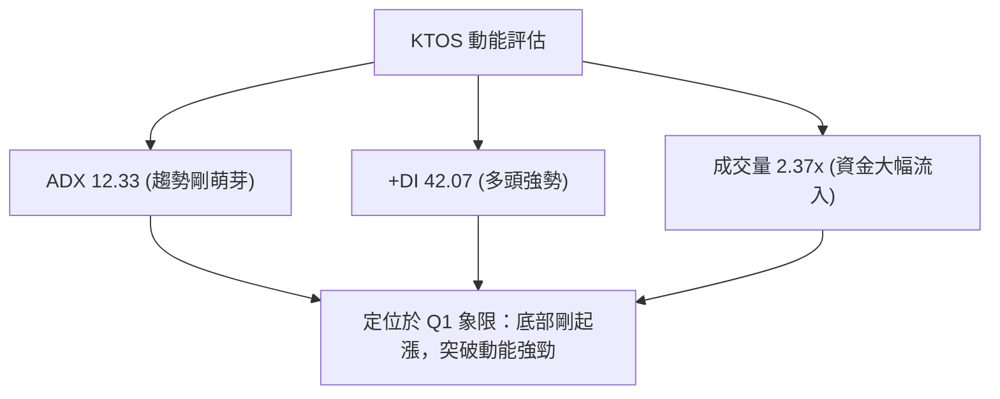
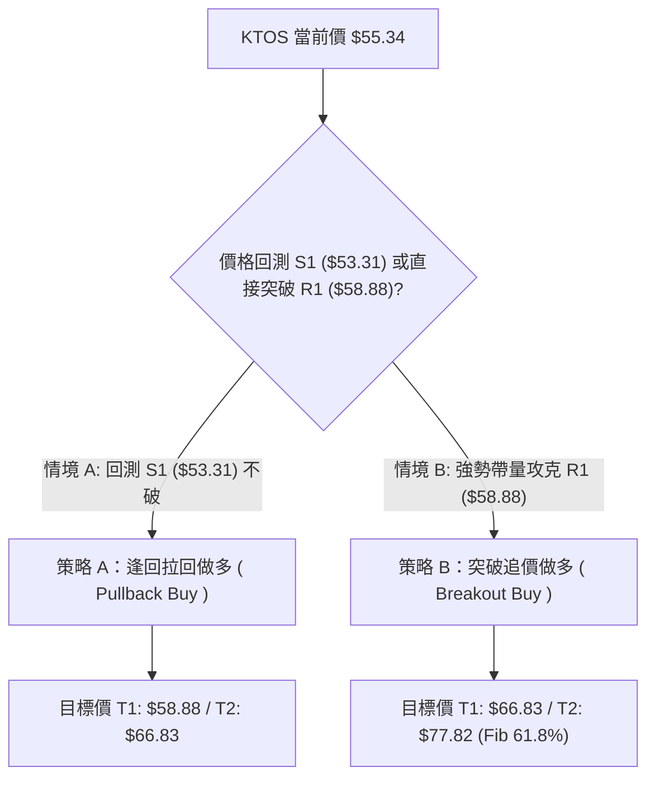
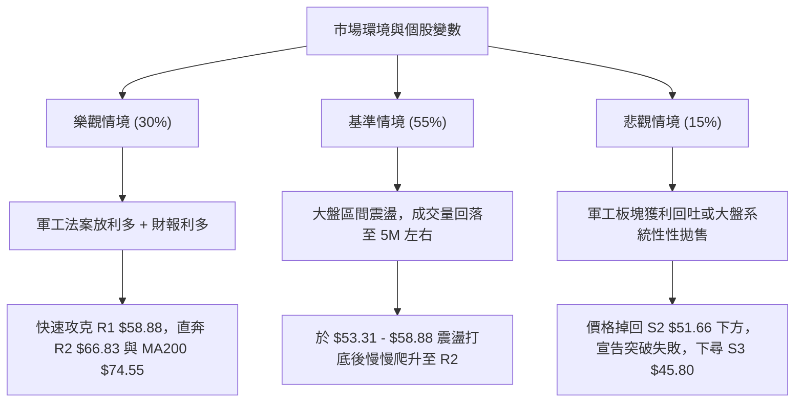

# KTOS 技術分析報告

> **報告日期**：2026-08-06 ｜ **語言**：繁體中文 ｜ **數據來源**：Yahoo Finance ｜ **當前價格**：$55.34

---

## 目錄

| 章節 | 內容 |
|------|------|
| [1. 技術面概覽](#1-技術面概覽) | 訊號儀表板、核心指標、評分卡 |
| [2. 趨勢分析](#2-趨勢分析) | 多時框趨勢、長中短期走勢 |
| [3. 圖表形態分析](#3-圖表形態分析) | 形態識別、K線組合、目標價 |
| [4. 支撐與阻力](#4-支撐與阻力) | 關鍵價位、斐波那契回調 |
| [5. 技術指標深度解讀](#5-技術指標深度解讀) | MA/RSI/MACD/布林/成交量 |
| [6. 動能與波動率](#6-動能與波動率) | 動能評估、ATR、Beta |
| [7. 多時框架總結](#7-多時框架總結) | 時框架評分矩陣 |
| [8. 交易策略建議](#8-交易策略建議) | 多空策略、風險報酬比 |
| [9. 風險提示與監控](#9-風險提示與監控) | 監控指標、風險場景 |

---

## 1. 技術面概覽

### 🎯 技術訊號儀表板



### 📊 核心指標速覽表

| 指標類別 | 指標名稱 | 當前數值 | 訊號 | 解讀 |
|----------|----------|----------|------|------|
| **價格** | 當前價格 | $55.34 | 🟢 | 突破近期低檔盤整區，自底部位 $43.09 強勢反彈 |
| **均線** | MA20 | $48.35 | 🟢 | 價格位於 MA20 上方 (+14.45%)，短期趨勢翻多 |
| **均線** | MA50 | $52.59 | 🟢 | 價格成功攻克 MA50 上方 (+5.23%)，中短期轉強 |
| **均線** | MA200 | $74.55 | 🔴 | 價格位於 MA200 下方 (-25.77%)，長期趨勢仍處空頭修復 |
| **動能** | RSI(14) | 65.88 | 🟢 | 動能強勁且未進入過熱區 (RSI>70)，尚有上行空間 |
| **動能** | MACD (12,26,9) | -0.367 (Hist: +0.976) | 🟢 | 快慢線金叉且柱狀圖顯著擴張，展現強烈買盤動能 |
| **動能** | ADX (14) | 12.33 | 🟡 | ADX < 25 屬無趨勢/盤整底部突破，+DI (42.07) 完全主導 |
| **波動** | ATR (14) | $3.45 (6.23%) | 🟡 | 每日波幅適中，突破日波動加劇 |
| **通道** | 布林通道 | Upper: $53.26 | 🟢 | 價格收在 %B = 1.21，展現強烈上軌帶狀突破 (Bollinger Band Ride) |
| **量能** | 成交量 | 9,175,935 (2.37x) | 🟢 | 突破伴隨 2.37 倍均量，機構進場意願極高 |

### 🏆 技術評分卡

```
╔══════════════════════════════════════════════════════════════╗
║              技術評分卡 — KTOS (2026-08-06)                 ║
╠══════════════════════════════════════════════════════════════╣
║ 趨勢強度      ████████████░░░░░░░░  60/100  🟡 中性偏多     ║
║ 動能指標      ████████████████░░░░  80/100  🟢 強勁看多     ║
║ 支撐穩定度    ██████████████░░░░░░  70/100  🟢 堅實築底     ║
║ 成交量配合    ██████████████████░░  90/100  🟢 極佳放量     ║
║ 形態完整度    ██████████████░░░░░░  70/100  🟢 底部雙重支撐 ║
║ 均線排列      ████████░░░░░░░░░░░░  40/100  🔴 依然壓制     ║
╠══════════════════════════════════════════════════════════════╣
║ 綜合評分      █████████████░░░░░░░  68/100  🟢 短線偏多反彈 ║
╚══════════════════════════════════════════════════════════════╝
```

---

## 2. 趨勢分析

### 🌐 多時框趨勢分析



### 📈 長期趨勢 — 24個月走勢圖（Unicode）

```
KTOS 月線走勢圖（2024-08 至 2026-08）
價格軸 ($)
$105 ┤                               ● (2026-01: $103.01)
$90  ┤                     ●   ●
$75  ┤                         ●   ●
$60  ┤                 ●               ●           ●←現在 ($55.34)
$45  ┤                                     ●   ●
$30  ┤         ●   ●
$15  ┤ ●   ●
     └─┬───┬───┬───┬───┬───┬───┬───┬───┬───┬───┬───┬───
      24/08   24/11   25/02   25/05   25/08   25/11   26/02   26/05   26/08
```

#### 走勢特徵分析表

| 時間階段 | 收盤價區間 | 漲跌特徵 | 技術面解讀 |
|----------|------------|----------|------------|
| **2024/08 - 2025/01** | $22.94 → $103.01 | 快速拉升 (+349%) | 主升段行情，國防軍工板塊推升 |
| **2025/02 - 2025/09** | $26.39 → $91.37 | 高位震盪劇烈拉回後創高 | 二次攻高，見 52 週最高點 $134.00 |
| **2025/10 - 2026-04** | $90.60 → $63.05 | 中期築頂與深幅回調 (-52.9%) | 估值修復，長期均線轉為空頭排列 |
| **2026/05 - 2026/07** | $64.13 → $46.60 | 底部位尋找支撐 ($43.09 觸底) | 形成 $43.09 - $46.60 雙重底打底區間 |
| **2026/08 (當前)** | $55.34 | 放量長紅反彈 (+18.75%) | 站上 MA20/MA50，攻克布林上軌，開啟強勢反彈 |

### 📊 中期趨勢（週線分析）

近期 20 週數據顯示，KTOS 在 2026 年 6 月底降至 $47.21，7 月中旬下探至 52 週最低點 $43.09（近 20 週收盤低點為 $46.03），隨後在 2026-08-09 當週以 18.87M 的大幅成交量收強紅 K 棒至 $55.34，週 RSI 從 35.1 迅速躍升至 65.9，MACD 週柱狀圖由負轉正至 +0.976，確認中期波段底部已在 $43.09 - $46.00 區域確立。

### ⚡ 趨勢強度評估（ADX 解讀）



| 指標名稱 | 數據值 | 門檻基準 | 技術含義 |
|----------|--------|----------|----------|
| **ADX (14)** | **12.33** | < 25 | 趨勢強度較弱，屬盤整結束後的起漲點，非極度成熟延伸的單邊趨勢 |
| **+DI (14)** | **42.07** | > 25 | 多頭力量極強，買盤動能充沛 |
| **-DI (14)** | **15.82** | < 20 | 賣方力量潰散，下行壓力大幅解除 |

---

## 3. 圖表形態分析

### 🔍 形態識別系統



#### 圖表形態信心度評估表

| 形態類型 | 信心度 | 判斷依據（引用數據） | 完成度 | 目標價（附計算式） |
|----------|--------|----------------------|--------|--------------------|
| **雙重底 (W底)** | **75%** | 第一底 $43.09 (52W低點)，第二底 $46.03 (7/19週)，頸線阻力位 R1 $58.88 | 70% | 頸線 $58.88 + (頸線 $58.88 - 底部位 $43.09 = $15.79) = **$74.67** |
| **布林上軌突破** | **85%** | 當前價 $55.34 突破上軌 $53.26，成交量 2.37 倍放大，%B = 1.21 | 100% | 第一阻力目標 R1 **$58.88**，第二目標 R2 **$66.83** |

### 🕯️ 重要 K 線形態分析

| 日期/週期 | 收盤價 | K線形態 | 解讀 | 訊號 |
|-----------|--------|---------|------|------|
| **2026-07-19 週** | $46.03 | 底部錘頭線 (Hammer) | 下探 52 週低點 $43.09 後逢低買盤強勁打響底部 | 🟢 看多 |
| **2026-07-26 週** | $47.35 | 晨星組合築底 (Morning Star) | 於 $46.00-$47.00 區域獲得極強支撐 | 🟢 看多 |
| **2026-08-09 週** | $55.34 | 大陽突破棒 (Bullish Marubozu) | 放量突破 MA20、MA50 與布林上軌，多頭完全主導 | 🟢 極強多頭 |

### 📉 ASCII 走勢形態示意圖

```
KTOS 雙重底 (W底) 與突破形態示意圖
===================================================================
$66.83 ┤                                         [目標位 R2]
       │
$58.88 ┤-------------------●--------------------- [W底頸線阻力 R1]
       │                  / \
$55.34 ┤                 /   ●←[當前價格帶量突破突破中]
       │                /
$51.66 ┤--●            /------------------------- [中間回檔支撐 S2]
       │   \          /
$46.03 ┤    \        /  ● (第二底 7/19)
       │     \      /
$43.09 ┤      ●----+----------------------------- [第一底 52W Low]
===================================================================
```

### 🎯 形態目標價計算

1. **W 底形態理論測幅**：
   - 底部最低價：$43.09
   - 頸線位置（R1）：$58.88
   - 形態垂直高度：$58.88 - $43.09 = $15.79
   - **突破後最小目標價**：$58.88 + $15.79 = **$74.67**（精確契合 MA200 之 $74.55 壓制區）

2. **布林通道波段擴展目標**：
   - 通道中軌：$48.35，通道上軌：$53.26
   - 第一目標價：R1 **$58.88**
   - 第二目標價：R2 **$66.83**

---

## 4. 支撐與阻力

### 🗺️ 關鍵價位分布圖（Unicode）

```
KTOS 價位結構與斐波那契分布圖
══════════════════════════════════════════════════════════════════
$134.00 ║██████████████████████████████████████║ 52W High (Fib 0.0%)
$112.55 ║████████████████████                  ║ Fib 23.6%
$99.27  ║████████████████                      ║ Fib 38.2%
$88.55  ║██████████████                        ║ Fib 50.0%
$77.82  ║████████████                          ║ Fib 61.8%
$69.91  ║██████████                            ║ 阻力 R3
$66.83  ║█████████                             ║ 阻力 R2
$62.54  ║███████                               ║ Fib 78.6%
$58.88  ║██████                                ║ 關鍵阻力 R1
$55.34  ╠══════════════════════════════════════╣ ◄ 現價 ($55.34)
$53.31  ║▓▓▓▓▓▓▓                               ║ 近期支撐 S1 (BB上軌附近)
$51.66  ║▓▓▓▓▓                                 ║ 強支撐 S2 (MA50 區域)
$45.80  ║▓▓▓                                   ║ 關鍵底座支撐 S3
$43.09  ║▓                                     ║ 52W Low (Fib 100.0%)
══════════════════════════════════════════════════════════════════
```

### 🚧 阻力位分析表

| 阻力級別 | 價位 | 形成原因 | 突破難度 | 重要性 |
|----------|------|----------|----------|--------|
| **R1** | **$58.88** | 近一年波段高點聚類、W底頸線壓力 | 🟡 中等 | ★★★★☆ 近期關鍵多空分水嶺 |
| **R2** | **$66.83** | 波段反彈高點、接近 MA120 ($65.56) | 🔴 較高 | ★★★★☆ 中期密集套牢區 |
| **R3** | **$69.91** | 近一年高檔密集交投區 | 🔴 極高 | ★★★☆☆ 長期趨勢反轉點 |

### 🛡️ 支撐位分析表

| 支撐級別 | 價位 | 形成原因 | 守住機率 | 重要性 |
|----------|------|----------|----------|--------|
| **S1** | **$53.31** | 近一年波段低點聚類、布林上軌 ($53.26) 回測點 | 🟢 80% | ★★★★☆ 短線強弱轉換點 |
| **S2** | **$51.66** | 波段支撐聚類、靠近 MA50 ($52.59) | 🟢 85% | ★★★★★ 中線多頭防守底線 |
| **S3** | **$45.80** | 波段極限低點聚類、接近 52W 低點 $43.09 | 🟢 95% | ★★★★★ 絕對鐵底 |

### 📐 斐波那契回調位分析

依據 52 週高點 $134.00 至 52 週低點 $43.09 之全波段繪製：

- **0.0% (52W High)**: $134.00
- **23.6%**: $112.55
- **38.2%**: $99.27
- **50.0%**: $88.55
- **61.8%**: $77.82
- **78.6%**: $62.54
- **100.0% (52W Low)**: $43.09

**位階解讀**：
現價 $55.34 目前落於 **100.0% ($43.09)** 與 **78.6% ($62.54)** 之間的築底修復區。若能向上突破 **R1 $58.88**，下一首要斐波那契目標位即為 **78.6% ($62.54)**，若進一步攻克，將打開向 **61.8% ($77.82)**（正好覆蓋 MA200 $74.55）的估值修復空間。

---

## 5. 技術指標深度解讀

### 🎛️ 指標訊號總覽



### 📈 移動平均線排列分析



#### 均線狀態明細表

| 均線名稱 | 數值 | 與現價距離 | 趨勢方向 | 技術含義 |
|----------|------|------------|----------|----------|
| **MA 5** | $49.84 | +11.04% | ▲ 扣抵低價向上 | 極短期強勢攻擊線 |
| **MA 10** | $48.79 | +13.41% | ▲ 扣抵低價向上 | 短期多頭助漲線 |
| **MA 20** | $48.35 | +14.45% | ▲ 向上扣抵 | 月線轉為助漲支撐 |
| **MA 50/60**| $52.59 / $52.96 | +5.23% / +4.50% | ▲ 止跌翻揚 | 季線正式收復，中線轉強 |
| **MA 120**| $65.56 | -15.59% | ▼ 下行 | 半年線壓制，中期目標位 |
| **MA 200**| $74.55 | -25.77% | ▼ 下行 | 年線壓制，波段反彈終極壓力 |

### 📉 RSI(14) 分析

- **當前數值**：**65.88**
- **強度進度條**：███████████████░░░░░ (65.88%)

```
RSI(14) 區間定位：
0--------30 (超賣)--------50 (中性)--------70 (超買)--------100
                          ▲現價 65.88
```

- **背離判斷**：無明顯背離。RSI 自 7 月底的 35-49 快速上升至 65.88，與價格的急漲呈**同向確認**，顯示買盤實質推升力道強勁，未出現拉高出貨之頂背離跡象。

### 📊 MACD(12,26,9) 訊號解讀

- **MACD 線**：-0.367
- **Signal 線**：-1.343
- **MACD 柱狀圖**：**+0.976** 🟢



快線顯著上穿慢線形成低位黃金交叉，且柱狀圖由負轉正並急速擴張至 +0.976，代表空頭動能衰竭，多頭控制力顯著增強。

### 📦 布林通道分析

```
KTOS 布林通道示意圖
===================================================================
$53.26 ┤========================================= [上軌 Upper BB]
       │                                         ● 現價 $55.34 (%B = 1.21)
$48.35 ┤----------------------------------------- [中軌 MA20]
       │
$43.44 ┤========================================= [下軌 Lower BB]
===================================================================
```

- **當前 %B**：**1.21**（顯著大於 1.0）
- **通道狀態**：價格強勢推升至布林上軌 $53.26 上方，屬於典型「帶狀走軌突破」（Bollinger Band Walk），通常伴隨波段漲勢起跑。

### 💹 成交量分析（量價配合度）

- **當天成交量**：**9,175,935**
- **20 日平均量**：**3,874,407**
- **相對量比**：**2.37 倍**（顯著放量）
- **OBV 趨勢**：OBV > MA，量能指標呈現陡峭上升，與價格暴漲高度吻合，為標準「價漲量增」強勢確認。

---

## 6. 動能與波動率

### ⚡ 動能評估四象限

| 象限 | 動能強度 | 波動率 | 當前狀態 | 技術評估 |
|------|----------|--------|----------|----------|
| **Q1 (最佳攻擊)** | 強 (+DI 42.07) | 低/中 (ADX 12.33) | **✓ KTOS 當前位置** | 底部蓄勢放量初起，風險報酬比優良 |
| **Q2 (盤整修復)** | 弱 | 低 | - | 突破前之沉澱期已過 |
| **Q3 (高拋低吸)** | 弱 | 高 | - | 不適用 |
| **Q4 (衝高回落)** | 強 | 高 | - | 尚未進入末端趕頂階段 |



### 📊 ATR 波動率分析

- **ATR(14)**：**$3.45**
- **波動率佔比**：**6.23%**
- **交易應用**：
  - **短線止損距離 (1.5x ATR)**：$3.45 × 1.5 = **$5.18**
  - **波段止損距離 (2.0x ATR)**：$3.45 × 2.0 = **$6.90**
  - **解讀**：每日波幅接近 6.23%，代表突破後回檔震盪幅度可能加大，設定止損需保留至少 1.5 倍 ATR 空間以免被假震盪洗出場。

### 📐 Beta 與市場相關性

- **Beta 係數**：**1.106**
- **解讀**：KTOS 股價波動度略高於大盤（S&P 500）約 10.6%。在大盤穩定或軍工板塊獲得資金青睞時，KTOS 將展現高於大盤的彈性與漲幅。

---

## 7. 多時框架總結

### 📋 時框架評分表

| 時框架 | 趨勢方向 | 動能 | 均線排列 | 形態 | 綜合評分 | 建議 |
|--------|----------|------|----------|------|----------|------|
| **日線 (Short-Term)** | 🟢 強勁看多 | 🟢 MACD柱+0.976 | 🟢 突破 MA20/50 | 🟢 布林上軌突破 | **85/100** | 強勢偏多，尋找拉回點進場 |
| **週線 (Mid-Term)** | 🟡 轉強反彈 | 🟢 RSI 65.9 | 🟡 收復 MA20 | 🟢 底部 W 底雛形 | **70/100** | 波段偏多，目標 R1/R2 |
| **月線 (Long-Term)** | 🔴 修正築底 | 🟡 RSI 中性 | 🔴 低於 MA200 | 🟡 52W低點反彈 | **50/100** | 中長期為超跌估值修復 |

### 🔲 綜合訊號矩陣

| 維度 | 短期 (1-5日) | 中期 (2-6週) | 長期 (3-6月) |
|------|--------------|--------------|--------------|
| **方向** | 多頭攻擊 | 築底反彈 | 區間修復 |
| **主控指標** | 成交量 (2.37x) / 布林上軌 | MACD 黃金交叉 / RSI 65.9 | MA200 ($74.55) 壓制 |
| **一致性評估** | 🟢 短中期買訊完全高度收斂，長期受壓制但提供上行空間 |

### ⚖️ 多時框收斂結論

根據**多時框收斂規則**：
當前 **ADX (12.33) < 25**，屬「盤整底部帶量突破」階段。雖然長期均線（MA200 $74.55）仍處於空頭壓制，但日線與週線展現極為強烈的同向攻擊訊號（爆量突破 MA20/MA50、突破布林上軌 $53.26、MACD 柱狀圖急劇擴張）。
**收斂結論**：主導方向為**短中期強勢多頭反彈行情**，交易應以「順應日線/週線突破動能做多」為主策略，並將長期阻力位（R1 $58.88、R2 $66.83、MA200 $74.55）視為波段分批獲利出場點。

---

## 8. 交易策略建議

### 🗺️ 策略決策流程圖



### 🧭 策略路由

**當前主策略方向 = 多頭反彈突破策略（綜合評分 68/100，偏多）**

### 🎯 價格情境階梯（Price Scenarios）

| 觸發條件 | 下一目標 | 後續延伸 | 情境含義 |
|----------|----------|----------|----------|
| **突破 R1 $58.88** | R2 **$66.83** | R3 **$69.91** / Fib 61.8% **$77.82** | W底確立，啟動大級別估值修復 |
| **維持現價區間 ($53.31 - $58.88)**| — | — | 突破後高位消化獲利賣壓 |
| **跌破 S1 $53.31** | S2 **$51.66** | S3 **$45.80** | 假突破，重新回落至 MA50 / MA20 尋求支撐 |

### 📊 情境機率分佈

```
情境機率分佈示意圖
══════════════════════════════════════════════════════════════════
[情境 1] 震盪向上挑戰 R1/R2  ██████████████████████████  65%
[情境 2] 於 $53.31-$58.88 震盪 ██████████                25%
[情境 3] 回落跌破 S2 $51.66  ████                        10%
══════════════════════════════════════════════════════════════════
```

| 情境 | 機率 | 主要依據 |
|------|------|----------|
| **震盪向上挑戰 R1/R2** | **65%** | 2.37 倍爆量、突破布林上軌、+DI (42.07) 極強、MACD 柱狀擴張 |
| **高位區間震盪消化** | **25%** | ADX < 25 顯示大趨勢仍待建立，R1 $58.88 處有密集賣壓 |
| **假突破並再探底部** | **10%** | 長期 MA200 下行壓制（極低機率短線發生） |

### 🟢 主策略詳情

#### 策略 A：拉回尋求支撐做多（首選，低風險）

- **進場條件**：股價回測 S1 **$53.31** 附近（或布林上軌突破點）出現止跌 K 線
- **進場價格**：**$53.50**
- **目標價 T1**：**$58.88** (R1 阻力位，預估獲利 +10.05%)
- **目標價 T2**：**$66.83** (R2 阻力位，預估獲利 +24.92%)
- **止損價格**：**$51.00** (跌破 S2 $51.66 及 MA50 $52.59，風險 -4.67%)
- **風險報酬比**：
  - T1 風險報酬比：10.05% / 4.67% = **2.15 : 1**
  - T2 風險報酬比：24.92% / 4.67% = **5.34 : 1**
- **成功機率**：70%
- **建議倉位**：15% - 20%

#### 策略 B：突破 R1 追價做多（次選，動能型）

- **進場條件**：日線收盤價強勢突破 R1 **$58.88** 並伴隨成交量放量
- **進場價格**：**$59.20**
- **目標價 T1**：**$66.83** (R2 阻力位，預估獲利 +12.89%)
- **目標價 T2**：**$77.82** (Fib 61.8% / 靠近 MA200 $74.55，預估獲利 +31.45%)
- **止損價格**：**$55.00** (跌回當前突破區間下方，風險 -7.09%)
- **風險報酬比**：
  - T1 風險報酬比：12.89% / 7.09% = **1.82 : 1**
  - T2 風險報酬比：31.45% / 7.09% = **4.44 : 1**
- **成功機率**：60%
- **建議倉位**：10% - 15%

### 🔴 反向風險觸發點（對沖與避險提示）

- **多頭失效觸發價位**：跌破 S2 **$51.66**（MA50 所在位置）。
- **避險動作**：若日線收盤跌破 $51.66，代表本次爆量突破屬假突破，多頭應立即清倉觀望，防範股價再次向 S3 **$45.80** 或 52W 低點 **$43.09** 尋求支撐。

### ⭐ 整體訊號強度評星

```
做多訊號強度：★★██☆  (4.0/5星) 🟢
做空訊號強度：★☆☆☆☆  (1.0/5星) 🔴
整體可信度：  ★★██☆  (4.0/5星) 🟢
```

---

## 9. 風險提示與監控

### ✅ 關鍵監控指標 Checklist

```
╔══════════════════════════════════════════════════════════════╗
║                    每日盤後風險監控清單                      ║
╠══════════════════════════════════════════════════════════════╣
║ [ ] 價格是否守穩 S1 $53.31 (布林上軌與前波頂部)            ║
║ [ ] 成交量是否保持在 20日均量 (3.87M) 上方以維持攻勢         ║
║ [ ] MACD 柱狀圖是否持續擴張 (維持 > +0.50)                   ║
║ [ ] RSI(14) 是否過熱衝破 75 導致短線急拉回檔               ║
║ [ ] 價格攻抵 R1 $58.88 時是否有大單出貨跡象                 ║
╚══════════════════════════════════════════════════════════════╝
```

### ⚠️ 風險場景分析



### 🛡️ 風險管理重要提醒

1. **波動率保護**：當前 ATR 為 **$3.45** (6.23%)，股價單日波動較大，切忌在開盤衝高時過度追價，宜採用分批掛單方式進場。
2. **倉位控管**：雖然短線多頭訊號強烈，但鑑於中長期 MA200 ($74.55) 仍維持下行趨勢，整體 KTOS 倉位建議控制在總投資組合之 **15%-20%** 以內。
3. **止損紀律**：策略 A 止損設於 **$51.00**，若價格無量跌破 S2 $51.66，必須果斷執行止損，嚴防深幅回撤。

---

## 📋 報告總結

```
╔══════════════════════════════════════════════════════════════════╗
║                     KTOS 技術分析報告總結                        ║
════════════════════════════════════════════════════════════════════
報告日期：2026-08-06
當前價格：$55.34
分析評級：🟢 看多（短中期強勢反彈突破）

關鍵結論：
├─ 長期趨勢：🔴 空頭修正（受制於 MA200 $74.55）
├─ 中期趨勢：🟢 底部位 W 底築底完成，向 R1/R2 發起反彈
├─ 短期趨勢：🟢 爆量 2.37x 突破 MA20/MA50 及布林上軌
├─ 關鍵支撐：S1 $53.31 / S2 $51.66 / S3 $45.80
├─ 關鍵阻力：R1 $58.88 / R2 $66.83 / R3 $69.91
└─ 分析師目標：均價 $108.62 (最低 $60.00 / 最高 $150.00)

最優策略組合：
1. 🥇 最佳機會：策略 A — 回測 S1 $53.31 附近做多，目標 $58.88 / $66.83，止損 $51.00
2. 🥈 次選機會：策略 B — 強勢突破 R1 $58.88 追價做多，目標 $66.83 / $77.82，止損 $55.00
3. 🥉 保守選擇：等待股價攻抵 R1 $58.88 觀察解套賣壓後，再行決定進場時機
══════════════════════════════════════════════════════════════════
```

---

> ⚠️ **免責聲明**：本報告為 AI 自動生成之技術分析，所有數據及估算均基於提供的歷史價格與市場資訊。本報告**僅供研究與學術參考**，**不構成任何投資建議**。投資有風險，入市需謹慎。

---

*報告生成時間：2026-08-06 ｜ 數據來源：Yahoo Finance ｜ 分析框架：多時框技術分析*