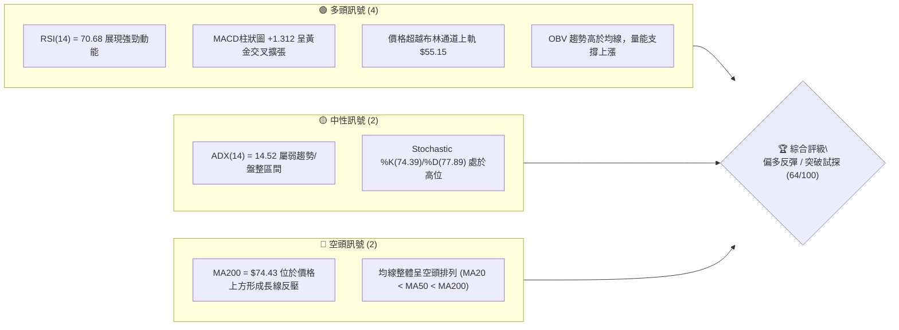
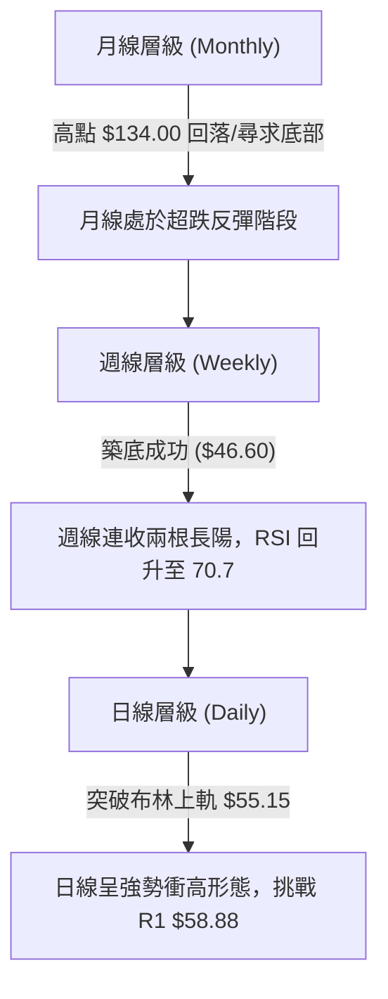
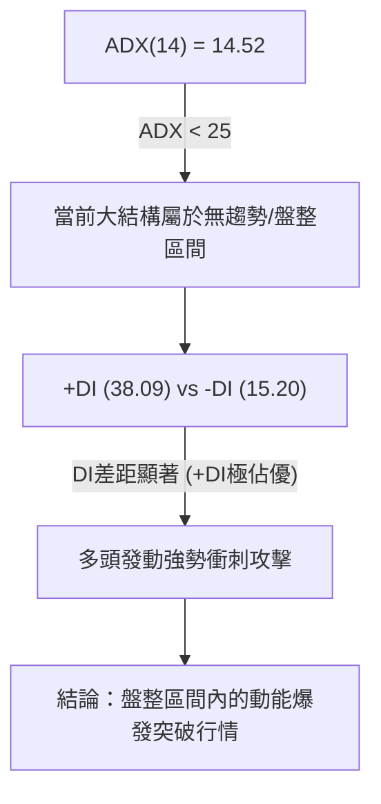
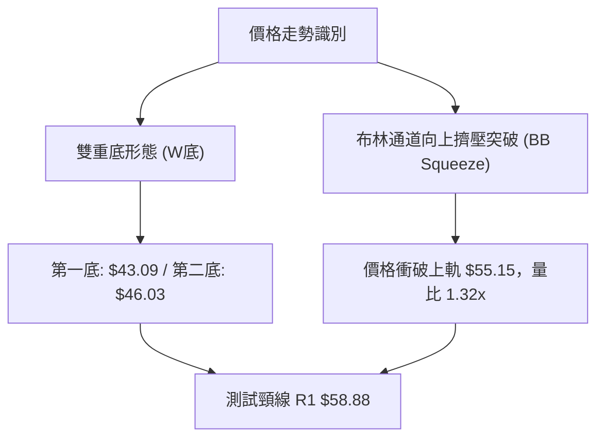
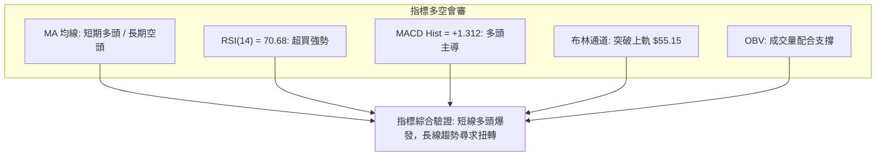
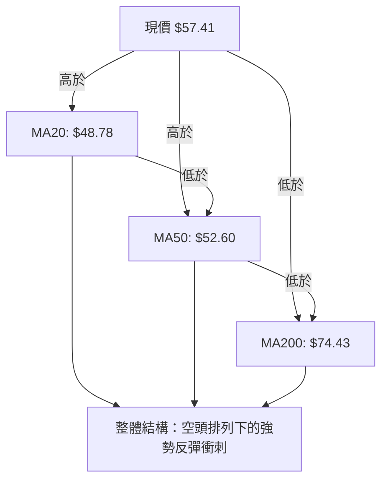
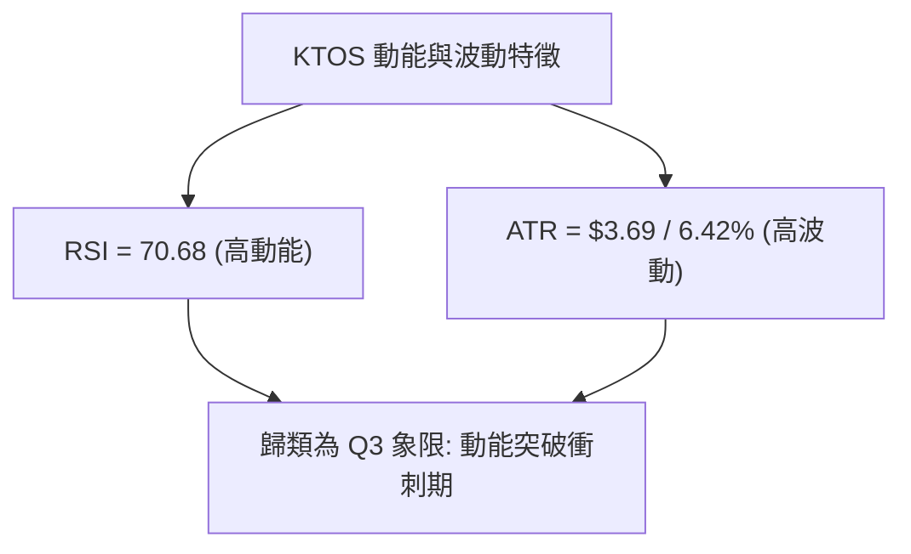
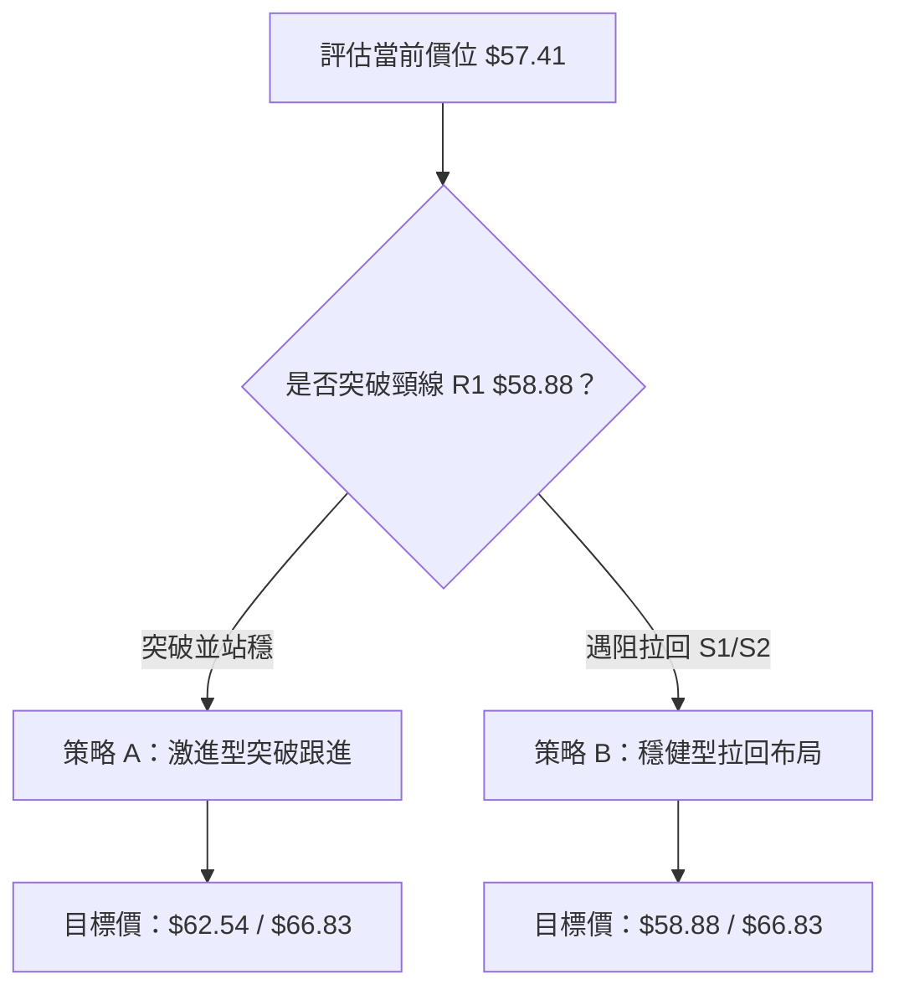
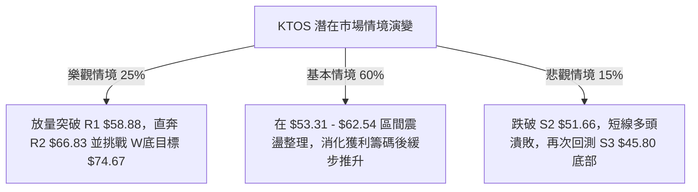

# KTOS 技術分析報告

> **報告日期**：2026-08-07 ｜ **語言**：繁體中文 ｜ **數據來源**：Yahoo Finance ｜ **當前價格**：$57.41

---

## 目錄

| 章節 | 內容 |
|------|------|
| [1. 技術面概覽](#1-技術面概覽) | 訊號儀表板、核心指標、評分卡 |
| [2. 趨勢分析](#2-趨勢分析) | 多時框趨勢、長中短期走勢 |
| [3. 圖表形態分析](#3-圖表形態分析) | 形態識別、K線組合、目標價 |
| [4. 支撐與阻力](#4-支撐與阻力) | 關鍵價位、斐波那契回調 |
| [5. 技術指標深度解讀](#5-技術指標深度解讀) | MA/RSI/MACD/布林/成交量 |
| [6. 動能與波動率](#6-動能與波動率) | 動能評估、ATR、Beta |
| [7. 多時框架總結](#7-多時框架總結) | 時框架評分矩陣 |
| [8. 交易策略建議](#8-交易策略建議) | 多空策略、風險報酬比 |
| [9. 風險提示與監控](#9-風險提示與監控) | 監控指標、風險場景 |

---

## 1. 技術面概覽

### 🎯 技術訊號儀表板



### 📊 核心指標速覽表

| 指標類別 | 指標名稱 | 當前數值 | 訊號 | 解讀 |
|----------|----------|----------|------|------|
| **價格** | 當前價格 | $57.41 | 🟢 | 站上 MA20 與 MA50，突破布林上軌 $55.15 |
| **均線** | MA20 | $48.78 | 🟢 | 價格在上方 (+17.69%)，短線強勢支撐 |
| **均線** | MA50 | $52.60 | 🟢 | 價格在上方 (+9.14%)，中期轉強 |
| **均線** | MA200 | $74.43 | 🔴 | 價格在下方 (-22.87%)，長期下行趨勢反壓 |
| **動能** | RSI(14) | 70.68 | 🔴/🟢 | 進入超買區 (>70)，短線買盤強勁但需防回吐 |
| **動能** | MACD | 0.297 | 🟢 | Signal -1.015，柱狀圖 +1.312 多頭擴張 |
| **波動** | ATR(14) | $3.69 | 🟡 | 佔股價 6.42%，日內波動劇烈 |
| **趨勢** | ADX(14) | 14.52 | 🟡 | ADX < 25 表示大格局仍為盤整/底部築底 |

### 🏆 技術評分卡

```
╔══════════════════════════════════════════════════════════════╗
║             技術評分卡 — KTOS (2026-08-07)                   ║
╠══════════════════════════════════════════════════════════════╣
║ 趨勢強度      ███████░░░░░░░░░░░░░  45/100  🟡 弱趨勢/築底 ║
║ 動能指標      ████████████████░░░░  82/100  🟢 動能十分強勁 ║
║ 支撐穩定度    █████████████░░░░░░░  68/100  🟢 底部位階紮實 ║
║ 成交量配合    ███████████████░░░░░  75/100  🟢 攻擊量能釋放 ║
║ 形態完整度    ██████████████░░░░░░  70/100  🟢 W底打底成形  ║
║ 均線排列      ████████░░░░░░░░░░░░  42/100  🔴 長期空頭格局 ║
╠══════════════════════════════════════════════════════════════╣
║ 綜合評分      █████████████░░░░░░░  64/100  偏多反彈       ║
╚══════════════════════════════════════════════════════════════╝
```

---

## 2. 趨勢分析

### 🌐 多時框趨勢分析



### 📈 長期趨勢 — 12個月走勢圖（Unicode）

```
KTOS 月線走勢圖（過去12個月 2025-08 至 2026-08）
價格軸 ($)
$110.00 ┤                             
$100.00 ┤                 ●(2026-01: 103.01)
$90.00  ┤       ●    ●                        
$80.00  ┤            
$70.00  ┤                 ●                   ●(2026-03: 70.51)
$60.00  ┤  ●                                       ●        ●(現在: 57.41)
$50.00  ┤                                              ●
$40.00  ┤                                                   ●(2026-07: 46.60)
        └─────────────────────────────────────────────────────────────
          M08  M09  M10  M11  M12  M01  M02  M03  M04  M05  M06  M07  M08
```

#### 走勢特徵分析表

| 階段 | 時間區間 | 收盤價變化 | 漲跌幅 | 走勢特徵分析 |
|------|----------|------------|--------|--------------|
| 主升段 | 2024-08 ~ 2026-01 | $22.94 → $103.01 | +349.0% | 受國防預算與無人系統需求帶動，呈現強勁主升段行情 |
| 回檔修正 | 2026-01 ~ 2026-07 | $103.01 → $46.60 | -54.76% | 高估值修正與獲利結利賣壓，一路破位降至 52 週低點區 |
| 打底反彈 | 2026-07 ~ 2026-08 | $46.60 → $57.41 | +23.20% | 在 $43.09~$46.60 區域完成底部打底，放量強勢反彈 |

### 📊 中期趨勢（週線分析）

從 2026 年 7 月 19 日以來的近幾週走勢觀察：
- **2026-07-19**：收盤 $46.03，RSI 47.6，市場在 52 週低點 $43.09 上方尋求支撐。
- **2026-08-02**：收盤 $46.60，成交量 14.8M，成交量萎縮至極致，形成地量低點。
- **2026-08-09**：收盤 $57.41，成交量放大至 24.16M，一舉爆發大陽線，MACD 柱狀圖暴升至 +1.312，RSI 跳升至 70.7，確認中期 V 型反轉與底部成立。

```
中期阻力與支撐示意圖
阻力位 R3: $69.91  ───┐
阻力位 R2: $66.83  ───┼─► 中期強反壓區
阻力位 R1: $58.88  ───┘   ◄◄ 目前正臨此關鍵頸線突破點
現價區間   $57.41  ▲
支撐位 S1: $53.31  ───┐
支撐位 S2: $51.66  ───┼─► 短中期強支撐保護區
支撐位 S3: $45.80  ───┘
```

### ⚡ 趨勢強度評估（ADX 解讀）



#### ADX 強度對照與 KTOS 現狀

| ADX 數值區間 | 市場狀態 | KTOS 當前位置 | 交易策略指示 |
|--------------|----------|---------------|--------------|
| 0 – 20 | 弱趨勢 / 無方向盤整 | **14.52** 🟢 | 區間震盪突破初期，關注動能延續性 |
| 20 – 25 | 趨勢正在萌芽 | — | 等待突破確認後加碼 |
| 25 – 50 | 強勁單邊趨勢 | — | 順勢持有，逢拉回做多 |
| > 50 | 極端趨勢 / 過熱 | — | 謹慎移動止盈 |

---

## 3. 圖表形態分析

### 🔍 形態識別系統



#### 形態信心度與目標價評估

| 形態名稱 | 信心度 | 判斷依據（引用數據） | 完成度 | 目標價（附計算式） |
|----------|--------|----------------------|--------|--------------------|
| **雙重底 (W底)** | 70% | 一底 $43.09 (52W Low) 與二底 $46.03 (2026-07-19)，頸線設於近一年高點聚類 R1 $58.88 | 85% | 頸線 $58.88 + 形態高度 ($58.88 - $43.09 = $15.79) = **$74.67** (精確對應 MA200 $74.43) |
| **布林帶上軌突破** | 85% | 價格 $57.41 升破布林上軌 $55.15，最新量比 1.32x，OBV 呈向上趨勢 | 100% | 向上測距至波段阻力位 R2 **$66.83** |

### 🕯️ 重要 K 線形態分析

| 日期 / 時框 | 收盤價 | K線形態 | 解讀 | 訊號 |
|-------------|--------|---------|------|------|
| 2026-07-26 | $47.35 | 止跌十字星 | 在 52 週低點附近賣壓竭盡 | 🟡 底部訊號 |
| 2026-08-02 | $46.60 | 築底縮量錘子線 | 買盤進場支撐，成交量降至 14.79M 底部蓄勢 | 🟢 買點孕育 |
| 2026-08-09 | $57.41 | 大陽突破線 (週線) | 爆量長陽吞噬前數週 K 線，單週大漲 +23.2%，買盤全面主導 | 🟢 突破買進 |

### 📉 ASCII 走勢形態示意圖

```
KTOS 日線 / 週線 W底突破形態
價位 ($)
$66.83 ┤                                        [W底測量目標 R2]
$58.88 ┤--------------- 頸線 R1 ---------------● (目前測試中 $57.41)
$52.60 ┤             ● (波段反彈)            ／
$48.78 ┤            ／ \                    ／
$46.03 ┤   ●       ／   \                  ● (第二底 2026-07)
$43.09 ┤────\─────／─────\────────────────/──── [52週低點 / 第一底 2026-06]
```

### 🎯 形態目標價計算

1. **W 底形態目標價**：
   $$\text{頸線價格} (R1) = \$58.88$$
   $$\text{形態底部} = \$43.09$$
   $$\text{形態高度} = \$58.88 - \$43.09 = \$15.79$$
   $$\text{最小測量目標價} = \$58.88 + \$15.79 = \mathbf{\$74.67}$$
   *(計算結論：該目標價與 MA200 均線位置 \$74.43 極度吻合)*

---

## 4. 支撐與阻力

### 🗺️ 關鍵價位分布圖（Unicode）

```
KTOS 價位結構分布圖
═══════════════════════════════════════════════════════════
$134.00 ║████████████████████████████████████║ 52週歷史高點 (0.0% Fib)
$77.82  ║████████████████████████            ║ 61.8% Fib 回調位
$74.43  ║██████████████████████              ║ MA200 長線強反壓
$69.91  ║██████████████                      ║ 阻力 R3
$66.83  ║████████████                        ║ 阻力 R2 (波段高點聚類)
$62.54  ║█████████                           ║ 78.6% Fib 回調位
$58.88  ║██████                              ║ 關鍵阻力 R1 (頸線突破點)
$57.41  ╠════════════════════════════════════╣ ◄ 當前價格
$55.15  ║▓▓▓▓▓                               ║ 布林通道上軌
$53.31  ║▓▓▓▓▓▓▓▓▓                          ║ 近期支撐 S1
$51.66  ║▓▓▓▓▓▓▓▓▓▓▓▓                        ║ 關鍵支撐 S2 (MA50 $52.60 護航)
$45.80  ║▓▓▓▓▓▓▓▓▓▓▓▓▓▓▓▓                    ║ 強支撐 S3 (底部區間)
$43.09  ║▓▓▓▓▓▓▓▓▓▓▓▓▓▓▓▓▓▓▓▓                ║ 52週歷史低點 (100.0% Fib)
═══════════════════════════════════════════════════════════
```

### 🚧 阻力位分析表

| 阻力級別 | 價位 | 形成原因 | 突破難度 | 重要性 |
|----------|------|----------|----------|--------|
| **R1** | **$58.88** | 近一年波段高點聚類、W底頸線位置 (+2.56%) | 中等 | 🔴🔴🔴 突破即確認中期轉多 |
| **R2** | **$66.83** | 近一年波段高點聚類、MA120 ($65.31) 附近 (+16.41%) | 偏高 | 🔴🔴🔴🔴 波段第一目標 |
| **R3** | **$69.91** | 近一年波段高點聚類、接近 $70 整數關卡 (+21.77%) | 高 | 🔴🔴🔴 多頭波段攻勢延伸點 |

### 🛡️ 支撐位分析表

| 支撐級別 | 價位 | 形成原因 | 守住機率 | 重要性 |
|----------|------|----------|----------|--------|
| **S1** | **$53.31** | 近一年波段低點聚類、短線拉回第一支撐 (-7.14%) | 75% | 🟢🟢🟢 短線多頭防線 |
| **S2** | **$51.66** | 波段低點聚類、MA50 ($52.60) 區域 (-10.02%) | 85% | 🟢🟢🟢🟢 中線多空分水嶺 |
| **S3** | **$45.80** | 波段低點聚類、靠近 52 週低點區 (-20.23%) | 92% | 🟢🟢🟢🟢🟢 長線最終防線 |

### 📐 斐波那契回調位分析

依據 52 週高低點區間（高點 **$134.00** → 低點 **$43.09**）精確計算：

| 斐波那契層級 | 價位 | 當前相對位置與意義解讀 |
|--------------|------|------------------------|
| 0.0% (52W High) | $134.00 | 歷史極限高點 |
| 23.6% | $112.55 | 長期牛市恢復區 |
| 38.2% | $99.27 | 強勢反彈多頭目標 |
| 50.0% | $88.55 | 中長線多空對峙中樞 |
| 61.8% | $77.82 | 黃金分割反壓區（與 MA200 $74.43 構成重疊阻力） |
| **78.6%** | **$62.54** | **上方首要斐波那契關卡（現價 $57.41 正向此推進）** |
| **100.0% (52W Low)**| **$43.09** | **底部絕對錨點** |

*解讀*：當前價格 $57.41 處於 100.0% ($43.09) 與 78.6% ($62.54) 回調位之間。成功站穩 R1 ($58.88) 後，首要攻防點即為 78.6% 回調位 **$62.54**。

---

## 5. 技術指標深度解讀

### 🎛️ 指標訊號總纜



### 📈 移動平均線排列分析



- **短天期均線**：MA5 ($52.09)、MA10 ($49.59)、MA20 ($48.78) 全數急促向上拐頭，現價高出 MA20 達 17.69%，短線呈現強攻態勢。
- **長天期均線**：MA120 ($65.31) 與 MA200 ($74.43) 仍下行，提供中長期壓制力。

### 📉 RSI(14) 分析

- **當前數值**：**70.68**
- **進度條**：`███████████████░░░░░ 70.68%` 🔴 **（過熱/超買區）**
- **背離判斷**：日線與週線 RSI 同步衝高（週 RSI 達 70.7），**無明顯頂背離或底背離**，屬典型強勢動能推升，惟需注意短線漲幅過大後的均線乖離修正。

### 📊 MACD(12/26/9) 訊號解讀

- **MACD 快線**：0.297
- **Signal 慢線**：-1.015
- **柱狀圖 (Histogram)**：**+1.312** 🟢
- **解讀**：MACD 快線已由下往上穿越慢線形成黃金交叉，且柱狀圖正值持續擴張至 +1.312，顯示多頭攻擊動能充沛。

### 📦 布林通道分析

```
布林通道現狀示意圖
$55.15 ┤----------------------- 上軌 (BB Upper)
$57.41 ┤ ▲ 現價 ($57.41, %B = 1.18, 穿透上軌)
$48.78 ┤----------------------- 中軌 (MA20)
$42.41 ┤----------------------- 下軌 (BB Lower)
```

- **%B 指標**：**1.18**（已突破上軌 1.0 臨界值）
- **通道狀態**：布林帶原本處於收斂狀態，現隨股價放量大陽線衝破上軌 $55.15，展開通道開口喇叭擴展（Band Expansion），為典型動能突破訊號。

### 💹 成交量分析（量價配合度）

- **最新成交量**：5,252,073 股
- **20 日均量**：3,978,349 股（**量比：1.32x**）
- **50 日均量**：4,963,727 股
- **OBV 趨勢**：OBV 大於其移動平均線，且週成交量顯著放大（近一週 24.16M 股），量能充分支撐價格上衝，無量價背離隱憂。

---

## 6. 動能與波動率

### ⚡ 動能評估四象限

| 象限 | 動能強度 | 波動率 | KTOS 所在位置 | 戰術評估 |
|------|----------|--------|---------------|----------|
| **Q1** | 強 | 低 | — | 最佳穩健趨勢持股 |
| **Q2** | 弱 | 低 | — | 沉悶盤整，觀望為主 |
| **Q3** | **強** | **高** | **✓ (KTOS 當前象限)** | **高動能/高波動，適合破位跟進，需設嚴格止損** |
| **Q4** | 弱 | 高 | — | 高風險下跌段，嚴禁摸底 |



### 📊 ATR 波動率分析

- **ATR(14)**：**$3.69**（佔當前股價 **6.42%**）
- **風控止損參考距離**：
  - **緊密止損 (1.0 ATR)**：$57.41 - $3.69 = **$53.72**（接近 S1 $53.31）
  - **標準止損 (1.5 ATR)**：$57.41 - $5.54 = **$51.87**（精確護航 S2 $51.66）
  - **寬鬆止損 (2.0 ATR)**：$57.41 - $7.38 = **$50.03**

### 📐 Beta 與市場相關性

- **Beta 係數**：**1.106**
- **解讀**：波動度略高於整體大盤（S&P 500）。在大盤走多時，KTOS 具備較高彈性與超額收益（Alpha）潛力。

---

## 7. 多時框架總結

### 📋 時框架評分表

| 時框架 | 趨勢方向 | 動能狀態 | 均線排列 | 形態識別 | 綜合評分 | 建議戰術 |
|--------|----------|----------|----------|----------|----------|----------|
| **月線 (MN)** | 🔴 下行 / 尋底 | 🟡 止跌打底 | 🔴 空頭排列 | 長期高位回檔 | **50/100** | 觀察尋底 |
| **週線 (WK)** | 🟢 V型反彈 | 🟢 強勁 (RSI 70.7) | 🟡 交叉築底 | W底打底成形 | **68/100** | 中線逢拉回布局 |
| **日線 (D1)** | 🟢 攻擊突破 | 🟢 衝刺 (RSI 70.7) | 🟢 站上短均線 | 布林上軌突破 | **75/100** | 短線順勢突破操作 |

### 🔲 綜合訊號矩陣

```
┌──────────────────────────────────────────────────────────┐
│                   多時框架訊號收斂矩陣                    │
├──────────────┬───────────────┬───────────────┬───────────┤
│ 時框架       │ 短期 (日線)   │ 中期 (週線)   │ 長期 (月線)│
├──────────────┼───────────────┼───────────────┼───────────┤
│ 訊號方向     │  🟢 強勢看多  │  🟢 偏多築底  │  🟡 中性  │
│ 關鍵價位     │  $55.15 上軌  │  $58.88 頸線  │  $74.43 MA│
└──────────────┴───────────────┴───────────────┴───────────┘
```

### ⚖️ 多時框收斂結論

依據多時框收斂規則：當前 ADX(14) = 14.52 (< 25)，整體大格局屬於**盤整/築底階段**。然而，日線與週線層級展現極強的短中期爆發力（突破布林上軌 $55.15、MACD 柱狀圖 +1.312），顯示股價正自 52 週低點區展開強烈反彈攻勢。

**收斂評級**：**偏多反彈 / 突破試探（綜合評分 64/100）**。主要交易邏輯為「順應短中期強勢動能，試探突破 R1 頸線 $58.88，挑戰 R2 $66.83」。

---

## 8. 交易策略建議

### 🗺️ 策略決策流程圖



### 🧭 策略路由

**當前主策略方向 = 多頭反彈突破策略（依評分 64/100 分流）**

### 🎯 價格情境階梯（Price Scenarios）

| 觸發條件 | 下一目標 | 後續延伸 | 情境含義 |
|----------|----------|----------|----------|
| 放量突破阻力 R1 $58.88 | 78.6% Fib $62.54 | 阻力 R2 $66.83 | 雙底型態確立，多頭波段展開 |
| 位於 $53.31 – $58.88 間震盪 | 突破 R1 $58.88 | 測試支撐 S1 $53.31 | 頸線關卡前消化獲利賣壓 |
| 跌破關鍵支撐 S1 $53.31 | 支撐 S2 $51.66 | 支撐 S3 $45.80 | 短線動能衰竭，拉回測底 |

### 📊 情境機率分佈

| 情境 | 機率 | 主要依據 |
|------|------|----------|
| **突破上行 (挑戰 R1/R2)** | **55%** | RSI(14)=70.68 動能強勁、MACD 柱狀圖 +1.312 擴張、成交量比 1.32x |
| **區間震盪 ($53.31–$58.88)** | **30%** | ADX(14)=14.52 顯示整體趨勢尚弱、R1 關卡反壓密集 |
| **回落測試 S2** | **15%** | 短線 RSI 進入超買區，若大盤轉弱易引發拉回 |

### 🟢 主策略詳情

```
╔══════════════════════════════════════════════════════════════╗
║                   主推策略：多頭操作方案                     ║
╚══════════════════════════════════════════════════════════════╝
```

| 策略要素 | 策略 A（激進型：突破跟進） | 策略 B（穩健型：拉回買進） |
|----------|----------------------------|----------------------------|
| **進場條件** | 突破 R1 $58.88 或現價 $57.41 少量建倉 | 拉回至支撐 S1 $53.31 ~ S2 $51.66 止跌時 |
| **進場價格** | **$57.41** | **$53.31** |
| **目標價 T1** | **$62.54** (78.6% Fib, +8.9%) | **$58.88** (阻力 R1, +10.4%) |
| **目標價 T2** | **$66.83** (阻力 R2, +16.4%) | **$66.83** (阻力 R2, +25.4%) |
| **止損價格** | **$53.31** (支撐 S1, -7.1%) | **$49.50** (破 MA10/S2, -7.1%) |
| **風險報酬比** | T1 = **1.25 : 1** / T2 = **2.30 : 1** | T1 = **1.46 : 1** / T2 = **3.55 : 1** |
| **預估成功率** | 55% | 65% |
| **建議倉位** | 10% – 15% | 15% – 20% |

### 🔴 反向風險觸發點（對沖提示）

- **觸發條件**：若股價收盤跌破關鍵支撐 S2 **$51.66**（且單日成交量 > 5.0M 股）。
- **風控處置**：多頭策略失效，建議即刻全面止損離場，短線轉為觀望或對沖保護。

### ⭐ 整體訊號強度評星

```
做多訊號強度：★★██☆  (3.8/5星)
做空訊號強度：★☆☆☆☆  (1.5/5星)
整體可信度：  ★★██☆  (3.8/5星)
```

---

## 9. 風險提示與監控

### ✅ 關鍵監控指標 Checklist

```
╔══════════════════════════════════════════════════════════════╗
║                   每日交易監控清單 (Checklist)               ║
├──────────────────────────────────────────────────────────────┤
║ [ ] 股價是否順利收高於阻力位 R1 $58.88？                    ║
║ [ ] RSI(14) 是否在高位出現高點背離訊號？                     ║
║ [ ] 日成交量是否維持在 20日均量 (3.98M) 以上？               ║
║ [ ] 價格回檔時，支撐位 S1 $53.31 是否有效守住？             ║
║ [ ] MACD 柱狀圖 (+1.312) 是否開始縮頭？                      ║
╚══════════════════════════════════════════════════════════════╝
```

### ⚠️ 風險場景分析



### 🛡️ 風險管理重要提醒

1. **波動率風控**：KTOS 當前 ATR 達 **$3.69**（6.42%），屬於高波動標的。投資人應依據 ATR 調降單筆交易倉位，單一部位風險暴露建議不超過總資金的 2%。
2. **均線反壓風險**：長線 MA200 仍位於 **$74.43** 呈下行趨勢，若股價向該區域推進，將面臨極大解套賣壓，切勿盲目追高。
3. **過熱拉回風險**：日線 RSI 已達 **70.68**，布林 %B 達 **1.18**，短線過熱現象明顯，分批逢低（如拉回至 $53.31 - $55.15）布局之勝率遠高於高位追漲。

---

## 📋 報告總結

```
╔══════════════════════════════════════════════════════════════╗
║                 KTOS 技術分析報告總結                        ║
════════════════════════════════════════════════════════════════
 報告日期：2026-08-07
 當前價格：$57.41
 分析評級：🟢 偏多反彈 / 突破試探 (評分: 64/100)

 關鍵價位結構：
 ├─ 長期趨勢：🔴 下行打底 (MA200 反壓 $74.43)
 ├─ 中期趨勢：🟢 V型反彈 (W底築底完成)
 ├─ 短期趨勢：🟢 強勢突破 (衝破布林上軌 $55.15)
 ├─ 關鍵支撐：S1 $53.31 / S2 $51.66 / S3 $45.80
 ├─ 關鍵阻力：R1 $58.88 / R2 $66.83 / R3 $69.91
 └─ 分析師共識目標：$108.62 (均值) / $60.00 (最低)

 最優策略組合：
 1. 🥇 首選策略：拉回支撐 S1 $53.31 布局做多，目標 R1 $58.88 / R2 $66.83，止損 $49.50
 2. 🥈 突破策略：若強勢帶量突破 R1 $58.88，順勢跟進，目標 78.6% Fib $62.54 / R2 $66.83
 3. 🥉 嚴格風控：若收盤跌破 S2 $51.66，多頭格局失效，即刻止損離場
╚══════════════════════════════════════════════════════════════╝
```

---

> ⚠️ **免責聲明**：本報告為 AI 自動生成之技術分析，所有數據及估算均基於提供的歷史價格資訊。本報告**僅供研究與學術參考**，**不構成任何投資建議**。投資有風險，入市需謹慎。

*報告生成時間：2026-08-07 ｜ 數據來源：Yahoo Finance ｜ 分析框架：多時框技術分析*