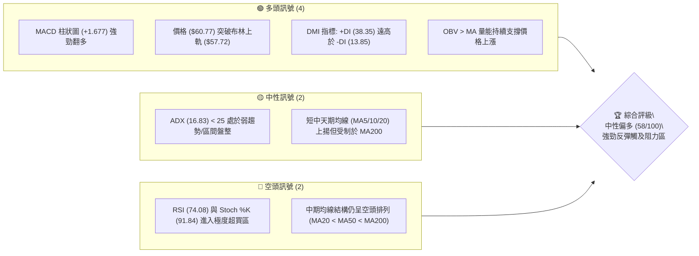
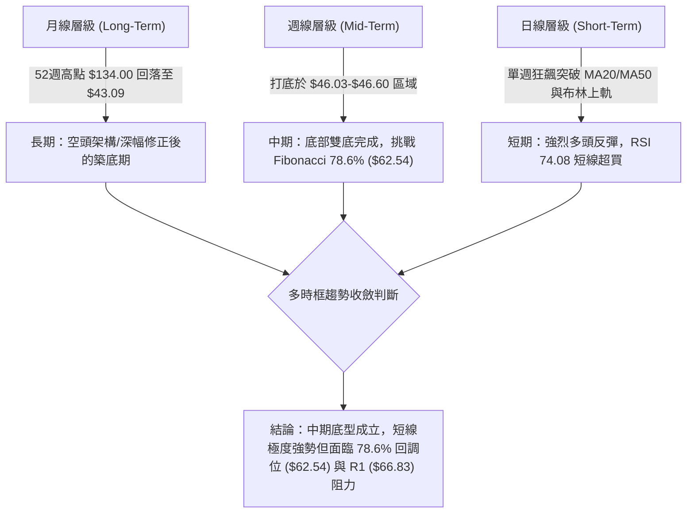
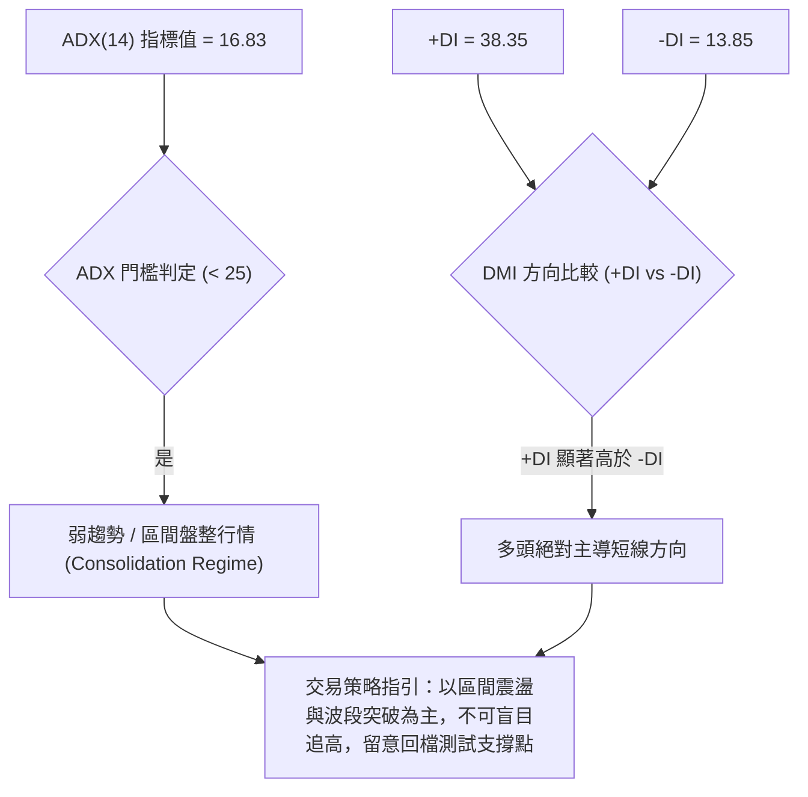
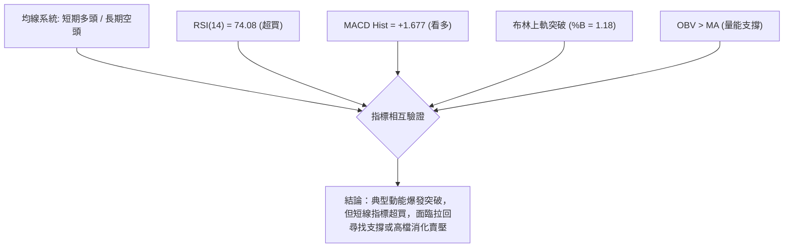
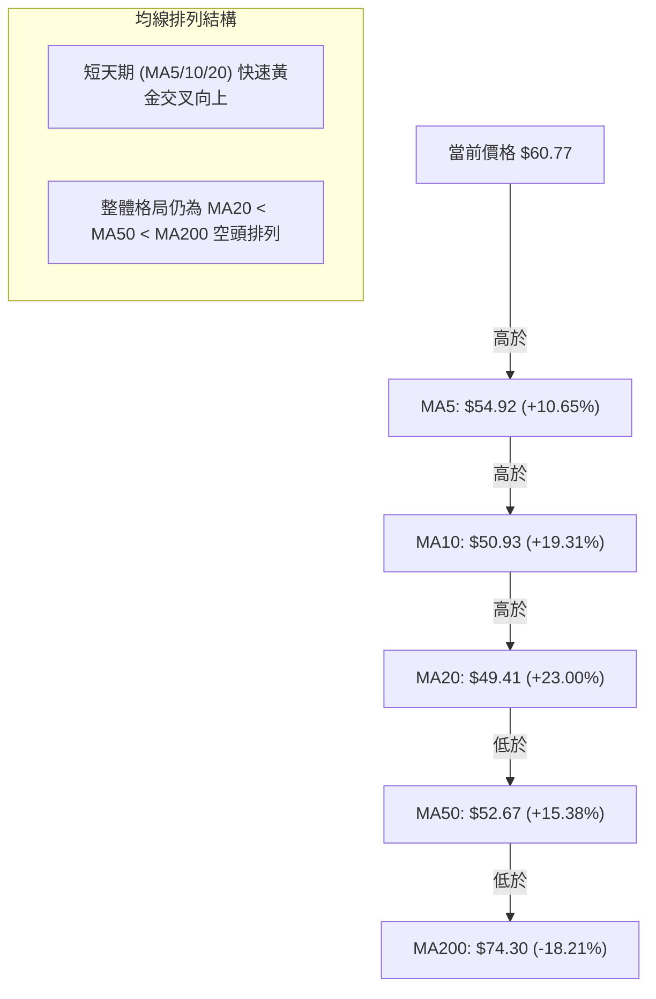
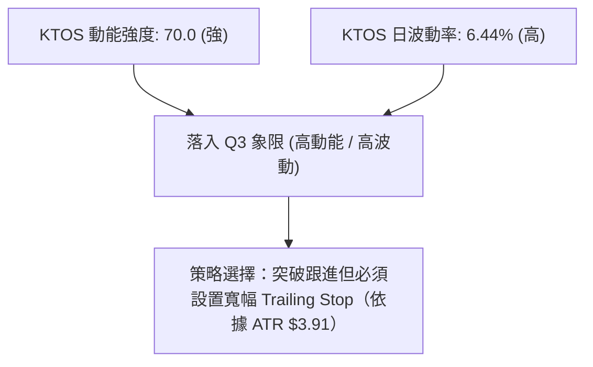
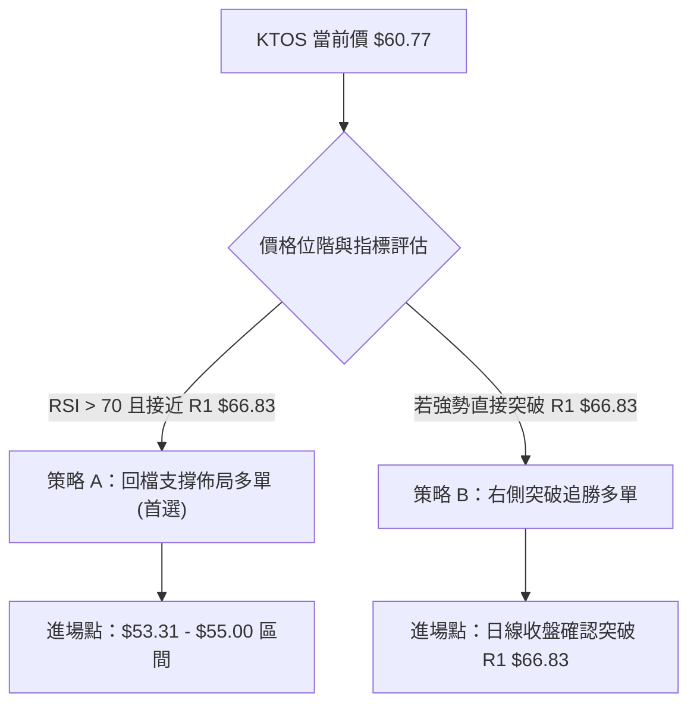
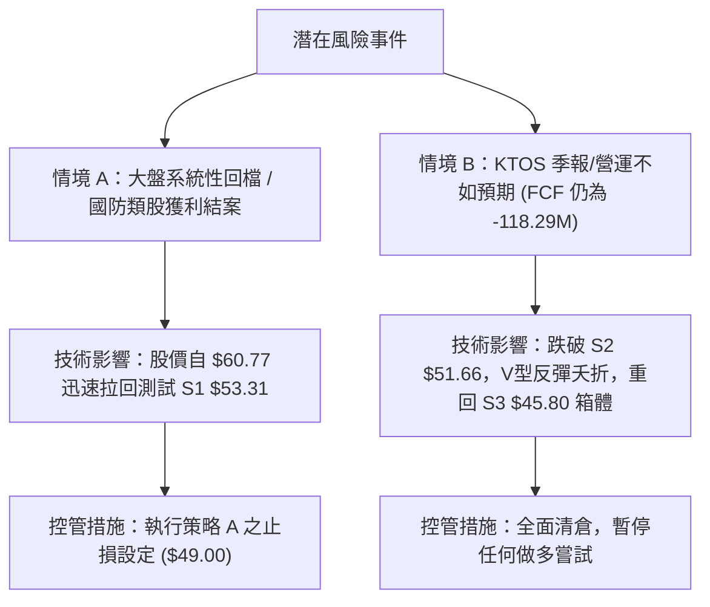

# KTOS 技術分析報告

> **報告日期**：2026-08-09 ｜ **語言**：繁體中文 ｜ **數據來源**：Yahoo Finance ｜ **當前價格**：$60.77

---

## 目錄

| 章節 | 內容 |
|------|------|
| [1. 技術面概覽](#1-技術面概覽) | 訊號儀表板、核心指標、評分卡 |
| [2. 趨勢分析](#2-趨勢分析) | 多時框趨勢、長中短期走勢 |
| [3. 圖表形態分析](#3-圖表形態分析) | 形態識別、K線組合、目標價 |
| [4. 支撐與阻力](#4-支撐與阻力) | 關鍵價位、斐波那契回調 |
| [5. 技術指標深度解讀](#5-技術指標深度解讀) | MA/RSI/MACD/布林/成交量 |
| [6. 動能與波動率](#6-動能與波動率) | 動能評估、ATR、Beta |
| [7. 多時框架總結](#7-多時框架總結) | 時框架評分矩陣 |
| [8. 交易策略建議](#8-交易策略建議) | 多空策略、風險報酬比 |
| [9. 風險提示與監控](#9-風險提示與監控) | 監控指標、風險場景 |

---

## 1. 技術面概覽

### 🎯 技術訊號儀表板



### 📊 核心指標速覽表

| 指標類別 | 指標名稱 | 當前數值 | 訊號 | 解讀 |
|----------|----------|----------|------|------|
| **價格** | 當前價格 | $60.77 | 🟢 | 位於52週區間 19.4% 位置，短線自低點 $43.09 強勁反彈 |
| **均線** | MA20 | $49.41 | 🟢 | 價格高於 MA20 達 +23.00%，短線呈現陡峭斜率向上 |
| **均線** | MA50 | $52.67 | 🟢 | 價格已站上 MA50 (+15.38%)，短中期基底已築成 |
| **均線** | MA200 | $74.30 | 🔴 | 價格低於 MA200 (-18.21%)，長期趨勢線仍形成上檔壓力 |
| **動能** | RSI(14) | 74.08 | 🔴 | 超買區 (>70)，提示短線急漲後有回檔或消化獲利賣壓需求 |
| **動能** | MACD | 1.082 | 🟢 | DIF 線穿越 Signal 線，柱狀圖 (+1.677) 擴張，多頭動能強勁 |
| **動能** | Stochastic | %K: 91.84 | 🔴 | 位於高檔超買區 (%K: 91.84, %D: 76.62)，防範高檔鈍化後交叉 |
| **趨勢** | ADX(14) | 16.83 | 🟡 | ADX < 25 顯示整體行情屬盤整反彈性質而非成熟的大牛市趨勢 |
| **通道** | 布林通道 | Upper $57.72 | 🟢 | %B 為 1.18，價格向上突破布林上軌，呈現強烈動能擴張 |
| **波動** | ATR(14) | $3.91 | 🟡 | 每日平均波動率達 6.44%，提供充足短線交易獲利空間 |
| **成交量** | 20日均量比 | 1.17x | 🟢 | 最新量能 4.778M 高於 20 日均量 (4.099M)，價漲量增配合良好 |

### 🏆 技術評分卡

```
╔══════════════════════════════════════════════════════════════════╗
║              KTOS 技術綜合評分卡 (2026-08-09)                    ║
╠══════════════════════════════════════════════════════════════════╣
║ 趨勢強度 (ADX/DMI)   ▓▓▓▓▓▓▓▓░░░░░░░░░░░░  42/100  🟡 弱趨勢反彈  ║
║ 動能指標 (RSI/MACD)  ▓▓▓▓▓▓▓▓▓▓▓▓▓▓░░░░░░  70/100  🟢 動能強勁    ║
║ 支撐穩定度 (S1-S3)   ▓▓▓▓▓▓▓▓▓▓▓▓░░░░░░░░  60/100  🟢 底層支撐穩  ║
║ 成交量配合 (OBV/VOL) ▓▓▓▓▓▓▓▓▓▓▓▓█░░░░░░░  65/100  🟢 價漲量增    ║
║ 形態完整度 (底型/突破) ▓▓▓▓▓▓▓▓▓▓▓▓░░░░░░░░  60/100  🟢 雙底打底完成 ║
║ 均線排列 (MA5-MA200) ▓▓▓▓▓▓▓█░░░░░░░░░░░░  38/100  🔴 均線空頭排列║
╠══════════════════════════════════════════════════════════════════╣
║ 綜合技術評分         ▓▓▓▓▓▓▓▓▓▓▓█░░░░░░░░  58/100  🟡 中性偏多    ║
╚══════════════════════════════════════════════════════════════════╝
```

---

## 2. 趨勢分析

### 🌐 多時框趨勢分析



### 📈 長期趨勢 — 12個月走勢圖（Unicode）

```
KTOS 12個月價格走勢與關鍵轉折圖
價格 ($)
$105 ┤                      ● (2026-01: $103.01)
$95  ┤        ● (2025-09: $91.37)
$85  ┤        │  ●          │  ● (2026-02: $86.18)
$75  ┤        │  │  ●  ●    │  │  
$65  ┤  ●     │  │  │  │    │  │  ● (2026-03: $70.51)
$55  ┤  │     │  │  │  │    │  │  │  ● (2026-04: $63.05)
$45  ┤  │     │  │  │  │    │  │  │  │  ● (2026-06: $49.86)
$35  ┤  │     │  │  │  │    │  │  │  │  │  ● (2026-07: $46.60)
$25  ┤  ● (2024-08: $22.94) │  │  │  │  │  │  ▲ (現在 2026-08: $60.77)
     └─────────────────────────────────────────────────────────────
       24-08 25-09 25-11 25-12 26-01 26-02 26-03 26-04 26-06 26-07 26-08
```

#### 走勢特徵分析表格

| 階段 | 時間區間 | 價格區間 | 漲跌幅 | 走勢特徵分析 |
|------|----------|----------|--------|--------------|
| **1. 主升段** | 2024-08 至 2025-09 | $22.94 → $91.37 | +298.3% | 動能極度強勁，受國防合約與無人機技術突破推升 |
| **2. 高檔震盪**| 2025-09 至 2026-01 | $91.37 → $103.01 | +12.7% | 衝高至歷史高點附近後出現震盪，換手頻繁 |
| **3. 主跌段** | 2026-01 至 2026-07 | $103.01 → $46.60 | -54.8% | 跌破 MA200，呈現典型高高低低（Lower Highs & Lower Lows） |
| **4. 築底反彈**| 2026-07 至 2026-08 | $46.60 → $60.77 | +30.4% | 放量強勁反彈，長陽線吞噬前幾週陰線，短期完成 V 型/雙底打底 |

### 📊 中期趨勢（週線分析）

從近 20 週數據觀察，KTOS 在 2026 年 6 月底至 7 月底期間，於 $46.03 – $47.35 區間連續四周多次下探，均獲得強烈買盤支撐，未跌破 52 週低點 $43.09。

```
週線等級壓力與支撐示意圖：
[R3]  $72.70 ════════════════════════════════════════════════ (近一年波段高點聚類 / 接近 MA200 $74.30)
[R2]  $69.91 ════════════════════════════════════════════════ (2026年4月初高點聚類)
[R1]  $66.83 ════════════════════════════════════════════════ (2026年5月底反彈高點 $64.13 上方壓力區)
[現價] $60.77 ◄────── (最新週大陽線拉升，爆量 28.95M 股)
[S1]  $53.31 ════════════════════════════════════════════════ (前波突破頸線位 / 靠近 MA50 $52.67)
[S2]  $51.66 ════════════════════════════════════════════════ (2026年5月中旬低點聚類)
[S3]  $45.80 ════════════════════════════════════════════════ (近20週雙底支撐區 $46.03-$46.60)
```

### ⚡ 趨勢強度評估（ADX 解讀）



| ADX 數值範圍 | 趨勢狀態 | KTOS 當前狀態 (16.83) | 操作指導 |
|--------------|----------|------------------------|----------|
| **0 – 20** | 無趨勢 / 極弱盤整 | **✓ 當前在此區間** | 採用均值回歸或區間上界/下界波段策略 |
| **20 – 25** | 趨勢形成中 | 否 | 觀察是否突破並帶動 ADX 向上穿越 25 |
| **25 – 50** | 強勁趨勢行情 | 否 | 順勢操作，持有趨勢部位 |
| **> 50** | 極端趨勢 / 過熱 | 否 | 注意反轉風險 |

---

## 3. 圖表形態分析

### 🔍 形態識別系統


#### 形態信心度評估表

| 形態類別 | 信心度 | 判斷依據（引用數據） | 完成度 | 目標價（附計算式） |
|----------|--------|----------------------|--------|--------------------|
| **雙底形態 (W底)** | **75%** | 第一底 $46.03 (2026-07-19)，第二底 $46.60 (2026-08-02)，頸線落在 2026-07-05 高點 $55.35 | **100% (已突破)** | 頸線 $55.35 + (頸線 $55.35 - 低點 $45.80) = **$64.90** |
| **布林擴張突破** | **85%** | 最新收盤 $60.77 突破布林上軌 $57.72，%B 達到 1.18，伴隨 28.95M 週成交量 | **100% (進行中)** | 沿上軌推進，目標測壓 R1 **$66.83** |
| **頭肩頂/底形態** | **30%** | 數據不足以支撐幾何頭肩形態 | **未完成** | 訊號不足，僅做指標與 K 線解讀 |

### 🕯️ 重要 K 線形態分析

| 日期/月份 | 收盤價 | K 線形態 | 解讀 | 訊號 |
|-----------|--------|----------|------|------|
| **2026-06-28** | $47.21 | 大陰線（爆量 45.38M） | 恐慌性拋售，形成市場最終清洗（Capitulation） | 🔴 空頭宣洩 |
| **2026-07-19** | $46.03 | 探底長下影線 | 觸及 52 週底部區域，買盤強烈介入 | 🟢 築底訊號 |
| **2026-08-02** | $46.60 | 縮量十字小陽線 | 拋壓枯竭，多空達成短暫平衡 | 🟡 變盤前兆 |
| **2026-08-09** | $60.77 | 週線極強光頭大陽線 | 放量拉升 (+30.4%)，一舉吞噬前 6 週K線，多頭全面掌控 | 🟢 強烈看多 |

### 📉 ASCII 走勢形態示意圖

```
KTOS 雙底 (W-Bottom) 突破形態示意圖
價格 ($)
$66.83 ┤                                         [R1 目標位]
$64.90 ┤ . . . . . . . . . . . . . . . . . . . . [雙底測量目標價 $64.90]
$60.77 ┤                                   ▲ (當前突破突破點 $60.77)
$55.35 ┤                  ● (頸線 $55.35) ╱
       ┤                 ╱ ╲             ╱
$46.03 ┤  ● (左底 $46.03)   ● (右底 $46.60)
       └────────────────────────────────────────────────────────
         2026-07-05      2026-07-19   2026-08-02   2026-08-09
```

### 🎯 形態目標價計算

1. **雙底形態測量目標價 (Height Projection)**：
   - **頸線位置 (Neckline)**：$55.35（2026-07-05 週收盤高點）
   - **形態底部 (Base Level)**：$45.80（支撐位 S3 / 近期最低聚類 $46.03）
   - **形態高度 (Height)**：$55.35 - $45.80 = $9.55
   - **推算目標價** = 頸線 $55.35 + $9.55 = **$64.90**（介於阻力位 R1 $66.83 與現價之間）

2. **布林通道波段擴張目標**：
   - 突破上軌 $57.72 後，以波段幅員 ATR($3.91) 的 1.5 至 2.0 倍計算，短線延伸目標落於 **$66.83** (R1)。

---

## 4. 支撐與阻力

### 🗺️ 關鍵價位分布圖（Unicode）

```
KTOS 價位結構分布圖 (由歷史 OHLCV 與關鍵聚類精確計算)
═════════════════════════════════════════════════════════════════════
$134.00 ║████████████████████████████████████████ (52週最高點 / 0.0% Fib)
$107.14 ║▓▓▓▓▓▓▓▓▓▓▓▓▓▓▓▓▓▓▓▓▓▓▓▓                  (分析師平均目標價)
$77.82  ║████████████████                          (Fibonacci 61.8%)
$74.30  ║███████████████                           (MA200 長期趨勢生命線)
$72.70  ║██████████████                            (強阻力 R3 / +19.63%)
$69.91  ║████████████                              (阻力 R2 / +15.04%)
$66.83  ║██████████                                (關鍵阻力 R1 / +9.97%)
$62.54  ║▓▓▓▓▓▓▓                                   (Fibonacci 78.6%)
$60.77  ╠══════════════════════════════════════════ (◄ 當前價格 $60.77)
$57.72  ║░░░░░░░░░░░░                              (布林通道上軌)
$53.31  ║▓▓▓▓▓▓▓▓▓▓                                (近期突破支撐 S1 / -12.28%)
$52.67  ║█████████                                 (MA50 均線支撐)
$51.66  ║████████                                  (強支撐 S2 / -14.99%)
$49.41  ║░░░░░░                                    (MA20 / 布林中軌)
$45.80  ║████████████████████████                  (關鍵強支撐 S3 / -24.64%)
$43.09  ║████████████████████████████████████████ (52週最低點 / 100.0% Fib)
═════════════════════════════════════════════════════════════════════
```

### 🚧 阻力位分析表

| 阻力級別 | 價位 | 形成原因 | 突破難度 | 重要性 |
|----------|------|----------|----------|--------|
| **R1** | **$66.83** | 近一年波段高點聚類、2026年5月反彈高點壓力區 (+9.97%) | 🟡 中等 | 🟢🟢🟢 短線多頭能否延伸的初級卡口 |
| **R2** | **$69.91** | 近一年波段高點聚類、2026年4月初跌破點 (+15.04%) | 🔴 較高 | 🟢🟢🟢🟢 解套賣壓密集區 |
| **R3** | **$72.70** | 近一年波段高點聚類，接近 MA200 ($74.30) 強壓 (+19.63%) | 🔴 極高 | 🟢🟢🟢🟢🟢 中長線牛熊分水嶺 |

### 🛡️ 支撐位分析表

| 支撐級別 | 價位 | 形成原因 | 守住機率 | 重要性 |
|----------|------|----------|----------|--------|
| **S1** | **$53.31** | 近一年波段低點聚類、雙底頸線突破後的轉換支撐 (-12.28%) | 🟢 高 | 🟢🟢🟢🟢 短線拉回的首要防線 |
| **S2** | **$51.66** | 近一年波段低點聚類、接近 MA50 ($52.67) 護盤線 (-14.99%) | 🟢 高 | 🟢🟢🟢 中期多頭防禦底線 |
| **S3** | **$45.80** | 近一年波段低點聚類、2026年7月雙底底部區域 (-24.64%) | 🟢 極高 | 🟢🟢🟢🟢🟢 絕對多頭防線（跌破則趨勢毀壞） |

### 📐 斐波那契回調位分析（52週區間：$43.09 → $134.00）

當前價格 **$60.77** 落在 78.6% 回調位 ($62.54) 與 100.0% 低點位 ($43.09) 之間的黃金反彈區間：

```
斐波那契層級數值與現價關係：
0.0%  (52W High) : $134.00 ── 歷史極致高價
23.6%            : $112.55 ── 深遠上檔壓力
38.2%            : $99.27  ── 分析師平均目標價 ($107.14) 下方區域
50.0%            : $88.55  ── 中長線半數回檔位
61.8%            : $77.82  ── 黃金分割關鍵反轉位 (高於 MA200 $74.30)
78.6%            : $62.54  ── ◄ 當前價格 ($60.77) 正極力挑戰此關卡 (-2.83%)
100.0% (52W Low)  : $43.09  ── 52週築底絕對低點
```

**解讀**：價格已從 100% ($43.09) 強勢反彈突破 78.6% ($62.54) 的前哨站。若能日線實體收高於 **$62.54**，則斐波那契下一階段反彈空間將直接打開至 61.8% (**$77.82**)，中間僅受制於 R1 ($66.83) 與 MA200 ($74.30)。

---

## 5. 技術指標深度解讀

### 🎛️ 指標訊號總覽



### 📈 移動平均線排列分析



**詳細解讀**：
- 短期均線（MA5 $54.92、MA10 $50.93、MA20 $49.41）呈多頭向上角度，顯示極強的短線買盤追捧。
- 然而，中期 MA50 ($52.67) 與長期 MA200 ($74.30) 仍壓制在上，整體均線尚未完全轉化為「長天期多頭排列」。這意味著本次上漲本質上仍屬「空頭架構下的強烈均值回歸與築底反彈」。

### 📉 RSI(14) 分析

- **當前數值**：**74.08**
- **強度指示**：████████████████████░░░░░░ (74.08%) 🔴 **超買區**

```
RSI(14) 區間定位圖：
0 ─────────── 30 ───────────────────── 70 ────── 74.08 ──── 100
    超賣區             中性區            超買區   ▲當前位置
```

- **背離判斷**：
  - 對照近兩週走勢（價格從 $46.60 飆升至 $60.77，RSI 從 49.3 衝至 74.08），RSI 伴隨價格突破同步創高，**目前無頂背離現象**。
  - **結論**：動能充沛，但進入 70 以上超買區後，勝率較高的買點通常出現在 RSI 回落至 50–60 附近尋求支撐之時，而非直接追高。

### 📊 MACD(12/26/9) 訊號解讀

- **MACD DIF 線**：1.082
- **MACD Signal 線**：-0.596
- **MACD 柱狀圖 (Histogram)**：**+1.677** 🟢 **強烈看多**

```
MACD 柱狀圖走勢（近6週）:
2026-07-05: +0.271  ▓▓
2026-07-12: +0.079  ▓
2026-07-19: -0.056  ░
2026-07-26: +0.250  ▓▓
2026-08-02: +0.106  ▓
2026-08-09: +1.677  ████████████████ (顯著放大，多頭控盤)
```

- **解讀**：DIF 線已強勢穿越零軸與 Signal 線，柱狀圖跳躍至 +1.677，顯示中短期趨勢轉折極為明確，中線動能由多頭全面掌控。

### 📦 布林通道分析

```
KTOS 布林通道現狀示意圖 ($)
$57.72 ┤─────────────────────────────── 上軌 Upper Band (突破!)
       │                              ● $60.77 (現價 %B = 1.18)
$49.41 ┤─────────────────────────────── 中軌 Mid Band (MA20)
       │
$41.09 ┤─────────────────────────────── 下軌 Lower Band
```

- **通道狀態**：
  - 上軌：**$57.72**
  - 中軌 (MA20)：**$49.41**
  - 下軌：**$41.09**
  - **%B 指標**：**1.18**（高於 1.0 表示股價已穿透布林上軌進入超買喇叭開口區）。
- **解讀**：布林帶出現典型「帶狀突破 (Band Walk)」，若未來 2-3 個交易日能維持在上軌 $57.72 上方，將會驅動通道上軌持續向上開口；若收回上軌下方，則預示將回測中軌 $49.41 或 S1 $53.31。

### 💹 成交量分析（量價配合度）

- **最新日成交量**：4,778,000 股
- **20日平均成交量**：4,099,170 股（**量比 1.17x**）
- **最新週成交量**：28,954,900 股（高於前週 14.79M 接近翻倍）
- **OBV 趨勢**：OBV 線高於其移動平均線，呈向上揚升態勢。
- **結論**：本次大陽線拉升伴隨著成交量顯著放大，呈現標準「價漲量增」的健康多頭配合，確認買盤為機構資金推進而非散戶散單。

---

## 6. 動能與波動率

### ⚡ 動能評估四象限

| 象限 | 動能強度 | 波動率 | KTOS 當前狀態 | 技術評估與策略 |
|------|----------|--------|---------------|----------------|
| **Q1** | 強 (>50) | 低 (<5%) | 否 | 最佳趨勢持有區 |
| **Q2** | 弱 (<50) | 低 (<5%) | 否 | 沉悶盤整區 |
| **Q3** | **強 (70.0)**| **高 (6.44%)**| **✓ 當前在此象限** | **高動能高波動區：突破爆發力強，但風險回撤幅度大，需緊盯 Stop Loss** |
| **Q4** | 弱 (<50) | 高 (>5%) | 否 | 高風險恐慌拋售區 |



### 📊 ATR 波動率分析

- **ATR(14)**：**$3.91**（占股價比例 **6.44%**）
- **應用指導**：
  - **每日預期波動範圍**：$60.77 ± $3.91（即 $56.86 – $64.68）。
  - **建議止損距離 (1.5x ATR)**：$3.91 × 1.5 = **$5.87**。
  - **建議動態止損位**：$60.77 - $5.87 = **$54.90**（與支撐位 S1 $53.31 相差不遠，極具風控參考價值）。

### 📐 Beta 與市場相關性

- **Beta 係數**：**1.106**
- **解讀**：KTOS 的波動性略高於大盤（S&P 500）約 10.6%。在國防與航太族群中，屬中高貝塔值的成長型/無人機概念股，市場整體情緒熱絡時具備更強的彈性。

---

## 7. 多時框架總結

### 📋 時框架評分表

| 時框架 | 趨勢方向 | 動能 (RSI/MACD) | 均線排列 | 形態 | 綜合評分 | 建議策略 |
|--------|----------|-----------------|----------|------|----------|----------|
| **日線 (Short-Term)** | 🟢 強烈看多 | 🔴 超買 (74.08) / 🟢 MACD看多 | 🟢 短期多頭 | 🟢 突破布林上軌 | **68/100** | 待拉回尋求支撐做多 |
| **週線 (Mid-Term)** | 🟢 築底反彈 | 🟢 柱狀圖大幅轉正 | 🟡 突破 MA50 | 🟢 雙底打底完成 | **62/100** | 區間突破中線持有 |
| **月線 (Long-Term)** | 🔴 長期修正 | 🟡 止跌回升中 | 🔴 低於 MA200 | 🟡 底部打底階段 | **45/100** | 逢高注意 MA200 阻力 |

### 🔲 綜合訊號矩陣

```
時框架與指標一致性矩陣：
┌──────────┬──────────┬──────────┬──────────┬──────────┐
│ 時框架   │ 趨勢方向 │ 動能指標 │ 均線系統 │ 成交量能 │
├──────────┼──────────┼──────────┼──────────┼──────────┤
│ 日線     │   🟢     │   🔴/🟢  │   🟢     │   🟢     │
│ 週線     │   🟢     │   🟢     │   🟡     │   🟢     │
│ 月線     │   🔴     │   🟡     │   🔴     │   🟡     │
└──────────┴──────────┴──────────┴──────────┴──────────┘
```

### ⚖️ 多時框收斂結論

依據多時框收斂規則：
1. **行情性質判定**：ADX(14) 為 **16.83 (< 25)**，技術面歸類為 **區間盤整／波段反彈行情**。
2. **主導時框與優先級**：雖然日線與週線展現極強的動能爆發，但受限於長期 MA200 ($74.30) 仍呈壓制狀態，且 RSI(74.08) 已進入極度超買區，日線不宜直接於 $60.77 追高。
3. **收斂方向**：**偏多區間操作**。主策略應以「等待價格拉回至突破轉換支撐區 **S1 ($53.31)** 或布林上軌回測位 **$57.72** 附近佈局做多」，上檔目標依序鎖定 **R1 ($66.83)** 與 **R2 ($69.91)**。

---

## 8. 交易策略建議

### 🗺️ 策略決策流程圖



### 🧭 策略路由

> **當前主策略方向 = 偏多波段交易（技術綜合評分：58/100）**
> 
> 因 ADX < 25 且短線 RSI 超買，策略拒絕兩頭下注，**主推多頭逢低佈局與突破策略**，空頭僅列為風險對沖與止損觸發參考。

### 🎯 價格情境階梯 (Price Scenarios)

| 觸發條件 | 下一目標 | 後續延伸 | 情境含義 |
|----------|----------|----------|----------|
| **強勢突破 R1 ($66.83)** | R2 ($69.91) | R3 ($72.70) / MA200 ($74.30) | 中線 V 型反轉確立，開啟挑戰分析師目標價 ($107.14) 之路 |
| **維持現價區間 ($57.72 - $62.54)**| Fib 78.6% ($62.54) | R1 ($66.83) | 高檔橫盤消化超買指標，時間換取空間 |
| **回測跌破 S1 ($53.31)** | S2 ($51.66) / MA50 | S3 ($45.80) | 短線假突破，重新進入 $45.80 - $53.31 箱體震盪 |

### 📊 情境機率分佈

```
情境機率分佈估計：
┌───────────────────────────────────────────┬───────┐
│ 情境劇本                                  │ 機率  │
├───────────────────────────────────────────┼───────┤
│ 劇本一：拉回 S1 ($53.31) 守穩後再攻 R1    │  55%  │ ▓▓▓▓▓▓▓▓▓▓▓▓▓▓▓▓▓▓▓▓█ (55%)
│ 劇本二：直接放量突破 R1 ($66.83) 直奔 R2  │  30%  │ ▓▓▓▓▓▓▓▓▓▓▓█ (30%)
│ 劇本三：跌破 S2 ($51.66) 再次探底 S3      │  15%  │ ▓▓▓▓█ (15%)
└───────────────────────────────────────────┴───────┘
```

### 🟢 主策略詳情

#### 策略 A：回檔逢低佈局多單（首選波段策略）

- **進場條件**：股價回落至突破頸線與 S1 支撐區，出現日線縮量止跌訊號。
- **進場價格**：**$54.00**（介於 S1 $53.31 與 MA5 $54.92 之間）
- **目標價 T1**：**$64.90**（雙底形態測量目標價）
- **目標價 T2**：**$69.91**（阻力位 R2）
- **止損價格**：**$49.00**（跌破 MA20 $49.41 與 S2 $51.66 防線）
- **風險報酬比 (R/R Ratio)**：
  - 至 T1：($64.90 - $54.00) / ($54.00 - $49.00) = $10.90 / $5.00 = **2.18 : 1**
  - 至 T2：($69.91 - $54.00) / ($54.00 - $49.00) = $15.91 / $5.00 = **3.18 : 1**
- **勝率估計**：**65%**
- **建議倉位**：15% – 20% 資金

#### 策略 B：右側突破追勝多單（動能跟進策略）

- **進場條件**：日線收盤價強勢突破阻力位 R1 ($66.83)，且成交量 > 5.0M 股。
- **進場價格**：**$67.20**（突破 R1 確認點）
- **目標價 T1**：**$72.70**（阻力位 R3）
- **目標價 T2**：**$77.82**（Fibonacci 61.8% 回調位）
- **止損價格**：**$62.00**（跌回 Fib 78.6% $62.54 下方）
- **風險報酬比 (R/R Ratio)**：
  - 至 T1：($72.70 - $67.20) / ($67.20 - $62.00) = $5.50 / $5.20 = **1.06 : 1**
  - 至 T2：($77.82 - $67.20) / ($67.20 - $62.00) = $10.62 / $5.20 = **2.04 : 1**
- **勝率估計**：**50%**
- **建議倉位**：10% – 15% 資金

### 🔴 反向風險觸發點（對沖與清場提示）

若 KTOS 未能維持反彈氣勢，日線收盤跌破 **S2 ($51.66)** 且 MACD 柱狀圖翻紅轉綠，提示本次 V 型反彈結束，多頭應立即清場離場觀望，防範股價再次下探 **S3 ($45.80)**。

### ⭐ 整體訊號強度評星

```
╔══════════════════════════════════════════════════════════════════╗
║ KTOS 交易訊號強度評級                                            ║
╠══════════════════════════════════════════════════════════════════╣
║ 做多訊號強度：  ★★★☆☆  (3/5 星 — 動能極強但面臨超買與阻力)  ║
║ 做空訊號強度：  ★☆☆☆☆  (1/5 星 — 逆勢做空風險極高)          ║
║ 整體技術可信度：★★★★☆  (4/5 星 — 量價配合與底型明確)        ║
╚══════════════════════════════════════════════════════════════════╝
```

---

## 9. 風險提示與監控

### ✅ 關鍵監控指標 Checklist

```
╔══════════════════════════════════════════════════════════════════╗
║ KTOS 日常風控監控清單 (Checklist)                                ║
╠══════════════════════════════════════════════════════════════════╣
║ [ ] 1. RSI(14) 是否在高檔出現頂背離或跌破 70 警戒線             ║
║ [ ] 2. 每日收盤價是否能站穩於布林通道上軌 $57.72 上方             ║
║ [ ] 3. 成交量是否持續維持在 20 日均量 (4.099M) 以上             ║
║ [ ] 4. 股價回測時，S1 ($53.31) 與 MA50 ($52.67) 是否展現支撐力    ║
║ [ ] 5. MACD 柱狀圖 (+1.677) 是否出現連續縮小跡象                ║
╚══════════════════════════════════════════════════════════════════╝
```

### ⚠️ 風險場景分析



### 🛡️ 風險管理重要提醒

1. **基本面財務體質懸殊**：KTOS 的 TTM P/E 高達 357.47，Free Cash Flow 為 -$118.29M，顯示公司基本面處於高估值且自由現金流虧損狀態。本次大漲完全由**技術面超跌反彈**與**國防轉型題材（21位分析師一致給予 Strong Buy，平均目標價 $107.14）**驅動，技術操作務必嚴格執行止損纪律。
2. **波動度保護**：利用 ATR($3.91) 動態調整止損點，切忌將止損設定過窄（如小於 $2.00），否則易被日常 6.44% 的正常日內波動掃出場。

---

## 📋 報告總結

```
╔══════════════════════════════════════════════════════════════════╗
║                 KTOS 技術分析報告終極總結                        ║
════════════════════════════════════════════════════════════════════
報告日期：2026-08-09
當前價格：$60.77
綜合評級：🟡 中性偏多 (技術評分 58/100)

關鍵結論：
├─ 長期趨勢：🔴 低於 MA200 ($74.30)，整體大架構仍處於深幅修正後的打底階段
├─ 中期趨勢：🟢 於 $45.80 - $46.60 區域完成 W 雙底築底，突破頸線強勢反彈
├─ 短期趨勢：🟢 放量暴漲 (+30.4%) 突破布林上軌，但 RSI(74.08) 進入超買區
├─ 關鍵支撐：S1 $53.31 / S2 $51.66 / S3 $45.80
├─ 關鍵阻力：R1 $66.83 / R2 $69.91 / R3 $72.70
└─ 分析師 consensus：21 位分析師強烈買進 (Strong Buy)，平均目標價 $107.14

最優策略組合：
1. 🥇 最佳機會：等待價格拉回 S1 ($53.31) – $54.00 區間縮量打底時分批布局多單
2. 🥈 次選機會：日線實體大陽線強勢突破 R1 ($66.83) 後追勝跟進，目標看至 $72.70
3. 🥉 風險控制：嚴格以 $49.00 (跌破 MA20) 為全盤多單最後退場止損點
════════════════════════════════════════════════════════════════════
```

---

> ⚠️ **免責聲明**：本報告為 AI 自動生成之技術分析，所有數據及估算均基於市場歷史價格與財務數據。本報告**僅供研究與學術參考**，**不構成任何投資建議或買賣操作指引**。投資有風險，入市需謹慎並獨立承擔風險。

---

*報告生成時間：2026-08-09 ｜ 數據來源：Yahoo Finance ｜ 分析框架：多時框技術分析 (Multi-Timeframe Technical Analysis)*