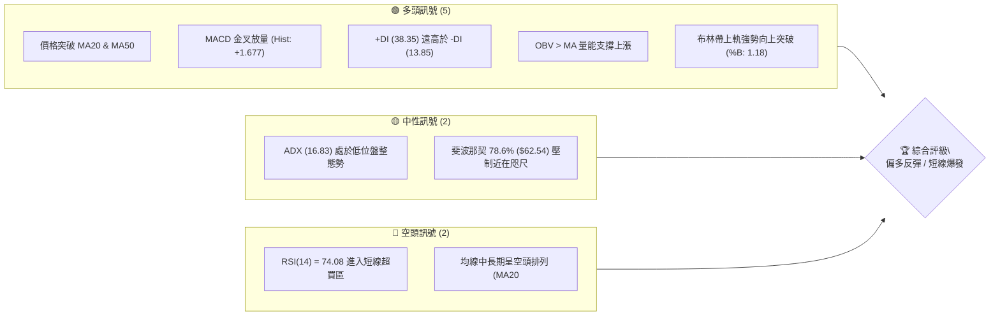
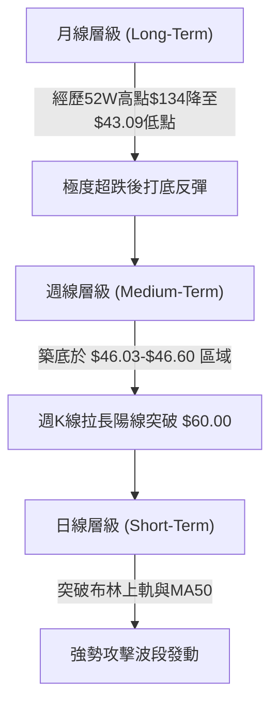
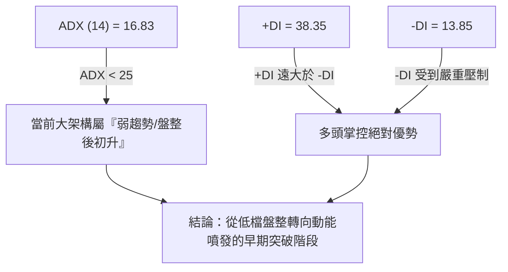
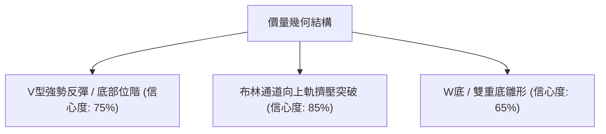
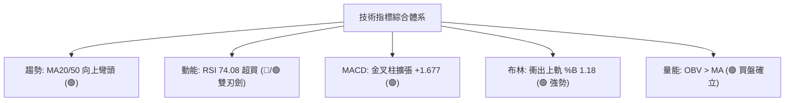
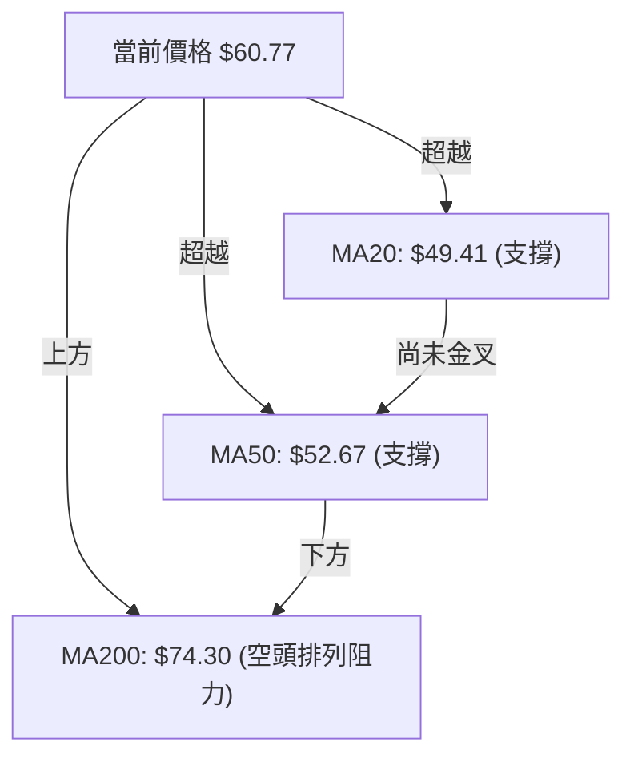
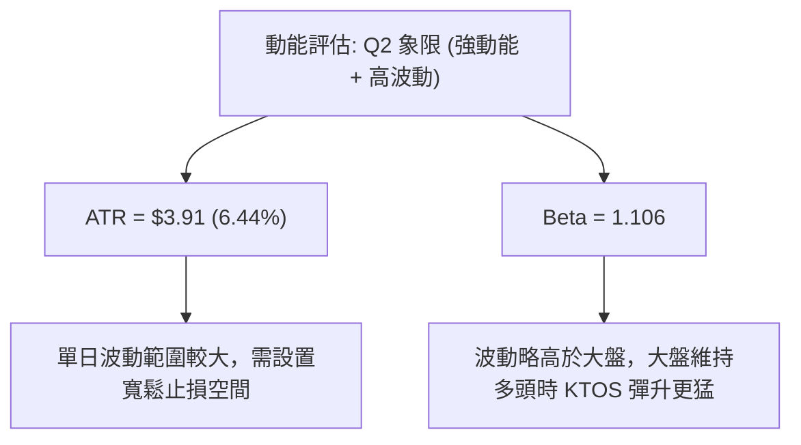
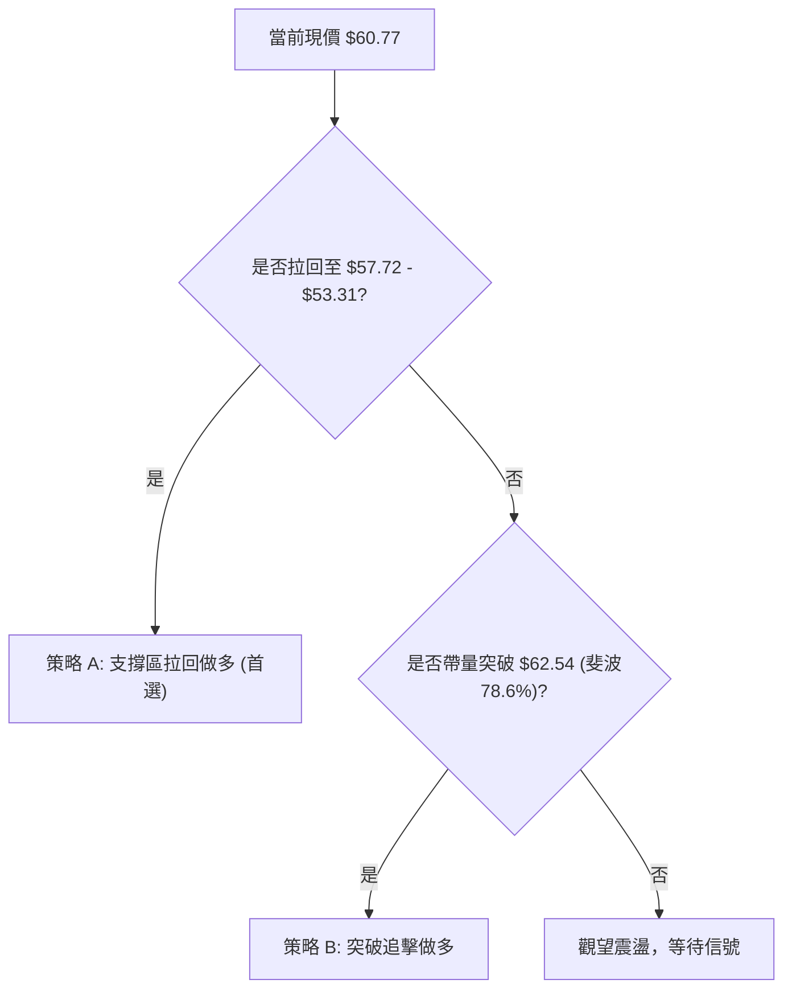
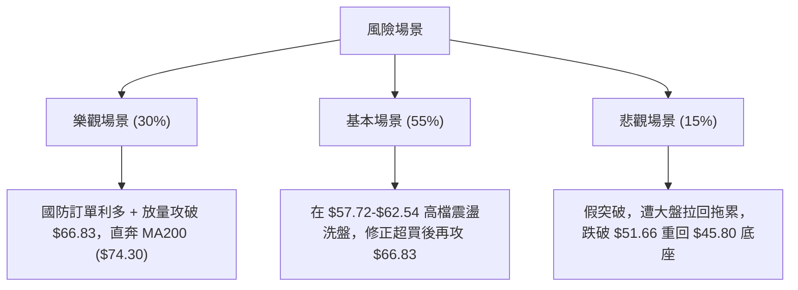

# KTOS 技術分析報告

> **報告日期**：2026-08-10 ｜ **語言**：繁體中文 ｜ **數據來源**：Yahoo Finance ｜ **當前價格**：$60.77

---

## 目錄

| 章節 | 內容 |
|------|------|
| [1. 技術面概覽](#1-技術面概覽) | 訊號儀表板、核心指標、評分卡 |
| [2. 趨勢分析](#2-趨勢分析) | 多時框趨勢、長中短期走勢 |
| [3. 圖表形態分析](#3-圖表形態分析) | 形態識別、K線組合、目標價 |
| [4. 支撐與阻力](#4-支撐與阻力) | 關鍵價位、斐波那契回調 |
| [5. 技術指標深度解讀](#5-技術指標深度解讀) | MA/RSI/MACD/布林/成交量 |
| [6. 動能與波動率](#6-動能與波動率) | 動能評估、ATR、Beta |
| [7. 多時框架總結](#7-多時框架總結) | 時框架評分矩陣 |
| [8. 交易策略建議](#8-交易策略建議) | 多空策略、風險報酬比 |
| [9. 風險提示與監控](#9-風險提示與監控) | 監控指標、風險場景 |

---

## 1. 技術面概覽

### 🎯 技術訊號儀表板



### 📊 核心指標速覽表

| 指標類別 | 指標名稱 | 當前數值 | 訊號 | 解讀 |
|----------|----------|----------|------|------|
| **價格** | 當前價格 | $60.77 | 🟢 | 近一週爆發性拉升，突破中短期均線壓制 |
| **均線** | MA20 | $49.41 | 🟢 | 價格在其上方 (+23.00%)，扣抵位置有利 |
| **均線** | MA50 | $52.67 | 🟢 | 價格在其上方 (+15.38%)，短線扭轉扣抵壓制 |
| **均線** | MA200 | $74.30 | 🔴 | 價格在其下方 (-18.21%)，仍為中長期主要反彈阻力 |
| **動能** | RSI(14) | 74.08 | 🔴 | 超買區間，顯示強勁衝高動能但也暗示短線需過熱回檔 |
| **動能** | MACD | 1.082 | 🟢 | 柱狀圖 (+1.677) 強勢擴張，零軸上方多頭加速 |
| **波動** | ATR(14) | $3.91 | 🟡 | 占股價 6.44%，日均波動劇烈，波動率顯著放大 |

### 🏆 技術評分卡

```
╔══════════════════════════════════════════════════════════════════╗
║                   技術評分卡 — KTOS (2026-08-10)                  ║
╠══════════════════════════════════════════════════════════════════╣
║ 趨勢強度 (ADX/DI)  ████████████░░░░░░░░  60/100  🟡 中性偏多    ║
║ 動能指標 (RSI/MACD)████████████████░░░░  80/100  🟢 動能極強    ║
║ 支撐穩定度 (S1/S2) ██████████████░░░░░░  70/100  🟢 打底確立    ║
║ 成交量配合 (OBV/Vol)██████████████░░░░░░  70/100  🟢 攻擊放量    ║
║ 形態完整度 (V型/底)██████████████░░░░░░  70/100  🟢 底部翻揚    ║
║ 均線排列 (MA System)████████░░░░░░░░░░░░  40/100  🔴 長期待修復  ║
╠══════════════════════════════════════════════════════════════════╣
║ 綜合評分           █████████████░░░░░░░  65/100  🟢 買入/拉回做多 ║
╚══════════════════════════════════════════════════════════════════╝
```

---

## 2. 趨勢分析

### 🌐 多時框趨勢分析



### 📈 長期趨勢 — 12個月走勢圖（Unicode）

```
KTOS 月線走勢圖（過去12個月近況）
價格軸 ($)
$103.01 ┤                 ● (2026-01 頂點)
$91.37  ┤           ●   ●
$76.10  ┤         ●   ●
$65.84  ┤       ●           ●
$60.77  ┤                       ●←當前價格 ($60.77)
$49.86  ┤                           ●
$43.09  ┤                             ● (52W 低點區間 $43.09~$46.03)
        └──────────────────────────────────────────────
         08  09  10  11  12  01  02  03  04  05  06  07  08 (月份)
```

**走勢特徵分析表格**：

| 階段 | 時間區間 | 價格變動 | 趨勢特徵 | 成交量配合 |
|------|----------|----------|----------|------------|
| **主升段** | 2025-05 ~ 2026-01 | $36.89 → $103.01 | 狂飆多頭，突破歷史高點 | 持續放大 |
| **主跌段** | 2026-01 ~ 2026-06 | $103.01 → $49.86 | 快速出貨修復，跌破所有短均 | 恐慌拋售潮 |
| **探底期** | 2026-06 ~ 2026-07 | $49.86 → $46.60 | 靠近52週低點 $43.09 築雙底區域 | 量縮盤整 |
| **反彈段** | 2026-08 (當前) | $46.60 → $60.77 | 暴力反彈 +30.4%，一舉收復 MA20/MA50 | 顯著增量 (28.9M/週) |

### 📊 中期趨勢（週線分析）

中期走勢顯示 KTOS 在 2026 年 7 月下旬於 **$46.03–$46.60** 建立了極強的波段雙底（靠近 52 週低點 **$43.09**）。8 月首週強勢拉出帶量長陽線，一舉站上 **$60.00** 大關。

```
週線支撐阻力結構 schematic:
阻力位 R3: $72.70  ----------------------------------- (MA200 / 波段壓制)
阻力位 R1: $66.83  ----------------------------------- (短線波段高點壓制)
斐波 78.6%: $62.54 ----------------------------------- (當前即時測試關卡)
當前價格:  $60.77  =================================== [當前位置]
支撐位 S1: $53.31  ----------------------------------- (突破頸線/MA50回測位)
支撐位 S3: $45.80  ----------------------------------- (波段雙底強支撐)
```

### ⚡ 趨勢強度評估（ADX 解讀）



| ADX 數值範圍 | 趨勢狀態 | 當前 KTOS 狀態 | 交易策略導向 |
|--------------|----------|----------------|--------------|
| 0 - 20 | 無趨勢 / 弱盤整 | **16.83 (剛自底部復甦)** | 尋找區間突破 / 追蹤爆發動能 |
| 20 - 25 | 趨勢形成中 | - | 建立順勢頭寸 |
| 25 - 50 | 強勁趨勢 | - | 持股續抱 / 逢拉回加碼 |
| > 50 | 極端趨勢 / 易過熱 | - | 緊盯止盈點 |

---

## 3. 圖表形態分析

### 🔍 形態識別系統



| 形態 | 信心度 | 判斷依據（引用數據） | 完成度 | 目標價（附計算式） |
|------|--------|----------------------|--------|--------------------|
| **V型爆發反彈** | 75% | 自 $46.60 兩週內直衝 $60.77，週成交量 28.95M 顯著放大 | 90% | 底部位 $46.60 + 高度 $14.17 = **$74.94**（逼近 MA200 $74.30） |
| **布林軌道突破** | 85% | 突破布林上軌 $57.72，%B 達到 1.18 | 100% | 沿上軌擴張，推升至波段阻力 **$66.83** |
| **W重底打底** | 65% | 左腳 $45.80 (7/19)，右腳 $46.60 (8/02)，現已突破頸線 $55.35 | 85% | 頸線 $55.35 + (頸線 $55.35 - 低點 $45.80) = **$64.90** |

### 🕯️ 重要K線形態分析

| 日期/週別 | 收盤價 | K線形態 | 解讀 | 訊號 |
|-----------|--------|---------|------|------|
| **2026-07-19** | $46.03 | 長下影打底線 | 測試 52W 低點 $43.09 附近買盤，空頭力竭 | 🟢 |
| **2026-08-02** | $46.60 | 縮量十字星 | 底部二次確認（Right Foot），洗盤結束 | 🟢 |
| **2026-08-09** | $60.77 | 帶量長紅穿雲箭 | 一舉穿透 MA20 ($49.41) 與 MA50 ($52.67)，多頭主導 | 🟢🟢🟢 |

### 📉 ASCII 走勢形態示意圖

```
KTOS 底部 W 底與 V 型突破示意圖
────────────────────────────────────────────────────────
$66.83 ┤                                      [阻力 R1]
$62.54 ┤                              ●       [斐波 78.6%]
$60.77 ┤                            ●   ●     [現價突破區]
$55.35 ┤              ● (頸線位)  ●
$49.41 ┤            ●   ●       ●             [MA20 / 中軌]
$46.03 ┤  ●       ●       ●   ●               [雙底 Left/Right Foot]
$43.09 ┤    ●   ●           ●                 [52週最低點]
────────────────────────────────────────────────────────
```

### 🎯 形態目標價計算

1. **W底形態推算目標價**：
   $$\text{頸線位} = \$55.35, \quad \text{底部低點} = \$45.80$$
   $$\text{形態高度} = \$55.35 - \$45.80 = \$9.55$$
   $$\text{第一形態目標價} = \$55.35 + \$9.55 = \mathbf{\$64.90}$$

2. **V型反彈幅度對稱擴張**：
   $$\text{起漲點} = \$46.60, \quad \text{當前波段高點} = \$60.77$$
   $$\text{垂直高度} = \$14.17$$
   $$\text{擴張目標價 (100% 延伸)} = \$60.77 + (\$14.17 \times 0.618) = \mathbf{\$69.53} \approx \text{阻力 R2 } (\$69.91)$$

---

## 4. 支撐與阻力

### 🗺️ 關鍵價位分布圖（Unicode）

```
KTOS 價位結構分布圖 (2026-08-10)
════════════════════════════════════════════════════════════
$134.00 ║██████████████████████████████████████████║ 52週最高點
$99.27  ║████████████████████                      ║ 斐波 38.2% 回調
$77.82  ║██████████████████████████                ║ 斐波 61.8% / 長期強壓
$74.30  ║██████████████████████                    ║ MA200 移動平均線
$72.70  ║████████████████████                      ║ 強阻力 R3
$69.91  ║████████████████                          ║ 阻力 R2
$66.83  ║██████████████                            ║ 近期阻力 R1
$62.54  ║██████████                                ║ 斐波 78.6% 回調
$60.77  ╠══════════════════════════════════════════╣ ◄ 當前價格 ($60.77)
$57.72  ║▓▓▓▓▓▓▓▓▓▓▓▓▓▓▓▓                          ║ 布林通道上軌
$53.31  ║▓▓▓▓▓▓▓▓▓▓▓▓▓▓▓▓▓▓▓▓▓▓▓▓                  ║ 關鍵支撐 S1 / MA50 區域
$51.66  ║████████████████████████                  ║ 支撐 S2
$45.80  ║██████████████████████████████            ║ 強支撐 S3 (雙底區域)
$43.09  ║██████████████████████████████████████████║ 52週最低點
════════════════════════════════════════════════════════════
```

### 🚧 阻力位分析表

| 阻力級別 | 價位 | 形成原因 | 突破難度 | 重要性 |
|----------|------|----------|----------|--------|
| **阻力 R1** | **$66.83** | 近一年波段高點聚類 / 籌碼密集解套區 | 🟡 中等 | 🔴高（衝破此區將打開中期反彈空間） |
| **阻力 R2** | **$69.91** | 近年下降通道中軌與解套壓力重疊 | 🔴 較難 | 🟡 中 |
| **阻力 R3** | **$72.70** | 波段高點聚類 + 靠近 MA200 ($74.30) | 🔴 極難 | 🔴 高（多空生死分界點） |

### 🛡️ 支撐位分析表

| 支撐級別 | 價位 | 形成原因 | 守住機率 | 重要性 |
|----------|------|----------|----------|--------|
| **支撐 S1** | **$53.31** | 近一年波段低點聚類 + 鄰近 MA50 ($52.67) | 🟢 80% | 🔴 高（短線回檔關鍵防線） |
| **支撐 S2** | **$51.66** | 波段低點聚類 + 近 MA20 ($49.41) | 🟢 85% | 🟡 中 |
| **支撐 S3** | **$45.80** | 近一年波段低點聚類（2026-07 雙底底座）| 🟢 95% | 🔴 極高（多頭防禦總堡壘） |

### 📐 斐波那契回調位分析

（基準：52週區間 **$43.09** → **$134.00**，總波幅 **$90.91**）

```
52W High $134.00 ─── 0.0%
                 ─── 23.6% ($112.55)
                 ─── 38.2% ($99.27)
                 ─── 50.0% ($88.55)
                 ─── 61.8% ($77.82)
當前價格 $60.77 ─── 78.6% ($62.54) ◄◄◄ 當前正在測試 78.6% 關卡
52W Low  $43.09  ─── 100.0%
```

* **現價位置解讀**：股價自 $43.09 反彈至 $60.77，已精準逼近 **78.6% 回調位 ($62.54)**。
* **技術意涵**：78.6% 是極度深幅回調後的關鍵多空轉換位。若能有效帶量實體站穩 $62.54 上方，行情將正式宣告遠離底部危險區，並向 **61.8% ($77.82)** 及 **MA200 ($74.30)** 邁進。

---

## 5. 技術指標深度解讀

### 🎛️ 指標訊號總覽



### 📈 移動平均線排列分析



* **均線狀態解讀**：雖然長線 MA20<MA50<MA200 呈現滯後的空頭排列，但短線價格（$60.77）已一舉突破 MA5（$54.92）、MA10（$50.93）、MA20（$49.41）與 MA50（$52.67）。
* **均線扣抵**：MA20 與 MA50 扣抵低價區，未來 1-2 週 MA20 將快速上彎並有望金叉 MA50，形成「黃金交叉」助漲結構。

### 📉 RSI(14) 分析

* **當前數值**：**74.08**
* **進度條**：`████████████████████████████████████████████████████░░░░░░░░░░░░░░░░` (74%)
* **指標評估**：
  * 進入 **>70 超買區**。在強勢突破初期，RSI 進入超買往往是「強者恆強」的動能噴發特徵，而非立即作空的依據。
  * **背離檢查**：日線與週線 RSI 隨股價創近期新高，**無明顯頂背離現象**，顯示上漲由真實買盤推動。

### 📊 MACD(12/26/9) 訊號解讀

* **MACD 快線**：`1.082`
* **Signal 慢線**：`-0.596`
* **MACD Histogram**：`+1.677` 🟢
* **解讀**：MACD 快線強勢穿越零軸與慢線，柱狀圖連續放寬擴張，呈現典型的多頭發散形態，確認本波反彈力道極為凌厲。

### 📦 布林通道分析

```
布林通道形態示意圖 (Bollinger Band Burst)
────────────────────────────────────────────────────────
上軌 (Upper Band): $57.72 ───┐
現價 (Current):    $60.77 ───┼─► %B = 1.18 (強勢突破上軌，進入帶狀擴脹)
中軌 (MA20):       $49.41 ───┘
下軌 (Lower Band): $41.09
────────────────────────────────────────────────────────
```
* **%B 指標**：`1.18`（高於 1.0 表示股價收在布林通道上軌之外）。
* **通道動態**：通道出現「喇叭口開口（VolSqueeze Expansion）」，若股價稍微拉回至上軌 **$57.72** 附近尋獲支撐，將是極佳的二次進場點。

### 💹 成交量分析（量價配合度）

* **最新成交量**：4,778,000 股
* **20日均量**：4,099,170 股（量比：**1.17x**）
* **週成交量**：最近一週高達 **28,954,900 股**，遠高於底部位階平均。
* **OBV 觀察**：OBV 指標穿越其移動平均線，呈向上勾揚趨勢。量增價漲，顯示機構資金在低檔密集拉高吸籌。

---

## 6. 動能與波動率

### ⚡ 動能評估

| 象限 | 動能強度 (RSI/MACD) | 波動率 (ATR) | 當前狀態 | 評估與策略 |
|------|--------------------|--------------|----------|------------|
| **Q1 (左上)** | 強 | 低 | - | 穩定上升趨勢 |
| **Q2 (右上)** | **強** | **高** | **✓ (KTOS 當前象限)** | **突破爆發期：高動能+高波動，適合追蹤突破或拉回窄幅停損** |
| **Q3 (左下)** | 弱 | 低 | - | 沉悶盤整 |
| **Q4 (右下)** | 弱 | 高 | - | 恐慌殺盤區 |



### 📊 ATR 波動率分析

* **ATR(14)**：**$3.91**（占當前股價 6.44%）
* **風控應用建議**：
  * **追價止損距離**：至少需留出 $3.91 × 1.5 = **$5.87** 的震盪空間，避免被正常日內噪音掃出場。
  * **波段停損設置**：若進場位在 $57.70 附近，止損位應設在 $57.70 - $5.87 = **$51.83**（精確對應支撐 S2 **$51.66** 附近）。

### 📐 Beta 與市場相關性

* **Beta 係數**：`1.106`
* **解讀**：高於 1.0 的 Beta 顯示其對整體市場（如 S&P 500、國防軍工 ETF）的敏感度較高。當美股大盤防禦性類股回暖時，KTOS 作為中小型國防科技股具備更高的彈性。

---

## 7. 多時框架總結

### 📋 時框架評分表

| 時框架 | 趨勢方向 | 動能 | 均線排列 | 形態 | 綜合評分 | 建議 |
|--------|----------|------|----------|------|----------|------|
| **日線 (Daily)** | 🟢 多頭強攻 | 🟢 超買衝刺 | 🟡 交叉向上 | 🟢 布林突破 | **82 / 100** | 偏多操作 / 逢拉回布局 |
| **週線 (Weekly)**| 🟢 築底完成 | 🟢 MACD金叉 | 🔴 尚在修復 | 🟢 W底頸線突破 | **68 / 100** | 中期波段持有 |
| **月線 (Monthly)**| 🟡 低檔反彈 | 🟡 止跌回升 | 🔴 空頭架構 | 🟡 超跌 V 反 | **48 / 100** | 長線築底，觀察 MA200 |

### 🔲 綜合訊號矩陣

| 指標維度 | 日線訊號 | 週線訊號 | 月線訊號 | 矩陣收斂結果 |
|----------|----------|----------|----------|--------------|
| **均線 / 價格** | 🟢 價高於MA20/50 | 🟢 站上週MA10 | 🔴 低於月MA20 | 🟡 短強長平 |
| **動能 (RSI/MACD)**| 🟢 強勢 | 🟢 轉強 | 🟡 低檔轉平 | 🟢 多頭掌控短中期 |
| **成交量配合** | 🟢 顯著放量 | 🟢 近期大量 | 🟡 量能回升 | 🟢 買盤實力堅強 |

### ⚖️ 多時框收斂結論

**當前總體行情定調：偏多反彈與波段突破**

依據收斂規則：
1. **ADX 16.83 (< 25)** 顯示總體處於大區間修復與底部位階；但日/週線動能非常強勁。
2. 日線布林突破與週線 W 底完成，主導了短期與中期走勢。
3. **最終結論**：長線空頭壓制（MA200 $74.30）雖然存在，但短中期已形成強烈反彈波段。**策略應以「主推多頭（拉回買進或突破追價）」為主**。

---

## 8. 交易策略建議

### 🗺️ 策略決策流程圖



### 🧭 策略路由

**當前主策略方向：🟢 偏多操作 / 逢拉回做多（評分：65/100）**

因技術評分達 **65/100**，多頭訊號占優，故**主推多頭交易策略**；空頭情境僅作為風險對沖與風控止損參考。

### 🎯 價格情境階梯 (Price Scenarios)

| 觸發條件 | 下一目標 | 後續延伸 | 情境含義 |
|----------|----------|----------|----------|
| **突破 R1 $66.83** | **阻力 R2 $69.91** | **阻力 R3 $72.70** | 短線極強，挑戰 MA200 |
| **站穩現價區間 ($57.72–$62.54)** | — | — | 高檔消化超買，蓄勢再發 |
| **跌破 S1 $53.31** | **支撐 S2 $51.66** | **支撐 S3 $45.80** | 反彈受阻，重回底部位階震盪 |

### 📊 情境機率分佈

```
情境機率分佈圖:
┌──────────────────────────────────────────────────────────┐
│ 🟢 繼續上行 / 回檔再發動 (55%) ███████████████████████████ │
│ 🟡 區間震盪消化超買 (30%)     ███████████████            │
│ 🔴 跌破 S1 回落探底 (15%)     ███████                    │
└──────────────────────────────────────────────────────────┘
```

### 🟢 主策略詳情

#### 策略 A：拉回支撐做多（高風險報酬比選）
* **進場條件**：股價短線消化 RSI 超買，拉回至布林上軌與 S1 支撐重疊區附近，出現縮量止跌K線。
* **進場價格**：**$54.50 – $57.70**
* **目標價 T1**：**$66.83** (阻力 R1)
* **目標價 T2**：**$72.70** (阻力 R3 / 靠近 MA200)
* **止損價格**：**$51.66** (跌破支撐 S2 嚴格止損)
* **風險報酬比**：
  * 以進場均價 $56.10 計算：
  * 風險 = $56.10 - $51.66 = $4.44
  * 報酬 (至 T1) = $66.83 - $56.10 = $10.73  ➔ **風報比 = 1 : 2.41**
  * 報酬 (至 T2) = $72.70 - $56.10 = $16.60  ➔ **風報比 = 1 : 3.73**
* **成功機率**：65%
* **建議倉位**：10% - 15% 總資金

#### 策略 B：突破 78.6% 回調位追擊做多（強勢動能選）
* **進場條件**：日線帶量（> 500萬股）實體收盤突破斐波那契 78.6% 位（**$62.54**）。
* **進場價格**：**$62.80 – $63.20**
* **目標價 T1**：**$69.91** (阻力 R2)
* **目標價 T2**：**$75.39** (MA240 / 斐波 61.8% $77.82)
* **止損價格**：**$57.72** (布林上軌轉支撐失守)
* **風險報酬比**：
  * 以進場價 $63.00 計算：
  * 風險 = $63.00 - $57.72 = $5.28
  * 報酬 (至 T1) = $69.91 - $63.00 = $6.91    ➔ **風報比 = 1 : 1.31**
  * 報酬 (至 T2) = $75.39 - $63.00 = $12.39   ➔ **風報比 = 1 : 2.35**
* **成功機率**：55%
* **建議倉位**：5% - 8% 總資金

### 🔴 反向風險觸發點（對沖提示）

若 KTOS 價格未經整理直接摔落，並**日線收盤跌破 S2 ($51.66)**，代表本次 V 型突破為「假突破/多頭陷阱」，多頭策略失效。屆時應全數平倉觀望，甚至可進行短線對沖避險，下方目標看至 S3 (**$45.80**)。

### ⭐ 整體訊號強度評星

```
做多訊號強度：★★██☆  (4.0/5星) 🟢 動能極強，底部位階
做空訊號強度：★☆☆☆☆  (1.5/5星) 🔴 逆勢風險極高
整體可信度：  ★★██☆  (4.0/5星) 🟢 價量配合良好
```

---

## 9. 風險提示與監控

### ✅ 關鍵監控指標 Checklist

```
╔══════════════════════════════════════════════════════════════════╗
║                   每日交易前監控 Check List                       ║
╠══════════════════════════════════════════════════════════════════╣
║ [ ] 價格是否維持在布林上軌 $57.72 之上？                          ║
║ [ ] RSI(14) 74.08 是否出現頂背離或高檔死亡交叉？                 ║
║ [ ] 日成交量是否維持在 4.1M (20日均量) 之上？                    ║
║ [ ] 阻力位 $62.54 (斐波78.6%) 是否順利放量攻克？                ║
║ [ ] 防守位 $53.31 (S1) 是否完整無虞？                            ║
╚══════════════════════════════════════════════════════════════════╝
```

### ⚠️ 風險場景分析



### 🛡️ 風險管理重要提醒

1. **過熱指標修復風險**：RSI 目前為 **74.08**，Stoch %K 高達 **91.84**。歷史數據顯示 KTOS 在 RSI > 75 時易出現 3-5 天的劇烈震盪洗盤，**切忌全倉在高點市價追高**。
2. **波動率（ATR）對應之倉位控管**：ATR 為 **$3.91**（6.44%），屬於高波動個股。建議單筆交易虧損金額控制在總投資組合資金的 **1% - 1.5%** 以內。
3. **軍工產業新聞衝擊**：國防合約頒布與季報預期為主要驅動因素，應密切追蹤美軍無人機（Unmanned Systems）合約進展。

---

## 📋 報告總結

```
╔══════════════════════════════════════════════════════════════════╗
║                    KTOS 技術分析報告總結                         ║
════════════════════════════════════════════════════════════════════
 報告日期：2026-08-10
 當前價格：$60.77
 分析評級：🟢 買入 / 拉回做多 (做多訊號 4.0/5 星)

 關鍵價位速查：
 ├─ 長期趨勢：🟡 低檔反彈打底（受制於 MA200 $74.30）
 ├─ 中期趨勢：🟢 週線 W 底突破（頸線 $55.35 已收復）
 ├─ 短期趨勢：🟢 爆發性攻勢（RSI 74.08, MACD 金叉）
 ├─ 關鍵支撐：S1: $53.31 ｜ S2: $51.66 ｜ S3: $45.80
 ├─ 關鍵阻力：R1: $66.83 ｜ R2: $69.91 ｜ R3: $72.70
 └─ 分析師共識目標價：$107.14 (均值) / $60.00 (最低)

 最優策略建議：
 1. 🥇 最佳機會（策略 A）：等候短線回檔至 $54.50–$57.70 區間佈局，
    止損設 $51.66，目標看 $66.83 / $72.70（風報比 > 1:2.4）。
 2. 🥈 次選機會（策略 B）：強勢突破 $62.54 後輕倉追擊，
    止損設 $57.72，目標看 $69.91 / $75.39。
╚══════════════════════════════════════════════════════════════════╝
```

---

> ⚠️ **免責聲明**：本報告為 AI 自動生成之技術分析，所有數據及估算均基於提供的歷史價格資訊。本報告**僅供研究與學術參考**，**不構成任何投資建議**。投資有風險，入市需謹慎。

---

*報告生成時間：2026-08-10 ｜ 數據來源：Yahoo Finance ｜ 分析框架：多時框技術分析*