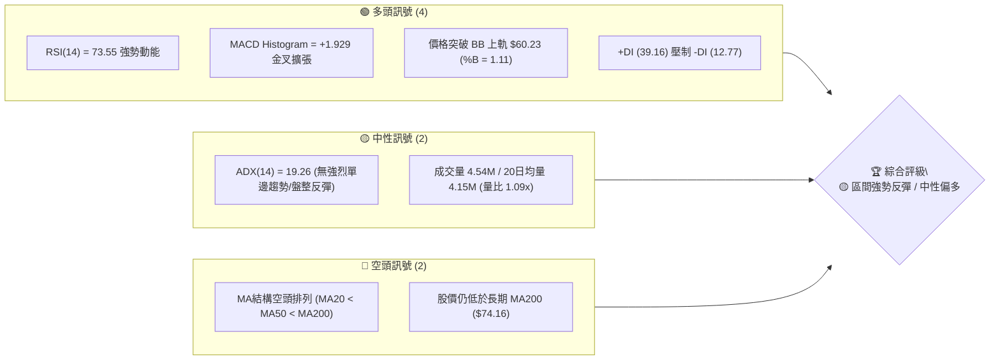
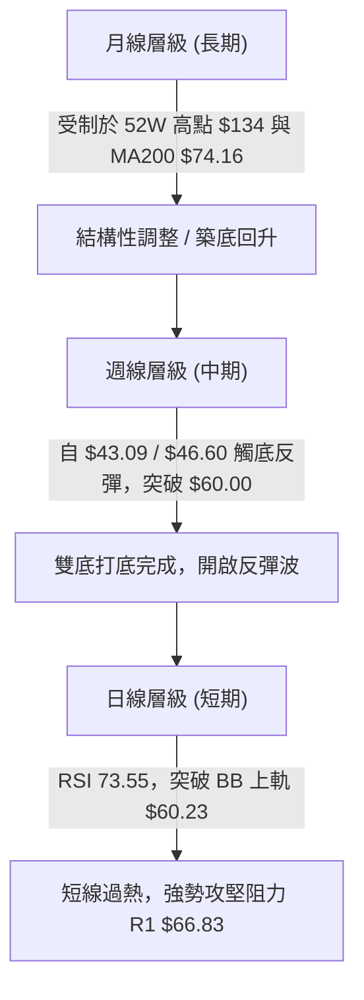
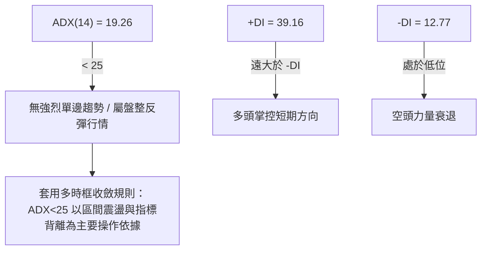
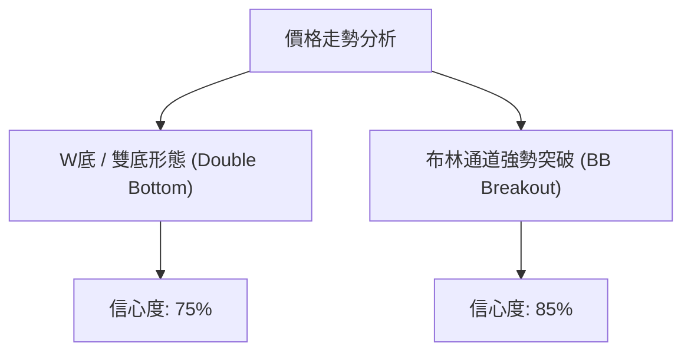
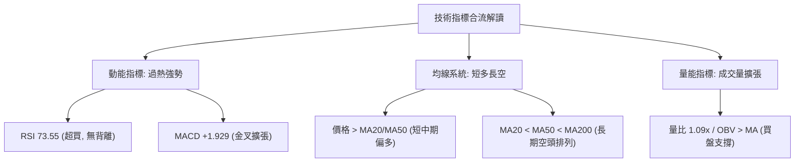
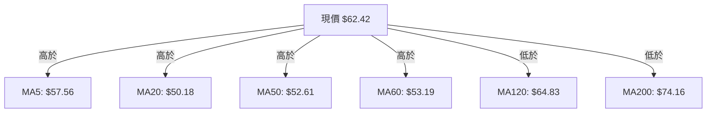
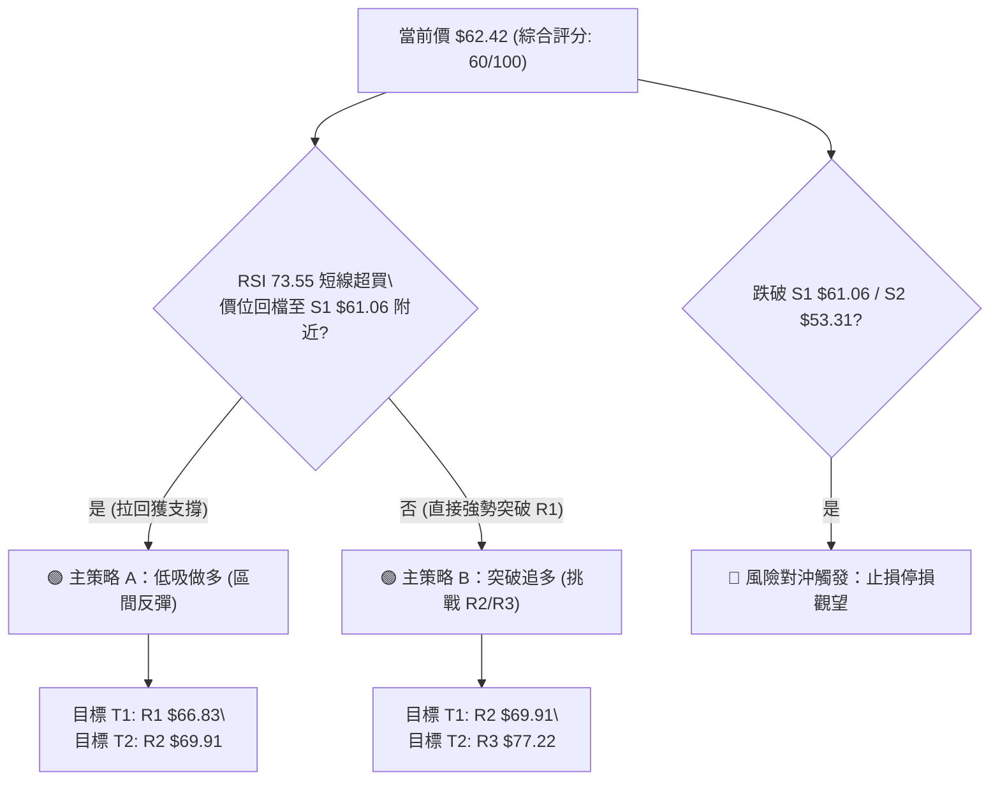
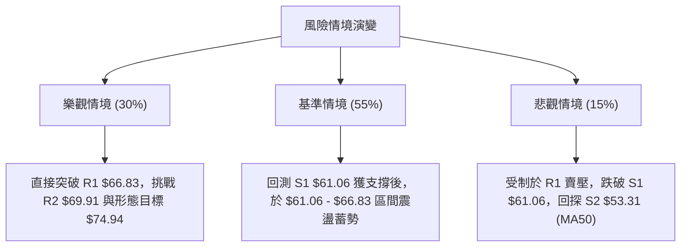

# KTOS 技術分析報告

> **報告日期**：2026-08-11 ｜ **語言**：繁體中文 ｜ **數據來源**：Yahoo Finance ｜ **當前價格**：$62.42

---

## 目錄

| 章節 | 內容 |
|------|------|
| [1. 技術面概覽](#1-技術面概覽) | 訊號儀表板、核心指標、評分卡 |
| [2. 趨勢分析](#2-趨勢分析) | 多時框趨勢、長中短期走勢 |
| [3. 圖表形態分析](#3-圖表形態分析) | 形態識別、K線組合、目標價 |
| [4. 支撐與阻力](#4-支撐與阻力) | 關鍵價位、斐波那契回調 |
| [5. 技術指標深度解讀](#5-技術指標深度解讀) | MA/RSI/MACD/布林/成交量 |
| [6. 動能與波動率](#6-動能與波動率) | 動能評估、ATR、Beta |
| [7. 多時框架總結](#7-多時框架總結) | 時框架評分矩陣 |
| [8. 交易策略建議](#8-交易策略建議) | 多空策略、風險報酬比 |
| [9. 風險提示與監控](#9-風險提示與監控) | 監控指標、風險場景 |

---

## 1. 技術面概覽

### 🎯 技術訊號儀表板



### 📊 核心指標速覽表

| 指標類別 | 指標名稱 | 當前數值 | 訊號 | 解讀 |
|----------|----------|----------|------|------|
| **價格** | 當前價格 | $62.42 | 🟢 | 站上 MA20/MA50，位於52週區間 21.3% 位置 |
| **均線** | MA20 | $50.18 | 🟢 | 現價在高於 MA20 +24.39%，短線轉強 |
| **均線** | MA50 | $52.61 | 🟢 | 現價高於 MA50 +18.65%，突破中期均線壓力 |
| **均線** | MA200 | $74.16 | 🔴 | 現價低於 MA200 -15.83%，長期趨勢仍受制 |
| **動能** | RSI(14) | 73.55 | 🟡 | 進入超買區 (>70)，短線動能充沛但需防回檔 |
| **動能** | MACD | +1.816 | 🟢 | MACD 線穿過 Signal (-0.113)，柱狀圖擴張 |
| **波動** | ATR(14) | $3.98 | 🟡 | 波動率佔股價 6.38%，每日波幅適中 |

### 🏆 技術評分卡

```
╔══════════════════════════════════════════════════════════════╗
║              技術評分卡 — KTOS (2026-08-11)                   ║
╠══════════════════════════════════════════════════════════════╣
║ 趨勢強度      ▓▓▓▓▓▓▓▓░░░░░░░░░░░░  40/100  🟡 盤整/無強單邊   ║
║ 動能指標      ▓▓▓▓▓▓▓▓▓▓▓▓▓▓▓▓░░░░  80/100  🟢 動能高昂超買   ║
║ 支撐穩定度    ▓▓▓▓▓▓▓▓▓▓▓▓░░░░░░░░  60/100  🟡 S1 $61.06 築底  ║
║ 成交量配合    ▓▓▓▓▓▓▓▓▓▓▓▓░░░░░░░░  65/100  🟢 OBV 支撐價格    ║
║ 形態完整度    ▓▓▓▓▓▓▓▓▓▓▓▓▓▓░░░░░░  70/100  🟢 雙底突破頸線   ║
║ 均線排列      ▓▓▓▓▓▓▓▓░░░░░░░░░░░░  45/100  🔴 長線空頭未扭轉 ║
╠══════════════════════════════════════════════════════════════╣
║ 綜合評分      ▓▓▓▓▓▓▓▓▓▓▓▓░░░░░░░░  60/100  🟡 區間強勢反彈   ║
╚══════════════════════════════════════════════════════════════╝
```

---

## 2. 趨勢分析

### 🌐 多時框趨勢分析



### 📈 長期趨勢 — 12個月走勢圖（Unicode）

```
KTOS 月線走勢圖（過去12個月：2025-09 至 2026-08）
價格軸 ($)
$105 ┤                 ● (2026-01: $103.01)
$95  ┤ ● (2025-09: $91.37)
$85  ┤        ●        ●
$75  ┤            ●
$65  ┤                    ●             ● (現價: $62.42)
$55  ┤                        ●
$45  ┤                            ●(2026-07: $46.60 低點)
     └─────────────────────────────────────────────────────
      09  10  11  12  01  02  03  04  05  06  07  08 (月份)
```

#### 走勢特徵分析表

| 階段 | 時間區間 | 收盤價變動 | 漲跌幅 | 走勢特徵與技術意義 |
|------|----------|------------|--------|--------------------|
| 1. 高位急跌 | 2026-01 至 2026-04 | $103.01 → $63.05 | -38.79% | 獲利了結賣壓湧現，自歷史高位大幅回落 |
| 2. 二次尋底 | 2026-05 至 2026-07 | $64.13 → $46.60 | -27.33% | 探底至 52週低點 $43.09 附近（$46.60），築成雙底形態 |
| 3. 強勢反彈 | 2026-07 至 2026-08 | $46.60 → $62.42 | +33.95% | 量能放大帶動長陽線，連續突破 MA20 及 MA50 壓力 |

### 📊 中期趨勢（週線分析）

從近 20 週數據觀察，KTOS 在 2026-06 底至 2026-07 底（收盤價 $47.21 / $46.03 / $46.60）形成極具韌性的底部支撐。2026-08-09 止當週出現大幅強攻，單週量能高達 28.95M，推升收盤至 $60.77（RSI 升至 74.1），本週進一步上攻至 $62.42。

### ⚡ 趨勢強度評估（ADX 解讀）



| 指標 | 數值 | 狀態評估 | 技術含義 |
|------|------|----------|----------|
| **ADX(14)** | 19.26 | 弱趨勢 (<25) | 市場整體處於大區間震盪，當前上漲為盤整內部的強勢反彈，而非長線趨勢展開 |
| **+DI** | 39.16 | 強勢主導 | 買盤買意強勁，短線多頭掌控發球權 |
| **-DI** | 12.77 | 壓制狀態 | 賣壓暫時退場，下方支撐明確 |

---

## 3. 圖表形態分析

### 🔍 形態識別系統



#### 形態信心度與目標價評估表

| 形態名稱 | 信心度 | 判斷依據（引用數據） | 完成度 | 目標價（附計算式） |
|----------|--------|----------------------|--------|--------------------|
| **雙底形態 (Double Bottom)** | 75% | 第一次低點 $46.03 (2026-07-19) 與第二次低點 $46.60 (2026-08-02) 形成雙底，頸線位置約在 $60.77 | 90% (已突破頸線) | **$74.94**<br/>計算：頸線 $60.77 + (頸線 $60.77 - 低點 $46.60) = $74.94<br/>*(逼近 MA200 $74.16 及 R3 $77.22)* |
| **布林上軌突破 (BB Breakout)** | 85% | 當前價格 $62.42 > 布林上軌 $60.23，%B 達到 1.11 | 100% | **$66.83**<br/>推算：受制於波段阻力 R1 $66.83 |

### 🕯️ 重要K線形態分析

| 月份/週別 | 收盤價 | K線形態 | 解讀 | 訊號 |
|-----------|--------|---------|------|------|
| 2026-07-19 | $46.03 | 探底錘子線 (Hammer) | 下探 52週低點 $43.09 附近後獲得強烈買盤支撐 | 🟢 觸底訊號 |
| 2026-08-09 | $60.77 | 大陽線 (Marubozu) | 單週大漲 +30.4%，成交量達 28.95M，一舉突破 MA20/MA50 | 🟢 突破訊號 |
| 2026-08-16 | $62.42 | 滾動高位陽線 | 延續多頭慣性，站穩 $62.00 關卡 | 🟢 多頭續強 |

### 📉 ASCII 走勢形態示意圖

```
KTOS 雙底（W底）突破示意圖
價格 ($)
$74.94 ┤                                         ▲ 形態目標價 (與 MA200 $74.16 重疊)
$66.83 ┤                                   ┌─────┤ R1 阻力位
$62.42 ┤                                   ●     │ 現價突破頸線
$60.77 ┤                  ●───────────────/      │ 頸線 (Neckline)
$50.00 ┤                 / \             /       │
$46.00 ┤      ●─────────/   \───────────●        │ 左底 ($46.03) & 右底 ($46.60)
       └─────────────────────────────────────────
             2026-07-19       2026-08-02  2026-08-16
```

---

## 4. 支撐與阻力

### 🗺️ 關鍵價位分布圖（Unicode）

```
KTOS 價位結構分布圖
════════════════════════════════════════════════════════════════════
$134.00 ║████████████████████████████████████████║ 52週最高價
$112.55 ║██████████████████████████              ║ Fib 23.6% 回調位
$99.27  ║████████████████████                    ║ Fib 38.2% 回調位
$88.55  ║██████████████                          ║ Fib 50.0% 中軸位
$77.22  ║████████████████████████████████████████║ 阻力 R3 / Fib 61.8% ($77.82)
$74.16  ║████████████████████████                ║ MA200 年線大壓力
$69.91  ║████████████████                        ║ 阻力 R2
$66.83  ║████████████████████████                ║ 阻力 R1 (首要關卡)
$62.54  ║▓▓▓▓▓▓▓▓▓▓▓▓▓▓▓▓▓▓▓▓▓▓▓▓▓▓▓▓▓▓▓▓▓▓▓▓▓▓▓▓║ Fib 78.6% 回調位
$62.42  ╠════════════════════════════════════════╣ ◄ 當前價格 ($62.42)
$61.06  ║▓▓▓▓▓▓▓▓▓▓▓▓▓▓▓▓▓▓▓▓▓▓▓▓                ║ 支撐 S1 (短線支撐)
$53.31  ║████████████████████████████████████████║ 支撐 S2 (季線 MA50 $52.61 防線)
$51.66  ║██████████████                          ║ 支撐 S3 (月線 MA20 $50.18 防線)
$43.09  ║████████████████████████████████████████║ 52週最低價
════════════════════════════════════════════════════════════════════
```

### 🚧 阻力位分析表

| 阻力級別 | 精確價位 | 形成原因 | 突破難度 | 重要性 |
|----------|----------|----------|----------|--------|
| **R1** | **$66.83** | 近一年波段高點聚類 / 接近 MA120 ($64.83) | 🟡 中等 | 短線首要衝擊目標 (+7.07%) |
| **R2** | **$69.91** | 近一年中位解套賣壓區 | 🟡 中等 | 中期多頭拓展區間 (+12.00%) |
| **R3** | **$77.22** | 近一年高點解套密集區 / 接近 Fib 61.8% ($77.82) 與 MA200 ($74.16) | 🔴 極高 | 多空長期分水嶺 (+23.71%) |

### 🛡️ 支撐位分析表

| 支撐級別 | 精確價位 | 形成原因 | 守住機率 | 重要性 |
|----------|----------|----------|----------|--------|
| **S1** | **$61.06** | 近一年波段低點聚類 / 突破後的頸線轉換支撐 | 🟢 高 (75%) | 短線防守第一道關卡 (-2.19%) |
| **S2** | **$53.31** | 波段低點聚類 / 重合 MA50 ($52.61) 與 MA60 ($53.19) | 🟢 極高 (85%) | 中期多頭生命線 (-14.59%) |
| **S3** | **$51.66** | 波段低點聚類 / 重合 MA20 ($50.18) | 🟢 極高 (90%) | 強力底部防線 (-17.24%) |

### 📐 斐波那契回調位分析

依據 52週高點 $134.00 至 52週低點 $43.09 之波段進行斐波那契計算：

| 斐波那契比例 | 價位 | 當前相對位置與意義 |
|--------------|------|--------------------|
| **0.0%** (52W High) | $134.00 | 歷史極高點 |
| **23.6%** | $112.55 | 長期強勢反彈目標 |
| **38.2%** | $99.27 | 分析師平均目標價 ($107.14) 附近 |
| **50.0%** | $88.55 | 多空中期中軸分水嶺 |
| **61.8%** | $77.82 | 黃金切割率關鍵壓力（與 R3 $77.22 重疊） |
| **78.6%** | **$62.54** | **現價 $62.42 恰好扣抵於此黃金分割區間** |
| **100.0%** (52W Low) | $43.09 | 52週最低築底區 |

**解讀**：現價 $62.42 已精準抵達 78.6% 回調位（$62.54）。若能有效收復並站穩 $62.54，將開啟向上挑戰 61.8%（$77.82）及 MA200（$74.16）的空間。

---

## 5. 技術指標深度解讀

### 🎛️ 指標訊號總覽



### 📈 移動平均線排列分析



| 均線名稱 | 精確數值 | 價格關係 | 走勢扣抵與意義 |
|----------|----------|----------|----------------|
| **MA5** | $57.56 | ▲ +8.44% | 短線極強勢，乖離稍微偏高 |
| **MA10** | $52.23 | ▲ +19.51% | 短期多頭支撐急速拉升 |
| **MA20** | $50.18 | ▲ +24.39% | 月線黃金交叉 MA50，形成短多格局 |
| **MA50** | $52.61 | ▲ +18.65% | 季線轉為支撐 |
| **MA120** | $64.83 | ▼ -3.72% | 半年線下行，形成上方第一道均線蓋頂壓力 |
| **MA200** | $74.16 | ▼ -17.19% | 年線下行，整體均線結構仍呈現 MA20<MA50<MA200 長期空頭排列 |

### 📉 RSI(14) 分析

*   **當前數值**：**73.55**
*   **強度進度條**：▓▓▓▓▓▓▓▓▓▓▓▓▓▓▓░░░░░ 73.55%
*   **區間判斷**：🔴 超買區 (>70)
*   **背離分析**：目前 RSI 與價格同步創出近期新高，**無明顯頂背離或底背離**。高 RSI 代表短線買盤強烈，但需注意在 ADX<25 的盤整環境中，RSI 超買容易引發向 MA20/S1 的技術性拉回修正。

### 📊 MACD(12/26/9) 訊號解讀

| 組成部分 | 數值 | 多空狀態 | 解讀 |
|----------|------|----------|------|
| **MACD Line** | +1.816 | 🟢 看多 | 快線快速向上穿過零軸 |
| **Signal Line**| -0.113 | 🟢 金叉成立 | 慢線止跌轉升 |
| **Histogram** | **+1.929**| 🟢 強勢擴張 | 柱狀圖連續大幅放量，多頭動能極其強勁 |

### 📦 布林通道分析

```
KTOS 布林通道現況示意圖
價格 ($)
$60.23 ┤────────────────────────● Upper Band (BB上軌)
       │                        ▲ 現價 $62.42 (突破上軌 %B = 1.11)
$50.18 ┤─────────────────────────── Middle Band (MA20中軌)
       │
$40.13 ┤─────────────────────────── Lower Band (BB下軌)
```

*   **BB 上軌**：$60.23
*   **BB 中軌 (MA20)**：$50.18
*   **BB 下軌**：$40.13
*   **%B 指標**：**1.11**（價格穿透上軌，進入超買強勢區）
*   **通道狀態**：通道呈現開口擴張狀態。在盤整行情中，價格突穿上軌通常會在 1-3 個交易日內拉回通道內（$60.23 附近）尋求測試。

### 💹 成交量分析（量價配合度）

*   **最新日成交量**：4,538,749 股
*   **20日均量**：4,149,497 股（**量比 1.09x**，量能小幅放大）
*   **50日均量**：4,856,421 股
*   **OBV 趨勢**：OBV 線高於其移動平均線（**OBV > MA**），顯示資金持續淨流入，量能結構能有效支撐當前的價格上漲。

---

## 6. 動能與波動率

### ⚡ 動能評估分析

根據 ADX (19.26) 與 RSI (73.55) 的組合評估：

| 評估維度 | 當前狀態 | 技術解讀 |
|----------|----------|----------|
| **動能強度** | 強烈 (RSI 73.55 / MACD Hist +1.929) | 短線買盤極其積極，推進股價突破頸線 |
| **趨勢持續性** | 低至中等 (ADX 19.26 < 25) | 長線趨勢尚未確立，屬大區間中的高動能反彈波 |
| **象限歸屬** | **高動能 / 中低趨勢強度** | 適合採用「衝高減碼、拉回 S1 支撐佈局」策略，不宜在高位盲目追高 |

### 📊 ATR 波動率分析

*   **ATR(14)**：**$3.98**
*   **波動比率**：**6.38%**（每日平均波動幅度）
*   **止損設定建議**：
    *   短線防守距離（1.0 x ATR）：**$3.98**
    *   中期防守距離（1.5 x ATR）：**$5.97**
    *   例如：若以 $62.42 進場，短線動態止損點可設定於 $62.42 - $3.98 = **$58.44**；或參考關鍵支撐 S1 **$61.06** 設定。

### 📐 Beta 與市場相關性

*   **Beta 係數**：**1.106**
*   **市場相關性解讀**：KTOS 波動度略高於整體美股大盤（S&P 500）。當軍工國防類股或整體大盤走強時，KTOS 具有更高的上行彈性；反之亦具備較高的回檔波動風險。

---

## 7. 多時框架總結

### 📋 時框架評分表

| 時框架 | 趨勢方向 | 動能 | 均線排列 | 形態 | 綜合評分 | 建議 |
|--------|----------|------|----------|------|----------|------|
| **日線 (短期)** | 🟢 看多 | 🟢 極強 (RSI 73.5) | 🟢 站上 MA20/50 | 🟢 突破 BB 上軌 | **75/100** | 待回檔 S1 支撐擇機進場 |
| **週線 (中期)** | 🟡 中性 | 🟢 金叉向上 | 🟡 突破 MA20/50 | 🟢 雙底打底完成 | **65/100** | 區間反彈，衝擊 R1/R2 |
| **月線 (長期)** | 🔴 看空 | 🟡 低位回升 | 🔴 MA200 壓制 | 🟡 52W 低點築底 | **45/100** | 長線受制於 MA200 ($74.16) |

### 🔲 綜合訊號矩陣

| 維度 | 短期 (日線) | 中期 (週線) | 長期 (月線) | 一致性評估 |
|------|-------------|-------------|-------------|------------|
| **方向** | 多頭上攻 | 區間震盪回升 | 結構性修正 | ⚠️ 短中線偏多，長線偏空 |
| **均線** | 站在 MA20 上 | 站上 MA20/50 | 低於 MA200 | ⚠️ 長期 MA200 ($74.16) 為巨大天花板 |
| **動能** | 73.55 (超買) | 擴張中 | 止跌回升 | 🟢 短中期動能高度共振 |

### ⚖️ 多時框收斂結論

依據多時框收斂規則（ADX 19.26 < 25，判定為**盤整/區間反彈行情**）：
1. **主導時框**：以**日線與週線區間交界**為主導交易架構。
2. **方向定調**：**🟡 區間強勢反彈（偏多操作，但嚴控上方阻力）**。
3. **具體表現**：短線受高昂動能推升突破 $60.00 頸線，但由於長期 MA200 ($74.16) 仍呈下行壓制，本輪反彈波首要目標鎖定阻力 **R1 $66.83** 及 **R2 $69.91**，形態極限目標看至 **$74.94** (近 R3 $77.22)。

---

## 8. 交易策略建議

### 🗺️ 策略決策流程圖



### 🧭 策略路由

**當前主策略方向 = 🟢 區間做多 / 回檔低吸（綜合評分 60/100）**

基於 ADX < 25 與 RSI 超買狀況，不建議在 $62.42 盲目追高，首選策略為等待價格回測 **S1 ($61.06)** 獲支撐後佈局多單。

### 🎯 價格情境階梯（Price Scenarios）

| 觸發條件 | 下一目標 | 後續延伸 | 情境含義 |
|----------|----------|----------|----------|
| **突破阻力 R1 $66.83** | **R2 $69.91** | **R3 $77.22** | 強勢突破半年線，開啟挑戰年線行情 |
| **站穩 S1 $61.06 - $62.42 區間** | **R1 $66.83** | **R2 $69.91** | 健康高位震盪消化超買，蓄勢上攻 |
| **跌破支撐 S1 $61.06** | **S2 $53.31** | **S3 $51.66** | 短線假突破，回探季線 MA50 支撐 |

### 📊 情境機率分佈

| 情境 | 機率 | 主要依據 |
|------|------|----------|
| **繼續上行 / 回檔後反彈** | **55%** | MACD +1.929 強勁金叉、OBV > MA 量能配合、雙底形態完成 |
| **區間震盪 ($61.06 – $66.83)** | **30%** | ADX = 19.26 無單邊大趨勢、RSI 73.55 需震盪消化 |
| **回落再探底 (跌破 S1 至 S2)** | **15%** | 受制於 MA120 ($64.83) 壓力與大盤整體拉回風險 |

### 🟢 主策略詳情

#### 策略 A：低吸做多（回檔 S1 進場，首選）

| 策略要素 | 策略 A（回檔低吸多單） | 策略 B（強勢突破追多） |
|----------|────────────────────────|────────────────────────|
| **進場條件** | 價格回測 S1 支撐 $61.06 獲利企穩 | 帶量突破阻力 R1 $66.83 且日線收高 |
| **進場價格** | **$61.06** (或 $61.06 – $62.00 區間) | **$66.85** |
| **目標價 T1** | **$66.83** (+9.45%) | **$69.91** (+4.58%) |
| **目標價 T2** | **$69.91** (+14.49%) | **$77.22** (+15.51%) |
| **止損價格** | **$58.00** (低於 S1 約 0.77x ATR) | **$61.06** (跌破前波頸線) |
| **風險報酬比**| **1.88 : 1** (T1) / **2.89 : 1** (T2) | **0.53 : 1** (T1) / **1.80 : 1** (T2) |
| **成功機率** | **65%** | **50%** |
| **建議倉位** | **15% - 20%** | **10% - 15%** |

*註：策略 A 風險報酬比計算：T1 獲利空間 ($66.83 - $61.06 = $5.77)，止損空間 ($61.06 - $58.00 = $3.06)，風報比 = $5.77 / $3.06 = 1.88。T2 風報比 = ($69.91 - $61.06) / $3.06 = 2.89。*

### 🔴 反向風險觸發點（對沖提示）

若 KTOS 價格跌破 **S2 $53.31**（季線 MA50 防線），宣告本輪雙底反彈失敗，多頭應全面離場止損，不宜進行任何加碼操作。

### ⭐ 整體訊號強度評星

```
做多訊號強度：★★★☆☆  (3.5/5 星)
做空訊號強度：★☆☆☆☆  (1.5/5 星)
整體可信度：  ★★★☆☆  (3.5/5 星)
```

---

## 9. 風險提示與監控

### ✅ 關鍵監控指標 Checklist

```
╔══════════════════════════════════════════════════════════════╗
║                 日常關鍵技術指標監控清單                      ║
╠══════════════════════════════════════════════════════════════╣
║ [ ] 價格是否守住 S1 支撐關卡 $61.06                           ║
║ [ ] RSI(14) 是否順利拉回至 50-60 區間完成指標修正            ║
║ [ ] 日成交量是否保持在 20日均量 4.15M 以上 (量能退潮警訊)     ║
║ [ ] MACD 柱狀圖 (+1.929) 是否出現縮頭 (動能衰退)              ║
║ [ ] 上方阻力位 R1 $66.83 的突破動能與賣壓情況                 ║
╚══════════════════════════════════════════════════════════════╝
```

### ⚠️ 風險場景分析



### 🛡️ 風險管理重要提醒

1. **乖離率與超買風險**：當前 RSI 達到 73.55，且價格位於布林通道上軌之外（%B = 1.11），短線追高風險極高。務必等待回檔至 **S1 ($61.06)** 或布林上軌附近再行分批進場。
2. **長線均線壓制**：MA200 年線目前高懸於 **$74.16**，且呈下行趨勢。在 long-term MA200 未被有效站穩前，所有多頭操作皆應以「區間波段反彈」視之，達到目標價 **R1/R2** 即應分批獲利入袋。
3. **資金與倉位控管**：基於每股 ATR 為 **$3.98**（波動率 6.38%），單一筆交易的最大承受虧損應控制在總資金的 1% - 2% 以內。建議初次進場倉位不超過 15%-20%。

---

## 📋 報告總結

```
╔══════════════════════════════════════════════════════════════╗
║                  KTOS 技術分析報告總結                        ║
════════════════════════════════════════════════════════════════
報告日期：2026-08-11
當前價格：$62.42
分析評級：🟡 區間強勢反彈 / 中性偏多 (評分: 60/100)

關鍵結論：
├─ 長期趨勢：🔴 結構性調整 (受制於 MA200 $74.16)
├─ 中期趨勢：🟢 雙底築底完成，波段強勢反彈
├─ 短期趨勢：🟢 動能強勁但 RSI (73.55) 短線過熱
├─ 關鍵支撐：S1 $61.06 ｜ S2 $53.31
├─ 關鍵阻力：R1 $66.83 ｜ R2 $69.91 ｜ R3 $77.22
└─ 分析師目標：均價 $107.14 (最低 $60.00 / 最高 $150.00)

最優策略組合：
1. 🥇 首選機會：等待價格回測 S1 $61.06 附近低吸做多 (策略 A)
2. 🥈 次選機會：帶量有效突破 R1 $66.83 後追多挑戰 R2/R3 (策略 B)
3. 🥉 風險防守：若收盤跌破 S1 $61.06 減碼，跌破 S2 $53.31 全面止損
════════════════════════════════════════════════════════════════
```

---

> ⚠️ **免責聲明**：本報告為 AI 自動生成之技術分析，所有數據及估算均基於提供的歷史價格資訊。本報告**僅供研究與學術參考**，**不構成任何投資建議**。投資有風險，入市需謹慎。

---

*報告生成時間：2026-08-11 ｜ 數據來源：Yahoo Finance ｜ 分析框架：多時框技術分析*