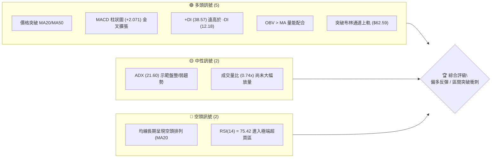
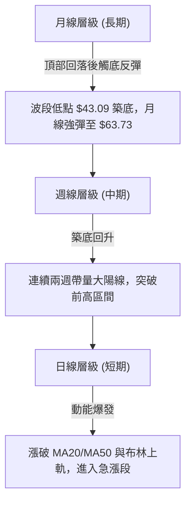
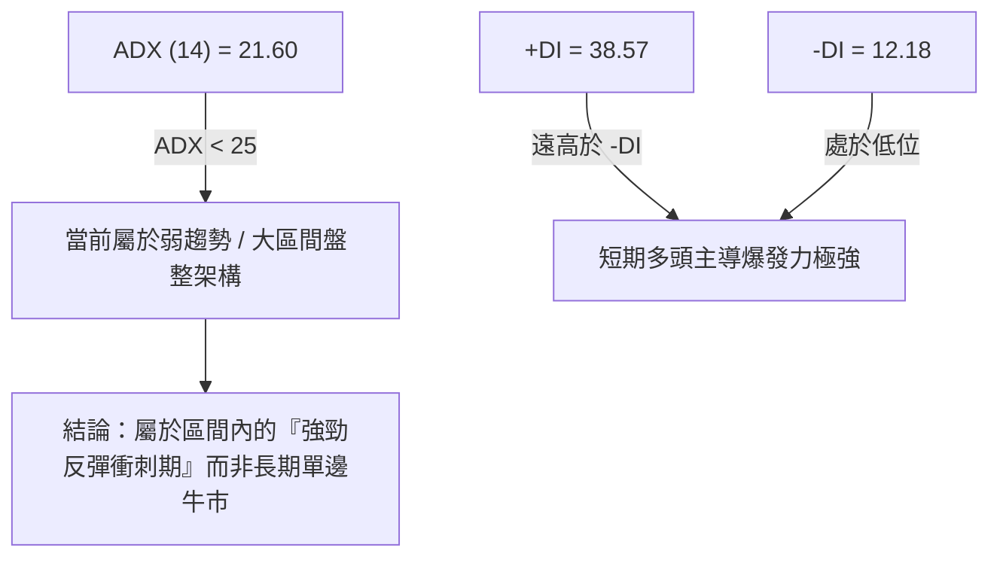
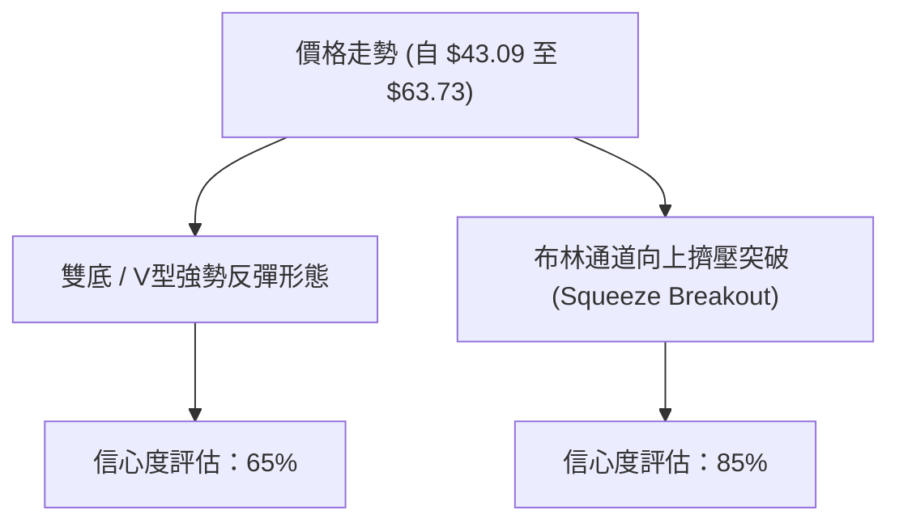
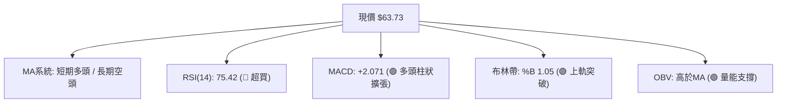
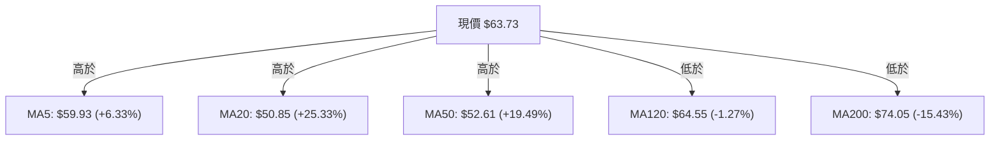
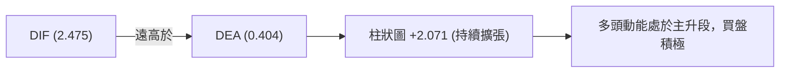
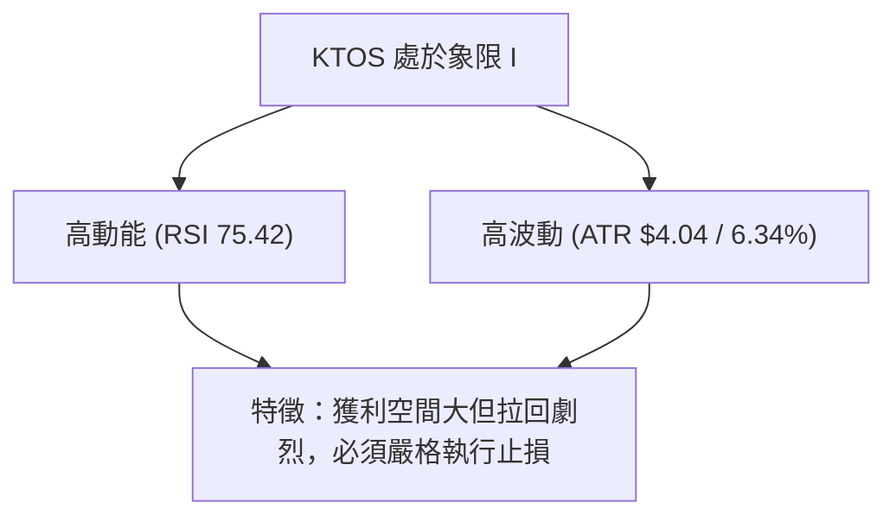
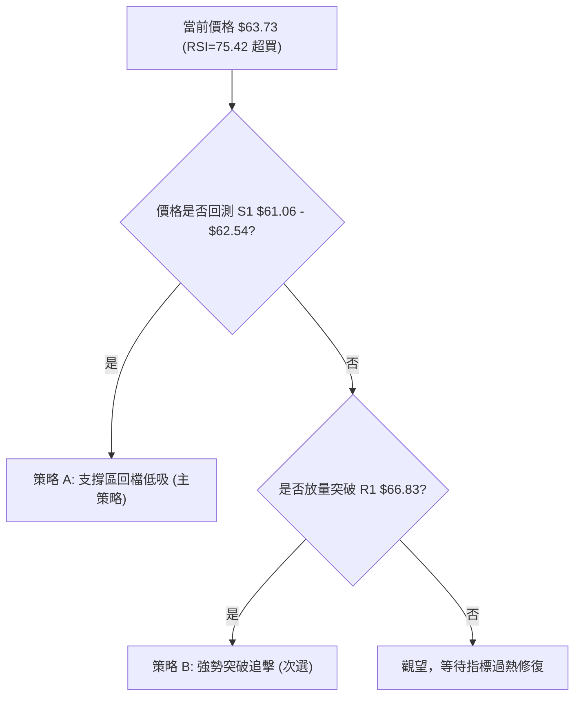
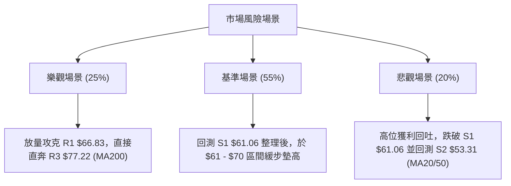

# KTOS 技術分析報告

> **報告日期**：2026-08-12 ｜ **語言**：繁體中文 ｜ **數據來源**：Yahoo Finance ｜ **當前價格**：$63.73

---

## 目錄

| 章節 | 內容 |
|------|------|
| [1. 技術面概覽](#1-技術面概覽) | 訊號儀表板、核心指標、評分卡 |
| [2. 趨勢分析](#2-趨勢分析) | 多時框趨勢、長中短期走勢 |
| [3. 圖表形態分析](#3-圖表形態分析) | 形態識別、K線組合、目標價 |
| [4. 支撐與阻力](#4-支撐與阻力) | 關鍵價位、斐波那契回調 |
| [5. 技術指標深度解讀](#5-技術指標深度解讀) | MA/RSI/MACD/布林/成交量 |
| [6. 動能與波動率](#6-動能與波動率) | 動能評估、ATR、Beta |
| [7. 多時框架總結](#7-多時框架總結) | 時框架評分矩陣 |
| [8. 交易策略建議](#8-交易策略建議) | 多空策略、風險報酬比 |
| [9. 風險提示與監控](#9-風險提示與監控) | 監控指標、風險場景 |

---

## 1. 技術面概覽

### 🎯 技術訊號儀表板



### 📊 核心指標速覽表

| 指標類別 | 指標名稱 | 當前數值 | 訊號 | 解讀 |
|----------|----------|----------|------|------|
| **價格** | 當前價格 | $63.73 | 🟢 多頭 | 位於 52 週區間 22.7% 處，自底部 $43.09 強勢反彈 |
| **均線** | MA20 / MA50 | $50.85 / $52.61 | 🟢 多頭 | 站上短期與中期均線，短線強勢 |
| **均線** | MA200 | $74.05 | 🔴 空頭 | 價格仍位於長天期均線下方，長期趨勢受壓 |
| **均線結構**| 均線排列 | 空頭排列 | 🟡 中性 | MA20<MA50<MA200，但價格急漲正進行結構修正 |
| **動能** | RSI(14) | 75.42 | 🔴 超買 | 極端超買 (>70)，短線面臨獲利回吐壓力 |
| **動能** | MACD (12,26,9) | 2.475 / Hist +2.071 | 🟢 多頭 | 快慢線金叉且柱狀圖顯著擴張，多頭動能強勁 |
| **動能** | Stoch %K / %D | 99.52 / 95.88 | 🔴 超買 | 進入高位鈍化區 |
| **趨勢強度**| ADX (14) | 21.60 | 🟡 盤整 | ADX < 25 表示市場總體處於大區間震盪構造 |
| **波動** | ATR (14) | $4.04 (6.34%) | 🟡 中高 | 每日價格波動幅度較大，需注意止損設定 |
| **通道** | 布林通道 %B | 1.05 | 🟢 多頭 | 價格向上向上突破布林上軌 ($62.59) |

### 🏆 技術評分卡

```
╔══════════════════════════════════════════════════════════════╗
║              技術評分卡 — KTOS (2026-08-12)                  ║
╠══════════════════════════════════════════════════════════════╣
║ 趨勢強度      ████████████░░░░░░░░  60/100  🟡 中性 (ADX=21.6)║
║ 動能指標      ████████████████░░░░  80/100  🟢 強勁 (MACD擴張)║
║ 支撐穩定度    ██████████████░░░░░░  70/100  🟢 良好 (S1=$61.06)║
║ 成交量配合    ██████████░░░░░░░░░░  50/100  🟡 一般 (0.74x 均量)║
║ 形態完整度    ██████████████░░░░░░  70/100  🟢 底部強勢強彈  ║
║ 均線排列      ████████░░░░░░░░░░░░  40/100  🔴 弱勢 (受制MA200)║
╠══════════════════════════════════════════════════════════════╣
║ 綜合評分      █████████████░░░░░░░  62/100  🟢 偏多反彈/衝刺 ║
╚══════════════════════════════════════════════════════════════╝
```

---

## 2. 趨勢分析

### 🌐 多時框趨勢分析



### 📈 長期趨勢 — 12個月走勢圖（Unicode）

```
KTOS 月線走勢圖（過去12個月：2025-08 至 2026-08）
價格軸 ($)
$100 ┤              ● 91.37  ● 90.60
$90  ┤                     \ /
$80  ┤                      ● 76.10  ● 75.91
$70  ┤                                \ /      ● 70.51
$65  ┤  ● 65.84                                 \       ● 64.13       ● 63.73 (現價)
$60  ┤                                           ● 63.05 \           /
$50  ┤                                                    ● 49.86  ● 46.60 (底部)
     └───────────────────────────────────────────────────────────────────────────
       08/25  09/25  10/25  11/25  12/25  03/26  04/26  05/26  06/26  07/26  08/26
```

**走勢特徵分析表格**：

| 階段 | 時間區間 | 價格區間 | 漲跌幅 | 走勢特徵與結構 |
|------|----------|----------|--------|----------------|
| **高位拉回** | 2025-09 至 2025-10 | $91.37 → $90.60 | -0.84% | 於 $90 上方見頂，成交量開始萎縮，高位滯漲 |
| **深幅修正** | 2025-11 至 2026-04 | $76.10 → $63.05 | -17.1% | 跌破天期均線，多頭籌碼鬆動，進入震盪下行通道 |
| **探底築底** | 2026-06 至 2026-07 | $49.86 → $46.60 | -6.54% | 下探 52 週低點 $43.09 附近，成交量於 $47.21 週放量至 4,538萬股，顯現換手 |
| **強勢反彈** | 2026-08 (最新) | $46.60 → $63.73 | **+36.76%** | 單月強勁反彈，長陽K線一舉包覆前三個月實體 |

### 📊 中期趨勢（週線分析）

從近 20 週數據觀察，KTOS 在 2026 年 6 月底至 7 月底於 $46.03–$47.35 進行了二次測底（7/19 收盤 $46.03、8/02 收盤 $46.60）。8 月第 2 週（8/09）出現決定性爆發，週收盤大漲至 $60.77（週 RSI 升至 74.1），本週進一步推升至 $63.73。

```
週線支撐壓力結構示意圖：
阻力 R3 ── $77.22 ══════════════════════════════════════ (斐波那契 61.8% / MA200 壓力)
阻力 R1 ── $66.83 ────────────────────────────────────── (近一年高點聚類)
當前價格 ── $63.73 ◄◄◄ 多頭強勢上攻中
支撐 S1 ── $61.06 ────────────────────────────────────── (關鍵轉折支撐 / 近期波段高點轉化)
支撐 S2 ── $53.31 ══════════════════════════════════════ (MA20/MA50 密集群)
```

### ⚡ 趨勢強度評估（ADX 解讀）



| 指標 | 數據 | 趨勢強度判定 | 操作含義 |
|------|------|--------------|----------|
| **ADX(14)** | 21.60 | 弱趨勢 / 盤整區間 | 不宜在超買高位盲目追高，需預防回測區間軌道 |
| **+DI / -DI** | 38.57 / 12.18 | 多頭絕對主導 | 多方控盤，任何回檔至支撐位皆為技術性買點 |

---

## 3. 圖表形態分析

### 🔍 形態識別系統



**形態信心度表格**：

| 形態類別 | 信心度 | 判斷依據（引用數據） | 完成度 | 目標價（附計算式） |
|----------|--------|----------------------|--------|--------------------|
| **V型強勢反彈** | 65% | 7月在 $46.03–$46.60 觸底後，連續兩週強陽線吞噬前期陰線 | 80% | 底部 $46.03 + (頸線 $61.06 - $46.03 = $15.03) = **$76.09** (接近 R3 $77.22) |
| **布林帶上軌突破** | 85% | 現價 $63.73 > BB 上軌 $62.59，%B 達到 1.05 | 100% | 沿通道上軌推升，短線理論目標看至 R1 **$66.83** |
| **頭肩底形態** | 35% | 數據不足以支撐左肩與右肩之對稱幾何幾何結構 | 20% | *訊號不足，僅做指標型解讀，不預設目標價* |

### 🕯️ 重要 K 線形態分析

| 月份/週期 | 收盤價 | K 線形態 | 解讀 | 訊號 |
|-----------|--------|----------|------|------|
| **2026-06 (月)** | $49.86 | 大陰線 | 賣壓宣洩，下探 52 週低點 | 🔴 空頭勝 |
| **2026-07 (月)** | $46.60 | 帶下影線小陰線 | 跌勢放緩，低檔出現買盤承接 ($43.09見底) | 🟡 止跌訊號 |
| **2026-08 (最新)**| $63.73 | 長陽包覆 K 線 | 強勢大陽線一舉吞噬前兩月陰線實體，多頭強烈反攻 | 🟢 強烈看多 |

### 📉 ASCII 走勢形態示意圖

```
KTOS 雙底/V型反彈與布林突破形態示意圖
 價位 ($)
 $77.22 ┤                                            [目標 R3 / MA200]
        │                                           /
 $66.83 ┤                                     [R1] /
 $63.73 ┤───────────────────────────────● 現價 (突破BB上軌 $62.59)
 $61.06 ┤                       ┌───────┘ [頸線突破位 S1]
 $53.31 ┤        ●             /  [MA20/MA50 支撐聚類 S2]
 $46.03 ┤────────┴──●─────────┘   [雙底底部區間 $43.09 - $46.03]
        └────────────────────────────────────────────────────────
```

---

## 4. 支撐與阻力

### 🗺️ 關鍵價位分布圖（Unicode）

```
KTOS 價位結構分布圖（以當前價格 $63.73 為核心）
════════════════════════════════════════════════════════════════════
$134.00 ║████████████████████████████████████████║ 52W 最高價 (0.0% Fib)
$77.22  ║████████████████████████████            ║ 強阻力 R3 / (61.8% Fib: $77.82)
$69.91  ║████████████████                        ║ 阻力 R2
$66.83  ║██████████                              ║ 關鍵近端阻力 R1
$63.73  ╠════════════════════════════════════════╣ ◄◄◄ 當前收盤價 $63.73
$62.54  ║▓▓▓▓▓▓▓▓▓▓▓▓▓▓▓▓▓▓▓▓▓▓▓▓▓▓▓▓            ║ 斐波那契 78.6% 回調位
$61.06  ║▓▓▓▓▓▓▓▓▓▓▓▓▓▓▓▓                        ║ 第一支撐 S1 (近端防守)
$53.31  ║████████████████████████████            ║ 中期強支撐 S2 (MA20/MA50)
$51.66  ║████████████████████████████████        ║ 結構性強支撐 S3
$43.09  ║████████████████████████████████████████║ 52W 最低價 (100.0% Fib)
════════════════════════════════════════════════════════════════════
```

### 🚧 阻力位分析表

| 阻力級別 | 精確價位 | 形成原因（嚴格引用數據） | 突破難度 | 重要性 |
|----------|----------|--------------------------|----------|--------|
| **R1** | **$66.83** | 近一年波段高點聚類（距離現價 +4.86%） | 🟡 中等 | 短線多頭衝刺首要關卡 |
| **R2** | **$69.91** | 近一年波段高點聚類（距離現價 +9.70%） | 🟡 中等 | 中期解套賣壓區 |
| **R3** | **$77.22** | 近一年波段高點聚類 / 接近 MA200 ($74.05) 與 61.8% Fib ($77.82) | 🔴 極高 | 牛熊分水嶺，強轉向阻力 |

### 🛡️ 支撐位分析表

| 支撐級別 | 精確價位 | 形成原因（嚴格引用數據） | 守住機率 | 重要性 |
|----------|----------|--------------------------|----------|--------|
| **S1** | **$61.06** | 近一年波段低點聚類 / 剛突破之頸線區（距離現價 -4.20%） | 🟢 80% | 短線多頭防守關鍵點 |
| **S2** | **$53.31** | 近一年波段低點聚類 / MA20($50.85)與MA50($52.61)防線 | 🟢 85% | 中期趨勢防線 |
| **S3** | **$51.66** | 近一年波段低點聚類（距離現價 -18.94%） | 🟢 90% | 強烈結構底座 |

### 📐 斐波那契回調位分析

基於 52 週高低點區間（高點 **$134.00** → 低點 **$43.09**，總波幅 **$90.91**）：

| 斐波那契比例 | 計算價位 | 當前價格相對位置與解讀 |
|--------------|----------|------------------------|
| **0.0%** (52W High) | $134.00 | 歷史高點區間 |
| **23.6%** | $112.55 | 長期多頭終極目標 |
| **38.2%** | $99.27 | 分析師平均目標價 ($107.14) 附近 |
| **50.0%** | $88.55 | 中長期轉勢關鍵點 |
| **61.8%** | $77.82 | 與阻力位 R3 ($77.22) 高度重合，強阻力帶 |
| **78.6%** | **$62.54** | **當前價格 $63.73 正好落在 78.6% ($62.54) 上方！** |
| **100.0%** (52W Low) | $43.09 | 本輪築底起漲點 |

**解讀**：價格已成功站上 78.6% 回調位 ($62.54)，表明自 $43.09 以來的反彈極具韌性。若能持續穩定在 $62.54 以上，下一斐波那契目標將直指 61.8% 回調位 ($77.82)。

---

## 5. 技術指標深度解讀

### 🎛️ 指標訊號總覽



### 📈 移動平均線排列分析



- **均線結構分析**：目前 MA20 ($50.85) < MA50 ($52.61) < MA200 ($74.05)，長天期呈現標準空頭排列。但短期價格 ($63.73) 強勢拉升，已一舉突破 MA5、MA10、MA20、MA50 與 MA60，正迎面挑戰 MA120 ($64.55)。
- **交叉預測**：MA5 ($59.93) 向上急衝，近期即將與 MA20/MA50 形成金叉，將帶動短中期均線翻多。

### 📉 RSI(14) 分析

```
RSI(14) 強度進度條：
0                        50             70  75.42    100
├────────────────────────┼──────────────┼───█────────┤ 🔴 超買
```

- **現狀**：RSI(14) 最新讀數為 **75.42**，已進入 >70 的過熱區間。
- **背離檢查**：觀察價格自 $46.60 升至 $63.73，RSI 自 49.3 同步飆升至 75.42，高點遞增，**無明顯頂背離或底背離**。
- **結論**：RSI 展現強烈動能，但在超買區可能引發短線的指標修復回檔（回測 S1 $61.06）。

### 📊 MACD(12/26/9) 訊號解讀

- **DIF 線**：2.475
- **DEA 訊號線**：0.404
- **MACD 柱狀圖**：**+2.071** 🟢



### 📦 布林通道分析

```
布林通道結構示意圖：
$62.59 ── 上軌 ───────────────────● 現價 $63.73 (%B = 1.05，向上突破)
$50.85 ── 中軌 (MA20) ────────────
$39.11 ── 下軌 ───────────────────
```

- **帶寬與位置**：%B 為 1.05，價格已穿透布林帶上軌（$62.59）。
- **解讀**：布林帶呈喇叭開口擴張狀，屬於典型「帶狀突破（Band Walk）」強勢特徵，但也意味著短線乖離偏大，隨時有向軌內回測 $62.54 / $61.06 的需求。

### 💹 成交量分析（量價配合度）

- **成交量數據**：最新成交量 3,009,828 股，低於 20 日均量 (4,042,436) 及 50 日均量 (4,716,175)，量比為 **0.74x**。
- **OBV 趨勢**：數據顯示 **OBV > MA**，量能總體趨勢支援價格上漲。
- **量價評價**：本波急速反彈主要由籌碼鎖定與空頭回補推動，若欲進一步突破阻力 R1 ($66.83)，成交量必須放大至 450 萬股以上（超越 20日/50日均量）方能有效確認。

---

## 6. 動能與波動率

### ⚡ 動能評估四象限

| 象限區間 | 動能強度 | 波動率 | 當前 KTOS 狀態 | 交易策略導向 |
|----------|----------|--------|----------------|--------------|
| **象限 I** | 強動能 (MACD/RSI高) | 高波動 (ATR 6.34%) | **✓ 當前位置** | **追蹤止損 / 乘勝追擊** |
| **象限 II**| 弱動能 | 低波動 | — | 觀望休整 |
| **象限 III**| 弱動能 | 高波動 | — | 恐慌殺跌，嚴禁接刀 |
| **象限 IV**| 強動能 | 低波動 | — | 穩健突破買點 |



### 📊 ATR 波動率分析

- **ATR(14)**：**$4.04**（占現價 **6.34%**）
- **應用指導**：
  - **1.0x ATR 風險區間**：$4.04（日內正常波幅）
  - **1.5x ATR 止損距離**：$6.06（建議之波段交易止損寬度）
  - **2.0x ATR 追蹤止損**：$8.08

### 📐 Beta 與市場相關性

- **Beta 係數**：**1.106**
- **解讀**：KTOS 波動度略高於整體大盤（S&P 500），屬於中高彈性個股。在國防國安板塊領漲時，KTOS 通常具備較強的超額收益（Alpha）爆發力。

---

## 7. 多時框架總結

### 📋 時框架評分表

| 時框架 | 趨勢方向 | 動能狀態 | 均線排列 | 形態結構 | 綜合評分 | 交易建議 |
|--------|----------|----------|----------|----------|----------|----------|
| **日線 (短期)** | 🟢 看多 | 🔴 超買 (RSI 75) | 🟢 站上MA20/50 | 🟢 帶狀突破 | **75/100** | 等待微幅回測拉回買進 |
| **週線 (中期)** | 🟢 看多 | 🟢 擴張 (MACD+) | 🟡 橫向築底 | 🟢 底部V型強彈 | **65/100** | 偏多操作，目標 R1/R3 |
| **月線 (長期)** | 🔴 看空 | 🟡 中性恢復 | 🔴 受制MA200 | 🟡 大區間震盪 | **45/100** | 受限於 $77 阻力帶 |

### 🔲 綜合訊號矩陣

```
┌──────────┬─────────────┬─────────────┬─────────────┐
│ 時框架   │ 短期 (日線) │ 中期 (週線) │ 長期 (月線) │
├──────────┼─────────────┼─────────────┼─────────────┤
│ 趨勢方向 │ 🟢 強勢多頭 │ 🟢 多頭復甦 │ 🔴 震盪偏空 │
│ 動能強度 │ 🟢 極強過熱 │ 🟢 穩定增強 │ 🟡 止跌回升 │
│ 支撐防守 │ $61.06 (S1) │ $53.31 (S2) │ $43.09 (52W)│
│ 阻力關卡 │ $66.83 (R1) │ $69.91 (R2) │ $77.22 (R3) │
└──────────┴─────────────┴─────────────┴─────────────┘
```

### ⚖️ 多時框收斂結論

依「多時框收斂規則」：
1. **ADX = 21.60 (<25)**，確認當前宏觀架構為**大區間震盪/盤整格局**（介於 $43.09 與 $77.22 之間）。
2. 主導時框中，長期均線 MA200 ($74.05) 形成壓制，日線雖爆發強勁多頭動能（RSI 75.42、MACD擴張），但受限於 ADX 盤整環境與日線超買，**不可盲目追高**。
3. **最終收斂結論：偏多反彈但進入阻力區震盪**。交易應以「日線拉回至第一支撐 S1 ($61.06) / 斐波那契 78.6% ($62.54) 佈局做多」為主策略，目標鎖定 R1 ($66.83) 與 R3 ($77.22)。

---

## 8. 交易策略建議

### 🗺️ 策略決策流程圖



### 🧭 策略路由

> **當前主策略方向 = 🟢 偏多（依評分 62/100，採用「低吸回檔 / 區間突破」主策略）**

### 🎯 價格情境階梯（Price Scenarios）

| 觸發條件 | 下一目標 | 後續延伸 | 情境含義 |
|----------|----------|----------|----------|
| **突破 R1 $66.83** | R2 $69.91 | R3 $77.22 | 短線強勢延伸，挑戰牛熊分水嶺 |
| **站穩 S1 $61.06 / $62.54** | R1 $66.83 | R2 $69.91 | 健康回測，多頭籌碼整固 |
| **跌破 S1 $61.06** | S2 $53.31 | S3 $51.66 | 反彈受阻，回測中期均線防線 |

### 📊 情境機率分佈

| 情境 | 機率 | 主要依據 |
|------|------|----------|
| **回測 S1 後繼續上行** | **55%** | MACD 柱狀圖 (+2.071) 強勁擴張，OBV 趨勢向上支持反彈 |
| **高位小幅區間震盪** | **30%** | ADX (21.60) 顯示整體為盤整格局，RSI 需時間消化超買 |
| **跌破 S1 深幅回落** | **15%** | 長期均線空頭排列 (MA200 $74.05)，量能若萎縮易遭壓制 |

### 🟢 主策略詳情

#### 策略 A：支撐區回檔低吸（主策略 🥇）

- **進場邏輯**：RSI 超買後技術性回測 78.6% 斐波那契位 ($62.54) 及 S1 ($61.06) 支撐區。
- **進場價格**：**$61.50 - $62.50** 區間
- **目標價 T1**：**$66.83** (R1 阻力位，預計收益 +7.8%)
- **目標價 T2**：**$77.22** (R3 阻力位 / 61.8% Fib，預計收益 +24.5%)
- **止損價格**：**$57.42** (S1 下方約 1x ATR，跌破代表反彈結束)
- **風險報酬比**：
  - 至 T1：($66.83 - $62.00) / ($62.00 - $57.42) = 4.83 / 4.58 = **1.05 : 1**
  - 至 T2：($77.22 - $62.00) / ($62.00 - $57.42) = 15.22 / 4.58 = **3.32 : 1**
- **成功機率**：65%
- **建議倉位**：**15% - 20%**

#### 策略 B：放量突破追擊（次選策略 🥈）

- **進場邏輯**：日線帶量（成交量 > 450 萬股）強勢突破 R1 ($66.83) 阻力。
- **進場價格**：**$67.10** (突破 R1 確認後)
- **目標價 T1**：**$69.91** (R2 阻力位)
- **目標價 T2**：**$77.22** (R3 阻力位)
- **止損價格**：**$63.00** (R1 突破口轉化之支撐下方)
- **風險報酬比**：($77.22 - $67.10) / ($67.10 - $63.00) = 10.12 / 4.10 = **2.47 : 1**
- **成功機率**：50%
- **建議倉位**：**10%**

### 🔴 反向風險觸發點（對沖提示）

若價格未能在 S1 ($61.06) 獲得支撐，反向收盤跌破 **$53.31 (S2)**，代表本輪自 $43.09 的反彈失敗，多頭應全面停損離場或進行對沖。

### ⭐ 整體訊號強度評星

```
做多訊號強度：★★██☆  (3.5/5星)
做空訊號強度：★☆☆☆☆  (1.5/5星)
整體可信度：  ████☆  (4.0/5星)
```

---

## 9. 風險提示與監控

### ✅ 關鍵監控指標 Checklist

```
╔══════════════════════════════════════════════════════════════╗
║                每日技術監控 CheckList                        ║
╠══════════════════════════════════════════════════════════════╣
║ [ ] 1. 價格是否守穩 S1 ($61.06) 及 78.6% Fib ($62.54)        ║
║ [ ] 2. RSI(14) 是否順利從過熱區 (75.42) 回落至 50-60 健康區║
║ [ ] 3. 成交量能否放量超越 20日均量 (4,042,436 股)            ║
║ [ ] 4. MACD 柱狀圖 (+2.071) 是否出現高點收縮縮頭             ║
║ [ ] 5. 向上能否有效突破 R1 ($66.83) 關卡                     ║
╚══════════════════════════════════════════════════════════════╝
```

### ⚠️ 風險場景分析



### 🛡️ 風險管理重要提醒

1. **過熱指標風險**：RSI 達 75.42 且布林 %B 為 1.05，短線隨時有技術性回檔需求，**切忌在現價 $63.73 直接滿倉追高**。
2. **波動度保護**：KTOS 的 ATR 為 $4.04（6.34%），單日波幅較大。設定止損時必須留足至少 1.5x ATR ($6.06) 的緩衝空間，避免被正常波幅震盪洗出場。
3. **長線均線壓制**：上方 MA200 位於 $74.05，且 R3 ($77.22) 處於強阻力帶，中期獲利目標建議設定在 $76.00–$77.00 附近落袋為安。

---

## 📋 報告總結

```
╔══════════════════════════════════════════════════════════════════╗
║                   KTOS 技術分析報告總結                          ║
══════════════════════════════════════════════════════════════════
報告日期：2026-08-12
當前價格：$63.73
分析評級：🟢 偏多反彈 / 支撐區回檔低吸 (評分 62/100)

關鍵價位速查：
├─ 關鍵阻力：R1 $66.83  │  R2 $69.91  │  R3 $77.22
├─ 當前價格：$63.73 (已站上 78.6% Fib $62.54)
└─ 關鍵支撐：S1 $61.06  │  S2 $53.31  │  S3 $51.66

最優策略組合：
1. 🥇 最佳機會：等待價格回測 S1 區間 ($61.50 - $62.50) 佈局做多，
               目標看 R1 ($66.83) 與 R3 ($77.22)，止損設 $57.42。
2. 🥈 次選機會：若帶量突破 R1 ($66.83) 順勢追擊，目標看 R2/R3。
3. 🥉 分析師目標對照：華爾街 21 位分析師平均目標價為 $107.14 (Strong Buy)，
               長期基本面看好，技術面短期先聚焦反彈波段。
══════════════════════════════════════════════════════════════════
```

---

> ⚠️ **免責聲明**：本報告為 AI 自動生成之技術分析，所有數據及估算均基於提供的歷史價格資訊。本報告**僅供研究與學術參考**，**不構成任何投資建議**。投資有風險，入市需謹慎。

*報告生成時間：2026-08-12 ｜ 數據來源：Yahoo Finance ｜ 分析框架：多時框技術分析*