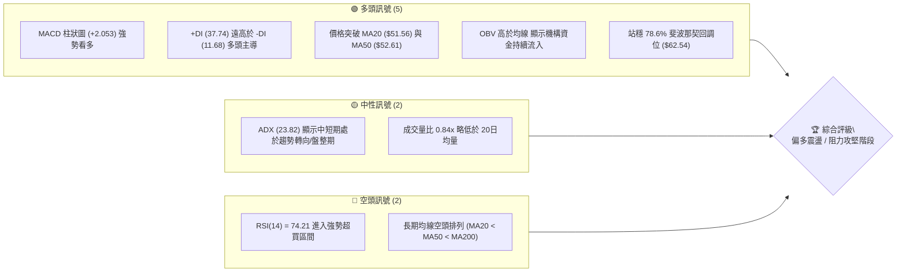
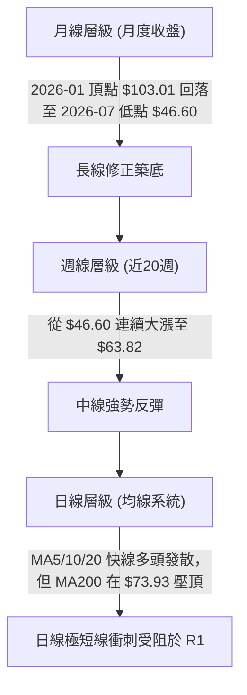
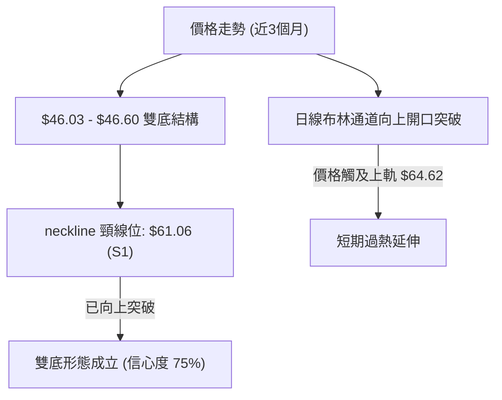
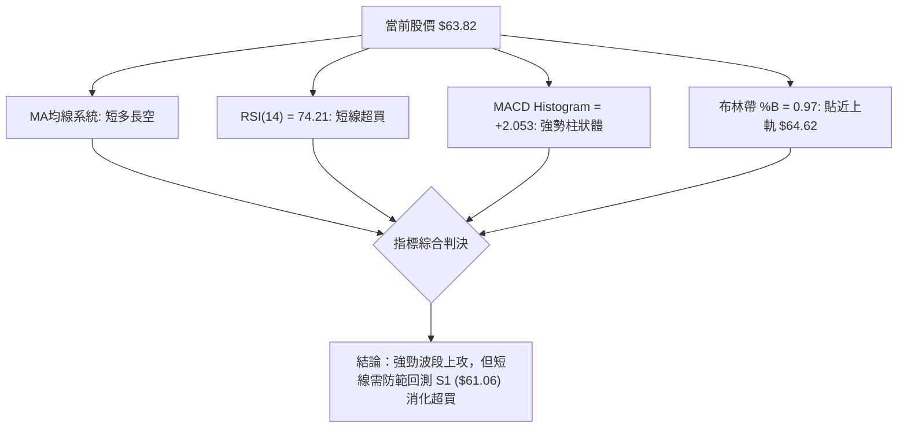
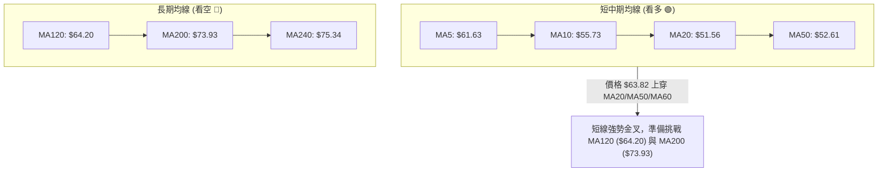
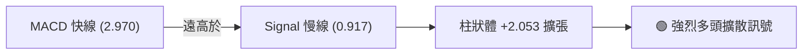
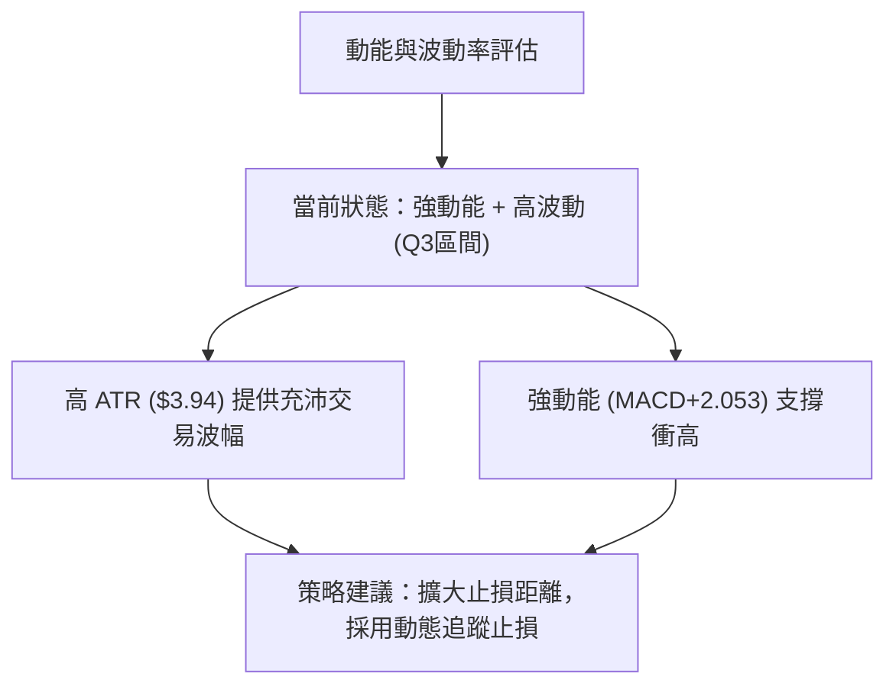
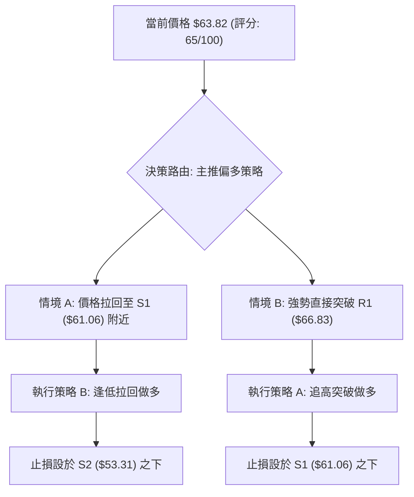
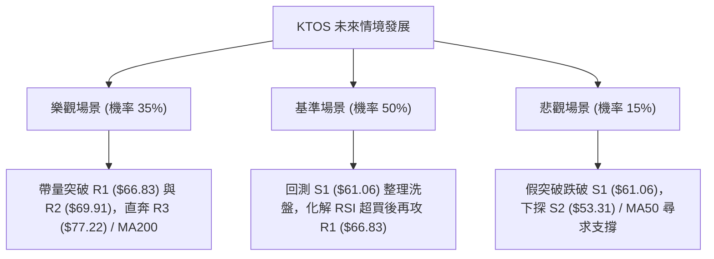

# KTOS 技術分析報告

> **報告日期**：2026-08-13 ｜ **語言**：繁體中文 ｜ **數據來源**：Yahoo Finance ｜ **當前價格**：$63.82

---

## 目錄

| 章節 | 內容 |
|------|------|
| [1. 技術面概覽](#1-技術面概覽) | 訊號儀表板、核心指標、評分卡 |
| [2. 趨勢分析](#2-趨勢分析) | 多時框趨勢、長中短期走勢 |
| [3. 圖表形態分析](#3-圖表形態分析) | 形態識別、K線組合、目標價 |
| [4. 支撐與阻力](#4-支撐與阻力) | 關鍵價位、斐波那契回調 |
| [5. 技術指標深度解讀](#5-技術指標深度解讀) | MA/RSI/MACD/布林/成交量 |
| [6. 動能與波動率](#6-動能與波動率) | 動能評估、ATR、Beta |
| [7. 多時框架總結](#7-多時框架總結) | 時框架評分矩陣 |
| [8. 交易策略建議](#8-交易策略建議) | 多空策略、風險報酬比 |
| [9. 風險提示與監控](#9-風險提示與監控) | 監控指標、風險場景 |

---

## 1. 技術面概覽

### 🎯 技術訊號儀表板



### 📊 核心指標速覽表

| 指標類別 | 指標名稱 | 當前數值 | 訊號 | 解讀 |
|----------|----------|----------|------|------|
| **價格** | 當前價格 | $63.82 | 🟢 | 位於 52週區間 22.8% 位置，近期劇烈反彈 |
| **均線** | MA20 | $51.56 | 🟢 | 價格在 MA20 上方 +23.79%，短線強勢 |
| **均線** | MA50 | $52.61 | 🟢 | 價格在 MA50 上方 +21.31%，突破中期均線 |
| **均線** | MA200 | $73.93 | 🔴 | 價格在 MA200 下方 -13.68%，長線承壓 |
| **動能** | RSI(14) | 74.21 | 🔴 | 進入超買區（>70），短線存在拉回修正風險 |
| **動能** | MACD | 2.970 | 🟢 | MACD柱 +2.053，多頭動能非常強勁 |
| **趨勢** | ADX(14) | 23.82 | 🟡 | ADX < 25 屬盤整/趨勢孕育期，+DI 達 37.74 多頭主導 |
| **波動** | ATR(14) | $3.94 | 🟡 | 占股價 6.17%，日內波動偏高 |
| **通道** | 布林 %B | 0.97 | 🔴 | 貼近布林上軌 ($64.62)，極度超買 |

### 🏆 技術評分卡

```
╔══════════════════════════════════════════════════════════════════╗
║                   技術評分卡 — KTOS (2026-08-13)                  ║
╠══════════════════════════════════════════════════════════════════╣
║ 趨勢強度      ████████████░░░░░░░░  60/100  🟡 中性偏多    ║
║ 動能指標      ████████████████░░░░  80/100  🟢 動能極強    ║
║ 支撐穩定度    ██████████████░░░░░░  70/100  🟢 底部堅實    ║
║ 成交量配合    ████████████░░░░░░░░  60/100  🟡 量能中等    ║
║ 形態完整度    ██████████████░░░░░░  70/100  🟢 底部完成    ║
║ 均線排列      ████████░░░░░░░░░░░░  40/100  🔴 長線空頭    ║
╠══════════════════════════════════════════════════════════════════╣
║ 綜合評分      █████████████░░░░░░░  65/100  🟢 偏多進攻態勢 ║
╚══════════════════════════════════════════════════════════════════╝
```

---

## 2. 趨勢分析

### 🌐 多時框趨勢分析



### 📈 長期趨勢 — 24個月走勢圖（Unicode）

```
KTOS 24個月歷史走勢圖 (2024-08 至 2026-08)
價格軸 ($)
$105 ┤                                  ● $103.01
$95  ┤                          ● $91.37
$85  ┤                                        ● $86.18
$75  ┤                                  ●            
$65  ┤                      ● $65.84                      ● $63.82 (現在)
$55  ┤               ● $58.70                       ●
$45  ┤                                                    ● $46.60 (低點)
$35  ┤         ● $33.78
$25  ┤●━━━●━━━━━
     └───────────────────────────────────────────────────────────
      24-08 24-11 25-01 25-05 25-08 25-10 26-01 26-03 26-06 26-08
```

#### 走勢特徵分析表格

| 階段 | 時間區間 | 最高/最低價 | 漲跌幅 | 主要走勢特徵 |
|------|----------|-------------|--------|--------------|
| **第一階段** | 2024-08 ~ 2025-01 | $22.72 → $33.37 | +46.88% | 穩健震盪上行，打築長期底部 |
| **第二階段** | 2025-02 ~ 2025-09 | $26.39 → $91.37 | +246.23% | 主升段爆發，國防軍工板塊資金強勢流入 |
| **第三階段** | 2025-10 ~ 2026-01 | $75.91 → $103.01 | +35.70% | 高位劇烈洗盤後二次拉高創歷史新高 |
| **第四階段** | 2026-02 ~ 2026-07 | $103.01 → $46.60 | -54.76% | 深幅回調修正，回測 52週低點 $43.09 附近 |
| **第五階段** | 2026-07 ~ 2026-08 | $46.60 → $63.82 | +36.95% | V型強勁反彈，連續突破 MA20、MA50 與 78.6% Fib |

### 📊 中期趨勢（週線分析）

近20週數據顯示，KTOS 在 2026年7月7日當週下探至 $46.03~$46.60 區域後，成功確立雙重底支撐。近兩週（08-09 至 08-16）成交量顯著放大（分別為 28,967,900 與 10,928,927），週收盤價由 $46.60 跳升至 $63.82，RSI 自 49.3 迅速拉升至 74.2，MACD柱狀圖擴張至 +2.053，顯示買盤資金在底部強烈卡位。

### ⚡ 趨勢強度評估（ADX 解讀）

```mermaid
graph TD
    A["ADX(14) = 23.82"] -->|"ADX < 25"| B["趨勢強度偏弱 / 處於無趨勢或盤整轉向期"]
    C["+DI(14) = 37.74"] -->|"-DI("14") = 11.68"| D["+DI 遠大於 -DI (差距 26.06)"]
    B --> E["結論：多頭動能極強，但整體架構仍在築底後的突破初期"]
    D --> E
```

| 指標 | 當前數值 | 參考標準 | 趨勢解讀 |
|------|----------|----------|----------|
| **ADX** | 23.82 | < 25 弱趨勢/盤整 | 市場先前經歷大幅回調，目前處於自低點強勢反彈的初段，ADX 尚未完全反應動能 |
| **+DI** | 37.74 | > 25 多頭占優 | 買方控制市場，具備強烈的向上推升意願 |
| **-DI** | 11.68 | < 15 賣方潰退 | 空頭拋壓顯著衰退，下行風險暫時解除 |

---

## 3. 圖表形態分析

### 🔍 形態識別系統



#### 形態信心度與目標價評估

| 形態 | 信心度 | 判斷依據（引用數據） | 完成度 | 目標價（附計算式） |
|------|--------|----------------------|--------|--------------------|
| **雙重底 (W底)** | 75% | 2026-07-19 ($46.03) 與 2026-08-02 ($46.60) 形成雙底，並突破頸線 $61.06 (S1) | 100% (已突破) | 頸線 $61.06 + (頸線 $61.06 - 低點 $46.03) = **$76.09** |
| **布林帶向上擠壓突破** | 70% | 價格 $63.82 升至上軌 $64.62，%B 達到 0.97 | 90% | 觸及阻力區 R1 **$66.83** / R2 **$69.91** |
| **頭肩頂/底** | 20% | 數據中未偵測到標準頭肩形態 | 0% | 訊號不足，僅做指標型解讀 |

### 🕯️ 重要K線形態分析

| 週次/日期 | 收盤價 | K線形態 | 解讀 | 訊號 |
|-----------|--------|---------|------|------|
| 2026-07-19 | $46.03 | 下影長K線 | 探底成功，賣壓耗盡，形成第一個築底腳 | 🟢 底訊 |
| 2026-08-02 | $46.60 | 止跌小陽線 | 築點第二個腳，成交量萎縮至 1,479萬，籌碼鎖死 | 🟢 築底 |
| 2026-08-09 | $60.77 | 大陽線實體 | 帶量長陽突破，RSI 跳升至 74.1，強勢反攻 | 🟢 突破 |
| 2026-08-16 | $63.82 | 高位小陽線 | 突破 $62.54 (78.6% Fib)，面臨 R1 $66.83 壓力 | 🟡 消化 |

### 📉 ASCII 走勢形態示意圖

```
KTOS 雙底突破與斐波那契結構示意圖
═══════════════════════════════════════════════════════════════
$77.22 ┤------------------------------------------------ [R3 阻力 / Fib 61.8%]
       │
$69.91 ┤------------------------------------------------ [R2 阻力]
$66.83 ┤------------------------------------------------ [R1 阻力]
$63.82 ┤.........................................▲ 現在  [布林上軌 $64.62]
$62.54 ┤======================突破頸線=================== [Fib 78.6%]
$61.06 ┤----------------------(S1 頸線位)----------------- [S1 支撐]
       │         ▲                      ▲
       │        ╱ ╲                    ╱ ╲
$53.31 ┤-------╱---\------------------╱---\------------- [S2 支撐]
       │      ╱     ╲                ╱     ╲
$46.03 ┤─────●───────╲──────────────●───────╲─────────── [底部腳1 & 腳2]
       └───────────────────────────────────────────────────────
            07-19                  08-02        08-16
```

### 🎯 形態目標價計算

根據雙底形態（Double Bottom）公式計算：
1. **形態低點**：$46.03
2. **突破頸線**：$61.06
3. **形態垂直高度**：$61.06 - $46.03 = $15.03
4. **最小測量目標價**：頸線 $61.06 + 高度 $15.03 = **$76.09**
   *註：此目標價與阻力位 R3 ($77.22) 以及 斐波那契 61.8% 回調位 ($77.82) 極度接近，形成高度多頭目標重合區。*

---

## 4. 支撐與阻力

### 🗺️ 關鍵價位分布圖（Unicode）

```
KTOS 價位結構分布圖 (當前價格: $63.82)
═══════════════════════════════════════════════════════════════
$134.00 ║████████████████████████████████║ 52週歷史高點 (0.0% Fib)
$112.55 ║████████████████████            ║ 23.6% 斐波那契回調位
$99.27  ║████████████████                ║ 38.2% 斐波那契回調位
$88.55  ║████████████                    ║ 50.0% 斐波那契回調位
$77.82  ║████████████████████████████████║ 61.8% Fib / MA200 ($73.93)
$77.22  ║████████████████████████        ║ 強阻力 R3
$69.91  ║████████████████                ║ 阻力 R2
$66.83  ║████████████████████            ║ 近期阻力 R1
$64.62  ║--------------------------------║ 布林上軌 (BB Upper)
$63.82  ╠════════════════════════════════╣ ◄ 當前價格 $63.82
$62.54  ║▓▓▓▓▓▓▓▓▓▓▓▓▓▓▓▓▓▓▓▓▓▓▓▓▓▓▓▓▓▓▓▓║ 78.6% 斐波那契回調位
$61.06  ║▓▓▓▓▓▓▓▓▓▓▓▓▓▓▓▓▓▓▓▓            ║ 近期關鍵支撐 S1 (頸線)
$53.31  ║████████████████████████        ║ 強支撐 S2 / MA50 ($52.61)
$51.66  ║████████████████                ║ 支撐 S3 / MA20 ($51.56)
$43.09  ║████████████████████████████████║ 52週歷史低點 (100.0% Fib)
═══════════════════════════════════════════════════════════════
```

### 🚧 阻力位分析表

| 阻力級別 | 價位 | 形成原因 | 突破難度 | 重要性 |
|----------|------|----------|----------|--------|
| **R1** | $66.83 | 近一年波段高點聚類 / 靠近布林上軌 $64.62 | 🟡 中等 | 短線多頭防線，衝高首要考驗 |
| **R2** | $69.91 | 近一年波段高點聚類 / 70整數關卡壓頂 | 🟡 中等 | 中期反彈強弱分水嶺 |
| **R3** | $77.22 | 近一年波段高點聚類 / 鄰近 MA200 ($73.93) 與 61.8% Fib ($77.82) | 🔴 極高 | 牛熊長期趨勢決戰區 |

### 🛡️ 支撐位分析表

| 支撐級別 | 價位 | 形成原因 | 守住機率 | 重要性 |
|----------|------|----------|----------|--------|
| **S1** | $61.06 | 近一年波段低點聚類 / 雙底突破頸線 / 靠近 78.6% Fib ($62.54) | 🟢 75% | 短線拉回最佳買點與多頭防守站 |
| **S2** | $53.31 | 近一年波段低點聚類 / 緊鄰 MA50 ($52.61) 與 MA60 ($53.53) | 🟢 85% | 中期生命線支撐 |
| **S3** | $51.66 | 近一年波段低點聚類 / 緊鄰 MA20 ($51.56) | 🟢 90% | 強烈多頭底線，跌破則宣告反彈結束 |

### 📐 斐波那契回調位分析

依據 52週高低點區間（高點 $134.00 → 低點 $43.09，全波段震盪幅度 $90.91）：

| 斐波那契比例 | 算定價位 | 當前相對位置與技術意義 |
|--------------|----------|------------------------|
| **0.0% (52W High)** | $134.00 | 歷史極致高點 |
| **23.6%** | $112.55 | 超強多頭延伸區 |
| **38.2%** | $99.27 | 大牛市修正目標 |
| **50.0%** | $88.55 | 中長線多空平衡中軸 |
| **61.8%** | $77.82 | 黃金分割強阻力，與 R3 ($77.22) 及 MA200 ($73.93) 共振 |
| **78.6%** | $62.54 | 關鍵回調阻力/支撐轉換位 |
| **100.0% (52W Low)**| $43.09 | 本輪大週期築底最低點 |

**解讀**：當前價格 **$63.82** 已精確突破 78.6% 回調位 ($62.54)，落於 **78.6% ($62.54) 與 61.8% ($77.82)** 之間的向上推進通道中。站穩 $62.54 代表底部型態獲得黃金分割理論的二次確認。

---

## 5. 技術指標深度解讀

### 🎛️ 指標訊號總覽



### 📈 移動平均線排列分析



| 均線天數 | 均線價格 | 價格相對位置 | 趨勢方向 | 判讀 |
|----------|----------|--------------|----------|------|
| **MA5** | $61.63 | 價格上方 (+3.55%) | ▲ 上升 | 扣抵低價，極短線攻擊線 |
| **MA10** | $55.73 | 價格上方 (+14.51%) | ▲ 上升 | 短期均線乖離拉大 |
| **MA20** | $51.56 | 價格上方 (+23.79%) | ▲ 上升 | 月線轉陡，強烈支撐 |
| **MA50** | $52.61 | 價格上方 (+21.31%) | ▲ 上升 | 季線扣抵低位，黃金交叉孕育中 |
| **MA120**| $64.20 | 價格下方 (-0.60%) | ▼ 下降 | 半年線壓頂，極近壓制位 |
| **MA200**| $73.93 | 價格下方 (-13.68%) | ▼ 下降 | 年線下彎，極強反彈目標與壓制區 |

### 📉 RSI(14) 分析

RSI當前數值：**74.21**

```
RSI(14) 強度進度條
[0] ░░░░░░░░░░░░░░░░░░░░░░░░░░░░░░░░████████████████████ [100]
                                    ▲ 74.21 (超買區 >70)
```

- **超買超賣判斷**：RSI(14) 來到 74.21，隨機指標 Stoch %K (98.11) 與 %D (97.96) 同步處於極端超買區。這顯示短線買盤情緒高漲，價格出現拉升過快現象。
- **背離分析**：觀察近兩週價格由 $46.60 升至 $63.82，RSI 由 49.3 同步創高至 74.21，**無明顯頂背離現象**。動能與價格同向創高，表明上漲係由實質資金推動而非虛胖拉升。

### 📊 MACD(12/26/9) 訊號解讀

- **MACD 快線**：2.970
- **MACD 慢線 (Signal)**：0.917
- **MACD 柱狀圖 (Histogram)**：+2.053


柱狀圖持續擴大，且快速衝過零軸，顯示中期趨勢已由空轉多，快線向上遠離慢線，無死叉跡象。

### 📦 布林通道分析

```
KTOS 布林通道價格位置示意圖
╔══════════════════════════════════════════════════════════════╗
║ $64.62   Upper Band (布林上軌)  ------------------------   ║
║ $63.82   Current Price (當前價格) ◄ 貼近上軌 (%B = 0.97)     ║
║                                                              ║
║ $51.56   Middle Band (MA20 中軌) ─────────────────────────── ║
║                                                              ║
║ $38.49   Lower Band (布林下軌)  ------------------------   ║
╚══════════════════════════════════════════════════════════════╝
```
- **通道狀態**：布林帶帶寬隨大幅漲勢向上張口展延。
- **%B 指標**：%B 為 **0.97**，代表價格已緊貼布林上軌（$64.62），屬於強勢「貼軌上行」形態，但也暗示短期股價已達波動上界，若無持續大量支撐，易回測中軌（$51.56）或尋求 S1（$61.06）支撐。

### 💹 成交量分析（量價配合度）

- **最新日成交量**：3,325,727 股
- **20日均量**：3,963,336 股（量比：0.84x）
- **周成交量變化**：在 2026-08-09 當週爆出 28,967,900 股的巨量突破，本週（截至08-16）成交量為 10,928,927 股。
- **OBV (能量潮)**：OBV 指標高於其移動平均線，且週線急拉過程中伴隨成交量倍增，顯示機構法人在底部的吃貨盤相當堅定，量價配合良好。

---

## 6. 動能與波動率

### ⚡ 動能評估四象限

| 象限 | 動能狀態 | 波動狀態 | 當前定位 | 評估與說明 |
|------|----------|----------|----------|------------|
| **Q1 (高動能/低波動)** | 強 | 低 | — | 穩定主升段 |
| **Q2 (弱動能/低波動)** | 弱 | 低 | — | 沉悶盤整期 |
| **Q3 (強動能/高波動)** | 強 | 高 | **✓ KTOS 位置** | **爆發突破期**：RSI > 70 搭配 ATR 6.17%，價格處於急銳反彈段 |
| **Q4 (弱動能/高波動)** | 弱 | 高 | — | 殺跌恐慌期 |



### 📊 ATR 波動率分析

- **ATR(14)**：$3.94
- **ATR 佔價格比率**：6.17%
- **風控應用建議**：
  - **短線緊密止損 (1.0x ATR)**：$3.94 （距進場點約 6.17%）
  - **波段標準止損 (1.5x ATR)**：$5.91 （距進場點約 9.26%）
  - **寬鬆結構止損 (2.0x ATR)**：$7.88 （距進場點約 12.35%）

### 📐 Beta 與市場相關性

- **Beta 係數**：1.106
- **解讀**：KTOS 的波動度略高於整體美股大盤（S&P 500）約 10.6%。身為國防軍工與無人機技術領先者，其 Beta 值展現出適中的成長股彈性，在大盤穩定時具備超額收益（Alpha）潛力。

---

## 7. 多時框架總結

### 📋 時框架評分表

| 時框架 | 趨勢方向 | 動能指標 | 均線排列 | 形態結構 | 綜合評分 | 建議態度 |
|--------|----------|----------|----------|----------|----------|----------|
| **日線 (Short-term)** | 🟢 看多 | 🔴 超買 | 🟢 多頭發散 | 🟢 雙底突破 | **75/100** | 逢回測買進 |
| **週線 (Medium-term)**| 🟢 看多 | 🟢 動能擴張 | 🟡 交叉向上 | 🟢 築底完成 | **70/100** | 偏多持股 |
| **月線 (Long-term)**  | 🔴 看空 | 🟡 中性 | 🔴 空頭排列 | 🟡 深度修正 | **50/100** | 觀察 MA200 壓力 |

### 🔲 綜合訊號矩陣

| 分析維度 | 日線訊號 | 週線訊號 | 月線訊號 | 多時框一致性 |
|----------|----------|----------|----------|--------------|
| **趨勢方向** | 向上突破 | 強勢反彈 | 回調築底 | 🟡 短中期與長期分歧 |
| **動能強度** | 極強 (RSI 74) | 強勁 (MACD 擴張) | 剛轉強 | 🟢 動能高度一致向上 |
| **量能配合** | 中等 | 顯著放大 | 底部放量 | 🟢 資金回流明確 |

### ⚖️ 多時框收斂結論

依據多時框收斂規則（規則 14）：
1. **行情性質判斷**：ADX(14) 為 **23.82** (< 25)，技術上仍處於大區間盤整後的突破轉折期。
2. **主導時框**：中期週線強勢底型（$46.03~$46.60 雙底）已成型，日線雖進入 RSI 超買區，但 MACD 與 +DI 強力支持多頭。
3. **最終收斂結論**：**整體方向維持「偏多進攻」**。長線空頭排列（MA200 $73.93 壓頂）限制了無腦暴漲空間，但短中期多頭動能足以推動股價向 R1 ($66.83) 乃至 R3 ($77.22) 挺進。操作上記為「**突破後拉回守住 S1 ($61.06) 擇機偏多**」。

---

## 8. 交易策略建議

### 🗺️ 策略決策流程圖



### 🧭 策略路由

**當前主策略方向 = 🟢 偏多波段交易（技術評分：65/100）**

基於綜合評分達 65 分，且底部雙底形態突破成立，策略一律以**多頭為主線**，空頭僅作為風險對沖提示。

### 🎯 價格情境階梯（Price Scenarios）

| 觸發條件 | 下一目標 | 後續延伸 | 情境含義 |
|----------|----------|----------|----------|
| **突破阻力 R1 $66.83** | R2 $69.91 | R3 $77.22 | 多頭強勢主攻，挑戰 MA200 壓制 |
| **站穩 78.6% Fib $62.54** | S1 $61.06 (回測) | R1 $66.83 | 健康的高位整固與洗盤 |
| **跌破 關鍵支撐 S1 $61.06**| S2 $53.31 | S3 $51.66 | 假突破形成，多頭反彈受挫 |

### 📊 情境機率分佈

| 情境 | 機率 | 主要依據 |
|------|------|----------|
| **高位震盪後繼續上攻 (突破R1)** | **55%** | MACD柱狀圖 (+2.053) 強勁擴張，+DI (37.74) 遠高於 -DI，OBV 配合良好 |
| **拉回 S1 $61.06 區間整理** | **30%** | RSI(14) 74.21 與布林 %B (0.97) 短線嚴重超買，需要消化獲利賣壓 |
| **大幅回落再探底 (跌破S1/S2)**| **15%** | 長期均線 MA200 ($73.93) 仍呈下灣空頭排列 |

### 🟢 主策略詳情

#### 策略 A：突破延續 / 現價順勢多單（適合積極型交易者）
* **進場條件**：當前價格 $63.82 站穩 78.6% Fib ($62.54)，或突破 R1 ($66.83) 時加碼。
* **進場價格**：**$63.82**
* **目標價 T1**：**$69.91** (阻力 R2，預期收益 +9.54%)
* **目標價 T2**：**$77.22** (阻力 R3 / 形態目標價 $76.09，預期收益 +21.00%)
* **止損價格**：**$61.06** (跌破 S1 頸線即止損，風險 -4.33%)
* **風險報酬比 (R:R)**：
  - 至 T1 = 9.54% / 4.33% = **2.20 : 1**
  - 至 T2 = 21.00% / 4.33% = **4.85 : 1**
* **成功機率**：60%
* **建議倉位**：10% - 15% 總資金

#### 策略 B：低吸拉回多單（適合穩健型交易者）
* **進場條件**：股價因超買拉回測試 S1 ($61.06) 附近出現止跌訊號時進場。
* **進場價格**：**$61.06**
* **目標價 T1**：**$66.83** (阻力 R1，預期收益 +9.45%)
* **目標價 T2**：**$77.22** (阻力 R3，預期收益 +26.47%)
* **止損價格**：**$53.31** (跌破 S2 強支撐，風險 -12.69%)
* **風險報酬比 (R:R)**：
  - 至 T1 = 9.45% / 12.69% = **0.74 : 1** (不推薦短打)
  - 至 T2 = 26.47% / 12.69% = **2.09 : 1**
* **成功機率**：70%
* **建議倉位**：15% - 20% 總資金

### 🔴 反向風險觸發點（對沖提示）

若 KTOS 意外放量跌破 **S1 ($61.06)**，意味著雙底突破失敗，多頭應立即清場或進行對沖。下行首要觀察點為 **S2 ($53.31)** 與 **MA20 ($51.56)**。

### ⭐ 整體訊號強度評星

```
做多訊號強度：★★██☆  (4.0/5星)
做空訊號強度：★☆☆☆☆  (1.5/5星)
整體可信度：  ★★██☆  (4.0/5星)
```

---

## 9. 風險提示與監控

### ✅ 關鍵監控指標 Checklist

```
╔══════════════════════════════════════════════════════════════╗
║                   關鍵監控指標風控清單                         ║
╠══════════════════════════════════════════════════════════════╣
║ [ ] 每日收盤價是否守穩 S1 ($61.06) 頸線支撐                  ║
║ [ ] RSI(14) 能否在高位 (60-70) 完成鈍化降溫而非回落破 50      ║
║ [ ] MACD 柱狀體 (+2.053) 是否出現高位縮頭                    ║
║ [ ] 衝刺 R1 ($66.83) 時，日成交量能否回升至 20日均量 (3.96M) ║
║ [ ] 股價接近 MA200 ($73.93) 時的機構賣壓與籌碼換手情況        ║
╚══════════════════════════════════════════════════════════════╝
```

### ⚠️ 風險場景分析



### 🛡️ 風險管理重要提醒

1. **嚴防超買回吐風險**：RSI(14) 74.21 與 Stoch %K 98.11 均位於歷史高位區，追高需嚴格控制倉位，切忌一次性滿倉。
2. **止損紀律**：策略 A 止損必須嚴格設定於 **$61.06**，若跌破代表拉回演變成深幅修正，需及時出場觀望。
3. **長期均線壓制**：MA200 ($73.93) 呈陡峭下彎態勢，首次觸及該區域時必有強烈解套賣壓，建議接近 R3 ($77.22) 時至少減碼 50% 獲利了結。

---

## 📋 報告總結

```
╔══════════════════════════════════════════════════════════════════╗
║                     KTOS 技術分析報告總結                        ║
════════════════════════════════════════════════════════════════════
報告日期：2026-08-13
當前價格：$63.82
分析評級：🟢 偏多進攻（突破築底完成）

關鍵結論：
├─ 長期趨勢：🔴 仍受 MA200 ($73.93) 壓制，但底部已確定
├─ 中期趨勢：🟢 週線雙底 ($46.03/$46.60) 成立，向上打開通道
├─ 短期趨勢：🔴/🟢 短線極度超買 (RSI 74.2)，但攻擊動能強勁
├─ 關鍵支撐：S1: $61.06  │ S2: $53.31  │ S3: $51.66
├─ 關鍵阻力：R1: $66.83  │ R2: $69.91  │ R3: $77.22
└─ 分析師目標價：均值 $107.14 (最高 $150.00 / 最低 $60.00)

最優策略組合：
1. 🥇 最佳機會：拉回 S1 ($61.06) 建立波段多單，目標 R3 ($77.22)
2. 🥈 次選機會：現價 $63.82 小倉位進場，止損設 $61.06，目標 $69.91
3. 🥉 保守選擇：等待股價突破 R1 ($66.83) 且成交量放大後追高順勢操作
════════════════════════════════════════════════════════════════════
```

---

> ⚠️ **免責聲明**：本報告為 AI 自動生成之技術分析，所有數據及估算均基於提供的歷史價格資訊。本報告**僅供研究與學術參考**，**不構成任何投資建議**。投資有風險，入市需謹慎。

---

*報告生成時間：2026-08-13 ｜ 數據來源：Yahoo Finance ｜ 分析框架：多時框技術分析*