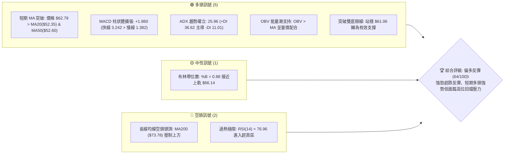
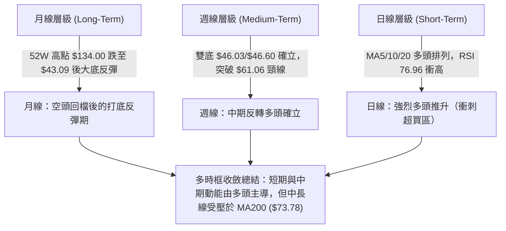
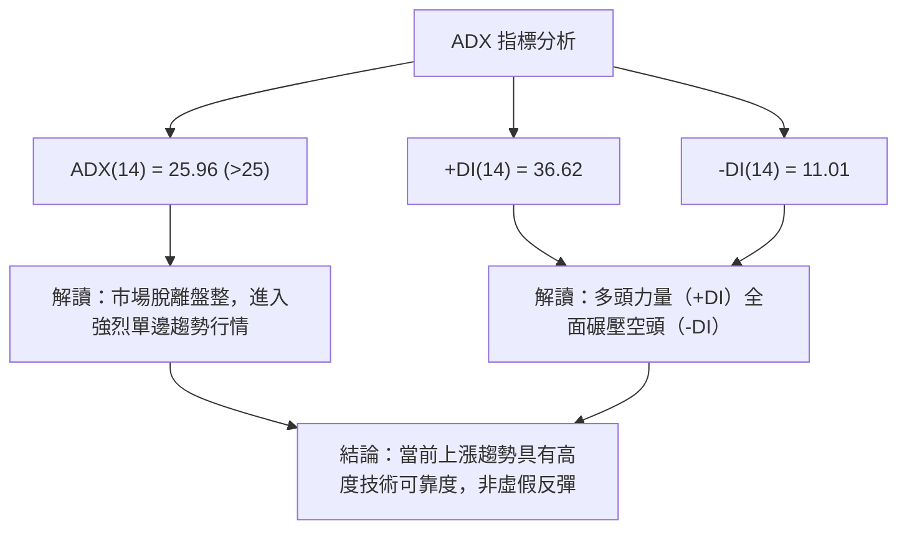
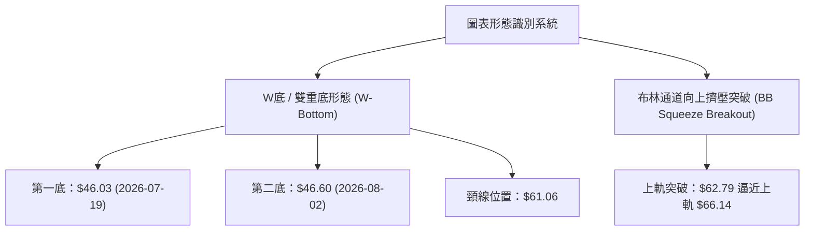
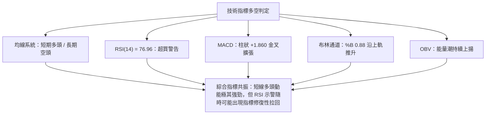
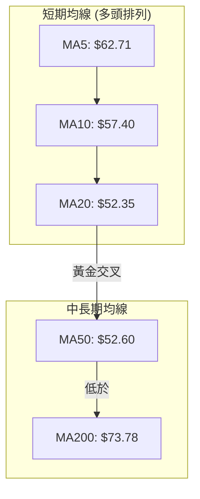
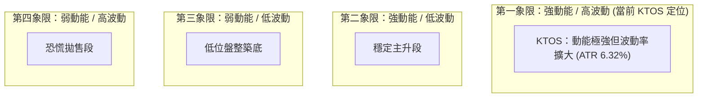
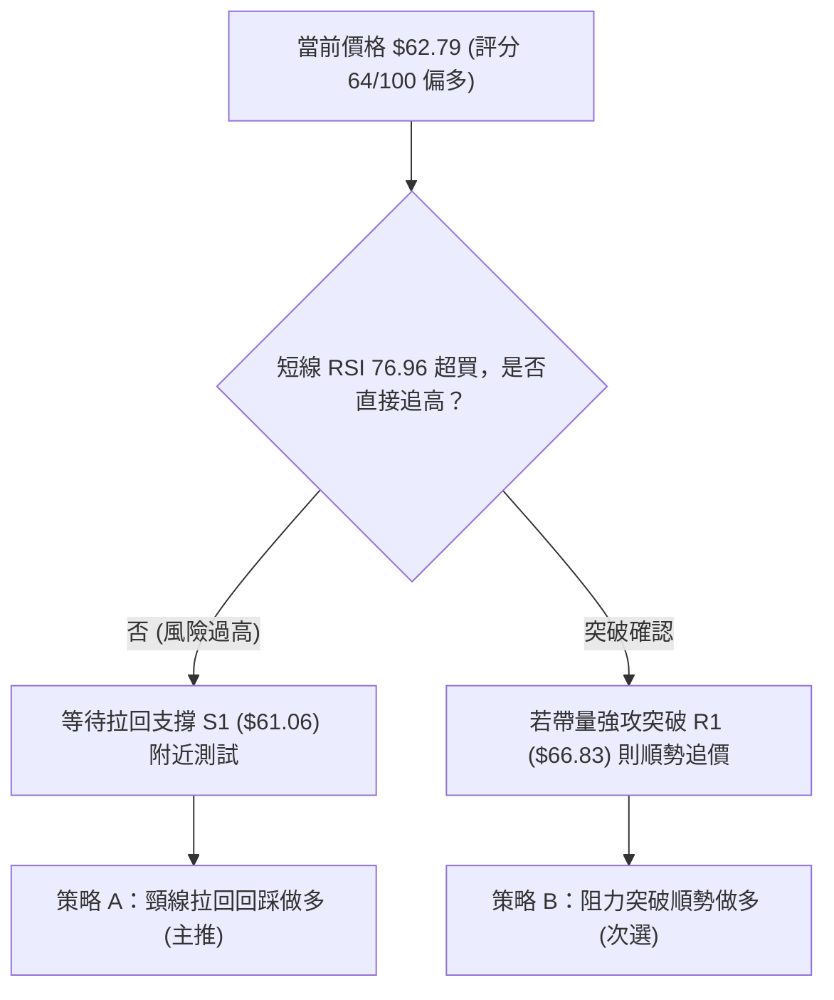
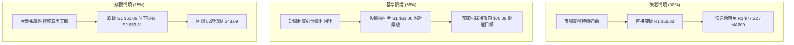

# KTOS 技術分析報告

> **報告日期**：2026-08-14 ｜ **語言**：繁體中文 ｜ **數據來源**：Yahoo Finance ｜ **當前價格**：$62.79

---

## 目錄

| 章節 | 內容 |
|------|------|
| [1. 技術面概覽](#1-技術面概覽) | 訊號儀表板、核心指標、評分卡 |
| [2. 趨勢分析](#2-趨勢分析) | 多時框趨勢、長中短期走勢 |
| [3. 圖表形態分析](#3-圖表形態分析) | 形態識別、K線組合、目標價 |
| [4. 支撐與阻力](#4-支撐與阻力) | 關鍵價位、斐波那契回調 |
| [5. 技術指標深度解讀](#5-技術指標深度解讀) | MA/RSI/MACD/布林/成交量 |
| [6. 動能與波動率](#6-動能與波動率) | 動能評估、ATR、Beta |
| [7. 多時框架總結](#7-多時框架總結) | 時框架評分矩陣 |
| [8. 交易策略建議](#8-交易策略建議) | 多空策略、風險報酬比 |
| [9. 風險提示與監控](#9-風險提示與監控) | 監控指標、風險場景 |

---

## 1. 技術面概覽

### 🎯 技術訊號儀表板



### 📊 核心指標速覽表

| 指標類別 | 指標名稱 | 當前數值 | 訊號 | 解讀 |
|----------|----------|----------|------|------|
| **價格** | 當前收盤價 | $62.79 | 🟢 | 自近一年低點 $43.09 強勁反彈，位於 52 週區間 21.7% 分位 |
| **均線** | MA20 / MA50 | $52.35 / $52.60 | 🟢 | 價格已強勢突破 MA20 與 MA50，MA5/MA10/MA20 短期黃金交叉 |
| **均線** | MA200 | $73.78 | 🔴 | 價格仍位於長線 MA200 下方，整體大結構仍受壓於年線 |
| **動能** | RSI(14) | 76.96 | 🔴 | 處於強烈超買區域（>70），短線存在過熱拉回風險 |
| **動能** | MACD(12,26,9) | 3.242 / 柱狀 +1.860 | 🟢 | 柱狀圖持續擴張，雙線於零軸上方黃金交叉，多頭動能極強 |
| **動能** | Stoch %K / %D | 90.97 / 96.20 | 🔴 | 隨機指標進入極度超買區，暗示短線漲勢可能面臨速率放緩 |
| **趨勢** | ADX(14) | 25.96 (+DI 36.62) | 🟢 | ADX > 25 且 +DI 遠高於 -DI(11.01)，確立強勁多頭波段行情 |
| **波動** | ATR(14) | $3.97 (6.32%) | 🟡 | 每日平均波幅達 6.32%，屬於中高波動度標的 |
| **通道** | 布林通道 | 上軌 $66.14 / %B 0.88 | 🟡 | 價格逼近布林上軌，展現強勢推升但空間受限於上軌 |

### 🏆 技術評分卡

```
╔══════════════════════════════════════════════════════════════════╗
║                   技術評分卡 — KTOS (2026-08-14)                ║
╠══════════════════════════════════════════════════════════════════╣
║ 趨勢強度 (ADX)     ████████████████░░░░  80/100  🟢 強勢多頭動能  ║
║ 動能指標 (RSI/MACD) ██████████████░░░░░░  70/100  🟡 動能強但超買  ║
║ 支撐穩定度 (S1/S2)  ████████████████░░░░  78/100  🟢 雙底打底堅實  ║
║ 成交量配合 (OBV)   ██████████████░░░░░░  70/100  🟢 量價同步擴張  ║
║ 形態完整度 (雙底)  ████████████████░░░░  75/100  🟢 頸線完成突破  ║
║ 均線排列 (MA系統)  ████████░░░░░░░░░░░░  40/100  🔴 中長線仍未扭轉║
╠══════════════════════════════════════════════════════════════════╣
║ 綜合技術評分       █████████████░░░░░░░  64/100  🟢 偏多波段反彈  ║
╚══════════════════════════════════════════════════════════════════╝
```

---

## 2. 趨勢分析

### 🌐 多時框趨勢分析



### 📈 長期趨勢 — 24個月走勢圖（Unicode）

```
KTOS 24個月歷史價格走勢圖 ($)
$134.00 ┤                                                                
$112.55 ┤                                                                
$99.27  ┤                        ●  ●                                    
$88.55  ┤                           ●     ●                              
$77.82  ┤                                 ●                              
$62.54  ┤                                    ●                 ● (現價 $62.79)
$43.09  ┤  ●  ●  ●  ●                                ●  ●  ●             
        └─┬──┬──┬──┬──┬──┬──┬──┬──┬──┬──┬──┬──┬──┬──┬──┬──┬──┬──┬──┬──┬──
         24/08  24/11  25/02  25/05  25/08  25/11  26/02  26/05  26/08
```

#### 24 個月歷史走勢階段特徵分析

| 階段歷史 | 區間價格 | 走勢特徵 | 成交量與動能變化 |
|----------|----------|----------|------------------|
| **2024-08 ~ 2024-10** | $22.72 - $23.30 | 打底築基期，長期低位盤整 | 量平，波動極低，ADX < 15 |
| **2024-11 ~ 2025-09** | $27.09 - $91.37 | 主升段爆發，價格翻數倍上升 | 量能顯著放大，一路沿 MA20 攀升 |
| **2025-10 ~ 2026-01** | $90.60 - $103.01 | 衝高見頂（52週高點 $134.00 於此期間形成） | 出現頂部背離與高位巨量換手 |
| **2026-02 ~ 2026-07** | $86.18 - $43.09 | 深度拉回修復，形成 52 週低點 $43.09 | 獲利賣壓發酵，一路跌破 MA50/200 |
| **2026-08 (最新)** | $46.60 - $62.79 | 強烈超跌反彈，雙底完成，單月大漲超過 30% | 周量擴張至 28.9M，多頭重新控盤 |

### 📊 中期趨勢（週線分析）

從 2026 年 4 月至 8 月的 20 週數據來看，KTOS 完成了一次完整的「主跌—築底—突破」過程：
1. **主跌段**：自 4 月高點 $70.99 跌至 7 月底低點 $46.03，RSI 一度下探至 23.1 的極度超賣區。
2. **打底段**：在 $46.03 (7/19 週) 與 $46.60 (8/02 週) 形成雙重底結構，支撐表現極為堅固。
3. **突破段**：8/09 週報收 $60.77 (大漲 30.4%)，8/16 週進一步拉升至 $62.79，突破 4 月下旬跌破的關鍵頸線 $61.06。

### ⚡ 趨勢強度評估（ADX 解讀）



| ADX 區間 | 當前數值 | 趨勢狀態 | 交易策略導向 |
|----------|----------|----------|--------------|
| 0 - 20 | — | 無趨勢 / 隨機震盪 | 區間高拋低吸 |
| 20 - 25 | — | 趨勢萌芽中 | 觀察突破方向 |
| **25 - 50** | **25.96** | **強勁單邊趨勢** | **順勢操作，逢拉回做多** |
| 50 - 100 | — | 極端強烈趨勢 | 防範過熱暴拉後反轉 |

---

## 3. 圖表形態分析

### 🔍 形態識別系統



#### 形態信心度與目標價計算表

| 形態類型 | 信心度 | 判斷依據（引用數據） | 完成度 | 目標價計算式與精確數值 |
|----------|--------|----------------------|--------|------------------------|
| **雙重底 (W-Bottom)** | **75%** | 兩次下試低點 $46.03 與 $46.60 不破，且於 8/09 週收盤 $60.77 / 現價 $62.79 突破頸線 $61.06 | 90% (已突破頸線) | **目標價** = 頸線 $61.06 + (頸線 $61.06 - 第一底 $46.03) = $61.06 + $15.03 = **$76.09** |
| **V型強烈反彈** | **65%** | 自 $46.60 連續兩週巨量陽線直衝 $62.79，突破 MA20/50 | 80% | 以波段回撤 50% 推算：$43.09 + ($134.00 - $43.09) * 0.5 = **$88.55** |

*註：由於形態計算之目標價 $76.09 與關鍵阻力位 R3 ($77.22) 及 斐波那契 61.8% ($77.82) 極為接近，形成高度共振阻力區。*

### 🕯️ 重要K線形態分析

| 日期/週別 | 收盤價 | K線形態名稱 | 技術解讀 | 訊號性質 |
|-----------|--------|-------------|----------|----------|
| 2026-07-19 | $46.03 | 止跌錘子線 (Hammer) | 下影線測試 52 週低點 $43.09 附近，空頭竭盡 | 🟢 看多反轉 |
| 2026-08-02 | $46.60 | 雙底二次測試陽線 | 二度守住 $46 關卡，多頭防線築牢 | 🟢 二度確認 |
| 2026-08-09 | $60.77 | 長陽突破大紅棒 (Marubozu) | 帶量單週大漲 30%，一舉吞噬前 6 週陰線 | 🟢 強烈買進 |
| 2026-08-16 | $62.79 | 續漲高位十字/小陽 | 站穩 $61.06 頸線上方，強勢整理 | 🟢 趨勢延續 |

### 📉 ASCII 走勢形態示意圖

```
KTOS 雙重底 (W-Bottom) 突破結構示意圖
────────────────────────────────────────────────────────────
                                       突破目標價 $76.09 (接近 R3 $77.22)
                                              ▲
                                             ╱
                                            ╱
$61.06 ───頸線 (Neckline)────────────★─────● 現價 $62.79
                                   ╱   │
                                  ╱    │ 形態高度 $15.03
                                 ╱     │
$46.03/46.60 ───────●───────────●──────┴─────────────────────
                 第一底(7/19)  第二底(8/02)
────────────────────────────────────────────────────────────
```

---

## 4. 支撐與阻力

### 🗺️ 關鍵價位分布圖（Unicode）

```
KTOS 價位結構分布圖 (以當前價格 $62.79 為中心)
═════════════════════════════════════════════════════════════
$134.00 ║████████████████████████████████████████║ 52週高點 (0.0% Fib)
$112.55 ║██████████████████████                  ║ 斐波那契 23.6%
$99.27  ║██████████████                          ║ 斐波那契 38.2%
$88.55  ║██████████                              ║ 斐波那契 50.0%
$77.22  ║████████████████████████████            ║ 強阻力 R3 / Fib 61.8% ($77.82)
$73.78  ║████████████████                        ║ MA200 年線重壓區
$69.91  ║████████████                            ║ 阻力 R2
$66.83  ║████████                                ║ 近期關鍵阻力 R1 / 布林上軌 ($66.14)
$62.79  ╠════════════════════════════════════════╣ ◄ 現價 (位於 Fib 78.6% $62.54 上方)
$61.06  ║▓▓▓▓▓▓▓▓▓▓▓▓▓▓▓▓▓▓▓▓▓▓▓▓▓▓▓▓            ║ 關鍵突破支撐 S1 (原雙底頸線)
$53.31  ║████████████████████                    ║ 強支撐 S2 / MA20 ($52.35) / MA50 ($52.60)
$51.66  ║████████████                            ║ 支撐 S3
$43.09  ║████████████████████████████████████████║ 52週低點 (100.0% Fib)
═════════════════════════════════════════════════════════════
```

### 🚧 阻力位分析表

| 阻力級別 | 精確價位 | 形成原因與背景 | 突破難度 | 技術重要性 |
|----------|----------|----------------|----------|------------|
| **阻力 R1** | **$66.83** | 近一年波段高點聚類與布林通道上軌 ($66.14) 重疊 | 🟡 中等 | 短線多頭衝刺的第一道防線，衝破將打開上行通道 |
| **阻力 R2** | **$69.91** | 近一年波段高點聚類，接近 $70 整數心理關卡 | 🟡 中等 | 4月高點 $70.99 密積成交區 |
| **阻力 R3** | **$77.22** | 近一年波段高點聚類、MA200 ($73.78) 及 Fib 61.8% ($77.82) 三重重壓 | 🔴 極高 | 牛熊分界核心大關，形態目標價 $76.09 亦在此區域 |

### 🛡️ 支撐位分析表

| 支撐級別 | 精確價位 | 形成原因與背景 | 守住機率 | 技術重要性 |
|----------|----------|----------------|----------|------------|
| **支撐 S1** | **$61.06** | 雙底頸線位置，突破後轉為強大極性轉換支撐 | 🟢 80% | 短線多頭守城底線，不破則維持多頭強勢攻勢 |
| **支撐 S2** | **$53.31** | 近一年波段低點聚類，且與 MA20 ($52.35) 及 MA50 ($52.60) 交會 | 🟢 85% | 中期生命線，多頭拉回佈局的最佳防禦陣地 |
| **支撐 S3** | **$51.66** | 近一年波段低點聚類 | 🟢 90% | 強力防守位，跌破宣告本輪反彈失敗 |

### 📐 斐波那契回調位分析

依據 52 週高低點區間（$43.09 至 $134.00）計算之精確斐波那契層級如下：

| 斐波那契比例 | 精確價位 | 當前價位相對關係與技術意義 |
|--------------|----------|----------------------------|
| **0.0% (52W High)** | $134.00 | 歷史最高頂點 |
| **23.6%** | $112.55 | 長期多頭回撤第一防線 |
| **38.2%** | $99.27 | 中長線強弱分水嶺 |
| **50.0%** | $88.55 | 中期反彈等長目標 |
| **61.8%** | $77.82 | 黃金分割強阻力（與 R3 $77.22 呼應） |
| **78.6%** | **$62.54** | **◄ 當前價格 $62.79 剛好成功站上此關鍵位** |
| **100.0% (52W Low)**| $43.09 | 近一年底點 |

**解讀**：KTOS 當前收盤價 $62.79 已成功跨越 **78.6% 回調位 ($62.54)**。技術面顯示，從 $43.09 發動的反彈已跨越了深幅修正的最後一道斐波那契關卡，若能持續收於 $62.54 之上，預計下一個中長線目標將直接指向上方的 **61.8% 黃金分割位 $77.82**。

---

## 5. 技術指標深度解讀

### 🎛️ 指標訊號總覽



### 📈 移動平均線排列分析



| 均線名稱 | 當前價位 | 價格相對位置 | 趨勢方向 | 技術意涵 |
|----------|----------|--------------|----------|----------|
| **MA5** | $62.71 | 上方 (+0.13%) | ↗ 向上 | 短線極速推升支撐 |
| **MA10** | $57.40 | 上方 (+9.40%) | ↗ 向上 | 短線助漲斜率高陡 |
| **MA20** | $52.35 | 上方 (+19.95%)| ↗ 向上 | 月線支撐，突破後扭轉短期趨勢 |
| **MA50** | $52.60 | 上方 (+19.37%)| ↗ 向上 | 季線支撐，MA20 與 MA50 形成低位黃金交叉 |
| **MA200**| $73.78 | 下方 (-14.90%)| ↘ 向下 | 年線重壓，中長線空頭反彈的上檔終極蓋頂 |

### 📉 RSI(14) 動能與背離判斷

- **當前 RSI(14) 數值**：**76.96**
- **強度進度條**：`███████████████░░░░░` (76.96% — 強烈超買區)
- **背離判斷**：
  - **頂背離**：無明顯頂背離（價格創新高，RSI 同步自低點 23.1 猛烈拉升至 76.96）。
  - **底背離**：7 月低點 $46.03 時 RSI 為 23.1，8 月低點 $46.60 時 RSI 提升至 49.3，呈現標準的**底背離抬升**，完美預告了本次 30%+ 的爆發性反彈。
- **結論**：RSI 超過 70 代表短線買盤情緒達到極限，隨時可能引發獲利回吐，但強勢趨勢中 RSI 可在超買區高位鈍化。

### 📊 MACD(12/26/9) 訊號解讀

- **MACD 快線**：3.242
- **Signal 慢線**：1.382
- **MACD 柱狀體**：**+1.860** 🟢
- **訊號解讀**：快線強勢穿過慢線且雙線皆已拉升至零軸上方，柱狀體自 7 月底的 -0.056 連續 3 週大幅擴張至 +1.860，顯示買盤正處於絕對主導地位，動能極其充沛。

### 📦 布林通道分析

```
KTOS 布林通道示意圖
────────────────────────────────────────────────────────────
 $66.14 ── 布林上軌 (BB Upper) ─────────────────────────────
          │                              ● 現價 $62.79 (%B = 0.88)
 $52.35 ── 布林中軌 (MA20) ─────────────────────────────────
          │
 $38.55 ── 布林下軌 (BB Lower) ─────────────────────────────
────────────────────────────────────────────────────────────
```

- **通道帶寬**：上軌 $66.14 與下軌 $38.55 呈張口擴大態勢（Squeeze 突破後放量張口）。
- **%B 位置**：**0.88**，代表價格已緊貼布林上軌運行（1.0 為上軌），為強勢「單邊貼軌上行」特徵。

### 💹 成交量與 OBV 分析

- **最新日成交量**：2,561,028 股
- **20日均量**：3,936,821 股 (量比 0.65x，主因今日非全天交易或短線高位觀望)
- **週成交量動態**：8/09 週爆出 28,967,900 股巨量，為前週 14.8M 的雙倍，呈現典型的「帶量突破雙底頸線」。
- **OBV 趨勢**：OBV 向上穿越其均線，量能充分確認價格上漲，無價量背離隱憂。

---

## 6. 動能與波動率

### ⚡ 動能評估

| 評估維度 | 當前狀態指標 | 評估等級 | 說明與交易指引 |
|----------|--------------|----------|----------------|
| **動能強度** | MACD柱 +1.860 / ADX 25.96 | 🟢 強勁 (Strong) | 動能指標全面爆發，趨勢方向明確向上 |
| **波動率** | ATR(14) = $3.97 (6.32%) | 🟡 中高 (Elevated)| 每日波幅近 $4.00，建倉需留足止損空間 |
| **超買程度** | RSI 76.96 / Stoch 90.97 | 🔴 極高 (Overbought) | 短線拉回風險積聚，不宜追高 |

#### 動能四象限定位



### 📊 ATR 波動率分析

- **ATR(14) 數值**：**$3.97**（占當前股價 6.32%）。
- **風控止損設定應用**：
  - **短線緊密止損 (1.0 x ATR)**：$3.97 距離。
  - **波段標準止損 (1.5 x ATR)**：$5.95 距離（自 $62.79 下壓至 **$56.84**）。
  - **寬鬆趨勢止損 (2.0 x ATR)**：$7.94 距離（自 $62.79 下壓至 **$54.85**）。

### 📐 Beta 與市場相關性

- **Beta 係數**：**1.106**（相較於 S&P 500 大盤呈稍微放大的高波動特性）。
- **機構持股比例**：**88.9%**，代表此波從 $46 至 $62 的強勁反彈主要由法人機構資金主導推升，盤面籌碼極具穩定度。

---

## 7. 多時框架總結

### 📋 時框架評分表

| 時框架 | 趨勢方向 | 動能指標 | 均線結構 | 形態結構 | 綜合評分 | 交易建議 |
|--------|----------|----------|----------|----------|----------|----------|
| **日線 (Short-Term)** | 🟢 強勢多頭 | 🔴 極度超買 | 🟢 多頭排列 | 🟢 貼軌突破 | **72/100** | 避開當前追高，等待拉回整理 |
| **週線 (Medium-Term)** | 🟢 反轉上行 | 🟢 金叉擴張 | 🟡 MA20/50平交| 🟢 雙底完成 | **78/100** | 中線分批做多，目標 R3/年線 |
| **月線 (Long-Term)** | 🔴 跌後修復 | 🟡 低位回升 | 🔴 位於MA200下| 🟡 深幅反彈 | **50/100** | 長線受壓，暫視為大結構反彈 |

### 🔲 綜合訊號矩陣

| 技術維度 | 日線訊號 | 週線訊號 | 月線訊號 | 矩陣一致性評估 |
|----------|----------|----------|----------|----------------|
| **方向 (Direction)** | 偏多 🟢 | 偏多 🟢 | 中性偏空 🟡 | 短中期共振向上，長線仍有阻力 |
| **動能 (Momentum)** | 過熱 🔴 | 強勁 🟢 | 萌芽 🟢 | 中期動能轉強，但短期需消化超買 |
| **量能 (Volume)** | 遞減 🟡 | 爆量 🟢 | 溫和 🟡 | 週線層級量能支撐力道極為紮實 |

### ⚖️ 多時框收斂結論

依據多時框收斂規則（ADX = 25.96 > 25 屬**趨勢行情**）：
1. **主導時框**：以週線與中短期均線（MA20/50）方向為主導。
2. **收斂判定**：週線雙底成形與突破 $61.06 頸線，確認中線趨勢已轉為多頭行情。
3. **日線角色**：日線 RSI 達 76.96 進入超買，日線不宜作為直接追高的依據，而應作為**尋找拉回支撐點（如 S1 $61.06）進場**的工具。
4. **唯一方向結論**：**中線偏多，短線尋求拉回買點**。

---

## 8. 交易策略建議

### 🗺️ 策略決策流程圖



### 🧭 策略路由

> **當前主策略方向 = 🟢 偏多（綜合評分 64/100）**
> 
> 依評分卡指引，KTOS 突破雙底頸線且 ADX>25，主推多頭佈局策略。做空僅列為風險對沖警示。

### 🎯 價格情境階梯 (Price Scenarios)

| 觸發條件 | 第一目標 | 後續延伸目標 | 情境技術含義 |
|----------|----------|--------------|--------------|
| **突破 R1 $66.83** | R2 $69.91 | R3 $77.22 | 破除短線超買，多頭主升段強烈延伸 |
| **回踩 S1 $61.06 守住**| $66.83 (R1) | $76.09 (形態目標) | 標準頸線回踩確認，最佳低吸買點 |
| **跌破 S1 $61.06** | S2 $53.31 | S3 $51.66 | 突破失效，走勢重回 MA20/50 震盪打底 |

### 📊 情境機率分佈

| 情境劇本 | 機率 | 主要技術依據 |
|----------|------|--------------|
| **劇本一：拉回 S1 $61.06 踩穩後再攻** | **55%** | RSI(14)=76.96 需進行日線修正，但週線 MACD 與 ADX 支持多頭續漲 |
| **劇本二：直接強攻突破 R1 $66.83** | **30%** | 市場買盤極其強烈（+DI 36.62），OBV 持續創新高 |
| **劇本三：假突破，回跌破 S1 至 S2** | **15%** | 受壓於 MA200 ($73.78) 大環境，空頭突襲 |

### 🟢 主策略詳情

#### 策略 A：頸線回踩低吸多單 (主推策略 - 推薦度 🥇)

| 策略要素 | 具體參數與執行細節 |
|----------|--------------------|
| **進場條件** | 價格拉回測試原雙底頸線 **$61.06** 附近獲得支撐（如出現小陽線或下影線） |
| **進場價格** | **$61.20 - $61.50** |
| **止損價格** | **$58.50**（跌破 S1 $61.06 約 4.2%，避開市場噪音） |
| **目標價 T1** | **$66.83** (阻力位 R1) |
| **目標價 T2** | **$76.09** (雙底形態測算目標價，接近 R3 $77.22) |
| **風險報酬比**| **1 : 5.4** [(目標 $76.09 - 進場 $61.20) / (進場 $61.20 - 止損 $58.50) = 14.89 / 2.70] |
| **勝率預估** | **65%** |
| **建議倉位** | **15% - 20%** 總資產 |

#### 策略 B：突破 R1 順勢追多 (次選策略 - 推薦度 🥈)

| 策略要素 | 具體參數與執行細節 |
|----------|--------------------|
| **進場條件** | 日線收盤價帶量突破阻力 **R1 $66.83** |
| **進場價格** | **$67.10** |
| **止損價格** | **$62.50**（位於 Fib 78.6% $62.54 與現價附近） |
| **目標價 T1** | **$69.91** (阻力位 R2) |
| **目標價 T2** | **$77.22** (阻力位 R3 / MA200 $73.78 區域) |
| **風險報酬比**| **1 : 2.2** [(目標 $77.22 - 進場 $67.10) / (進場 $67.10 - 止損 $62.50) = 10.12 / 4.60] |
| **勝率預估** | **55%** |
| **建議倉位** | **10%** 總資產 |

### 🔴 反向風險觸發點（對沖與清倉提示）

若 KTOS 未能守住頸線 $61.06，並進一步跌破 **S2 $53.31**（即同時跌破 MA20 $52.35 與 MA50 $52.60），宣告本輪雙底反彈形態完全破壞，多頭應立即清倉觀望，嚴禁盲目攤平。

### ⭐ 整體訊號強度評星

```
做多訊號強度：★★██☆  (4.0/5星) — 中期形態與動能極佳，僅受限於短線超買
做空訊號強度：★☆☆☆☆  (1.5/5星) — 僅有超買逆勢短空機會，順勢做空風險極高
整體可信度：  ★★██☆  (4.0/5星) — 多時框訊號收斂一致，量價配合良好
```

---

## 9. 風險提示與監控

### ✅ 關鍵監控指標 Checklist

```
╔══════════════════════════════════════════════════════════════════╗
║                   KTOS 每日/週技術監控清單                      ║
╠══════════════════════════════════════════════════════════════════╣
║ [ ] 1. S1 $61.06 防守狀態：每日收盤價是否維持於 $61.06 之上      ║
║ [ ] 2. RSI(14) 修正情況：觀察 RSI 是否回落至 55-65 中性健康區     ║
║ [ ] 3. MACD 柱狀體：柱狀體是否出現縮頭（低於 +1.860）            ║
║ [ ] 4. 成交量變化：拉回時成交量是否萎縮（低於 20日均量 3.9M）   ║
║ [ ] 5. 年線 MA200 ($73.78) 接近時的拋壓反應                      ║
╚══════════════════════════════════════════════════════════════════╝
```

### ⚠️ 風險場景分析



### 🛡️ 風險管理提醒

1. **嚴格執行止損**：當前 ATR 高達 $3.97 (6.32%)，個股波動劇烈。任何多頭單務必將止損設定於 S1 $61.06 下方（如 $58.50），單筆交易虧損不得超過總資金的 2%。
2. **警惕超買修正**：RSI 達 76.96 且 Stoch %K/D 高達 90/96，短線指標嚴重極化。強行在 $62.79 現價追高極易遭逢短線衝高拉回的套牢風險，**耐心等待回踩 $61.06 為上策**。
3. **長線壓制風險**：上方 $73.78 的 MA200（年線）與 R3 $77.22 為重壓區，股價第一次觸及該區間時大概率遭遇強烈賣壓，屆時應逢高獲利了結部分倉位。

---

## 📋 報告總結

```
╔══════════════════════════════════════════════════════════════════╗
║                     KTOS 技術分析報告總結                        ║
════════════════════════════════════════════════════════════════════
 報告日期：2026-08-14
 當前價格：$62.79
 分析評級：🟢 偏多波段反彈 (綜合技術評分：64 / 100)

 關鍵技術結論：
 ├─ 長期趨勢：🔴 空頭架構下的深幅修正反彈（受壓於 MA200 $73.78）
 ├─ 中期趨勢：🟢 雙底 ($46.03/$46.60) 確立，突破 $61.06 頸線，趨勢轉多
 ├─ 短期趨勢：🟢 動能強勁但 RSI(14)=76.96 極度超買，面臨拉回整理
 ├─ 關鍵支撐：S1 $61.06 (原頸線) ｜ S2 $53.31 (MA20/50 密集區)
 ├─ 關鍵阻力：R1 $66.83 ｜ R2 $69.91 ｜ R3 $77.22
 └─ 分析師目標價：均價 $105.62 (最高 $150.00 / 最低 $60.00)

 最優策略組合：
 1. 🥇 首選策略 (低吸)：拉回 $61.20 - $61.50 佈局做多，止損 $58.50，目標 $76.09
 2. 🥈 次選策略 (突破)：帶量突破 R1 $66.83 後追多，止損 $62.50，目標 $77.22
 3. 🥉 風控控制：若跌破 S2 $53.31，全面停止做多並清倉觀望
════════════════════════════════════════════════════════════════════
```

---

> ⚠️ **免責聲明**：本報告為 AI 自動生成之技術分析，所有數據及估算均基於提供的歷史價格資訊。本報告**僅供研究與學術參考**，**不構成任何投資建議**。投資有風險，入市需謹慎。

---

*報告生成時間：2026-08-14 ｜ 數據來源：Yahoo Finance ｜ 分析框架：多時框技術分析*