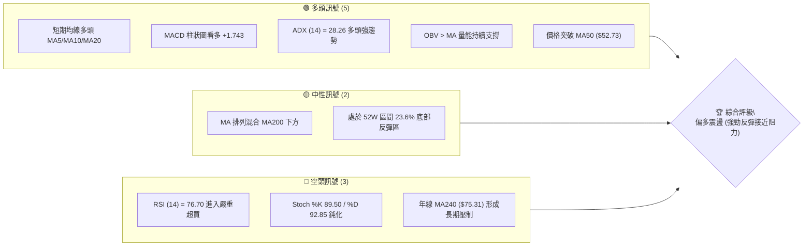
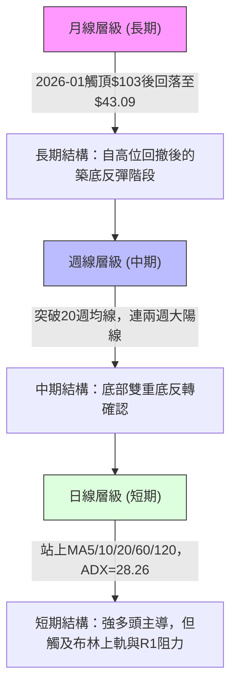
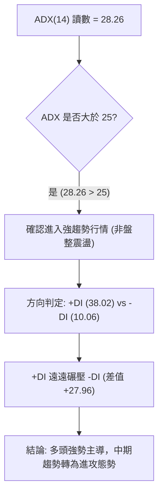
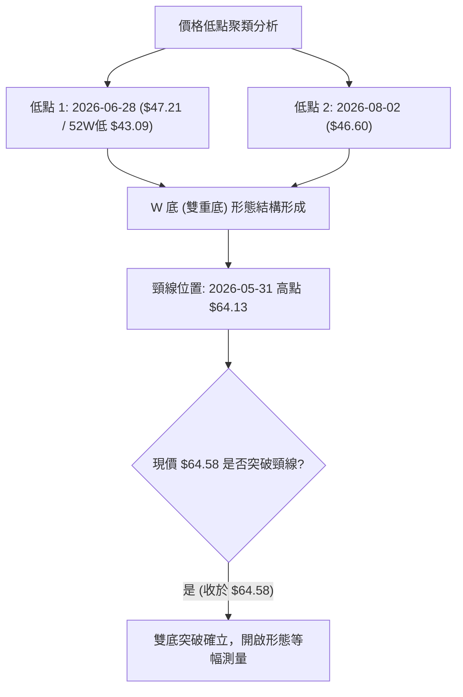
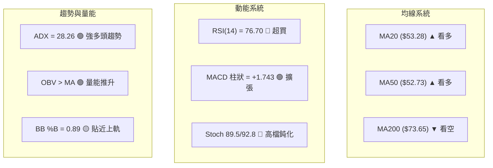
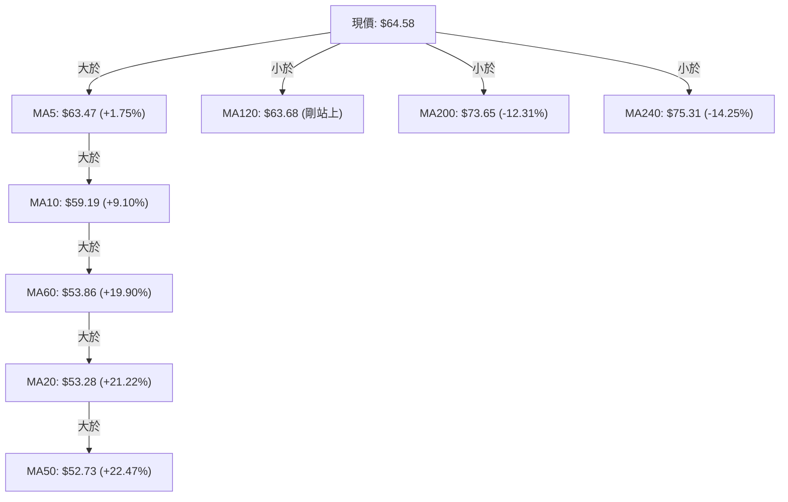
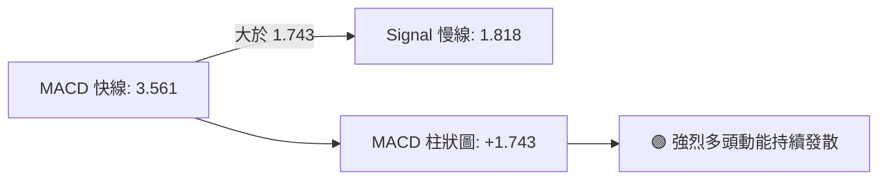
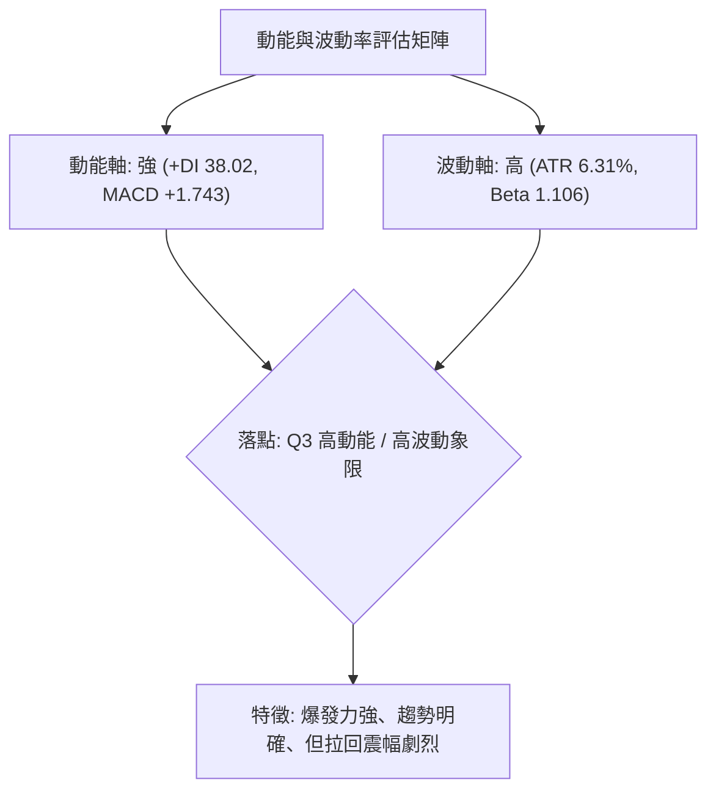
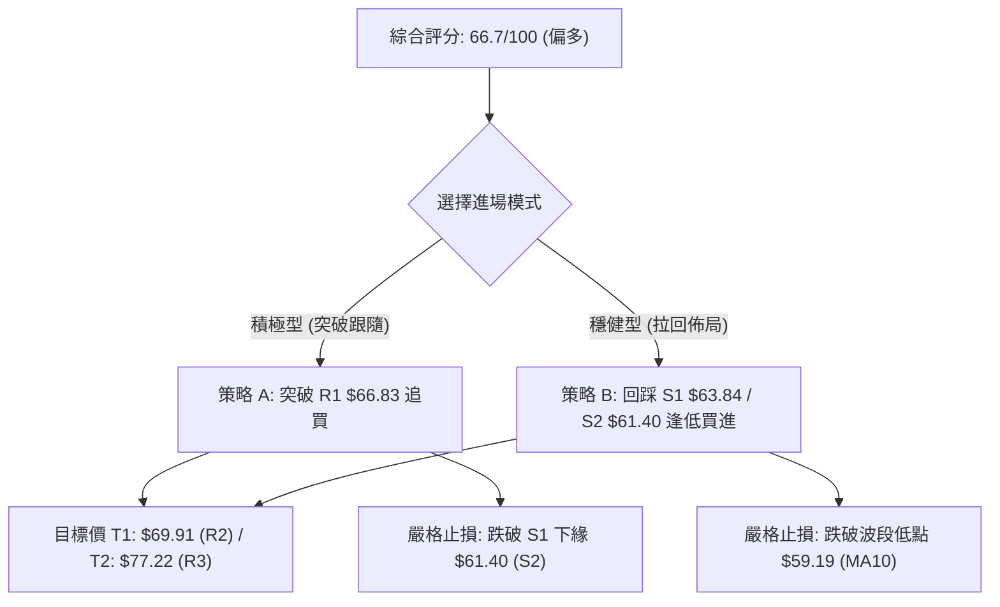
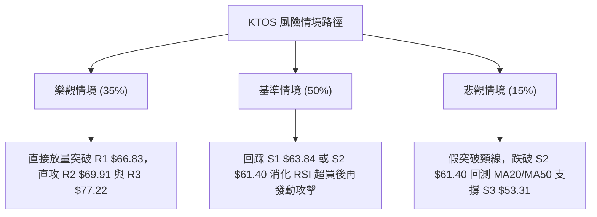

# KTOS 技術分析報告

> **報告日期**：2026-08-15 ｜ **語言**：繁體中文 ｜ **數據來源**：Yahoo Finance ｜ **當前價格**：$64.58

---

## 目錄

| 章節 | 內容 |
|------|------|
| [1. 技術面概覽](#1-技術面概覽) | 訊號儀表板、核心指標、評分卡 |
| [2. 趨勢分析](#2-趨勢分析) | 多時框趨勢、長中短期走勢 |
| [3. 圖表形態分析](#3-圖表形態分析) | 形態識別、K線組合、目標價 |
| [4. 支撐與阻力](#4-支撐與阻力) | 關鍵價位、斐波那契回調 |
| [5. 技術指標深度解讀](#5-技術指標深度解讀) | MA/RSI/MACD/布林/成交量 |
| [6. 動能與波動率](#6-動能與波動率) | 動能評估、ATR、Beta |
| [7. 多時框架總結](#7-多時框架總結) | 時框架評分矩陣 |
| [8. 交易策略建議](#8-交易策略建議) | 多空策略、風險報酬比 |
| [9. 風險提示與監控](#9-風險提示與監控) | 監控指標、風險場景 |

---

## 1. 技術面概覽

### 🎯 技術訊號儀表板



### 📊 核心指標速覽表

| 指標類別 | 指標名稱 | 當前數值 | 訊號 | 解讀 |
|----------|----------|----------|------|------|
| **價格** | 當前價格 | $64.58 | 🟢 | 自波段低點 $43.09 強勁反彈，站上短期均線群 |
| **均線** | MA20 | $53.28 | 🟢 | 價格在 MA20 上方 (+21.22%)，短線呈強勢上攻 |
| **均線** | MA50 | $52.73 | 🟢 | 價格在 MA50 上方 (+22.47%)，中期趨勢翻多 |
| **均線** | MA200 | $73.65 | 🔴 | 價格在 MA200 下方 (-12.31%)，長期空頭結構尚未完全扭轉 |
| **動能** | RSI(14) | 76.70 | 🔴 | 日線/週線均進入 >70 嚴重超買區，隨時面臨技術性拉回 |
| **動能** | MACD | 3.561 | 🟢 | 快線高於慢線 (Signal: 1.818)，柱狀圖 +1.743 多方掌控 |
| **動能** | 隨機指標 | %K 89.5 / %D 92.85 | 🔴 | 高檔超買死叉邊緣，顯示短線漲幅過急 |
| **趨勢** | ADX(14) | 28.26 | 🟢 | ADX > 25 且 +DI (38.02) 遠大於 -DI (10.06)，趨勢行情確立 |
| **波動** | ATR(14) | $4.08 | 🟡 | 佔股價 6.31%，日波動幅度大，需擴大止損區間 |
| **量能** | 當日量 / 20日均量 | 5.45M / 3.93M | 🟢 | 量比 1.39x，突破帶量，量價配合健康 |

### 🏆 技術評分卡

```
╔══════════════════════════════════════════════════════════════════╗
║                   技術評分卡 — KTOS (2026-08-15)                  ║
╠══════════════════════════════════════════════════════════════════╣
║ 趨勢強度      ██████████████░░░░░░  70/100  🟢 強勁反彈上升趨勢   ║
║ 動能指標      ████████████░░░░░░░░  60/100  🟡 動能強但嚴重超買   ║
║ 支撐穩定度    ██████████████░░░░░░  70/100  🟢 底部 $43.09 確立   ║
║ 成交量配合    ████████████████░░░░  80/100  🟢 放量推升 OBV 創高  ║
║ 形態完整度    ██████████████░░░░░░  70/100  🟢 雙底築底突破頸線   ║
║ 均線排列      ██████████░░░░░░░░░░  50/100  🟡 短多長空 (混合排列) ║
╠══════════════════════════════════════════════════════════════════╣
║ 綜合評分      █████████████░░░░░░░  66.7/100 🟢 偏多進攻 (注意回踩)║
╚══════════════════════════════════════════════════════════════════╝
```

---

## 2. 趨勢分析

### 🌐 多時框趨勢分析



### 📈 長期趨勢 — 12個月走勢圖（Unicode）

```
KTOS 月線走勢圖（2025-08 至 2026-08）
價格 ($)
$105 ┤                       ●(2026-01 頂點 $103.01)
$95  ┤         ●     ●
$85  ┤                    ●
$75  ┤               ●  ●    ●
$65  ┤  ●  ●                    ●              ●(現價 $64.58)
$55  ┤                                
$45  ┤                                   ●  ●(2026-07 低點 $46.60)
     └─────────────────────────────────────────────────────────────
       08 09 10 11 12 01 02 03 04 05 06 07 08 (月份: 2025-08 ~ 2026-08)
```

#### 走勢特徵分析表格

| 階段 | 時間區間 | 起止價格 | 漲跌幅 | 走勢特徵解讀 |
|------|----------|----------|--------|--------------|
| 主升浪加速 | 2025-08 ~ 2026-01 | $65.84 → $103.01 | +56.46% | 連續放量大漲，刷新歷史高位區間，最高觸及 52W 高點 $134.00 |
| 空頭主跌段 | 2026-01 ~ 2026-04 | $103.01 → $63.05 | -38.79% | 估值壓縮疊加獲利了結，跌破短期均線群 |
| 底部震盪打底 | 2026-05 ~ 2026-07 | $64.13 → $46.60 | -27.34% | 於 $43.09 ~ $47.21 區間構築堅實底部，空頭量能枯竭 |
| 強力反轉向上 | 2026-07 ~ 2026-08 | $46.60 → $64.58 | +38.58% | 8月單月爆發性大陽線，接連收復 MA20/50/60/120 均線 |

### 📊 中期趨勢（週線分析）

```
週線關鍵壓力與支撐結構示意圖
價格 ($)
$77.82 ┤ ────────────────────────────────────────── 斐波那契 61.8% / 強阻力 R3 ($77.22)
       │                                     ▲
$69.91 ┤ ────────────────────────────── R2 ($69.91) ─
       │                              ▲
$66.83 ┤ ─────────────────────── R1 ($66.83) ───────
$64.58 ┤ ═══════════════════════ ◄ 當前價格 $64.58
$62.54 ┤ ─────────────────────── 斐波那契 78.6% ($62.54) / S1 ($63.84)
       │                      ▼
$53.28 ┤ ─────────────────────── MA20 / S3 ($53.31)
$43.09 ┤ ────────────────────────────────────────── 52W 低點 $43.09 (鐵底)
```

### ⚡ 趨勢強度評估（ADX 解讀）



| 評估維度 | 當前數值 | 門檻區間 | 狀態評估 | 意義 |
|----------|----------|----------|----------|------|
| **ADX(14)** | 28.26 | > 25 | 🟢 強趨勢確立 | 市場擺脫盤整，形成明確的方向性動能 |
| **+DI** | 38.02 | > 25 | 🟢 買方極度強勢 | 多頭力量主導當前籌碼推進 |
| **-DI** | 10.06 | < 15 | 🟢 賣方全面潰退 | 空方拋壓大幅衰減 |

---

## 3. 圖表形態分析

### 🔍 形態識別系統



#### 形態識別與信心度評估表

| 形態名稱 | 信心度 | 判斷依據（引用數據） | 完成度 | 目標價（附計算式） |
|----------|--------|----------------------|--------|--------------------|
| **W 底 (雙重底)** | 85% | 第一次打底 2026-06-28 ($47.21，最低 $43.09)，第二次打底 2026-08-02 ($46.60)，頸線位於 2026-05-31 收盤價 $64.13。現價 $64.58 剛好站上頸線。 | 95% | 頸線 $64.13 + 形態高度 ($64.13 - $46.60 = $17.53) = **$81.66** (上方阻力錨定 R3: $77.22 ~ 斐波那契 $77.82) |
| **V 型反轉 (短期)** | 75% | 自 2026-08-02 ($46.60) 起連兩週帶量大陽線直拉至 $64.58，成交量分別放大至 28.97M 與 19.03M。 | 90% | 觸及阻力位 R1 **$66.83** 及 R2 **$69.91** |
| **均線黃金交叉形態** | 70% | 短期 MA5 ($63.47)、MA10 ($59.19)、MA20 ($53.28) 快速自下而上穿越 MA60 ($53.86) 與 MA50 ($52.73)。 | 80% | 指標型態確認，中期支撐上移至 **$53.31** (S3) |

### 🕯️ 重要K線形態分析

| 日期 / 週別 | 收盤價 | K線形態 | 解讀 | 訊號 |
|-------------|--------|---------|------|------|
| 2026-06-28 | $47.21 | 爆量長下影陰線 (週量 45.38M) | 恐慌拋盤被主力機構全數承接，確立波段絕對低點 $43.09 | 🟢 底背離築底 |
| 2026-07-19 | $46.03 | 縮量十字星 / 錘頭線 (週量 22.43M) | 二次探底不破前低，空方力量枯竭 | 🟢 二次築底 |
| 2026-08-09 | $60.77 | 帶量長紅突破大陽線 (週量 28.97M) | 突破多條短期均線，RSI 飆升至 74.1，主力強勢發動攻擊 | 🟢 強烈買進 |
| 2026-08-16 | $64.58 | 光頭小陽線延續強勢 (週量 19.03M) | 突破頸線 $64.13，多頭完全主導，但留心短線超買乖離 | 🟡 偏多但需防拉回 |

### 📉 ASCII 走勢形態示意圖

```
KTOS 雙重底 (W-Bottom) 反轉形態
價格 ($)
$66.83 ┼ ─ ─ ─ ─ ─ ─ ─ ─ ─ ─ ─ ─ ─ ─ ─ ─ ─ ─ ─ ─ ─ ─ ─ ─ ─ ─ ─ ─ ─ ─ ─ ─ [阻力 R1 $66.83]
$64.58 ┼ ─ ─ ─ ─ ─ ─ ─ ─ ─ ─ ─ ─ ─ ─ ─ ─ ─ ─ ─ ─ ─ ─ ─ ─ ─ ─ ─ ─ ─ ─ ─ ─ ─ ─ ─● [現價突破]
$64.13 ┼ ─ ─ ─ ─ ─ ─ ─ ─ ─ ─ ─ ─ ─ ─ ─ ─ ─ ─ ─ ─ ─ ─ ─ ─ ─ ─ ─ ─ ─ ─ ─ ─ ─ ─ ─ ─ [頸線位置]
$55.00 ┼ ─ ─ ─ ─ ─ ─ ─ ─ ─ ─ ─ ─ ─ ─ ─ ─ ─ ─ ─ ─ ─ ─ ─ ─ ─ ─ ─ ─ ─ ─ ─ ─ ─ ─ ─ ─ ─ ─ ─ ─ ─
$47.21 ┼ ─ ─ ─ ─ ─ ─ ─●(第一底 6/28) ─ ─ ─ ─ ─ ─ ─ ─ ─ ─ ─ ─ ─ ─ ─ ─ ─ ─ ─ ─ ─ ─ ─ ─ ─
$46.03 ┼ ─ ─ ─ ─ ─ ─ ─ ─ ─ ─ ─ ─ ─ ─ ─ ─ ─ ─ ─ ─ ─●(第二底 8/02) ─ ─ ─ ─ ─ ─ ─ ─ ─ ─ 
       └─────────────────────────────────────────────────────────────
```

### 🎯 形態目標價計算

1. **W底形態高度 ($H$)**：
   $$H = \text{頸線收盤價} (\$64.13) - \text{第二底收盤價} (\$46.60) = \$17.53$$
2. **形態理論目標價 ($T_1$)**：
   $$T_1 = \text{頸線} (\$64.13) + H (\$17.53) = \$81.66$$
3. **斐波那契與阻力共振確認**：
   - 斐波那契 61.8% 回調位為 **$77.82**
   - 近一年波段高點阻力 R3 為 **$77.22**
   - 綜合保守目標價區間設定為 **$77.22 ~ $81.66**。

---

## 4. 支撐與阻力

### 🗺️ 關鍵價位分布圖（Unicode）

```
KTOS 價位結構分布圖
══════════════════════════════════════════════════════════════════
$77.82 ║██████████████████████████████║ 斐波那契 61.8% 重壓區
$77.22 ║██████████████████████████████║ 強阻力 R3 (形態測幅 $81.66)
$73.65 ║██████████████████████        ║ MA200 牛熊分水嶺
$69.91 ║██████████████████            ║ 阻力 R2 (波段前高)
$66.83 ║████████████████████████      ║ 關鍵阻力 R1 (布林上軌 $67.76)
$64.58 ╠══════════════════════════════╣ ◄ 現價 ($64.58)
$63.84 ║▓▓▓▓▓▓▓▓▓▓▓▓▓▓▓▓▓▓▓▓▓▓        ║ 近期支撐 S1 (頸線回踩區)
$62.54 ║▓▓▓▓▓▓▓▓▓▓▓▓▓▓▓▓▓▓            ║ 斐波那契 78.6% 回調位
$61.40 ║██████████████████████        ║ 次級強支撐 S2
$53.31 ║██████████████████████████████║ 強支撐 S3 (MA20 $53.28 / MA50 $52.73)
$43.09 ║██████████████████████████████║ 52週低點 / 結構鐵底
══════════════════════════════════════════════════════════════════
```

### 🚧 阻力位分析表

| 阻力級別 | 價位 | 形成原因 | 突破難度 | 重要性 |
|----------|------|----------|----------|--------|
| **R1** | **$66.83** | 近一年波段高點聚類，疊加日線布林通道上軌 ($67.76) 形成短線共振壓制。 | 中等 | 🟢 短線突破確認點 (+3.48%) |
| **R2** | **$69.91** | 近一年次級波段高點聚類，整數心理關卡 $70.00 前哨戰。 | 偏高 | 🟡 中期多空拉鋸點 (+8.25%) |
| **R3** | **$77.22** | 近一年強波段高點聚類，緊鄰斐波那契 61.8% ($77.82) 與 MA240 ($75.31)。 | 極高 | 🔴 中長期反轉重壓區 (+19.57%) |

### 🛡️ 支撐位分析表

| 支撐級別 | 價位 | 形成原因 | 守住機率 | 重要性 |
|----------|------|----------|----------|--------|
| **S1** | **$63.84** | 近期突破之 W 底頸線 ($64.13) 及短線波段低點聚類，極近現價 (-1.15%)。 | 65% | 🟢 短線第一防守線 (頂底互換) |
| **S2** | **$61.40** | 近一年波段密集低點聚類，剛好位於 MA10 ($59.19) 上方緩衝區。 | 75% | 🟡 強勢拉回極限回踩點 (-4.92%) |
| **S3** | **$53.31** | MA20 ($53.28) 與 MA50 ($52.73) 均線密集交會處，波段強支撐。 | 90% | 🔴 中期多頭生命線 (-17.45%) |

### 📐 斐波那契回調位分析

依據 52 週完整波動區間（高點 **$134.00** 至 低點 **$43.09**，總落差 $90.91）計算：

| 斐波那契層級 | 精確價位 | 相對現價距離 | 技術含義解讀 |
|--------------|----------|--------------|--------------|
| **0.0% (52W High)** | **$134.00** | +107.49% | 歷史頂部壓力 |
| **23.6%** | **$112.55** | +74.28% | 長期強多頭最終延伸目標 |
| **38.2%** | **$99.27** | +53.72% | 分析師平均目標價 ($105.62) 附近強壓力 |
| **50.0%** | **$88.55** | +37.12% | 中期對稱回調位 |
| **61.8%** | **$77.82** | +20.50% | 黃金分割強壓力位，與 R3 ($77.22) 高度重疊 |
| **78.6%** | **$62.54** | -3.16% | **當前價格落點區間** ($62.54 ~ $77.82) 的關鍵下緣支撐 |
| **100.0% (52W Low)** | **$43.09** | -33.28% | 結構性鐵底 |

> 📌 **解讀**：現價 **$64.58** 已成功站上斐波那契 78.6% 回調位 ($62.54)，代表自 $43.09 的反彈已脫離極端超賣區，正式向 61.8% ($77.82) 展開修復空間。

---

## 5. 技術指標深度解讀

### 🎛️ 指標訊號總覽



### 📈 移動平均線排列分析



| 均線名稱 | 價位 | 乖離率 (%) | 排列狀態 | 解讀 |
|----------|------|------------|----------|------|
| **MA5** | $63.47 | +1.75% | 多頭排列 | 短線極強勢攻擊角度 |
| **MA10** | $59.19 | +9.10% | 多頭排列 | 短線回調支撐 |
| **MA20** | $53.28 | +21.22% | 向上翻揚 | 中短線多頭防守基石 |
| **MA50** | $52.73 | +22.47% | 走平轉揚 | 中期底部確立 |
| **MA120** | $63.68 | +1.42% | 剛突破 | 半年線阻力轉支撐 |
| **MA200** | $73.65 | -12.31% | 下行壓制 | 長期趨勢牛熊線，構成上方重壓 |
| **MA240** | $75.31 | -14.25% | 下行壓制 | 年線反壓，與 R3 重疊 |

### 📉 RSI(14) 分析

- **RSI(14) 讀數**：`76.70`
- **強度進度條**：`████████████████░░░░` (76.7%) — 🔴 **嚴重超買**
- **背離判斷**：
  - **日線/週線背離**：數據明確標註「無明顯背離」。
  - **解讀**：價格創新高伴隨 RSI 創波段新高（自 6/28 的 23.1 飆升至 76.7），屬於標準「強者恆強」的動能擴張期，但指標數值 >70 意味著追高風險劇增，回踩 S1 ($63.84) 或 S2 ($61.40) 的機率提高。

### 📊 MACD(12/26/9) 訊號解讀



- **MACD 線**：`3.561`
- **訊號線 (Signal)**：`1.818`
- **柱狀圖 (Histogram)**：`+1.743`
- **動能評估**：MACD 在零軸上方持續拉開與慢線距離，柱狀圖顯著放大（近3週週柱由 -0.056 → +1.677 → +1.743），呈現標準主升攻擊段特徵。

### 📦 布林通道分析

```
日線布林通道 (Bollinger Bands 20, 2)
價格 ($)
$67.76 ┼ ─ ─ ─ ─ ─ ─ ─ ─ ─ ─ ─ ─ ─ ─ ─ ─ ─ ─ ─ ─ ─ ─ ─ ─ ─ ─ ─ ─ ─ ─ ─ ─ [BB 上軌 $67.76]
$64.58 ┼ ─ ─ ─ ─ ─ ─ ─ ─ ─ ─ ─ ─ ─ ─ ─ ─ ─ ─ ─ ─ ─ ─ ─ ─ ─ ─ ─ ─ ─ ─ ─ ─ ─ ─ ─● [現價 (%B=0.89)]
       │
$53.28 ┼ ─ ─ ─ ─ ─ ─ ─ ─ ─ ─ ─ ─ ─ ─ ─ ─ ─ ─ ─ ─ ─ ─ ─ ─ ─ ─ ─ ─ ─ ─ ─ ─ [BB 中軌/MA20 $53.28]
       │
$38.79 ┼ ─ ─ ─ ─ ─ ─ ─ ─ ─ ─ ─ ─ ─ ─ ─ ─ ─ ─ ─ ─ ─ ─ ─ ─ ─ ─ ─ ─ ─ ─ ─ ─ [BB 下軌 $38.79]
```

- **BB %B 數值**：`0.89` (位於上軌 $67.76 邊緣)
- **通道特徵**：通道口呈現開口擴張狀，現價沿上軌強勢推升，未見通道收斂跡象。

### 💹 成交量分析（量價配合度）

- **最新成交量**：`5,446,500`
- **20日均量**：`3,929,520` (量比 `1.39x`，放量 39%)
- **50日均量**：`4,644,210` (高於中期均量)
- **OBV 趨勢**：`OBV > MA` 呈向上發散，量能持續流入，確認價格反彈為真實機構建倉推升，並無「量價背離」現象。

---

## 6. 動能與波動率

### ⚡ 動能評估四象限



| 象限 | 動能強度 | 波動幅度 | 當前狀態 | 策略應對 |
|------|----------|----------|----------|----------|
| **Q1** | 強動能 | 低波動 | — | 最佳穩定持股機會 |
| **Q2** | 弱動能 | 低波動 | — | 區間沉悶盤整 |
| **Q3** | **強動能** | **高波動** | **✓ (KTOS 當前)** | **高風險高收益，採用突破跟隨與拉回分批進場** |
| **Q4** | 弱動能 | 高波動 | — | 劇烈震盪下洗，嚴禁持股 |

### 📊 ATR 波動率分析

- **ATR(14) 數值**：`$4.08`
- **波動佔比**：`6.31%` (屬於中高波動個股)
- **交易止損設定建議**：
  - 短線止損距離 (1.0x ATR)：`$4.08` → 進場價下方 $4.08
  - 波段止損距離 (1.5x ATR)：`$6.12` → 覆蓋至 S2 ($61.40) 甚至接近 S3
  - 保守止損距離 (2.0x ATR)：`$8.16`

### 📐 Beta 與市場相關性

- **Beta 係數**：`1.106`
- **分析**：相對於標普 500 指數具備 1.1x 的彈性，在國防軍工與航太板塊整體轉強時具備顯著的超額報酬 (Alpha) 潛力，但大盤大幅回調時下行波動亦較為劇烈。

---

## 7. 多時框架總結

### 📋 時框架評分表

| 時框架 | 趨勢方向 | 動能狀態 | 均線排列 | 形態結構 | 綜合評分 | 交易建議 |
|--------|----------|----------|----------|----------|----------|----------|
| **日線 (短期)** | 🟢 強烈看多 | 🔴 嚴重超買 (76.7) | 🟢 短多排列 (MA5>10>20) | 🟢 突破布林上軌 | **75/100** | 待回踩支撐進場 |
| **週線 (中期)** | 🟢 多頭反轉 | 🟢 MACD 連續翻紅 | 🟡 混合 (破MA50、壓MA200) | 🟢 雙底突破頸線 | **70/100** | 波段持股做多 |
| **月線 (長期)** | 🟡 跌深反彈 | 🟡 底部回溫 | 🔴 MA240 下方 | 🟡 大區間築底 | **55/100** | 逢低分批布局 |

### 🔲 綜合訊號矩陣

```
時框架訊號收斂分析
┌──────────────┬──────────────┬──────────────┬──────────────┐
│   分析維度   │  短期 (日線) │  中期 (週線) │  長期 (月線) │
├──────────────┼──────────────┼──────────────┼──────────────┤
│ 趨勢方向     │ 🟢 向上      │ 🟢 向上      │ 🟡 震盪築底  │
│ 均線支持     │ 🟢 MA5/10/20 │ 🟢 MA50      │ 🔴 MA200/240 │
│ 動能指標     │ 🔴 RSI 超買  │ 🟢 MACD 放大 │ 🟡 中性回升  │
│ 量能配合     │ 🟢 放量突破  │ 🟢 週量健康  │ 🟢 OBV 向上  │
└──────────────┴──────────────┴──────────────┴──────────────┘
```

### ⚖️ 多時框收斂結論

> 依照多時框收斂規則（規則 14）：
> 1. **趨勢/盤整判斷**：ADX(14) = `28.26 > 25`，確立當前市場處於**強趨勢行情**（非盤整）。
> 2. **主導時框優先級**：以週線與均線（MA50/MA200）方向為主導。週線已突破 W 底頸線 ($64.13)，中期方向全面轉多；日線雖短期 RSI 超買，僅作為尋找回踩進場之輔助時機。
> 3. **唯一方向結論**：**【偏多進攻（回踩做多）】**。本結論嚴格收斂並指導第 8 章之主策略。

---

## 8. 交易策略建議

### 🗺️ 策略決策流程圖



### 🧭 策略路由

**當前主策略方向 = 主推多頭策略（依綜合評分 66.7 / 100 ≥ 60）**

### 🎯 價格情境階梯（Price Scenarios）

| 觸發條件 | 下一目標 | 後續延伸 | 情境含義 |
|----------|----------|----------|----------|
| **突破 R1 $66.83** | **R2 $69.91** | **R3 $77.22** | 短線多頭動能爆發，挑戰半年線與年線反壓 |
| **站穩現價區間 ($63.84 ~ $66.83)** | — | — | 高檔強勢消化超買 RSI，以盤代跌整理 |
| **跌破 S1 $63.84** | **S2 $61.40** | **S3 $53.31** | 中期健康回檔，尋求 MA20/MA50 支撐確認 |

### 📊 情境機率分佈

| 情境 | 機率 | 主要依據 |
|------|------|----------|
| **情境一：強勢回踩後上攻 / 直接突破** | **60%** | ADX = 28.26 多頭強趨勢、MACD 柱狀 +1.743 持續發散、OBV 創高支撐 |
| **情境二：區間高檔震盪消化超買** | **25%** | RSI(14) = 76.70 進入超買區，布林上軌 $67.76 與 R1 $66.83 面臨短線獲利拋壓 |
| **情境三：深度回調再探底** | **15%** | MA200 ($73.65) 與 MA240 ($75.31) 長期反壓沉重，若市場系統性回跌恐回測 S3 ($53.31) |

### 🟢 主策略詳情

| 策略要素 | 策略 A（強勢突破追價） | 策略 B（拉回支撐做多 — 推薦首選） |
|----------|------------------------|-----------------------------------|
| **交易邏輯** | 帶量突破 R1 阻力確認多頭加速 | 消化 RSI 超買，於頸線/支撐區安全進場 |
| **進場條件** | 日K收盤站穩 R1 **$66.83** 且量大於 20日均量 | 價格回踩 S1 **$63.84** ~ S2 **$61.40** 出現止跌K線 |
| **進場價格** | **$66.83** | **$62.54** (斐波那契 78.6% 與 S2 區間) |
| **目標價 T1** | **$69.91** (R2, +4.61%) | **$69.91** (R2, +11.78%) |
| **目標價 T2** | **$77.22** (R3 / 斐波 61.8%, +15.55%) | **$77.22** (R3 / 斐波 61.8%, +23.47%) |
| **止損價格** | **$63.84** (跌破 S1 頸線, -4.47%) | **$59.19** (跌破 MA10 / S2 下緣, -5.36%) |
| **風險報酬比** | **1 : 2.35** (以 T2 計算: 15.55% / 4.47%) | **1 : 4.38** (以 T2 計算: 23.47% / 5.36%) |
| **成功機率** | 55% | 70% |
| **建議倉位** | 10% ~ 15% | 20% ~ 25% |

### 🔴 反向風險觸發點（對沖提示）

- **觸發條件**：若日線帶量收破 **S2 ($61.40)**，且跌破 MA10 ($59.19)，則宣告短期 W 底突破失敗。
- **對沖應對**：多頭部位應全面止損或減倉 70% 以上，空方可建立輕倉避險空單，向下回測 **S3 ($53.31)**（MA20/MA50 支撐區）。

### ⭐ 整體訊號強度評星

```
╔══════════════════════════════════════════════════════════════════╗
║ 做多訊號強度：★★★★☆  (4/5星 — 趨勢明確、形態突破)               ║
║ 做空訊號強度：★☆☆☆☆  (1/5星 — 逆勢交易、勝率極低)               ║
║ 整體可信度：  ★★★★☆  (4/5星 — 多時框收斂確認)                   ║
╚══════════════════════════════════════════════════════════════════╝
```

---

## 9. 風險提示與監控

### ✅ 關鍵監控指標 Checklist

```
╔══════════════════════════════════════════════════════════════════╗
║                   每日交易風控監控清單 (Checklist)               ║
╠══════════════════════════════════════════════════════════════════╣
║ [ ] 1. 價格是否站穩頸線支撐 S1 $63.84？                          ║
║ [ ] 2. 日線 RSI(14) 是否跌破 70 產生高檔背離死叉？               ║
║ [ ] 3. 單日成交量是否維持在 20日均量 (3.93M) 之上？              ║
║ [ ] 4. MACD 柱狀圖是否持續維持在正值區 (+1.743 以上)？           ║
║ [ ] 5. ADX 是否維持在 25 以上且 +DI > -DI？                      ║
║ [ ] 6. 是否逼近阻力位 R1 ($66.83) 或布林上軌 ($67.76)？          ║
╚══════════════════════════════════════════════════════════════════╝
```

### ⚠️ 風險場景分析



### 🛡️ 風險管理重要提醒

1. **嚴防 RSI 超買回踩風險**：當前 RSI 為 `76.70`，Stoch 為 `89.50/92.85`，短線處於嚴重過熱狀態，**切忌於現價 $64.58 盲目重倉追高**，應採取限價單在 S1 ($63.84) 至 S2 ($61.40) 分批佈局。
2. **波動度管理與倉位控制**：KTOS 的 ATR 高達 `$4.08`（佔股價 6.31%），意味著單日正常震幅可能超過 6%。單筆交易最大虧損風險應嚴格控制在總資金的 1%~1.5% 內。
3. **長期均線壓制警戒**：MA200 為 `$73.65`，MA240 為 `$75.31`，R3 為 `$77.22`。此區域為法人機構近一年解套重壓區，股價一旦推進至該區間，應主動分批獲利了結 50% 以上倉位。

---

## 📋 報告總結

```
╔══════════════════════════════════════════════════════════════════╗
║                   KTOS 技術分析報告總結                          ║
╠══════════════════════════════════════════════════════════════════╣
║ 報告日期：2026-08-15                                             ║
║ 當前價格：$64.58                                                 ║
║ 分析評級：🟢 偏多進攻（回踩佈局）                                 ║
╠══════════════════════════════════════════════════════════════════╣
║ 關鍵結論：                                                       ║
║ ├─ 長期趨勢：🟡 自高位大幅修正後，底部結構初成                   ║
║ ├─ 中期趨勢：🟢 週線 W 底完成突破頸線 ($64.13)，翻多確立        ║
║ ├─ 短期趨勢：🟢 強多頭攻擊段，惟日線 RSI (76.7) 進入嚴重超買     ║
║ ├─ 關鍵支撐：S1: $63.84 ｜ S2: $61.40 ｜ S3: $53.31              ║
║ ├─ 關鍵阻力：R1: $66.83 ｜ R2: $69.91 ｜ R3: $77.22              ║
║ └─ 分析師目標：均價 $105.62 (最高 $150.00 / 最低 $60.00)        ║
╠══════════════════════════════════════════════════════════════════╣
║ 最優策略組合：                                                   ║
║ 1. 🥇 最佳機會：策略 B（回踩 S1 $63.84 ~ S2 $61.40 逢低做多）    ║
║ 2. 🥈 次選機會：策略 A（帶量站穩 R1 $66.83 突破追價）            ║
║ 3. 🥉 保守選擇：等待股價於 $61.40 ~ $64.58 區間橫盤打底後再進場  ║
╚══════════════════════════════════════════════════════════════════╝
```

---

> ⚠️ **免責聲明**：本報告為 AI 自動生成之技術分析，所有數據及估算均基於提供的歷史價格資訊。本報告**僅供研究與學術參考**，**不構成任何投資建議**。投資有風險，入市需謹慎。

---

*報告生成時間：2026-08-15 ｜ 數據來源：Yahoo Finance ｜ 分析框架：多時框技術分析*