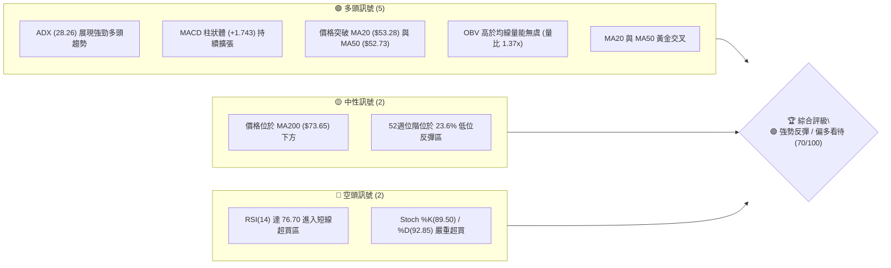
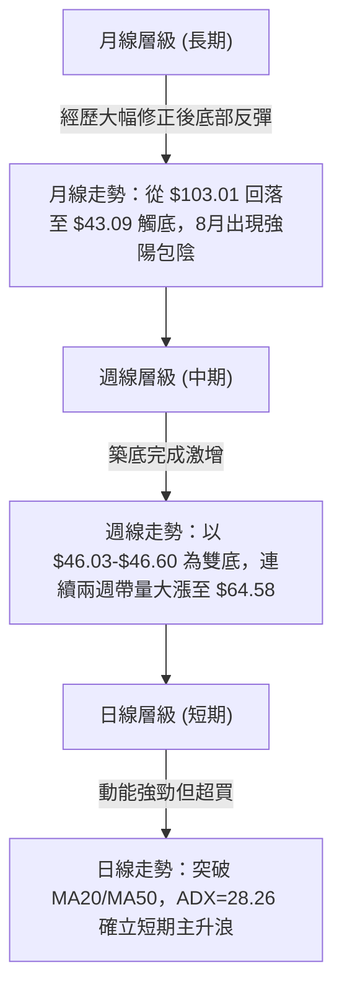
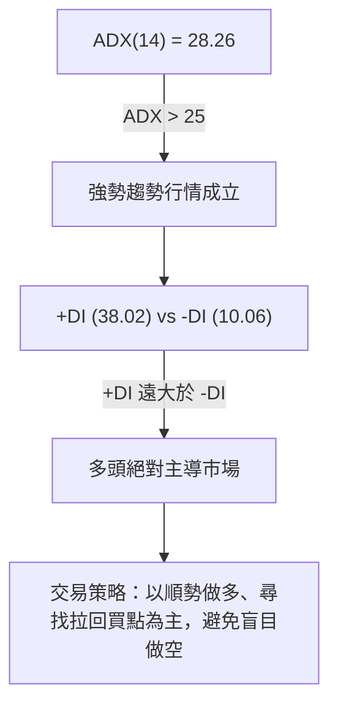
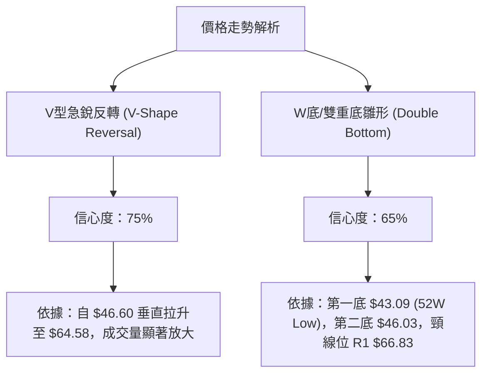
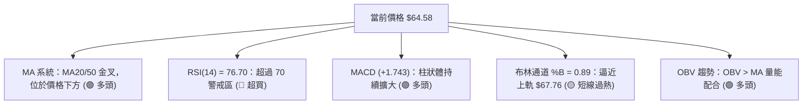
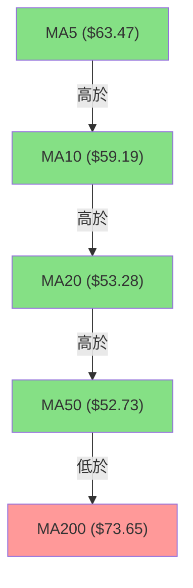
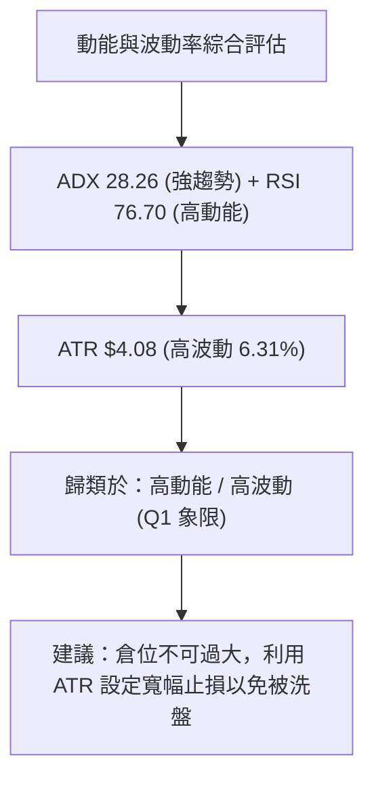
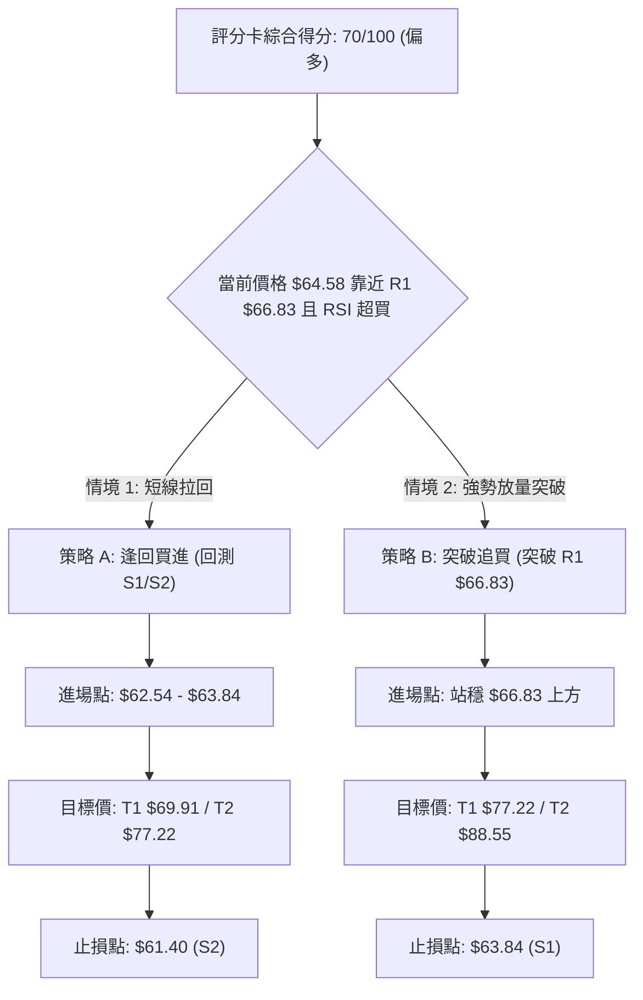
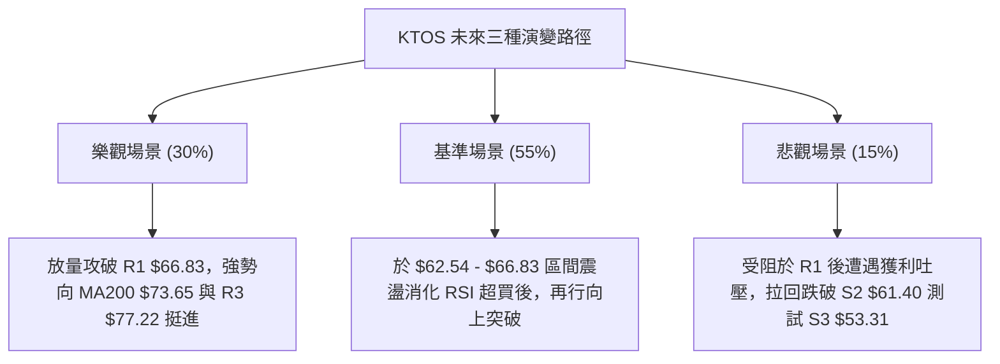

# KTOS 技術分析報告

> **報告日期**：2026-08-15 ｜ **語言**：繁體中文 ｜ **數據來源**：Yahoo Finance ｜ **當前價格**：$64.58

---

## 目錄

| 章節 | 內容 |
|------|------|
| [1. 技術面概覽](#1-技術面概覽) | 訊號儀表板、核心指標、評分卡 |
| [2. 趨勢分析](#2-趨勢分析) | 多時框趨勢、長中短期走勢 |
| [3. 圖表形態分析](#3-圖表形態分析) | 形態識別、K線組合、目標價 |
| [4. 支撐與阻力](#4-支撐與阻力) | 關鍵價位、斐波那契回調 |
| [5. 技術指標深度解讀](#5-技術指標深度解讀) | MA/RSI/MACD/布林/成交量 |
| [6. 動能與波動率](#6-動能與波動率) | 動能評估、ATR、Beta |
| [7. 多時框架總結](#7-多時框架總結) | 時框架評分矩陣 |
| [8. 交易策略建議](#8-交易策略建議) | 多空策略、風險報酬比 |
| [9. 風險提示與監控](#9-風險提示與監控) | 監控指標、風險場景 |

---

## 1. 技術面概覽

### 🎯 技術訊號儀表板



### 📊 核心指標速覽表

| 指標類別 | 指標名稱 | 當前數值 | 訊號 | 解讀 |
|----------|----------|----------|------|------|
| **價格** | 當前價格 | $64.58 | 🟢 | 近兩週暴力反彈，站上 78.6% 斐波那契位 ($62.54) |
| **均線** | MA20 | $53.28 | 🟢 | 價格位於 MA20 上方 (+21.22%)，短線均線強勢向上 |
| **均線** | MA50 | $52.73 | 🟢 | 價格位於 MA50 上方，與 MA20 完成黃金交叉 |
| **均線** | MA200 | $73.65 | 🔴 | 價格位於 MA200 下方 (-12.31%)，中期壓制位尚待克服 |
| **動能** | RSI(14) | 76.70 | 🔴 | 突破 70 臨界點進入超買區，短線需防範拉回修復 |
| **動能** | MACD | 3.561 | 🟢 | 快線穿過慢線呈多頭排列，柱狀體 (+1.743) 強勢放大 |
| **動能** | ADX(14) | 28.26 | 🟢 | ADX > 25 且 +DI (38.02) 遠高於 -DI (10.06)，多頭趨勢成立 |
| **通道** | 布林通道 | %B 0.89 | 🟡 | 價格逼近 BB 上軌 ($67.76)，短線上軌壓力沉重 |
| **波動** | ATR(14) | $4.08 | 🟡 | 佔股價 6.31%，日均波動較大，需設置寬幅止損 |

### 🏆 技術評分卡

```
╔══════════════════════════════════════════════════════════════╗
║              技術評分卡 — KTOS (2026-08-15)                 ║
╠══════════════════════════════════════════════════════════════╣
║ 趨勢強度      ████████████████░░░░  80/100  🟢 強勢趨勢     ║
║ 動能指標      ██████████████░░░░░░  70/100  🟢 多頭占優(超買)║
║ 支撐穩定度    ██████████████░░░░░░  70/100  🟢 底部位階紮實 ║
║ 成交量配合    ████████████████░░░░  80/100  🟢 放量推升     ║
║ 形態完整度    ████████████░░░░░░░░  60/100  🟡 V型反彈進行中 ║
║ 均線排列      ████████████░░░░░░░░  60/100  🟡 短多長空     ║
╠══════════════════════════════════════════════════════════════╣
║ 綜合評分      ██████████████░░░░░░  70/100  🟢 偏多看好     ║
╚══════════════════════════════════════════════════════════════╝
```

---

## 2. 趨勢分析

### 🌐 多時框趨勢分析



### 📈 長期趨勢 — 24個月走勢圖（Unicode）

```
KTOS 24個月收盤價走勢圖 (2024-08 至 2026-08)
價格軸 ($)
$110 ┤                               ●(103.01)
$100 ┤                       ●   ●
$90  ┤                     ●   ●
$80  ┤                 ●
$70  ┤                                       ●   ●           ● (64.58現價)
$60  ┤                                             ●   ●   ●
$50  ┤                                                   ●
$40  ┤ ●   ●   ●   ●
$30  ┤   ●   ●   ●   ●   ●
     └─────────────────────────────────────────────────────────► 時間
       24/08                  25/09          26/01       26/07 26/08
```

#### 走勢特徵分析表格

| 階段 | 時間區間 | 價格變動 | 漲跌幅 | 階段特徵與市場心理 |
|------|----------|----------|--------|--------------------|
| **第一階段：初級起漲** | 2024-08 ~ 2025-05 | $22.94 → $36.89 | +60.81% | 底部溫和放量爬升，機構資金持續建倉 |
| **第二階段：瘋狂主升** | 2025-06 ~ 2026-01 | $36.89 → $103.01 | +179.24% | 無人機與國防需求爆發，股價直衝 52 週高點 $134.00 |
| **第三階段：戴維斯雙殺** | 2026-02 ~ 2026-07 | $103.01 → $46.60 | -54.76% | 獲利了結賣壓沉重，一路跌破 MA200，估值劇烈修正 |
| **第四階段：暴力反彈** | 2026-07 ~ 2026-08 | $46.60 → $64.58 | +38.58% | 財報/機構升評誘發軋空，兩週內急拉突破多道均線 |

### 📊 中期趨勢（週線分析）

近 20 週走勢顯示，KTOS 在 2026 年 7 月下旬跌至 $46.03 - $46.60 區域後，賣壓完全竭盡。2026-08-09 當週收盤爆量拉出 $60.77 (+30.4%)，隨後於 2026-08-16 當週續攻至 $64.58，成功克服了前波震盪高點，中期趨勢已從「震盪向下」轉為「強勢底部反轉」。

### ⚡ 趨勢強度評估（ADX 解讀）



| 指標名稱 | 當前數值 | 臨界值 | 狀態評估 | 策略意涵 |
|----------|----------|--------|----------|----------|
| **ADX(14)** | 28.26 | 25.0 | 🟢 強趨勢 | 擺脫盤整，趨勢明確 |
| **+DI** | 38.02 | 20.0 | 🟢 強多頭 | 買盤動能極度強勁 |
| **-DI** | 10.06 | 20.0 | 🟢 極低賣壓 | 賣方幾乎無抵抗力 |

---

## 3. 圖表形態分析

### 🔍 形態識別系統



#### 形態信心度與判斷依據

| 形態名稱 | 信心度 | 判斷依據（引用數據） | 完成度 | 目標價（附計算式） |
|----------|--------|----------------------|--------|--------------------|
| **V型底部反轉** | **75%** | 自 $46.60 低點連兩週暴漲 38.58%，RSI 飆至 76.70，OBV 呈向上揚升 | 85% | 由形態高度推算：$46.60 + ($64.58 - $46.60) * 1.382 = **$71.45** |
| **雙重底 (W底)** | **65%** | 第一底 $43.09、第二底 $46.03，頸線位於 R1 **$66.83** | 70% | 頸線 $66.83 + (頸線 $66.83 - 底部 $44.56) = **$89.10** |

### 🕯️ 重要 K 線形態分析

| 月份/週期 | 收盤價 | K線形態 | 解讀 | 訊號 |
|-----------|--------|---------|------|------|
| **2026-07** | $46.60 | 探底錘子線 (Hammer) | 下影線成功測試 52 週低點 $43.09 區間，止跌訊號明確 | 🟢 看多反轉 |
| **2026-08 (迄今)**| $64.58 | 大陽線實體 (Bullish Marubozu) | 強勢包覆前 3 個月K線，買盤呈壓倒性優勢 | 🟢 強烈看多 |
| **近兩週** | $64.58 | 長紅突破 (Breakout Bar) | 連續兩週放量突破 MA20 與 MA50，展現強攻態勢 | 🟢 動能持續 |

### 📉 ASCII 走勢形態示意圖

```
KTOS 雙底/V型反轉與關鍵頸線示意圖
價格 ($)
$77.22 ┤------------------------------------------- R3 (波段目標)
$69.91 ┤------------------------------------------- R2
$66.83 ┤=========================================== R1 (W底頸線壓力)
$64.58 ┤                             ▲ (現價)
       │                            /
$53.31 ┤            ▲              / -------------- S3 / BB中軌
       │           / \            /
$46.60 ┤  ●       /   \          ● (第二底 $46.03-$46.60)
$43.09 ┤   \_____/     \________/  (第一底 52W Low $43.09)
       └────────────────────────────────────────────► 時間
```

### 🎯 形態目標價計算

1. **V型擴充目標價**：
   $$\text{目標價} = \text{起漲點} + (\text{目前漲幅} \times 1.382) = 46.60 + (64.58 - 46.60) \times 1.382 = \$71.45$$
2. **雙底突破目標價**（若順利突破頸線 R1 $66.83）：
   $$\text{雙底形態高度} = R1 (\$66.83) - \text{雙底均價} (\$44.56) = \$22.27$$
   $$\text{潛在突破目標價} = R1 (\$66.83) + \$22.27 = \$89.10$$
   *(註：此目標價逼近 52 週斐波那契 50.0% 回調位 **$88.55**)*

---

## 4. 支撐與阻力

### 🗺️ 關鍵價位分布圖（Unicode）

```
KTOS 價位結構分布圖
═══════════════════════════════════════════════════════════════
$134.00 ║████████████████████████████████████████ High 52W
$112.55 ║████████████████████████            Fib 23.6%
 $99.27 ║████████████████                    Fib 38.2%
 $88.55 ║████████████                        Fib 50.0%
 $77.82 ║████████                            Fib 61.8% / R3 ($77.22)
 $73.65 ║██████                              MA200 關鍵長空分水嶺
 $69.91 ║████                                R2 阻力
 $66.83 ║██                                  R1 頸線強阻力
 $64.58 ╠════════════════════════════════════► 【當前價格】
 $63.84 ║▓▓                                  S1 近期支撐
 $62.54 ║▓▓▓▓                                Fib 78.6%
 $61.40 ║▓▓▓▓▓▓                              S2 支撐
 $53.31 ║▓▓▓▓▓▓▓▓▓▓▓▓                        S3 強支撐 / MA20
 $43.09 ║▓▓▓▓▓▓▓▓▓▓▓▓▓▓▓▓▓▓▓▓▓▓▓▓            Low 52W
═══════════════════════════════════════════════════════════════
```

### 🚧 阻力位分析表

| 阻力級別 | 精確價位 | 形成原因（依據數據） | 突破難度 | 重要性 |
|----------|----------|----------------------|----------|--------|
| **R1** | **$66.83** | 近一年波段高點聚類、布林通道上軌 ($67.76) | 🔴 高 | **極關鍵**：W底頸線位置，突破將開啟中期擴張 |
| **R2** | **$69.91** | 近一年波段高點聚類、逼近 MA200 ($73.65) | 🟡 中 | **次要**：短線獲利解套賣壓密集區 |
| **R3** | **$77.22** | 近一年波段高點聚類、斐波那契 61.8% ($77.82) | 🔴 極高 | **強阻力**：牛熊轉換核心陣地，MA240 ($75.31) 亦在此 |

### 🛡️ 支撐位分析表

| 支撐級別 | 精確價位 | 形成原因（依據數據） | 守住機率 | 重要性 |
|----------|----------|----------------------|----------|--------|
| **S1** | **$63.84** | 近一年波段低點聚類、MA5 ($63.47) 疊加 | 🟢 高 | **短線防線**：極短線多頭防守點，維持強勢必守 |
| **S2** | **$61.40** | 近一年波段低點聚類、斐波那契 78.6% ($62.54) | 🟢 高 | **關鍵支撐**：拉回買盤強烈區間 |
| **S3** | **$53.31** | 波段低點聚類、MA20 ($53.28) 與 MA50 ($52.73) | 🟢 極高 | **鐵板支撐**：中期多空生命線，失守則反彈結束 |

### 📐 斐波那契回調位分析

基於 52 週高點 **$134.00** 至 52 週低點 **$43.09** 之完整波動區間計算：

*   **0.0% (52W High)**: $134.00
*   **23.6%**: $112.55
*   **38.2%**: $99.27
*   **50.0%**: $88.55
*   **61.8%**: $77.82
*   **78.6%**: $62.54
*   **100.0% (52W Low)**: $43.09

**位階解讀**：
當前價格 **$64.58** 已成功上穿 78.6% 回調位 ($62.54)，正處於 **78.6% ($62.54) 至 61.8% ($77.82)** 之回升通道內。站穩 $62.54 代表自 $134.00 以來的長期熊市跌勢得到有效遏制，若能突破 R1 ($66.83)，下一波長線回升目標將直指 61.8% 水準 ($77.82)。

---

## 5. 技術指標深度解讀

### 🎛️ 指標訊號總覽



### 📈 移動平均線排列分析



*   **均線結構**：短期呈現標準多頭排列（MA5 > MA10 > MA20 > MA50），且 MA20 ($53.28) 已金叉 MA50 ($52.73)，發出強烈的中期轉多訊號。
*   **長線壓制**：MA200 ($73.65) 及 MA240 ($75.31) 仍在上方扣高走平，顯示長線仍受制於均線蓋頂，若後續觸及 $73.65 - $77.22 區域，預期將有劇烈震盪。

### 📉 RSI(14) 分析

*   **當前數值**：**76.70**
*   **強度進度條**：`█████████████████░░░` (76.7%) — 🔴 超買
*   **背離狀態**：**無明顯背離**。價格創下近兩個月新高的同時，RSI 亦同步刷新波段高點（從 7 月下旬的 35.1 飆升至 76.7），顯示本波上漲由極度純粹的買盤動能驅動。
*   **解讀**：RSI 進入 >70 超買區並不代表需立即做空，在強勢 ADX 趨勢行情中，RSI 常會出現「超買高檔鈍化」。然而，這提示追高風險極高，等待拉回尋找買點更為妥當。

### 📊 MACD(12/26/9) 訊號解讀

*   **MACD 線**：3.561
*   **Signal 線**：1.818
*   **MACD 柱狀體**：**+1.743** 🟢 看多
*   **解讀**：MACD 快慢線在零軸上方快速打開擴散，柱狀體由前期的零軸附近爆發式成長至 +1.743，展現極強的動能加速特徵。目前尚未出現柱狀體縮頭或快線向下彎頭的衰竭訊號。

### 📦 布林通道分析

```
KTOS 布林通道價格位置示意圖
═══════════════════════════════════════════════════════════════
$67.76 ┤------------------------------------------- 布林上軌 (BB Upper)
$64.58 ┤                             ▲ (當前價格 $64.58, %B=0.89)
$53.28 ┤------------------------------------------- 布林中軌 (MA20)
$38.79 ┤------------------------------------------- 布林下軌 (BB Lower)
═══════════════════════════════════════════════════════════════
```

*   **%B 指標**：0.89，位於上軌附近。
*   **通道狀態**：通道開口急劇喇叭口張開（Upper $67.76 vs Lower $38.79），價格貼著上軌強勢運行，屬於強烈的主升擴張態勢。

### 💹 成交量分析（量價配合度）

*   **最新日成交量**：5,396,561 股
*   **20日均量**：3,927,023 股（**量比 1.37x**）
*   **週成交量變化**：2026-08-09 當週爆出 2,896.7 萬股巨量（較前週翻倍），本週持續維持在 1,897.6 萬股的高水準。
*   **OBV 趨勢**：OBV 指標呈直角向上突破，且遠高於其均線，確認籌碼由弱勢手大量轉轉移至強勢法人手（機構持股高達 87.0%），量價配合極佳，無量價背離隱憂。

---

## 6. 動能與波動率

### ⚡ 動能評估四象限

| 象限 | 動能強度 | 波動率水準 | KTOS 當前狀態 | 交易策略導向 |
|------|----------|------------|---------------|--------------|
| **Q1** | **強** | **高** | 🟢 **KTOS 位於此區** | **動能突破行情**：尋找拉回支撐點進場，緊守止損 |
| **Q2** | **弱** | **低** | - | 區間沉悶行情：觀望或網格交易 |
| **Q3** | **強** | **低** | - | 穩定主升段：安心持股續抱 |
| **Q4** | **弱** | **高** | - | 高風險恐慌行情：嚴禁抄底 |



### 📊 ATR 波動率分析

*   **ATR(14)**：**$4.08**（佔當前價格 $64.58 的 **6.31%**）
*   **交易含義**：KTOS 日均高低價差高達 $4.08，屬於典型的「高 beta/高波動」防衛科技股。
*   **止損距離建議**：
    *   **緊密止損 (1.0x ATR)**：$4.08 → 止損設於距進場點 $4.08 處。
    *   **標準止損 (1.5x ATR)**：$6.12 → 建議用於短線突破策略。
    *   **寬鬆止損 (2.0x ATR)**：$8.16 → 用於波段持有策略，避免因盤中雜訊誤觸止損。

### 📐 Beta 與市場相關性

*   **Beta 係數**：**1.106**
*   **解讀**：波動度略高於整體美股大盤（S&P 500）。大盤每上漲 1%，KTOS 理論上隨之變動 1.106%。當前其自身產業（國防航太）與財報事件驅動顯著，表現出強烈的個股alpha走勢。

---

## 7. 多時框架總結

### 📋 時框架評分表

| 時框架 | 趨勢方向 | 動能狀態 | 均線排列 | 圖表形態 | 綜合評分 | 交易建議 |
|--------|----------|----------|----------|----------|----------|----------|
| **日線 (Daily)** | 🟢 多頭 | 🔴 超買過熱 | 🟢 短期多頭 | 🟢 V型噴出 | **80/100** | 待回測 S1/S2 買進 |
| **週線 (Weekly)**| 🟢 轉多 | 🟢 強勢回升 | 🟡 交叉築底 | 🟢 雙底反彈 | **70/100** | 中線波段持有 |
| **月線 (Monthly)**| 🟡 築底 | 🟡 中性回升 | 🔴 均線蓋頂 | 🟡 探底大陽 | **60/100** | 長線長多迎轉機 |

### 🔲 綜合訊號矩陣

```
╔══════════════════════════════════════════════════════════════╗
║                   多時框訊號一致性矩陣                        ║
╠══════════════════┬══════════════┬══════════════┬═════════════╣
║ 維度             │ 日線 (Short) │ 週線 (Medium)│ 月線 (Long) ║
╠══════════════════┼══════════════┼══════════════┼═════════════╣
║ 趨勢方向         │ 🟢 強勢看多  │ 🟢 止跌反彈  │ 🟡 底部修復 ║
║ 均線支撐         │ 🟢 站上 MA20 │ 🟢 站上 MA20 │ 🔴 壓制MA200║
║ 動能指標         │ 🔴 嚴重超買  │ 🟢 強勢黃金  │ 🟡 剛自低位 ║
║ 成交量配合       │ 🟢 放量 1.37x│ 🟢 巨量換手  │ 🟢 縮量沉澱 ║
╚══════════════════┴══════════════┴══════════════┴═════════════╝
```

### ⚖️ 多時框收斂結論

依據多時框收斂規則：當前 **ADX = 28.26 (> 25)**，市場處於**強勢趨勢行情**。
雖然日線 RSI (76.70) 顯示短期過熱，但在週線雙底確立及 ADX 強趨勢保護下，中短期方向強烈收斂為 **【強勢多頭反彈／逢回做多】**。日線過熱僅代表**不宜追高**，應利用短線拉回測試 S1 ($63.84) 或 S2 ($61.40) 的機會建立多頭部位。

---

## 8. 交易策略建議

### 🗺️ 策略決策流程圖



### 🧭 策略路由

*   **當前主策略方向 = 🟢 多頭拉回買進策略（依綜合評分 70/100 分流）**

### 🎯 價格情境階梯（Price Scenarios）

| 觸發條件 | 下一目標 | 後續延伸 | 情境含義 |
|----------|----------|----------|----------|
| **突破 R1 $66.83** | R2 **$69.91** | R3 **$77.22** / MA200 **$73.65** | 突破雙底頸線，中長線全面轉牛 |
| **站穩現價區間** | $64.58 附近高檔震盪 | 消化 RSI 超買 | 短線高檔換手，以時間換取空間 |
| **跌破 S1 $63.84** | S2 **$61.40** | S3 **$53.31** | 短線急漲獲利拉回，測試 78.6% 回調位支撐 |

### 📊 情境機率分佈

| 情境 | 機率 | 主要依據 |
|------|------|----------|
| **高檔震盪後續攻 / 逢回反彈** | **60%** | ADX 28.26 強趨勢、+DI 達 38.02、MACD 柱狀體強勢擴張、OBV 支撐 |
| **區間橫盤消化超買** | **25%** | RSI 76.70 極度超買、BB 上軌 $67.76 壓制短線空間 |
| **深度回落再探底** | **15%** | 受制於長線 MA200 $73.65 賣壓或大盤系統性修正 |

### 🟢 主策略詳情

#### 當前主推：策略 A（逢回低吸多單）與 策略 B（強勢突破多單）

| 策略要素 | 策略 A：逢低拉回買進 (主推) | 策略 B：突破頸線追買 (次選) |
|----------|----------------------------|----------------------------|
| **進場條件** | 價格拉回至 S1 ~ Fib 78.6% 區域且止跌 | 實體K線帶量突破 R1 $66.83 並收上 |
| **進場價格** | **$63.84** (S1) 至 **$62.54** (Fib 78.6%) | **$66.90** (突破 $66.83 經確認) |
| **目標價 T1** | **$69.91** (R2 阻力區) | **$77.22** (R3 阻力區 / Fib 61.8%) |
| **目標價 T2** | **$77.22** (R3 / MA200 疊加區) | **$88.55** (Fib 50.0% 長線目標) |
| **止損價格** | **$61.40** (跌破 S2 止損) | **$63.84** (跌破 S1 假突破止損) |
| **潛在獲利/風險** | 獲利: +$6.07 (+9.5%), 風險: -$2.44 (-3.8%) | 獲利: +$10.32 (+15.4%), 風險: -$3.06 (-4.6%) |
| **風險報酬比** | **2.49 : 1** 🟢 | **3.37 : 1** 🟢 |
| **成功機率** | **65%** | **60%** |
| **建議倉位** | **15% - 20%** 總資金 | **10% - 15%** 總資金 |

### 🔴 反向風險觸發點（對沖提示）

若 KTOS 價格未經震盪直接跌破 **S2 $61.40**，代表短線多頭動能耗盡；若進一步跌破 **S3 $53.31**（MA20 與 MA50 支撐區），則宣告本波反彈型態徹底失敗，應全面清壓多單並進行避險對沖。

### ⭐ 整體訊號強度評星

```
做多訊號強度：★★██☆  (4/5星)  🟢 動能強勁，唯需擇機低吸
做空訊號強度：★☆☆☆☆  (1/5星)  🔴 逆勢做空風險極高
整體可信度：  ★★██☆  (4/5星)  🟢 多指標高度互相確認
```

---

## 9. 風險提示與監控

### ✅ 關鍵監控指標 Checklist

```
╔══════════════════════════════════════════════════════════════╗
║                   每日交易前監控 CHECKLIST                   ║
╠══════════════════════════════════════════════════════════════╣
║ [ ] 1. 價格是否站穩 $62.54 (Fib 78.6%) 以上？               ║
║ [ ] 2. 日線 RSI(14) 是否跌破 70 展開修正？                   ║
║ [ ] 3. 成交量是否維持在 20 日均量 (392.7萬股) 之上？         ║
║ [ ] 4. MACD 柱狀體 (+1.743) 是否出現高檔縮頭？               ║
║ [ ] 5. 價格是否成功挑戰頸線位 R1 $66.83？                    ║
╚══════════════════════════════════════════════════════════════╝
```

### ⚠️ 風險場景分析



### 🛡️ 風險管理重要提醒

1. **過熱指標修復風險**：RSI 達 76.70，Stoch %D 達 92.85，技術面隨時可能出現 1~3 天的短線劇烈拉回（ATR 為 $4.08），**切忌在接近 R1 $66.83 時市價追高**。
2. **長線均線壓制**：上方 MA200 ($73.65) 與 MA240 ($75.31) 仍具強烈下壓慣性，接近此區間時應積極分批獲利結案。
3. **倉位管理**：鑑於單日波動度高達 6.31%，單一股票總持倉不宜超過總投資組合的 **15%~20%**，並應嚴格執行止損紀律。

---

## 📋 報告總結

```
╔══════════════════════════════════════════════════════════════╗
║               KTOS 技術分析報告總結 (2026-08-15)             ║
╠══════════════════════════════════════════════════════════════╣
║ 當前價格：$64.58                                            ║
║ 分析評級：🟢 強勢底部反轉 / 偏多看待 (評分: 70/100)           ║
╠══════════════════════════════════════════════════════════════╣
║ 關鍵結論：                                                   ║
║ ├─ 長期趨勢：🟡 自 $134 大跌後於 $43.09 觸底，月線強勢大陽    ║
║ ├─ 中期趨勢：🟢 週線雙底成型，連續帶量大漲突破 MA20/MA50      ║
║ ├─ 短期趨勢：🟢 ADX 28.26 強勢攻擊，惟 RSI 76.70 超買需防拉回 ║
║ ├─ 關鍵支撐：S1 $63.84 / S2 $61.40 / S3 $53.31                ║
║ ├─ 關鍵阻力：R1 $66.83 (頸線) / R2 $69.91 / R3 $77.22         ║
║ └─ 分析師目標：均價 $105.62 (最高 $150.00 / 最低 $60.00)      ║
╠══════════════════════════════════════════════════════════════╣
║ 最優策略組合：                                               ║
║ 1. 🥇 最佳機會：等待回測 S1 $63.84 ~ Fib 78.6% $62.54 逢低做多 ║
║ 2. 🥈 次選機會：帶量突破 R1 $66.83 確定後順勢追買           ║
║ 3. 🥉 風控提醒：跌破 S2 $61.40 嚴格止損，遠離逆勢做空         ║
╚══════════════════════════════════════════════════════════════╝
```

---

> ⚠️ **免責聲明**：本報告為 AI 自動生成之技術分析，所有數據及估算均基於提供的歷史價格資訊。本報告**僅供研究與學術參考**，**不構成任何投資建議**。投資有風險，入市需謹慎。

---

*報告生成時間：2026-08-15 ｜ 數據來源：Yahoo Finance ｜ 分析框架：多時框技術分析*