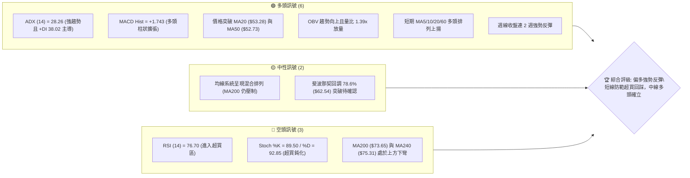
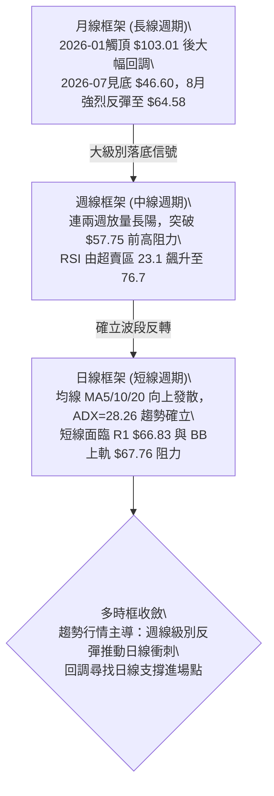
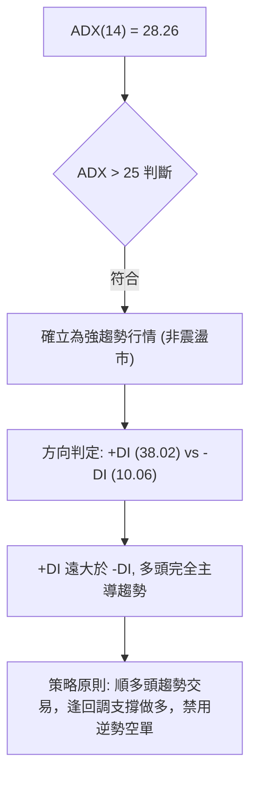
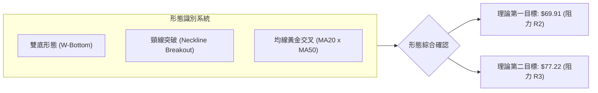
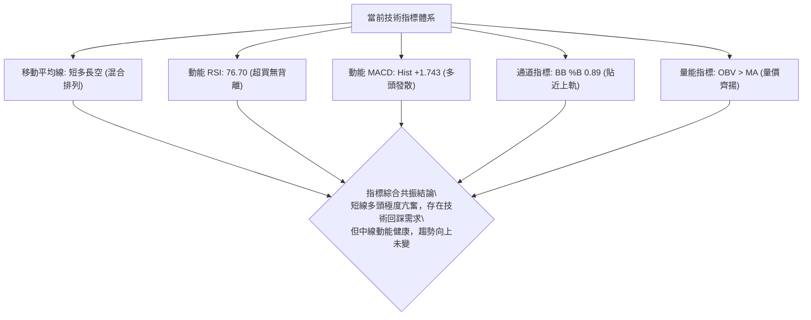
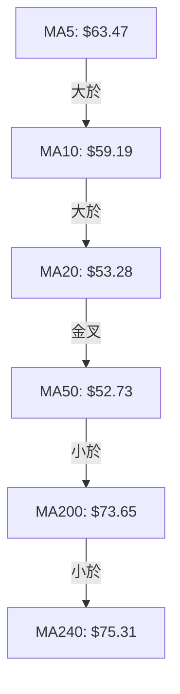
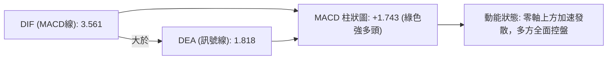
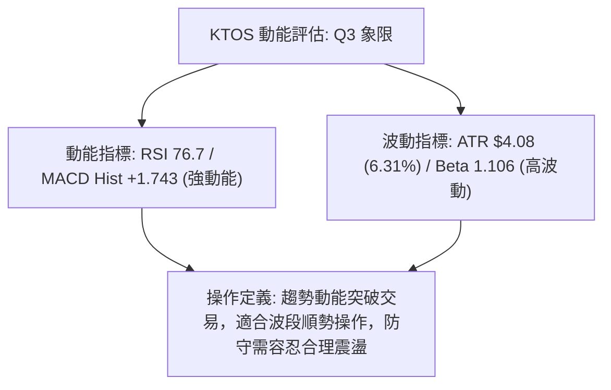
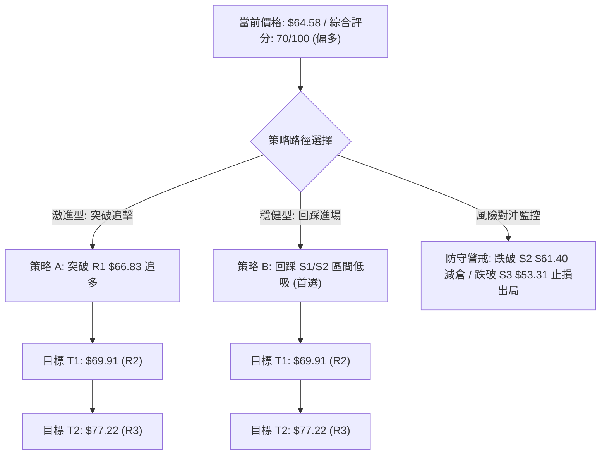
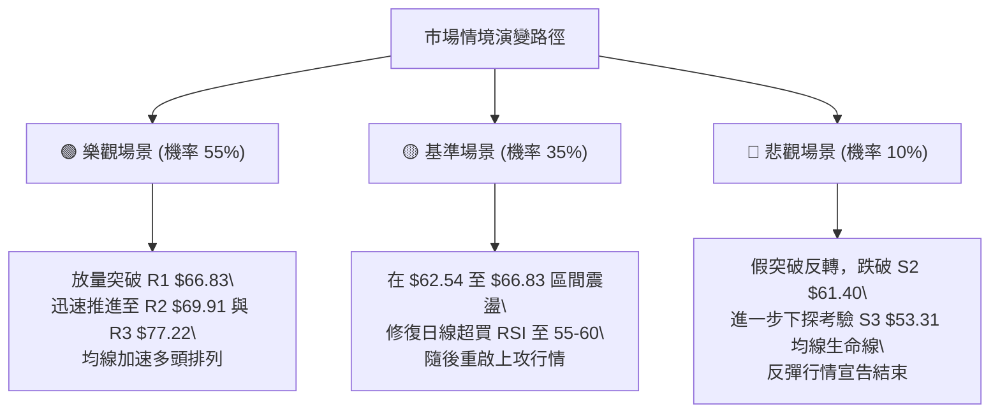

# KTOS 技術分析報告

> **報告日期**：2026-08-16 ｜ **語言**：繁體中文 ｜ **數據來源**：Yahoo Finance ｜ **當前價格**：$64.58

---

## 目錄

| 章節 | 內容 |
|------|------|
| [1. 技術面概覽](#1-技術面概覽) | 訊號儀表板、核心指標、評分卡 |
| [2. 趨勢分析](#2-趨勢分析) | 多時框趨勢、長中短期走勢、ADX強度 |
| [3. 圖表形態分析](#3-圖表形態分析) | 形態識別、K線組合、目標價計算 |
| [4. 支撐與阻力](#4-支撐與阻力) | 關鍵價位、斐波那契回調結構 |
| [5. 技術指標深度解讀](#5-技術指標深度解讀) | MA/RSI/MACD/布林/量價配合 |
| [6. 動能與波動率](#6-動能與波動率) | 動能四象限、ATR波動率、Beta |
| [7. 多時框架總結](#7-多時框架總結) | 時框架評分矩陣、多時框收斂 |
| [8. 交易策略建議](#8-交易策略建議) | 主策略路由、情境階梯、風報比 |
| [9. 風險提示與監控](#9-風險提示與監控) | 監控Checklist、風險情境、風控規則 |

---

## 1. 技術面概覽

### 🎯 技術訊號儀表板



### 📊 核心指標速覽表

| 指標類別 | 指標名稱 | 當前數值 | 訊號 | 解讀 |
|----------|----------|----------|------|------|
| **價格** | 當前價格 | $64.58 | 🟢 | 突破斐波那契 78.6% 回調位 ($62.54)，短線動能強勁 |
| **均線** | MA20 | $53.28 | 🟢 | 現價高於 MA20 達 +21.22%，呈陡峭上行趨勢 |
| **均線** | MA50 | $52.73 | 🟢 | 現價站穩 MA50 之上，且 MA20 已金叉 MA50 |
| **均線** | MA200 | $73.65 | 🔴 | 現價低於 MA200 達 -12.32%，中長期反壓顯著 |
| **動能** | RSI(14) | 76.70 | 🔴 | 進入極端超買區 (>70)，短線追高具回檔風險但無背離 |
| **動能** | MACD (12,26,9) | 3.561 / Hist: +1.743 | 🟢 | 快慢線黃金交叉且柱狀圖正向擴張，動能充沛 |
| **趨勢** | ADX(14) | 28.26 (+DI: 38.02) | 🟢 | ADX > 25 且 +DI 遠高於 -DI (10.06)，強大多頭趨勢 |
| **通道** | 布林通道 %B | 0.89 (Band: $38.79–$67.76) | 🟡 | 逼近布林上軌 ($67.76)，短期進入通道擴張高位區 |
| **量能** | 20日成交量比 | 1.39x (5,446,500 股) | 🟢 | 放量突破均量線，OBV 指向明確，量價配合健康 |
| **波動** | ATR(14) | $4.08 (6.31%) | 🟡 | 波動率顯著，短線震盪幅度大，需拉寬止損空間 |

### 🏆 技術評分卡

```
╔══════════════════════════════════════════════════════════════════╗
║                 技術評分卡 — KTOS (2026-08-16)                  ║
╠══════════════════════════════════════════════════════════════════╣
║ 趨勢強度 (ADX/+DI)    ████████████████░░░░  80/100  🟢 強勁多頭  ║
║ 動能指標 (MACD/RSI)   ██████████████░░░░░░  70/100  🟢 動能偏多  ║
║ 支撐穩定度 (S1-S3)    ██████████████░░░░░░  70/100  🟢 底部扎實  ║
║ 成交量配合 (OBV/Vol)  ████████████████░░░░  80/100  🟢 放量確認  ║
║ 形態完整度 (雙底反轉) ██████████████░░░░░░  70/100  🟢 頸線突破  ║
║ 均線排列 (短強長弱)   ██████████░░░░░░░░░░  50/100  🟡 混合排列  ║
╠══════════════════════════════════════════════════════════════════╣
║ 綜合技術評分          ██████████████░░░░░░  70/100  🟢 偏多進攻  ║
╚══════════════════════════════════════════════════════════════════╝
```

---

## 2. 趨勢分析

### 🌐 多時框趨勢分析



### 📈 長期趨勢 — 12個月走勢圖（Unicode）

```
KTOS 月線走勢圖（過去12個月：2025-08 至 2026-08）
價格 ($)
$105 ┤                               ●(2026-01 $103.01)
$95  ┤               ●(2025-09 $91.37)
$85  ┤                                   ●(2026-02 $86.18)
$75  ┤                       ●     ●
$65  ┤       ●(2025-08 $65.84)                 ●(2026-08 $64.58)◄現價
$55  ┤                                               ●(2026-05 $64.13)
$45  ┤                                                   ●(2026-07 $46.60 低點)
     └───────┬───────┬───────┬───────┬───────┬───────┬───────┬───────┬───────►
          2025-08 2025-10 2025-12 2026-01 2026-03 2026-05 2026-07 2026-08
```

#### 走勢特徵分析表格

| 階段區間 | 起止價格 | 漲跌幅 | 趨勢特徵與量價行為 |
|----------|----------|--------|-------------------|
| **2025-08 ~ 2025-09** | $65.84 → $91.37 | +38.78% | 主升浪行情，市場對國防與無人系統需求強烈定價。 |
| **2025-10 ~ 2025-12** | $90.60 → $75.91 | -16.21% | 高位箱體震盪洗盤，量能逐步收縮。 |
| **2026-01** | $75.91 → $103.01 | +35.70% | 創下波段高點 $103.01（歷史區間高點 $134.00 之下第二高峰），隨後引發獲利了結。 |
| **2026-02 ~ 2026-07** | $86.18 → $46.60 | -45.93% | 單邊空頭回調，跌破 MA200，於 2026-07 觸及波段低點 $46.03~$46.60 構築底部。 |
| **2026-08 (當前)** | $46.60 → $64.58 | +38.58% | 強力 V 型/雙底突破，月K線收出巨幅長陽線，短線強勢反轉。 |

### 📊 中期趨勢（週線分析）

```
中期週線關鍵架構示意圖：
$77.22 ────────────────────────────────────────── 阻力 R3 / 斐波 61.8% ($77.82)
$73.65 ------------------------------------------ MA200 壓力線
$66.83 ────────────────────────────────────────── 阻力 R1 (當前挑戰區間)
$64.58 ◄═════════════════════════════════════════ 【當前現價】
$61.40 ────────────────────────────────────────── 支撐 S2 / 頸線回踩位
$53.31 ────────────────────────────────────────── 支撐 S3 / MA20 ($53.28) / MA50 ($52.73)
$46.03 ────────────────────────────────────────── 雙底波段底部 (2026-07)
```

中期週線在經歷 6 月底至 7 月底連續 5 週於 $46.03–$48.19 區間整固後，於 2026-08-09 當週以 28,967,900 股放量拉出巨陽線（漲至 $60.77），並在 2026-08-16 當週續推至 $64.58。中期空頭走勢正式遭到破壞，進入中期反彈浪結構。

### ⚡ 趨勢強度評估（ADX 解讀）



| 指標項目 | 數值 | 狀態 | 意涵與交易指導 |
|----------|------|------|----------------|
| **ADX (14)** | 28.26 | 🟢 強趨勢 | 突破 25 門檻，宣告脫離 7 月份的低位盤整泥淖，具備持續延伸能力。 |
| **+DI (14)** | 38.02 | 🟢 極強多頭 | 多方力量佔據主導，主買盤持續湧入。 |
| **-DI (14)** | 10.06 | 🟢 空方衰竭 | 空方力量被全面壓制，未見恐慌拋壓。 |
| **趨勢模式** | 單邊反彈 | 🟢 趨勢交易 | 應依據中長期方向操作，日線回調即為買點。 |

---

## 3. 圖表形態分析

### 🔍 形態識別系統



#### 形態信心度與目標價評估表

| 形態類別 | 信心度 | 判斷依據（引用數據） | 完成度 | 目標價（附精確計算式） |
|----------|--------|----------------------|--------|------------------------|
| **雙重底 (W底)** | 80% | 2026-06-28 低點 $47.21 與 2026-07-19 低點 $46.03 構築雙底，頸線位於 2026-06-07 高點 $58.52。8月已放量突破頸線。 | 95% | **第一目標價**：$58.52 (頸線) + ($58.52 - $46.03 形態高度 $12.49) = **$71.01**。對齊聚類阻力位 **R2 = $69.91** 與 **R3 = $77.22**。 |
| **V型島狀反轉** | 70% | 7 月底收盤 $46.60 快速拉升至 $60.77 及 $64.58，連破 MA20 ($53.28) 與 MA60 ($53.86)。 | 90% | 由波段起漲點 $46.60 起算，等長對稱推算幅度至 **R1 $66.83** 與 **R2 $69.91**。 |
| **均線金叉突破** | 85% | MA20 ($53.28) 向上金叉 MA50 ($52.73)，MA5 ($63.47) 陡峭向上穿越所有短中期均線。 | 100% | 均線發散上行，短線支撐確立於 **S1 $63.84** 與 **S2 $61.40**。 |

### 🕯️ 重要K線形態分析

| 日期 / 週別 | 收盤價 | K線形態 | 解讀 | 訊號 |
|-------------|--------|---------|------|------|
| **2026-07-19** | $46.03 | 探底錘頭線 | 觸及 52 週低點區間 ($43.09 上方)，長下影線測試賣壓耗盡。 | 🟢 止跌 |
| **2026-08-02** | $46.60 | 底部十字星 | 縮量築底完成，週成交量降至 14,799,300 股，變盤信號明確。 | 🟢 醞釀 |
| **2026-08-09** | $60.77 | 破位大陽線 (Marubozu) | 伴隨 28,967,900 股巨量長紅，實體一舉收復 $55-$60 密集成交區。 | 🟢 強烈買入 |
| **2026-08-16** | $64.58 | 衝高延續陽線 | 延續多頭推升動能，站上 $64.00，雖留小上影線但多頭結構完好。 | 🟢 多頭續行 |

### 📉 ASCII 走勢形態示意圖

```
KTOS 雙底反轉與突破頸線示意圖：
價格 ($)
$70.00 ┤                                           ╭─ 目標區間 R2: $69.91
$65.00 ┤                                      ╭───● 現價: $64.58
$60.00 ┤           頸線 $58.52 ───────────────╱───── (突破)
$55.00 ┤               ╭─╮                   ╱
$50.00 ┤    ╭─╮       │ │   ╭─╮             ╱
$45.00 ┤────╯ ╰───────╯ ╰───╯ ╰────────────╯
             第一底           第二底
          (06-28 $47.21)   (07-19 $46.03)
```

### 🎯 形態目標價計算

1. **形態測幅原理**：雙底最低點取 $46.03，頸線取波段高點 $58.52，形態垂直高度為 $58.52 - $46.03 = $12.49。
2. **形態突破理論目標**：$58.52 + $12.49 = **$71.01**。
3. **歷史聚類阻力修正**：
   - 第一階段目標（保守）：**阻力位 R1 = $66.83**（距現價 +3.48%）。
   - 第二階段目標（標準）：**阻力位 R2 = $69.91**（距現價 +8.25%，最接近形態理論目標 $71.01）。
   - 第三階段目標（擴展）：**阻力位 R3 = $77.22**（距現價 +19.57%，重合斐波那契 61.8% 位 $77.82 與 MA240 $75.31）。

---

## 4. 支撐與阻力

### 🗺️ 關鍵價位分布圖（Unicode）

```
KTOS 價位結構分布圖
═══════════════════════════════════════════════════════════════════
$77.82 ║████████████████████████║ 斐波那契 61.8% 回調位
$77.22 ║████████████████████████║ 強阻力 R3 (波段高點聚類)
$75.31 ║██████████████████      ║ MA240 年線反壓
$73.65 ║████████████████████    ║ MA200 牛熊分界線
$69.91 ║████████████████        ║ 阻力 R2 (形態測幅目標區)
$67.76 ║████████████            ║ 布林通道上軌
$66.83 ║████████████████████    ║ 關鍵阻力 R1 (近期波段高點)
$64.58 ╠════════════════════════╣ ◄── 當前現價 ($64.58)
$63.84 ║▓▓▓▓▓▓▓▓▓▓▓▓▓▓▓▓        ║ 近期支撐 S1 (日內短線防守)
$62.54 ║▓▓▓▓▓▓▓▓▓▓▓▓▓▓▓▓▓▓▓▓    ║ 斐波那契 78.6% 回調位
$61.40 ║████████████████████    ║ 強支撐 S2 (波段頸線轉換位)
$53.31 ║████████████████████████║ 核心支撐 S3 (MA20 $53.28 / MA50 $52.73)
═══════════════════════════════════════════════════════════════════
```

### 🚧 阻力位分析表

| 阻力級別 | 價位 | 形成原因（嚴格引用數據） | 突破難度 | 重要性 |
|----------|------|--------------------------|----------|--------|
| **R1** | **$66.83** | 近一年波段高點聚類，與布林上軌 ($67.76) 形成共振壓制區。 | 🟡 中等 | 短線多頭衝刺首道關卡，距現價僅 +3.48%。 |
| **R2** | **$69.91** | 近一年波段密集套牢高點聚類，接近雙底形態量度目標 $71.01。 | 🔴 較高 | 波段獲利了結與解套賣壓交匯處，距現價 +8.25%。 |
| **R3** | **$77.22** | 近一年重大波段高點聚類，疊加斐波 61.8% ($77.82) 與 MA240 ($75.31)。 | 🔴 極高 | 中長期多空分水嶺，突破則確立大級別反轉，距現價 +19.57%。 |

### 🛡️ 支撐位分析表

| 支撐級別 | 價位 | 形成原因（嚴格引用數據） | 守住機率 | 重要性 |
|----------|------|--------------------------|----------|--------|
| **S1** | **$63.84** | 近一年波段低點聚類，緊鄰 MA5 ($63.47)，為極短線多頭防守點。 | 70% | 短線強勢格局防線，跌破則進入小幅整理，距現價 -1.15%。 |
| **S2** | **$61.40** | 近一年波段低點聚類，重疊 2026-08-09 週收盤 $60.77 與突破頸線區。 | 85% | 波段操作核心防守位，回踩不破為極佳加碼點，距現價 -4.92%。 |
| **S3** | **$53.31** | 近一年重大波段低點聚類，精準重合 MA20 ($53.28) 與 MA50 ($52.73)。 | 95% | 中期多頭生命線，若跌破則本次反彈結構完全瓦解，距現價 -17.45%。 |

### 📐 斐波那契回調位分析

依據 52 週區間最高點 **$134.00** 與最低點 **$43.09** 進行斐波那契黃金分割計算：

| 分割比例 | 價位 | 當前相對位置與技術意涵解讀 |
|----------|------|----------------------------|
| **0.0% (52W High)** | **$134.00** | 歷史極值高點，長期終極牛市目標。 |
| **23.6%** | **$112.55** | 長期深次回檔阻力區。 |
| **38.2%** | **$99.27** | 長期多空均衡位，接近 2026-01 高點 $103.01。 |
| **50.0%** | **$88.55** | 半山腰重要心理關卡，重合 2026-02 收盤 $86.18。 |
| **61.8% (黃金分割)**| **$77.82** | **強大中長期反壓**，與阻力 R3 ($77.22) 高度重疊。 |
| **78.6%** | **$62.54** | **當前價格已突破並站上 ($64.58)**，此處已由阻力轉化為短線支撐。 |
| **100.0% (52W Low)**| **$43.09** | 52 週底部極限支撐，築底發起點。 |

**現價定位結論**：現價 $64.58 成功脫離 78.6% ($62.54) 至 100.0% ($43.09) 的極端弱勢區間，目前正向上方 61.8% ($77.82) 展開修復行情。

---

## 5. 技術指標深度解讀

### 🎛️ 指標訊號總覽



### 📈 移動平均線排列分析



#### 均線數據與斜率解析

| 均線名稱 | 數值 | 現價差距 | 走勢與排列含義 |
|----------|------|----------|----------------|
| **MA 5** | $63.47 | +1.75% | 🟢 快速向上挺進，提供短線貼身支撐。 |
| **MA 10** | $59.19 | +9.10% | 🟢 向上發散，短線動能支撐強固。 |
| **MA 20** | $53.28 | +21.22% | 🟢 快速拉升，與 MA50 形成黃金交叉。 |
| **MA 50** | $52.73 | +22.47% | 🟢 拐頭向上，中期底部支撐確立。 |
| **MA 60** | $53.86 | +19.90% | 🟢 走平轉上，季度成本線被有效突破。 |
| **MA 120** | $63.68 | +1.42% | 🟢 剛被價格向上突破，半年線轉為支撐。 |
| **MA 200** | $73.65 | -12.32% | 🔴 仍呈下行趨勢，為中長期上方主要反壓目標。 |
| **MA 240** | $75.31 | -14.25% | 🔴 年線反壓，與阻力 R3 ($77.22) 共振。 |

**均線結論**：短中期均線（MA5/10/20/60）呈現完美多頭排列，並已收復 MA120，技術面由空頭排列轉化為「短中強、長線承壓」的混合多頭攻擊態勢。

### 📉 RSI(14) 分析

- **當前數值**：**76.70**
- **強度可視化**：`███████████████░░░░░  76.7%` 🔴 **超買區間**
- **背離判斷**：檢視近期週線與日線走勢，2026-08-09 RSI 74.1（收盤 $60.77），2026-08-16 RSI 76.7（收盤 $64.58），價格創新高同時 RSI 同步創出反彈新高，**無頂背離現象**。底背離方面，7 月價格於 $46.03 低位時 RSI 呈現抬升（35.1 → 49.3），已完成標準底背離推動。
- **解讀**：超買不代表立即反轉，在強趨勢（ADX > 25）中 RSI 常出現鈍化；但數值高於 75 提示當前不宜以市價追高，應等待回踩指標修復。

### 📊 MACD(12/26/9) 訊號解讀



- **MACD 指標**：3.561
- **訊號線 (Signal)**：1.818
- **柱狀圖 (Histogram)**：**+1.743**（🟢 看多）
- **解析**：MACD 快慢線已在零軸上方形成擴張態勢，且週線 MACD 柱狀圖由負翻正（從 06-28 的 -0.991 翻升至當前的 +1.743），動能指標全面支持多頭波段延續。

### 📦 布林通道分析

```
KTOS 日線布林通道 (20, 2) 結構圖：
$67.76 ┬────────────────────────────────────────── BB 上軌 (阻力壓制)
$64.58 ┼─────────────────────────● 現價 (%B = 0.89，位於上軌附近)
$53.28 ┼────────────────────────────────────────── BB 中軌 (MA20 核心支撐)
$38.79 ┴────────────────────────────────────────── BB 下軌
```

- **布林帶寬度與 %B**：上軌 $67.76、中軌 $53.28、下軌 $38.79。%B 為 **0.89**。
- **解讀**：價格沿布林上軌向上推升（Walking the Band），通道開口顯著放大，為典型的突破型單邊行情。短線上軌 $67.76 將與 R1 $66.83 構成動態阻力帶。

### 💹 成交量分析（量價配合度）

- **最新成交量**：5,446,500 股
- **20日均量**：3,929,520 股（**量比 1.39x**，放量 39%）
- **50日均量**：4,644,210 股（量比 1.17x）
- **OBV 趨勢**：OBV > MA，呈現陡峭上行，資金呈現主動性淨流入。
- **量價配合評估**：2026-08-09 放量至 28.96M 突破，2026-08-16 雖量能收斂至 19.02M 但仍維持在健康水位，價格持續走高，無「量價頂背離」跡象。

---

## 6. 動能與波動率

### ⚡ 動能評估四象限

| 象限 | 動能維度 | 波動率維度 | 當前狀態 | 交易環境解讀與應對策略 |
|------|----------|------------|----------|------------------------|
| **Q1** | **強動能** | **低波動** | — | 平穩主升段，適合持股續抱。 |
| **Q2** | **弱動能** | **低波動** | — | 盤整築底期，適合網格或觀望。 |
| **Q3** | **強動能** | **高波動** | **✓ (KTOS 當前)** | **爆發性突破反彈浪，高收益伴隨短線劇烈震盪，需嚴格控制倉位與止損。** |
| **Q4** | **弱動能** | **高波動** | — | 無序暴跌洗盤，嚴禁進場。 |



### 📊 ATR 波動率分析

- **ATR(14) 數值**：**$4.08**
- **價格波動百分比**：**6.31%**
- **止損與風控設置指引**：
  - **日內短線止損 (1.0x ATR)**：$4.08，對應價格防守點約 $60.50。
  - **波段交易止損 (1.5x ATR)**：$6.12，對應價格防守點約 $58.46。
  - **持倉震盪緩衝 (2.0x ATR)**：$8.16，對應價格防守點約 $56.42。

### 📐 Beta 與市場相關性

- **Beta 係數**：**1.106**
- **市場屬性解析**：KTOS 的波動幅度比 S&P 500 指數高出約 10.6%，具有良好的市場進攻彈性。當大盤或國防軍工板塊走強時，該股具備顯著超額報酬潛力（Alpha）；但當市場回檔時，其回撤幅度亦會放大。
- **機構持股與放空比率**：機構持股達 **85.5%**，籌碼高度集中；空頭部位佔流通股 **5.8%**（Short Ratio 2.44），在強勢突破下具備潛在的微型空頭回補（Short Squeeze）推力。

---

## 7. 多時框架總結

### 📋 時框架評分表

| 時框架 | 趨勢方向 | 動能狀態 | 均線排列 | 形態結構 | 綜合評分 | 交易建議 |
|--------|----------|----------|----------|----------|----------|----------|
| **短線 (日線)** | 🟢 強勢上行 | 🔴 超買修復 | 🟢 短期多頭 | 🟢 均線發散 | 75/100 | 等待回踩支撐低吸 |
| **中線 (週線)** | 🟢 反轉突破 | 🟢 強烈看多 | 🟡 突破半年線 | 🟢 雙底頸線突破 | 70/100 | 波段順勢做多 |
| **長線 (月線)** | 🟡 底部回升 | 🟡 動能初醒 | 🔴 承壓MA200 | 🟡 大區間下半部 | 60/100 | 分批逢低佈局 |

### 🔲 綜合訊號矩陣

| 維度 | 短期 (日線) | 中期 (週線) | 長期 (月線) | 訊號一致性評估 |
|------|-------------|-------------|-------------|----------------|
| **趨勢方向** | 多頭衝刺 | 多頭反轉 | 區間震盪築底 | 🟢 中短期方向高度共振向上 |
| **動能強度** | 極強 (超買) | 強勁發散 | 剛脫離超賣 | 🟢 動能由下而上全面傳導 |
| **阻力位置** | R1 $66.83 | R2 $69.91 | R3 $77.22 / MA200 | 🟡 向上空間逐級打開但阻力密集 |
| **支撐強度** | S1 $63.84 | S2 $61.40 | S3 $53.31 | 🟢 支撐梯度分明且扎實 |

### ⚖️ 多時框收斂結論

依據多時框收斂規則（規則 14）：
1. **行情性質判定**：當前 ADX(14) = 28.26 > 25，**判定為強趨勢行情**（非震盪市）。
2. **主導時框與衝突收斂**：以週線與中長期均線方向為主導。雖然日線 RSI (76.70) 觸及超買區，可能引發短線分時級別的技術性震盪，但週線連續兩週放量長陽已確立底部反轉格局。日線的短線超買不得作為逆勢放空的理由，而應作為「尋找優質回踩支撐進場點」的時機指標。
3. **唯一方向性結論**：**🟢 偏多進攻（波段逢回做多）**。此結論與第 1 章評分卡（70/100）及第 8 章主策略完全一致。

---

## 8. 交易策略建議

### 🗺️ 策略決策流程圖



### 🧭 策略路由

> **當前主策略方向 = 🟢 偏多進攻（波段多頭策略，依綜合技術評分 70/100）**

因技術評分卡高達 70/100 且 ADX 確立強趨勢，本報告主推多頭策略，空頭僅列為風險觸發與對沖參考。

### 🎯 價格情境階梯（Price Scenarios）

價位嚴格引用關鍵價位聚類數據：

| 觸發條件 | 下一目標 | 後續延伸 | 情境含義與操作指引 |
|----------|----------|----------|-------------------|
| **放量突破 R1 $66.83** | **R2 $69.91** | **R3 $77.22** | 短線衝刺加速，雙底測幅目標打開，順勢加碼。 |
| **於 $62.54–$64.58 區間震盪** | **R1 $66.83** | — | 消化 RSI 超買情緒，為最佳逢低建倉窗口。 |
| **有效跌破 S1 $63.84** | **S2 $61.40** | **S3 $53.31** | 短線漲勢暫歇，進入回踩頸線測試，考驗 S2 支撐力道。 |

### 📊 情境機率分佈

| 情境 | 機率 | 主要依據（引用指標與數據） |
|------|------|----------------------------|
| **強勢上行 / 突破衝刺** | **55%** | ADX = 28.26 (+DI 38.02)、MACD Hist +1.743 持續擴張、OBV 趨勢向上且量比 1.39x。 |
| **強勢回踩 / 區間整固** | **35%** | 日線 RSI = 76.70 處於超買區，布林 %B = 0.89 逼近上軌，需消化短線獲利盤。 |
| **深度回落 / 跌破再探底** | **10%** | 均線 MA20/50 剛剛金叉，底部巨量籌碼支撐扎實，無實質利空下深跌機率極低。 |

### 🟢 主策略詳情

本策略提供穩健型（首選）與激進型兩種執行方案：

| 策略要素 | 策略 A（穩健型：回踩支撐佈局 - 推薦） | 策略 B（激進型：動能突破追擊） |
|----------|----------------------------------------|--------------------------------|
| **進場條件** | 價格回踩 S1 附近獲得支撐，或於 78.6% 斐波位企穩 | 日線放量長陽突破並收於阻力位 R1 之上 |
| **進場價格** | **$62.54 ~ $63.84**（取均值 **$63.20**） | **$66.90**（突破 R1 $66.83 後掛單進場） |
| **目標價 T1** | **$69.91**（阻力 R2，預期收益 +10.62%） | **$69.91**（阻力 R2，預期收益 +4.50%） |
| **目標價 T2** | **$77.22**（阻力 R3，預期收益 +22.18%） | **$77.22**（阻力 R3，預期收益 +15.43%） |
| **止損價格** | **$60.90**（跌破 S2 $61.40 下方，風險 -$2.30） | **$63.70**（跌破 S1 $63.84 下方，風險 -$3.20） |
| **風險報酬比** | **1 : 2.92**（以 T1 計算）/ **1 : 6.09**（以 T2 計算） | **1 : 0.94**（以 T1 計算）/ **1 : 3.23**（以 T2 計算） |
| **預估勝率** | **65%** | **55%** |
| **建議倉位** | **15% ~ 20%** 總資金 | **8% ~ 10%** 總資金 |

### 🔴 反向風險觸發點（對沖提示）

- **多頭結構破壞點**：若日線收盤價跌破 **S2 ($61.40)**，意味著本次雙底頸線突破失敗，應將多頭倉位減半。
- **全面停損清倉點**：若價格持續下挫並放量跌破 **S3 ($53.31)**（重合 MA20 $53.28 與 MA50 $52.73），宣告反彈行情徹底終結，多頭應全數離場觀望或建立適度空頭對沖部位。

### ⭐ 整體訊號強度評星

```
╔══════════════════════════════════════════════════════════════════╗
║ 做多訊號強度：★★★★☆  (4.0/5 星) — 中短期共振，量價健康          ║
║ 做空訊號強度：★☆☆☆☆  (1.0/5 星) — 僅具超買回調風險，無做空結構  ║
║ 整體可信度：  ★★★★☆  (4.2/5 星) — 數據完整，指標相互驗證確立    ║
╚══════════════════════════════════════════════════════════════════╝
```

---

## 9. 風險提示與監控

### ✅ 關鍵監控指標 Checklist

```
╔══════════════════════════════════════════════════════════════════╗
║                   KTOS 交易風控監控清單                          ║
╠══════════════════════════════════════════════════════════════════╣
║ [ ] 價格是否跌破斐波那契 78.6% 支撐位 $62.54                     ║
║ [ ] RSI(14) 是否在 $66.83 附近形成頂背離 (價格漲但 RSI 走低)     ║
║ [ ] 日成交量是否萎縮至 20 日均量 ($3.93M) 以下且價格滯漲         ║
║ [ ] MACD 柱狀圖是否由目前的 +1.743 出現連續縮短拐點              ║
║ [ ] 價格觸及 MA200 ($73.65) 與 R3 ($77.22) 時的大單拋壓動向     ║
║ [ ] 國防板塊整體資金流向與市場 Beta 系統性波動                   ║
╚══════════════════════════════════════════════════════════════════╝
```

### ⚠️ 風險場景分析



### 🛡️ 風險管理重要提醒

1. **嚴格執行波動率倉位控管**：KTOS 的 ATR 高達 $4.08（佔股價 6.31%），日波幅較大。單筆交易承擔的本金虧損風險應嚴格限制在總資產的 1%–1.5% 之內。
2. **切忌市價追高超買**：當前 RSI(14) 達 76.70，歷史統計顯示在超買區追進的勝率與風報比較差。強烈建議採取分批掛單方式於 **S1 ($63.84)** 至 **斐波 78.6% ($62.54)** 區間逢低佈局。
3. **利潤保護與移動止損**：當價格順利觸及第一目標 **R2 ($69.91)** 後，應將原始止損點位無條件上移至進場成本價上方（保本止損），並將至少 50% 倉位獲利了結，剩餘部位博弈 **R3 ($77.22)**。

---

## 📋 報告總結

```
╔══════════════════════════════════════════════════════════════════╗
║                   KTOS 技術分析報告總結                          ║
╠══════════════════════════════════════════════════════════════════╣
║ 報告日期：2026-08-16                                            ║
║ 當前價格：$64.58                                                 ║
║ 分析評級：🟢 偏多強勢反彈（波段買入評級，技術評分 70/100）       ║
╠══════════════════════════════════════════════════════════════════╣
║ 關鍵結論：                                                       ║
║ ├─ 長期趨勢：🟡 52週區間築底回升，仍受制於 MA200 ($73.65)         ║
║ ├─ 中期趨勢：🟢 週線雙底頸線放量突破，中期反轉確立              ║
║ ├─ 短期趨勢：🟢 短期均線多頭排列，動能充沛，但短線指標處於超買  ║
║ ├─ 關鍵支撐：S1: $63.84 ｜ S2: $61.40 ｜ S3: $53.31              ║
║ ├─ 關鍵阻力：R1: $66.83 ｜ R2: $69.91 ｜ R3: $77.22              ║
║ └─ 分析師共識目標價：$105.62 (強烈買入評級，21位分析師)          ║
╠══════════════════════════════════════════════════════════════════╣
║ 最優策略組合：                                                   ║
║ 1. 🥇 最佳機會：回踩 $62.54~$63.84 區間低吸做多，目標 $69.91/$77.22 ║
║ 2. 🥈 次選機會：突破 $66.83 輕倉追多，快進快出博弈至 $69.91      ║
║ 3. 🥉 保守選擇：等待股價站穩 $66.83 且 RSI 降至 65 以下再行進場 ║
╚══════════════════════════════════════════════════════════════════╝
```

---

> ⚠️ **免責聲明**：本報告為技術分析研究成果，所有數據及走勢推演均基於市場公開歷史價格資訊。本報告**僅供研究與學術參考**，**不構成任何投資建議或買賣邀約**。投資有風險，入市需謹慎並獨立承擔決策後果。

---

*報告生成時間：2026-08-16 ｜ 數據來源：Yahoo Finance ｜ 分析框架：多時框技術分析體系*