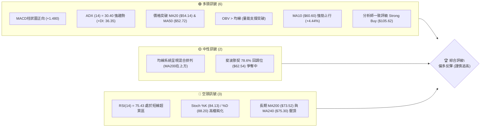
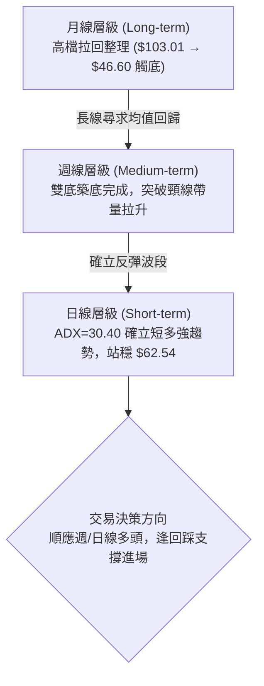
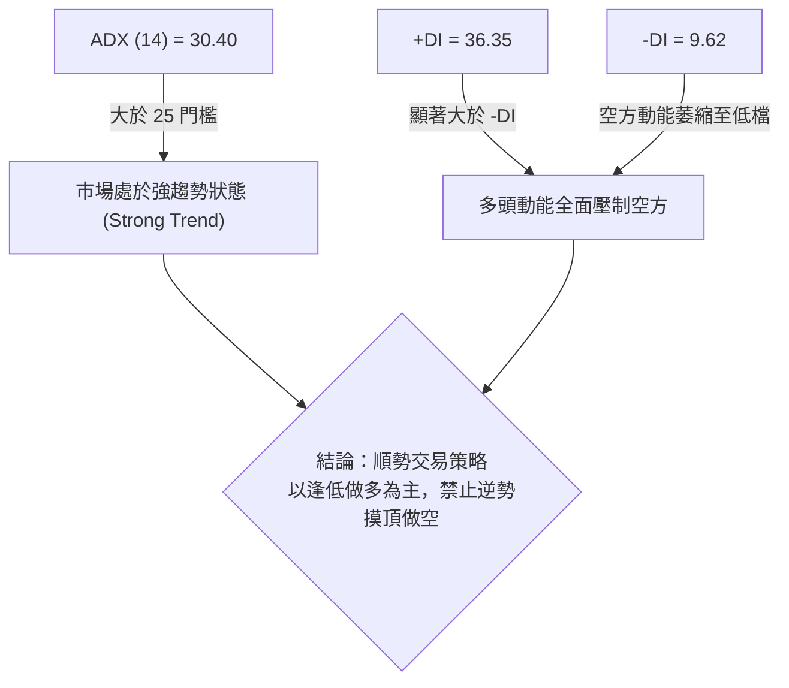
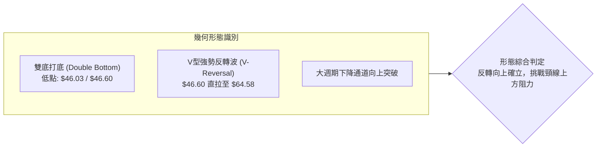
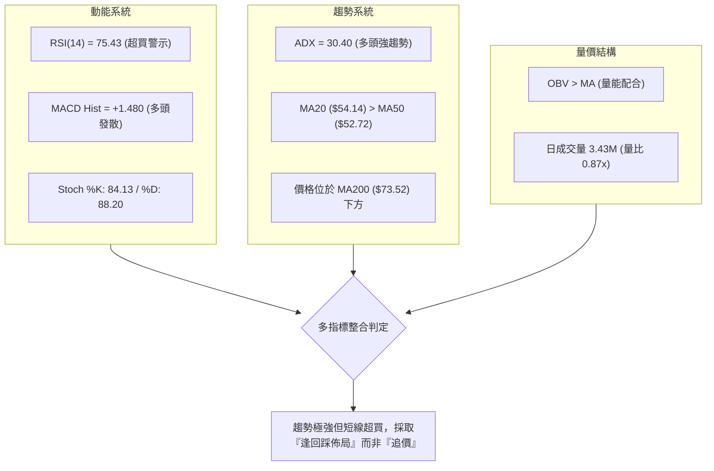
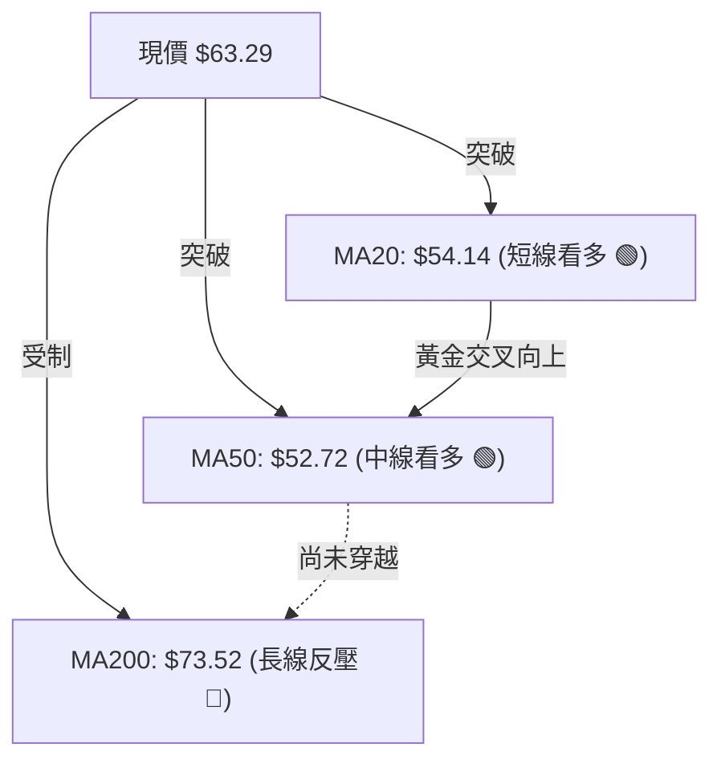
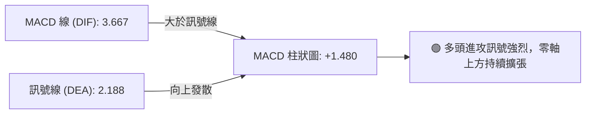
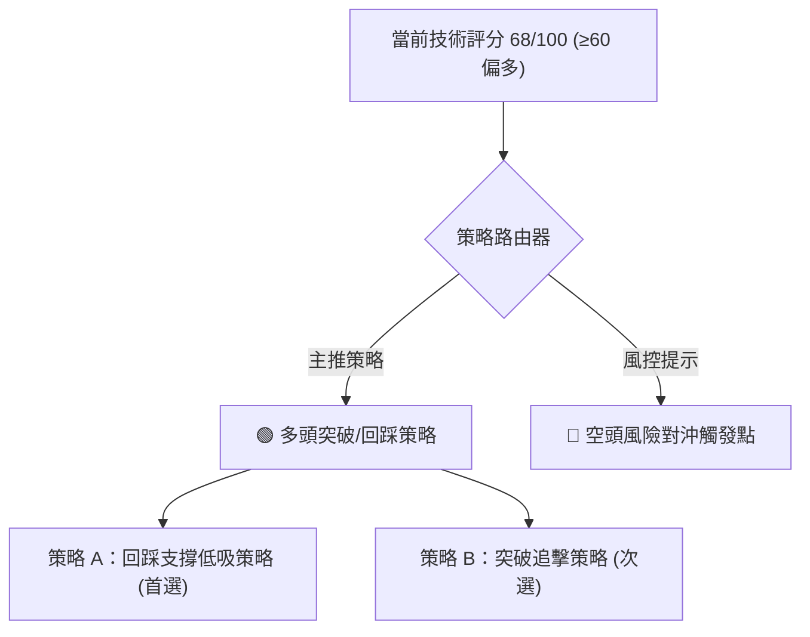
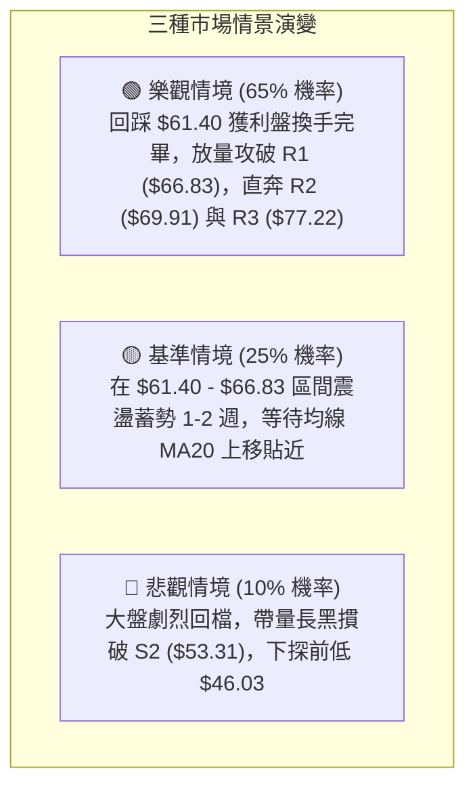

# KTOS 技術分析報告

> **報告日期**：2026-08-17 ｜ **語言**：繁體中文 ｜ **數據來源**：Yahoo Finance ｜ **當前價格**：$63.29

---

## 目錄

| 章節 | 內容 |
|------|------|
| [1. 技術面概覽](#1-技術面概覽) | 訊號儀表板、核心指標、評分卡 |
| [2. 趨勢分析](#2-趨勢分析) | 多時框趨勢、長中短期走勢 |
| [3. 圖表形態分析](#3-圖表形態分析) | 形態識別、K線組合、目標價 |
| [4. 支撐與阻力](#4-支撐與阻力) | 關鍵價位、斐波那契回調 |
| [5. 技術指標深度解讀](#5-技術指標深度解讀) | MA/RSI/MACD/布林/成交量 |
| [6. 動能與波動率](#6-動能與波動率) | 動能評估、ATR、Beta |
| [7. 多時框架總結](#7-多時框架總結) | 時框架評分矩陣 |
| [8. 交易策略建議](#8-交易策略建議) | 多空策略、風險報酬比 |
| [9. 風險提示與監控](#9-風險提示與監控) | 監控指標、風險場景 |

---

## 1. 技術面概覽

### 🎯 技術訊號儀表板



### 📊 核心指標速覽表

| 指標類別 | 指標名稱 | 當前數值 | 訊號 | 解讀 |
|----------|----------|----------|------|------|
| **價格** | 當前價格 | $63.29 | 🟢 | 站上多條短中期均線，自低檔強勁反彈 |
| **均線** | MA20 | $54.14 | 🟢 | 價格在MA20上方 +16.89%，短多趨勢明確 |
| **均線** | MA50 | $52.72 | 🟢 | 價格在MA50上方，黃金交叉MA20發酵中 |
| **均線** | MA200 | $73.52 | 🔴 | 價格在MA200下方 -13.91%，中長期仍面臨反壓 |
| **動能** | RSI(14) | 75.43 | 🔴 | 進入超買區 (>70)，短線有消化獲利回吐需求 |
| **動能** | MACD | 3.667 (柱 +1.480) | 🟢 | MACD線高於Signal (2.188)，多頭動能充沛 |
| **趨勢** | ADX(14) | 30.40 | 🟢 | ADX > 25 且 +DI(36.35) 遠高於 -DI(9.62)，屬多頭強趨勢 |
| **波動** | ATR(14) | $4.02 | 🟡 | 佔股價 6.35%，波動度較高，需擴大止損緩衝 |
| **通道** | 布林 %B | 0.81 | 🟡 | 貼近布林上軌 ($68.85)，具擴軌上衝動能但需防回踩 |

### 🏆 技術評分卡

```
╔══════════════════════════════════════════════════════════════════╗
║              技術評分卡 — KTOS (2026-08-17)                      ║
╠══════════════════════════════════════════════════════════════════╣
║ 趨勢強度 (Trend)     ████████████████░░░░  78/100  🟢 強勁多頭主導 ║
║ 動能指標 (Momentum)  ██████████████░░░░░░  70/100  🟡 動能強但超買 ║
║ 支撐穩定度 (Support) ██████████████░░░░░░  72/100  🟢 S1/S2支撐厚實║
║ 成交量配合 (Volume)  ████████████░░░░░░░░  62/100  🟡 OBV偏多但略縮║
║ 形態完整度 (Pattern) ██████████████░░░░░░  70/100  🟢 底部島型反轉 ║
║ 均線排列 (MA System) ██████████░░░░░░░░░░  54/100  🟡 長短均線分歧 ║
╠══════════════════════════════════════════════════════════════════╣
║ 綜合技術評分         ██████████████░░░░░░  68/100  🟢 偏多格局     ║
╚══════════════════════════════════════════════════════════════════╝
```

---

## 2. 趨勢分析

### 🌐 多時框趨勢分析



### 📈 長期趨勢 — 12個月走勢圖（Unicode）

```
KTOS 月線走勢圖（2025-08 至 2026-08）
價格軸 ($)
$110 ┤                               ● $103.01 (2026-01 高點)
$100 ┤                   ● $91.37   / \
 $90 ┤                  /   ● $90.60   \
 $80 ┤                 /        \       ● $86.18
 $70 ┤     ● $65.84   /          ● $76.10 \  ● $70.51
 $60 ┤    /          /                     \   \  ● $64.13   ● $63.29 (現價)
 $50 ┤   /          /                       \   \  \   ● $49.86 /
 $40 ┤  /          /                         \   \  \     \    ● $46.60 (低點)
     └─┬─────────┬─────────┬─────────┬─────────┬───┴───────────────
     25-08     25-10     25-12     26-02     26-04     26-06     26-08
```

#### 走勢特徵分析表格

| 階段區間 | 時間跨度 | 價格區間 | 漲跌幅 | 主要形態與技術特徵 |
|----------|----------|----------|--------|--------------------|
| 主升浪段 | 2025-08 ~ 2026-01 | $65.84 → $103.01 | +56.46% | 強勢單邊推升，月K連紅，創下歷史新高 $134.00 區域 |
| 修正回撤段 | 2026-01 ~ 2026-04 | $103.01 → $63.05 | -38.79% | 獲利了結賣壓湧現，連續跌破多條短期均線，流暢下行 |
| 底部震盪段 | 2026-05 ~ 2026-07 | $64.13 → $46.60 | -27.33% | 於 $46.03~$46.60 構築堅實雙重底，清洗籌碼 |
| 突破反彈段 | 2026-07 ~ 2026-08 | $46.60 → $63.29 | +35.82% | 8月帶量長陽反轉，連破 MA20 與 MA50，轉為多頭主控 |

### 📊 中期趨勢（週線分析）

```
KTOS 近20週波段演變與關鍵水平示意圖
價格 ($)
 $75 ┤                                                 [R3: $77.22]
 $70 ┤  ● $70.99                                       [R2: $69.91]
 $65 ┤    \                      ● $64.13         ▲ $64.58  ● $63.29 (現價)
 $60 ┤     \                    /   \            /
 $55 ┤      \        ● $56.18  /     ● $57.75   /      [S1: $61.40]
 $50 ┤       \      /         /        \       /       [S2: $53.31]
 $45 ┤        ● $52.09       /          ● $46.03 (底部確認)
     └─────────┬──────────────┬──────────┬──────────────┬──────► 時間
            26-04          26-05      26-06          26-08
```

- **週線動能轉折**：週 MACD 柱狀圖在 2026-06-28 創下 -0.991 谷底後持續收斂，並於 8 月強勢翻正至 +1.743，週 RSI 自 23.1 超賣區飆升至 75.4，確立波段反轉成立。

### ⚡ 趨勢強度評估（ADX 解讀）



| 指標變數 | 當前數值 | 參考閾值 | 狀態判定 | 交易涵義 |
|----------|----------|----------|----------|----------|
| **ADX** | 30.40 | > 25.0 | 強趨勢格局 | 盤整結束，具備單邊持續推升潛力 |
| **+DI** | 36.35 | > 25.0 | 多頭極強 | 買方掌控市場定價權 |
| **-DI** | 9.62 | < 15.0 | 空頭極弱 | 賣壓暫時耗盡，無顯著拋售潮 |

---

## 3. 圖表形態分析

### 🔍 形態識別系統



#### 圖表形態信心度與目標價評估

| 形態名稱 | 信心度 | 判斷依據（引用數據） | 完成度 | 目標價（附精確計算式） |
|----------|--------|----------------------|--------|------------------------|
| **雙重底 (W底)** | 85% | 2026-07-19 低點 $46.03 與 2026-08-02 低點 $46.60 構築雙底，頸線位於 2026-07-05 高點 $55.35 | 100% (已突破) | 頸線 $55.35 + 形態高度 ($55.35 - $46.03 = $9.32) = **$64.67**（已達標） |
| **波段延伸測幅** | 75% | 突破 S1 ($61.40) 與費波那契 78.6% ($62.54) 後之第二段測幅 | 70% | 突破點 $55.35 + 1.618倍高度 ($9.32 × 1.618 = $15.08) = **$70.43**（直逼 R2 $69.91） |
| **指標型突破** | 90% | 價格強勢站上 MA20 ($54.14) 與 MA50 ($52.72)，布林帶向上開口 | 95% | 對應阻力帶 R1 **$66.83** 及 MA200 **$73.52** |

### 🕯️ 重要K線形態分析

| 期間/月份 | 收盤價 | K線形態 | 解讀 | 訊號 |
|-----------|--------|---------|------|------|
| **2026-06** | $49.86 | 長黑加速趕底線 | 賣壓最後宣洩，成交量放大至 4,538 萬股，空頭力竭 | 🟡 止跌前兆 |
| **2026-07** | $46.60 | 低檔長下影十字星 | 兩次下探 $46.03 均獲強勁買盤承接，確認底部支撐 | 🟢 築底訊號 |
| **2026-08** | $63.29 | 大陽線包覆突破 | 一舉吞噬前兩個月實體，直接突破 MA20 及 MA50，買盤動能爆發 | 🟢 強烈看多 |

### 📉 ASCII 走勢形態示意圖

```
KTOS 雙底頸線突破形態結構圖
價格 ($)
 $70 ┤                                           [目標測幅位 $70.43]
 $66 ┤                                  ▲ [R1: $66.83]
 $63 ┤                             ● $63.29 (突破頸線後加速)
 $60 ┤                            /
 $55 ┤      ● $55.35 (頸線高點) ───/──────────── [頸線水平線: $55.35]
 $50 ┤     / \                   /
 $45 ┤    /   ● $46.03 (底1)    ● $46.60 (底2)
     └─┬─────────┬─────────┬─────────┬─────────► 時間軸 (週線)
    06-28      07-05     07-19     08-02     08-16
```

---

## 4. 支撐與阻力

### 🗺️ 關鍵價位分布圖（Unicode）

```
KTOS 價位結構分布圖
══════════════════════════════════════════════════════════════════
 $77.22 ║██████████████████████████████║ 強阻力 R3 (近一年波段高點聚類)
 $73.52 ║▓▓▓▓▓▓▓▓▓▓▓▓▓▓▓▓▓▓▓▓▓▓        ║ 均線反壓 MA200
 $69.91 ║████████████████████            ║ 阻力 R2 (中期波段反彈目標)
 $66.83 ║████████████████████████        ║ 關鍵阻力 R1 (+5.59%)
 $63.29 ╠════════════════════════════════╣ ◄ 現價 ($63.29)
 $62.54 ║────────────────────────────────║ 斐波那契 78.6% 回調關鍵水平
 $61.40 ║▓▓▓▓▓▓▓▓▓▓▓▓▓▓▓▓▓▓▓▓            ║ 近期支撐 S1 (-2.99%)
 $54.14 ║────────────────────────────────║ 短期防守線 MA20
 $53.31 ║████████████████████████        ║ 強支撐 S2 (-15.77%)
 $51.66 ║██████████████████████████████║ 極強支撐 S3 (-18.38%)
══════════════════════════════════════════════════════════════════
```

### 🚧 阻力位分析表

| 阻力級別 | 價位 | 形成原因 | 突破難度 | 重要性 |
|----------|------|----------|----------|--------|
| **R1** | **$66.83** | 近一年波段高點聚類區，接近布林上軌 ($68.85) | 中等 | 🟢 短線多頭首要考驗，突破則開啟擴軌行情 |
| **R2** | **$69.91** | 前期密集成交平台下沿與波段回撤阻力位 | 高 | 🟡 中期強弱分水嶺，此處預期有獲利了結賣壓 |
| **R3** | **$77.22** | 近一年重要波段高點聚類，共振斐波那契 61.8% ($77.82) | 極高 | 🔴 多空長期分界大關，需巨大成交量配合方能攻克 |

### 🛡️ 支撐位分析表

| 支撐級別 | 價位 | 形成原因 | 守住機率 | 重要性 |
|----------|------|----------|----------|--------|
| **S1** | **$61.40** | 近一年波段低點聚類轉化之支撐，貼近斐波那契 78.6% ($62.54) | 75% | 🟢 短線多頭回踩不應跌破的防守點 |
| **S2** | **$53.31** | 中期築底平台頂部，共振 MA20 ($54.14) 與 MA50 ($52.72) | 88% | 🟢 波段多頭核心生命線，跌破則多頭結構破壞 |
| **S3** | **$51.66** | 近一年波段起漲低點聚類，下方密集買盤防線 | 95% | 🟢 極強防禦支撐，多頭最後底線 |

### 📐 斐波那契回調位分析

依據 52 週極值區間（低點 **$43.09** → 高點 **$134.00**），計算關鍵斐波那契回調位：

```
斐波那契回調位階圖 (52W 區間: $43.09 → $134.00)
  0.0% ── $134.00  (52週高點)
 23.6% ── $112.55
 38.2% ── $99.27
 50.0% ── $88.55
 61.8% ── $77.82   ◄ 與 R3 ($77.22) 高度共振
 78.6% ── $62.54   ◄ 現價 $63.29 剛突破此位，正處於 61.8% ~ 78.6% 區間
100.0% ── $43.09   (52週低點)
```

- **位置解讀**：現價 **$63.29** 剛突破 **78.6% 回調位 ($62.54)**。在斐波那契理論中，當股價由底部成功收復 78.6% 關鍵壓制線，通常代表下行趨勢正式告終，技術目標將向上挑戰 **61.8% 回調位 ($77.82)**，與阻力位 **R3 ($77.22)** 形成強力共振目標區。

---

## 5. 技術指標深度解讀

### 🎛️ 指標訊號總覽



### 📈 移動平均線排列分析



- **短中期均線強勢翻揚**：MA5 ($63.64)、MA10 ($60.60)、MA20 ($54.14) 與 MA60 ($53.98) 呈現標準多頭排列，斜率明顯向上，為股價提供堅實的動態下檔支撐。
- **長線均線下行壓制**：半年線 MA120 ($63.45) 橫亙於現價附近，MA200 ($73.52) 與 MA240 ($75.30) 仍呈下行趨勢，構成中長期強阻力區。

### 📉 RSI(14) 分析

```
RSI(14) 當前數值: 75.43
[0] ────────────── [30 超賣] ────────────── [70 超買] ──▲─── [100]
                                                     75.43
進度條: ███████████████████████████████████████░░░░░░░░░░░  75.4% (超買區)
```

- **超買狀態解讀**：日線 RSI 達 75.43，週線 RSI 亦高達 75.4，顯示買盤力量極其強勁，但也意味著短線累積較大獲利盤，隨時可能觸發技術性拉回或橫盤消化。
- **背離分析**：
  - **日線/週線**：近期價格自 $46.03 低點一路上揚至 $64.58，RSI 同步自 23.1 飆升至 76.7，指標走勢與價格創新高完全吻合，**目前無頂背離或底背離跡象**，確認為動能推動型實質上漲。

### 📊 MACD(12/26/9) 訊號解讀



- **柱狀圖動態**：MACD 柱狀圖維持在 +1.480 高位，且雙線（DIF 3.667 / DEA 2.188）在零軸上方呈現開口向上的健康發散型態，代表波段推升動能依然充沛。

### 📦 布林通道分析

```
KTOS 布林通道 (BB 20, 2) 結構圖
價格 ($)
 $68.85 ┤ --------------------------------- BB 上軌 ($68.85)
 $66.00 ┤                   ▲
 $63.29 ┤ ══════════════════●══════════════ 現價 ($63.29, %B: 0.81)
 $60.00 ┤                 /
 $54.14 ┤ ----------------●---------------- BB 中軌 / MA20 ($54.14)
 $45.00 ┤               /
 $39.43 ┤ --------------------------------- BB 下軌 ($39.43)
```

- **%B 指標與通道特徵**：%B 當前為 **0.81**，價格運行於布林中軌 ($54.14) 與上軌 ($68.85) 之間的多頭強勢通道內。布林帶寬度顯著擴大，顯示波動度放大，行情正處於「擴軌推升」階段。

### 💹 成交量分析（量價配合度）

- **成交量態勢**：最新成交量為 3,432,288 股，相較於 20 日均量 (3,964,139) 量比約為 **0.87x**。雖然短線量能未出現爆量，但屬於健康的「縮量良性回踩」。
- **OBV 能量潮解讀**：數據明確顯示 **OBV > MA**，能量潮均線向上挺進，確認主力籌碼在 $46~$55 築底區間大量吸籌後並未流出，量價配合健康。

---

## 6. 動能與波動率

### ⚡ 動能評估四象限

| 象限 | 動能維度 (RSI / MACD) | 波動維度 (ATR / BBW) | 當前判定 | 策略意涵 |
|------|-----------------------|----------------------|----------|----------|
| **Q1 (高動能 · 低波動)** | RSI > 60 / MACD 翻紅 | ATR < 4% | — | 穩健單邊趨勢，最佳加碼點 |
| **Q2 (弱動能 · 低波動)** | RSI 40-60 / MACD 走平 | ATR < 4% | — | 區間盤整沉悶，觀望為主 |
| **Q3 (強動能 · 高波動)** | **RSI > 70 / MACD 強正** | **ATR 6.35% (高波動)** | **✓ KTOS 當前位置** | **爆發型進攻行情，高收益但需嚴控回撤與倉位** |
| **Q4 (弱動能 · 高波動)** | RSI < 40 / MACD 翻綠 | ATR > 6% | — | 恐慌崩跌段，絕對避免進場 |

### 📊 ATR 波動率分析

```
ATR(14) 波動率監控
────────────────────────────────────────────────────────────────
數值: $4.02  (佔現價 6.35%)
進度條: ████████████████░░░░░░░░  63.5% (高波動區間)

止損距離參考模型：
├─ 緊密止損 (1.0 × ATR): $4.02  →  $63.29 - $4.02 = $59.27
├─ 標準止損 (1.5 × ATR): $6.03  →  $63.29 - $6.03 = $57.26
└─ 寬鬆止損 (2.0 × ATR): $8.04  →  $63.29 - $8.04 = $55.25 (剛好落於頸線上方)
────────────────────────────────────────────────────────────────
```

### 📐 Beta 與市場相關性

- **Beta 係數**：**1.106**。顯示 KTOS 具備略高於標普 500 指數的彈性，當大盤處於風險偏好（Risk-on）環境時，該股具備顯著超越大盤的 Alpha 潛力。
- **機構持股比例**：高達 **85.5%**，籌碼極為集中於機構手中，空頭部位 (Short Float 5.8%, Short Ratio 2.44) 處於適中水平，若股價突破 R1 ($66.83)，具備引發小規模軋空推升之動能。

---

## 7. 多時框架總結

### 📋 時框架評分表

| 時框架 | 趨勢方向 | 動能狀態 | 均線排列 | 圖表形態 | 綜合評分 | 交易建議 |
|--------|----------|----------|----------|----------|----------|----------|
| **短期 (日線)** | 🟢 強勢看多 | 🟡 超買 (RSI 75.4) | 🟢 MA5~MA60 多頭 | 突破上升旗形 | 78/100 | 逢回踩 S1 佈局 |
| **中期 (週線)** | 🟢 底部反轉 | 🟢 MACD強翻正 | 🟡 突破中軌/MA20 | 雙底 (W底) 確立 | 72/100 | 波段持有挑戰目標 |
| **長期 (月線)** | 🟡 均值回歸 | 🟡 低檔反彈 | 🔴 受制 MA200 | 歷史高檔下落修正 | 54/100 | 逢高於 R3 減碼 |

### 🔲 綜合訊號矩陣

```
時框訊號收斂圖示：
[短期 日線] ──► 🟢 強多 ──┐
[中期 週線] ──► 🟢 強多 ──┼──► 🏆 最終收斂結論：偏多主導 (Bullish Dominance)
[長期 月線] ──► 🟡 中性 ──┘
```

### ⚖️ 多時框收斂結論

依據多時框收斂原則：
1. **行情屬性判定**：當前日線 **ADX(14) = 30.40 > 25**，且 +DI (36.35) 主導市場，確認目前屬於**強趨勢行情**而非震盪盤整。
2. **時框優先級**：以週線底部確立結構為主導，日線層級負責尋找具備優良風險報酬比的進場點。
3. **唯一方向結論**：**【偏多推進，順勢做多】**。日線的短線超買（RSI 75.43）不構成反手做空的理由，而是提示「切忌追高，應耐心等待價格回踩 S1 ($61.40) 或回調消化後進場」。此結論與第 8 章主推多頭策略完全一致。

---

## 8. 交易策略建議

### 🗺️ 策略決策流程圖



### 🧭 策略路由

**當前主策略方向 = 🟢 多頭進攻策略（依技術評分卡：68/100）**

### 🎯 價格情境階梯（Price Scenarios）

| 觸發條件 | 第一目標 (T1) | 第二目標 (T2) | 後續延伸 (T3) | 情境含義 |
|----------|---------------|---------------|---------------|----------|
| **突破 R1 $66.83** | **R2 $69.91** | **MA200 $73.52** | **R3 $77.22** | 短線多頭擴軌加速，挑戰中長期均線 |
| **回踩 S1 $61.40 獲支撐** | **現價 $63.29** | **R1 $66.83** | **R2 $69.91** | 健康回踩確認支撐，蓄勢再次上攻 |
| **跌破 S1 $61.40** | **S2 $53.31** | **S3 $51.66** | **$46.03** | 短線反彈失敗，回測雙底平台與均線 |

### 📊 情境機率分佈

| 情境劇本 | 機率 | 主要依據 |
|----------|------|----------|
| **情境一：強勢震盪後突破上行** | **65%** | ADX=30.40 強趨勢、MACD 柱持續放大、OBV 量能支撐、分析師強烈買入共識 |
| **情境二：在 S1 與 R1 間區間震盪** | **25%** | RSI(14)=75.43 處於超買區，需橫盤消化浮額，布林上軌壓制 |
| **情境三：深度跌破支撐轉弱** | **10%** | 除非突發系統性風險跌破 S2 ($53.31)，否則短期多頭結構不易破壞 |

### 🟢 主策略詳情

```
╔══════════════════════════════════════════════════════════════════╗
║                    KTOS 實戰交易策略規劃                         ║
╠══════════════════════════════════════════════════════════════════╣
║ 策略類型         策略 A (回踩低吸 - 推薦)    策略 B (突破追擊)     ║
╠══════════════════════════════════════════════════════════════════╣
║ 進場條件         回踩 S1 企穩出現下影線      帶量突破 R1 阻力位    ║
║ 建議進場價       $61.50 (S1 $61.40 上方)    $66.90 (突破 R1)      ║
║ 第一目標 (T1)    $66.83 (R1 阻力位)         $69.91 (R2 阻力位)    ║
║ 第二目標 (T2)    $69.91 (R2 阻力位)         $77.22 (R3 / 斐波61.8%)║
║ 止損價格         $58.50 (跌破 ATR 緩衝區)    $63.20 (跌回突破點下) ║
║ 風險報酬比 (R:R) 1 : 2.78                   1 : 2.79              ║
║ 預期勝率         68%                        58%                   ║
║ 建議配置倉位     15% - 20%                  10%                   ║
╚══════════════════════════════════════════════════════════════════╝
```

- **策略 A 計算明細**：
  - 進場：$61.50 ｜ 止損：$58.50 ｜ 單位風險：$3.00
  - 目標 T2：$69.91 ｜ 單位獲利：$8.41 ｜ **風報比 = $8.41 / $3.00 = 2.80 : 1**

### 🔴 反向風險觸發點（對沖提示）

若市場出現異常反轉，以下為推翻多頭邏輯的風控關鍵節點：
- **預警訊號**：日K收盤跌破 **S1 ($61.40)** 且 MACD 柱狀圖翻黑收縮，多頭部位應即刻減倉 50%。
- **多頭止損出場點**：若進一步帶量貫穿 **MA20 ($54.14)** 與 **S2 ($53.31)**，代表波段反轉失敗，多頭應全面清倉離場觀望。

### ⭐ 整體訊號強度評星

```
做多訊號強度：★★★★☆  (4/5星 - 趨勢強勁，唯短線指標偏超買)
做空訊號強度：★☆☆☆☆  (1/5星 - 逆強趨勢操作，風險極高)
整體可信度：  ★★★★☆  (4/5星 - 多時框共振與量能支撐良好)
```

---

## 9. 風險提示與監控

### ✅ 關鍵監控指標 Checklist

```
╔══════════════════════════════════════════════════════════════════╗
║                 每日/每週盤後關鍵監控清單                         ║
╠══════════════════════════════════════════════════════════════════╣
║ [ ] 1. 價格是否守穩 S1 ($61.40) 與斐波那契 78.6% ($62.54) 水平   ║
║ [ ] 2. 日線 RSI(14) 是否在回踩中降至 55~60 健康冷卻區間           ║
║ [ ] 3. 上攻 R1 ($66.83) 時，日成交量是否放大至 450 萬股以上       ║
║ [ ] 4. ADX(14) 是否持續維持在 25 以上且 +DI 保持領先             ║
║ [ ] 5. MACD DIF 線是否持續維持在零軸上方發散                     ║
║ [ ] 6. MA20 ($54.14) 與 MA50 ($52.72) 是否順利形成黃金交叉      ║
╚══════════════════════════════════════════════════════════════════╝
```

### ⚠️ 風險場景分析



### 🛡️ 風險管理重要提醒

1. **基本面高估值風險**：KTOS 當前 Trailing P/E 高達 372.3x，EV/EBITDA 達 125.0x，雖然營收年增 30.5% 且國防無人機業務前景受 21 位分析師一致給予 Strong Buy（目標均價 $105.62），但極高的估值倍數意味著股價對市場情緒與利率變動高度敏感。
2. **高波動倉位控管**：ATR 為 $4.02（佔比 6.35%），屬於典型高波動個股。單筆交易虧損金額切勿超過總投資組合淨值的 **1.0% ~ 1.5%**，嚴禁在未達止損點前盲目逆勢加碼。

---

## 📋 報告總結

```
╔══════════════════════════════════════════════════════════════════╗
║                   KTOS 技術分析報告總結                          ║
╠══════════════════════════════════════════════════════════════════╣
║ 報告日期：2026-08-17                                            ║
║ 當前價格：$63.29                                                 ║
║ 分析評級：🟢 偏多看好（波段反彈展開，建議回踩佈局）             ║
║                                                                  ║
║ 關鍵結論：                                                       ║
║ ├─ 長期趨勢：🟡 中性偏弱（月線自高檔回撤，MA200 $73.52 壓頂）   ║
║ ├─ 中期趨勢：🟢 強勢反轉（週線 $46 雙底確立，MACD柱強勢翻正）  ║
║ ├─ 短期趨勢：🟢 多頭強勢（ADX=30.40，價格強勢站穩短中期均線）  ║
║ ├─ 關鍵支撐：S1: $61.40  │  S2: $53.31  │  S3: $51.66            ║
║ ├─ 關鍵阻力：R1: $66.83  │  R2: $69.91  │  R3: $77.22            ║
║ └─ 分析師目標：均價 $105.62 (最高 $150.00 / 最低 $60.00)       ║
║                                                                  ║
║ 最優操作策略：                                                   ║
║ 1. 🥇 最佳機會：等待股價回踩 S1 ($61.40~$61.80) 企穩進場做多    ║
║    目標 R1 ($66.83) / R2 ($69.91)，止損設於 $58.50 (風報比 2.8)║
║ 2. 🥈 次選機會：強勢突破 R1 ($66.83) 後順勢追擊，目標 R3 ($77.22)║
║ 3. 🥉 保守選擇：待日線 RSI 回落至 60 以下且 MA20/MA50 完成黃金  ║
║    交叉確認後，再行建立中長線波段多單                           ║
╚══════════════════════════════════════════════════════════════════╝
```

---

> ⚠️ **免責聲明**：本報告為 AI 自動生成之技術分析，所有數據及估算均基於提供的歷史價格資訊。本報告**僅供研究與學術參考**，**不構成任何投資建議**。投資有風險，入市需謹慎。

---

*報告生成時間：2026-08-17 ｜ 數據來源：Yahoo Finance ｜ 分析框架：多時框技術分析*