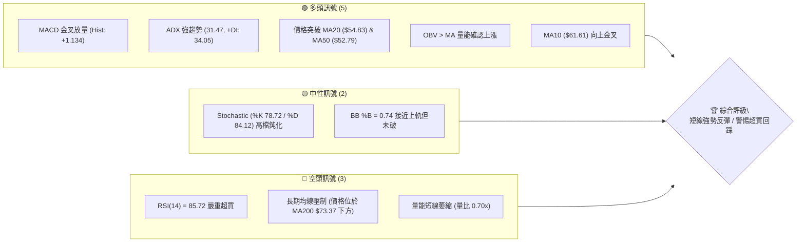
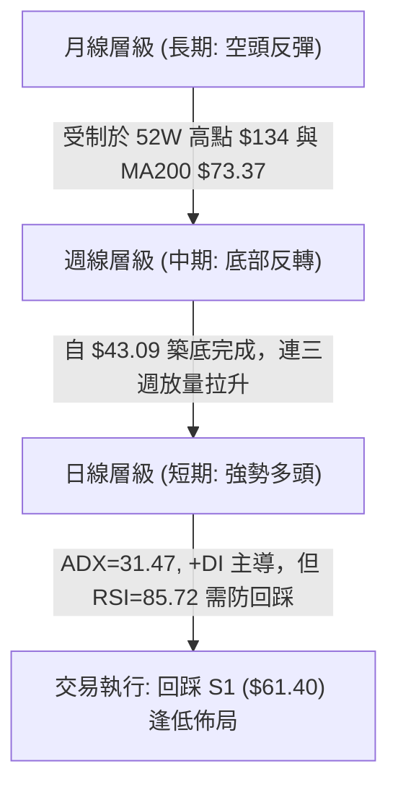
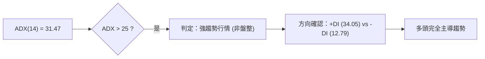
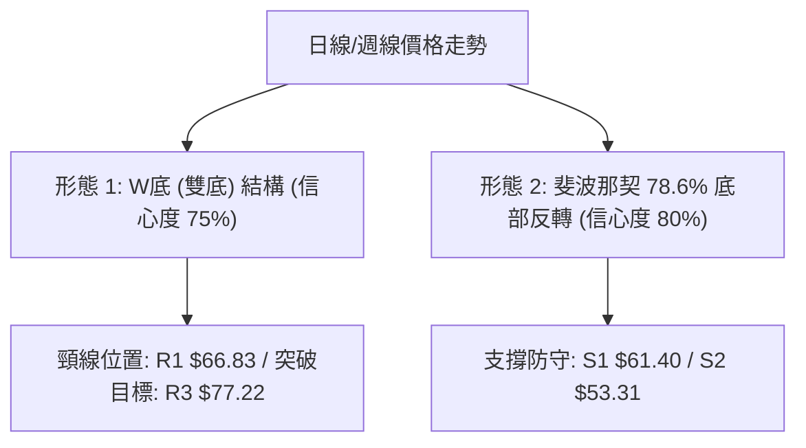
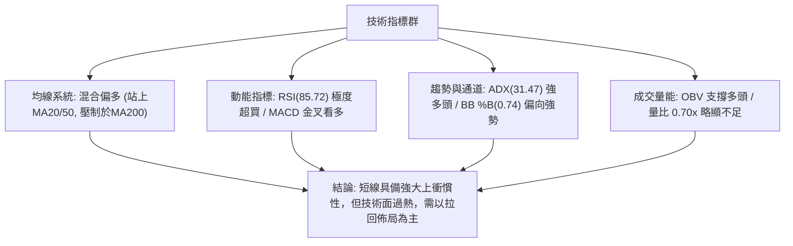
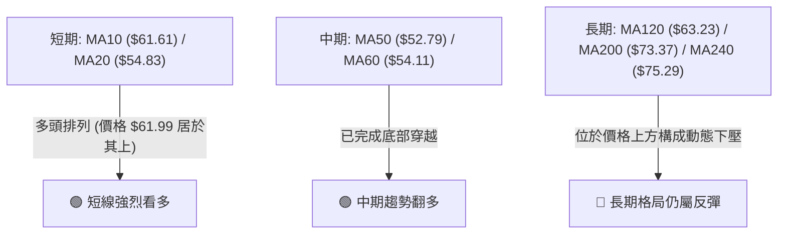
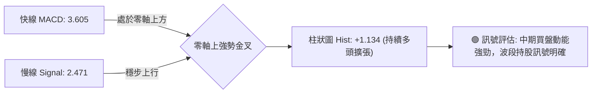
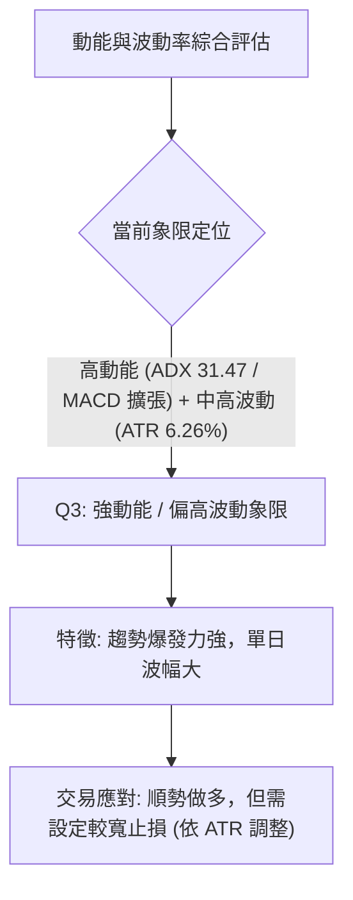
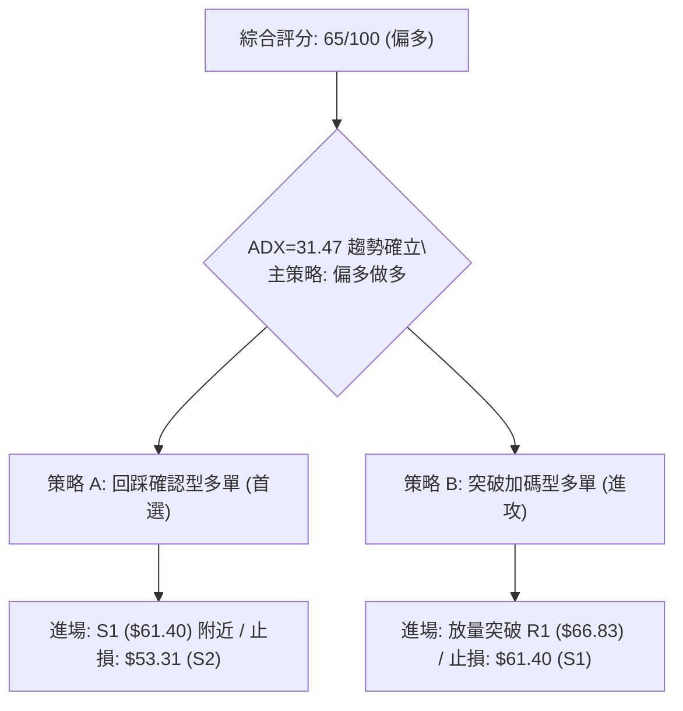
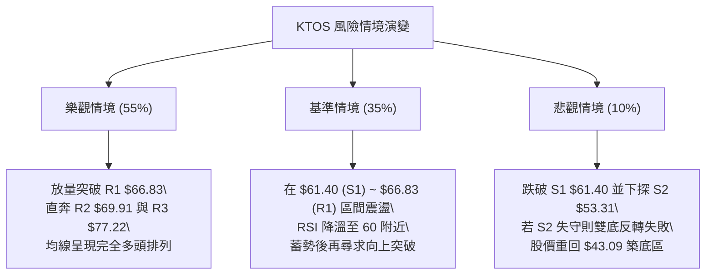

# KTOS 技術分析報告

> **報告日期**：2026-08-18 ｜ **語言**：繁體中文 ｜ **數據來源**：Yahoo Finance ｜ **當前價格**：$61.99

---

## 目錄

| 章節 | 內容 |
|------|------|
| [1. 技術面概覽](#1-技術面概覽) | 訊號儀表板、核心指標、評分卡 |
| [2. 趨勢分析](#2-趨勢分析) | 多時框趨勢、長中短期走勢 |
| [3. 圖表形態分析](#3-圖表形態分析) | 形態識別、K線組合、目標價 |
| [4. 支撐與阻力](#4-支撐與阻力) | 關鍵價位、斐波那契回調 |
| [5. 技術指標深度解讀](#5-技術指標深度解讀) | MA/RSI/MACD/布林/成交量 |
| [6. 動能與波動率](#6-動能與波動率) | 動能評估、ATR、Beta |
| [7. 多時框架總結](#7-多時框架總結) | 時框架評分矩陣 |
| [8. 交易策略建議](#8-交易策略建議) | 多空策略、風險報酬比 |
| [9. 風險提示與監控](#9-風險提示與監控) | 監控指標、風險場景 |

---

## 1. 技術面概覽

### 🎯 技術訊號儀表板



### 📊 核心指標速覽表

| 指標類別 | 指標名稱 | 當前數值 | 訊號 | 解讀 |
|----------|----------|----------|------|------|
| **價格** | 當前價格 | $61.99 | 🟢 | 脫離底部 $43.09 強勢反彈，目前位於 52 週區間 20.8% |
| **均線** | MA20 | $54.83 | 🟢 | 價格在 MA20 上方 +13.05%，短線多頭掌控 |
| **均線** | MA50 | $52.79 | 🟢 | 價格在 MA50 上方，中期走勢由空翻多 |
| **均線** | MA200 | $73.37 | 🔴 | 價格在 MA200 下方 -15.51%，長期趨勢仍處空頭反彈結構 |
| **動能** | RSI(14) | 85.72 | 🔴 | 進入極度超買區間 (>70)，短線面臨均值回歸回檔壓力 |
| **動能** | MACD | 3.605 / 2.471 | 🟢 | MACD 處於零軸上方且柱狀圖 (+1.134) 持續多頭擴張 |
| **波動** | ATR(14) | $3.88 | 🟡 | 佔股價 6.26%，每日波動適中偏大，需設定合理止損緩衝 |

### 🏆 技術評分卡

```
╔══════════════════════════════════════════════════════════════╗
║              技術評分卡 — KTOS (2026-08-18)                 ║
╠══════════════════════════════════════════════════════════════╣
║ 趨勢強度 (ADX/DI)   ████████████████░░░░  78/100  🟢 強勁    ║
║ 動能指標 (RSI/MACD) ████████████░░░░░░░░  62/100  🟡 偏多超買║
║ 支撐穩定度 (S1-S3)  ██████████████░░░░░░  68/100  🟢 良好    ║
║ 成交量配合 (OBV/VOL)████████████░░░░░░░░  60/100  🟡 需補量  ║
║ 形態完整度 (波段反轉)██████████████░░░░░░  70/100  🟢 底部構築║
║ 均線排列 (多空結構) ██████████░░░░░░░░░░  52/100  🟡 混合排列║
╠══════════════════════════════════════════════════════════════╣
║ 綜合評分            █████████████░░░░░░░  65/100  🟢 偏多進攻║
╚══════════════════════════════════════════════════════════════╝
```

---

## 2. 趨勢分析

### 🌐 多時框趨勢分析



### 📈 長期趨勢 — 12個月走勢圖（Unicode）

```
KTOS 月線走勢圖（2025-08 至 2026-08）
價格軸 ($)
$105 ┤                                  ●(2026-01: 103.01)
$95  ┤        ●(2025-09: 91.37)
$85  ┤        │                         │  ●(2026-02: 86.18)
$75  ┤        │          ●──────●       │  │
$65  ┤  ●     │          (11-12月)      │  │        ●(05月)   ●(現在: 61.99)
$55  ┤  │     │                         │  │  ●     │         │
$45  ┤  │     │                         │  │  │     │   ●─────●(06-07月低點)
     └──┴─────┴──────────┴──────┴───────┴──┴──┴─────┴───┴─────┴────
       08/25 09/25      11/25  12/25   01/26 02 03 04  06/26 08/26
```

**走勢特徵分析表格**：

| 階段區間 | 價格區間 ($) | 漲跌幅 | 走勢特徵分析 |
|----------|--------------|--------|--------------|
| **2025-08 ~ 2026-01** | $65.84 → $103.01 | +56.46% | 主升浪行情，國防訂單驅動突破百元大關，創波段峰值 |
| **2026-01 ~ 2026-04** | $103.01 → $63.05 | -38.79% | 頂部快速獲利了結，跌破短中期均線，空頭加速下行 |
| **2026-04 ~ 2026-07** | $63.05 → $46.60 | -26.09% | 恐慌性探底，在 2026-07 觸及 52 週低點 $43.09 區域形成雙底架構 |
| **2026-07 ~ 2026-08** | $46.60 → $61.99 | +33.03% | 突破底頸線報復性反彈，短天期均線金叉發散，動能強勁 |

### 📊 中期趨勢（週線分析）

中期走勢呈現「V型右側加速」反轉結構。自 2026-07-19 低點 $46.03 止跌後，週線級別 MACD 柱狀圖連續兩週大幅翻紅（2026-08-09 週 +1.677、2026-08-16 週 +1.743），推動股價一舉跨越 MA20 ($54.83) 與 MA50 ($52.79)。

```
中期支撐阻力結構：
[R3: $77.22 (斐波那契 61.8% / MA240 $75.29 壓制區)]
      ↑
[R2: $69.91 (布林上軌 $69.66 聚類區)]
      ↑
[R1: $66.83 (波段反彈第一阻力 / 8月前高 $64.58 上方)]
      ↑
──────$61.99 (現價) ───────────────────────────
      ↓
[S1: $61.40 (近一年低點聚類 / 斐波 78.6% $62.54)]
      ↓
[S2: $53.31 (MA20 $54.83 / MA50 $52.79 匯聚防線)]
      ↓
[S3: $51.66 (波段起漲平台支撐)]
```

### ⚡ 趨勢強度評估（ADX 解讀）



| 指標項 | 數值 | 臨界標準 | 狀態評估 | 意義 |
|--------|------|----------|----------|------|
| **ADX(14)** | **31.47** | > 25.00 | 🟢 強趨勢 | 市場脫離無序震盪，進入明確的單邊上升波段 |
| **+DI (14)**| **34.05** | > -DI | 🟢 多方壓制 | 買盤動能充沛，多頭佔據絕對優勢 |
| **-DI (14)**| **12.79** | 低位 | 🟢 空方衰竭 | 賣壓大幅釋放，空頭無力形成有效反撲 |

---

## 3. 圖表形態分析

### 🔍 形態識別系統



| 形態 | 信心度 | 判斷依據（引用數據） | 完成度 | 目標價（附計算式） |
|------|--------|----------------------|--------|--------------------|
| **雙重底 (W-Bottom)** | **75%** | 2026年6月低點 $47.21 與 7月低點 $46.03 形成雙底，回測 52W 低點 $43.09 獲得支撐 | 85% | 頸線取 R1 $66.83，形態高度 = $66.83 - $46.03 = $20.80。向上等幅測距目標價 = $66.83 + $20.80 = **$87.63**（與斐波 50.0% $88.55 聚類） |
| **均線向上金叉形態** | **80%** | MA10 ($61.61) 向上金叉、價格突破 MA20 ($54.83) 與 MA50 ($52.79) | 90% | 第一阻力目標價引用 **R1 $66.83**；第二目標價引用 **R2 $69.91** |
| **大型頭肩頂頸線回測** | **45%** | 由 2026-01 高點 $103.01 下跌以來的大級別反彈 | 30% | 訊號不足且距高點過遠，僅做指標型解讀，不預設目標價 |

### 🕯️ 重要K線形態分析

| 月份/週期 | 收盤價 | K線形態 | 解讀 | 訊號 |
|-----------|--------|---------|------|------|
| **2026-06** | $49.86 | 帶長下影大陰線 | 恐慌拋盤湧現，週成交量達 4,538 萬股爆量換手，空頭動能釋放完畢 | 🟡 |
| **2026-07** | $46.60 | 縮量十字星/錘子線 | 連續測試 $46.03 低點不破，賣壓枯竭，形成底部駐足訊號 | 🟢 |
| **2026-08 (當前)** | $61.99 | 長陽反包吞噬線 | 連續突破 MA20 及 MA50，單月自 $46.60 飆升至 $61.99，確立反轉 | 🟢 |

### 📉 ASCII 走勢形態示意圖

```
KTOS 雙底反轉與頸線突破示意圖
價格 ($)
$69.91 ┤                                           [阻力 R2]
$66.83 ┤                  ┌────── 頸線阻力 R1 ──────[目標突破位]
$61.99 ┤                  │                 ●(現價: 突破途中)
$54.83 ┤───────────────●──┴──●───────────── [MA20 支撐]
$46.60 ┤        ●(底1)        ●(底2)
$43.09 ┴────────┴─────────────┴───────────── [52W 最低點]
               2026-06       2026-07       2026-08
```

### 🎯 形態目標價計算

根據雙底（W底）形態測算：
1. **左底低點**：2026-06-28 週收盤 $47.21（極端低點 $43.09）
2. **右底低點**：2026-07-19 週收盤 $46.03
3. **頸線阻力位**：取近一年波段高點聚類 **R1 = $66.83**
4. **形態高度 ($H$)**：$66.83 - $46.03 = $20.80
5. **理論等幅目標價**：$66.83 + $20.80 = **$87.63**（與關鍵斐波那契 50.0% 回調位 **$88.55** 高度重合）

---

## 4. 支撐與阻力

### 🗺️ 關鍵價位分布圖（Unicode）

```
KTOS 價位結構分布圖
═══════════════════════════════════════════════════
$77.22 ║████████████████████████║ 強阻力 R3 (斐波 61.8% $77.82 聚類)
$69.91 ║████████████████████    ║ 阻力 R2 (BB上軌 $69.66 聚類)
$66.83 ║████████████████████████║ 關鍵阻力 R1 (頸線壓力位)
$62.54 ║────────────────────────║ 斐波那契 78.6% 回調位
$61.99 ╠════════════════════════╣ ◄ 現價
$61.40 ║▓▓▓▓▓▓▓▓▓▓▓▓▓▓▓▓        ║ 近期支撐 S1 (短線回踩第一道防線)
$53.31 ║████████████████████████║ 強支撐 S2 (MA20 $54.83 / MA50 $52.79)
$51.66 ║████████████████████████║ 底部強支撐 S3 (波段防守底線)
═══════════════════════════════════════════════════
```

### 🚧 阻力位分析表

| 阻力級別 | 價位 | 形成原因 | 突破難度 | 重要性 |
|----------|------|----------|----------|--------|
| **R1** | **$66.83** | 近一年波段高點聚類 (+7.81%)、8月中旬高點 $64.58 上方重壓區 | 🟡 中等 | ★★★★☆ 短線多頭試金石，突破確認底部反轉 |
| **R2** | **$69.91** | 近一年波段高點聚類 (+12.78%)、布林通道上軌 ($69.66) 聚類 | 🔴 較高 | ★★★★☆ 動態波動上軌壓制，易引發技術性獲利了結 |
| **R3** | **$77.22** | 近一年波段高點聚類 (+24.57%)、斐波 61.8% ($77.82) 與 MA240 ($75.29) 匯聚 | 🔴 極高 | ★★★★★ 中長期牛熊分水嶺，空頭核心陣地 |

### 🛡️ 支撐位分析表

| 支撐級別 | 價位 | 形成原因 | 守住機率 | 重要性 |
|----------|------|----------|----------|--------|
| **S1** | **$61.40** | 近一年波段低點聚類 (-0.95%)、MA10 ($61.61) 匯聚支撐 | 🟢 70% | ★★★★☆ 短線多頭防線，跌破則回踩均線密集區 |
| **S2** | **$53.31** | 近一年波段低點聚類 (-14.00%)、MA20 ($54.83) 與 MA50 ($52.79) 均線帶 | 🟢 85% | ★★★★★ 中期生命線，多頭波段操作核心防守點 |
| **S3** | **$51.66** | 近一年波段低點聚類 (-16.66%)、2026年5月中旬低點 $52.09 平台 | 🟢 90% | ★★★★☆ 極端回踩極限，跌破則雙底形態失效 |

### 📐 斐波那契回調位分析

依據 52 週波段區間（$43.09 → $134.00）計算之精確斐波那契回調層級：

```
0.0%  (52W High)   $134.00  ──────────────────────────────────
23.6%              $112.55  ░░░░░░░░░░░░░░░░░░░░░░░░░░░░░░░░░░
38.2%              $ 99.27  ░░░░░░░░░░░░░░░░░░░░░░░░░░░░░░░░░░
50.0%              $ 88.55  ░░░░░░░░░░░░░░░░░░░░░░░░░░░░░░░░░░ (形態測算目標)
61.8%              $ 77.82  ▓▓▓▓▓▓▓▓▓▓▓▓▓▓▓▓▓▓▓▓▓▓▓▓▓▓▓▓▓▓▓▓▓▓ (黃金分割強壓 / 聚類 R3)
78.6%              $ 62.54  ◄ 現價 $61.99 位於 78.6% 關鍵分界下方
100.0% (52W Low)   $ 43.09  ══════════════════════════════════
```

**解讀**：現價 $61.99 緊貼 **78.6% 回調位 ($62.54)**。在技術幾何學中，78.6% 是深度回調波段的關鍵反轉閾值。一旦股價有效收復並站穩 $62.54，將正式開啟邁向 61.8% ($77.82) 的多頭修復空間；反之，若在此處受阻，將回測 S1 ($61.40) 及 S2 ($53.31)。

---

## 5. 技術指標深度解讀

### 🎛️ 指標訊號總覽



### 📈 移動平均線排列分析



| 均線名稱 | 當前價格 | 偏離率 (%) | 走勢特徵 | 訊號解讀 |
|----------|----------|------------|----------|----------|
| **MA 5** | $63.29 | -2.06% | 價格短暫回落至 5日線下方 | 🟡 超買微幅降溫 |
| **MA 10** | $61.61 | +0.61% | 向上發散，提供即時動態支撐 | 🟢 短線多頭支撐 |
| **MA 20** | $54.83 | +13.05% | 快速抬升，中短期多頭生命線 | 🟢 趨勢強勁 |
| **MA 50** | $52.79 | +17.43% | 突破確立，中期底部成立 | 🟢 中期轉強 |
| **MA 60** | $54.11 | +14.57% | 走平回升 | 🟢 底部支撐紮實 |
| **MA 120** | $63.23 | -1.96% | 走跌，當前上方最近動態阻力 | 🔴 短線壓制 |
| **MA 200** | $73.37 | -15.51% | 長期下行趨勢壓制線 | 🔴 長期阻力 |
| **MA 240** | $75.29 | -17.66% | 年線重壓，與 R3 ($77.22) 形成共振區 | 🔴 強阻力 |

### 📉 RSI(14) 分析

- **RSI(14) 數值**：**85.72**
- **進度條展示**：`█████████████████░░░` **85.72% (嚴重超買區 >70)**
- **背離判斷**：日線及週線走勢中，價格與 RSI 均創下近期新高，**「無明顯背離」**。此現象表明本輪上漲是由純粹的強大買盤動能推動的單邊拉升，而非動能竭盡的虛漲。但 85.72 的極端數值意味著短線累積了大量獲利籌碼，隨時可能引發 1~3 天的均值回歸回踩。

### 📊 MACD(12/26/9) 訊號解讀



### 📦 布林通道分析

```
KTOS 布林通道 (20, 2) 結構圖
$69.66 ┤─────────────────────────────── BB 上軌 (阻力區)
       │                    
$61.99 ┤              ● (現價, %B = 0.74)
       │                    
$54.83 ┤─────────────────────────────── BB 中軌 / MA20 (核心支撐)
       │
$40.00 ┤─────────────────────────────── BB 下軌 (超賣邊界)
```

- **帶寬與位置**：%B 為 **0.74**，處於中軌 ($54.83) 與上軌 ($69.66) 之間的中高位強勢區。
- **通道開口**：通道開口呈現擴張態勢，顯示股價正沿著通道上軌進行動態推升，屬於強勢多頭特徵。

### 💹 成交量分析（量價配合度）

- **最新成交量**：2,761,023 股
- **20日均量**：3,935,626 股（**量比：0.70x**）
- **50日均量**：4,613,868 股
- **OBV 趨勢**：**OBV > MA**，能量潮指標領先走高，確認資金處於淨流入狀態。
- **量價綜合解讀**：現價在拉升至 $61.99 時量能出現局部萎縮（量比 0.70x），呈現「量價輕微背離」的短線警訊。這表示追高買盤在接近阻力位時轉向謹慎，上攻動能需依賴後續補量（成交量需回升至 400 萬股以上）方能有效突破 R1 ($66.83)。

---

## 6. 動能與波動率

### ⚡ 動能評估四象限



| 象限 | 動能強度 | 波動率水準 | 當前狀態 | 評估與策略 |
|------|----------|------------|----------|------------|
| **Q1** | 強動能 | 低波動 | — | 穩健主升浪，最佳低風險加碼區 |
| **Q2** | 弱動能 | 低波動 | — | 盤整築底期，適合觀望或網格交易 |
| **Q3** | **強動能** | **偏高波動** | **✓ (KTOS 所在)** | **高爆發波段反彈，收益空間大但需嚴格控管回撤風險** |
| **Q4** | 弱動能 | 高波動 | — | 恐慌拋售或無序震盪，嚴禁進場 |

### 📊 ATR 波動率分析

- **當前 ATR(14)**：**$3.88**（佔當前價格之 **6.26%**）
- **波動特性評估**：KTOS 每日平均震盪幅度接近 $4.00，波動度較高。
- **止損距離建議**：
  - **保守型波段止損**：$1.5 \times \text{ATR} = 1.5 \times \$3.88 = \mathbf{\$5.82}$（對應現價止損位約 **$56.17**，恰好覆蓋 MA20 $54.83 上方緩衝區）。
  - **短線緊密止損**：$1.0 \times \text{ATR} = 1.0 \times \$3.88 = \mathbf{\$3.88}$（對應現價止損位約 **$58.11**）。

### 📐 Beta 與市場相關性

- **Beta 係數**：**1.106**
- **解讀**：Beta 值略高於 1.0，表明 KTOS 與美股大盤（S&P 500）保持高度正相關，且具備 10.6% 的超額波動彈性。在市場風險偏好上升時具備進攻優勢，但大盤回調時其回撤壓力亦相應放大。

---

## 7. 多時框架總結

### 📋 時框架評分表

| 時框架 | 趨勢方向 | 動能指標 | 均線排列 | 形態結構 | 綜合評分 | 建議方向 |
|--------|----------|----------|----------|----------|----------|----------|
| **短期 (日線)** | 🟢 強勢上行 | 🔴 RSI 超買 (85.72) | 🟢 站穩 MA20/50 | 🟢 突破短線整理 | **72/100** | 逢回調做多，避免追高 |
| **中期 (週線)** | 🟢 底部反轉 | 🟢 MACD 金叉擴張 | 🟡 突破中軌 | 🟢 雙底構築完成 | **68/100** | 波段持有，目標看至 R2/R3 |
| **長期 (月線)** | 🔴 大級別回調 | 🟡 企穩反彈中 | 🔴 承壓於 MA200 | 🟡 深度回調 78.6% | **55/100** | 視為空頭趨勢中的強反彈 |

### 🔲 綜合訊號矩陣

```
時框共振檢驗：
┌───────────┬──────────────┬──────────────┬──────────────┐
│  指標維度 │  短期 (日線) │  中期 (週線) │  長期 (月線) │
├───────────┼──────────────┼──────────────┼──────────────┤
│ 趨勢方向  │   🟢 看多    │   🟢 看多    │   🔴 看空    │
│ 均線系統  │   🟢 看多    │   🟡 中性    │   🔴 看空    │
│ 動能強度  │   🔴 超買    │   🟢 看多    │   🟡 中性    │
│ 量能配合  │   🟡 偏弱    │   🟢 良好    │   🟢 充足    │
└───────────┴──────────────┴──────────────┴──────────────┘
共振結論：中短期多頭共振，長期處於阻力消化期。
```

### ⚖️ 多時框收斂結論

依據多時框收斂規則：
1. **行情性質判斷**：ADX(14) 為 **31.47**（>25），明確定義當前市場為**「趨勢行情」**而非無序震盪。
2. **時框優先級收斂**：在趨勢行情下，以中期（週線及 MA50 $52.79 翻多方向）為主導方向，日線級別的 RSI(14)=85.72 超買僅作為**「尋找低吸進場時機」**的調整訊號，不可作為逆勢做空的依據。
3. **唯一方向性結論**：**【偏多進攻（回踩低吸）】**。本結論與第 1 章評分卡（65/100）及後續第 8 章交易策略嚴格保持一致。

---

## 8. 交易策略建議

### 🗺️ 策略決策流程圖



### 🧭 策略路由

> **當前主策略方向 = 偏多做多（依技術評分卡 65/100 判定）**

由於評分 ≥60 且 ADX 確立強趨勢，主推多頭策略；空頭僅列為關鍵支撐跌破後的對沖風控提示。

### 🎯 價格情境階梯（Price Scenarios）

| 觸發條件 | 下一目標 | 後續延伸 | 情境含義 |
|----------|----------|----------|----------|
| **突破 R1 $66.83** | **R2 $69.91** | **R3 $77.22** | 確立雙底頸線突破，打開通往斐波 61.8% 上行空間 |
| **站穩現價 $61.99** | **R1 $66.83** | **R2 $69.91** | 消化短線 RSI 超買籌碼，維持高位強勢震盪整理 |
| **跌破 S1 $61.40** | **S2 $53.31** | **S3 $51.66** | 短線多頭獲利回吐，回踩 MA20/MA50 尋求強支撐 |

### 📊 情境機率分佈

| 情境 | 機率 | 主要依據 |
|------|------|----------|
| **繼續上行 / 反彈突破** | **55%** | MACD 柱狀圖持續擴張 (+1.134)，+DI (34.05) 主導，OBV 維持多頭流入 |
| **回踩支撐後再上攻** | **35%** | RSI(14) 達 85.72 嚴重超買，短線量比 0.70x，需回踩 S1 ($61.40) 消化浮籌 |
| **深度回落破位 (轉空)** | **10%** | 52週低點 $43.09 處已有雙底支撐，除非跌破 S2 ($53.31)，否則空頭難以重啟 |

### 🟢 主策略詳情（多頭進攻）

所有點位嚴格引用第 4 章關鍵價位：

| 策略要素 | 策略 A（回踩穩健型） | 策略 B（突破進攻型） |
|----------|----------------------|----------------------|
| **策略類型** | 支撐位回踩低吸 | 關鍵頸線阻力突破追買 |
| **進場條件** | 價格回踩 S1 ($61.40) 企穩且日K收陽 | 價格放量突破 R1 ($66.83) 收盤確認 |
| **進場價格** | **$61.40** (S1) | **$66.83** (R1) |
| **目標價 T1** | **$66.83** (R1, +8.84%) | **$69.91** (R2, +4.61%) |
| **目標價 T2** | **$69.91** (R2, +13.86%) | **$77.22** (R3, +15.55%) |
| **止損價格** | **$53.31** (S2, -13.18%) | **$61.40** (S1, -8.13%) |
| **風險報酬比** | **1 : 1.05** (至T2) | **1 : 1.91** (至T2) |
| **成功機率** | **65%** | **55%** |
| **建議倉位** | **15% - 20%** | **10% - 15%** |

### 🔴 反向風險觸發點（對沖提示）

- **關鍵失效點位**：若股價收盤有效**跌破強支撐 S2 ($53.31)**（即跌破 MA20 與 MA50 均線帶）。
- **風控處置**：多頭部位應全數止損離場；激進交易者可考慮建立部分空頭對沖部位，下看支撐 **S3 ($51.66)** 及 52 週前低。

### ⭐ 整體訊號強度評星

```
做多訊號強度：★★★★☆  (4/5星 - 均線翻多且動能強勁，唯受制於超買)
做空訊號強度：★☆☆☆☆  (1/5星 - 逆勢風險極高)
整體可信度：  ★★★★☆  (4/5星 - 多時框數據吻合度高)
```

---

## 9. 風險提示與監控

### ✅ 關鍵監控指標 Checklist

```
╔══════════════════════════════════════════════════════════════╗
║                   每日交易監控清單 (Checklist)               ║
╠══════════════════════════════════════════════════════════════╣
║ [ ] 價格能否收盤站穩 78.6% 斐波那契位 ($62.54)               ║
║ [ ] RSI(14) 是否從 85.72 出現頂部鈍化後的快速回落拐點        ║
║ [ ] 日成交量能否回升超越 20日均量 (3,935,626 股)             ║
║ [ ] 股價回踩時，S1 ($61.40) 及 MA10 ($61.61) 是否發揮支撐    ║
║ [ ] MACD 柱狀圖是否維持正值 (+1.134 以上) 擴張              ║
║ [ ] 向上挑戰 R1 ($66.83) 時是否出現爆量長上影線             ║
╚══════════════════════════════════════════════════════════════╝
```

### ⚠️ 風險場景分析



### 🛡️ 風險管理重要提醒

1. **嚴防極度超買回撤**：當前 RSI(14) 處於 85.72 的歷史高位區間，絕不可在現價（$61.99）或逼近 R1（$66.83）時採用大倉位市價追高，必須嚴格執行「逢回踩低吸」或「放量突破確認」紀律。
2. **波動率管理（ATR 應用）**：KTOS 的 ATR 為 $3.88（6.26%），屬於高彈性標的。單筆交易的最大虧損金額應嚴格限制在總投資組合資金的 1.0% ~ 1.5% 之內。
3. **估值與基本面風險**：KTOS 當前滾動市盈率（P/E TTM）高達 364.65，自由現金流仍為負值（FCF Yield -1.02%）。本輪反彈主要由技術面超跌修復與國防軍工情緒催化推動，交易應嚴守技術停損位，不宜產生長線基本面執念。

---

## 📋 報告總結

```
╔══════════════════════════════════════════════════════════════╗
║                 KTOS 技術分析報告總結                        ║
╠══════════════════════════════════════════════════════════════╣
║ 報告日期：2026-08-18                                         ║
║ 當前價格：$61.99                                             ║
║ 分析評級：🟢 偏多（波段反彈 / 逢低佈局）                     ║
║                                                              ║
║ 關鍵結論：                                                   ║
║ ├─ 長期趨勢：🔴 處於 52W 高點回落後的反彈階段 (承壓 MA200)    ║
║ ├─ 中期趨勢：🟢 雙底形態確立，站上 MA20/50，MACD 金叉放量     ║
║ ├─ 短期趨勢：🟢 強勢多頭上攻，但 RSI(14)=85.72 嚴重超買     ║
║ ├─ 關鍵支撐：S1: $61.40 ｜ S2: $53.31 ｜ S3: $51.66          ║
║ ├─ 關鍵阻力：R1: $66.83 ｜ R2: $69.91 ｜ R3: $77.22          ║
║ └─ 分析師目標：華爾街平均目標價 $105.62 (最高 $150.00)       ║
║                                                              ║
║ 最優策略組合：                                               ║
║ 1. 🥇 最佳機會：回踩 S1 ($61.40) 企穩進場，停損設於 S2       ║
║ 2. 🥈 次選機會：放量突破頸線 R1 ($66.83) 追買，看至 R2/R3    ║
║ 3. 🥉 保守選擇：等待股價拉回測試 MA20 ($54.83) 再行介入     ║
╚══════════════════════════════════════════════════════════════╝
```

---

> ⚠️ **免責聲明**：本報告為技術分析研究，所有數據及模型測算均基於歷史價格與市場客觀數據。本報告**僅供研究與學術參考**，**不構成任何要約、招攬或投資建議**。金融市場具高度波動風險，投資人應獨立評估風險並自負盈虧。

---

*報告生成時間：2026-08-18 ｜ 數據來源：Yahoo Finance ｜ 分析框架：多時框技術分析體系*