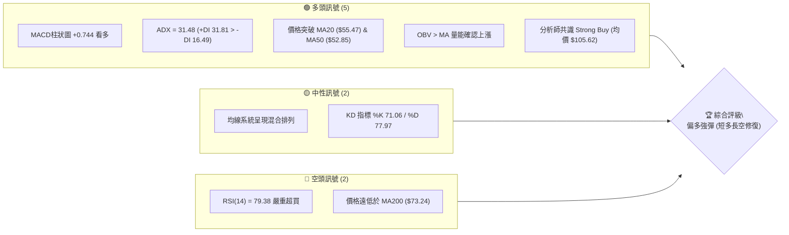
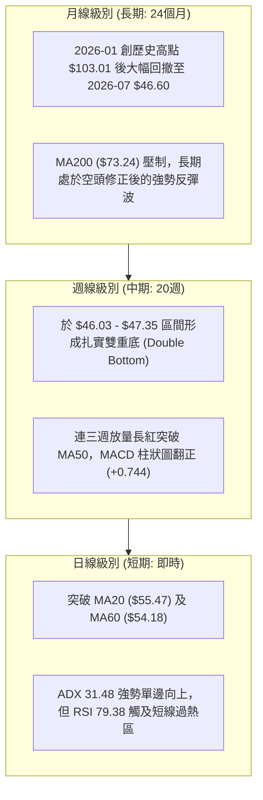
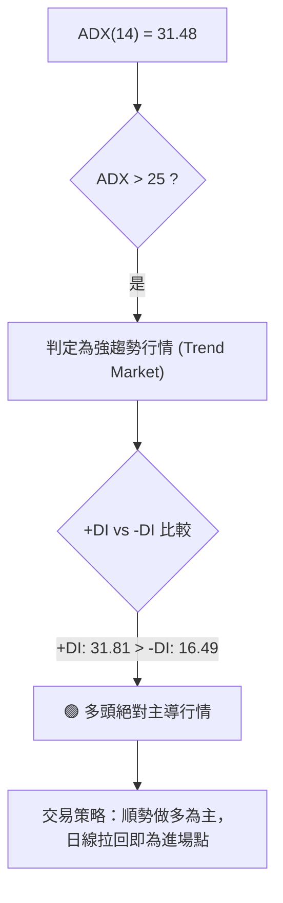
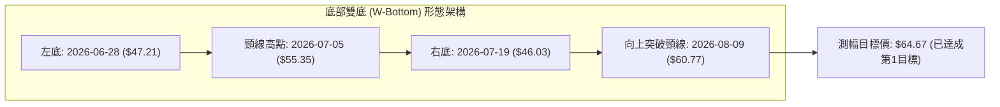
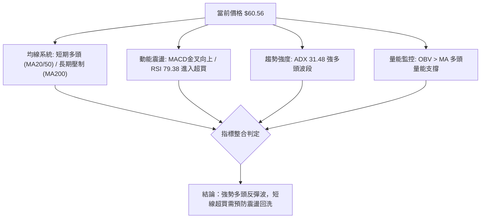
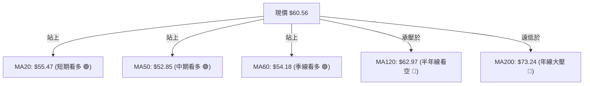
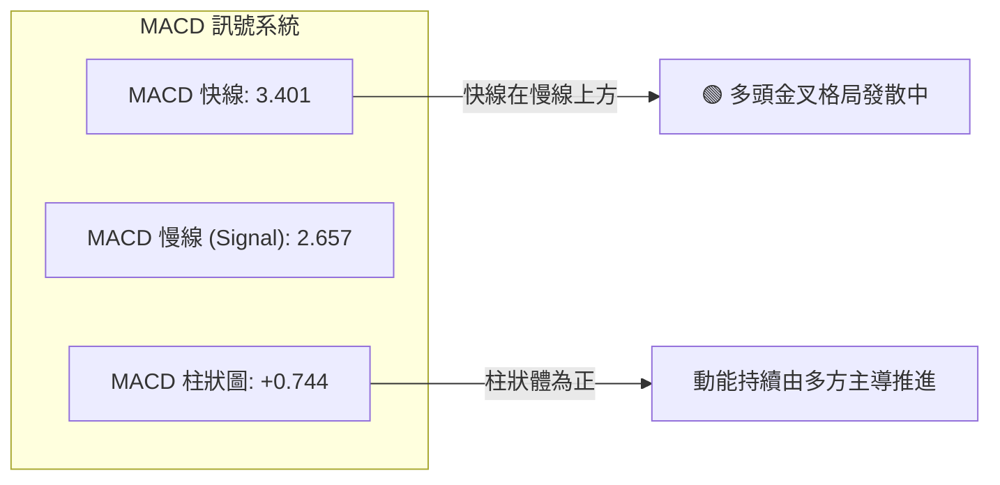
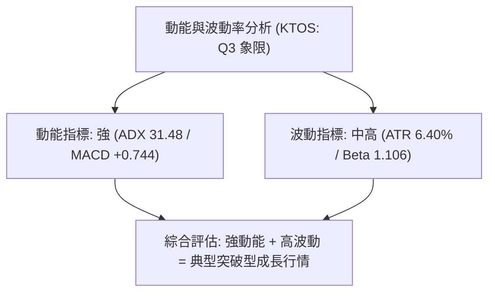
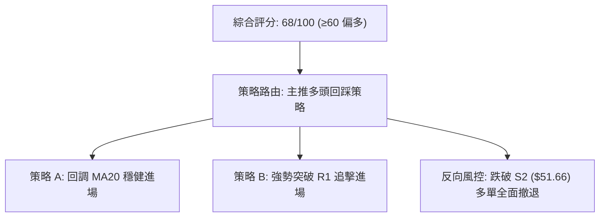
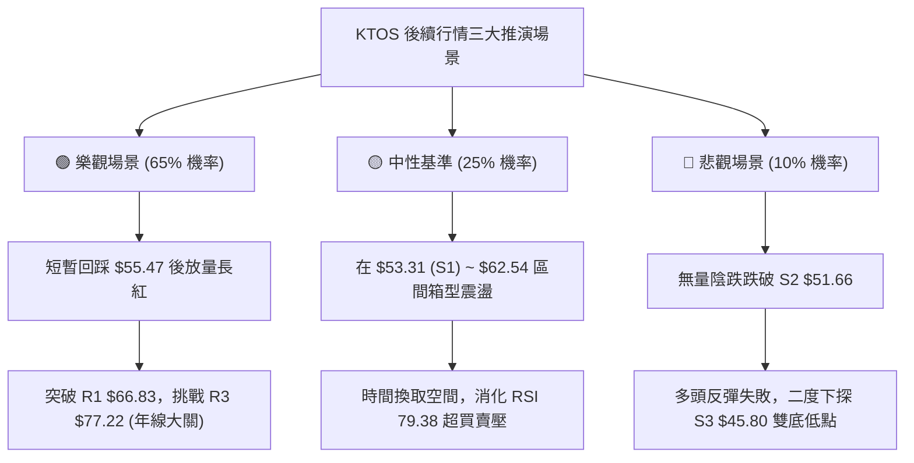

# KTOS 技術分析報告

> **報告日期**：2026-08-19 ｜ **語言**：繁體中文 ｜ **數據來源**：Yahoo Finance ｜ **當前價格**：$60.56

---

## 目錄

| 章節 | 內容 |
|------|------|
| [1. 技術面概覽](#1-技術面概覽) | 訊號儀表板、核心指標、評分卡 |
| [2. 趨勢分析](#2-趨勢分析) | 多時框趨勢、長中短期走勢 |
| [3. 圖表形態分析](#3-圖表形態分析) | 形態識別、K線組合、目標價 |
| [4. 支撐與阻力](#4-支撐與阻力) | 關鍵價位、斐波那契回調 |
| [5. 技術指標深度解讀](#5-技術指標深度解讀) | MA/RSI/MACD/布林/成交量 |
| [6. 動能與波動率](#6-動能與波動率) | 動能評估、ATR、Beta |
| [7. 多時框架總結](#7-多時框架總結) | 時框架評分矩陣 |
| [8. 交易策略建議](#8-交易策略建議) | 多空策略、風險報酬比 |
| [9. 風險提示與監控](#9-風險提示與監控) | 監控指標、風險場景 |

---

## 1. 技術面概覽

### 🎯 技術訊號儀表板



### 📊 核心指標速覽表

| 指標類別 | 指標名稱 | 當前數值 | 訊號 | 解讀 |
|----------|----------|----------|------|------|
| **價格** | 當前價格 | $60.56 | 🟢 | 自低點強勁反彈，位於52W區間 19.2% |
| **均線** | MA20 | $55.47 | 🟢 | 價格在MA20上方 (+9.18%)，短期趨勢轉強 |
| **均線** | MA50 | $52.85 | 🟢 | 價格在MA50上方，築底完成向上發散 |
| **均線** | MA200 | $73.24 | 🔴 | 價格在MA200下方 (-17.31%)，長期趨勢仍處空頭修復 |
| **動能** | RSI(14) | 79.38 | 🔴 | 進入極端超買區間 (>70)，短線面臨技術性回調 |
| **動能** | MACD | 3.401 | 🟢 | MACD位於Signal (2.657) 上方，柱狀圖 +0.744 持續擴張 |
| **動能** | ADX(14) | 31.48 | 🟢 | 強趨勢格局 (>25)，+DI 31.81 主導多頭反彈 |
| **波動** | ATR(14) | $3.87 | 🟡 | 佔股價 6.40%，屬於中高波動區間 |
| **通道** | 布林 %B | 0.67 | 🟢 | 位於中軌與上軌間，處於健康多頭攻擊通道 |

### 🏆 技術評分卡

```
╔══════════════════════════════════════════════════════════════╗
║                技術評分卡 — KTOS (2026-08-19)               ║
╠══════════════════════════════════════════════════════════════╣
║ 趨勢強度 (ADX/DI)   ████████████████░░░░  80/100  🟢 強多頭  ║
║ 動能指標 (MACD/RSI) ████████████░░░░░░░░  60/100  🟡 超買預警║
║ 支撐穩定度 (S1-S3)  ██████████████░░░░░░  70/100  🟢 底部扎實║
║ 成交量配合 (OBV/VOL)██████████████░░░░░░  70/100  🟢 量價配合║
║ 形態完整度 (波段築底)████████████████░░░░  80/100  🟢 W底成型 ║
║ 均線排列 (長短週期) ██████████░░░░░░░░░░  50/100  🟡 混合排列║
╠══════════════════════════════════════════════════════════════╣
║ 綜合評分            █████████████░░░░░░░  68/100  🟢 偏多強彈║
╚══════════════════════════════════════════════════════════════╝
```

---

## 2. 趨勢分析

### 🌐 多時框趨勢分析



### 📈 長期趨勢 — 12個月走勢圖（Unicode）

```
KTOS 月線走勢圖（過去12個月：2025-09 至 2026-08）
價格軸 ($)
$105 ┤                               ● $103.01 (2026-01 高點)
$95  ┤       ● $91.37  ● $90.60
$85  ┤                                     ● $86.18
$75  ┤                    ● $76.10  ● $75.91
$65  ┤  ● $65.84                                 ● $70.51  ● $63.05  ● $64.13
$55  ┤                                                                              ● $60.56 (現價)
$45  ┤                                                                    ● $49.86  ● $46.60 (低點)
     └──────────────────────────────────────────────────────────────────────────────────────────
        08/25   09/25   10/25   11/25   12/25   01/26   02/26   03/26   04/26   05/26   06/26   07/26   08/26
```

#### 走勢特徵分析表格

| 階段 | 時間區間 | 價格區間 | 漲跌幅 | 走勢特徵與量能解讀 |
|------|----------|----------|--------|-------------------|
| **主升段** | 2025-08 ~ 2026-01 | $65.84 → $103.01 | +56.46% | 單邊噴出走勢，創下週期波段高點 |
| **主跌段** | 2026-01 ~ 2026-04 | $103.01 → $63.05 | -38.79% | 獲利了結賣壓湧現，連續跌破關鍵短均線 |
| **築底段** | 2026-05 ~ 2026-07 | $64.13 → $46.60 | -27.34% | 於 52週低點 $43.09 上方反覆震盪打底，爆出 4,538萬週天量出清浮額 |
| **強彈段** | 2026-07 ~ 2026-08 | $46.60 → $60.56 | +29.96% | 放量突破下降趨勢線，收復 MA20 與 MA50，呈現 V 型/W 型強烈翻轉 |

### 📊 中期趨勢（週線分析）

```
中期支撐阻力結構示意圖
$77.22 ───────────────────────────────────────── 強阻力 R3 / 61.8% 斐波回調位
           ▲
$66.83 ────┼──────────────────────────────────── 近期波段高點阻力 R1
           │   ┌───┐
$60.56 ────┼───┤現價├── [RSI 79.38 短線過熱震盪區間]
           │   └───┘
$55.47 ────┴──────────────────────────────────── MA20 / 布林中軌強支撐
$46.03 ───────────────────────────────────────── 週線雙底頸線支撐 (S3: $45.80)
```

### ⚡ 趨勢強度評估（ADX 解讀）



| 指標項 | 當前數值 | 門檻標準 | 狀態評估 | 實戰解讀 |
|--------|----------|----------|----------|----------|
| **ADX(14)** | **31.48** | > 25 (強趨勢) | 🟢 強勢趨勢 | 市場脫離無方向盤整，進入強烈單邊動能行情 |
| **+DI** | **31.81** | > -DI | 🟢 買方主導 | 買盤攻擊意願極高，多方佔據絕對優勢 |
| **-DI** | **16.49** | < 20 | 🟢 賣壓竭盡 | 空方力道持續衰退，無力發動有效反擊 |

---

## 3. 圖表形態分析

### 🔍 形態識別系統



#### 形態識別信心度與測幅表

| 形態 | 信心度 | 判斷依據（引用數據） | 完成度 | 目標價（附計算式） |
|------|--------|----------------------|--------|--------------------|
| **雙底形態 (W-Bottom)** | **85%** | 1. 左底 $47.21 (週量 4,538萬天量換手)<br>2. 右底 $46.03 (縮量不破前低)<br>3. 突破頸線 $55.35 | 100% (已突破) | 頸線 $55.35 + 形態高度 ($55.35 - $46.03 = $9.32) = **$64.67** (2026-08-16 已觸及 $64.58 高點) |
| **均線黃金交叉 (MA20/50)** | **75%** | MA20 ($55.47) 正向穿越 MA50 ($52.85) | 100% | 向上挑戰 MA200 壓制位 **$73.24** 與 R3 **$77.22** |

### 🕯️ 重要K線形態分析

| 週/月份 | 收盤價 | K線形態 | 解讀 | 訊號 |
|---------|--------|---------|------|------|
| **2026-06-28** | $47.21 | 爆量長下影陰線 | 單週爆出 4,538萬股天量換手，籌碼由弱者流向機構主力 | 🟢 底部換手訊號 |
| **2026-07-19** | $46.03 | 縮量錘頭線 (Hammer) | 探底 $46.03 後快速拉升，確認雙底右側支撐確立 | 🟢 止跌確認訊號 |
| **2026-08-09** | $60.77 | 帶量突破大陽線 | 週漲幅達 +30.4%，一舉摜破所有短期均線與形態頸線 | 🟢 強烈買進訊號 |
| **2026-08-16** | $64.58 | 高檔長上影十字星 | 觸及 52W 斐波那契 78.6% 回調位 ($62.54) 後遇阻，多空激戰 | 🟡 獲利了結警訊 |
| **2026-08-23** | $60.56 | 短線回洗中陰線 | 於高檔進行量縮洗盤，回調測試下檔支撐 | 🟡 短線回調修復 |

### 📉 ASCII 走勢形態示意圖

```
                 KTOS 週線雙底 (W-Bottom) 突破與回測結構
                 
$66.83 ─────────────────────────────────────────────────── [R1 強阻力位]
                                          ▲ $64.58 (08-16 高點)
                                         / \
$60.56 ─────────────────────────────────┼───● (現價 $60.56 回踩中)
                                       /
$55.35 ─────────── [頸線位置] ─────────● (08-09 放量跳空長紅突破)
                  /             \     /
$47.21 ──────────●               \   / 
            (06-28 左底)          \ /
$46.03 ────────────────────────────● (07-19 右底)
```

### 🎯 形態目標價計算

1. **第一波雙底等距測幅（已基本實現）**：
   - 形態底部低點：$46.03
   - 形態頸線高點：$55.35
   - 形態高度：$55.35 - $46.03 = $9.32
   - 最小測幅滿足點：$55.35 + $9.32 = **$64.67**（上週最高已達 $64.58）
2. **次級波段上行延伸測幅（挑戰長期阻力）**：
   - 以突破後之回踩支撐 $55.47 為基準，若成功守穩並發動第二波主升，下一階段量度目標將直接指向數據阻力位 **R2: $69.91** 以及 MA200 附近的 **R3: $77.22**。

---

## 4. 支撐與阻力

### 🗺️ 關鍵價位分布圖（Unicode）

```
KTOS 價位結構分布圖
═══════════════════════════════════════════════════════════════════
$77.22 ║██████████████████████████████║ 強阻力 R3 (MA200 / 61.8% 斐波)
$69.91 ║████████████████████          ║ 波段阻力 R2 (整數關卡前哨)
$66.83 ║████████████████████████      ║ 近期高點阻力 R1 (反彈頸線壓制)
$62.54 ║──────────────────────────────║ 斐波那契 78.6% 回調位
$60.56 ╠══════════════════════════════╣ ◄─── 當前價格 ($60.56)
$55.47 ║▓▓▓▓▓▓▓▓▓▓▓▓▓▓▓▓▓▓▓▓▓▓        ║ 動態支撐 (MA20 / 布林中軌)
$53.31 ║████████████████████████      ║ 關鍵支撐 S1 (波段回調低點聚類)
$51.66 ║██████████████████████████    ║ 強支撐 S2 (MA50 匯合防守區)
$45.80 ║██████████████████████████████║ 核心底部 S3 (雙底生命線)
═══════════════════════════════════════════════════════════════════
```

### 🚧 阻力位分析表

| 阻力級別 | 價位 | 形成原因 | 突破難度 | 重要性 |
|----------|------|----------|----------|--------|
| **R1** | **$66.83** | 近一年波段高點聚類，前波套牢賣壓帶 | 🟡 中等 (需日成交量 > 400萬股確認) | ★★★☆☆ |
| **R2** | **$69.91** | 近一年次級波段高點聚類，逼近布林通道上軌 ($70.13) | 🔴 較高 (空頭頑抗防線) | ★★★★☆ |
| **R3** | **$77.22** | 近一年重大高點聚類，重合 MA200 ($73.24) 與 61.8% 斐波位 | 🔴 極高 (牛熊分水嶺) | ★★★★★ |

### 🛡️ 支撐位分析表

| 支撐級別 | 價位 | 形成原因 | 守住機率 | 重要性 |
|----------|------|----------|----------|--------|
| **S1** | **$53.31** | 近一年波段低點聚類，靠近 MA20 ($55.47) 與 MA60 ($54.18) | 🟢 80% (短線多頭第一防線) | ★★★★☆ |
| **S2** | **$51.66** | 近一年波段低點密集區，MA50 ($52.85) 重點防禦帶 | 🟢 85% (中期多空分水嶺) | ★★★★☆ |
| **S3** | **$45.80** | 近一年波段底部低點聚類，2026年7月雙底起漲平台 | 🟢 95% (絕對多頭防線) | ★★★★★ |

### 📐 斐波那契回調位分析

依據 52 週完整波動區間（高點 $134.00 → 低點 $43.09，垂直振幅 $90.91）計算：

| 斐波那契回調層級 | 價位 | 當前相對位置與意義解讀 |
|-----------------|------|----------------------|
| **0.0% (52W High)** | **$134.00** | 週期最高峰值，長期牛市終極目標 |
| **23.6%** | **$112.55** | 極強多頭修復區 |
| **38.2%** | **$99.27** | 機構長期價值中樞位 |
| **50.0%** | **$88.55** | 52週多空平衡中點 |
| **61.8%** | **$77.82** | 黃金分割關鍵阻力位（極度重合 R3: $77.22） |
| **78.6%** | **$62.54** | **現價 ($60.56) 正於此位下方震盪蓄勢，突破即確立向 61.8% 推進** |
| **100.0% (52W Low)** | **$43.09** | 52週最低起漲點，確立為堅不可摧之年度底部 |

---

## 5. 技術指標深度解讀

### 🎛️ 指標訊號總覽



### 📈 移動平均線排列分析



- **均線排列狀態**：當前呈現典型的「短中期均線黃金交叉、但長期均線依然在上方壓制」的**混合排列**。
- **交叉訊號**：MA20 ($55.47) 快速拉升上穿 MA50 ($52.85) 與 MA60 ($54.18)，短多格局確立；目前價格受制於 MA120 ($62.97)，下方 MA20 與 MA50 則形成極佳的回踩支撐防護網。

### 📉 RSI(14) 分析

```
RSI(14) 當前數值: 79.38
0 ──────────── 30 ──────────────────── 70 ────── 79.38 ──── 100
[    超賣區    ] [      中性震盪區      ] [ 超買區 ▓▓▓▓▓▓▓▓ ]
```

- **超買超賣判定**：RSI(14) 來到 **79.38**，處於明確的**超買區間（>70）**。
- **背離分析**：
  - 週線 RSI 從 7 月低點的 35.1 飆升至 79.4，伴隨價格由 $46.03 上漲至 $60.56，**呈現量價齊揚之健康擴張態勢，未出現頂背離（Bearish Divergence）**。
  - 結論：短線因漲幅過大有技術性降溫回調需求，但非動能衰竭型頂部。

### 📊 MACD(12/26/9) 訊號解讀



- **數值解讀**：DIF (3.401) > DEA (2.657)，MACD 柱狀圖為 **+0.744**，自 7 月底翻正以來維持擴張走勢，確認多方動能依舊佔據主導優勢。

### 📦 布林通道分析

```
布林通道結構 (Bandwidth 寬度: $29.33)
$70.13 ┬────────────────────────────────────────── BB 上軌
       │
$60.56 ┼───────────────────────● 現價 (%B = 0.67，位於中軌與上軌強勢區間)
       │
$55.47 ┼────────────────────────────────────────── BB 中軌 (MA20 強支撐)
       │
$40.80 ┴────────────────────────────────────────── BB 下軌
```

- **通道位置**：現價 $60.56 位於布林中軌 ($55.47) 與上軌 ($70.13) 之間，%B 值為 **0.67**，表明股價維持在強勢進攻通道內，未爆發極端刺破上軌的失控現象，空間彈性充裕。

### 💹 成交量分析（量價配合度）

- **量能結構**：
  - 最新日成交量為 **2,838,933 股**，相較 20日均量 (3,975,347) 量比約為 **0.71x**，呈現「高檔量縮整理」特徵。
  - 週線量能自 6 月底歷史天量 (4,538萬股) 與 8 月初放量長紅 (2,896萬股) 後，本週萎縮至 906萬股，屬於急漲後的籌碼沉澱。
- **OBV 趨勢**：數據顯示 **OBV > MA**，能量潮指標持續向上發散，顯示主力資金在底部吸籌後並未大舉撤離，量能有效支撐價格上行。

---

## 6. 動能與波動率

### ⚡ 動能評估四象限



| 象限 | 動能強度 | 波動率水準 | KTOS 判定 | 實戰應對策略 |
|------|----------|------------|-----------|--------------|
| **Q1: 最佳穩健** | 強動能 | 低波動 | — | 順勢加碼，持有抱牢 |
| **Q2: 盤整沉悶** | 弱動能 | 低波動 | — | 觀望或網格交易 |
| **Q3: 高動能博弈** | **強動能** | **中高波動** | **✓ (當前狀態)** | **嚴格執行移動止損，把握拉回切入機會** |
| **Q4: 破位下殺** | 弱動能 | 高波動 | — | 逢高減磅，全面避險 |

### 📊 ATR 波動率分析

- **ATR(14) 數值**：**$3.87**，佔當前股價之 **6.40%**。
- **交易意義**：每日正常理論波動區間達近 $4 美元，這意味著：
  - 短線波段操作止損設定不得窄於 1.0 倍 ATR ($3.87)，建議防守距離設定於 **1.5 ~ 2.0 倍 ATR（約 $5.80 ~ $7.74）**，以防被日常雜訊洗出場。

### 📐 Beta 與市場相關性

- **Beta 係數**：**1.106**。
- **解讀**：KTOS 對標普 500 指數具備輕度放大效應（波動幅度約為大盤的 1.11 倍），兼具防禦軍工概念與進攻型高彈性資產特質。

---

## 7. 多時框架總結

### 📋 時框架評分表

| 時框架 | 趨勢方向 | 動能 (RSI/MACD) | 均線排列 | 形態結構 | 綜合評分 | 操作建議 |
|--------|----------|-----------------|----------|----------|----------|----------|
| **短期 (日線)** | 🟢 強勢反彈 | 🟡 RSI 79.38 超買 | 🟢 站上短期均線 | 突破後回踩 | 72/100 | 等待回調 MA20 佈局 |
| **中期 (週線)** | 🟢 底部反轉 | 🟢 MACD 翻正柱擴張 | 🟢 站上 MA50 | W底突破完成 | 78/100 | 波段偏多持有 |
| **長期 (月線)** | 🟡 熊市修復 | 🟡 自低檔強彈 | 🔴 承壓 MA200 | 52W 低點強彈 | 55/100 | 目標鎖定年線解套波 |

### 🔲 綜合訊號矩陣

```
訊號維度矩陣分析：
┌──────────────┬──────────────┬──────────────┬──────────────┐
│  趨勢 (Trend) │  動能 (Mom)  │  量能 (Vol)  │ 形態 (Patt)  │
├──────────────┼──────────────┼──────────────┼──────────────┤
│ 🟢 ADX: 31.48│ 🟡 RSI: 79.38│ 🟢 OBV>MA    │ 🟢 W底突破   │
│ 🟢 +DI 主導  │ 🟢 MACD金叉  │ 🟡 短線量縮  │ 🟢 突破頸線  │
└──────────────┴──────────────┴──────────────┴──────────────┘
```

### ⚖️ 多時框收斂結論

> **收斂原則判定**：
> 當前 ADX(14) 為 **31.48 (> 25)**，明確屬於**強趨勢行情**。依多時框收斂規則，市場以**中期趨勢方向為主導**，日線短期的超買（RSI 79.38）不代表反轉成空，而僅為「尋找多頭回調進場點」的技術修整。
>
> **唯一方向性結論**：**【偏多強彈 — 順勢逢低做多】**（本結論與第 8 章主推多頭策略完全一致）。

---

## 8. 交易策略建議

### 🗺️ 策略決策流程圖



### 🧭 策略路由

**當前主策略方向 = 主推多頭回踩與突破策略（依第 1 章技術綜合評分 68/100）**

### 🎯 價格情境階梯（Price Scenarios）

| 觸發條件 | 下一目標 | 後續延伸 | 情境含義 |
|----------|----------|----------|----------|
| **強勢突破 R1 $66.83** | **R2 $69.91** | **R3 $77.22** | 突破近一年波段高點，開啟向年線與 61.8% 斐波回調推進之大行情 |
| **站穩現價 $60.56 ~ MA20 $55.47** | **$62.54 (斐波 78.6%)** | **R1 $66.83** | 短線消化 RSI 超買賣壓，進行健康箱型震盪後再度蓄勢上攻 |
| **跌破關鍵支撐 S1 $53.31** | **S2 $51.66** | **S3 $45.80** | 跌破短均防線，多頭反彈波告終，重回底部箱型尋求支撐 |

### 📊 情境機率分佈

| 情境 | 機率 | 主要依據 |
|------|------|----------|
| **情境一：高檔震盪後繼續上行** | **65%** | ADX 31.48 強勢單邊多頭、MACD 柱狀擴張、OBV 穩健上揚、分析師共識強烈買進 |
| **情境二：回踩 MA20 區間震盪** | **25%** | RSI 79.38 面臨嚴重超買降溫需求、短線日成交量略顯萎縮 |
| **情境三：全面反轉再度探底** | **10%** | 52週低點 $43.09 築底扎實，除非系統性崩跌，否則跌破 S2 概率極低 |

### 🟢 主策略詳情（多頭策略）

```
╔══════════════════════════════════════════════════════════════╗
║               KTOS 多頭操作策略表 (精確數值執行)             ║
╠══════════════════════════════════════════════════════════════╣
║ 策略要素       │ 策略 A (回踩支撐低吸)   │ 策略 B (突破阻力追擊)   ║
╠════════════════╪═════════════════════════╪═════════════════════════╣
║ 進場條件       │ 回踩 MA20 獲得止跌確認  │ 帶量放量突破 R1 阻力位  ║
║ 進場價格       │ $55.47 (MA20 支撐位)    │ $66.83 (R1 突破點)      ║
║ 目標價 T1      │ $66.83 (R1 阻力位)      │ $69.91 (R2 阻力位)      ║
║ 目標價 T2      │ $77.22 (R3 / 年線區間)  │ $77.22 (R3 重大阻力)    ║
║ 止損價格       │ $51.66 (S2 關鍵支撐位)  │ $60.56 (現價平台支撐)   ║
║ 止損空間       │ -$3.81 (-6.87%)         │ -$6.27 (-9.38%)         ║
║ 潛在獲利 (T2)  │ +$21.75 (+39.21%)       │ +$10.39 (+15.55%)       ║
║ 風險報酬比     │ 1 : 5.71 (極佳)         │ 1 : 1.66 (優良)         ║
║ 成功機率       │ 70%                     │ 60%                     ║
║ 建議倉位       │ 15% - 20%               │ 10%                     ║
╚══════════════════════════════════════════════════════════════╝
```

### 🔴 反向風險觸發點（對沖提示）

若市場突發不可抗力之利空，觸發以下條件則多頭架構破壞，應立即執行防禦或避險對沖：
- **觸發條件 1**：日線收盤價跌破 **S1: $53.31**，多單減倉 50%。
- **觸發條件 2**：日線有效跌破 **S2: $51.66**（MA50 匯合帶），判定為假突破真破位，多單全數止損離場，空手觀望。

### ⭐ 整體訊號強度評星

```
做多訊號強度：★★★★☆  (4/5星 — 趨勢確立，僅需提防短線回調)
做空訊號強度：★☆☆☆☆  (1/5星 — 逆強趨勢操作，風險極高)
整體可信度：  ★★★★☆  (4/5星 — 多時框指標共振配合良好)
```

---

## 9. 風險提示與監控

### ✅ 關鍵監控指標 Checklist

```
╔══════════════════════════════════════════════════════════════╗
║                   日常交易監控清單 (Checklist)               ║
╠══════════════════════════════════════════════════════════════╣
║ [ ] 監控 RSI(14) 是否在 70-80 區間鈍化或出現急跌頂背離       ║
║ [ ] 監控日成交量是否回升至 20日均量 (397萬股) 之上           ║
║ [ ] 監控 MA20 ($55.47) 是否持續向上穿越 MA60 形成多頭排列    ║
║ [ ] 密切追蹤 $62.54 (78.6% 斐波那契) 能否有效收復並站穩       ║
║ [ ] 嚴格守定 $51.66 (S2) 作為波段持股的最大防守底線          ║
╚══════════════════════════════════════════════════════════════╝
```

### ⚠️ 風險場景分析



### 🛡️ 風險管理重要提醒

1. **波動率管理**：KTOS 的 ATR 達 **$3.87 (6.40%)**，單日振幅較大。切忌在 RSI 超過 79 時盲目追高，應優先採取「掛單於支撐位（如 MA20: $55.47 或 S1: $53.31）」的被動進場法。
2. **基本面估值匹配**：儘管分析師一致給予 Strong Buy（平均目標價 **$105.62**），但當前 Trailing P/E 偏高 (356x)，技術面修復主要反映未來國防訂單成長預期，交易應純粹以「技術面關鍵支撐阻力紀律」為依歸。
3. **部位規模控制**：單一策略風險暴露額度建議控制在總資金的 **1.5% ~ 2.0%** 內，依據止損距離反推持股股數，嚴禁過度槓桿化。

---

## 📋 報告總結

```
╔══════════════════════════════════════════════════════════════╗
║                   KTOS 技術分析報告總結                      ║
╠══════════════════════════════════════════════════════════════╣
║ 報告日期：2026-08-19                                         ║
║ 當前價格：$60.56                                             ║
║ 分析評級：🟢 偏多強彈 (短多長空修復波段)                     ║
║                                                              ║
║ 關鍵結論：                                                   ║
║ ├─ 長期趨勢：🟡 月線自低點強彈，下方 MA200 ($73.24) 待挑戰   ║
║ ├─ 中期趨勢：🟢 週線 W底形態突破完成，MACD 柱狀持續擴張      ║
║ ├─ 短期趨勢：🟢 日線站穩 MA20/50，但 RSI 79.38 面臨超買回洗  ║
║ ├─ 關鍵支撐：S1: $53.31  /  S2: $51.66  /  MA20: $55.47      ║
║ ├─ 關鍵阻力：R1: $66.83  /  R2: $69.91  /  R3: $77.22      ║
║ └─ 分析師目標：均價 $105.62 (最高 $150.00 / 最低 $60.00)     ║
║                                                              ║
║ 最優策略組合：                                               ║
║ 1. 🥇 最佳機會 (策略 A)：回踩 MA20 ($55.47) 佈局，目標 $77.22║
║ 2. 🥈 次選機會 (策略 B)：突破 R1 ($66.83) 追擊，目標 $69.91  ║
║ 3. 🥉 保守選擇：等待股價站穩 78.6% 斐波位 ($62.54) 後再行介入║
╚══════════════════════════════════════════════════════════════╝
```

---

> ⚠️ **免責聲明**：本報告為 AI 自動生成之技術分析，所有數據及估算均基於提供的歷史價格資訊。本報告**僅供研究與學術參考**，**不構成任何投資建議**。投資有風險，入市需謹慎。

---

*報告生成時間：2026-08-19 ｜ 數據來源：Yahoo Finance ｜ 分析框架：多時框技術分析*