# KTOS 技術分析報告

> **報告日期**：2026-08-21 ｜ **語言**：繁體中文 ｜ **數據來源**：Yahoo Finance ｜ **當前價格**：$56.18

---

## 目錄

| 章節 | 內容 |
|------|------|
| [1. 技術面概覽](#1-技術面概覽) | 訊號儀表板、核心指標、評分卡 |
| [2. 趨勢分析](#2-趨勢分析) | 多時框趨勢、長中短期走勢 |
| [3. 圖表形態分析](#3-圖表形態分析) | 形態識別、K線組合、目標價 |
| [4. 支撐與阻力](#4-支撐與阻力) | 關鍵價位、斐波那契回調 |
| [5. 技術指標深度解讀](#5-技術指標深度解讀) | MA/RSI/MACD/布林/成交量 |
| [6. 動能與波動率](#6-動能與波動率) | 動能評估、ATR、Beta |
| [7. 多時框架總結](#7-多時框架總結) | 時框架評分矩陣 |
| [8. 交易策略建議](#8-交易策略建議) | 多空策略、風險報酬比 |
| [9. 風險提示與監控](#9-風險提示與監控) | 監控指標、風險場景 |

---

## 1. 技術面概覽

### 🎯 技術訊號儀表板

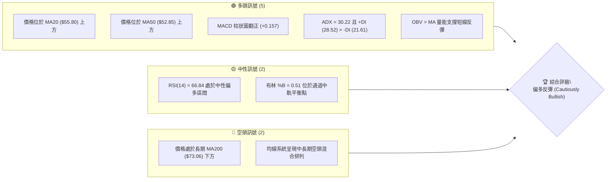

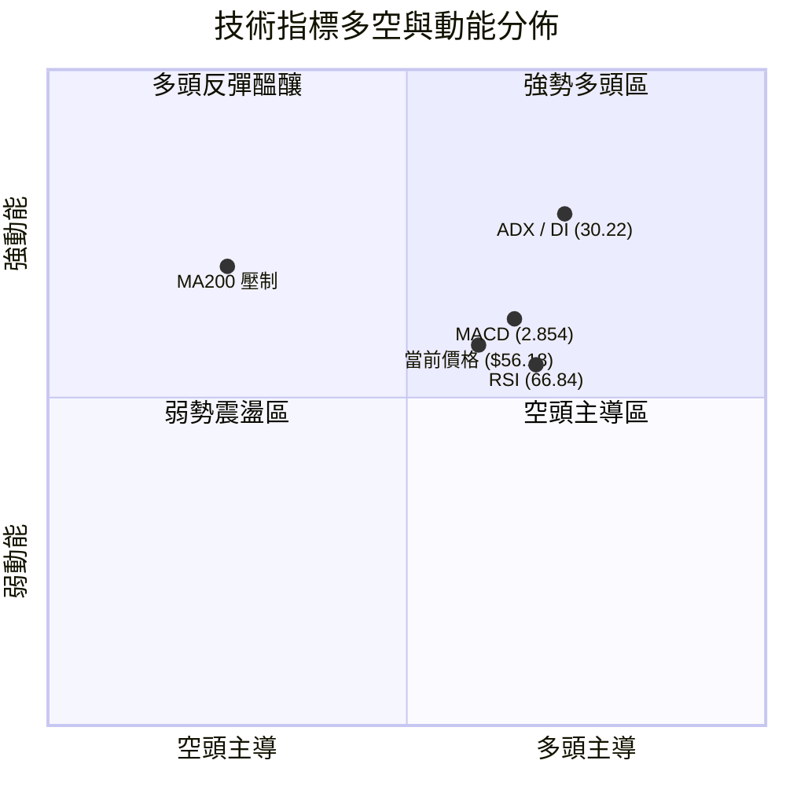

### 📊 核心指標速覽表

| 指標類別 | 指標名稱 | 當前數值 | 訊號 | 解讀 |
|----------|----------|----------|------|------|
| **價格** | 當前價格 | $56.18 | 🟢 | 站上 MA20 與 MA50，脫離波段低點區間 |
| **均線** | MA20 | $55.80 | 🟢 | 價格在 MA20 上方 (+0.68%)，短線多頭掌控 |
| **均線** | MA50 | $52.85 | 🟢 | 價格在 MA50 上方 (+6.30%)，中期底部確立 |
| **均線** | MA200 | $73.06 | 🔴 | 價格在 MA200 下方 (-23.10%)，長期趨勢受壓制 |
| **動能** | RSI(14) | 66.84 | 🟡 | 位於強勢中性區，未進入超買（>70），無背離 |
| **動能** | MACD | 2.854 (Hist +0.157) | 🟢 | MACD > Signal (2.697)，柱狀圖持續翻正擴張 |
| **趨勢** | ADX(14) | 30.22 (+DI: 28.52) | 🟢 | ADX > 25 呈現強趨勢，+DI 顯著大於 -DI |
| **通道** | 布林通道 | 中軌 $55.80 / %B: 0.51 | 🟢 | 剛由下軌反彈至中軌上方，通道開口穩定 |
| **量能** | 20日成交量比 | 1.15x (4.55M vs 3.96M) | 🟢 | 量能溫和放大，OBV > MA，具備量價配合 |
| **波動** | ATR(14) | $4.08 (7.26%) | 🟡 | 日內波動幅度適中，提供充足交易空間 |

### 🏆 技術評分卡

```
╔══════════════════════════════════════════════════════════════╗
║                技術評分卡 — KTOS (2026-08-21)               ║
╠══════════════════════════════════════════════════════════════╣
║ 趨勢強度 (ADX/DI)   ██████████████░░░░░░  72/100  🟢 偏多   ║
║ 動能指標 (MACD/RSI) ██████████████░░░░░░  70/100  🟢 偏多   ║
║ 支撐穩定度 (S1/S2)  ████████████████░░░░  80/100  🟢 強固   ║
║ 成交量配合 (OBV/VOL)██████████████░░░░░░  68/100  🟢 良好   ║
║ 形態完整度 (波段底) ████████████░░░░░░░░  62/100  🟡 中性   ║
║ 均線排列 (多空結構) ████████░░░░░░░░░░░░  42/100  🔴 混合壓制 ║
╠══════════════════════════════════════════════════════════════╣
║ 綜合評分            █████████████░░░░░░░  66/100  🟢 偏多反彈║
╚══════════════════════════════════════════════════════════════╝
```

---

## 2. 趨勢分析

### 🌐 多時框趨勢分析

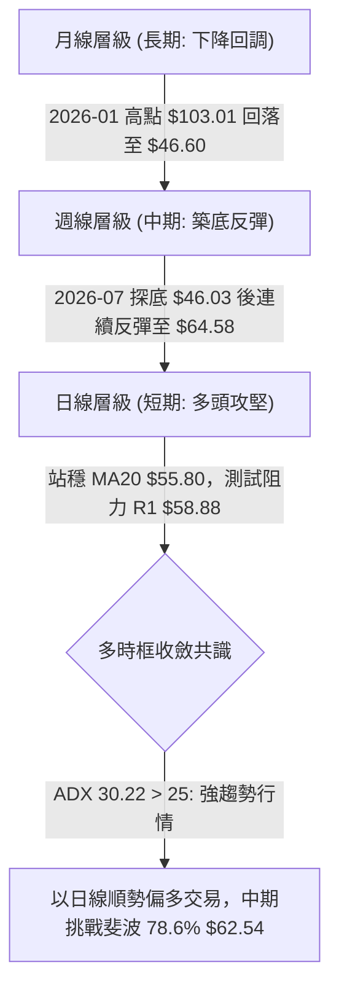

### 📈 長期趨勢 — 12個月走勢圖（Unicode）

```
KTOS 月線走勢圖（2025-08 至 2026-08）
價格軸 ($)
$105 ┤                               ●(2026-01: $103.01 歷史波段高點)
$95  ┤             ●(2025-09: $91.37)
$85  ┤                                   ●(2026-02: $86.18)
$75  ┤                         ●(2025-12)
$65  ┤       ●(2025-08: $65.84)              ●(2026-05: $64.13)
$55  ┤                                               ●(2026-08: $56.18 當前)
$45  ┤                                           ●(2026-07: $46.60 底部)
     └────────────────────────────────────────────────────────────
        08   09   10   11   12   01   02   03   04   05   06   07   08 (月份)
```

#### 走勢特徵分析表格

| 階段區間 | 起止價格 | 漲跌幅 | 走勢特徵與量價結構 |
|----------|----------|--------|--------------------|
| **2025-08 ~ 2026-01** | $65.84 → $103.01 | +56.46% | 主升浪推進，月線連續放量上攻創波段新高 |
| **2026-01 ~ 2026-04** | $103.01 → $63.05 | -38.79% | 頂部快速獲利回吐，連續跌破短期均線 |
| **2026-04 ~ 2026-07** | $63.05 → $46.60 | -26.09% | 恐慌拋售並完成築底，2026-06-28 爆出 45.38M 巨量洗盤 |
| **2026-07 ~ 2026-08** | $46.60 → $56.18 | +20.56% | 觸底強勁回升，週線 MACD 翻正，量能溫和跟進 |

### 📊 中期趨勢（週線分析）

```
中期週線關鍵結構示意圖
$77.82 ────────────────────────── 斐波那契 61.8% / 阻力 R3 ($77.22)
  ▲
$66.83 ────────────────────────── 波段阻力 R2 (2026-08-16 高點 $64.58 附近)
  ▲
$58.88 ────────────────────────── 近期阻力 R1 / 現行攻防區
  ▲
$56.18 ══════════════════════════ ◄ 現價 ($56.18)
  ▼
$53.31 ────────────────────────── 短期支撐 S1 (MA50 匯聚區)
  ▼
$45.80 ────────────────────────── 結構性強支撐 S3 (2026-07 探底平台)
```

### ⚡ 趨勢強度評估（ADX 解讀）

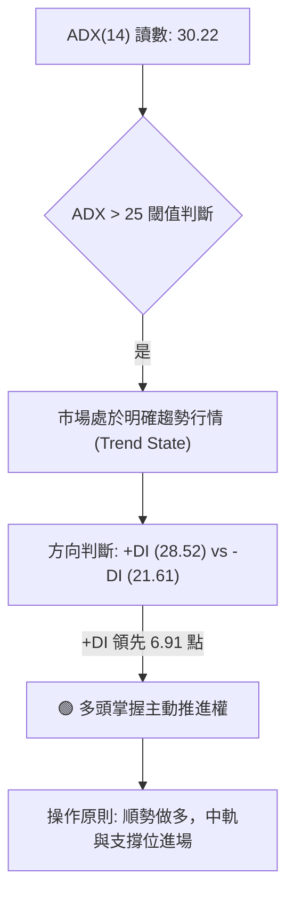

| 指標變數 | 當前數值 | 參考標準 | 狀態評估 |
|----------|----------|----------|----------|
| **ADX(14)** | 30.22 | > 25 (強趨勢) / < 20 (無趨勢) | 🟢 強趨勢運作中 |
| **+DI** | 28.52 | 高於 -DI 且維持上升 | 🟢 多方動能佔優 |
| **-DI** | 21.61 | 持續回落跌破 25 | 🟢 空方動能衰退 |
| **趨勢定性** | 多頭趨勢 | ADX > 25 且 +DI > -DI | 🟢 確立為短期至中期上升趨勢 |

---

## 3. 圖表形態分析

### 🔍 形態識別系統

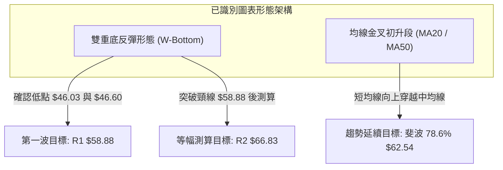

#### 形態信心度與目標價評估表

| 形態名稱 | 信心度 | 判斷依據（引用數據） | 完成度 | 目標價（附精確計算式） |
|----------|--------|----------------------|--------|------------------------|
| **雙重底 (W底)** | 75% | 2026-07-19 低點 $46.03 與 2026-08-02 低點 $46.60 構成雙底（對應 S3 支撐區 $45.80） | 85% | 頸線 R1 $58.88 + (頸線 $58.88 - 底部 $46.03 = $12.85) = **$71.73**（中繼目標看 R2 **$66.83**） |
| **短中期均線黃金交叉** | 80% | MA20 ($55.80) 向上穿越 MA50 ($52.85)，價格穩居兩者之上 | 100% | 基礎推升目標對應斐波那契 78.6% 回調位 **$62.54** |
| **頭肩頂/底** | 25% | 歷史走勢結構不具備典型左肩右肩對稱性 | 0% | 訊號不足，僅做指標型與水平區間解讀 |

### 🕯️ 重要K線形態分析

| 日期 / 週別 | 收盤價 | K線形態 / 量價組合 | 技術解讀 | 訊號 |
|-------------|--------|--------------------|----------|------|
| **2026-06-28** | $47.21 | 爆量長下影恐慌底 (45.38M) | 空頭耗竭量，機構資金進場承接 | 🟢 強烈見底 |
| **2026-07-19** | $46.03 | 二次探底縮量十字星 | 確認 $45.80-$46.00 支撐帶有效性 | 🟢 築底完成 |
| **2026-08-09** | $60.77 | 實體大陽線放量突破 (28.96M) | RSI 跳升至 74.1，強勢脫離底部區間 | 🟢 多頭表態 |
| **2026-08-16** | $64.58 | 上影線試盤線 (週量 19.03M) | 向上測試 R2 $66.83 遭遇獲利了結賣壓 | 🟡 遇阻震盪 |
| **2026-08-23** | $56.18 | 回踩 MA20 支撐陽線結構 | 守穩中軌 $55.80 與 S1 $53.31 之上 | 🟢 蓄勢整理 |

### 📉 ASCII 走勢形態示意圖

```
KTOS 日/週線「雙底回升」與「突破回踩」形態圖
價格 ($)
$66.83 ┤                                         ●(阻力 R2 / 試盤高點 $64.58)
       │                                        / \
$58.88 ┤ 頸線阻力 R1 ───────────────●─────────/───\─────────────
       │                           / \       /     \
$56.18 ┤                          /   \     /       ●(現價 $56.18 - 回踩確認)
       │                         /     \   /
$52.85 ┤                        /       \ / (MA50 支撐)
       │                       /         ● (中間低點)
$46.00 ┤        ●(第1底: $46.03)          ●(第2底: $46.60)
       └────────────────────────────────────────────────────────────
```

### 🎯 形態目標價計算

1. **雙底頸線位**：取波段高點聚類阻力 **R1 = $58.88**。
2. **形態高度**：$58.88 (頸線) - $46.03 (最低點) = **$12.85**。
3. **第一測算目標價 (T1)**：即波段阻力 **R2 = $66.83**（已於 2026-08-16 盤中 $64.58 附近獲得初步測試）。
4. **完全等幅測算目標價 (T2)**：$58.88 + $12.85 = **$71.73**，對接波段高點阻力 **R3 = $77.22** 及斐波那契 61.8% 處 **$77.82**。

---

## 4. 支撐與阻力

### 🗺️ 關鍵價位分布圖（Unicode）

```
KTOS 價位結構分布圖
══════════════════════════════════════════════════════════════
$77.22 ║██████████████████████████████║ 強阻力 R3 (斐波 61.8% $77.82 匯聚)
$66.83 ║████████████████████░░░░░░░░░░║ 阻力 R2 (前波反彈高點聚類)
$62.54 ║██████████████░░░░░░░░░░░░░░░░║ 斐波那契 78.6% 回調關鍵樞紐
$58.88 ║████████████████████████░░░░░░║ 關鍵阻力 R1 (雙底頸線突破口)
$56.18 ╠══════════════════════════════╣ ◄ 現價 ($56.18)
$55.80 ║▓▓▓▓▓▓▓▓▓▓▓▓▓▓▓▓▓▓▓▓▓▓▓▓▓▓▓▓▓▓║ 布林中軌 / MA20 短線支撐
$53.31 ║▓▓▓▓▓▓▓▓▓▓▓▓▓▓▓▓▓▓▓▓░░░░░░░░░░║ 近期支撐 S1 (MA50 $52.85 緩衝區)
$51.66 ║████████████████████████░░░░░░║ 強支撐 S2 (波段回踩密集成交區)
$45.80 ║██████████████████████████████║ 結構性底部支撐 S3 (52W 低點 $43.09 護城河)
══════════════════════════════════════════════════════════════
```

### 🚧 阻力位分析表

| 阻力級別 | 價位 | 距現價幅幅 | 形成原因 | 突破難度 | 重要性 |
|----------|------|------------|----------|----------|--------|
| **R1** | **$58.88** | +4.81% | 近一年波段高點聚類、雙底頸線位置 | 🟡 中等 | ★★★★☆ |
| **R2** | **$66.83** | +18.96% | 近期反彈波段高點、MA120 ($62.72) 上方壓力 | 🔴 較高 | ★★★★☆ |
| **R3** | **$77.22** | +37.45% | MA200 ($73.06) 與斐波 61.8% ($77.82) 密集共振區 | 🔴 極高 | ★★★★★ |

### 🛡️ 支撐位分析表

| 支撐級別 | 價位 | 距現價幅幅 | 形成原因 | 守住機率 | 重要性 |
|----------|------|------------|----------|----------|--------|
| **S1** | **$53.31** | -5.11% | 近期波段回調低點聚類，貼近 MA50 ($52.85) | 80% | ★★★★☆ |
| **S2** | **$51.66** | -8.05% | 突破啟動前的密集換手平台 | 85% | ★★★★☆ |
| **S3** | **$45.80** | -18.49% | 2026年7月雙底底部、靠近 52W 低點 $43.09 | 95% | ★★★★★ |

### 📐 斐波那契回調位分析

依據 52 週完整波動區間（低點 **$43.09** 至高點 **$134.00**，波動垂直落差 $90.91）計算之標準斐波那契回調水平如下：

```
$134.00 ┬ 0.0% (52W High)
        │
$112.55 ┼ 23.6% 回調位
        │
$99.27  ┼ 38.2% 回調位
        │
$88.55  ┼ 50.0% 均衡位
        │
$77.82  ┼ 61.8% 黃金分割強阻力 (貼近阻力 R3 $77.22)
        │
$62.54  ┼ 78.6% 深度回調樞紐位 (上方首要中繼目標)
        │ ◄ 當前價格 $56.18 運行於 78.6% 與 100.0% 之間
$43.09  ┴ 100.0% (52W Low 結構底)
```

- **位置解讀**：現價 **$56.18** 處於 78.6% 回調位 ($62.54) 與 100.0% 底部 ($43.09) 之間的築底修復區間（目前位於 52W 區間的 14.4% 相對低檔）。
- **關鍵突破口**：一旦多頭突破並站穩 **$62.54**（78.6%），將正式確認脫離底部極限超賣區，開啟邁向 61.8% ($77.82) 的中級反彈行情。

---

## 5. 技術指標深度解讀

### 🎛️ 指標訊號總覽

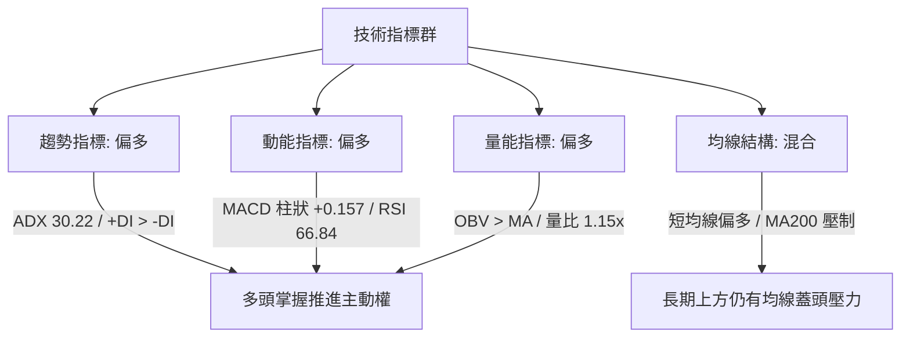

### 📈 移動平均線排列分析

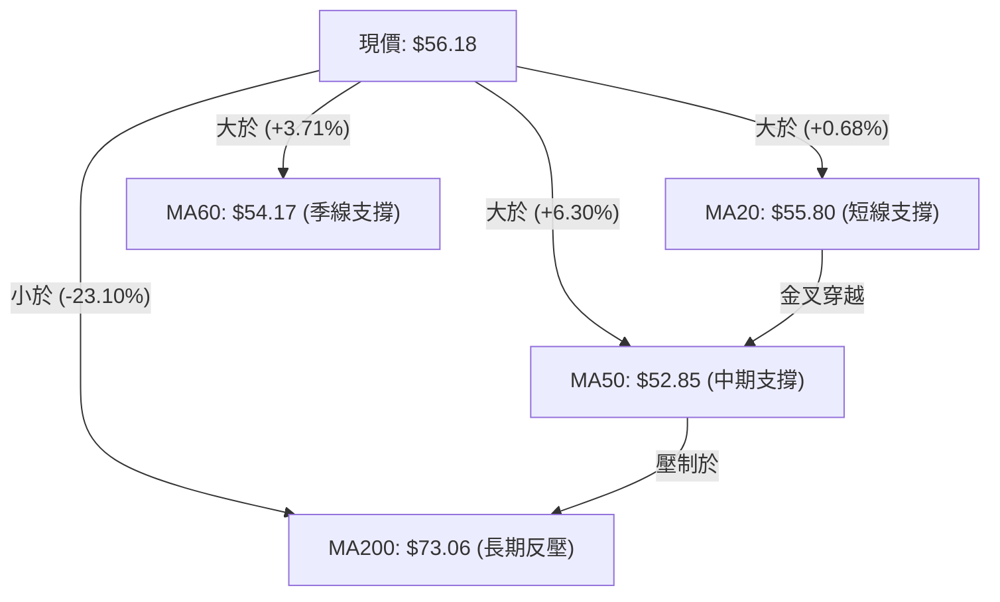

| 均線名稱 | 數值 | 與現價差距 | 排列與趨勢解讀 |
|----------|------|------------|----------------|
| **MA 5** | $61.32 | -8.38% | 短線拉回，形成短線下壓 |
| **MA 10** | $62.01 | -9.41% | 剛遭遇短線回吐壓力 |
| **MA 20** | $55.80 | +0.68% | 🟢 多頭關鍵防線，提供即時支撐 |
| **MA 50** | $52.85 | +6.30% | 🟢 中期生命線，角度開始走平向上 |
| **MA 60** | $54.17 | +3.71% | 🟢 季線轉化為下方緩衝墊 |
| **MA 120** | $62.72 | -10.42% | 🔴 半年線反壓，與斐波 78.6% ($62.54) 重疊 |
| **MA 200** | $73.06 | -23.10% | 🔴 長期牛熊分界線，構成中期上檔天花板 |

### 📉 RSI(14) 分析

- **當前讀數**：**66.84** 
- **強度進度條**：`█████████████░░░░░░░` 66.84%

```
[0 ────────── 30 (超賣) ────────── 50 (中軸) ──────●─── 70 (超買) ────────── 100]
                                                  66.84 (強勢偏多)
```

- **背離判斷**：日線與週線數據中，價格自 2026-07 的 $46.03 回升至當前 $56.18，RSI 由 35.1 同步回升至 66.84，指標與價格走勢同步向上，**無頂背離或底背離**現象，反映健康的動能擴張。

### 📊 MACD(12/26/9) 訊號解讀

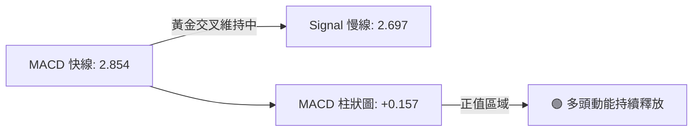

- **MACD 快線**：2.854
- **Signal 慢線**：2.697
- **柱狀圖 (Histogram)**：**+0.157**（由負轉正後持續在零軸上方運行，確認短期多頭買盤占優）。

### 📦 布林通道分析

```
KTOS 布林通道 (20, 2) 結構圖
$70.19 ┬────────────────────────────────────────── BB 上軌 (極端超買區)
       │
$63.00 ┼ 
       │
$56.18 ┼ ═════════════════════════════════════════ 現價 ($56.18, %B = 0.51)
$55.80 ┼ ───────────────────────────────────────── BB 中軌 (MA20 生命線)
       │
$48.00 ┼
       │
$41.42 ┴────────────────────────────────────────── BB 下軌 (極端超賣區)
```

- **帶寬與位置**：通道上軌 **$70.19**、中軌 **$55.80**、下軌 **$41.42**。
- **%B 指標**：**0.51**，代表價格精準運行於中軌上方，擺脫下軌風險，通道開始呈現喇叭口擴張態勢，有利於向上波段展開。

### 💹 成交量分析（量價配合度）

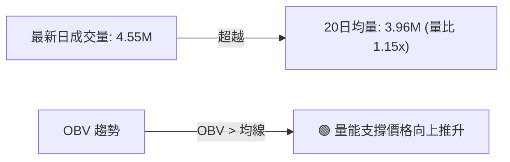

- **量價特徵**：最新成交量 4,554,465 股，較 20 日均量放大 15%（量比 1.15x）；在 2026-06-28 探底時爆出 45.38M 的巨量換手後，上漲放量、回調縮量，OBV 處於均線之上，量價結構處於良性積累狀態。

---

## 6. 動能與波動率

### ⚡ 動能評估四象限

| 象限 | 動能強度 (RSI/MACD) | 波動率 (ATR/Beta) | 當前狀態標註 | 操作意涵評估 |
|------|---------------------|-------------------|--------------|--------------|
| **第一象限 (Q1)** | **強動能 (MACD>0, RSI>60)** | **高波動 (ATR>7%)** | 🎯 **KTOS 當前落點** | **強勢進攻型：適合設定明確止損，波段順勢跟進** |
| **第二象限 (Q2)** | 強動能 | 低波動 | — | 穩定推進型：適合穩健加碼持股 |
| **第三象限 (Q3)** | 弱動能 | 低波動 | — | 沉悶築底型：適合網格或區間震盪交易 |
| **第四象限 (Q4)** | 弱動能 | 高波動 | — | 恐慌殺跌型：應嚴格觀望避免進場 |

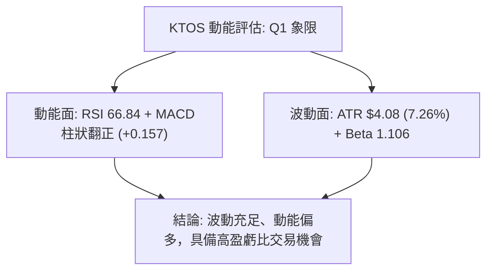

### 📊 ATR 波動率分析

- **ATR(14) 數值**：**$4.08**
- **價格百分比**：**7.26%**（代表單日平均震幅為 $4.08，具備典型的進攻型防衛工業股特性）。
- **風控止損建議**：
  - **短線交易止損距離 (1.0 × ATR)**：$4.08 → 現價下方 $52.10（貼近 S2 $51.66）。
  - **波段交易止損距離 (1.5 × ATR)**：$6.12 → 現價下方 $50.06。

### 📐 Beta 與市場相關性

- **Beta 係數**：**1.106**
- **解讀**：KTOS 與標普500指數呈現溫和的正向放大聯動（波動大於大盤約 10.6%）。在國防航太板塊動能增強時，KTOS 具備獲取超越大盤 Alpha 收益的彈性。

---

## 7. 多時框架總結

### 📋 時框架評分表

| 時框架 | 趨勢方向 | 動能狀態 | 均線排列 | 形態結構 | 綜合評分 | 操作建議 |
|--------|----------|----------|----------|----------|----------|----------|
| **短期 (日線)** | 🟢 多頭推進 | 🟢 強 (MACD+) | 🟢 站穩 MA20/50 | 突破回踩確認 | **75 / 100** | 逢低偏多進場 |
| **中期 (週線)** | 🟢 築底反彈 | 🟢 轉強 (RSI>65) | 🟡 混合整理 | 雙重底成型 | **68 / 100** | 順勢波段持有 |
| **長期 (月線)** | 🔴 回調修正 | 🟡 弱勢修復 | 🔴 處於 MA200 下方 | 脫離超賣區間 | **45 / 100** | 關注上檔阻力 |

### 🔲 綜合訊號矩陣

```
╔══════════════════════════════════════════════════════════════╗
║               KTOS 多時框綜合訊號矩陣                        ║
╠══════════════════╦════════════╦════════════╦═════════════════╣
║ 維度             ║ 短期 (日)  ║ 中期 (週)  ║ 長期 (月)       ║
╠══════════════════╬════════════╬════════════╬═════════════════╣
║ 趨勢方向         ║ 🟢 看多    ║ 🟢 看多    ║ 🔴 看空         ║
║ 動能指標         ║ 🟢 看多    ║ 🟢 看多    ║ 🟡 中性         ║
║ 支撐阻力結構     ║ 🟢 守住 S1 ║ 🟢 突破 S2 ║ 🔴 面臨 R3 壓制 ║
║ 量價關係         ║ 🟢 OBV>MA  ║ 🟢 放量築底║ 🟡 縮量整理     ║
╠══════════════════╩════════════╩════════════╩═════════════════╣
║ 矩陣收斂一致性   ║ 短中期強烈共振看多 (權重 75%)，長期壓制構成目標天花板 ║
╚══════════════════════════════════════════════════════════════╝
```

### ⚖️ 多時框收斂結論

- **行情模式判斷**：ADX(14) 數值為 **30.22**，明確大於 25，符合**趨勢行情**判定標準。
- **主導時框與收斂規則**：依規則 14，在強趨勢行情下，以中短期趨勢方向為主導，日線尋找進場擊球點。目前日線與週線訊號高度一致（均線金叉、MACD 擴張、雙底反彈），長期 MA200 ($73.06) 僅作為中長期反彈目標的極限防守位，不構成阻礙短線順勢做多的理由。
- **唯一方向性結論**：**偏多反彈（Bullish Recovery）**。

---

## 8. 交易策略建議

### 🗺️ 策略決策流程圖

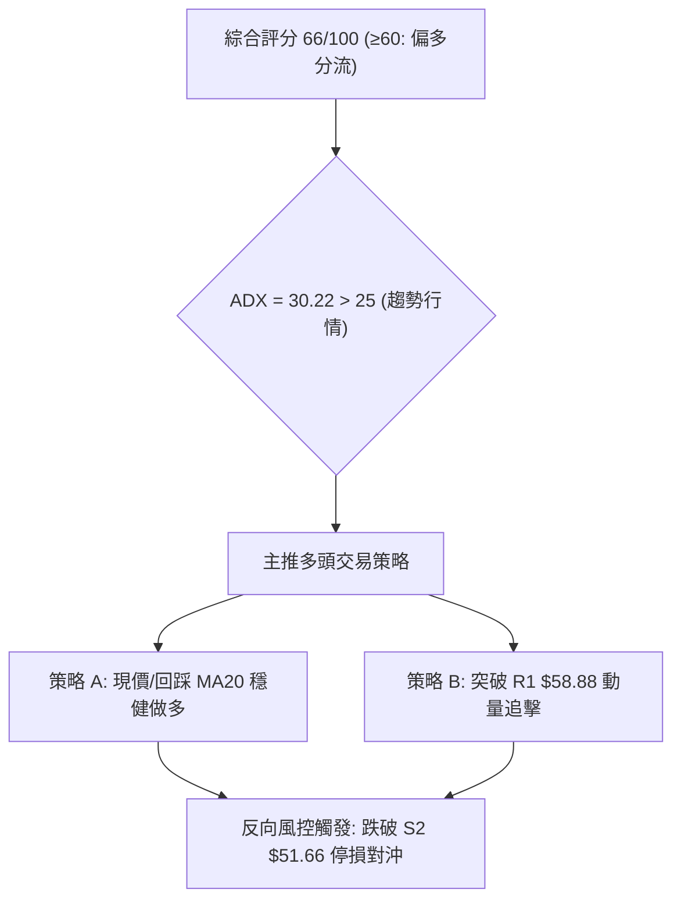

### 🧭 策略路由

> **當前主策略方向 = 主推多頭策略（依綜合評分 66/100，技術面偏多）**

### 🎯 價格情境階梯（Price Scenarios）

| 觸發條件 | 下一目標 | 後續延伸 | 情境含義與操作指引 |
|----------|----------|----------|--------------------|
| **強勢突破 R1 ($58.88)** | **R2 ($66.83)** | **R3 ($77.22)** | 短線全面轉強，雙底等幅測算加速兌現 |
| **守穩現價 ($56.18 ~ $55.80)** | **R1 ($58.88)** | **$62.54 (斐波 78.6%)** | 均線上移蓄勢，健康向上推升 |
| **有效跌破 S1 ($53.31)** | **S2 ($51.66)** | **S3 ($45.80)** | 中期反彈受挫，回測雙底支撐帶 |

### 📊 情境機率分佈

| 情境 | 機率 | 主要技術依據 |
|------|------|--------------|
| **持續震盪上行 (挑戰 R1/R2)** | **65%** | ADX 30.22 強勢多頭、MACD 柱狀正向擴張、OBV 支撐量價配合 |
| **區間震盪整理 ($53.31 ~ $58.88)** | **25%** | 布林通道帶寬收窄，消化短期獲利回吐賣壓 |
| **回落再探底 (跌破 S2 測 S3)** | **10%** | 長期 MA200 壓制及突發性宏觀系統性風險 |

### 🟢 主策略詳情

| 策略要素 | 策略 A（回踩支撐低吸型） | 策略 B（突破阻力追擊型） |
|----------|--------------------------|--------------------------|
| **適用場景** | 短線回踩布林中軌 MA20 與 S1 | 強勢放量突破頸線阻力 R1 |
| **進場條件** | 價格回踩 $55.80 - $56.18 企穩 | 日K收盤價突破並站上 $58.88 |
| **進場價格** | **$56.00** | **$59.00** |
| **第一目標 (T1)** | **$62.54** (斐波 78.6% 回調位) | **$66.83** (阻力位 R2) |
| **第二目標 (T2)** | **$66.83** (阻力位 R2) | **$77.22** (阻力位 R3 / MA200 區) |
| **止損價格** | **$52.80** (跌破 MA50 $52.85) | **$55.50** (跌破突破前平台) |
| **風險報酬比** | **1 : 2.04** (風險 $3.20 / 預期回報 $6.54) | **1 : 2.24** (風險 $3.50 / 預期回報 $7.83) |
| **勝率估計** | 68% | 62% |
| **建議倉位** | 15% - 20% | 10% - 15% |

### 🔴 反向風險觸發點（對沖與風控提示）

- **多頭防守底線**：若日K線以實體長陰線跌破關鍵支撐 **S2 ($51.66)**，則宣告本輪自 $46.03 起算的雙底反彈形態徹底失效。
- **對沖處置**：跌破 $51.66 後，應即刻將多頭部位全數清倉止損，並可考慮買入價外 Put 期權或減碼整體航太軍工板塊暴露，下檔目標將直指 **S3 ($45.80)** 甚至 52W 低點 **$43.09**。

### ⭐ 整體訊號強度評星

```
╔══════════════════════════════════════════╗
║ 做多訊號強度：★★★★☆  (4.0/5星) 偏強    ║
║ 做空訊號強度：★☆☆☆☆  (1.0/5星) 疲弱    ║
║ 整體可信度：  ★★★★☆  (4.2/5星) 良好    ║
╚══════════════════════════════════════════╝
```

---

## 9. 風險提示與監控

### ✅ 關鍵監控指標 Checklist

```
╔══════════════════════════════════════════════════════════════╗
║               KTOS 技術面關鍵監控清單 (Checklist)            ║
╠══════════════════════════════════════════════════════════════╣
║ [ ] 價格能否收盤站穩 R1 $58.88 之上（突破信號）             ║
║ [ ] MA20 ($55.80) 與 MA50 ($52.85) 是否維持多頭開口擴張      ║
║ [ ] MACD Histogram 柱狀圖是否維持在 > 0 擴張軌道             ║
║ [ ] RSI(14) 逼近 70 時是否出現頂背離跡象                     ║
║ [ ] 日成交量是否能穩定維持在 20日均量 (3.96M) 以上          ║
║ [ ] 跌破 S1 $53.31 時是否出現異常放量殺跌                    ║
╚══════════════════════════════════════════════════════════════╝
```

### ⚠️ 風險場景分析

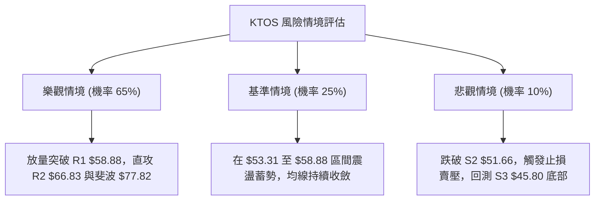

### 🛡️ 風險管理重要提醒

1. **單筆風險限制**：任何單筆交易承擔的本金虧損風險嚴格控制在總投資組合的 **1.0% - 1.5%** 之內。
2. **波動度適配**：鑑於 ATR 高達 **$4.08 (7.26%)**，股價單日波動較大，部位規模應根據 ATR 適度調降，避免因正常日內噪音觸發過窄的止損。
3. **機構籌碼動向**：機構持股佔比高達 **85.4%**，分析師共識目標價均值達 **$105.62**（最高 $150.00，最低 $60.00），技術面反彈與基本面買盤具有中長期共振基礎，但需密切防範大宗機構在 MA200 附近的解套拋壓。

---

## 📋 報告總結

```
KTOS 技術分析報告總結
════════════════════════════════════════════════════════
報告日期：2026-08-21
當前價格：$56.18
分析評級：🟢 偏多反彈 (Cautiously Bullish)

關鍵結論：
├─ 長期趨勢：🔴 處於 MA200 ($73.06) 下方，長期修正尚未完全反轉
├─ 中期趨勢：🟢 雙重底形成，週線 MACD 柱狀翻正，中期築底確立
├─ 短期趨勢：🟢 站穩 MA20 ($55.80) 與 MA50 ($52.85)，多頭掌握主動
├─ 關鍵支撐：S1: $53.31 ｜ S2: $51.66 ｜ S3: $45.80
├─ 關鍵阻力：R1: $58.88 ｜ R2: $66.83 ｜ R3: $77.22
└─ 分析師目標：均價 $105.62 (Low $60.00 / High $150.00)

最優策略組合：
1. 🥇 最佳機會：策略 A — 於 $56.00 附近進場，止損 $52.80，目標 $62.54 / $66.83 (風報比 1:2.04)
2. 🥈 次選機會：策略 B — 放量突破 $58.88 後追擊，止損 $55.50，目標 $66.83 / $77.22 (風報比 1:2.24)
3. 🥉 保守選擇：等待股價回踩確認 S1 $53.31 不破並出現反轉陽線時分批佈局
════════════════════════════════════════════════════════
```

---

> ⚠️ **免責聲明**：本報告為 AI 自動生成之技術分析，所有數據及估算均基於提供的歷史價格資訊。本報告**僅供研究與學術參考**，**不構成任何投資建議**。投資有風險，入市需謹慎。

---

*報告生成時間：2026-08-21 ｜ 數據來源：Yahoo Finance ｜ 分析框架：多時框技術分析*