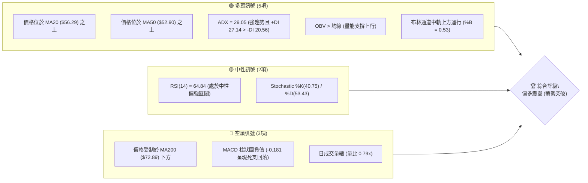
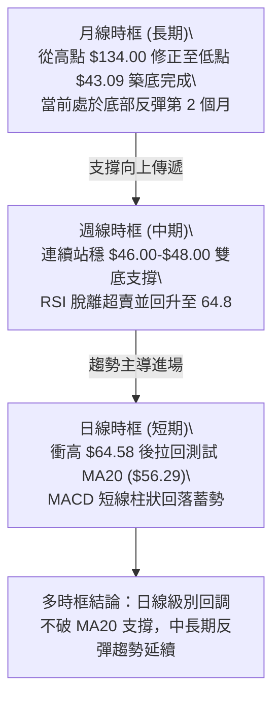
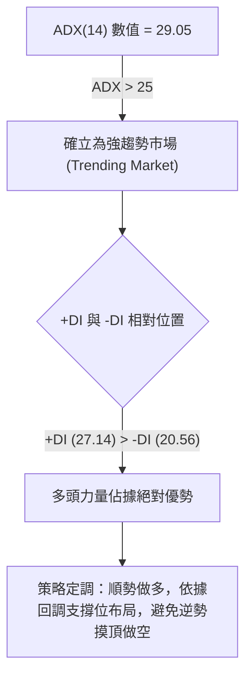
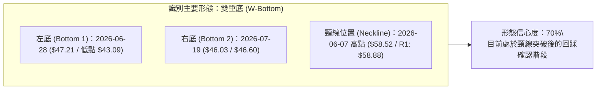
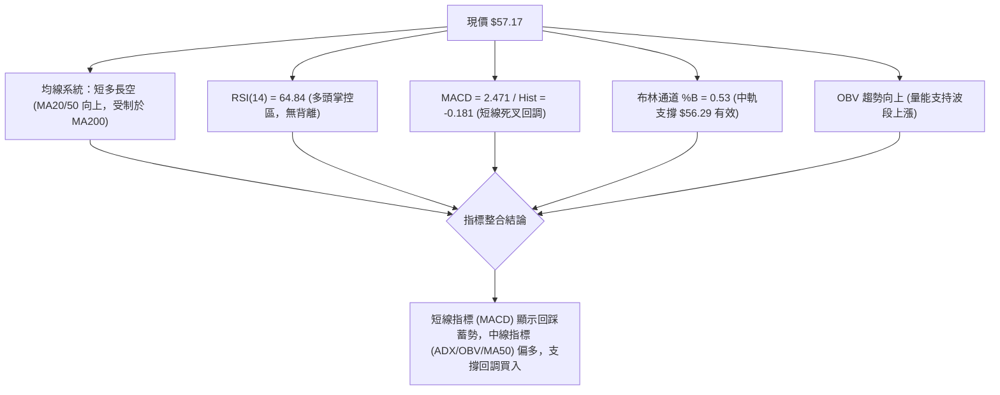
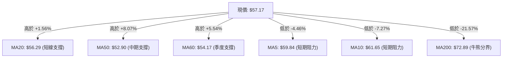
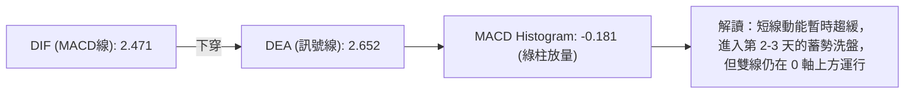
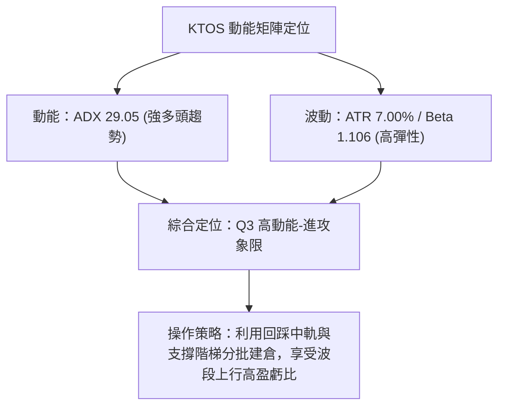
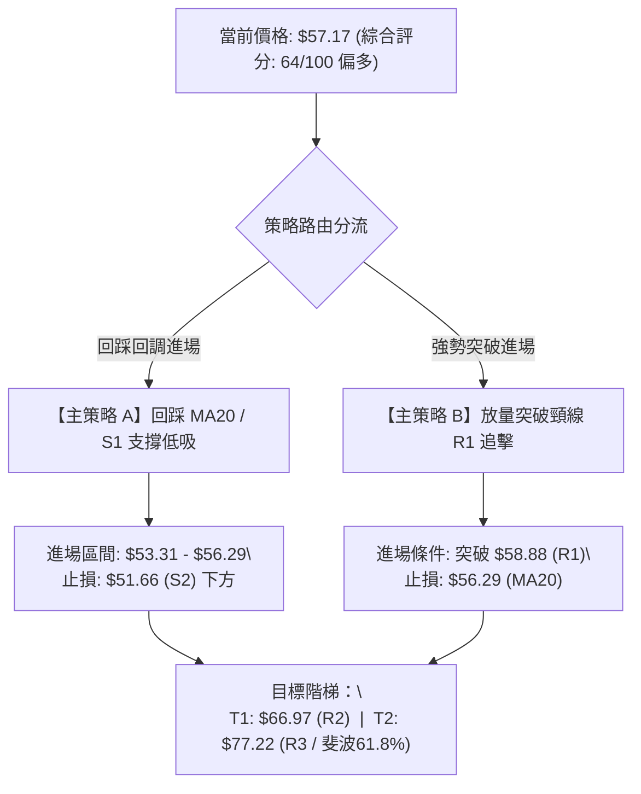
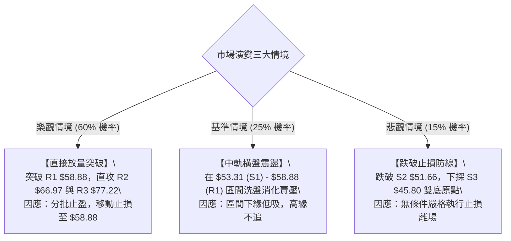

# KTOS 技術分析報告

> **報告日期**：2026-08-22 ｜ **語言**：繁體中文 ｜ **數據來源**：Yahoo Finance ｜ **當前價格**：$57.17

---

## 目錄

| 章節 | 內容 |
|------|------|
| [1. 技術面概覽](#1-技術面概覽) | 訊號儀表板、核心指標、評分卡 |
| [2. 趨勢分析](#2-趨勢分析) | 多時框趨勢、長中短期走勢 |
| [3. 圖表形態分析](#3-圖表形態分析) | 形態識別、K線組合、目標價 |
| [4. 支撐與阻力](#4-支撐與阻力) | 關鍵價位、斐波那契回調 |
| [5. 技術指標深度解讀](#5-技術指標深度解讀) | MA/RSI/MACD/布林/成交量 |
| [6. 動能與波動率](#6-動能與波動率) | 動能評估、ATR、Beta |
| [7. 多時框架總結](#7-多時框架總結) | 時框架評分矩陣 |
| [8. 交易策略建議](#8-交易策略建議) | 多空策略、風險報酬比 |
| [9. 風險提示與監控](#9-風險提示與監控) | 監控指標、風險場景 |

---

## 1. 技術面概覽

### 🎯 技術訊號儀表板



---

### 📊 核心指標速覽表

| 指標類別 | 指標名稱 | 當前數值 | 訊號 | 解讀 |
|----------|----------|----------|------|------|
| **價格** | 當前價格 | $57.17 | 🟢 | 站上 MA20 與 MA50 短中期均線，脫離近一年低點 |
| **均線** | MA20 | $56.29 | 🟢 | 價格在 MA20 上方 (+1.56%)，短線回踩中軌支撐確認 |
| **均線** | MA50 | $52.90 | 🟢 | 價格在 MA50 上方 (+8.07%)，中期底部確立並向上發散 |
| **均線** | MA200 | $72.89 | 🔴 | 價格在 MA200 下方 (-21.57%)，長期結構仍處於修正格局 |
| **動能** | RSI(14) | 64.84 | 🟡 | 處於 50–70 強勢多頭區間，未見超買，具備再上攻動能 |
| **動能** | MACD (12,26,9) | 2.471 / 2.652 | 🔴 | 快線跌破慢線，MACD 柱為 -0.181，短線進入漲後技術性回調 |
| **趨勢強度** | ADX (14) | 29.05 | 🟢 | ADX > 25 且 +DI (27.14) > -DI (20.56)，確立趨勢由多方主導 |
| **通道** | 布林通道 (%B) | 0.53 | 🟢 | 價格回落至中軌 ($56.29) 附近獲得支撐，通道持續向上擴張 |
| **波動** | ATR(14) | $4.00 | 🟡 | ATR 佔股價 7.00%，每日波動幅度中等偏高，需合理設防止損 |
| **量能** | OBV 趨勢 | OBV > MA | 🟢 | 資金持續累積，量能結構有效支撐近期的波段反彈 |

---

### 🏆 技術評分卡

```
╔══════════════════════════════════════════════════════════════════╗
║              技術評分卡 — KTOS (2026-08-22)                      ║
╠══════════════════════════════════════════════════════════════════╣
║ 趨勢強度 (Trend)     ██████████████░░░░░░  70/100   🟢 強勢多頭  ║
║ 動能指標 (Momentum)  ████████████░░░░░░░░  60/100   🟡 短線回調  ║
║ 支撐穩定度 (Support) ██████████████░░░░░░  72/100   🟢 雙底支撐  ║
║ 成交量配合 (Volume)  ████████████░░░░░░░░  62/100   🟡 量能微縮  ║
║ 形態完整度 (Pattern) █████████████░░░░░░░  65/100   🟢 W底成形   ║
║ 均線排列 (MA System) ███████████░░░░░░░░░  55/100   🟡 混合排列  ║
╠══════════════════════════════════════════════════════════════════╣
║ 綜合技術評分         █████████████░░░░░░░  64/100   🟢 偏多進取  ║
╚══════════════════════════════════════════════════════════════════╝
```

---

## 2. 趨勢分析

### 🌐 多時框趨勢分析



---

### 📈 長期趨勢 — 12個月走勢圖（Unicode）

```
KTOS 月線走勢圖（2025-08 至 2026-08）
價格軸 ($)
$105 ┤                               ● (2026-01: $103.01)
$95  ┤               ●(2025-09: $91.37)
$85  ┤                    ●(2025-10: $90.60)   ●(2026-02: $86.18)
$75  ┤                         ●───●(11/12月: ~$76)
$65  ┤  ●(2025-08: $65.84)                         ●(2026-03: $70.51)
$55  ┤                                                  ●───●(4/5月: ~$63.5)   ●(2026-08: $57.17) ◄ 現價
$45  ┤                                                            ●───●(6/7月: ~$48.2 底)
     └─────────────────────────────────────────────────────────────────────────────
        08   09   10   11   12   01   02   03   04   05   06   07   08 (月份)
```

#### 走勢特徵分析表格

| 階段 | 時間區間 | 起訖價格區間 | 區間漲跌幅 | 走勢特徵與技術解讀 |
|------|----------|--------------|------------|-------------------|
| **第一階段：高空主升** | 2025-08 ~ 2026-01 | $65.84 → $103.01 | +56.46% | 國防訂單驅動強勁動能，月線連陽直攻歷史波段高點 |
| **第二階段：急速退潮** | 2026-01 ~ 2026-04 | $103.01 → $63.05 | -38.79% | 估值過高引發獲利回吐，跌破中天期均線支撐 |
| **第三階段：恐慌築底** | 2026-04 ~ 2026-07 | $63.05 → $46.60 | -26.09% | 觸及 52 週最低點 $43.09，連續 2 個月在 $46-$49 構築雙底 |
| **第四階段：突破回升** | 2026-07 ~ 2026-08 | $46.60 → $57.17 | +22.68% | 量能放大脫離底部，強勢收復 MA20 與 MA50 |

---

### 📊 中期趨勢（週線分析）

近 20 週數據顯示，KTOS 在 2026 年 6 月底至 7 月底期間於 $46.03–$47.35 區間經歷了放量換手（週成交量突破 45,383,700 股），確認 $43.09–$45.80 具備極強結構性支撐。8 月連續兩週拉出長陽，最高觸及 $64.58，目前回測 $57.17 尋求支撐。

```
週線關鍵阻力與支撐示意圖：
$77.82 ───────────────────────────────────── 斐波那契 61.8% / 長期強阻力 (R3: $77.22)
$66.97 ───────────────────────────────────── 近期波段頸線反壓 (R2: $66.97)
$58.88 ───────────────────────────────────── 短線第一道阻力 (R1: $58.88)
$57.17 ═════════════════════════════════════ 【當前價格】
$56.29 ------------------------------------- MA20 / 布林中軌支撐
$53.31 ───────────────────────────────────── 關鍵波段支撐 (S1: $53.31)
$51.66 ───────────────────────────────────── 次級防守支撐 (S2: $51.66)
$43.09 ───────────────────────────────────── 52週最低點 / 終極底部防線
```

---

### ⚡ 趨勢強度評估（ADX 解讀）



#### ADX 指標強度對照表

| 指標項目 | 當前數值 | 閾值標準 | 狀態判定 | 技術含義 |
|----------|----------|----------|----------|----------|
| **ADX(14)** | **29.05** | > 25.00 | 🟢 強趨勢行情 | 市場脫離無序震盪，具備方向明確的趨勢推動力 |
| **+DI (多方動能)** | **27.14** | > 20.00 | 🟢 多頭主導 | 買盤力道持續推升價格，主導當前波段 |
| **-DI (空方動能)** | **20.56** | < +DI | 🟡 空方衰竭 | 賣方壓制力道減弱，僅在短線阻力位展現零星防守 |

---

## 3. 圖表形態分析

### 🔍 形態識別系統



#### 形態信心度評估表

| 形態名稱 | 信心度 | 判斷依據（引用數據） | 完成度 | 目標價（附計算式） |
|----------|--------|----------------------|--------|--------------------|
| **雙重底 (W-Bottom)** | **70%** | 兩次探底分別於 2026-06 ($43.09-$47.21) 與 2026-07 ($46.03-$46.60)，頸線位於 $58.88 (R1) | 85% (已突破並回踩) | 形態高度 = 頸線 $58.88 - 底部 $43.09 = $15.79<br>目標價 = $58.88 + $15.79 = **$74.67** (逼近 R3 $77.22) |
| **短期上升旗形 (Bull Flag)** | **60%** | 自 $46.60 飆升至 $64.58 形成旗桿，近一週於 $57.17 進行縮量回踩旗面整理 | 60% (整理中) | 旗桿長度 = $64.58 - $46.60 = $17.98<br>突破目標 = $57.17 + $17.98 = **$75.15** |

---

### 🕯️ 重要K線形態分析

| 週期/時間 | 收盤價 | K線形態 | 解讀 | 訊號 |
|-----------|--------|---------|------|------|
| **2026-06-28 週** | $47.21 | 爆量長下影陰線 | 週成交量 45,383,700 創波段天量，顯示機構資金進場承接恐慌盤 | 🟢 強烈止跌 |
| **2026-08-09 週** | $60.77 | 實體大陽線 (Marubozu) | 突破多條短期均線與頸線，RSI 升至 74.1，確立底部反轉 | 🟢 多頭攻擊 |
| **2026-08-16 週** | $64.58 | 衝高上影線十字星 | 逼近斐波那契 78.6% 回調位 ($62.54) 遭遇獲利了結賣壓 | 🟡 短線滯漲 |
| **2026-08-23 週 (當前)** | $57.17 | 縮量陰線回踩 | 週成交量萎縮至 16,778,300，回踩 MA20 ($56.29) 尋找買盤支撐 | 🟢 正常技術回調 |

---

### 📉 ASCII 走勢形態示意圖

```
KTOS 雙重底 (W-Bottom) 與突破回踩示意圖：

價格 ($)
$64.58 ┤                     ▲ (波段高點衝刺)
       │                    / \
$58.88 ┼───────▲───────────/───\───────────── 頸線位置 (R1: $58.88)
       │      / \         /     \  ◄ $57.17 (當前回踩測試頸線與 MA20)
       │     /   \       /       \
$50.00 ┤    /     \     /
       │   /       \   /
$43.09 ┴──●─────────●─/────────────────────── 底部支撐區間 ($43.09 - $46.03)
         底 1       底 2
       (06/28)    (07/19)
```

---

### 🎯 形態目標價計算

依據標準形態學原理推導之目標價位：
1. **雙重底測幅目標**：
   - 形態底部基準點：$43.09 (52W Low)
   - 頸線突破點：$58.88 (阻力位 R1)
   - 形態垂直高度 ($H$) = $\$58.88 - \$43.09 = \$15.79$
   - **第一等幅推估目標價 ($T_1$)** = $\$58.88 + \$15.79 =$ **$74.67**（與 240日均線 $75.21 及斐波那契 61.8% $77.82 形成強共振區間）
2. **中期波段擴展目標 ($T_2$)**：
   - 斐波那契 50.0% 回調位 = **$88.55**

---

## 4. 支撐與阻力

### 🗺️ 關鍵價位分布圖（Unicode）

```
KTOS 價位結構分布圖
═══════════════════════════════════════════════════════════════════
$77.82 ║██████████████████████████████████████║ 斐波那契 61.8% 回調位
$77.22 ║████████████████████████████████████  ║ 強阻力 R3 (MA200共振 $72.89-$75.21)
$66.97 ║████████████████████████              ║ 中期阻力 R2 (前波反彈高點聚類)
$62.54 ║████████████████████                  ║ 斐波那契 78.6% 回調位
$58.88 ║████████████████                      ║ 關鍵短線阻力 R1 (頸線位置)
───────╫──────────────────────────────────────╫───────────────────────────
$57.17 ╠══════════════════════════════════════╣ ◄ 現價 ($57.17)
───────╫──────────────────────────────────────╫───────────────────────────
$56.29 ║▓▓▓▓▓▓▓▓▓▓▓▓▓▓▓▓                      ║ MA20 動態均線 / 布林中軌
$53.31 ║████████████████████                  ║ 第一核心支撐 S1 (波段回調低點聚類)
$51.66 ║████████████████████████              ║ 第二防守支撐 S2 (MA50 共振 $52.90)
$45.80 ║██████████████████████████████        ║ 強支撐 S3 (W底右肩低點聚類)
$43.09 ║██████████████████████████████████████║ 52週極值低點 (終極防線)
═══════════════════════════════════════════════════════════════════
```

---

### 🚧 阻力位分析表

*註：價位嚴格引用技術數據中由 OHLCV 計算之阻力聚類*

| 阻力級別 | 價位 | 形成原因與技術共振 | 突破難度 | 重要性 |
|----------|------|--------------------|----------|--------|
| **R1** | **$58.88** | 頸線位置、近期週線多個高點密集成交區、MA5 ($59.84) 壓制 | 🟡 中等 | ★★★☆☆ (短線多空分水嶺) |
| **R2** | **$66.97** | 2026年5月底反彈高點 ($64.13-$66.97) 聚類、接近 8/16 當週高點 $64.58 | 🔴 較高 | ★★★★☆ (中期反轉確認點) |
| **R3** | **$77.22** | 近一年波段密集套牢區、MA200 ($72.89) 與 MA240 ($75.21) 均線壓制帶 | 🔴 極高 | ★★★★★ (多頭大週期目標) |

---

### 🛡️ 支撐位分析表

*註：價位嚴格引用技術數據中由 OHLCV 計算之支撐聚類*

| 支撐級別 | 價位 | 形成原因與技術共振 | 守住機率 | 重要性 |
|----------|------|--------------------|----------|--------|
| **S1** | **$53.31** | 近期突破整理平台頂部、距離 MA50 ($52.90) 僅一步之遙 | 🟢 75% | ★★★★☆ (短期回踩多頭防線) |
| **S2** | **$51.66** | 2026年5月中旬波段低點 ($52.09) 密集成交區、MA60 ($54.17) 緩衝帶 | 🟢 85% | ★★★★☆ (中期結構防守位) |
| **S3** | **$45.80** | 7月中下旬波段築底低點 ($46.03-$47.35) 聚類、W底右底強支撐 | 🟢 95% | ★★★★★ (多頭生命線/止損極限) |

---

### 📐 斐波那契回調位分析

依據 52 週極值區間（低點 $43.09 至 高點 $134.00，垂直振幅 $90.91）嚴格計算：

| 斐波那契層級 | 精確價位 | 技術含義與當前關聯解讀 |
|--------------|----------|------------------------|
| **0.0% (52W High)** | **$134.00** | 2026 年度歷史高點 |
| **23.6%** | **$112.55** | 長期深次回撤位 |
| **38.2%** | **$99.27** | 2025年9-10月頂部平台 ($90.60-$91.37) 阻力帶 |
| **50.0%** | **$88.55** | 大週期半數回撤平衡點，分析師平均目標價 ($105.62) 之必經門檻 |
| **61.8% (黃金分割)** | **$77.82** | 緊鄰阻力位 R3 ($77.22)，為空頭趨勢是否徹底扭轉的黃金分割阻力 |
| **78.6%** | **$62.54** | 前波反彈遇阻處 (8/16 觸及 $64.58 後受阻拉回) |
| **100.0% (52W Low)** | **$43.09** | 2026 年度歷史低點，構築雙底之左底基石 |

> **位置判斷**：當前價格 **$57.17** 精確處於 **78.6% ($62.54)** 與 **100.0% ($43.09)** 之間。此區域屬於典型的大跌後「深蹲築底回升區」，突破 78.6% ($62.54) 將加速朝 61.8% ($77.82) 挺進。

---

## 5. 技術指標深度解讀

### 🎛️ 指標訊號總覽



---

### 📈 移動平均線排列分析



#### 均線狀態詳細解讀

1. **短天期排列 (MA5/MA10/MA20)**：MA5 ($59.84) 與 MA10 ($61.65) 在高檔形成死叉下彎，壓制現價；但 MA20 ($56.29) 扣抵低值持續向上揚升，提供強勁的動態回踩支撐。
2. **中天期排列 (MA50/MA60/MA120)**：MA50 ($52.90) 與 MA60 ($54.17) 呈現多頭排列，並已形成向上金叉，確認中期底部反轉成立；上方 MA120 ($62.44) 為第一波反彈之均線阻力。
3. **長天期排列 (MA200/MA240)**：MA200 ($72.89) 與 MA240 ($75.21) 仍處於空頭下壓階段，代表股價尚未進入全面牛市，當前行情定性為「大級別超跌反彈與築底反轉」。

---

### 📉 RSI(14) 分析

```
RSI(14) 當前數值：64.84
[0] ─────────── [30] ─────────────────── [64.84] ────────── [70] ─────────── [100]
超賣區            弱勢區                  ▲多頭區間          超買區
進度條：████████████████████████████████░░░░░░░░░░░░░░░░  64.84%
```

- **超買超賣判定**：數值為 64.84，自前週超買邊緣 (76.7) 良性降溫至 60–65 健康多頭整理區，未破 50 多空分界線，多方掌控力良好。
- **背離分析**：
  - **價格 vs RSI**：2026年6月底低點 $47.21 (RSI 23.1)，7月中旬低點 $46.03 (RSI 47.6)，**形成極其標準的「週線級別 RSI 底背離」**，成功催生了 8 月份的大幅反彈。
  - **當前狀況**：近期衝高 $64.58 時 RSI 為 76.7，回調至 $57.17 時 RSI 為 64.84，並未出現頂背離，屬於常規的漲多技術回踩。

---

### 📊 MACD(12,26,9) 訊號解讀



- **數值關係**：MACD 線 (2.471) 低於 Signal 線 (2.652)，柱狀圖轉為負值 (-0.181)。
- **技術信號**：日線級別出現高檔死叉，這解釋了價格自 $64.58 回落至 $57.17 的動力；但由於 MACD 快慢線均遠高於 0 軸（正值區間），此死叉屬於「多頭市場內部的強勢調整」，一旦柱狀圖收斂翻紅，將提供極佳的二次進場點。

---

### 📦 布林通道分析

```
KTOS 布林通道結構 (20日, 2.0σ)
價格 ($)
$70.12 ┬─────────────────────────────────────────── BB 上軌 (+22.65%)
       │
$62.54 ┼ - - - - - - - - - - - - - - - - - - - - - - 斐波 78.6% 回調
       │
$57.17 ┼───────────────●─────────────────────────── 現價 (%B = 0.53)
$56.29 ┼─────────────────────────────────────────── BB 中軌 (MA20: $56.29)
       │
$42.46 ┴─────────────────────────────────────────── BB 下軌 (-25.73%)
```

- **通道帶寬與位置**：上軌 $70.12，中軌 $56.29，下軌 $42.46。目前 %B 為 **0.53**，代表現價精確運行於中軌上方 3% 位置。
- **形態含義**：股價自上軌回落後在中軌獲得明顯支撐，中軌呈現上行斜率，表明布林通道處於「開口擴張後的上升常態」，只要每日收盤不破中軌 $56.29，多頭通道結構完好。

---

### 💹 成交量分析（量價配合度）

```
量能比較：
最新日成交量  [3.14M]  ███████████████░░░░░ (0.79x 20日均量)
20日均成交量  [3.98M]  ███████████████████░
50日均成交量  [4.64M]  ██████████████████████
```

1. **量價配合度**：在 8 月初從 $46 突破上攻至 $64 期間，週成交量放大至近 29,000,000 股，呈現「價漲量增」；近一週拉回時成交量降至 16,778,300 股，呈現「價跌量縮」，為標準的良性洗盤特徵。
2. **OBV (能量潮)**：OBV > MA，指標維持向上走勢，未見資金出逃跡象，證明籌碼鎖定良好，主力機構持股信心穩定。

---

## 6. 動能與波動率

### ⚡ 動能評估四象限

| 象限 | 動能維度 (ADX / RSI) | 波動維度 (ATR / Beta) | 當前判定 | 戰略意涵 |
|------|----------------------|-----------------------|----------|----------|
| **Q1 (最佳爆發)** | 強動能 (ADX > 25, RSI > 60) | 低波動 (ATR% < 5%) | — | 主升段加速 |
| **Q2 (震盪蓄勢)** | 弱動能 (ADX < 25) | 低波動 (ATR% < 5%) | — | 區間高拋低吸 |
| **Q3 (高浪進取)** | **強動能 (ADX 29.05, +DI 主導)** | **高波動 (ATR% 7.00%, Beta 1.106)** | **✓ KTOS 所屬** | **多頭主導的高彈性進攻行情，需以 ATR 精準設定風控** |
| **Q4 (失控風險)** | 弱動能 (空頭主導) | 高波動 (恐慌拋售) | — | 停損觀望 |



---

### 📊 ATR 波動率分析與止損建議

- **ATR(14) 數值**：**$4.00**（佔股價比重為 **7.00%**）。
- **止損距離設計**：
  - **保守型波段止損 (1.5 × ATR)**：$1.5 \times \$4.00 = \$6.00$。由進場點下浮 $6.00（約 10.5%），剛好可覆蓋至第二支撐 S2 ($51.66) 下方。
  - **激進型短線止損 (1.0 × ATR)**：$1.0 \times \$4.00 = \$4.00$。由現價 $57.17 下浮至 **$53.17**，精確座落於第一支撐 S1 ($53.31) 處。

---

### 📐 Beta 與市場相關性

- **Beta 係數**：**1.106**（相對於 S&P 500 指數具備 1.106 倍的彈性）。
- **相關性特徵**：作為國防與無人作戰系統龍頭，KTOS 兼具軍工防禦性與科技高成長屬性，在國防預算與地緣局勢催化下，波段上攻時往往展現大幅超越大盤的 Alpha 超額收益。

---

## 7. 多時框架總結

### 📋 時框架評分表

| 時框架 | 趨勢方向 | 動能狀態 | 均線排列 | 形態結構 | 綜合評分 | 戰術建議 |
|--------|----------|----------|----------|----------|----------|----------|
| **月線 (長期)** | 🟡 震盪築底 | 🟡 RSI 剛脫離超賣 | 🔴 MA200 下方 | 雙底形成中 | 58/100 | 逢低戰略性配置 |
| **週線 (中期)** | 🟢 多頭展開 | 🟢 RSI 64.8 / +DI 主導 | 🟢 站上 MA20/50 | W底頸線突破回踩 | 72/100 | 波段持股續抱，加碼進場 |
| **日線 (短期)** | 🟡 回調蓄勢 | 🔴 MACD 死叉調整 | 🟡 夾於 MA20 與 MA5 間 | 旗面整理回踩中軌 | 62/100 | 等待回踩 S1 或突破 R1 |

---

### 🔲 綜合訊號矩陣

```
時框訊號收斂圖示：
指標維度        短期 (日線)      中期 (週線)      長期 (月線)      矩陣收斂結果
─────────────────────────────────────────────────────────────────────────────
均線系統         🟡 (MA20上)     🟢 (站上MA50)    🔴 (MA200下)    🟡 中期轉強
動能方向         🔴 (MACD死叉)   🟢 (ADX 29.05)   🟡 (低檔反彈)    🟢 趨勢多頭主導
量能結構         🟡 (縮量回調)   🟢 (爆量突破)    🟢 (OBV累積)    🟢 籌碼健康
形態定位         🟢 (旗面整理)   🟢 (雙底確認)    🟡 (大三角底)    🟢 底部確立
─────────────────────────────────────────────────────────────────────────────
最終收斂判定：   【中期多頭主導下的短期良性拉回，具備高度做多價值】
```

---

### ⚖️ 多時框收斂結論（依規則 14 嚴格收斂）

1. **行情定性**：當前 ADX(14) 數值為 **29.05**，明確大於 25 臨界值，判定當前為**強趨勢行情（Trending Market）**，非無序震盪。
2. **時框權重收斂**：依據多時框收斂規則，趨勢行情下**以中期（週線及 MA50）方向為主導**，日線短期的 MACD 死叉僅視為尋找優質進場點的「時機工具」，不可顛覆週線的翻多結論。
3. **唯一方向性結論**：**【偏多（Bullish）— 回踩關鍵支撐布局多單】**。

---

## 8. 交易策略建議

### 🗺️ 策略決策流程圖



---

### 🧭 策略路由

> **當前主策略方向 = 偏多操作（依綜合技術評分 64/100，評分 ≥ 60 觸發主推多頭策略）**

---

### 🎯 價格情境階梯（Price Scenarios）

*註：價位嚴格引用第 4 章計算之關鍵價位*

| 觸發條件 | 第一目標 | 後續延伸目標 | 戰術情境含義 |
|----------|----------|--------------|--------------|
| **強勢突破 R1 ($58.88)** | **R2 ($66.97)** | **R3 ($77.22)** | 短線洗盤結束，展開 W 底第二波等幅主升浪 (+35.07%) |
| **站穩現價 ($56.29–$57.17)** | **R1 ($58.88)** | **R2 ($66.97)** | 於 MA20 與頸線間完成蓄勢換手，震盪盤堅 |
| **失守 S1 ($53.31)** | **S2 ($51.66)** | **S3 ($45.80)** | 跌破短期均線，回測 MA50 與雙底頸線基底，需嚴格風控 |

---

### 📊 情境機率分佈

| 情境 | 機率 | 主要技術依據 |
|------|------|--------------|
| **情境一：回踩企穩，繼續上行** | **60%** | ADX = 29.05 趨勢明確、OBV 資金持續流入、站穩 MA20/50 均線、週線級別底背離支撐 |
| **情境二：布林帶內區間震盪** | **25%** | MACD 柱狀圖處於負值 (-0.181)、日成交量萎縮至 0.79x 均量，需時間消化 MA5/10 壓制 |
| **情境三：跌破支撐，再次探底** | **15%** | 遭遇大盤系統性風險，失守 S2 ($51.66) 與 MA50，回測前低 $45.80 |

---

### 🟢 主策略詳情

| 策略要素 | 策略 A：支撐位掛單低吸（穩健型） | 策略 B：突破頸線順勢追價（進取型） |
|----------|----------------------------------|-----------------------------------|
| **進場條件** | 股價回測 MA20 ($56.29) 至 S1 ($53.31) 企穩 | 日K線實體放量收盤突破 R1 ($58.88) |
| **進場價格** | **$55.00** (區間均價) | **$59.00** |
| **止損價格** | **$51.50** (跌破 S2 $51.66 關鍵支撐) | **$55.80** (跌回 MA20 下方) |
| **目標價 T1** | **$66.97** (阻力位 R2) | **$66.97** (阻力位 R2) |
| **目標價 T2** | **$77.22** (阻力位 R3 / 形態測幅) | **$77.22** (阻力位 R3 / 斐波 61.8%) |
| **風險空間** | $3.50 (-6.36%) | $3.20 (-5.42%) |
| **獲利空間(T1/T2)** | +$11.97 (+21.76%) / +$22.22 (+40.40%) | +$7.97 (+13.51%) / +$18.22 (+30.88%) |
| **風險報酬比 (R:R)** | **1 : 3.42 (至T1) / 1 : 6.35 (至T2)** | **1 : 2.49 (至T1) / 1 : 5.69 (至T2)** |
| **預估勝率** | **65%** | **60%** |
| **建議倉位** | **15% - 20%** | **10% - 15%** |

---

### 🔴 反向風險觸發點（對沖與風控提示）

若出現以下極端訊號，判定多頭主策略失效，應即刻止損並轉為防守觀望：
1. **關鍵價位跌破**：收盤價帶量跌破 **S2 ($51.66)** 及 MA50 ($52.90)。
2. **指標破位**：週線 RSI 重新跌回 45 以下，且 ADX 的 -DI 上穿 +DI 形成空頭死亡交叉。

---

### ⭐ 整體訊號強度評星

```
╔═══════════════════════════════════════════════════════╗
║ 做多訊號強度：  ★★★★☆  (4.0/5星) — 底部反轉確立       ║
║ 做空訊號強度：  ★☆☆☆☆  (1.5/5星) — 逆勢風險極高       ║
║ 整體技術可信度：★★★★☆  (4.2/5星) — 價量結構高度收斂   ║
╚═══════════════════════════════════════════════════════╝
```

---

## 9. 風險提示與監控

### ✅ 關鍵監控指標 Checklist

```
╔══════════════════════════════════════════════════════════════════╗
║              每日交易關鍵監控清單 (Checklist)                    ║
╠══════════════════════════════════════════════════════════════════╣
║ [ ] 價格是否持續守在 MA20 ($56.29) 之上？                         ║
║ [ ] MACD 柱狀圖負值 (-0.181) 是否開始由長變短並向 0 軸收斂？      ║
║ [ ] 日成交量是否能重回 20 日均量 (3.98M) 以上以配合攻堅？        ║
║ [ ] RSI(14) 能否穩在 60 軸上方避免滑落至 50 弱勢區？             ║
║ [ ] 向上挑戰 R1 ($58.88) 時是否出現假突破上影線？               ║
╚══════════════════════════════════════════════════════════════════╝
```

---

### ⚠️ 風險場景分析



---

### 🛡️ 風險管理與倉位紀律

1. **單筆交易風險上限**：任何單一交易帳戶對 KTOS 的最大曝險損失，嚴格限制在總總資產的 **1.5% - 2.0%** 以內。
2. **波動率調倉機制**：由於當前 ATR 為 $4.00 (7.00%)，波動幅度較大，持倉部位不宜一次打滿，應採取「**底倉 10% + 突破加碼 5%**」的梯形建倉法。
3. **移動止盈紀律**：當價格達成第一目標價 **$66.97** 後，應將止損點強制上移至成本價或 **$58.88**，以立於不敗之地鎖定獲利。

---

## 📋 報告總結

```
╔════════════════════════════════════════════════════════════════════════╗
║                   KTOS 技術分析報告總結                                ║
╠════════════════════════════════════════════════════════════════════════╣
║ 報告日期：2026-08-22                                                  ║
║ 當前價格：$57.17                                                       ║
║ 分析評級：🟢 偏多進取 (Bullish Reversal / Buy on Dips)                 ║
╠════════════════════════════════════════════════════════════════════════╣
║ 關鍵結論：                                                             ║
║ ├─ 長期趨勢：🟡 自 $134.00 深跌後完成 $43.09 築底，長期進入反轉初期     ║
║ ├─ 中期趨勢：🟢 雙重底確立，站穩 MA50 ($52.90)，ADX 29.05 多頭主導     ║
║ ├─ 短期趨勢：🟡 衝高 $64.58 後健康回調，測試 MA20 ($56.29) 支撐         ║
║ ├─ 關鍵支撐：S1: $53.31  │  S2: $51.66  │  S3: $45.80                ║
║ ├─ 關鍵阻力：R1: $58.88  │  R2: $66.97  │  R3: $77.22                ║
║ └─ 分析師目標：均價 $105.62 (最高 $150.00 / 最低 $60.00)               ║
╠════════════════════════════════════════════════════════════════════════╣
║ 最優策略組合：                                                         ║
║ 1. 🥇 最佳機會：回踩 $55.00 附近低吸，止損 $51.50，目標 $66.97 / $77.22║
║ 2. 🥈 次選機會：突破 $58.88 後順勢追多，止損 $55.80，目標 $66.97       ║
║ 3. 🥉 保守選擇：等待 MACD 柱狀圖由負翻紅確認調整結束後再行進場        ║
╚════════════════════════════════════════════════════════════════════════╝
```

---

> ⚠️ **免責聲明**：本報告為技術分析研究，所有數據及估算均基於歷史價格與客觀技術指標計算。本報告**僅供研究與學術參考**，**不構成任何形式的個人化投資建議**。金融市場投資具有風險，投資人應獨立評估風險並自行承擔交易結果。

---

*報告生成時間：2026-08-22 ｜ 數據來源：Yahoo Finance ｜ 分析框架：多時框技術分析*