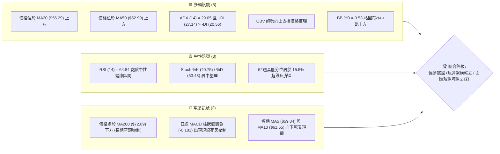
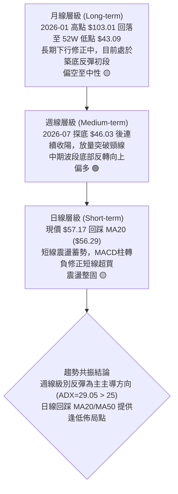
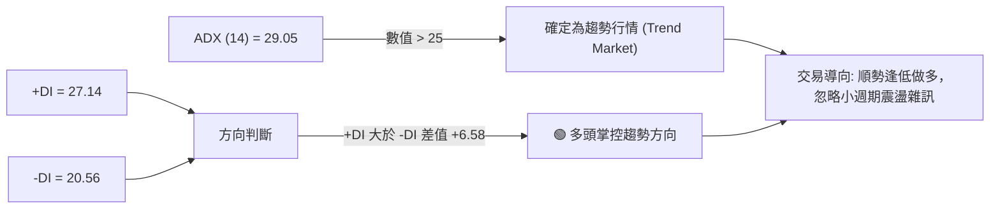
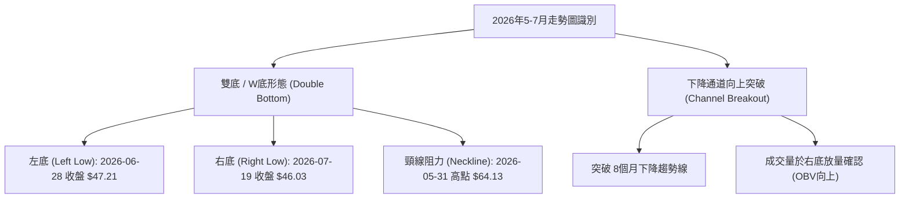
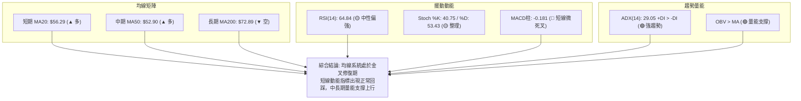
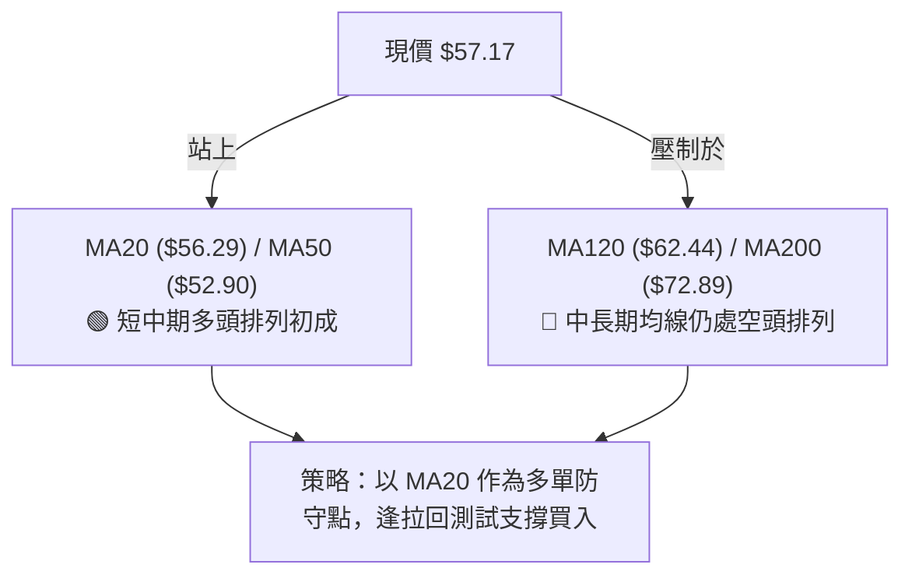
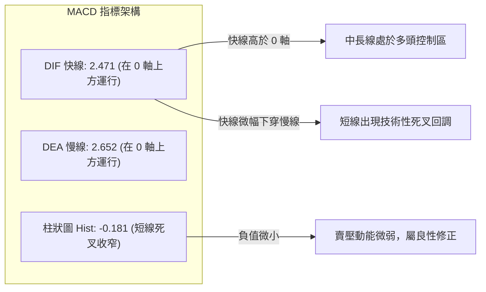
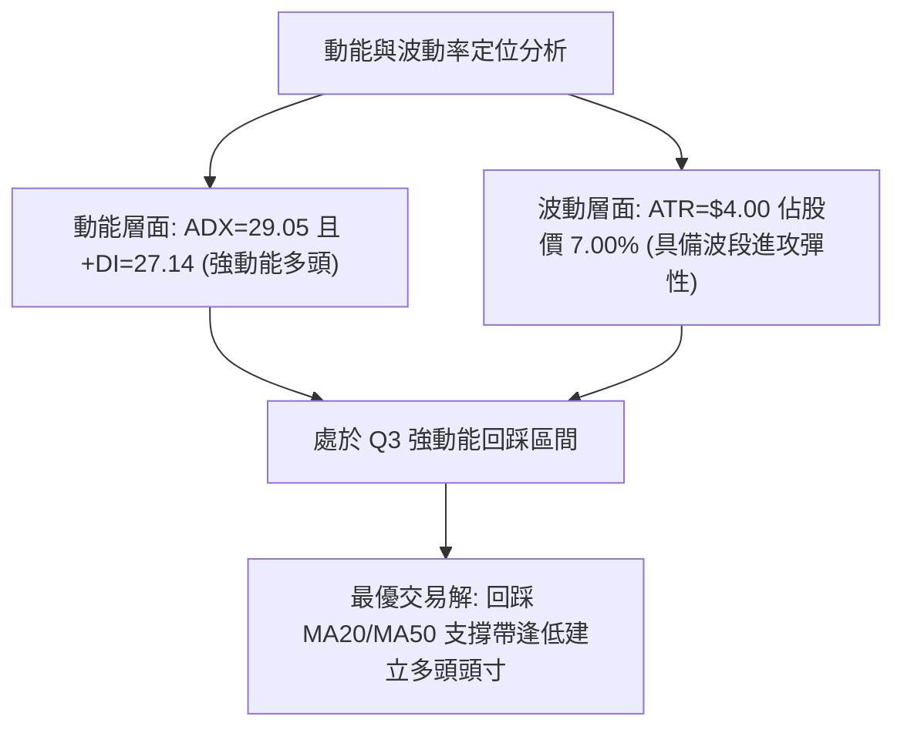
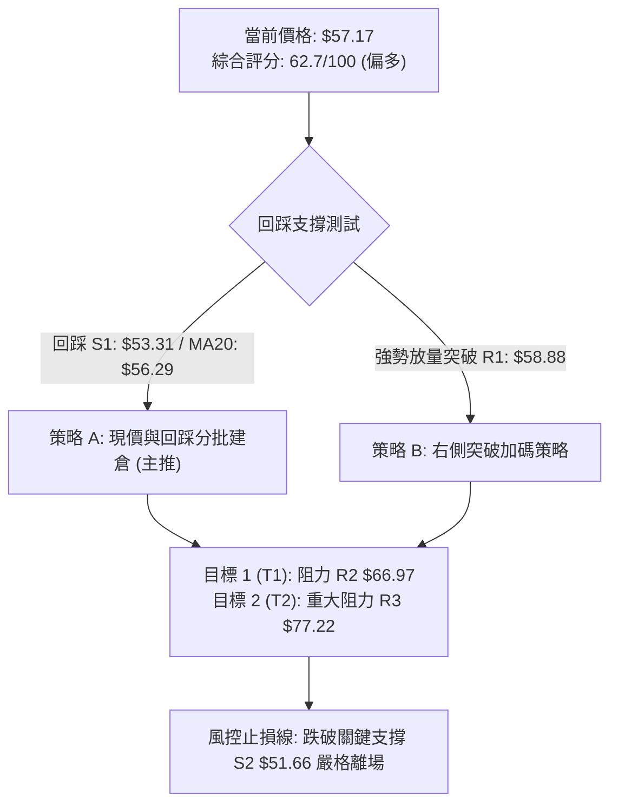
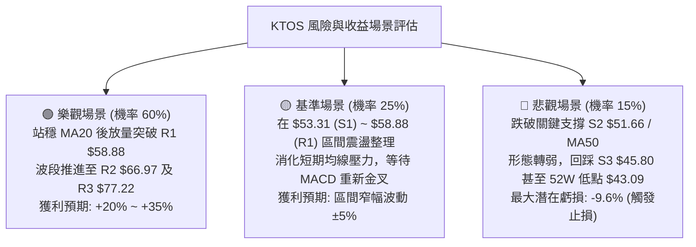

# KTOS 技術分析報告

> **報告日期**：2026-08-22 ｜ **語言**：繁體中文 ｜ **數據來源**：Yahoo Finance ｜ **當前價格**：$57.17

---

## 目錄

| 章節 | 內容 |
|------|------|
| [1. 技術面概覽](#1-技術面概覽) | 訊號儀表板、核心指標、評分卡 |
| [2. 趨勢分析](#2-趨勢分析) | 多時框趨勢、長中短期走勢 |
| [3. 圖表形態分析](#3-圖表形態分析) | 形態識別、K線組合、目標價 |
| [4. 支撐與阻力](#4-支撐與阻力) | 關鍵價位、斐波那契回調 |
| [5. 技術指標深度解讀](#5-技術指標深度解讀) | MA/RSI/MACD/布林/成交量 |
| [6. 動能與波動率](#6-動能與波動率) | 動能評估、ATR、Beta |
| [7. 多時框架總結](#7-多時框架總結) | 時框架評分矩陣 |
| [8. 交易策略建議](#8-交易策略建議) | 多空策略、風險報酬比 |
| [9. 風險提示與監控](#9-風險提示與監控) | 監控指標、風險場景 |

---

## 1. 技術面概覽

### 🎯 技術訊號儀表板



---

### 📊 核心指標速覽表

| 指標類別 | 指標名稱 | 當前數值 | 訊號 | 解讀 |
| :--- | :--- | :--- | :---: | :--- |
| **價格** | 當前價格 | $57.17 | 🟢 | 自7月底部 $46.03 強勁反彈，站穩短中期均線 |
| **均線** | MA20 | $56.29 | 🟢 | 現價高於 MA20 (+1.56%)，短期支撐結構完好 |
| **均線** | MA50 | $52.90 | 🟢 | 現價高於 MA50 (+8.07%)，中期底部確立回升 |
| **均線** | MA200 | $72.89 | 🔴 | 現價低於 MA200 (-21.57%)，長期下行趨勢仍構成重壓 |
| **動能** | RSI(14) | 64.84 | 🟡 | 位於強勢中性區間 (30-70)，未見超買或超賣 |
| **動能** | MACD (12,26,9) | Hist: -0.181 | 🔴 | MACD線 2.471 低於 Signal線 2.652，短線出現微幅死叉回檔 |
| **趨勢強度** | ADX (14) | 29.05 | 🟢 | ADX > 25 且 +DI (27.14) > -DI (20.56)，處於多頭趨勢行情 |
| **通道** | Bollinger %B | 0.53 | 🟢 | 突破中軌 $56.29，通道開口向上，目標指向阻力區 |
| **量能** | 量比 (vs 20MA) | 0.76x | 🟡 | 成交量 3.03M 略有縮量，呈現「拉回量縮」健康整理 |
| **波動** | ATR(14) | $4.00 | 🟡 | 佔股價 7.00%，日均波動適中，提供足夠交易彈性 |

---

### 🏆 技術評分卡

```
╔══════════════════════════════════════════════════════════════════╗
║              KTOS 技術面綜合量化評分卡 (2026-08-22)              ║
╠══════════════════════════════════════════════════════════════════╣
║ 趨勢強度 (ADX/DI)   ██████████████░░░░░░  70/100  🟢 強勢多頭確立║
║ 動能指標 (RSI/MACD) ██████████░░░░░░░░░░  52/100  🟡 短線動能鈍化║
║ 支撐穩定度 (S1/S2)  ████████████████░░░░  80/100  🟢 底部支撐紮實║
║ 成交量配合 (OBV/VOL)████████████░░░░░░░░  62/100  🟢 量價未見背離║
║ 形態完整度 (雙底)   ██████████████░░░░░░  70/100  🟢 雙底築底突破║
║ 均線排列 (MA矩陣)   ████████░░░░░░░░░░░░  42/100  🔴 長期均線壓制║
╠══════════════════════════════════════════════════════════════════╣
║ 綜合評分            ████████████░░░░░░░░  62.7/100 偏多 (BUY ON DIP)║
╚══════════════════════════════════════════════════════════════════╝
```

---

## 2. 趨勢分析

### 🌐 多時框趨勢分析



---

### 📈 長期趨勢 — 12個月走勢圖（Unicode）

```
KTOS 月線走勢圖（2025-08 至 2026-08）
價格軸 ($)
$105 ┤                                    ● $103.01 (2026-01 波段峰頂)
$95  ┤                  ● $91.37   ● $90.60
$85  ┤                                           ● $86.18
$75  ┤                  ● $76.10   ● $75.91              ● $70.51
$65  ┤     ● $65.84                                             ● $63.05  ● $64.13
$55  ┤                                                                                ● $57.17 (現價)
$45  ┤                                                                   ● $49.86  ● $46.60
     └─────┬──────────┬──────────┬──────────┬──────────┬──────────┬──────────┬──────────┬──────────┬──────────┬──────────┬──────────┬─
        2025-08    2025-09    2025-10    2025-11    2025-12    2026-01    2026-02    2026-03    2026-04    2026-05    2026-06    2026-07    2026-08
```

#### 走勢特徵分析表格

| 階段區間 | 起止月份 | 價格變化 ($) | 漲跌幅 (%) | 量價與形態特徵分析 |
| :--- | :--- | :---: | :---: | :--- |
| **主升加速段** | 2025-08 → 2026-01 | $65.84 → $103.01 | +56.46% | 多頭主升浪，成交量溫和放大，觸及 52週高點 $134.00 區域後見頂 |
| **波段下行段** | 2026-01 → 2026-04 | $103.01 → $63.05 | -38.79% | 獲利了結賣壓湧現，連續跌破短期均線，空方動能佔優 |
| **底部震盪築底** | 2026-05 → 2026-07 | $64.13 → $46.60 | -27.33% | 探測 52週低點 $43.09 附近的強支撐，完成「雙底」右底打底 |
| **右側反彈啟動** | 2026-07 → 2026-08 | $46.60 → $57.17 | +22.68% | 8月連續大陽線向上突破，站上 MA20 與 MA50，確立反彈波段 |

---

### 📊 中期趨勢（週線分析）

中期走勢呈現標準的「V型二次探底」向上反轉結構。2026-06-28 當週成交量放大至 45,383,700 股，收盤於 $47.21，隨後於 2026-07-19 當週在 $46.03 探明低點後止跌。8月第一週放量（28.96M股）拉出長陽線突破 $60.00 關卡，隨後回踩確認頸線支撐。

```
週線級別阻力與支撐架構圖：
$77.22 ────────────────────────── [強阻力 R3 / 61.8% 斐波那契]
$66.97 ────────────────────────── [阻力 R2 / 前期平台高點]
$58.88 ────────────────────────── [近端阻力 R1]
$57.17 ◀─── 【當前收盤價】
$53.31 ────────────────────────── [近期支撐 S1 / 短線防守]
$51.66 ────────────────────────── [關鍵支撐 S2 / MA50 支撐帶 $52.90]
$45.80 ────────────────────────── [中期鐵底 S3 / 雙底低點聚類]
```

---

### ⚡ 趨勢強度評估（ADX 解讀）



#### ADX 趨勢強度對照表

| 指標名稱 | 數值 | 門檻區間 | 當前狀態解讀 |
| :--- | :---: | :---: | :--- |
| **ADX (14)** | **29.05** | > 25 (強趨勢) | 趨勢強度顯著，行情已脫離無方向盤整，進入波段單邊運行狀態 |
| **+DI (多頭動能)** | **27.14** | > 25 (強勢) | 買盤動能佔優，控盤意願強烈 |
| **-DI (空頭動能)** | **20.56** | < 25 (弱勢) | 賣盤壓制力道衰退，空方處於防守退縮狀態 |
| **趨勢性質** | **多頭主導** | +DI > -DI | 依收斂規則第 14 條：ADX > 25 確立趨勢行情，以中長期波段多頭為主導 |

---

## 3. 圖表形態分析

### 🔍 形態識別系統



#### 形態信心度評估表

| 形態名稱 | 信心度 | 判斷依據（引用數據） | 完成度 | 目標價（附嚴格計算式） |
| :--- | :---: | :--- | :---: | :--- |
| **雙底形態 (W底)** | **70%** | 左底 $47.21 (06/28)，右底 $46.03 (07/19)，底部聚類於支撐 S3 ($45.80) 上方，頸線位於 2026-05-31 收盤高點 $64.13 | 75% (已突破初段，回踩中) | 形態高度 = $64.13 - $46.03 = $18.10。<br>理論目標價 = 頸線 $64.13 + $18.10 = **$82.23** (與 R3 $77.22 形成目標共振區) |
| **布林通道中軌突破** | **85%** | 價格站上布林中軌 MA20 ($56.29)，BB %B 為 0.53，通道開口擴張 | 100% | 依通道上軌計算目標價 = **$70.12** |

---

### 🕯️ 重要K線形態分析

| 週線日期 | 收盤價 | K線形態特徵 | 技術解讀 | 訊號 |
| :---: | :---: | :--- | :--- | :---: |
| **2026-06-28** | $47.21 | 爆量長下影陰線 (45.38M股) | 出現恐慌盤出清，主力資金在 52W 低點 $43.09 上方積極承接 | 🟢 |
| **2026-07-19** | $46.03 | 縮量十字星 (Doji) | 空方力道衰竭，確立右底不破前低，完成雙底結構 | 🟢 |
| **2026-08-09** | $60.77 | 實體大陽線 (+30.4% 週漲幅) | 週量放大至 28.96M 股，帶量突破 MA50，啟動反彈主升段 | 🟢 |
| **2026-08-16** | $64.58 | 上影線陽線 | 觸及波段高點 $64.58 後遇阻於頸線區間，多頭獲利盤釋放 | 🟡 |
| **2026-08-23** | $57.17 | 回踩中陰線 (縮量 16.66M) | 縮量回踩 MA20 ($56.29) 尋求支撐，屬於典型「突破後回抽確認」 | 🟢 |

---

### 📉 ASCII 走勢形態示意圖

```
KTOS 雙底反轉形態示意圖 (2026-05 至 2026-08)
價格 ($)
$66.97 ┤                                     [阻力位 R2]
$64.13 ┤                ● 頸線高點 (Neckline) ────● $64.58 (08-16 高點)
       │               / \                       / \
$57.17 ┤──────────────/───\─────────────────────/───● [現價 $57.17 回踩]
       │             /     \                   /
$52.90 ┤────────────/───────\─────────────────/───── [MA50 支撐線]
       │           /         \               /
$47.21 ┤          ● (左底)    \             /
$46.03 ┤                       \           ● (右底)
$43.09 ┴────────────────────────────────────────── [52W 低點保護位]
               2026-06-28                 2026-07-19
```

---

## 4. 支撐與阻力

### 🗺️ 關鍵價位分布圖（Unicode）

```
KTOS 價位結構分布圖 (由 OHLCV 與斐波那契嚴格計算)
═════════════════════════════════════════════════════════════════
$134.00 ║██████████████████████████████║ 52週歷史高點 (52W High / 0.0%)
$112.55 ║████████████████████          ║ 23.6% 斐波那契回調位
$99.27  ║██████████████████████        ║ 38.2% 斐波那契回調位
$88.55  ║████████████████████████      ║ 50.0% 斐波那契多空中樞
$77.82  ║██████████████████████████████║ 61.8% 斐波那契黃金分割位
$77.22  ║██████████████████████████████║ 強阻力 R3 (波段高點聚類)
$72.89  ║▓▓▓▓▓▓▓▓▓▓▓▓▓▓▓▓▓▓▓▓          ║ 長期均線 MA200 壓制線
$70.12  ║▓▓▓▓▓▓▓▓▓▓▓▓                  ║ 布林通道上軌 (BB Upper)
$66.97  ║████████████████████          ║ 阻力 R2 (波段高點聚類)
$62.54  ║▓▓▓▓▓▓▓▓▓▓▓▓▓▓▓▓              ║ 78.6% 斐波那契回調位
$58.88  ║████████████                  ║ 近端阻力 R1 (波段高點聚類)
$57.17  ╠══════════════════════════════╣ ◄── 【當前收盤價格 $57.17】
$56.29  ║░░░░░░░░░░░░░░░░░░░░░░░░░░    ║ 布林中軌 / MA20 短線動態支撐
$53.31  ║▓▓▓▓▓▓▓▓▓▓▓▓▓▓▓▓              ║ 近期支撐 S1 (波段低點聚類)
$52.90  ║░░░░░░░░░░░░░░░░░░░░          ║ 中期均線 MA50 支撐
$51.66  ║████████████████████          ║ 強支撐 S2 (波段低點聚類)
$45.80  ║██████████████████████████████║ 鐵底支撐 S3 (波段低點聚類)
$43.09  ║██████████████████████████████║ 52週歷史低點 (52W Low / 100.0%)
═════════════════════════════════════════════════════════════════
```

---

### 🚧 阻力位分析表

| 阻力級別 | 價位 | 形成原因（嚴格引用數據） | 突破難度 | 重要性評級 |
| :--- | :---: | :--- | :---: | :---: |
| **近端阻力 R1** | **$58.88** | 近一年波段高點聚類位，距離現價 +2.99%，受短線 MA5 ($59.84) 壓制 | 低至中等 | 🟡 關鍵短線反彈門檻 |
| **中期阻力 R2** | **$66.97** | 近一年波段高點聚類位，距離現價 +17.13%，接近布林上軌 $70.12 | 中等 | 🟢 波段獲利了結區間 |
| **重大阻力 R3** | **$77.22** | 近一年波段高點聚類位 (+35.07%)，與 61.8% 斐波那契 ($77.82) 形成重疊共振 | 極高 | 🔴 多空牛熊分水嶺 |

---

### 🛡️ 支撐位分析表

| 支撐級別 | 價位 | 形成原因（嚴格引用數據） | 守住機率 | 重要性評級 |
| :--- | :---: | :--- | :---: | :---: |
| **近期支撐 S1** | **$53.31** | 近一年波段低點聚類位，距離現價 -6.75%，位於 MA50 ($52.90) 上方 | 75% | 🟢 短線防守第一道關卡 |
| **關鍵支撐 S2** | **$51.66** | 近一年波段低點聚類位，距離現價 -9.64%，中期多頭最後防線 | 85% | 🟢 多頭結構防守中樞 |
| **長期鐵底 S3** | **$45.80** | 近一年波段低點聚類位 (-19.90%)，雙底（$47.21 / $46.03）築底平台 | 95% | 🔴 戰略級絕對支撐 |

---

### 📐 斐波那契回調位分析

依據 52週極值區間（低點 $43.09 → 高點 $134.00），各回調位計算如下：

*   **0.0% (52W High)**: **$134.00**
*   **23.6%**: **$112.55**
*   **38.2%**: **$99.27**
*   **50.0%**: **$88.55**
*   **61.8% (黃金分割)**: **$77.82**
*   **78.6%**: **$62.54**
*   **100.0% (52W Low)**: **$43.09**

#### 斐波那契技術解讀：
當前收盤價 **$57.17** 位於 **100.0% ($43.09)** 與 **78.6% ($62.54)** 之間（處於 52週價格區間的 15.5% 分位）。
1.  **向上空間**：一旦向上突破 78.6% 回調位 **$62.54**，價格將直奔 61.8% 黃金分割位 **$77.82**（與重大阻力 R3 **$77.22** 高度重疊），存在超過 +35% 的潛在上行反彈空間。
2.  **向下防守**：現價距離 100.0% 底部支撐 **$43.09** 具備充足安全邊際，整體技術結構呈現典型的「低位非對稱風險回報」特徵。

---

## 5. 技術指標深度解讀

### 🎛️ 指標訊號總覽



---

### 📈 移動平均線排列分析

| 均線名稱 | 數值 | 現價差距 (%) | 走勢方向 | 排列性質與技術意義 |
| :--- | :---: | :---: | :---: | :--- |
| **MA 5** | $59.84 | -4.46% | 下行 ▼ | 超短線賣壓壓制，現價處於短期均線下方 |
| **MA 10** | $61.65 | -7.27% | 下行 ▼ | 短線第一道動態阻力帶 |
| **MA 20** | $56.29 | +1.56% | 上行 ▲ | 短線生命線，現價站穩其上，提供即時動態支撐 |
| **MA 50** | $52.90 | +8.07% | 上行 ▲ | 中期多頭趨勢基準，MA20 與 MA50 呈現「黃金交叉」架構 |
| **MA 60** | $54.17 | +5.54% | 上行 ▲ | 季線向上拐頭，確認中期買盤進場 |
| **MA 120** | $62.44 | -8.44% | 下行 ▼ | 半年線下壓，構成 $62.50 附近反彈阻力 |
| **MA 200** | $72.89 | -21.57% | 下行 ▼ | 長期年線壓制，反彈目標位之一 |
| **MA 240** | $75.21 | -23.99% | 下行 ▼ | 長期超強阻力區間 |



---

### 📉 RSI(14) 分析

*   **當前數值**：**64.84**
*   **強度進度條**：`█████████████░░░░░░░` 64.84% (強勢中性區)
*   **背離分析**：
    *   **頂背離**：無頂背離。近期高點 $64.58 伴隨 RSI 達 76.7，指標與價格同步創波段新高後正常回落。
    *   **底背離**：在 2026-06-28 至 2026-07-19 雙底形成期間，價格由 $47.21 下探至 $46.03（微創低），而 RSI 由 23.1 顯著抬升至 47.6，構成標準的**週線級別底背離**，隨後帶動 8 月強勁反彈。
*   **解讀結論**：RSI 自 76.7 超買區回調至 64.84，成功消化過熱指標，目前處於健康多頭回檔區，並未跌破 50 中軸，多頭動能依然主導。

---

### 📊 MACD(12/26/9) 訊號解讀

*   **MACD DIF 線**：**2.471**
*   **MACD DEA 訊號線**：**2.652**
*   **MACD Histogram 柱狀圖**：**-0.181** (🔴 看空回檔)



---

### 📦 布林通道分析

*   **布林上軌 (Upper Band)**：**$70.12**
*   **布林中軌 (MA20)**：**$56.29**
*   **布林下軌 (Lower Band)**：**$42.46**
*   **帶寬振幅**：**49.25%**（通道顯著開口擴張）
*   **%B 指標**：**0.53**

```
KTOS 布林通道示意圖
價格 ($)
$70.12 ┬─────────────────────────────────────────── 布林上軌 (BB Upper)
       │                                     ▲
       │                                    ╱ 
$57.17 ┼──────────────────● 【現價 $57.17 (%B = 0.53)】
$56.29 ┼─────────────────────────────────────────── 布林中軌 (MA20) 支撐
       │                                  
       │                                
$42.46 ┴─────────────────────────────────────────── 布林下軌 (BB Lower)
```
**解讀**：現價 $57.17 緊貼中軌 $56.29 震盪，%B 為 0.53 顯示價格回踩中軌獲得支撐，布林帶開口向上擴張，預示後續將展開沿中軌向上軌 $70.12 推進的波段行情。

---

### 💹 成交量分析（量價配合度）

*   **最新成交量**：**3,031,921 股**
*   **20日均量**：**3,973,301 股** (量比：**0.76x**)
*   **50日均量**：**4,634,516 股**
*   **OBV 能量潮分析**：**OBV > MA**，能量潮均線呈現陡峭向上排列，顯示資金在大級別底部（$46.00-$50.00 區間）呈建倉沉澱特徵。
*   **量價關係評估**：
    1.  上漲放量：2026-08-09 當週拉出大陽線時週成交量高達 28.96M 股。
    2.  下跌縮量：近期價格自 $64.58 回調至 $57.17，最新單日量比僅 0.76x，週量降至 16.66M 股，呈現經典的「**價跌量縮、主力惜售**」格局，未見大資金出逃跡象。

---

## 6. 動能與波動率

### ⚡ 動能評估四象限

| 象限分類 | 動能強度 | 波動率水準 | 當前狀態判定 | 交易策略指導 |
| :--- | :---: | :---: | :---: | :--- |
| **Q1 (加速進攻)** | 強 (RSI>60, +DI>25) | 低 (ATR<5%) | - | 突破追價，加碼持股 |
| **Q2 (震盪整固)** | 弱 (RSI 40-50) | 低 (ATR<5%) | - | 區間高拋低吸 |
| **Q3 (回踩佈局)** | **強 (+DI 27.14, ADX 29.05)** | **中高 (ATR 7.00%)** | **✓ 當前所在** | **順應趨勢，逢回踩關鍵支撐買入 (BUY DIP)** |
| **Q4 (破位下行)** | 弱 (-DI>30) | 高 (ATR>8%) | - | 嚴格止損，規避風險 |



---

### 📊 ATR 波動率分析

*   **ATR (14)**：**$4.00**（佔現價 **7.00%**）
*   **止損與波動距離換算**：
    *   **保守止損距離 (1.0x ATR)**：$4.00 → 建議止損點：$57.17 - $4.00 = **$53.17**（精確契合近端支撐 S1 **$53.31** 附近）
    *   **波段防守距離 (1.5x ATR)**：$6.00 → 建議止損點：$57.17 - $6.00 = **$51.17**（有效保護關鍵支撐 S2 **$51.66**）
    *   **每日波動預期區間**：[現價 ± ATR] = **$53.17 ~ $61.17**

---

### 📐 Beta 與市場相關性

*   **Beta 係數**：**1.106**
*   **市場連動性解讀**：
    *   Beta = 1.106 顯示 KTOS 具備中度高彈性特徵，波動幅度略高於大盤 (S&P 500) 10.6%。
    *   在市場處於防禦或軍工板塊資金流入期時，KTOS 易產生顯著的超越大盤 Alpha 收益。
    *   **機構持股與放空**：機構持股佔比高達 **85.4%**，籌碼穩定度極高；空頭比例 (Short % Float) 為 **5.8%**（Short Ratio 2.44），一旦突破頸線 $64.13，具備軋空 (Short Squeeze) 潛力。

---

## 7. 多時框架總結

### 📋 時框架評分表

| 時框架 | 趨勢方向 | 動能指標 | 均線排列 | 形態結構 | 綜合評分 | 交易指導建議 |
| :--- | :---: | :---: | :---: | :---: | :---: | :--- |
| **月線 (長期)** | 🟡 震盪築底 | RSI 52 (中性) | MA200 下方 (空) | 52W 低點反彈 | **50 / 100** | 長期仍受年線壓制，定義為大級別超跌修復行情 |
| **週線 (中期)** | 🟢 多頭反轉 | MACD 柱翻正 | 突破 MA50 (多) | 雙底反轉構築 | **75 / 100** | 中期築底完成，反彈波段確立，主導操作方向 |
| **日線 (短期)** | 🟡 回踩整固 | MACD 柱微負 | 站上 MA20 (多) | 突破頸線後回抽 | **65 / 100** | 短期遭遇短線均線阻力，回踩 MA20 尋求支撐 |

---

### 🔲 綜合訊號矩陣

```
時框架訊號矩陣分析：
┌─────────────┬─────────────┬─────────────┬─────────────┬─────────────┐
│   維度      │  月線 (長期) │  週線 (中期) │  日線 (短期) │  共振判定   │
├─────────────┼─────────────┼─────────────┼─────────────┼─────────────┤
│  趨勢強度   │    🟡 中性  │    🟢 強多  │    🟢 偏多  │   偏多共振  │
│  均線支撐   │    🔴 壓制  │    🟢 站穩  │    🟢 站穩  │   中短獲支撐│
│  動能方向   │    🟡 整理  │    🟢 向上  │    🔴 短休  │   回踩蓄勢  │
│  量價配合   │    🟡 平衡  │    🟢 放量  │    🟢 縮量  │   良性回抽  │
└─────────────┴─────────────┴─────────────┴─────────────┴─────────────┘
```

---

### ⚖️ 多時框收斂結論

依據**多時框收斂規則（嚴格要求 14）**：
1.  **趨勢強度判斷**：ADX(14) 數值為 **29.05** (> 25)，明確定義當前為**趨勢行情**。
2.  **時框收斂優先級**：趨勢行情以中長期（週線/MA50）方向為主，日線僅用於尋找精準進場點。週線已確立放量「雙底反轉」，且價格站穩 MA50 ($52.90)；日線雖然 MACD 柱短線微幅翻負 (-0.181)，但成交量顯著萎縮（量比 0.76x），屬於多頭趨勢中的「突破後回抽確認」。
3.  **唯一方向性結論**：**【偏多佈局 — 逢回踩買入 (BULLISH / BUY ON RETRACEMENT)】**。此結論完全收斂並貫徹至第 8 章交易策略。

---

## 8. 交易策略建議

### 🗺️ 策略決策流程圖



---

### 🧭 策略路由

**當前主策略方向 = 【主推多頭策略（逢回踩建立波段多單）】（依評分卡 62.7 / 100 偏多判定）**

*依分流規則：綜合評分 ≥ 60，本報告全力主推多頭進場與加碼配置策略，空頭部分僅列出關鍵下破之反轉風險對沖點。*

---

### 🎯 價格情境階梯（Price Scenarios）

價位完全嚴格引用數據計算數值：

| 觸發條件 | 第一目標 | 後續延伸 | 情境技術含義 |
| :--- | :---: | :---: | :--- |
| **向上突破近端阻力 R1 ($58.88)** | **R2 ($66.97)** | **R3 ($77.22)** | 短線修正結束，多頭主升浪重啟，挑戰斐波那契 61.8% |
| **於 MA20 ($56.29) ~ R1 ($58.88) 震盪** | **R1 ($58.88)** | **S1 ($53.31)** | 消化短線 MACD 死叉賣壓，籌碼良性換手整理 |
| **向下跌破近期支撐 S1 ($53.31)** | **S2 ($51.66)** | **S3 ($45.80)** | 雙底頸線失守，反彈架構破壞，回測中期鐵底 |

---

### 📊 情境機率分佈

| 價格情境 | 發生機率 | 主要技術指標依據 |
| :--- | :---: | :--- |
| **情境一：震盪蓄勢後展開反彈 (主升)** | **60%** | ADX (29.05) 強趨勢確立；OBV 持續上行；週線放量雙底突破；機構高持股 (85.4%) 提供籌碼鎖定。 |
| **情境二：在 S1 ($53.31) 與 R1 ($58.88) 區間震盪** | **25%** | 日線 MACD 柱微負 (-0.181) 需時間修復；短期均線 MA5/MA10 下壓抑制。 |
| **情境三：深度回落跌破 S2 ($51.66)** | **15%** | 若跌破 MA50 ($52.90) 支撐，多頭形態失效，需提防長期 MA200 空頭力量反撲。 |

---

### 🟢 主策略詳情

| 策略要素 | 策略 A（左側回踩佈局型） | 策略 B（右側突破進攻型） |
| :--- | :---: | :---: |
| **適用場景** | 短線回踩 MA20 / S1 支撐帶 | 帶量突破近端阻力 R1 |
| **進場條件** | 價格回測 $56.29~$53.31 區間出現下影線 | 日線收盤價帶量突破 R1 $58.88 |
| **進場價格** | **$55.00** (回踩均價) | **$59.00** (突破進場) |
| **目標價 T1** | **$66.97** (阻力位 R2) | **$66.97** (阻力位 R2) |
| **目標價 T2** | **$77.22** (重大阻力 R3 / 61.8% 斐波) | **$77.22** (重大阻力 R3 / 61.8% 斐波) |
| **止損價格** | **$51.66** (跌破強支撐 S2) | **$53.31** (跌破近期支撐 S1) |
| **潛在獲利 (至T1/T2)** | +21.76% / +40.40% | +13.51% / +30.88% |
| **潛在風險 (至止損)** | -6.07% | -9.64% |
| **風險報酬比 (R:R)** | **1 : 3.59** (至T1) / **1 : 6.66** (至T2) | **1 : 1.40** (至T1) / **1 : 3.20** (至T2) |
| **評估勝率** | **65%** | **60%** |
| **建議倉位** | **15% ~ 20%** | **10% ~ 15%** |

---

### 🔴 反向風險觸發點（對沖與止損提示）

若市場出現極端不利變化，出現以下訊號時必須立即停止做多並啟動對沖：
1.  **關鍵破位點**：日線收盤價**實體跌破強支撐 S2 ($51.66)** 及 **MA50 ($52.90)**。
2.  **指標惡化**：RSI(14) 跌破 45 且 ADX 轉向 -DI > +DI。
3.  **風控應對**：跌破 $51.66 多頭部位全數止損離場，空頭目標將直接指向鐵底 **S3 ($45.80)** 及 52W 低點 **$43.09**。

---

### ⭐ 整體訊號強度評星

```
做多訊號強度：★★★★☆  (4.0/5星) ── 底部形態完整，趨勢強度ADX>25，量價配合健康
做空訊號強度：★☆☆☆☆  (1.5/5星) ── 僅為日線微幅回檔，缺乏大級別破位支持
整體可信度：  ★★★★☆  (4.0/5星) ── 多時框趨勢共振，支撐阻力數據高度清晰
```

---

## 9. 風險提示與監控

### ✅ 關鍵監控指標 Checklist

```
╔══════════════════════════════════════════════════════════════════╗
║                   KTOS 每日交易監控核對表                         ║
╠══════════════════════════════════════════════════════════════════╣
║ [ ] 價格是否守穩 MA20 ($56.29) 與 MA50 ($52.90) 支撐帶          ║
║ [ ] 日線 MACD 柱狀體何時由負轉正 (由 -0.181 翻紅即為進攻訊號)    ║
║ [ ] RSI(14) 是否持續維持在 50 景氣分界線上方                      ║
║ [ ] 向上突破 R1 ($58.88) 時，日成交量是否放大至 4.0M 股以上      ║
║ [ ] 空頭是否擊穿強支撐 S2 ($51.66) 觸發硬止損                     ║
║ [ ] 觀察軍工國防板塊資金流向與市場 Beta (1.106) 連動效應        ║
╚══════════════════════════════════════════════════════════════════╝
```

---

### ⚠️ 風險場景分析



---

### 🛡️ 風險管理重要提醒

1.  **單筆交易最大虧損限制**：嚴格將單筆交易風險控制在總投資帳戶資產的 **1.0% ~ 1.5%** 範圍內。以策略 A 止損距離 6.07% 計算，單一標的最大持倉上限不得超過總帳戶資金的 **20%**。
2.  **分批建倉原則**：嚴禁現價一次性重倉打入。建議首倉 **10%**（於現價 $57.17），若拉回測試 S1 **$53.31** 時補入 **10%**；或於放量突破 R1 **$58.88** 時右側加碼。
3.  **移動止盈防守**：當價格達成第一目標位 R2 **$66.97**（+17.13%）後，應立即將止損價調升至進場成本價（Breakeven），並鎖定 50% 利潤，剩餘持倉留待博弈 R3 **$77.22**。

---

## 📋 報告總結

```
╔══════════════════════════════════════════════════════════════════╗
║                   KTOS 技術分析報告總結                          ║
╠══════════════════════════════════════════════════════════════════╣
║ 報告日期：2026-08-22                                             ║
║ 當前價格：$57.17                                                 ║
║ 分析評級：🟢 偏多買入 (BUY ON DIP / 評分: 62.7)                 ║
║                                                                  ║
║ 關鍵結論：                                                       ║
║ ├─ 長期趨勢：🟡 築底反彈 (年線 MA200 $72.89 構成上方大目標)       ║
║ ├─ 中期趨勢：🟢 雙底反轉 (週線放量突破，站上 MA50 $52.90)        ║
║ ├─ 短期趨勢：🟡 回抽蓄勢 (現價回踩 MA20 $56.29，量縮健康)        ║
║ ├─ 關鍵支撐：S1: $53.31 │ S2: $51.66 (硬止損點) │ S3: $45.80   ║
║ ├─ 關鍵阻力：R1: $58.88 │ R2: $66.97 │ R3: $77.22 (波段目標)   ║
║ └─ 華爾街共識目標：均價 $105.62 (21位分析師 Strong Buy)          ║
║                                                                  ║
║ 最優策略組合：                                                   ║
║ 1. 🥇 最佳機會 (策略 A)：回踩 $56.29~$53.31 分批買入，止損設於    ║
║    $51.66，目標看向 $66.97 與 $77.22 (R:R 高達 1:3.59 ~ 1:6.66)  ║
║ 2. 🥈 次選機會 (策略 B)：突破 $58.88 (R1) 後追隨加碼，止損 $53.31║
║ 3. 🥉 保守選擇：等待日線 MACD 柱翻正且站穩 $58.88 再行進場       ║
╚══════════════════════════════════════════════════════════════════╝
```

---

> ⚠️ **免責聲明**：本報告為 AI 自動生成之技術分析，所有數據及估算均基於提供的歷史價格與量化技術指標資訊。本報告**僅供研究與學術參考**，**不構成任何投資建議**。投資有風險，入市需謹慎。

---

*報告生成時間：2026-08-22 ｜ 數據來源：Yahoo Finance ｜ 分析框架：多時框技術分析體系*