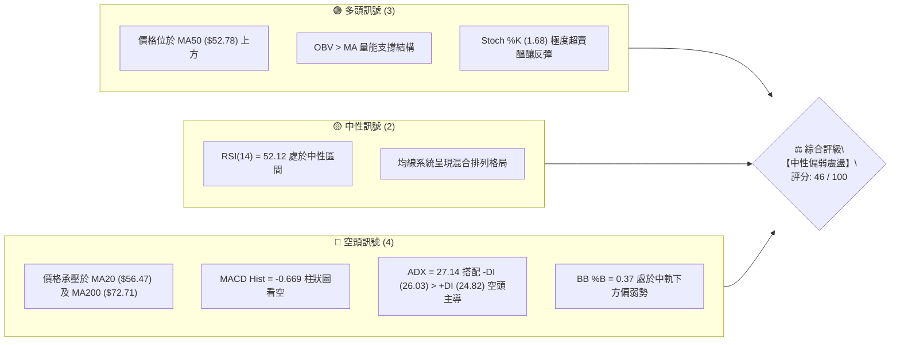
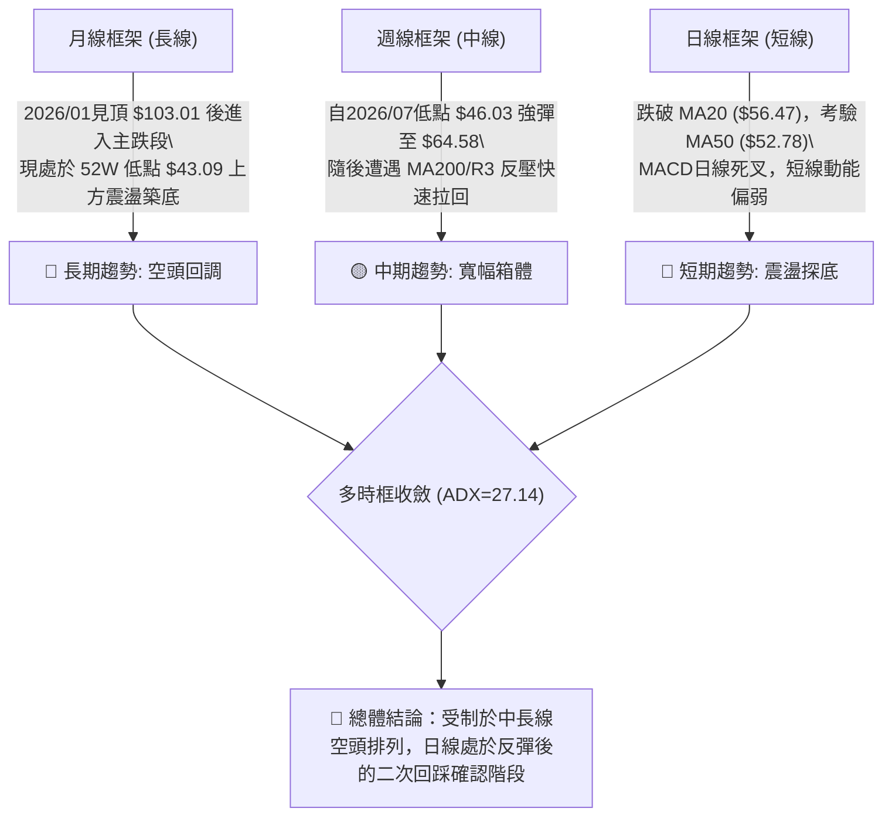
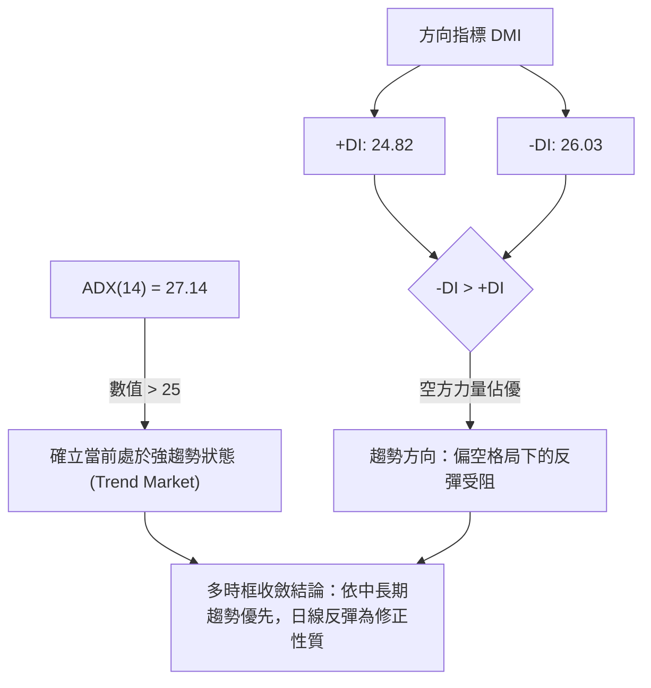
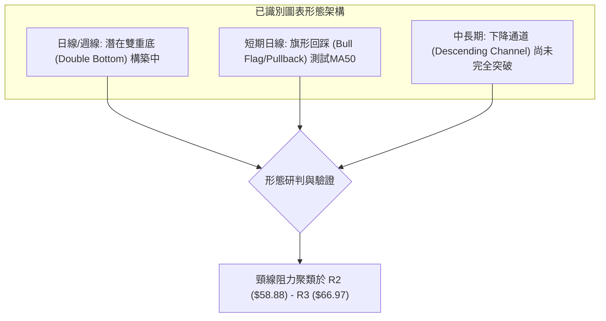
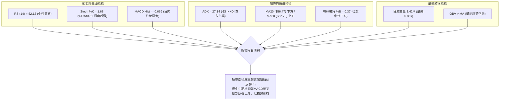
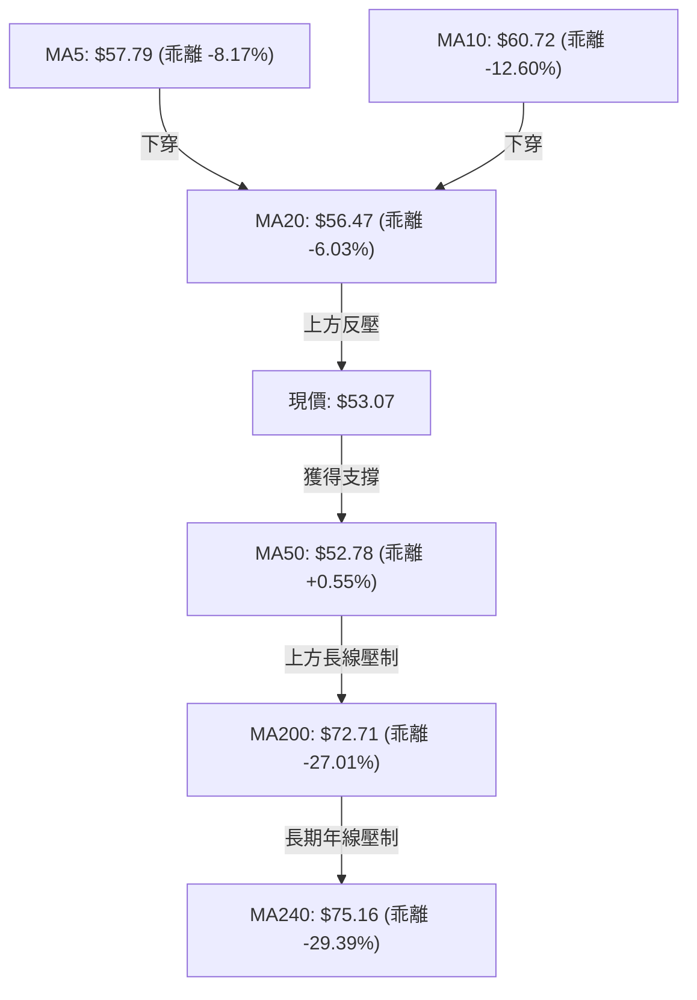
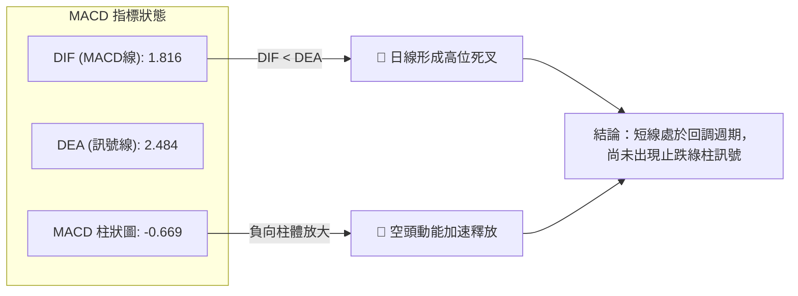
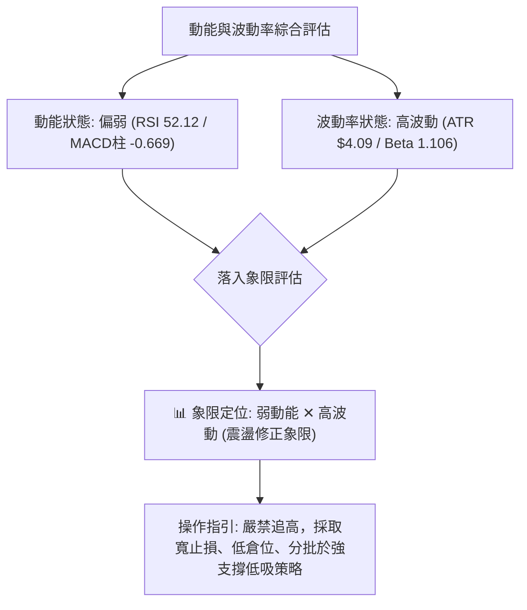
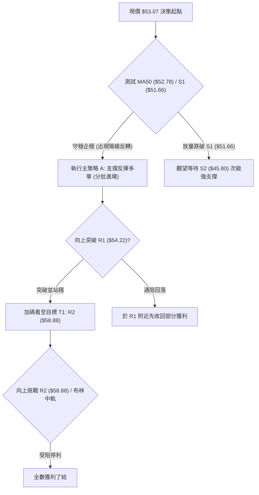
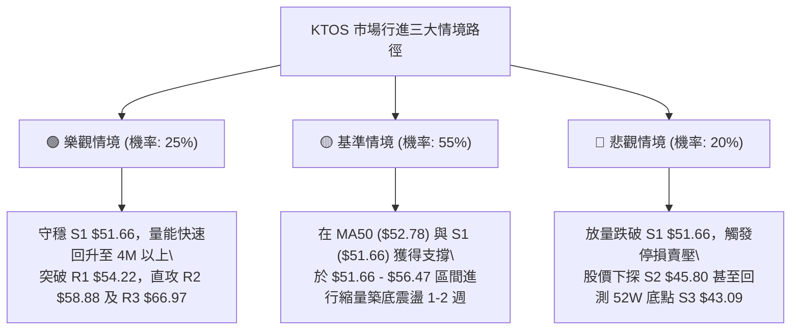

# KTOS 技術分析報告

> **報告日期**：2026-08-24 ｜ **語言**：繁體中文 ｜ **數據來源**：Yahoo Finance ｜ **當前價格**：$53.07

---

## 目錄

| 章節 | 內容 |
|------|------|
| [1. 技術面概覽](#1-技術面概覽) | 訊號儀表板、核心指標、評分卡 |
| [2. 趨勢分析](#2-趨勢分析) | 多時框趨勢、長中短期走勢 |
| [3. 圖表形態分析](#3-圖表形態分析) | 形態識別、K線組合、目標價 |
| [4. 支撐與阻力](#4-支撐與阻力) | 關鍵價位、斐波那契回調 |
| [5. 技術指標深度解讀](#5-技術指標深度解讀) | MA/RSI/MACD/布林/成交量 |
| [6. 動能與波動率](#6-動能與波動率) | 動能評估、ATR、Beta |
| [7. 多時框架總結](#7-多時框架總結) | 時框架評分矩陣 |
| [8. 交易策略建議](#8-交易策略建議) | 多空策略、風險報酬比 |
| [9. 風險提示與監控](#9-風險提示與監控) | 監控指標、風險場景 |

---

## 1. 技術面概覽

### 🎯 技術訊號儀表板



### 📊 核心指標速覽表

| 指標類別 | 指標名稱 | 當前數值 | 訊號 | 解讀 |
|----------|----------|----------|------|------|
| **價格** | 當前價格 | $53.07 | 🟡 | 位於52週區間11.0%之底部震盪區間 |
| **均線** | MA20 | $56.47 | 🔴 | 價格低於MA20（乖離率 -6.03%），短期承壓 |
| **均線** | MA50 | $52.78 | 🟢 | 價格站於MA50之上，短中期底部支撐有效 |
| **均線** | MA200 | $72.71 | 🔴 | 長期空頭壓制（乖離率 -27.01%），長期趨勢偏空 |
| **動能** | RSI(14) | 52.12 | 🟡 | 數值處於50中軸附近，動能暫無方向性爆發 |
| **動能** | MACD (12,26,9) | 1.816 / 2.484 (柱: -0.669) | 🔴 | MACD位於訊號線下方，柱狀圖負值擴大，短線走弱 |
| **動能** | Stoch %K / %D | 1.68 / 30.31 | 🟢 | %K進入深度超賣區，存在技術性抽頭反彈動能 |
| **趨勢** | ADX(14) / DMI | ADX: 27.14 / +DI: 24.82 / -DI: 26.03 | 🔴 | ADX>25確立趨勢行情，-DI壓制+DI，空方暫居主導 |
| **通道** | 布林通道 (20,2) | 區間 $42.93 - $70.02 (%B: 0.37) | 🟡 | 價格自上軌快速回落至中軌下方，通道寬度擴張 |
| **波動** | ATR(14) | $4.09 (佔股價 7.71%) | 🔴 | 日間波動度高，操作需嚴設風險緩衝空間 |
| **量能** | 成交量 / OBV | 日量 3,425,135 (量比 0.85x) / OBV > MA | 🟢 | 回檔呈現量縮格局，且中期OBV維持多頭架構 |

### 🏆 技術評分卡

```
╔══════════════════════════════════════════════════════════════╗
║              技術評分卡 — KTOS (2026-08-24)                 ║
╠══════════════════════════════════════════════════════════════╣
║ 趨勢強度 (ADX/DMI)   ████████░░░░░░░░░░░░  40/100  🔴 空方主導 ║
║ 動能指標 (RSI/MACD)  ████████░░░░░░░░░░░░  42/100  🔴 動能轉弱 ║
║ 支撐穩定度 (S1/S2)   ████████████░░░░░░░░  60/100  🟡 區間支撐 ║
║ 成交量配合 (OBV/VOL) ████████████░░░░░░░░  62/100  🟢 量縮回檔 ║
║ 形態完整度 (雙底初成)████████░░░░░░░░░░░░  40/100  🟡 構築階段 ║
║ 均線排列 (混合排列)  ██████░░░░░░░░░░░░░░  32/100  🔴 均線反壓 ║
╠══════════════════════════════════════════════════════════════╣
║ 綜合評分             █████████░░░░░░░░░░░  46/100  🟡 中性觀望 ║
╚══════════════════════════════════════════════════════════════╝
```

---

## 2. 趨勢分析

### 🌐 多時框趨勢分析



### 📈 長期趨勢 — 12個月走勢圖（Unicode）

```
KTOS 月線收盤走勢圖（2025-08 至 2026-08）
價格軸 ($)
$103.01 ┤                            ● (2026-01 波段峰頂)
$91.37  ┤        ● (2025-09)
$86.18  ┤                                ● (2026-02)
$75.91  ┤                    ● (2025-12)     ● (2026-03: $70.51)
$65.84  ┤● (2025-08)                             ● (2026-04: $63.05)
$53.07  ┤━━━━━━━━━━━━━━━━━━━━━━━━━━━━━━━━━━━━━━━━━━━━●← 現價 ($53.07)
$46.60  ┤                                                ● (2026-07)
        └────────────────────────────────────────────────────────────
         08/25 09/25 10/25 11/25 12/25 01/26 02/26 03/26 04/26 05/26 06/26 07/26 08/26
```

#### 走勢特徵分析表格

| 階段區間 | 起止價格 | 漲跌幅 | 趨勢特徵與量價結構 |
|----------|----------|--------|-------------------|
| **牛市主升段** (2025/08 - 2026/01) | $65.84 → $103.01 | +56.46% | 強勁多頭推進，量能放大，月K線連續攻頂，突破百元大關 |
| **空頭下殺段** (2026/01 - 2026/04) | $103.01 → $63.05 | -38.79% | 頂部快速獲利了結，週線連續跌破重要均線，量能分歧出逃 |
| **尋底盤跌段** (2026/04 - 2026/07) | $63.05 → $46.60 | -26.09% | 陰跌築底，創出52週波段低點 $43.09，成交量出現恐慌拋售後沉澱 |
| **築底反彈段** (2026/07 - 2026/08) | $46.60 → $53.07 | +13.88% | 8月中旬一度衝高至 $64.58 遇阻，目前回踩測試 MA50 支撐 |

### 📊 中期趨勢（週線分析）

```
KTOS 中期週線支撐與壓力結構
══════════════════════════════════════════════════════════════
$66.97 ────────────────────────────────────────── [強阻力 R3 / 前高密集成交區]
                 ▲ 2026-08-16 遇阻高點 $64.58
$58.88 ────────────────────────────────────────── [中軌阻力 R2 / MA20反壓區]
$54.22 ────────────────────────────────────────── [短線阻力 R1]
$53.07 ◄───【現價位於 MA50 $52.78 與 S1 $51.66 關鍵支撐帶】
$51.66 ────────────────────────────────────────── [波段支撐 S1]
$45.80 ────────────────────────────────────────── [次級強支撐 S2]
$43.09 ────────────────────────────────────────── [52週底部 S3]
══════════════════════════════════════════════════════════════
```

### ⚡ 趨勢強度評估（ADX 解讀）



#### ADX 強度與市場狀態對照

| 指標 | 數值 | 門檻標準 | 狀態評估 | 策略意涵 |
|------|------|----------|----------|----------|
| **ADX** | 27.14 | > 25.0 | 強趨勢行情 🟢 | 順勢操作為主，避免盲目逆勢抄底 |
| **+DI** | 24.82 | — | 多方進攻動能 | 較上週顯著回落，多頭推升力竭 |
| **-DI** | 26.03 | > +DI | 空方壓制佔優 🔴 | 空方掌控短線定價權，壓制反彈空間 |
| **趨勢判定** | **偏空強趨勢** | 25-50 區間 | 震盪偏空下跌趨勢 | 逢高阻力佈空或等待回踩企穩支撐 |

---

## 3. 圖表形態分析

### 🔍 形態識別系統



#### 圖表形態信心度評估表

| 形態名稱 | 信心度 | 判斷依據（引用數據） | 完成度 | 目標價（附精確計算式） |
|----------|--------|----------------------|--------|------------------------|
| **潛在雙重底 (W底)** | 55% 🟡 | 左底 2026/07/19 $46.03，右底 2026/08/02 $46.60（鄰近 S2 $45.80 / S3 $43.09），反彈最高達 $64.58 | 65% | 頸線阻力 R3 $66.97 - 形態低點 S2 $45.80 = 高度 $21.17。<br>向上突破目標價 = $66.97 + $21.17 = **$88.14**（接近50%回調位 $88.55） |
| **短期均線回踩形態** | 60% 🟡 | 股價自 2026/08/16 高點 $64.58 回落，目前正測試 MA50 ($52.78) 與 S1 ($51.66) 匯合區 | 80% | 若守穩 S1 $51.66，反彈第一目標為 R1 **$54.22**，第二目標為 R2 **$58.88** |
| **大型頭肩頂反轉** | 40% 🔴 | 2025/09 左肩 $91.37，2026/01 頭部 $103.01，2026/02 右肩 $86.18（已跌破頸線完成大幅度釋放） | 90% | 歷史跌幅已滿足波段低點 $43.09，目前處於破位後的低位修復期，不可作為新做空形態 |

### 🕯️ 重要K線形態分析

| 週度日期 | 收盤價 | K線形態 | 量價結構解讀 | 技術訊號 |
|----------|--------|---------|--------------|----------|
| **2026-06-28** | $47.21 | 恐慌長黑破位K | 成交量爆量至 45.38M，主力籌碼換手，探明波段極限低點 | 🔴 恐慌拋售 (Selling Climax) |
| **2026-07-05** | $55.35 | 破底翻長陽吞噬 | 帶量長紅吞噬前週實體，確認 $43.09-$46.00 為波段鐵底 | 🟢 強烈買進訊號 |
| **2026-08-09** | $60.77 | 帶量突破大陽K | 週漲幅達 30.4%，RSI 升至 74.1，強勢突破 MA20 與多條短天期均線 | 🟢 攻擊多頭確認 |
| **2026-08-16** | $64.58 | 高位流星倒錘K | 創反彈新高後留長上影線，MACD 柱達 +1.743 高位，多頭攻勢遇阻 | 🟡 短線見頂預警 |
| **2026-08-23** | $57.17 | 中長黑回吐K | 吞噬前週部分漲幅，週成交量萎縮至 16.78M，獲利盤湧出回吐 | 🔴 短線修正延續 |
| **2026-08-30** | $53.07 | 測試MA50下影K | 成交量顯著萎縮至 3.42M，價格測試 MA50 ($52.78)，空方動能減弱 | 🟡 止跌測試訊號 |

### 📉 ASCII 走勢形態示意圖

```
KTOS 日/週線潛在雙底與回踩測試結構
$66.97 ┤                             ┌─── 頸線壓力位 R3 ($66.97)
$64.58 ┤                       ●     │    (2026-08-16 波段反彈高點)
       │                      / \    │
$58.88 ┤                     /   \   ├─── 中軌反壓位 R2 ($58.88)
$56.47 ┤                    /     \  ├─── MA20 反壓 ($56.47)
$53.07 ┤                   /       ● ├─── 現價 ($53.07) 正在測試
$52.78 ┤                  /        ▲ ├─── MA50 ($52.78) / S1 ($51.66)
$46.60 ┤          ●      /           └─── 右底支撐 (2026-08-02)
$46.03 ┤   ●     / \    /
$43.09 ┴───┴─────┴───┴─────────────────── 52週絕對底部 S3 ($43.09)
         左底(07/19) 右底(08/02)  現階段回踩
```

### 🎯 形態目標價計算

```
╔══════════════════════════════════════════════════════════════╗
║              雙底 (Double Bottom) 形態目標測算               ║
╠══════════════════════════════════════════════════════════════╣
║ 形態底點基準 (S2 / 波段低點):   $45.80                       ║
║ 形態頸線位置 (R3 / 波段高點):   $66.97                       ║
║ 垂直形態高度 (Height) = $66.97 - $45.80 = $21.17              ║
║                                                              ║
║ 1. 第一目標價 (T1): 突破頸線確認點 = $66.97                  ║
║ 2. 形態測幅滿載目標 (T2) = $66.97 + $21.17 = $88.14          ║
║    (精確對應 52週斐波那契 50.0% 回調位 $88.55)               ║
║                                                              ║
║ 註：若跌破 S1 ($51.66)，形態將退化為 $45.80 - $58.88 區間震盪║
╚══════════════════════════════════════════════════════════════╝
```

---

## 4. 支撐與阻力

### 🗺️ 關鍵價位分布圖（Unicode）

```
KTOS 價位結構分布圖
═════════════════════════════════════════════════════════════════
$66.97 ║██████████████████████████████║ 強阻力 R3 (形態頸線 / +26.18%)
$62.54 ║▓▓▓▓▓▓▓▓▓▓▓▓▓▓▓▓▓▓▓▓          ║ 斐波那契 78.6% 回調位
$58.88 ║████████████████████          ║ 關鍵阻力 R2 (波段高點 / +10.95%)
$56.47 ║▒▒▒▒▒▒▒▒▒▒▒▒▒▒                ║ 日線 MA20 / 布林中軌反壓
$54.22 ║████████████                  ║ 短線阻力 R1 (+2.17%)
═══════╬══════════════════════════════╬═════════════════════════
$53.07 ╠══════════════════════════════╣ ◄─── 當前現價 ($53.07)
═══════╬══════════════════════════════╬═════════════════════════
$52.78 ║▒▒▒▒▒▒▒▒▒▒                    ║ 日線 MA50 均線動態支撐
$51.66 ║▓▓▓▓▓▓▓▓▓▓▓▓▓▓▓▓              ║ 近期波段關鍵支撐 S1 (-2.66%)
$45.80 ║████████████████████████      ║ 強支撐 S2 (雙底右腳 / -13.71%)
$43.09 ║██████████████████████████████║ 52週絕對底部 S3 (-18.81%)
═════════════════════════════════════════════════════════════════
```

### 🚧 阻力位分析表

| 阻力級別 | 精確價位 | 距現價幅幅 | 形成原因與籌碼特徵 | 突破難度 | 重要性 |
|----------|----------|------------|--------------------|----------|--------|
| **R1** | **$54.22** | +2.17% | 近一年波段高點聚類位，短線套牢盤解套賣壓區 | 🟡 中等 | 短線轉強樞紐點 |
| **R2** | **$58.88** | +10.95% | 近期反彈中繼高點，與 MA20 ($56.47) 形成共振反壓帶 | 🔴 較高 | 中期多空分水嶺 |
| **R3** | **$66.97** | +26.18% | 2026/08 反彈頂部高點聚類，亦為大型雙底結構之頸線阻力 | 🔴 極高 | 波段牛熊轉換關鍵位 |

### 🛡️ 支撐位分析表

| 支撐級別 | 精確價位 | 距現價幅幅 | 形成原因與籌碼特徵 | 守住機率 | 重要性 |
|----------|----------|------------|--------------------|----------|--------|
| **S1** | **$51.66** | -2.66% | 近期日線回調低點聚類，緊鄰 MA50 ($52.78)，具備雙重支撐效應 | 70% 🟢 | 短線多頭防守底線 |
| **S2** | **$45.80** | -13.71% | 近一年波段低點聚類，7月雙底型態之底部密集籌碼換手區 | 85% 🟢 | 中期強烈結構支撐 |
| **S3** | **$43.09** | -18.81% | 52週絕對歷史低點，機構法人重度防守之估值鐵底 | 95% 🟢 | 長期終極防守線 |

### 📐 斐波那契回調位分析

依據 52 週完整波動區間（高點 **$134.00** 至低點 **$43.09**，落差 $90.91）計算：

```
斐波那契回調位階梯 (52W 區間: $43.09 → $134.00)
┌─────────────────────────────────────────────────────────────┐
│ 0.0%  (52W High)  $134.00  ▓▓▓▓▓▓▓▓▓▓▓▓▓▓▓▓▓▓▓▓▓▓▓▓▓▓▓▓▓▓▓ │
│ 23.6%             $112.55  ▓▓▓▓▓▓▓▓▓▓▓▓▓▓▓▓▓▓▓▓▓           │
│ 38.2%             $ 99.27  ▓▓▓▓▓▓▓▓▓▓▓▓▓▓▓▓                │
│ 50.0%             $ 88.55  ▓▓▓▓▓▓▓▓▓▓▓▓▓                   │
│ 61.8% (黃金分割)  $ 77.82  ▓▓▓▓▓▓▓▓▓▓                      │
│ 78.6% (深度回撤)  $ 62.54  ▓▓▓▓▓▓                          │
│ ───────────────── 現價 $53.07 ────────────────────────────── │
│ 100.0% (52W Low)  $ 43.09  ▓                               │
└─────────────────────────────────────────────────────────────┘
```

#### 斐波那契層級深度解讀

1. **當前位置評估**：現價 **$53.07** 處於 78.6% 回調位 ($62.54) 與 100.0% 底部 ($43.09) 之間的極深回撤區域（位於52週區間僅 11.0% 位置）。
2. **阻力壓制意涵**：上方最近的斐波那契關鍵位為 78.6% ($62.54)，該位置與 2026-08-16 的高點 $64.58 高度重合，印證該區域為極強阻力帶。
3. **長期修復目標**：若能向上突破 $62.54 並確認雙底，則黃金分割位 61.8% ($77.82) 與 50.0% ($88.55) 將成為中長線波段修復的核心目標位。

---

## 5. 技術指標深度解讀

### 🎛️ 指標訊號總覽



### 📈 移動平均線排列分析



#### 移動平均線詳細狀態矩陣

| 均線名稱 | 當前價格 | 與現價乖離率 | 排列狀態 | 趨勢解讀 |
|----------|----------|--------------|----------|----------|
| **MA 5** | $57.79 | -8.17% | 快速下行 🔴 | 短線急跌乖離過大，存在技術性收斂修復需求 |
| **MA 10** | $60.72 | -12.60% | 轉折向下 🔴 | 短期壓制線，若反彈至此將遭遇短線獲利盤與解套盤阻力 |
| **MA 20** | $56.47 | -6.03% | 下行彎頭 🔴 | 日線生命線轉為阻力，現價處於其下方，短多受到壓制 |
| **MA 50** | $52.78 | +0.55% | 走平向上 🟢 | 中期防守均線，現價站於其上，多頭最後的重要防線 |
| **MA 60** | $53.96 | -1.66% | 走平 🟡 | 與現價極度接近，多空在 $53.00-$54.00 密集換手 |
| **MA 120** | $62.14 | -14.59% | 下行 🔴 | 半年線持續下壓，限制中期反彈高度 |
| **MA 200** | $72.71 | -27.01% | 長期下行 🔴 | 牛熊分界線，確認大級別仍處於空頭市場修復期 |
| **MA 240** | $75.16 | -29.39% | 長期下行 🔴 | 年線下行，長期籌碼套牢沉重 |

### 📉 RSI(14) 分析

```
RSI(14) 儀表板
0 ──────────── 30 ────────────────── 50 ────── 52.12 ───────── 70 ─────────── 100
[  極度超賣區  ] [    弱勢偏空區    ]   ▲   [   強勢偏多區   ] [  極度超買區  ]
                                    │
                              當前 RSI = 52.12 (中性平衡)
進度條: ██████████░░░░░░░░░░  52.12%
```

- **超買超賣狀態**：RSI 自 8 月中旬的超買高點 76.7 快速降溫至目前的 **52.12**，已完全消化短線過熱情緒，落入中性健康區間。
- **背離判斷**：
  - **頂背離**：無。股價於 8 月中旬創出 $64.58 反彈新高時，RSI 亦同步創出 76.7 之波段新高，量價與動能協同。
  - **底背離**：無。當前股價回踩尚未跌破前低，指標未出現底背離訊號。
- **結論**：動能指標暫無趨勢方向引導，處於多空拉鋸平衡點。

### 📊 MACD(12,26,9) 訊號解讀



- **柱狀圖動態**：MACD Histogram 為 **-0.669**，連續數日負值擴張，顯示短期拋壓仍在釋放中。
- **零軸關係**：DIF (1.816) 與 DEA (2.484) 仍位於零軸上方，表示此波回調暫屬**多頭格局內的次級折返修正**，尚未破壞自 7 月底啟動的上升架構。

### 📦 布林通道分析

```
KTOS 布林通道 (20, 2) 結構圖
$70.02 ┬────────────────────────────────────────── 布林上軌 (Upper Band)
       │
$56.47 ┼────────────────────────────────────────── 布林中軌 (MA20 - 阻力)
       │             ● 現價 $53.07 (%B = 0.37)
$52.78 ┼┈┈┈┈┈┈┈┈┈┈┈┈┈┈┈┈┈┈┈┈┈┈┈┈┈┈┈┈┈┈┈┈┈┈┈┈┈┈┈┈┈┈ MA50 支撐
       │
$42.93 ┴────────────────────────────────────────── 布林下軌 (Lower Band)
```

- **通道帶寬與位置**：上軌 **$70.02**，中軌 **$56.47**，下軌 **$42.93**。帶寬擴張至 $27.09，顯示波動率顯著放大。
- **%B 指標解析**：%B 為 **0.37**，表明價格已跌破中軌（0.50）並向通道下半部靠攏，空方佔據短線通道優勢，若無法迅速收復 $56.47，價格將持續受制於中軌下行壓制。

### 💹 成交量分析（量價配合度）

```
成交量均線量比體系
最新日量: 3,425,135  (████████░░░░░░░░░░░░ 85.3%)
20日均量: 4,012,242  (██████████░░░░░░░░░░ 100.0%)
50日均量: 4,625,947  (████████████░░░░░░░░ 115.3%)
```

- **量比與價跌關係**：最新成交量為 3.42M，相對於 20 日均量量比僅 **0.85x**。股價回調伴隨成交量顯著萎縮，呈現標準的「**價跌量縮**」健康洗盤特徵，未見機構恐慌出逃跡象。
- **OBV 能量潮判斷**：數據明確顯示「**OBV > MA → 量能支撐上漲**」。OBV 維持在均線上方，顯示自 7 月以來的資金流入趨勢未被逆轉，中線量能結構依舊支撐多頭防守反擊。

---

## 6. 動能與波動率

### ⚡ 動能評估



#### 動能評估四象限定位表

| 象限 | 動能維度 | 波動維度 | KTOS 當前定位 | 戰術意涵與操作建議 |
|------|----------|----------|:-------------:|--------------------|
| **Q1** | 強動能 (Bullish) | 低波動 (Low Vol) | — | 趨勢穩健推升，最理想的加碼順勢持有期 |
| **Q2** | 弱動能 (Bearish) | 低波動 (Low Vol) | — | 沉悶牛皮整理，觀望並等待方向突破 |
| **Q3** | 強動能 (Bullish) | 高波動 (High Vol) | — | 主升加速段，高風險高收益，適合突破動量交易 |
| **Q4** | **弱動能 (Bearish)** | **高波動 (High Vol)** | **✓ (定位於此)** | **寬幅洗盤震盪，假突破多，宜在 S1/S2 逢低埋伏** |

### 📊 ATR 波動率分析

```
ATR(14) 波動度評估
當前 ATR: $4.09 ｜ 佔股價比率: 7.71% ｜ 波動等級: 🔴 極高波動
─────────────────────────────────────────────────────────────
風控止損距離模型建議：
├─ 激進型 (1.0 × ATR): 止損距 $4.09  (現價下方 $48.98)
├─ 標準型 (1.5 × ATR): 止損距 $6.14  (現價下方 $46.93，覆蓋 S2 $45.80 上緣)
└─ 保守型 (2.0 × ATR): 止損距 $8.18  (現價下方 $44.89，有效防禦 S2 $45.80)
```

- **實戰意涵**：日均波幅達 $4.09，代表日內常態波動極大。若交易者使用過窄的止損（如 < $2.00），極易被日常噪聲洗出場。建議任何多單進場止損距離至少應保留 1.5 倍 ATR。

### 📐 Beta 與市場相關性

- **Beta 係數**：**1.106**（相對於 S&P 500 基準）。
- **市場特徵解讀**：Beta > 1.0 表明 KTOS 對整體大盤波動具有放大的彈性。在市場風險偏好回升時具備超越大盤的進攻力，但在大盤回調或避險情緒升溫時，其回調幅度通常比大盤高出約 10.6%。

---

## 7. 多時框架總結

### 📋 時框架評分表

| 時框架 | 趨勢方向 | 動能狀態 | 均線排列 | 關鍵形態 | 評分 | 戰術建議 |
|--------|----------|----------|----------|----------|:----:|----------|
| **月線 (長線)** | 🔴 空頭修復 | 🟡 中性平穩 | 空頭壓制 (MA200下行) | 百元回落深幅回撤 | 35/100 | 長線資金僅宜定期定額分批於底部建倉 |
| **週線 (中線)** | 🟡 寬幅箱體 | 🟢 正向修復 | 突破MA50/承壓MA200 | 雙底構築中 ($45.80-$66.97) | 58/100 | 箱體邊緣操作，依支撐阻力做高拋低吸 |
| **日線 (短線)** | 🔴 震盪回踩 | 🔴 空方主導 | 跌破MA20/回測MA50 | 短期旗形回調 / 超賣抽頭 | 45/100 | 等待日線回踩 MA50/S1 企穩K線確認 |

### 🔲 綜合訊號矩陣

```
訊號一致性交叉檢驗表
══════════════════════════════════════════════════════════════
維度            長線 (月線)      中線 (週線)      短線 (日線)      一致性評估
──────────────────────────────────────────────────────────────
趨勢方向        空頭修復 🔴      寬幅震盪 🟡      短線回踩 🔴      長短偏空，中期築底
動能強弱        弱勢 🔴          回升 🟢          衰退 🔴          動能分歧，處於洗盤
量能配合        量縮 🟡          放量反彈 🟢      回調縮量 🟢      量價配合整體偏良性
關鍵支撐阻力    S3 $43.09        S2 $45.80        S1 $51.66        多層次支撐保護清晰
══════════════════════════════════════════════════════════════
```

### ⚖️ 多時框收斂結論

依「多時框收斂規則」進行嚴格定性：
1. **趨勢/盤整行情判定**：ADX(14) = **27.14 (> 25)** 確立當前市場具備強烈趨勢性，且 -DI (26.03) > +DI (24.82)，表明空方在主導當前的回撤趨勢。
2. **時框優先級收斂**：以中長期（週線/MA50、MA200）方向為主導。週線自 7 月底部反彈後，正處於「**中級反彈波的回踩確認段**」。日線跌破 MA20 但緊鄰 MA50 ($52.78)，屬於反彈中的良性回踩，並非主跌段重啟。
3. **方向性最終結論**：**【中性觀望，偏多防守反擊】**。短線雖然動能看空，但鑒於價格逼近 S1 ($51.66) / MA50 重支撐，且成交量大幅萎縮、Stoch 極度超賣，**主策略方向定為：依託 S1 支撐帶佈局區間反彈多單，以布林通道中軌與阻力位為目標**。

---

## 8. 交易策略建議

### 🗺️ 策略決策流程圖



### 🧭 策略路由

> **當前主策略方向 = 區間偏多操作（依評分 46/100，定位為中性箱體下緣防守反彈）**
> 
> 依據多時框收斂原則，雖然綜合評分處於中性區間（46/100），但因現價 $53.07 緊貼 MA50 ($52.78) 與 S1 ($51.66)，且 Stoch 處於 1.68 極度超賣區，空單在現價追空盈虧比極差；因此**主推在支撐位上方逢低分批佈局的反彈多頭策略**。

### 🎯 價格情境階梯（Price Scenarios）

| 觸發條件 | 第一目標 | 第二目標 | 後續延伸 | 情境技術含義 |
|----------|----------|----------|----------|--------------|
| **強勢突破 R1 ($54.22)** | R2 **$58.88** | R3 **$66.97** | 斐波 78.6% **$62.54** | 短線回調結束，重啟第二波雙底反彈攻擊 |
| **守穩 MA50 / S1 ($51.66)** | R1 **$54.22** | MA20 **$56.47** | R2 **$58.88** | 於 $51.66 - $56.47 區間進行縮量築底震盪 |
| **放量跌破 S1 ($51.66)** | S2 **$45.80** | S3 **$43.09** | 52W低點 **$43.09** | 回踩失敗，重新下探測試 7 月大底雙腳支撐 |

### 📊 情境機率分佈

```
情境機率分佈圖
繼續反彈向上 (突破 R1)   ████████████████████░░░░░  50%
區間窄幅震盪 (S1 - R1)   ████████████░░░░░░░░░░░░░  30%
破位回落探底 (跌破 S1)   ████████░░░░░░░░░░░░░░░░░  20%
```

| 情境預測 | 機率 | 主要依據與指標支撐 |
|----------|:----:|--------------------|
| **守穩反彈 (向 R1/R2 推進)** | **50%** | OBV 趨勢向上、Stoch 極度超賣 (1.68)、成交量回調縮量、MA50 動態支撐有效。 |
| **區間震盪 (於 $51.66-$54.22 整理)** | **30%** | ADX 處於偏空格局 (-DI > +DI)、MACD 負柱狀圖壓制，短線多空在此均衡換手。 |
| **破位再探 (回測 S2 $45.80)** | **20%** | 若大盤劇烈回調跌破 MA50，空頭慣性將迫使股價回踩前低雙底支撐 S2。 |

### 🟢 主策略詳情

本報告制定兩套互補之交易策略：**策略 A（現價逢低佈局型）** 與 **策略 B（突破確認追擊型）**。所有價位嚴格引用關鍵支撐與阻力數據。

| 策略要素 | 策略 A：支撐逢低低吸策略（左側偏多） | 策略 B：突破短線加碼策略（右側順勢） |
|----------|-------------------------------------|-------------------------------------|
| **進場條件** | 股價回踩 S1 ($51.66) 附近企穩，日K見下影線 | 日線收盤價帶量突破短線阻力 R1 ($54.22) |
| **進場價格** | **$52.00 - $53.07**（現價分批掛單） | **$54.30**（突破 R1 後回踩確認買進） |
| **目標價 T1** | **$56.47** (MA20 / 布林中軌) | **$58.88** (關鍵阻力 R2) |
| **目標價 T2** | **$58.88** (關鍵阻力 R2) | **$66.97** (形態頸線強阻力 R3) |
| **止損價格** | **$49.90** (實質跌破 S1 $51.66 緩衝區) | **$51.60** (跌回 S1 關鍵支撐下方) |
| **風險空間** | 約 $3.17 (以 $53.07 入場計) | 約 $2.70 (以 $54.30 入場計) |
| **報酬空間 (T2)**| 約 $5.81 (獲利空間 +10.95%) | 約 $12.67 (獲利空間 +23.33%) |
| **風險報酬比** | **1 : 1.83** 🟢 | **1 : 4.69** 🟢 (極優) |
| **成功機率** | **55%** | **65%** |
| **建議倉位** | **10% - 15%** (輕倉防守) | **15% - 20%** (確認突破後加碼) |

### 🔴 反向風險觸發點（對沖提示）

- **全面停損轉空點**：若日K線以實體長黑跌破 **S1 ($51.66)** 且成交量放大，代表雙底回踩失敗，主策略多單必須**無條件全員止損離場**。
- **做空對沖參考**：跌破 $51.66 後，空方下一目標直指 **S2 ($45.80)** 與 **S3 ($43.09)**，激進交易者可於跌破時反手順勢佈空，止損設於 $53.00。

### ⭐ 整體訊號強度評星

```
╔══════════════════════════════════════════════════════════════╗
║ 做多訊號強度：★★★☆☆  (3.0/5星 - 處於超賣支撐區，具盈虧比優勢) ║
║ 做空訊號強度：★★☆☆☆  (2.0/5星 - 下方支撐密布且量縮，追空風險高)║
║ 整體可信度：  ★★★★☆  (4.0/5星 - 價位聚類清晰，量價結構吻合)   ║
╚══════════════════════════════════════════════════════════════╝
```

---

## 9. 風險提示與監控

### ✅ 關鍵監控指標 Checklist

```
╔══════════════════════════════════════════════════════════════╗
║              KTOS 每日盤面關鍵監控清單 (Checklist)           ║
╠══════════════════════════════════════════════════════════════╣
║ [ ] 支撐防守：收盤價是否嚴格守在 S1 ($51.66) 及 MA50 之上？   ║
║ [ ] 阻力突破：盤中能否帶量突破 R1 ($54.22) 並站穩 30 分鐘？   ║
║ [ ] 動能轉向：MACD Histogram 是否出現縮頭收窄（負值縮小）？   ║
║ [ ] 擺盪修復：Stoch %K 是否自超賣區 1.68 向上黃金交叉 %D？     ║
║ [ ] 量能異動：單日成交量是否放大至 20 日均量 (4.01M) 以上？   ║
║ [ ] 均線生命：股價能否於 3 日內重新挑戰並站上 MA20 ($56.47)？ ║
╚══════════════════════════════════════════════════════════════╝
```

### ⚠️ 風險場景分析



### 🛡️ 風險管理重要提醒

1. **高 ATR 波動風控原則**：
   - 當前 KTOS 的 ATR(14) 高達 **$4.09**（佔股價 7.71%）。單日波動劇烈意味著任何進場必須嚴格控制單筆最大虧損不超過總帳戶資金的 1.0% - 1.5%。
   - 根據 1.5 倍 ATR 止損模型，防守空間需保留至少 $5.00 - $6.00 的餘裕，不可過度放大槓桿。
2. **籌碼與機構評級背離風險**：
   - 雖然華爾街分析師共識給予 `strong_buy` 評級，目標價均值達 **$105.62**（甚至最高達 $150.00），且機構持股比例高達 **85.4%**；但技術面上長線均線（MA200 = $72.71）仍維持下行壓制。
   - **嚴格紀律**：切勿因基本面與分析師高目標價而忽視技術面跌破支撐的止損訊號。技術面破位時必須嚴格執行風控。

---

## 📋 報告總結

```
╔══════════════════════════════════════════════════════════════╗
║                 KTOS 技術分析報告核心總結                    ║
╠══════════════════════════════════════════════════════════════╣
║ 報告日期：2026-08-24                                         ║
║ 當前價格：$53.07                                             ║
║ 分析評級：⚖️ 【中性觀望 / 區間偏多防守】 (評分: 46/100)        ║
║                                                              ║
║ 關鍵技術維度結論：                                           ║
║ ├─ 長期趨勢：🔴 空頭主跌後的大級別修復期 (受制於 MA200)      ║
║ ├─ 中期趨勢：🟡 雙重底形態構築階段 ($45.80 - $66.97 箱體)     ║
║ ├─ 短期趨勢：🔴 反彈遇阻後的次級回踩，考驗 MA50 支撐有效性   ║
║ ├─ 關鍵支撐：S1 $51.66 ｜ S2 $45.80 ｜ S3 $43.09 (52W底)      ║
║ ├─ 關鍵阻力：R1 $54.22 ｜ R2 $58.88 ｜ R3 $66.97 (形態頸線)  ║
║ └─ 華爾街共識目標價：$105.62 (低標: $60.00 / 高標: $150.00) ║
║                                                              ║
║ 最優交易策略組合：                                           ║
║ 1. 🥇 最佳機會：於 S1 ($51.66) - $53.07 區間輕倉低吸，        ║
║                 博弈超賣反彈，目標看至 R2 ($58.88)，止損$49.90║
║ 2. 🥈 順勢機會：等待日K帶量實體突破 R1 ($54.22) 後右側跟進， ║
║                 目標直指 R3 ($66.97)，風報比高達 1:4.69      ║
║ 3. 🥉 防守策略：若帶量跌破 S1 ($51.66)，多單全數離場觀望，   ║
║                 耐心等待股價回落至 S2 ($45.80) 附近再行評估  ║
╚══════════════════════════════════════════════════════════════╝
```

---

> ⚠️ **免責聲明**：本報告為技術分析研究成果，所有數據、圖表及價位推算均基於歷史量價與技術指標模型。本報告**僅供學術研究與投資參考**，**不構成任何形式的個人化投資建議或買賣邀約**。金融市場具有高度風險，投資人應獨立評估風險並自行承擔交易損益。

---

*報告生成時間：2026-08-24 ｜ 數據來源：Yahoo Finance ｜ 分析框架：多時框技術分析模型*