# KTOS 技術分析報告

> **報告日期**：2026-08-26 ｜ **語言**：繁體中文 ｜ **數據來源**：Yahoo Finance ｜ **當前價格**：$52.64

---

## 目錄

| 章節 | 內容 |
|------|------|
| [1. 技術面概覽](#1-技術面概覽) | 訊號儀表板、核心指標、評分卡 |
| [2. 趨勢分析](#2-趨勢分析) | 多時框趨勢、長中短期走勢、ADX解讀 |
| [3. 圖表形態分析](#3-圖表形態分析) | 形態識別、K線組合、形態信心度與目標價 |
| [4. 支撐與阻力](#4-支撐與阻力) | 關鍵價位結構、斐波那契回調位分析 |
| [5. 技術指標深度解讀](#5-技術指標深度解讀) | MA均線/RSI/MACD/布林通道/成交量與OBV |
| [6. 動能與波動率](#6-動能與波動率) | 動能象限、ATR波動分析、Beta與相關性 |
| [7. 多時框架總結](#7-多時框架總結) | 時框架矩陣、多時框收斂結論 |
| [8. 交易策略建議](#8-交易策略建議) | 策略路由、價格階梯、主策略詳情與風控 |
| [9. 風險提示與監控](#9-風險提示與監控) | 關鍵監控清單、風險情境與資金管理 |
| [📋 報告總結](#-報告總結) | 全文核心結論與操作指引摘要 |

---

## 1. 技術面概覽

### 🎯 技術訊號儀表板

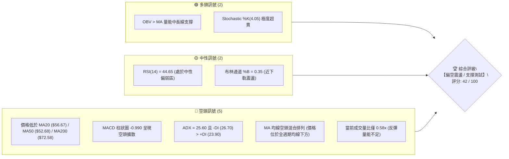

### 📊 核心指標速覽表

| 指標類別 | 指標名稱 | 當前數值 | 訊號 | 解讀 |
|----------|----------|----------|:----:|------|
| **價格位置** | 當前價格 | $52.64 | 🔴 | 位於52週區間 10.5% 低檔，距年高點 $134.00 大幅回撤 |
| **短期均線** | MA20 | $56.67 | 🔴 | 現價位於 MA20 下方 -7.12%，短線承壓 |
| **中期均線** | MA50 | $52.68 | 🔴 | 現價剛跌破 MA50（-0.08%），多空拉鋸關鍵位 |
| **長期均線** | MA200 | $72.58 | 🔴 | 現價位於 MA200 下方 -27.47%，長期趨勢偏空 |
| **超長期均線** | MA240 | $75.11 | 🔴 | 價格低於年線 -29.91%，形成上方沉重套牢壓力帶 |
| **擺動動能** | RSI(14) | 44.65 | 🟡 | 中性區間偏弱，無背離訊號，空頭佔據微幅優勢 |
| **趨勢動能** | MACD (12,26,9) | DIF: 1.247 / DEA: 2.237<br>Hist: -0.990 | 🔴 | 死亡交叉向下，柱狀圖負向擴散，動能走弱 |
| **超買超賣** | Stoch %K / %D | %K: 4.05 / %D: 15.49 | 🟢 | 進入極度超賣區（<20），短線存在技術性反彈契機 |
| **趨勢強度** | ADX (14) | 25.60 (+DI: 23.90, -DI: 26.70) | 🔴 | ADX > 25 確立趨勢行情，-DI 領先顯示空方主導趨勢 |
| **通道指標** | 布林帶 (%B) | 上軌 $69.85 / 中軌 $56.67 / 下軌 $43.50<br>%B: 0.35 | 🟡 | 價格運行於中下軌之間，有向 S1 ($51.66) 尋求支撐傾向 |
| **量能指標** | 成交量比 / OBV | 最新量: 2.33M (20日均量: 4.00M, 0.58x)<br>OBV > MA | 🟡 | 回落縮量，OBV 保持在均線上方，尚未出現恐慌拋售 |
| **波動幅度** | ATR(14) | $3.47 (佔股價 6.60%) | 🟡 | 每日波幅適中偏高，操作需保留足夠風控緩衝 |

### 🏆 技術評分卡

```
╔══════════════════════════════════════════════════════════════╗
║              技術評分卡 — KTOS (2026-08-26)                  ║
╠══════════════════════════════════════════════════════════════╣
║ 趨勢強度 (ADX & DI)   ████████░░░░░░░░░░░░  40/100  🔴 空方主導 ║
║ 動能指標 (RSI & MACD) ███████░░░░░░░░░░░░░  35/100  🔴 動能疲弱 ║
║ 支撐穩定度 (S1/S2/S3) ████████████░░░░░░░░  60/100  🟡 考驗S1   ║
║ 成交量配合 (OBV & Vol)██████████░░░░░░░░░░  50/100  🟡 縮量回測 ║
║ 形態結構 (Pattern)    ████████░░░░░░░░░░░░  40/100  🔴 旗形破位 ║
║ 均線排列 (MA System)  ██████░░░░░░░░░░░░░░  30/100  🔴 空頭混合 ║
╠══════════════════════════════════════════════════════════════╣
║ 綜合評分              ████████░░░░░░░░░░░░  42/100  偏空震盪   ║
╚══════════════════════════════════════════════════════════════╝
```

---

## 2. 趨勢分析

### 🌐 多時框趨勢分析

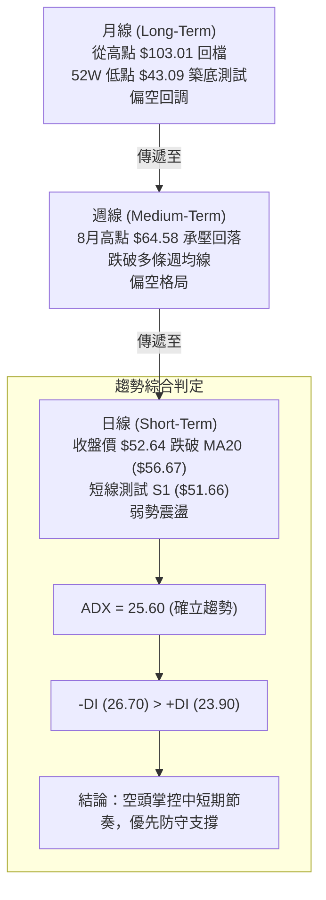

### 📈 長期趨勢 — 12個月走勢圖（Unicode）

KTOS 在過去 12 個月中經歷了劇烈的「倒 V 型」牛熊切換走勢：2025 年下半年受國防訂單與無人機題材推動，自 2025-08 的 $65.84 狂飆至 2026-01 的歷史高位區間（月收盤高達 $103.01，52週最高觸及 $134.00）；隨後估值修正與營運現金流承壓引發深度回調，2026-07 跌至波段低點 $46.60（52週最低 $43.09），目前 2026-08 反彈收在 $52.64。

```
KTOS 月線走勢圖（過去12個月：2025-09 至 2026-08）
價格 ($)
$105 ┤                                  ● $103.01 (2026-01 波段峰頂)
$95  ┤        ● $91.37   ● $90.60
$85  ┤                                           ● $86.18
$75  ┤                             ● $76.10 ● $75.91
$65  ┤  ● $65.84                                           ● $70.51  ● $64.13
$55  ┤                                                                ● $63.05          ● $52.64 (現價)
$45  ┤                                                                         ● $49.86 ● $46.60
     └────┬──────────┬──────────┬──────────┬──────────┬──────────┬──────────┬──────────┬──────────┬──────────┬──────────┬──────────┬────
       25-08      25-09      25-10      25-11      25-12      26-01      26-02      26-03      26-04      26-05      26-06      26-08
```

#### 走勢特徵分析表格

| 階段區間 | 月份週期 | 起始/結束價 | 漲跌幅 | 走勢特徵與量價表現 |
|:---|:---|:---:|:---:|:---|
| **主升攻擊浪** | 2025-08 ~ 2026-01 | $65.84 → $103.01 | **+56.46%** | 題材加速爆發，成交量急劇放大，衝至 52W 高點 $134.00 後形成天花板頂部 |
| **主跌下殺浪** | 2026-01 ~ 2026-04 | $103.01 → $63.05 | **-38.79%** | 連續 3 個月長黑摜破 MA20 與 MA50，機構資金大幅撤出，均線轉為下彎壓力 |
| **尋底盤整浪** | 2026-04 ~ 2026-07 | $63.05 → $46.60 | **-26.09%** | 跌勢減速但重心持續下移，於 2026-07 探底至 $46.60，逼近 52W 低點 $43.09 |
| **超跌反彈與回踩**| 2026-07 ~ 2026-08 | $46.60 → $52.64 | **+12.96%** | 8月中旬一度衝高至 $64.58 遇阻 R3/MA120 回落，目前拉回至 $52.64 測試 MA50 |

---

### 📊 中期趨勢（週線分析）

近 20 週數據顯示，KTOS 在 2026-06-28 爆出 45,383,700 股巨量並收在 $47.21，隨後在 $43.09~$46.03 區間構築底部。8 月上旬迎來強勁反彈，2026-08-16 攀升至 $64.58（RSI 觸及 76.7 超買區）。但隨後兩週迅速轉弱，2026-08-23 下跌至 $57.17，最新 2026-08-30 收盤於 $52.64，週 MACD 柱狀圖由正轉負（-0.990），顯示中期反彈動能遭遇強烈獲利了結賣壓。

```
中期週線支撐壓力結構示意圖
$66.97 ────────────────────────────────────────────── [強阻力 R3] (8月波段反彈頂部區)
$58.88 ────────────────────────────────────────────── [阻力 R2] (MA10 $59.61 & 密集成交區)
$54.22 ────────────────────────────────────────────── [短期阻力 R1] (近週震盪平台下緣)
$52.64 ══════════════════════════════════════════════ ◄ 現價 ($52.64)
$51.66 ---------------------------------------------- [即時支撐 S1] (近期波段低點聚類)
$45.80 ────────────────────────────────────────────── [關鍵支撐 S2] (7月密集底部區)
$43.09 ══════════════════════════════════════════════ [強支撐 S3 / 52W Low] (絕對多空防線)
```

---

### ⚡ 趨勢強度評估（ADX 解讀）

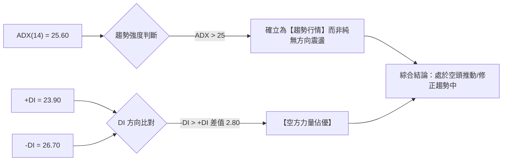

#### ADX 指標對照與解讀

| 指標參數 | 數值 | 狀態等級 | 技術意涵 |
|:---|:---:|:---:|:---|
| **ADX (14)** | **25.60** | 🟡 強趨勢門檻 ( > 25.0 ) | 指標剛跨越 25 臨界點，確認市場具備方向性趨勢，不可單純以區間振盪視之。 |
| **+DI (14)** | **23.90** | 🔴 弱於空方 | 多方攻擊意願受到壓制，自 8 月中旬高點後快速滑落。 |
| **-DI (14)** | **26.70** | 🔴 強於多方 | 空方掌控盤面發球權，賣壓正主導短期價格運行。 |
| **趨勢定性** | **空頭趨勢中繼** | 🔴 空方主導 | 依多時框收斂規則，ADX > 25 需以中長期週線/日線下行趨勢為依歸，日線反彈視為修正。 |

---

## 3. 圖表形態分析

### 🔍 形態識別系統

根據嚴格數據紀律與幾何特徵檢驗，KTOS 目前在日線與週線層面識別出兩大主要結構：

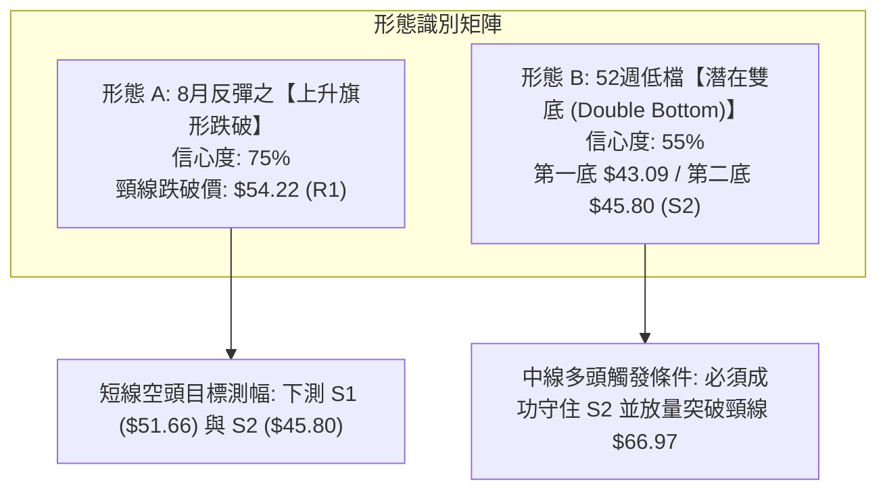

#### 形態信心度與參數評估表

| 識別形態 | 信心度 | 判斷依據（引用數據） | 完成度 | 形態量化與目標價（附計算式） |
|:---|:---:|:---|:---:|:---|
| **上升旗形向下跌破**<br>(Bearish Flag Breakdown) | **75%** | 價格自 $46.03 反彈至 $64.58 形成反彈旗形，隨後於 8/23~8/30 連續拉回，摜破旗形下軌及短期支撐 R1 ($54.22)。 | **85%** | 旗桿高點 $64.58 - 旗形低點 $54.22 = 旗高 $10.36。<br>跌破點 $54.22 - 旗高 $10.36 = **測幅目標 $43.86**（高度接近 S3 $43.09）。 |
| **潛在雙重底**<br>(Potential Double Bottom) | **55%** | 7月中旬低點 $46.03 與 52W 低點 $43.09 構成第一低點聚類；若本次拉回在 S2 ($45.80) 或 S1 ($51.66) 獲利買盤進駐，則形成雙底。 | **40%** | **尚未確立**。頸線位於波段高點聚類 **R3 ($66.97)**。<br>若突破 R3，形態高度 = $66.97 - $43.09 = $23.88。<br>向上目標 = $66.97 + $23.88 = **$90.85**（接近 2025-10 高點 $90.60）。 |

---

### 🕯️ 重要K線形態分析

| 週期/月份 | 收盤價 | K線形態 | 技術解讀 | 多空訊號 |
|:---|:---:|:---|:---|:---:|
| **2026-06 週線** | $47.21 | 爆量長下影十字星 (Hammer) | 單週成交 45.38M 股，探底 $43.09 後強力抽腳，確立 52W 低點為主力承接區。 | 🟢 強烈止跌 |
| **2026-08-16 週線**| $64.58 | 帶長上影倒錘頭 (Shooting Star)| 反彈觸及 MA120 ($61.83) 與 R3 ($66.97) 壓力區，多頭上攻乏力，引發獲利賣壓。 | 🔴 見頂反轉 |
| **2026-08-23 週線**| $57.17 | 中陰線實體包覆 (Bearish Engulfing)| 吞噬前週部分實體，跌破 MA20 ($56.67)，確認短線反彈動能衰竭。 | 🔴 空頭確認 |
| **2026-08-30 週線**| $52.64 | 連續下挫中陰線 (Three Black Crows partial)| 價格逼近 MA50 ($52.68) 與 S1 ($51.66)，空方力道延續，量能縮小至 5.76M 股。 | 🔴 弱勢整理 |

---

### 📉 ASCII 走勢形態示意圖

```
KTOS 8月反彈頂部受阻與旗形跌破形態 (週線層級)
價格 ($)
$66.97 ┼─────────────────────── ● 波段反彈頂點 ($64.58 / R3 阻力區)
       │                      ╱  ╲
$60.00 ┼                    ╱      ╲  ◄ 遭遇 MA10 ($59.61) 與 MA120 ($61.83) 反壓
       │      ╱╲          ╱          ╲
$54.22 ┼────╱────╲──────╱─────────────▼── [跌破旗形下軌 / R1 $54.22]
       │  ╱        ╲  ╱                ╲
$52.64 ┼─╱───────────▼───────────────────● 現價 ($52.64，考驗 S1 $51.66)
       │╱ (反彈起點 $46.03)                ╲
$45.80 ┼──────────────────────────────────── 潛在防守平台 [S2 $45.80]
       │
$43.09 ┴──────────────────────────────────────── [52W 低點 / S3 $43.09]
```

---

## 4. 支撐與阻力

### 🗺️ 關鍵價位分布圖（Unicode）

```
KTOS 價位結構分布圖（嚴格依據 OHLCV 聚類與斐波那契回調計算）
═══════════════════════════════════════════════════════════════════════════════
$134.00 ║████████████████████████████████████████║ 52週歷史最高點 (Fib 0.0%)
$112.55 ║████████████████████                    ║ Fib 23.6% 回調位
$99.27  ║████████████████████████████            ║ Fib 38.2% 回調位
$88.55  ║████████████████████████████████        ║ Fib 50.0% 多空中樞分水嶺
$77.82  ║████████████████████████                ║ Fib 61.8% 黃金分割強阻力
$72.58  ║██████████████████████                  ║ 長期均線 MA200 壓力位
$66.97  ║████████████████████████████████████████║ 強阻力 R3 (近一年波段高點聚類)
$62.54  ║██████████████████                      ║ Fib 78.6% 回調位
$58.88  ║████████████████████                    ║ 阻力 R2 (近一年波段高點聚類)
$54.22  ║████████████████████████████            ║ 關鍵阻力 R1 (跌破之支撐轉阻力)
$52.64  ╠════════════════════════════════════════╣ ◄ 當前收盤價 ($52.64)
$51.66  ║▓▓▓▓▓▓▓▓▓▓▓▓▓▓▓▓▓▓▓▓▓▓▓▓▓▓▓▓            ║ 即時支撐 S1 (近一年波段低點聚類)
$45.80  ║████████████████████████████████        ║ 強支撐 S2 (7月築底密集成交區)
$43.09  ║████████████████████████████████████████║ 絕對鐵底 S3 (52W Low / Fib 100.0%)
═══════════════════════════════════════════════════════════════════════════════
```

---

### 🚧 阻力位分析表

| 阻力級別 | 精確價位 | 距現價幅寬 | 形成原因（依據數據） | 突破難度 | 重要性評級 |
|:---|:---:|:---:|:---|:---:|:---:|
| **R1 (關鍵阻力)** | **$54.22** | **+3.00%** | 近期波段高點聚類；前波震盪平台下緣，跌破後轉化為即時上方反壓。 | 🟡 中等 | ★★★☆☆ |
| **R2 (波段阻力)** | **$58.88** | **+11.85%**| 近一年波段高點聚類；與 MA10 ($59.61)、MA20 ($56.67) 形成均線反壓共振帶。 | 🔴 較高 | ★★★★☆ |
| **R3 (強阻力)**   | **$66.97** | **+27.21%**| 近一年波段高點聚類；8月中旬反彈頂部 ($64.58) 之上重要天花板，雙底形態頸線位。| 🔴 極高 | ★★★★★ |

---

### 🛡️ 支撐位分析表

| 支撐級別 | 精確價位 | 距現價幅寬 | 形成原因（依據數據） | 守住機率 | 重要性評級 |
|:---|:---:|:---:|:---|:---:|:---:|
| **S1 (即時支撐)** | **$51.66** | **-1.86%** | 近一年波段低點聚類；MA50 ($52.68) 下方多頭第一道緩衝墊。 | 🟡 55% | ★★★☆☆ |
| **S2 (強支撐)**   | **$45.80** | **-13.00%**| 7月週線築底區間密集低點聚類；多方主力二次防守的核心壁壘。 | 🟢 70% | ★★★★☆ |
| **S3 (絕對鐵底)** | **$43.09** | **-18.14%**| 52週歷史最低點 (52W Low) 及斐波那契 100.0% 回調位；長線多頭生死線。 | 🟢 85% | ★★★★★ |

---

### 📐 斐波那契回調位分析

依據 52 週極值區間（最低點 **$43.09** 至 最高點 **$134.00**，總波幅 $90.91）計算之斐波那契回調位如下：

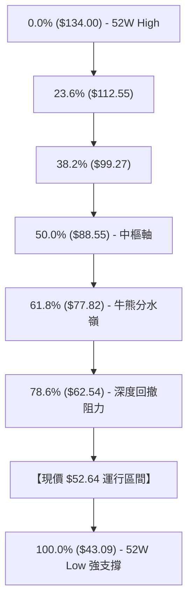

- **當前位置解讀**：現價 **$52.64** 處於 **78.6% 回調位 ($62.54)** 與 **100.0% 回調位 ($43.09)** 之間的「極度深度回撤區間」（已回吐全年度漲幅的 89.5%）。
- **技術意涵**：
  1. 股價處於 78.6%（$62.54）下方，表明中期多頭架構遭到破壞，市場已轉入熊市防守與低檔洗盤階段。
  2. 8月中旬股價最高反彈至 $64.58，恰好在 78.6% 回調位 $62.54 上方遇阻回落，確認該斐波那契水平具備強大的壓制力。
  3. 下方 100.0% 水平（$43.09）為該週期的終極支撐，只要 $43.09 不被有效摜破，大週期仍存在大型打底結構的技術可能。

---

## 5. 技術指標深度解讀

### 🎛️ 指標訊號總覽

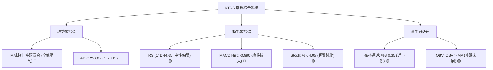

---

### 📈 移動平均線排列分析

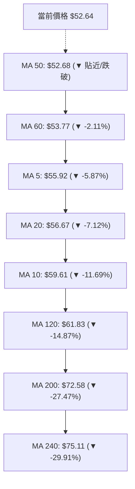

#### 均線系統詳細數據與評估

| 均線名稱 | 價位 | 乖離率 (Bias) | 趨勢方向 | 排列狀態與技術解讀 |
|:---|:---:|:---:|:---:|:---|
| **MA 5** | $55.92 | -5.87% | ▼ 下行 | 極短線快速下殺，形成陡峭反壓。 |
| **MA 10** | $59.61 | -11.69% | ▼ 下行 | 短期扣抵高價區，下行斜率擴大。 |
| **MA 20 (布林中軌)** | $56.67 | -7.12% | ▼ 下行 | 月線反轉下彎，短線反彈首要壓力帶。 |
| **MA 50** | $52.68 | -0.08% | 🟡 走平 | 價格正於 MA50 處爭奪，若收盤跌破將演變為全空頭排列。 |
| **MA 60** | $53.77 | -2.11% | ▼ 下行 | 季線下壓，限制短多反彈空間。 |
| **MA 120** | $61.83 | -14.87% | ▼ 下行 | 半年線持續走低，中長期套牢沉重。 |
| **MA 200** | $72.58 | -27.47% | ▼ 下行 | 牛熊分界線遠在現價上方，長期熊市特徵明顯。 |
| **MA 240** | $75.11 | -29.91% | ▼ 下行 | 年線斜率向下，整體均線呈空頭混合排列。 |

---

### 📉 RSI(14) 分析

```
RSI(14) 數值儀表板：
0 ───────[ 30 超賣 ]──────────[ 44.65 當前 ]───────────[ 70 超買 ]─────── 100
[████████████████████░░░░░░░░░░░░░░░░░░░░░░░░░░░] 44.65%
```

- **當前數值**：**44.65**（處於 30~70 常態區間內的中性偏弱水平）。
- **區間評估**：8月中旬 RSI 一度高達 **76.7**（嚴重超買），隨後兩週迅速跌落至 44.65，表明多頭動能消耗殆盡，空方賣壓重新掌控節奏。
- **背離分析**：
  - **頂背離**：無。8月中旬股價創反彈新高 $64.58 時，RSI 同步創反彈新高 76.7，量價指標同步。
  - **底背離**：無。當前價格拉回尚未引發 RSI 指標背離，屬於常規的動能回吐與均線回測走勢。

---

### 📊 MACD(12/26/9) 訊號解讀

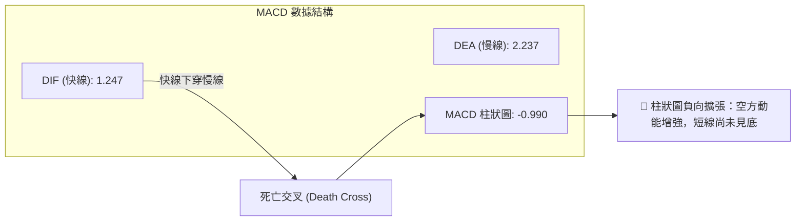

- **數值剖析**：DIF (1.247) < DEA (2.237)，兩線雖位於零軸上方，但快線陡峭下行並形成死叉。
- **柱狀圖趨勢**：MACD Histogram 為 **-0.990**，負值柱狀體較前週持續拉長，顯示修正動能仍處於主動釋放期，尚未出現收斂跡象。

---

### 📦 布林通道分析

```
KTOS 布林通道 (20日, 2.0σ) 結構示意圖
$69.85 ┬────────────────────────────────────────── [BB 上軌]
       │
$56.67 ┼────────────────────────────────────────── [BB 中軌 / MA20]
       │
$52.64 ┼─ ◄ 現價 ($52.64, %B = 0.35)
       │
$43.50 ┴────────────────────────────────────────── [BB 下軌]
```

- **通道參數**：
  - 上軌：**$69.85**
  - 中軌 (MA20)：**$56.67**
  - 下軌：**$43.50**
  - 通道寬度 (Bandwidth)：($69.85 - $43.50) / $56.67 = **46.50%**（寬幅震盪通道）
- **%B 指標分析**：
  $$\%B = \frac{52.64 - 43.50}{69.85 - 43.50} = \frac{9.14}{26.35} = \mathbf{0.35}$$
  %B 位於 0.35，表明價格已脫離中軌，運行於中軌與下軌之間的弱勢區間。由於通道帶寬較寬，價格向下滑行至下軌 $43.50（與 S3 $43.09 重合）的空間依然存在。

---

### 💹 成交量分析（量價配合度）

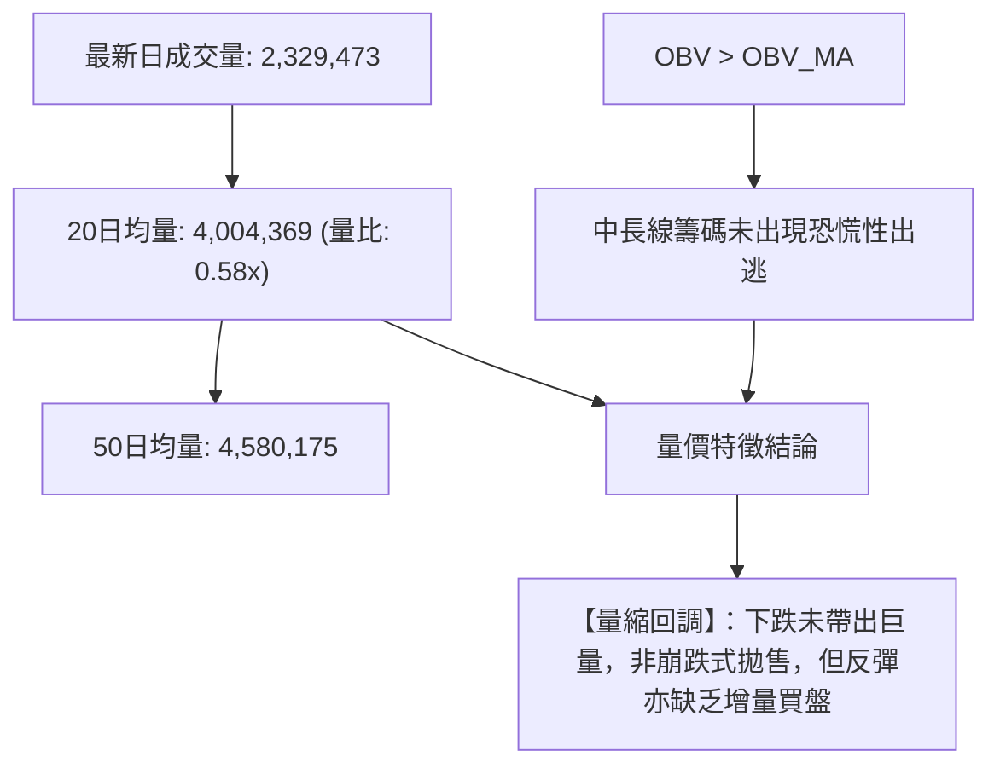

- **量比評估**：今日成交量僅 2.33M 股，量比為 **0.58x**，為典型的縮量整理格局。
- **OBV 趨勢**：指標顯示「OBV > MA」，表明從 6 月下旬爆出的 45.38M 股低檔進場資金，在中長線上尚未完全出清，為下方 S2 ($45.80) 與 S3 ($43.09) 提供了潛在的籌碼支撐。

---

## 6. 動能與波動率

### ⚡ 動能評估四象限

```
動能與波動率評估矩陣 (Momentum vs Volatility)
┌──────────────────────────────┬──────────────────────────────┐
│ Q3: 高動能 ‧ 高波動           │ Q1: 強動能 ‧ 低波動           │
│ (強勢突破/高風險高收益)       │ (健康多頭主升段/最佳買點)     │
│ 狀態：無                     │ 狀態：無                     │
├──────────────────────────────┼──────────────────────────────┤
│ Q4: 弱動能 ‧ 高波動           │ Q2: 弱動能 ‧ 中低波動         │
│ (劇烈殺跌/避免進場)           │ (震盪築底/防守觀望)           │
│ 狀態：8月中旬反彈見頂階段     │ 狀態：★ 當前 KTOS 所處象限    │
└──────────────────────────────┴──────────────────────────────┘
```

| 象限分類 | 動能強度 | 波動率等級 | 當前狀態吻合度 | 操作評估與技術指導 |
|:---|:---:|:---:|:---:|:---|
| **Q1 (最佳機會區)** | 強 (+DI主導) | 低/中 (通道收斂) | ❌ 否 | 需等待站穩 MA200 且均線多頭排列。 |
| **Q2 (謹慎觀望區)** | 弱 (-DI > +DI) | 中等 (ATR 6.6%) | **✓ 符合 (當前)** | **動能轉弱但回落縮量，適合防守型或區間操作。** |
| **Q3 (動量突破區)** | 強 (RSI > 60) | 高 (ATR > 8%) | ❌ 否 | 目前缺乏向上動能。 |
| **Q4 (高危拋售區)** | 極弱 (MACD大綠) | 高 (放量長黑) | ❌ 否 | 尚未出現恐慌性巨量破位。 |

---

### 📊 ATR 波動率分析

- **當前 ATR(14)**：**$3.47**
- **價格佔比**：$$\frac{\$3.47}{\$52.64} = \mathbf{6.60\%}$$
- **止損與風控距離建議**：
  - **保守型交易者 (2.0 × ATR)**：安全緩衝距需設為 $3.47 \times 2.0 = \mathbf{\$6.94}$（相對於現價約 13.2%）。
  - **短線交易者 (1.0 × ATR)**：止損緩衝距設為 $3.47 \times 1.0 = \mathbf{\$3.47}$（約 6.6%）。
  - **當前支撐匹配**：現價 $52.64 距離 S1 ($51.66) 僅 $0.98 (0.28 ATR)，極易被日常雜訊打穿；但距離關鍵支撐 S2 ($45.80) 為 $6.84 (約 1.97 ATR)，正好落在 2 倍 ATR 的安全防守邊界內。

---

### 📐 Beta 與市場相關性

- **Beta 係數**：**1.106**
- **技術解讀**：KTOS 的波動幅度比 S&P 500 大盤高出約 **10.6%**，具備中等偏高的進攻性與彈性。在大盤處於回檔期時，KTOS 往往跌幅加劇；而在防務軍工題材受到市場關注或大盤反彈時，其修復爆發力亦相對較強。

---

## 7. 多時框架總結

### 📋 時框架評分表

| 時框架 | 趨勢方向 | 動能狀態 (RSI/MACD) | 均線系統排列 | 形態特徵 | 評分 (1-100) | 核心建議 |
|:---|:---:|:---:|:---:|:---:|:---:|:---|
| **月線 (長期)** | 🔴 偏空修正 | 🟡 RSI 中性 / 深度回檔 | 🔴 跌破 12 個月均線帶 | 倒 V 型回落尋底 | **38 / 100** | 逢高減碼，長線未見底 |
| **週線 (中期)** | 🔴 空方主導 | 🔴 MACD柱轉負 (-0.99) | 🔴 受制於 MA10/MA120 | 上升旗形向下跌破 | **40 / 100** | 防守 S2 ($45.80) 支撐 |
| **日線 (短期)** | 🟡 弱勢震盪 | 🟢 Stoch 超賣 (%K 4.05) | 🔴 跌破 MA20，貼近 MA50 | 測試 S1 ($51.66) 支撐 | **48 / 100** | 嚴禁追空，防超賣反抽 |

---

### 🔲 綜合訊號矩陣

```
時框維度與指標共振分析：
┌──────────┬──────────────┬──────────────┬──────────────┬──────────────┐
│ 時框架   │ 均線趨勢 (MA)│ 擺動指標(RSI)│ 動能柱狀(MACD)│ 通道位置(BB) │
├──────────┼──────────────┼──────────────┼──────────────┼──────────────┤
│ 長期月線 │   🔴 看空    │   🟡 中性    │   🔴 看空    │   🟡 中軌下  │
│ 中期週線 │   🔴 看空    │   🔴 轉弱    │   🔴 看空    │   🟡 中軌下  │
│ 短期日線 │   🔴 看空    │   🟡 偏弱    │   🔴 看空    │   🟢 觸及下軌│
└──────────┴──────────────┴──────────────┴──────────────┴──────────────┘
訊號一致性評估：均線與趨勢動能全時框呈現【空方共振 (80%+)】，僅短線隨機指標出現超賣反抽訊號。
```

---

### ⚖️ 多時框收斂結論

依據多時框收斂規則（Rule 14）：
1. **趨勢/盤整定性**：當前 ADX(14) = **25.60 > 25**，且 -DI (26.70) > +DI (23.90)，系統判定當前處於**「空頭主導的趨勢行情」**，而非無方向的盤整震盪。
2. **時框主導權**：在趨勢行情下，中長期時框（週線/MA200）方向具有最高優先級。日線 Stoch 極度超賣（%K = 4.05）僅能視為短線跌勢可能放緩或出現技術性反抽的「進場時機訊號」，絕對不能推翻週線級別的空頭下行結構。
3. **最終收斂方向**：**【偏空震盪 / 逢高偏空或區間防守】**。日線若有反彈，遭遇阻力位 R1 ($54.22) 或 R2 ($58.88) 均為空方加壓點；多方唯有在關鍵支撐 S2 ($45.80) / S3 ($43.09) 獲得放量確認時方可輕倉博取反彈。

---

## 8. 交易策略建議

### 🗺️ 策略決策流程圖

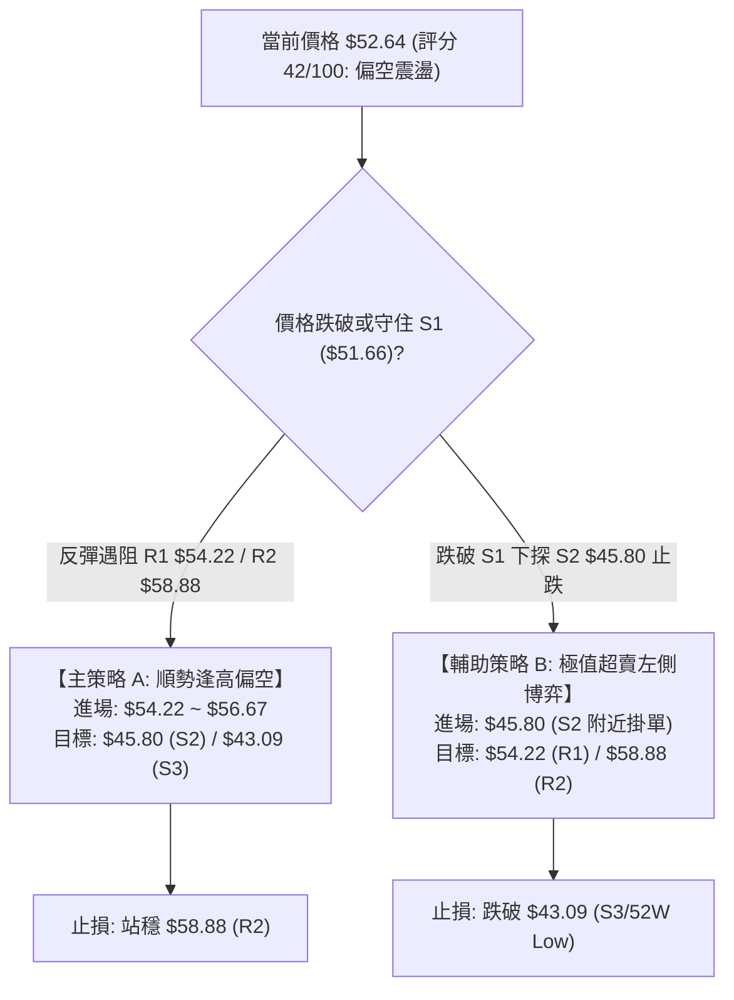

---

### 🧭 策略路由（依技術評分卡 42/100 定向）

> **當前主策略方向 = 【逢高偏空防守 / 支撐位區間操作】（依評分 42/100）**

因技術評分處於 40–60 偏空格局，策略主推**「反彈遇阻順勢做空（策略 A）」**，並提供**「關鍵強支撐 S2 超賣反彈做多（策略 B）」**作為低吸輔助備案。

---

### 🎯 價格情境階梯（Price Scenarios）

| 觸發條件 | 關鍵價位 | 下一目標 | 後續延伸 | 情境含義與操作指引 |
|:---|:---:|:---:|:---:|:---|
| **向上強勢突破** | 突破 R1 **$54.22** | R2 **$58.88** | R3 **$66.97** | 短線轉強，反彈挑戰 20 日與 50 日均線壓力帶。 |
| **區間震盪整理** | 守住 S1 **$51.66** | R1 **$54.22** | — | 於 $51.66 ~ $54.22 窄幅拉鋸，消化 Stoch 超賣動能。 |
| **向下破位下殺** | 跌破 S1 **$51.66** | S2 **$45.80** | S3 **$43.09** | 中期下行趨勢延續，回測 7 月低點及 52 週絕對底部。 |

---

### 📊 情境機率分佈

```
情境機率分佈示意：
[█████████████████████████████] 50% 下測支撐 (回落至 S2 $45.80)
[██████████████████] 30% 區間震盪 ($51.66 ~ $54.22)
[████████████] 20% 向上反轉 (突破 R1 衝向 R2)
```

| 未來情境 | 機率 | 主要技術依據 |
|:---|:---:|:---|
| **回落再探底 (下測 S2/S3)** | **50%** | ADX = 25.60 (-DI主導)、MACD 柱狀圖擴散 (-0.990)、全週期均線空頭壓制。 |
| **區間弱勢震盪 (S1~R1拉鋸)** | **30%** | 今日成交量比僅 0.58x (縮量)，Stoch %K 4.05 處於極度超賣，限制短線殺跌空間。 |
| **強勁反彈/反轉 (上攻 R2/R3)** | **20%** | OBV > MA 長線籌碼未散，需待放量突破 MA20 ($56.67) 方有機會觸發。 |

---

### 🟢 交易策略詳情

#### 策略 A（主推：反彈遇阻順勢做空） vs 策略 B（輔助：強支撐低吸做多）

| 策略要素 | 策略 A（順勢偏空 - 反彈逢高佈局） | 策略 B（左側反彈 - 強支撐低吸） |
|:---|:---:|:---:|
| **策略類型** | 順應中短期空頭趨勢 (Trend Following Short) | 極端超賣支撐博弈 (Support Bounce Long) |
| **進場條件** | 股價反彈至 R1 遇阻，或跌破 S1 後反抽確認受阻 | 股價下挫至 S2 且日線出現止跌 K 線（如下影線） |
| **進場價格** | **$54.22** (R1 附近) | **$45.80** (S2 附近) |
| **止損價格** | **$58.88** (嚴格設於 R2 上方) | **$43.09** (跌破 52W 低點 S3 立即止損) |
| **第一目標 (T1)** | **$45.80** (S2 強支撐區) | **$54.22** (R1 短期阻力區) |
| **第二目標 (T2)** | **$43.09** (S3 52W 最低點) | **$58.88** (R2 均線共振阻力區) |
| **風險空間** | $\$58.88 - \$54.22 = \mathbf{\$4.66}$ | $\$45.80 - \$43.09 = \mathbf{\$2.71}$ |
| **潛在利潤 (T1)** | $\$54.22 - \$45.80 = \mathbf{\$8.42}$ | $\$54.22 - \$45.80 = \mathbf{\$8.42}$ |
| **風險報酬比 (R/R)**| **1 : 1.81**（至 T2 為 **1 : 2.39**） | **1 : 3.11**（至 T2 為 **1 : 4.83**） |
| **預估勝率** | **65%** | **45%** |
| **建議倉位** | **10% ~ 15%** | **5% ~ 8% (輕倉試單)** |

---

### 🔴 反向風險觸發點（對沖與風控提示）

若出現以下任何訊號，表明空頭主邏輯被破壞，需立即平倉空頭倉位或啟動多頭對沖：
1. **價位突破**：日線收盤價帶量突破 **R2 ($58.88)** 及 MA20 ($56.67)。
2. **指標轉強**：日線 MACD 出現零軸下方的黃金交叉，且柱狀圖由負翻正。
3. **量能異動**：單日成交量放大至 20 日均量的 2 倍以上（> 8.0M 股）並收出長陽線。

---

### ⭐ 整體訊號強度評星

```
╔══════════════════════════════════════════════════════════════╗
║ 做多訊號強度：★★☆☆☆  (2/5星 - 僅超賣指標支撐，均線全面壓制) ║
║ 做空訊號強度：★★★★☆  (4/5星 - 趨勢向下，MACD死叉，旗形跌破)║
║ 整體可信度：  ★★★★☆  (4/5星 - ADX>25，多時框訊號收斂明確)   ║
╚══════════════════════════════════════════════════════════════╝
```

---

## 9. 風險提示與監控

### ✅ 關鍵監控指標 Checklist

```
╔══════════════════════════════════════════════════════════════════╗
║                     KTOS 日常風控監控清單                         ║
╠══════════════════════════════════════════════════════════════════╣
║ [ ] 價格是否跌破 S1 ($51.66) ── 判定短線是否直接加速下探 S2     ║
║ [ ] RSI(14) 是否跌入 < 30 超賣區 ── 判定是否引發技術性反抽       ║
║ [ ] MACD 柱狀圖是否收斂（數值由 -0.990 往 0 回升）               ║
║ [ ] 成交量是否突破 4.00M 股 ── 確認是否有機構主力介入           ║
║ [ ] 價格能否有效收復 MA20 ($56.67) ── 作為多頭轉強第一道門檻     ║
║ [ ] 52W 低點 S3 ($43.09) 是否被摜破 ── 絕對多空分水嶺防守       ║
╚══════════════════════════════════════════════════════════════════╝
```

---

### ⚠️ 風險場景分析

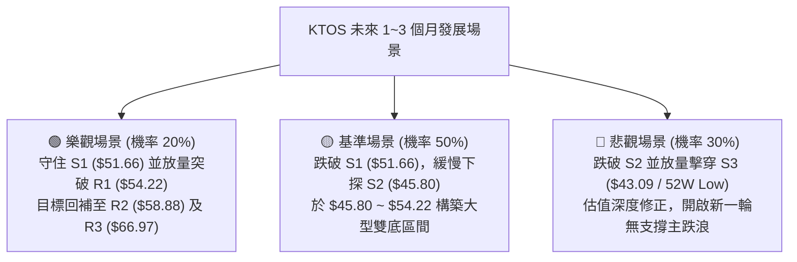

---

### 🛡️ 風險管理重要提醒

1. **波動率管理**：KTOS 的 ATR 高達 **$3.47 (6.60%)**，屬於高波動防務科技標的。單筆交易虧損務必控制在總資金的 **1% ~ 1.5%** 以內。
2. **基本面估值背離**：儘管分析師共識目標價平均達 **$105.62**，但當前 TTM P/E 高達 **309.65**、自由現金流為負（$-118.29M），高估值在技術面走弱時極易產生流動性折價，不可僅憑分析師目標價盲目左側重倉死守。
3. **嚴格執行紀律**：若執行做多策略，跌破 **S3 ($43.09)** 必須無條件止損離場，嚴防出現流動性真空下的加速破位風險。

---

## 📋 報告總結

```
╔══════════════════════════════════════════════════════════════════════════════╗
║                          KTOS 技術分析報告總結                               ║
╠══════════════════════════════════════════════════════════════════════════════╣
║ 報告日期：2026-08-26            當前價格：$52.64           技術評分：42/100 ║
║ 分析評級：🔴 偏空震盪 / 逢高順勢偏空 (Bearish / Sell on Rallies)             ║
╠══════════════════════════════════════════════════════════════════════════════╣
║ 關鍵結構結論：                                                               ║
║ ├─ 長期趨勢：🔴 偏空回調 (自 $103.01 峰值深度修正，受制於 MA200 $72.58)     ║
║ ├─ 中期趨勢：🔴 空方主導 (週線 MACD 柱狀 -0.990，8月反彈旗形向下跌破)        ║
║ ├─ 短期趨勢：🟡 弱勢震盪 (考驗 S1 $51.66，Stoch %K 4.05 處於極度超賣)        ║
║ ├─ 關鍵阻力：R1: $54.22  ｜  R2: $58.88  ｜  R3: $66.97                       ║
║ ├─ 關鍵支撐：S1: $51.66  ｜  S2: $45.80  ｜  S3: $43.09 (52W Low)             ║
║ └─ 斐波那契：現價處於深度回撤區（78.6% $62.54 與 100.0% $43.09 之間）       ║
╠══════════════════════════════════════════════════════════════════════════════╣
║ 最優策略指引：                                                               ║
║ 1. 🥇 最佳機會（順勢做空）：反彈至 R1 ($54.22) 遇阻進場，止損 $58.88，       ║
║                           目標 T1 $45.80 / T2 $43.09 (R/R = 1:1.81)。        ║
║ 2. 🥈 次選機會（超賣左側）：下探 S2 ($45.80) 輕倉博反彈，止損 $43.09，       ║
║                           目標 T1 $54.22 / T2 $58.88 (R/R = 1:3.11)。        ║
║ 3. 🥉 保守選擇（空倉觀望）：等待價格有效站穩 MA20 ($56.67) 或在 S3 確立雙底。 ║
╚══════════════════════════════════════════════════════════════════════════════╝
```

---

> ⚠️ **免責聲明**：本報告為技術分析研究成果，所有價位、圖表與指標均基於歷史量價數據推算。本報告**僅供研究與學術參考**，**不構成任何形式的要約或投資建議**。金融市場存在高度風險，投資人應獨立評估自身風險承受能力並自負盈虧。

---

*報告生成時間：2026-08-26 ｜ 數據來源：Yahoo Finance ｜ 分析框架：多時框技術分析體系*