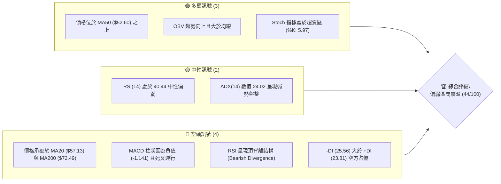
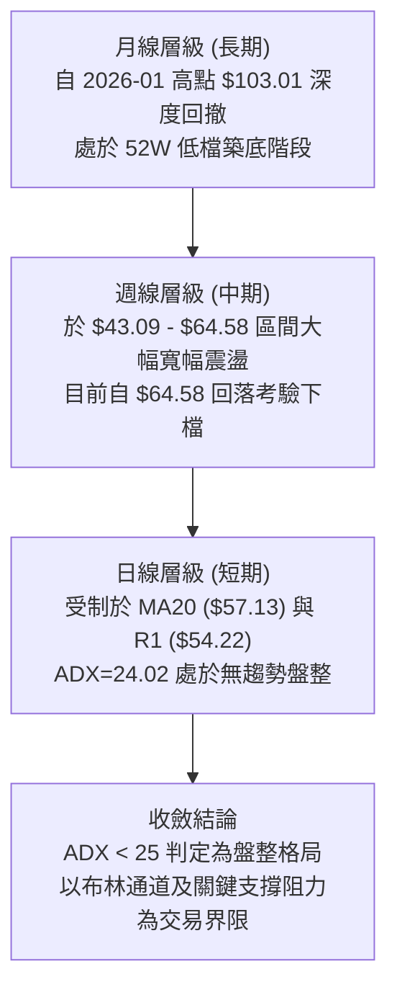
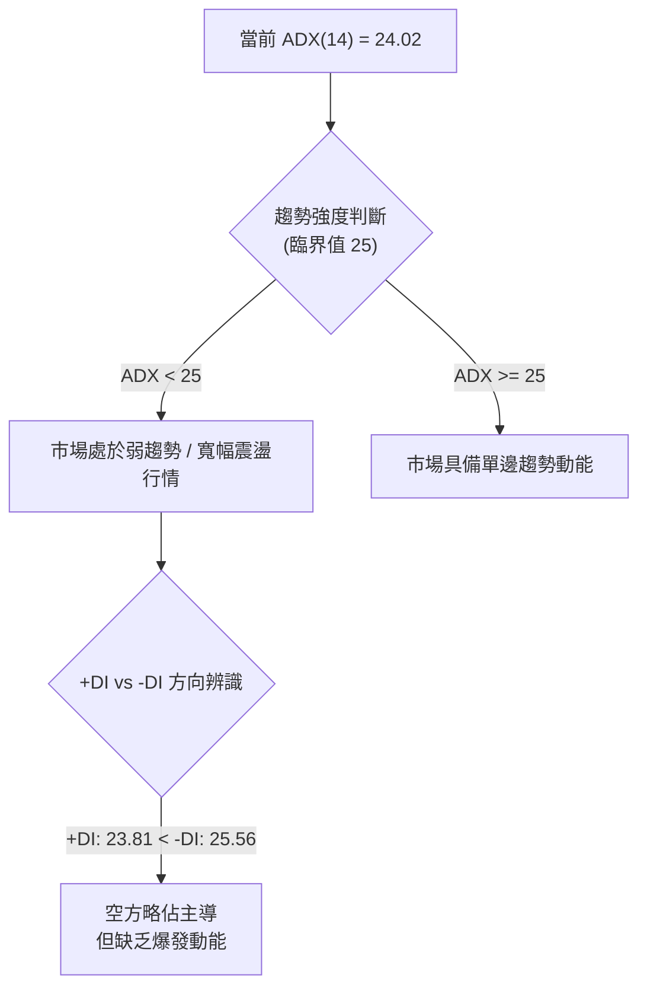
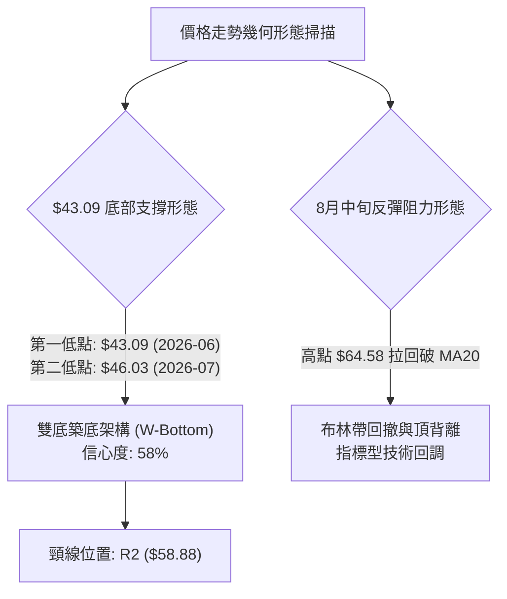
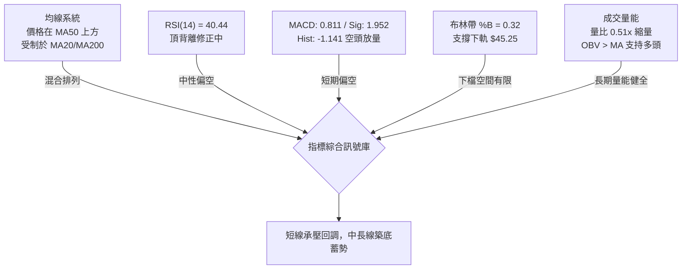
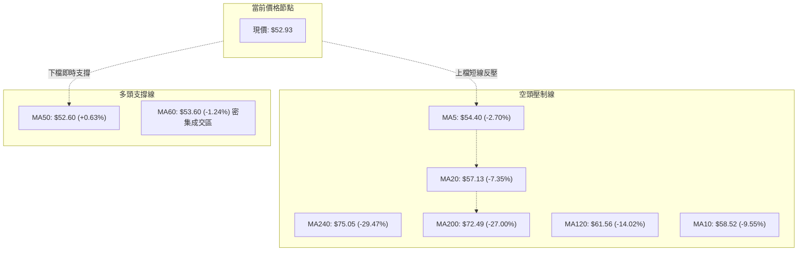
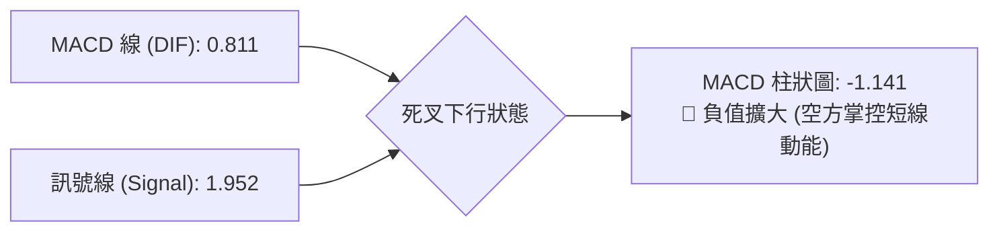
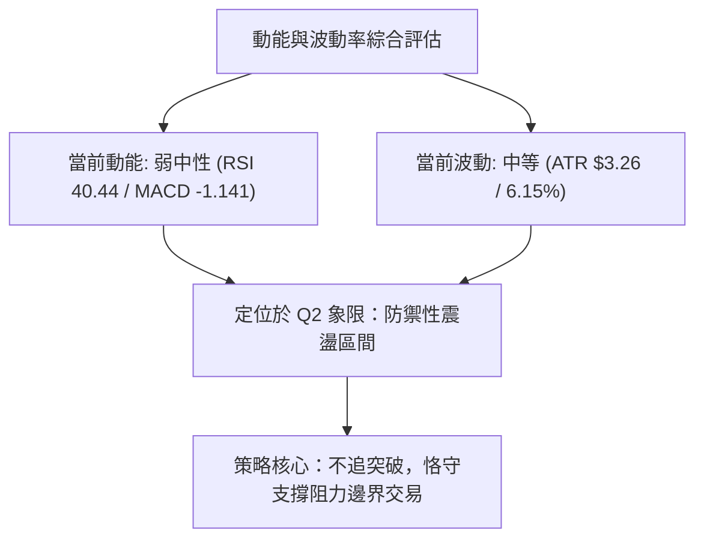
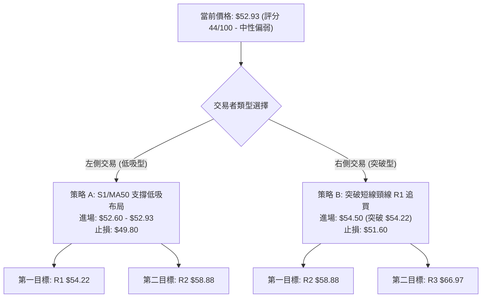
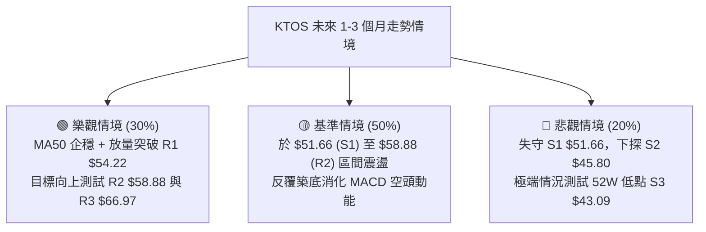

# KTOS 技術分析報告

> **報告日期**：2026-08-27 ｜ **語言**：繁體中文 ｜ **數據來源**：Yahoo Finance ｜ **當前價格**：$52.93

---

## 目錄

| 章節 | 內容 |
|------|------|
| [1. 技術面概覽](#1-技術面概覽) | 訊號儀表板、核心指標、評分卡 |
| [2. 趨勢分析](#2-趨勢分析) | 多時框趨勢、長中短期走勢 |
| [3. 圖表形態分析](#3-圖表形態分析) | 形態識別、K線組合、目標價 |
| [4. 支撐與阻力](#4-支撐與阻力) | 關鍵價位、斐波那契回調 |
| [5. 技術指標深度解讀](#5-技術指標深度解讀) | MA/RSI/MACD/布林/成交量 |
| [6. 動能與波動率](#6-動能與波動率) | 動能評估、ATR、Beta |
| [7. 多時框架總結](#7-多時框架總結) | 時框架評分矩陣 |
| [8. 交易策略建議](#8-交易策略建議) | 多空策略、風險報酬比 |
| [9. 風險提示與監控](#9-風險提示與監控) | 監控指標、風險場景 |
| [10. 報告總結](#-報告總結) | 總結儀表板與核心決策結論 |

---

## 1. 技術面概覽

### 🎯 技術訊號儀表板



### 📊 核心指標速覽表

| 指標類別 | 指標名稱 | 當前數值 | 訊號 | 解讀 |
|----------|----------|----------|------|------|
| **價格** | 當前價格 | $52.93 | 🟡 | 位於52週區間底部的10.8%分位，處於低檔整理階段 |
| **均線** | MA20 | $57.13 | 🔴 | 現價在MA20下方 -7.35%，短線承壓明顯 |
| **均線** | MA50 | $52.60 | 🟢 | 現價微幅站上MA50 (+0.63%)，提供初步支撐 |
| **均線** | MA200 | $72.49 | 🔴 | 現價大幅落後MA200 (-27.0%)，長期趨勢受壓制 |
| **動能** | RSI(14) | 40.44 | 🟡 | 數值落於30-70中性區間，但帶有日線頂背離隱患 |
| **動能** | MACD | 0.811 / Signal 1.952 | 🔴 | 柱狀圖為 -1.141，空頭動能尚未完全釋放完畢 |
| **震盪** | Stoch %K/%D | 5.97 / 3.90 | 🟢 | 進入極度超賣區，短線具備技術性反彈契機 |
| **趨勢強度**| ADX(14) | 24.02 | 🟡 | ADX < 25 表明市場處於無明確單邊趨勢的盤整格局 |
| **通道位置**| 布林通道 %B | 0.32 | 🟡 | 位於中軌（$57.13）與下軌（$45.25）之間偏下半區 |
| **波動** | ATR(14) | $3.26 | 🟡 | 波動率佔股價比約 6.15%，日均波動空間明確 |
| **量能** | 量比 / OBV | 0.51x / OBV>MA | 🟢 | 當日縮量整理，但中長期OBV維持量能支撐結構 |

### 🏆 技術評分卡

```
╔══════════════════════════════════════════════════════════════╗
║              技術評分卡 — KTOS (2026-08-27)                  ║
╠══════════════════════════════════════════════════════════════╣
║ 趨勢強度 (ADX=24.02)   ███████░░░░░░░░░░░░░  35/100  🔴 偏弱 ║
║ 動能指標 (RSI/MACD)   ████████░░░░░░░░░░░░  40/100  🔴 空方 ║
║ 支撐穩定度 (S1/MA50)  ████████████░░░░░░░░  60/100  🟡 中性 ║
║ 成交量配合 (OBV/量比) ██████████░░░░░░░░░░  50/100  🟡 觀望 ║
║ 形態完整度 (區間築底) ████████░░░░░░░░░░░░  40/100  🟡 發展 ║
║ 均線排列 (混合空頭)   ████████░░░░░░░░░░░░  40/100  🔴 壓制 ║
╠══════════════════════════════════════════════════════════════╣
║ 綜合評分               █████████░░░░░░░░░░░  44/100  🟡 中性偏弱
╚══════════════════════════════════════════════════════════════╝
```

---

## 2. 趨勢分析

### 🌐 多時框趨勢分析



### 📈 長期趨勢 — 12個月走勢圖（Unicode）

```
KTOS 月線走勢圖（過去12個月：2025-09 至 2026-08）
價格軸 ($)
$105 ┤                                  ● $103.01 (2026-01 高點)
 $95 ┤       ● $91.37  ● $90.60
 $85 ┤                                       ● $86.18
 $75 ┤                   ● $76.10  ● $75.91       ● $70.51
 $65 ┤ ● $65.84                                        ● $63.05  ● $64.13
 $55 ┤                                                                      ● $52.93 (現價)
 $45 ┤                                                                ● $49.86  ● $46.60
     └───────────────────────────────────────────────────────────────────────────────
      08/25    09/25     10/25     11/25    12/25    01/26    02/26    03/26    04/26    05/26    06/26    07/26   08/26
```

#### 走勢特徵分析表格

| 階段區間 | 時間跨度 | 起訖價格 ($) | 漲跌幅 (%) | 核心特徵與量價結構 |
|----------|----------|--------------|------------|--------------------|
| **主升浪階段** | 2025-08 ~ 2026-01 | $65.84 → $103.01 | +56.46% | 伴隨國防訂單放量攻頂，創下波段歷史高價 |
| **快速回撤階段** | 2026-01 ~ 2026-04 | $103.01 → $63.05 | -38.79% | 獲利了結賣壓湧現，連續跌破多條長期均線 |
| **二次探底階段** | 2026-04 ~ 2026-07 | $63.05 → $46.60 | -26.09% | 於 6 月底創下波段低點 $43.09（收盤 $49.86），進入超跌區 |
| **築底修復階段** | 2026-07 ~ 2026-08 | $46.60 → $52.93 | +13.58% | 8月中旬反彈至 $64.58 後受阻拉回，現於 $52.93 尋求支撐 |

### 📊 中期趨勢（週線分析）

```
中期週線價格架構示意圖：
$66.97 ────────────────────────────────────── 阻力 R3 (強阻力區間頂部)
$64.58 ───────────────● (08/16 週波段高點)
$58.88 ────────────────────────────────────── 阻力 R2 (MA120 / 前期平台)
$57.13 ────────────────────────────────────── MA20 / 布林中軌
$54.22 ────────────────────────────────────── 阻力 R1 (短線突破頸線)
$52.93 ═══════════════◄ 現價 (MA50 $52.60 附近)
$51.66 ────────────────────────────────────── 支撐 S1 (近期防守位)
$45.80 ────────────────────────────────────── 支撐 S2 (波段平台支撐)
$43.09 ────────────────────────────────────── 支撐 S3 (52W 最低點)
```

近期 20 週數據顯示，KTOS 在 2026 年 6 月 28 日該週觸及大成交量 45,383,700 股的爆量恐慌殺跌（收盤 $47.21，最低探至 $43.09），隨後在 $46.00-$48.00 形成第一隻腳。8 月上旬放量拉升至 $64.58（RSI 升至 76.7 超買），近兩週（08-23 與 08-30）量能快速萎縮（分別為 16.78M 及 7.75M），週線 MACD 柱狀圖由正轉負（+1.743 降至 -1.141），顯示中期反彈遭遇強烈獲利回吐，進入二次回踩回調階段。

### ⚡ 趨勢強度評估（ADX 解讀）



#### ADX 趨勢強度對照表

| 指標參數 | 具體數值 | 狀態評估 | 技術含義解讀 |
|----------|----------|----------|--------------|
| **ADX(14)** | 24.02 | 弱趨勢 / 盤整 | 趨勢強度低於25門檻，不宜盲目追漲殺跌，應採用區間思維操作 |
| **+DI (14)** | 23.81 | 多方力量 | 多方動能自8月中旬高點減退，目前低於空方力量 |
| **-DI (14)** | 25.56 | 空方力量 | 空方力量小幅占優，但未形成大幅拉開（差值僅 1.75），非強空格局 |

---

## 3. 圖表形態分析

### 🔍 形態識別系統



#### 形態識別信心度與完成度表格

| 識別形態 | 信心度 | 判斷依據（引用數據） | 完成度 | 目標價（附精確計算式） |
|----------|--------|----------------------|--------|------------------------|
| **寬幅雙底形態 (W-Bottom)** | 58% | 2026-06 低點 $43.09 (S3) 與 2026-07 低點 $46.03 (接近 S2 $45.80) 構成雙重底部特徵 | 65% | 頸線 R2 ($58.88) + 形態高度 ($58.88 - $43.09 = $15.79) = **$74.67** (此為推算目標，上方實際波段高點阻力聚類為 R3 $66.97) |
| **布林帶回撤通道** | 75% | 8月中旬觸及上軌 $69.01 區域（最高收盤 $64.58）後向中軌 $57.13 快速回落 | 90% | 下軌支撐目標: 布林下軌 **$45.25** / S2 **$45.80** |

*註：除上述幾何與通道特徵外，頭肩頂或旗形因缺乏清晰幾何邊界，信心度 < 50%，依規則不做過度推演，僅聚焦於指標型支撐與阻力解讀。*

### 🕯️ 重要K線形態分析

| 週/月份 | 收盤價 ($) | K線形態特徵 | 技術面解讀 | 訊號 |
|---------|------------|-------------|------------|------|
| **2026-06-28 週** | $47.21 | 爆量長下影陰線 (量 45.38M) | 創 52W 低點 $43.09 後強烈承接買盤進場，確立第一重底部 | 🟢 |
| **2026-07-19 週** | $46.03 | 縮量十字星整理 (量 22.43M) | 二次回踩未創新低，確認 $45.80 (S2) 附近具備高支撐力道 | 🟢 |
| **2026-08-16 週** | $64.58 | 長上影紅K線 (RSI 76.7) | 觸及 78.6% 斐波那契壓力位 ($62.54) 與 R3 阻力區，動能透支 | 🔴 |
| **2026-08-23 週** | $57.17 | 中實體回調陰線 | 失守 MA20 ($57.13)，MACD 柱狀圖由正轉負，短線多頭受挫 | 🔴 |
| **2026-08-30 週** | $52.93 | 縮量測試陽星線 (量 7.75M) | 於 MA50 ($52.60) 與 S1 ($51.66) 尋求止跌，成交量極度萎縮 | 🟡 |

### 📉 ASCII 走勢形態示意圖

```
KTOS 雙底與反彈回撤結構圖：

$64.58 ───────────────────┐ (08/16 高點，遭遇 78.6% 回調位 $62.54 壓力)
                          │
$58.88 ─────────── 頸線 R2 ┴───────── (雙底形態頸線位)
                          │   
$52.93 ═══════════════════▼════ 現價 (測試 MA50 $52.60 / S1 $51.66)
           ▲              │
$45.80 ───┼──────────────┴───── 支撐 S2 (波段平台)
          │  第一底 $43.09 (06/28)      第二底 $46.03 (07/19)
$43.09 ───┴───────────────────────────────────────────── 52W 底 (S3)
```

---

## 4. 支撐與阻力

### 🗺️ 關鍵價位分布圖（Unicode）

```
KTOS 價位結構分布圖
═══════════════════════════════════════════════════════════════════
$66.97 ║████████████████████████████████║ 強阻力 R3 (+26.52%)
$62.54 ║▓▓▓▓▓▓▓▓▓▓▓▓▓▓▓▓▓▓▓▓▓▓▓▓        ║ 斐波那契 78.6% 回調位
$58.88 ║████████████████████            ║ 阻力 R2 (+11.24% / 雙底頸線)
$57.13 ║▒▒▒▒▒▒▒▒▒▒▒▒▒▒▒▒▒▒              ║ MA20 / 布林中軌壓力
$54.22 ║████████████████████████        ║ 短線關鍵阻力 R1 (+2.44%)
═══════════════════════════════════════════════════════════════════
$52.93 ╠════════════════════════════════╣ ◄ 當前價格 $52.93
═══════════════════════════════════════════════════════════════════
$52.60 ║▒▒▒▒▒▒▒▒▒▒▒▒▒▒▒▒▒▒▒▒▒▒          ║ MA50 均線即時支撐
$51.66 ║▓▓▓▓▓▓▓▓▓▓▓▓▓▓▓▓▓▓▓▓▓▓▓▓        ║ 近期第一支撐 S1 (-2.40%)
$45.80 ║████████████████████████████████║ 強支撐 S2 (-13.48% / 雙底低點)
$45.25 ║▒▒▒▒▒▒▒▒▒▒▒▒▒▒▒▒▒▒▒▒▒▒▒▒▒▒      ║ 布林通道下軌
$43.09 ║████████████████████████████████║ 52週極限支撐 S3 (-18.59%)
═══════════════════════════════════════════════════════════════════
```

### 🚧 阻力位分析表

| 阻力級別 | 精確價位 | 形成原因與技術匯聚 | 突破難度 | 重要性評級 |
|----------|----------|--------------------|----------|------------|
| **R1** | **$54.22** | 近一年波段高點聚類、MA5 均線 ($54.40) 下壓位置 | 🟡 中等 | 短線多空強弱分水嶺 |
| **R2** | **$58.88** | 波段高點聚類、MA10 ($58.52) 與雙底形態頸線位 | 🔴 偏高 | 中期反轉確認位 |
| **R3** | **$66.97** | 近一年波段高點密集區、布林上軌 ($69.01) 下方強壓 | 🔴 極高 | 波段上升通道頂部邊界 |

### 🛡️ 支撐位分析表

| 支撐級別 | 精確價位 | 形成原因與技術匯聚 | 守住機率 | 重要性評級 |
|----------|----------|--------------------|----------|------------|
| **S1** | **$51.66** | 近一年波段低點聚類、MA50 ($52.60) 下方防守緩衝區 | 70% | 短線震盪下限，跌破轉弱 |
| **S2** | **$45.80** | 近一年波段低點聚類、布林下軌 ($45.25) 支撐帶 | 85% | 中期關鍵防線，多頭底線 |
| **S3** | **$43.09** | 52週最低點、波段極限止損防守位 | 95% | 結構性破位點，不容失守 |

### 📐 斐波那契回調位分析

依據 52 週完整波動區間（最低點 **$43.09** 至 最高點 **$134.00**），回調水平位精確分布如下：

```
斐波那契回調梯隊（$43.09 → $134.00）：
  0.0%  (52W High)  ─── $134.00
 23.6%              ─── $112.55
 38.2%              ─── $ 99.27
 50.0%              ─── $ 88.55
 61.8%              ─── $ 77.82  (黃金分割位，接近 MA240 $75.05)
 78.6%              ─── $ 62.54  (8月中旬反彈受阻高點 $64.58 區域)
100.0%  (52W Low)   ─── $ 43.09  (波段極限起漲點)
```

**價位落點解讀**：
- 當前價格 **$52.93** 位於 **78.6% 回調位 ($62.54)** 與 **100.0% 回調位 ($43.09)** 之間。
- 此區間代表股價經歷了極深度的回撤修正，已回吐前波牛市行情的絕大部分漲幅。股價在 $43.09-$62.54 之間形成低位大箱體，當前 $52.93 正處於箱體中軸偏下位置，具備較佳的風險收益防禦比。

---

## 5. 技術指標深度解讀

### 🎛️ 指標訊號總覽



### 📈 移動平均線排列分析



#### 均線數據深度解讀
- **短中期均線承壓**：MA5 ($54.40)、MA10 ($58.52) 及 MA20 ($57.13) 均呈向下傾斜排列，對現價構成多重層級的反壓，說明自 8 月 16 日以來的短線回調趨勢尚未正式扭轉。
- **生命線 MA50 守護**：現價 $52.93 恰好運行於 MA50 ($52.60) 之上，該均線為中期多空爭奪中樞。若 MA50 能夠有效企穩，將延緩下行斜率並促成日線收斂。
- **長期均線乖離率過大**：MA200 高達 $72.49，目前負乖離率達 -27.00%，技術面上存在中期向均線回歸修復的需求。

### 📉 RSI(14) 分析

- **RSI 當前數值**：**40.44**
```
RSI(14) 狀態儀表：
0 ────── 超賣(30) ────────── 40.44 ────── 中軸(50) ────── 超買(70) ────── 100
[░░░░░░░░░░░░░░░░░░░░░░░░░░░░█████████████░░░░░░░░░░░░░░░░░░░░░░░░░░░░░░░░]
```
- **背離判斷與結論**：
  - **頂背離判定 (⚠️ Bearish Divergence)**：8 月 9 日該週收盤 $60.77 時 RSI 為 74.1，8 月 16 日股價衝高至 $64.58 時週線 RSI 達到 76.7；但日線級別在突破高點時動能指標並未同步擴張，引發頂背離賣訊，導致隨後股價自 $64.58 迅速滑落至 $52.93。
  - 目前 RSI 回落至 40.44，頂背離引發的殺跌動能已釋放大半，正進入 40 附近的弱勢緩衝帶。

### 📊 MACD(12/26/9) 訊號解讀


- **MACD 解讀**：DIF (0.811) 位於 Signal (1.952) 下方，柱狀圖讀數為 -1.141。此數值確認自 8 月 23 日以來空頭主導了短線節奏。隨柱體逐漸在負向伸展，後續需關注負柱何時開始縮短（收斂），方為短線止跌的第一訊號。

### 📦 布林通道分析

```
KTOS 布林通道位置示意圖（參數: 20, 2）：
$69.01 ┬────────────────────────────────────────── BB 上軌
       │
$57.13 ┼────────────────────────────────────────── BB 中軌 (MA20)
       │              
$52.93 ┼───────────────● 現價 (BB %B = 0.32)
       │
$45.25 ┴────────────────────────────────────────── BB 下軌
```
- **帶寬與位置解讀**：
  - **布林帶寬**：上軌 $69.01 至 下軌 $45.25，帶寬 $23.76。
  - **%B 位置 (0.32)**：現價位於中軌與下軌之間的下半區域，顯示回調尚未觸及極端超賣下軌（$45.25），但已接近下檔緩衝區。下軌 $45.25 與關鍵支撐 S2 ($45.80) 高度共振，構成堅實的空間保護。

### 💹 成交量分析（量價配合度）

```
成交量能對比：
當日成交量:  1,984,200   [█████░░░░░] (量比: 0.51x)
20日均量:    3,903,950   [██████████]
50日均量:    4,539,592   [████████████]
```
- **量價配合分析**：
  - 當前日成交量僅 1.98M，相較 20 日均量 (3.90M) 出現顯著的「縮量回調」特徵（量比 0.51x），說明股價回落並非主力機構恐慌拋售，而是買盤承接暫時觀望。
  - **OBV 趨勢**：數據顯示 `OBV > MA`，能量潮指標持續高於其移動平均線，驗證在過去幾個月的底部震盪過程中，中長線資金進場吸籌的量能結構尚未被破壞。

---

## 6. 動能與波動率

### ⚡ 動能評估四象限

| 象限 | 動能強度 (RSI / MACD) | 波動率水準 (ATR) | 當前狀態判定 | 戰術應對評估 |
|:---:|:---:|:---:|:---:|:---|
| **Q1** | 強 (Bullish) | 低 (Low Volatility) | — | 穩健突破機會（目前不符） |
| **Q2** | **弱 (Bearish/Neutral)** | **低/中 (Moderate Vol)** | **✓ KTOS 當前落點** | **震盪築底觀察區，適合區間網格或低吸布局** |
| **Q3** | 強 (Bullish) | 高 (High Volatility) | — | 爆發型動量進場（目前不符） |
| **Q4** | 弱 (Bearish) | 高 (High Volatility) | — | 恐慌崩跌區，應嚴格停損（目前不符） |



### 📊 ATR 波動率分析

```
ATR(14) 波動分析：
當前數值:  $3.26  (佔股價 6.15%)
[████████████░░░░░░░░] 波動率水準：中等偏高
```
- **止損距離量化建議**：
  - **短線交易止損 (1.0x ATR)**：$3.26 緩衝空間。
  - **波段交易止損 (1.5x ATR)**：$4.89 緩衝空間。
  - **現價進場對應防守點**：以現價 $52.93 減去 1.5x ATR ($4.89) 為 $48.04，與支撐位 S2 ($45.80) 構成多層防禦梯隊。

### 📐 Beta 與市場相關性

- **Beta 係數**：**1.106**
- **市場特徵分析**：KTOS 的 Beta 值略高於市場平均水準 (1.0)，表明其對標普500與國防工業板塊的價格波動敏感度高出約 10.6%。在大盤向上反彈時具備一定彈性，但在市場下挫時亦容易放大回撤幅度。

---

## 7. 多時框架總結

### 📋 時框架評分表

| 時框架 | 趨勢方向 | 動能狀態 | 均線排列 | 關鍵形態 | 綜合評分 | 戰術建議 |
|--------|----------|----------|----------|----------|:--------:|----------|
| **月線 (長期)** | 🟡 深度修正築底 | 🟡 走平修復 | 🔴 均線偏空 | 52W 低檔區間 | 45/100 | 逢低分批建立長期核心底倉 |
| **週線 (中期)** | 🟡 寬幅箱體震盪 | 🔴 MACD轉負 | 🟡 圍繞MA50爭奪 | 潛在寬幅雙底 ($43-$64) | 48/100 | 區間操作，阻力位停利 |
| **日線 (短期)** | 🔴 偏弱回調 | 🔴 MACD柱下探 | 🔴 受壓於MA20 | 頂背離拉回測試支撐 | 40/100 | 靜待縮量企穩或突破 R1 |

### 🔲 綜合訊號矩陣

```
╔═══════════════════════════════════════════════════════════════════╗
║                      多時框訊號收斂矩陣                           ║
╠═══════════════════════════════════════════════════════════════════╣
║ 維度         短期 (日線)          中期 (週線)         長期 (月線) ║
║ 趨勢方向     🔴 偏空回調          🟡 寬幅箱體         🟡 築底復甦 ║
║ 指標動能     🔴 MACD死叉          🔴 動能減退         🟡 處於低檔 ║
║ 均線支撐     🟡 MA50 ($52.60)     🟡 測試中軌         🔴 遠低於MA200║
║ 量價結構     🟢 縮量回測          🟢 OBV健康          🟢 機構持股85%║
╚═══════════════════════════════════════════════════════════════════╝
```

### ⚖️ 多時框收斂結論

> **依規則 14 收斂判定**：
> 1. **行情性質確認**：ADX(14) 數值為 **24.02 (< 25)**，明確定義當前市場處於**「無單邊趨勢的盤整震盪格局」**。
> 2. **主導時框與交易邊界**：在盤整行情中，日線布林通道（下軌 $45.25 ~ 上軌 $69.01）與波段聚類支撐阻力（S1 $51.66 / S2 $45.80 vs R1 $54.22 / R2 $58.88）為最高優先級決策依據。
> 3. **唯一方向性結論**：**【中性觀望，區間低吸為主】**。日線級別受頂背離與短均線壓制，但下檔在 MA50 ($52.60) 及 S1 ($51.66) 處具備強支撐，且縮量明顯；策略上嚴禁追高，應以箱體下沿支撐作為低吸防守點。

---

## 8. 交易策略建議

### 🗺️ 策略決策流程圖



### 🧭 策略路由

**當前主策略方向 = 【中性偏弱區間操作（評分 44/100）】**
依評分卡規則，評分落於 40–60 區間，主推**「區間高拋低吸與等待突破確認」**策略。

---

### 🎯 價格情境階梯（Price Scenarios）

| 觸發條件 | 第一目標 | 後續延伸目標 | 情境技術含義 |
|----------|----------|--------------|--------------|
| **向上突破 R1 ($54.22)** | **R2 ($58.88)** | **R3 ($66.97)** | 短線回調結束，扭轉短期均線空頭排列，展開向雙底頸線的進攻 |
| **維持於現價區間 ($51.66 ~ $54.22)** | — | — | 消化日線 MACD 負柱動能，在 MA50 附近進行時間換空間的築底震盪 |
| **向下跌破 S1 ($51.66)** | **S2 ($45.80)** | **S3 ($43.09)** | MA50 防線失守，短線回踩布林下軌及 52W 區間底部進行二次探底 |

---

### 📊 情境機率分佈

```
情境機率分布圖：
區間震盪築底: [█████████████████████████] 50%
向上反彈突破: [███████████████] 30%
破位回踩探底: [██████████] 20%
```

| 情境類別 | 機率預估 | 主要技術依據 |
|----------|:--------:|--------------|
| **區間震盪築底** | **50%** | ADX(14)=24.02 (<25) 表明無趨勢；成交量大幅萎縮至 0.51x，多空雙方在 MA50 陷入僵持 |
| **向上反彈突破** | **30%** | Stoch %K/%D 極度超賣 (5.97/3.90)；OBV 持續健康上行；分析師一致共識強烈看好 |
| **破位回踩探底** | **20%** | MACD 柱狀圖為 -1.141 且 DIF 處於死叉；RSI 頂背離修正尚未出現底背離金叉確認 |

---

### 🟢 主策略詳情

依據數據精確計算兩套量化交易方案：

| 策略要素 | 策略 A（左側：現價與 MA50 支撐布局） | 策略 B（右側：突破 R1 追買動量） |
|----------|---------------------------------------|-----------------------------------|
| **交易邏輯** | 依託 MA50 ($52.60) 與 S1 ($51.66) 支撐低吸 | 確認放量站上 R1 ($54.22) 阻力後順勢切入 |
| **進場價格** | **$52.60 ~ $52.93** (現價區域) | **$54.50** (確認突破 R1 $54.22) |
| **目標價 T1** | **$54.22** (R1 阻力位) | **$58.88** (R2 頸線阻力位) |
| **目標價 T2** | **$58.88** (R2 頸線阻力位) | **$66.97** (R3 強阻力位) |
| **止損價格** | **$49.80** (跌破 S1 $51.66 之緩衝點) | **$51.60** (跌回 S1 下方即止損) |
| **風險空間** | $52.93 - $49.80 = **$3.13** (5.91%) | $54.50 - $51.60 = **$2.90** (5.32%) |
| **報酬空間 (T2)**| $58.88 - $52.93 = **$5.95** (11.24%) | $66.97 - $54.50 = **$12.47** (22.88%) |
| **風險報酬比** | **1 : 1.90** (至 T2) | **1 : 4.30** (至 T2) |
| **預估勝率** | **55%** | **48%** |
| **建議倉位** | **10% - 15%** (分批建倉) | **15% - 20%** (動量加碼) |

---

### 🔴 反向風險觸發點（對沖提示）

若發生以下盤面變化，表明多頭支撐完全失效，應立即推翻偏多假設並執行風控：
1. **收盤跌破 S1 ($51.66)**：意味著 MA50 支撐徹底告破，短期下行空間打開至 S2 ($45.80)。
2. **放量跌破 S2 ($45.80)**：若日成交量超過 50 日均量 (4.54M) 且跌破 $45.80，表明雙底結構失敗，將直測 52W 低點 S3 ($43.09)，需全面清倉或建立空頭對沖部位。

---

### ⭐ 整體訊號強度評星

```
╔══════════════════════════════════════════════════════════════╗
║ 做多訊號強度：  ★★☆☆☆  (2.5/5 星 — 處於支撐位但動能偏弱)    ║
║ 做空訊號強度：  ★★☆☆☆  (2.5/5 星 — 受壓於均線但已大幅回調)  ║
║ 整體訊號可信度：★★★☆☆  (3.0/5 星 — 處於典型盤整收斂期)      ║
╚══════════════════════════════════════════════════════════════╝
```

---

## 9. 風險提示與監控

### ✅ 關鍵監控指標 Checklist

```
╔═══════════════════════════════════════════════════════════════════╗
║                  每日盤面關鍵技術指標監控清單                     ║
╠═══════════════════════════════════════════════════════════════════╣
║ [ ] 價格是否跌破 S1 ($51.66) 及 MA50 ($52.60) 關鍵防線            ║
║ [ ] 日線成交量是否放大至 3.90M (20日均量) 以上確認放量方向        ║
║ [ ] MACD 柱狀圖是否由負向擴大轉為收斂 (-1.141 向上回升)          ║
║ [ ] RSI(14) 是否在 40 水準獲得支撐並重新站上 50 中軸線            ║
║ [ ] 價格能否收盤突破短線阻力 R1 ($54.22) 並站上 MA5 ($54.40)      ║
║ [ ] ADX(14) 是否自 24.02 升溫突破 25，確認新趨勢啟動              ║
╚═══════════════════════════════════════════════════════════════════╝
```

### ⚠️ 風險場景分析



### 🛡️ 風險管理重要提醒

1. **基本面估值壓力與技術面脫節**：KTOS 當前 Trailing P/E 高達 311.35，EV/EBITDA 達 99.91，自由現金流為負 ($-118.29M)。儘管營收 YoY 成長 30.5% 且機構持股高達 85.4%，但極高估值使得股價容易受到大盤流動性收緊與財報不如預期的劇烈衝擊。
2. **波動率管理 (ATR 風控)**：KTOS 的 ATR 為 $3.26，佔股價比例達 6.15%，日均波動劇烈。單筆交易風險暴露金額嚴格控制在總投資組合資金的 1.0% 以內，進場時務必按 ATR 比例設定止損。
3. **空頭排列均線壓制**：上方 MA20 ($57.13)、MA120 ($61.56) 及 MA200 ($72.49) 呈空頭壓制排列，每次反彈至重要均線或阻力位（如 R2 $58.88）均可能遭遇解套拋壓，波段多單宜採取分批停利策略。

---

## 📋 報告總結

```
╔══════════════════════════════════════════════════════════════════╗
║                   KTOS 技術分析報告總結儀表板                    ║
╠══════════════════════════════════════════════════════════════════╣
║ 報告日期：2026-08-27                                             ║
║ 當前價格：$52.93                                                 ║
║ 綜合評分：44/100 ｜ 總體評級：⚖️ 中性觀望 (偏弱區間震盪)         ║
╠══════════════════════════════════════════════════════════════════╣
║ 關鍵結論：                                                       ║
║ ├─ 長期趨勢 (月線)：🟡 經歷 56% 深度回撤後於 52W 低檔築底         ║
║ ├─ 中期趨勢 (週線)：🟡 $43.09 - $64.58 寬幅震盪，處於回調第二隻腳 ║
║ ├─ 短期趨勢 (日線)：🔴 受制於頂背離與 MA20 ($57.13)，縮量整理    ║
║ ├─ 關鍵支撐架構：S1: $51.66 ｜ S2: $45.80 ｜ S3: $43.09         ║
║ ├─ 關鍵阻力架構：R1: $54.22 ｜ R2: $58.88 ｜ R3: $66.97         ║
║ └─ 分析師共識目標：均價 $105.62 (低標 $60.00 / 高標 $150.00)     ║
╠══════════════════════════════════════════════════════════════╣
║ 最優交易執行路徑：                                               ║
║ 1. 🥇 穩健策略 (右側突破)：等待放量突破 R1 ($54.22) 後進場，      ║
║    目標 R2 ($58.88) / R3 ($66.97)，止損設於 $51.60 (風報比 1:4.3)║
║ 2. 🥈 積極策略 (左側低吸)：於現價 $52.60-$52.93 (MA50) 輕倉試單， ║
║    止損設於 $49.80，目標 R1 ($54.22) / R2 ($58.88)              ║
║ 3. 🥉 保守觀望：等待 ADX 升破 25 且日線 MACD 金叉後再行介入      ║
╚══════════════════════════════════════════════════════════════════╝
```

---

> ⚠️ **免責聲明**：本報告為 AI 自動生成之技術分析，所有數據及估算均基於歷史價格資訊與量化技術指標運算。本報告**僅供研究與學術參考**，**不構成任何形式的投資要約或買賣建議**。金融市場投資具有極高風險，投資人應獨立評估風險並自負盈虧。

---

*報告生成時間：2026-08-27 ｜ 數據來源：Yahoo Finance ｜ 分析框架：多時框架量化技術分析*