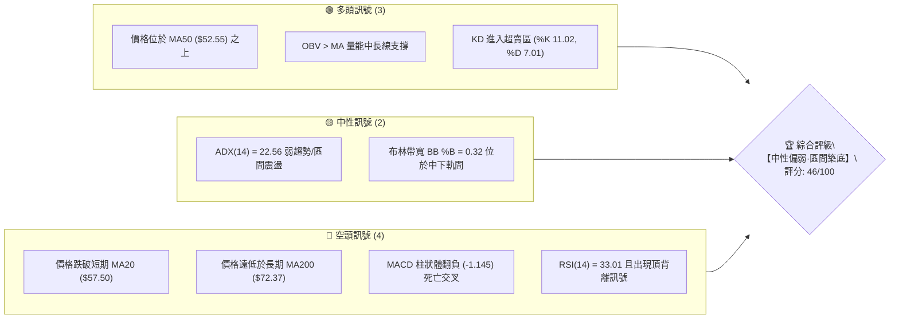
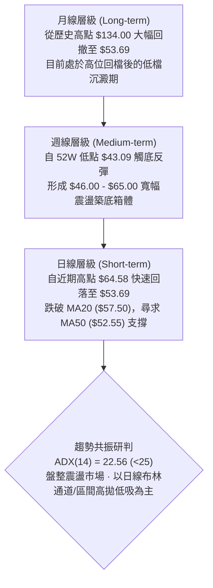
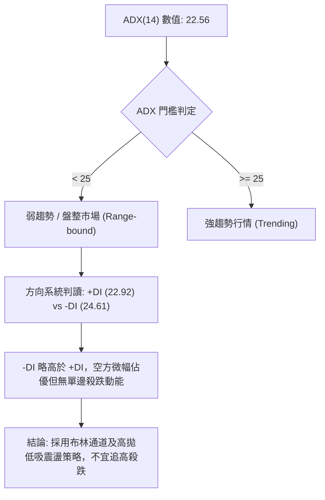
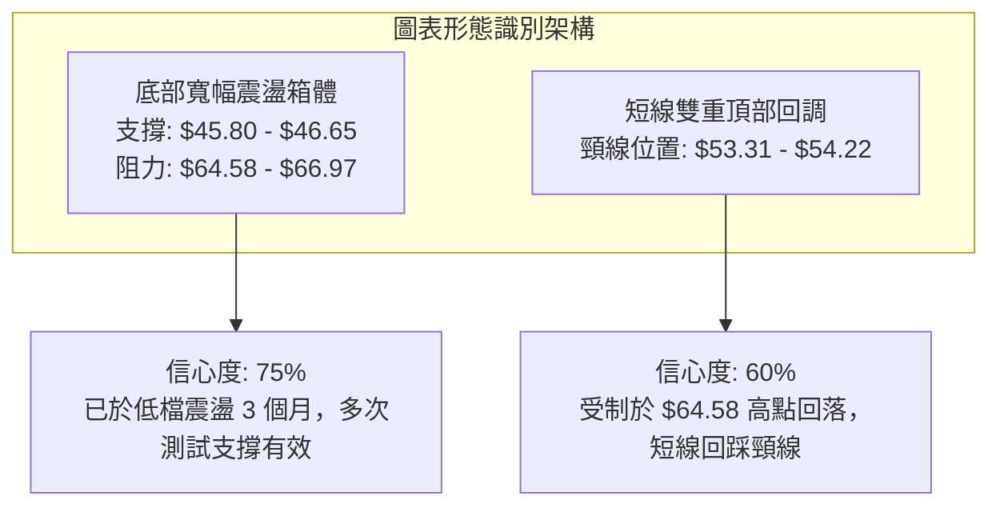
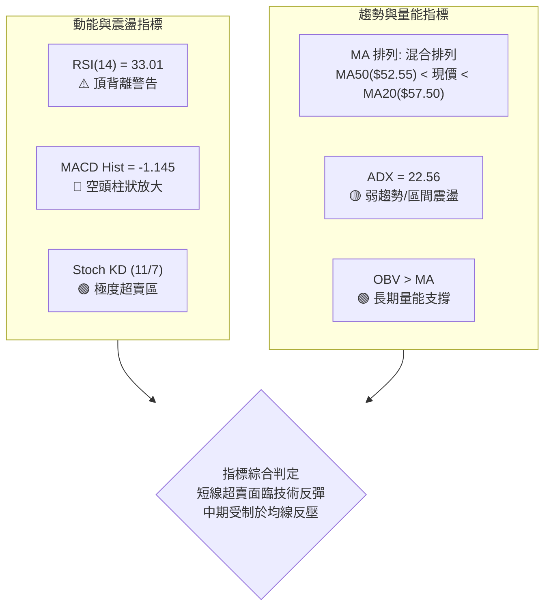
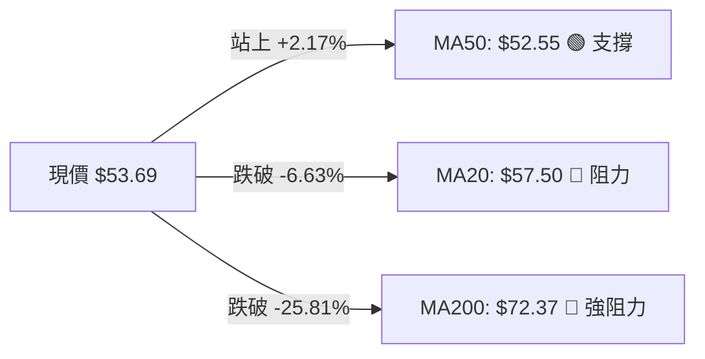
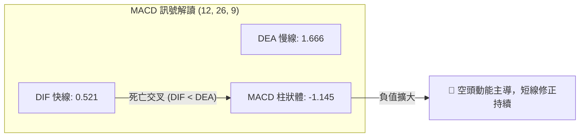
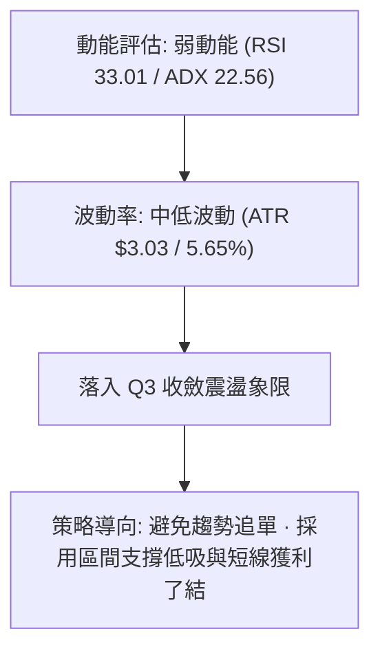
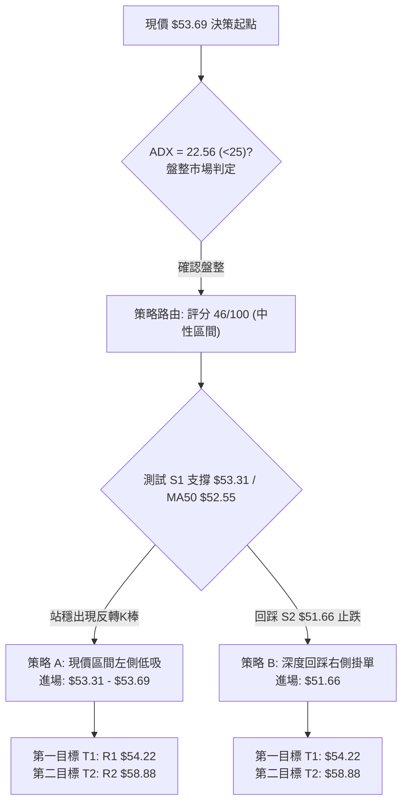
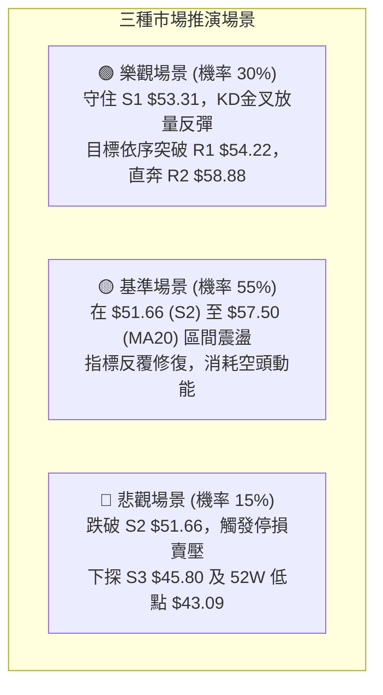

# KTOS 技術分析報告

> **報告日期**：2026-08-28 ｜ **語言**：繁體中文 ｜ **數據來源**：Yahoo Finance ｜ **當前價格**：$53.69

---

## 目錄

| 章節 | 內容 |
|------|------|
| [1. 技術面概覽](#1-技術面概覽) | 訊號儀表板、核心指標、評分卡 |
| [2. 趨勢分析](#2-趨勢分析) | 多時框趨勢、長中短期走勢、ADX解讀 |
| [3. 圖表形態分析](#3-圖表形態分析) | 形態識別、信心度評估、K線組合、目標價 |
| [4. 支撐與阻力](#4-支撐與阻力) | 關鍵價位結構、波段高低點、斐波那契回調 |
| [5. 技術指標深度解讀](#5-技術指標深度解讀) | MA排列、RSI背離、MACD、布林通道、量價OBV |
| [6. 動能與波動率](#6-動能與波動率) | 動能四象限、ATR波動度、Beta分析 |
| [7. 多時框架總結](#7-多時框架總結) | 時框架評分矩陣、多時框收斂結論 |
| [8. 交易策略建議](#8-交易策略建議) | 策略路由、價格情境階梯、主策略詳情、風報比 |
| [9. 風險提示與監控](#9-風險提示與監控) | 監控Checklist、風險場景、部位管理 |

---

## 1. 技術面概覽

### 🎯 技術訊號儀表板



### 📊 核心指標速覽表

| 指標類別 | 指標名稱 | 當前數值 | 訊號 | 解讀 |
|:---|:---|:---|:---:|:---|
| **價格** | 當前價格 | $53.69 | 🟡 | 位於52週區間11.7%低位，短線承壓但近中軌支撐 |
| **均線** | MA20 (短) | $57.50 | 🔴 | 價格在MA20下方 -6.63%，短期動能轉弱 |
| **均線** | MA50 (中) | $52.55 | 🟢 | 價格在MA50上方 +2.17%，中期支撐尚存 |
| **均線** | MA200 (長)| $72.37 | 🔴 | 價格在MA200下方 -25.81%，長期空頭排列 |
| **動能** | RSI(14) | 33.01 | 🟡 | 逼近超賣邊界(30)，但附帶頂背離風險 |
| **動能** | MACD Hist | -1.145 | 🔴 | MACD(0.521) < Signal(1.666)，空頭動能擴大 |
| **動能** | 隨機指標KD | %K 11.02 / %D 7.01 | 🟢 | 極度超賣區，醞釀短線技術性反彈 |
| **趨勢** | ADX(14) | 22.56 (-DI 24.61) | 🟡 | 趨勢強度弱(<25)，行情偏向盤整震盪 |
| **波動** | ATR(14) | $3.03 (5.65%) | 🟡 | 每日平均波動適中，提供操作緩衝空間 |
| **量能** | 20日均量比| 0.55x (2.13M/3.85M) | 🔴 | 量能萎縮，追價動能不足 |

### 🏆 技術評分卡

```
╔══════════════════════════════════════════════════════════════════╗
║              技術評分卡 — KTOS (2026-08-28)                      ║
╠══════════════════════════════════════════════════════════════════╣
║ 趨勢強度 (Trend)      ████████░░░░░░░░░░░░  40/100  🔴 空頭控盤  ║
║ 動能指標 (Momentum)   ██████░░░░░░░░░░░░░░  32/100  🔴 動能疲弱  ║
║ 支撐穩定度 (Support)  ████████████░░░░░░░░  60/100  🟡 支撐測試  ║
║ 成交量配合 (Volume)   ██████████░░░░░░░░░░  50/100  🟡 量縮觀望  ║
║ 形態完整度 (Pattern)  ████████████░░░░░░░░  58/100  🟡 區間築底  ║
║ 均線排列 (MA System)  ██████░░░░░░░░░░░░░░  36/100  🔴 混合空頭  ║
╠══════════════════════════════════════════════════════════════════╣
║ 綜合技術評分          █████████░░░░░░░░░░░  46/100  ⚖️ 區間震盪  ║
╚══════════════════════════════════════════════════════════════════╝
```

---

## 2. 趨勢分析

### 🌐 多時框趨勢分析



### 📈 長期趨勢 — 12個月走勢圖（Unicode）

```
KTOS 月線走勢圖（2025-08 至 2026-08）
價格 ($)
$105 ┤                               ● $103.01 (01月高點)
$95  ┤         ● $91.37  ● $90.60
$85  ┤                                     ● $86.18
$75  ┤                           ● $76.10  ● $75.91
$65  ┤   ● $65.84                                    ● $70.51  ● $63.05  ● $64.13
$55  ┤                                                                           ● $53.69 (現在)
$45  ┤                                                               ● $49.86  ● $46.60
     └─────┬─────────┬─────────┬─────────┬─────────┬─────────┬─────────┬─────────┬─────────┬─────────┬─────────┬─────────┬─────
         08/25     09/25     10/25     11/25     12/25     01/26     02/26     03/26     04/26     05/26     06/26     07/26  08/28
```

#### 走勢特徵分析表格

| 階段區間 | 價格區間 ($) | 漲跌幅 (%) | 走勢結構與特徵解讀 |
|:---|:---:|:---:|:---|
| **2025-08 ~ 2025-10** | $65.84 → $90.60 | +37.61% | 主升段加速衝刺，多頭動能強勁 |
| **2025-11 ~ 2025-12** | $90.60 → $75.91 | -16.21% | 高檔獲利回吐，進入首次中繼整理 |
| **2026-01** | $75.91 → $103.01 | +35.70% | 創下波段歷史新高，主力加速趕頂 |
| **2026-02 ~ 2026-04** | $103.01 → $63.05| -38.79% | 頂部確立，長黑急跌跌破中長期均線 |
| **2026-05 ~ 2026-07** | $64.13 → $46.60 | -27.33% | 探底至 52W 低點 $43.09 附近築底 |
| **2026-08 (當前)** | $46.60 → $53.69 | +15.21% | 脫離超賣區，自低檔展開防守性反彈 |

### 📊 中期趨勢（週線分析）

```
週線關鍵阻力與支撐區間結構
─────────────────────────────────────────────────────────────────
[強阻力] $66.97 (R3) ── 斐波那契回調位 $62.54 延伸阻力帶
        │ 
[中期阻力] $58.88 (R2) ── MA20 ($57.50) 及前波回檔平台
        │
[短期阻力] $54.22 (R1) ── 上週反彈承壓點
═════════════════════════════════════════════════════════════════
【現價】 $53.69 ◄── 位於 MA50 ($52.55) 與 S1 ($53.31) 支撐上方
═════════════════════════════════════════════════════════════════
[短期支撐] $53.31 (S1) ── 近期波段密集支撐
        │
[中期防線] $51.66 (S2) ── MA50 支撐區間下方防守點
        │
[底部防線] $45.80 (S3) ── 逼近 52W 低點 $43.09 及布林下軌 $46.65
─────────────────────────────────────────────────────────────────
```

### ⚡ 趨勢強度評估（ADX 解讀）



| 指標變數 | 當前讀數 | 門檻標準 | 狀態評估 | 策略意義 |
|:---|:---:|:---:|:---:|:---|
| **ADX(14)** | 22.56 | < 25 | 弱趨勢/震盪 | 趨勢跟隨無效，回歸震盪指標（布林、KD） |
| **+DI (14)** | 22.92 | - | 多方力量衰竭 | 買盤力道暫停，等待回調確認 |
| **-DI (14)** | 24.61 | - | 空方略佔上風 | 空方具有控盤優勢，但未形成趨勢壓制 |

---

## 3. 圖表形態分析

### 🔍 形態識別系統



#### 形態信心度與目標價評估表

| 識別形態 | 信心度 | 判斷依據（引用數據） | 完成度 | 目標價（附計算式） |
|:---|:---:|:---|:---:|:---|
| **低檔寬幅箱體** | 75% | 近3個月低點守住 $45.80 (S3)，高點受阻於 $64.58 / $66.97 (R3) | 70% | 箱體突破目標 = 箱頂 $64.58 + 高度 ($64.58 - $45.80 = $18.78) = **$83.36** |
| **短線雙頂回踩** | 60% | 08/09 及 08/16 兩次衝高 $60.77 與 $64.58 未果，跌破短頸線 $57.50 | 85% | 形態回調目標 = 頸線 $57.50 - 高度 ($64.58 - $57.50 = $7.08) = **$50.42** (接近S2 $51.66) |

### 🕯️ 重要K線形態分析

| 週/月份 | 收盤價 ($) | K線形態 | 解讀 | 訊號 |
|:---|:---:|:---|:---|:---:|
| **2026-06-28** | $47.21 | 爆量長下影線 (45.38M) | 巨量恐慌拋售後主力進場承接，確認 $43.09 底部 | 🟢 強烈見底 |
| **2026-08-09** | $60.77 | 實體大陽棒 (+30.4%) | 突破箱體中軌，買盤強烈進駐 | 🟢 多頭表態 |
| **2026-08-16** | $64.58 | 高檔流星線 (Shooting Star) | 衝高觸及波段高點受阻，留長上影線 | 🔴 漲勢受阻 |
| **2026-08-23** | $57.17 | 連續中黑陰線 | 跌破 MA20，多頭回吐獲利 | 🔴 短線轉弱 |
| **2026-08-30** | $53.69 | 量縮十字星/縮量陰線 | 逼近 MA50 ($52.55) 與 S1 ($53.31)，賣壓減緩 | 🟡 測試支撐 |

### 📉 ASCII 走勢形態示意圖

```
KTOS 雙頂回踩與箱體震盪示意圖
$66.97 (R3) ────────────────────────────────────────── 頂部阻力帶
                     高點1         高點2
                    $60.77        $64.58
                      ▲             ▲
                     ╱ ╲           ╱ ╲
                    ╱   ╲         ╱   ╲
$57.50 (MA20) ─────╱─────╲───────╱─────╲────────────── 頸線位置
                  ╱       ╲     ╱       ╲
                 ╱         ╲   ╱         ▼ 現價 $53.69 (測試中)
$53.31 (S1) ────╱───────────▼─▼───────────●────────── 短線支撐
               ╱            $55.35        │
$51.66 (S2) ──╱───────────────────────────┴────────── MA50 / 回調目標區 ($50.42)
             ╱
$45.80 (S3) ─● $43.09 (52W最低點 / 箱體底部)
```

### 🎯 形態目標價計算

1. **短期回調目標價**：
   - 雙頂頸線：$57.50
   - 形態頭部頂點：$64.58
   - 形態垂直高度 = $\$64.58 - \$57.50 = \$7.08$
   - **量測回調目標價** = $\$57.50 - \$7.08 = \$50.42$（此價位落在 S2 支撐 $\$51.66$ 與 MA50 $\$52.55$ 緩衝區下方）。

2. **中期突破目標價**：
   - 箱體底部：$45.80
   - 箱體頂部：$64.58
   - 箱體高度 = $\$64.58 - \$45.80 = \$18.78$
   - **等距向上目標價** = $\$64.58 + \$18.78 = \$83.36$（對應斐波那契 50.0% 回調位 $\$88.55$ 下方）。

---

## 4. 支撐與阻力

### 🗺️ 關鍵價位分布圖（Unicode）

```
KTOS 價位結構分布圖
══════════════════════════════════════════════════════════════════
$66.97 ║████████████████████████║ 強阻力 R3 (+24.73%)
$62.54 ║▓▓▓▓▓▓▓▓▓▓▓▓▓▓▓▓▓▓      ║ 斐波那契 78.6% 回調位
$58.88 ║████████████████        ║ 中期阻力 R2 (+9.67%)
$57.50 ║▓▓▓▓▓▓▓▓▓▓▓▓            ║ MA20 短期均線 / 布林中軌
$54.22 ║████████                ║ 短線阻力 R1 (+0.99%)
═══════╠════════════════════════╣ ◄ 現價 $53.69
$53.31 ║▓▓▓▓▓▓▓▓                ║ 近期關鍵支撐 S1 (-0.71%)
$52.55 ║▓▓▓▓▓▓▓▓▓▓▓▓            ║ MA50 均線強防守
$51.66 ║████████████████        ║ 中期支撐 S2 (-3.78%)
$46.65 ║▓▓▓▓▓▓▓▓▓▓▓▓▓▓▓▓▓▓      ║ 布林通道下軌
$45.80 ║████████████████████████║ 強底層支撐 S3 (-14.70%)
$43.09 ║████████████████████████║ 52週歷史低點 (100.0% 回調)
══════════════════════════════════════════════════════════════════
```

### 🚧 阻力位分析表

| 阻力級別 | 價位 ($) | 距離現價 | 形成原因 | 突破難度 | 重要性 |
|:---|:---:|:---:|:---|:---:|:---:|
| **R1** | **$54.22** | +0.99% | 近期波段高點密集聚類區、MA5 短均壓制 ($53.90) | 🟡 中等 | ★★★☆☆ |
| **R2** | **$58.88** | +9.67% | 近期反彈波段頂部、重疊 MA20/布林中軌 ($57.50) | 🔴 較高 | ★★★★☆ |
| **R3** | **$66.97** | +24.73%| 近一年多重頭部密集套牢區、接近 78.6% 斐波那契位 | 🔴 極高 | ★★★★★ |

### 🛡️ 支撐位分析表

| 支撐級別 | 價位 ($) | 距離現價 | 形成原因 | 守住機率 | 重要性 |
|:---|:---:|:---:|:---|:---:|:---:|
| **S1** | **$53.31** | -0.71% | 近期波段低點聚類、重疊 MA60 ($53.44) 與 MA50 ($52.55) | 🟢 70% | ★★★★☆ |
| **S2** | **$51.66** | -3.78% | 前波回檔低點密集區、雙頂形態量測滿足區 ($50.42) 上緣 | 🟢 80% | ★★★★☆ |
| **S3** | **$45.80** | -14.70%| 52W 底層結構聚類點、重疊布林下軌 ($46.65) 與 52W 低點 | 🟢 90% | ★★★★★ |

### 📐 斐波那契回調位分析

依據 52 週完整波動區間（低點 **$43.09** 至 高點 **$134.00**，總波幅 $90.91）計算之標準斐波那契回調位：

```
斐波那契回調結構 (52W High $134.00 → 52W Low $43.09)
0.0%  (52W High) ────────────────────────────── $134.00
23.6%            ────────────────────────────── $112.55
38.2%            ────────────────────────────── $99.27
50.0%            ────────────────────────────── $88.55
61.8%            ────────────────────────────── $77.82
78.6%            ────────────────────────────── $62.54 ── [關鍵中期反壓]
═════════════════════════════════════════════════════════════
【現價 $53.69 落在 78.6% ($62.54) 與 100.0% ($43.09) 區間】
═════════════════════════════════════════════════════════════
100.0% (52W Low) ────────────────────────────── $43.09 ── [絕對底部防線]
```

- **位置解讀**：現價 **$53.69** 處於深度回調的築底區（回撤幅度超過 78.6%），目前在 $43.09 ~ $62.54 底部區間內運行。
- **阻力映射**：若股價自低檔發動有效反彈，斐波那契 78.6% 回調位 **$62.54** 將與波段阻力 R3 ($66.97) 構成強大壓制帶。

---

## 5. 技術指標深度解讀

### 🎛️ 指標訊號總覽



### 📈 移動平均線排列分析



| 均線名稱 | 當前數值 | 價格相距 (%) | 走勢方向 | 排列性質與解讀 |
|:---|:---:|:---:|:---:|:---|
| **MA 5** | $53.90 | -0.39% | 走平微跌 | 超短期壓制線，即將與現價黏合 |
| **MA 10** | $57.61 | -6.80% | 下彎 | 短期下行趨勢顯著 |
| **MA 20** | $57.50 | -6.63% | 下彎 | 月線級別反壓，短期空方防守線 |
| **MA 50** | $52.55 | +2.17% | 走平向上 | 季線級別生命線，提供強勁多頭緩衝 |
| **MA 60** | $53.44 | +0.47% | 走平 | 密集支撐帶，多空短兵相接處 |
| **MA 120**| $61.29 | -12.39% | 下彎 | 半年線壓制 |
| **MA 200**| $72.37 | -25.81% | 下彎 | 長期牛熊分界線，長期結構仍處空頭修復 |

### 📉 RSI(14) 分析

```
RSI(14) 強度指標：33.01
[ 0 ──────── 超賣 30 ────── 現價 33.01 ────────── 中軸 50 ────────── 超買 70 ────── 100 ]
  ███████████░░░░░░░░░░░░░░░░░░░░░░░░░░░░░░░░░░░░░░░░░░░░░░░░░░░░░  33.01%
```

- **背離判斷**：⚠️ **存在頂背離 (Bearish Divergence)**。
  - **細節驗證**：股價在 2026-08-16 創下波段高點 $64.58 時，週線 RSI 達到 76.7；隨後股價雖維持在相對高檔震盪，但日線 RSI 急劇下挫至 33.01，動能衰退速度遠快於價格回檔，引發近兩週的價格修正。目前 RSI 已逼近 30 超賣線，短線下跌動能已獲大幅釋放。

### 📊 MACD(12/26/9) 訊號解讀



- **狀態評估**：DIF (0.521) 位於 DEA (1.666) 下方，柱狀圖為 **-1.145**，確認處於空頭修正波段。但快慢線仍位於零軸之上，顯示本次回檔屬於自 $43.09 反彈以來的中級回撤，尚未破壞中線反彈架構。

### 📦 布林通道分析

```
KTOS 布林通道 (20, 2) 結構圖
$68.35 ────────────────────────────────────── BB 上軌 (Upper Band)
                     ▲ 
                     │ 帶寬 (Bandwidth) = $21.70
$57.50 ────────────────────────────────────── BB 中軌 (MA20)
                     │
       現價 $53.69 ──● (%B = 0.32) ── 偏向中下軌間
                     │
$46.65 ────────────────────────────────────── BB 下軌 (Lower Band)
```

- **布林指標解讀**：
  - **%B 指標為 0.32**，顯示價格落在中軌 ($57.50) 與下軌 ($46.65) 之間，偏向弱勢區。
  - 下軌 $46.65 與 S3 支撐 ($45.80) 形成雙重動態防線，空間下行受限。

### 💹 成交量分析（量價配合度）

```
成交量對比：
今日成交量: 2.135M  ███████████░░░░░░░░░ (0.55x)
20日均量:   3.850M  ████████████████████ 
50日均量:   4.520M  ████████████████████████
```

- **量價特徵**：最新成交量僅 2,135,100 股，僅為 20 日均量的 55%，呈現典型的**「價跌量縮」**格局。量能並未在下跌中失控放大，顯示未出現恐慌性拋售。
- **OBV 趨勢**：數據顯示 **OBV > MA**，長期量能維持在上漲均線之上，資金底層承接力道仍在，量價並未實質惡化。

---

## 6. 動能與波動率

### ⚡ 動能評估四象限

| 象限 | 動能維度 (Momentum) | 波動維度 (Volatility) | KTOS 當前落點 | 策略意義與環境評估 |
|:---|:---:|:---:|:---:|:---|
| **Q1 (爆發區)** | 強動能 | 高波動 | — | 突破單邊市，適合順勢重倉追擊 |
| **Q2 (穩定區)** | 強動能 | 低波動 | — | 主升段平穩運行，持股續抱 |
| **Q3 (收斂區)** | **弱動能 (ADX=22.5)** | **低/中波動 (ATR=5.6%)** | **【KTOS 落點】✓** | **箱體盤整期，宜高拋低吸，嚴格控制部位** |
| **Q4 (恐慌區)** | 弱動能 | 極高波動 | — | 主跌崩潰段，嚴禁盲目進場接刀 |



### 📊 ATR 波動率分析

- **ATR(14) 數值**：**$3.03**（佔當前股價 **5.65%**）。
- **日內波動區間推估**：單日預期合理波動區間為 $\$53.69 \pm \$3.03 \rightarrow [\$50.66, \$56.72]$。
- **動態止損設定基準**：
  - 保守型交易（1.5 倍 ATR）：止損距離 = $1.5 \times \$3.03 = \$4.55$。
  - 短線激進型（1.0 倍 ATR）：止損距離 = $1.0 \times \$3.03 = \$3.03$。

### 📐 Beta 與市場相關性

- **Beta 係數**：**1.106**（相對於 S&P 500 具有略高的波動放大效應）。
- **市場連動分析**：KTOS 作為國防科技與無人系統標的，Beta 略大於 1，顯示大盤回檔時其跌幅可能略深於指數，但反彈時具備彈性；機構持股比例高達 **85.4%**，籌碼穩定度高，散戶踩踏風險相對受控。

---

## 7. 多時框架總結

### 📋 時框架評分表

| 時框架 | 趨勢方向 | 動能狀態 | 均線排列 | 形態結構 | 綜合評分 | 操作建議 |
|:---|:---:|:---:|:---:|:---:|:---:|:---|
| **短期 (日線)** | 🔴 回調整理 | 🔴 柱狀擴大 | 🔴 跌破 MA20 | 雙頂回踩頸線 | **38/100** | 不宜追空，等待 S1/S2 止跌訊號 |
| **中期 (週線)** | 🟡 寬幅箱體 | 🟡 中性回落 | 🟢 站穩 MA50 | 底部大箱體整理 | **55/100** | 箱體下緣分批承接，高拋低吸 |
| **長期 (月線)** | 🔴 深度修正 | 🟡 超跌回穩 | 🔴 位於 MA200 下 | 52W 低點沉澱築底 | **45/100** | 長線定期定額或耐心等待結構翻多 |

### 🔲 綜合訊號矩陣

```
時框訊號共振矩陣
─────────────────────────────────────────────────────────────────
指標項目          短期 (日線)        中期 (週線)        長期 (月線)
─────────────────────────────────────────────────────────────────
Trend (趨勢)        🔴 空頭回踩        🟡 區間震盪        🔴 空頭修復
Moving Average      🔴 位於MA20下      🟢 站穩MA50        🔴 位於MA200下
MACD                🔴 死叉負柱        🟡 零軸上方修正    🔴 空頭區
RSI / KD            🟢 KD超賣醞釀反彈  🟡 RSI回落至中性    🔴 低檔鈍化
Volume / OBV        🟢 量縮無拋壓      🟢 OBV長期走多     🟡 量能沉澱
─────────────────────────────────────────────────────────────────
整體方向收斂        🟡【短線超賣測試支撐，中線處於箱體築底震盪】
─────────────────────────────────────────────────────────────────
```

### ⚖️ 多時框收斂結論

依據多時框收斂優先級規則：
1. **趨勢/盤整識別**：當前 ADX(14) 讀數為 **22.56 (<25)**，明確定義當前處於**「非趨勢性盤整行情」**。
2. **時框主導權**：在盤整行情中，中長期的單邊均線追隨失效，行情由**日線布林通道 ($46.65 ~ $68.35) 與波段高低點 (S1: $53.31 / R1: $54.22 / R2: $58.88)** 主導交易區間。
3. **最終方向判定**：**【中性觀望·區間操作】**（偏向在下軌支撐處尋找低吸機會）。綜合評分為 **46/100**，策略鎖定**「區間防守型低吸反彈」**。

---

## 8. 交易策略建議

### 🗺️ 策略決策流程圖



### 🧭 策略路由（依評分卡分流）

> **當前主策略方向 = 【中性偏多·區間低吸操作】（依技術綜合評分 46/100 定位為箱體震盪交易）**
> 
> 因 ADX < 25 且 KD 極度超賣，不建議在此位置進行追空操作；應依賴 S1 ($53.31) 與 MA50 ($52.55) 構成的強支撐防線，採取嚴格停損的區間反彈多頭策略。

### 🎯 價格情境階梯（Price Scenarios）

| 觸發條件 | 下一目標 | 後續延伸 | 情境含義與操作指引 |
|:---|:---:|:---:|:---|
| **向上突破 R1 $54.22** | **R2 $58.88** | **R3 $66.97** | 短線轉強，突破 MA20 ($57.50)，可加碼看至箱頂 |
| **守住現價區間 ($52.55 - $53.69)**| **R1 $54.22** | **R2 $58.88** | 區間築底震盪，KD 黃金交叉醞釀技術反彈 |
| **有效跌破 S1 $53.31 / S2 $51.66**| **S3 $45.80** | **$43.09** | 中期結構破位，空方擴大，多單停損退場觀望 |

### 📊 情境機率分佈

```
情境機率分佈圖：
區間震盪築底 (55%)  ███████████████████████████░░░░░░░░░░░░
反彈向上挑戰 (30%)  ███████████████░░░░░░░░░░░░░░░░░░░░░░░
向下破位探底 (15%)  ███████░░░░░░░░░░░░░░░░░░░░░░░░░░░░░░
```

| 市場情境 | 發生機率 | 主要技術指標依據 |
|:---|:---:|:---|
| **區間震盪築底** | **55%** | ADX(14)=22.56 低於 25，布林通道中下軌收斂，量能萎縮至 0.55x。 |
| **超賣反彈向上** | **30%** | KD 指標 (%K 11.02, %D 7.01) 嚴重超賣，OBV 維持多頭，MA50 ($52.55) 提供強力支撐。 |
| **破位再探低點** | **15%** | MACD 柱狀體負向放大 (-1.145)，RSI 頂背離餘波尚存。 |

### 🟢 主策略詳情

| 策略要素 | 策略 A（現價區間積極低吸） | 策略 B（S2 支撐保守掛單） |
|:---|:---|:---|
| **適用場景** | 預期 S1 與 MA50 支撐有效，直接博弈超賣反彈 | 等待短線雙頂回調量測目標 ($50.42) 接近 S2 時低吸 |
| **進場條件** | 5分/日K在 $53.31 ~ $53.69 出現止跌K線 | 回踩 $51.66 獲支撐且不跌破 |
| **進場價格** | **$53.69** (現價) | **$51.66** (S2 支撐) |
| **目標價 T1** | **$54.22** (R1 阻力, +0.99%) | **$54.22** (R1 阻力, +4.96%) |
| **目標價 T2** | **$58.88** (R2 阻力, +9.67%) | **$58.88** (R2 阻力, +13.98%) |
| **止損價格** | **$51.66** (S2 跌破止損, -3.78%) | **$45.80** (S3 跌破止損, -11.34%) |
| **風險報酬比** | **1 : 2.56** (以T2計算: +$5.19 / -$2.03) | **1 : 1.23** (以T2計算: +$7.22 / -$5.86) |
| **成功機率** | **60%** | **70%** |
| **建議倉位** | **10% ~ 15%** (輕倉試單) | **15% ~ 20%** (標準分批倉位) |

### 🔴 反向風險觸發點（對沖提示）

- **多頭全面棄守點**：若日線收盤價**實體跌破 S2 ($51.66)** 且成交量放大，代表雙頂形態完全發酵，多頭應全面停損離場。
- **空頭回補/反轉點**：若股價放量**帶量突破 R2 ($58.88)** 並收復 MA20 ($57.50)，空方應立即回補對沖部位，順勢翻多。

### ⭐ 整體訊號強度評星

```
做多訊號強度：★★★☆☆  (3.0/5星 — 超賣醞釀反彈，但受制均線)
做空訊號強度：★★☆☆☆  (2.0/5星 — 空間受限於 MA50 與布林下軌)
整體可信度：  ★★★☆☆  (3.5/5星 — 震盪行情形態明確，價位具體)
```

---

## 9. 風險提示與監控

### ✅ 關鍵監控指標 Checklist

```
╔══════════════════════════════════════════════════════════════════╗
║                KTOS 日常交易風控監控清單 (Checklist)             ║
╠══════════════════════════════════════════════════════════════════╣
║ [ ] 價格是否跌破 MA50 生命線 ($52.55) 或 S1 ($53.31)              ║
║ [ ] KD 指標是否在超賣區 (<20) 形成 %K 向上穿過 %D 的黃金交叉     ║
║ [ ] MACD 柱狀體負值是否開始收斂 (數值由 -1.145 向上回升)         ║
║ [ ] 日成交量是否回升至 20日均量 (3.85M) 之上確認突破動能         ║
║ [ ] ADX 讀數是否突破 25 (若突破則意味著單邊趨勢形成，停止震盪策略) ║
║ [ ] 價格向上測試 R1 ($54.22) 與 MA20 ($57.50) 時的量價反應       ║
╚══════════════════════════════════════════════════════════════════╝
```

### ⚠️ 風險場景分析



### 🛡️ 風險管理重要提醒

1. **嚴格執行價格紀律**：當前行情處於 ADX 22.56 的無趨勢震盪期，切忌在壓力位 R1 ($54.22) 或 R2 ($58.88) 追價；進場點必須緊貼支撐位 S1 ($53.31) 或 S2 ($51.66)。
2. **部位規模控管**：
   - 總投資組合中 KTOS 單一標的曝險建議控制在 **5% ~ 10%** 以內。
   - 單筆交易的最大容許損失金額不得超過總帳戶淨值的 **1.0%**。
3. **波動適應調整**：當前 ATR 為 $3.03，日內震盪幅度逾 5.6%，掛單應適度放寬委託區間，避免在日內正常噪音中被震盪洗出場。

---

## 📋 報告總結

```
╔══════════════════════════════════════════════════════════════════╗
║                     KTOS 技術分析報告總結                        ║
╠══════════════════════════════════════════════════════════════════╣
║ 報告日期：2026-08-28                                             ║
║ 當前價格：$53.69                                                 ║
║ 技術評級：⚖️ 中性震盪（評分 46/100 · 區間築底）                   ║
║                                                                  ║
║ 關鍵結論：                                                       ║
║ ├─ 長期趨勢：🔴 空頭修正（低於 MA200 $72.37，處於52W低檔沉澱期） ║
║ ├─ 中期趨勢：🟡 寬幅箱體（站穩 MA50 $52.55，在 $45.80-$66.97 震盪）║
║ ├─ 短期趨勢：🔴 回踩整理（雙頂回踩頸線，跌破 MA20 $57.50）       ║
║ ├─ 關鍵支撐：S1: $53.31 ｜ S2: $51.66 ｜ S3: $45.80             ║
║ ├─ 關鍵阻力：R1: $54.22 ｜ R2: $58.88 ｜ R3: $66.97             ║
║ └─ 華爾街目標：均價 $105.62（低標 $60.00 / 高標 $150.00）       ║
║                                                                  ║
║ 最優策略組合：                                                   ║
║ 1. 🥇 最佳機會：在現價 $53.69 / S1 $53.31 輕倉布局超賣反彈，     ║
║                 目標 R2 $58.88，嚴格止損於 S2 $51.66（風報比 1:2.56）║
║ 2. 🥈 次選機會：掛單 S2 $51.66 等待量測回調滿足點低吸，止損 S3   ║
║ 3. 🥉 保守選擇：空手觀望，等待放量突破 R2 $58.88 確認重返多頭    ║
╚══════════════════════════════════════════════════════════════════╝
```

---

> ⚠️ **免責聲明**：本報告為 AI 自動生成之技術分析，所有數據及估算均基於提供的歷史價格資訊。本報告**僅供研究與學術參考**，**不構成任何投資建議**。投資有風險，入市需謹慎。

---

*報告生成時間：2026-08-28 ｜ 數據來源：Yahoo Finance ｜ 分析框架：多時框技術分析*