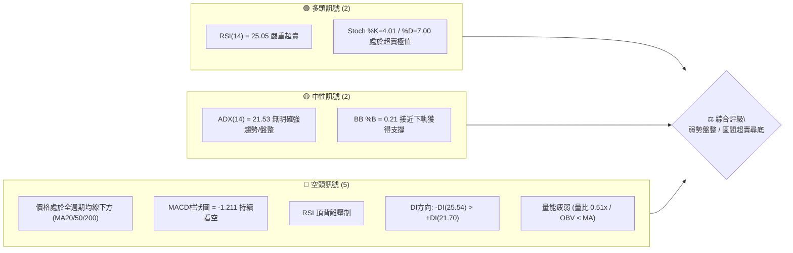
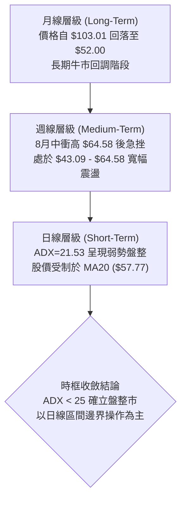
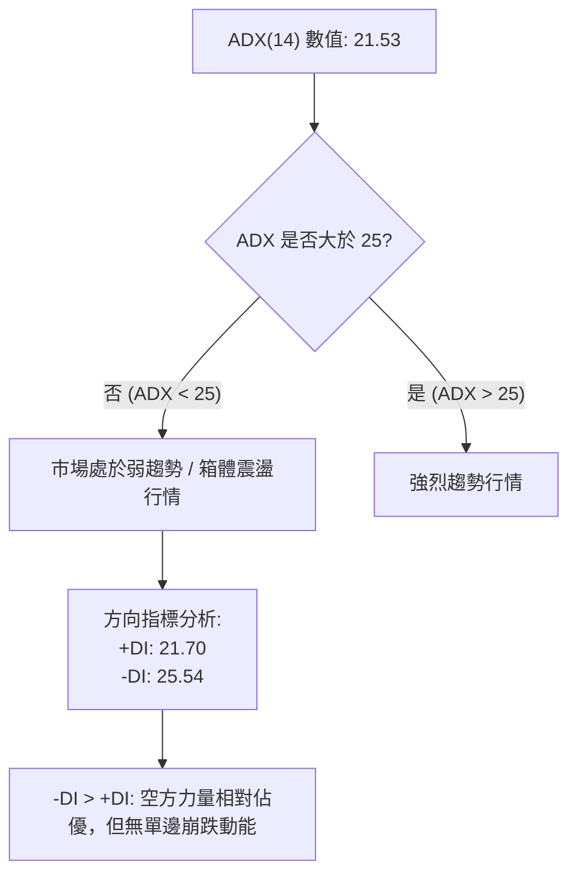
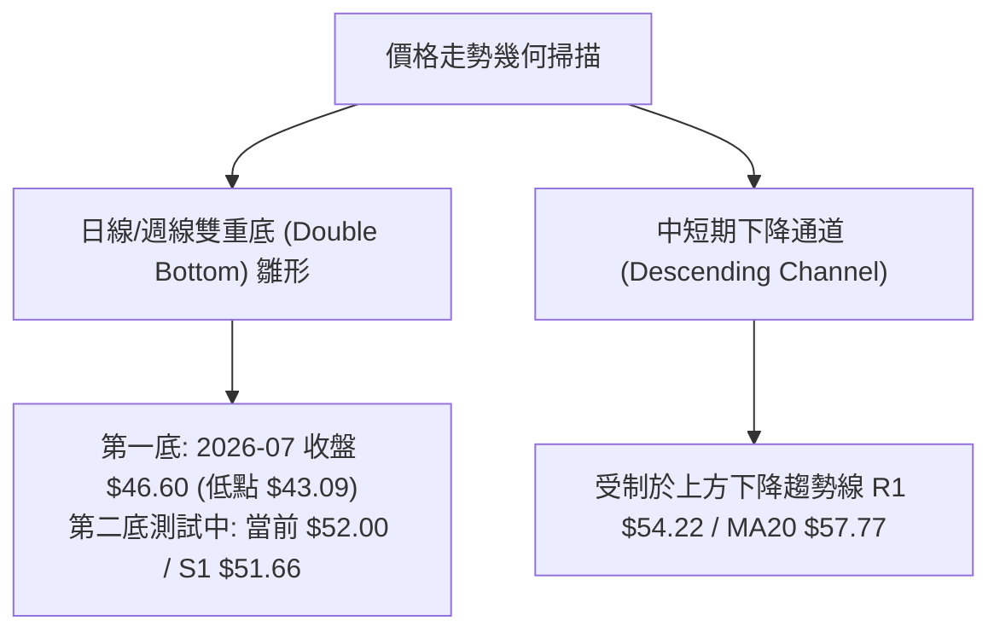
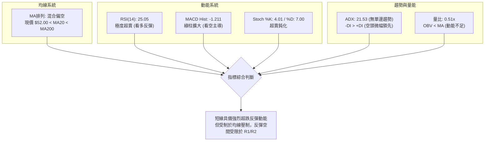
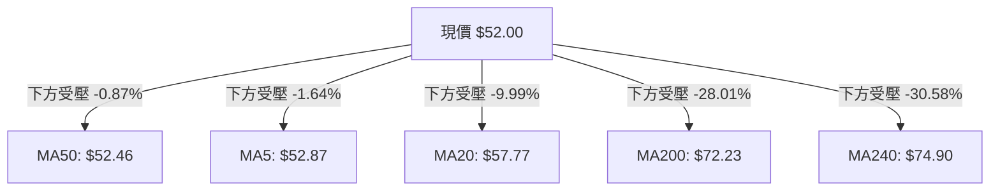
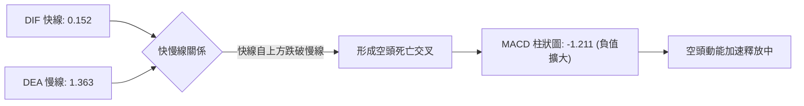
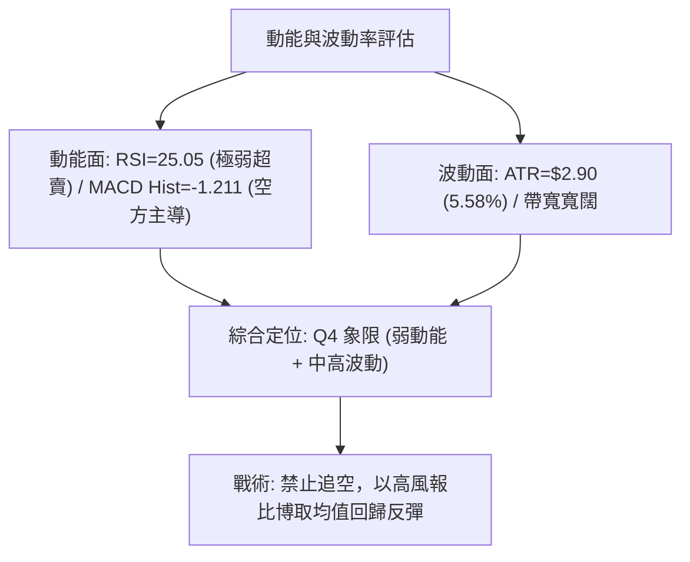
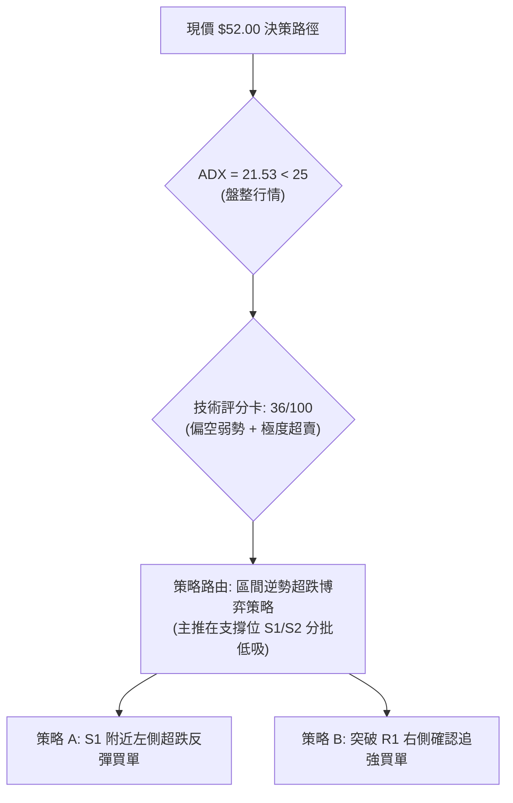
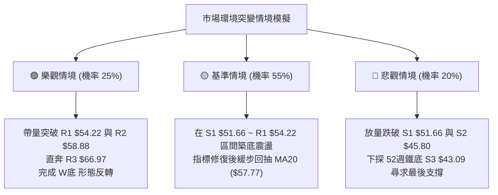

# KTOS 技術分析報告

> **報告日期**：2026-08-30 ｜ **語言**：繁體中文 ｜ **數據來源**：Yahoo Finance ｜ **當前價格**：$52.00

---

## 目錄

| 章節 | 內容 |
|------|------|
| [1. 技術面概覽](#1-技術面概覽) | 訊號儀表板、核心指標、評分卡 |
| [2. 趨勢分析](#2-趨勢分析) | 多時框趨勢、長中短期走勢、ADX解讀 |
| [3. 圖表形態分析](#3-圖表形態分析) | 形態識別、K線組合、目標價推算 |
| [4. 支撐與阻力](#4-支撐與阻力) | 關鍵價位分布、斐波那契回調結構 |
| [5. 技術指標深度解讀](#5-技術指標深度解讀) | MA/RSI/MACD/布林通道/量價關係 |
| [6. 動能與波動率](#6-動能與波動率) | 動能四象限、ATR波動分析、Beta值 |
| [7. 多時框架總結](#7-多時框架總結) | 時框架評分矩陣與多時框收斂結論 |
| [8. 交易策略建議](#8-交易策略建議) | 策略路由、價格情境、主交易策略 |
| [9. 風險提示與監控](#9-風險提示與監控) | 監控Checklist、風險場景與倉位管理 |

---

## 1. 技術面概覽

### 🎯 技術訊號儀表板



### 📊 核心指標速覽表

| 指標類別 | 指標名稱 | 當前數值 | 訊號 | 解讀 |
|----------|----------|----------|------|------|
| **價格** | 當前價格 | $52.00 | 🔴 | 位於52週區間 9.8% 低位，接近年內底部 |
| **均線** | MA20 | $57.77 | 🔴 | 價格低於 MA20 (-9.99%)，短線承壓 |
| **均線** | MA50 | $52.46 | 🔴 | 價格低於 MA50 (-0.87%)，處於多空爭奪臨界點 |
| **均線** | MA200 | $72.23 | 🔴 | 價格遠低於牛熊分界線 (-28.01%)，長期趨勢偏空 |
| **動能** | RSI(14) | 25.05 | 🟢 | 進入極度超賣區（<30），隨時有技術性反彈需求 |
| **動能** | MACD | -1.211 (Hist) | 🔴 | 快慢線均在零軸附近走弱，動能柱持續負向擴大 |
| **趨勢** | ADX(14) | 21.53 | 🟡 | ADX < 25 表明處於無方向或弱趨勢盤整市場 |
| **波動** | ATR(14) | $2.90 | 🟡 | ATR佔股價比率 5.58%，屬於中等偏高常態波動 |
| **通道** | 布林通道 | %B = 0.21 | 🟡 | 下軌 $47.83 至中軌 $57.77 區間，逼近下軌支撐 |
| **量能** | 20日均量比 | 0.51x | 🔴 | 成交量 1.97M 萎縮，OBV < MA 顯示資金追高意願不足 |

### 🏆 技術評分卡

```
╔══════════════════════════════════════════════════════════════╗
║              技術評分卡 — KTOS (2026-08-30)                  ║
╠══════════════════════════════════════════════════════════════╣
║ 趨勢強度 (Trend)     ██████░░░░░░░░░░░░░░  30/100  🔴 空頭主導  ║
║ 動能指標 (Momentum)  ████████░░░░░░░░░░░░  40/100  🟡 超賣反彈  ║
║ 支撐穩定度 (Support) ████████████░░░░░░░░  60/100  🟡 臨近S1   ║
║ 成交量配合 (Volume)  ██████░░░░░░░░░░░░░░  30/100  🔴 量能萎縮  ║
║ 形態完整度 (Pattern) ████████░░░░░░░░░░░░  40/100  🟡 底部構築  ║
║ 均線排列 (MovingAvg) ████░░░░░░░░░░░░░░░░  20/100  🔴 混合空頭  ║
╠══════════════════════════════════════════════════════════════╣
║ 綜合評分             ████████░░░░░░░░░░░░  36/100  🔴 偏空弱勢  ║
╚══════════════════════════════════════════════════════════════╝
```

---

## 2. 趨勢分析

### 🌐 多時框趨勢分析



### 📈 長期趨勢 — 12個月走勢圖（Unicode）

```
KTOS 月線走勢圖（2025-09 至 2026-08）
價格軸 ($)
$105 ┤                               ●(2026-01: $103.01)
$95  ┤      ●(2025-09: $91.37)
$85  ┤                                   ●(2026-02: $86.18)
$75  ┤                  ●(2025-11: $76.10)
$65  ┤                                           ●(2026-05: $64.13)
$55  ┤                                                   ●(2026-08: $52.00)◄現價
$45  ┤                                               ●(2026-07: $46.60)
     └─────────────────────────────────────────────────────────────
       09   10   11   12   01   02   03   04   05   06   07   08 (月份)
```

#### 走勢特徵分析表格

| 階段 | 期間 | 價格區間 | 累積漲跌幅 | 走勢特徵解讀 |
|------|------|----------|------------|--------------|
| **頂部衝刺期** | 2025-09 ~ 2026-01 | $90.60 → $103.01 | +13.70% | 歷史高點 $134.00 形成後的二次衝頂，量能無法持續，形成中期頭部 |
| **主跌回調期** | 2026-01 ~ 2026-04 | $103.01 → $63.05 | -38.79% | 連續跌破 MA50 與 MA200，呈現流暢的空頭主跌段 |
| **底部探戈期** | 2026-05 ~ 2026-08 | $64.13 → $52.00 | -18.91% | 下探 52週低點 $43.09 後在 $46~$65 區間構築震盪箱體，目前處於回踩下緣 |

### 📊 中期趨勢（週線分析）

```
週線區間震盪與阻力結構示意圖
$70.00 ┤────────────────────────────────────────── [歷史籌碼重壓區]
$64.58 ┤                     ● (08-16 高點) ───── [反彈波段頂部 R3: $66.97 附近]
$58.88 ┤               ●                       ─── [中期頸線阻力 R2]
$54.22 ┤         ●                             ─── [短線反壓 R1]
$52.00 ┤═════════════════════════●════════════════ [現價 $52.00]
$45.80 ┤                                       ─── [波段防守 S2]
$43.09 ┤   ● (52W Low)                         ─── [年度鐵底 S3]
```

### ⚡ 趨勢強度評估（ADX 解讀）



| 指標變數 | 數值 | 狀態評估 | 戰略意涵 |
|----------|------|----------|----------|
| **ADX(14)** | 21.53 | 弱勢/無趨勢 (閾值 25) | 趨勢策略（如突破追單）容易遭遇假突破，應切換為震盪逆勢思維 |
| **+DI (14)** | 21.70 | 多頭進攻力道不足 | 買盤缺乏連續推升能量 |
| **-DI (14)** | 25.54 | 空頭壓制但未失控 | 賣壓佔據主導，但未形成極端恐慌拋售潮 |

---

## 3. 圖表形態分析

### 🔍 形態識別系統



#### 形態識別與信心度評估表

| 形態名稱 | 信心度 | 判斷依據（引用數據） | 完成度 | 目標價（附精確計算式） |
|----------|--------|----------------------|--------|------------------------|
| **潛在雙重底 (W底)** | 55% | 左底 2026-07-19 收盤 $46.03 (52W Low $43.09)，右底目前於 S1 $51.66 尋求支撐 | 60% | 頸線阻力取 R2 $58.88，最低點取 S3 $43.09。<br/>形態高度 = $58.88 - $43.09 = $15.79<br/>突破頸線目標 = $58.88 + $15.79 = **$74.67** |
| **下降收斂通道** | 70% | 8月中自 $64.58 連續兩週大幅下殺，高點持續降低受壓於 MA20 ($57.77) | 85% | 由通道下軌 $47.83 (布林下軌) 與支撐 S2 **$45.80** 構成下檔目標 |
| **頭肩頂形態** | <30% | 數據不足以支撐完整大型幾何頭肩結構 | 0% | *訊號不足，僅做指標型解讀，不預設目標價* |

### 🕯️ 重要K線形態分析

| 日期 / 週別 | 收盤價 | K線形態特徵 | 技術解讀 | 多空訊號 |
|-------------|--------|-------------|----------|----------|
| **2026-08-09** | $60.77 | 帶量長陽棒 (+30.4%) | 突破短線整理平台，RSI 自 49 飆升至 74.1 | 🟢 強烈看多 |
| **2026-08-16** | $64.58 | 衝高滯漲十字星/上影線 | 觸及波段高點，MACD 柱達頂部 +1.743，動能衰竭 | 🟡 警告訊號 |
| **2026-08-23** | $57.17 | 中長陰線吞噬 | 跌破 20日均線，MACD 柱翻負 (-0.181)，確認短頂 | 🔴 短線翻空 |
| **2026-08-30** | $52.00 | 縮量探底中長陰 | 測試 MA50 ($52.46) 與 S1 ($51.66)，RSI 跌至 25.05 嚴重超賣 | 🔴 空頭釋放/🟢 醞釀超跌反彈 |

### 📉 ASCII 走勢形態示意圖

```
KTOS 潛在雙底與箱體震盪示意圖
$65.00 ┤                     ▲ 頸線壓力 R2: $58.88 / 高點 $64.58
$60.00 ┤                    / \
$55.00 ┤        ▲          /   \              ▲ 反彈目標 R1: $54.22
$52.00 ┤───────/─\────────/─────\────────────●─── [現價 $52.00]
$50.00 ┤      /   \      /       \          /     [右底構築中 S1: $51.66]
$45.00 ┤     /     ▼────          ▼────────       [左底低點 S2: $45.80]
$40.00 ┤    ● (07月低點 $43.09)
       └─────────────────────────────────────────
```

### 🎯 形態目標價計算

- **多頭反轉假說（雙底確認突破）**：
  - 假設條件：股價守住 S1 $51.66 並向上有效突破頸線 R2 $58.88。
  - 計算式：$58.88 + ($58.88 - $43.09) = **$74.67**（該推算價位接近斐波那契 61.8% 回調位 $77.82 與 MA240 $74.90 聚類區）。
- **空頭中繼假說（跌破震盪區間）**：
  - 假設條件：若 S1 $51.66 與 S2 $45.80 失守，形態將轉化為單邊下行。
  - 下行測試目標：直接指向 52週最低點 S3 **$43.09**。

---

## 4. 支撐與阻力

### 🗺️ 關鍵價位分布圖（Unicode）

```
KTOS 價位結構分布圖
══════════════════════════════════════════════════════════════
$134.00 ║                                  ║ 52週歷史高點 (0.0% Fib)
$77.82  ║████████████████████████████████  ║ 中期強阻力 (61.8% Fib)
$66.97  ║████████████████████████          ║ 強阻力 R3 (波段高點聚類)
$58.88  ║████████████████                  ║ 中期頸線阻力 R2 / BB中軌附近
$54.22  ║████████                          ║ 短線反彈阻力 R1 (MA5/MA50交界)
$52.00  ╠══════════════════════════════════╣ ◄ 現價 ($52.00)
$51.66  ║▓▓▓▓▓▓▓▓▓▓▓▓▓▓▓▓▓▓▓▓▓▓▓▓▓▓▓▓▓▓    ║ 關鍵短線支撐 S1 (-0.65%)
$45.80  ║████████████████████████          ║ 強支撐 S2 (-11.93%)
$43.09  ║████████████████████████████████  ║ 52週鐵底支撐 S3 (100.0% Fib)
══════════════════════════════════════════════════════════════
```

### 🚧 阻力位分析表

| 阻力級別 | 價位 | 形成原因 | 突破難度 | 重要性 |
|----------|------|----------|----------|--------|
| **R1** | **$54.22** | 近期下行波段反彈第一阻力，與 MA5 ($52.87)、MA60 ($53.33) 密集重疊 | 中等（需放量 1.5x 以上） | ★★★☆☆ 短線轉強節點 |
| **R2** | **$58.88** | 8月中旬震盪平台與 MA20 ($57.77)、布林中軌共振壓制區 | 較高（空頭重要防線） | ★★★★☆ 中期多空分水嶺 |
| **R3** | **$66.97** | 8月反彈波段最高點聚類區，接近布林上軌 ($67.71) | 極高（需大盤與基本面爆發） | ★★★★★ 多頭反轉確認點 |

### 🛡️ 支撐位分析表

| 支撐級別 | 價位 | 形成原因 | 守住機率 | 重要性 |
|----------|------|----------|----------|--------|
| **S1** | **$51.66** | 近期日線與週線波段低點聚類，距離現價僅 -0.65% | 60% (短線超賣具支撐) | ★★★★☆ 盤整底線 |
| **S2** | **$45.80** | 7月整理平台低點聚類，接近布林下軌 ($47.83) 緩衝區 | 75% (強支撐區間) | ★★★★☆ 中期防禦樞紐 |
| **S3** | **$43.09** | 52週最低點（2026年年度絕對支撐） | 90% (極限安全邊際) | ★★★★★ 長期趨勢生命線 |

### 📐 斐波那契回調位分析

依據 52週極值區間（低點 $43.09 → 高點 $134.00，總落差 $90.91）計算之標準斐波那契回調架構：

```
斐波那契回調位與現價位置解讀
 0.0%  $134.00 ┤ 52W High
23.6%  $112.55 ┤
38.2%   $99.27 ┤
50.0%   $88.55 ┤
61.8%   $77.82 ┤ ─────────── 長期強阻力 / MA200 ($72.23) 附近
78.6%   $62.54 ┤ ─────────── 8月反彈遇阻區間 (8/16收盤 $64.58)
================ 現價 $52.00 位於 78.6% ($62.54) 與 100.0% ($43.09) 深度回調區 ══
100.0%  $43.09 ┤ 52W Low (年度鐵底)
```

- **位置解讀**：現價 $52.00 處於深度的超跌回調帶（跌破 78.6% 回調位 $62.54），屬於高風險但潛在彈性大的價值修復區間。若跌破 $43.09 將打破一年以來的定價結構。

---

## 5. 技術指標深度解讀

### 🎛️ 指標訊號總覽



### 📈 移動平均線排列分析



| 均線名稱 | 數值 | 偏離度 | 走勢特徵 | 訊號評級 |
|----------|------|--------|----------|----------|
| **MA 5** | $52.87 | -1.64% | 短線急速向下拐頭，壓制當前價格 | 🔴 短期壓制 |
| **MA 10** | $56.35 | -7.72% | 下行斜率陡峭 | 🔴 空頭排列 |
| **MA 20** | $57.77 | -9.99% | 確立短中期阻力，布林中軌重合 | 🔴 中期阻力 |
| **MA 50** | $52.46 | -0.87% | 與現價極度貼近，多空爭奪一線 | 🟡 臨界樞紐 |
| **MA 60** | $53.33 | -2.49% | 平緩下行，構成第一道反彈夾板 | 🔴 阻力帶 |
| **MA 120** | $60.95 | -14.68% | 穩定下行 | 🔴 長期下行 |
| **MA 200** | $72.23 | -28.01% | 遠高於現價，長期熊市格局未改 | 🔴 熊市格局 |
| **MA 240** | $74.90 | -30.58% | 年線阻力 | 🔴 絕對反壓 |

### 📉 RSI(14) 分析與背離判斷

- **RSI(14) 數值**：**25.05**
  ```
  RSI(14) 區間分佈：
  [0] ───超賣區(25.05)─── [30] ──────中性區(50)────── [70] ───超買區─── [100]
  ██████████░░░░░░░░░░░░░░░░░░░░░░░░░░░░░░░░░░░░░░░░░ 25.05%
  ```
- **背離分析結論**：
  - **頂背離判定**：⚠️ 數據明確警示「Bearish Divergence」。在 2026-08-16 股價觸及 $64.58 高點時，RSI 達到 76.7 的高位鈍化，隨後股價急轉直下，形成典型日/週線級別頂背離釋放，當前的大跌即為頂背離引發的殺跌效應。
  - **底背離觀察**：目前 RSI 跌至 25.05 進入超賣區，與隨機指標 Stoch %K(4.01) 共振，尚未形成標準底背離（需要二次探底確認），但已進入技術性買盤隨時可能介入的「超跌反抽窗口」。

### 📊 MACD(12/26/9) 訊號解讀



- **解讀**：DIF(0.152) 遠低於 DEA(1.363)，負柱狀圖達 -1.211，表明短線空頭能量尚未完全衰竭，任何反彈初段皆視為技術修復而非反轉。

### 📦 布林通道分析 (Bollinger Bands)

```
KTOS 布林通道寬度與價格結構示意圖
$67.71 ┤────────────────────────── 布林上軌 (Upper Band)
       │
$57.77 ┤────────────────────────── 布林中軌 (MA20 Middle Band)
       │
$52.00 ┤────────────●───────────── 現價 ($52.00, %B = 0.21)
$47.83 ┤────────────────────────── 布林下軌 (Lower Band)
```

- **通道參數**：上軌 $67.71 ｜ 中軌 $57.77 ｜ 下軌 $47.83 ｜ 帶寬 $19.88 (38.2%)
- **%B 位置分析**：當前 %B 為 **0.21**，價格運行於中軌與下軌之間且極度貼近下軌，顯示短期賣壓沉重，但下軌 $47.83 與支撐 S2 $45.80 形成強大緩衝帶，跌破下軌將引發統計學上的回歸中軌買盤。

### 💹 成交量分析（量價配合度）

- **最新成交量**：1,969,100 股
- **20日均量**：3,831,550 股（**量比 0.51x**）
- **50日均量**：4,496,524 股
- **OBV 趨勢**：`OBV < MA`（能量潮跌破均線，呈現量價背離與動能疲弱）
- **解讀**：當前價格下殺過程中成交量快速萎縮（量比僅 0.51x），說明大跌並非伴隨恐慌性大量拋售，而是買盤極度觀望導致的「無量陰跌」。這種走勢在觸及關鍵支撐（S1 $51.66 / S2 $45.80）時，極易因少量買盤進場而促成彈升。

---

## 6. 動能與波動率

### ⚡ 動能評估四象限

| 象限區間 | 動能屬性 (RSI/MACD) | 波動率屬性 (ATR/BBW) | KTOS 當前所處狀態 | 策略指導 |
|----------|----------------------|----------------------|-------------------|----------|
| **第一象限 (Q1)** | 強動能 (Bullish) | 低波動 (Low Vol) | — | 趨勢穩健加碼區 |
| **第二象限 (Q2)** | 弱動能 (Bearish) | 低波動 (Low Vol) | — | 陰跌縮量觀望區 |
| **第三象限 (Q3)** | 強動能 (Bullish) | 高波動 (High Vol) | — | 突破暴利高風險區 |
| **第四象限 (Q4)** | **弱動能 (Bearish)** | **中高波動 (Medium-High Vol)** | **✓ (當前所處象限)** | **超跌區間逆勢尋找邊際保護點** |



### 📊 ATR 波動率分析

- **ATR(14) 數值**：**$2.90**（佔股價比重 **5.58%**）
- **止損距離建議**：
  - 短線交易止損距離：1.5 × ATR = $4.35
  - 波段交易止損距離：2.0 × ATR = $5.80
  - 當前每日正常波動區間為 $49.10 ~ $54.90，因此跌破 S1 $51.66 尚在常態波動範圍內，但若跌破 S2 $45.80 則超出 2.0 ATR 範圍，視為結構性破位。

### 📐 Beta 與市場相關性

- **Beta 係數**：**1.106**
- **解讀**：Beta > 1 顯示 KTOS 具備大於標普500指數的波動彈性。在防務板塊基本面加持與分析師一致「Strong Buy」的共識下，一旦大盤止跌，KTOS 具備高於大盤 1.1 倍的向上彈升 Beta 收益。

---

## 7. 多時框架總結

### 📋 時框架評分表

| 時框架 | 趨勢方向 | 動能指標 | 均線排列 | 形態結構 | 綜合評分 | 戰術建議 |
|--------|----------|----------|----------|----------|----------|----------|
| **月線 (長期)** | 🔴 偏空修正 | 🟡 中性回調 | 🔴 跌破MA200 | 52週高位回調 | 35/100 | 長期建倉需等待站穩 $62.54 |
| **週線 (中期)** | 🟡 箱體震盪 | 🔴 MACD翻綠 | 🔴 均線交纏 | 潛在雙底打底中 | 45/100 | 於箱體下軌 $45~$51 區間分批布局 |
| **日線 (短期)** | 🔴 下行釋放 | 🟢 極度超賣 | 🔴 空頭排列 | 下降通道逼近下軌 | 30/100 | 短線隨時醞釀超跌反彈，不可追空 |

### 🔲 綜合訊號矩陣

```
時框一致性矩陣檢驗
┌──────────────┬──────────┬──────────┬──────────┬────────────────────────┐
│ 訊號維度     │ 短期日線 │ 中期週線 │ 長期月線 │ 權重收斂方向           │
├──────────────┼──────────┼──────────┼──────────┼────────────────────────┤
│ 趨勢方向     │ 空頭主導 │ 寬幅震盪 │ 深度修正 │ 🟡 震盪偏弱 (弱趨勢)   │
│ 動能狀態     │ 極度超賣 │ 轉弱釋放 │ 中性偏弱 │ 🟢 具備均值回歸動能   │
│ 量能配合     │ 縮量惜售 │ 縮量調整 │ 縮量盤整 │ 🟡 賣壓接近枯竭       │
│ 關鍵價位     │ 逼近S1   │ 逼近S2   │ 遠離高點 │ 🟢 支撐保護性逐步增強 │
└──────────────┴──────────┴──────────┴──────────┴────────────────────────┘
```

### ⚖️ 多時框收斂結論

> **依據「嚴格要求 14」收斂規則**：
> 1. 當前 ADX(14) = 21.53 (< 25)，**市場嚴格確立為「盤整震盪行情」而非單邊趨勢行情**。
> 2. 在盤整市中，交易邏輯**以日線與週線布林通道上下軌（$47.83 ~ $67.71）及波段支撐阻力區間為主**。
> 3. 雖然全週期均線空頭排列（評分 36/100 偏空），但日線 RSI(25.05) 與 Stoch(4.01) 已達極端超賣，且下檔緊鄰 S1 ($51.66) 與 S2 ($45.80) 雙重保護，空頭向下空間已被壓縮。
> 4. **唯一方向性收斂結論**：**中性偏空震盪、短線醞釀超跌反彈**。整體策略以「**下軌支撐區間低吸博反彈、遇上軌阻力獲利了結**」的區間操作為主軸。

---

## 8. 交易策略建議

### 🗺️ 策略決策流程圖



### 🧭 策略路由

- **當前主策略方向**：**區間超跌反彈操作（依評分 36/100 定位為弱勢震盪探底階段）**。
- **策略邏輯**：ADX 處於 21.53 盤整格局，價格在 S1 $51.66 處於臨界點，RSI 25.05 嚴重超賣，此時追空盈虧比極差；主策略聚焦於**以嚴格止損在關鍵支撐位捕捉向上回抽 R1/R2 的反彈機會**。

### 🎯 價格情境階梯 (Price Scenarios)

| 觸發條件 | 下一目標 | 後續延伸 | 情境含義與操作指引 |
|----------|----------|----------|--------------------|
| **向上突破 R1 $54.22** | R2 $58.88 | R3 $66.97 | 短線轉強，站上 MA20，空頭回補，反彈空間打開至布林上軌 |
| **守住現價 / S1 $51.66** | R1 $54.22 | R2 $58.88 | 區間震盪築底，在 $51.66~$54.22 窄幅拉鋸，適合網格與低吸 |
| **有效跌破 S1 $51.66** | S2 $45.80 | S3 $43.09 | 短線破位下探，將回測 7月低點與 52週鐵底 $43.09 |

### 📊 情境機率分佈

| 情境劇本 | 機率 | 主要依據（指標狀態） |
|----------|------|----------------------|
| **情境一：超跌反彈測試 R1/R2** | **55%** | RSI(25.05) 超賣嚴重、Stoch 極端低位、縮量陰跌（量比 0.51x）賣壓耗盡 |
| **情境二：在 S1 附近區間震盪** | **30%** | ADX(21.53) 顯示無單邊趨勢，MACD 負柱抑制爆發力，市場等待量能確認 |
| **情境三：直接擊穿 S1 下探 S2/S3** | **15%** | 均線空頭排列壓制，-DI(25.54) 領先，若市場突發系統性風險則引發補跌 |

### 🟢 主策略詳情（區間與反彈策略）

| 策略要素 | 策略 A（左側支撐低吸策略） | 策略 B（右側突破跟進策略） |
|----------|----------------------------|----------------------------|
| **策略類型** | 支撐位超跌博弈（保守低吸） | 阻力位突破跟進（積極追強） |
| **進場條件** | 股價回踩 S1 不破或現價企穩，出現日線底分型 | 放量（量比 > 1.5x）實體長陽突破 R1 |
| **進場價格** | **$51.80**（S1 $51.66 上方保護區） | **$54.50**（突破 R1 $54.22 後確認） |
| **目標價 T1** | **$54.22**（短線阻力 R1） | **$58.88**（中期阻力 R2 / 布林中軌） |
| **目標價 T2** | **$58.88**（中期頸線 R2） | **$66.97**（強阻力 R3 / 8月波段高點） |
| **止損價格** | **$49.50**（跌破 S1 容許緩衝 1 ATR 外） | **$52.46**（跌破 MA50 與突破起漲點） |
| **風險報酬比** | **1 : 3.08**（獲利空間 $7.08 / 風險 $2.30） | **1 : 2.15**（獲利空間 $4.38 / 風險 $2.04） |
| **預估勝率** | 60% | 55% |
| **建議倉位** | **10% ~ 15%** | **15% ~ 20%** |

### 🔴 反向風險觸發點（對沖與風控提示）

- **全面停損／反手防禦觸發價**：**實體日K線收盤跌破 $49.50 或放量擊穿 S2 $45.80**。
- **訊號觸發**：若 MACD 柱狀圖負值進一步擴大跌破 -2.00，且 -DI 飆升突破 35.00，說明弱勢盤整轉化為「單邊主跌浪」，所有多頭嘗試應立即離場觀望。

### ⭐ 整體訊號強度評星

```
做多訊號強度：★★☆☆☆  (2/5星 - 僅限超跌反彈，非大級別反轉)
做空訊號強度：★★★☆☆  (3/5星 - 均線壓制但已逼近強支撐區，追空盈虧比差)
整體可信度：  ★★★★☆  (4/5星 - 價位聚類清晰，量價與動能指標高度一致)
```

---

## 9. 風險提示與監控

### ✅ 關鍵監控指標 Checklist

```
╔══════════════════════════════════════════════════════════════╗
║              KTOS 每日盤後關鍵技術指標監控清單               ║
╠══════════════════════════════════════════════════════════════╣
║ [ ] 價格是否守穩 S1: $51.66 關鍵支撐線                       ║
║ [ ] 日成交量是否回升至 20日均量 (3.83M) 以上                 ║
║ [ ] RSI(14) 是否脫離超賣區 (<30) 並向上金叉回升              ║
║ [ ] MACD Histogram 負柱狀圖是否開始由負轉正或縮小           ║
║ [ ] 價格能否有效封閉並站上 MA20: $57.77 (布林中軌)           ║
║ [ ] ADX(14) 是否上升超過 25，確認新趨勢啟動方向             ║
╚══════════════════════════════════════════════════════════════╝
```

### ⚠️ 風險場景分析



### 🛡️ 風險管理重要提醒

1. **嚴格禁止逆勢重倉**：當前股價處於 MA200 ($72.23) 之下，長期趨勢仍屬空頭回調，任何多頭交易均屬於「逆勢捕捉超跌反彈」，整體持倉比例不宜超過總資金的 **20%**。
2. **防範假突破與流動性陷阱**：當前日成交量比僅 0.51x，縮量市場極易出現即日毛刺（Spike），盤中突破需觀察收盤價是否站穩關鍵價位（如 R1 $54.22），切忌盤中盲目追高。
3. **固定止損執行力**：以 ATR $2.90 作為波動基數，進場必須同步設定好硬止損點（策略A設定於 $49.50），一旦破位絕不凹單。

---

## 📋 報告總結

```
╔══════════════════════════════════════════════════════════════╗
║                   KTOS 技術分析報告總結                      ║
╠══════════════════════════════════════════════════════════════╣
║ 報告日期：2026-08-30                                         ║
║ 當前價格：$52.00                                             ║
║ 分析評級：⚖️ 中性偏空震盪 / 短線超賣醞釀反彈 (評分 36/100)  ║
║                                                              ║
║ 關鍵結論：                                                   ║
║ ├─ 長期趨勢：🔴 空頭修正 (跌破MA200 $72.23)                 ║
║ ├─ 中期趨勢：🟡 箱體震盪 ($43.09 - $64.58 區間)              ║
║ ├─ 短期趨勢：🟢 超跌反彈蓄勢 (RSI 25.05 嚴重超賣)            ║
║ ├─ 關鍵支撐：S1 $51.66 │ S2 $45.80 │ S3 $43.09              ║
║ ├─ 關鍵阻力：R1 $54.22 │ R2 $58.88 │ R3 $66.97              ║
║ └─ 分析師共識：Strong Buy (目標均價 $105.62)                 ║
║                                                              ║
║ 最優交易策略組合：                                           ║
║ 1. 🥇 最佳機會：依策略 A 於 $51.80 附近低吸，博取反彈至 R1   ║
║    $54.22 / R2 $58.88，止損設 $49.50 (風報比 1:3.08)。       ║
║ 2. 🥈 次選機會：等待放量突破 R1 $54.22 後進場追多，目標看至  ║
║    R2 $58.88 與 R3 $66.97 (風報比 1:2.15)。                  ║
║ 3. 🥉 保守選擇：空倉觀望，等待股價完全站上 MA20 ($57.77) 或 ║
║    回踩 52W 低點 $43.09 企穩後再行進場。                     ║
╚══════════════════════════════════════════════════════════════╝
```

---

> ⚠️ **免責聲明**：本報告為 AI 自動生成之技術分析，所有數據及估算均基於提供的歷史價格資訊。本報告**僅供研究與學術參考**，**不構成任何投資建議**。投資有風險，入市需謹慎。

---

*報告生成時間：2026-08-30 ｜ 數據來源：Yahoo Finance ｜ 分析框架：多時框技術分析*