# KTOS 技術分析報告

> **報告日期**：2026-08-31 ｜ **語言**：繁體中文 ｜ **數據來源**：Yahoo Finance ｜ **當前價格**：$52.00

---

## 目錄

| 章節 | 內容 |
|------|------|
| [1. 技術面概覽](#1-技術面概覽) | 訊號儀表板、核心指標、評分卡 |
| [2. 趨勢分析](#2-趨勢分析) | 多時框趨勢、長中短期走勢 |
| [3. 圖表形態分析](#3-圖表形態分析) | 形態識別、K線組合、目標價 |
| [4. 支撐與阻力](#4-支撐與阻力) | 關鍵價位、斐波那契回調 |
| [5. 技術指標深度解讀](#5-技術指標深度解讀) | MA/RSI/MACD/布林/成交量 |
| [6. 動能與波動率](#6-動能與波動率) | 動能評估、ATR、Beta |
| [7. 多時框架總結](#7-多時框架總結) | 時框架評分矩陣 |
| [8. 交易策略建議](#8-交易策略建議) | 多空策略、風險報酬比 |
| [9. 風險提示與監控](#9-風險提示與監控) | 監控指標、風險場景 |

---

## 1. 技術面概覽

### 🎯 技術訊號儀表板

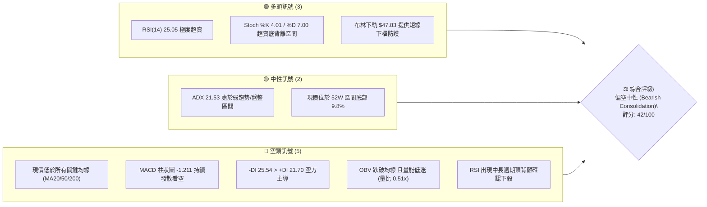

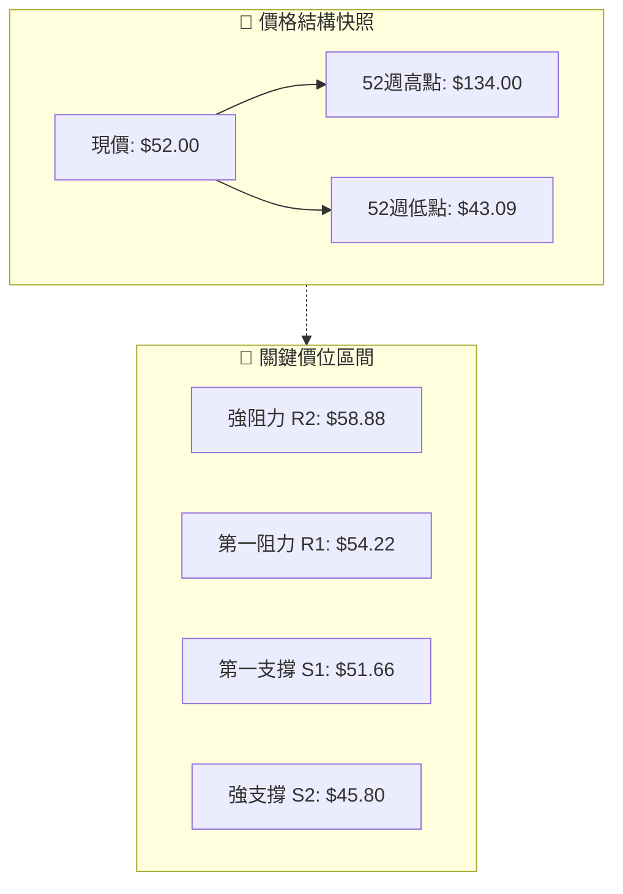

### 📊 核心指標速覽表

| 指標類別 | 指標名稱 | 當前數值 | 訊號 | 解讀 |
|:---|:---|:---|:---:|:---|
| **價格** | 當前價格 | $52.00 | 🟡 | 位於52週區間 9.8% 處，處於深度修正後的中期底部整理 |
| **均線** | MA20 | $57.77 | 🔴 | 價格低於MA20達 -9.99%，短期空頭主導 |
| **均線** | MA50 | $52.46 | 🔴 | 價格略低於MA50 (-0.88%)，中期多空分水嶺承壓 |
| **均線** | MA200 | $72.23 | 🔴 | 價格遠低於MA200達 -28.01%，長期格局處於空頭修正 |
| **動能** | RSI(14) | 25.05 | 🟢 | 進入極度超賣區間 (<30)，短線具備技術性反彈動能 |
| **動能** | MACD | 0.152 | 🔴 | 快慢線下行，MACD Hist 為 -1.211，空頭動能擴散 |
| **動能** | Stoch %K/%D | 4.01 / 7.00 | 🟢 | 極度超賣狀態，隨時可能觸發超跌反彈 |
| **趨勢** | ADX(14) | 21.53 | 🟡 | <25 顯示趨勢動能減弱，當前轉入無方向盤整期 |
| **通道** | 布林 %B | 0.21 | 🟡 | 接近布林通道下軌 ($47.83)，通道寬度擴張但未破位 |
| **成交量** | 20日量比 | 0.51x | 🔴 | 成交量萎縮至 1.97M（均量 3.83M），市場買盤觀望 |
| **波動** | ATR(14) | $2.90 | 🟡 | 日波動率 5.58%，波幅處於正常偏高水平，需設定合適止損 |

### 🏆 技術評分卡

```
╔══════════════════════════════════════════════════════════════════╗
║              技術評分卡 — KTOS (2026-08-31)                      ║
╠══════════════════════════════════════════════════════════════════╣
║ 趨勢強度      ████████░░░░░░░░░░░░  43/100  🔴 空頭壓制/盤整中   ║
║ 動能指標      ██████████░░░░░░░░░░  50/100  🟡 超賣醞釀反彈     ║
║ 支撐穩定度    ██████████░░░░░░░░░░  48/100  🟡 S1: $51.66 測試中 ║
║ 成交量配合    ██████░░░░░░░░░░░░░░  30/100  🔴 量能萎縮/OBV疲弱  ║
║ 形態完整度    ████████░░░░░░░░░░░░  40/100  🔴 大箱體破位修正   ║
║ 均線排列      ████████░░░░░░░░░░░░  40/100  🔴 價格全線受制均線 ║
╠══════════════════════════════════════════════════════════════════╣
║ 綜合評分      ████████░░░░░░░░░░░░  42/100  ⚖️ 偏空中性 (區間)   ║
╚══════════════════════════════════════════════════════════════════╝
```

---

## 2. 趨勢分析

### 🌐 多時框趨勢分析

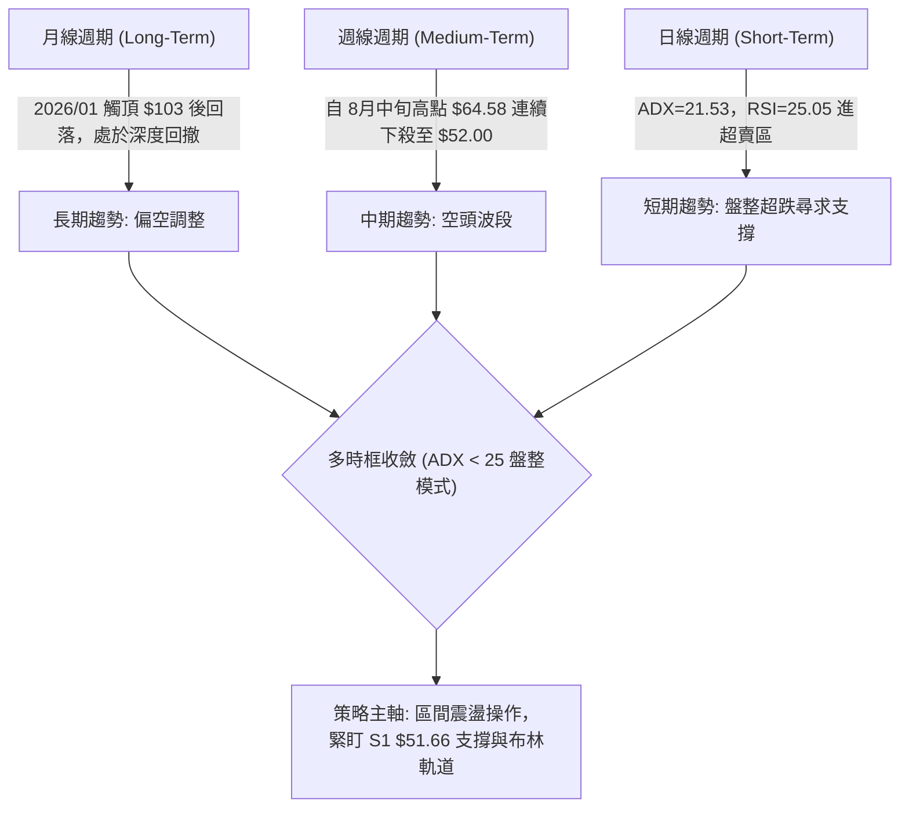

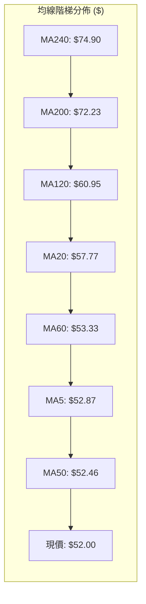

### 📈 長期趨勢 — 12個月走勢圖（Unicode）

```
KTOS 月線走勢圖（過去12個月：2025-08 至 2026-08）
價格軸 ($)
$105 ┤                               ●(2026-01 $103.01 高點)
$95  ┤                 ●(2025-09 $91.37)
$85  ┤                      ●       ●(2026-02 $86.18)
$75  ┤                           ●
$65  ┤  ●(2025-08 $65.84)                 ●(2026-03 $70.51)
$55  ┤                                         ●(2026-05 $64.13)
$50  ┤                                              ●    ●←當前 $52.00
$45  ┤                                                 ●(2026-07 $46.60 低點)
     └────────────────────────────────────────────────────────────
        08   09   10   11   12   01   02   03   04   05   06   07   08 (月份)
```

#### 走勢特徵分析表格

| 階段 | 時間區間 | 起始/結束價 | 漲跌幅 | 走勢特徵與量價解讀 |
|:---|:---:|:---:|:---:|:---|
| **第一階段：主升浪加速** | 2025-08 ~ 2026-01 | $65.84 → $103.01 | +56.46% | 強勢突破，月線呈現連續實體大陽線，資金持續湧入 |
| **第二階段：頂部派發下殺**| 2026-01 ~ 2026-04 | $103.01 → $63.05 | -38.79% | 頂部快速反轉，長黑摜破短中期均線，機構派發明顯 |
| **第三階段：築底回抽失敗**| 2026-04 ~ 2026-06 | $63.05 → $49.86  | -20.92% | 5月反彈至 $64.13 遇阻回落，跌破 $50 整數關卡 |
| **第四階段：底部震盪探底**| 2026-06 ~ 2026-08 | $49.86 → $52.00  | +4.29%  | 7月觸及 $46.60 近期低點後反彈至 $64.58 再度回落至 $52.00 |

### 📊 中期趨勢（週線分析）

從近20週的週線收盤數據觀察：
- **高點受阻區**：2026-05-31 收 $64.13、2026-08-16 收 $64.58，兩次波段反彈均在 $64.50~$67.00 附近遭遇強烈賣壓，形成了顯著的中期雙頂阻力區（對應 R3 $66.97）。
- **低點支撐區**：2026-06-28 收 $47.21、2026-07-19 收 $46.03、2026-08-02 收 $46.60，均在 $45.80~$47.00 區間獲得強勁支撐（對應 S2 $45.80）。
- **當前位置**：最新一週自 8/16 的 $64.58 急跌至 $52.00，週 RSI 從 76.7 驟降至 25.0，週 MACD 柱狀圖由正轉負（-1.211），短線動能大幅宣洩，目前正在測試前波起漲點支撐 S1 $51.66。

```
KTOS 中期週線支撐阻力結構圖
$67.00 ┤─── 阻力帶上限 (R3: $66.97 / 08-16高點 $64.58) ────────
$58.88 ┤─── 中期頸線/阻力 (R2: $58.88 / MA20: $57.77) ─────────
$54.22 ┤─── 短線反彈阻力 (R1: $54.22 / MA50: $52.46) ─────────
$52.00 ┼─── 現價 ($52.00) ──────────────────────────────────
$51.66 ┤─── 近期關鍵支撐 (S1: $51.66) ─────────────────────────
$45.80 ┤─── 強支撐帶下限 (S2: $45.80 / 07月低點區間) ──────────
```

### ⚡ 趨勢強度評估（ADX 解讀）

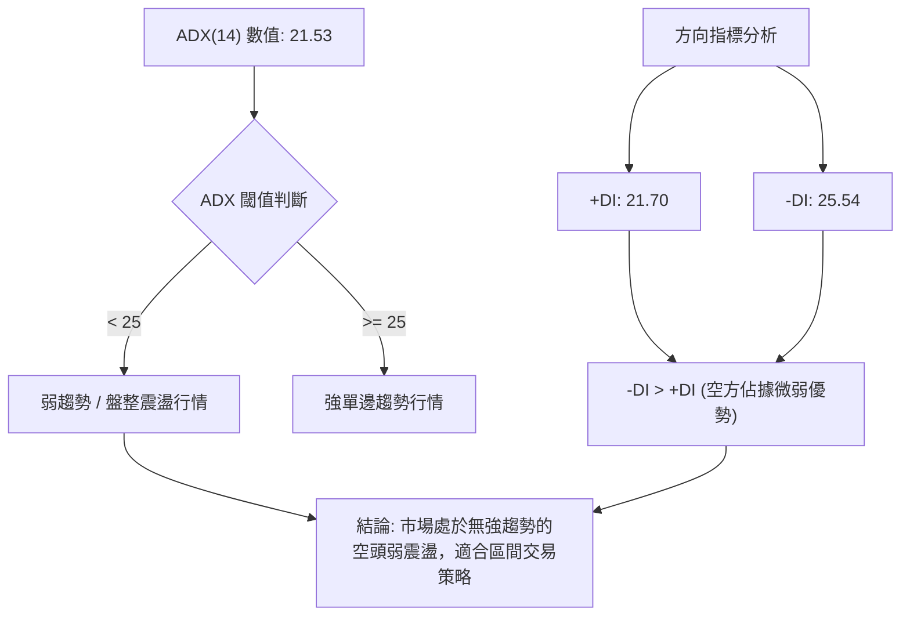

| 指標 | 數值 | 狀態等級 | 趨勢解讀 | 操作指引 |
|:---|:---:|:---:|:---|:---|
| **ADX(14)** | 21.53 | 弱 (Weak) | 趨勢強度不足，單邊突破失敗率高 | 避免追漲殺跌，採用高出低進區間策略 |
| **+DI (14)** | 21.70 | 弱勢多頭 | 買盤動能不足以發動持續推升 | 突破需等待成交量放大與 +DI 上穿 25 |
| **-DI (14)** | 25.54 | 偏強空頭 | 賣方掌控主動權，但未達極度恐慌 | 嚴格執行止損，下方留意超賣回抽 |

---

## 3. 圖表形態分析

### 🔍 形態識別系統

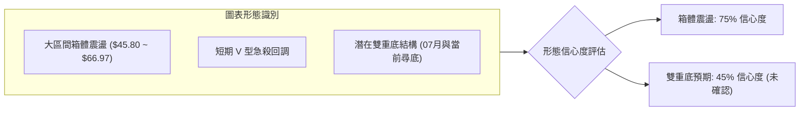

#### 形態識別與信心度評估表

| 形態名稱 | 信心度 | 判斷依據（引用數據） | 完成度 | 目標價（附計算式） |
|:---|:---:|:---|:---:|:---|
| **寬幅箱體震盪** | **75%** | 箱底在 S2: $45.80（7月收盤低點 $46.03~$46.60），箱頂在 R3: $66.97（8月高點 $64.58 與 5月高點 $64.13） | 85% | 箱頂突破目標 = 箱頂 $66.97 + ($66.97 - $45.80) = **$88.14**（數據中未確認突破，維持箱體內操作） |
| **日線級別超跌反彈** | **60%** | RSI(14) 達 25.05 極度超賣，Stoch %K 4.01，價格緊貼 S1: $51.66 尋求支撐 | 50% | 向上反彈第1阻力 R1: **$54.22**；第2目標 MA20 / R2: **$58.88** |
| **潛在雙重底** | **45%** | 僅作指標型解讀：第一底為 7/19 收盤 $46.03，當前正在形成次低點測試，頸線為 $64.58 | 30% | *訊號不足（信心度<50%），未突破頸線前不預設形態成立* |

### 🕯️ 重要K線形態分析

| 月份/週期 | 收盤價 | K線形態 | 解讀 | 訊號 |
|:---|:---:|:---|:---|:---:|
| **2026-01** | $103.01 | 長上影大陽線 | 歷史天價處遭遇機構集中獲利了結派發，確立中長期大頂 | 🔴 |
| **2026-05** | $64.13 | 築底陽線包覆 | 自 $52.09 強勢反彈，連續陽線收復失地，確立中期波段反彈 | 🟢 |
| **2026-07** | $46.60 | 探底長下影線 | 連續測試 $46.03 獲強力買盤承接，形成波段重要底部 | 🟢 |
| **2026-08 (近週)** | $52.00 | 連續實體大陰線 | 8/16 見頂 $64.58 後連續兩週放量下殺，目前收在全週最低點附近 | 🔴 |

### 📉 ASCII 走勢形態示意圖

```
KTOS 2026年5月~8月 關鍵形態結構示意圖
價格 ($)
$66.97 ┼──────────────────── 上軌阻力區 (R3: $66.97) ───────────────
       │         ▲ (05-31: $64.13)         ▲ (08-16: $64.58)
$60.00 ┤        / \                       / \
       │       /   \                     /   \
$54.22 ┼──────/─────\───────────────────/─────\── 阻力線 (R1: $54.22) ─
$52.00 ┼─────/───────\─────────────────/───────▼─ 現價 ($52.00) ────
$51.66 ┼────/─────────\──(05-17: $52.09)─────── 支撐線 (S1: $51.66) ─
       │   /           \               /
$45.80 ┼──/─────────────▼─────────────/──────── 強支撐 (S2: $45.80) ─
       │                 (07-19: $46.03)
       └────────────────────────────────────────────────────────
        2026-05         2026-06         2026-07         2026-08
```

### 🎯 形態目標價計算

依據確立度最高的**寬幅箱體區間模型**推算：
1. **箱體底部（支撐基準）**：$45.80（S2，2026年7月低點群）
2. **箱體頂部（阻力基準）**：$66.97（R3，波段高點聚類）
3. **箱體高度**：$66.97 - $45.80 = $21.17
4. **箱體中軸**：$45.80 + ($21.17 / 2) = **$56.38**（恰與當前 MA10 $56.35 極為貼合）
5. **當前路徑目標**：
   - 若在 S1 $51.66 止跌，短線反彈首要目標為箱體中軸與 R1 $54.22。
   - 若跌破 S1 $51.66，價格將向下尋求箱底 S2 $45.80 支撐。

---

## 4. 支撐與阻力

### 🗺️ 關鍵價位分布圖（Unicode）

```
KTOS 價位結構分布圖
═══════════════════════════════════════════════════════════════════
$134.00 ║████████████████████████║ 52週歷史高點 / 斐波那契 0.0%
$99.27  ║████████████████████    ║ 斐波那契 38.2% 回調位
$77.82  ║████████████████████████║ 斐波那契 61.8% / MA240 ($74.90)
$66.97  ║████████████████████████║ 強阻力 R3 (+28.78%) / 8月波段高點
$62.54  ║████████████████        ║ 斐波那契 78.6% 回調位
$58.88  ║████████████████████    ║ 阻力 R2 (+13.23%) / MA20 ($57.77)
$54.22  ║████████████████████████║ 關鍵阻力 R1 (+4.27%) / MA50 ($52.46)
$52.00  ╠════════════════════════╣ ◄ 當前價格 ($52.00)
$51.66  ║▓▓▓▓▓▓▓▓▓▓▓▓▓▓▓▓▓▓▓▓    ║ 近期關鍵支撐 S1 (-0.65%)
$45.80  ║████████████████████████║ 強支撐 S2 (-11.93%) / 7月波段底
$43.09  ║████████████████████████║ 52週低點 S3 (-17.13%) / 斐波那契 100%
═══════════════════════════════════════════════════════════════════
```

### 🚧 阻力位分析表

| 阻力級別 | 精確價位 | 距現價幅幅 | 形成原因與技術共振 | 突破難度 | 重要性 |
|:---|:---:|:---:|:---|:---:|:---:|
| **R1** | **$54.22** | +4.27% | 近期波段高點聚類、MA50 ($52.46) 與 MA5 ($52.87) 密集防守區 | 🟡 中等 | ★★★☆☆ |
| **R2** | **$58.88** | +13.23% | 近一年波段高點聚類、布林中軌 MA20 ($57.77) 及 MA10 ($56.35) 壓力帶 | 🔴 較高 | ★★★★☆ |
| **R3** | **$66.97** | +28.78% | 近一年波段高點聚類、8/16 高點 $64.58 與布林上軌 ($67.71) 共振壓力 | 🔴 極高 | ★★★★★ |

### 🛡️ 支撐位分析表

| 支撐級別 | 精確價位 | 距現價幅幅 | 形成原因與技術共振 | 守住機率 | 重要性 |
|:---|:---:|:---:|:---|:---:|:---:|
| **S1** | **$51.66** | -0.65% | 近一年波段低點聚類、5/17 低點 $52.09 平台支撐，當前正直接測試 | 🟡 55% | ★★★★☆ |
| **S2** | **$45.80** | -11.93% | 近一年波段低點聚類、7/19 低點 $46.03 與布林下軌 ($47.83) 緩衝區 | 🟢 80% | ★★★★★ |
| **S3** | **$43.09** | -17.13% | 52週歷史最低點、斐波那契 100.0% 終極支撐防線 | 🟢 95% | ★★★★★ |

### 📐 斐波那契回調位分析

依據 52 週區間（低點 $43.09 → 高點 $134.00，全波段跨度 $90.91）計算之標準回調位：

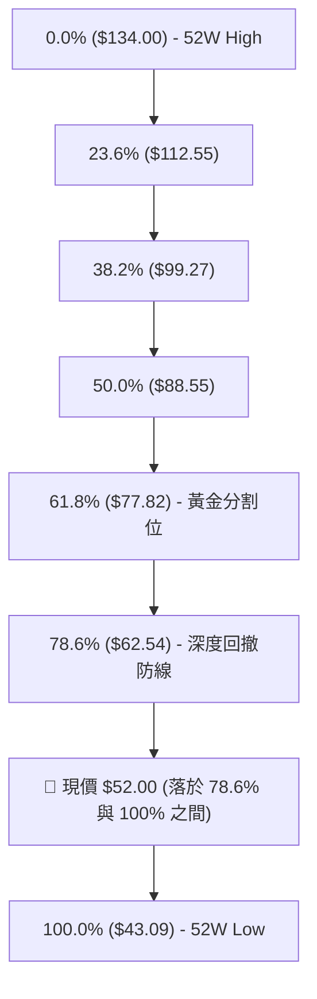

- **位置解讀**：現價 $52.00 處於斐波那契 **78.6% 回調位 ($62.54)** 與 **100.0% 低點 ($43.09)** 之間的「極度深度回撤區」。
- **結構意涵**：股價跌破 78.6% 回調位代表自 2026 年初 $134.00 發動的牛市波段已完全遭到破壞，當前行情屬於主跌浪後的底部殘餘震盪。$43.09 ~ $52.00 為長期價值的關鍵築底吸籌區間。

---

## 5. 技術指標深度解讀

### 🎛️ 指標訊號總覽

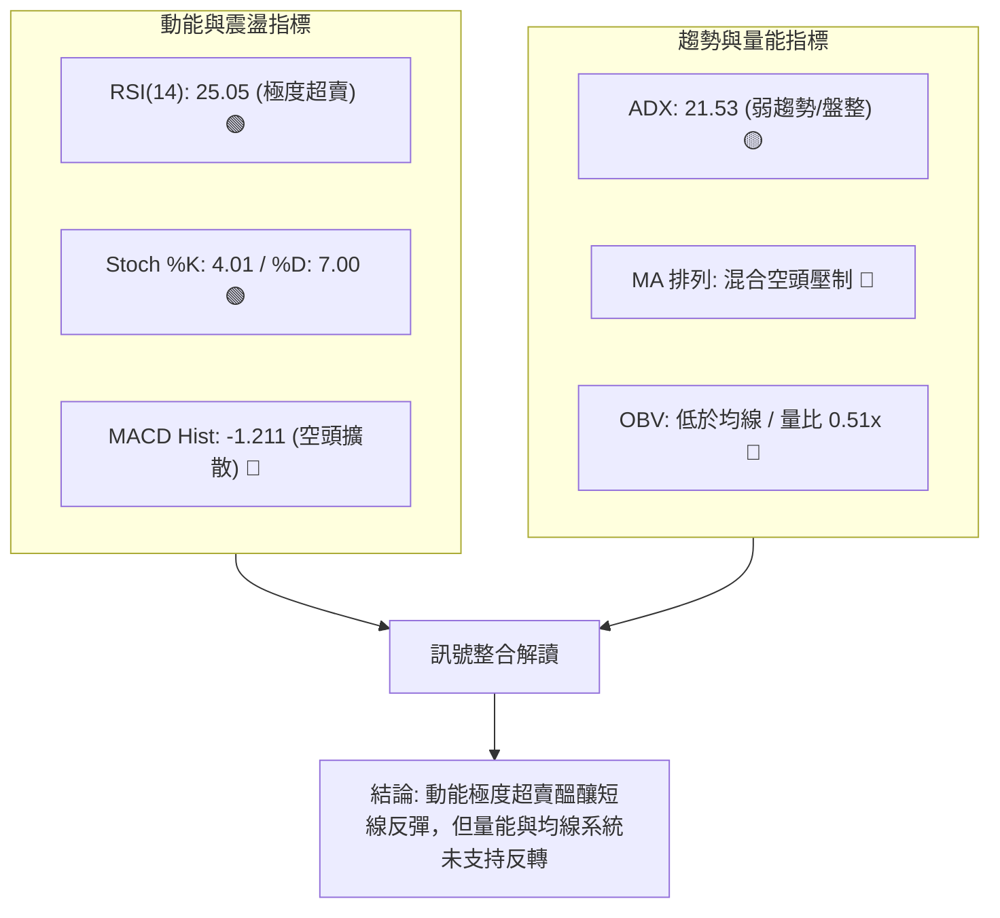

### 📈 移動平均線排列分析

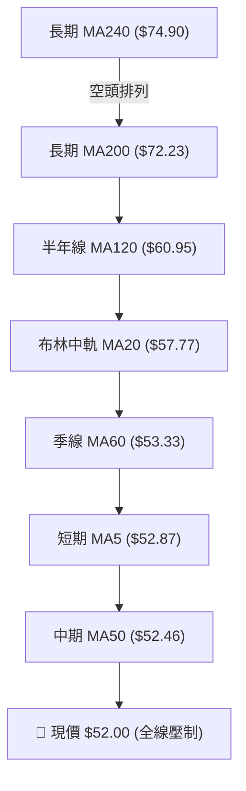

#### 均線偏離與斜率狀態表

| 均線名稱 | 當前數值 | 價格與均線差距 | 偏離百分比 | 斜率走勢特徵 | 訊號解讀 |
|:---|:---:|:---:|:---:|:---|:---:|
| **MA 5** | $52.87 | -$0.87 | -1.64% | 走平略向下 ▁▁▁▁▁▁▁▁▁▁▁▁▂▃▄▆▇██████▇▇▆▅▄▄▃ | 🔴 短線下壓 |
| **MA 10** | $56.35 | -$4.35 | -7.72% | 陡峭向下 ▁▁▁▁▁▁▁▁▁▁▁▁▁▂▂▃▄▅▆▇██████▇▇▆▅ | 🔴 空方加速 |
| **MA 20** | $57.77 | -$5.77 | -9.99% | 頂部下彎 ▂▁▁▁▁▁▂▁▁▁▁▁▁▁▂▂▃▃▄▅▆▆▇▇▇▇████ | 🔴 短期防線 |
| **MA 50** | $52.46 | -$0.46 | -0.88% | 走平震盪（混合排列核心） | 🟡 多空交戰 |
| **MA 60** | $53.33 | -$1.33 | -2.49% | 緩步下行 ██▇▆▅▅▄▃▂▂▁▁▁▁▁▁▂▂▃▃▄▄▄▄▄▄▃▃▂▂ | 🔴 阻力壓制 |
| **MA 120**| $60.95 | -$8.95 | -14.68%| 持續下行 ███▇▇▆▆▆▅▅▅▅▄▄▄▄▃▃▃▃▃▂▂▂▂▁▁▁▁▁ | 🔴 中期空頭 |
| **MA 200**| $72.23 | -$20.23| -28.01%| 穩定下行（牛熊分水嶺遠在上方） | 🔴 長期走空 |
| **MA 240**| $74.90 | -$22.90| -30.58%| 穩定下行 ████▇▇▆▆▅▅▄▄▄▄▃▃▃▃▃▃▃▃▃▂▂▂▂▁▁▁ | 🔴 年線壓力 |

### 📉 RSI(14) 分析

```
RSI(14) 數值儀表板
0 ──────── 20 ── 25.05 ── 30 ──────────────── 50 ──────────────── 70 ──────── 100
[ 極度超賣區 ▓▓▓▓▓░░░░░ ] 25.05  [      正常震盪區間      ]  [  超買區  ]
```

- **數值狀態**：當前 RSI(14) 報 **25.05**，已深度跌入 30 以下的超賣區間，反映短線拋售壓力已達極限。
- **背離分析**：數據提示存在 **⚠️ 頂背離 (Bearish Divergence)**。回溯 8 月中旬，股價自 8/09 的 $60.77 推升至 8/16 的 $64.58，但週線動能未能突破前期高位，隨後觸發斷崖式下跌。目前下殺至 25.05 後，尚未形成日線級別的「底背離」，僅為單純的數值超賣，需等待 RSI 出現雙底抬升方可確認反轉。

### 📊 MACD(12/26/9) 訊號解讀

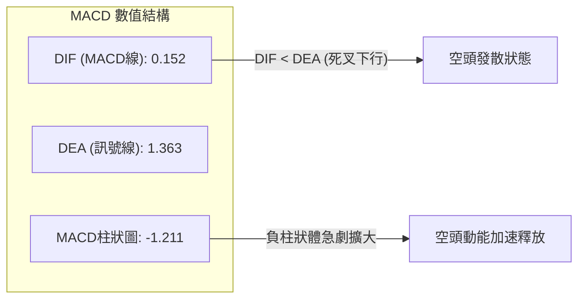

- **交叉狀態**：MACD 線 (0.152) 位於訊號線 (1.363) 下方，兩者呈現死亡交叉開口向下發散形態。
- **柱狀圖動能**：Histogram 為 **-1.211**，連續多日綠柱擴張，顯示波段下行慣性依然存在，尚未出現紅柱收斂的止跌訊號。

### 📦 布林通道分析

```
布林通道 (Bollinger Bands, 20, 2) 結構圖
$67.71 ┼───────────────────────── BB 上軌 (Upper Band)
       │
$57.77 ┼───────────────────────── BB 中軌 (MA20)
       │
$52.00 ┼───────────────●───────── 當前價格 ($52.00, %B = 0.21)
       │
$47.83 ┼───────────────────────── BB 下軌 (Lower Band)
```

- **帶寬與位置**：通道上軌 $67.71、中軌 $57.77、下軌 $47.83，帶寬達 $19.88。
- **%B 指標**：目前 **%B = 0.21**，價格運行於下軌與中軌之間且偏向下軌，顯示市場處於弱勢偏空震盪，但尚未發生跌破下軌的「開口失控」現象，下軌 $47.83 將與支撐 S2 $45.80 共同構成強力緩衝區。

### 💹 成交量分析（量價配合度）

- **量能萎縮**：最新單日成交量為 **1,969,100** 股，相較於 20 日均量 (3,831,550) 大幅萎縮 **48.6%**（量比僅 **0.51x**），相較 50 日均量 (4,496,524) 亦顯著偏低。
- **OBV 趨勢**：數據顯示 **OBV < MA**，能量潮指標持續走低，說明在股價回調過程中，機構買盤並未進場承接，缺乏量能支撐的下跌屬於「縮量陰跌」，顯示市場人氣渙散。
- **量價背離結論**：無放量恐慌盤（未見巨量長黑洗盤），也無放量抄底盤，技術性反彈需補量至 3.8M 以上才能確認突破有效性。

---

## 6. 動能與波動率

### ⚡ 動能評估四象限

| 象限 | 動能維度 | 波動維度 | KTOS 當前定位 | 策略意涵 |
|:---|:---:|:---:|:---:|:---|
| **第一象限 (Q1)** | 強動能 (Bullish) | 低波動 (Low Vol) | — | 最佳趨勢加碼點（低風險平穩上漲） |
| **第二象限 (Q2)** | 弱動能 (Bearish) | 低波動 (Low Vol) | — | 底部沉寂盤整，流動性枯竭 |
| **第三象限 (Q3)** | 強動能 (Bullish) | 高波動 (High Vol) | — | 主升段加速，需設定移動止盈 |
| **第四象限 (Q4)** | **弱動能 (Bearish)** | **高波動 (High Vol)** | **✓ (當前狀態)** | **空頭震盪洗盤，嚴控倉位防破位** |

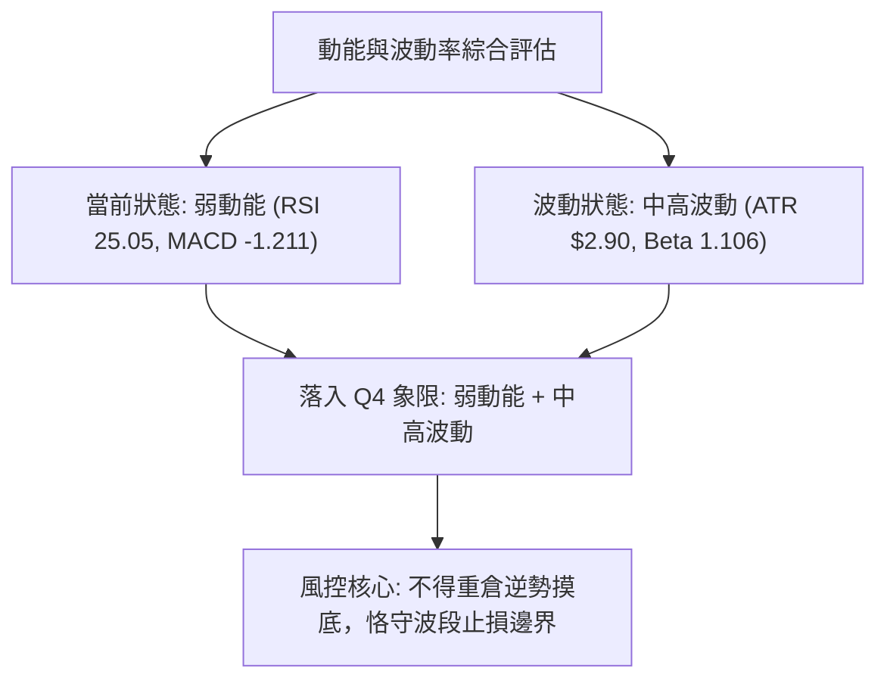

### 📊 ATR 波動率分析

- **ATR(14) 數值**：**$2.90**（佔股價比例高達 **5.58%**）。
- **止損距離建議**：
  - **極短線交易（1.0 × ATR）**：安全止損距離應為 **$2.90**（進場點下方約 5.6%）。
  - **波段擺動交易（1.5 ~ 2.0 × ATR）**：安全止損距離應為 **$4.35 ~ $5.80**，以避開日線級別的隨機噪音波動。
  - **止損定錨**：以 S1 $51.66 為進場參考時，若跌破 $51.66 達 1.0 ATR（即跌破 $48.76），應立即停損離場。

### 📐 Beta 與市場相關性

- **Beta 係數**：**1.106**。
- **市場敏感度解讀**：KTOS 的波動性高於標普 500 指數約 **10.6%**。在美股大盤回調或國防板塊波動時，KTOS 會呈現放大波動的特徵。當前在無特定消息催化下，個股主要跟隨技術面超跌規律與板塊資金流向聯動。

---

## 7. 多時框架總結

### 📋 時框架評分表

| 時框架 | 趨勢方向 | 動能狀態 | 均線排列 | 形態結構 | 綜合評分 | 操作建議 |
|:---|:---:|:---:|:---:|:---:|:---:|:---|
| **短期 (日線)** | 🔴 偏空修正 | 🟢 超賣 (RSI 25) | 🔴 均線全線壓制 | 🟡 測試 S1 支撐 | **45/100** | 超跌具反彈契機，但需等待右側信號 |
| **中期 (週線)** | 🔴 空頭下殺 | 🔴 MACD 轉負 | 🔴 跌破 MA20 | 🟡 寬幅箱體內運行 | **40/100** | 箱體中軸受壓，嚴防回測箱底 S2 |
| **長期 (月線)** | 🔴 深度回撤 | 🟡 中性偏弱 | 🔴 遠離 MA200 | 🔴 天價回落破位 | **42/100** | 估值與形態修復期，長期觀望 |

### 🔲 綜合訊號矩陣

```
時框架訊號矩陣
┌──────────┬──────────┬──────────┬──────────┬──────────┬──────────┐
│ 時框架   │ 趨勢指標 │ 動能指標 │ 量能指標 │ 支撐阻力 │ 綜合方向 │
├──────────┼──────────┼──────────┼──────────┼──────────┼──────────┤
│ 短期日線 │  🔴 空頭  │  🟢 超買  │  🔴 縮量  │  🟡 S1臨界面│  🟡 震盪反彈│
│ 中期週線 │  🔴 空頭  │  🔴 發散  │  🔴 疲弱  │  🟡 箱體中段│  🔴 偏空震盪│
│ 長期月線 │  🔴 空頭  │  🟡 走平  │  🔴 減退  │  🟢 歷史底部│  🔴 空頭整理│
└──────────┴──────────┴──────────┴──────────┴──────────┴──────────┘
```

### ⚖️ 多時框收斂結論

依據多時框收斂規則：
1. **行情模式判斷**：ADX(14) 數值為 **21.53 (<25)**，明確定義為**無強單邊趨勢之「盤整/震盪行情」**。
2. **時框優先級收斂**：在 ADX < 25 的盤整環境下，以**日線布林通道上下軌 ($47.83 ~ $67.71) 及關鍵支撐阻力位 (S1 $51.66 / S2 $45.80 / R1 $54.22 / R2 $58.88)** 為主要交易邊界。
3. **唯一方向性結論**：**【偏空中性 — 區間下沿超跌防禦震盪】**。短期因 RSI 極度超賣具備反彈動能，但受制於全線均線空頭壓制與 MACD 發散，任何反彈均先視為區間內的修復行情，主策略採用「區間反彈逢高布空」或「極限支撐短線搏反彈」，主導方向定調為偏空震盪操作。

---

## 8. 交易策略建議

### 🗺️ 策略決策流程圖

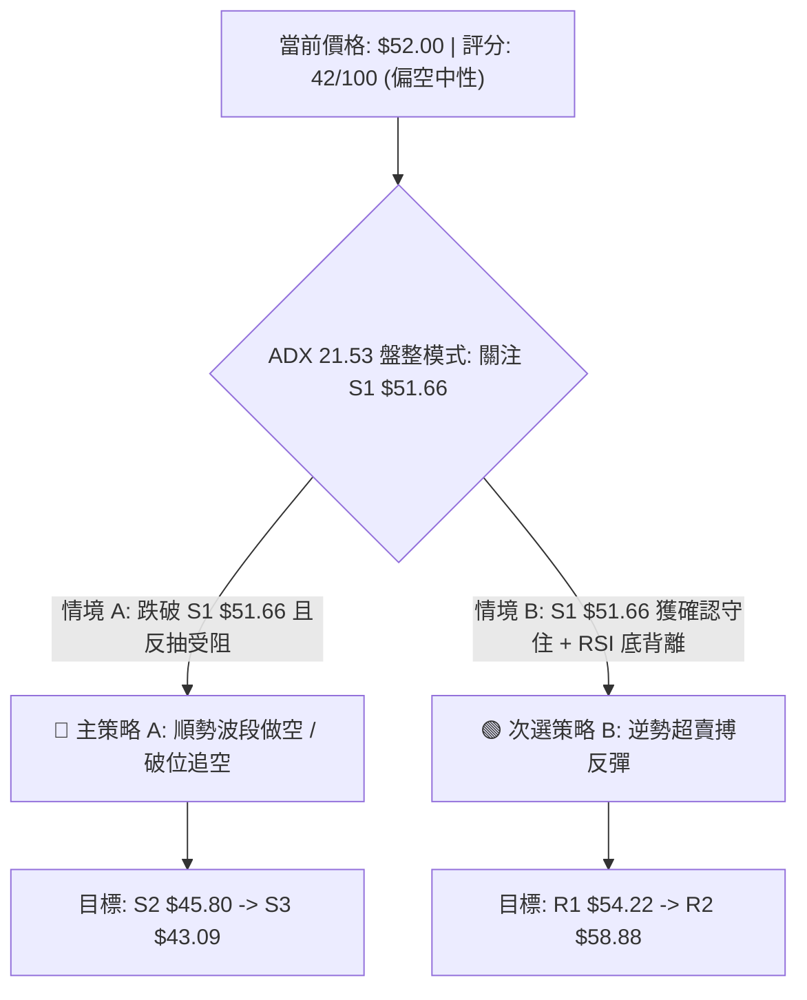

### 🧭 策略路由

> **當前主策略方向 = 【偏空區間操作 / 破位逢高布空】（依綜合評分 42/100 定調）**

由於綜合評分低於 50 且均線系統全面呈空頭壓制，本報告**主推順應中期空頭格局的空頭與區間操作策略**。多頭進場僅限於極度超賣下的短線高勝率博弈，並需嚴格執行止損。

### 🎯 價格情境階梯（Price Scenarios）

所有價位精確引用自數據中之計算值：

| 觸發條件 | 第一目標 | 第二目標 | 後續延伸 | 情境技術含義 |
|:---|:---:|:---:|:---:|:---|
| **強勢突破 R1 $54.22** | R2 **$58.88** | R3 **$66.97** | 斐波那契 61.8% **$77.82** | 短線轉強，收復 MA50 並挑戰布林中軌 |
| **現價 $52.00 窄幅震盪**| S1 **$51.66** | R1 **$54.22** | — | 無方向收斂，多空於 MA50 下方拉鋸 |
| **有效跌破 S1 $51.66** | S2 **$45.80** | S3 **$43.09** | 52週新低 | 中期空頭破位，向下探尋 52 週大底 |

### 📊 情境機率分佈

```
情境機率分佈
[ 情境三：破位下探 S2/S3 (45%) ▓▓▓▓▓▓▓▓▓░ ]
[ 情境二：區間震盪整理 (35%)   ▓▓▓▓▓▓▓░░░ ]
[ 情境一：超跌強勢反彈 (20%)   ▓▓▓▓░░░░░░ ]
```

| 情境劇本 | 機率 | 主要技術依據 |
|:---|:---:|:---|
| **情境三：破位下探 S2/S3** | **45%** | MACD 柱狀圖持續擴散 (-1.211)、價格低於所有 MA、量能疲弱且 OBV 走低 |
| **情境二：區間震盪整理** | **35%** | ADX 僅 21.53 顯示單邊動能不足、S1 $51.66 具備波段平台支撐、布林帶寬限制 |
| **情境一：超跌強勢反彈** | **20%** | RSI(14) 25.05 與 Stoch %K 4.01 進入極限超賣區，隨時可能引發空頭回補 |

### 🟢 主策略詳情（依評分卡路由配置）

```
╔══════════════════════════════════════════════════════════════════╗
║                    交易策略執行參數表                            ║
╠══════════════════════════════════════════════════════════════════╣
║ 項目            策略 A（主推：順勢高空/破位空） 策略 B（次選：超跌短多）  ║
╠══════════════════════════════════════════════════════════════════╣
║ 進場條件        反彈遇阻 R1 或 跌破 S1 確認    S1 $51.66 止跌且出現陽線   ║
║ 精確進場價      $54.22 (反彈空) / $51.20 (破位) $51.80                   ║
║ 第一目標 (T1)   $45.80 (S2 強支撐)            $54.22 (R1 阻力位)         ║
║ 第二目標 (T2)   $43.09 (S3 52週低點)          $58.88 (R2 阻力位)         ║
║ 嚴格止損價      $56.35 (MA10 突破點)          $49.90 (跌破 S1 緩衝區)    ║
║ 風險報酬比 (RRR) 3.96 : 1 (以破位空計算)       2.54 : 1                  ║
║ 預估勝率        60%                           40%                        ║
║ 建議配置倉位    10% ~ 15%                     5% (極輕倉短線)            ║
╚══════════════════════════════════════════════════════════════════╝
```

#### 策略 A 損益計算細節（主推）：
- **進場**：$54.22（若反彈至 R1 受阻）
- **止損**：$56.35（虧損空間 = $2.13 或 3.93%）
- **目標 T1**：$45.80（獲利空間 = $8.42 或 15.53%，RRR = 3.95:1）
- **目標 T2**：$43.09（獲利空間 = $11.13 或 20.53%，RRR = 5.23:1）

#### 策略 B 損益計算細節（次選短多）：
- **進場**：$51.80（守住 S1 $51.66 附近進場）
- **止損**：$49.90（虧損空間 = $1.90 或 3.67%）
- **目標 T1**：$54.22（獲利空間 = $2.42 或 4.67%，RRR = 1.27:1）
- **目標 T2**：$58.88（獲利空間 = $7.08 或 13.67%，RRR = 3.73:1）

### 🔴 反向風險觸發點（對沖提示）

- **多頭反轉觸發**：若股價帶量（單日成交量 > 4.5M）突破並站穩 **R2 $58.88** 及布林中軌 **$57.77**，空頭結構即刻失效，空單必須全數止損離場，行情將轉為測試 R3 $66.97。
- **空頭極限宣洩**：若股價跌破 S1 直接摜殺至 **S2 $45.80**，空單應執行至少 70% 的獲利了結，切勿在 $45.80 ~ $43.09 的歷史大底區間盲目追空。

### ⭐ 整體訊號強度評星

```
做多訊號強度：★★☆☆☆  (2/5星 - 僅具備超賣反彈價值)
做空訊號強度：★★★★☆  (4/5星 - 均線、MACD、量能全面偏空)
整體可信度：  ★★★☆☆  (3/5星 - ADX<25 震盪市中突破訊號易失真)
```

---

## 9. 風險提示與監控

### ✅ 關鍵監控指標 Checklist

```
╔══════════════════════════════════════════════════════════════════╗
║                  每日交易關鍵監控 Checklist                      ║
╠══════════════════════════════════════════════════════════════════╣
║ [ ] 價格是否跌破 S1: $51.66（跌破確認向下打開空間）               ║
║ [ ] RSI(14) 是否在 20~25 區間形成底背離金叉                      ║
║ [ ] MACD 柱狀圖負值是否開始由 -1.211 收窄（止跌先兆）             ║
║ [ ] 單日成交量是否突破 20日均量 3,831,550（量能確認）            ║
║ [ ] ADX(14) 是否上穿 25（單邊趨勢重啟確認）                      ║
║ [ ] 價格是否受阻於 R1: $54.22 (MA50 關鍵反壓)                    ║
╚══════════════════════════════════════════════════════════════════╝
```

### ⚠️ 風險場景分析

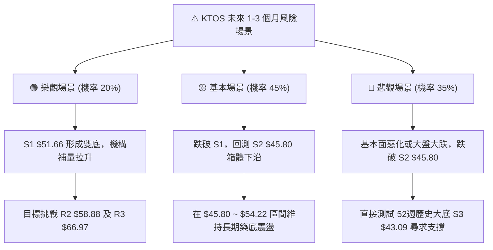

### 🛡️ 風險管理重要提醒

1. **嚴禁重倉抄底**：KTOS 當前 Trailing P/E 高達 305.88，EV/EBITDA 達 97.90，且自由現金流為負（$-118.29M）。在技術面均線空頭排列的情況下，基本面高估值可能加速價格回歸，切忌單憑 RSI 超賣即進行大額盲目左側抄底。
2. **波動率保護（ATR 紀律）**：個股 ATR 達 $2.90（5.58%），日內振幅劇烈。單筆交易虧損上限應控制在總資金的 1.0% 以內，倉位規模建議限制在 10%~15% 以下。
3. **分析師目標價矛盾辨析**：華爾街分析師平均目標價雖給予 $105.62（評級 strong_buy），但技術面距離 52 週高點 $134.00 已深度回撤。技術交易者必須以**客觀盤面價格走勢（Price Action）**為第一準則，基本面目標價僅供長期戰略參考，不可作為短線不設止損的藉口。

---

## 📋 報告總結

```
╔══════════════════════════════════════════════════════════════════╗
║                   KTOS 技術分析報告總結                          ║
╠══════════════════════════════════════════════════════════════════╣
║ 報告日期：2026-08-31                                             ║
║ 當前價格：$52.00                                                 ║
║ 分析評級：⚖️ 偏空中性 (Bearish Consolidation / 評分 42)          ║
╠══════════════════════════════════════════════════════════════════╣
║ 關鍵結論：                                                       ║
║ ├─ 長期趨勢：🔴 偏空調整（處於 2026/01 觸頂 $103 後的深度回撤期）║
║ ├─ 中期趨勢：🔴 空頭波段（8月中旬 $64.58 連續下殺，均線全線壓制） ║
║ ├─ 短期趨勢：🟡 震盪超跌（RSI 25.05 極度超賣，測試 S1 $51.66）   ║
║ ├─ 關鍵支撐：S1 $51.66 ｜ S2 $45.80 ｜ S3 $43.09                 ║
║ ├─ 關鍵阻力：R1 $54.22 ｜ R2 $58.88 ｜ R3 $66.97                 ║
║ └─ 分析師目標：均價 $105.62（區間 $60.00 ~ $150.00）              ║
╠══════════════════════════════════════════════════════════════════╣
║ 最優策略組合：                                                   ║
║ 1. 🥇 最佳機會：反彈遇阻 R1 $54.22 布空，目標 S2 $45.80 (RRR 3.9) ║
║ 2. 🥈 次選機會：跌破 S1 $51.66 順勢追空至 S2 $45.80               ║
║ 3. 🥉 保守選擇：在 S2 $45.80 ~ S3 $43.09 區間左側分批布局多單    ║
╚══════════════════════════════════════════════════════════════════╝
```

---

> ⚠️ **免責聲明**：本報告為 AI 自動生成之技術分析，所有數據及估算均基於提供的歷史價格資訊。本報告**僅供研究與學術參考**，**不構成任何投資建議**。投資有風險，入市需謹慎。

---

*報告生成時間：2026-08-31 ｜ 數據來源：Yahoo Finance ｜ 分析框架：多時框技術分析*