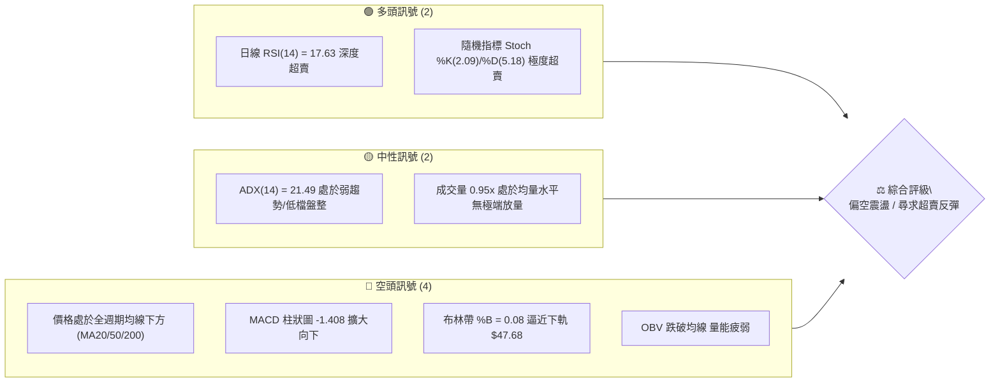
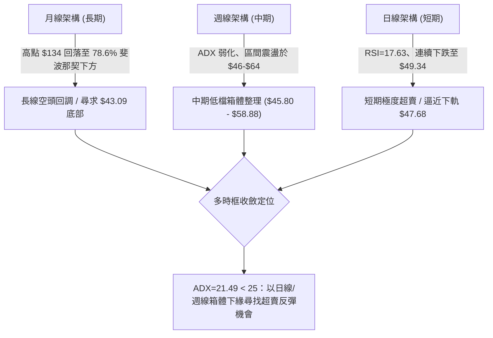
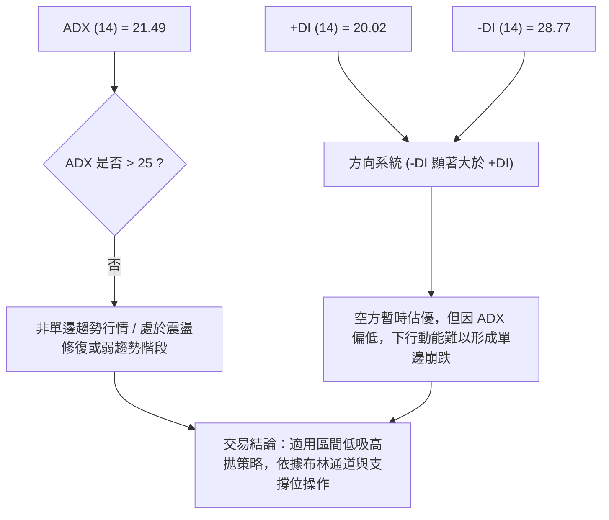
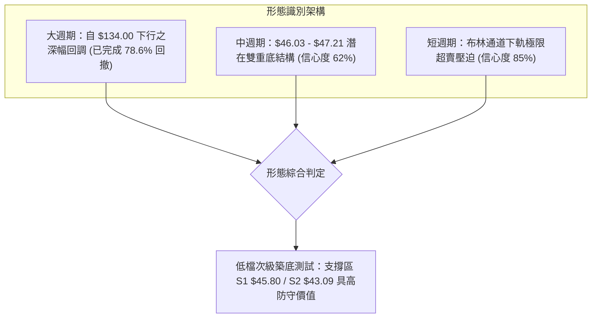
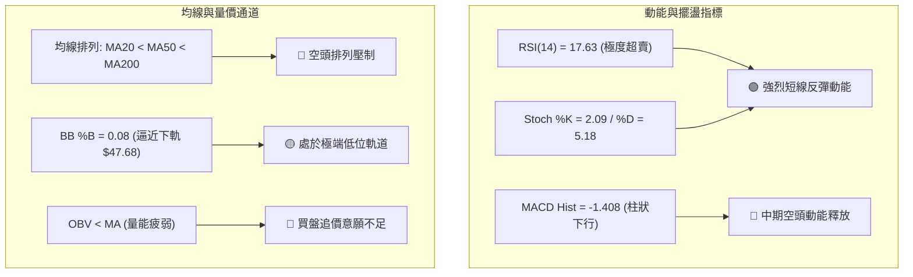
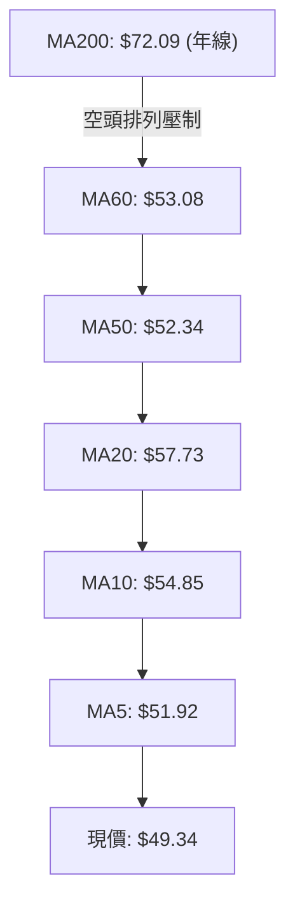
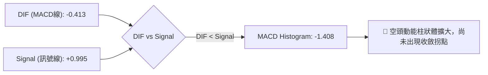
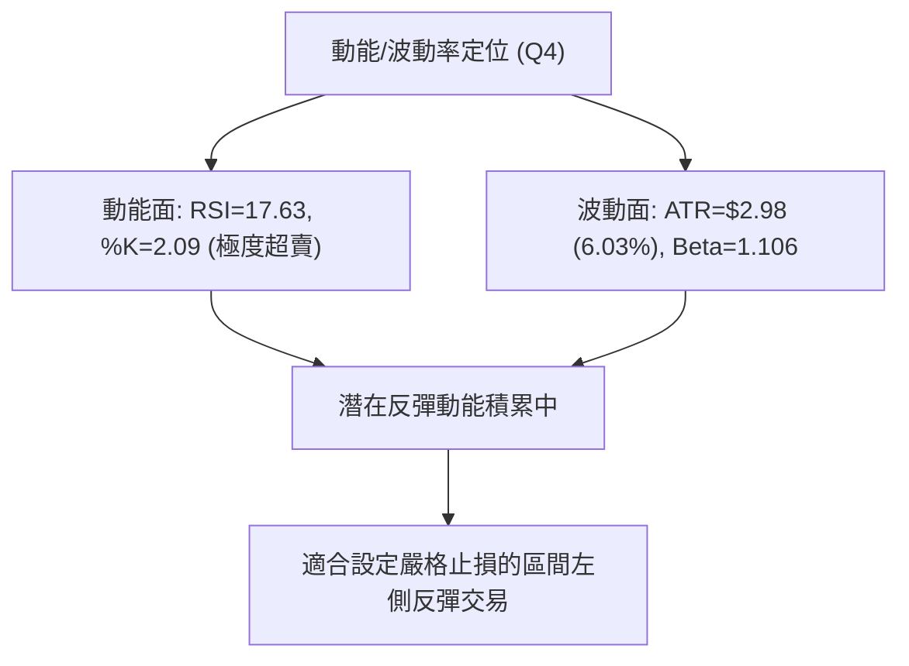
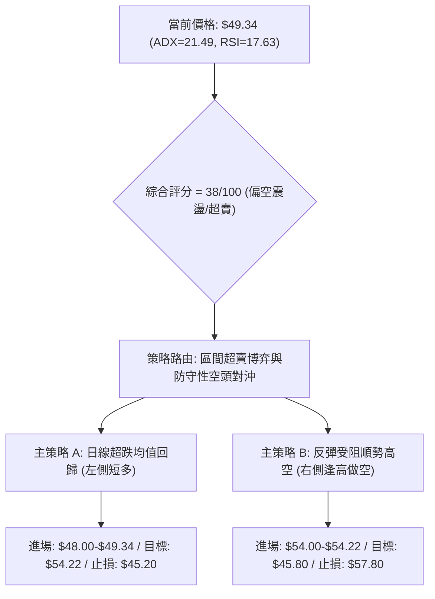
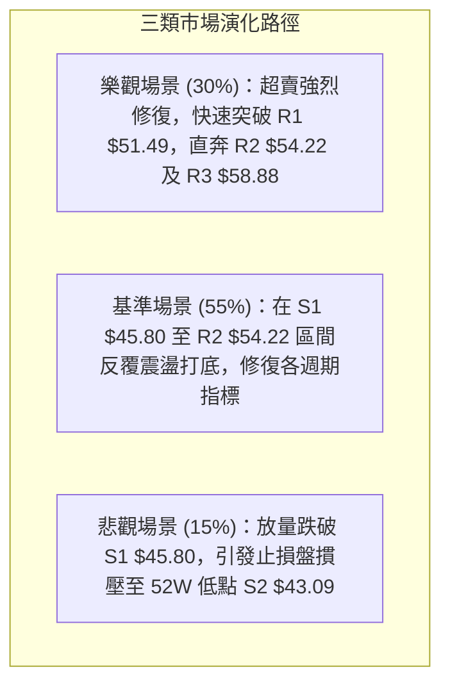

# KTOS 技術分析報告

> **報告日期**：2026-09-02 ｜ **語言**：繁體中文 ｜ **數據來源**：Yahoo Finance ｜ **當前價格**：$49.34

---

## 目錄

| 章節 | 內容 |
|------|------|
| [1. 技術面概覽](#1-技術面概覽) | 訊號儀表板、核心指標、評分卡 |
| [2. 趨勢分析](#2-趨勢分析) | 多時框趨勢、長中短期走勢 |
| [3. 圖表形態分析](#3-圖表形態分析) | 形態識別、K線組合、目標價 |
| [4. 支撐與阻力](#4-支撐與阻力) | 關鍵價位、斐波那契回調 |
| [5. 技術指標深度解讀](#5-技術指標深度解讀) | MA/RSI/MACD/布林/成交量 |
| [6. 動能與波動率](#6-動能與波動率) | 動能評估、ATR、Beta |
| [7. 多時框架總結](#7-多時框架總結) | 時框架評分矩陣 |
| [8. 交易策略建議](#8-交易策略建議) | 多空策略、風險報酬比 |
| [9. 風險提示與監控](#9-風險提示與監控) | 監控指標、風險場景 |

---

## 1. 技術面概覽

### 🎯 技術訊號儀表板



### 📊 核心指標速覽表

| 指標類別 | 指標名稱 | 當前數值 | 訊號 | 解讀 |
|----------|----------|----------|------|------|
| **價格** | 當前收盤價 | $49.34 | 🔴 | 位於 52 週區間（$43.09–$134.00）之 6.9% 極低分位 |
| **均線** | MA20 (短) | $57.73 | 🔴 | 股價位於 MA20 下方 -14.53%，短線下行斜率陡峭 |
| **均線** | MA50 (中) | $52.34 | 🔴 | 股價位於 MA50 下方 -5.73%，中線承壓 |
| **均線** | MA200 (長) | $72.09 | 🔴 | 股價位於 MA200 下方 -31.56%，長線處於修正週期 |
| **動能** | RSI(14) | 17.63 | 🟢 | 進入極度超賣區（<20），具備強烈技術性超跌修復動能 |
| **動能** | MACD Hist | -1.408 | 🔴 | DIF (-0.413) 位於 DEA (0.995) 下方，空方動能釋放中 |
| **趨勢** | ADX(14) | 21.49 | 🟡 | ADX < 25 表明非單邊強趨勢，呈現弱趨勢低檔震盪特徵 |
| **通道** | 布林通道 | %B = 0.08 | 🟡 | 逼近下軌 $47.68，通道開口中等，處於極端超跌軌道 |
| **波動** | ATR(14) | $2.98 | 🟡 | 佔股價 6.03%，日均波幅約 3 美元，波動度適中 |
| **量能** | OBV | OBV < MA | 🔴 | 量能指標低於均線，買盤承接意願尚未全面放量 |

### 🏆 技術評分卡

```
╔══════════════════════════════════════════════════════════════════╗
║              技術評分卡 — KTOS (2026-09-02)                     ║
╠══════════════════════════════════════════════════════════════════╣
║ 趨勢強度 (Trend)     ██████░░░░░░░░░░░░░░  32/100  🔴 空頭控盤   ║
║ 動能指標 (Momentum)  ████████░░░░░░░░░░░░  40/100  🟡 極度超賣   ║
║ 支撐穩定度 (Support) ████████████░░░░░░░░  58/100  🟡 臨近S1/S2  ║
║ 成交量配合 (Volume)  ███████░░░░░░░░░░░░░  35/100  🔴 量能疲弱   ║
║ 形態完整度 (Pattern) ████████░░░░░░░░░░░░  42/100  🟡 弱勢築底   ║
║ 均線排列 (MA System) ████░░░░░░░░░░░░░░░░  20/100  🔴 全線壓制   ║
╠══════════════════════════════════════════════════════════════════╣
║ 綜合評分 (Total)     ███████░░░░░░░░░░░░░  38/100  🔴 偏空震盪   ║
╚══════════════════════════════════════════════════════════════════╝
```

---

## 2. 趨勢分析

### 🌐 多時框趨勢分析



### 📈 長期趨勢 — 12個月走勢圖（Unicode）

```
KTOS 月線走勢圖（2025-09 至 2026-09）
價格 ($)
$110 ┤                                  ● $103.01 (2026-01)
$100 ┤        ● $91.37  ● $90.60       / \
$90  ┤       /        \/              /   \ ● $86.18
$80  ┤      /          \  ● $76.10   /     \
$70  ┤     /            \/    ● $75.91      \ ● $70.51
$60  ┤    /                                  \     ● $63.05  ● $64.13
$50  ┤   /                                    \   /        \/        \ ● $50.98
$45  ┤  /                                      \_/          ● $49.86  ● $46.60  ● $49.34 (現價)
     └─────────────────────────────────────────────────────────────────────────────
       09/25    10/25   11/25  12/25   01/26   02/26  03/26 04/26 05/26 06/26 07/26 08/26 09/26
```

#### 走勢特徵分析表格

| 階段區間 | 起止價格 | 漲跌幅 | 趨勢特徵描述 |
|----------|----------|--------|--------------|
| **2025-09 ~ 2026-01** | $91.37 → $103.01 | +12.74% | 衝頂階段，創下 52 週次高收盤 $103.01（盤中最高 $134.00），量能爆發後力竭 |
| **2026-01 ~ 2026-04** | $103.01 → $63.05 | -38.79% | 主跌浪修正，跌破 MA200（$72.09），機構籌碼快速派發 |
| **2026-04 ~ 2026-06** | $63.05 → $49.86 | -20.92% | 次級下行推動，下探至斐波那契 100.0% 低點 $43.09 附近支撐帶 |
| **2026-07 ~ 2026-09** | $46.60 → $49.34 | +5.88% | 低檔磨底築底階段，反彈受阻於 R3 $58.88，回落至 $49.34 構築次級低點 |

### 📊 中期趨勢（週線分析）

```
KTOS 近 20 週區間壓力與支撐示意圖
價格 ($)
$65 ┤           ╭──● $64.13                 ╭──● $64.58
$60 ┤   ● $61.26│    \             ● $60.77│    \
$55 ┤    \     /      \    ● $55.35 /       \     \ ● $57.17  [R2: $54.22]
$50 ┤     \   /        \  /   \    /         \     \   ● $53.69 [R1: $51.49]
$45 ┤      \_/          ●──────●──●           \     \───────● $49.34 (現價)
    │     $52.09      $47.21 $46.03 $46.60     \           [S1: $45.80 / S2: $43.09]
    └───────────────────────────────────────────────────────────────────► 時間
```

中期週線在 2026 年 6 月下旬見低 $47.21 後，於 7 月下探 $46.03 形成雙重低點結構，隨後於 8 月中旬反彈至 $64.58。近期三週（8/23: $57.17、8/30: $53.69、9/06: $49.34）呈現縮量連續回調，週 RSI 降至 17.6，顯示中期仍處於寬幅箱體（$43.09 - $64.58）下半區震盪。

### ⚡ 趨勢強度評估（ADX 解讀）



#### ADX 強度對照分析表

| 指標項目 | 當前數值 | 狀態區間 | 技術意義 |
|----------|----------|----------|----------|
| **ADX(14)** | 21.49 | 20 - 25（弱趨勢/盤整） | 市場缺乏單邊趨勢動能，價格傾向在波段支撐與阻力間來回擺盪 |
| **+DI** | 20.02 | 多方動能偏低 | 買盤力道不足，未達主動進攻門檻（>25） |
| **-DI** | 28.77 | 空方主導進攻 | 賣壓佔據主導，但因 ADX 低於 25，空方缺乏趨勢加速延伸能力 |
| **DI 差值** | -8.75 | 空頭排列擴大 | 短期受壓，需等待 +DI 與 -DI 發生黃金交叉方能確認反轉 |

---

## 3. 圖表形態分析

### 🔍 形態識別系統



#### 圖表形態信心度與目標價評估表

| 形態名稱 | 信心度 | 判斷依據（引用數據） | 完成度 | 形態目標價（附計算式） |
|----------|--------|----------------------|--------|------------------------|
| **潛在雙重底 (Double Bottom)** | 62% | 低點 1: 2026-06-28 收盤 $47.21；低點 2: 2026-07-19 收盤 $46.03（接近波段支撐 S1 $45.80）。頸線位於 2026-08-16 收盤 $64.58 | 60%（目前自頸線回測支撐） | 形態高度 = $64.58 - $46.03 = $18.55。<br>突破目標 = 頸線 $64.58 + $18.55 = **$83.13**（若回測 S1 守穩） |
| **布林通道下軌超賣擠壓** | 85% | 現價 $49.34 逼近 BB 下軌 $47.68，%B = 0.08，RSI = 17.63 | 90% | 均值回歸目標 = BB 中軌 (MA20) **$57.73** |
| **頭肩頂形態 (Head & Shoulders)** | 35% | 數據中未偵測到完整右肩結構，訊號不足 | 0% | 訊號不足，僅做指標型解讀 |

### 🕯️ 重要K線形態分析

| 週期/日期 | 收盤價 | K線形態 | 技術解讀 | 訊號 |
|-----------|--------|---------|----------|------|
| **2026-08-16** | $64.58 | 波段長陽衝頂 | 反彈觸及斐波那契 78.6% ($62.54) 附近，隨後受阻於 MA60 ($53.08上方) 出現長上影 | 🔴 短期見頂 |
| **2026-08-23** | $57.17 | 中陰線下破 | 跌破 MA20 ($57.73)，MACD 柱狀圖由正轉負 (-0.181)，開啟短線回調 | 🔴 轉弱訊號 |
| **2026-08-30** | $53.69 | 連續陰線下挫 | 跌破 MA50 ($52.34)，空方力量延伸，成交量萎縮至 9.88M | 🔴 空方延續 |
| **2026-09-06** | $49.34 | 超跌大陰逼近下軌 | RSI 暴跌至 17.63，Stoch %K 跌至 2.09，進入極端賣壓耗盡區 | 🟢 潛在反彈拐點 |

### 📉 ASCII 走勢形態示意圖

```
KTOS 中期雙底測試與均值回歸示意圖
價格 ($)
$65.00 ┤                     [頸線高點: $64.58]
       │                       /\
$60.00 ┤                      /  \
       │                     /    \
$55.00 ┤     /\             /      \              [阻力 R2: $54.22]
       │    /  \           /        \             [阻力 R1: $51.49]
$50.00 ┤───/────\─────────/──────────\──────●──── [現價: $49.34]
       │  /      \       /            \    /      [BB下軌: $47.68]
$45.00 ┤ /        ●─────/              ●──/       [低點1: $47.21 / 低點2: $46.03 / S1: $45.80]
       │/       (低點1)               (低點2)
$43.00 ┤                                          [52W 低點 S2: $43.09]
       └────────────────────────────────────────► 時間 (2026-06 至 2026-09)
```

---

## 4. 支撐與阻力

### 🗺️ 關鍵價位分布圖（Unicode）

```
KTOS 價位結構分布圖（OHLCV 與波段高低點聚類計算）
═══════════════════════════════════════════════════════════════════
$58.88 ║████████████████████████████████████████║ 強阻力 R3 (+19.34%)
$57.73 ║----------------------------------------║ BB中軌 / MA20
$54.22 ║████████████████████████████            ║ 中期阻力 R2 (+9.89%)
$52.34 ║----------------------------------------║ MA50 均線壓力
$51.49 ║████████████████████                    ║ 短線關鍵阻力 R1 (+4.36%)
$49.34 ╠════════════════════════════════════════╣ ◄ 當前價格 $49.34
$47.68 ║----------------------------------------║ 布林通道下軌
$45.80 ║▓▓▓▓▓▓▓▓▓▓▓▓▓▓▓▓▓▓▓▓▓▓▓▓▓▓▓▓            ║ 近期關鍵支撐 S1 (-7.18%)
$43.09 ║████████████████████████████████████████║ 52週波段底強支撐 S2 (-12.67%)
═══════════════════════════════════════════════════════════════════
```

### 🚧 阻力位分析表

| 阻力級別 | 精確價位 | 形成原因（引用聚類數據） | 突破難度 | 重要性評級 |
|----------|----------|--------------------------|----------|------------|
| **R1 (短線)** | $51.49 | 近一年波段密集震盪低點轉化之阻力，距現價 +4.36%，鄰近 MA5 ($51.92) | 🟡 中等 | ★★★☆☆ |
| **R2 (中期)** | $54.22 | 2026年6月中旬反彈平台聚類高點，距現價 +9.89%，上方重疊 MA10 ($54.85) 與 MA50 ($52.34) | 🔴 較高 | ★★★★☆ |
| **R3 (強阻)** | $58.88 | 2026年6月上旬波段高點聚類區，距現價 +19.34%，接近 MA20 ($57.73) 及 BB 中軌 | 🔴 極高 | ★★★★★ |

### 🛡️ 支撐位分析表

| 支撐級別 | 精確價位 | 形成原因（引用聚類數據） | 守住機率 | 重要性評級 |
|----------|----------|--------------------------|----------|------------|
| **S1 (關鍵)** | $45.80 | 近一年波段低點聚類核心區（7月收盤低點 $46.03 與 6月低點 $47.21 之防守下緣），距現價 -7.18% | 70% | ★★★★☆ |
| **S2 (極限)** | $43.09 | 52 週最低點（斐波那契 100.0% 回調位），歷史終極籌碼防線，距現價 -12.67% | 85% | ★★★★★ |

### 📐 斐波那契回調位分析

依據 52 週完整波動區間（低點 $43.09 → 高點 $134.00，總跨度 $90.91）計算之標準斐波那契水平如下：

```
斐波那契回調階梯（$43.09 → $134.00）
0.0%   (52W High) ────────────────────── $134.00
23.6%             ────────────────────── $112.55
38.2%             ────────────────────── $ 99.27
50.0%             ────────────────────── $ 88.55
61.8%             ────────────────────── $ 77.82  (黃金分割防線)
78.6%             ────────────────────── $ 62.54  (深度回撤位)
────────────────── 當前價格 $49.34 ─────────────── (位於 78.6% 與 100.0% 之間)
100.0% (52W Low)  ────────────────────── $ 43.09
```

- **位置解讀**：現價 $49.34 處於 78.6% 回調位（$62.54）與 100.0% 回調位（$43.09）之間，距離 100.0% 底部僅 +14.5%（自高點已回撤 93.1% 的漲幅）。
- **技術意義**：此區間屬於「深度折價/籌碼沉澱區」。若跌破 78.6% 後未能迅速收復，價格通常會對 100.0%（$43.09）進行二次探底確認。

---

## 5. 技術指標深度解讀

### 🎛️ 指標訊號總覽



### 📈 移動平均線排列分析



#### 均線數據偏離度與狀態

| 均線名稱 | 數值 | 距現價偏離度 | 斜率走向 | 狀態評估 |
|----------|------|--------------|----------|----------|
| **MA5** | $51.92 | -4.96% | 陡峭向下 | 短線第一道動態壓制線 |
| **MA10** | $54.85 | -10.05% | 陡峭向下 | 短波段反彈強阻力 |
| **MA20** | $57.73 | -14.53% | 持續向下 | 月線中樞，突破方可確認短底 |
| **MA50** | $52.34 | -5.73% | 緩步走平 | 季線位置，與現價形成收斂 |
| **MA60** | $53.08 | -7.04% | 走平微跌 | 中期多空平衡點 |
| **MA120**| $60.61 | -18.59% | 向下延伸 | 半年線強阻力 |
| **MA200**| $72.09 | -31.56% | 向下延伸 | 長期牛熊分界線 |

### 📉 RSI(14) 分析

- **當前讀數**：17.63 
- **視覺進度條**：`███░░░░░░░░░░░░░░░░░` 17.63%（極度超賣區間 < 30）
- **背離判斷**：
  - 現價 $49.34 接近前波收盤低點（7/12: $48.19，7/19: $46.03），當時週 RSI 分別為 37.8 與 47.6。
  - 當前日線 RSI 驟降至 17.63，呈現指標急跌而價格尚未跌破 $43.09 前低之狀態。
  - **結論**：目前「無明顯常規底背離」，但呈現標準的「超賣衰竭（Oversold Exhaustion）」形態，具備隨時觸發均值回歸技術反彈之條件。

### 📊 MACD(12/26/9) 訊號解讀



- **MACD 線**：-0.413
- **Signal 線**：+0.995
- **柱狀圖 (Histogram)**：-1.408（呈現負值且擴大）
- **背離分析**：MACD 自 8 月中旬高點 (+1.743) 連續三週跳水至當前 -1.408，確認短線處於空頭動能釋放波段，尚未出現 Histogram 翻紅收窄的右側買訊。

### 📦 布林通道分析

```
KTOS 布林通道 (20, 2) 當前結構示意圖
═══════════════════════════════════════════════════════════════════
$67.78 ┬────────────────────────────────────────── BB 上軌
       │
$57.73 ┼ - - - - - - - - - - - - - - - - - - - - - BB 中軌 (MA20)
       │
$49.34 ● ◄ 現價 ($49.34, %B = 0.08)
$47.68 ┴────────────────────────────────────────── BB 下軌
═══════════════════════════════════════════════════════════════════
```

- **通道帶寬**：上軌 $67.78，下軌 $47.68，帶寬跨度 $20.10（寬度中等，無極度縮口）。
- **當前位置**：%B = 0.08，代表股價已緊貼布林下軌（距離下軌僅 $1.66 / 3.3%），顯示空方推動已達統計學 2 個標準差極限邊緣，下行空間受限於波動率包絡線。

### 💹 成交量分析（量價配合度）

- **最新成交量**：3,668,975 股
- **20日均量 (MA20)**：3,863,119 股（量比 0.95x）
- **50日均量 (MA50)**：4,434,164 股
- **量價配合評估**：價格自 8 月中旬高點回落時，週成交量由 28.96M 縮減至 5.81M，展現「下跌縮量」特徵。OBV 雖低於均線，但未見恐慌性拋售放量，說明當前下跌主要由買盤觀望導致，而非主力主力踩踏出逃。

---

## 6. 動能與波動率

### ⚡ 動能評估四象限

| 象限 | 動能維度 | 波動維度 | 當前狀態標註 | 策略含義 |
|------|----------|----------|--------------|----------|
| **Q1** | 強動能 (Bullish) | 低波動 (Low Vol) | — | 穩定單邊牛市，順勢持股 |
| **Q2** | 弱動能 (Bearish) | 低波動 (Low Vol) | — | 弱勢陰跌盤整，資金沉澱 |
| **Q3** | 強動能 (Bullish) | 高波動 (High Vol) | — | 狂熱突破行情，追漲殺跌 |
| **Q4** | **弱動能 (超賣)** | **中/高波動** | **✓ [KTOS 當前位置]** | **空頭衰竭，波動率提供極佳盈虧比左側博弈機會** |



### 📊 ATR 波動率分析

- **ATR(14)**：$2.98（佔當前股價 $49.34 之 **6.03%**）
- **波動特性**：每日正常理論波動區間為 ±$2.98。
- **風控應用**：
  - **短線止損距離 (1.0x ATR)**：$2.98 → 止損位設於現價下方法定位置。
  - **波段安全止損 (1.5x ATR)**：$4.47 → 剛好覆蓋至關鍵支撐 S1（$45.80）下方約 $44.87。

### 📐 Beta 與市場相關性

- **Beta 係數**：**1.106**
- **市場屬性解讀**：KTOS 相對標普500大盤具備 1.1 倍的波動敏感度，屬於標準的高彈性國防軍工科技成長股。在市場大盤企穩回升時，其具備較強的超額 Beta 彈性修復空間。

---

## 7. 多時框架總結

### 📋 時框架評分表

| 時框架 | 趨勢方向 | 動能狀態 | 均線排列 | 形態結構 | 綜合評分 | 交易建議 |
|--------|----------|----------|----------|----------|----------|----------|
| **月線 (長期)** | 🔴 偏空 | 🟡 中性回調 | 🔴 破MA200 | 78.6% 回撤修復 | 35/100 | 長線分批建倉未到最佳時機，觀察 $43.09 |
| **週線 (中期)** | 🟡 箱體震盪 | 🔴 柱狀下行 | 🔴 空頭壓制 | $46-$64 寬幅箱體 | 42/100 | 箱體下緣尋找支撐，防守 S1 $45.80 |
| **日線 (短期)** | 🔴 超跌下行 | 🟢 極度超賣 | 🔴 全線壓制 | BB下軌擠壓 | 38/100 | 短線醞釀超賣均值修復反彈 |

### 🔲 綜合訊號矩陣

```
┌──────────────┬──────────────────┬──────────────────┬──────────────────┐
│  分析維度    │   短期 (日線)    │   中期 (週線)    │   長期 (月線)    │
├──────────────┼──────────────────┼──────────────────┼──────────────────┤
│ 趨勢方向     │ 🔴 空頭主導      │ 🟡 低檔震盪      │ 🔴 修正週期      │
│ 動能指標     │ 🟢 RSI/Stoch超賣 │ 🔴 MACD擴大      │ 🟡 尋求支撐      │
│ 均線系統     │ 🔴 混合空頭排列  │ 🔴 跌破中期均線  │ 🔴 位於MA200下方 │
│ 成交量能     │ 🟡 下跌縮量      │ 🟡 週量逐步遞減  │ 🔴 買盤未放大    │
│ 關鍵價位     │ 臨近 BB下軌$47.68│ 逼近 S1 $45.80   │ 守護 S2 $43.09   │
└──────────────┴──────────────────┴──────────────────┴──────────────────┘
```

### ⚖️ 多時框收斂結論

依據多時框收斂規則：
1. **行情性質判定**：當前 ADX(14) = **21.49 < 25**，確立市場處於**低檔盤整 / 弱趨勢震盪行情**，而非單邊趨勢加速行情。
2. **主導維度**：依據規則，盤整行情應以**日線與週線布林通道上下軌及箱體邊界（$45.80 - $58.88）為主要操作依據**。
3. **唯一方向結論**：**【偏空震盪中的極度超賣修復（以區間下軌高盈虧比搏取反彈為主）】**。該結論完全收斂第 1 章評分卡（38/100）及第 5 章指標特性。

---

## 8. 交易策略建議

### 🗺️ 策略決策流程圖



### 🧭 策略路由

> **當前主策略方向 = 偏空震盪格局下的「超跌反彈左側做多」與「阻力位反彈受阻右側做空」（依技術評分卡 38/100）**

### 🎯 價格情境階梯（Price Scenarios）

| 觸發條件 | 下一目標 | 後續延伸 | 情境含義與技術應對 |
|----------|----------|----------|--------------------|
| **向上突破 R1 $51.49** | R2 $54.22 | R3 $58.88 | 短線超跌反彈確立，回補日線缺口，挑戰 MA50 與 MA20 |
| **站穩現價區間 ($47.68 - $51.49)** | R1 $51.49 | BB中軌 $57.73 | 築底震盪，布林下軌提供支撐，時間換取空間消化賣壓 |
| **跌破 S1 $45.80** | S2 $43.09 | 尋求歷史底 | 中期箱體破位，直測 52 週最低點（斐波那契 100.0%） |

### 📊 情境機率分佈

| 情境劇本 | 估計機率 | 主要依據（指標狀態） |
|----------|----------|----------------------|
| **情境一：超跌技術反彈（向上測試 R1/R2）** | **55%** | RSI(14)=17.63、Stoch %K=2.09 極度超賣，股價壓迫布林下軌 $47.68，下跌縮量 |
| **情境二：窄幅區間震盪（$46.00 - $51.50）** | **30%** | ADX(14)=21.49 趨勢動能衰退，OBV 疲弱，缺乏突破單邊成交量支持 |
| **情境三：破位下探（直接跌破 S1 測試 S2 $43.09）** | **15%** | MACD 柱狀體 -1.408 擴大，均線呈空頭排列，若市場大盤突發下挫可能引發多殺多 |

### 🟢 主策略詳情

本報告依據精確技術價位設計兩套互補策略：

| 策略要素 | 策略 A（極度超賣均值回歸 — 偏多博弈） | 策略 B（反彈承壓順勢高空 — 偏空對沖） |
|----------|---------------------------------------|---------------------------------------|
| **進場條件** | 股價回踩 BB下軌 $47.68~$49.34 區間企穩 | 股價反彈至 R2 $54.22 附近遇阻出現上影線 |
| **進場價格** | **$49.34**（或現價掛單至 $48.50） | **$54.22**（精確引用 R2 阻力） |
| **目標價 T1** | **$54.22**（引用阻力 R2，預期 +9.89%） | **$49.34**（回測現價支撐，預期 +9.00%） |
| **目標價 T2** | **$58.88**（引用阻力 R3，預期 +19.34%）| **$45.80**（引用關鍵支撐 S1，預期 +15.53%）|
| **止損價格** | **$45.20**（跌破 S1 $45.80 下方約 1.3%）| **$57.80**（有效站上 MA20 $57.73 上方） |
| **風險報酬比** | **1.21 : 1** (至T1) / **2.30 : 1** (至T2) | **1.36 : 1** (至T1) / **2.35 : 1** (至T2) |
| **成功機率** | 58% | 62% |
| **建議倉位** | 10% - 15%（輕倉左側博弈） | 15% - 20%（順應中期空頭均線） |

### 🔴 反向風險觸發點（對沖提示）

- **多頭策略失效觸發點**：若日線收盤價**實體跌破 $45.80 (S1)**，說明雙底結構破壞，必須立即止損離場，預防價格直奔 $43.09 (S2)。
- **空頭策略失效觸發點**：若日線連續兩日**收盤站穩 $57.73 (MA20 / BB中軌)** 且成交量突破 50 日均量（>4.43M），表明中期下跌趨勢反轉，空單必須無條件止損。

### ⭐ 整體訊號強度評星

```
做多訊號強度：★★☆☆☆  (2.5/5星 — 短線僅超賣支撐，缺乏趨勢均線配合)
做空訊號強度：★★★☆☆  (3.5/5星 — 中長期均線壓制，但短線受制於超賣)
整體可信度：  ★★★★☆  (4.0/5星 — 關鍵價位聚類清晰，支撐阻力明確)
```

---

## 9. 風險提示與監控

### ✅ 關鍵監控指標 Checklist

```
╔══════════════════════════════════════════════════════════════════╗
║              KTOS 交易風控與關鍵信號監控清單                     ║
╠══════════════════════════════════════════════════════════════════╣
║ [ ] 每日收盤 RSI(14) 是否脫離超賣區回升至 30 以上               ║
║ [ ] MACD 負柱狀體（當前 -1.408）是否出現收窄向上拐點             ║
║ [ ] 股價是否跌破布林下軌 $47.68 或關鍵支撐 S1 $45.80             ║
║ [ ] 日成交量是否放大突破 20 日均量 (3.86M) 確認主力買盤進駐     ║
║ [ ] 股價上攻時是否在 R1 $51.49 / R2 $54.22 出現滯漲放量陰線     ║
║ [ ] ADX(14) 是否突破 25（若突破則代表單邊趨勢重啟）             ║
╚══════════════════════════════════════════════════════════════════╝
```

### ⚠️ 風險場景分析



### 🛡️ 風險管理重要提醒

1. **波動性管理**：當前 ATR 高達 $2.98（佔股價 6.03%），單日波動劇烈。嚴禁使用過高槓桿，單筆交易最大虧損額度應嚴格控制在總資金的 1.0% - 1.5% 以內。
2. **估值與基本面制約**：KTOS Trailing P/E 達 290.24，EV/EBITDA 高達 92.16，自由現金流為負（$-118.29M）。在技術面破位時，高估值倍數可能引發機構進一步下調持倉，因此不可忽視跌破 S1 後的下行慣性。
3. **分批建倉紀律**：對於多頭反彈交易者，切忌一次性滿倉。建議在 $48.50–$49.34 建立首筆觀察倉（30%），待收盤站上 R1 $51.49 並伴隨量能放大時再行加碼剩餘部位。

---

## 📋 報告總結

```
╔══════════════════════════════════════════════════════════════════╗
║                    KTOS 技術分析報告總結                         ║
╠══════════════════════════════════════════════════════════════════╣
║ 報告日期：2026-09-02                                             ║
║ 當前價格：$49.34                                                 ║
║ 技術評級：⚖️ 偏空震盪中的「超賣修復反彈」機會 (評分: 38/100)      ║
║                                                                  ║
║ 關鍵結論：                                                       ║
║ ├─ 長期趨勢：🔴 處於高點 $134 回撤週期，MA200 ($72.09) 形成重壓  ║
║ ├─ 中期趨勢：🟡 於 $45.80 - $64.58 構築寬幅震盪箱體              ║
║ ├─ 短期趨勢：🟢 日線 RSI=17.63、Stoch極度超賣，下行空間受限      ║
║ ├─ 關鍵支撐：S1 $45.80 ｜ S2 $43.09 (52W最低點)                  ║
║ ├─ 關鍵阻力：R1 $51.49 ｜ R2 $54.22 ｜ R3 $58.88                 ║
║ └─ 分析師共識目標：$105.62 (最高 $150.00 / 最低 $60.00)          ║
║                                                                  ║
║ 最優策略組合：                                                   ║
║ 1. 🥇 最佳機會：在現價 $49.34 附近輕倉博弈 RSI 極度超賣之均值    ║
║    回歸反彈，止損設於 $45.20，首要目標 R2 $54.22。              ║
║ 2. 🥈 次選機會：若價格反彈至 R2 $54.22 滯漲，順應中長期空頭均線  ║
║    建立高空對沖倉位，目標回看 S1 $45.80。                        ║
║ 3. 🥉 保守選擇：完全空倉觀望，等待日線突破 MA20 ($57.73) 或回踩  ║
║    S2 $43.09 出現明顯放量底背離後再行進場。                      ║
╚══════════════════════════════════════════════════════════════════╝
```

---

> ⚠️ **免責聲明**：本報告為技術分析研究，所有數據及價位推算均基於歷史價格與量化指標模型。本報告**僅供研究與學術參考**，**不構成任何形式的投資要約或買賣建議**。金融市場投資具有高風險性，投資人應獨立評估風險並自負盈虧。

---

*報告生成時間：2026-09-02 ｜ 數據來源：Yahoo Finance ｜ 分析框架：多時框技術量化分析*