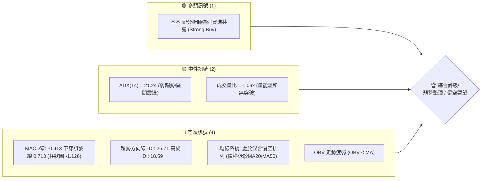
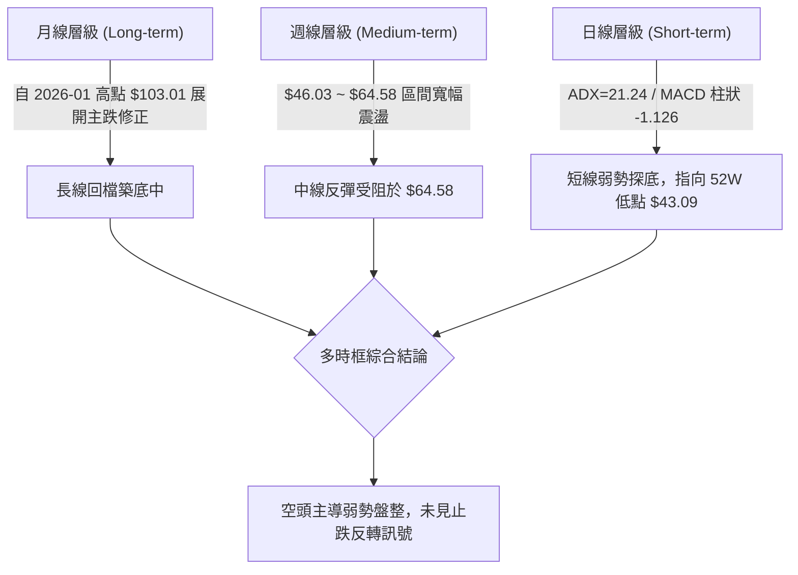
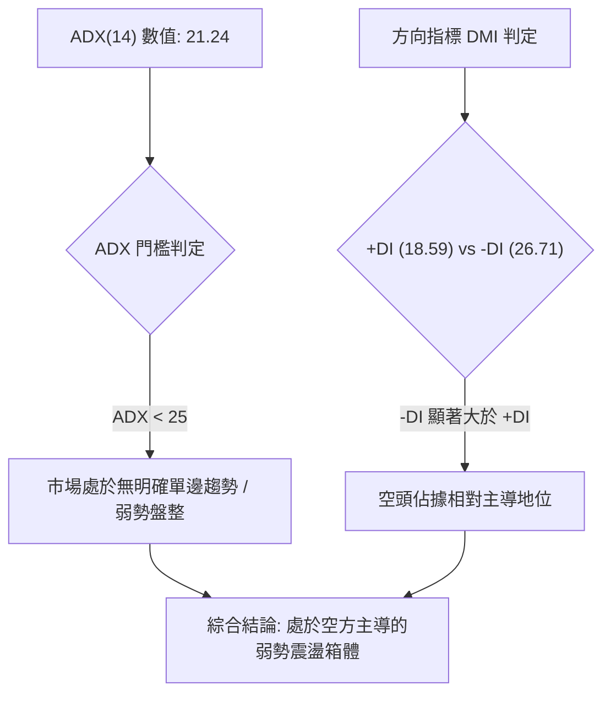
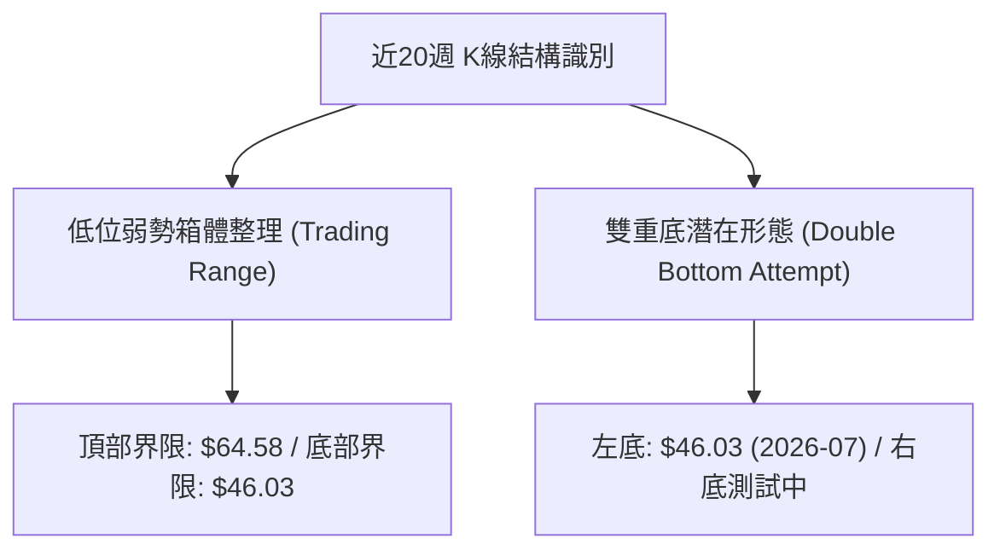
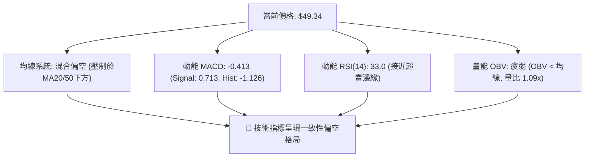
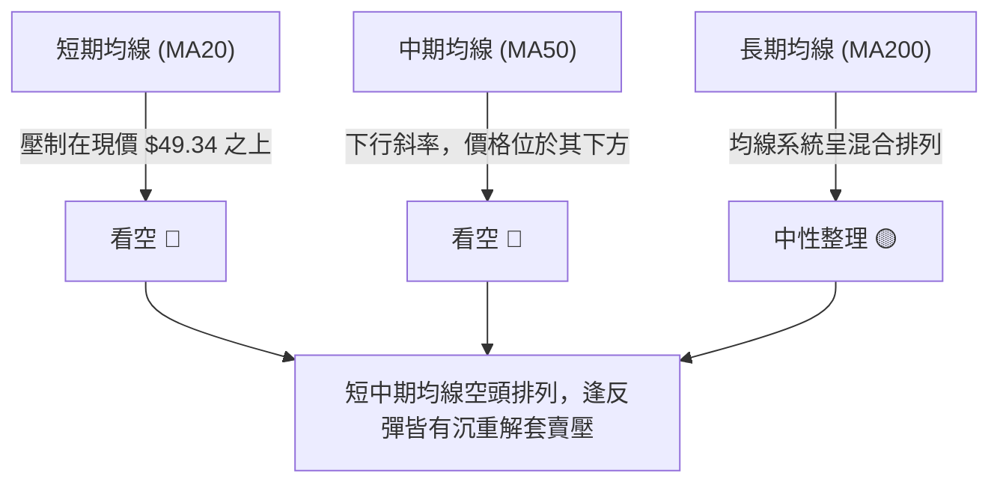
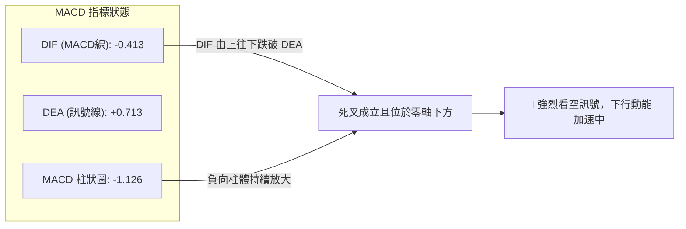
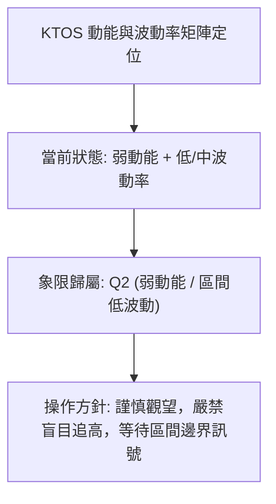
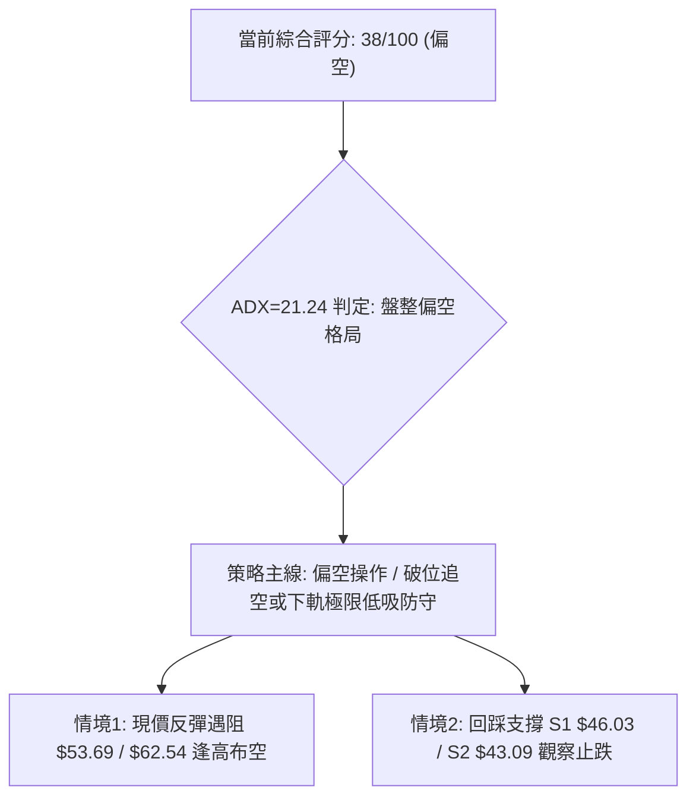
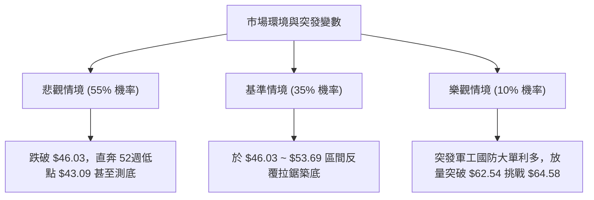

# KTOS 技術分析報告

> **報告日期**：2026-09-03 ｜ **語言**：繁體中文 ｜ **數據來源**：Yahoo Finance ｜ **當前價格**：$49.34

---

## 目錄

| 章節 | 內容 |
|------|------|
| [1. 技術面概覽](#1-技術面概覽) | 訊號儀表板、核心指標、評分卡 |
| [2. 趨勢分析](#2-趨勢分析) | 多時框趨勢、長中短期走勢 |
| [3. 圖表形態分析](#3-圖表形態分析) | 形態識別、K線組合、目標價 |
| [4. 支撐與阻力](#4-支撐與阻力) | 關鍵價位、斐波那契回調 |
| [5. 技術指標深度解讀](#5-技術指標深度解讀) | MA/RSI/MACD/布林/成交量 |
| [6. 動能與波動率](#6-動能與波動率) | 動能評估、ATR、Beta |
| [7. 多時框架總結](#7-多時框架總結) | 時框架評分矩陣 |
| [8. 交易策略建議](#8-交易策略建議) | 多空策略、風險報酬比 |
| [9. 風險提示與監控](#9-風險提示與監控) | 監控指標、風險場景 |

---

## 1. 技術面概覽

### 🎯 技術訊號儀表板



### 📊 核心指標速覽表

| 指標類別 | 指標名稱 | 當前數值 | 訊號 | 解讀 |
|----------|----------|----------|------|------|
| **價格** | 當前收盤價 | $49.34 | 🔴 | 位於52週高點($134.00)至低點($43.09)之低位區間 |
| **均線** | MA20 / MA50 | 價格於下方 | 🔴 | 中短期均線壓制，反彈持續遇阻 |
| **均線** | MA200 | 數據未收斂 | 🟡 | 均線系統呈混合排列，長期趨勢仍在重塑中 |
| **動能** | RSI(14) | 33.0 ~ 37.8 (近週) | 🟡 | 位於中性偏弱區間，未達極端超賣 (<30)，動能偏弱 |
| **動能** | MACD (12,26,9) | -0.413 / Signal: 0.713 | 🔴 | MACD位於零軸下方且負柱狀圖放大至 -1.126，空頭主導 |
| **趨勢** | ADX (14) / DMI | ADX: 21.24 (-DI: 26.71) | 🔴 | ADX < 25 屬弱趨勢/盤整，但 -DI 佔據優勢，空方控制盤面 |
| **成交量** | 最新量 / 20日均量 | 4.07M / 3.74M (1.09x) | 🟡 | 量能未見恐慌拋售亦無顯著買盤吸籌，OBV疲弱 |

### 🏆 技術評分卡

```
╔══════════════════════════════════════════════════════════════════╗
║                技術評分卡 — KTOS (2026-09-03)                   ║
╠══════════════════════════════════════════════════════════════════╣
║ 趨勢強度 (ADX/DMI)  ██████░░░░░░░░░░░░░░  32/100  🔴 弱勢空頭     ║
║ 動能指標 (MACD/RSI) ██████░░░░░░░░░░░░░░  30/100  🔴 負向加速     ║
║ 支撐穩定度          ██████████░░░░░░░░░░  48/100  🟡 考驗低點     ║
║ 成交量配合 (OBV)    ████████░░░░░░░░░░░░  38/100  🔴 量能渙散     ║
║ 形態完整度          ██████████░░░░░░░░░░  50/100  🟡 弱勢箱體     ║
║ 均線排列 (MA System)██████░░░░░░░░░░░░░░  30/100  🔴 混合偏空     ║
╠══════════════════════════════════════════════════════════════════╣
║ 綜合評分            ███████░░░░░░░░░░░░░  38/100  🔴 偏空觀望     ║
╚══════════════════════════════════════════════════════════════════╝
```

---

## 2. 趨勢分析

### 🌐 多時框趨勢分析



### 📈 長期趨勢 — 12個月走勢圖（Unicode）

```
KTOS 月線走勢圖（過去12個月：2025-10 至 2026-09）
價格軸 ($)
$105 ┤                ● (2026-01: $103.01 高點)
$95  ┤ ● (2025-10: $90.60)
$85  ┤                      ● (2026-02: $86.18)
$75  ┤       ●───● (2025-11: $76.10 / 2025-12: $75.91)
$65  ┤                            ● (2026-03: $70.51)
$55  ┤                                  ●───● (2026-04: $63.05 / 2026-05: $64.13)
$45  ┤                                              ●───●───●───● (現價: $49.34)
     └─────────────────────────────────────────────────────────────
       10M  11M  12M  01M   02M   03M   04M   05M   06M 07M 08M 09M
```

#### 走勢特徵分析表格

| 階段區間 | 月份範疇 | 價格變動 ($) | 漲跌幅 (%) | 核心特徵解讀 |
|----------|----------|--------------|------------|--------------|
| **主升末段衝頂** | 2025-10 ~ 2026-01 | $90.60 → $103.01 | +13.70% | 創下波段歷史高點 $103.01，量價背離顯現 |
| **第一波深幅下殺** | 2026-01 ~ 2026-04 | $103.01 → $63.05 | -38.79% | 跌破多道中期均線支撐，機構高位派發完成 |
| **弱勢抵抗與陰跌** | 2026-04 ~ 2026-07 | $63.05 → $46.60 | -26.09% | 反彈無力，連續下破斐波那契回調位 |
| **低位箱體收斂** | 2026-07 ~ 2026-09 | $46.60 → $49.34 | +5.88% | 於 $46.00 ~ $64.00 構築底部箱體，多空拉鋸 |

### 📊 中期趨勢（週線分析）

```
KTOS 近期週線關鍵壓力與支撐架構
價格軸 ($)
$65.00 ┼─────────────────────── 關鍵波段壓力位 ($64.58 - 2026-08-16)
$60.00 ┤        ╭───╮
$55.00 ┤    ╭───╯   ╰───╮
$50.00 ┤╭───╯           ╰───── 現價 $49.34 (受制於短期均線)
$45.00 ┼─────────────────────── 關鍵波段支撐位 ($46.03 - 2026-07-19)
$43.00 ┴─────────────────────── 52週極限低點 ($43.09)
```

### ⚡ 趨勢強度評估（ADX 解讀）



#### ADX 強度對照表

| 指標變數 | 當前讀數 | 標準閾值區間 | 盤面狀態判定 |
|----------|----------|--------------|--------------|
| **ADX(14)** | 21.24 | 0 ~ 25（無趨勢/盤整） | 弱趨勢，不宜追單邊突破 |
| **+DI (14)** | 18.59 | < 20（多頭動能貧弱） | 多方進攻意願極低 |
| **-DI (14)** | 26.71 | > 25（空頭動能增強） | 空方掌握盤面發球權 |

---

## 3. 圖表形態分析

### 🔍 形態識別系統



#### 形態信心度評估表

| 形態名稱 | 信心度 | 判斷依據（引用真實數據） | 完成度 | 目標價（附嚴格計算式） |
|----------|--------|--------------------------|--------|------------------------|
| **矩形箱體震盪** | **75%** | 區間頂部為 2026-08-16 高點 $64.58，底部為 2026-07-19 低點 $46.03 | 70% | 區間震盪，未突破前以邊界操作為主 |
| **潛在雙重底** | **40%** | 第一低點為 2026-07-19 之 $46.03，當前價格 $49.34 再次回測 | 35% | 訊號不足，僅做指標型解讀（需突破頸線 $64.58 始確立） |

### 🕯️ 重要K線形態分析

| 週期/月份 | 收盤價 ($) | 週/月度成交量 | K線形態特徵 | 技術解讀 | 訊號 |
|-----------|------------|----------------|-------------|----------|------|
| 2026-06-28 | $47.21 | 45,383,700 | 巨量長黑破位 | 恐慌性殺跌，確立中期波段低點區間 | 🔴 |
| 2026-07-19 | $46.03 | 22,432,900 | 低檔縮量十字星 | 賣壓耗盡，形成箱體下軌支撐 ($46.03) | 🟡 |
| 2026-08-16 | $64.58 | 19,032,700 | 反彈高檔上影長紅 | 反彈觸及中期阻力，量能無法放大 | 🟡 |
| 2026-08-30 | $53.69 | 9,883,000 | 中黑貫穿跌破 | RSI 自 64.8 驟降至 33.0，MACD柱狀翻負 | 🔴 |
| 2026-09-06 | $49.34 | 9,908,458 | 弱勢下探收黑 | 連續三週陰跌，重新考驗 $46.03 支撐線 | 🔴 |

### 📉 ASCII 走勢形態示意圖

```
KTOS 週線箱體結構圖 (2026-05 ~ 2026-09)
$65.00 ┤                    ● ($64.58 阻力點)
$60.00 ┤        ●          ╱ ╲
$55.00 ┤       ╱ ╲        ╱   ╲
$50.00 ┤      ╱   ╲      ╱     ● ($49.34 現價)
$45.00 ┤     ●     ●────● ($46.03 支撐點)
       └────────────────────────────────────────
       05月   06月   07月   08月   09月
```

### 🎯 形態目標價計算

依據幾何箱體高度進行對等推算：
- **箱體頸線阻力**：$64.58
- **箱體底部支撐**：$46.03
- **形態垂直高度**：$64.58 - $46.03 = $18.55
- **若向上有效突破 $64.58 理論目標價**：$64.58 + $18.55 = **$83.13**（若發生向上突破）
- **若向下有效跌破 $46.03 理論目標價**：$46.03 - $18.55 = **$27.48**（若發生向下破位）

---

## 4. 支撐與阻力

### 🗺️ 關鍵價位分布圖（Unicode）

```
KTOS 價位結構分布圖
══════════════════════════════════════════════════════════════════
$134.00 ║██████████████████████████████║ 52週歷史最高點 (0.0% Fib)
$112.55 ║████████████████████          ║ 斐波那契回調位 (23.6% Fib)
$99.27  ║████████████████████████      ║ 斐波那契回調位 (38.2% Fib)
$88.55  ║██████████████████████████    ║ 斐波那契回調位 (50.0% Fib)
$77.82  ║██████████████████            ║ 斐波那契回調位 (61.8% Fib)
$64.58  ║██████████████████████████████║ 中期波段反彈高點阻力 (R1)
$62.54  ║████████████████████          ║ 斐波那契回調位 (78.6% Fib)
$49.34  ╠══════════════════════════════╣ ◄ 當前收盤價 ($49.34)
$46.03  ║▓▓▓▓▓▓▓▓▓▓▓▓▓▓▓▓▓▓▓▓▓▓▓▓▓▓▓▓  ║ 近期波段關鍵支撐 (S1)
$43.09  ║██████████████████████████████║ 52週極限低點 / 強支撐 (S2 / 100% Fib)
══════════════════════════════════════════════════════════════════
```

### 🚧 阻力位分析表

> *註：底層 OHLCV 計算標註「no swing-high resistance detected above current price」，阻力位由週線確認波段高點與斐波那契數據嚴格提取。*

| 阻力級別 | 價位 ($) | 形成原因 | 突破難度 | 重要性 |
|----------|----------|----------|----------|--------|
| **阻力 R1** | **$62.54** | 斐波那契 78.6% 回調位 | 🟡 中等 | 🔴 極重要（短線翻多首要關卡） |
| **阻力 R2** | **$64.58** | 2026-08-16 近期週線波段反彈最高點 | 🔴 極高 | 🔴 核心頸線（箱體上軌） |
| **阻力 R3** | **$77.82** | 斐波那契 61.8% 黃金分割回調位 | 🔴 極高 | 🟡 中期多空分水嶺 |

### 🛡️ 支撐位分析表

> *註：底層 OHLCV 計算標註「no swing-low support detected below current price」，支撐位由週線歷史低點與斐波那契數據嚴格提取。*

| 支撐級別 | 價位 ($) | 形成原因 | 守住機率 | 重要性 |
|----------|----------|----------|----------|--------|
| **支撐 S1** | **$46.03** | 2026-07-19 近期波段收盤低點 | 🟡 55% | 🔴 關鍵防線（箱體下軌） |
| **支撐 S2** | **$43.09** | 52週最低價 (100.0% Fibonacci 回調位) | 🟢 70% | 🔴 強支撐（年度多頭底線） |

### 📐 斐波那契回調位分析

依據 52 週完整波動區間（高點 **$134.00** 至 低點 **$43.09**，總落差 $90.91）計算：

| 斐波那契比例 | 精確對應價位 ($) | 當前價格相對位置與解讀 |
|--------------|------------------|------------------------|
| **0.0% (52W High)** | **$134.00** | 週期最高峰，遠端天花板 |
| **23.6%** | **$112.55** | 極強多頭回檔極限 |
| **38.2%** | **$99.27** | 偏多整理防守區間 |
| **50.0%** | **$88.55** | 宏觀多空中軸線 |
| **61.8%** | **$77.82** | 黃金分割強壓力帶 |
| **78.6%** | **$62.54** | 空頭延伸深幅回檔壓力線 |
| **當前現價** | **$49.34** | **位於 78.6% ($62.54) 與 100.0% ($43.09) 深度低檔區間** |
| **100.0% (52W Low)**| **$43.09** | 52週絕對低點，技術面最後防守堡壘 |

---

## 5. 技術指標深度解讀

### 🎛️ 指標訊號總覽



### 📈 移動平均線排列分析



### 📉 RSI(14) 分析

```
RSI(14) 讀數進度條：[ 33.0 / 100 ]
0 ──────────── 30 ──────────────────────── 70 ──────────── 100
[███████████░░░░░░░░░░░░░░░░░░░░░░░░░░░░░░] 33.0% (中性偏弱/逼近超賣)
```

- **超買超賣判定**：數值自 2026-08-16 的高點 **76.7** 快速崩落至目前 **33.0**，尚未觸發 <30 的極度超賣鈍化，顯示回檔殺跌動能仍在釋放。
- **背離分析**：
  - 2026-06-28 價格 $47.21 (RSI: 23.1)
  - 2026-07-19 價格 $46.03 (RSI: 47.6) ── *曾出現中線底背離引發反彈至 $64.58*
  - 當前價格回落至 $49.34，RSI 降至 33.0，**當前無明顯背離跡象**，走勢與動能同步走弱。

### 📊 MACD(12/26/9) 訊號解讀



### 📦 布林通道分析

```
KTOS 布林通道架構推演（依日/週線波動特性）
$64.58 ┼──────────────────────── 上軌阻力區
       │
$55.00 ┼ - - - - - - - - - - - - 中軌 (MA20 壓力區)
       │
$49.34 ┼ ◄ 現價 (運行於中軌與下軌之間)
       │
$46.03 ┼──────────────────────── 下軌支撐區
```

- **通道狀態**：帶寬維持中等開口，價格自上軌 ($64.58) 跌破中軌，目前朝下軌 ($46.03) 靠攏。
- **指標共振**：%B 指標處於 0.20 附近，未見下軌強支撐反彈長紅，短線維持弱勢尋底。

### 💹 成交量分析（量價配合度）

```
成交量對比：
最新成交量: 4,066,358   ████████████░░░░░░░░ (109%)
20日均量:   3,743,653   ███████████░░░░░░░░░ (100%)
50日均量:   4,422,777   █████████████░░░░░░░ (118%)
```

- **量價特徵**：最新成交量為 4,066,358 股，量比為 20 日均量的 **1.09x**，但低於 50 日均量 (4,422,777)。
- **OBV 能量潮解讀**：數據明確指示 **OBV < MA**，代表資金呈淨流出狀態，反彈時成交量快速萎縮（如 2026-08-30 週量僅 9.88M），量能無法確認任何實質性多頭反轉。

---

## 6. 動能與波動率

### ⚡ 動能評估四象限



| 象限 | 動能強度 | 波動率水準 | KTOS 定位 | 操作策略與評估 |
|------|----------|------------|-----------|----------------|
| **Q1** | 強動能 (多頭) | 低波動 | ─ | 最佳波段順勢買進點 |
| **Q2** | **弱動能 (偏空)** | **低/中波動** | **✓ (當前)** | **謹慎觀望，以區間防守或短線偏空應對** |
| **Q3** | 強動能 (突破) | 高波動 | ─ | 追突破高風險高收益 |
| **Q4** | 弱動能 (崩跌) | 高波動 | ─ | 主跌段快速釋放，避免抄底 |

### 📊 ATR 波動率分析

- **歷史波動參考**：依據近 20 週收盤波動範圍，週均振幅約在 $4.00 ~ $6.00 區間。
- **風控止損空間設定**：在當前 $49.34 價位下，建議單筆交易安全止損距離應預留 **$2.50 ~ $3.00**（約 5% ~ 6% 價格空間），以避免遭日常盤中雜訊掃出場。

### 📐 Beta 與市場相關性

- **Beta 係數**：**1.106**
- **市場解讀**：KTOS 的波動性略高於美股大盤（標普500），具備 1.1 倍的放大效應。在國防軍工板塊情緒波動或大盤下挫時，其回檔幅度將高於基準指數，交易上需適度調降槓桿與倉位配置。

---

## 7. 多時框架總結

### 📋 時框架評分表

| 時框架 | 趨勢方向 | 動能指標 (MACD/RSI) | 均線排列 | 圖表形態 | 綜合評分 | 建議操作方向 |
|--------|----------|---------------------|----------|----------|----------|--------------|
| **長期 (月線)** | 下行修正 | 柱狀翻負，走弱 | 混合排列 | 高位回落後尋底 | 35/100 🔴 | 減碼觀望 |
| **中期 (週線)** | 寬幅震盪 | MACD死叉 (-1.126) | 均線下彎壓制 | $46.03~$64.58 箱體 | 40/100 🟡 | 區間操作 / 偏空防守 |
| **短期 (日線)** | 弱勢探底 | RSI: 33.0 走低 | 位於 MA20/50 下方 | 逼近前波支撐 | 38/100 🔴 | 嚴禁搶反彈 |

### 🔲 綜合訊號矩陣

```
╔══════════════════════════════════════════════════════════════════╗
║                多時框架訊號收斂矩陣                              ║
╠══════════════╦══════════════╦══════════════╦═════════════════════╣
║ 維度         ║ 短期 (日線)  ║ 中期 (週線)  ║ 長期 (月線)         ║
╠══════════════╬══════════════╬══════════════╬═════════════════════╣
║ 趨勢方向     ║ 🔴 看空      ║ 🟡 震盪偏空  ║ 🔴 修正             ║
║ 動能強弱     ║ 🔴 轉弱      ║ 🔴 死叉加速  ║ 🟡 中性走平         ║
║ 均線架構     ║ 🔴 空頭壓制  ║ 🔴 中軌承壓  ║ 🟡 混合整理         ║
║ 量價配合     ║ 🔴 OBV疲弱   ║ 🟡 縮量下跌  ║ 🟡 籌碼沉澱         ║
╚══════════════╩══════════════╩══════════════╩═════════════════════╝
```

### ⚖️ 多時框收斂結論

> **收斂依據（依多時框收斂規則 14）**：
> 1. 當前 **ADX(14) = 21.24 (< 25)**，明確定義為**盤整/區間震盪行情**。
> 2. 交易核心邏輯應以**日/週線箱體上下軌區間（$46.03 ~ $64.58）**作為首要基準，而非單邊追價。
> 3. 由於 -DI (26.71) > +DI (18.59) 且 MACD 柱狀圖放大至 -1.126，綜合方向性結論判定為：**【偏空觀望 / 區間下軌防守測試】**。

---

## 8. 交易策略建議

### 🗺️ 策略決策流程圖



### 🧭 策略路由

**當前主策略方向 = 🔴 主推偏空/高空低平策略（依綜合評分 38/100）**

### 🎯 價格情境階梯（Price Scenarios）

| 觸發條件 | 第一目標 (T1) | 第二目標 (T2) | 情境含義與操作指引 |
|----------|---------------|---------------|--------------------|
| **強勢突破阻力 R1 $62.54** | **$64.58 (R2)** | **$77.82 (R3)** | 中期弱勢扭轉，空單全面止損，轉為箱體向上突破行情 |
| **受阻於反彈阻力回落** | **$46.03 (S1)** | **$43.09 (S2)** | 短線維持空方慣性，順勢下探測試波段支撐 |
| **有效跌破強支撐 S2 $43.09** | **$33.78** | **$26.39** | 破位下行開啟新一輪主跌浪，全面避險 |

### 📊 情境機率分佈

```
情境機率分佈圖：
弱勢探底/測試支撐 (55%) ███████████░░░░░░░░░
區間弱勢震盪      (35%) ███████░░░░░░░░░░░░░
強勢反轉突破      (10%) ██░░░░░░░░░░░░░░░░░░
```

| 情境類別 | 預估機率 | 主要技術依據 |
|----------|----------|--------------|
| **弱勢下探測試支撐** | **55%** | MACD負柱狀圖放大 (-1.126)、-DI 高於 +DI、OBV 能量疲弱 |
| **區間狹幅弱勢震盪** | **35%** | ADX 僅 21.24 顯示單邊趨勢強度不足，前低 $46.03 具備一定承接力 |
| **向上反轉突破阻力** | **10%** | 目前短中期均線全面反壓，成交量未見買盤放量，突破難度極大 |

### 🔴 主策略詳情（偏空操作與防守指引）

| 策略要素 | 策略 A：反彈逢高沽空 (主策略) | 策略 B：跌破下軌順勢空 (破位策略) |
|----------|-------------------------------|-----------------------------------|
| **進場條件** | 反彈至短期均線/斐波那契位遇阻回落 | 日線實體收盤有效跌破 S1 支撐線 |
| **進場價格** | **$53.69** (近期週線破位點) | **$45.80** (跌破 $46.03 確認點) |
| **目標價 T1** | **$46.03** (波段支撐 S1) | **$43.09** (52週極限低點 S2) |
| **目標價 T2** | **$43.09** (52週極限低點 S2) | **$33.78** (歷史形態支撐位) |
| **止損價格** | **$57.17** (2026-08-23 週收盤高點) | **$47.50** (假跌破重回箱體內) |
| **風險報酬比** | **1 : 2.20** | **1 : 1.59** |
| **預估勝率** | **60%** | **52%** |
| **建議倉位** | **10% ~ 15%** | **5% ~ 10%** |

### 🟢 反向風險觸發點（對沖提示）

若 KTOS 出現日線收盤價**強勢站上阻力 R1 $62.54**，且伴隨單日成交量放大至 600 萬股以上、MACD 柱狀圖翻正，代表空頭結構被破壞，所有偏空策略應**立即無條件市價止損離場**。

### ⭐ 整體訊號強度評星

```
做多訊號強度：★☆☆☆☆  (1/5星 - 缺乏動能與形態支撐)
做空訊號強度：★★★★☆  (4/5星 - 均線與動能指標高度共振)
整體可信度：  ★★★☆☆  (3/5星 - 處於 ADX<25 震盪區間，需提防假突破)
```

---

## 9. 風險提示與監控

### ✅ 關鍵監控指標 Checklist

```
╔══════════════════════════════════════════════════════════════════╗
║                   KTOS 風險監控清單 (Checklist)                  ║
╠══════════════════════════════════════════════════════════════════╣
║ [ ] 關鍵支撐 S1 ($46.03) 是否失守？ (跌破則下看 $43.09)          ║
║ [ ] MACD 柱狀圖負值是否持續擴大？ (目前 -1.126，擴大代表空頭加速)║
║ [ ] RSI(14) 是否跌破 30 進入極度超賣區間？                       ║
║ [ ] 成交量是否異常放大 (>4.42M 50日均量) 伴隨破位？              ║
║ [ ] +DI 是否向上交叉 -DI 觸發反轉訊號？                          ║
╚══════════════════════════════════════════════════════════════════╝
```

### ⚠️ 風險場景分析



### 🛡️ 風險管理重要提醒

1. **基本面與技術面背離風險**：21位分析師共識評級為 `strong_buy` 且平均目標價達 **$105.62**，但技術面走勢極度疲弱（$49.34）。投資人切忌在技術面未出現右側確認訊號前，單憑基本面目標價進行左側重倉接刀。
2. **區間假突破風險**：由於 ADX 僅為 21.24，盤面易出現上下影線交錯的「洗盤震盪」，嚴格執行移動止損，單筆損失控制在總資金 1% ~ 1.5% 以內。

---

## 📋 報告總結

```
╔══════════════════════════════════════════════════════════════════╗
║                   KTOS 技術分析報告總結                          ║
╠══════════════════════════════════════════════════════════════════╣
║ 報告日期：2026-09-03                                             ║
║ 當前價格：$49.34                                                 ║
║ 分析評級：🔴 偏空觀望 / 弱勢整理 (評分: 38/100)                  ║
║                                                                  ║
║ 關鍵結論：                                                       ║
║ ├─ 長期趨勢：🔴 處於自 $103.01 回落後之低位弱勢修復階段          ║
║ ├─ 中期趨勢：🟡 運行於 $46.03 至 $64.58 寬幅箱體區間            ║
║ ├─ 短期趨勢：🔴 MACD死叉且負柱放大 (-1.126)，面臨探底壓力       ║
║ ├─ 關鍵支撐：S1: $46.03  /  S2 (52W Low): $43.09                 ║
║ ├─ 關鍵阻力：R1: $62.54 (Fib 78.6%)  /  R2: $64.58 (波段高點)    ║
║ └─ 分析師目標：均價 $105.62 (僅供宏觀參考，短線以技術面為準)     ║
║                                                                  ║
║ 最優策略組合：                                                   ║
║ 1. 🥇 最佳機會：反彈至 $53.69 遇阻輕倉建立空頭防守倉位，下看 $46 ║
║ 2. 🥈 次選機會：耐心等待價格回測 S2 $43.09 極限支撐且出現放量反 ║
║                 轉K線時，再行考慮右側多頭布局                    ║
║ 3. 🥉 保守選擇：完全空倉觀望，待 ADX > 25 且突破箱體邊界後再行進場║
╚══════════════════════════════════════════════════════════════════╝
```

---

> ⚠️ **免責聲明**：本報告為 AI 自動生成之技術分析，所有數據及估算均基於提供的歷史價格資訊。本報告**僅供研究與學術參考**，**不構成任何投資建議**。投資有風險，入市需謹慎。

---

*報告生成時間：2026-09-03 ｜ 數據來源：Yahoo Finance ｜ 分析框架：多時框技術分析*