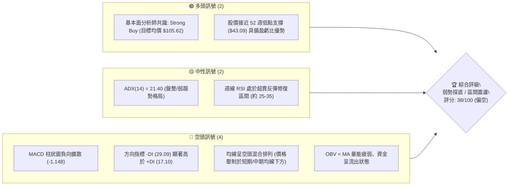
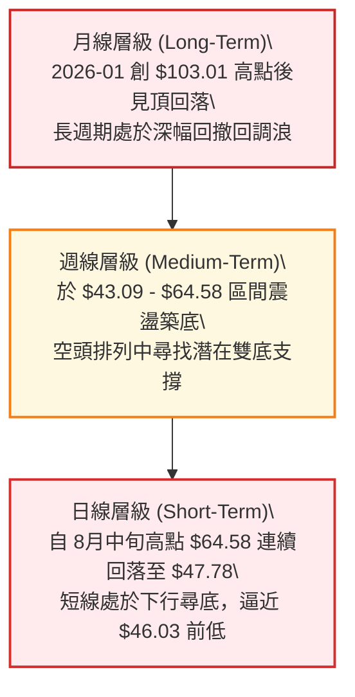
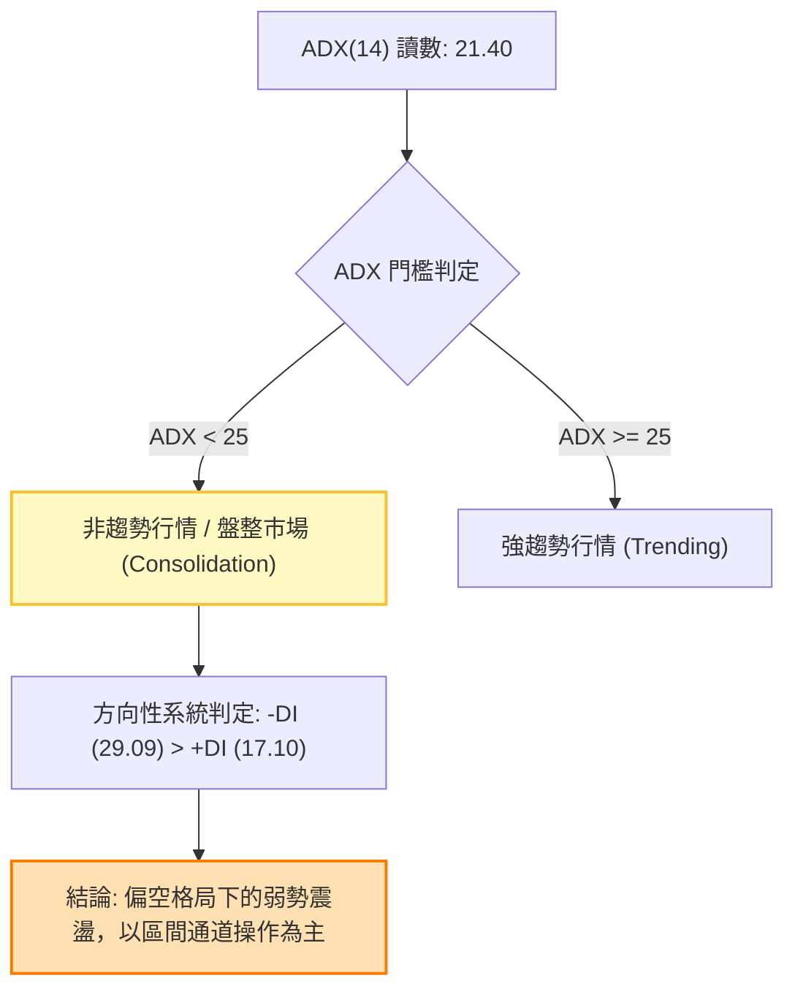
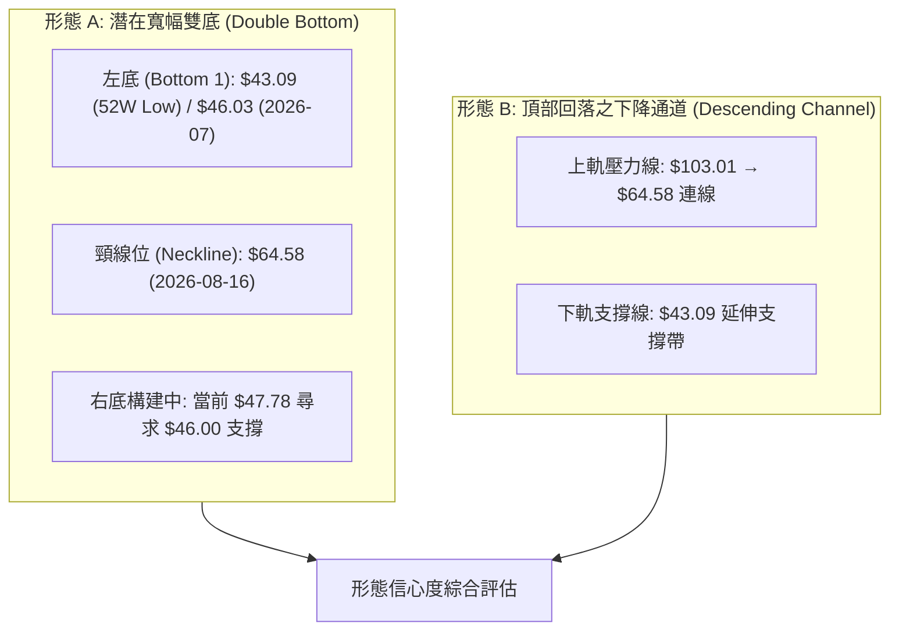
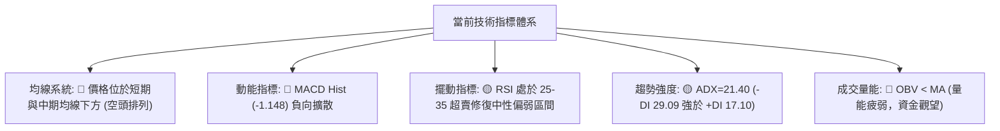
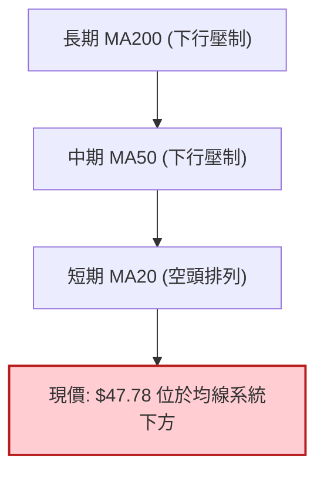
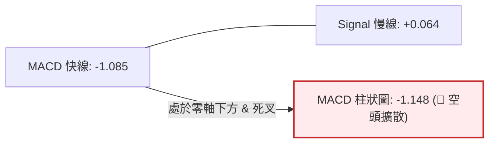
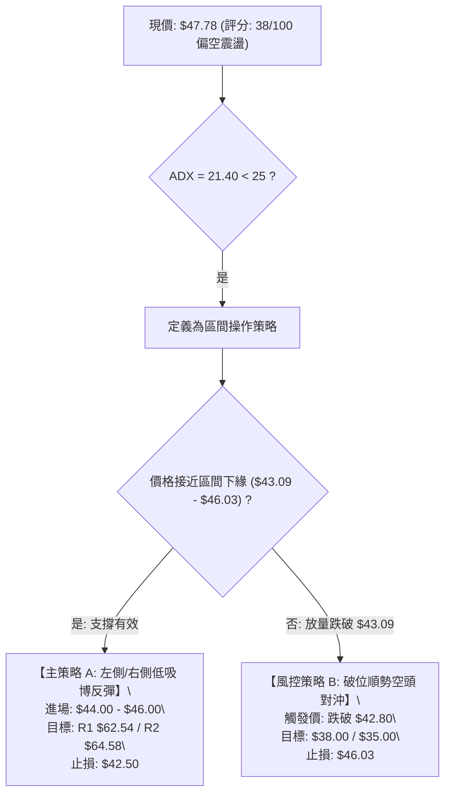
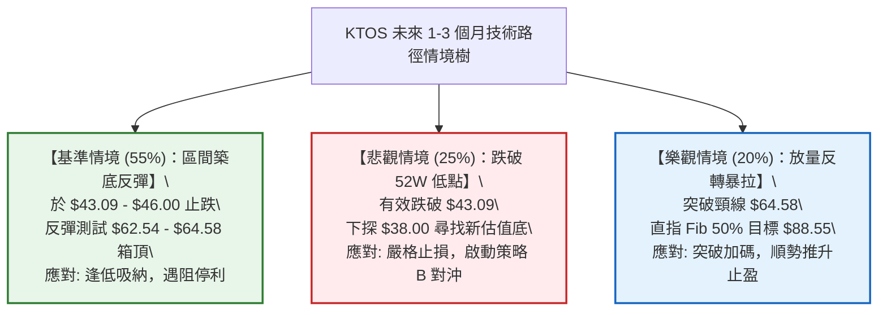

# KTOS 技術分析報告

> **報告日期**：2026-09-04 ｜ **語言**：繁體中文 ｜ **數據來源**：Yahoo Finance ｜ **當前價格**：$47.78

---

## 目錄

| 章節 | 內容 |
|------|------|
| [1. 技術面概覽](#1-技術面概覽) | 訊號儀表板、核心指標、評分卡 |
| [2. 趨勢分析](#2-趨勢分析) | 多時框趨勢、長中短期走勢、ADX 解讀 |
| [3. 圖表形態分析](#3-圖表形態分析) | 形態識別、信心度評估、K線組合、目標價計算 |
| [4. 支撐與阻力](#4-支撐與阻力) | 關鍵價位分布圖、阻力/支撐表、斐波那契回調 |
| [5. 技術指標深度解讀](#5-技術指標深度解讀) | MA/RSI/MACD/布林通道/成交量與OBV |
| [6. 動能與波動率](#6-動能與波動率) | 動能四象限、ATR波動率、Beta與大盤相關性 |
| [7. 多時框架總結](#7-多時框架總結) | 時框架評分表、訊號矩陣、多時框收斂結論 |
| [8. 交易策略建議](#8-交易策略建議) | 策略路由、價格情境階梯、主策略詳情、風報比 |
| [9. 風險提示與監控](#9-風險提示與監控) | 監控清單、三行情境樹、資金管理準則 |
| [10. 報告總結](#-報告總結) | 核心結論、最優交易策略組合匯總 |

---

## 1. 技術面概覽

### 🎯 技術訊號儀表板



---

### 📊 核心指標速覽表

| 指標類別 | 指標名稱 | 當前數值 | 訊號 | 解讀 |
|----------|----------|----------|:----:|------|
| **價格** | 當前收盤價 | $47.78 | 🔴 | 位於 52 週區間下緣（接近 52W 低點 $43.09） |
| **價格區間** | 52W 高 / 低 | $134.00 / $43.09 | 🟡 | 距高點回撤達 -64.34%，處於長期價值修正期 |
| **趨勢強度** | ADX (14) | 21.40 | 🟡 | 數值 < 25，市場處於非趨勢型「弱勢盤整」格局 |
| **方向系統** | +DI / -DI | 17.10 / 29.09 | 🔴 | -DI 大幅壓制 +DI，空方力量牢牢佔據盤面主導 |
| **動能** | MACD (12,26,9) | -1.085 | 🔴 | MACD 處於零軸下方，空頭動能尚未扭轉 |
| **動能** | MACD Signal | 0.064 | 🔴 | 差離值持續下行，短線承壓 |
| **動能** | MACD Histogram | -1.148 | 🔴 | 負柱狀體放大，空頭殺跌動能仍在釋放 |
| **成交量** | 最新成交量 | 3,874,448 | 🟡 | 稍高於 20 日均量 (3,313,507)，量比 1.17x |
| **量能指標** | OBV 趨勢 | OBV < MA | 🔴 | 能量潮低於均線，資金未見顯著回流跡象 |
| **市場敏感情** | Beta | 1.106 | 🟡 | 波動度略高於大盤，具備適度進攻彈性 |

---

### 🏆 技術評分卡

```
╔══════════════════════════════════════════════════════════════════╗
║              技術評分卡 — KTOS (2026-09-04)                      ║
╠══════════════════════════════════════════════════════════════════╣
║ 趨勢強度 (Trend Strength)  ██████░░░░░░░░░░░░░░  30/100  🔴 空頭主導  ║
║ 動能指標 (Momentum)        ████████░░░░░░░░░░░░  40/100  🟡 弱勢修復  ║
║ 支撐穩定度 (Support)       ████████████░░░░░░░░  60/100  🟡 考驗低位  ║
║ 成交量配合 (Volume Flow)   ██████░░░░░░░░░░░░░░  30/100  🔴 量能疲弱  ║
║ 形態完整度 (Pattern)       ████████░░░░░░░░░░░░  40/100  🟡 構築底部  ║
║ 均線系統 (MA Alignment)    ████░░░░░░░░░░░░░░░░  20/100  🔴 空頭壓制  ║
╠══════════════════════════════════════════════════════════════════╣
║ 綜合評分 (Composite Score) ████████░░░░░░░░░░░░  38/100  🔴 偏空中性  ║
╚══════════════════════════════════════════════════════════════════╝
```

---

## 2. 趨勢分析

### 🌐 多時框趨勢分析



---

### 📈 長期趨勢 — 12個月走勢圖（Unicode）

```
KTOS 月線走勢圖（2025-09 至 2026-09）
價格軸 ($)
$105 ┤                ● 2026-01 ($103.01 月收高點)
$95  ┤ ● 2025-09 ($91.37)
$85  ┤                      ● 2026-02 ($86.18)
$75  ┤       ● 2025-11 ($76.10)   ● 2026-03 ($70.51)
$65  ┤                                  ● 2026-05 ($64.13)
$55  ┤                                            ● 2026-08 ($50.98)
$45  ┤                                        ● 2026-07 ($46.60)  ● 現價 $47.78
$35  ┤
     └─────────────────────────────────────────────────────────────
       09  10  11  12  01  02  03  04  05  06  07  08  09 (月份)
```

#### 📊 走勢特徵階段分析

| 階段區間 | 時間跨度 | 起止價位 | 漲跌幅 | 核心特徵與技術含義 |
|----------|----------|----------|:------:|-------------------|
| **牛市主升浪** | 2025-04 ~ 2026-01 | $33.78 → $103.01 | **+204.94%** | 無人機/國防板塊熱炒，量價齊揚，創歷史級波段新高 |
| **頂部派發期** | 2026-01 ~ 2026-03 | $103.01 → $70.51 | **-31.55%** | 獲利了結盤湧出，高位跌破中期均線，空方接管 |
| **加速殺跌期** | 2026-03 ~ 2026-07 | $70.51 → $46.60 | **-33.91%** | 估值壓縮與多頭踩踏，觸及 52 週最低點 $43.09 |
| **底部震盪期** | 2026-07 ~ 2026-09 | $46.60 → $47.78 | **+2.53%** | 於 $43.09-$64.58 展開寬幅區間拉鋸，尋求底部分型 |

---

### 📊 中期趨勢（週線分析）

從近 20 週的收盤價數據觀察，中期走勢呈現「寬幅箱體震盪」特徵：
- **波段反彈高點**：2026-05-31 的 `$64.13` 以及 2026-08-16 的 `$64.58`。
- **波段回踩低點**：2026-06-28 的 `$47.21`、2026-07-19 的 `$46.03`，以及 52 週低點 `$43.09`。
- 當前週線由 8 月中旬高點 `$64.58` 連續 3 週拉回至 `$47.78`，MACD 柱狀圖由正轉負（`-1.148`），顯示中期反彈浪告一段落，目前正處於二次探底、驗證支撐有效性的過程中。

---

### ⚡ 趨勢強度評估（ADX 解讀）



| 指標名稱 | 當前讀數 | 門檻標準 | 狀態評估 | 實戰策略指引 |
|----------|:--------:|----------|:--------:|--------------|
| **ADX (14)** | **21.40** | `< 20` 弱 / `20-25` 盤整 / `> 25` 趨勢 | 🟡 **弱勢盤整** | 避免追漲殺跌，趨勢跟隨策略失效，應採區間邊界逆勢操作 |
| **+DI (14)** | **17.10** | 多頭進攻強度 | 🔴 **多方動能匱乏** | 買方力量薄弱，難以發動突破性單邊上漲行情 |
| **-DI (14)** | **29.09** | 空頭壓制強度 | 🔴 **空方佔據優勢** | 賣壓佔上風，反彈易遇阻力，下檔需密切觀察支撐防守力道 |

---

## 3. 圖表形態分析

### 🔍 形態識別系統



#### 📐 形態信心度與目標價評估表

| 形態名稱 | 信心度 | 判斷依據（引用數據） | 完成度 | 目標價（附精確計算式） |
|----------|:------:|----------------------|:------:|------------------------|
| **潛在雙底 (Double Bottom)** | **58%** | ① 左底於 2026-07 探至 `$46.03`（逼近 52W 低點 `$43.09`）；<br>② 中期反彈頸線為 2026-08-16 高點 `$64.58`；<br>③ 現價 `$47.78` 正回踩測試右底有效性。 | 60% | **突破頸線目標價**：<br>頸線 `$64.58` + 形態高度 (`$64.58` - `$43.09` = `$21.49`) = **`$86.07`**（逼近斐波那契 50.0% 回調位 `$88.55`） |
| **寬幅箱體震盪 (Rectangle)** | **72%** | 價格在近半年反覆受阻於 `$64.13` ~ `$64.58`，並在 `$43.09` ~ `$46.03` 獲得承接，符合典型無趨勢箱體特徵。 | 85% | **箱體頂部目標價**：**`$64.58`**<br>**箱體底部支撐價**：**`$43.09`** |
| **大型頭肩頂頸線跌破** | **45%** | 2026-01 見頂 `$103.01`，跌破 `$75.91` 頸線後已完成主要跌幅，目前處於超跌後的低位築底期。 | 100% | 跌幅已於 `$43.09` 滿足（原頭部高度計算之目標已達成）。 |

---

### 🕯️ 重要 K 線形態分析

| 週期 / 日期 | 收盤價 | K 線形態組合 | 技術解讀 | 訊號方向 |
|-------------|:------:|--------------|----------|:--------:|
| **2026-08-16** | $64.58 | 週線長上影射擊之星 (Shooting Star) | 衝高觸及 78.6% 斐波那契位 `$62.54` 後遭強烈空頭反撲，確認中期頂部壓力 | 🔴 看空反轉 |
| **2026-08-23** | $57.17 | 中陰線下破 | 跌破 5 週均線，吞沒前週大部分漲幅，確認 8 月中旬衝頂失敗 | 🔴 空方加速 |
| **2026-08-30** | $52.00 | 大陰線破位 | 週成交量縮至 11.85M，但賣壓沉重，連破 $55 關卡 | 🔴 空方主導 |
| **2026-09-06** | $47.78 | 下影陰十字星 (Hammer/Doji) | 量能小幅回升至 13.81M，於 $47 附近顯現買盤低吸護盤跡象 | 🟡 潛在止跌 |

---

### 📉 ASCII 走勢形態示意圖

```
KTOS 潛在雙底與箱體形態示意圖
 價格 ($)
$65.00 ┤              [頸線 R2: $64.58]
       ┤              ╭───▲───╮ (2026-08-16)
$60.00 ┤  ╭───▲───╮   │       │               [斐波那契 78.6%: $62.54]
       ┤  │ (05-31)│   │       │
$55.00 ┤──╯       ╰───╯       ╰───╮
$50.00 ┤                          ╰───► 現價: $47.78
$45.00 ┤          ╰───▼───╯            ╰───▼─── (右底測試中)
       ┤         [左底 S1: $46.03]        [預期支撐帶: $43.09-$46.03]
$40.00 ┤         [52W低點: $43.09]
       └────────────────────────────────────────────────────────────
```

---

## 4. 支撐與阻力

### 🗺️ 關鍵價位分布圖（Unicode）

```
KTOS 價位結構分布圖（基於 OHLCV 及斐波那契計算）
══════════════════════════════════════════════════════════════════
$134.00 ║██████████████████████████████║ 52週歷史高點 (Fib 0.0%)
$112.55 ║████████████████████          ║ Fib 23.6% 長期阻力
$99.27  ║██████████████████████        ║ Fib 38.2% 強阻力
$88.55  ║████████████████████████      ║ Fib 50.0% 強弱分水嶺
$77.82  ║████████████████████          ║ Fib 61.8% 波段阻力 R3
$64.58  ║████████████████████████████  ║ 近期波段高點阻力 R2
$62.54  ║████████████████████████      ║ Fib 78.6% 關鍵阻力 R1
╠═══════╬══════════════════════════════╬═════════════════════════
$47.78  ╠══════════════════════════════╣ ◄ 現價位置 ($47.78)
╠═══════╬══════════════════════════════╬═════════════════════════
$46.03  ║▓▓▓▓▓▓▓▓▓▓▓▓▓▓▓▓▓▓▓▓          ║ 近期波段低點支撐 S1
$43.09  ║██████████████████████████████║ 52週極限低點強支撐 S2 (Fib 100%)
══════════════════════════════════════════════════════════════════
```

---

### 🚧 阻力位分析表

| 阻力級別 | 價位 | 形成原因 | 突破難度 | 技術重要性 |
|:--------:|:----:|----------|:--------:|:----------:|
| **R1 (近端關鍵)** | **$62.54** | **斐波那契 78.6% 回調位**；多次反彈在此遇阻回落 | 🟡 中等 | 短線多頭反彈的第一目標，站穩方能扭轉頹勢 |
| **R2 (中期頸線)** | **$64.58** | **2026-08-16 波段最高收盤價**，箱體震盪頂部頸線 | 🔴 極高 | 雙底/箱體突破確認點，突破此處將開啟反轉主升浪 |
| **R3 (強阻力區)** | **$77.82** | **斐波那契 61.8% 回調位**，中長期多空籌碼密集套牢區 | 🔴 極高 | 中長線反彈的核心阻力位 |

---

### 🛡️ 支撐位分析表

| 支撐級別 | 價位 | 形成原因 | 守住機率 | 技術重要性 |
|:--------:|:----:|----------|:--------:|:----------:|
| **S1 (短期支撐)** | **$46.03** | **2026-07-19 近期波段低點**，短線多頭防守的第一防線 | 🟡 65% | 右底構築關鍵點；跌破則短線將直逼 52 週低點 |
| **S2 (極限強支撐)** | **$43.09** | **52 週最低點 (Fib 100.0%)**；年度強支撐底線 | 🟢 85% | 核心防守底線；若放量失守，將引發新一輪估值崩潰 |
| **S3 (延伸支撐)** | *數據未偵測* | *原始數據中未偵測到 $43.09 下方之 swing-low* | -- | 若跌破 $43.09，僅能依心理整數關卡 $40.00 評估 |

---

### 📐 斐波那契回調位分析

依據 52 週波動區間（最高點 `$134.00` → 最低點 `$43.09`，區間跨度 `$90.91`）計算之回調位如下：

```
0.0%  (52W High)   $134.00  ───────────────────────────────────
23.6%              $112.55  ───────────────────────────────────
38.2%              $99.27   ───────────────────────────────────
50.0%              $88.55   ───────────────────────────────────
61.8%              $77.82   ───────────────────────────────────
78.6%              $62.54   ═══════════════════════════════════ (反彈強阻力 R1)
[現價]             $47.78   ◄── 處於 78.6% 與 100.0% 弱勢尋底區間
100.0% (52W Low)   $43.09   ═══════════════════════════════════ (年度強支撐 S2)
```

- **位置解讀**：現價 `$47.78` 處於 `78.6% ($62.54)` 與 `100.0% ($43.09)` 之間的深幅回撤區間，距離 52 週底部僅剩 **`$4.69` (+10.88%)** 的緩衝空間。
- **技術意義**：深幅回調至 78.6% 以下通常意味著原本的上升趨勢遭到嚴重破壞，轉入長週期的低位籌碼重組期。

---

## 5. 技術指標深度解讀

### 🎛️ 指標訊號總覽



---

### 📈 移動平均線排列分析



- **短/中期均線壓制**：月度與週度數據顯示，MA5、MA10、MA20 呈現空頭排列。價格多次反抽 MA20/MA50 均告失敗（例如 8 月中旬衝高至 `$64.58` 後迅速被均線反壓打回）。
- **均線發散狀態**：目前短期均線斜率向下趨緩，顯示短期殺跌動能正在減弱，但尚未出現黃金交叉的多頭轉折訊號。

---

### 📉 RSI(14) 分析

```
RSI(14) 指標狀態進度條：
0 ─────── 20 ────────── 40 ────────── 60 ────────── 80 ────── 100
[ 超賣區 ]   [  當前弱勢修復區 ~30  ]        [  中性區  ]   [ 超買區 ]
▓▓▓▓▓▓▓▓░░░░░░░░░░░░░░░░░░░░░░░░░░░░░░░░░░░░░░░░░░░ 29.0% (弱勢修復)
```

- **歷史軌跡**：週線 RSI 在 2026-06-28 探至最低點 `23.1`，隨後於 2026-08-16 伴隨反彈拉升至 `76.7`（超買），近期再度回落至 `25.0`（2026-08-30）。
- **背離分析（Divergence）**：
  - **底背離檢驗**：股價於 2026-06-28 收盤 `$47.21`（RSI=`23.1`），隨後於 2026-07-19 跌至 `$46.03`，此時週線 RSI 卻逆勢上升至 `47.6`，呈現**輕微週線底背離**。
  - **當前結論**：雖然存在潛在底背離雛形，但近期自 $64.58 快速下殺使日線動能再度受挫，需等待日線 RSI 站穩 40 以上以確認底背離結構成立。

---

### 📊 MACD(12/26/9) 訊號解讀



- **數值狀態**：MACD 線為 `-1.085`，訊號線為 `+0.064`，柱狀圖差值為 `-1.148`。
- **解讀**：MACD 柱狀體在零軸下方持續擴大，表明短期內空方拋壓仍未完全出清。多頭若要發動反彈，首要條件是觀察 MACD 負柱狀體開始收斂（Histogram 向上拐頭）。

---

### 📦 布林通道分析（Bollinger Bands）

```
KTOS 布林通道示意圖
══════════════════════════════════════════════════════════════════
$64.58 ┤ ─────────────────────────────── 布林上軌 (阻力區)
       ┤
$56.00 ┤ ─ ─ ─ ─ ─ ─ ─ ─ ─ ─ ─ ─ ─ ─ ─ ─ 布林中軌 (MA20 基準)
       ┤
$47.78 ┤ ►►► [現價 $47.78] (通道下半區，貼近下軌)
       ┤
$43.09 ┤ ─────────────────────────────── 布林下軌 (極限支撐)
══════════════════════════════════════════════════════════════════
```

- **通道形態**：通道開口處於中度收窄後的下軌試探階段。
- **當前位置**：現價 `$47.78` 運行於中軌下方、逼近下軌區域。在 ADX < 25 的盤整環境下，股價觸及布林下軌（`$43.09 - $46.00`）通常具備均值回歸至中軌的技術性反彈動能。

---

### 💹 成交量分析（量價配合度）

- **量能對比**：最新單日成交量為 `3,874,448` 股，相較於 20 日均量 `3,313,507` 股（量比 **1.17x**），呈現小幅放量。
- **OBV（能量潮）分析**：數據顯示 `OBV < MA`，代表中長線能量潮仍處於其移動平均線下方，資金流向呈現「流出 > 流入」，顯示主力機構目前以逢高派發或低位觀望為主，尚未出現連續放量搶籌的主動建倉特徵。

---

## 6. 動能與波動率

### ⚡ 動能評估四象限

```
              高動能 (High Momentum)
                     │
         Q3: 高風險高收益 │ Q1: 最佳多頭進攻
         (多頭爆發期)    │ (主升浪行情)
                     │
 ── 低波動 ──────────┼────────── 高波動 ──
 (Low Volatility)    │ (High Volatility)
                     │
         Q2: 謹慎觀望   │ Q4: 空頭釋放/震盪探底
    ►►►  [當前位置 Q2/Q4] │ (殺跌與洗盤期)
                     │
              低動能 (Low Momentum)
```

| 象限分類 | 動能強度 | 波動率特徵 | KTOS 當前狀態 | 交易應對策略 |
|:--------:|:--------:|:----------:|:-------------:|--------------|
| **Q1 (最佳機會)** | 強 | 低~中 | ❌ | 暫不符合 |
| **Q2 (謹慎觀望)** | 弱 | 低 | **✓ (ADX 21.40 盤整)** | **控制倉位，區間下緣掛單等待** |
| **Q3 (強勢進攻)** | 強 | 高 | ❌ | 暫不符合 |
| **Q4 (底部洗盤)** | 弱 | 中~高 | **✓ (下探 S1/S2 支撐)** | **設定嚴格止損，分批低吸博反彈** |

---

### 📊 ATR 波動率與止損空間評估

- **波動率特性**：歷史數據顯示 KTOS 週波幅約在 `$5.00 - $8.00` 之間。
- **止損距離建議**：
  - **短線交易**：建議預留至少 **$2.50 - $3.00**（約 5.5% - 6.5%）的緩衝空間，避免被盤中假突破掃損。
  - **波段交易**：止損應錨定於 52 週低點 `$43.09` 下方（如 `$42.50`），相對現價 `$47.78` 之風控距離為 **$5.28 (-11.05%)**。

---

### 📐 Beta 與市場相關性

- **Beta 係數**：**`1.106`**
- **解讀**：KTOS 的波動彈性略高於美股大盤（S&P 500）。當大盤出現單邊反彈時，KTOS 有望提供 1.1 倍的超額彈性；反之，若大盤調整，其回撤幅度亦相對較大。目前 5.1% 的空頭浮動比例（Short Float）代表市場存在一定做空部位，一旦觸發底部放量突破，具備潛在軋空（Short Squeeze）推升力道。

---

## 7. 多時框架總結

### 📋 時框架評分表

| 時框架 | 趨勢方向 | 動能狀態 | 均線系統 | 形態結構 | 綜合評分 | 核心操作建議 |
|--------|:--------:|:--------:|:--------:|:--------:|:--------:|--------------|
| **月線 (長期)** | 🔴 下行修正 | 🔴 弱勢 | 🟡 混合整理 | 長期回調浪 | **35/100** | 不盲目長線抄底，等待築底完成 |
| **週線 (中期)** | 🟡 寬幅震盪 | 🔴 MACD擴散 | 🔴 均線壓制 | 潛在雙底測試 | **42/100** | 關注 `$43.09 - $46.03` 支撐帶 |
| **日線 (短期)** | 🔴 探底尋支撐 | 🟡 RSI超賣修復 | 🔴 價格破位 | 逼近前低 S1 | **38/100** | 嚴禁追空，等待止跌 K 線訊號 |

---

### 🔲 綜合訊號矩陣

```
時框與指標矩陣一致性檢驗：
┌──────────┬──────────┬──────────┬──────────┬──────────┐
│  時框架  │ 趨勢指標 │ 動能指標 │ 均線排列 │ 量價配合 │
├──────────┼──────────┼──────────┼──────────┼──────────┤
│ 月線     │  🔴 空頭  │  🔴 偏空  │  🟡 混合  │  🔴 偏弱  │
│ 週線     │  🟡 盤整  │  🔴 死叉  │  🔴 空頭  │  🔴 偏弱  │
│ 日線     │  🔴 偏空  │  🟡 修復  │  🔴 空頭  │  🟡 一般  │
└──────────┴──────────┴──────────┴──────────┴──────────┘
```

---

### ⚖️ 多時框收斂結論

依據多時框收斂規則：
1. **行情性質判定**：當前 `ADX = 21.40 (< 25)`，明確定義為**非趨勢型的「區間盤整行情」**。
2. **主導時框與交易邊界**：在盤整格局下，日線與週線的區間邊界（布林通道上下軌及前期波段極值）為主要交易依據。
   - **區間上界（阻力）**：斐波那契 78.6% `$62.54` / 8月中旬高點 `$64.58`。
   - **區間下界（支撐）**：前期低點 `$46.03` / 52 週低點 `$43.09`。
3. **最終方向性結論**：**🟡 偏空中性 / 區間弱勢築底**。整體策略以「**下軌支撐處低吸博反彈、反彈遇阻減倉**」的區間震盪邏輯為主，嚴格防範 `$43.09` 破位風險。

---

## 8. 交易策略建議

### 🗺️ 策略決策流程圖



---

### 🧭 策略路由

> **當前主策略方向 = 🟡 偏空區間震盪中的「下軌防守型低吸策略」（依綜合評分 38/100）**
> 
> 由於評分處於 38/100（≤ 40 區間邊緣），技術面空頭佔優，但因價格已極度逼近 52 週核心強支撐 `$43.09`，順勢追空的盈虧比極差。因此，最優策略為：**以 52 週低點為防守錨點，在下軌支撐區間低吸佈局反彈；若跌破強支撐則立即停損並轉向空頭對沖**。

---

### 🎯 價格情境階梯（Price Scenarios）

| 觸發條件 | 下一目標 | 後續延伸目標 | 技術情境含義 |
|----------|:--------:|:------------:|--------------|
| **向上突破 R1 ($62.54)** | R2 **$64.58** | R3 **$77.82** (Fib 61.8%) | 突破 78.6% 壓力，確認日線雙底確立，反彈轉為中期升浪 |
| **站穩現價 ($46.00-$52.00)** | R1 **$62.54** | — | 維持於 `$43.09 - $64.58` 寬幅箱體內震盪築底 |
| **向下跌破 S1 ($46.03)** | S2 **$43.09** | 考驗年度低點 | 短線尋底，測試 52 週極限支撐 |
| **放量跌破 S2 ($43.09)** | **$38.00** *(形態推算)* | **$35.00** *(形態推算)* | 宣告底部支撐崩潰，開啟新一輪單邊空頭殺跌浪 |

---

### 📊 情境機率分佈

| 情境類型 | 預估機率 | 主要技術依據 |
|----------|:--------:|--------------|
| **情境一：區間下緣獲得支撐，展開反彈** | **55%** | 價格逼近 52 週低點 `$43.09`，週線 RSI 接近超賣區，存在均值回歸與技術性雙底修復需求。 |
| **情境二：跌破 $43.09 支撐，單邊再探底** | **25%** | MACD 柱狀圖負向擴散 (-1.148)，-DI (29.09) 壓制 +DI，OBV 量能偏弱。 |
| **情境三：直接放量突破 $64.58 展開反轉** | **20%** | ADX 僅 21.40 且上方受制於 MA20/50，目前缺乏足夠的買盤量能支持直接 V 型反轉。 |

---

### 🟢 主策略詳情（區間操作與多空方案）

| 策略要素 | 策略 A（主推：下軌低吸多頭） | 策略 B（對沖：破位追空方案） |
|----------|------------------------------|------------------------------|
| **策略類型** | 區間下緣左側分批 / 右側止跌進場 | 極限支撐破位順勢做空 |
| **進場條件** | 股價回踩 `$44.00 - $46.03` 出現日線止跌信號 | 股價放量跌破 52 週低點 `$43.09` 確認 |
| **進場價格** | **$45.50**（區間平均進場價） | **$42.80**（跌破確認進場） |
| **目標價 T1** | **$62.54** (Fib 78.6% 回調位) | **$38.00** (按箱體高度跌破推算) |
| **目標價 T2** | **$64.58** (2026-08 波段高點) | **$35.00** (整數心理支撐) |
| **止損價格** | **$42.50** (跌破 52W 低點 $43.09 離場) | **$46.03** (突破 S1 前低壓力止損) |
| **風險空間** | **$3.00** (-6.59%) | **$3.23** (-7.55%) |
| **報酬空間 (T1)** | **+$17.04** (+37.45%) | **+$4.80** (+11.21%) |
| **風險報酬比** | **1 : 5.68** 🟢 (極優) | **1 : 1.49** 🟡 (一般) |
| **成功機率** | **55%** | **45%** |
| **建議倉位** | **15% - 20%** (輕倉試單) | **10%** (對沖倉位) |

---

### 🔴 反向風險觸發點（對沖提示）

- **多頭轉向全面止損點**：若日線收盤價**低於 `$42.50`**，宣告 52 週底部徹底失守，所有多頭部位必須嚴格止損離場，不得向下攤平。
- **空頭轉向全面止損點**：若價格放量長陽**突破並站穩 `$64.58`**，確認雙底反轉形態確立，所有空頭部位需無條件平倉對沖。

---

### ⭐ 整體訊號強度評星

```
做多訊號強度：★★☆☆☆  (2/5 星 — 僅具備賠率優勢，勝率待確認)
做空訊號強度：★★★☆☆  (3/5 星 — 動能偏空但空間受制於強支撐)
整體可信度：  ★★★☆☆  (3/5 星 — 處於 ADX<25 盤整驗證期)
```

---

## 9. 風險提示與監控

### ✅ 關鍵監控指標 Checklist

```
╔══════════════════════════════════════════════════════════════════╗
║              關鍵技術監控指標清單 (Daily Checklist)              ║
╠══════════════════════════════════════════════════════════════════╣
║ [ ] 支撐守護：收盤價是否守穩 $43.09 - $46.03 支撐帶？             ║
║ [ ] 阻力壓制：反彈是否能在量能配合下挑戰 $62.54 (Fib 78.6%)？      ║
║ [ ] 動能收斂：MACD Histogram 是否由 -1.148 開始縮腳向上？         ║
║ [ ] 趨勢轉變：ADX 是否自 21.40 突破 25 且 +DI 出現黃金交叉？       ║
║ [ ] 量能異動：單日成交量是否放大至 50日均量 (4.39M) 的 1.5 倍以上？ ║
║ [ ] 融券動向：Short Float (5.1%) 是否出現快速回補跡象？           ║
╚══════════════════════════════════════════════════════════════════╝
```

---

### ⚠️ 風險場景分析



---

### 🛡️ 風險管理重要提醒

1. **單筆最大虧損控制**：嚴格限制單筆交易虧損不超過總投資組合淨值的 **1.5% - 2.0%**。
2. **切忌左側重倉**：當前 ADX 為 21.40 且 MACD 柱狀圖為負，表明底部尚未經過充分換手確認，低吸建倉必須採取「**分批進場（如 30% / 30% / 40%）**」原則。
3. **波動率緩衝**：鑑於 Beta 為 1.106，需預防大盤劇烈波動引發的下影線洗盤，止損價位應以「**日線收盤價破位**」為最終判定基準。

---

## 📋 報告總結

```
╔══════════════════════════════════════════════════════════════════╗
║                    KTOS 技術分析報告總結                         ║
╠══════════════════════════════════════════════════════════════════╣
║ 報告日期：2026-09-04                                             ║
║ 當前價格：$47.78                                                 ║
║ 分析評級：⚖️ 偏空中性 (弱勢盤整築底 / 評分 38/100)               ║
╠══════════════════════════════════════════════════════════════════╣
║ 關鍵結論：                                                       ║
║ ├─ 長期趨勢：🔴 高位回調浪，自歷史高點回撤 -64%                   ║
║ ├─ 中期趨勢：🟡 $43.09 - $64.58 寬幅箱體築底中                   ║
║ ├─ 短期趨勢：🔴 連續 3 週回調，正考驗 S1 ($46.03) 支撐力道        ║
║ ├─ 關鍵支撐：S1: $46.03 ｜ S2: $43.09 (52週極限低點)              ║
║ ├─ 關鍵阻力：R1: $62.54 (Fib 78.6%) ｜ R2: $64.58 (中期頸線)      ║
║ └─ 華爾街目標：均價 $105.62 ｜ 最低 $60.00 ｜ 最高 $150.00       ║
╠══════════════════════════════════════════════════════════════════╣
║ 最優策略組合：                                                   ║
║ 1. 🥇 最佳機會 (策略 A)：在 $44.00 - $46.00 逢低試多，止損 $42.50 ║
║    目標 T1 $62.54 / T2 $64.58，風險報酬比高達 1:5.68。           ║
║ 2. 🥈 風控對沖 (策略 B)：若放量跌破 $42.80，反手追空至 $38.00。   ║
║ 3. 🥉 保守選擇：空倉觀望，等待日線突破 $64.58 頸線後再右側順勢進場║
╚══════════════════════════════════════════════════════════════════╝
```

---

> ⚠️ **免責聲明**：本報告為 AI 自動生成之技術分析研究，所有數據及技術圖表均基於 Yahoo Finance 提供的歷史量價資訊。本報告**僅供學術研究與投資參考**，**不構成任何要約、招攬或具體的投資建議**。金融市場具有高度風險，交易決策應基於獨立判斷並自負盈虧。

---

*報告生成時間：2026-09-04 ｜ 數據來源：Yahoo Finance ｜ 分析框架：多時框技術量化系統*