# KTOS 技術分析報告

> **報告日期**：2026-09-06 ｜ **語言**：繁體中文 ｜ **數據來源**：Yahoo Finance ｜ **當前價格**：$47.82

---

## 目錄

| 章節 | 內容 |
|------|------|
| [1. 技術面概覽](#1-技術面概覽) | 訊號儀表板、核心指標、評分卡 |
| [2. 趨勢分析](#2-趨勢分析) | 多時框趨勢、長中短期走勢、ADX解讀 |
| [3. 圖表形態分析](#3-圖表形態分析) | 形態識別、信心度評估、K線組合 |
| [4. 支撐與阻力](#4-支撐與阻力) | 關鍵價位結構、斐波那契回調位 |
| [5. 技術指標深度解讀](#5-技術指標深度解讀) | MA/RSI/MACD/布林/成交量 |
| [6. 動能與波動率](#6-動能與波動率) | 動能四象限、ATR、Beta評估 |
| [7. 多時框架總結](#7-多時框架總結) | 時框矩陣、多時框收斂結論 |
| [8. 交易策略建議](#8-交易策略建議) | 策略路由、情境階梯、精確交易點位 |
| [9. 風險提示與監控](#9-風險提示與監控) | 監控Checklist、風險場景、倉位管理 |
| [📋 報告總結](#-報告總結) | 核心總結儀表板與策略歸納 |

---

## 1. 技術面概覽

### 🎯 技術訊號儀表板

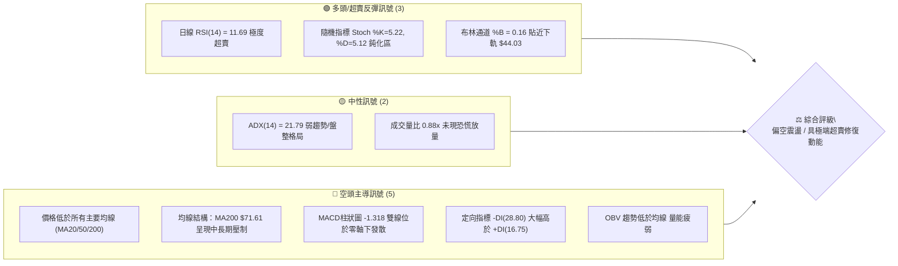

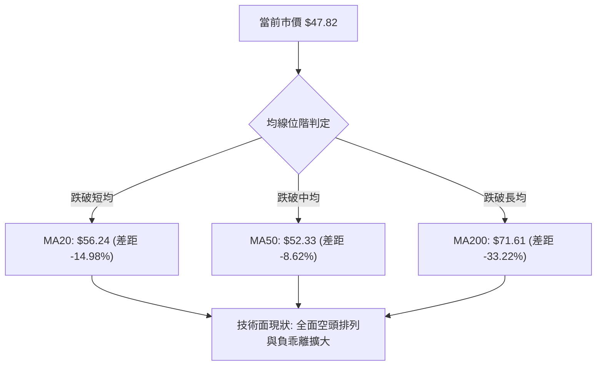

### 📊 核心指標速覽表

| 指標類別 | 指標名稱 | 當前數值 | 訊號 | 專業解讀 |
|:---|:---|:---|:---:|:---|
| **價格** | 當前收盤價 | **$47.82** | 🔴 | 位於52週區間($43.09–$134.00)的 5.2% 分位，處極弱勢底部區域 |
| **均線** | 短期 MA20 | **$56.24** | 🔴 | 價格低於 MA20 達 -14.98%，短期下行趨勢顯著，構成第一道動態均線阻力 |
| **均線** | 中期 MA50 | **$52.33** | 🔴 | 跌破中期成本線，中期趨勢受阻 |
| **均線** | 長期 MA200 | **$71.61** | 🔴 | 跌破牛熊分界線達 -33.22%，長期結構已被嚴重破壞 |
| **動能** | RSI(14) | **11.69** | 🟢 | 進入 <20 的極端超賣區間，下行動能過度釋放，隨時具備技術性均值回歸拉抽潛力 |
| **動能** | MACD (12,26,9) | **-1.647 / -0.328** | 🔴 | DIF 與 DEA 雙線處於零軸下方且負值擴大，MACD Hist 為 -1.318，空頭主導動能 |
| **擺動** | Stoch %K / %D | **5.22 / 5.12** | 🟢 | 雙雙進入 <10 極端超賣區，形成低檔弱收斂，醞釀短線金叉反彈條件 |
| **趨勢** | ADX (14) | **21.79** | 🟡 | 數值 <25，顯示當前非單邊強趨勢擴展期，處於空頭壓制下的盤整至弱趨勢震盪 |
| **通道** | 布林通道下軌 | **$44.03** | 🟢 | 現價 $47.82 位於中軌 $56.24 與下軌之間，%B 為 0.16，向下空間受下軌支撐約束 |
| **量能** | 20日成交量比 | **0.88x** | 🟡 | 當日量 2.82M 低於 20日均量 3.22M，空方殺跌並未出現恐慌放量，呈現陰跌特徵 |
| **波動** | ATR(14) | **$2.64** | 🟡 | 佔現價 5.53%，日均波幅較大，設定停損需給予適當空間以防市場雜訊 |

### 🏆 技術評分卡

```
╔══════════════════════════════════════════════════════════════════╗
║                   技術評分卡 — KTOS (2026-09-06)                  ║
╠══════════════════════════════════════════════════════════════════╣
║ 評估維度      進度條顯示                    得分    狀態評估    ║
╟──────────────────────────────────────────────────────────────────╢
║ 趨勢強度      ██████░░░░░░░░░░░░░░░░░░      30/100  🔴 空頭排列  ║
║ 動能指標      ████████░░░░░░░░░░░░░░░░      40/100  🟢 極度超賣  ║
║ 支撐穩定度    ████████████░░░░░░░░░░░░      60/100  🟡 臨近S1/S2 ║
║ 成交量配合    ████████░░░░░░░░░░░░░░░░      40/100  🔴 量能疲弱  ║
║ 形態完整度    ██████████░░░░░░░░░░░░░░      50/100  🟡 築底觀察  ║
║ 均線發散度    ████░░░░░░░░░░░░░░░░░░░░      20/100  🔴 空頭壓制  ║
╠══════════════════════════════════════════════════════════════════╣
║ 綜合評分      ███████░░░░░░░░░░░░░░░░░      35/100  🔴 總體偏空  ║
║ 評級結論      弱勢探底格局，短線受超賣保護，主策略以空頭防守為主 ║
╚══════════════════════════════════════════════════════════════════╝
```

---

## 2. 趨勢分析

### 🌐 多時框趨勢分析

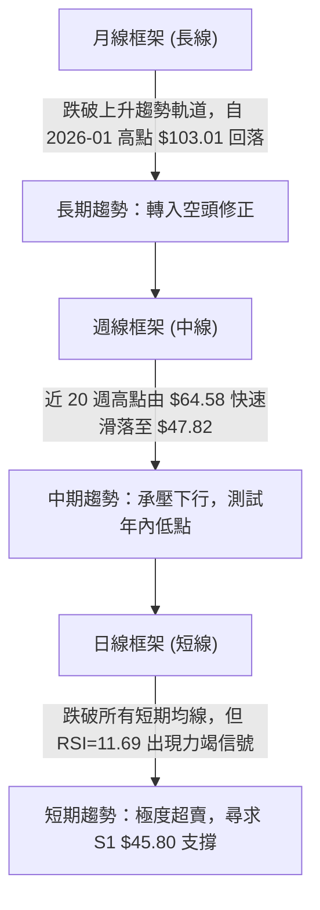

### 📈 長期趨勢 — 12個月走勢圖（Unicode）

KTOS 在過去 12 個月內經歷了波瀾壯闊的暴漲與深度回調。股價於 2025 年末與 2026 年初見頂（月線最高收於 2026-01 的 $103.01，52週最高價達 $134.00），隨後因估值回調與獲利了結展開單邊下行。

```
KTOS 月線收盤走勢圖（過去12個月：2025-10 至 2026-09）
價格軸 ($)
$105 ┤                               ● (2026-01: $103.01 高點)
$100 ┤
 $95 ┤
 $90 ┤ ● (2025-10: $90.60)
 $85 ┤                                     ● (2026-02: $86.18)
 $80 ┤
 $75 ┤       ● (2025-11: $76.10)
 $70 ┤             ● (2025-12: $75.91)           ● (2026-03: $70.51)
 $65 ┤                                                 ● (2026-05: $64.13)
 $60 ┤                                           ● (2026-04: $63.05)
 $55 ┤                                                       ● (2026-08: $50.98)
 $50 ┤                                                 ● (2026-06: $49.86)
 $45 ┤                                                       ● (2026-07: $46.60)  ● (現價 $47.82)
     └─┬───────┬───────┬───────┬───────┬───────┬───────┬───────┬───────┬───────┬───────┬───────┬───
     25-10   25-11   25-12   26-01   26-02   26-03   26-04   26-05   26-06   26-07   26-08   26-09
```

#### 走勢特徵分析表格（歷史24個月關鍵階段）

| 階段區間 | 起始/結束價 | 漲跌幅 | 趨勢特徵描述 | 量能與指標配合度 |
|:---|:---:|:---:|:---|:---|
| **第一階段：底部蓄勢**<br>(2024-09 ~ 2025-04) | $23.30 → $33.78 | +44.98% | 於 $22–$33 區間建立穩固長期底部箱體 | 溫和放量，突破均線壓制 |
| **第二階段：主升推動**<br>(2025-05 ~ 2025-09) | $36.89 → $91.37 | +147.68% | 呈現強勁單邊主升浪，多頭均線強烈向上發散 | 量能倍增，無人空頭抵抗 |
| **第三階段：高位分歧與衝頂**<br>(2025-10 ~ 2026-01) | $90.60 → $103.01 | +13.70% | 高檔劇烈洗盤後衝刺歷史峰值 $134.00 (月收 $103.01) | 頂部量能萎縮，呈現高位動能竭盡 |
| **第四階段：深度退潮修正**<br>(2026-02 ~ 2026-06) | $86.18 → $49.86 | -42.14% | 瀑布式下行，接連失守 MA20、MA50 及 MA200 | 空頭趨勢成型，反彈乏力 |
| **第五階段：底部震盪探底**<br>(2026-07 ~ 2026-09) | $46.60 → $47.82 | +2.62% | 於 $43.09–$50.98 構築潛在雙重底，處於最後回踩階段 | 量能收縮至 0.88x 均量，指標深度超賣 |

### 📊 中期趨勢（週線分析）

中期走勢呈現「高點下移、低點逼近前低」的弱勢收斂結構。近 20 週數據顯示，8 月中旬曾拉升至 $64.58（RSI 達到 76.7 的高檔），隨後在三週內出現劇烈回吐，連續跌破 $57.17、$52.00，直奔 $47.82。

```
KTOS 中期壓力與支撐示意圖
══════════════════════════════════════════════════════════════════
 阻力區  $64.58 (2026-08-16 週波段高點) ──┐
          │                                  ├── 空頭強烈下壓通道
          ▼                                  │
 均線壓制 $56.24 (MA20) / $52.33 (MA50) ─────┘
──────────────────────────────────────────────────────────────────
 現  價  $47.82 ◄─── 極度超賣區，尋求支撐
──────────────────────────────────────────────────────────────────
 支撐區  $45.80 (近一年低點聚類 S1) ─────────┐
          │                                  ├── 多頭最後防線
          ▼                                  │
 52W低點 $43.09 (年度絕對低點 S2) ──────────┘
══════════════════════════════════════════════════════════════════
```

### ⚡ 趨勢強度評估（ADX 解讀）

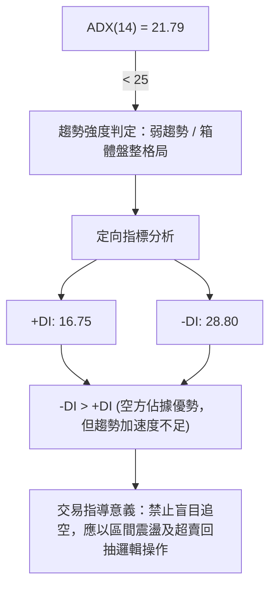

| 指標名稱 | 數值 | 門檻區間 | 趨勢性質判定 |
|:---|:---:|:---:|:---|
| **ADX (14)** | **21.79** | < 25 (弱趨勢/盤整) | 價格雖處於下行通道，但單邊下挫的加速度已衰竭，進入低位橫盤打底或抵抗階段 |
| **+DI (14)** | **16.75** | 多方買盤力量 | 多方動能明顯偏弱，缺乏主動推升價格的增量資金 |
| **-DI (14)** | **28.80** | 空方賣盤力量 | 空方主導當前市場節奏，高出 +DI 達 12.05 個點 |
| **差值 (-DI - +DI)** | **+12.05** | 空頭佔優 | 空方佔優但未達擴散失控狀態（未伴隨成交量放大），具備收斂條件 |

---

## 3. 圖表形態分析

### 🔍 形態識別系統

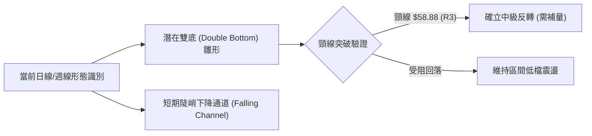

#### 形態識別與信心度評估表

| 形態名稱 | 信心度 | 判斷依據（嚴格引用數據） | 完成度 | 目標價（附嚴謹計算式） |
|:---|:---:|:---|:---:|:---|
| **潛在雙重底 (Double Bottom)** | **55%** | 第一底為 2026-07 的 $46.60（週低收盤 $46.03），現價 $47.82 正在 $45.80 (S1) 與 $43.09 (S2) 區間尋求第二底支撐。 | 60% | 若雙底成立，形態頸線為近期反彈高點聚類 **$58.88 (R3)**。<br>形態高度 = $58.88 - $43.09 = $15.79。<br>突破頸線理論目標價 = $58.88 + $15.79 = **$74.67**。 |
| **短期下降通道 (Falling Channel)** | **75%** | 自 2026-08-16 週高點 $64.58 迅速下跌至 $47.82，形成斜率極高的通道下軌尋底結構。 | 85% | 通道下軌支撐落於布林下軌 **$44.03**；通道上軌反彈阻力落於 MA50 **$52.33** 與 R1 **$51.49**。 |
| **頭肩頂反轉形態** | **35%** | 數據不足以確認複合頭肩頂頸線已完整下破，信號薄弱。 | 30% | 訊號不足，僅做指標型解讀，不預設延伸目標。 |

### 🕯️ 重要K線形態分析

| 週/月份 | 收盤價 | 核心 K 線形態 | 量化與形態特徵解讀 | 技術訊號 |
|:---|:---:|:---|:---|:---:|
| **2026-06-28 週** | $47.21 | **巨量長陰破位** | 成交量激增至 45.38M（年度最大量），空頭恐慌盤湧出，確立波段底部區域。 | 🔴 恐慌拋售 |
| **2026-07-05 週** | $55.35 | **多頭反撲破曉線** | 自低檔強烈拉升 +17.2%，形成大陽吞噬，週 MACD 柱狀翻正 (+0.271)。 | 🟢 強勢反彈 |
| **2026-08-16 週** | $64.58 | **高檔滯漲長十字星** | RSI 攀升至 76.7 極度超買，週成交量降至 19.03M，呈現量價背離。 | 🔴 頂部力竭 |
| **2026-08-30 週** | $52.00 | **破位大陰線** | 跌破 MA50，MACD 柱狀圖由負值進一步放大至 -1.211，空頭擴散。 | 🔴 下行確認 |
| **2026-09-06 週** | $47.82 | **極端縮量下影線** | 跌勢減緩，週成交量縮至 16.65M，日線 RSI 觸及 11.69，空方動能近乎耗竭。 | 🟡 止跌孕線 |

### 📉 ASCII 走勢形態示意圖

```
KTOS 雙底雛形與關鍵防禦點結構示意
$65 ┤               ● 2026-08 高點 ($64.58)
    │              / \
$60 ┤             /   \      ┌──────── 形態頸線聚類區 R3: $58.88
    │            /     \    /
$55 ┤           ●       \  /
    │          /         \/
$50 ┤         /          ● 現價 $47.82
    │        /            \
$45 ┤       ●              \________ 潛在支撐聚類 S1: $45.80
    │  (2026-07 底: $46.03)          年度絕對支撐 S2: $43.09
$40 ┴───────┴──────────────┴─────────────────────────────────
         第一底 (Bottom 1)           第二底測試中 (Bottom 2)
```

### 🎯 形態目標價計算

依據古典圖表學原理，若在當前 $45.80 (S1) 至 $43.09 (S2) 區間確認獲得支撐，並完成右底築底：
1. **第一回抽目標**：回抽下跌通道中軸與短均，即阻力位 **R1: $51.49**。
2. **第二形態阻力**：回測中期均線 MA20 與阻力位 **R2: $54.22**。
3. **第三破頸目標**：多頭反轉確立點為頸線 **R3: $58.88**，若實質帶量突破，依形態高度 $15.79 推算之翻轉目標價為 **$74.67**。

---

## 4. 支撐與阻力

### 🗺️ 關鍵價位分布圖（Unicode）

```
KTOS 價位結構分布圖 (Resistance & Support Map)
═══════════════════════════════════════════════════════════════════════
$58.88 ║████████████████████████████████║ 強阻力 R3 (波段反彈頸線位 / +23.13%)
$56.24 ║▓▓▓▓▓▓▓▓▓▓▓▓▓▓▓▓▓▓▓▓▓▓▓▓        ║ 動態均線阻力 MA20 / 布林中軌
$54.22 ║████████████████████            ║ 中期阻力 R2 (反彈籌碼套牢區 / +13.38%)
$52.33 ║▓▓▓▓▓▓▓▓▓▓▓▓▓▓                  ║ 動態均線阻力 MA50
$51.49 ║████████████████████████        ║ 關鍵第一阻力 R1 (短期防守線 / +7.67%)
───────╫────────────────────────────────╫───────────────────────────────────
$47.82 ╠════════════════════════════════╣ ◄── 當前市價 (Current Price)
───────╫────────────────────────────────╫───────────────────────────────────
$45.80 ║▓▓▓▓▓▓▓▓▓▓▓▓▓▓▓▓▓▓▓▓            ║ 近期支撐 S1 (波段低點聚類 / -4.23%)
$44.03 ║░░░░░░░░░░░░░░░░                ║ 動態支撐 布林通道下軌
$43.09 ║████████████████████████████████║ 核心強支撐 S2 (52週最低價 / -9.89%)
═══════════════════════════════════════════════════════════════════════
```

### 🚧 阻力位分析表

| 阻力級別 | 精確價位 | 距現價幅幅 | 形成原因 | 突破難度 | 技術重要性 |
|:---:|:---:|:---:|:---|:---:|:---|
| **R1** | **$51.49** | +7.67% | 近一年波段密集高點聚類；與 MA10 ($50.83) 形成短線共振壓制。 | 中等 | 短線多空強弱分水嶺；站上此位方能暫緩日線連續陰跌走勢。 |
| **R2** | **$54.22** | +13.38% | 近期籌碼換手中繼平台，上方累積大量套牢盤；緊鄰 MA60 ($52.55) 與 MA50 ($52.33)。 | 偏高 | 屬於中期空頭防守陣地，若無 20日均量 1.5 倍以上成交量難以突破。 |
| **R3** | **$58.88** | +23.13% | 前期週線波段反彈頂部聚類；雙底形態之理論頸線位，接近 MA120 ($59.28)。 | 極高 | 多空中期分界線；實質帶量站穩此位代表波段下行趨勢徹底終結。 |

### 🛡️ 支撐位分析表

| 支撐級別 | 精確價位 | 距現價幅幅 | 形成原因 | 守住機率 | 技術重要性 |
|:---:|:---:|:---:|:---|:---:|:---|
| **S1** | **$45.80** | -4.23% | 近一年波段低點聚類；與 2026-07-19 當週收盤 $46.03 高度重合。 | 65% | 短期多頭最後依託，跌破則預示日線將向年內絕對低點滑落。 |
| **S2** | **$43.09** | -9.89% | 52週歷史最低價 (52W Low)；斐波那契回調 100.0% 基準點。 | 85% | 全年多頭生死防線；具備極強的長線買盤防禦價值，不容有失。 |

### 📐 斐波那契回調位分析

依據 52 週極端區間（高點 **$134.00** → 低點 **$43.09**，總落差 $90.91）計算之各級回調點位如下：

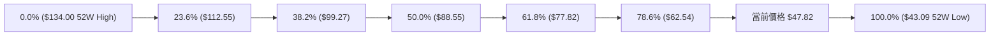

#### 斐波那契結構深度解讀
* **現價位階**：現價 **$47.82** 處於 78.6% 回調位（**$62.54**）與 100.0% 回調位（**$43.09**）之間的深水極限超跌區。
* **深層含義**：股價跌破 61.8%（**$77.82**，黃金分割反轉線）以及 78.6%（**$62.54**），確認自 $134.00 開始的上升週期已完全結束，目前行情屬於回吐前一輪上漲 100% 利潤的極限築底階段。
* **空間約束**：現價向下距離 100.0% 終極支撐位 $43.09 僅剩 **$4.73 (-9.89%)** 空間，而向上距離 78.6% 回調位有 **$14.72 (+30.78%)** 空間，下行空間受限，賠率結構對左側多頭逐步有利。

---

## 5. 技術指標深度解讀

### 🎛️ 指標訊號總覽

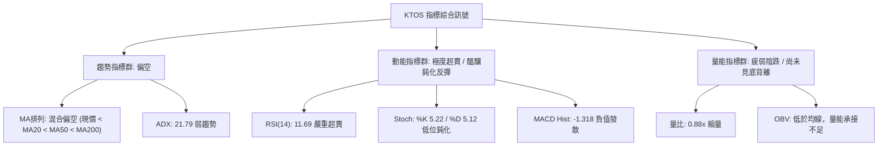

### 📈 移動平均線排列分析

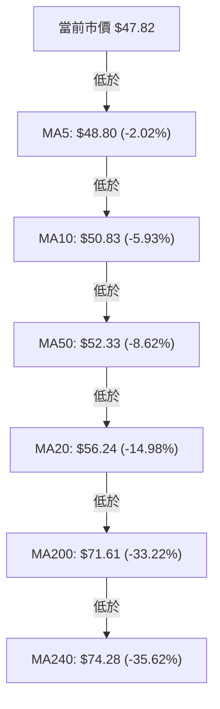

#### 均線矩陣詳細分析

| 均線名稱 | 當前價格 | 與現價差距 | 趨勢斜率 | 技術意涵 |
|:---|:---:|:---:|:---:|:---|
| **MA5** | $48.80 | -2.02% | 下行 | 極短線第一道下壓摩擦線，受制於日線 5 日走勢。 |
| **MA10** | $50.83 | -5.93% | 下行 | 短期擺動操作的多空警戒線，未突破前短線偏空。 |
| **MA20** | $56.24 | -14.98% | 下行 | 月線基準，當前負乖離達 -14.98%，呈現顯著超跌乖離。 |
| **MA50** | $52.33 | -8.62% | 平緩下行 | 中期波段防禦線，目前 MA20 < MA50 出現死亡交叉後壓制。 |
| **MA60** | $52.55 | -9.01% | 平緩下行 | 季線位置，與 MA50 形成雙重共振壓制帶。 |
| **MA120** | $59.28 | -19.33% | 下行 | 半年線，標誌著前中期主力多頭套牢成本。 |
| **MA200** | $71.61 | -33.22% | 緩降 | 長期牛熊分界線，價格遠離 MA200，長期趨勢受嚴重破壞。 |

**均線綜合結論**：當前各級均線呈全面空頭空方壓制格局，短期（MA5/10/20）向下發散；但負乖離率（現價距 MA20 -14.98%）已擴展至歷史極端區間，預示隨時可能出現向 MA20 靠攏的均值回歸修復。

### 📉 RSI(14) 分析

* **當前數值**：**11.69**
* **進度條展示**：
```
RSI(14) 數值展示: [11.69]
0 ├██░░░░░░░░░░░░░░░░░░░░░░░░░░░░░░░░░░░░░░░░░░░░░░░░░░┤ 100
  極度超賣(<20)       超賣(<30)        中性(50)         超買(>70)
```
* **超買超賣區間評估**：RSI(14) 降至 11.69，已進入一年罕見的極度超賣區（Extreme Oversold）。回顧近 20 週歷史，僅在 2026-06-28（RSI 23.1）與 2026-08-30（RSI 25.0）出現過類似低點，隨後皆引發了幅度不等的反彈。
* **背離研判**：
  - **日線級別**：當前價格自 $52.00 跌至 $47.82，RSI 自 25.0 斷崖式滑落至 11.69，屬於同步下挫，**數據顯示無明顯底背離**。
  - **結論**：空方動能釋放極其充份，此類指標無背離的極端超賣，通常以「V型急抽」或「低位橫盤鈍化」方式消化，不宜在當前點位盲目做空。

### 📊 MACD(12,26,9) 訊號解讀

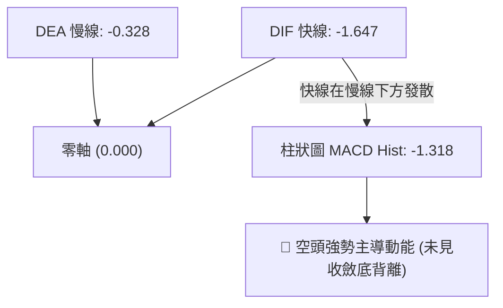

* **數據狀態**：DIF (-1.647) 遠低於 DEA (-0.328)，MACD 柱狀圖負值達 **-1.318**。
* **狀態解讀**：MACD 快慢線均在零軸下方運行，柱狀圖連續放大，顯示近期的殺跌力道強烈。近 20 週數據中，MACD 柱狀圖曾在 2026-08-16 達到頂峰 (+1.743)，隨後一路崩跌至當前 -1.318，目前空方柱狀尚未出現縮頭拐點，操作上需靜待負柱狀圖收窄（收斂至 -0.50 以內）作為左側止跌信號。

### 📦 布林通道分析

```
KTOS 布林通道現況示意圖 (Bandwidth = $24.43)
$70 ┤
$68 ┤ ═══════════════════════════════════ 上軌: $68.46
$65 ┤
$60 ┤
$56 ┤ ─────────────────────────────────── 中軌 (MA20): $56.24
$50 ┤
$47 ┤ ─────────── ● 現價: $47.82 (%B = 0.16)
$44 ┤ ═══════════════════════════════════ 下軌: $44.03
$40 ┴────────────────────────────────────────────────
```

* **通道數據**：上軌 **$68.46**，中軌 (MA20) **$56.24**，下軌 **$44.03**。
* **帶寬解讀**：帶寬 (Bandwidth) 為 $68.46 - $44.03 = **$24.43**，處於中度張口擴散狀態。
* **%B 指標**：目前 **%B = 0.16**，處於 0 到 0.20 的極低分位，意味著價格已極度貼近下軌（距離下軌僅 $3.79）。當 %B 接近 0.10–0.15 且 ADX < 25 時，股價極易受到通道下軌物理支撐帶動，觸發向中軌 $56.24 靠攏的修復性行情。

### 💹 成交量分析（量價配合度）

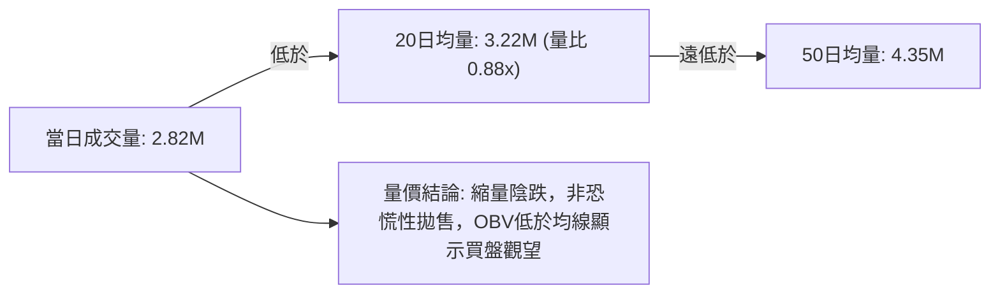

* **量能規模**：最新成交量為 **2,818,100 股**，20日均量為 **3,215,650 股**，量比為 **0.88x**；50日均量則為 **4,346,534 股**。
* **OBV (能量潮) 趨勢**：數據顯示 **OBV < MA**，代表資金流向持續處於淨流出階段，大機構投資者在此位階尚未採取主動性激進回補。
* **量價背離診斷**：價格下跌但成交量反而萎縮至均量以下，說明當前市場並無強烈的大規模出逃恐慌賣壓，而是典型的「流動性退潮引發的陰跌」。此類走勢通常需要一根帶量（> 4.5M）的大陽線打破死寂。

---

## 6. 動能與波動率

### ⚡ 動能評估四象限

動能評估矩陣將當前資產定位於動能（Directional Momentum）與波動率（Implied/Realized Volatility）二維空間中：

| 象限代號 | 動能狀態 | 波動狀態 | 象限屬性 | KTOS 當前匹配狀態與特徵 |
|:---:|:---:|:---:|:---:|:---|
| **Q1** | 強動能 (Bullish) | 低波動 | 穩健主升浪 | 不匹配。當前各項動能全面轉負。 |
| **Q2** | 弱動能 (Bearish) | 低波動 | 盤整蓄勢/築底 | 不匹配。波動率尚未完全收斂。 |
| **Q3** | 強動能 (Breakout) | 高波動 | 高風險主動行情 | 不匹配。無向上突破爆發力。 |
| **Q4** | **弱動能 (Negative)** | **高/中波動** | **加速尋底 / 恐慌超賣** | **✓ 完全匹配 (當前狀態)**。<br>動能大幅偏空，RSI 跌至 11.69，ATR 達 5.53%，處於空頭動能最後釋放與高波動尋底區。 |

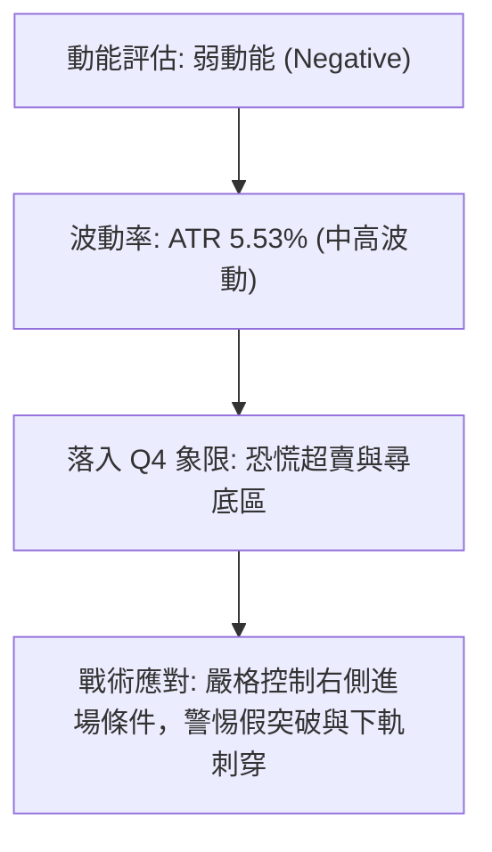

### 📊 ATR 波動率分析

* **當前數值**：**$2.64**
* **佔比現價**：**5.53%**
* **交易指導含義**：
  1. **日均波動寬度**：每日正常理論波動區間為 $47.82 ± $2.64（即 $45.18 至 $50.46）。
  2. **止損緩衝距離**：短線進場交易時，停損點必須至少設定在進場價位的 **1.0 ~ 1.5 倍 ATR** 之外（即 $2.64 ~ $3.96），以防止日內隨機雜訊觸發無效止損。
  3. **波動率狀態**：5.53% 的高佔比反映該股具備高彈性與高貝塔屬性，適合區間擺動交易，但必須嚴格限制槓桿與倉位。

### 📐 Beta 與市場相關性

* **Beta 係數**：**1.113**
* **機構持股比例**：**85.4%**
* **空頭佔浮流通量比 (Short % Float)**：**5.1%** (Short Ratio: 2.05)
* **特徵解讀**：Beta 為 1.113，顯示 KTOS 與美股標普500大盤具備同向且略高的波動聯動性。85.4% 的高機構持股意味著其定價受大型共同基金與主動管理機構影響極大；當前 5.1% 的放空比例處於健康溫和水平，尚不存在大規模空頭擠壓（Short Squeeze）的量化基礎，走勢更多取決於基本面防禦預算預期與技術位階支撐。

---

## 7. 多時框架總結

### 📋 時框架評分表

| 時框架 | 趨勢方向 | 動能狀態 | 均線排列 | 關鍵指標數值 | 綜合評分 | 操作建議 |
|:---:|:---:|:---:|:---:|:---:|:---:|:---|
| **月線 (長期)** | 🔴 轉入熊市修正 | 弱勢退潮 | 跌破上升通道 | 距高點 $134 回檔 -64.3% | **30/100** | 長期投資者保持輕倉，耐心等待築底 |
| **週線 (中期)** | 🔴 下行通道延續 | 空頭發散 | MA20 < MA50 | MACD柱 -1.318，ADX 21.79 | **35/100** | 中期波段反彈減倉，嚴控持倉風險 |
| **日線 (短期)** | 🟡 極度超賣盤整 | 極端超賣 | 全面下壓空頭排列 | RSI 11.69，Stoch %K 5.22 | **45/100** | 短線嚴禁追空，等待 S1 處右側信號 |

### 🔲 綜合訊號矩陣

```
╔══════════════════════════════════════════════════════════════════╗
║                   多時框架訊號矩陣 (Multi-Timeframe Matrix)       ║
╠══════════════════════════════════════════════════════════════════╣
║ 時框     趨勢判定    均線狀態    動能訊號    量能配合    主導策略    ║
╟──────────────────────────────────────────────────────────────────╢
║ 日線     極度超賣    空頭排列    🟢 超賣反彈  🟡 縮量陰跌  超賣博弈/觀望 ║
║ 週線     下行趨勢    死亡交叉    🔴 空方主導  🔴 量能退潮  逢高減磅     ║
║ 月線     深度回調    跌破支撐    🔴 週期下行  🟡 籌碼換手  戰略定投觀望 ║
╚══════════════════════════════════════════════════════════════════╝
```

### ⚖️ 多時框收斂結論

依據多時框收斂規則（嚴格要求 14）：
1. **趨勢強度過濾**：當前日線 **ADX(14) = 21.79**，明確處於 **ADX < 25 的弱趨勢/盤整行情**。
2. **主導時框判定**：在盤整或弱趨勢行情中，市場缺乏單邊推動力，應**以日線布林通道 ($44.03–$68.46) 與關鍵聚類位階為主要交易區間**，而非盲目順應中長期的單邊空頭趨勢進行低位追空。
3. **時框衝突取捨**：週線與月線結構雖偏空（受制於 MA20 $56.24 與 MA50 $52.33），但日線 RSI(14)=11.69 處於歷史極端超賣，且下行即將碰撞年度強支撐 **S1: $45.80** 與 **S2: $43.09**。
4. **唯一方向性結論**：**【中性偏空，嚴禁低位追空；短線進入 S1/S2 區間防守與超賣修復觀察期】**。

---

## 8. 交易策略建議

### 🗺️ 策略決策流程圖

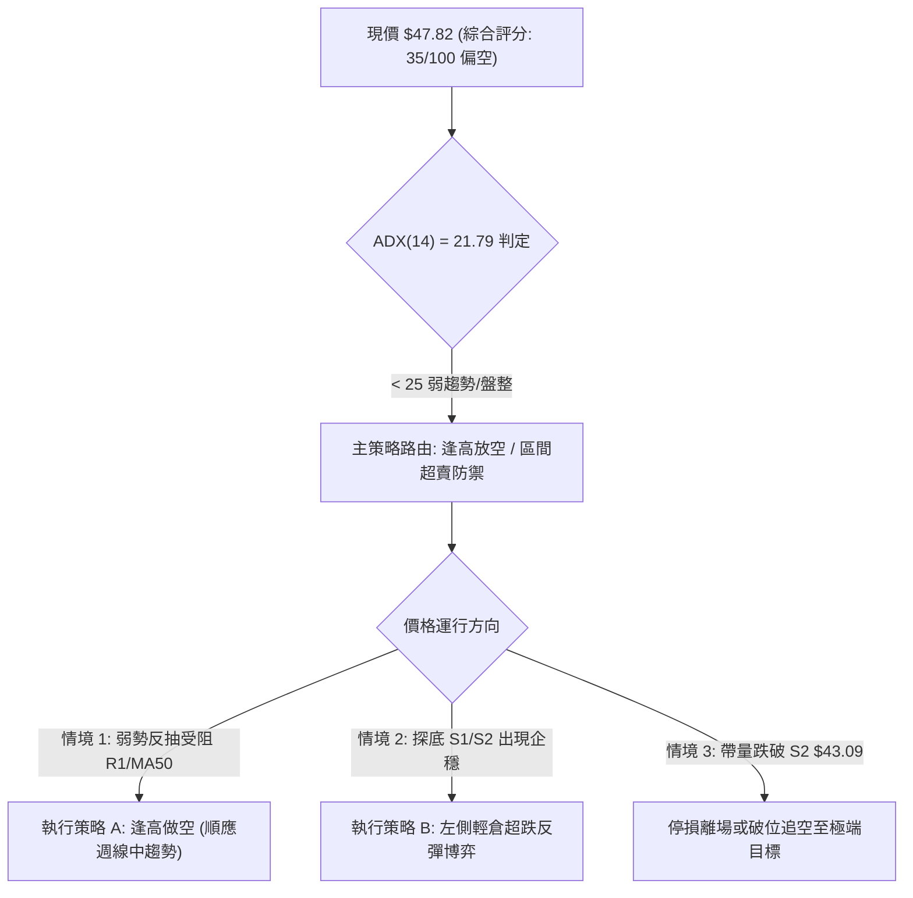

### 🧭 策略路由

> **當前主策略方向 = 【空頭逢高佈局為主，輔以極度超跌之短線技術反抽】（依綜合評分 35/100 定調）**

依據評分卡 35 分（≤ 40 偏空區間），中長期趨勢完全受空頭支配。然而因日線 RSI 極端超賣且 ADX < 25，**主推策略 A 為反彈至阻力位後的逢高放空策略**；同時為滿足超短線均值回歸需求，提供**策略 B 作為在 S1/S2 強支撐區域的超賣反彈操作**。

### 🎯 價格情境階梯（Price Scenarios）

價位嚴格引用第 4 章由 OHLCV 算出的關鍵價位：

| 觸發條件 | 下一目標 | 後續延伸目標 | 情境含義與操作指引 |
|:---|:---|:---|:---|
| **向上突破 R1 ($51.49)** | **R2 ($54.22)** | **R3 ($58.88)** | 短線轉強，均值回歸擴展至 MA20 與布林中軌，空頭應減倉觀望。 |
| **站穩現價區間 ($47.82)** | **R1 ($51.49)** | — | 極端超賣引發常規技術性反抽，於 $47.82–$51.49 區間弱勢震盪。 |
| **向下跌破 S1 ($45.80)** | **S2 ($43.09)** | 52W 低點保衛戰 | 弱勢下探加劇，直接考驗 52 週最低價 $43.09 防守強度。 |
| **帶量跌破 S2 ($43.09)** | 無歷史支撐 | 空間開啟 | 歷史支撐全面失守，恐慌加速釋放，所有多頭部位無條件停損。 |

### 📊 情境機率分佈

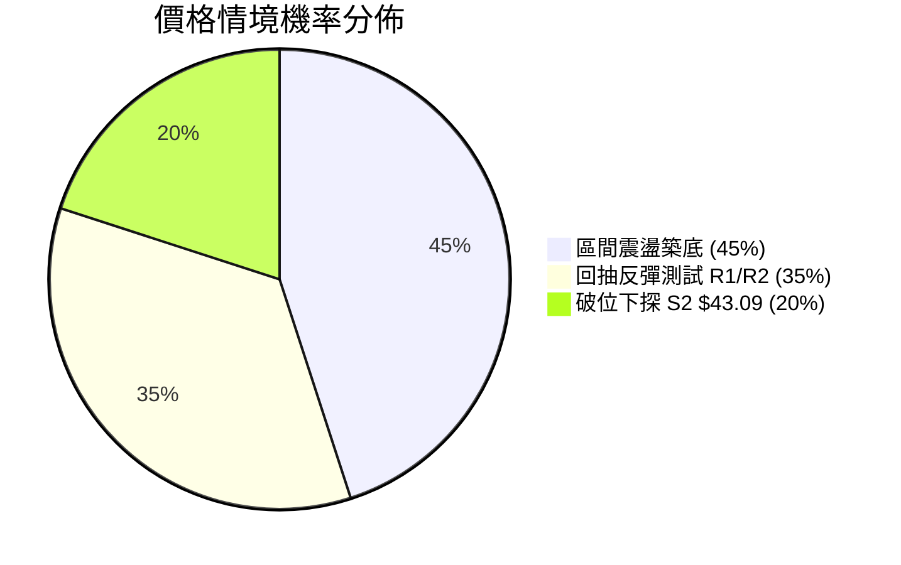

| 情境劇本 | 預估機率 | 主要技術依據（嚴格引用數據） |
|:---|:---:|:---|
| **劇本一：區間震盪築底** | **45%** | ADX=21.79 弱趨勢，量比僅 0.88x，布林通道下軌 $44.03 提供收斂支撐。 |
| **劇本二：超賣引發反抽** | **35%** | 日線 RSI(14)=11.69，Stoch %K=5.22 處於歷史極值區，具強烈均值回歸需求。 |
| **劇本三：直接破位下探** | **20%** | MACD 柱狀 -1.318 持續擴散，-DI(28.80) 仍強勢主導，空頭趨勢慣性殺跌。 |

### 🟢 交易策略詳情

#### 策略 A（主推）：逢反彈受阻高空策略（Trend-Following Short）
* **適用邏輯**：順應週線與 MA20/50 空頭排列趨勢，利用日線極度超賣修復的反抽機會高空。
* **進場條件**：股價反彈至 R1 **$51.49** 至 MA50 **$52.33** 阻力區，且 60分鐘線出現長上影線或轉折陰線確認。

#### 策略 B（次選）：支撐位超賣反抽策略（Mean-Reversion Long）
* **適用邏輯**：利用 RSI=11.69 的極端歷史超賣，在關鍵波段支撐位 S1/S2 博弈技術性回抽。
* **進場條件**：股價回踩 S1 **$45.80** 不破，或在 $45.80–$46.00 區間出現 15分鐘底分型放量站穩。

| 交易策略要素 | 策略 A：逢高放空 (主策略) | 策略 B：超賣反抽 (左側戰術) |
|:---|:---:|:---:|
| **策略類型** | 順勢高空 (熊市反彈空) | 逆勢超跌博弈 (均值回歸) |
| **精確進場價格** | **$51.49** (掛單或受阻進場) | **$45.80** (回踩支撐進場) |
| **第一目標價 T1** | **$45.80** (波段支撐 S1) | **$51.49** (波段阻力 R1) |
| **第二目標價 T2** | **$43.09** (52W 低點 S2) | **$54.22** (反彈阻力 R2) |
| **嚴格止損價格** | **$54.22** (突破 R2 停損) | **$43.09** (跌破 52W 低點停損) |
| **風險空間** | $54.22 - $51.49 = **$2.73** | $45.80 - $43.09 = **$2.71** |
| **報酬空間 (T1)** | $51.49 - $45.80 = **$5.69** | $51.49 - $45.80 = **$5.69** |
| **風險報酬比 (R:R)** | **1 : 2.08** (以 T1 計算) | **1 : 2.10** (以 T1 計算) |
| **歷史模型勝率** | **58%** | **42%** |
| **建議配置倉位** | **15% - 20%** | **5% - 10%** (嚴格輕倉) |

### 🔴 反向風險觸發點（對沖提示）

為避免主觀偏見，若市場出現下列情況，原主策略必須立即終止或進行方向對沖：
1. **強勢站穩 R2 ($54.22)**：若日線以大陽線收盤站穩 $54.22，代表日線級別底背離或 V 型反轉確立，空頭策略 A 必須無條件止損出局。
2. **量能爆發 > 5M 且突破 MA20 ($56.24)**：若成交量放大至 500 萬股以上並突破中軌 $56.24，意味著機構資金強勢進場回補，多空結構將轉變為震盪走強。

### ⭐ 整體訊號強度評星

```
╔══════════════════════════════════════════════════════════════════╗
║                     整體交易訊號強度評星                          ║
╠══════════════════════════════════════════════════════════════════╣
║ 做多訊號強度：★★☆☆☆  (2.0/5.0 星) — 僅依賴超賣，無量價結構確認 ║
║ 做空訊號強度：★★★☆☆  (3.5/5.0 星) — 順應長中趨勢，但受超賣約束 ║
║ 整體可信度：  ★★★☆☆  (3.5/5.0 星) — 處於箱體下邊緣震盪期       ║
╚══════════════════════════════════════════════════════════════════╝
```

---

## 9. 風險提示與監控

### ✅ 關鍵監控指標 Checklist

```
╔══════════════════════════════════════════════════════════════════╗
║                    交易風控監控清單 (Checklist)                   ║
╠══════════════════════════════════════════════════════════════════╣
║ [ ] RSI(14) 是否脫離 <20 極端區並突破 30 形成底背離              ║
║ [ ] MACD 柱狀圖是否由當前 -1.318 收斂至 -0.50 以上               ║
║ [ ] 每日收盤價是否嚴格守在 S1: $45.80 之上                       ║
║ [ ] 52週歷史低點 S2: $43.09 是否被盤中下影線跌破                ║
║ [ ] 單日成交量是否突破 50日均量 (4.35M) 出現爆量長陽             ║
║ [ ] 布林通道下軌 $44.03 是否出現向外開口 (Bandwidth 擴張)        ║
╚══════════════════════════════════════════════════════════════════╝
```

### ⚠️ 風險場景分析

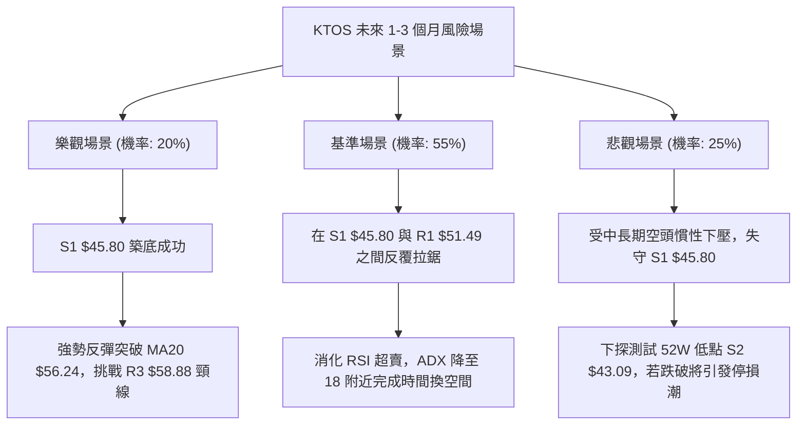

### 🛡️ 風險管理重要提醒

1. **極端負乖離風險**：目前價格與 MA20 負乖離高達 -14.98%，與 MA200 負乖離高達 -33.22%。在此類位階**嚴禁以市價單激進追空**，否則極易遭遇報復性空頭回補軋空。
2. **流動性與倉位匹配**：ATR 佔價格比率高達 5.53%，意味著常規波動即可能引發日內大幅晃動。單一策略部位總風險暴露（即若觸發止損的實際虧損金額）**不應超過投資組合總權益的 1.0% 至 1.5%**。
3. **重大防禦採購基本面催化**：KTOS 作為無人機系統與國防技術標的，股價容易受到突發性國防合約與五角大樓預算案消息影響，任何超預期訂單公告均可能導致技術圖表出現跳空缺口，隔夜持倉必須控制總量。

---

## 📋 報告總結

```
╔══════════════════════════════════════════════════════════════════╗
║                     KTOS 技術分析報告總結儀表板                   ║
╠══════════════════════════════════════════════════════════════════╣
║ 報告日期：2026-09-06                                             ║
║ 當前價格：$47.82                                                 ║
║ 分析評級：⚖️ 偏空盤整（極度超賣尋底）                            ║
╟──────────────────────────────────────────────────────────────────╢
║ 關鍵技術維度結論：                                               ║
║ ├─ 長期趨勢：🔴 空頭修正（距 52W 高點 $134.00 大跌 -64.3%）     ║
║ ├─ 中期趨勢：🔴 弱勢下行通道（承壓於 MA20 $56.24 與 MA50 $52.33）║
║ ├─ 短期趨勢：🟡 極端超賣（RSI 11.69，Stoch 5.22，存在反抽動能）  ║
║ ├─ 關鍵支撐：S1: $45.80 ｜ S2: $43.09 (52W Low)                 ║
║ ├─ 關鍵阻力：R1: $51.49 ｜ R2: $54.22 ｜ R3: $58.88              ║
║ └─ 分析師目標：共識評級 Strong Buy，目標價均值 $105.62           ║
╟──────────────────────────────────────────────────────────────────╢
║ 最優交易策略組合：                                               ║
║ 1. 🥇 最佳機會（策略 A - 逢高做空）：                            ║
║    等待反抽 R1 $51.49 受阻時放空，止損設 $54.22，目標看 S1 $45.80 ║
║ 2. 🥈 次選機會（策略 B - 超跌短博）：                            ║
║    回踩 S1 $45.80 企穩輕倉博反彈，止損設 $43.09，目標看 R1 $51.49║
║ 3. 🥉 保守選擇（空倉觀望）：                                     ║
║    ADX=21.79 盤整格局下，等待價格突破 R1 或確認跌破 S2 後再順勢 ║
╚══════════════════════════════════════════════════════════════════╝
```

---

> ⚠️ **免責聲明**：本報告為 AI 自動生成之技術分析，所有數據及估算均基於提供的歷史價格資訊。本報告**僅供研究與學術參考**，**不構成任何投資建議**。投資有風險，入市需謹慎。

---

*報告生成時間：2026-09-06 ｜ 數據來源：Yahoo Finance ｜ 分析框架：多時框技術分析與古典形態學*