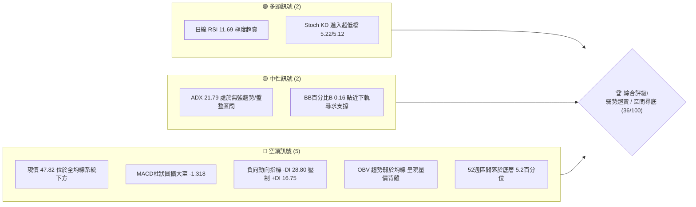
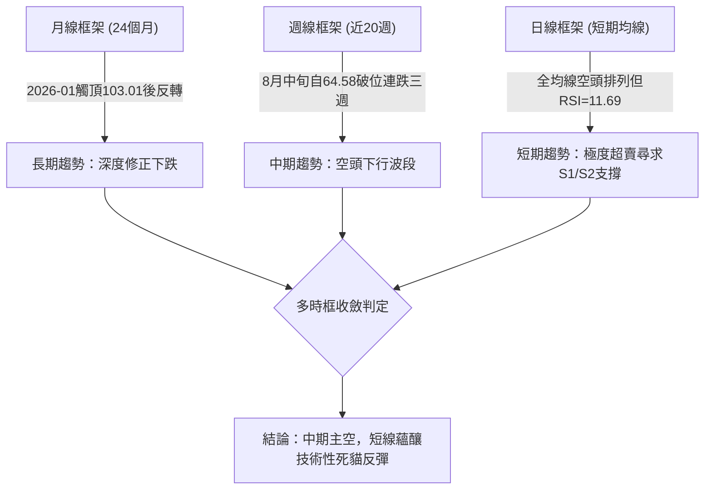
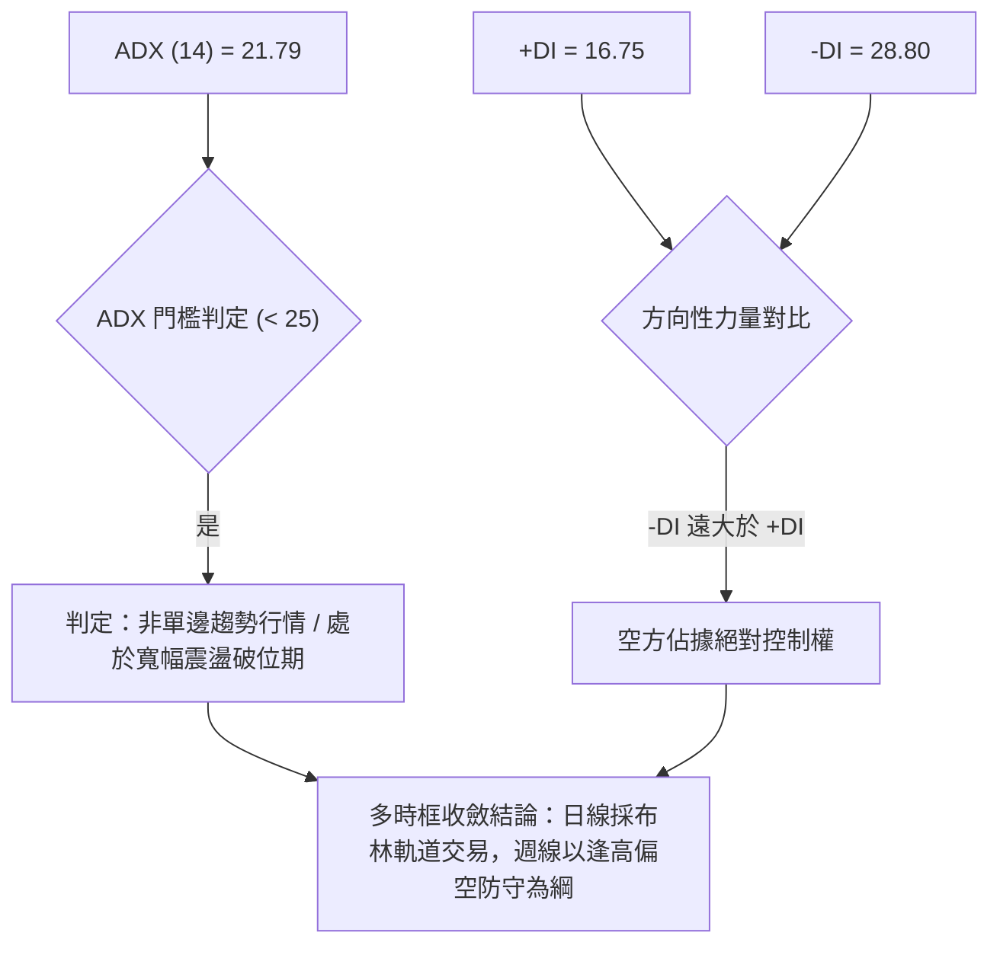
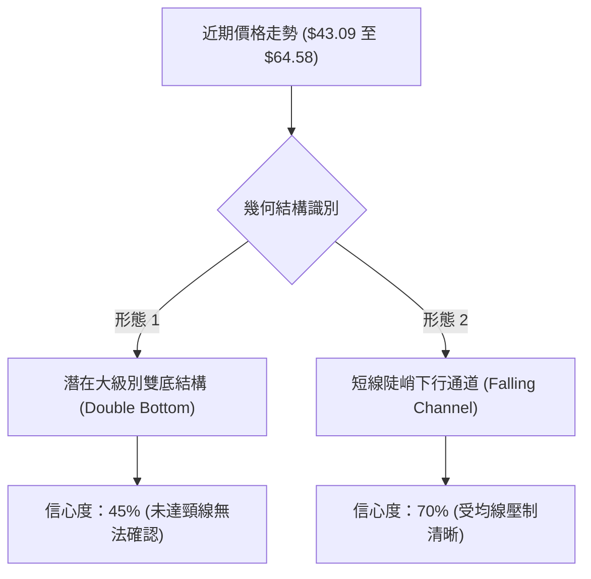
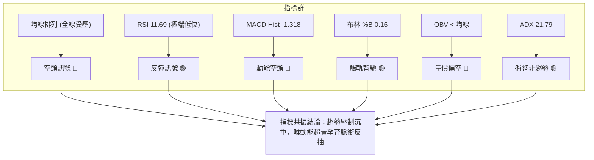
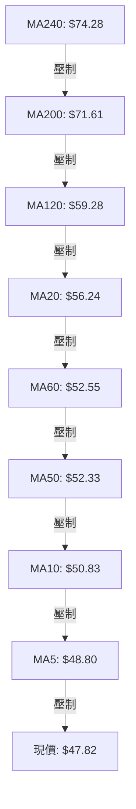
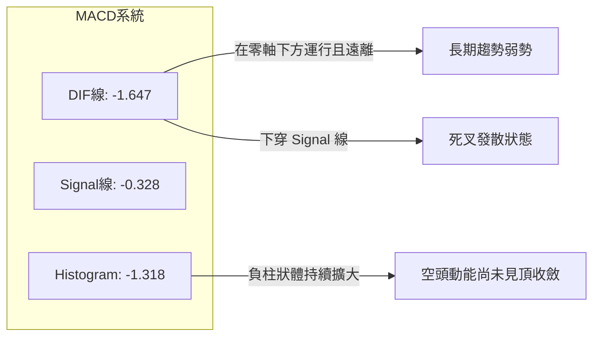
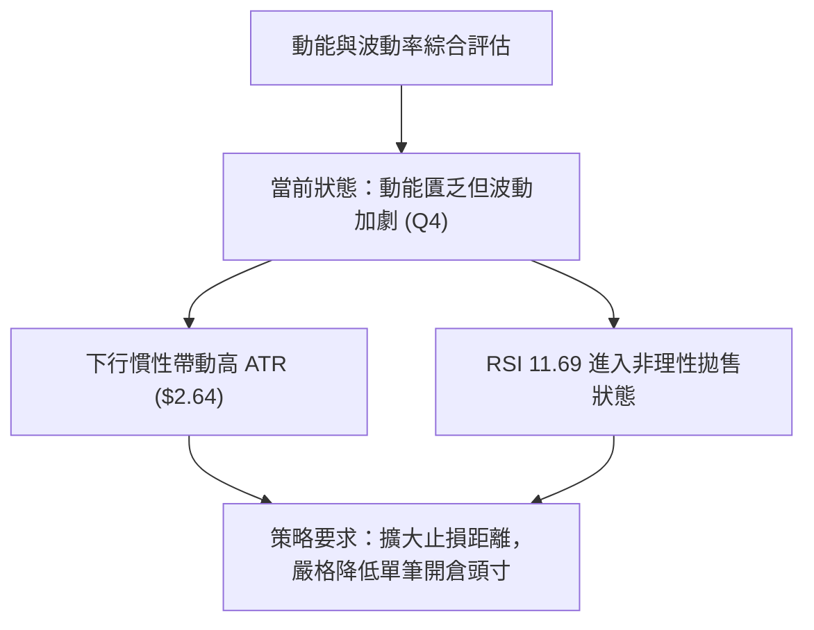
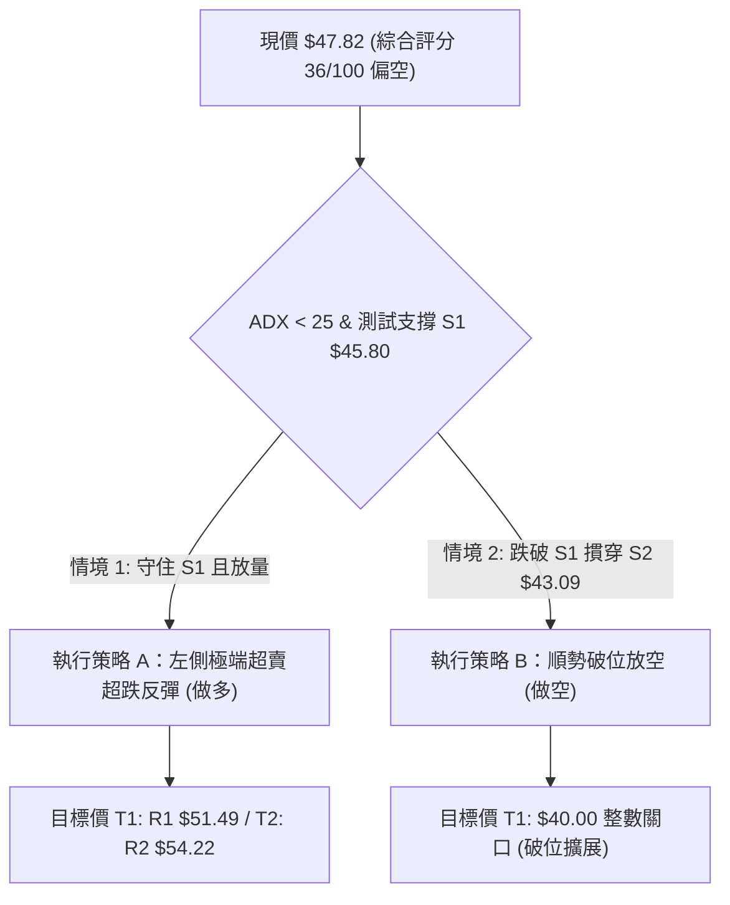
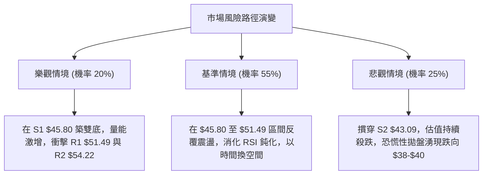

# KTOS 技術分析報告

> **報告日期**：2026-09-07 ｜ **語言**：繁體中文 ｜ **數據來源**：Yahoo Finance ｜ **當前價格**：$47.82

---

## 目錄

| 章節 | 內容 |
|------|------|
| [1. 技術面概覽](#1-技術面概覽) | 訊號儀表板、核心指標、評分卡 |
| [2. 趨勢分析](#2-趨勢分析) | 多時框趨勢、長中短期走勢 |
| [3. 圖表形態分析](#3-圖表形態分析) | 形態識別、K線組合、目標價 |
| [4. 支撐與阻力](#4-支撐與阻力) | 關鍵價位、斐波那契回調 |
| [5. 技術指標深度解讀](#5-技術指標深度解讀) | MA/RSI/MACD/布林/成交量 |
| [6. 動能與波動率](#6-動能與波動率) | 動能評估、ATR、Beta |
| [7. 多時框架總結](#7-多時框架總結) | 時框架評分矩陣 |
| [8. 交易策略建議](#8-交易策略建議) | 多空策略、風險報酬比 |
| [9. 風險提示與監控](#9-風險提示與監控) | 監控指標、風險場景 |

---

## 1. 技術面概覽

### 🎯 技術訊號儀表板



### 📊 核心指標速覽表

| 指標類別 | 指標名稱 | 當前數值 | 訊號 | 解讀 |
|----------|----------|----------|------|------|
| **價格** | 當前價格 | $47.82 | 🔴 | 位於52週區間5.2%底層，長期結構嚴重破壞 |
| **均線** | MA20 | $56.24 | 🔴 | 現價低於MA20達 -14.98%，短線下行斜率陡峭 |
| **均線** | MA50 | $52.33 | 🔴 | 現價低於MA50，中期生命線轉為實質壓力帶 |
| **均線** | MA200 | $71.61 | 🔴 | 遠低於牛熊分界線 (-33.22%)，長期格局屬空頭主導 |
| **動能** | RSI(14) | 11.69 | 🟢 | 進入極端深度超賣區（<20），短線存在技術性反抽動能 |
| **動能** | MACD | -1.647 | 🔴 | 快慢線均在零軸下運行，Hist為 -1.318，空頭擴散 |
| **波動** | ATR(14) | $2.64 | 🟡 | 佔股價5.53%，每日絕對震幅大，洗盤風險高 |
| **趨勢** | ADX(14) | 21.79 | 🟡 | 數值低於25，代表大級別非單邊主跌，屬寬幅盤整破位 |
| **量能** | OBV/成交量 | 2,818,100 | 🔴 | 量比0.88x，量能未能有效放大驗證反轉，資金觀望 |

### 🏆 技術評分卡

```
╔══════════════════════════════════════════════════════════════╗
║              技術評分卡 — KTOS (2026-09-07)                 ║
╠══════════════════════════════════════════════════════════════╣
║ 趨勢強度      ██████░░░░░░░░░░░░░░  30/100  🔴 空頭主導      ║
║ 動能指標      ████████░░░░░░░░░░░░  40/100  🟡 極端超賣鈍化  ║
║ 支撐穩定度    ████████░░░░░░░░░░░░  40/100  🟡 臨近S1考驗    ║
║ 成交量配合    ██████░░░░░░░░░░░░░░  30/100  🔴 量能退潮弱勢  ║
║ 形態完整度    ████████░░░░░░░░░░░░  40/100  🟡 箱型下緣掙扎  ║
║ 均線排列      ██████░░░░░░░░░░░░░░  30/100  🔴 空頭壓制結構  ║
╠══════════════════════════════════════════════════════════════╣
║ 綜合評分      ███████░░░░░░░░░░░░░  36/100  🔴 偏空偏弱觀望  ║
╚══════════════════════════════════════════════════════════════╝
```

---

## 2. 趨勢分析

### 🌐 多時框趨勢分析



### 📈 長期趨勢 — 12個月走勢圖（Unicode）

```
KTOS 月線走勢圖（2025-10 至 2026-09）
價格軸 ($)
$105 ┤                                ● 2026-01 ($103.01 最高點)
$95  ┤       ● 2025-10 ($90.60)
$85  ┤                                    ● 2026-02 ($86.18)
$75  ┤           ● 2025-11 ($76.10)           ● 2026-03 ($70.51)
$65  ┤               ● 2025-12 ($75.91)           ● 2026-04 ($63.05)
$55  ┤                                                ● 2026-05 ($64.13)
$50  ┤                                                    ● 2026-08 ($50.98)
$45  ┤                                                        ●←現價 2026-09 ($47.82)
$40  ┤                                                    ● 2026-07 ($46.60)
     └─────────────────────────────────────────────────────────────────
       25-10   25-11   25-12   26-01   26-02   26-03   26-04   26-05   26-06   26-07   26-08   26-09
```

**走勢特徵分析表格**：

| 階段區間 | 時間跨度 | 起訖價位 | 漲跌幅 | 走勢特徵與技術含義 |
|----------|----------|----------|--------|--------------------|
| 第一階段：頂部爆發 | 2025-10 至 2026-01 | $90.60 → $103.01 | +13.70% | 經歷主升浪後形成天量衝頂，最終於2026年1月在$103.01見月線收盤頂部 |
| 第二階段：初跌波釋放 | 2026-01 至 2026-04 | $103.01 → $63.05 | -38.79% | 連續三個月長陰摜破MA20，拋壓全面湧出，多頭毫無抵抗 |
| 第三階段：中繼整理區 | 2026-04 至 2026-06 | $63.05 → $49.86 | -20.92% | 在$64附近進行弱勢橫盤掙扎，隨後再次下破$50大關 |
| 第四階段：築底震盪波 | 2026-06 至 2026-09 | $49.86 → $47.82 | -4.09% | 價格於$46.60至$64.58寬幅拉扯，目前再次回測區間下軌$47.82 |

### 📊 中期趨勢（週線分析）

```
中期結構壓力與支撐示意圖（週線波段）
價格 ($)
 65.00 ┤        ┌───┐ (2026-08-16 高點 $64.58)
 60.00 ┤       ┌┘   └┐
 55.00 ┤───────┘     └───────── MA20 ($56.24) / R3 ($58.88)
 51.49 ┤─────────────────────── R1 關鍵頸線壓力
 47.82 ┤◄──── 現價位置 ($47.82)
 45.80 ┤─────────────────────── S1 短線波段低點聚類支撐
 43.09 ┤======================= S2 52週歷史極值強支撐
```

週線層面顯示，KTOS 在 2026 年 8 月中旬反彈至 $64.58（RSI 曾達 76.7）後遭遇空頭阻擊，隨後以連續三週的大黑K線急跌（$64.58 → $57.17 → $52.00 → $47.82），一口氣吞噬了先前的反彈果實。

### ⚡ 趨勢強度評估（ADX 解讀）



**ADX 強度對照解析**：
- **數值 21.79**：低於 25 的關鍵趨勢分界線，說明當前市場並未處於「連續單邊破位的主跌浪」中，而是屬於「大級別箱體底部的震盪回踩」。
- **方向線差距**：-DI (28.80) 與 +DI (16.75) 利差達 12.05，表明儘管缺乏趨勢加速度，空頭力量依然在短期主宰盤面，反彈若無量能配合極易轉弱。

---

## 3. 圖表形態分析

### 🔍 形態識別系統



**圖表形態信心度評估表**：

| 形態名稱 | 信心度 | 判斷依據（引用數據） | 完成度 | 目標價（附計算式） |
|----------|--------|----------------------|--------|--------------------|
| 寬幅雙底 (Double Bottom) | 45% | 前期低點為 2026-07 的 $46.03 與 52W 低點 $43.09，現價 $47.82 嘗試築第二隻腳 | 35% (頸線未突破) | 若以 R1 $51.49 為短頸線，形態高度 = $51.49 - $45.80 = $5.69；突破後目標價 = $51.49 + $5.69 = $57.18（接近 MA20 $56.24） |
| 下行通道 (Falling Channel) | 70% | 8月中旬高點 $64.58 連續下墜，MA5/10/20 呈現斜向下發散 | 85% | 由跌幅推算：通道上軌為 R1 $51.49，下軌指向支撐位 S1 $45.80 與 S2 $43.09 |
| 指標型底背離形態 | 20% | 日線 RSI 為 11.69，但價格跌破前期低位，尚未形成高等級底背離 | 10% | 訊號不足，僅做極度超賣之技術修復解讀 |

### 🕯️ 重要K線形態分析

| 週/月份 | 收盤價 | K線形態 | 解讀 | 訊號 |
|---------|--------|---------|------|------|
| 2026-08-16 週 | $64.58 | 長上影流星線 | 多頭衝刺 52W 區間回調位受阻，主力資金逢高派發跡象明確 | 🔴 強烈看跌 |
| 2026-08-23 週 | $57.17 | 中陰線下破 | 迅速跌破 MA20 ($56.24)，確立反彈波段告終 | 🔴 轉弱確認 |
| 2026-08-30 週 | $52.00 | 大陰貫穿線 | 成交量萎縮至 11,852,100，無量陰跌顯示承接買盤極度匱乏 | 🔴 空頭延續 |
| 2026-09-06 週 | $47.82 | 光腳陰線逼近下軌 | 逼近前波波段低點聚類 S1 $45.80，RSI 摔落至 11.7 | 🟡 恐慌拋售尾聲 |

### 📉 ASCII 走勢形態示意圖

```
KTOS 日線/週線形態骨架圖（通道下行至雙底測試）
$64.58 ┐ [波段頂點 2026-08-16]
       │╲
$58.88 ┤ ╲───────────── 阻力位 R3
       │  ╲
$54.22 ┤   ╲─────────── 阻力位 R2
       │    ╲
$51.49 ┤─────╲───────── 阻力位 R1 (短線突破頸線)
$47.82 ┤──────●──────── 現價 (測試下軌支撐)
$45.80 ┤───────○─────── 支撐位 S1 (第一道防線)
$43.09 ┴────────○────── 支撐位 S2 (52W極值底線)
       ──────────────────────────────────────
```

### 🎯 形態目標價計算

根據寬幅震盪下行格局，若短線在支撐位 S1 ($45.80) 止跌形成微型雙底：
1. **頸線位置**：以波段高點聚類 **R1 ($51.49)** 為基準頸線。
2. **形態高度**：$51.49 - $45.80 = $5.69。
3. **測量目標價**：
   - 最小反彈目標（回測中軌）：$45.80 + $5.69 = **$51.49**（與 R1 重合）。
   - 擴展反彈目標（形態 1:1 滿足）：$51.49 + $5.69 = **$57.18**（緊鄰阻力位 R3 $58.88 與 MA20 $56.24）。
4. **失效條件**：日線收盤價跌破支撐位 **S2 ($43.09)**，此形態完全破滅，將滑向無支撐深淵。

---

## 4. 支撐與阻力

### 🗺️ 關鍵價位分布圖（Unicode）

```
KTOS 價位結構分布圖
═════════════════════════════════════════════════════════════
$58.88 ║██████████████████████████████║ 強阻力 R3 (回調重壓區)
$54.22 ║████████████████████          ║ 阻力 R2 (MA20附近籌碼帶)
$51.49 ║████████████████████████      ║ 關鍵阻力 R1 (反彈生死線)
$47.82 ╠══════════════════════════════╣ ◄ 現價 $47.82 (弱勢運行)
$45.80 ║▓▓▓▓▓▓▓▓▓▓▓▓▓▓▓▓              ║ 近期支撐 S1 (波段低點聚類)
$43.09 ║██████████████████████████████║ 強支撐 S2 (52W歷史低點)
═════════════════════════════════════════════════════════════
```

### 🚧 阻力位分析表

| 阻力級別 | 價位 | 形成原因 | 突破難度 | 重要性 |
|----------|------|----------|----------|--------|
| **R1** | $51.49 | 近一年波段高點聚類，且貼近 MA10 ($50.83)，為短線空頭下壓的第一道防線 | 🟡 中等 | ★★★★☆ 短線轉強樞紐點 |
| **R2** | $54.22 | 密集成交區，接近 MA20 ($56.24) 與 MA50 ($52.33) 夾層，解套拋壓極重 | 🔴 極高 | ★★★★☆ 中期反轉確認位 |
| **R3** | $58.88 | 近期反彈波段頂部（2026-08高點回落之中繼頸線），空方最後堡壘 | 🔴 堅不可摧 | ★★★★★ 多空分水嶺 |

### 🛡️ 支撐位分析表

| 支撐級別 | 價位 | 形成原因 | 守住機率 | 重要性 |
|----------|------|----------|----------|--------|
| **S1** | $45.80 | 近一年波段低點聚類（2026-07 低點 $46.03 處密集成交區域），短線第一緩衝 | 🟡 55% | ★★★★☆ 短線防守底線 |
| **S2** | $43.09 | 52週絕對歷史低點（52W Low），具備最強的心理與量化支撐效應 | 🟢 75% | ★★★★★ 崩盤防線（不可失守） |

### 📐 斐波那契回調位分析

依據 52 週區間極值計算（低點 $43.09 → 高點 $134.00，落差 $90.91）：

| 斐波那契水平 | 對應價位 | 現價相對位置與技術解讀 |
|--------------|----------|------------------------|
| **0.0%** (52W High) | $134.00 | 歷史峰值，已成遙遠天花板 |
| **23.6%** | $112.55 | 長期牛市第一道回調點，早已失守 |
| **38.2%** | $99.27 | 多空分水嶺，失守後宣告中期牛市結束 |
| **50.0%** | $88.55 | 均衡位，2026年上半年多次反彈受阻於此 |
| **61.8%** | $77.82 | 黃金分割防守位，跌破後引發加速拋售 |
| **78.6%** | $62.54 | 深度回調線，8月中旬反彈至 $64.58 觸及此線後引發瀑布暴跌 |
| **100.0%** (52W Low) | $43.09 | 極限回撤點（現價 $47.82 落於 78.6% 至 100.0% 之最底層區間） |

**解讀**：現價 $47.82 處於回調幅度高達 94.8% 的位置（僅高出 52W Low 5.2%）。這意味著 KTOS 已經抹去了過去整輪波瀾壯闊多頭行情的絕大部分漲幅，屬於極度深度的價值毀滅與籌碼清洗區間。

---

## 5. 技術指標深度解讀

### 🎛️ 指標訊號總覽



### 📈 移動平均線排列分析



**均線狀態明細表格**：

| 均線名稱 | 當前價格 | 與現價差距 | 乖離率 | 斜率特徵 | 訊號評級 |
|----------|----------|------------|--------|----------|----------|
| **MA5** | $48.80 | -$0.98 | -2.02% | 陡峭向下 | 🔴 空方控盤 |
| **MA10** | $50.83 | -$3.01 | -5.93% | 陡峭向下 | 🔴 第一反彈阻力 |
| **MA20** | $56.24 | -$8.42 | -14.98% | 向下走平後拐頭 | 🔴 中短線多空嶺 |
| **MA50** | $52.33 | -$4.73 | -9.01% | 走平偏下 | 🔴 中期生命線沉淪 |
| **MA60** | $52.55 | -$4.73 | -9.01% | 走平向下 | 🔴 密集成交阻力 |
| **MA120** | $59.28 | -$11.46 | -19.33% | 下行 | 🔴 半年線死叉壓制 |
| **MA200** | $71.61 | -$23.79 | -33.22% | 緩步下行 | 🔴 長期走勢空頭確立 |

### 📉 RSI(14) 分析

- **當前讀數**：`11.69`
- **超賣進度條**：
  ```
  RSI(14) 水平: 11.69 / 100
  ██░░░░░░░░░░░░░░░░░░░░░░░░░░░░░░░░░░░░░░ 11.69% (極端超賣區)
  [0 ── 超賣臨界 30 ────── 中軸 50 ────── 超買臨界 70 ── 100]
  ```
- **狀態解讀**：RSI 跌至 11.69 屬於市場流動性極度恐慌、非理性拋售的表現（過去 20 週最低點為 11.7）。此數值低於 20，意味著下行賣壓在短線出現動能耗竭，隨時可能產生技術性修復暴衝。
- **背離分析**：**無明顯底背離**。價格在 9 月初再探新低 $47.82，RSI 同步滑落至 11.69，並未出現「價格破底而 RSI 走高」的經典底背離形態，這表明下跌是由持續真實的賣盤推動，而非假跌破。

### 📊 MACD(12/26/9) 訊號解讀



週線與日線級別上，MACD 柱狀體由 8 月中旬的 +1.743 迅速塌陷翻綠，當前擴展至 -1.318。這印證了當前下行波段具有極強的摜壓慣性，左側進場風險極大，必須等待負柱狀體出現第一根明顯縮短，方為動能收斂訊號。

### 📦 布林通道分析

```
布林通道日線空間示意圖
$68.46 ┬────────────────────────────────────────── BB 上軌 (+2σ)
       │
$56.24 ┼────────────────────────────────────────── BB 中軌 (MA20)
       │
$47.82 ┼──────────────● (現價, %B = 0.16)
$44.03 ┴────────────────────────────────────────── BB 下軌 (-2σ)
```

- **帶寬與位置**：BB 上軌為 $68.46，中軌為 $56.24，下軌為 $44.03。通道寬度高達 $24.43（約佔中軌 43%），處於擴軌狀態。
- **%B 指標**：目前為 `0.16`，緊貼下軌運行。在 ADX < 25 的震盪架構中，當 %B 逼近 0.10 並出現下影線時，常伴隨價格向中軌（$56.24）的回抽修復。

### 💹 成交量分析（量價配合度）

```
成交量結構比較表
─────────────────────────────────────────────────────────────
最新成交量:   2,818,100   ██████████████░░░░░░░░  (量比: 0.88x)
20日均量:     3,215,650   ████████████████░░░░░░
50日均量:     4,346,534   ██████████████████████
─────────────────────────────────────────────────────────────
```

- **量比與價跌**：現價持續下探，但成交量降至 2,818,100（量比僅 0.88），低於 20 日與 50 日均量。
- **量價診斷**：此現象呈現「無量陰跌」，顯示買盤進場承接意願薄弱，機構投資者多處於袖手旁觀狀態。
- **OBV 趨勢**：OBV 指標持續落後於其均線，量能並未確認價格反轉。若要在支撐位 S1 ($45.80) 築底，日成交量必須放量至 4,500,000 以上（超越 50 日均量），方能確立機構吃貨。

---

## 6. 動能與波動率

### ⚡ 動能評估四象限

| 象限代號 | 動能強度 (RSI/MACD) | 波動率水準 (ATR/帶寬) | KTOS 所處狀態 | 操作戰術評估 |
|----------|---------------------|-----------------------|---------------|--------------|
| **Q1** | 強動能 (多頭) | 低波動 | 否 | 最佳趨勢加碼點（未具備） |
| **Q2** | 弱動能 (衰竭) | 低波動 | 否 | 壓縮盤整突破前夕（未具備） |
| **Q3** | 強動能 (單邊) | 高波動 | 否 | 主升浪或主跌浪奔馳（未具備） |
| **Q4** | **弱動能 (極度超賣)** | **高波動 (ATR 5.5%)** | **✓ (符合現狀)** | **風險極高，宜嚴控倉位等待觸底** |



### 📊 ATR 波動率分析

- **當前數值**：`$2.64`
- **佔股價比例**：`5.53%`（高波動特徵）
- **止損與交易區間指引**：
  - **1.0 倍 ATR 防守距離**：$2.64 → 適用於短線日內剝頭皮反彈。
  - **1.5 倍 ATR 標準止損距離**：$3.96 → 波段進場底線。
  - **技術應用**：若在現價 $47.82 或 S1 $45.80 布局短多，止損距離若小於 $2.64 極易被正常的日內雜訊洗出場外。

### 📐 Beta 與市場相關性

- **Beta 係數**：`1.113`
- **特性分析**：KTOS 的波動率略高於標普 500 指數（約高出 11.3%）。在整體國防軍工板塊中具有進攻性，但在大盤震盪或承壓背景下，其下行貝塔將被放大，尤其在公司自由現金流為負（$-118.29M）且估值偏高（Trailing P/E 281x）時，易成為機構資金減倉避險的提款機。

---

## 7. 多時框架總結

### 📋 時框架評分表

| 時框架 | 趨勢方向 | 動能狀態 | 均線排列 | 關鍵形態 | 綜合評分 | 操作建議 |
|--------|----------|----------|----------|----------|----------|----------|
| **月線** (長期) | 🔴 空頭修正 | 弱勢下探 | 跌破多數中短均線 | 衝頂破位下行 | 30/100 | 嚴格控制長期頭寸，不盲目左側抄底 |
| **週線** (中期) | 🔴 下行波段 | 空頭柱狀放大 | MA20向下死叉 | 跌破反彈頸線 | 35/100 | 逢高反彈至阻力位 R1/R2 皆為減倉點 |
| **日線** (短期) | 🟡 極度超賣 | RSI 11.69 觸底 | 空頭發散但乖離大 | 測試 S1 支撐 | 42/100 | 具備脈衝超跌反彈契機，僅限超短線 |

### 🔲 綜合訊號矩陣

```
時框架訊號矩陣分析
─────────────────────────────────────────────────────────────
時框級別    趨勢方向    動能指標    成交量能    布林位置    綜合判定
長期(月)      🔴          🔴          🔴          🟡        強烈偏空
中期(週)      🔴          🔴          🔴          🔴        空頭控制
短期(日)      🟡          🟢          🟡          🟢        超賣反抽
─────────────────────────────────────────────────────────────
共振維度：中長期全面偏空，日線出現極端超跌共振，多空將在 S1/S2 展開激烈拉鋸。
```

### ⚖️ 多時框收斂結論

> **收斂規則執行（依嚴格要求 14）**：
> 1. **趨勢判定**：ADX(14) 當前讀數為 **21.79**（低於 25），明確界定市場當前處於**大級別「盤整與區間博弈行情」**，而非單邊連續擊穿的主跌趨勢。
> 2. **主導規則**：在盤整行情中，**以日線布林通道上下軌與關鍵高低點（$44.03 - $68.46）為主要交易邊界**。
> 3. **方向性唯一結論**：**中性偏空觀望（等待回踩支撐後之短線超跌反抽）**。

雖然中長期趨勢因全均線反壓而維持空頭基調，但鑑於 ADX 顯示趨勢動能衰退，且 RSI 跌至極罕見的 11.69 冰點，價格已極度逼近布林下軌 $44.03 與波段關鍵支撐 S1 ($45.80) / S2 ($43.09)。因此，交易員不可在現價盲目追空，而應採取「以防守支撐為軸心的超跌反抽博弈，若跌破支撐則轉為順勢空」的防禦策略。

---

## 8. 交易策略建議

### 🗺️ 策略決策流程圖



### 🧭 策略路由（依評分卡分流）

> **當前主策略方向 = 偏空環境下的區間防守與超賣反抽策略（依評分 36/100）**
> 由於綜合評分低於 40（偏空區間），中長線絕對禁止重倉做多；但考量 ADX < 25 及 RSI 11.69 極值，做空不宜追價，主要交易機會分流為：
> - **策略 A（主打超跌修復）**：在支撐位 S1 企穩後的輕倉反彈多單。
> - **策略 B（主策略防守/破位）**：反彈至阻力位受阻的回調空單，或跌破關鍵低點後的追空。

### 🎯 價格情境階梯（Price Scenarios）

| 觸發條件 | 第一目標 | 第二目標 | 情境含義與操作指引 |
|----------|----------|----------|--------------------|
| 突破阻力 R1 $51.49 | 阻力 R2 $54.22 | 阻力 R3 $58.88 | 短線反轉確認，多頭修復行情向中軌推進 |
| 站穩現價區間 ($46.00-$48.00) | 阻力 R1 $51.49 | 阻力 R2 $54.22 | 區間震盪築底，RSI 動能鈍化回升 |
| 跌破支撐 S1 $45.80 | 支撐 S2 $43.09 | 心理整數關口 $40.00 | 空頭重啟跌勢，尋求 52 週歷史絕對低點支撐 |

### 📊 情境機率分佈

| 情境劇本 | 預估機率 | 主要依據 |
|----------|----------|----------|
| **情境一：超跌技術性反彈** | **50%** | RSI(14) 達 11.69 極限超賣；KD 於 5.22 超低檔鈍化；現價逼近布林下軌 $44.03，隨時引發均線回抽。 |
| **情境二：箱體下緣弱勢震盪** | **30%** | ADX 僅 21.79 缺乏強單邊動力；量能降至 0.88x 量比，主力資金在此區間縮量吸籌洗盤。 |
| **情境三：跌破 S1/S2 崩潰下行** | **20%** | MACD Hist -1.318 負向發散；自由現金流為負且全均線形成空頭覆蓋壓頂。 |

### 🟢 主策略詳情

| 策略要素 | 策略 A（超賣反抽多單 - 左側輕倉） | 策略 B（反彈受阻放空 - 順勢防守） |
|----------|-----------------------------------|-----------------------------------|
| **交易方向** | 做多 (Long) | 做空 (Short) |
| **進場條件** | 價格回踩 S1 $45.80 不破，日線出現長下影或 RSI 突破 20 | 價格反彈至 R1 $51.49 遇阻滯漲，出現倒錘頭或長上影線 |
| **進場價格** | **$45.80**（或現價分批） | **$51.49** |
| **止損價格** | **$43.00**（嚴格設於 52W Low $43.09 下方） | **$54.30**（設於阻力位 R2 $54.22 上方） |
| **目標價 T1** | **$51.49** (阻力位 R1，獲利 +12.42%) | **$45.80** (支撐位 S1，獲利 +11.05%) |
| **目標價 T2** | **$54.22** (阻力位 R2，獲利 +18.38%) | **$43.09** (支撐位 S2，獲利 +16.31%) |
| **風險報酬比**| **2.03 : 1** (以 T1 計算) / **3.00 : 1** (T2) | **1.99 : 1** (以 T1 計算) / **2.94 : 1** (T2) |
| **成功機率** | 55% | 60% |
| **建議倉位** | 5% - 8% (嚴禁重倉) | 10% - 15% (順中期趨勢) |

### 🔴 反向風險觸發點（對沖提示）

- **多單全面撤離點**：若日線實體陰線收盤**跌破 S2 ($43.09)**，無論任何理由必須無條件停損出場，此代表 52 週大底被有效擊穿，恐引發多殺多停損潮。
- **空單警戒平倉點**：若價格放量長陽突破**阻力位 R2 ($54.22)** 並站上 MA50 ($52.33)，空頭波段結構遭到破壞，所有順勢空單應立即獲利了結或反手對沖。

### ⭐ 整體訊號強度評星

```
╔══════════════════════════════════════════════════════════════╗
║ 做多訊號強度：★★☆☆☆  (2.0/5 星) — 僅屬超賣搏反彈           ║
║ 做空訊號強度：★★★☆☆  (3.5/5 星) — 中長期空頭佔優但短線鈍化 ║
║ 整體可信度：  ★★★☆☆  (3.0/5 星) — 箱體邊緣洗盤雜訊偏多     ║
╚══════════════════════════════════════════════════════════════╝
```

---

## 9. 風險提示與監控

### ✅ 關鍵監控指標 Checklist

```
╔══════════════════════════════════════════════════════════════╗
║              交易風控與技術指標監控 CHECKLIST                ║
╠══════════════════════════════════════════════════════════════╣
║ [ ] 每日收盤價是否跌破支撐位 S1 ($45.80)                     ║
║ [ ] RSI(14) 是否脫離 20 以下超賣區並形成金叉向上              ║
║ [ ] 日成交量是否突破 4.35M (超過 50 日均量，確認主力進場)     ║
║ [ ] MACD 柱狀體是否由 -1.318 出現首次收斂縮短                ║
║ [ ] 股價是否觸及 52W 歷史低點 S2 ($43.09) 風險警戒線         ║
║ [ ] ADX(14) 是否快速拉升至 25 以上 (代表單邊趨勢形成)         ║
╚══════════════════════════════════════════════════════════════╝
```

### ⚠️ 風險場景分析



### 🛡️ 風險管理重要提醒

1. **估值與基本面背離風險**：KTOS 當前靜態市盈率高達 281.3 倍，自由現金流為負（$-118.29M），儘管機構評級多為強烈買進（目標均價 $105.62），但技術面呈現沉重頂部派發後遺症，切勿單憑分析師目標價盲目進行無風控的左側加碼。
2. **波動率（ATR）倉位管理法則**：由於當前 ATR 高達 $2.64（5.53%），每筆交易承擔的停損幅度通常在 $2.80 - $3.80 之間。依據標準 1% 單筆帳戶風險模型，若帳戶總資產為 $100,000，單筆最大容許虧損為 $1,000，則進場股數應嚴格限制在：
   $$\text{部位規模} = \frac{\$1,000}{\$3.80} \approx 263 \text{ 股（約合資金 } \$12,500\text{，佔總資產 } 12.5\%\text{）}$$
3. **流動性與跳空風險**：短線均線排列呈現斜向下壓，一旦有利空消息跌破 $43.09，下方將缺乏近兩年的密集籌碼支撐，必須嚴格執行機械化停損，切忌將短線交易轉為長期被動套牢。

---

## 📋 報告總結

```
╔══════════════════════════════════════════════════════════════════╗
║                  KTOS 技術分析報告總結                         ║
╠══════════════════════════════════════════════════════════════════╣
║ 報告日期：2026-09-07                                             ║
║ 當前價格：$47.82                                                 ║
║ 分析評級：⚖️ 偏空震盪 / 臨近支撐極度超賣 (綜合評分: 36/100)        ║
╠══════════════════════════════════════════════════════════════════╣
║ 關鍵結論：                                                       ║
║ ├─ 長期趨勢：🔴 衝頂回落修正波，現價位處52週極低分位 (5.2%)      ║
║ ├─ 中期趨勢：🔴 8月中旬$64.58受阻後連續下殺，受制於MA20與MA50    ║
║ ├─ 短期趨勢：🟡 RSI(14)=11.69極端超賣，短線醞釀觸底脈衝反彈      ║
║ ├─ 關鍵支撐：S1 $45.80 (波段低點) ｜ S2 $43.09 (52W歷史極低點)   ║
║ ├─ 關鍵阻力：R1 $51.49 (短線頸線) ｜ R2 $54.22 (中軌MA20籌碼區)   ║
║ └─ 趨勢強度：ADX=21.79 (<25)，界定為震盪磨底而非單邊破位         ║
╠══════════════════════════════════════════════════════════════════╣
║ 最優策略組合：                                                   ║
║ 1. 🥇 最佳機會：於 S1 $45.80 附近輕倉布局超跌反彈多單，停損設 $43.00║
║ 2. 🥈 次選機會：耐心等待價格反抽 R1 $51.49 遇阻時，順勢進場做空     ║
║ 3. 🥉 保守選擇：空倉觀望，靜待日線重返 MA20 ($56.24) 且出量再行介入 ║
╚══════════════════════════════════════════════════════════════════╝
```

---

> ⚠️ **免責聲明**：本報告為 AI 自動生成之技術分析，所有數據及估算均基於提供的歷史價格資訊。本報告**僅供研究與學術參考**，**不構成任何投資建議**。投資有風險，入市需謹慎。

---

*報告生成時間：2026-09-07 ｜ 數據來源：Yahoo Finance ｜ 分析框架：多時框技術分析*