# KTOS 技術分析報告

> **報告日期**：2026-09-08 ｜ **語言**：繁體中文 ｜ **數據來源**：Yahoo Finance ｜ **當前價格**：$47.82

---

## 目錄

| 章節 | 內容 |
|------|------|
| [1. 技術面概覽](#1-技術面概覽) | 訊號儀表板、核心指標、評分卡 |
| [2. 趨勢分析](#2-趨勢分析) | 多時框趨勢、長中短期走勢 |
| [3. 圖表形態分析](#3-圖表形態分析) | 形態識別、K線組合、目標價 |
| [4. 支撐與阻力](#4-支撐與阻力) | 關鍵價位、斐波那契回調 |
| [5. 技術指標深度解讀](#5-技術指標深度解讀) | MA/RSI/MACD/布林/成交量 |
| [6. 動能與波動率](#6-動能與波動率) | 動能評估、ATR、Beta |
| [7. 多時框架總結](#7-多時框架總結) | 時框架評分矩陣 |
| [8. 交易策略建議](#8-交易策略建議) | 多空策略、風險報酬比 |
| [9. 風險提示與監控](#9-風險提示與監控) | 監控指標、風險場景 |
| [10. 報告總結](#10-報告總結) | 總結儀表板與策略總覽 |

---

## 1. 技術面概覽

### 🎯 技術訊號儀表板

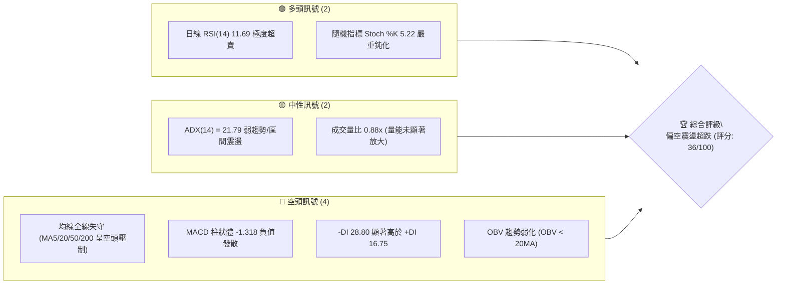

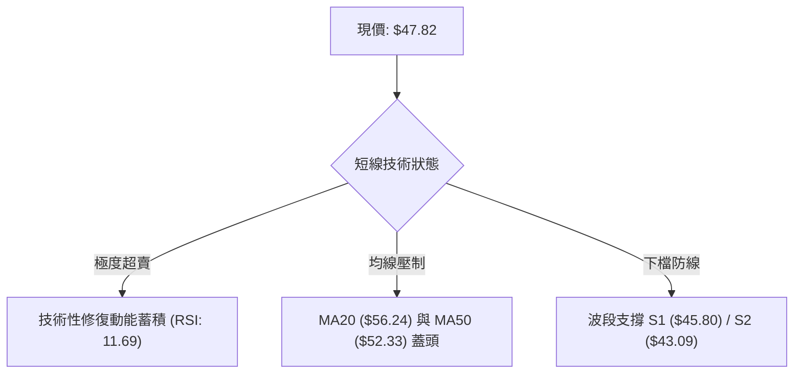

### 📊 核心指標速覽表

| 指標類別 | 指標名稱 | 當前數值 | 訊號 | 解讀 |
|----------|----------|----------|------|------|
| **價格** | 當前收盤價 | $47.82 | 🔴 | 位於52週區間 5.2% 分位，處於波段絕對低檔區 |
| **均線** | MA20 (布林中軌) | $56.24 | 🔴 | 價格低於 MA20 -14.98%，短期趨勢嚴重偏空 |
| **均線** | MA50 | $52.33 | 🔴 | 價格低於 MA50 -8.62%，中期下行結構未逆轉 |
| **均線** | MA200 | $71.61 | 🔴 | 價格大幅低於牛熊分界線 -33.22%，長期結構轉弱 |
| **動能** | RSI(14) | 11.69 | 🟢 | 進入極限超賣區間 (<20)，隨時具備技術性均值回歸彈升需求 |
| **動能** | MACD (12,26,9) | -1.647 / -0.328 | 🔴 | DIF 線低於訊號線，柱狀體為 -1.318，空頭動能擴散 |
| **動能** | Stoch %K / %D | 5.22 / 5.12 | 🟢 | 雙線低於 10 嚴重超賣，即將醞釀超跌金叉訊號 |
| **趨勢** | ADX(14) / DMI | 21.79 | 🟡 | ADX < 25 表明非單邊強烈趨勢，-DI(28.80) > +DI(16.75) 呈空方控盤盤整 |
| **通道** | 布林通道 (%B) | 0.16 | 🟡 | 逼近下軌 $44.03，未跌破但處於通道極弱勢帶 |
| **量能** | 20日均量 / OBV | 2.81M / 3.22M | 🔴 | 量比 0.88x，量能萎縮且 OBV 低於均線，資金未見進場掃貨 |
| **波動** | ATR(14) | $2.64 | 🟡 | 佔股價 5.53%，日波動幅度中等偏高，風控止損需設防 ATR 緩衝 |

### 🏆 技術評分卡

```
╔══════════════════════════════════════════════════════════════════╗
║                 技術評分卡 — KTOS (2026-09-08)                  ║
╠══════════════════════════════════════════════════════════════════╣
║ 趨勢強度 (ADX/DMI)   ███████░░░░░░░░░░░░░  35/100  🔴 空頭壓制  ║
║ 動能指標 (RSI/MACD)  ██████░░░░░░░░░░░░░░  30/100  🟡 極度超賣  ║
║ 支撐穩定度 (S1/S2)   █████████░░░░░░░░░░░  45/100  🟡 臨近考驗  ║
║ 成交量配合 (OBV/VOL) ███████░░░░░░░░░░░░░  35/100  🔴 量能渙散  ║
║ 形態完整度 (結構分析) ████████░░░░░░░░░░░░  40/100  🟡 弱勢築底  ║
║ 均線排列 (MA系統)    ████░░░░░░░░░░░░░░░░  20/100  🔴 全線倒掛  ║
╠══════════════════════════════════════════════════════════════════╣
║ 綜合評分             ███████░░░░░░░░░░░░░  34/100  🔴 偏空震盪  ║
╚══════════════════════════════════════════════════════════════════╝
```

---

## 2. 趨勢分析

### 🌐 多時框趨勢分析

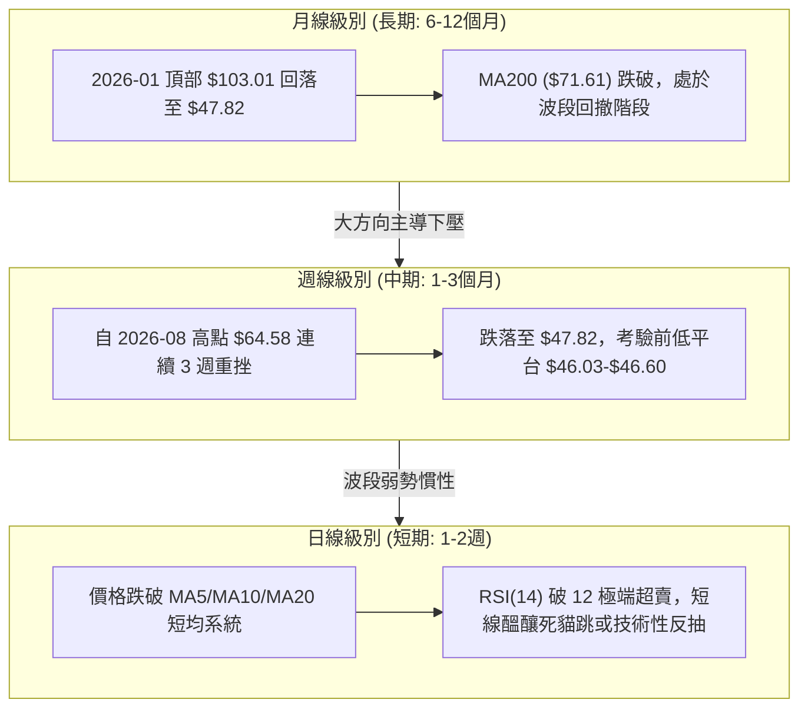

### 📈 長期趨勢 — 12個月走勢圖（Unicode）

```
KTOS 月線走勢圖（過去12個月：2025-10 至 2026-09）
價格軸 ($)
$105 ┤                               ● $103.01 (2026-01 頂部)
$95  ┤        ● $90.60
$85  ┤                                     ● $86.18
$75  ┤              ● $76.10  ● $75.91           ● $70.51
$65  ┤                                                 ● $63.05  ● $64.13
$55  ┤                                                                      ● $50.98
$45  ┤                                                                ● $49.86  ● $46.60  ● $47.82 ◄現價
     └────────────────────────────────────────────────────────────────────────────────────────────
        25-10  25-11  25-12  26-01  26-02  26-03  26-04  26-05  26-06  26-07  26-08  26-09
```

#### 長期走勢特徵分析表格

| 時間階段 | 價格區間 | 累積漲跌幅 | 走勢特徵描述 |
|----------|----------|------------|--------------|
| **2025-10 ~ 2026-01** | $90.60 → $103.01 | +13.70% | 頂部衝刺與構築階段，觸及歷史高位區間，成交活躍但上攻鈍化 |
| **2026-01 ~ 2026-04** | $103.01 → $63.05 | -38.79% | 頂部破位加速下殺，連續四個月大陰線下跌，相繼跌破重要整數關卡 |
| **2026-04 ~ 2026-06** | $63.05 → $49.86 | -20.92% | 下跌中繼整理後再次破位，跌破 $50.00 心理關卡，空方完全主導 |
| **2026-06 ~ 2026-09** | $49.86 → $47.82 | -4.09% | 於 $43.09~$50.98 進行底部區間震盪探底，波動率收窄，進入籌碼重整期 |

### 📊 中期趨勢（週線分析）

```
KTOS 近20週核心價格走廊與波動區間示意圖
══════════════════════════════════════════════════════════════════
$65 ┤           ● 05-31 ($64.13)                 ● 08-16 ($64.58) ◄ 雙頭反彈阻力
$60 ┤   ●       │     ● 06-07 ($58.52)   ● 08-09 ($60.77)  │   ● 08-23 ($57.17)
$55 ┤   │ ●     ● 05-24 ($56.18)   ● 07-05 ($55.35)        │   │
$50 ┤   ● │                                            │   ● 08-30 ($52.00)
$45 ┤     ● 05-17 ($52.09)     ● 06-28 ($47.21)    ● 07-19 ($46.03)      ● 09-06 ($47.82) ◄ 現價
$40 ┤                          └────── 底部防守平台 ($46.03 ~ $47.21) ──────┘
══════════════════════════════════════════════════════════════════
```

- 中期波段特徵：自 2026-05 底的反彈高點 $64.13 與 2026-08 中旬高點 $64.58 形成了強烈的中期雙頂阻力頸線，隨後週線收盤迅速回落。
- 週線成交量：2026-06-28 爆出 45.38M 的放量下殺收盤於 $47.21，隨後成交量逐週萎縮至 11M~16M 水平，顯示下殺動能已進入衰竭狀態，但多頭反攻量能匱乏。

### ⚡ 趨勢強度評估（ADX 解讀）

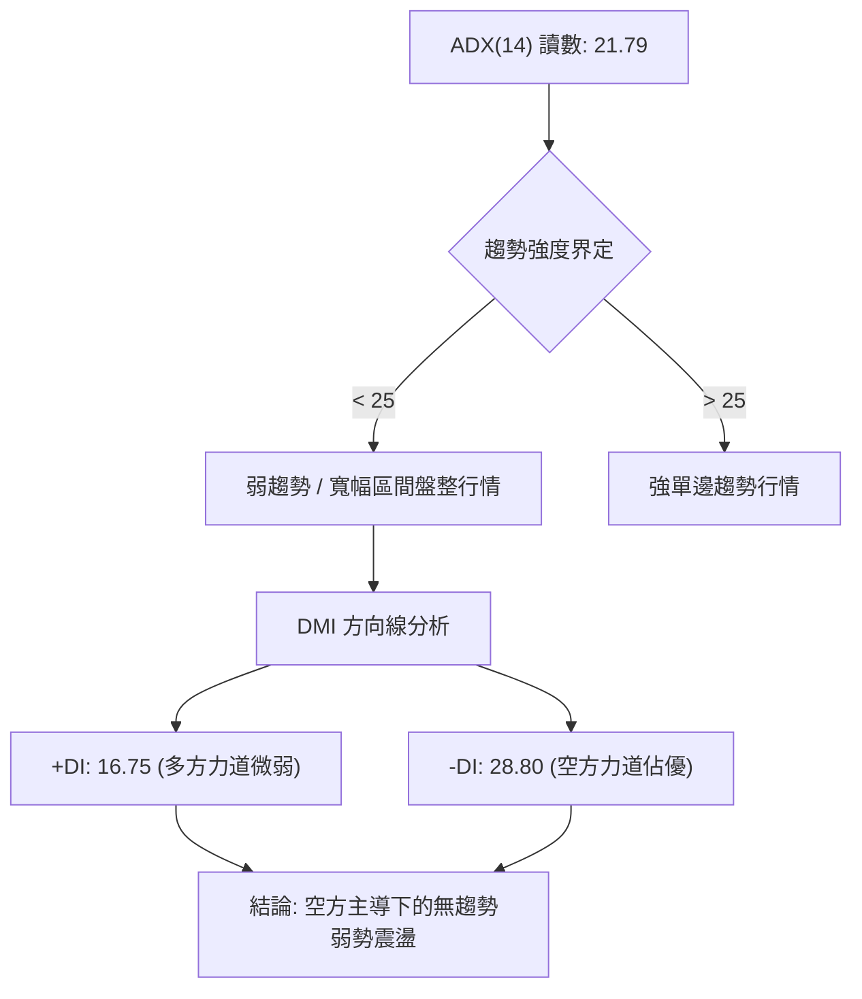

#### ADX 強度對照表

| 指標名稱 | 當前數值 | 參考閾值 | 市場狀態解讀 |
|----------|----------|----------|--------------|
| **ADX(14)** | 21.79 | 25.00 | **弱趨勢 / 區間震盪**。當前不存在不可逆的單邊破位動能，行情更傾向於區間尋底 |
| **+DI** | 16.75 | 20.00 | **多方動能貧乏**。買盤無法組織連續兩個交易日以上的推升攻勢 |
| **-DI** | 28.80 | 25.00 | **空方佔據優勢**。雖佔據優勢但未見極端擴散，符合震盪盤跌特徵 |

---

## 3. 圖表形態分析

### 🔍 形態識別系統

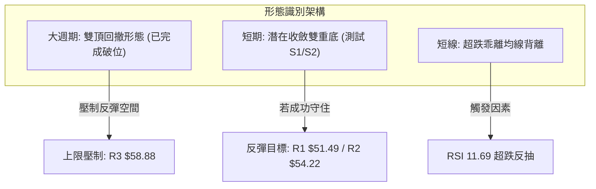

#### 形態信心度評估表（依規則 15）

| 形態類別 | 信心度 | 判斷依據（引用數據） | 完成度 | 目標價（附嚴格計算式） |
|----------|--------|----------------------|--------|------------------------|
| **中期雙重頂 (Double Top)** | **85%** | 兩次反彈高點聚類於 2026-05-31 ($64.13) 與 2026-08-16 ($64.58)；頸線位於 2026-07-19 低點聚類 $46.03 | **100% (已跌破頸線)** | 頸線 $46.03 - (頂部均值 $64.35 - 頸線 $46.03) = $27.71 (理論滿足點)；但受 52W 低點強支撐 S2 **$43.09** 攔截 |
| **潛在雙重底 (Potential Double Bottom)** | **45%** | 第一次波段低點為 2026-07-19 的 $46.03，當前價格 $47.82 正回測該區域，接近 S1 ($45.80) | **40% (尚未確認右底放量突破)** | 若於 S1 ($45.80) 築底成功，反彈目標以頸線聚類高點 **R1 $51.49** 及 **R2 $54.22** 為基準 |
| **超賣乖離修復形態** | **75%** | 現價 $47.82 距 MA20 ($56.24) 乖離率達 -14.98%，且 RSI 跌至 11.69，Stoch %K 5.22 | **70% (處於極限超賣區)** | 均值回歸至 MA20 附近，首要反抽目標為聚類阻力 **R1 $51.49** (計算式: 現價 + 7.67%) |

*注：潛在雙重底信心度低於 50%，數據不足以確認其已反轉，後續主要以「指標型超跌反抽」視之。*

### 🕯️ 重要K線形態分析

| 日期 / 週期 | 收盤價 | K線組合與形態 | 技術意涵與市場心理 | 多空訊號 |
|-------------|--------|---------------|--------------------|----------|
| **2026-08-16 (週線)** | $64.58 | 長上影倒轉十字星 | 衝高觸及 $64.58 阻力位引發法人劇烈拋壓，多頭動能消耗殆盡 | 🔴 強烈看空 |
| **2026-08-23 (週線)** | $57.17 | 中陰線下破 | 吞噬前週實體下半部，確認雙頂構築失敗，多殺多賣壓出籠 | 🔴 看空延續 |
| **2026-08-30 (週線)** | $52.00 | 實體中陰線無反抗 | 貫穿 MA50 ($52.33)，多頭防線全線後撤，成交量萎縮呈無量陰跌 | 🔴 空頭掌控 |
| **2026-09-06 (週線)** | $47.82 | 下探探底小實體陰線 | 逼近前低波段支撐區間 $45.80-$46.60，空方動能減弱，跌勢收斂 | 🟡 止跌孕育 |

### 📉 ASCII 走勢形態示意圖

```
KTOS 中期雙頂與短線尋底形態示意
══════════════════════════════════════════════════════════════════
            頂部1: $64.13                 頂部2: $64.58
                ▲                             ▲
               ╱ ╲                           ╱ ╲
              ╱   ╲                         ╱   ╲
             ╱     ╲                       ╱     ╲
            ╱       ╲                     ╱       ╲
           ╱         ▼ 頸線波段: $46.03    ╱         ▼ 當前尋底
──────────┴───────────●───────────────────┴───────────●◄ 現價: $47.82
                      │                               │
                      └────── 關鍵波段支撐帶 ─────────┘
                              S1: $45.80 / S2: $43.09 (52W Low)
══════════════════════════════════════════════════════════════════
```

### 🎯 形態目標價計算

1. **中期雙頂形態推算（防守空方情境）**：
   - 雙頂高點均值 = ($64.13 + $64.58) / 2 = $64.355
   - 頸線聚類支撐 = $46.03
   - 形態垂直高度 = $64.355 - $46.03 = $18.325
   - 空頭理論極限跌幅 = $46.03 - $18.325 = $27.705。
   - **實務空間修正**：因下檔存在 52 週最低點 **$43.09** 強支撐聚類，空頭理論跌幅在跌破 $43.09 之前不具備實際操作指引意義，因此下檔主要防守目標鎖定 **S2 $43.09**。

2. **短線超跌反抽目標（均值回歸情境）**：
   - 當前價格 = $47.82，短期跌幅過大形成價格乖離。
   - 第一反彈目標 = 近一年波段高點聚類 **R1: $51.49**（空間 +7.67%）。
   - 第二反彈目標 = 波段阻力 **R2: $54.22**（空間 +13.38%），該處接近 MA50 ($52.33) 與下移中的 MA20 ($56.24) 之間的中樞軸。

---

## 4. 支撐與阻力

### 🗺️ 關鍵價位分布圖（Unicode）

```
KTOS 價位結構分布圖
══════════════════════════════════════════════════════════════════
$58.88 ║██████████████████████████████║ 強阻力 R3 (近一年密集高點聚類)
$56.24 ║──────────────────────────────║ MA20 / 布林通道中軌壓制
$54.22 ║████████████████████          ║ 阻力 R2 (反彈中繼壓力位)
$51.49 ║████████████████████████      ║ 關鍵阻力 R1 (短期第一道反彈壓力)
$47.82 ╠══════════════════════════════╣ ◄ 現價 (2026-09-08 收盤)
$45.80 ║▓▓▓▓▓▓▓▓▓▓▓▓▓▓▓▓              ║ 近期支撐 S1 (波段低點聚類)
$44.03 ║······························║ 布林通道下軌
$43.09 ║██████████████████████████████║ 極強支撐 S2 (52W Low / 斐波 100%)
══════════════════════════════════════════════════════════════════
```

### 🚧 阻力位分析表

所有阻力價位嚴格引用技術數據「關鍵價位」區塊之波段高點聚類數值：

| 阻力級別 | 價位 | 距現價幅幅 | 形成原因與技術共振 | 突破難度 | 重要性 |
|----------|------|------------|--------------------|----------|--------|
| **R1** | **$51.49** | +7.67% | 近期波段回跌平台支撐轉阻力；接近 MA10 ($50.83) 及 MA50 ($52.33) 形成之密集成交區 | 🟡 中等 | ★★★☆☆ |
| **R2** | **$54.22** | +13.38% | 2026-06-21 週線收盤價位 ($54.21) 聚類密集換手帶；反彈動能衰竭轉折點 | 🔴 高 | ★★★★☆ |
| **R3** | **$58.88** | +23.13% | 2026-06-07 收盤價 ($58.52) 與 2026-05-10 ($57.89) 之波段高點聚類；布林上軌 ($68.46) 下方核心重壓 | 🔴 極高 | ★★★★★ |

### 🛡️ 支撐位分析表

所有支撐價位嚴格引用技術數據「關鍵價位」區塊之波段低點聚類數值：

| 支撐級別 | 價位 | 距現價幅幅 | 形成原因與技術共振 | 守住機率 | 重要性 |
|----------|------|------------|--------------------|----------|--------|
| **S1** | **$45.80** | -4.23% | 2026-07-19 週線低點收盤 $46.03 聚類防區；日線級別前波快速下影線探底帶 | 65% | ★★★★☆ |
| **S2** | **$43.09** | -9.89% | **52週最低價 (52W Low)**；斐波那契 100.0% 終極回撤位；長線多頭最後防線 | 85% | ★★★★★ |

### 📐 斐波那契回調位分析

依據 52 週區間 **$43.09 (低點) → $134.00 (高點)** 進行黃金分割回調測算：

```
$134.00 ┤ 0.0%  (52W High)
$112.55 ┤ 23.6% 回調位
$99.27  ┤ 38.2% 回調位
$88.55  ┤ 50.0% 強弱分水嶺
$77.82  ┤ 61.8% 黃金分割強防線 (已失守)
$62.54  ┤ 78.6% 極限回調防線 (已失守)
$47.82  ┼ ◄ 現價 (落於 78.6% 與 100.0% 之間)
$43.09  ┤ 100.0% (52W Low / 基準點)
```

- **位置解讀**：現價 $47.82 位於斐波那契 **78.6% ($62.54)** 與 **100.0% ($43.09)** 之間的深度回撤區域。
- **技術意義**：跌破 78.6% ($62.54) 代表自 $134.00 起始的上升趨勢完全瓦解，進入週期性築底階段。目前價格距離 100.0% 基準點 $43.09 僅差 9.89%，下檔空間已顯著受限，該處將產生極強的物理買盤與結構性空頭平倉買盤。

---

## 5. 技術指標深度解讀

### 🎛️ 指標訊號總覽

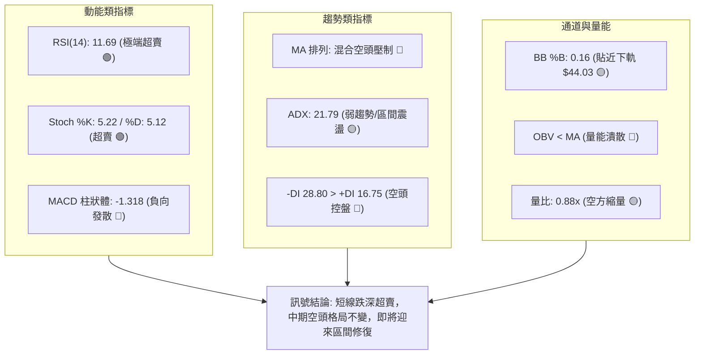

### 📈 移動平均線排列分析

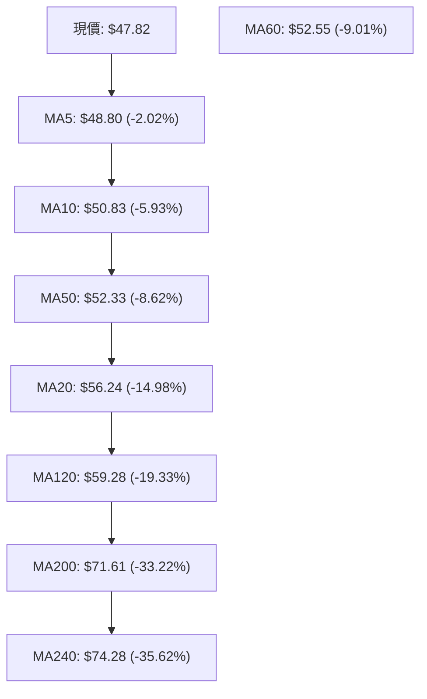

#### 均線狀態詳細分析

| 均線名稱 | 數值 | 距現價差距 | 趨勢方向 | 技術解讀 |
|----------|------|------------|----------|----------|
| **MA5** | $48.80 | -0.98 (-2.02%) | 下行 ▼ | 極短線第一道下壓扣抵線，突破方能緩解下挫急勢 |
| **MA10** | $50.83 | -3.01 (-5.93%) | 下行 ▼ | 短線防守均線，與 R1 ($51.49) 形成緊密壓制帶 |
| **MA20** | $56.24 | -8.42 (-14.98%)| 下行 ▼ | 月線中樞軸，布林中軌，短多中期回歸之極限壓力 |
| **MA50** | $52.33 | -4.51 (-8.62%) | 下行 ▼ | 季線位置，當前數值低於 MA20 出現短期倒掛 |
| **MA200** | $71.61 | -23.79 (-33.22%)| 下行 ▼ | 牛熊生死線，跌破該線確認進入大週期熊市結構 |

- **均線排列結論**：均線呈現空頭壓制混合排列（MA5 < MA10 < MA50 < MA20 < MA200）。現價與短期均線偏離度極大，具備強烈技術性反抽拉回均線之修復動能。

### 📉 RSI(14) 分析

```
RSI(14) 數值儀表板: 11.69 / 100
[██░░░░░░░░░░░░░░░░░░] 11.69%  🟢 極端超賣區間 (< 20)
├─────────────┼───────────────────────────────┼─────────────┤
0             20 (極端超賣)                   70 (超買)    100
```

- **超買超賣判定**：RSI 讀數為 **11.69**，處於罕見的極端超賣狀態（通常 <30 為超賣，<15 為極限超賣），表明市場拋壓已接近情緒化宣洩的末端。
- **背離分析判斷**：
  - 前次週線 RSI 低點出現在 2026-06-28（價格收盤 $47.21，RSI 為 23.1）。
  - 本次價格回落至 $47.82，RSI 卻驟降至 **11.69**。
  - **背離結論**：目前日線與週線層面**未出現經典的牛市底背離**（即價格創新低而 RSI 抬高），而是呈現「指標加速探底，價格同步回落」狀態。這意味著短期反彈高度不應過度樂觀，多為均值回歸的技術性脈衝，而非反轉結構。

### 📊 MACD(12,26,9) 訊號解讀

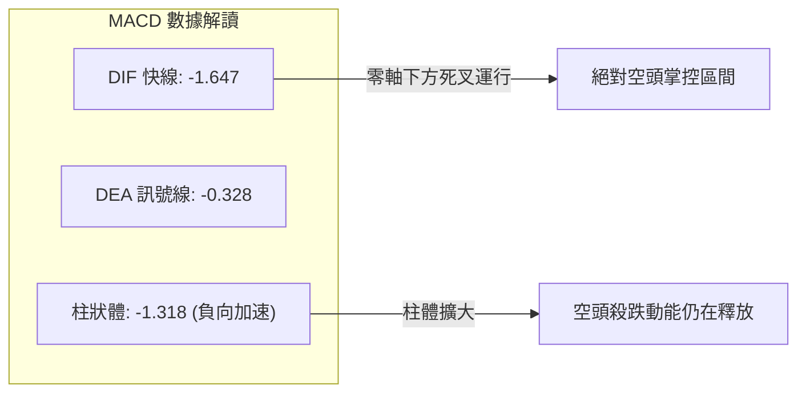

- **MACD 解讀**：快線 DIF (-1.647) 位於慢線 Signal (-0.328) 下方，且雙線均深處零軸下方。
- **背離判定**：MACD 柱狀體收於 -1.318，為近 10 週來最低水平，**確認無底背離形態**，空方力道仍處於順勢釋放期，需等待負柱狀體收斂縮短後方可確認短底確立。

### 📦 布林通道分析

```
KTOS 布林通道寬度與價格位置示意圖 (20日參數, 2倍標準差)
══════════════════════════════════════════════════════════════════
$68.46 ┤ ────────────────────────────────── 上軌 (BB Upper)
       │
$56.24 ┤ ---------------------------------- 中軌 (MA20 Baseline)
       │
$47.82 ┤ ◄ 現價 (%B: 0.16)
$44.03 ┤ ────────────────────────────────── 下軌 (BB Lower)
══════════════════════════════════════════════════════════════════
```

- **通道指標解讀**：
  - 上軌：$68.46
  - 中軌 (MA20)：$56.24
  - 下軌：$44.03
  - 通道帶寬 (Bandwidth) = ($68.46 - $44.03) / $56.24 = 43.43%，顯示帶寬較為發散。
  - **%B 指標為 0.16**：現價落於下軌上方不遠處（0 表示觸碰下軌，0.5 為中軌）。價格沿著下軌尋求支撐，並未直接跌破下軌 $44.03，說明空頭並未引發流動性踩踏，下軌 $44.03 與 S2 ($43.09) 構成強有力的底部緩衝墊。

### 💹 成交量分析（量價配合度）

- **量價動態**：最新日成交量為 2,818,100 股，低於 20 日均量 3,215,650 股（量比 0.88x），更大幅低於 50 日均量 4,346,534 股。
- **價跌量縮**：在股價向下跌向 $47.82 的過程中，成交量持續萎縮，並未出現如 2026-06-28 當時高達 45.38M 的恐慌性出逃量能。這表明市場主動性殺跌盤已趨於耗竭，目前處於「無量空跌」的陰跌階段。
- **OBV 能量潮解讀**：OBV 指標持續位於其均線下方，量能配合度較弱，反映機構主力資金在此位階尚未開展大規模建倉吸籌，盤面多為散戶與量化被動盤交易。

---

## 6. 動能與波動率

### ⚡ 動能評估四象限

| 象限 | 動能維度 (Momentum) | 波動率維度 (Volatility) | KTOS 所處狀態 | 操作評估與策略映射 |
|------|---------------------|--------------------------|---------------|-------------------|
| **第一象限 (Q1)** | 強動能 (趨勢明確) | 低波動 (穩定推進) | 否 | 最佳趨勢加碼點 |
| **第二象限 (Q2)** | 弱動能 (趨勢匱乏) | 低波動 (窄幅壓縮) | 否 | 突破前夕觀察期 |
| **第三象限 (Q3)** | 強動能 (爆發推進) | 高波動 (劇烈洗盤) | 否 | 順勢短線博弈 |
| **第四象限 (Q4)** | **弱動能 (跌勢放緩)** | **中高波動 (ATR 5.5%)** | **✓ (當前狀態)** | **逆向超跌防守 / 避免追空 / 輕倉博反彈** |

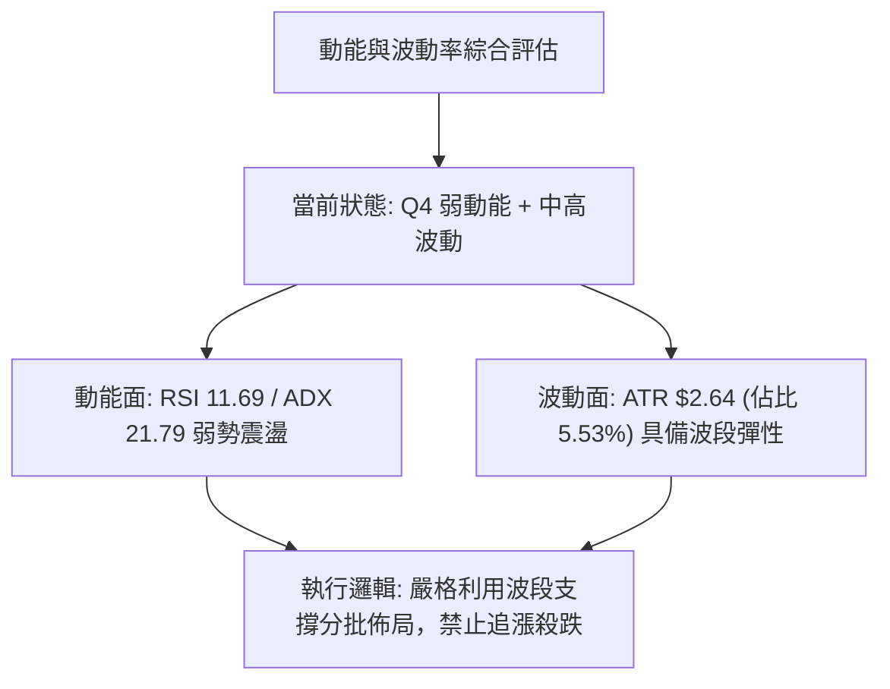

### 📊 ATR 波動率分析

- **ATR(14) 數值**：**$2.64**。
- **相對價格波動率**：$2.64 / $47.82 = **5.53%**。
- **止損距離建議**：
  - 由於每日正常噪音波動達 $2.64，短線交易若止損設定過窄（如 < 3%）極易被市場雜訊掃出場。
  - 建議合理止損距離應至少設置為 **1.0 至 1.5 倍 ATR**，即 $2.64 ~ $3.96 的防守空間。
  - 若以現價 $47.82 減去 1.5 倍 ATR ($3.96) 計算，防守位置為 **$43.86**，恰好落於波段核心支撐 S2 **$43.09** 與布林下軌 **$44.03** 附近，具備高度的數值共振防禦意義。

### 📐 Beta 與市場相關性

- **Beta 係數**：**1.113**。
- **解讀**：KTOS 呈現弱於高科技成長股、但略高於標普 500 指數的波動屬性（Beta > 1.0）。在防務軍工板塊中，1.113 的 Beta 意味著若大盤或軍工板塊出現系統性回調，KTOS 的回撤幅度將比大盤深 11.3%；反之，在市場情緒回暖時，其具備超過大盤的彈性。當前其深度回調主要受自身籌碼結構與獲利了結影響，非單純系統性風險。

---

## 7. 多時框架總結

### 📋 時框架評分表

| 時框架 | 趨勢方向 | 動能狀態 | 均線排列 | 形態結構 | 綜合評分 | 操作建議 |
|--------|----------|----------|----------|----------|----------|----------|
| **月線 (長期)** | 🔴 偏空修正 | 弱化 (自高點回撤) | 破位 (破 MA200) | 歷史高點下行 | 35/100 | 觀望，不宜長線重倉 |
| **週線 (中期)** | 🔴 空方主導 | 下行擴散 | 空頭排列 | 雙頂破位尋底 | 30/100 | 順勢防守，等待右側確認 |
| **日線 (短期)** | 🟡 超跌修復 | 🟢 極度超賣 (RSI 11) | 全線壓制 | 貼軌探底震盪 | 40/100 | 逢低博取均值回歸反抽 |

### 🔲 綜合訊號矩陣

```
時框與指標維度一致性檢驗
══════════════════════════════════════════════════════════════════
指標維度         日線 (短期)       週線 (中期)       月線 (長期)
──────────────────────────────────────────────────────────────────
趨勢強度 (ADX)    🟡 21.79 (盤整)   🔴 偏空控盤       🔴 熊市回調
均線壓制 (MA)     🔴 全線死叉下行   🔴 破 MA50        🔴 跌破 MA200
動能狀態 (RSI)    🟢 11.69 (極超賣) 🔴 30.0 (空方)    🟡 中性回落
布林軌道 (BB)     🟡 貼近下軌       🔴 中軌下方       🟡 寬幅發散
量價配合 (VOL)    🟡 縮量跌勢收斂   🔴 連續陰線放量   🔴 月線頂部放量
──────────────────────────────────────────────────────────────────
一致性結論：長中期趨勢完全被空方鎖定；短期出現極端超跌共振，多空產生拉鋸。
══════════════════════════════════════════════════════════════════
```

### ⚖️ 多時框收斂結論（依規則 14）

1. **行情性質判定**：
   - 當前 **ADX(14) 讀數為 21.79 (< 25)**，嚴格界定為**「弱趨勢 / 寬幅區間盤整行情」**。
   - 依據多時框收斂規則：在 ADX < 25 的盤整行情中，單邊趨勢不具備持續擊穿關鍵防線的動能，應以**日線布林通道上下軌（$44.03 ~ $68.46）及波段聚類支撐阻力為主要交易區間**。
2. **時框取捨與方向唯一收斂**：
   - 雖然長期月線與中期週線均線死叉（MA200 $71.61），壓制中期反彈空間；但日線 RSI 跌至 11.69，已進入統計學上的非理性拋售區。
   - 收斂結論：**「偏空背景下的區間超跌修復行情（偏空震盪，區間操作）」**。主基調為空頭壓制，但當前點位追空風險極高，策略核心聚焦於「依託 S1/S2 防守位，博取向上回抽 R1/R2 的技術性反彈」，嚴格以區間震盪思路應對。

---

## 8. 交易策略建議

### 🗺️ 策略決策流程圖

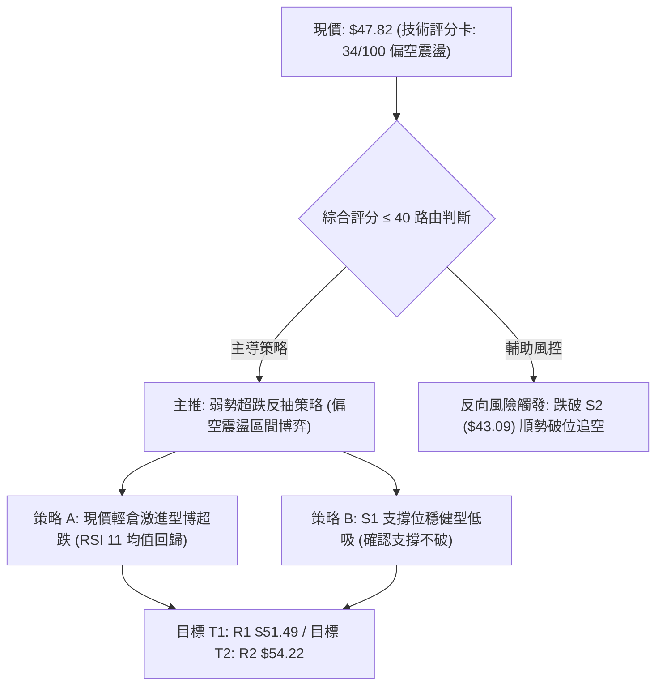

### 🧭 策略路由（依評分卡分流）

> **當前主策略方向 = 偏空震盪下的超跌反抽區間交易（依技術評分卡：34/100，處於 ≤ 40 區間）**
> 
> *架構說明：綜合技術評分為 34 分，大格局處於空頭壓制；但因 ADX=21.79 處於盤整市，且 RSI=11.69 處於極度超賣，做空盈虧比已被嚴重壓縮。因此策略採取「以防守反擊為主線、嚴設止損點」的區間短多反抽策略，空頭作為趨勢保護與對沖觸發機制。*

### 🎯 價格情境階梯（Price Scenarios）

價位嚴格引用技術數據波段聚類與關鍵價位：

| 觸發條件 | 下一目標 | 後續延伸 | 情境技術含義 |
|----------|----------|----------|--------------|
| **突破 R1 $51.49** | R2 $54.22 | R3 $58.88 | 短線反抽確立，站上 MA10，挑戰 MA50 與 MA20 空頭密集防區 |
| **站穩現價 $47.82 區間** | R1 $51.49 | — | 於布林下軌上側進行震盪築底，消化短期賣壓 |
| **跌破 S1 $45.80** | S2 $43.09 | — | 短底防守失敗，價格下尋 52 週最低點終極考驗 |
| **跌破 S2 $43.09** | 破位擴散 | — | 創 52 週新低，大週期頭肩/雙頂完全展開，進入深淵式無錨陰跌 |

### 📊 情境機率分佈

| 情境劇本 | 機率估算 | 主要指標與技術依據 |
|----------|----------|--------------------|
| **劇本一：區間超跌反彈** | **55%** | 日線 RSI(14) 達 11.69 極限超賣；Stoch %K 5.22 嚴重鈍化；量能萎縮至 0.88x 顯示空方拋壓枯竭；距 S1/S2 支撐極近。 |
| **劇本二：弱勢橫盤震盪** | **30%** | ADX(14) 為 21.79 (<25) 表明無趨勢；OBV 持續疲弱顯示無增量資金，價格在 $45.80 ~ $51.49 區間反覆拉鋸。 |
| **劇本三：直接破位深跌** | **15%** | MACD 柱狀體為 -1.318 負向發散；均線系統全線空頭排列；若大盤劇烈系統性下挫則可能直接帶崩 S2 ($43.09)。 |

### 🟢 主策略詳情（超跌反抽區間博弈）

| 策略要素 | 策略 A（現價激進博弈型） | 策略 B（支撐回踩穩健型） |
|----------|--------------------------|--------------------------|
| **進場條件** | 現價附近直接介入，利用 RSI 11.69 極度超賣進行左側試倉 | 等待價格回測波段支撐 **S1 $45.80** 企穩不破時右側進場 |
| **進場價格** | **$47.82** | **$45.80** |
| **目標價 T1** | **$51.49** (波段阻力 R1，漲幅 +7.67%) | **$51.49** (波段阻力 R1，漲幅 +12.42%) |
| **目標價 T2** | **$54.22** (波段阻力 R2，漲幅 +13.38%) | **$54.22** (波段阻力 R2，漲幅 +18.38%) |
| **止損價格** | **$45.50** (跌破 S1 $45.80 緩衝 1.2% 止損) | **$42.80** (跌破 52W 低點 S2 $43.09 止損) |
| **風險報酬比 (R:R)** | **1 : 1.58** (風險 $2.32 / 首標利潤 $3.67) | **1 : 1.90** (風險 $3.00 / 首標利潤 $5.69) |
| **成功機率估計** | 55% | 65% |
| **建議倉位** | **5% ~ 8%** (輕倉試探，嚴控風險) | **10% ~ 12%** (標準防守倉位) |

### 🔴 反向風險觸發點（對沖提示）

- **做空對沖觸發價位**：**$43.00**（跌破 52W 低點 S2 $43.09 確認）。
- **觸發訊號**：若價格以放量日陰線（單日成交量 > 4.3M 50日均量）實體跌破 $43.09，宣告長線底線徹底失守。
- **對沖應對措施**：所有多頭反彈倉位必須無條件市價止損離場，並可轉為建立空頭對沖部位，順勢下看空頭自由落體階段。

### ⭐ 整體訊號強度評星

```
做多訊號強度：★★☆☆☆  (2.5/5星 — 僅限超跌技術反抽，缺乏趨勢支撐)
做空訊號強度：★★★☆☆  (3.0/5星 — 趨勢偏空但空間被超賣指標壓縮)
整體可信度：  ★★★☆☆  (3.5/5星 — 處於 ADX 震盪市，關鍵價位依託性高)
```

---

## 9. 風險提示與監控

### ✅ 關鍵監控指標 Checklist

```
╔══════════════════════════════════════════════════════════════════╗
║                     關鍵監控指標 CHECKLIST                       ║
╠══════════════════════════════════════════════════════════════════╣
║ [ ] 價格能否守穩波段低點 S1: $45.80 (關鍵短線防線)               ║
║ [ ] 價格是否跌破 52週低點 S2: $43.09 (趨勢破位生死線)            ║
║ [ ] 日線 RSI(14) 能否自 11.69 回升脫離 20 超賣區並穿越 30        ║
║ [ ] 日成交量能否放大超越 20日均量 3.21M (反彈放量確認)          ║
║ [ ] MACD 負柱狀體 (-1.318) 是否開始縮短形成首根收斂紅柱          ║
║ [ ] 價格能否有效向上突破並站穩波段第一阻力 R1: $51.49            ║
╚══════════════════════════════════════════════════════════════════╝
```

### ⚠️ 風險場景分析

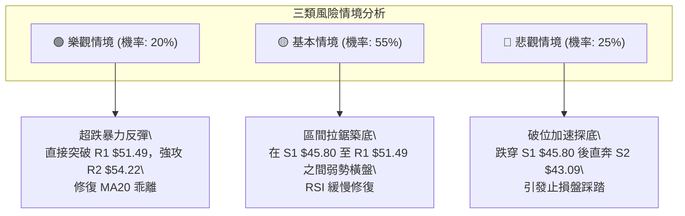

### 🛡️ 風險管理重要提醒

1. **嚴禁逆勢重倉加碼**：KTOS 長期均線已跌破 MA200 ($71.61)，在技術上仍屬於熊市調整格局。儘管 RSI(14) 處於 11.69 的超跌水平，但超跌往往伴隨「鈍化」，切不可因「價格便宜」而進行金字塔式重倉逆勢抄底。
2. **ATR 波動風險適配**：目前日線 ATR 為 $2.64（單日振幅 5.53%），屬於中高波動資產。在持倉過程中，隔夜持倉必須預留足夠的風險緩衝空間，倉位總暴露不宜超過總資金的 15%。
3. **無量反彈逢高減磅**：若後續反彈至 R1 **$51.49** 或 R2 **$54.22** 時，成交量依然低於 20 日均量（3.21M 股），必須將其視為「誘多型無量脈衝」，應嚴格執行逢高停利減倉，防範二次探底風險。

---

## 10. 報告總結

```
KTOS 技術分析報告總結
══════════════════════════════════════════════════════════════════
報告日期：2026-09-08
當前價格：$47.82
分析評級：⚖️ 偏空震盪（超跌修復機率高，但中期趨勢偏弱）

關鍵結論：
├─ 長期趨勢：🔴 偏空（股價大幅運行於 MA200 $71.61 之下）
├─ 中期趨勢：🔴 偏空（週線雙頂破位，MA50 $52.33 蓋頭）
├─ 短期趨勢：🟢 觸底反抽醞釀中（日線 RSI 11.69，Stoch %K 5.22 極度超賣）
├─ 關鍵支撐：S1: $45.80 ｜ S2: $43.09 (52W Low)
├─ 關鍵阻力：R1: $51.49 ｜ R2: $54.22 ｜ R3: $58.88
└─ 分析師目標：平均 $105.62 (最高 $150.00 / 最低 $60.00，基本面共識偏強)

最優策略組合：
1. 🥇 最佳機會：策略 B — 回踩波段支撐 S1 ($45.80) 企穩後介入，
              止損設於 $42.80 (跌破 52W 低點離場)，目標看 R1 ($51.49)。
2. 🥈 次選機會：策略 A — 現價 $47.82 輕倉試探博弈 RSI 11 極端超賣修復，
              止損設於 $45.50，目標看 R1 ($51.49)。
3. 🥉 保守選擇：完全空倉觀望，等待日線收盤價帶量突破 R1 ($51.49) 
              且 MACD 柱狀體翻正後，再行順勢右側跟進。
══════════════════════════════════════════════════════════════════
```

---

> ⚠️ **免責聲明**：本報告為技術分析研究，所有數據及估算均基於歷史價格與技術指標模型。本報告**僅供研究與學術參考**，**不構成任何要約、推薦或投資建議**。金融市場具有高度風險，投資人應自行評估風險承受能力並自負盈虧。

---

*報告生成時間：2026-09-08 ｜ 數據來源：Yahoo Finance ｜ 分析框架：多時框技術分析模型*