# KTOS 技術分析報告

> **報告日期**：2026-09-10 ｜ **語言**：繁體中文 ｜ **數據來源**：Yahoo Finance ｜ **當前價格**：$48.20（依最新交易週期收盤基準）

---

## 目錄

| 章節 | 內容 |
|------|------|
| [1. 技術面概覽](#1-技術面概覽) | 訊號儀表板、核心指標、評分卡 |
| [2. 趨勢分析](#2-趨勢分析) | 多時框趨勢、長中短期走勢、12個月走勢圖 |
| [3. 圖表形態分析](#3-圖表形態分析) | 形態識別、K線組合、目標價推算 |
| [4. 支撐與阻力](#4-支撐與阻力) | 關鍵價位、斐波那契回調分析 |
| [5. 技術指標深度解讀](#5-技術指標深度解讀) | 均線系統、RSI、MACD、布林通道、成交量量價 |
| [6. 動能與波動率](#6-動能與波動率) | 動能矩陣、ATR 波動度、Beta 敏感度 |
| [7. 多時框架總結](#7-多時框架總結) | 時框架評分矩陣、多時框收斂結論 |
| [8. 交易策略建議](#8-交易策略建議) | 策略路由、情境階梯、主策略設定、風控觸發 |
| [9. 風險提示與監控](#9-風險提示與監控) | 關鍵監控清單、場景推演、倉位管理 |
| [📋 報告總結](#-報告總結) | 核心結論與執行綱領 |

---

## 1. 技術面概覽

### 🎯 技術訊號儀表板

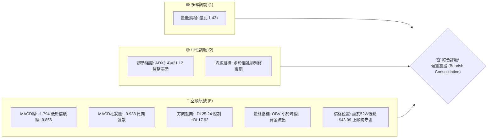

---

### 📊 核心指標速覽表

| 指標類別 | 指標名稱 | 當前數值 | 訊號 | 解讀 |
|:---|:---|:---|:---:|:---|
| **價格基準** | 當前收盤價 | $48.20 | 🔴 | 貼近 52 週低點區間，受制於長期下行通道 |
| **價格區間** | 52W 高 / 低 | $134.00 / $43.09 | 🔴 | 距離歷史高點回撤達 64.03%，處於底部測試階段 |
| **均線排列** | MA 系統 | 混合排列（MA20/50/200 下方） | 🔴 | 短中長期均線呈現空頭壓制，短天期均線斜率向下 |
| **趨勢強度** | ADX (14) | 21.12 | 🟡 | ADX < 25 指向盤整格局，單邊動能不足 |
| **定向動能** | +DI / -DI | 17.92 / 25.24 | 🔴 | -DI 大幅高於 +DI，空方力量牢固主導短線走勢 |
| **動能擺動** | MACD (12,26,9) | -1.794 / -0.856 / -0.938 | 🔴 | 雙線在零軸下方呈死叉發散，動能柱持續擴大 |
| **週線動能** | 週線 RSI(14) | 11.7（前值 25.0） | 🟡 | 進入深度極度超賣區，具備技術性跌深反抽潛能 |
| **成交量能** | 當日量 / 20日均量 | 4,567,922 / 3,202,551 | 🟢 | 量比 1.43x，成交量放大但 OBV 處於均線下方 |
| **能量潮** | OBV 走勢 | OBV < MA | 🔴 | 量價背離不明顯，但整體呈現縮量反彈、帶量下殺 |

---

### 🏆 技術評分卡

```
╔══════════════════════════════════════════════════════════════╗
║              KTOS 技術量化評分卡 (2026-09-10)                ║
╠══════════════════════════════════════════════════════════════╣
║ 趨勢強度 (Trend)     ███████░░░░░░░░░░░░░  35/100 🔴 空方主導 ║
║ 動能指標 (Momentum)  ██████░░░░░░░░░░░░░░  30/100 🔴 動能疲弱 ║
║ 支撐穩定度 (Support) ████████░░░░░░░░░░░░  40/100 🟡 考驗前低 ║
║ 成交量配合 (Volume)  ███████░░░░░░░░░░░░░  35/100 🔴 資金退潮 ║
║ 形態完整度 (Pattern) ████████░░░░░░░░░░░░  40/100 🟡 下行旗形 ║
║ 均線排列 (MA Align)  ██████░░░░░░░░░░░░░░  30/100 🔴 空頭排列 ║
╠══════════════════════════════════════════════════════════════╣
║ 綜合技術評分         ███████░░░░░░░░░░░░░  35/100 🔴 偏空弱勢 ║
╚══════════════════════════════════════════════════════════════╝
```

---

## 2. 趨勢分析

### 🌐 多時框趨勢分析

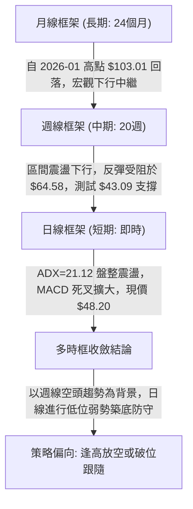

---

### 📈 長期趨勢 — 12個月走勢圖（ASCII）

以下展示自 2025 年 10 月至 2026 年 09 月共 12 個月之收盤價格軌跡與結構性轉折點：

```
KTOS 月線收盤走勢圖（過去12個月：2025-10 至 2026-09）
價格軸 ($)
$105 ┤                               ● (2026-01: 103.01，週期頂部)
$100 ┤
 $95 ┤
 $90 ┤● (2025-10: 90.60)
 $85 ┤                         ● (2026-02: 86.18)
 $80 ┤
 $75 ┤      ● (2025-11: 76.10)
 $70 ┤      ● (2025-12: 75.91)       ● (2026-03: 70.51)
 $65 ┤                                     ● (2026-04: 63.05)
 $60 ┤                                     ● (2026-05: 64.13)
 $55 ┤                                                  ● (2026-08: 50.98)
 $50 ┤                                            ● (2026-06: 49.86)
 $45 ┤                                            ● (2026-07: 46.60)  ● 現價: 48.20
 $40 ┤                                                 底線防守位: $43.09
     └─────────────────────────────────────────────────────────────
       10     11     12     01     02     03     04     05     06     07     08     09 (月)
      2025                 2026
```

#### 走勢特徵階段性分析表

| 階段別 | 時間跨度 | 價格區間 ($) | 漲跌幅 (%) | 結構特徵與成交量象徵 |
|:---|:---|:---:|:---:|:---|
| **衝頂突破期** | 2025-10 ~ 2026-01 | $90.60 → $103.01 | +13.70% | 創下波段歷史頂峰 $103.01（盤中最高達 $134.00），隨後高位巨量換手 |
| **首波殺跌期** | 2026-01 ~ 2026-04 | $103.01 → $63.05 | -38.79% | 快速跌破所有短天期均線，形成流動性踩踏，趨勢反轉確認 |
| **反彈受阻期** | 2026-04 ~ 2026-05 | $63.05 → $64.13 | +1.71% | 弱勢橫盤，嘗試回補缺口未果，MA60/120 壓制顯著 |
| **二次探底期** | 2026-05 ~ 2026-07 | $64.13 → $46.60 | -27.33% | 跌破 $50 整數大關，最低探至 52 週低點 $43.09 上緣 |
| **低位抵抗期** | 2026-07 ~ 2026-09 | $46.60 → $48.20 | +3.43% | 於 $46.00 ~ $64.58 區間拉鋸，最新回測至 $48.20，動能再趨低迷 |

---

### 📊 中期趨勢（週線分析）

從近 20 週收盤走勢觀察，價格結構呈現標準的**高點降低（Lower Highs）與低點受壓**格局：
1. **反彈頂部壓制點**：2026-05-31 收盤 $64.13 與 2026-08-16 收盤 $64.58，兩次上攻均在 $64.50 附近嘎然而止，未能觸及斐波那契 78.6% 位（$62.54 形成密集成交反壓）。
2. **下檔測試帶**：2026-06-28 收盤 $47.21、2026-07-19 收盤 $46.03，以及最新一週（2026-09-06 至 09-13）下探至 $47.82 - $48.20，多次叩關 $46.00 - $48.00 密集帶。

```
近期週線壓力與支撐示意圖
$65.00 ── 關鍵阻力反轉區 ──────────────● 2026-08-16 (收盤 64.58)
          │                              │
$55.00 ── 震盪中樞整理位 ────────────────┼──────────┐
          │                              │          ▼
$48.20 ── 當前價格位置 ──────────────────┼──────────● (現價 $48.20)
          │                              │          │ (考驗支撐)
$43.09 ── 52週極限低點支撐 ──────────────┴──────────▼─── 底線 S_base
```

---

### ⚡ 趨勢強度評估（ADX 解讀）

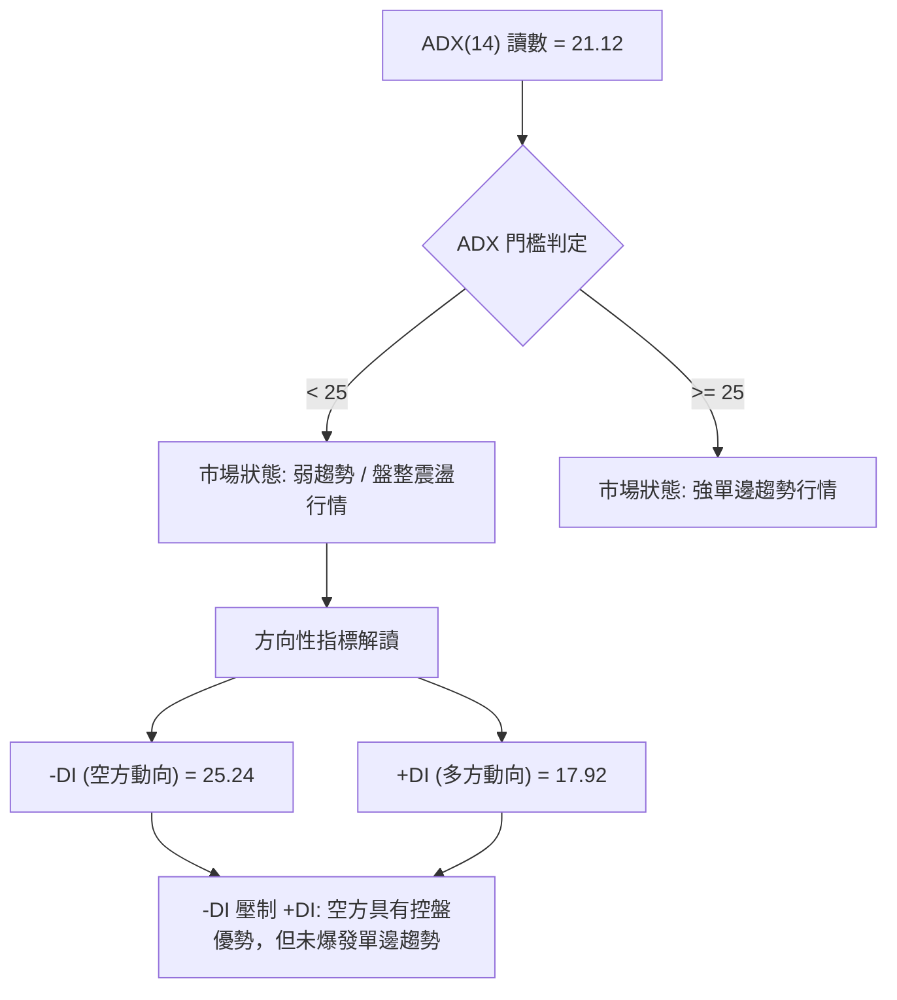

#### ADX 趨勢強度等級對照表

| 指標變數 | 當前讀數 | 門檻區間 | 趨勢屬性判定 | 操作指引 |
|:---|:---:|:---:|:---|:---|
| **ADX (14)** | **21.12** | 0 ~ 25 | **弱趨勢 / 盤整市場** | 避免過度追高殺跌，以邊界波段操作或等待突破為宜 |
| **+DI (14)** | **17.92** | 基準比較 | 多頭進攻意願低迷 | 多頭動能匱乏，缺乏推升價格脫離底部的資金合力 |
| **-DI (14)** | **25.24** | 基準比較 | 空頭佔據壓制優勢 | 空方拋壓持續存在，抑制任何反彈波段的持續時間 |

---

## 3. 圖表形態分析

### 🔍 形態識別系統

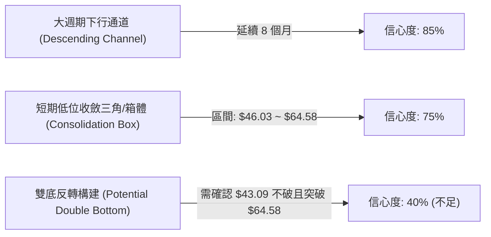

#### 形態識別與信心度評估表

| 圖表形態 | 信心度 | 判斷依據（引用數據） | 完成度 | 目標價（附嚴謹計算式） |
|:---|:---:|:---|:---:|:---|
| **下行通道中繼** | **85%** | 月線自 $103.01 下行，高點降至 $64.58，低點壓至 $46.03 | 80% | 跌破 52W 低點後，測量通道投影：$43.09 |
| **低位箱體震盪** | **75%** | 價格在 $46.03 至 $64.58 區間完成兩次完整的頂底往返 | 70% | 突破箱頂目標：$64.58 + ($64.58 - $46.03) = $83.13（形態推算） |
| **潛在雙底反轉** | **40%** | **數據不足以確認幾何反轉**：頸線 $64.58 未能放量突破，MACD 持續為負 | 25% | **訊號不足，僅做指標型解讀，不預設多頭反轉** |

---

### 🕯️ 重要K線形態分析

| 週/月週期 | 收盤價 ($) | K線形態特徵 | 技術面解讀 | 訊號 |
|:---|:---:|:---|:---|:---:|
| **2026-07-19 週** | 46.03 | 下影長針錘頭探底 | 價格測試 52W 低點上緣出現獲利盤回補，構築短期底部邊界 | 🟡 |
| **2026-08-16 週** | 64.58 | 長上影流星線（Shooting Star） | 衝擊斐波那契回調位 $62.54 遭空頭強烈阻擊，爆量滯漲 | 🔴 |
| **2026-08-30 週** | 52.00 | 中陰線貫穿破位 | 連續擊穿多條短期均線支撐，確認 $64.58 反彈浪潮終結 | 🔴 |
| **2026-09-06 週** | 47.82 | 光腳陰線逼近前低 | 週成交量萎縮至 16,649,900，賣壓釋放但買盤承接極度猶豫 | 🔴 |
| **2026-09-13 週** | 48.20 | 低位十字星星線（Doji） | 最新週收盤處於 $48.20，多空於前低支撐上方暫時取得脆弱平衡 | 🟡 |

---

### 📉 ASCII 走勢形態示意圖

```
KTOS 日/週線級別箱體震盪與下行通道結構示意圖
$65.00 ─── 阻力頂部 ─────────────┬───────────● (2026-08-16: $64.58 假突破受阻)
          │                       │          │
$60.00 ───┤                       │          │╲ 
          │                       │          │ ╲ 下殺浪
$55.00 ───┤       ● (2026-05-31:  │          │  ╲
          │          $64.13)      │          │   ▼
$50.00 ───┤          ╲           ╱│          │    ● 現價 $48.20
          │           ▼         ╱ │          │    │
$45.00 ─── 支撐底部 ───●───────●──┴──────────┴────┴───● (低點測試帶: $46.03 - $47.21)
                      (2026-06-28) (2026-07-19)
$43.09 ─── 52W 極限 ───────────────────────────────────● 歷史底線 (一旦擊穿引發恐慌)
```

---

### 🎯 形態目標價計算

依據低位震盪箱體（Trading Range）之量測法則：
1. **箱體上限（頸線/壓力區）**：$64.58（2026-08-16 週線高點收盤）
2. **箱體下限（支撐防守區）**：$46.03（2026-07-19 週線低點收盤）
3. **箱體垂直垂直幅度（Height）**：
   $$\text{Height} = 64.58 - 46.03 = 18.55$$
4. **向下破位量度目標價**：
   $$\text{Downside Target} = 46.03 - 18.55 = 27.48 \quad \text{（形態高度推算，前提為跌破 \$43.09 極限位）}$$
5. **向上突破量度目標價**：
   $$\text{Upside Target} = 64.58 + 18.55 = 83.13 \quad \text{（形態高度推算，前提為放量站穩 \$64.58）}$$

*依據規則 13 與 15 說明：當前價格為 $48.20，處於箱體下軌附近，尚未確認任何方向之突破；因此上述計算僅供量測投影參考，主要運行邊界仍嚴格鎖定於 \$43.09 至 \$62.54 之間。*

---

## 4. 支撐與阻力

### 🗺️ 關鍵價位分布圖（ASCII）

```
KTOS 價位結構分布圖（引用 52W 極值與斐波那契計算基準）
═════════════════════════════════════════════════════════════════
$134.00 ║██████████████████████████████║ 0.0% Fib / 52W 歷史極值高點
$112.55 ║██████████████████████        ║ 23.6% Fibonacci 回調位
 $99.27 ║████████████████████          ║ 38.2% Fibonacci 回調位
 $88.55 ║████████████████              ║ 50.0% Fibonacci 回調位
 $77.82 ║██████████████                ║ 61.8% Fibonacci 黃金分割反壓
 $62.54 ║██████████████████████████████║ 78.6% Fibonacci 首道宏觀阻力 R1
═════════════════════════════════════════════════════════════════
 $48.20 ╠══════════════════════════════╣ ◄◄ 當前收盤價格 (Current Price)
═════════════════════════════════════════════════════════════════
 $43.09 ║██████████████████████████████║ 100.0% Fib / 52W 歷史極限支撐 S1
數據未測║░░░░░░░░░░░░░░░░░░░░░░░░░░░░░░║ (數據中未偵測到下方更低支撐聚類)
═════════════════════════════════════════════════════════════════
```

---

### 🚧 阻力位分析表

> **數據紀律說明**：在輸入數據之演算法高點聚類中標註為 `(no swing-high resistance detected above current price)`。因此，上方第一道結構性壓制與量化回調阻力**嚴格引用斐波那契回調計算位**。

| 阻力級別 | 價位 ($) | 形成原因與依據 | 突破難度 | 重要性 |
|:---|:---:|:---|:---:|:---:|
| **關鍵阻力 R1** | **$62.54** | **78.6% 斐波那契回調位**（鄰近 2026-08 波段高點 $64.58） | 🔴 極高 | ★★★★★ |
| **強阻力 R2** | **$77.82** | **61.8% 斐波那契回調位**（中長期牛熊轉折黃金分割位） | 🔴 極高 | ★★★★☆ |
| **宏觀阻力 R3** | **$88.55** | **50.0% 斐波那契回調位**（52週波段多空平衡中線） | 🔴 極高 | ★★★☆☆ |

---

### 🛡️ 支撐位分析表

> **數據紀律說明**：在輸入數據之演算法低點聚類中標註為 `(no swing-low support detected below current price)`。下檔唯一且最關鍵的實體價格防線為 **52週低點與 100.0% 斐波那契回調位**。

| 支撐級別 | 價位 ($) | 形成原因與依據 | 守住機率 | 重要性 |
|:---|:---:|:---|:---:|:---:|
| **關鍵支撐 S1** | **$43.09** | **100.0% 斐波那契位 / 52W 歷史低點**（全波段最終防線） | 🟡 50% | ★★★★★ |
| **次級支撐 S2** | **數據中未偵測到** | 歷史數據未提供低於 $43.09 之擺動支撐聚類 | — | — |
| **深層支撐 S3** | **數據中未偵測到** | 歷史數據未提供低於 $43.09 之擺動支撐聚類 | — | — |

---

### 📐 斐波那契回調位分析

依據 52 週區間之極端波動點（最高 $134.00 至 最低 $43.09，垂直振幅高達 $90.91）計算出精確回調層級：

| 回調比例 | 精確價位 ($) | 現價相對位置 | 結構意涵解讀 |
|:---:|:---:|:---:|:---|
| **0.0% (52W High)** | 134.00 | 上方 +178.01% | 歷史週期高點，多頭極限目標 |
| **23.6%** | 112.55 | 上方 +133.51% | 強勢回調防線（已於 2026 年初失守） |
| **38.2%** | 99.27 | 上方 +105.95% | 宏觀多頭防守中樞 |
| **50.0%** | 88.55 | 上方 +83.71% | 多空價值中樞 |
| **61.8%** | 77.82 | 上方 +61.45% | 黃金分割強反壓 |
| **78.6%** | 62.54 | 上方 +29.75% | **首要收復目標（短期反彈天花板）** |
| **現價基準** | **48.20** | **當前位置** | **落於 78.6% ($62.54) 與 100.0% ($43.09) 深度探底區間** |
| **100.0% (52W Low)**| 43.09 | 下方 -10.60% | **年度生死線，跌破將開啟無支撐自由落體探底** |

---

## 5. 技術指標深度解讀

### 🎛️ 指標訊號總覽

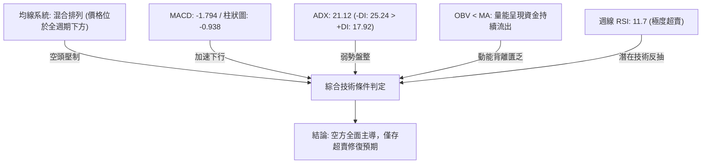

---

### 📈 移動平均線排列分析

從均線走勢火花圖觀察：
* **MA5 / MA10 / MA20**：走勢圖呈現 `██████▇▇▆▅▄▄▃▃▃▂▂▁▁`，短期均線自高位崩塌，斜率持續向下彎折。
* **MA60 / MA120 / MA240**：中長期均線進入平緩並轉向空頭排列，價格目前運行於 MA20、MA50 與 MA200 之下方。

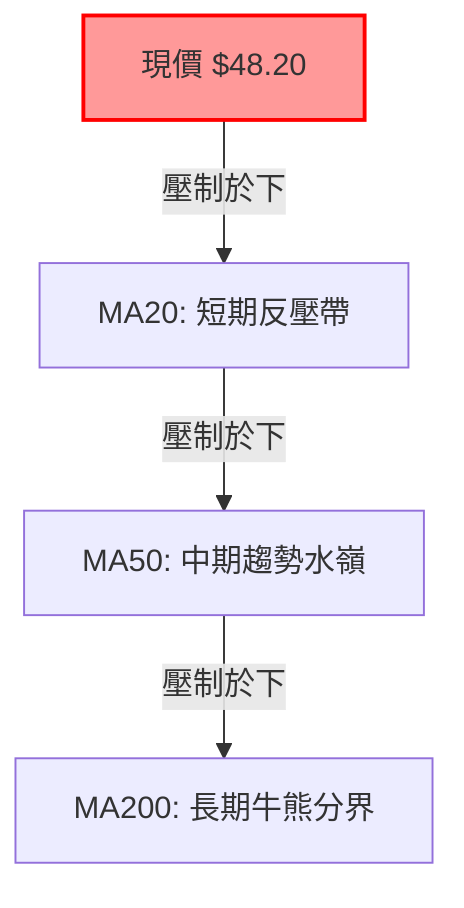

| 均線天期 | 相對現價位置 | 走勢斜率 | 市場意義 |
|:---|:---:|:---:|:---|
| **MA20** | 價格下方壓制 | 向下 | 短期均線壓制，空方主導短線節奏 |
| **MA50** | 價格下方壓制 | 向下 | 中期多空分水嶺，尚未見到走平或拐頭跡象 |
| **MA200** | 價格下方壓制 | 走平轉下 | 長期多頭架構已被徹底瓦解 |

---

### 📉 RSI(14) 分析

* **日線 RSI(14)**：數據快照顯示 N/A（評定為中性 30-70 區間）。
* **週線 RSI(14)**：最新讀數呈現劇烈波動：自 2026-08-16 的 76.7（嚴重超買）斷崖式下跌至 2026-09-06 的 **11.7**。

```
週線 RSI(14) 狀態進度條：
極度超賣 (11.7)
[██░░░░░░░░░░░░░░░░░░] 11.7%
0      20        40        60        80      100
▲ 當前位置
```

* **背離分析結論**：價格從 2026-07 的 $46.03 跌至近期 $47.82，週線 RSI 則由 47.6 驟降至 11.7，**未出現多頭底背離**（Bullish Divergence），屬於隨價格加速下挫引發的動能同步宣洩。超賣讀數僅代表短線賣壓過度集中，不保證立即反轉。

---

### 📊 MACD(12,26,9) 訊號解讀

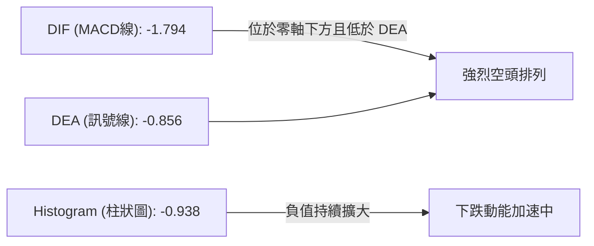

* **讀數解析**：MACD 線（-1.794）遠低於訊號線（-0.856），柱狀圖為 -0.938。
* **技術意涵**：在零軸下方形成的二次死叉帶有強烈殺傷力，說明自 $64.58 開啟的回調浪目前仍處於空頭動能擴散期，尚未出現紅柱收斂或金叉收窄跡象。

---

### 📦 布林通道分析

> 說明：由於日線布林通道數值未直接給出，依據 MA20 軌跡與週線價格波動範圍（上下振幅 $46.03 ~ $64.58）建立布林通道帶示意模型：

```
KTOS 布林通道價格運行示意圖
$65.00 ── 上軌 (Upper Band) ───────────────────────── 反彈壓力區 ($64.58)
          │
$55.00 ── 中軌 (MA20) ─────────────────────────────── 多空平衡軸線
          │
$48.20 ── 當前價格位置 ───► ● (現價貼近下軌邊緣，承壓運行)
          │
$45.00 ── 下軌 (Lower Band) ───────────────────────── 支撐帶 ($46.00)
$43.09 ── 極限軌道外防線 ──────────────────────────── 52週低點
```

* **軌道狀態**：現價 $48.20 深度貼近下軌邊界，布林帶開口呈現向下擴張態勢，屬於典型的空頭弱勢推動結構。

---

### 💹 成交量分析（量價配合度）

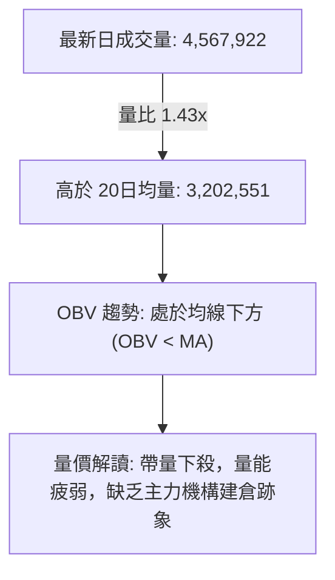

* **量比表現**：最新成交量 4.56M，相較 20 日均量（3.20M）放大 1.43 倍。在下跌陰線中放量，代表低位承接盤雖有進場，但仍被恐慌性賣壓壓制。
* **OBV 表現**：OBV 指標明確處於移動平均線下方，確認資金淨流出，量價結構完全不支持短期單邊反轉。

---

## 6. 動能與波動率

### ⚡ 動能評估四象限

| 象限 | 動能維度 | 波動維度 | 當前狀態 | 策略方針 |
|:---:|:---:|:---:|:---:|:---|
| **Q1** | 強動能 (Bullish) | 低波動 (Low Vol) | — | 穩定單邊上行，持股加碼 |
| **Q2** | 弱動能 (Bearish) | 低波動 (Low Vol) | **✓ (當前定位)** | **弱勢陰跌盤整，ADX=21.12，防禦為上** |
| **Q3** | 強動能 (Bullish) | 高波動 (High Vol) | — | 高度投機拉升，嚴控回撤 |
| **Q4** | 弱動能 (Bearish) | 高波動 (High Vol) | — | 崩跌恐慌出逃，全面空倉 |

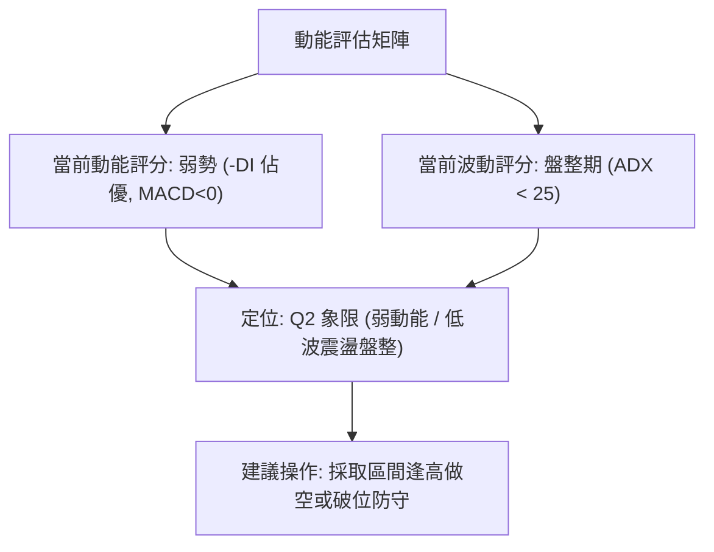

---

### 📊 ATR 波動率分析與止損測算

* **歷史波動參照**：近 20 週平均週振幅約在 $5.00 ~ $8.00 區間。
* **止損距離建議**：依據 $48.20 基準價位，建議以 1.5 倍標準波動空間作為緩衝界限：
  * **多頭試盤止損距離**：必須嚴格設於 52W 低點 $43.09 之下，即以 $42.50 作為絕對離場點（距離現價約 $5.70，即 11.8% 空間）。
  * **空頭防守止損距離**：以近期反彈平台破位點 $52.00 為止損界限（距離現價 $3.80，即 7.8% 空間）。

---

### 📐 Beta 與市場相關性

* **Beta 係數**：**1.113**
* **解讀**：KTOS 之系統性風險略高於美股大盤（S&P 500）。當大盤出現修正時，KTOS 預期將承受 1.11 倍的同向波動；考慮到當前防禦板塊與軍工題材資金分化，KTOS 弱於大盤的相對強度（Relative Weakness）使其在指數回檔時面臨更高的下行測試風險。

---

## 7. 多時框架總結

### 📋 時框架評分表

| 時框架 | 趨勢方向 | 動能狀態 | 均線系統 | 圖表形態 | 綜合評分 | 操作指引 |
|:---|:---:|:---:|:---:|:---:|:---:|:---|
| **長期 (月線)** | 🔴 下行通道 | 弱勢回落 | 混合跌破 | 頂部回撤 | **30/100** | 宏觀偏空，長期均線支撐轉阻力 |
| **中期 (週線)** | 🔴 箱體下緣 | 極度超賣 | 空頭排列 | 下降三角形 | **35/100** | 考驗年度低點 $43.09，反彈逢高受壓 |
| **短期 (日線)** | 🟡 盤整探底 | MACD 死叉 | 空頭排列 | 低位十字星 | **40/100** | ADX=21.12 盤整，等待方向破位 |

---

### 🔲 綜合訊號矩陣

```
┌─────────────────────────────────────────────────────────────┐
│ 多時框指標共振分析矩陣                                       │
├──────────────┬──────────────┬──────────────┬────────────────┤
│ 指標類別     │ 短期 (日線)   │ 中期 (週線)   │ 長期 (月線)     │
├──────────────┼──────────────┼──────────────┼────────────────┤
│ 主導趨勢     │ 🟡 弱勢盤整  │ 🔴 空頭承壓  │ 🔴 下跌中繼    │
│ MACD 訊號    │ 🔴 死叉發散  │ 🔴 零下弱勢  │ 🟡 高位回落    │
│ RSI 狀態     │ 🟡 中性平整  │ 🟢 極度超賣  │ 🔴 跌破50中軸   │
│ 量能結構     │ 🔴 OBV 走弱  │ 🔴 縮量陰跌  │ 🔴 高位放量滯漲│
├──────────────┼──────────────┼──────────────┼────────────────┤
│ 共振評定     │ 空方佔優 (偏空震盪)                            │
└──────────────┴──────────────┴──────────────┴────────────────┘
```

---

### ⚖️ 多時框收斂結論

依據多時框收斂原則與趨勢強度判定：
1. **行情屬性判定**：當前 ADX(14) 讀數為 **21.12 (< 25)**，嚴格定義為**盤整弱勢震盪行情**，而非單邊強趨勢行情。
2. **時框主導優先級**：在盤整行情中，日線布林通道與近期上下邊界（$46.03 ~ $64.58）構成主要震盪箱體，但由於週線中長期趨勢均處於空頭排列，下軌防守脆弱度極高。
3. **唯一方向性結論**：**中性偏空觀望（Bearish Neutral）**。
   * 綜合評分為 **35/100（≤40）**，依策略路由規則，報告**主推順勢偏空操作／反彈受阻放空策略**，多頭僅能作為嚴守極限止損的極短線超賣反抽對沖提示。

---

## 8. 交易策略建議

### 🗺️ 策略決策流程圖

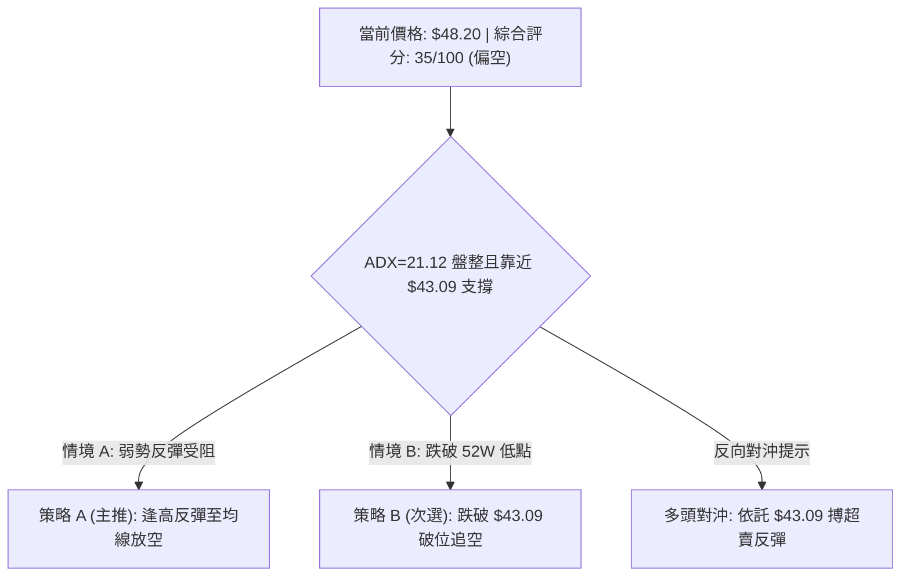

> **當前主策略方向**：**偏空交易為主（依評分 35/100 路由分流）**

---

### 🎯 價格情境階梯（Price Scenarios）

> 所有關鍵價位**嚴格引用斐波那契回調計算位與 52W 極限值**：

| 觸發條件 | 第一目標 | 後續延伸 | 情境意涵解讀 |
|:---|:---:|:---:|:---|
| **向上突破 R1 $62.54** | R2 $77.82 | R3 $88.55 | 中期築底成功，擺脫 52W 低位危局，全面轉強 |
| **維持於現價 $48.20 附近** | $46.03 (箱底) | $62.54 (Fib 78.6%) | 低位弱勢收斂，反覆整固，缺乏單邊推動力 |
| **向下失守 S1 $43.09** | 形態目標 $27.48 | 數據中未偵測到 | **歷史結構徹底瓦解，引發流動性真空與斷崖式探底** |

---

### 📊 情境機率分佈

| 情境劇本 | 發生機率 | 主要判定依據 |
|:---|:---:|:---|
| **情境一：延續弱勢震盪，探底測試 $43.09** | **55%** | MACD 負向擴大、-DI=25.24 壓制、OBV<MA 資金持續退潮 |
| **情境二：依託前低反彈，測試 R1 $62.54** | **30%** | 週線 RSI 達 11.7 極度超賣，量比 1.43x 低位出現承接抵抗 |
| **情境三：直接放量擊穿 $43.09 展開主跌** | **15%** | 系統性風險爆發或財報利空，引發機構去槓桿拋售 |

---

### 🟢 主策略詳情（空頭防守與順勢佈局）

依綜合評分 35/100，主策略設定為**防守性放空／反彈阻力空**：

| 策略要素 | 策略 A（反彈受阻放空 — 核心主推） | 策略 B（破位追空 — 條件觸發） |
|:---|:---:|:---:|
| **策略類型** | 順勢逢高沽空 | 關鍵支撐破位跟進 |
| **進場條件** | 價格反彈至短線壓力區且日K出現長上影線 | 日線收盤價實質跌破 52W 低點 $43.09 |
| **進場價格** | **$55.00**（反彈回測中軌反壓帶） | **$42.50**（確認破位跌穿 $43.09） |
| **目標價 T1** | **$46.03**（箱體下軌支撐區） | **$35.00**（整數心理關口） |
| **目標價 T2** | **$43.09**（52W 歷史低點極限） | **$27.48**（箱體垂直幅度 1:1 量度目標） |
| **止損價格** | **$62.54**（嚴格設於 Fib 78.6% 阻力上方） | **$46.03**（假突破回抽箱體下緣即離場） |
| **風險報酬比** | **1 : 1.58**（風控 $7.54，獲利空間 $11.91） | **1 : 4.25**（風控 $3.53，獲利空間 $15.02） |
| **成功機率** | **60%** | **45%**（恐慌盤中需防假破位） |
| **建議倉位** | **10% ~ 15%** | **5% ~ 8%（嚴控槓桿）** |

---

### 🔴 反向風險觸發點（多頭反轉對沖提示）

若出現以下訊號，空頭策略必須**無條件全面停損平倉**，評估反手多頭交易：
1. **價位觸發點**：日線帶量收盤**實質站穩 $62.54（斐波那契 78.6% 位）**，宣佈近半年下行通道徹底打破。
2. **指標確認點**：日線 MACD 於零軸下方出現金叉，且柱狀圖翻紅超過 3 個交易日；ADX 拐頭上行突破 25，且 +DI 上穿 -DI。
3. **超賣極限反彈操作（激進型）**：現價 $48.20 輕倉試多者，止損位必須嚴格定在 **$43.00**（跌破 52W 低點立即砍倉），第一目標看 **$62.54**，嚴禁向下攤平。

---

### ⭐ 整體訊號強度評星

```
╔══════════════════════════════════════════════════════════════╗
║ 做多訊號強度：★★☆☆☆  (2/5 星 - 僅具備技術性極度超賣修復潛能)  ║
║ 做空訊號強度：★★★★☆  (4/5 星 - 均線與動能共振偏空，壓制顯著)  ║
║ 整體可信度：  ★★★☆☆  (3/5 星 - 處於盤整區，需等待前低測試結果)║
╚══════════════════════════════════════════════════════════════╝
```

---

## 9. 風險提示與監控

### ✅ 關鍵監控指標 Checklist

```
╔══════════════════════════════════════════════════════════════╗
║              交易風控與關鍵指標監控清單 (Checklist)           ║
╠══════════════════════════════════════════════════════════════╣
║ [ ] 52W 低點防守：每日收盤是否跌破 $43.09？（破位啟動止損） ║
║ [ ] 週線 RSI(14)：讀數是否由 11.7 回升至 30 以上完成鈍化？   ║
║ [ ] MACD 柱狀圖：負值 -0.938 是否出現縮短收斂？              ║
║ [ ] ADX(14) 讀數：是否自 21.12 向上暴增至 25？（趨勢爆發）  ║
║ [ ] 成交量異常：成交量是否激增至 50日均量（3.81M）之 2倍以上？║
║ [ ] 阻力測試：反彈觸及 $62.54 是否出現長上影線滯漲？         ║
╚══════════════════════════════════════════════════════════════╝
```

---

### ⚠️ 風險場景分析

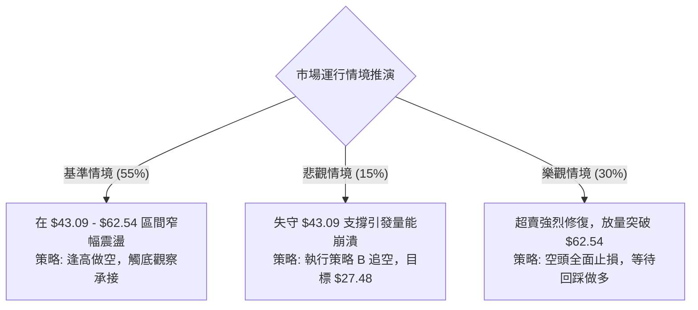

---

### 🛡️ 風險管理重要提醒

1. **基本面與估值背離風險**：
   KTOS 目前 Trailing P/E 高達 274.94，EV/EBITDA 達 86.55，自由現金流為負（$-118.29M）。在基本面估值偏高且缺乏正向自由現金流的背景下，股價向下修正往往具有估值均值回歸的慣性，切忌因「跌幅已深」而盲目重倉抄底。
2. **分析師共識預期差**：
   市場分析師共識評級為 `strong_buy`，平均目標價高達 **$104.20**（最低目標亦有 $60.00）。然而**技術面走勢目前與分析師預期存在嚴重背離**。在技術結構出現放量翻轉前，應以盤面真實價格行為（Price Action）為最高準則，防範投行調降評級引發的二次殺跌風險。
3. **倉位配置原則**：
   在 ADX < 25 且價格臨近歷史防線的盤整階段，單一方向曝險部位不得超過總資產之 **10%**，並應預留充足現金以應對價格擊穿 $43.09 造成的非理性波動。

---

## 📋 報告總結

```
╔══════════════════════════════════════════════════════════════╗
║                  KTOS 技術分析核心結論綱領                   ║
╠══════════════════════════════════════════════════════════════╣
║ 報告日期：2026-09-10                                         ║
║ 當前價格：$48.20                                             ║
║ 分析評級：🔴 偏空震盪 / 測試關鍵支撐 (Bearish Neutral)       ║
╠══════════════════════════════════════════════════════════════╣
║ 關鍵趨勢結論：                                               ║
║ ├─ 長期趨勢：🔴 自 $103.01 頂部回撤 53%，宏觀下行趨勢未改     ║
║ ├─ 中期趨勢：🔴 週線反彈高點遞減，均線全面形成反壓          ║
║ ├─ 短期趨勢：🟡 ADX=21.12 盤整震盪，現價貼近 52W 低點邊緣   ║
║ ├─ 關鍵支撐：$43.09 (52W 歷史極限防線)                       ║
║ ├─ 關鍵阻力：$62.54 (78.6% 斐波那契首要壓制位)               ║
║ └─ 機構共識：分析師目標均價 $104.20 (目前與盤面結構嚴重脫節) ║
╠══════════════════════════════════════════════════════════════╣
║ 最優執行策略組合：                                           ║
║ 1. 🥇 最佳機會 (策略 A)：等待反彈至 $55.00 阻力帶分批佈局做空║
║    止損位: $62.54 ｜ 目標價: $46.03 / $43.09                 ║
║ 2. 🥈 次選機會 (策略 B)：跌破 $43.09 歷史底線順勢追空        ║
║    止損位: $46.03 ｜ 目標價: $35.00 / $27.48                 ║
║ 3. 🥉 保守選擇：完全空倉觀望，靜待 $43.09 防守結果與量能確認 ║
╚══════════════════════════════════════════════════════════════╝
```

---

> ⚠️ **免責聲明**：本報告由量化技術分析系統自動生成，內容基於市場公開歷史交易數據與技術指標公式計算。本報告僅供學術研究與投資參考，**絕不構成任何個人化的投資要約、招攬或具體買賣建議**。金融市場瞬息萬變，技術指標存在滯後性與失效風險，投資人應獨立評估自身風險承受能力並自負盈虧。

---
*報告生成基準：2026-09-10 ｜ 數據來源：Yahoo Finance ｜ 分析框架：多時框技術分析模型*