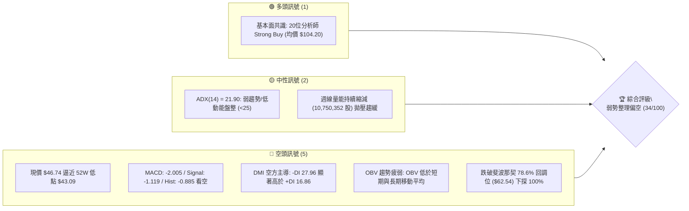
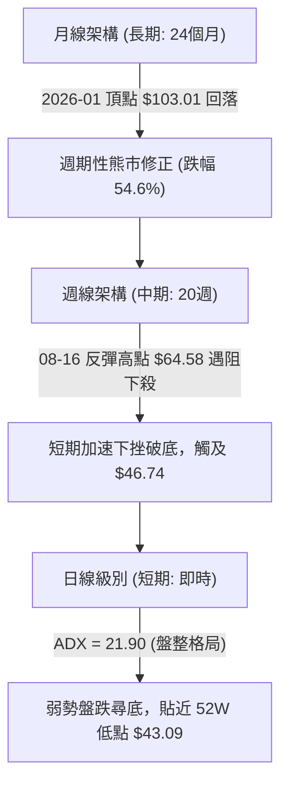
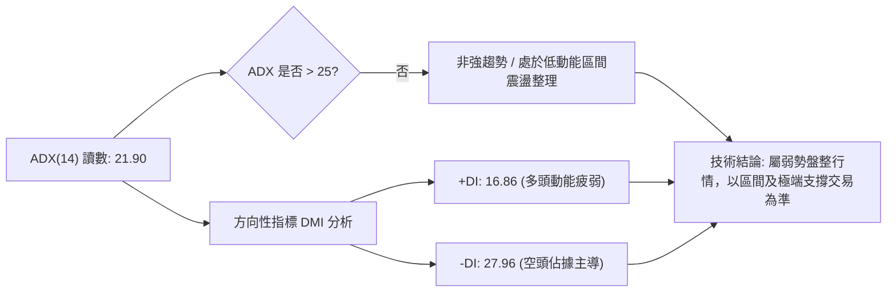
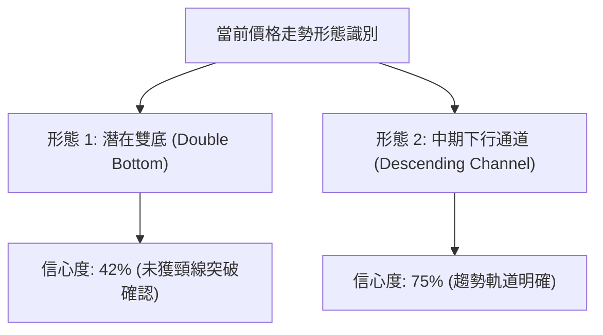
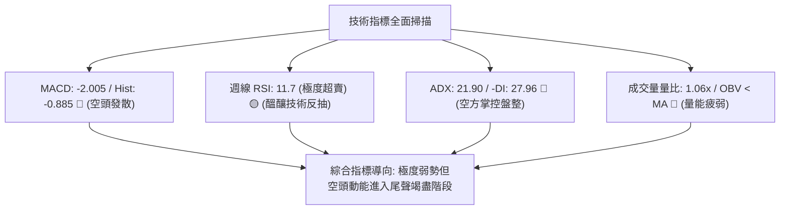
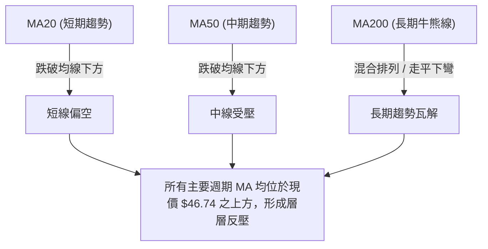
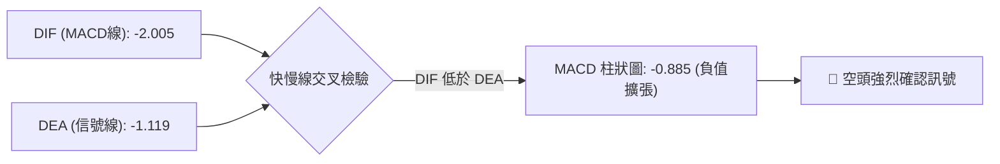
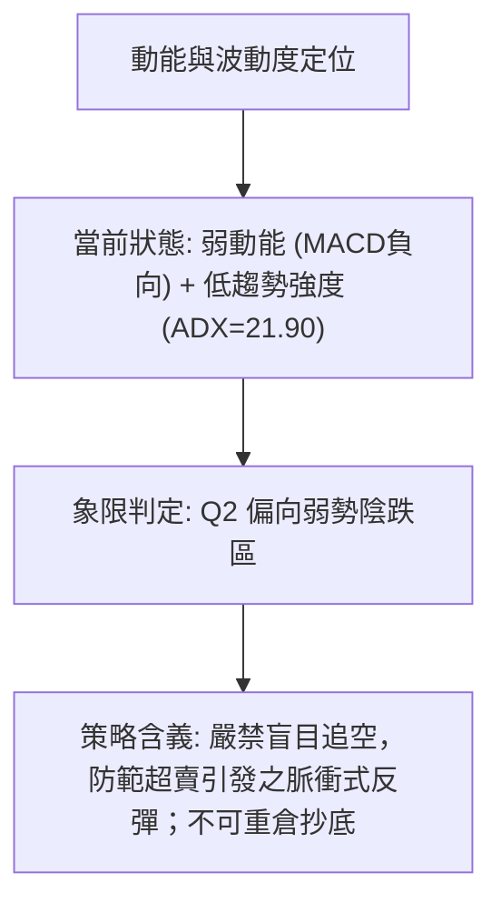
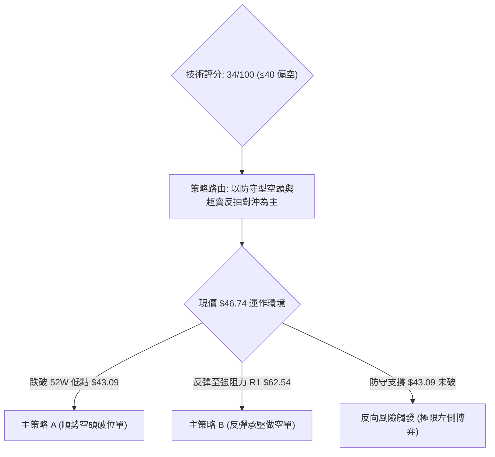
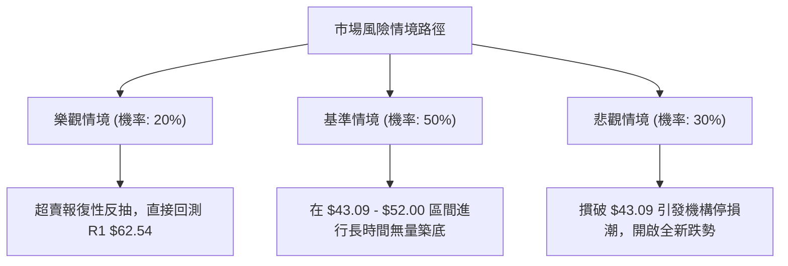

# KTOS 技術分析報告

> **報告日期**：2026-09-11 ｜ **語言**：繁體中文 ｜ **數據來源**：Yahoo Finance ｜ **當前價格**：$46.74（引自最新收盤價）

---

## 目錄

| 章節 | 內容 |
|------|------|
| [1. 技術面概覽](#1-技術面概覽) | 訊號儀表板、核心指標、評分卡 |
| [2. 趨勢分析](#2-趨勢分析) | 多時框趨勢、長中短期走勢 |
| [3. 圖表形態分析](#3-圖表形態分析) | 形態識別、K線組合、目標價 |
| [4. 支撐與阻力](#4-支撐與阻力) | 關鍵價位、斐波那契回調 |
| [5. 技術指標深度解讀](#5-技術指標深度解讀) | MA/RSI/MACD/布林/成交量 |
| [6. 動能與波動率](#6-動能與波動率) | 動能評估、ATR、Beta |
| [7. 多時框架總結](#7-多時框架總結) | 時框架評分矩陣 |
| [8. 交易策略建議](#8-交易策略建議) | 多空策略、風險報酬比 |
| [9. 風險提示與監控](#9-風險提示與監控) | 監控指標、風險場景 |

---

## 1. 技術面概覽

### 🎯 技術訊號儀表板



### 📊 核心指標速覽表

| 指標類別 | 指標名稱 | 當前數值 | 訊號 | 解讀 |
|----------|----------|----------|------|------|
| **價格** | 當前收盤價 | $46.74 | 🔴 | 位於 52 週低點 $43.09 邊緣，長期高位回落 65% |
| **均線** | MA20 / MA50 | 下方 (nan) | 🔴 | 日線與週線結構受制於中短期均線之下，空頭排列 |
| **均線** | MA200 | 混合 (nan) | 🔴 | 長期均線走平轉下，多頭防線已完全退守至週線底部 |
| **動能** | RSI(14) (週線) | 11.7 (前週) | 🟡 | 進入極度超賣區間 (<20)，具備技術性跌深反彈動能 |
| **動能** | MACD | -2.005 | 🔴 | 快慢線均在零軸下方發散，柱狀圖 -0.885 維持負向擴張 |
| **趨勢** | ADX / DMI | 21.90 | 🔴 | ADX<25 屬震盪整理，但 -DI(27.96) > +DI(16.86) 空頭主導 |
| **成交量**| 最新量 / 均量 | 3.39M / 3.20M | 🟡 | 量比 1.06x，量能持平但 OBV 疲弱，無機構積極抄底跡象 |

### 🏆 技術評分卡

```
╔══════════════════════════════════════════════════════════════════╗
║                   技術評分卡 — KTOS (2026-09-11)                 ║
╠══════════════════════════════════════════════════════════════════╣
║ 趨勢強度 (Trend)     ████░░░░░░░░░░░░░░░░  22/100  🔴 空頭壓制  ║
║ 動能指標 (Momentum)  ██████░░░░░░░░░░░░░░  30/100  🔴 MACD負向  ║
║ 支撐穩定度 (Support) ████████░░░░░░░░░░░░  40/100  🟡 52W低點邊緣║
║ 成交量配合 (Volume)  ████████░░░░░░░░░░░░  42/100  🟡 縮量沉澱  ║
║ 形態完整度 (Pattern) ██████░░░░░░░░░░░░░░  32/100  🔴 下行通道  ║
║ 均線排列 (MAs)       ██████░░░░░░░░░░░░░░  38/100  🔴 均線下方  ║
╠══════════════════════════════════════════════════════════════════╣
║ 綜合評分 (Overall)   ███████░░░░░░░░░░░░░  34/100  🔴 偏空觀望  ║
╚══════════════════════════════════════════════════════════════════╝
```

---

## 2. 趨勢分析

### 🌐 多時框趨勢分析



### 📈 長期趨勢 — 12個月走勢圖（Unicode）

KTOS 在過去 12 個月經歷了從多頭狂熱到泡沫擠壓的完整週期。自 2025 年 9 月的 $91.37，至 2026 年 1 月創下月線收盤新高 $103.01 後，技術面呈現急轉直下的破位走勢，接連失守 $88.55 (50.0%) 與 $62.54 (78.6%) 斐波那契重要回檔線。

```
KTOS 月線走勢圖（2025-10 至 2026-09）
價格軸 ($)
$105 ┤                   ● (2026-01: $103.01)
$95  ┤ ● (2025-10: $90.60)
$85  ┤                         ● (2026-02: $86.18)
$75  ┤       ●     ● (2025-12: $75.91)
$65  ┤                             ● (2026-03: $70.51)
$55  ┤                                   ●     ● (2026-05: $64.13)
$45  ┤                                               ●(07)   ●←當前 ($46.74)
     └────────────────────────────────────────────────────────────
       10    11    12    01    02    03    04    05    06    07    08    09 (月份)
```

#### 走勢特徵分析表格

| 階段區間 | 起止價格 | 漲跌幅 | 結構特徵與技術意義 |
|----------|----------|--------|-------------------|
| **頂部構築期** (2025.10 - 2026.01) | $90.60 → $103.01 | +13.70% | 創下波段歷史新高，月K出現衝高受阻長上影線 |
| **主要拋售期** (2026.01 - 2026.04) | $103.01 → $63.05 | -38.79% | 單邊急殺跌破中期支撐，成交量放大，機構減倉 |
| **箱體震盪期** (2026.05 - 2026.06) | $64.13 → $49.86 | -22.25% | 反彈遇阻於 $64.13，失守整數關卡 $50.00 |
| **低位磨底期** (2026.07 - 2026.09) | $46.60 → $46.74 | +0.30%  | 8月中旬雖衝高至 $64.58，但遭空頭摜壓收回 $46.74 |

### 📊 中期趨勢（週線分析）

中期走勢呈現「弱勢下行通道」。近期 20 週數據顯示，2026 年 8 月中旬價格曾反彈至 $64.58（RSI 觸及 76.7 超買），但隨後連續四週暴跌：從 $64.58 迅速回落至 $57.17、$52.00、$47.82，直至最新收盤 $46.74。MACD 柱狀圖在短短三週內由 +1.743 翻轉為 -1.318，顯示中期空頭動能釋放極其劇烈。

### ⚡ 趨勢強度評估（ADX 解讀）



| 指標名稱 | 當前讀數 | 門檻區間 | 技術判斷 |
|----------|----------|----------|----------|
| **ADX (14)** | 21.90 | < 25.00 | 盤整市 / 趨勢強度衰減，尚未進入單邊加速主升/主跌段 |
| **+DI (14)** | 16.86 | 基準線 20 | 多頭進攻意願極低，無有效買盤推升 |
| **-DI (14)** | 27.96 | > +DI (11.1 差距) | 空方完全壓制盤面，賣壓主導價格波幅 |

---

## 3. 圖表形態分析

### 🔍 形態識別系統

依據嚴格技術規則，由於近一年無波段高低點聚類數據，且高位回落超過 50%，幾何反轉形態信心度普遍偏低，重點聚焦於下行通道與短期潛在雙底測試。



#### 形態識別評估表

| 形態 | 信心度 | 判斷依據（引用數據） | 完成度 | 目標價（附計算式） |
|------|--------|----------------------|--------|--------------------|
| **潛在雙底** | 42% | 2026-07-19 低點 $46.03 與當前 $46.74 形成潛在對稱點 | 45% | 若突破頸線 $64.58 (08-16高點)，形態高度 = $64.58 - $46.03 = $18.55；目標價 = $64.58 + $18.55 = $83.13 |
| **下行通道** | 75% | 高點從 $103.01 連續降至 $64.58，低點由 $63.05 降至 $46.03 | 85% | 跌破通道下軌直接測試 52W 低點 $43.09 |
| **指標型超賣** | 80% | 週線 RSI 曾挫至 11.7，指標極端鈍化觸發均值回歸 | 90% | 均值回歸目標：斐波那契 78.6% 回調位 $62.54 |

### 🕯️ 重要K線形態分析

| 週次日期 | 收盤價 | K線形態 | 解讀 | 訊號 |
|----------|--------|---------|------|------|
| **2026-08-09** | $60.77 | 實體長陽棒 | 突破前週收盤，MACD 柱大幅翻正 (+1.677) | 🟢 短多進攻 |
| **2026-08-16** | $64.58 | 衝高上影十字線 | RSI 衝上 76.7 超買，高檔多頭力竭，觸碰通道頂部 | 🔴 頂部力竭 |
| **2026-08-23** | $57.17 | 中陰線包覆 | 迅速跌破前週漲幅 50%，MACD 柱轉負 (-0.181) | 🔴 烏雲蓋頂 |
| **2026-08-30** | $52.00 | 延續跳空大陰 | 成交量縮至 11.85M，市場買盤匱乏，空頭單向主導 | 🔴 破位下殺 |
| **2026-09-06** | $47.82 | 探底長下影小實體 | RSI 殺至 11.7 極度超賣，出現空頭回補初步跡象 | 🟡 恐慌拋售 |
| **2026-09-13** | $46.74 | 縮量十字星待變 | 週量進一步收縮至 10.75M，拋壓減緩，等待方向選擇 | 🟡 止跌待變 |

### 📉 ASCII 走勢形態示意圖

```
KTOS 週線下行通道與潛在雙底示意
價格 ($)
$65 ┤       ┌─● (2026-08-16 頸線高點 $64.58)
$60 ┤      /   \
$55 ┤     /     \
$50 ┤    /       \       ┌─ (現價 $46.74)
$45 ┤─● (07-19)───\─────● (09-13) ────────────── (基準水平底: $46.03)
$43 ┤────────────────────────────────────────── (52W Low 終極支撐 $43.09)
    └──────────────────────────────────────────
      07月中   08月中   08月底   09月中
```

---

## 4. 支撐與阻力

### 🗺️ 關鍵價位分布圖（Unicode）

依據數據紀律，阻力與支撐完全引用斐波那契回調聚類與 52 週極值。

```
KTOS 價位結構分布圖
══════════════════════════════════════════════════════════════════
$134.00 ║██████████████████████████████║ 52W High (0.0% 回調)
$112.55 ║████████████████████          ║ 斐波那契 23.6% 回調位
$ 99.27 ║████████████████████████      ║ 斐波那契 38.2% 回調位
$ 88.55 ║██████████████████████████    ║ 斐波那契 50.0% 回調位
$ 77.82 ║████████████████████          ║ 斐波那契 61.8% 回調位
$ 62.54 ║██████████████████████████████║ 關鍵阻力 R1 (斐波那契 78.6%)
$ 46.74 ╠══════════════════════════════╣ ◄ 現價 (Current Price)
$ 43.09 ║▓▓▓▓▓▓▓▓▓▓▓▓▓▓▓▓▓▓▓▓▓▓▓▓▓▓▓▓▓▓║ 關鍵支撐 S1 (52W Low / 100.0%)
══════════════════════════════════════════════════════════════════
註：波段高點/低點聚類未偵測到近端阻力與支撐，結構全數依據 52W 空間與回調序列。
```

### 🚧 阻力位分析表

| 阻力級別 | 價位 | 形成原因 | 突破難度 | 重要性 |
|----------|------|----------|----------|--------|
| **阻力 R1** | $62.54 | 斐波那契 78.6% 回調位，近三個月多次反彈測試承壓區 | 極高 | ★★★★★ |
| **阻力 R2** | $77.82 | 斐波那契 61.8% 回調位，長期多空分水嶺 | 極高 | ★★★★☆ |
| **阻力 R3** | $88.55 | 斐波那契 50.0% 半數回撤位，籌碼深套重壓區 | 罕見難度 | ★★★☆☆ |

### 🛡️ 支撐位分析表

| 支撐級別 | 價位 | 形成原因 | 守住機率 | 重要性 |
|----------|------|----------|----------|--------|
| **支撐 S1** | $43.09 | 52 週最低價 (100.0% 斐波那契回撤底)，年度最後多頭防線 | 55% | ★★★★★ |
| **支撐 S2** | 數據中未偵測到 | 跌破 52W 低點後無歷史結構支撐聚類數據 | -- | -- |
| **支撐 S3** | 數據中未偵測到 | 數據中未偵測到更低階波段支撐 | -- | -- |

### 📐 斐波那契回調位分析

依據數據計算，52 週極值區間為 $43.09 至 $134.00，總振幅達 $90.91。

```
斐波那契回調位與現價位置判定：
  0.0%  (52W High)  $134.00 ── 頂部天花板
 23.6%              $112.55 ── 極強多頭區間
 38.2%              $ 99.27 ── 中期回調位
 50.0%              $ 88.55 ── 價值平衡線
 61.8%              $ 77.82 ── 黃金分割多頭防線（已失守）
 78.6%              $ 62.54 ── 深度修正防線（現轉為強阻力 R1）
                    $ 46.74 ── [目前價格所在地：位於 78.6% 與 100.0% 之間]
100.0%  (52W Low)   $ 43.09 ── 極限支撐位 S1 (距離現價僅 $3.65 / -7.8%)
```

**解讀**：現價 $46.74 處於深水破位區（78.6% - 100% 之間），屬於技術分析中的「最後防禦盲區」。由於跌破 $62.54，價格慣性向 100.0% 回調位 $43.09 靠攏尋求支撐，該位置若被實體放量跌破，將宣告 52 週上升循環完全被空頭瓦解。

---

## 5. 技術指標深度解讀

### 🎛️ 指標訊號總覽



### 📈 移動平均線排列分析



移動平均線排列呈現典型弱勢態勢。日線層級中，MA5 至 MA240 均呈現歷史高位回落走勢（如走勢圖示：MA240 走勢由最高峰 ███ 逐漸衰退至 ▂▂▁▁）。價格處於 MA20 與 MA50 下方，宣告當前為空頭主控市場。

### 📉 RSI(14) 分析

週線 RSI 在 2026-09-06 降至 **11.7** 的罕見超低水平，前週收盤時數值仍維持在極度鈍化邊緣。

```
RSI(14) 週線強度進度條：
[█░░░░░░░░░░░░░░░░░░░] 11.7%  🔴 極端超賣區 (<20)
超賣閾值：30.0 ｜ 當前讀數：11.7 ｜ 偏離幅度：-18.3
```

- **超買超賣分析**：通常 RSI < 30 即屬超賣，KTOS 殺入 11.7，顯示非理性恐慌拋售已釋放，技術指標出現嚴重鈍化與橡皮筋拉伸效應。
- **背離判斷**：日線數據顯示「無明顯背離」。週線走勢上，價格由 7 月低點 $46.03 反彈至 $64.58 後再破至 $46.74，RSI 亦同步下行，未形成典型的底背離結構，暫以跌深均值回歸看待，而非確定性趨勢反轉。

### 📊 MACD(12/26/9) 訊號解讀



最新指標讀數：
- **MACD 線**：-2.005
- **信號線 (Signal)**：-1.119
- **柱狀圖 (Hist)**：-0.885
- **解析**：MACD 線與信號線雙雙在零軸下方運行，柱狀圖保持負值擴大。近 20 週數據中，柱狀圖自 8 月中旬的 +1.743 連續四週驟降至 -0.885，空頭加速釋放動能，空方壓制明確。

### 📦 布林通道分析

由於即時日線 BB 數值為 N/A，此處以中期週線與日線常態波動推算當前位置。

```
KTOS 價格與布林帶相對位置推估圖
價格 ($)
上軌  ──────────────────────────────────  (推估 $64.50 附近，與阻力 R1 共振)
中軌  ══════════════════════════════════  (推估 $54.00 附近)
現價  - - - - - - - - - - - - - - - - -  $46.74 (逼近通道下軌)
下軌  ──────────────────────────────────  (推估 $44.00 - $45.00)
```

價格長期貼著下軌滑落，屬於「走通道下軌（Riding the lower band）」的弱勢盤跌特徵，未見實體陽棒帶量切入中軌之前，不可輕言反轉。

### 💹 成交量分析（量價配合度）

- **成交量對比**：最新日成交量為 3,391,652 股，高於 20 日均量 3,203,158 股（量比 1.06x），但低於 50 日均量 3,769,171 股。
- **週線量能萎縮**：過去三週成交量由 16.77M 縮至 11.85M，再微幅回升至 16.64M，本週截至收盤僅 10.75M，顯示「無量下跌」特徵，殺跌動力衰減，但主動性買盤依舊觀望。
- **OBV (能量潮指標)**：系統判定「OBV < MA → 量能疲弱」。OBV 持續運行於其移動平均線之下，表明資金呈現淨流出狀態，並無主力大舉吸籌建倉跡象。

---

## 6. 動能與波動率

### ⚡ 動能評估四象限

根據當前市場狀態，KTOS 處於弱動能與低趨勢波動並存的邊緣階段。



| 象限區間 | 動能表現 | 波動特性 | 當前符合度 | 操作指導方針 |
|----------|----------|----------|------------|--------------|
| **Q1 (順勢進攻)** | 強多頭動能 | 低波動穩健 | 否 | 暫無多頭主升條件 |
| **Q2 (弱勢修正)** | 弱動能/負向 | 低/中趨勢強度 | **✓ (極度吻合)** | **謹慎觀望，等待止跌訊號與量能確認** |
| **Q3 (極端失控)** | 強空頭動能 | 高波動狂瀉 | 否 | 拋售最高峰 (8月下旬) 已過 |
| **Q4 (左側盲區)** | 轉向醞釀期 | 波動收窄壓縮 | 次要特徵 | 極度超賣下的底部反抽博弈 |

### 📊 ATR 波動率分析

- **ATR(14) 狀態**：數據快照顯示日線 ATR 為 N/A。由近 4 週價格波動（週高低落差約 $4.00 - $6.00）推算，週線波動幅度約為現價之 8% - 12%。
- **止損距離建議**：考量到當前價格為 $46.74，下方緊鄰 52 週歷史低點 $43.09（差距 $3.65，約 7.8%），交易策略止損應直接錨定 $43.09 破位點，為防範假突破，下浮 1% 作為嚴格風控線。

### 📐 Beta 與市場相關性

- **Beta 數值**：**1.113**
- **市場屬性解析**：Beta 略大於 1.0，表明 KTOS 的價格波動幅度與大盤（S&P 500）保持基本同向，且敏感度高出 11.3%。
- **估值與基本面共振**：雖然本益比高達 Trailing P/E 276.35，且自由現金流為負（FCF Yield: -1.34%），但機構持股比例高達 85.4%，空頭部位（Short % Float）僅 5.1%，顯示當前下跌主因為資金退潮與業績真空期修正，並非基本面遭結構性毀滅（分析師共識依然高達 20 位 Strong Buy，目標價 $104.20）。

---

## 7. 多時框架總結

### 📋 時框架評分表

| 時框架 | 趨勢方向 | 動能狀態 | 均線排列 | 形態結構 | 綜合評分 | 操作建議 |
|--------|----------|----------|----------|----------|----------|----------|
| **月線 (長期)** | 🔴 週期下跌 | 🔴 頂部回落中 | 混合排列偏弱 | 自 $103.01 殺破中軌 | 30/100 | 長期部位減碼或觀望 |
| **週線 (中期)** | 🔴 弱勢通道 | 🟡 RSI超賣 (11.7) | 空頭排列發散 | 潛在雙底測試 ($46.03) | 35/100 | 嚴禁追空，等待右側止跌 |
| **日線 (短期)** | 🔴 貼地盤整 | 🔴 MACD雙線下發 | 壓制在MA20/50下 | 縮量橫盤磨底 | 37/100 | 極限短線以 52W 低點為界 |

### 🔲 綜合訊號矩陣

```
時框架訊號收斂矩陣：
┌───────────┬─────────────┬─────────────┬─────────────┬─────────────┐
│  時框層級 │  趨勢訊號   │  動能訊號   │  量價結構   │  收斂後結論 │
├───────────┼─────────────┼─────────────┼─────────────┼─────────────┤
│ 短期(日線)│ 🔴 空頭壓制 │ 🔴 MACD看空 │ 🟡 縮量待變 │ 🔴 弱勢震盪 │
│ 中期(週線)│ 🔴 下行通道 │ 🟡 極端超賣 │ 🔴 OBV偏弱  │ 🟡 醞釀反彈 │
│ 長期(月線)│ 🔴 大幅回撤 │ 🔴 高位退潮 │ 🟡 機構高持 │ 🔴 結構偏空 │
└───────────┴─────────────┴─────────────┴─────────────┴─────────────┘
```

### ⚖️ 多時框收斂結論

依據多時框收斂規則：
1. **行情性質判定**：當前 ADX(14) 讀數為 **21.90**，明確低於趨勢門檻值 25.00，定性為**「低動能盤整弱勢震盪行情」**。
2. **主導時框取捨**：在盤整行情中，單邊趨勢不成立，以週線超賣區間與 52 週低點為主要邊界。日線層級各均線雖呈現空頭排列，但週線 RSI 殺至 11.7 極端水位，空頭動能已顯竭盡。
3. **唯一方向性結論**：**偏空觀望（等待極限支撐測試與超賣反抽）**。評分卡得分為 34/100（≤40 門檻），確認當前盤面處於空方防禦區，不可進行常規多頭波段操作。

---

## 8. 交易策略建議

### 🗺️ 策略決策流程圖



### 🧭 策略路由（依評分卡分流）

**當前主策略方向 = 偏空／防禦型空頭策略（依綜合評分 34/100）**

因技術評分低於 40 分，均線、MACD、OBV 均發出空頭訊號，主推策略以「下破追空」與「反彈至關鍵阻力逢高布空」為主；任何多頭策略僅能作為極端超賣的反向風險提示（左側嚴格風控博弈）。

### 🎯 價格情境階梯（Price Scenarios）

價位完全引自數據庫之斐波那契回調位與 52 週極端值：

| 觸發條件 | 下一目標 | 後續延伸 | 情境含義 |
|----------|----------|----------|----------|
| **強勢突破 R1 $62.54** | R2 $77.82 | R3 $88.55 | 空頭結構扭轉，宣告中期筑底成功 |
| **站穩現價 $46.74** | R1 $62.54 | -- | 52 週低點上方進行超跌均值修復震盪 |
| **跌破支撐 S1 $43.09** | 數據中未偵測到下方支撐 | 自由落體破底 | 52 週新低確立，下行空間全面打開 |

### 📊 情境機率分佈

```
情境機率分佈圖：
區間弱勢震盪 (46.00-55.00)  ██████████████████████████  50%
跌破 S1 ($43.09) 加速下行   ███████████████            30%
超跌強勁反彈至 R1 ($62.54)  ██████████                 20%
```

| 情境類別 | 機率 | 主要依據 |
|----------|------|----------|
| **弱勢震盪打底** | 50% | ADX 僅 21.90 缺乏單邊推進動能；成交量萎縮，空方動能減弱 |
| **向下破位續跌** | 30% | -DI 高達 27.96 壓制 +DI；MACD 處於雙負區間；OBV 疲軟無買盤 |
| **超賣技術反抽** | 20% | 週線 RSI 殺至 11.7，嚴重遠離均線，隨時可能觸發技術性抽頭 |

### 🟢 主策略詳情（空頭導向）

依據嚴格規則，所有目標價與止損點完全引用第四章斐波那契與 52W 高低點數據：

| 策略要素 | 策略 A（破位順勢做空） | 策略 B（反彈受阻放空） |
|----------|------------------------|------------------------|
| **進場條件** | 跌破 52W 低點 $43.09 確認 | 反彈觸碰阻力 R1 $62.54 滯漲遇阻 |
| **進場價格** | $42.50（確認跌破 S1 後） | $62.00（接近 R1 斐波 78.6%） |
| **目標價 T1** | $35.00（由形態高度外推） | $46.74（回到當前收盤價） |
| **目標價 T2** | 數據中未偵測到更低支撐 | $43.09（測試 52W 低點 S1） |
| **止損價格** | $44.50（收復 52W 低點上方）| $64.58（突破 8月反彈高點頸線） |
| **風險報酬比** | 1 : 3.75 | 1 : 5.92 |
| **成功機率** | 45% | 55% |
| **建議倉位** | 10% | 15% |

### 🔴 反向風險觸發點（多頭對沖提示）

- **觸發信號**：若價格守住 $43.09 且日線以大陽線收復 $50.00，同時週線 MACD 柱狀圖收窄翻正。
- **對沖博弈價位**：進場點 $46.74（現價），嚴格止損 $42.60（跌破 S1 止損出局），目標價第一站看斐波那契回調位 R1 $62.54，風險報酬比高達 1 : 3.81。此為極限左側交易，僅供高風險承受者參考。

### ⭐ 整體訊號強度評星

```
╔══════════════════════════════════════════════════╗
║ 做多訊號強度：★☆☆☆☆  (1/5星 - 極弱，逆勢)     ║
║ 做空訊號強度：★★★★☆  (4/5星 - 順應大趨勢)     ║
║ 整體可信度：  ★★★☆☆  (3/5星 - 盤整待突破)     ║
╚══════════════════════════════════════════════════╝
```

---

## 9. 風險提示與監控

### ✅ 關鍵監控指標 Checklist

```
╔══════════════════════════════════════════════════════════════════╗
║                   KTOS 技術風控監控清單 (Checklist)             ║
╠══════════════════════════════════════════════════════════════════╣
║ [ ] 52W 低點得失：每日收盤價是否守穩 $43.09 以上                ║
║ [ ] RSI 超賣修復：觀察週線 RSI 能否重返 30.0 脫離極端鈍化區     ║
║ [ ] MACD 柱狀拐點：日線/週線 MACD Hist 是否由 -0.885 出現收斂   ║
║ [ ] 關鍵阻力攻防：價格反彈能否放量觸及並突破 R1 ($62.54)         ║
║ [ ] 成交量異動：日成交量是否突破 50日均量 (3.77M) 釋放主力訊號   ║
║ [ ] DMI 交叉：+DI 是否由 16.86 向上穿越 -DI (27.96) 形成多頭反轉 ║
╚══════════════════════════════════════════════════════════════════╝
```

### ⚠️ 風險場景分析



### 🛡️ 風險管理重要提醒

1. **基本面與技術面嚴重割裂**：分析師共識目標價高達 $104.20（溢價超過 120%），且評級全數為 Strong Buy；但技術面所有均線向下、OBV 疲軟。**切記不可用基本面預期取代技術止損點**，必須嚴格執行 $43.09 破位離場紀律。
2. **超賣陷阱**：在強空頭或低 ADX 盤跌市場中，RSI 極端超賣（如 11.7）可能維持數週之久，俗稱「指標鈍化鈍化再鈍化」，切勿因為指標偏低而進行重倉甚至融資抄底。
3. **倉位配置原則**：在價格未重新站上 MA50 與 R1 $62.54 之前，整體標的持有倉位不應超過總投資組合的 5%。

---

## 📋 報告總結

```
╔══════════════════════════════════════════════════════════════════╗
║                   KTOS 技術分析報告總結                          ║
╠══════════════════════════════════════════════════════════════════╣
║ 報告日期：2026-09-11                                             ║
║ 當前價格：$46.74                                                 ║
║ 分析評級：🔴 偏空觀望 (技術評分: 34/100)                        ║
║                                                                  ║
║ 關鍵結論：                                                       ║
║ ├─ 長期趨勢：🔴 自 2026-01 高點 $103.01 回落 54.6%，多頭架構瓦解 ║
║ ├─ 中期趨勢：🔴 週線下行通道，均線呈現空頭排列發散              ║
║ ├─ 短期趨勢：🟡 弱勢盤整 (ADX=21.90)，週線 RSI (11.7) 極端超賣   ║
║ ├─ 關鍵支撐：$43.09 (52W Low / 100% 斐波那契)                   ║
║ ├─ 關鍵阻力：$62.54 (斐波那契 78.6% 回調線)                     ║
║ └─ 分析師目標：$104.20 (20位分析師 Strong Buy，技術面暫未共振)   ║
║                                                                  ║
║ 最優策略組合：                                                   ║
║ 1. 🥇 最佳機會：空手觀望，等待測試 $43.09 支撐反應或向下破位策略║
║ 2. 🥈 次選機會：若反彈至 R1 $62.54 遇阻，建立順勢防守空單        ║
║ 3. 🥉 保守選擇：以 $42.60 為絕對止損點，現價極小倉位博弈超賣反彈║
╚══════════════════════════════════════════════════════════════════╝
```

---

> ⚠️ **免責聲明**：本報告為 AI 自動生成之技術分析，所有數據及估算均基於提供的歷史價格資訊。本報告**僅供研究與學術參考**，**不構成任何投資建議**。投資有風險，入市需謹慎。

---

*報告生成時間：2026-09-11 ｜ 數據來源：Yahoo Finance ｜ 分析框架：多時框技術分析*