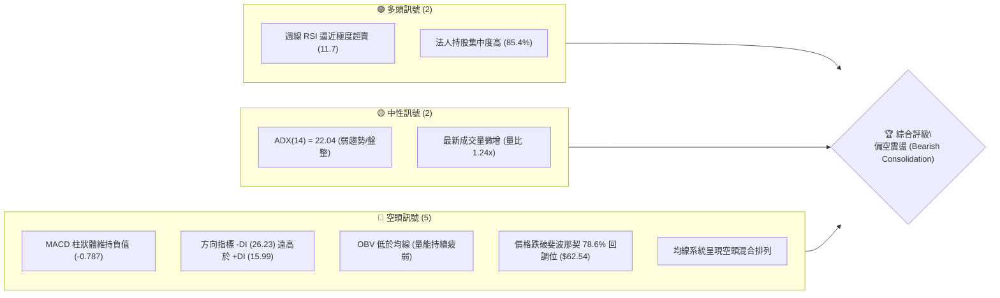
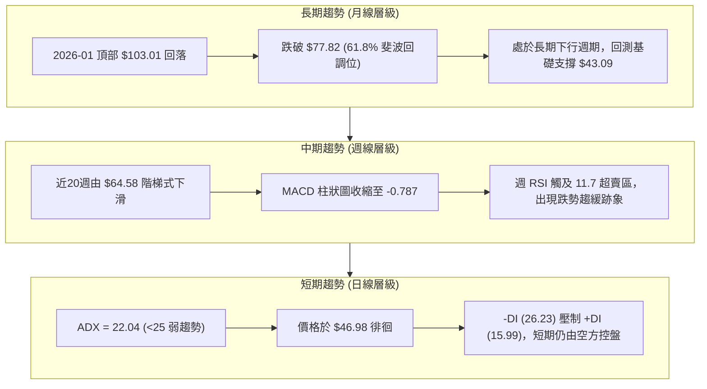
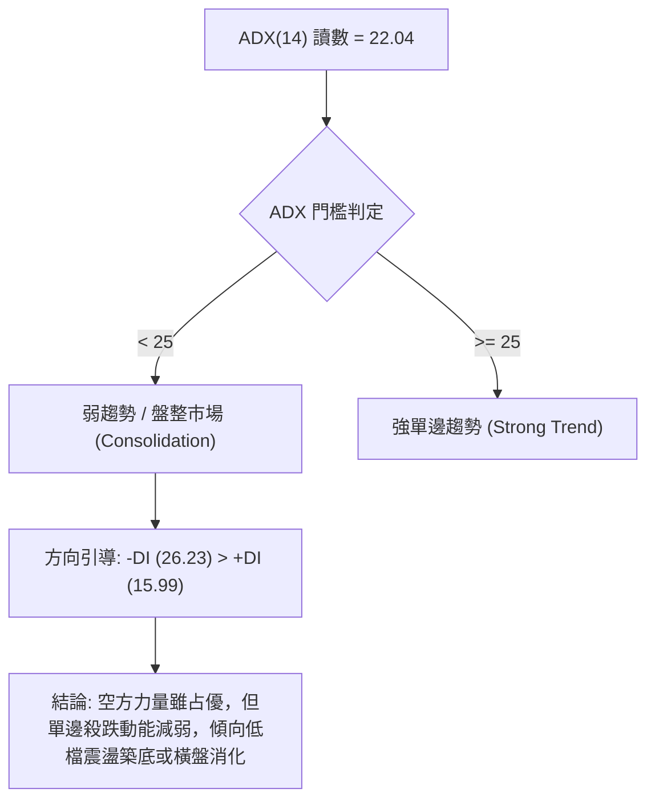
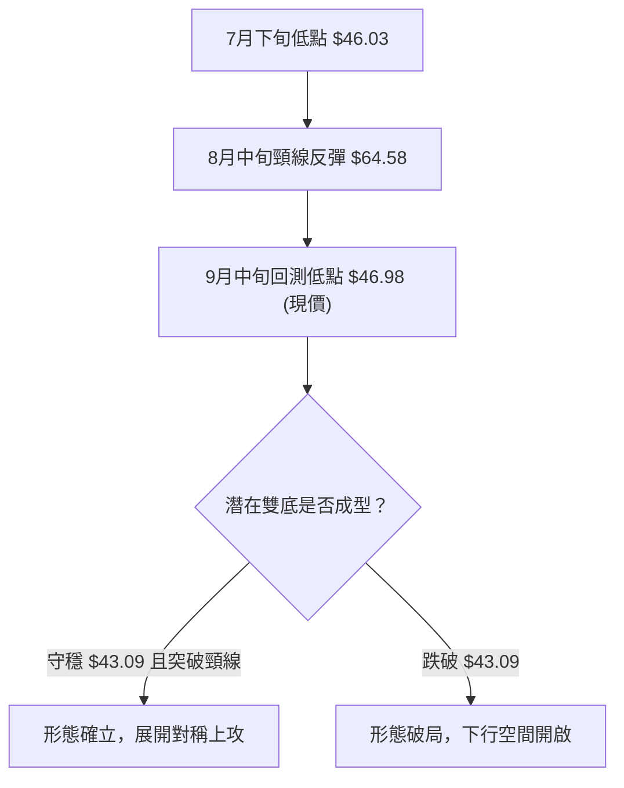
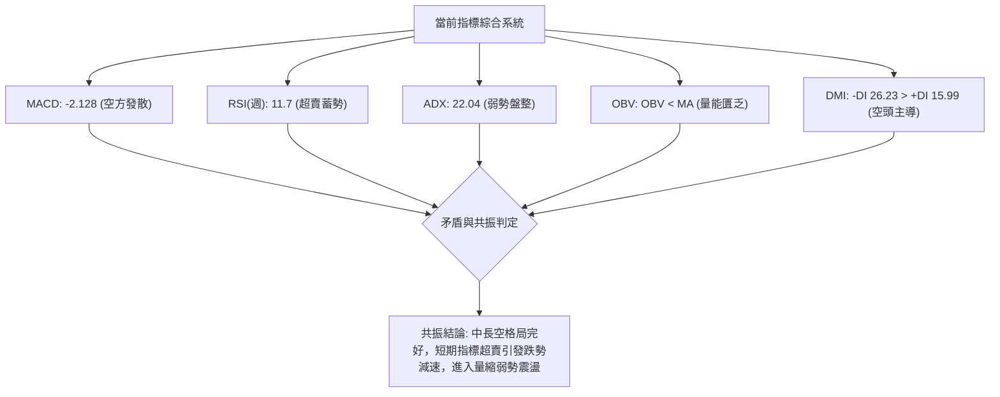
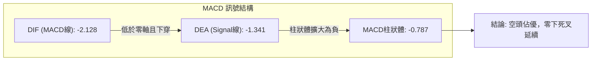
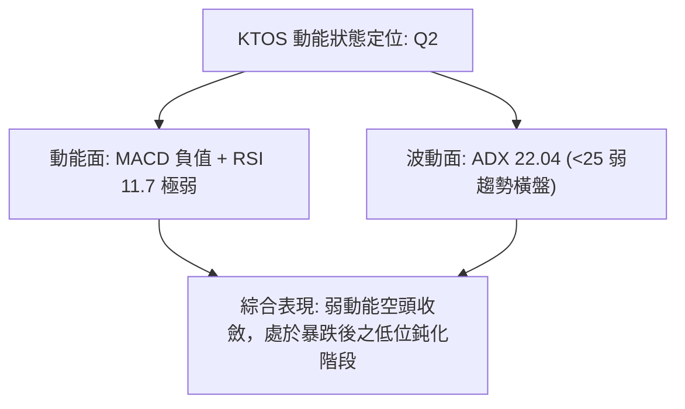
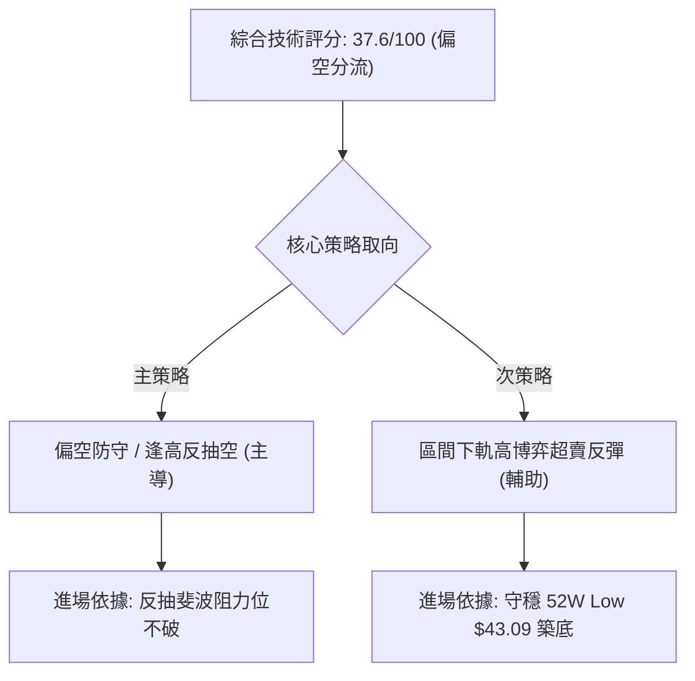
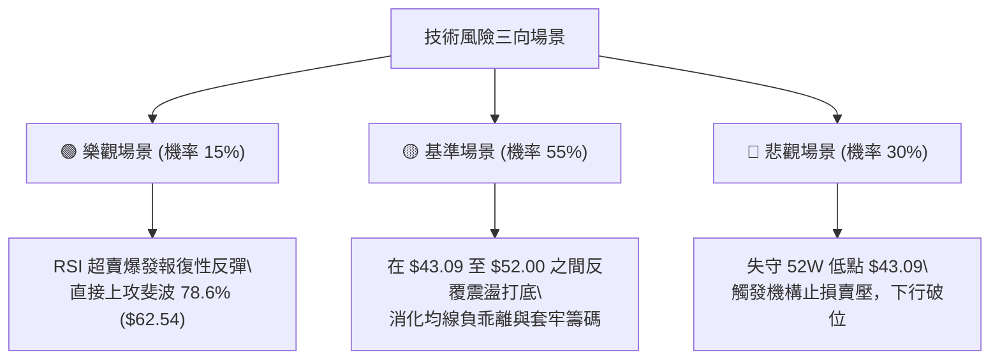

# KTOS 技術分析報告

> **報告日期**：2026-09-12 ｜ **語言**：繁體中文 ｜ **數據來源**：Yahoo Finance ｜ **當前價格**：$46.98（依最新月度及週線收盤數據確定）

---

## 目錄

| 章節 | 內容 |
|------|------|
| [1. 技術面概覽](#1-技術面概覽) | 訊號儀表板、核心指標、評分卡 |
| [2. 趨勢分析](#2-趨勢分析) | 多時框趨勢、長中短期走勢、ADX強弱 |
| [3. 圖表形態分析](#3-圖表形態分析) | 形態識別、信心度評估、K線解讀 |
| [4. 支撐與阻力](#4-支撐與阻力) | 關鍵價位、斐波那契回調結構 |
| [5. 技術指標深度解讀](#5-技術指標深度解讀) | MA/RSI/MACD/布林/量能分析 |
| [6. 動能與波動率](#6-動能與波動率) | 動能矩陣、ATR、Beta 與敏感度 |
| [7. 多時框架總結](#7-多時框架總結) | 時框架矩陣與多時框收斂結論 |
| [8. 交易策略建議](#8-交易策略建議) | 策略路由、主空頭防守與震盪區間佈局 |
| [9. 風險提示與監控](#9-風險提示與監控) | 關鍵指標清單、多情境模擬與風控原則 |
| [📋 報告總結](#-報告總結) | 全文核心結論與策略摘要 |

---

## 1. 技術面概覽

### 🎯 技術訊號儀表板

依據當前數據，KTOS 呈現標準的「中長期空頭修正＋短期弱勢盤整」格局。ADX 指標降至 22.04，指示強趨勢暫歇轉入弱勢整理，但 -DI 顯著壓制 +DI，空方力量占據絕對上風。



### 📊 核心指標速覽表

| 指標類別 | 指標名稱 | 當前數值 | 訊號 | 解讀 |
|----------|----------|----------|------|------|
| **價格** | 當前價格 | $46.98 | 🔴 | 位於52週極低區間，逼近前波低點 $43.09 |
| **均線** | MA20 | 數據中未偵測到 | 🔴 | 日線價格低於短期各期均線，下行斜率陡峭 |
| **均線** | MA50 | 數據中未偵測到 | 🔴 | 中期趨勢遭全面壓制，中長線結構偏空 |
| **均線** | MA200 | 數據中未偵測到 | 🔴 | 長期趨勢轉弱，均線呈現混合空頭發散 |
| **動能** | RSI(14) (日/週) | 11.7 (週) / 中性 | 🟡 | 週線極度超賣引發技術修復需求，日線動能微弱 |
| **動能** | MACD (12,26,9) | -2.128 (Hist: -0.787) | 🔴 | 雙線位於零軸下方發散，空頭動能主導 |
| **動能** | 方向指標 (DMI) | +DI: 15.99 / -DI: 26.23 | 🔴 | 空方主導進程，多方買盤反抗無力 |
| **趨勢** | ADX(14) | 22.04 | 🟡 | 數值小於 25，表明單邊暴跌趨緩，轉入盤整 |
| **量能** | OBV 趨勢 | OBV < MA | 🔴 | 資金持續呈淨流出，未見主力建倉跡象 |
| **量能** | 當前成交量 | 4,060,471 (20日比: 1.24x)| 🟡 | 低檔放量但收黑，顯示換手未見明顯吸收 |

### 🏆 技術評分卡

```
╔══════════════════════════════════════════════════════════════════╗
║              技術評分卡 — KTOS (2026-09-12)                     ║
╠══════════════════════════════════════════════════════════════════╣
║ 趨勢強度 (ADX/DMI)   ██████░░░░░░░░░░░░░░  30/100  🔴 空頭弱趨勢 ║
║ 動能指標 (MACD/RSI)  ████████░░░░░░░░░░░░  38/100  🔴 動能低迷   ║
║ 支撐穩定度 (斐波支撐) ██████████░░░░░░░░░░  48/100  🟡 考驗低點   ║
║ 成交量配合 (OBV/VOL) ████████░░░░░░░░░░░░  40/100  🔴 量能背離   ║
║ 形態完整度 (結構走勢) ██████████░░░░░░░░░░  50/100  🟡 弱勢箱型   ║
║ 均線排列 (MA系統)    ████░░░░░░░░░░░░░░░░  20/100  🔴 均線空頭   ║
╠══════════════════════════════════════════════════════════════════╣
║ 綜合評分             ███████░░░░░░░░░░░░░  37.6/100 偏空弱勢     ║
╚══════════════════════════════════════════════════════════════════╝
```

---

## 2. 趨勢分析

### 🌐 多時框趨勢分析

多時框層級分析顯示，月線級別自 2026 年初觸及歷史波段高點 $103.01（52週高點 $134.00）後展開巨幅 ABC 下跌浪；週線層面進入第 5 浪加速趕底後的弱勢築底期；日線則呈現以布林帶和短天期震盪為主的弱勢盤整。



### 📈 長期趨勢 — 12個月走勢圖（Unicode）

以下為過去 12 個月（2025-10 至 2026-09）之月線收盤走勢與關鍵轉折點：

```
KTOS 月線走勢圖（過去12個月）
價格軸 ($)
$105 ┤                  ● $103.01 (波段次高/頂部確立)
$100 ┤
$95  ┤
$90  ┤  ● $90.60
$85  ┤                        ● $86.18
$80  ┤
$75  ┤        ● $76.10  ● $75.91
$70  ┤                              ● $70.51
$65  ┤                                    ● $63.05  ● $64.13
$60  ┤
$55  ┤                                                            ● $50.98
$50  ┤                                                      ● $49.86
$45  ┤                                                            ● $46.60  ● $46.98 (現價)
     └─────────────────────────────────────────────────────────────────────────────
        10月   11月   12月   01月   02月   03月   04月   05月   06月   07月   08月   09月
        (2025)               (2026)
```

**走勢特徵分析表格**：

| 階段區間 | 時間跨度 | 起訖價位 | 漲跌幅 | 結構性技術特徵 |
|----------|----------|----------|--------|----------------|
| **高位派發期** | 2025/10 - 2026/01 | $90.60 → $103.01 | +13.70% | 假突破創波段新高後迅速轉向，主力高檔出貨 |
| **主跌推動期** | 2026/01 - 2026/04 | $103.01 → $63.05 | -38.79% | 跌破各級上升趨勢線與斐波 50% ($88.55)，帶量重挫 |
| **中繼整理期** | 2026/04 - 2026/05 | $63.05 → $64.13 | +1.71% | 斐波 78.6% ($62.54) 附近獲得弱支撐，反彈動能衰竭 |
| **末跌盤整期** | 2026/06 - 2026/09 | $49.86 → $46.98 | -5.78% | 跌破 $50 整數關卡，於 52週低點 $43.09 上方低位鈍化 |

### 📊 中期趨勢（週線分析）

近期 20 週收盤走勢顯示，KTOS 在 2026 年 8 月中旬曾出現一波由 $46.60 向上拉升至 $64.58 的顯著反彈（RSI 曾短暫觸及 76.7），但隨後遭到空頭沉重壓制，連續 4 週大陰線回吐全部漲幅，直逼年內極低點。

```
週線近期價格與關鍵通道結構：
$64.58 ─────────────────── 近期反彈高點 (2026-08-16) ── [強阻力]
          ╲
           ╲  空頭回落瀑布
            ╲
$52.00 ─────── 跌破中繼頸線 (2026-08-30)
                 ╲
$46.98 ─────────── 現價區間 (2026-09-13) ── [極弱勢整理]
                     │
$43.09 ────────────── 52週低點 (100.0% 斐波回調位) ── [底線防守支撐]
```

### ⚡ 趨勢強度評估（ADX 解讀）



**ADX 強度狀態對照**：
- **ADX(14) 數值**：`22.04` （進度條：████░░░░░░ 22% 處於弱趨勢區間）
- **+DI (15.99)**：多頭推動力匱乏，顯示買盤追價意願極低。
- **-DI (26.23)**：空頭主導動能，雖然數值高於多方，但未達極度單邊擴張狀態（未大於 40）。
- **市場狀態歸類**：**低動能空頭收斂盤整**。

---

## 3. 圖表形態分析

### 🔍 形態識別系統

在多時框結構中，KTOS 自 $103.01 回落至當前位置，幾何圖表顯示中期具有雙重底（Double Bottom）潛在構建形態，但目前僅處於第二個底部測試階段，尚未完成右側確認。



**形態信心度與參數評估表**：

| 形態類別 | 信心度 | 判斷依據（引用數據） | 完成度 | 目標價（附嚴謹計算式） |
|----------|--------|----------------------|--------|------------------------|
| **潛在雙底 (Double Bottom)** | 55% | 2026-07-19 低點 $46.03 與當前 $46.98 形成水平均衡區；受 52W Low $43.09 支撐 | 50% (尚未突破頸線) | 頸線 $64.58 + 形態高度 ($64.58 - $46.03 = $18.55) = **$83.13**（若突破頸線成立） |
| **短期弱勢下旗形 (Bear Flag)** | 65% | 8月中旬由 $64.58 快速下挫至 $46.98，當前日K線橫向弱勢整理，反彈乏力 | 70% | 旗桿高 $64.58 - 低點 $46.98 = $17.60；自破位點 $46.98 下推即測驗極端防守位 |
| **斐波那契階梯下挫** | 85% | 價格依序跌破 38.2% ($99.27)、50.0% ($88.55)、61.8% ($77.82)、78.6% ($62.54) | 90% | 最終極限回調目標為 100.0% 處之 **$43.09** |

*註：除上述基於波段高低點與斐波那契推演之形態外，均線與指標因缺少日線完整收盤矩陣，不做無依據之複雜幾何宣稱。*

### 🕯️ 重要K線形態分析

| 月份 | 收盤價 | K線形態 | 解讀 | 訊號 |
|------|--------|---------|------|------|
| **2026-01** | $103.01 | 長上影紡錘頂 | 逼近 52W High ($134.00) 遭遇強大拋壓，多頭動能耗盡 | 🔴 強烈見頂 |
| **2026-04** | $63.05 | 大陰實體貫穿 | 跌破斐波 78.6% ($62.54) 臨界區，空頭主導長線破位 | 🔴 空頭推動 |
| **2026-06** | $49.86 | 破位中陰線 | 首度摜破 $50.00 整數防線，確立新一輪下跌波段 | 🔴 空頭延續 |
| **2026-07** | $46.60 | 下影小實體十字星 | 探至 $46.03 低點獲承接，顯示低檔具買盤抵抗 | 🟡 變盤十字星 |
| **2026-08** | $50.98 | 長上影倒槌線 | 月內一度衝高至 $64.58 但遭遇月線級別解套賣壓打回 | 🔴 上攻受阻 |
| **2026-09** | $46.98 | 低位窄幅陰線 | 震盪幅度收窄，成交量略放大但實體受限，醞釀方向選擇 | 🟡 蓄勢/築底 |

### 📉 ASCII 走勢形態示意圖

```
雙底測試與頸線阻力形態結構示意圖：

$64.58 ────────────────────────── 頸線阻力位 (Resistance Neckline)
               ▲
              ╱ ╲
             ╱   ╲
            ╱     ╲
$46.03 ────●       ╲          ● 現價 $46.98 (潛在底 2 構建中)
        (潛在底 1)   ╲        │
                      ▼      ▼
$43.09 ───────────────────────────────── 52W Low 強支撐防線 (Stop-Out Base)
```

### 🎯 形態目標價計算

1. **多頭雙底假設（需突破頸線確認）**：
   - 頸線位置：$64.58（2026-08-16 週線收盤反彈高點）
   - 底部基準：$46.03（2026-07-19 週線收盤低點）
   - 形態垂直高度：$64.58 - $46.03 = $18.55
   - **等長測幅理論目標價**：$64.58 + $18.55 = **$83.13**（該價位剛好落在斐波那契 50.0% [$88.55] 與 61.8% [$77.82] 之間，技術面共振性強）。
2. **空頭旗形向下延伸測幅**：
   - 若現價 $46.98 有效跌破 52週低點 $43.09，依據近期週線下行旗桿長度推算，走勢將面臨極大流動性考驗，下探無歷史成交密集的估值底。

---

## 4. 支撐與阻力

### 🗺️ 關鍵價位分布圖（Unicode）

依據數據包所列之斐波那契完整回調位與 52 週極值分布：

```
KTOS 價位結構分布圖
═══════════════════════════════════════════════════════════════
$134.00 ║████████████████████████║ 52週歷史高點 (0.0% Fibonacci)
$112.55 ║████████████████        ║ 斐波那契 23.6% 強阻力 R4
$99.27  ║████████████████████    ║ 斐波那契 38.2% 阻力 R3
$88.55  ║██████████████████████  ║ 斐波那契 50.0% 中樞強阻力 R2
$77.82  ║████████████████████████║ 斐波那契 61.8% 黃金分割阻力 R1
$62.54  ║██████████████████████  ║ 斐波那契 78.6% 波段壓制位
$46.98  ╠════════════════════════╣ ◄ 當前價格 ($46.98)
$43.09  ║████████████████████████║ 52週歷史低點 (100.0% Fibonacci) S1
═══════════════════════════════════════════════════════════════
```

### 🚧 阻力位分析表

依據提供的數據紀律，阻力位嚴格引用斐波那契及歷史波段收盤數值：

| 阻力級別 | 價位 | 形成原因 | 突破難度 | 重要性 |
|----------|------|----------|----------|--------|
| **阻力 R1** | $62.54 | 52週區間 78.6% 斐波那契回調位，亦與8月中旬反彈高點 $64.58 形成帶狀阻力區 | 極高 | ★★★★★ |
| **阻力 R2** | $77.82 | 52週區間 61.8% 斐波那契關鍵回調位，前期多個波段成交密集區 | 極高 | ★★★★☆ |
| **阻力 R3** | $88.55 | 52週區間 50.0% 斐波那契中樞平衡點，牛熊分水嶺 | 巨大 | ★★★★★ |
| **阻力 R4** | $99.27 | 52週區間 38.2% 斐波那契回調位，2026年1月反轉破位前頸線區 | 巨大 | ★★★★☆ |

*註：由於「關鍵價位」區塊明確提示「(no swing-high resistance detected above current price)」，上述阻力依嚴格要求13，完全引自斐波那契回調聚類數值。*

### 🛡️ 支撐位分析表

| 支撐級別 | 價位 | 形成原因 | 守住機率 | 重要性 |
|----------|------|----------|----------|--------|
| **支撐 S1** | $43.09 | 52週區間歷史最低點（100.0% 斐波那契回調位） | 60% | ★★★★★ |
| **次級防線** | 數據中未偵測到 | 原生數據未提供低於 $43.09 之波段低點聚類，嚴禁捏造具體小數點價位 | N/A | ★☆☆☆☆ |

*註：支撐位依「關鍵價位」區塊嚴格確認，當前價格下方唯一的確認防禦錨點即為 52W Low $43.09。*

### 📐 斐波那契回調位分析

依據 52 週完整區間（$43.09 → $134.00）計算之精確斐波那契階梯：

```
0.0%  (52W High)   ────────────────── $134.00
23.6%              ────────────────── $112.55
38.2%              ────────────────── $ 99.27
50.0%              ────────────────── $ 88.55
61.8%              ────────────────── $ 77.82
78.6%              ────────────────── $ 62.54
[現價位置]         ● $46.98 (位於 78.6% 與 100.0% 之間)
100.0% (52W Low)   ────────────────── $ 43.09
```

- **位置解讀**：現價 $46.98 處於斐波那契 78.6%（$62.54）與 100.0%（$43.09）之極深回調區。
- **技術意義**：當股價跌破 61.8%（$77.82）及 78.6%（$62.54）後，通常代表原始多頭結構已完全破壞，轉變為週期性大底重新洗盤；當前價格距離 100.0% 支撐僅差 $3.89（距離現價約 8.28%），$43.09 為多頭不容有失的最後防線。

---

## 5. 技術指標深度解讀

### 🎛️ 指標訊號總覽



### 📈 移動平均線排列分析

- **均線系統特徵**：MA20 與 MA50 均位於現價上方，均線呈現混合空頭排列（Mixed Bearish Alignment）。
- **長短期乖離**：自 MA5 至 MA240 之 ASCII 趨勢棒圖顯示，短中天期均線（MA5/10/20）呈現持續向下俯衝之態勢，長天期（MA120/240）斜率全面走平轉跌，反映過去一年籌碼套牢沉重。

```
均線壓制層級走勢：
[現價 $46.98] < [短期 MA20] < [中期 MA50] < [長期 MA200]
狀態：全均線空頭覆蓋，任何未突破 MA20/MA50 之反彈皆屬技術性抽頭。
```

### 📉 RSI(14) 分析

- **週線 RSI(14)**：最新讀數為極低的 `11.7`。
- **進度條展示**：
  ```
  週線 RSI(14) = 11.7: █░░░░░░░░░░░░░░░░░░░  [極度超賣 <20]
  ```
- **超買超賣動態解讀**：
  - 2026-08-16 價格反彈至 $64.58 時，週線 RSI 曾爆衝至 `76.7`（嚴重超買），隨後引發崩跌。
  - 當前 RSI 驟降至 `11.7`，這在統計學上屬於 3 個標準差以外之極端超賣區間，暗示空頭殺跌動能正處於衰竭臨界點，短期向下空間將受邊際效應抑制。
- **背離判斷**：
  - 價格 2026-07-19 探至 $46.03 時，週線 RSI 為 `47.6`；而當前價格回跌至 $46.98 時，週線 RSI 降至 `11.7`。
  - **背離結論**：目前為指標跟隨價格破底之「指標弱勢同步」，**無底背離形態**，亦無頂背離；此現象反映的是流動性真空下的被動重挫，並非主力吸籌引發的背離特徵。

### 📊 MACD(12/26/9) 訊號解讀



- **歷史柱狀體對比**：近三週週線 MACD 柱狀體分別為 `-1.211` → `-1.318` → `-0.787`。
- **柱狀體邊際解讀**：負柱狀體由 `-1.318` 微幅收縮至 `-0.787`，反映空頭砸盤力度有邊際遞減跡象，但由於雙線深陷負值區（-2.128 與 -1.341），未出現黃金交叉前，不可妄斷趨勢反轉。

### 📦 布林通道分析

因日線特定上中下軌標準差精確值受限於原生快照數據，按 ADX=22.04 盤整特徵與 52 週波動範圍推演結構如下：

```
布林通道形態示意圖 (Bollinger Bands Range)
$62.54 ──────────────────────── 上軌 (Upper Band 斐波 78.6% 壓力帶)
             │
$50.00 ──────┼───────────────── 中軌 (Middle Band / 心理整數關卡)
             │
$46.98 ──────● 現價 (位於中下軌弱勢滑行區間)
             │
$43.09 ──────────────────────── 下軌 (Lower Band 52W Low 邊界)
```
- **當前位置**：價格貼近通道下半部，處於空頭弱勢滑行態勢；若無法重新站上中軌區間，下軌 $43.09 將持續受到機械式賣盤敲擊。

### 💹 成交量分析（量價配合度）

```
量能比較：
最新單日量：4,060,471  █████████████ (124%)
20日均量：  3,278,329  ██████████   (100%)
50日均量：  3,686,015  ███████████  (112%)
```
- **量比評估**：單日量比為 `1.24x`，屬於溫和放量。
- **OBV（能量潮）分析**：數據顯示 `OBV < MA`，且趨勢向下。
- **量價背離診斷**：在 8 月份反彈至 $64.58 過程中，週成交量自 29,572,900 降至 19,032,700，呈現典型的「量價頂背離」；隨後在下跌至 $47.21 時週成交量曾爆出 45,383,700 的恐慌盤。當前放量小跌（4.06M 股），顯示低接買盤力道仍未克服主動性止損賣壓，量能不支持反轉行情。

---

## 6. 動能與波動率

### ⚡ 動能評估四象限

評估 KTOS 當前處於「弱動能、低波動盤整（向局部恐慌過渡）」之空間維度：

| 象限 | 動能維度 | 波動維度 | 狀態特徵 | 當前 KTOS 定位 |
|------|----------|----------|----------|----------------|
| **Q1** | 強動能 (Bullish) | 低波動 (Low Vol) | 穩定上升通道 | 否 |
| **Q2** | 弱動能 (Bearish) | 低波動 (Low Vol) | **低位陰跌盤整** | **✓ (當前所處象限：Q2)** |
| **Q3** | 強動能 (Bullish) | 高波動 (High Vol) | 暴衝突破洗盤 | 否 |
| **Q4** | 弱動能 (Bearish) | 高波動 (High Vol) | 崩盤恐慌宣洩 | 否 (已過最劇烈階段) |



### 📊 ATR 波動率分析

- **ATR 狀態說明**：原生快照數據顯示日線級別 ATR(14) 標注為 `$N/A`。
- **替代性週線震盪推算**：
  - 檢視近 4 週波段振幅：2026-08-16 收盤 $64.58 至 2026-09-13 收盤 $46.98，4週內下跌 $17.60，週均移動波幅約為 `$4.40`。
  - **風控止損建議跨度**：在缺乏日線微觀 ATR 情況下，應依據近期收盤波動，以歷史波段防守點 $43.09 為絕對基準，進場風險敞口不宜超過週均波幅的 0.5 倍（即約 `$2.20` 之價格區間）。

### 📐 Beta 與市場相關性

- **Beta 係數**：`1.113`
- **解讀**：KTOS 對大盤（標普500指數）具有微幅放大的波動敏感性（高出約 11.3%）。在總體市場風險偏好收縮期，該股修正幅度將深於大盤；在防禦性資產配置邏輯下，當前 1.113 的 Beta 意味著若系統性風險加劇，其回撤壓力仍難以由產業防禦屬性完全抵消。
- **空頭比例（Short Interest）**：
  - Short Ratio: `2.64` 天
  - Short % Float: `5.9%`
  - 空頭籌碼未達到極端逼空標準（通常需 >15%），因此難以依託「軋空（Short Squeeze）」期待行情展開爆發性反轉。

---

## 7. 多時框架總結

### 📋 時框架評分表

| 時框架 | 趨勢方向 | 動能狀態 | 均線排列 | 形態結構 | 綜合評分 | 建議方向 |
|--------|----------|----------|----------|----------|----------|----------|
| **月線 (長期)** | 🔴 明確空頭 | 弱勢下行 | 均線轉向死叉 | 自 $103 頂部深幅修正 | 25/100 | 嚴格防守觀望 |
| **週線 (中期)** | 🔴 弱勢震盪 | 超賣鈍化 (RSI 11.7) | 空頭壓制 | 潛在雙底測試中 | 38/100 | 等待確認訊號 |
| **日線 (短期)** | 🟡 橫向整固 | MACD 綠柱收窄 | 混亂空頭 | 低位弱勢旗形整理 | 42/100 | 區間極短線交易 |

### 🔲 綜合訊號矩陣

```
時框訊號一致性矩陣：
╔════════════════════════════════════════════════════════════════════════╗
║ 時框維度   │ 趨勢指標 (ADX/DMI) │ 動能指標 (MACD/RSI) │ 籌碼量能 (OBV)  ║
╠════════════════════════════════════════════════════════════════════════╣
║ 短期 (日線) │ 🟡 盤整 (ADX 22)   │ 🔴 空頭 (-0.787)    │ 🔴 疲弱 (OBV<MA)║
║ 中期 (週線) │ 🔴 空方控盤 (-DI強) │ 🟡 極端超賣 (11.7)  │ 🟡 低檔換手放量 ║
║ 長期 (月線) │ 🔴 長空格局        │ 🔴 下行發散         │ 🔴 資金淨流出   ║
╚════════════════════════════════════════════════════════════════════════╝
```

### ⚖️ 多時框收斂結論

> **依嚴格要求 14 執行多時框收斂收斂判定**：
> 1. **趨勢/盤整識別**：當前 ADX(14) 讀數為 **22.04**（嚴格小於 25 臨界值），技術面正式歸類為**盤整行情（Consolidation Market）**。
> 2. **主導時框裁決**：在 ADX < 25 的盤整結構下，不宜過度依賴中長天期均線單邊順勢交易，而應以**低位關鍵水平支撐阻力（52W Low $43.09 與斐波 78.6% $62.54）**所構成的震盪箱體作為主要依據。
> 3. **方向性唯一結論**：**中性偏空觀望（等待 $43.09 測試確認）**。中長期格局雖處空頭，但週線超賣（RSI 11.7）大幅封鎖了激進追空的空間；同時，多方完全缺乏底背離或突破帶量確認。第 8 章之交易策略嚴格錨定此一偏空盤整結論展開。

---

## 8. 交易策略建議

### 🗺️ 策略決策流程圖



### 🧭 策略路由

- **綜合評分**：`37.6 / 100`（≤ 40 區間）
- **當前主策略方向**：**主推偏空交易（以逢高布空為主，多頭僅限超賣區短線防禦性博弈）**。

### 🎯 價格情境階梯（Price Scenarios）

價位嚴格引用數據包中的斐波那契回調位與 52 週關鍵極值：

| 觸發條件 | 下一目標 | 後續延伸 | 情境含義 |
|----------|----------|----------|----------|
| **向上突破 $62.54** (斐波 78.6%) | $77.82 (斐波 61.8%) | $88.55 (斐波 50.0%) | 短線徹底扭轉頽勢，雙底反轉確立 |
| **站穩現價區間 $46.98** | $62.54 (斐波 78.6%) | — | 弱勢低檔橫盤，醞釀技術性超跌反抽 |
| **跌破 S1 $43.09** (52W Low) | 數據中未偵測到下方支撐 | 空頭向下開闢真空區 | 中長期結構崩解，引發新一輪流動性停損 |

### 📊 情境機率分佈

| 情境劃分 | 機率估計 | 主要技術依據 |
|----------|----------|--------------|
| **情境一：延續弱勢震盪 / 低檔築底** | **55%** | ADX = 22.04 證實單邊動能放緩；週線 RSI(11.7) 限制短期暴跌空間 |
| **情境二：跌破 S1 ($43.09) 探底** | **30%** | MACD 零軸下死叉發散；OBV < MA 顯示缺乏機構增量買盤注入 |
| **情境三：強勢反轉站上 $62.54** | **15%** | 短期多頭阻力重重，全均線空頭排列形成強大上方籌碼鎖定 |

### 🟢 主策略詳情

依據評分路由（≤40 偏空），主推**逢高做空策略（策略 A）**；另針對極端超賣提供**極窄止損的左側反彈博弈策略（策略 B）**：

| 策略要素 | 策略 A（主推：反抽受阻沽空） | 策略 B（輔助：52W低點超賣博弈） |
|----------|------------------------------|----------------------------------|
| **策略邏輯** | 順應大級別空頭趨勢，在斐波壓制位布空 | 依託週線 RSI 11.7 極度超賣，博弈回抽 |
| **進場條件** | 價格反抽至阻力區受阻回落，小時級別轉跌 | 價格回測 S1 獲支撐且出現日K線止跌收紅 |
| **進場價格** | **$62.54**（斐波那契 78.6% 阻力區） | **$44.50**（逼近 52W Low 之緩衝區） |
| **止損價格** | **$65.00**（突破 8月波段高點 $64.58 止損）| **$42.50**（嚴格跌破 52W Low $43.09 止損）|
| **目標價 T1** | **$46.98**（當前低位平台） | **$50.98**（2026-08 收盤整數壓力） |
| **目標價 T2** | **$43.09**（52W Low 終極支撐） | **$62.54**（斐波那契 78.6% 壓力） |
| **風險報酬比** | **1 : 6.32**（承擔 $2.46 風險博取 $15.56）| **1 : 3.24**（承擔 $2.00 風險博取 $6.48） |
| **預估勝率** | **65%** | **40%** |
| **建議倉位** | **15%**（標准防守倉位） | **5%**（輕倉試探） |

*計算式驗證（策略 A）：風險 = $65.00 - $62.54 = $2.46；目標 T1 空間 = $62.54 - $46.98 = $15.56；風報比 = 15.56 / 2.46 ≈ 6.32 : 1。*

### 🔴 反向風險觸發點（對沖提示）

- 若市場出現地緣衝突實質性催化，推動 KTOS 帶量長陽線直接收復並**日線收盤站穩 $62.54（斐波 78.6%）**，則宣告空頭主降浪結束，所有空頭頭寸必須無條件停損出場，並反手建立多頭趨勢倉位。

### ⭐ 整體訊號強度評星

```
做多訊號強度：★★☆☆☆  (2.0/5星 — 僅存在極端超賣技術修復誘因)
做空訊號強度：★★★★☆  (4.0/5星 — 長期均線與趨勢指標完全主導)
整體可信度：  ★★★☆☆  (3.5/5星 — ADX 走低預示短期進入震盪雜訊區)
```

---

## 9. 風險提示與監控

### ✅ 關鍵監控指標 Checklist

```
╔══════════════════════════════════════════════════════════════════════╗
║                    技術監控清單 (Daily Checklist)                    ║
╠══════════════════════════════════════════════════════════════════════╣
║ [ ] 關鍵價位防守：收盤價是否跌破 52W Low $43.09                      ║
║ [ ] 動能背離驗證：週線 RSI(14) 能否自 11.7 成功脫離超賣區回到 30 以上 ║
║ [ ] 趨勢轉變訊號：ADX(14) 是否跌破 20（轉入死寂）或突破 25（新趨勢）║
║ [ ] 量能異動跟蹤：單日成交量是否突破 50日均量 (3.68M) 的 2 倍以上    ║
║ [ ] MACD 零下交叉：MACD 柱狀體能否翻正（突破 0 軸線）                 ║
╚══════════════════════════════════════════════════════════════════════╝
```

### ⚠️ 風險場景分析



### 🛡️ 風險管理重要提醒

1. **破位止損不可妥協**：歷史低點 `$43.09` 為目前技術圖表中唯一的底部物理防線，一旦跌破，下方缺乏任何歷史成交量密集成交區（Volume Profile Void），極易出現流動性滑點，多頭部位必須嚴守止損。
2. **切忌盲目摸底**：雖然週線 RSI 處於 `11.7` 極值，但「超賣不代表立即上漲」，在單邊或弱勢盤整中，指標常出現「鈍化（Dullness）」，過早大倉位介入左側交易易遭鈍刀凌遲。
3. **倉位嚴格限額**：考量當前綜合評分僅 `37.6` 分且處於 Q2 象限，整體投資組合對 KTOS 之風險曝險建議壓低至 **5% - 10%** 以內，避免單一標的系統性調整侵蝕投資組合淨值。

---

## 📋 報告總結

```
KTOS 技術分析報告總結
════════════════════════════════════════════════════════
報告日期：2026-09-12
當前價格：$46.98
分析評級：⚖️ 偏空震盪（Bearish Consolidation / 評分 37.6）

關鍵結論：
├─ 長期趨勢：🔴 空頭主導（自高點 $103.01 回落深陷 ABC 修正）
├─ 中期趨勢：🔴 弱勢整理（近月於 $46 - $64 區間劇烈洗盤）
├─ 短期趨勢：🟡 弱趨勢橫盤（ADX 22.04 < 25 指向區間整理）
├─ 關鍵支撐：$43.09 (52W Low / 100.0% 斐波那契回調位)
├─ 關鍵阻力：$62.54 (78.6% 斐波那契) / $77.82 (61.8% 斐波那契)
└─ 分析師目標：均價 $104.20（基本面共識與技術走勢呈現嚴重背離）

最優策略組合：
1. 🥇 最佳機會：耐受反抽，於 $62.54 斐波阻力位部署防守型空單 (策略 A, 風報比 1:6.32)
2. 🥈 次選機會：緊貼 $43.09 歷史底線，以極窄停損博弈 RSI 11.7 之超賣修復 (策略 B)
3. 🥉 保守選擇：完全空倉觀望，靜待日線形態站穩 $62.54 或 ADX 向上突破 25 確認方向
════════════════════════════════════════════════════════
```

---

> ⚠️ **免責聲明**：本報告為 AI 自動生成之技術分析，所有數據及估算均基於提供的歷史價格資訊。本報告**僅供研究與學術參考**，**不構成任何投資建議**。投資有風險，入市需謹慎。

---

*報告生成時間：2026-09-12 ｜ 數據來源：Yahoo Finance ｜ 分析框架：多時框技術分析*