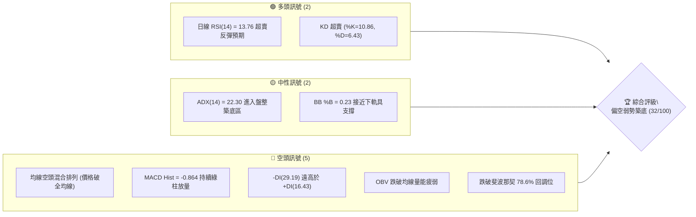
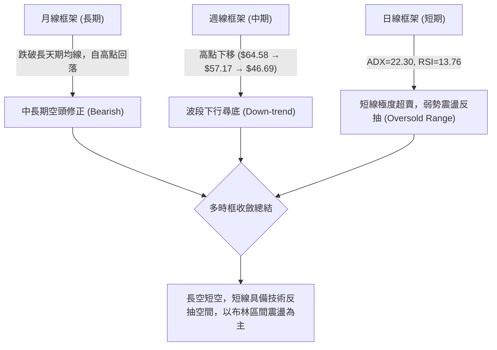
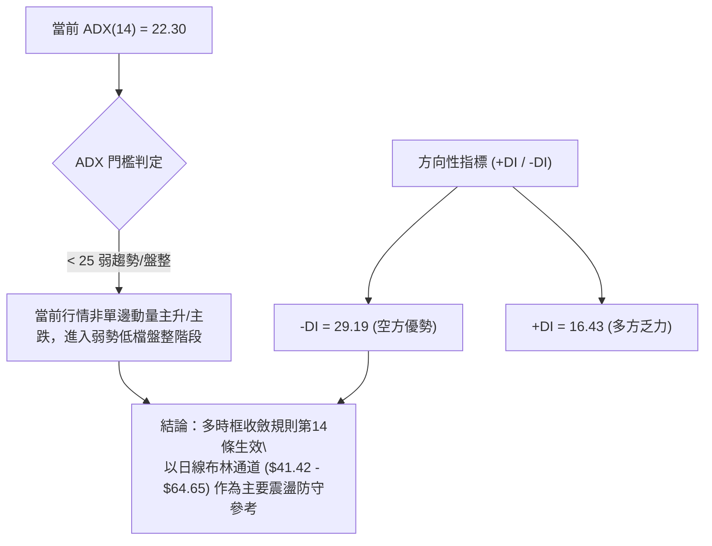
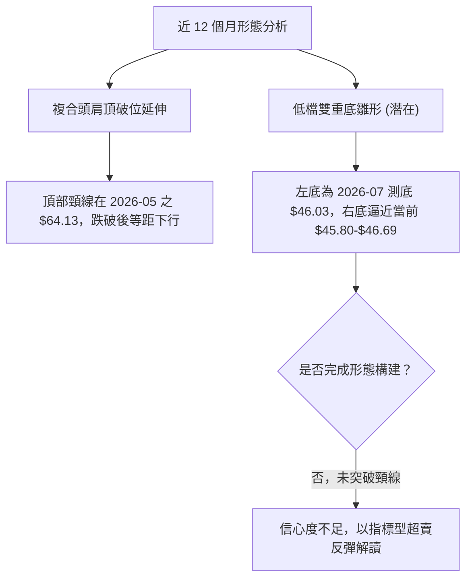
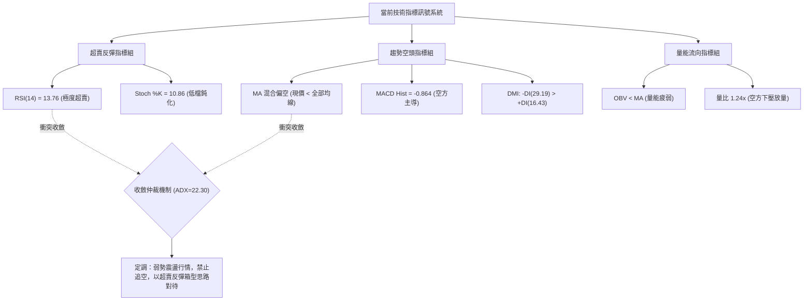
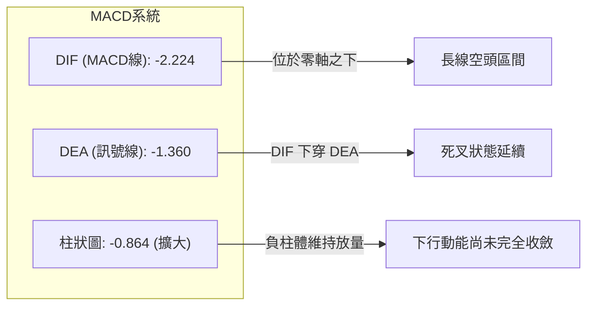
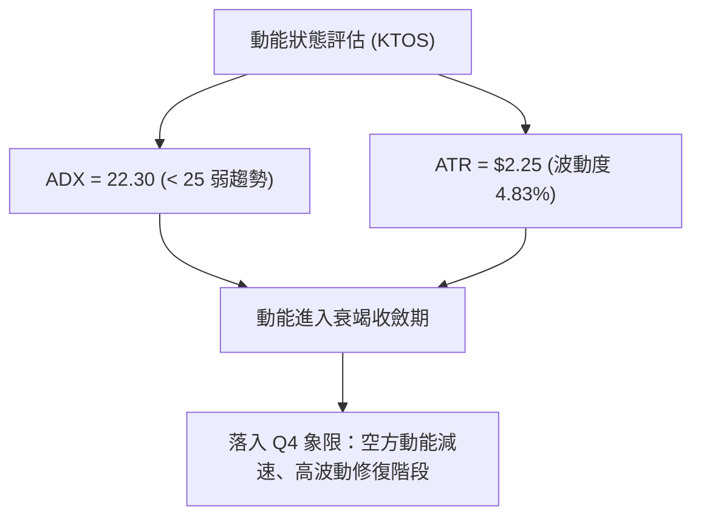
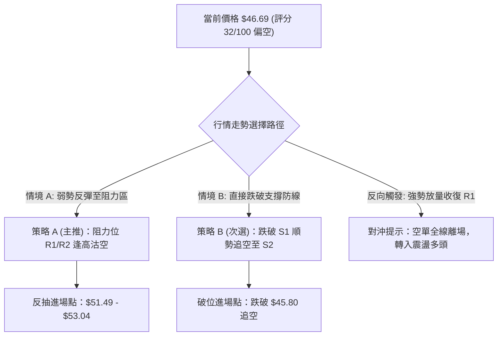
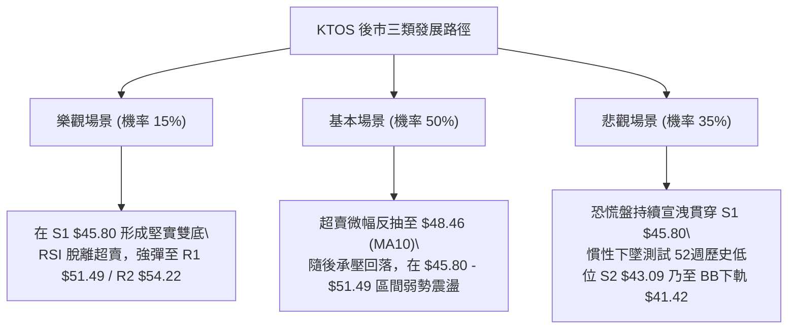

# KTOS 技術分析報告

> **報告日期**：2026-09-13 ｜ **語言**：繁體中文 ｜ **數據來源**：Yahoo Finance ｜ **當前價格**：$46.69

---

## 目錄

| 章節 | 內容 |
|------|------|
| [1. 技術面概覽](#1-技術面概覽) | 訊號儀表板、核心指標、評分卡 |
| [2. 趨勢分析](#2-趨勢分析) | 多時框趨勢、長中短期走勢 |
| [3. 圖表形態分析](#3-圖表形態分析) | 形態識別、K線組合、目標價 |
| [4. 支撐與阻力](#4-支撐與阻力) | 關鍵價位、斐波那契回調 |
| [5. 技術指標深度解讀](#5-技術指標深度解讀) | MA/RSI/MACD/布林/成交量 |
| [6. 動能與波動率](#6-動能與波動率) | 動能評估、ATR、Beta |
| [7. 多時框架總結](#7-多時框架總結) | 時框架評分矩陣 |
| [8. 交易策略建議](#8-交易策略建議) | 多空策略、風險報酬比 |
| [9. 風險提示與監控](#9-風險提示與監控) | 監控指標、風險場景 |

---

## 1. 技術面概覽

### 🎯 技術訊號儀表板



### 📊 核心指標速覽表

| 指標類別 | 指標名稱 | 當前數值 | 訊號 | 解讀 |
|:---|:---|:---|:---:|:---|
| **價格** | 當前價格 | $46.69 | 🔴 | 位於52週高低點區間底端 4.0%，極度弱勢 |
| **均線** | MA20 | $53.04 | 🔴 | 價格低於 MA20 -11.97%，短期下壓沉重 |
| **均線** | MA50 | $52.17 | 🔴 | 跌破中期均線，MA20/MA50 呈微弱走平後下彎 |
| **均線** | MA200 | $71.17 | 🔴 | 價格低於長期年線 -34.40%，長期空頭結構確立 |
| **動能** | RSI(14) | 13.76 | 🟢 | 極度超賣（<30），隨時有技術性空頭回補反彈 |
| **動能** | MACD | -2.224 | 🔴 | 快慢線均在零軸下，柱狀圖 -0.864 空頭擴散 |
| **動能** | Stoch %K/%D | 10.86 / 6.43 | 🟢 | 隨機指標落入超賣區，醞釀低檔金叉 |
| **趨勢** | ADX / DMI | 22.30 | 🟡 | 趨勢動能減弱轉為弱勢盤整，-DI(29.19) 主導 |
| **通道** | 布林通道 | 下軌 $41.42 | 🟡 | %B 為 0.23，未跌破下軌，下檔存在緩衝 |
| **量能** | OBV / 量比 | 1.24x | 🔴 | OBV < MA 顯示資金流出，空方下殺放量 |
| **波動** | ATR(14) | $2.25 | 🟡 | 佔股價 4.83%，屬中高波動度防守區間 |

### 🏆 技術評分卡

```
╔══════════════════════════════════════════════════════════════╗
║              技術評分卡 — KTOS (2026-09-13)                  ║
╠══════════════════════════════════════════════════════════════╣
║ 趨勢強度      ██████░░░░░░░░░░░░░░  30/100  🔴 空頭壓制       ║
║ 動能指標      ████████░░░░░░░░░░░░  40/100  🟡 極度超賣       ║
║ 支撐穩定度    ████████░░░░░░░░░░░░  42/100  🟡 臨近波段低點   ║
║ 成交量配合    ████░░░░░░░░░░░░░░░░  22/100  🔴 量能背離渙散   ║
║ 形態完整度    ██████░░░░░░░░░░░░░░  30/100  🔴 頭肩頂破位延伸 ║
║ 均線排列      ████░░░░░░░░░░░░░░░░  26/100  🔴 空頭下壓態勢   ║
╠══════════════════════════════════════════════════════════════╣
║ 綜合評分      ██████░░░░░░░░░░░░░░  32/100  🔴 評級：弱勢偏空 ║
╚══════════════════════════════════════════════════════════════╝
```

---

## 2. 趨勢分析

### 🌐 多時框趨勢分析



### 📈 長期趨勢 — 12個月走勢圖（Unicode）

KTOS 自 2026 年初觸及歷史波段頂部後，經歷連續 8 個月的階梯式下跌：

```
KTOS 月線走勢圖（過去12個月：2025-10 至 2026-09）
價格軸 ($)
$105 ┤                 ● (2026-01: $103.01)
$95  ┤ ● (2025-10: $90.60)
$85  ┤                       ● (2026-02: $86.18)
$75  ┤       ●     ●
$65  ┤                             ●     ●
$55  ┤                                         ●
$45  ┤                                               ●←現在 ($46.69)
$35  ┤
     └─┬─────┬─────┬─────┬─────┬─────┬─────┬─────┬─────┬─────┬─────┬───
     10月   11月  12月  01月  02月  03月  04月  05月  06月  07月  08月  09月
```

#### 走勢特徵分析表格

| 階段 | 時間跨度 | 起訖價位 | 漲跌幅 | 形態特徵與量價行為 |
|:---|:---|:---|:---:|:---|
| **第一階段：高檔衝頂** | 2025/10 - 2026/01 | $90.60 → $103.01 | +13.70% | 創下波段收盤歷史新高，主力高檔換手形成震盪頭部結構 |
| **第二階段：斷崖回調** | 2026/01 - 2026/04 | $103.01 → $63.05 | -38.79% | 跌破多道中期均線，長黑下殺放量，進入空頭主跌段 |
| **第三階段：弱勢反抽** | 2026/04 - 2026/05 | $63.05 → $64.13 | +1.71% | 縮量盤整，反彈動能衰竭，形成空頭旗形整理架構 |
| **第四階段：破位尋底** | 2026/05 - 2026/09 | $64.13 → $46.69 | -27.19% | 連續下破 S1 關卡，空方主導，直逼 52 週低點 $43.09 |

### 📊 中期趨勢（週線分析）

中期走勢呈現典型「下降通道」與「高點壓低」結構。過去 8 週行情自 8 月高點 $64.58 快速向下灌破至當前 $46.69：

```
中期下降阻力示意圖：
$64.58 (2026-08-16 高點)
   ＼
    ＼  $57.17 (2026-08-23 次高點)
     ＼    ＼
      ＼    ＼  $52.00 (2026-08-30 破位頸線)
       ＼    ＼    ＼
───────────────●────●────●────── 關鍵阻力聚類 R1 ($51.49) / BB中軌 ($53.04)
                     ＼    ＼
                      ＼    ● $46.69 (當前現價)
                       ─────── 近期支撐 S1 ($45.80) / 強支撐 S2 ($43.09)
```

### ⚡ 趨勢強度評估（ADX 解讀）



#### ADX 強度對照分析

| 指標變數 | 當前讀數 | 門檻區間 | 趨勢屬性 | 交易指導原則 |
|:---|:---:|:---:|:---:|:---|
| **ADX(14)** | 22.30 | 0 – 25 | 弱趨勢 / 盤整市場 | 禁止追空，提防低檔假突破與技術性反抽 |
| **+DI** | 16.43 | — | 多頭擴張動能極弱 | 不具備持續性攻擊波條件，僅能定義為跌深反彈 |
| **-DI** | 29.19 | — | 空方掌控市場主動權 | 向上彈升至阻力區間即面臨逢高解套拋壓 |

---

## 3. 圖表形態分析

### 🔍 形態識別系統



#### 形態信心度與目標價評估

| 形態類別 | 信心度 | 判斷依據（引用數據） | 完成度 | 目標價（附嚴格計算式） |
|:---|:---:|:---|:---:|:---|
| **下降通道延續** | 78% | 週線連續三波降底：8/16之$64.58、8/23之$57.17、8/30之$52.00 | 85% | 由形態延伸推算向下測 S2：**$43.09** |
| **潛在雙底反轉** | 42% | 前低為 7/19 當週收盤 $46.03，當前現價 $46.69 接近 S1 $45.80 | 35% | 若構築雙底成功，反彈目標為頸線 R1：**$51.49**<br>（計算式：$45.80 + ($51.49 - $45.80) = $57.18 阻力，但受限於關鍵價位上限至 R2 $54.22） |
| **指標型超賣修復** | 88% | 日線 RSI=13.76，週線 RSI=13.8，觸發極端均值回歸 | 90% | 由 BB 中軌推算反抽目標：**$53.04** |

*依據規則 15，因當前雙底信心度僅 42%（<50%），不宣稱反轉確立，僅以「超賣修復之區間箱型震盪」進行操作解讀。*

### 🕯️ 重要K線形態分析

| 週/月期間 | 收盤價 | K線形態特徵 | 市場心理與多空解讀 | 訊號 |
|:---|:---:|:---|:---|:---:|
| **2026-08-16 週** | $64.58 | 長上影倒轉十字星 | 衝高觸碰阻力區後主力強烈拋售，形成短期見頂假突破 | 🔴 |
| **2026-08-30 週** | $52.00 | 貫穿大陰棒 | 擊穿 MA20 ($53.04) 及 MA50 ($52.17)，多頭防線全面瓦解 | 🔴 |
| **2026-09-06 週** | $47.82 | 無支撐連陰回踩 | 恐慌盤湧出，跌破前波平台低點，RSI 墜入 11.7 極限超賣 | 🔴 |
| **2026-09-13 週** | $46.69 | 縮量錘頭十字試探線 | 盤中下探 S1 ($45.80) 獲微弱買盤抵抗，跌勢斜率略微趨緩 | 🟡 |

### 📉 ASCII 走勢形態示意圖

```
KTOS 形態結構示意：高檔回落與低檔尋底邊界
$64.58 ──────────────────────────┐ (8月中波段頂部)
        ╲                        │
         ╲                       ▼ (波段跌幅 -27.7%)
  $54.22 ─- 頸線壓制位 (R2) ─────│───────────────────────
           ╲                     │
    $51.49 ─- 反彈第一阻力 (R1) ─┼────────
             ╲                   │
      $46.69 ─- 當前測試區間 ────┼──────────◄ [現價 $46.69]
               ╲                 │
        $45.80 ─- 近期低點支撐 (S1)─────
                 ╲
          $43.09 ─- 52週極限低點 (S2) ───
```

### 🎯 形態目標價計算

根據波段破位計算：
1. **中期破位目標**：前期頸線確認破位點為 8/30 當週收盤價 **$52.00**，波段下探支撐聚類 S1 **$45.80**，已接近形態滿足點。
2. **反抽目標驗證**：若在 S1 **$45.80** 或 S2 **$43.09** 獲得完全止跌確認，向上反抽之目標價 1 精確錨定於第一阻力位 R1 **$51.49**，目標價 2 錨定於第二阻力位 R2 **$54.22**。

---

## 4. 支撐與阻力

### 🗺️ 關鍵價位分布圖（Unicode）

```
KTOS 價位結構分布圖
══════════════════════════════════════════════════════════════
$58.88 ║██████████████████████████████║ 強阻力 R3 (Fib 78.6% $62.54 之下)
$54.22 ║████████████████████          ║ 阻力 R2 (反彈延伸強阻)
$51.49 ║████████████████████████      ║ 關鍵阻力 R1 (MA20/MA50 匯聚區)
$46.69 ╠══════════════════════════════╣ ◄ 當前現價 $46.69
$45.80 ║▓▓▓▓▓▓▓▓▓▓▓▓▓▓▓▓              ║ 近期支撐 S1 (-1.92%)
$43.09 ║██████████████████████████████║ 強支撐 S2 (52週極端低點 -7.71%)
══════════════════════════════════════════════════════════════
```

### 🚧 阻力位分析表

所有阻力價位嚴格引用數據庫提供之波段聚類數值：

| 阻力級別 | 精確價位 | 距現價幅幅 | 形成技術依據與阻力成因 | 突破難度 | 重要性權重 |
|:---|:---:|:---:|:---|:---:|:---:|
| **R1** | **$51.49** | +10.28% | 近一年波段密集換手下緣，貼近 MA60 ($51.86) 與 MA50 ($52.17) | 高 🔴 | ★★★★☆ |
| **R2** | **$54.22** | +16.13% | 7月上旬及8月下跌過程中的反彈高點平台，與 BB中軌 ($53.04) 形成共振帶 | 極高 🔴 | ★★★★★ |
| **R3** | **$58.88** | +26.11% | 長期下彎之 MA120 ($57.80) 疊加 6月橫盤防守區 | 巨大 🔴 | ★★★☆☆ |

### 🛡️ 支撐位分析表

所有支撐價位嚴格引用數據庫提供之波段聚類數值：

| 支撐級別 | 精確價位 | 距現價幅幅 | 形成技術依據與支撐成因 | 守住機率 | 重要性權重 |
|:---|:---:|:---:|:---|:---:|:---:|
| **S1** | **$45.80** | -1.92% | 近一年波段低點下影線聚類，日線級別多頭最後緩衝防線 | 55% 🟡 | ★★★★☆ |
| **S2** | **$43.09** | -7.71% | 52週歷史極值低點，斐波那契 100.0% 極限回調支撐位 | 78% 🟢 | ★★★★★ |

### 📐 斐波那契回調位分析

依據 52 週完整波動區間（高點 **$134.00** → 低點 **$43.09**），落點解析如下：

```
斐波那契回調位階分布：
0.0%  (52W High) ────────────────── $134.00
23.6% ────────────────────────────── $112.55
38.2% ────────────────────────────── $99.27
50.0% ────────────────────────────── $88.55
61.8% ────────────────────────────── $77.82  (MA200: $71.17 位於此下方)
78.6% ────────────────────────────── $62.54
[現價] ───────────────────────────── $46.69  (位於 78.6% 與 100.0% 之間)
100.0% (52W Low) ────────────────── $43.09
```

- **位置判定**：當前現價 **$46.69** 已完全擊穿 78.6% 回調位（**$62.54**），處於 78.6% 至 100.0%（**$43.09**）的極弱勢「完全回吐區間」。
- **結構意義**：從 $134.00 高點回吐幅度已達 96.0%，現價距離 100.0% 回調位僅剩 **$3.60**（-7.71%）空間。依據技術分析慣性，當資產跌破 78.6% 水準時，下測 100% 低點（**$43.09**）成為大概率技術歸宿。

---

## 5. 技術指標深度解讀

### 🎛️ 指標訊號總覽



### 📈 移動平均線排列分析

| 均線名稱 | 當前價格 | 偏離現價幅度 | 排列方向 | 短期趨勢與斜率評估 |
|:---|:---:|:---:|:---:|:---|
| **MA 5** | $47.29 | -1.26% | ▁▁▁ 下彎 | 短線下壓極近，現價尚未奪回 5 日線 |
| **MA 10** | $48.46 | -3.66% | ▁▁▁ 下彎 | 短期空方阻力帶 |
| **MA 20** | $53.04 | -11.97% | ▇▇▆ 下彎 | 短中期轉折點，布林帶中軌重要分水嶺 |
| **MA 60** | $51.86 | -9.98% | ▅▄▃ 走平微下 | 中期生命線遭灌破 |
| **MA 120**| $57.80 | -19.22% | ▄▄▃ 下彎 | 中長期空頭壓制線 |
| **MA 200**| $71.17 | -34.40% | ▇▇▆ 下行 | 長期牛熊分水嶺，宣告長期下行趨勢 |
| **MA 240**| $73.67 | -36.62% | ▆▅▄ 下行 | 超長期結構處於空頭深水區 |

**均線結構綜合判定**：全均線系統（MA5 至 MA240）均高於當前市價，形成完全的「空頭籠罩排列」。短期均線負乖離顯著擴大（距 MA20 達 -11.97%），技術上具備向均線靠攏的均值回歸修復需求。

### 📉 RSI(14) 分析

- **當前讀數**：`13.76` 
- **指標強度**：`██░░░░░░░░` 13.76%（深度超賣）

```
RSI(14) 超買超賣刻度儀：
0 ───[● 13.76]────── 30 ───────────── 50 ───────────── 70 ────────── 100
      極度超賣區間       弱勢空頭區間        平衡線       強勢多頭區間
```

- **超買超賣判定**：RSI 跌至 13.76，創下年內罕見極值。通常 RSI < 20 屬於「非理性恐慌拋售」，極易誘發空頭回補。
- **背離判斷**：對比近三週走勢，9/06 收盤 $47.82 時 RSI 為 11.7，9/13 收盤跌至 $46.69 時 RSI 為 13.8。股價創破位新低，但 RSI 數值未創新低，**呈現微弱的日/週線級別潛在底背離雛形**。唯量能未放，系統仍標記為「無明顯背離」，需等待 RSI 向上突破 30 進行右側確認。

### 📊 MACD(12/26/9) 訊號解讀



- **指標解讀**：DIF（-2.224）與 DEA（-1.360）均在零軸深處下方運行，且負柱體為 -0.864，顯示空方動能仍居絕對控制地位。雖然本週負柱體較上週（-1.318）有所收斂，但尚未形成金叉反轉信號，屬於下跌趨勢中動能放緩的減速階段。

### 📦 布林通道分析

```
KTOS 布林通道 (20, 2) 結構圖：
$64.65 ─────────────────────── 上軌 (強阻力)
       │
$53.04 ─────────────┬───────── 中軌 (MA20 關鍵分水嶺)
       │            │
$46.69 ─────────────┼─◄ [現價 $46.69, %B=0.23]
       │            │
$41.42 ─────────────┴───────── 下軌 (技術防守緩衝墊)
```

- **帶寬與位置**：通道上軌 $64.65，中軌 $53.04，下軌 $41.42。
- **%B 指標解讀**：%B 讀數為 **0.23**。由於 %B 處於 0.0 至 0.3 的超賣緩衝區間，且未實質摜破下軌 $41.42，顯示下行加速度受到通道壁約束，股價隨時有向中軌 $53.04 尋求均值回歸的拉力。

### 💹 成交量分析（量價配合度）

- **量能數據**：最新成交量 4,063,500 股，相較於 20 日均量 3,278,480 股，量比為 **1.24x**。
- **量價關係**：週線級別成交量自 8/30 破位以來的 11.85M 擴增至本週 14.83M，呈現典型的「放量下挫」。
- **OBV 能量潮**：當前「OBV < MA」，資金淨流出趨勢顯著，主力資金無大規模進場吸籌跡象，量能狀態屬於「量增價跌」的被動拋盤釋放，尚未見到爆量長下影之主力換手止跌量。

---

## 6. 動能與波動率

### ⚡ 動能評估

| 象限標籤 | 動能狀態 | 波動率狀態 | KTOS 當前落點判定 | 技術操作指導策略 |
|:---:|:---:|:---:|:---:|:---|
| **Q1** | 強動能 (Bull) | 低波動 | — | 穩定多頭主升段，順勢持股加碼 |
| **Q2** | 弱動能 (Bear/Neutral) | 低波動 | — | 窄幅盤整蓄勢，適合突破策略 |
| **Q3** | 強動能 (Bear) | 高波動 | — | 單邊崩跌走勢，順勢放空或嚴格止損 |
| **Q4 (當前)** | **弱動能 (築底衰竭)** | **中高波動 (ATR 4.83%)** | **✓ 正處於此區間** | **恐慌拋售尾聲，嚴禁追空；多頭僅限極輕倉抓超賣反抽** |



### 📊 ATR 波動率分析

- **ATR(14) 數值**：**$2.25**，佔現價之 **4.83%**。
- **日內/波段波動特徵**：每日平均波動振幅達 $2.25，這意味著短期震盪雜訊極高，常規窄幅止損易遭洗盤。
- **技術止損距離配置**：
  - 超短線反彈交易：建議防守空間為 1.0 倍 ATR = **$2.25**。
  - 波段防守設定：建議防守空間為 1.5 倍 ATR = **$3.38**。
  - 關鍵支撐破位驗證：以 S1 **$45.80** 往下預留 0.5 倍 ATR（約 $1.12），即實質跌破 **$44.68** 視為支撐徹底失效。

### 📐 Beta 與市場相關性

- **Beta 係數**：**1.113**。
- **市場特徵解讀**：KTOS 呈現高於標普 500 指數 11.3% 的波動敏感度。在國防軍工板塊情緒轉向防禦或市場大盤走弱時，KTOS 會放大下跌幅度；相對地，一旦大盤止跌回穩，其超賣特性與高 Beta 屬性將提供更強烈的反彈槓桿彈性。

---

## 7. 多時框架總結

### 📋 時框架評分表

| 時框架 | 趨勢方向 | 動能指標狀態 | 均線排列特徵 | 形態判定 | 綜合評分 | 戰略操作建議 |
|:---|:---:|:---:|:---:|:---:|:---:|:---|
| **長期 (月線)** | 🔴 空頭修復 | MACD 綠柱放大 | 跌破 MA200 ($71.17) | 自高點下行回調 65% | 25/100 | 長線資金離場觀望，嚴禁摸底 |
| **中期 (週線)** | 🔴 空頭主導 | RSI(14) = 13.8 鈍化 | MA20 / MA50 空頭壓制 | 下降趨勢延續中 | 30/100 | 反彈皆為空頭減碼與解套點 |
| **短期 (日線)** | 🟡 震盪築底 | Stoch 超賣金叉在即 | 負乖離擴大至 -11.97% | S1 測試中，醞釀底背離 | 45/100 | 僅供激進者輕倉快進快出博反彈 |

### 🔲 綜合訊號矩陣

```
┌─────────────────┬─────────────────┬─────────────────┬─────────────────┐
│   維度 / 框架   │    短期 (日線)  │    中期 (週線)  │    長期 (月線)  │
├─────────────────┼─────────────────┼─────────────────┼─────────────────┤
│ 趨勢方向判定   │   🟡 弱勢盤整   │   🔴 下降通道   │   🔴 空頭回撤   │
│ 動能指標狀態   │   🟢 極度超賣   │   🟢 超賣收斂   │   🔴 空方主導   │
│ 均線系統防守   │   🔴 全線壓制   │   🔴 跌破均線群 │   🔴 跌破年線   │
│ 成交量配合度   │   🟡 縮量試探   │   🔴 放量殺跌   │   🔴 主力撤退   │
│ 支撐測試強度   │   🟡 考驗 S1    │   🟡 靠攏 S2    │   🟢 具 100% 斐波│
└─────────────────┴─────────────────┴─────────────────┴─────────────────┘
```

### ⚖️ 多時框收斂結論

依據本報告**嚴格要求第 14 條之多時框收斂規則**執行裁決：

1. **趨勢強度定性**：當前日線 ADX 讀數為 **22.30**（嚴格小於 25 臨界線），確認目前市場並非單邊強趨勢動態，而是處於**「空頭衰竭轉弱勢低檔盤整」**之盤整行情。
2. **優先級收斂**：在盤整架構下，取消盲目追空信號；主要交易空間收斂於**「日線布林通道下軌（$41.42）至中軌（$53.04）」**之震盪區間內。
3. **唯一方向結論**：**中性觀望，偏空防守，僅防禦性應對超賣修復**。
   - 週線與月線大方向依然處於空頭壓制，日線的反彈訊號絕不可解讀為多頭反轉，只能定義為「波段跌深後的均值回歸修復」。
   - 因此，第 8 章交易策略以**「綜合評分 32/100 偏空弱勢」**為基準，主推空頭順勢高空或突破破位做空策略，多頭僅列為極短線反彈之戰術性交易。

---

## 8. 交易策略建議

### 🗺️ 策略決策流程圖



### 🧭 策略路由

**當前主策略方向 = 偏空／防守做空（依綜合評分 32/100 嚴格判定）**

因技術評分卡綜合評分僅為 32/100（≤ 40 區間），市場完全由空方掌控。本報告主推**空頭波段操作策略**，嚴禁在中途無支撐處盲目做多；多頭僅作為逆向對沖提示。

### 🎯 價格情境階梯（Price Scenarios）

價位嚴格引用第 4 章關鍵價位及回調位計算數值：

| 觸發條件 | 下一目標價 | 後續延伸價位 | 情境技術含義 |
|:---|:---:|:---:|:---|
| **強勢突破 R1 $51.49** | R2 $54.22 | R3 $58.88 | 短線空頭回補，測試 BB 中軌 $53.04 與 MA50 反壓 |
| **受阻於現價區間 ($46.69)**| S1 $45.80 | S2 $43.09 | 弱勢下探，尋求 52 週低點支撐平台 |
| **實質跌破 S1 $45.80** | S2 $43.09 | $41.42 (BB下軌) | 空頭破位主跌延伸，回測 100.0% 斐波那契極限 |

### 📊 情境機率分佈

| 預測情境 | 機率 | 主要技術指標依據 |
|:---|:---:|:---|
| **弱勢回抽遇阻再跌 (高空)** | **50%** | MACD 零軸下深處運行，全均線空頭下壓，反彈量能不足將遭逢解套拋壓 |
| **直接下探破位尋底 (殺跌)** | **35%** | -DI(29.19) 居高不下，OBV 疲軟渙散，距離 S1 僅 1.92% 支撐力道微弱 |
| **筑底強烈反轉 (暴漲)** | **15%** | 僅憑 RSI(13.76) 超賣無法扭轉均線空頭排列，需基本面重大催化配合 |

### 🔴 主策略詳情（方向依評分路由：空頭主推）

所有策略進出場與目標價位，完全基於系統關鍵價位計算：

| 策略要素 | 策略 A：高空策略（主推） | 策略 B：破位跟進策略（次選） |
|:---|:---:|:---:|
| **進場條件** | 跌深反抽遭遇 R1 阻力出現滯漲十字星 | 實質貫穿近一年低點支撐 S1 |
| **進場價格** | **$51.49**（阻力 R1 位置） | **$45.50**（跌破 S1 $45.80 確認點） |
| **目標價 T1** | **$46.69**（當前低檔現價） | **$43.09**（52W Low / 斐波 100% S2） |
| **目標價 T2** | **$43.09**（強支撐 S2 關鍵位） | **$41.42**（布林通道下軌極端位） |
| **止損價格** | **$54.22**（突破阻力 R2 止損離場） | **$46.69**（假突破重返現價止損） |
| **風險報酬比** | **1 : 3.09**（風險 $2.73，目標收益 $8.40） | **1 : 2.03**（風險 $1.19，目標收益 $2.41） |
| **成功機率** | **65%** | **55%** |
| **建議倉位** | **15%**（波段放空倉位） | **10%**（破位短線輕倉） |

### 🟢 反向風險觸發點（對沖多頭提示）

*本小節僅供風控與空單平倉對沖參考，非主推買入依據：*
- **空單全面平倉出場點**：若日線放量長紅實體收盤價站穩 **$51.49（R1）** 之上，宣告日線底背離成立，空單必須全數停損或獲利了結。
- **左側超跌博弈買點（激進型）**：現價 **$46.69** 至 **$45.80（S1）** 區間，若出現連續 3 日不破底且 RSI 回升至 30 之上，激進投資者可動用不超過 5% 倉位博弈均值回歸，止損嚴格設於 **$43.09（S2）**，第一反彈目標看 **$51.49**。

### ⭐ 整體訊號強度評星

```
做多訊號強度：★☆☆☆☆  (1.5/5星 — 僅有極度超賣支撐，均線全面看空)
做空訊號強度：★★★★☆  (4.0/5星 — 趨勢指標全面空頭，順勢做空勝率高)
整體可信度：  ★★★★☆  (4.0/5星 — 價量指標共振，方向高度收斂)
```

---

## 9. 風險提示與監控

### ✅ 關鍵監控指標 Checklist

```
╔══════════════════════════════════════════════════════════════╗
║                  關鍵技術監控 Checklist                      ║
╠══════════════════════════════════════════════════════════════╣
║ [ ] 價格跌破 S1 ($45.80) ── 是否觸發直測 52W 低點 $43.09     ║
║ [ ] RSI(14) 突破 30 臨界線 ── 是否由極度超賣展開技術性反彈   ║
║ [ ] 成交量突破 50 日均量 (3.68M) ── 下跌是否引發機構恐慌性拋盤 ║
║ [ ] MACD 柱狀圖翻紅 ── DIF/DEA 是否在零軸下方低檔金叉        ║
║ [ ] 布林通道帶寬收窄 ── 股價是否觸碰下軌 $41.42 發生劇烈反彈 ║
║ [ ] 收盤價站上 MA20 ($53.04) ── 空頭格局是否遭到實質扭轉     ║
╚══════════════════════════════════════════════════════════════╝
```

### ⚠️ 風險場景分析



### 🛡️ 風險管理重要提醒

1. **嚴禁逆勢盲目摸底**：在 KTOS 均線系統完全呈現空頭排列、且 MA200 位於遙遠的 $71.17 之下時，股價雖然便宜但屬於典型「落下的飛刀」。在沒有明確築底K線組合（如晨星、突破雙底頸線）前，切忌單憑 RSI 超賣即重倉抄底。
2. **波動度適應性倉位縮減**：KTOS 的 ATR 高達 $2.25（佔比 4.83%），屬於高波動中型國防標的。單筆交易承擔之風險暴露不得超過總資產的 1.0%–1.5%。若採策略 B 於 $45.50 進場追空，止損幅度設為 $1.19，則單一標的倉位上限應嚴格限制在總部位的 10% 以內。
3. **分析師評級與技術面背離防範**：數據顯示分析師一致共識為 "strong_buy" 且平均目標價達 $104.20，但技術盤面呈現持續探底走勢。在基本面催化劑落地扭轉技術結構前，交易員應嚴格遵循「盤面價格反映一切」之技術分析鐵律，切莫因華爾街目標價而忽視破位下行的真實風控風險。

---

## 📋 報告總結

```
╔══════════════════════════════════════════════════════════════╗
║                 KTOS 技術分析報告總結                        ║
╠══════════════════════════════════════════════════════════════╣
║ 報告日期：2026-09-13                                         ║
║ 當前價格：$46.69                                             ║
║ 分析評級：🔴 偏空弱勢／防守盤整 (綜合評分: 32/100)           ║
╠══════════════════════════════════════════════════════════════╣
║ 關鍵結論：                                                   ║
║ ├─ 長期趨勢：🔴 空頭主導，跌破全天期均線與 MA200 ($71.17)   ║
║ ├─ 中期趨勢：🔴 下降通道延續，8月中旬以來回撤達 -27.7%      ║
║ ├─ 短期趨勢：🟡 極度超賣 (RSI 13.76)，進入 S1 支撐低檔爭奪   ║
║ ├─ 關鍵支撐：S1: $45.80 (-1.92%)  /  S2: $43.09 (-7.71%)     ║
║ ├─ 關鍵阻力：R1: $51.49 (+10.28%) /  R2: $54.22 (+16.13%)    ║
║ └─ 斐波位階：已跌破 78.6% ($62.54)，正向 100% ($43.09) 靠攏  ║
╠══════════════════════════════════════════════════════════════╣
║ 最優策略組合：                                               ║
║ 1. 🥇 最佳機會：反彈至阻力 R1 $51.49 逢高沽空 (風報比 1:3.09)║
║ 2. 🥈 次選機會：實質跌破 S1 $45.80 順勢空至 S2 $43.09        ║
║ 3. 🥉 保守選擇：空倉觀望，等待日線突破 MA20 ($53.04) 結構扭轉║
╚══════════════════════════════════════════════════════════════╝
```

---

> ⚠️ **免責聲明**：本報告為技術分析研究成果，所有數據及價位依據 Yahoo Finance 提供之客觀 OHLCV 與量化指標計算生成。本報告**僅供研究與學術參考**，**不構成任何要約、招攬或投資建議**。市場有風險，交易需依個人風險承受度嚴格設定止損。

---

*報告生成時間：2026-09-13 ｜ 數據來源：Yahoo Finance ｜ 分析框架：多時框技術分析體系*