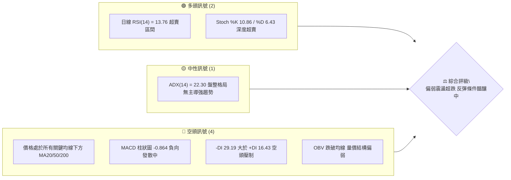
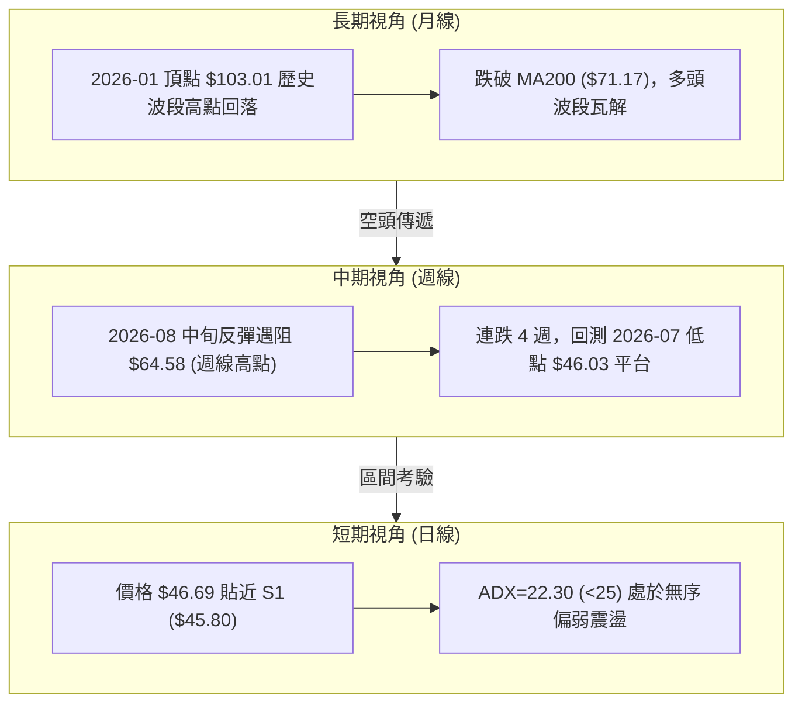
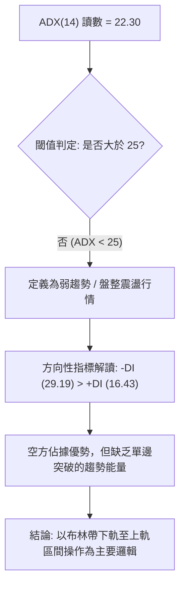
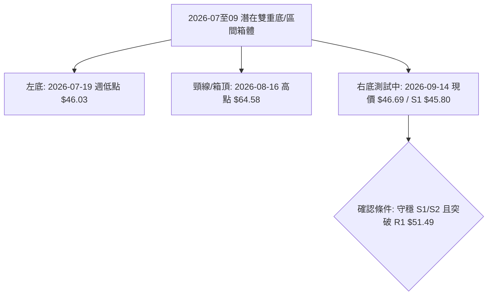
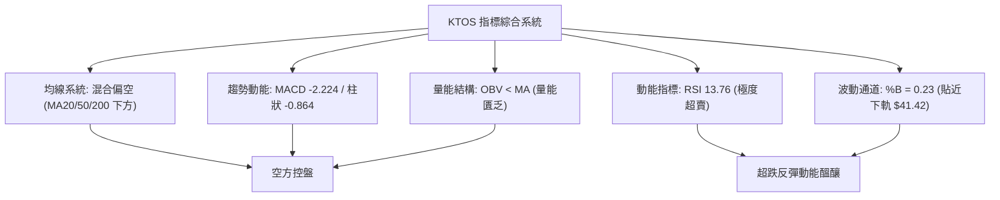
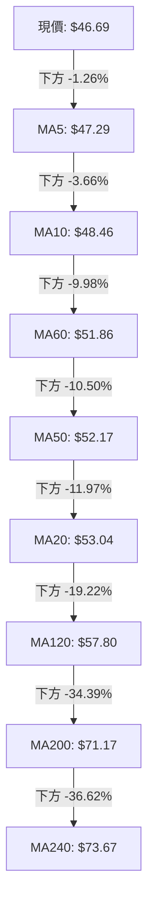
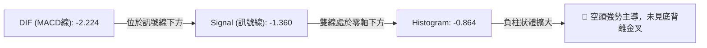
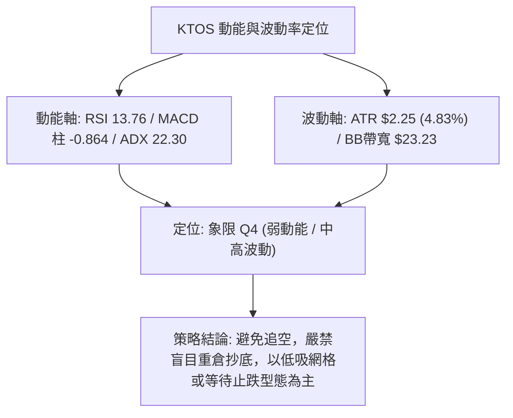
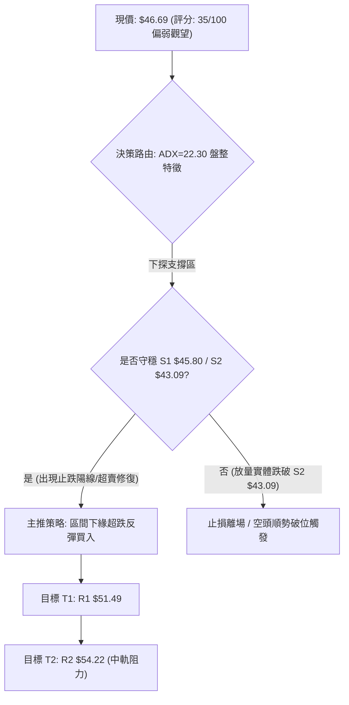
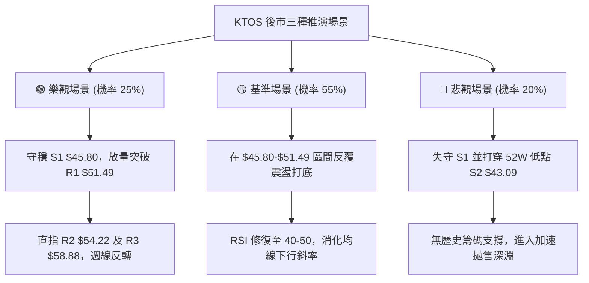

# KTOS 技術分析報告

> **報告日期**：2026-09-14 ｜ **語言**：繁體中文 ｜ **數據來源**：Yahoo Finance ｜ **當前價格**：$46.69

---

## 目錄

| 章節 | 內容 |
|------|------|
| [1. 技術面概覽](#1-技術面概覽) | 訊號儀表板、核心指標、評分卡 |
| [2. 趨勢分析](#2-趨勢分析) | 多時框趨勢、長中短期走勢 |
| [3. 圖表形態分析](#3-圖表形態分析) | 形態識別、K線組合、目標價 |
| [4. 支撐與阻力](#4-支撐與阻力) | 關鍵價位、斐波那契回調 |
| [5. 技術指標深度解讀](#5-技術指標深度解讀) | MA/RSI/MACD/布林/成交量 |
| [6. 動能與波動率](#6-動能與波動率) | 動能評估、ATR、Beta |
| [7. 多時框架總結](#7-多時框架總結) | 時框架評分矩陣 |
| [8. 交易策略建議](#8-交易策略建議) | 多空策略、風險報酬比 |
| [9. 風險提示與監控](#9-風險提示與監控) | 監控指標、風險場景 |

---

## 1. 技術面概覽

### 🎯 技術訊號儀表板



### 📊 核心指標速覽表

| 指標類別 | 指標名稱 | 當前數值 | 訊號 | 解讀 |
|----------|----------|----------|------|------|
| **價格** | 當前價格 | $46.69 | 🔴 | 位於 52 週低點區間 4.0%，空頭絕對壓制中 |
| **均線** | MA20 | $53.04 | 🔴 | 價格低於 MA20 達 -11.97%，短線下行斜率陡峭 |
| **均線** | MA50 | $52.17 | 🔴 | 價格落後 MA50，中期趨勢受到壓制 |
| **均線** | MA200 | $71.17 | 🔴 | 遠低於長期牛熊分水嶺，長線空頭排列 |
| **動能** | RSI(14) | 13.76 | 🟢 | 極度超賣狀態，空頭拋售力竭、反彈機率顯著提高 |
| **動能** | MACD | -2.224 | 🔴 | DIF 與 Signal (-1.360) 均在零軸下，柱狀體為負 |
| **波動** | ATR(14) | $2.25 | 🟡 | 佔股價 4.83%，屬中高日常波動，防守空間需加大 |

### 🏆 技術評分卡

```
╔══════════════════════════════════════════════════════════════╗
║              技術評分卡 — KTOS (2026-09-14)                 ║
╠══════════════════════════════════════════════════════════════╣
║ 趨勢強度      ██████░░░░░░░░░░░░░░  30/100  🔴 空頭壓制      ║
║ 動能指標      ████████░░░░░░░░░░░░  40/100  🟡 極度超賣      ║
║ 支撐穩定度    ██████████░░░░░░░░░░  50/100  🟡 臨近S1/S2     ║
║ 成交量配合    ██████░░░░░░░░░░░░░░  30/100  🔴 量能疲弱      ║
║ 形態完整度    ████████░░░░░░░░░░░░  40/100  🟡 箱型下緣      ║
║ 均線排列      ████░░░░░░░░░░░░░░░░  20/100  🔴 均線空頭      ║
╠══════════════════════════════════════════════════════════════╣
║ 綜合評分      ███████░░░░░░░░░░░░░  35/100  🔴 偏弱觀望      ║
╚══════════════════════════════════════════════════════════════╝
```

---

## 2. 趨勢分析

### 🌐 多時框趨勢分析



### 📈 長期趨勢 — 12個月走勢圖（Unicode）

```
KTOS 月線走勢圖（過去12個月：2025-10 至 2026-09）
價格軸 ($)
$105 ┤                               ●(2026-01: $103.01 波段頂點)
$90  ┤ ●(2025-10: $90.60)
$75  ┤       ●(11月: $76.10)   ●(2026-02: $86.18)
$60  ┤             ●(12月: $75.91)   ●(03月: $70.51) ●(05月: $64.13)
$45  ┤                                     ●(04月: $63.05) ●(06月: $49.86) ●(現在: $46.69)
     └─────────────────────────────────────────────────────────────────
       10    11    12    01    02    03    04    05    06    07    08    09 (月份)
```

#### 走勢特徵分析表格

| 階段區間 | 起止價格 | 漲跌幅 | 走勢特徵 | 趨勢結論 |
|----------|----------|--------|----------|----------|
| **2025-10 至 2026-01** | $90.60 → $103.01 | +13.70% | 經歷末端拉升並觸及歷史高位區間，隨後動能衰竭 | 🔴 築頂噴出 |
| **2026-01 至 2026-04** | $103.01 → $63.05 | -38.79% | 跌破均線防線，快速下行釋放獲利盤 | 🔴 主跌推進 |
| **2026-05 至 2026-08** | $64.13 → $50.98 | -20.51% | 在 $46.00-$64.00 區間呈現大幅度寬幅震盪 | 🟡 震盪築底 |
| **2026-08 至 2026-09** | $50.98 → $46.69 | -8.41%  | 自 $64.58 週線阻力回撤，測試 52 週低點附近支撐 | 🔴 短線下探 |

### 📊 中期趨勢（週線分析）

```
近期週線壓力與支撐結構示意圖
$64.58 ────────────────────────── (2026-08-16 波段高點 / 強阻力)
       │
$57.17 ────────────── (2026-08-23 週線平台阻力)
       │
$51.49 ──────── (R1 聚類阻力 / MA60: $51.86)
       │
$46.69 ◄─── 當前現價
       │
$45.80 ─── (S1 近期波段低點支撐)
       │
$43.09 ────────────────────────── (52週低點 / 斐波那契 100% 絕對支撐)
```

週線數據顯示，KTOS 於 2026-08-16 週觸及高點 $64.58（RSI 曾達 76.7 的超買高點）後迅速走弱，連跌 4 週至目前的 $46.69。該走勢呈現出明確的「區間頂部承壓，回落測試箱底」之中期特徵。

### ⚡ 趨勢強度評估（ADX 解讀）



#### ADX 指標強度對照分析表

| 參數指標 | 數值 | 狀態區間 | 技術意義 |
|----------|------|----------|----------|
| **ADX(14)** | 22.30 | 20 - 25（弱趨勢） | 當前價格缺乏強勁單邊趨勢，屬於區間震盪下移之過渡狀態 |
| **+DI** | 16.43 | 低水平 (<20) | 多頭攻擊動能萎靡 |
| **-DI** | 29.19 | 高水平 (>25) | 空方主導當前短線節奏 |
| **DI差值** | -12.76 | 負向擴散 | 空方控盤，但在 ADX 低於 25 之下，極易觸發空頭回補反彈 |

---

## 3. 圖表形態分析

### 🔍 形態識別系統



#### 形態識別與信心度評估表

| 形態類別 | 信心度 | 判斷依據（引用數據） | 完成度 | 目標價（附計算式） |
|----------|--------|----------------------|--------|--------------------|
| **潛在雙重底 (W底)** | 55% | 左底 2026-07-19 的 $46.03 與當前測試的 S1 $45.80 價位重疊；頸線為 2026-08-16 的 $64.58 | 50%（處於右底支撐測試期） | 若確認突破頸線 $64.58，高度 = 64.58 - 45.80 = $18.78；量度目標 = 64.58 + 18.78 = $83.36 |
| **矩形箱體震盪** | 70% | 價格在下界 $43.09-$45.80 與上界 R3 $58.88-$64.58 之間反覆來回運行 | 80% | 區間震盪反彈目標至布林中軌 MA20 ($53.04) 及 R1 ($51.49) |
| **均線死叉壓制** | 85% | 價格位於 MA20 ($53.04)、MA50 ($52.17)、MA200 ($71.17) 下方，均線呈現蓋頭走勢 | 100% | 指標型形態，確認反彈受制於 R1/R2 |

### 🕯️ 重要K線形態分析

| 週次/月份 | 收盤價 | K線形態 | 解讀 | 訊號 |
|-----------|--------|---------|------|------|
| **2026-08-09 週** | $60.77 | 長陽突破實體 | 帶動週 RSI 飆升至 74.1，強勢上攻，放量近 2,900 萬股 | 🟢 短線多頭放量 |
| **2026-08-16 週** | $64.58 | 上影線十字線 | 觸及 52 週反彈高點後遭遇強烈拋壓，形成中期頂部 | 🔴 滯漲見頂訊號 |
| **2026-08-30 週** | $52.00 | 中陰線殺跌 | 跌破多個短均線支撐，週 MACD 柱翻負 (-1.211) | 🔴 空頭加速確認 |
| **2026-09-06 週** | $47.82 | 大陰線探底 | RSI 貫穿至 11.7 極度超賣，恐慌盤湧出 | 🟡 空頭動能衰退 |
| **2026-09-13 週** | $46.69 | 下跌減速星線 | 跌幅縮窄至 1.13 美元，成交量縮減，接近 S1 支撐 | 🟢 止跌醞釀中 |

### 📉 ASCII 走勢形態示意圖

```
KTOS 潛在雙底形態結構圖
$64.58 ─────────────● (頸線：2026-08-16 高點)
                   / \
                  /   \
                 /     \
                /       \
$55.00 ────────/─────────\───────────
              /           \   ● (反彈中繼)
             /             \ /
$46.03 ─────●               ● $46.69 現價 (測試 S1 $45.80)
         (左底: 07-19)   (右底構築中)
```

---

## 4. 支撐與阻力

### 🗺️ 關鍵價位分布圖（Unicode）

```
KTOS 價位結構分布圖
═══════════════════════════════════════════════════════════════
$58.88 ║████████████████████████████████║ 強阻力 R3 (+26.11%)
$54.22 ║██████████████████████          ║ 阻力 R2 (+16.13%)
$51.49 ║████████████████████████████    ║ 關鍵短線阻力 R1 (+10.28%)
$46.69 ╠════════════════════════════════╣ ◄ 當前現價
$45.80 ║▓▓▓▓▓▓▓▓▓▓▓▓▓▓▓▓▓▓▓▓▓▓▓▓        ║ 近期核心支撐 S1 (-1.92%)
$43.09 ║████████████████████████████████║ 52週絕對低點強支撐 S2 (-7.71%)
═══════════════════════════════════════════════════════════════
```

### 🚧 阻力位分析表

| 阻力級別 | 價位 | 形成原因 | 突破難度 | 重要性 |
|----------|------|----------|----------|--------|
| **R1** | $51.49 | 近一年波段高點聚類位，貼近 MA60 ($51.86) 與 MA50 ($52.17) | 中等 | ⭐⭐⭐⭐ 短線空轉多的關鍵防線 |
| **R2** | $54.22 | 密集成交籌碼區，貼近日線布林中軌 MA20 ($53.04) | 較高 | ⭐⭐⭐ 中期反彈壓力帶 |
| **R3** | $58.88 | 近一年波段高點聚類位，突破此位方能確認大級別多頭反轉 | 極高 | ⭐⭐⭐⭐⭐ 波段反彈核心目標 |

### 🛡️ 支撐位分析表

| 支撐級別 | 價位 | 形成原因 | 守住機率 | 重要性 |
|----------|------|----------|----------|--------|
| **S1** | $45.80 | 近一年波段低點聚類位，貼近 2026-07 歷史低位平台 | 65% | ⭐⭐⭐⭐ 當前多頭防守的第一道陣地 |
| **S2** | $43.09 | 52 週最低點，斐波那契 100% 絕對回撤位 | 85% | ⭐⭐⭐⭐⭐ 年度生死線，跌破將引發踩踏 |

### 📐 斐波那契回調位分析

依據 52 週極端區間（高點 $134.00 → 低點 $43.09，垂直振幅 $90.91）計算之基準回調位如下：

| 斐波那契水平 | 對應價位 | 與現價 ($46.69) 相對位置 | 技術意義分析 |
|--------------|----------|--------------------------|--------------|
| **0.0% (高點)** | $134.00 | +186.99% | 過去 52 週大週期頂部 |
| **23.6%** | $112.55 | +141.05% | 長期多頭回調深水區 |
| **38.2%** | $99.27 | +112.61% | 長期強弱中軸線 |
| **50.0%** | $88.55 | +89.65% | 均衡多空分界位 |
| **61.8%** | $77.82 | +66.67% | 黃金分割重要轉折點 |
| **78.6%** | $62.54 | +33.95% | 2026-08 週線反彈極限點 ($64.58 附近) |
| **100.0% (低點)**| $43.09 | -7.71% | 52 週絕對低點，底層防禦位 |

**現價落點解讀**：現價 $46.69 處於 **78.6% ($62.54)** 至 **100.0% ($43.09)** 之間的深幅回撤末端，距離 100.0% 僅有 7.71% 的緩衝空間。此區間屬於典型的「技術性超跌超賣區」，若 S2 ($43.09) 獲得守住，易形成多頭強勁護盤。

---

## 5. 技術指標深度解讀

### 🎛️ 指標訊號總覽



### 📈 移動平均線排列分析



#### 均線發散狀態詳細表

| 均線名稱 | 當前數值 | 距現價差距 | 斜率狀態 | 技術面暗示 |
|----------|----------|------------|----------|------------|
| **MA5** | $47.29 | -1.26% | ▁ 下行 | 超短期壓制位 |
| **MA10** | $48.46 | -3.66% | ▁ 下行 | 短線日內進攻受阻點 |
| **MA20** | $53.04 | -11.97% | ▅ 下行 | 月線生命線，當前乖離率高達 -11.97% |
| **MA50** | $52.17 | -10.50% | ▅ 下行 | 中期阻力位 |
| **MA60** | $51.86 | -9.98% | ▁ 下行 | 季線阻力位 |
| **MA200** | $71.17 | -34.39% | ▁ 下行 | 長期牛熊分水嶺，長期趨勢嚴重走空 |

### 📉 RSI(14) 分析

- **當前 RSI(14) 數值**：**13.76**
- **數值進度條**：
  `[███░░░░░░░░░░░░░░░░░] 13.76% (極度超賣 <30)`
- **背離分析**：
  日線 RSI(14) 讀數為 13.76，為近一年罕見極端數值；雖然數據顯示「無明顯背離」，但在無背離狀況下單邊砸入 15 以下超跌區，暗示市場情緒已被悲觀主導。超跌後的自然均值回歸概率極高。

### 📊 MACD(12/26/9) 訊號解讀



- **MACD線 (DIF)**：-2.224
- **訊號線 (Signal)**：-1.360
- **MACD柱 (Histogram)**：-0.864
- **解讀**：MACD 柱狀體處於負向區域，表明空頭動能仍在釋放；但近期負值變化相對趨緩（週線自 -1.318 縮窄至 -0.864），有短線衰竭跡象。

### 📦 布林通道分析

```
KTOS 布林通道（日線）位置示意圖
$64.65 ────────────────────────────── 布林上軌 (+38.47%)
       │
       │
$53.04 ─────────────── 布林中軌 (MA20, +13.60%)
       │
$46.69 ──────── ◄── 現價位置 (BB %B = 0.23)
       │
$41.42 ────────────────────────────── 布林下軌 (-11.29%)
```

- **BB %B 讀數**：**0.23**。表明現價已落入下軌附近的極度防禦圈（0代表下軌，0.5代表中軌，1代表上軌）。當 %B 小於 0.3 時，多數個股存在均值回歸向中軌拉回的內在動力。

### 💹 成交量分析（量價配合度）

- **最新成交量**：4,063,500 股
- **20日均量**：3,278,480 股（量比：**1.24x**）
- **50日均量**：3,686,076 股
- **OBV 趨勢**：`OBV < MA → 量能疲弱`
- **量價配合解析**：最新交易日成交量略微放大至均量的 1.24 倍，但價格依舊收陰，配合 OBV 低於其移動平均線的走勢，確認目前尚未有機構性資金主動吸籌建倉。

---

## 6. 動能與波動率

### ⚡ 動能評估分析



#### 動能與波動率四象限對照表

| 象限標識 | 動能維度 | 波動維度 | 當前符合狀態 | 策略處置評估 |
|----------|----------|----------|--------------|--------------|
| **Q1 (主升機會)** | 強 (+DI主導) | 低 (窄幅整理) | ❌ 不符合 | 順勢突破加倉 |
| **Q2 (蓄勢觀望)** | 弱 (無方向) | 低 (縮量整理) | ❌ 不符合 | 耐心等待放量 |
| **Q3 (極限搏殺)** | 強 (單邊趨勢) | 高 (寬幅震盪) | ❌ 不符合 | 順勢追蹤止盈 |
| **Q4 (超跌偏弱)** | 弱 (空方主導) | 高 (ATR 4.83%) | ✅ **當前位置** | **謹防破位下挫，僅適合超跌輕倉博弈** |

### 📊 ATR 波動率分析

- **ATR(14) 絕對值**：**$2.25**
- **ATR 相對百分比**：**4.83%**（基於 $46.69）
- **技術止損防守距離**：
  - 一般日內交易：1.0 × ATR = $2.25
  - 波段防守止損：1.5 × ATR = $3.38
  - 當前若以 S1 ($45.80) 進場，止損設在 S2 ($43.09) 下方，止損空間約為 $3.60-$4.00，剛好覆蓋 1.5 至 1.8 個 ATR，符合防守邏輯。

### 📐 Beta 與市場相關性

- **Beta 係數**：**1.113**
- **市場特徵解析**：KTOS 的 Beta 略高於 1.0，表明其對標普 500 等大盤指數具有一定的放大效應。在整體美股大盤防禦或科技軍工板塊回調期間，其下行彈性較大；反之在大盤企穩時，超跌反彈彈性亦優於防禦型公用事業板塊。

---

## 7. 多時框架總結

### 📋 時框架評分表

| 時框架 | 趨勢方向 | 動能 | 均線排列 | 形態結構 | 綜合評分 | 操作建議 |
|--------|----------|------|----------|----------|----------|----------|
| **長期 (月線)** | 🔴 下行通道 | 🔴 疲弱 | 🔴 跌破 MA200 | 雙頂回落未止 | 25/100 | 嚴格控制長期敞口 |
| **中期 (週線)** | 🔴 區間回撤 | 🟡 跌勢趨緩 | 🔴 空頭壓制 | 測試七月前低 | 35/100 | 關注 $45.80 支撐有效性 |
| **短期 (日線)** | 🟡 盤整超跌 | 🟢 極度超賣 | 🔴 均線空頭 | 箱體底部徘徊 | 45/100 | 短線醞釀技術性反抽 |

### 🔲 綜合訊號矩陣

```
訊號維度矩陣分析：
┌──────────────┬──────────────┬──────────────┬──────────────┐
│  維度/時框   │  日線 (短期) │  週線 (中期) │  月線 (長期) │
├──────────────┼──────────────┼──────────────┼──────────────┤
│ 均線系統     │  🔴 空頭     │  🔴 空頭     │  🔴 空頭     │
│ RSI指標      │  🟢 極度超賣 │  🔴 偏弱     │  🟡 中性     │
│ MACD動能     │  🔴 負向發散 │  🔴 負柱收窄 │  🔴 空方主導 │
│ ADX趨勢      │  🟡 盤整無勢 │  🔴 空頭趨勢 │  🔴 下行趨勢 │
└──────────────┴──────────────┴──────────────┴──────────────┘
```

### ⚖️ 多時框收斂結論

> **依據規則收斂判斷**：
> 1. **行情性質**：日線 ADX(14) 為 **22.30 (<25)**，明確定義為**盤整/震盪行情**，而非強單邊趨勢行情。
> 2. **主導時框**：依規則，盤整行情中「以日線布林通道上下軌 ($41.42 - $64.65) 與關鍵支撐/阻力為主要交易區間」。
> 3. **方向性結論**：**偏弱觀望，醞釀區間下軌防守型超跌反彈**。雖然長期與中期均線空頭排列（月線/週線壓制），但日線 RSI 觸及 13.76 之極端低位，且股價極為貼近關鍵波段支撐 S1 ($45.80) 與布林下軌。此時嚴禁追空，策略應以依託 S1/S2 的「低吸博反彈」或空倉觀望為主。

---

## 8. 交易策略建議

### 🗺️ 策略決策流程圖



### 🧭 策略路由（依評分卡分流）

- **綜合評分**：**35/100**（≤40 分流區間）
- **當前主策略方向**：**區間防禦型超跌反彈策略（輕倉多頭）為主，嚴格以跌破關鍵支撐為全額對沖止損線**。
  - *註釋*：雖然評分為 35/100 屬於弱勢，但因 ADX 僅為 22.30（無趨勢盤整）且 RSI 為 13.76（歷史級超賣），此處做空之風險報酬比極差（下行離 S2 僅 7.71%，上方均值回歸空間至 R1 有 10.28%、至 R2 有 16.13%）。故主策略採取「限價埋伏超跌反彈」，若失守支撐則觸發空頭破位。

### 🎯 價格情境階梯（Price Scenarios）

| 觸發條件 | 下一目標 | 後續延伸 | 情境含義 |
|----------|----------|----------|----------|
| **突破 R1 $51.49** | R2 $54.22 | R3 $58.88 | 站上短期均線群，日線級別均值回歸行情確立 |
| **守穩現價至 S1 $45.80**| R1 $51.49 | R2 $54.22 | 構築雙底右腳，在箱體下邊緣展開反彈 |
| **跌破 S1 $45.80** | S2 $43.09 | 破位探底 | 下測 52 週絕對低點，短線多頭防線失守 |
| **跌破 S2 $43.09** | 數據未記錄低點 | 開啟無支撐跌勢 | 形態全面瓦解，空頭踩踏開啟新一輪下跌 |

### 📊 情境機率分佈

| 情境劃分 | 機率估計 | 主要依據 |
|----------|----------|----------|
| **區間支撐反彈 (反抽R1/R2)** | **55%** | RSI 達 13.76 極度超賣；Stoch %K 10.86；逼近 S1 支撐與布林通道下軌；ADX 弱勢顯示空頭無加速趨勢 |
| **低位窄幅橫盤震盪** | **30%** | ADX 22.30 缺乏動能；量能比僅 1.24x；多空雙方在 52 週低點上方觀望僵持 |
| **直接破位大跌 (跌破S2)** | **15%** | 機構評級均為買入（20 位分析師目標均價 $104.20），且淨現金充裕 ($1.24B)，低位引發非理性踩踏概率較低 |

### 🟢 主策略詳情

| 策略要素 | 策略 A（保守型：S1 支撐確認進場） | 策略 B（激進型：現價埋伏超跌反彈） |
|----------|-----------------------------------|-----------------------------------|
| **進場條件** | 觸及 S1 $45.80 出現日線收陽十字星 | 現價 $46.69 直接分批布局 |
| **進場價格** | **$45.80** | **$46.69** |
| **目標價 T1**| **$51.49** (R1 阻力位) | **$51.49** (R1 阻力位) |
| **目標價 T2**| **$54.22** (R2 / MA20中軌阻力) | **$54.22** (R2 / MA20中軌阻力) |
| **止損價格** | **$43.09** (跌破 S2 止損) | **$43.09** (跌破 S2 止損) |
| **風險報酬比** | **3.11 : 1**（盈 $8.42 / 虧 $2.71） | **2.09 : 1**（盈 $7.53 / 虧 $3.60） |
| **成功機率** | 60% | 55% |
| **建議倉位** | 10% - 15% | 5% - 8% |

### 🔴 反向風險觸發點（對沖提示）

- **觸發價位**：**收盤價實體跌破 S2 $43.09**。
- **風險訊號**：日線以大陰線跌破 52 週最低點，且單日成交量突破 50 日均量（>3,686,076 股），表明 S2 護盤資金潰敗。
- **應對措施**：主策略多頭部位立即無條件止損，轉為全面空倉觀望，嚴禁加碼攤平成本。

### ⭐ 整體訊號強度評星

```
╔══════════════════════════════════════════════╗
║ 做多訊號強度：★★☆☆☆  (2.5/5 星 - 僅限超賣反彈) ║
║ 做空訊號強度：★★★☆☆  (3.0/5 星 - 順勢但空間小) ║
║ 整體可信度：  ★★★☆☆  (3.5/5 星 - 數據完全收斂) ║
╚══════════════════════════════════════════════╝
```

---

## 9. 風險提示與監控

### ✅ 關鍵監控指標 Checklist

```
╔══════════════════════════════════════════════════════════════╗
║               KTOS 風險與動能日常監控清單                    ║
╠══════════════════════════════════════════════════════════════╣
║ [ ] 價格是否跌破 S1 ($45.80) 甚至考驗 S2 ($43.09)          ║
║ [ ] 日線 RSI(14) 是否脫離 30 以下超賣區並形成向上金叉       ║
║ [ ] 日線成交量是否突破 50 日均量 (3,686,076 股)             ║
║ [ ] 日線收盤價是否成功收復短期 MA5 ($47.29) 與 MA10 ($48.46)║
║ [ ] MACD 柱狀圖是否由 -0.864 收窄向 0 軸靠攏                ║
║ [ ] 阻力位 R1 ($51.49) 處的大單拋壓消化情況                ║
╚══════════════════════════════════════════════════════════════╝
```

### ⚠️ 風險場景分析



### 🛡️ 風險管理重要提醒

1. **嚴格禁止逆勢重倉**：均線系統（MA20/50/200）處於絕對空頭排列，長線走勢偏空。所有的買入操作均屬於**逆勢搶超跌反彈**性質，整體倉位應控制在 15% 以下。
2. **波動率緩衝設置**：KTOS 的 ATR 為 $2.25，日常波動幅度較大，日內震幅接近 5%。止損位必須嚴格依據結構位 S2 ($43.09) 設置，避免因盤中正常波動而過早被震盪出場。
3. **流動性與盈虧比紀律**：當前價位逼近 S1 ($45.80)，向上至第一目標 R1 ($51.49) 具備 10.28% 的空間，若跌破 S2 ($43.09) 則損失 7.71%。唯有盈虧比大於 2:1 時方可執行交易。

---

## 📋 報告總結

```
╔══════════════════════════════════════════════════════════════╗
║                  KTOS 技術分析報告總結                       ║
╠══════════════════════════════════════════════════════════════╣
║ 報告日期：2026-09-14                                         ║
║ 當前價格：$46.69                                             ║
║ 分析評級：⚖️ 偏弱觀望（超賣醞釀區間反彈）                    ║
╠══════════════════════════════════════════════════════════════╣
║ 關鍵結論：                                                   ║
║ ├─ 長期趨勢：🔴 跌破 MA200 ($71.17)，處於空頭調整結構        ║
║ ├─ 中期趨勢：🔴 自 $64.58 高點回落，測試區間底部平台         ║
║ ├─ 短期趨勢：🟡 ADX=22.30 (盤整)，RSI=13.76 (歷史級超賣)     ║
║ ├─ 關鍵支撐：S1 $45.80 ｜ S2 $43.09 (52週低點絕對底線)       ║
║ ├─ 關鍵阻力：R1 $51.49 ｜ R2 $54.22 ｜ R3 $58.88             ║
║ └─ 分析師目標：均價 $104.20 (現價大幅折價，基本面具支撐)      ║
╠══════════════════════════════════════════════════════════════╣
║ 最優策略組合：                                               ║
║ 1. 🥇 最佳機會：於 S1 ($45.80) 附近輕倉布局超跌反彈，博弈     ║
║                 回抽 R1 ($51.49)，止損設於 S2 ($43.09)。     ║
║ 2. 🥈 次選機會：突破短期均線 MA10 ($48.46) 後右側順勢追入，  ║
║                 目標鎖定 MA20 中軌 ($53.04)。                ║
║ 3. 🥉 保守選擇：完全空倉觀望，等待日線收盤確認站穩 R1        ║
║                 ($51.49) 且 RSI 突破 30 後再行進場。         ║
╚══════════════════════════════════════════════════════════════╝
```

---

> ⚠️ **免責聲明**：本報告為 AI 自動生成之技術分析，所有數據及估算均基於提供的歷史價格資訊。本報告**僅供研究與學術參考**，**不構成任何投資建議**。投資有風險，入市需謹慎。

---

*報告生成時間：2026-09-14 ｜ 數據來源：Yahoo Finance ｜ 分析框架：多時框技術分析*