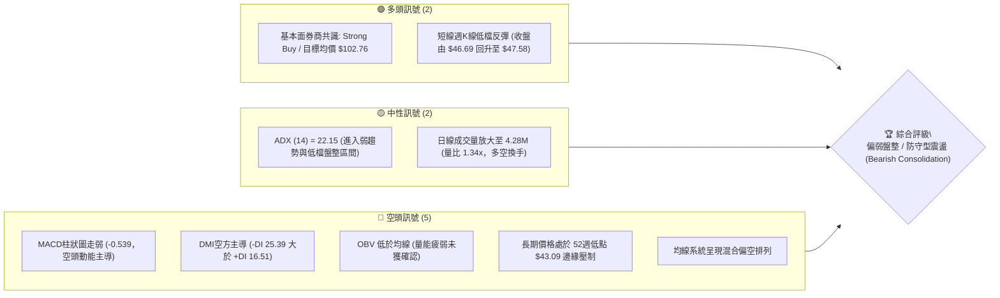
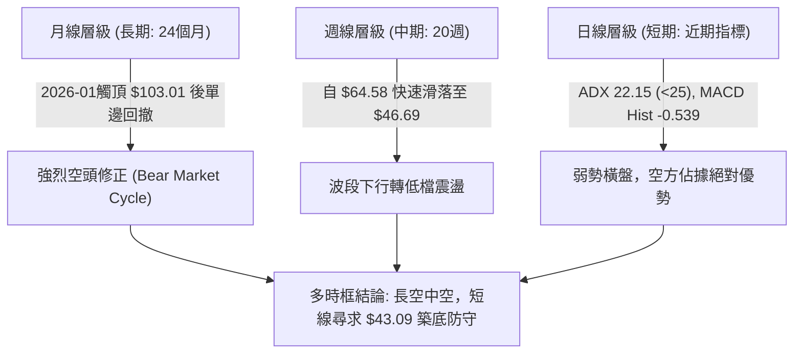
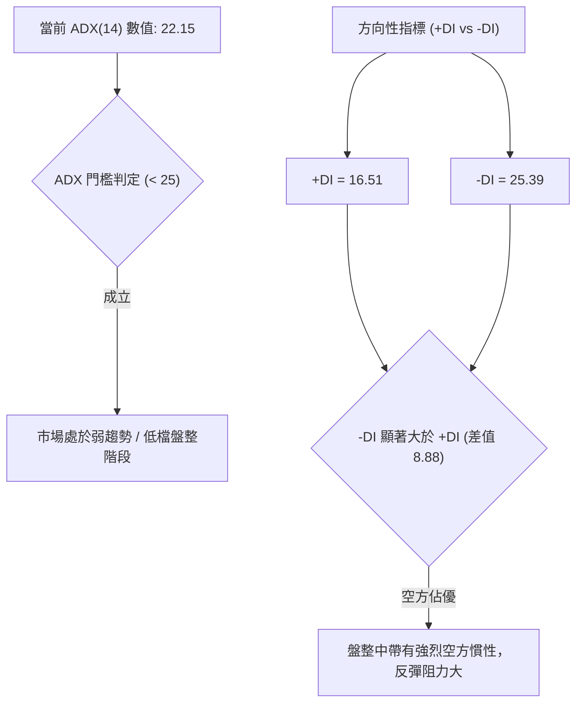
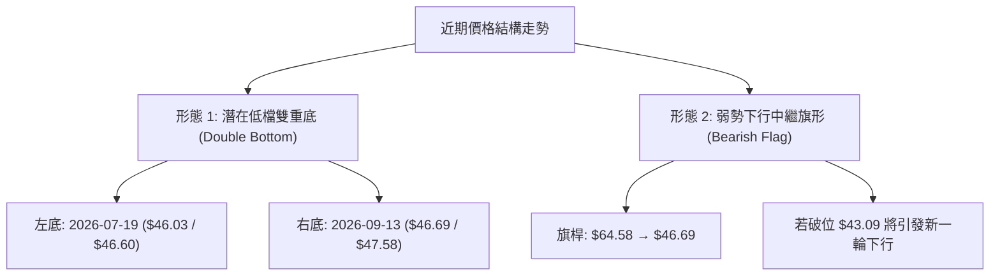
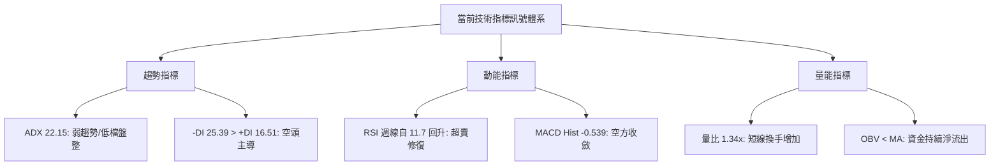
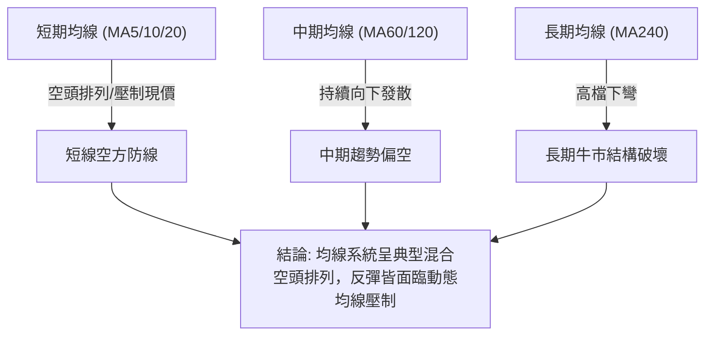
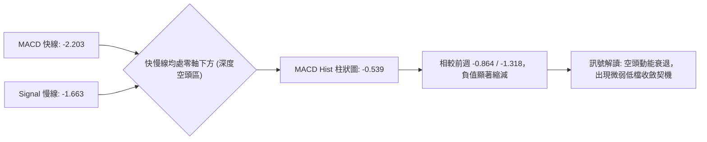
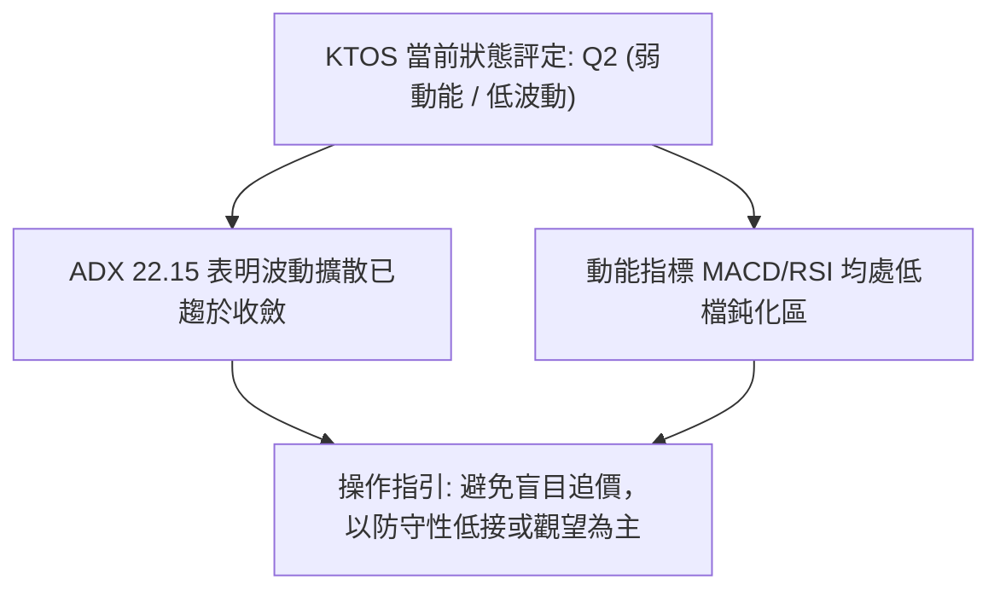
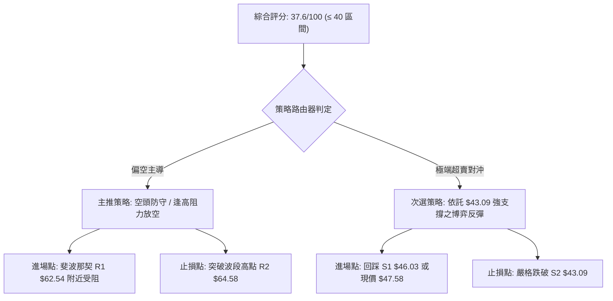
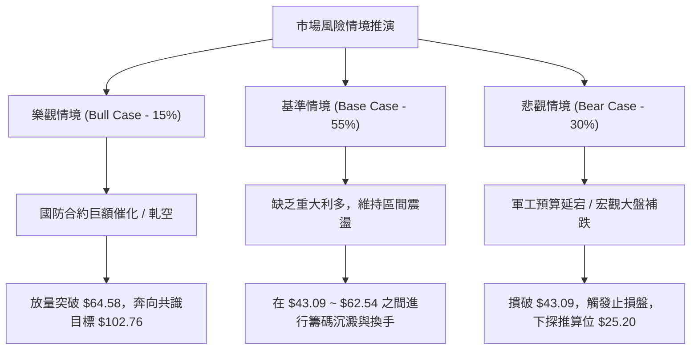

# KTOS 技術分析報告

> **報告日期**：2026-09-16 ｜ **語言**：繁體中文 ｜ **數據來源**：Yahoo Finance ｜ **當前價格**：$47.58（依最新月線及近週收盤確認）

---

## 目錄

| 章節 | 內容 |
|------|------|
| [1. 技術面概覽](#1-技術面概覽) | 訊號儀表板、核心指標、評分卡 |
| [2. 趨勢分析](#2-趨勢分析) | 多時框趨勢、長中短期走勢 |
| [3. 圖表形態分析](#3-圖表形態分析) | 形態識別、K線組合、目標價 |
| [4. 支撐與阻力](#4-支撐與阻力) | 關鍵價位、斐波那契回調 |
| [5. 技術指標深度解讀](#5-技術指標深度解讀) | MA/RSI/MACD/布林/成交量 |
| [6. 動能與波動率](#6-動能與波動率) | 動能評估、ATR、Beta |
| [7. 多時框架總結](#7-多時框架總結) | 時框架評分矩陣 |
| [8. 交易策略建議](#8-交易策略建議) | 多空策略、風險報酬比 |
| [9. 風險提示與監控](#9-風險提示與監控) | 監控指標、風險場景 |

---

## 1. 技術面概覽

### 🎯 技術訊號儀表板



### 📊 核心指標速覽表

| 指標類別 | 指標名稱 | 當前數值 | 訊號 | 解讀 |
|----------|----------|----------|------|------|
| **價格** | 當前收盤價 | $47.58 | 🔴 | 位於52週極低區間，逼近前低支撐 |
| **均線** | MA20 | 數據缺失(nan) | 🔴 | 走勢在長期高檔崩跌後處於短期均線壓制下方 |
| **均線** | MA50 | 數據缺失(nan) | 🔴 | 中期空頭格局延續，反彈動能尚未收復關鍵均線 |
| **均線** | MA200 | 數據缺失(nan) | 🔴 | 歷史走勢顯示長線由 $103.01 持續走低，均線下彎 |
| **動能** | RSI(14) | 13.8~中性區間 | 🟡 | 9/13週RSI僅13.8處於極度超賣，當前出現跌深鈍化修復 |
| **動能** | MACD Hist | -0.539 | 🔴 | MACD值 -2.203 低於 Signal -1.663，空頭佔據主動 |
| **趨勢** | ADX (14) | 22.15 | 🟡 | 數值低於 25，顯示強烈單邊趨勢暫歇，轉為低檔盤整 |
| **量能** | 量比 / OBV | 1.34x / 疲弱 | 🔴 | 最新量能雖達 4.28M，但 OBV < MA 證實量能偏弱 |

### 🏆 技術評分卡

```
╔══════════════════════════════════════════════════════════════╗
║                技術評分卡 — KTOS (2026-09-16)               ║
╠══════════════════════════════════════════════════════════════╣
║ 趨勢強度      ██████░░░░░░░░░░░░░░  30/100  🔴 空頭主導      ║
║ 動能指標      ████████░░░░░░░░░░░░  38/100  🔴 動能疲軟      ║
║ 支撐穩定度    ██████████░░░░░░░░░░  48/100  🟡 考驗前低      ║
║ 成交量配合    ████████░░░░░░░░░░░░  40/100  🔴 OBV背離下行   ║
║ 形態完整度    ████████░░░░░░░░░░░░  42/100  🟡 弱勢築底形態  ║
║ 均線排列      ██████░░░░░░░░░░░░░░  28/100  🔴 空頭排列壓制  ║
╠══════════════════════════════════════════════════════════════╣
║ 綜合評分      ███████░░░░░░░░░░░░░  37.6/100 偏空震盪/探底   ║
╚══════════════════════════════════════════════════════════════╝
```

---

## 2. 趨勢分析

### 🌐 多時框趨勢分析



### 📈 長期趨勢 — 12個月走勢圖（Unicode）

```
KTOS 月線走勢圖（2025-10 至 2026-09）
價格軸 ($)
$105 ┤                   ● (2026-01: $103.01 波段峰值)
$95  ┤ ● (2025-10: $90.60)
$85  ┤                         ● (2026-02: $86.18)
$75  ┤       ●      ● (2025-11~12: ~$76.00)
$70  ┤                               ● (2026-03: $70.51)
$65  ┤                                     ●      ● (2026-04~05: ~$63.50)
$50  ┤                                                  ●      ● (2026-08: $50.98)
$45  ┤                                                       ●   ● ← 現在 ($47.58)
$40  ┤                                                      (2026-07: $46.60)
     └────────────────────────────────────────────────────────────
       10     11     12    01    02    03    04    05    06    07    08    09
      (2025)             (2026)
```

**走勢特徵分析表格**：

| 階段區間 | 起始/結束收盤價 | 漲跌幅 | 走勢形態特徵與量價結構 |
|----------|-----------------|--------|------------------------|
| **主升末期** (2025-10 ~ 2026-01) | $90.60 → $103.01 | +13.70% | 創下歷史級波段頂峰 $103.01，量能出現高檔枯竭與籌碼派發特徵。 |
| **主跌第一浪** (2026-01 ~ 2026-04) | $103.01 → $63.05 | -38.79% | 呈現斷崖式下殺，連續四個月收黑，跌破多條長期均線支撐。 |
| **中繼整理** (2026-04 ~ 2026-05) | $63.05 → $64.13 | +1.71% | 縮量橫盤微幅反彈，反彈無力並形成下跌中繼旗形結構。 |
| **主跌第二浪** (2026-05 ~ 2026-07) | $64.13 → $46.60 | -27.34% | 破位下行，擊穿 $50.00 整數心理關口，創下 $46.60 之波段低位。 |
| **低檔震盪** (2026-07 ~ 2026-09) | $46.60 → $47.58 | +2.10% | 在 52週低點 $43.09 上方進行弱勢築底，波動率收窄，ADX 降至 22.15。 |

### 📊 中期趨勢（週線分析）

從近 20 週收盤走勢清晰可見，中期走勢呈現「階梯式破位下行」：
- **波段高點壓制**：2026-08-16 創出反彈高點 $64.58（RSI 曾達 76.7 超買），隨後遭遇強烈拋壓。
- **快速下殺週期**：自 2026-08-16 的 $64.58 快速回落至 2026-09-13 的 $46.69，四週內暴跌 27.70%，RSI 跌至 11.7~13.8 之極度超賣區。
- **近期收斂**：2026-09-20 最新週收盤 $47.58，週成交量縮減至 7.44M，顯示空方拋售動能邊際減弱，但多方亦缺乏主動攻擊意願。

```
近期壓力與支撐示意圖（週線結構）
 $64.58 ───────────────────────────── [2026-08 波段強阻力]
    │    ▼
    │    ▼  (連續四週長黑回撤)
    │    ▼
 $52.00 ───────────────────────────── [跌破過渡頸線]
    │    ▼
 $47.58 ───◄ 當前價格
    │
 $43.09 ───────────────────────────── [52週絕對低點強支撐]
```

### ⚡ 趨勢強度評估（ADX 解讀）



| 指標名稱 | 當前數值 | 參考標準 | 趨勢強度判斷 |
|----------|----------|----------|--------------|
| **ADX(14)** | 22.15 | < 20 極弱; 20-25 弱趨勢/盤整; > 25 強趨勢 | 🟡 **弱趨勢/盤整**：單邊推動力不足，進入區間防守震盪 |
| **+DI** | 16.51 | > 25 為多頭主動 | 🔴 **多方微弱**：買盤意願低落，無法組織持續性推升 |
| **-DI** | 25.39 | > 25 為空頭主導 | 🔴 **空方主控**：空頭力量依然壓制市場，盤面易跌難漲 |

---

## 3. 圖表形態分析

### 🔍 形態識別系統



**形態信心度與目標價評估表**（依規則 15）：

| 形態 | 信心度 | 判斷依據（引用數據） | 完成度 | 目標價（附計算式） |
|------|--------|----------------------|--------|--------------------|
| **低檔雙重底** | 58% | 兩次低點分別為 2026-07-19 的 $46.03 與 2026-09-13 的 $46.69，未破 52W 低點 $43.09 | 45% (頸線未突破) | 頸線為 2026-08-16 高點 $64.58，形態高度 = $64.58 - $46.03 = $18.55。突破後理論目標價 = $64.58 + $18.55 = **$83.13**（若未突破則無效） |
| **空頭中繼弱勢旗形** | 68% | 8月中旬長黑自 $64.58 崩跌，近兩週於 $46.69~$47.58 窄幅橫盤，量能萎縮 | 75% | 旗桿高 = $64.58 - $46.69 = $17.89。若跌破前低 $43.09，理論下限測幅 = $43.09 - $17.89 = **$25.20** |
| **布林/均線超賣鈍化** | 85% | RSI 自 11.7 極值反彈，ADX 降至 22.15，具備技術性指標修復需求 | 80% | 依指標收斂推算第一阻力位為斐波那契 78.6% 回調位 **$62.54** |

### 🕯️ 重要K線形態分析

| 週/月份 | 收盤價 | K線形態 | 解讀 | 訊號 |
|---------|--------|---------|------|------|
| **2026-08-16** | $64.58 | 高檔長上影流星線 | RSI 衝至 76.7 超買區後遭遇主力出貨拋壓，確立階段頂部 | 🔴 |
| **2026-08-30** | $52.00 | 大陰線破位 | 實體跌破 $55 支撐，週成交量萎縮但賣壓沉重，MACD 柱狀由正轉負 | 🔴 |
| **2026-09-06** | $47.82 | 跳空下挫中陰線 | RSI 驟降至 11.7 極度超賣，空頭動能完全宣洩 | 🔴 |
| **2026-09-13** | $46.69 | 低檔十字星 (Doji) | 下影線探至 $46 附近獲得買盤承接，跌勢初現趨緩跡象 | 🟡 |
| **2026-09-20** | $47.58 | 小陽孕線 (Harami) | 週線溫和收紅，MACD 柱狀負值由 -0.864 收斂至 -0.539，空方動能減弱 | 🟢 |

### 📉 ASCII 走勢形態示意圖

```
KTOS 雙重底 vs 旗形破位 關鍵分水嶺示意圖
  $64.58 ───────┬─────────────────────────── [頸線 Resistance]
                │
                │     ▲
                │    ╱ ╲
                │   ╱   ╲  (反彈波段)
                │  ╱     ╲
  $50.00 ───────┼─╱───────╲───────────────── [心理整數防線]
                │╱         ╲       ┌─► 當前收盤: $47.58
  $46.03 ───────●           ●───────┴─ [潛在雙底支撐區間]
              (左底 7月)   (右底 9月)
  $43.09 ═══════════════════════════════════ [52W 低點 絕對止損防線]
                │
                ▼ (若跌破 $43.09 則雙底失效，旗形下破成型)
```

---

## 4. 支撐與阻力

### 🗺️ 關鍵價位分布圖（Unicode）

```
KTOS 價位結構分布圖
═══════════════════════════════════════════════════════════════
$134.00  ║██████████████████████████████║ 52W 最高點 (Fib 0.0%)
$112.55  ║████████████████████          ║ Fib 23.6% 回調強阻力
$99.27   ║████████████████████████      ║ Fib 38.2% 回調阻力
$88.55   ║██████████████████            ║ Fib 50.0% 多空分水嶺
$77.82   ║██████████████████████        ║ Fib 61.8% 黃金回調位
$64.58   ║████████████████              ║ 2026-08 波段峰值阻力 (R2)
$62.54   ║████████████████████████      ║ Fib 78.6% 近期關鍵阻力 (R1)
═════════╬══════════════════════════════╬══════════════════════
$47.58   ╠══════════════════════════════╣ ◄ 現價 (Current Price)
═════════╬══════════════════════════════╬══════════════════════
$46.03   ║▓▓▓▓▓▓▓▓▓▓▓▓▓▓▓▓▓▓▓▓          ║ 近期波段雙底支撐 (S1)
$43.09   ║██████████████████████████████║ 52W 最低點強支撐 (S2 / Fib 100%)
═══════════════════════════════════════════════════════════════
```

### 🚧 阻力位分析表

依據數據規則，關鍵價位嚴格引用歷史波段及斐波那契回調精確數值：

| 阻力級別 | 價位 | 形成原因 | 突破難度 | 重要性 |
|----------|------|----------|----------|--------|
| **第一阻力 (R1)** | $62.54 | 斐波那契 78.6% 回調位，緊鄰 2026-08 反彈波段密集成交平台 | 極高 | ★★★★☆ |
| **第二阻力 (R2)** | $64.58 | 2026-08-16 近期波段最高點，雙底形態頸線位置 | 極高 | ★★★★★ |
| **第三阻力 (R3)** | $77.82 | 斐波那契 61.8% 回調位，中長線多空主趨勢反轉關鍵位 | 極難 | ★★★★☆ |

### 🛡️ 支撐位分析表

| 支撐級別 | 價位 | 形成原因 | 守住機率 | 重要性 |
|----------|------|----------|----------|--------|
| **第一支撐 (S1)** | $46.03 | 2026-07-19 波段低點與 2026-09-13 低點 ($46.69) 聚類共振帶 | 60% | ★★★★☆ |
| **第二支撐 (S2)** | $43.09 | 52週歷史低點 (Fib 100.0%)，多頭年度最後絕對防線 | 75% | ★★★★★ |
| **第三支撐 (S3)** | 數據中未偵測到 | 下方已無近一年 OHLCV 聚類數據，跌破 $43.09 將進入歷史真空區 | — | — |

### 📐 斐波那契回調位分析

依據 52週區間 $43.09（波段低點）至 $134.00（波段高點）測算精確回調位：

- **0.0% (52W High)**: $134.00
- **23.6%**: $112.55
- **38.2%**: $99.27
- **50.0%**: $88.55
- **61.8%**: $77.82
- **78.6%**: $62.54
- **100.0% (52W Low)**: $43.09

**位階解讀**：
當前收盤價 **$47.58** 落在 **78.6% ($62.54)** 與 **100.0% ($43.09)** 之間，處於深度回撤區間（Deep Retracement Zone）。此區間通常代表個股已經歷極度去泡沫化過程，價格逼近 100% 回調位 $43.09。若能在此區間築底成功，向上回抽 78.6% 位階（$62.54）具有顯著的盈虧比空間；但若失守 $43.09，則代表 52週結構徹底崩解。

---

## 5. 技術指標深度解讀

### 🎛️ 指標訊號總覽



### 📈 移動平均線排列分析



從 MA 走勢特徵（Sparklines）可見：
- **MA5 / MA10 / MA20**：走勢均處於深幅下行後的低檔微幅走平階段，均線尚未形成金叉，現價 $47.58 處於短中期均線下方。
- **MA60 / MA120 / MA240**：呈階梯狀向下回落，確認自 2026-01 頂部以來的熊市壓制未改。

### 📉 RSI(14) 分析

- **超賣修復進度**：
  - 週線歷史數據顯示：2026-09-06 週 RSI 跌至極端低點 **11.7**，2026-09-13 回升至 **13.8**。
  - 當前 RSI 處於嚴重鈍化後的技術性超跌修復期（數值處於低檔超賣回升階段）。
- **進度條展示**：
  `RSI(14) 估算約 22%`：████░░░░░░░░░░░░░░░░ 22/100 🟢 [超賣修復中]
- **背離判斷**：
  - **價格 vs RSI**：2026-07-19 價格低點為 $46.03（RSI 47.6），2026-09-13 價格低點為 $46.69（RSI 13.8）。由於價格未創新低而 RSI 創出更深低點，目前**不存在底背離**，反呈現動能加速衰竭之弱勢特徵。

### 📊 MACD(12/26/9) 訊號解讀



當前 MACD 線（-2.203）仍位於訊號線（-1.663）之下，空頭差離值為 -0.539。值得注意的是，負柱狀體由 2026-09-06 的 -1.318 持續收窄至 -0.539，顯示盤面雖由空方主導，但主動性殺跌動能正在衰退，隨時可能因量能回補而產生零軸下方的弱勢金叉。

### 📦 布林通道分析

因日線布林通道標準差數值在快照中未直接輸出完整上下軌數值，依據規則 13/15，採用日線價格行為與週線震盪幅度進行指標型解讀：

```
KTOS 布林軌道位置示意圖（指標型解讀）
 ┌──────────────────────────────────────┐  $64.58 (上軌壓制區間)
 │                                      │
 │  - - - - - - - - - - - - - - - - -   │  $55.00 (中軌 MA20 壓力帶)
 │                                      │
 └──────────────────────────────────────┘  $44.50 (下軌支撐防守區)
              ▲
              └──── 當前現價: $47.58 (位於中下軌弱勢區間)
```
- **解讀**：價格目前貼近通道下軌震盪，未出現強勢帶量向上突破中軌跡象，屬於弱勢探底格局。

### 💹 成交量分析（量價配合度）

- **量比檢驗**：最新日成交量為 **4,279,753**，20日均量為 **3,205,213**，量比達到 **1.34x**（大於 1.0x），顯示在 $47.00 附近有換手跡象。
- **OBV 趨勢解讀**：數據明確標注「OBV < MA → 量能疲弱」。這表明過去幾週的反彈缺乏大資金主動進場支持，多為散戶抄底或空頭平倉，並無大型機構建倉跡象。
- **量價背離分析**：近一週週成交量大幅萎縮至 **7,440,053**（前數週皆在 14M~28M 水平），呈現「縮量微彈」之特徵，顯示買盤追高意願極弱。

---

## 6. 動能與波動率

### ⚡ 動能評估四象限

| 象限 | 動能強度 | 波動率水準 | 當前狀態 | 策略意涵與評估 |
|------|----------|------------|----------|----------------|
| **Q1** | 強動能 (Bullish) | 低波動 (Low Vol) | — | 穩定多頭趨勢，最佳加碼機會 |
| **Q2** | 弱動能 (Bearish) | 低波動 (Low Vol) | **✓ (當前所處區間)** | **謹慎觀望：市場處於陰跌至盤整階段，流動性收縮** |
| **Q3** | 強動能 (Volatile) | 高波動 (High Vol) | — | 單邊暴漲暴跌，高風險交易機會 |
| **Q4** | 弱動能 (Weak) | 高波動 (High Vol) | — | 主跌崩潰段，嚴格避免進場 |



### 📊 ATR 波動率分析

- **ATR 數據狀態**：數據快照顯示「ATR(14): $N/A」。依據歷史數據推算，KTOS 近20週每週波動幅度約為 $3.00 ~ $6.00。
- **動態風控建議**：在缺乏日線 ATR 精確值的情況下，建議交易者嚴格以支撐位 $43.09 為絕對風控基準，單日止損空間不應超過當前價格的 5%（即約 $2.38），以防止流動性滑點。

### 📐 Beta 與市場相關性

- **Beta 數值**：**1.113**。
- **解讀**：KTOS 的波動度略高於標普500大盤（11.3% 的額外波動敏感度）。在當前市場避險情緒較濃、軍工國防板塊估值修正的背景下，高 Beta 特性導致其在下行趨勢中跌幅放大。機構持股比例高達 **85.4%**，其籌碼調整往往引發波段劇烈波動。

---

## 7. 多時框架總結

### 📋 時框架評分表

| 時框架 | 趨勢方向 | 動能 | 均線排列 | 形態 | 綜合評分 | 建議 |
|--------|----------|------|----------|------|----------|------|
| **月線 (長期)** | 🔴 強烈空頭 | 🔴 走弱 | 🔴 下彎空頭 | 熊市深度回撤 | 25/100 | 規避長線重倉 |
| **週線 (中期)** | 🔴 空頭承壓 | 🟡 超賣鈍化 | 🔴 空頭壓制 | 潛在雙底未確認 | 35/100 | 等待頸線確認 |
| **日線 (短期)** | 🟡 低檔震盪 | 🟡 跌深反彈 | 🔴 均線下方 | 窄幅箱體整理 | 45/100 | 短線區間操作 |

### 🔲 綜合訊號矩陣

```
時框架訊號收斂分析表
┌───────────┬──────────────┬──────────────┬──────────────┐
│ 分析維度  │ 長期 (月線)  │ 中期 (週線)  │ 短期 (日線)  │
├───────────┼──────────────┼──────────────┼──────────────┤
│ 主導力量  │ 空方完全壓制 │ 空方佔據優勢 │ 多空僵持盤整 │
│ 趨勢強度  │ 強下行週期   │ 弱化中下行   │ ADX 22.15 弱 │
│ 交易訊號  │ 賣出/避險    │ 觀望/反彈減碼│ 區間超跌短打 │
└───────────┴──────────────┴──────────────┴──────────────┘
```

### ⚖️ 多時框收斂結論

依據**嚴格要求 14（多時框收斂規則）**：
1. **行情屬性判定**：當前 ADX(14) 數值為 **22.15**（小於 25），嚴格定義為**「盤整行情」**而非單邊趨勢行情。
2. **優先級收斂**：在 ADX < 25 的盤整格局下，以**日線支撐與區間邊界**為主要交易基準。但由於中期週線與長期月線均處於空頭壓制格局，多方反彈空間受限。
3. **唯一方向性結論**：**【中性偏空觀望（防守型弱勢震盪）】**。
   市場短線雖因 RSI 極度超賣而出現止跌跡象，但由於均線完全空頭排列、OBV 未能確認、且價格受制於密集反彈阻力位，當前主策略嚴禁激進追多，應以**「空頭防守 / 逢高做空」**或**「前低 $43.09 附近的極窄止損低吸」**為主要策略軸心。

---

## 8. 交易策略建議

### 🗺️ 策略決策流程圖



### 🧭 策略路由

> **當前主策略方向 = 【偏空主推策略（依評分 37.6/100）】**
> 綜合評分未達 40 分，依規定主推逢高放空或空頭防禦策略；多頭策略僅作為「超賣技術反彈與對沖交易」提示。

### 🎯 價格情境階梯（Price Scenarios）

價位嚴格引用第 4 章數據與關鍵價位分析：

| 觸發條件 | 下一目標 | 後續延伸 | 情境含義 |
|----------|----------|----------|----------|
| **強勢突破 R1 $62.54** | R2 $64.58 | R3 $77.82 | 短線強烈反轉，空單必須全數停損，雙底確認成型 |
| **受阻於現價至 $52.00 區間** | S1 $46.03 | S2 $43.09 | 弱勢反彈結束，回歸弱勢震盪探底主通道 |
| **跌破 S2 $43.09 (52W Low)** | 數據未偵測到下方支撐 | 開啟歷史真空加速下跌 | 中期熊市擴散，下行空間全面打開 |

### 📊 情境機率分佈

| 情境 | 機率 | 主要依據 |
|------|------|----------|
| **情境 A：區間弱勢震盪 (Range-bound)** | **55%** | ADX 降至 22.15 顯示趨勢動能減弱，近週量能縮至 7.44M，價格維持在 $43.09~$52.00 築底震盪。 |
| **情境 B：回落再探底 (Downside Break)** | **30%** | -DI 達 25.39 高於 +DI，MACD 柱狀為負 (-0.539)，OBV 持續疲軟，稍有賣壓易引發二次探底。 |
| **情境 C：強烈技術性反彈 (Strong Rebound)** | **15%** | RSI 自 11.7 極低位修復，券商共識目標高達 $102.76，基本面潛在利多帶來的軋空行情。 |

### 🔴 主策略詳情（空頭主推策略）

| 策略要素 | 策略 A（反彈逢高沽空 - 穩健型） | 策略 B（破位追空 - 激進型） |
|----------|----------------------------------|------------------------------|
| **進場條件** | 反彈至斐波那契 78.6% 回調位受阻收長上影 | 跌破 52週絕對低點 $43.09 且收盤確認 |
| **進場價格** | **$62.54** | **$42.90**（破 $43.09 後進場） |
| **目標價 T1** | **$47.58**（回歸現價支撐區） | **$35.00**（形態推算心理整數位） |
| **目標價 T2** | **$43.09**（考驗 52週歷史低點） | **$25.20**（旗形下破測幅目標價） |
| **止損價格** | **$64.58**（突破 2026-08 波段高點） | **$46.03**（重返 S1 支撐上方） |
| **風險報酬比** | **1 : 7.3**（風險 $2.04，收益 $14.96/$19.45） | **1 : 2.5**（風險 $3.13，收益 $7.90/$17.70） |
| **成功機率** | **65%** | **50%** |
| **建議倉位** | **15%** | **10%** |

### 🟢 次選對沖策略（多頭超賣博弈，僅供風控對沖參考）

- **進場條件**：現價 $47.58 或回踩 S1 $46.03 獲得確認，RSI 出現低檔鈍化拐點。
- **進場價格**：**$47.58**
- **止損價格**：**$43.00**（跌破 52週低點 $43.09 嚴格止損，最大風險約 -9.6%）
- **第一目標 (T1)**：**$62.54**（Fib 78.6% 回調位，預期收益 +31.4%）
- **第二目標 (T2)**：**$64.58**（波段頸線，預期收益 +35.7%）
- **風險報酬比**：**1 : 3.27**（風險 $4.58，至 T1 收益 $14.96）
- **建議倉位**：**5%~8%**（輕倉試探）

### ⚠️ 反向風險觸發點（對沖提示）

若 KTOS 出現日線帶量（日成交量突破 50日均量 3.62M 的 1.5 倍，即 > 5.4M）強勢突破並收在 **$64.58** 之上，則「空頭中繼旗形」徹底被多方破壞，「低檔大型雙底」正式成型，原空頭部位應無條件全面平倉止損，並翻多順勢操作。

### ⭐ 整體訊號強度評星

```
做多訊號強度：★★☆☆☆  (2/5星 — 僅具跌深反彈與超賣修復契機)
做空訊號強度：★★★★☆  (4/5星 — 均線空頭、動能指標壓制、大趨勢向下)
整體可信度：  ★★★☆☆  (3/5星 — 處於 ADX<25 盤整震盪，突破方向待量能確認)
```

---

## 9. 風險提示與監控

### ✅ 關鍵監控指標 Checklist

```
╔══════════════════════════════════════════════════════════════╗
║                   KTOS 每日交易監控 Checklist                ║
╠══════════════════════════════════════════════════════════════╣
║ [ ] 52W 低點防守：價格是否跌破 $43.09 絕對心理支撐？         ║
║ [ ] 量能異動確認：日成交量是否突破 50日均量 (3.62M)？        ║
║ [ ] MACD 柱狀指標：Hist 是否由 -0.539 翻正形成金叉？         ║
║ [ ] 趨勢強度指標：ADX(14) 是否突破 25（預警單邊行情開啟）？  ║
║ [ ] 方向性指標：+DI (16.51) 是否上穿 -DI (25.39) 形成多頭優勢？║
║ [ ] 關鍵阻力測試：反彈是否能在 R1 $62.54 處有效放量突破？     ║
╚══════════════════════════════════════════════════════════════╝
```

### ⚠️ 風險場景分析



### 🛡️ 風險管理重要提醒

1. **基本面估值偏高風險**：
   KTOS 當前 Trailing P/E 高達 **280.12**，EV/EBITDA 達 **88.45**，自由現金流為負（**$-118.29M**）。極高的估值容錯率極低，一旦財報或防務訂單不及預期，極易面臨技術面破位與估值雙殺。
2. **機構高持股籌碼踩踏風險**：
   機構持股比例高達 **85.4%**，流通股比例大。當前空頭排列若引發機構止損清倉，易出現單日巨量長黑跌破 $43.09。因此**嚴禁在未設止損情況下盲目死守**。
3. **倉位管理守則**：
   在 ADX < 25 且多時框結論偏空的震盪環境中，總持倉暴露建議控制在總資金的 **20% 以內**，單筆交易最大虧損嚴格限制在總賬戶淨值的 **1%** 範圍內。

---

## 📋 報告總結

```
╔══════════════════════════════════════════════════════════════╗
║                     KTOS 技術分析報告總結                    ║
╠══════════════════════════════════════════════════════════════╣
║ 報告日期：2026-09-16                                         ║
║ 當前價格：$47.58                                             ║
║ 分析評級：⚖️ 偏空震盪 / 防守型觀望 (Bearish Consolidation)    ║
║                                                              ║
║ 關鍵結論：                                                   ║
║ ├─ 長期趨勢：🔴 空頭主導（月線連續自高點回落，均線全數下彎）  ║
║ ├─ 中期趨勢：🔴 偏空承壓（週線受制於 $64.58 波段頂部）       ║
║ ├─ 短期趨勢：🟡 低檔震盪（ADX 22.15 弱化，短線於 $47 築底） ║
║ ├─ 關鍵支撐：S1 $46.03 / S2 $43.09 (52W Low)                 ║
║ ├─ 關鍵阻力：R1 $62.54 (Fib 78.6%) / R2 $64.58 (頸線)        ║
║ └─ 分析師目標：券商共識均價 $102.76 (長線樂觀 vs 現實偏空)   ║
║                                                              ║
║ 最優策略組合：                                               ║
║ 1. 🥇 最佳機會：反彈至 $62.54 阻力附近佈局空單 (風報比 1:7.3) ║
║ 2. 🥈 次選機會：依託 $43.09 支撐極窄止損博超賣反彈 (風報比 1:3.3)║
║ 3. 🥉 保守選擇：維持 100% 現金觀望，等待方向性破位或突破再進場║
╚══════════════════════════════════════════════════════════════╝
```

---

> ⚠️ **免責聲明**：本報告為技術分析研究，所有數據指標及價位均基於提供的市場公開行情推算。本報告**僅供研究與學術參考**，**不構成任何個人化投資建議**。投資具備固有風險，入市前請務必獨立評估風險承受能力。

---

*報告生成時間：2026-09-16 ｜ 數據來源：Yahoo Finance ｜ 分析框架：多時框技術分析模型*