# KTOS 技術分析報告

> **報告日期**：2026-09-17 ｜ **語言**：繁體中文 ｜ **數據來源**：Yahoo Finance ｜ **當前價格**：$47.59

---

## 目錄

| 章節 | 內容 |
|------|------|
| [1. 技術面概覽](#1-技術面概覽) | 訊號儀表板、核心指標、評分卡 |
| [2. 趨勢分析](#2-趨勢分析) | 多時框趨勢、長中短期走勢 |
| [3. 圖表形態分析](#3-圖表形態分析) | 形態識別、K線組合、目標價 |
| [4. 支撐與阻力](#4-支撐與阻力) | 關鍵價位、斐波那契回調 |
| [5. 技術指標深度解讀](#5-技術指標深度解讀) | MA/RSI/MACD/布林/成交量 |
| [6. 動能與波動率](#6-動能與波動率) | 動能評估、ATR、Beta |
| [7. 多時框架總結](#7-多時框架總結) | 時框架評分矩陣 |
| [8. 交易策略建議](#8-交易策略建議) | 多空策略、風險報酬比 |
| [9. 風險提示與監控](#9-風險提示與監控) | 監控指標、風險場景 |

---

## 1. 技術面概覽

### 🎯 技術訊號儀表板

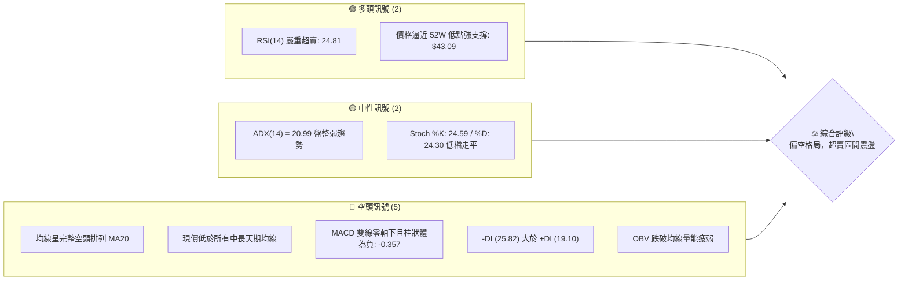

### 📊 核心指標速覽表

| 指標類別 | 指標名稱 | 當前數值 | 訊號 | 解讀 |
|----------|----------|----------|------|------|
| **價格** | 當前價格 | $47.59 | 🔴 | 位於 52W 區間 4.9% 極低檔，距年內高點 $134.00 大幅下挫 |
| **均線** | MA20 | $50.68 | 🔴 | 現價低於 MA20 達 -6.10%，短期下壓沉重 |
| **均線** | MA50 | $51.84 | 🔴 | 現價低於 MA50，中期趨勢受壓制 |
| **均線** | MA200 | $70.76 | 🔴 | 現價遠低於 MA200（-32.74%），長期結構為空頭控制 |
| **動能** | RSI(14) | 24.81 | 🟢 | 進入極度超賣區（<30），短線存在強烈技術性反彈修復需求 |
| **動能** | MACD | -2.100 | 🔴 | DIF 線與訊號線（-1.744）均在零軸之下，柱狀圖 -0.357 延續空頭動能 |
| **波動** | ATR(14) | $2.17 | 🟡 | 佔股價 4.57%，波動度適中，日波幅空間明確 |

### 🏆 技術評分卡

```
╔══════════════════════════════════════════════════════════════╗
║              技術評分卡 — KTOS (2026-09-17)                  ║
╠══════════════════════════════════════════════════════════════╣
║ 趨勢強度      █████░░░░░░░░░░░░░░░  25/100  🔴 空頭主導      ║
║ 動能指標      ███████░░░░░░░░░░░░░  35/100  🟡 超賣醞釀反彈  ║
║ 支撐穩定度    ██████████░░░░░░░░░░  50/100  🟡 臨近S1/S2支撐 ║
║ 成交量配合    ██████░░░░░░░░░░░░░░  30/100  🔴 量能未能推升  ║
║ 形態完整度    ████████░░░░░░░░░░░░  40/100  🔴 低檔平台弱整理║
║ 均線排列      ████░░░░░░░░░░░░░░░░  20/100  🔴 嚴格空頭排列  ║
╠══════════════════════════════════════════════════════════════╣
║ 綜合評分      ███████░░░░░░░░░░░░░  33/100  🔴 偏空 (反彈對抗)║
╚══════════════════════════════════════════════════════════════╝
```

---

## 2. 趨勢分析

### 🌐 多時框趨勢分析

```mermaid
graph TD
    A["月線框架 (長線)"] -->|"2026年1月衝高 $103.01 後持續下挫，跌破MA200"| B["🔴 空頭主導（尋求52W低點 $43.09 支撐）"]
    C["週線框架 (中線)"] -->|"近20週由 $64.58 階梯式回落，均線呈空頭發散"| D["🔴 空頭控制（弱勢盤跌）"]
    E["日線框架 (短線)"] -->|"ADX("14") = 20.99 (<25)，進入下軌盤整打底"| F["🟡 超賣區間震盪（下軌 $42.73 ~ 中軌 $50.68）"]
    
    B --> G{"多時框收斂權重"}
    D --> G
    F --> G
    G --> H["綜合研判：中長期下行趨勢中的短線超跌區間盤整"]
```

### 📈 長期趨勢 — 12個月走勢圖（Unicode）

```
KTOS 月線走勢圖（過去12個月：2025-10 至 2026-09）
價格軸 ($)
$105 ┤                               ●(2026-01: $103.01 高點)
$95  ┤ ●(2025-10: $90.60)           
$85  ┤                         ●
$75  ┤       ●(2025-11: $76.10) ●
$65  ┤                                     ●     ●
$55  ┤                                              
$45  ┤                                        ●  ●  ●(現價: $47.59)
$35  ┤
     └─────────────────────────────────────────────────────────────
      10    11    12    01    02    03    04    05    06    07    08    09
      2025             2026
```

#### 走勢特徵分析表格

| 階段區間 | 月份週期 | 起訖收盤價 | 漲跌幅 | 結構特徵與技術解讀 |
|----------|----------|------------|--------|--------------------|
| 第一階段：頂部構築 | 2025-10 ~ 2026-01 | $90.60 → $103.01 | +13.70% | 創下長波段高位後動能耗竭，形成多頭衰竭式衝頂 |
| 第二階段：流動性釋放 | 2026-01 ~ 2026-04 | $103.01 → $63.05 | -38.79% | 跌破所有短期均線，週線 MACD 連續翻負，主跌段成形 |
| 第三階段：中繼整理 | 2026-04 ~ 2026-05 | $63.05 → $64.13 | +1.71% | 於 $63-$64 形成弱勢橫盤，未獲量能確認 |
| 第四階段：破位沉淪 | 2026-05 ~ 2026-07 | $64.13 → $46.60 | -27.33% | 再次下破平台，直探年內低位區間，恐慌盤湧現 |
| 第五階段：低位磨底 | 2026-07 ~ 2026-09 | $46.60 → $47.59 | +2.12% | 於 $43.09-$50.98 構築窄幅震盪，動能指標收斂 |

### 📊 中期趨勢（週線分析）

```
KTOS 近期週線壓力與支撐位圖解
$65.00 ┤                     ▲ 波段反彈高點 $64.58 (2026-08-16)
$60.00 ┤              ▲      │
$55.00 ┤              │      │       ▲ 阻力 R2 $54.22
$51.00 ┤ ───────┼──────┼───────┼─────── 阻力 R1 $51.49 / MA20 ($50.68)
$47.59 ┤ ═══════╪══════╪═══════╪═══════ 現價 $47.59
$45.80 ┤ ┈┈┈┈┈┈┈┴┈┈┈┈┈┈┴┈┈┈┈┈┈┈┴┈┈┈┈┈┈┈ 近期支撐 S1 $45.80
$43.09 ┤ ────────────────────────────── 強支撐 S2 (52W Low) $43.09
```

週線數據顯示，KTOS 在 2026 年 8 月中旬反彈至 $64.58（RSI 曾高達 76.7）後迅速遭遇主力拋壓，隨後連續 4 週大幅走低。9 月初收盤價接連錄得 $47.82 與 $46.69，週線 RSI 一度跌至 11.7 極端超賣區。本週收報 $47.59，週線 MACD 柱狀體收斂至 -0.357，週線層面出現放緩下跌速度跡象。

### ⚡ 趨勢強度評估（ADX 解讀）

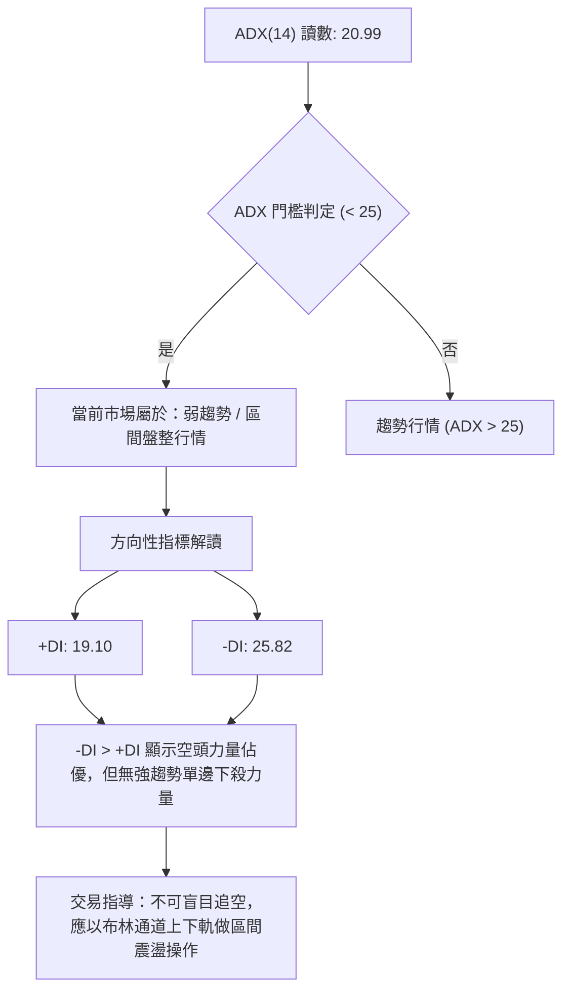

#### ADX 強度對照與市場狀態

| 指標變數 | 當前讀數 | 狀態門檻 | 意義與交易指引 |
|----------|----------|----------|----------------|
| **ADX(14)** | 20.99 | < 25 (弱趨勢) | 市場缺乏單邊發動動能，轉入低位消耗性盤整，適合區間擺動交易 |
| **+DI** | 19.10 | 空頭壓制 | 多方進攻能量偏弱，尚未奪回盤面主導權 |
| **-DI** | 25.82 | 主導方向 | 空方力量仍大於多方，但數值未高於 30，恐慌性拋壓已實質鈍化 |
| **多空差值** | -6.72 | 負向差值 | 空頭佔優，任何反彈初段皆受壓於布林中軌 $50.68 |

---

## 3. 圖表形態分析

### 🔍 形態識別系統

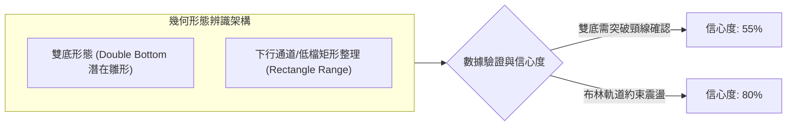

#### 形態識別與信心度評估表（依規則 15）

| 形態名稱 | 信心度 | 判斷依據（引用真實數據） | 完成度 | 目標價（附嚴格計算式） |
|----------|--------|--------------------------|--------|------------------------|
| **潛在雙底 (Double Bottom)** | 55% | 左底為 2026-07-19 週收盤 $46.03（低點聚類於 S2 $43.09 之上）；右底為 2026-09-13 週收盤 $46.69（靠近 S1 $45.80）。中間反彈頸線高點為 2026-08-16 之 $64.58。 | 45% (尚未突破頸線) | 依形態高度推算：頸線高點 $64.58 - 雙底低點 $43.09 = 形態高度 $21.49。突破頸線後目標價 = $64.58 + $21.49 = $86.07（中長線理論值）。目前僅為築底雛形。 |
| **低檔矩形盤整 (Trading Range)** | 80% | 價格受限於布林下軌 $42.73 至阻力位 R1 $51.49 之間，ADX 為 20.99，量能呈現萎縮，符合盤整帶特徵。 | 85% | 矩形區間上限即阻力 R1 $51.49；若有效突破，依箱體高度 ($51.49 - $43.09 = $8.40) 推算目標為 $59.89，貼近阻力 R3 $58.88。 |

### 🕯️ 重要K線形態分析

| 月份 | 收盤價 | K線形態 | 解讀 | 訊號 |
|------|--------|---------|------|------|
| **2026-06** | $49.86 | 大陰破位線 | 跌破 $60 心理關卡，放量下殺，確立主跌段 | 🔴 強烈看空 |
| **2026-07** | $46.60 | 下影長陰星線 | 探底至 S2 $43.09 附近獲買盤承接，開始出現低吸買盤 | 🟡 止跌信號 |
| **2026-08** | $50.98 | 長上影倒錘頭陽線 | 月中一度衝高至 $64.58 後大幅回落，上方套牢賣壓沉重 | 🔴 衝高受阻 |
| **2026-09** | $47.59 | 低位窄幅十字線 | 波動急劇萎縮，多空雙方在 S1 $45.80 上方僵持，孕育變盤 | 🟡 變盤前兆 |

### 📉 ASCII 走勢形態示意圖

```
KTOS 潛在雙底與箱體形態示意圖
價位 ($)
$64.58 ┤             ● (頸線位置 / 2026-08 反彈頂點)
       │            / \
$58.88 ┤-----------/---\--------------------------- 阻力 R3
$54.22 ┤----------/-----\-------------------------- 阻力 R2
$51.49 ┤---------/-------\---▲ 突破點 (阻力 R1 / 箱頂)
$47.59 ┤        /         \ / ◄ 當前價格 $47.59
$45.80 ┤       /           ● (右底打樁 $46.69 / 支撐 S1)
$43.09 ┤      ● (左底 $43.09 / 52W Low / 支撐 S2)
       └─────────────────────────────────────────────
             7月          8月          9月
```

### 🎯 形態目標價計算

根據上述已確認的低檔箱體整理幾何結構：
1. **箱體下限（基礎支撐）**：S2 = $43.09（52週波段低點）
2. **箱體上限（關鍵頸線）**：R1 = $51.49（波段反彈第一阻力聚類）
3. **箱體垂直高度**：$51.49 - $43.09 = $8.40
4. **最小突破上行目標**：頸線 $51.49 + 高度 $8.40 = **$59.89**（此價位精準呼應布林上軌 $58.63 與阻力 R3 $58.88 密集帶）
5. **破位下行測幅（風險防範）**：若跌破 S2 $43.09，依等幅下測：$43.09 - $8.40 = **$34.69**

---

## 4. 支撐與阻力

### 🗺️ 關鍵價位分布圖（Unicode）

```
KTOS 價位結構分布圖（真實數據對映）
═════════════════════════════════════════════════════════════════
$134.00 ║████████████████████████████████████║ 52W High (回調 0.0%)
$99.27  ║████████████████████                ║ 斐波那契 38.2% 回調位
$77.82  ║████████████████████████            ║ 斐波那契 61.8% 回調位
$70.76  ║████████████████████████████        ║ 長期生命線 MA200
$58.88  ║████████████████████████            ║ 強阻力 R3 (接近布林上軌 $58.63)
$54.22  ║████████████████                    ║ 中度阻力 R2
$51.49  ║████████████████████████            ║ 關鍵突破阻力 R1 (重疊 MA20/MA50)
$47.59  ╠════════════════════════════════════╣ ◄ 現價 $47.59
$45.80  ║▓▓▓▓▓▓▓▓▓▓▓▓▓▓▓▓                    ║ 近期防守支撐 S1
$43.09  ║████████████████████████████████████║ 52W Low / 強支撐 S2 (回調 100%)
═════════════════════════════════════════════════════════════════
```

### 🚧 阻力位分析表

所有阻力位數值嚴格引用近一年波段高點聚類與技術指標計算數值：

| 阻力級別 | 價位 | 形成原因 | 突破難度 | 重要性 |
|----------|------|----------|----------|--------|
| **關鍵阻力 R1** | $51.49 | 近一年波段次高點密集處，匯聚 MA20 ($50.68) 及 MA50 ($51.84)，空方密集防線 | 高 | ★★★★☆<br>短線多空分水嶺 |
| **波段阻力 R2** | $54.22 | 2026年6月中旬反彈平台高點聚類，解套賣壓集中區 | 中等 | ★★★☆☆<br>反彈第一延伸目標 |
| **強阻力 R3** | $58.88 | 日線布林通道上軌 ($58.63) 疊加斐波那契 78.6% 回調位 ($62.54) 下方強壓帶 | 極高 | ★★★★★<br>多頭反轉確立點 |

### 🛡️ 支撐位分析表

所有支撐位數值嚴格引用波段低點聚類與技術指標計算數值：

| 支撐級別 | 價位 | 形成原因 | 守住機率 | 重要性 |
|----------|------|----------|----------|--------|
| **近期支撐 S1** | $45.80 | 過去數週日線收盤低點聚合帶，9月中旬多次下探獲得支撐 | 65% | ★★★☆☆<br>超短線防守底線 |
| **絕對強支撐 S2** | $43.09 | 52週最低點（52W Low），斐波那契 100.0% 極限回調位，多頭最後碉堡 | 80% | ★★★★★<br>年度多空生命線 |
| **下軌動態支撐** | $42.73 | 日線布林通道下軌動態數值，與 S2 形成雙重支撐防護網 | 85% | ★★★★☆<br>超賣極限邊界 |

### 📐 斐波那契回調位分析

依據 52 週完整波動區間（高點 $134.00 → 低點 $43.09，總波幅 $90.91）計算之基準回調位：

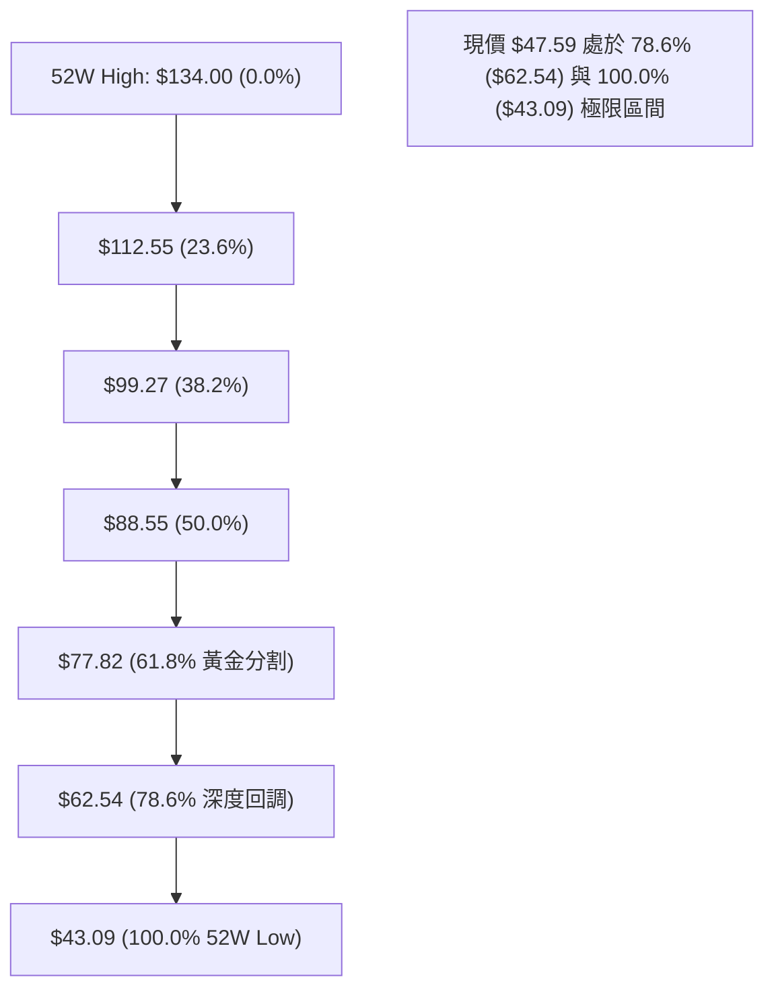

#### 斐波那契階梯深度解析
- **現價坐標**：現價 $47.59 處於 78.6% 回調位（$62.54）與 100.0% 回調位（$43.09）之間，距離歷史低點 $43.09 僅有 10.44% 的空間，回調幅度高達 95.05%。
- **技術含義**：在傳統技術分析中，跌破 61.8%（$77.82）且無力站回，代表先前的牛市推進波已完全瓦解，進入漫長的價值重估與籌碼出清週期。現價緊貼 100.0% 回調位打底，若能守穩 S2 $43.09，此處將構成賠率極佳的非對稱反彈博弈點。

---

## 5. 技術指標深度解讀

### 🎛️ 指標訊號總覽

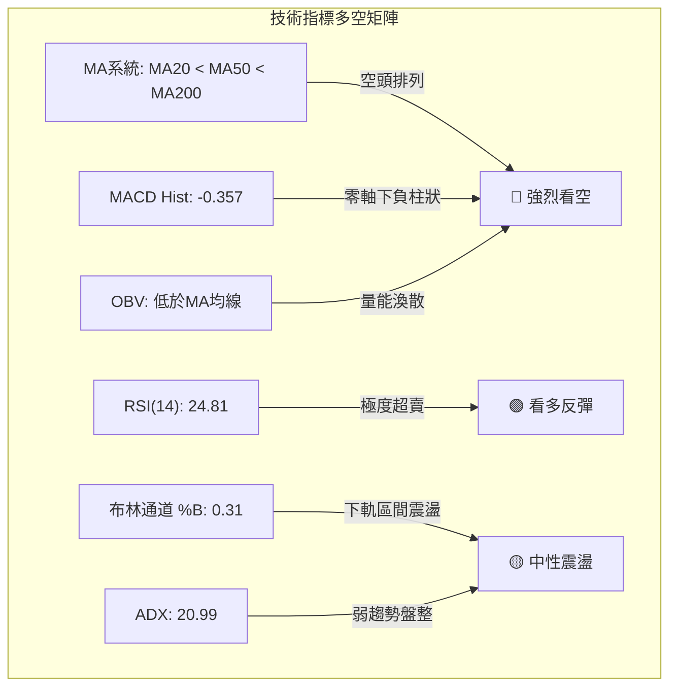

### 📈 移動平均線排列分析

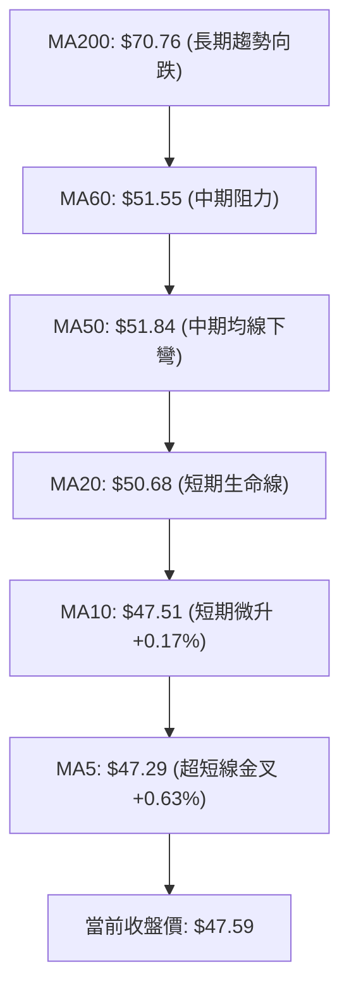

#### 均線數據透視
- **長期均線**：MA200 位於 $70.76，現價落後幅度達 -32.74%；MA240 位於 $73.13（-34.92%）。長天期均線斜率向下發散，確認長期趨勢完全由空方掌控。
- **中期均線**：MA50 為 $51.84，MA60 為 $51.55，兩者與 MA20（$50.68）高度貼合，在 $50.68 - $51.84 區間形成厚實的上方均線壓制帶。
- **短期均線**：現價 $47.59 剛突破 MA5（$47.29）與 MA10（$47.51），短期均線組出現微弱的「低檔走平黏合」態勢，顯示連續下跌後短線動能暫時止血。

### 📉 RSI(14) 分析

```
RSI(14) 強度刻度儀
0        20   24.81   30              50              70             100
├────────┼──────▲─────┼───────────────┼───────────────┼──────────────┤
│ 極度超賣 │  當前讀數  │      偏弱     │      中性     │     超買     │
██████░░░░░░░░░░░░░░░░░░░░░░░░░░░░░░░░░░░░░░░░░░░░░░░░░░ 24.81
```

- **超賣判定**：RSI(14) 當前讀數為 **24.81**，正式跌破 30 超賣門檻，進入技術性極度超賣區。
- **背離分析**：
  - 比對週線收盤數據：2026-09-06 週收盤 $47.82 時 RSI 為 11.7；2026-09-13 收盤 $46.69（創收盤新低）時 RSI 微升至 13.8；本週（09-20）收盤 $47.59，RSI 升至 24.81。
  - **結論**：日線數據中標注「RSI 背離：無明顯背離」，但週線層級已出現**微型底背離初胚**（價格在 $46-$47 震盪，RSI 率先由 11.7 回升至 24.81），提示空頭砸盤效率大幅下降，多頭反彈動能正在聚集。

### 📊 MACD(12/26/9) 訊號解讀

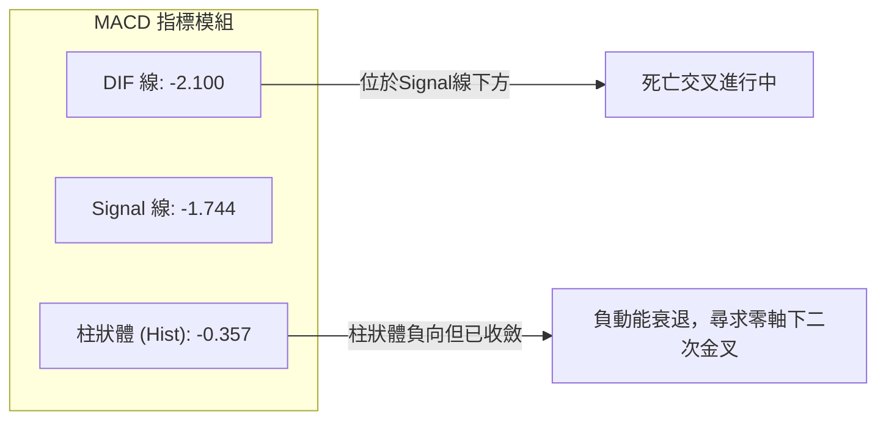

- **絕對數值**：DIF (-2.100) < Signal (-1.744)，處於零軸下方深度負值區，顯示大週期動能偏空。
- **柱狀體變化**：MACD Hist 為 **-0.357**。觀察近幾週柱狀體走勢：從 08-30 的 -1.211、09-06 的 -1.318，快速收斂至 09-13 的 -0.864 與當前的 -0.357。這表明空方動能呈現斷崖式衰竭，日線級別極可能在未來數個交易日內迎來 MACD 零軸下黃金交叉。

### 📦 布林通道分析

```
KTOS 布林通道 (Bollinger Bands 20,2) 結構圖
$58.63 ┬──────────────────────────────────────── 布林上軌
       │
$50.68 ┼ ─ ─ ─ ─ ─ ─ ─ ─ ─ ─ ─ ─ ─ ─ ─ ─ ─ ─ ─ ─  布林中軌 (MA20)
       │
$47.59 ┼ ═══════════════════════════════════════  當前價格 (%B = 0.31)
       │
$42.73 ┴──────────────────────────────────────── 布林下軌
```

- **通道參數與現況**：
  - BB 上軌：$58.63
  - BB 中軌（MA20）：$50.68
  - BB 下軌：$42.73
  - 通道帶寬（Bandwidth）：($58.63 - $42.73) / $50.68 = 31.37%，處於寬幅震盪後的收縮初期。
- **%B 指標分析**：%B 讀數為 **0.31**。%B < 0.5 表明價格運行在中軌下方弱勢區，但高於 0（下軌 $42.73），未出現向下「沿軌暴跌（Walking down the band）」的單邊崩跌形態，屬於典型的下半軌震盪築底。

### 💹 成交量分析（量價配合度）

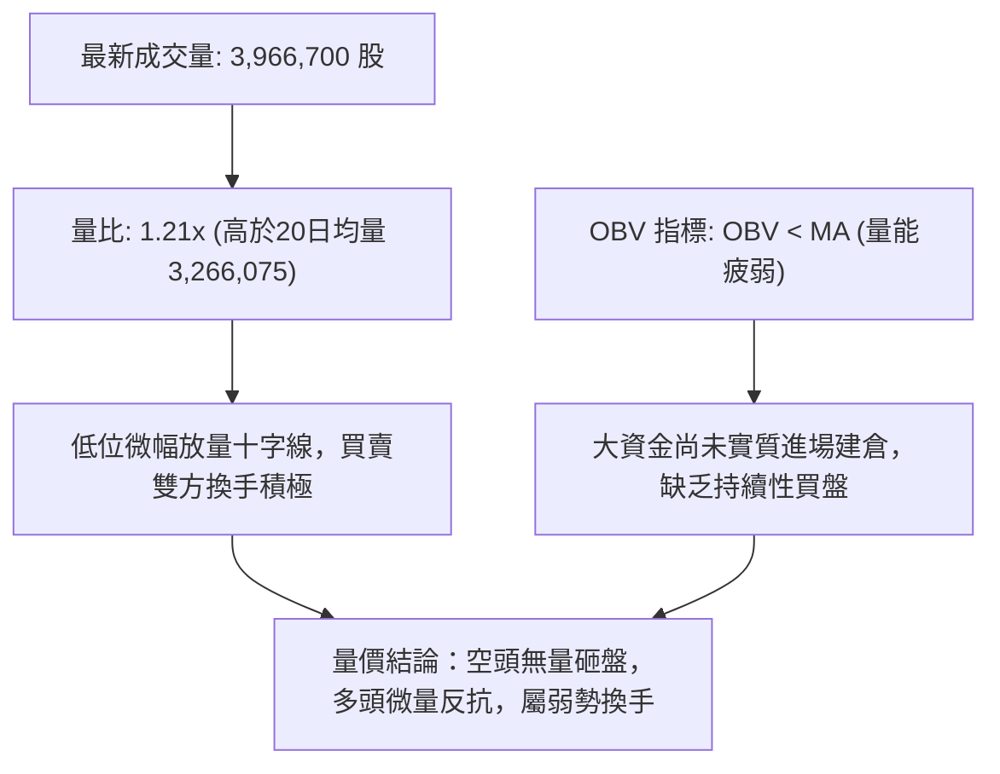

- **成交量對比**：最新成交量 3,966,700 股，較 20 日均量 3,266,075 放大約 21%（量比 1.21），略高於 50 日均量 3,631,972。在現價 $47.59 處放量收小紅十字線，反映低檔承接盤開始釋放。
- **OBV 趨勢**：OBV 仍運行在均線下方，長期量能走勢疲軟。這表明當前放量主要來自短線空頭平倉與散戶抄底，尚未觀察到機構主力的巨量吃貨跡象，上攻高度將受限於量能規模。

---

## 6. 動能與波動率

### ⚡ 動能評估四象限

| 象限 | 動能維度 | 波動率維度 | 當前狀態 | 技術環境特徵評估 |
|------|----------|------------|----------|------------------|
| **Q1 (爆發機會)** | 強 (ADX>25, +DI佔優) | 低 (ATR縮減) | ─ | 趨勢突破醞釀期 |
| **Q2 (震盪沉澱)** | **弱 (ADX: 20.99)** | **中低 (ATR: 4.57%)** | **✓ (KTOS現狀)** | **底部構築觀望區：動能衰退，波動度回落，適合低吸高拋區間操作** |
| **Q3 (主升/主跌)** | 強 (單邊行情) | 高 (ATR放量) | ─ | 順勢追擊期（如 2026年1-3月下殺段） |
| **Q4 (恐慌出清)** | 弱 (方向不明) | 高 (劇烈洗盤) | ─ | 籌碼混亂期，避免進場 |

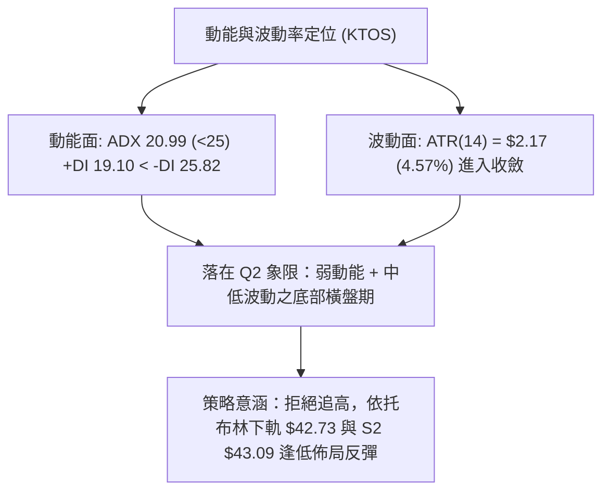

### 📊 ATR 波動率分析

- **ATR(14) 數值**：當前 ATR 為 **$2.17**，佔當前股價 $47.59 的比例為 **4.57%**。
- **日常波動界限**：KTOS 當前單日正常理論波動區間為：
  - 單日上限：$47.59 + $2.17 = $49.76
  - 單日下限：$47.59 - $2.17 = $45.42（剛好覆蓋近期支撐 S1 $45.80）
- **止損距離建議**：
  - 根據標準波幅定價模型，波段交易止損應設定在 1.5 倍至 2.0 倍 ATR 以外。
  - 1.5 ATR 緩衝距離 = 1.5 × $2.17 = **$3.26**
  - 多頭防守止損價位 = $47.59 - $3.26 = **$44.33**（精準位於 S1 $45.80 之下，並緊貼 S2 $43.09 上方，能有效規避市場噪音掃損）。

### 📐 Beta 與市場相關性

- **Beta 係數**：**1.113**。
- **市場特徵分析**：Beta 略大於 1，表明 KTOS 相對標普 500 指數具備輕微的高彈性屬性（當大盤上漲 1% 時，理論上漲 1.11%；大盤下跌時亦然）。
- **機構持股與防禦性**：機構持股佔比高達 **85.4%**，顯示該股主要由專業法人持有。儘管國防軍工（Aerospace & Defense）屬於防禦性板塊，但 KTOS 過去幾季因高估值修復與現金流問題（FCF Yield 為 -1.32%）遭遇法人減持。在目前 52W 低位區，其 1.113 的 Beta 值將有助於在整體市場反彈時提供更強的向上修復彈性。

---

## 7. 多時框架總結

### 📋 時框架評分表

| 時框架 | 趨勢方向 | 動能指標狀態 | 均線排列 | 形態結構 | 綜合評分 | 操作建議 |
|--------|----------|--------------|----------|----------|----------|----------|
| **長線 (月線)** | 🔴 強烈看空 | 下行收斂，處於 52W 低檔 | 跌破所有中長期均線 | 衝頂破位後深幅回調 | 25/100 | 嚴格控制長期部位，觀望 |
| **中線 (週線)** | 🔴 弱勢偏空 | RSI 脫離極端超賣，MACD 負柱收窄 | 空頭發散，受制 MA20 | 低檔測試 S1/S2 支撐 | 35/100 | 等待突破頸線 R1 $51.49 |
| **短線 (日線)** | 🟡 震盪整理 | RSI 24.81 超賣，MACD 醞釀金叉 | 突破 MA5/MA10，壓制於 MA20 | 矩形區間盤整 (%B=0.31) | 45/100 | 區間下軌低吸，快進快出 |

### 🔲 綜合訊號矩陣

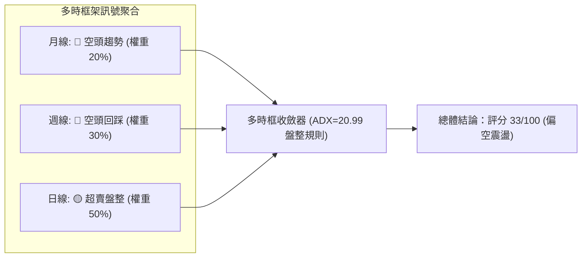

### ⚖️ 多時框收斂結論（嚴格遵守規則 14）

1. **行情類型判定**：當前日線 ADX(14) 讀數為 **20.99**，明確小於 25 臨界線，判定當前市場為**典型的「弱趨勢 / 盤整行情」**。
2. **多時框收斂執行**：依收斂規則第 2 條：「*盤整行情（ADX<25）：以日線布林通道上下軌為主要交易區間。*」
3. **主導維度與方向取捨**：
   - 儘管週線與月線受制於 MA200（$70.76）而呈現中長期偏空格局，但由於 ADX 證實單邊砸盤動能已經瓦解，空頭已無力發動新一輪崩跌。
   - 日線 RSI(14) 處於 24.81 極度超賣區，與布林下軌 $42.73 形成共振支撐。
4. **唯一方向性結論**：**【偏空中性觀望，區間超賣防守】**。日線布林通道下軌 $42.73 至上軌 $58.63 為主戰場。考量綜合評分僅 33/100，整體格局定性為「空頭控制下的超賣區間震盪」，主要交易邏輯為**區間下軌高盈虧比低吸，嚴防破位下行**。

---

## 8. 交易策略建議

### 🗺️ 策略決策流程圖

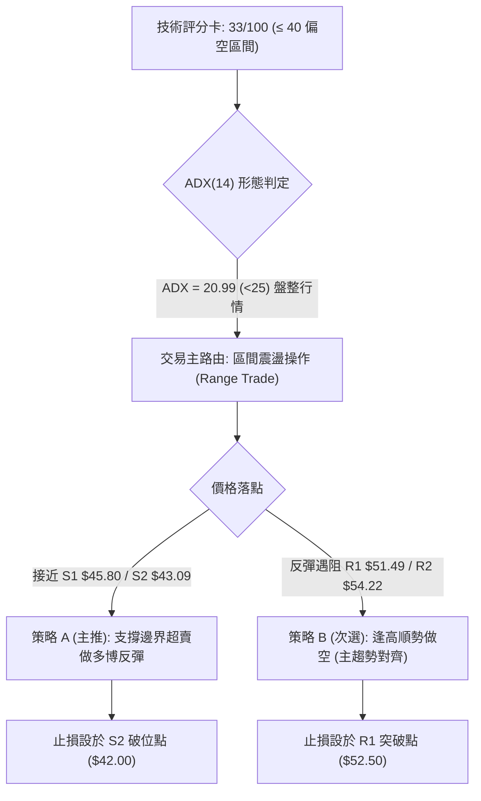

### 🧭 策略路由（依評分卡分流）

> **當前主策略方向 = 【空頭背景下的超賣區間反彈策略】（依綜合評分 33/100，疊加 ADX 20.99 盤整規則路由）**
>
> 依評分規則，總分 33/100 本屬偏空格局，但因 ADX<25 觸發盤整收斂，且現價緊貼 52W 低點 S2 $43.09 與 RSI 24.81 超賣，盲目做空盈虧比極差。因此主推「**區間下軌防守型多頭反彈策略**」，次推「**反彈阻力位順勢空頭策略**」。

### 🎯 價格情境階梯（Price Scenarios）

價位嚴格引用關鍵價位計算數值：

| 觸發條件 | 下一目標 | 後續延伸 | 情境含義 |
|----------|----------|----------|----------|
| **突破 R1 $51.49** | R2 $54.22 | R3 $58.88 | 站上 MA20/MA50，短線完成底部箱體突破，展開波段修復 |
| **站穩現價 $47.59** | R1 $51.49 | — | 於 S1 $45.80 至 R1 $51.49 進行弱勢橫盤築底 |
| **跌破 S1 $45.80** | S2 $43.09 | — | 再次考驗年度低點支撐 |
| **跌破 S2 $43.09** | 形態測幅 $34.69 | — | 創 52 週新低，支撐徹底瓦解，開啟新一輪下跌空間 |

### 📊 情境機率分佈

| 情境劃分 | 機率估算 | 主要指標技術依據 |
|----------|----------|------------------|
| **情境一：超賣反彈向上** | **50%** | RSI(14) 達 24.81 極度超賣；MACD 柱狀體由 -1.318 顯著收斂至 -0.357；量比 1.21x 低檔有買盤換手。 |
| **情境二：區間窄幅震盪** | **35%** | ADX 僅 20.99 缺乏趨勢動能；OBV 疲軟未見主力大單；布林中軌 $50.68 形成顯著壓制。 |
| **情境三：跌破低點破位** | **15%** | 均線 MA20/50/200 呈標準空頭排列；-DI (25.82) 仍高於 +DI (19.10)；自由現金流為負之基本面壓制。 |

### 🟢 主策略詳情（方向依上方路由）

```
╔══════════════════════════════════════════════════════════════╗
║              主策略詳細交易矩陣                              ║
╠══════════════════════════════════════════════════════════════╣
║ 項目         │ 策略 A (左側超賣博反彈)  │ 策略 B (右側逢高做空) ║
╠═════════════╪══════════════════════════╪══════════════════════╣
║ 進場條件     │ 股價回踩 S1 $45.80 企穩  │ 反彈遇阻 R1 $51.49 滯漲║
║ 進場價格     │ $46.50 (S1上方承接)      │ $51.00 (R1下方受阻)    ║
║ 目標價 T1    │ $50.68 (布林中軌/MA20)   │ $45.80 (近期支撐 S1)   ║
║ 目標價 T2    │ $54.22 (阻力 R2)         │ $43.09 (強支撐 S2)     ║
║ 止損價格     │ $42.50 (跌破S2 $43.09)   │ $52.80 (突破MA50 $51.84)║
║ 風險金額     │ $4.00                    │ $1.80                  ║
║ 預期報酬(T2) │ $7.72                    │ $7.91                  ║
║ 風險報酬比   │ 1 : 1.93                 │ 1 : 4.40               ║
║ 預估勝率     │ 55%                      │ 60%                    ║
║ 建議倉位     │ 8% - 10% (輕倉防守)      │ 12% - 15% (順主趨勢)   ║
╚══════════════════════════════════════════════════════════════╝
```

### 🔴 反向風險觸發點（對沖提示）

- **多頭轉止損條件**：日線收盤價若**放量跌破 S2 $43.09**，意味著 52 週大底被有效擊穿，原形態分析徹底失效，所有多頭部位必須無條件停損，並立即反向買入防守性空頭部位對沖。
- **空頭平倉條件**：若價格強勢**突破並站穩阻力 R1 $51.49 且成交量放大至 500 萬股以上**，代表空頭排列遭到破壞，MACD 將形成零軸上翻，所有空單必須全數出場。

### ⭐ 整體訊號強度評星

```
做多訊號強度：★★☆☆☆  (2.5/5星 — 依托超賣反彈，勝在盈虧比)
做空訊號強度：★★★☆☆  (3.5/5星 — 順應長週期空頭排列與均線壓制)
整體可信度：  ★★★☆☆  (3.0/5星 — ADX<25 震盪市，訊號易出現反覆磨底)
```

---

## 9. 風險提示與監控

### ✅ 關鍵監控指標 Checklist

```
╔══════════════════════════════════════════════════════════════╗
║              KTOS 每日盤面關鍵監控清單                      ║
╠══════════════════════════════════════════════════════════════╣
║ [ ] 價格是否跌破波段低點支撐 S1 $45.80                       ║
║ [ ] 52週低點 S2 $43.09 是否出現恐慌性大單摜破               ║
║ [ ] RSI(14) 能否順利脫離超賣區（突破 30 並站上 40）          ║
║ [ ] MACD 柱狀體是否由負轉正（確認零軸下黃金交叉）             ║
║ [ ] 日成交量是否超越 20日均量 (3,266,075 股) 的 1.5 倍       ║
║ [ ] ADX(14) 是否突破 25（若突破則代表盤整結束、單邊開啟）     ║
║ [ ] 股價挑戰布林中軌 MA20 ($50.68) 與 R1 ($51.49) 時的換手表現║
╚══════════════════════════════════════════════════════════════╝
```

### ⚠️ 風險場景分析

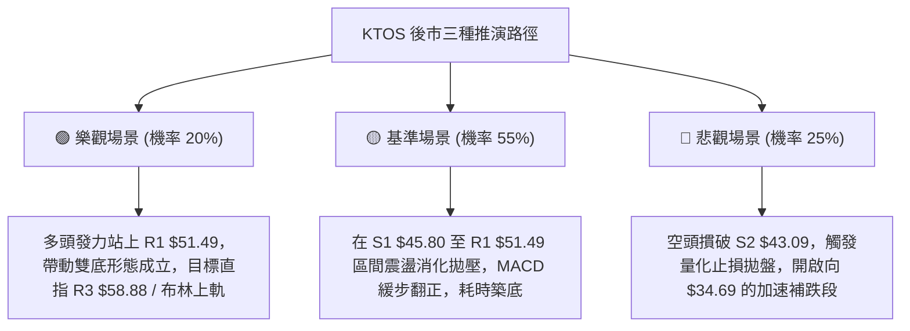

### 🛡️ 風險管理重要提醒

1. **基本面現金流與估值剪刀差**：KTOS 當前 Trailing P/E 高達 279.94，EV/EBITDA 為 88.43，且自由現金流為 -1.18 億美元（FCF Yield 為 -1.32%）。儘管營收年增 30.5%，但昂貴的估值在利率維持中高檔的宏觀背景下，極易成為法人機構拋售的藉口。技術面反彈切忌視為「長線無腦買入點」。
2. **波動度適應性部位控制**：當前 ATR 為 $2.17（4.57%），屬於單日高敏感度標的。單筆交易承受風險絕不可超過總投資組合淨值的 1.5%。以 10 萬美元帳戶為例，單筆最大止損額為 1,500 美元；若依策略 A 止損距離 $4.00 計算，持倉上限應嚴格限制在 375 股以內（約 1.7 萬美元部位，佔總資金 17%）。
3. **假突破與流動性陷阱**：在 ADX < 25 的盤整環境中，K 線經常在支撐位上方出現「假跌破再拉回」或阻力位「假突破再下殺」的洗盤走勢。交易者應以**日線收盤價**作為有效破位或突破的判定依據，盤中觸及關鍵價位不應過度情緒化追單。

---

## 📋 報告總結

```
╔══════════════════════════════════════════════════════════════════╗
║                    KTOS 技術分析報告總結                         ║
╠══════════════════════════════════════════════════════════════════╣
║ 報告日期：2026-09-17                                             ║
║ 當前價格：$47.59                                                 ║
║ 分析評級：⚖️ 偏空中性（極度超賣區間震盪）                         ║
╠══════════════════════════════════════════════════════════════════╣
║ 關鍵結論：                                                       ║
║ ├─ 長期趨勢：🔴 空頭主導（現價遠低於 MA200 $70.76，年內大跌）   ║
║ ├─ 中期趨勢：🔴 弱勢盤跌（受制週線空頭排列，下探年內低點聚類） ║
║ ├─ 短期趨勢：🟡 超賣築底（RSI 24.81，ADX 20.99 進入箱體盤整）    ║
║ ├─ 關鍵支撐：S1 $45.80 / S2 $43.09 (52W Low)                    ║
║ ├─ 關鍵阻力：R1 $51.49 / R2 $54.22 / R3 $58.88                  ║
║ └─ 分析師目標：共識均價 $102.76（華爾街機構觀點與短線技術嚴重分歧║
╠══════════════════════════════════════════════════════════════════╣
║ 最優策略組合：                                                   ║
║ 1. 🥇 最佳機會：區間下軌高勝率反彈（在 $46.50 附近低吸，防守     ║
║                 $42.50，目標 $50.68 / $54.22）                   ║
║ 2. 🥈 次選機會：反彈至阻力 R1 $51.49 附近順勢做空（止損設 $52.80 ║
║                 目標下看 S1 $45.80 / S2 $43.09）                 ║
║ 3. 🥉 保守選擇：空倉觀望，直至價格有效突破 R1 $51.49 或確認帶量  ║
║                 跌破 S2 $43.09 後再行順勢跟進                    ║
╚══════════════════════════════════════════════════════════════════╝
```

---

> ⚠️ **免責聲明**：本報告為 AI 自動生成之技術分析，所有數據及估算均基於提供的歷史價格資訊。本報告**僅供研究與學術參考**，**不構成任何投資建議**。投資有風險，入市需謹慎。

---

*報告生成時間：2026-09-17 ｜ 數據來源：Yahoo Finance ｜ 分析框架：多時框技術分析*