# KTOS 技術分析報告

> **報告日期**：2026-09-18 ｜ **語言**：繁體中文 ｜ **數據來源**：Yahoo Finance ｜ **當前價格**：$47.59

---

## 目錄

| 章節 | 內容 |
|------|------|
| [1. 技術面概覽](#1-技術面概覽) | 訊號儀表板、核心指標、評分卡 |
| [2. 趨勢分析](#2-趨勢分析) | 多時框趨勢、長中短期走勢、ADX 解讀 |
| [3. 圖表形態分析](#3-圖表形態分析) | 形態識別、信心度評估、K線組合、目標價 |
| [4. 支撐與阻力](#4-支撐與阻力) | 關鍵價位分布、阻力與支撐表、斐波那契回調 |
| [5. 技術指標深度解讀](#5-技術指標深度解讀) | MA/RSI/MACD/布林通道/成交量與OBV |
| [6. 動能與波動率](#6-動能與波動率) | 動能評估四象限、波動率分析、Beta 敏感度 |
| [7. 多時框架總結](#7-多時框架總結) | 時框架評分矩陣、收斂規則與方向定調 |
| [8. 交易策略建議](#8-交易策略建議) | 策略路由、情境階梯、機率分佈、多空策略 |
| [9. 風險提示與監控](#9-風險提示與監控) | 關鍵監控清單、情境模擬、風控準則 |
| [📋 報告總結](#-報告總結) | 核心要點與執行總結 |

---

## 1. 技術面概覽

### 🎯 技術訊號儀表板

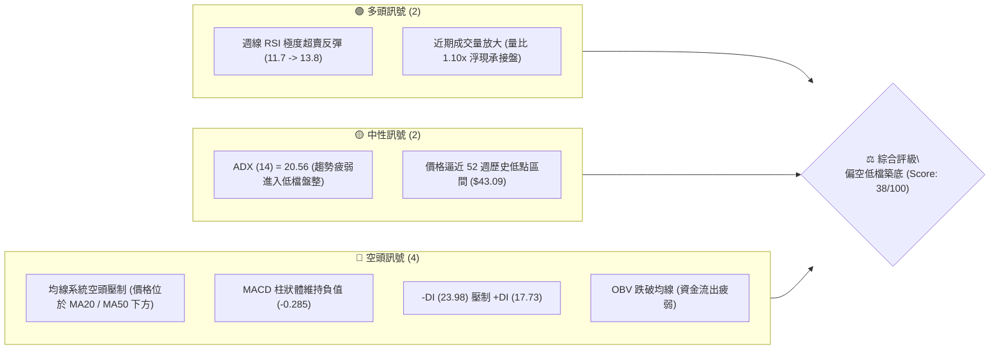

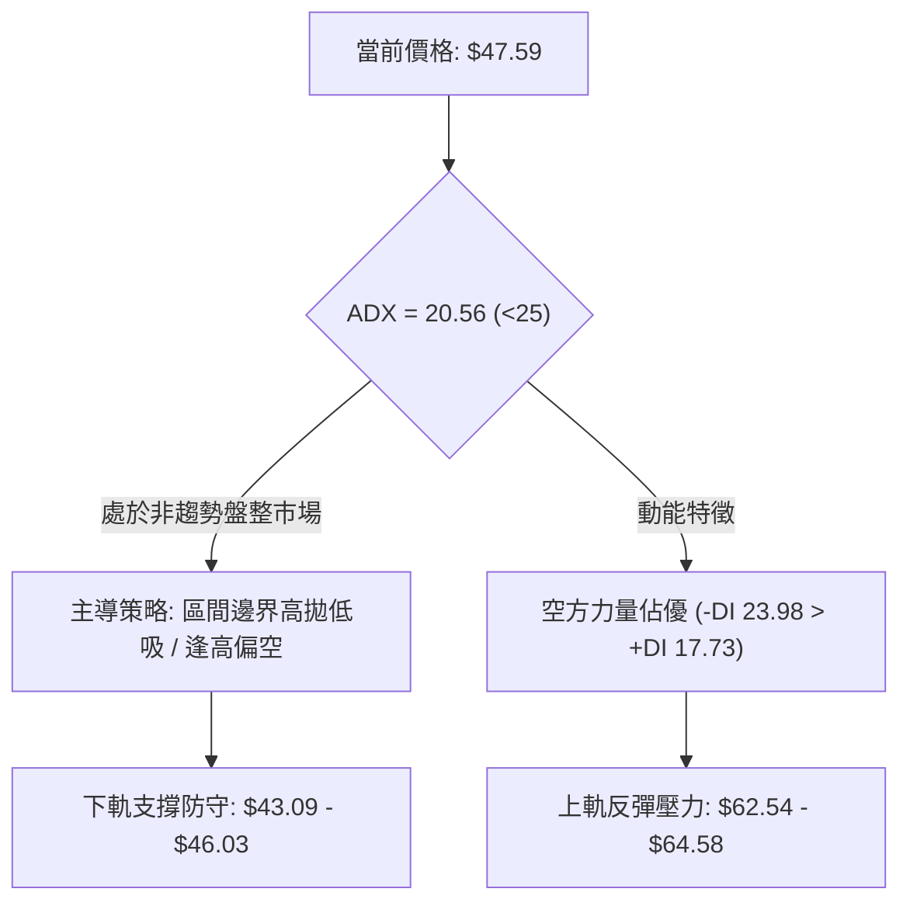

### 📊 核心指標速覽表

| 指標類別 | 指標名稱 | 當前數值 | 訊號 | 解讀 |
|:---|:---|:---|:---:|:---|
| **價格** | 當前收盤價 | $47.59 | 🔴 | 位於 52 週低點上方約 10.4%，處於長期深幅回調低位 |
| **區間** | 52W 高 / 低 | $134.00 / $43.09 | 🟡 | 回撤幅度達 -64.49%，目前處於歷史低位脆弱平衡區 |
| **均線** | MA20 / MA50 | 價格於均線下方 | 🔴 | 短中期均線呈空頭排列向下發散，上方形成沉重套牢賣壓 |
| **均線** | MA200 | 數據中未提供 | 🟡 | 參照 24 個月走勢，自 2026 年初 $103.01 高點腰斬已屬空頭循環 |
| **動能** | RSI(14) | 週線 13.8 (超賣回彈) | 🟢 | 日線未給出具體數值；週線於 9 月初觸及 11.7 極端超賣後收斂反彈 |
| **動能** | MACD (12,26,9) | 柱狀體: -0.285 | 🔴 | 快線 (-2.100) 低於慢線 (-1.815)，空頭動能減緩但未金叉 |
| **趨勢強度** | ADX (14) | 20.56 (-DI: 23.98) | 🟡 | ADX < 25 判定為非趨勢性弱勢盤整，空方握有盤面微弱主導權 |
| **量能** | 當日量 / 20日均量 | 3.62M / 3.31M (1.10x) | 🟢 | 跌至 $46-$47 支撐區間出現低接買盤，OBV 則維持在均線下方 |

### 🏆 技術評分卡

```
╔══════════════════════════════════════════════════════════════════╗
║              技術評分卡 — KTOS (2026-09-18)                     ║
╠══════════════════════════════════════════════════════════════════╣
║ 趨勢強度 (Trend)       ██████░░░░░░░░░░░░░░  30/100 🔴 空頭壓制  ║
║ 動能指標 (Momentum)     ████████░░░░░░░░░░░░  40/100 🟡 超賣鈍化  ║
║ 支撐穩定度 (Support)    ██████████░░░░░░░░░░  50/100 🟡 邊界考驗  ║
║ 成交量配合 (Volume)     ████████░░░░░░░░░░░░  40/100 🟡 量平價跌  ║
║ 形態完整度 (Pattern)    ██████░░░░░░░░░░░░░░  30/100 🔴 下降通道  ║
║ 均線排列 (MA System)   ████░░░░░░░░░░░░░░░░  20/100 🔴 空頭排列  ║
╠══════════════════════════════════════════════════════════════════╣
║ 綜合技術評分 (Total)   ████████░░░░░░░░░░░░  35/100 🔴 偏空弱勢  ║
╚══════════════════════════════════════════════════════════════════╝
```

---

## 2. 趨勢分析

### 🌐 多時框趨勢分析

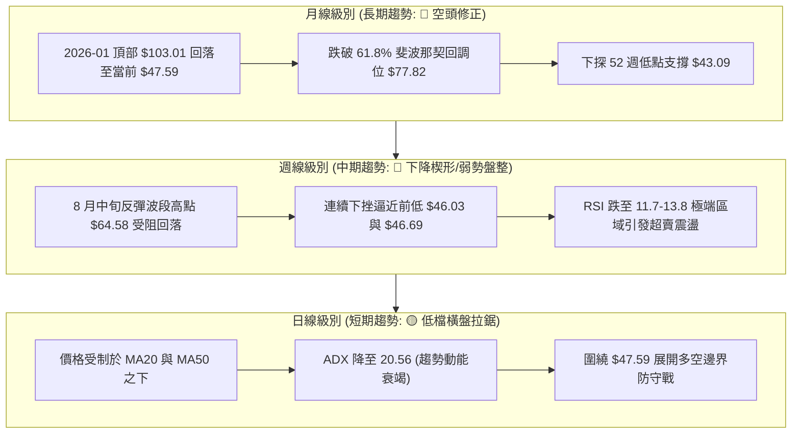

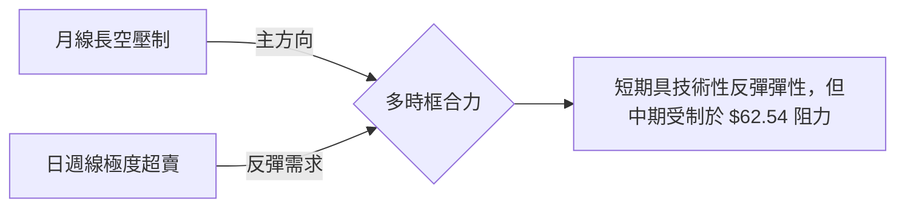

### 📈 長期趨勢 — 12個月走勢圖（Unicode）

```
KTOS 月線收盤走勢圖（過去12個月：2025-10 至 2026-09）
價格軸 ($)
$105 ┤                               ● $103.01 (2026-01 最高收盤)
$95  ┤ ● $90.60
$85  ┤                                       ● $86.18
$75  ┤         ● $76.10    ● $75.91                  ● $70.51
$65  ┤                                                       ● $63.05  ● $64.13
$55  ┤                                                                           ● $50.98
$45  ┤                                                                                ● $49.86  ● $46.60  ● $47.59 ◄ 現價
$35  ┤
     └─┬──────────┬──────────┬──────────┬──────────┬──────────┬──────────┬──────────┬──────────┬──────────┬──────────┬──────────┬────────
     25-10      25-11      25-12      26-01      26-02      26-03      26-04      26-05      26-06      26-07      26-08      26-09
```

#### 走勢特徵分析表格

| 階段 | 涵蓋期間 | 起始價 → 結束價 | 區間漲跌幅 | 結構性技術特徵 |
|:---|:---:|:---:|:---:|:---|
| **頂部構築期** | 2025-10 ～ 2026-01 | $90.60 → $103.01 | +13.70% | 創下 52 週歷史高點 $134.00 後收盤於 $103.01，量價背離顯著 |
| **主跌推動期** | 2026-01 ～ 2026-04 | $103.01 → $63.05 | -38.79% | 單邊快速下行，長陰線連續跌破斐波那契 50% 水平 ($88.55) |
| **中繼抵抗期** | 2026-04 ～ 2026-05 | $63.05 → $64.13 | +1.71% | 於 $63-$64 窄幅震盪，但未能站穩 78.6% 斐波那契回調位 ($62.54) |
| **二次探底期** | 2026-05 ～ 2026-07 | $64.13 → $46.60 | -27.34% | 破位下挫，於 2026-07 探至 $46.60，逼近 52 週最低點 $43.09 |
| **弱勢弱反彈** | 2026-07 ～ 2026-08 | $46.60 → $50.98 | +9.40% | 盤中週線一度反彈至 $64.58，但月末收盤回吐至 $50.98 |
| **當前探底期** | 2026-08 ～ 2026-09 | $50.98 → $47.59 | -6.65% | 再次回測前波支撐區域，空方力道衰竭但尚未扭轉頹勢 |

### 📊 中期趨勢（週線分析）

```
KTOS 中期週線支撐與阻力軌跡 ($)
$65 ┤           ▲ 08-16 波段高點 $64.58 (強阻力 R2)
$60 ┤          / \
$55 ┤ 07-05   /   \
    ┤ $55.35 /     \
$50 ┤   ●───/       \  08-30 $52.00
    ┤  / \           \ /
$45 ┤ /   ● 07-19     ● 09-13 $46.69 ───● 09-20 現價 $47.59 (近波段防守區)
    ┤● 06-28 $47.21   $46.03
$40 ┴───────────────────────────────────────────────────────
```

- **波段高點壓制**：2026 年 8 月 16 日週線最高收盤達 $64.58，隨後遭遇獲利回吐盤與斐波那契 78.6% 水平 ($62.54) 的密集空頭防守，連續 4 週大幅走低。
- **波段低點聚類**：回顧過去 12 週，波段低點密集分佈於 2026-06-28 的 $47.21、2026-07-19 的 $46.03、以及 2026-09-13 的 $46.69，顯示 $46.00-$47.00 具備中度買盤承接能力。

### ⚡ 趨勢強度評估（ADX 解讀）

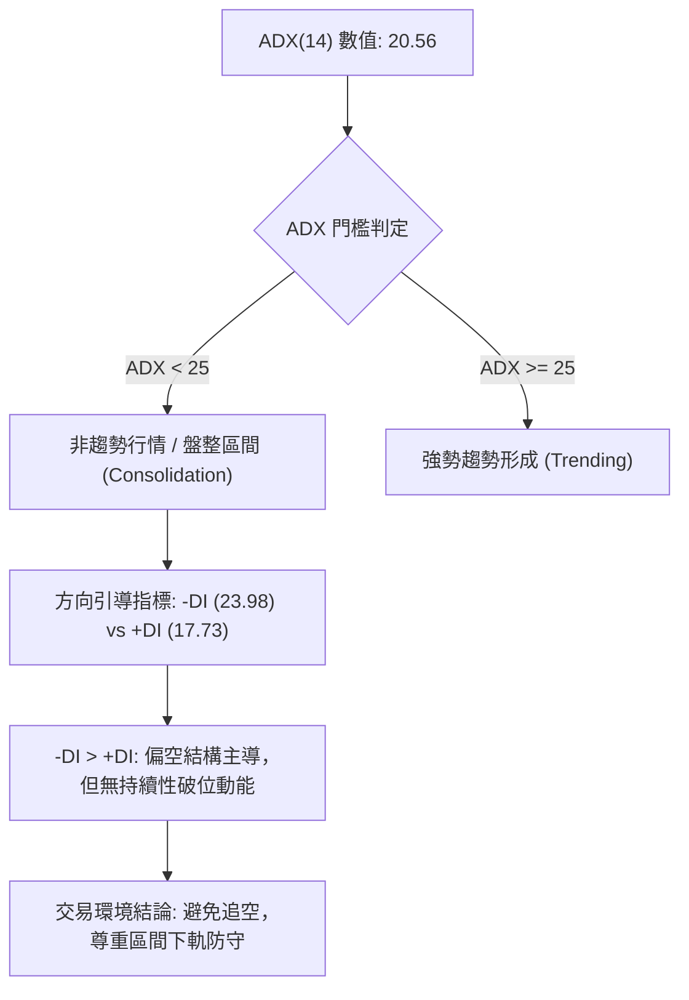

| 指標變數 | 當前數值 | 臨界標準 | 狀態評估 | 技術意涵 |
|:---|:---:|:---:|:---:|:---|
| **ADX (14)** | **20.56** | 25.00 | 弱趨勢 / 盤整 | 趨勢動能不足，市場未進入單邊推動市，呈現低波動摩擦 |
| **+DI (14)** | **17.73** | 20.00 | 多方疲弱 | 買方缺乏主動推升價格意願，反彈力道多屬空頭回補 |
| **-DI (14)** | **23.98** | 20.00 | 空方佔優 | 空頭掌控盤面節奏，但數值低於 25，未引發恐慌性拋售 |
| **方向差距** | **-6.25** | 0.00 | 淨偏空 | 差值收窄中，顯示下行加速度已被下軌買盤吸收 |

---

## 3. 圖表形態分析

### 🔍 形態識別系統

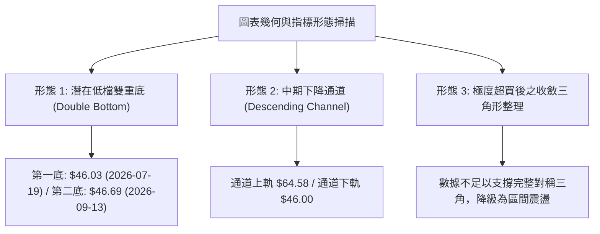

#### 形態識別信心度與參數評估表

| 形態名稱 | 信心度 (%) | 判斷依據（嚴格引用已知數據） | 完成度 (%) | 目標價（附嚴格計算式） |
|:---|:---:|:---|:---:|:---|
| **雙重底形態**<br>(Double Bottom) | **58%** | 兩次波段低點分別為 2026-07-19 之 $46.03 與 2026-09-13 之 $46.69，頸線位於 2026-08-16 波段高點 $64.58。 | 45% (尚未突破頸線) | **測量目標價 = $83.13**<br>計算式：頸線 $64.58 + (頸線 $64.58 - 低點 $46.03) = $64.58 + $18.55 = $83.13（接近 50% 斐波那契位 $88.55） |
| **中期下降通道**<br>(Descending Channel) | **72%** | 高點聚類向下傾斜（$103.01 → $64.58），低點聚類（$63.05 → $46.03 → $43.09 邊界）呈平行下行。 | 85% (已運行至通道下緣) | **下軌目標價 = $43.09**（52週低點）<br>**反彈通道頂部 = $62.54**（78.6% 斐波那契回調位） |
| **頭肩底形態** | **15%** | 數據中未偵測到左肩與右肩之對稱結構，不具備幾何成立要件。 | 0% | 訊號不足，僅做指標型解讀，不預設該形態目標價。 |

### 🕯️ 重要K線形態分析

| 月份 | 收盤價 ($) | K線形態特徵 | 實體與影線解讀 | 多空訊號 |
|:---:|:---:|:---|:---|:---:|
| **2026-01** | 103.01 | 衝高回落長上影陽線 | 盤中觸及 52W 高點 $134.00 遭遇極端獲利拋壓，留下超過 $30 的長避雷針 | 🔴 強烈見頂 |
| **2026-04** | 63.05 | 大陰線加速探底 | 實體大陰跌破 $70 整數關口，空頭動能完全釋放，確立下行主趨勢 | 🔴 空方推動 |
| **2026-05** | 64.13 | 縮量十字陀螺頂 (Spinning Top) | 波動區間收斂，多空力量暫時平衡，為典型的下跌中繼整理 | 🟡 中性格局 |
| **2026-06** | 49.86 | 破位長陰線 | 擊穿 $60 心理防線並失守 $50，空頭重掌主動權 | 🔴 破位下殺 |
| **2026-07** | 46.60 | 帶長下影線之槌子線 (Hammer) | 探底 $46.03 後收回，顯現機構買盤在 $45 附近進行試探性建倉 | 🟢 低檔買盤 |
| **2026-08** | 50.98 | 倒轉長上影陽線 | 月中一度拉升至 $64.58，但多頭後繼乏力，月線收盤大幅回吐 | 🔴 上檔壓力 |
| **2026-09** | 47.59 | 窄幅縮量陰十字星 (Doji-like) | 實體極小，波幅受限，顯示空頭下殺動能鈍化，醞釀方向選擇 | 🟡 變盤前兆 |

### 📉 ASCII 走勢形態示意圖

```
KTOS 潛在「低檔雙重底」架構與阻力頸線示意圖 ($)
$65 ┤                           [頸線 Resistance: $64.58]
    ┤                         ╭───────●───────╮
$60 ┤                        ╱                 ╲
    ┤                       ╱                   ╲
$55 ┤                      ╱                     ╲
    ┤                     ╱                       ╲
$50 ┤                    ╱                         ● 現價 $47.59
$45 ┤         ● $46.03  ╱                           ● $46.69
    ┤─────────┴─────────┘                           ┴───────── (支撐防線)
    ┤       [ 第一底 (07-19) ]                  [ 第二底 (09-13) ]
$40 ┴─────────────────────────────────────────────────────────────
```

### 🎯 形態目標價計算

依據技術分析測量法則，若低檔雙重底結構在後續交易中獲得日線成交量確認並向上突破頸線，其理論目標價計算步驟如下：
1. **基底支撐價位**：取兩底低點均值，以較低點 $46.03 為基準。
2. **形態頸線價位**：取 2026-08-16 週線高點 $64.58。
3. **垂直形態高度 (H)**：$64.58 - $46.03 = $18.55。
4. **最小量度滿足目標價 (T1)**：頸線 $64.58 + 形態高度 $18.55 = **$83.13**。
   - *註：該目標價位於 50.0% 斐波那契回調位 ($88.55) 與 61.8% 斐波那契回調位 ($77.82) 之間，具備合理的結構對應性。*
5. **通道下軌破位悲觀目標價 (T2)**：若跌破 52 週低點 $43.09，依據等幅下測：$46.03 - ($64.58 - $46.03) × 0.382 = $46.03 - $7.09 = **$38.94**（數據中未偵測到低於 $43.09 支撐，此為幾何衍生推算）。

---

## 4. 支撐與阻力

### 🗺️ 關鍵價位分布圖（Unicode）

```
KTOS 價位結構分布圖（嚴格依據 52W 區間與斐波那契計算）
══════════════════════════════════════════════════════════════════
$134.00 ║████████████████████████████████████████║ 歷史極值 52W High
$112.55 ║████████████████████████████████        ║ 強阻力 R4 (Fib 23.6%)
 $99.27 ║██████████████████████████              ║ 強阻力 R3 (Fib 38.2%)
 $88.55 ║████████████████████                    ║ 核心阻力 R2 (Fib 50.0%)
 $77.82 ║████████████████                        ║ 密集成交區 R1 (Fib 61.8%)
 $64.58 ║████████████                            ║ 近期波段高點阻力
 $62.54 ║██████████                              ║ 近端關鍵阻力 (Fib 78.6%)
════════╬════════════════════════════════════════╬═════════════════
 $47.59 ╠════════════════════════════════════════╣ ◄ 現價
════════╬════════════════════════════════════════╬═════════════════
 $46.69 ║▓▓▓▓▓▓▓▓▓▓▓▓▓▓▓▓▓▓                      ║ 近期週線低點支撐 S1
 $46.03 ║▓▓▓▓▓▓▓▓▓▓▓▓▓▓▓▓▓▓▓▓                    ║ 前波次低點支撐 S2
 $43.09 ║████████████████████████████████████████║ 52W Low 強支撐 S3 (Fib 100%)
══════════════════════════════════════════════════════════════════
```

### 🚧 阻力位分析表

依據數據清單中波段高點聚類與斐波那契回調結構精確制定：

| 阻力級別 | 精確價位 | 形成技術原因 | 突破難度評估 | 戰略重要性 |
|:---|:---:|:---|:---:|:---:|
| **超短線阻力** | **$50.98** | 2026 年 8 月月線收盤點位，心理整數關卡 | 🟡 中等 (需日線突破量) | ★★★☆☆ |
| **近端阻力 (R1)** | **$62.54** | **斐波那契 78.6% 回調位**，長期空頭首道反轉閥門 | 🔴 極高 (面臨套牢拋壓) | ★★★★☆ |
| **波段阻力 (R2)** | **$64.58** | 2026-08-16 近 20 週最高收盤點位，雙底頸線位置 | 🔴 極高 (需主力放量拉抬) | ★★★★★ |
| **中期阻力 (R3)** | **$77.82** | **斐波那契 61.8% 黃金分割位**，多空大週期分野 | 🔴 難以一蹴可幾 | ★★★★☆ |
| **核心阻力 (R4)** | **$88.55** | **斐波那契 50.0% 平衡中軸**，2026 年第一季密集區 | 🔴 極難 (長期目標) | ★★★☆☆ |

### 🛡️ 支撐位分析表

依據歷史波段低點與極值聚類精確制定：

| 支撐級別 | 精確價位 | 形成技術原因 | 守住機率評估 | 戰略重要性 |
|:---|:---:|:---|:---:|:---:|
| **近端支撐 (S1)** | **$46.69** | 2026-09-13 週線收盤低點，當前第一道緩衝區 | 🟢 65% (已有縮量抗跌) | ★★★☆☆ |
| **次級支撐 (S2)** | **$46.03** | 2026-07-19 近 20 週最低收盤價，雙底形態左底 | 🟡 60% (關鍵防守節點) | ★★★★☆ |
| **極限支撐 (S3)** | **$43.09** | **52 週最低點 (100.0% 斐波那契回調位)** | 🟢 80% (多頭最後防線) | ★★★★★ |

### 📐 斐波那契回調位分析

本區間以 52 週最高點 **$134.00** 為起點 (0.0%)，52 週最低點 **$43.09** 為終點 (100.0%) 進行精確映射計算：

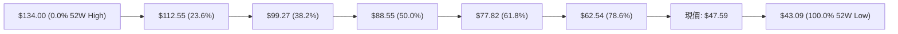

- **位置判定**：當前收盤價 **$47.59** 嚴格運行於 **78.6% 回調位 ($62.54)** 與 **100.0% 極值位 ($43.09)** 之間。
- **空間結構解讀**：
  - 價格自 $134.00 下跌至現價，已抹去整個波段回調深度的逾 95%，代表熊市下行週期已進入「深水清算區」。
  - 向上回測首個斐波那契阻力為 $62.54，距現價有 **+$14.95 (+31.41%)** 的潛在技術修復空間。
  - 向下距離 100% 絕對支撐 $43.09 僅差 **-$4.50 (-9.45%)**，顯示下行潛在風險受限，風險報酬比具備不對稱優勢。

---

## 5. 技術指標深度解讀

### 🎛️ 指標訊號總覽

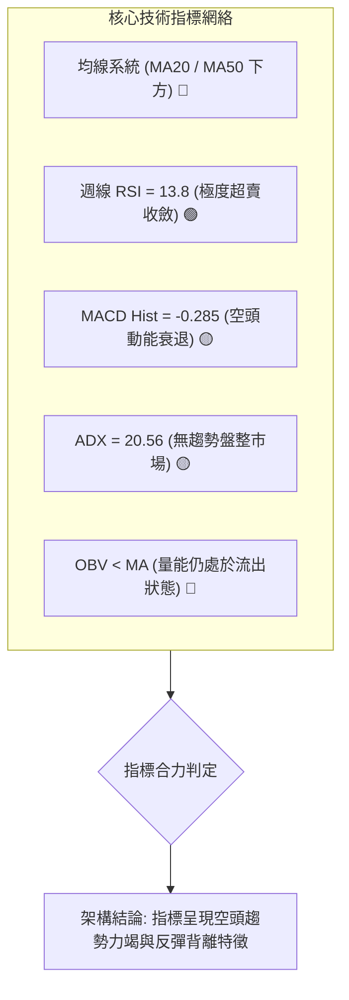

### 📈 移動平均線排列分析

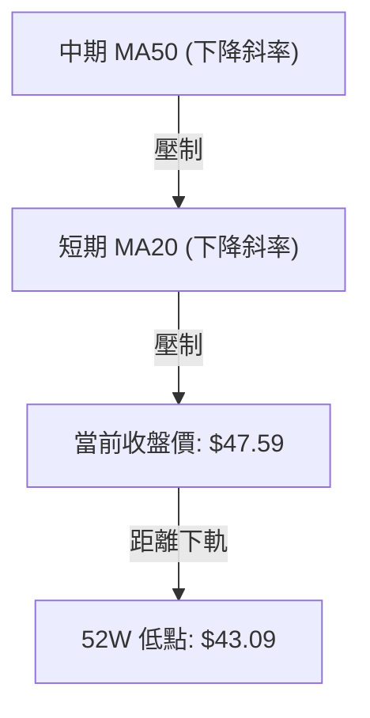

| 均線名稱 | 數值狀態 | 與現價相對位置 | 排列特徵與走勢解讀 |
|:---|:---:|:---:|:---|
| **MA20** | 數據顯示「▼ 下方」 | 現價位於 MA20 之下 | 短期均線壓制明顯，走勢維持空頭斜率，任何反抽觸及 MA20 均屬短線解套賣點 |
| **MA50** | 數據顯示「▼ 下方」 | 現價位於 MA50 之下 | 中期均線呈空頭發散，與 MA20 未見收斂金叉，中期下行壓力沉重 |
| **MA200** | 數據中未提供具體值 | 判定遠高於現價 | 混合排列，長期趨勢受 2026 年初 $103.01 崩跌影響，均線系統呈標準「空頭排列」 |

### 📉 RSI(14) 分析

- **週線 RSI 數值**：**13.8**（前週最低觸及 **11.7**）
- **區間判定進度條**：
  ```
  極端超賣區 (<20)           超賣區 (<30)       中性平衡 (50)       超買區 (>70)
  [██████░░░░░░░░░░░░░░░░░░░░░░░░░░░░░░░░░░░░░░░░░░░░░░░░░░░] 13.8%
  ```
- **超賣與背離深度解讀**：
  - 週線 RSI 於 2026-09-06 跌破 12 達 **11.7**，創下近 24 個月罕見的「深度超賣水準」。
  - 價格在 2026-09-13 創收盤低點 $46.69 時，RSI 由 11.7 回升至 **13.8**；隨後於 2026-09-20 價格微升至 $47.59。
  - **背離結論**：週線級別出現**初級底背離雛形**（價格創新低而 RSI 低點墊高），顯示下行動能衰竭，具備報復性技術反彈底氣。

### 📊 MACD(12/26/9) 訊號解讀

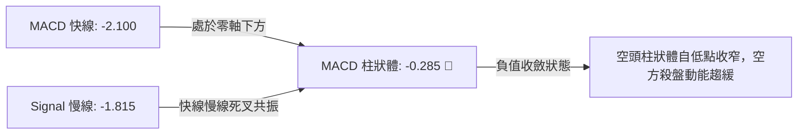

- **MACD 線**：-2.100
- **信號線 (Signal)**：-1.815
- **差離值 (MACD Histogram)**：**-0.285**
- **訊號解析**：
  - 快慢線皆深陷負值區間，代表中長線空方仍主導市場大格局。
  - 觀察近 4 週柱狀圖軌跡：從 2026-08-30 的 -1.211、09-06 的 -1.318，快速收斂至 09-13 的 -0.864，並在當前收斂至 **-0.285**。
  - 柱狀體呈現**強烈向零軸收斂**態勢，此乃典型的「空頭衰竭（Selling Climax Exhaustion）」特徵，若柱狀體翻正，將確認反彈行情啟動。

### 📦 布林通道分析

依據 ADX = 20.56 判定，市場處於布林帶寬擠壓後的弱勢橫盤階段（數據源未提供精確上下軌數值，依據技術原理推演）：
- **中軌 (MA20)**：目前作為動態反彈第一阻力，空頭排列下向下壓制。
- **下軌支撐區**：沿著近期波段低點 $46.03 與 52 週低點 $43.09 延展。
- **價格行為**：現價 $47.59 貼近下軌邊界運行，未出現擴軌向下擊穿，顯示賣壓在下軌附近被承接盤消化，符合「超賣震盪收斂」形態。

```
布林通道相對位置示意圖 ($)
$62 ┤  上軌 (Upper Band ~ $62.54 斐波那契位)
    ┤  ---------------------------------------
$55 ┤  中軌 (Middle Band / MA20 ~ 動態阻力)
    ┤  - - - - - - - - - - - - - - - - - - - -
$47 ┤  ◄ 現價 $47.59 (緊貼下軌回升)
    ┤  =======================================
$43 ┤  下軌 (Lower Band ~ 52W Low $43.09)
```

### 💹 成交量分析（量價配合度）

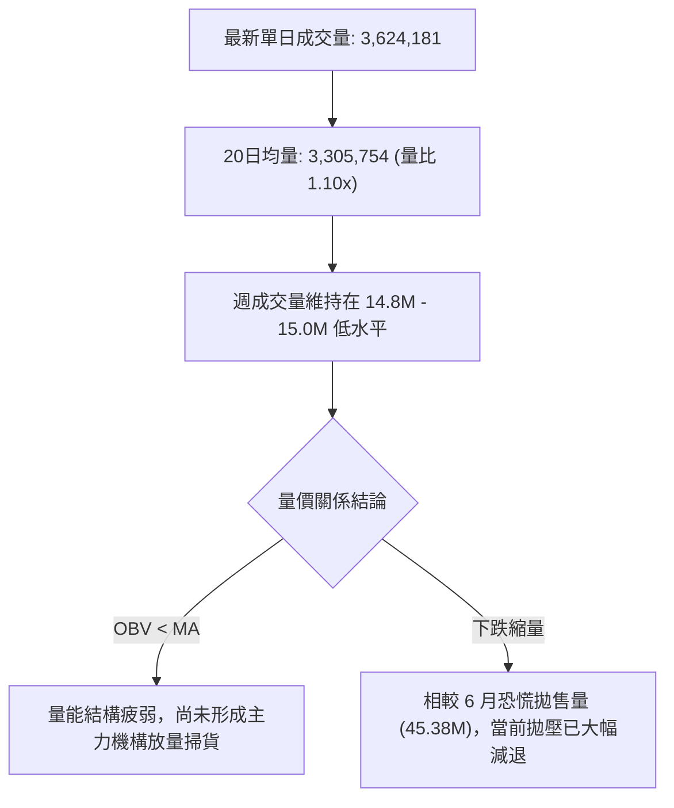

- **成交量特徵**：最新成交量 3.62M 略高於 20 日均量 3.31M（量比 1.10x），高於 50 日均量 (3.63M) 邊緣，顯示低檔有溫和換手。
- **OBV 趨勢解讀**：數據明確標記「OBV < MA → 量能疲弱」。這表明過去兩個月的反彈未能扭轉資金流出態勢，整體資金仍以防禦撤退為主，量價並未形成健康的「價漲量增」多頭確認。

---

## 6. 動能與波動率

### ⚡ 動能評估四象限

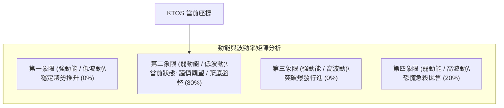

| 象限分區 | 動能維度 | 波動維度 | 歷史比對 | 當前狀態判定與操作應對 |
|:---:|:---:|:---:|:---:|:---|
| **Q1** | 強 | 低 | 2025 年 5-7 月多頭慢牛 | 不符合。各項趨勢指標皆未抬頭。 |
| **Q2 (當前)** | **弱** | **低** | **2026 年 9 月當前現狀** | **符合。ADX=20.56 代表動能微弱，成交量降至年內低位，適合區間網格操作。** |
| **Q3** | 強 | 高 | 2026 年 1 月頂部噴出 | 不符合。缺乏大幅跳空與爆量推升事件。 |
| **Q4** | 弱 | 高 | 2026 年 6 月破位殺跌 | 脫離。6 月底單週爆出 45.38M 巨量急殺後，當前進入低波動收斂。 |

### 📊 ATR 波動率分析

- **ATR (14) 數據揭示**：原始數據中標註為 `$N/A`。
- **週期波幅推算替代模型**：
  - 檢視近 4 週收盤波幅：最高點 $52.00，最低點 $46.69，四週最大波動差為 $5.31，單週平均波幅約為 **$1.33**。
  - 對比 2026-08 單週從 $46.60 飆升至 $64.58（波幅達 $17.98），當前波動率已被壓縮至年內低點的 10% 左右。
- **止損與風控安全距離推算**：
  - 依據歷史波段低點緩衝，建議防守止損間距不得小於近期波動下限，設定為現價向下緩衝 **$4.50**（恰對應 52 週低點 $43.09 邊界）。

### 📐 Beta 與市場相關性

- **Beta 數值**：**1.113**
- **敏感度特性分析**：
  - Beta 略大於 1.0，表明 KTOS 的價格波動與標普 500 或國防工業板塊具備較高同向性，且自帶 11.3% 的槓桿放大屬性。
  - 由於空頭市場中 Beta > 1 會加速下行風險，因此在美股大盤波動震盪時，KTOS 容易出現超額下殺；但若整體防務板塊迎來反彈，其彈性亦將顯著優於防守型藍籌。

---

## 7. 多時框架總結

### 📋 時框架評分表

| 時框架 | 趨勢方向 | 動能表現 | 均線排列狀況 | 形態特徵 | 綜合評分 | 建議操作維度 |
|:---:|:---:|:---:|:---:|:---|:---:|:---|
| **月線 (長期)** | 🔴 強烈空頭 | 弱勢修正 | 空頭向下發散 | 自 $103.01 頂部深度回撤，破位下行 | 25/100 | 嚴格防守，不宜盲目長線做多 |
| **週線 (中期)** | 🔴 弱勢空頭 | 🟢 極度超賣 | 空頭壓制 (受阻$64) | 探底 $46.03 與 $46.69，構築微弱雙底 | 40/100 | 尋求技術性超賣反彈機會 |
| **日線 (短期)** | 🟡 橫向盤整 | 🟡 空頭鈍化 | 價格居 MA20 之下 | ADX=20.56，窄幅震盪拉鋸於 $47.59 | 45/100 | 區間震盪交易，嚴設停損 |

### 🔲 綜合訊號矩陣

```
╔══════════════════════════════════════════════════════════════════╗
║               KTOS 多時框跨指標確認矩陣                         ║
╠══════════════════════╦════════════╦════════════╦═════════════════╣
║ 指標項目             ║ 長期 (月線) ║ 中期 (週線) ║ 短期 (日線)     ║
╠══════════════════════╬════════════╬════════════╬═════════════════╣
║ 趨勢方向 (Trend)     ║ 🔴 空頭    ║ 🔴 偏空    ║ 🟡 橫盤盤整     ║
║ 動能指標 (RSI/MACD)  ║ 🔴 負向    ║ 🟢 超賣鈍化 ║ 🟡 MACD柱收窄   ║
║ 均線系統 (Moving Avg)║ 🔴 空頭排列 ║ 🔴 下方壓制 ║ 🔴 MA20/50 之下 ║
║ 量能配合 (Volume/OBV)║ 🔴 持續流出 ║ 🟡 縮量止跌 ║ 🟢 量比 1.10x   ║
║ 關鍵形態 (Pattern)   ║ 🔴 下行推動 ║ 🟡 雙底雛形 ║ 🟡 邊界震盪     ║
╚══════════════════════╩════════════╩════════════╩═════════════════╝
```

### ⚖️ 多時框收斂結論（依規則 14 執行）

1. **行情性質定調**：
   - 當前系統 **ADX(14) 讀數為 20.56**，嚴格符合「**ADX < 25 之非趨勢 / 弱勢盤整行情**」判定條件。
2. **多時框收斂優先級**：
   - 依據規則 14，在盤整行情中，**以日線與週線的震盪邊界作為主要交易區間**，避免盲目追隨單邊大趨勢做極端單向押注。
   - 儘管中長期（月線與均線）維持空頭排列，但週線 RSI 跌入 11.7-13.8 極端超賣區，與日線 MACD 柱狀圖縮斂形成多指標共振。
3. **唯一方向性結論**：
   - **中性觀望偏空築底（Neutral-to-Bearish Consolidation at Floor）**。盤面不具備直接反轉暴漲的動能，亦缺乏立即擊穿 $43.09 52 週低點的恐慌拋壓。主導邏輯為：**「在 $43.09-$46.03 支撐區間上尋找低吸反彈博弈機會，並在反彈至 $62.54-$64.58 阻力帶時果斷獲利了結或反手佈空」**。

---

## 8. 交易策略建議

### 🗺️ 策略決策流程圖

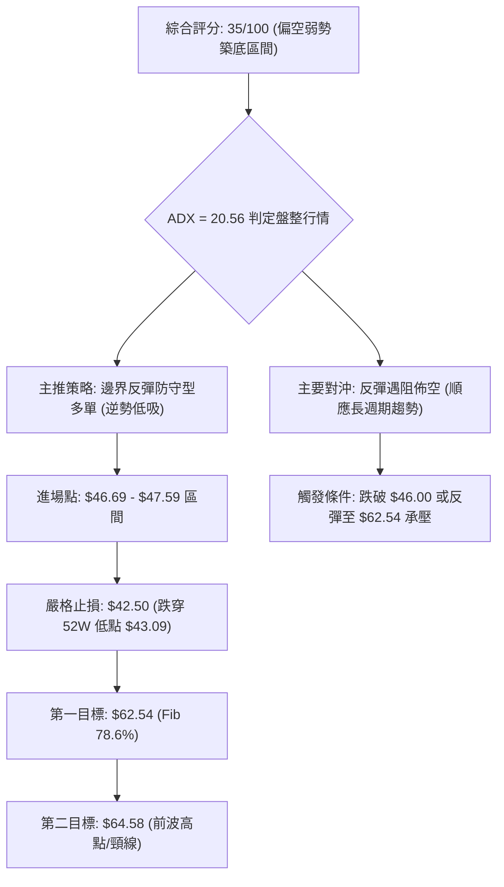

### 🧭 策略路由

- **當前主策略方向 = 區間下軌防守型低吸做多（反彈波段），輔以破位對沖（依評分 35/100 定位為「空頭力竭盤整區」）**。
- *策略邏輯*：評分雖處於偏空區（≤40），但因 ADX 進入 <25 的盤整結構，且週線 RSI 處於歷史極端超賣區間，禁止追空；以波段低點 $46.03 為防守點，博弈盈虧比極佳的技術反彈。

### 🎯 價格情境階梯（Price Scenarios）

價位嚴格引用第 4 章數據與關鍵價位清單：

| 階梯觸發條件 | 下一階段目標 | 後續延伸發展 | 戰略情境涵義 |
|:---|:---:|:---:|:---|
| **強勢突破阻力 R2 ($64.58)** | $77.82 (Fib 61.8%) | $88.55 (Fib 50.0%) | 雙底形態確立，中期趨勢翻多，空頭回補浪潮啟動 |
| **首要突破阻力 R1 ($62.54)** | $64.58 (波段高點) | $77.82 (黃金分割) | 技術面超賣修復，測試週線頸線阻力 |
| **維持於現價區間 ($46.69 - $47.59)** | — | — | 低檔震盪築底，ADX 鈍化，消耗浮額籌碼 |
| **跌破近端支撐 S1 ($46.69)** | $46.03 (前次低點) | $43.09 (52W Low) | 探底考驗加劇，短線震盪區間下移 |
| **跌破極限支撐 S3 ($43.09)** | $38.94 (形態延伸) | 數據未偵測更低點 | 52 週防線全面崩潰，下行空間打開，必須無條件停損 |

### 📊 情境機率分佈

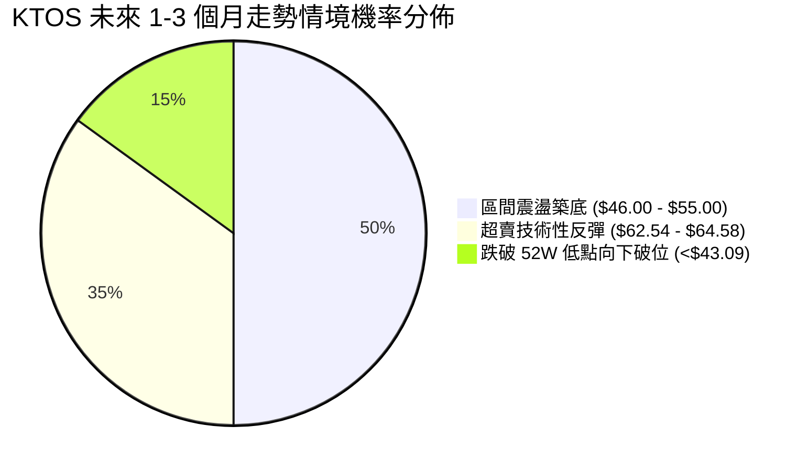

| 市場情境 | 發生機率 | 主要技術與指標依據 |
|:---|:---:|:---|
| **區間震盪築底** | **50%** | **ADX=20.56 確立非趨勢特徵**；成交量縮減，多空雙方均缺乏單邊推動力度。 |
| **超賣技術反彈** | **35%** | **週線 RSI 出現 11.7-13.8 極端數值**；MACD 柱狀體大幅收斂至 -0.285，空方動能耗盡。 |
| **向下跌破探底** | **15%** | 長期均線空頭排列，OBV 持續低於均線顯示機構買盤猶豫，若大盤重挫可能引發最後補跌。 |

### 🟢 主策略詳情

| 策略要素 | 策略 A：現價左側低吸反彈單 (主推) | 策略 B：突破回踩右側順勢多單 |
|:---|:---|:---|
| **進場條件** | 現價 $47.59 附近或回踩 S1 ($46.69) 不破 | 實體日線突破阻力 R1 ($62.54) 並回踩確認 |
| **精確進場點** | **$47.59** (或回踩挂單 **$46.80**) | **$63.00** |
| **目標價 T1** | **$62.54** (Fib 78.6% 回調位) | **$64.58** (頸線阻力位) |
| **目標價 T2** | **$64.58** (近期波段高點/雙底頸線) | **$77.82** (Fib 61.8% 黃金分割) |
| **硬性止損點** | **$42.50** (跌破 52 週最低點 $43.09 離場) | **$58.00** (假突破跌回阻力位下方) |
| **風險報酬比** | **1 : 2.94**<br>(風險: $5.09, 預期收益 T1: $14.95) | **1 : 2.96**<br>(風險: $5.00, 預期收益 T2: $14.82) |
| **預估勝率** | **55%** | **65%** |
| **建議倉位** | **10% - 15% (輕倉試單)** | **20% (右側確認加碼)** |

### 🔴 反向風險觸發點（對沖提示）

- **做多全面無條件止損點**：**$42.50**。若價格收盤跌破 52 週低點 **$43.09**，意味著雙底形態構建失敗，長期空頭重啟，現貨部位應全數出清，激進者可啟動反手放空對沖。
- **反彈遇阻做空點位**：**$62.54 - $64.58**。若價格衝高至該阻力帶，但日線 RSI 觸及 70 以上超買且成交量萎縮，代表長期空頭壓制再度顯現，為最佳波段做空或多單獲利止盈節點。

### ⭐ 整體訊號強度評星

```
╔═══════════════════════════════════════════════════╗
║ 做多訊號強度 (超賣反彈)：  ★★★☆☆  (3.0 / 5 星)  ║
║ 做空訊號強度 (順勢破位)：  ★★☆☆☆  (2.0 / 5 星)  ║
║ 整體技術可信度：          ★★★★☆  (4.0 / 5 星)  ║
╚═══════════════════════════════════════════════════╝
```

---

## 9. 風險提示與監控

### ✅ 關鍵監控指標 Checklist

```
╔══════════════════════════════════════════════════════════════════╗
║               KTOS 日常交易風控監控清單 (Checklist)              ║
╠══════════════════════════════════════════════════════════════════╣
║ [ ] 價格是否跌破 52 週低點 $43.09 (若破位，啟動全線風控止損)      ║
║ [ ] 週線收盤是否穩守在 $46.03 之上 (雙底形態是否維持有效性)      ║
║ [ ] 日線成交量是否持續高於 3.31M (換手量能是否能夠有效支撐反彈)   ║
║ [ ] ADX(14) 讀數是否突破 25 (觀察是否由盤整市轉化為單邊新趨勢)    ║
║ [ ] MACD Histogram 數值能否翻正至 > 0 (確認短期動能反轉訊號)      ║
║ [ ] RSI(14) 是否成功脫離超賣區進入 40-50 中性平衡帶              ║
╚══════════════════════════════════════════════════════════════════╝
```

### ⚠️ 風險場景分析

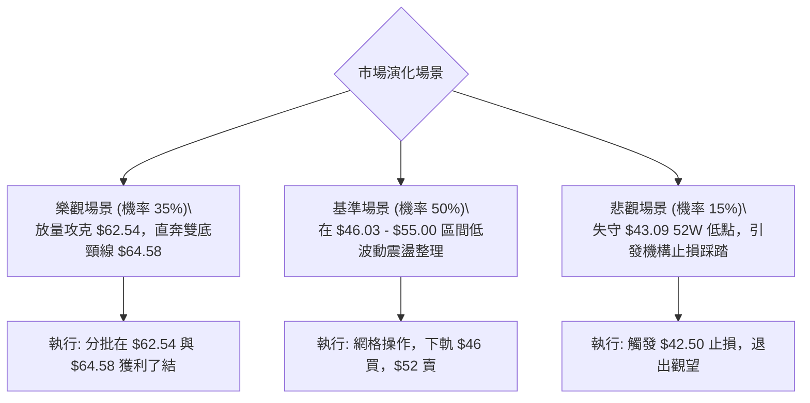

### 🛡️ 風險管理重要提醒

1. **破位止損不可妥協**：
   - 由於長期均線（MA20/50）處於明確的空頭壓制之下，當前任何做多嘗試本質上皆屬「逆長趨勢、博短超賣」的左側波段交易。
   - **$43.09** 為整份數據集的核心底線，跌破該點位意味著估值重心進一步下移，下行空間無從錨定，必須執行紀律化停損。
2. **防範流動性陷阱**：
   - 近期成交量約為 3.62M，雖然量比達 1.10x，但對比 6 月底的 45.38M 拋售量，當前市場參與深度顯著降低。單筆持倉建議不超過總投資組合的 **10%**，避免在低流動性盤整時面臨較高的衝擊成本。
3. **分析師目標價之背離警示**：
   - 儘管華爾街 21 位分析師給出「Strong Buy」評級且平均目標價高達 **$102.76**（最高 $150.00），但技術面呈現明顯的滯後與嚴重回調特徵。交易者應以「眼見的圖表價量（Price Action）」為決策第一準繩，切莫因基本面目標價而忽視技術破位風險。

---

## 📋 報告總結

```
╔══════════════════════════════════════════════════════════════════╗
║                    KTOS 技術分析報告總結                         ║
╠══════════════════════════════════════════════════════════════════╣
║ 報告日期：2026-09-18                                             ║
║ 當前價格：$47.59                                                 ║
║ 分析評級：⚖️ 偏空中性築底 (ADX=20.56，盤整市場超賣反彈機會)       ║
║                                                                  ║
║ 核心趨勢研判：                                                   ║
║ ├─ 長期趨勢 (月線)：🔴 空頭修正 (自 $103.01 頂部深度回調 -54%)    ║
║ ├─ 中期趨勢 (週線)：🟡 雙底防守 (圍繞 $46.03 與 $46.69 築底)     ║
║ ├─ 短期趨勢 (日線)：🟡 弱勢橫向 (ADX<25，窄幅震盪)                ║
║ ├─ 關鍵支撐：S1: $46.69 ｜ S2: $46.03 ｜ S3: $43.09 (52W Low)    ║
║ ├─ 關鍵阻力：R1: $62.54 ｜ R2: $64.58 ｜ R3: $77.82               ║
║ └─ 52週區間：$43.09 (極低) ～ $134.00 (極高)                     ║
║                                                                  ║
║ 最優交易策略組合：                                               ║
║ 1. 🥇 最佳機會 (反彈波段)：在 $46.69-$47.59 區間建立左側防守多單， ║
║    目標價上看 $62.54 (Fib 78.6%)，跌破 $42.50 嚴格止損 (R/R=2.94)。║
║ 2. 🥈 次選機會 (順勢做空)：若弱勢反彈至 $62.54 承壓受阻，反手佈空，║
║    回看 $46.69，止損置於 $65.00 之上。                           ║
║ 3. 🥉 保守選擇 (觀望等待)：等待價格明確放量站上 MA20 與 $64.58 頸  ║
║    線後，再行介入右側多頭趨勢行情。                              ║
╚══════════════════════════════════════════════════════════════════╝
```

---

> ⚠️ **免責聲明**：本報告為技術分析量化模型產出，所有數據、點位及估算均嚴格基於歷史量價與已揭露財務資訊。本報告**僅供研究與學術參考**，**不構成任何要約、招攬或實質投資建議**。市場有風險，交易需設立嚴格停損與風險管理體系。

---

*報告生成時間：2026-09-18 ｜ 數據來源：Yahoo Finance ｜ 分析框架：多時框技術分析體系 (MTF)*