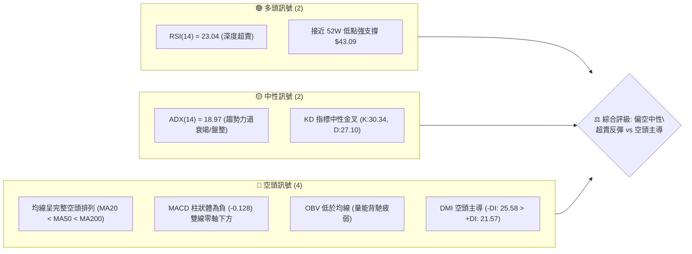
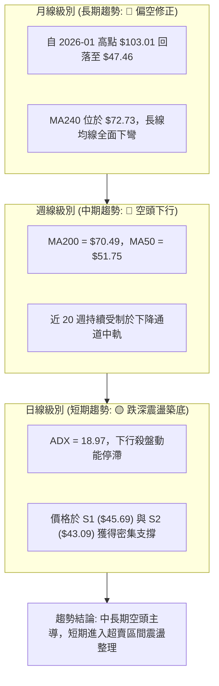
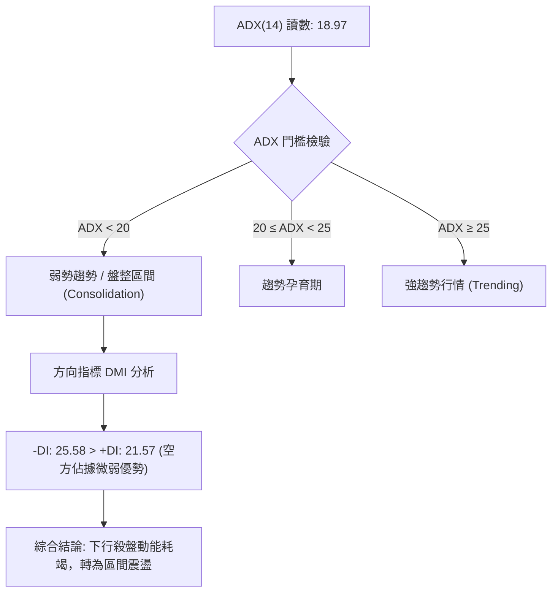
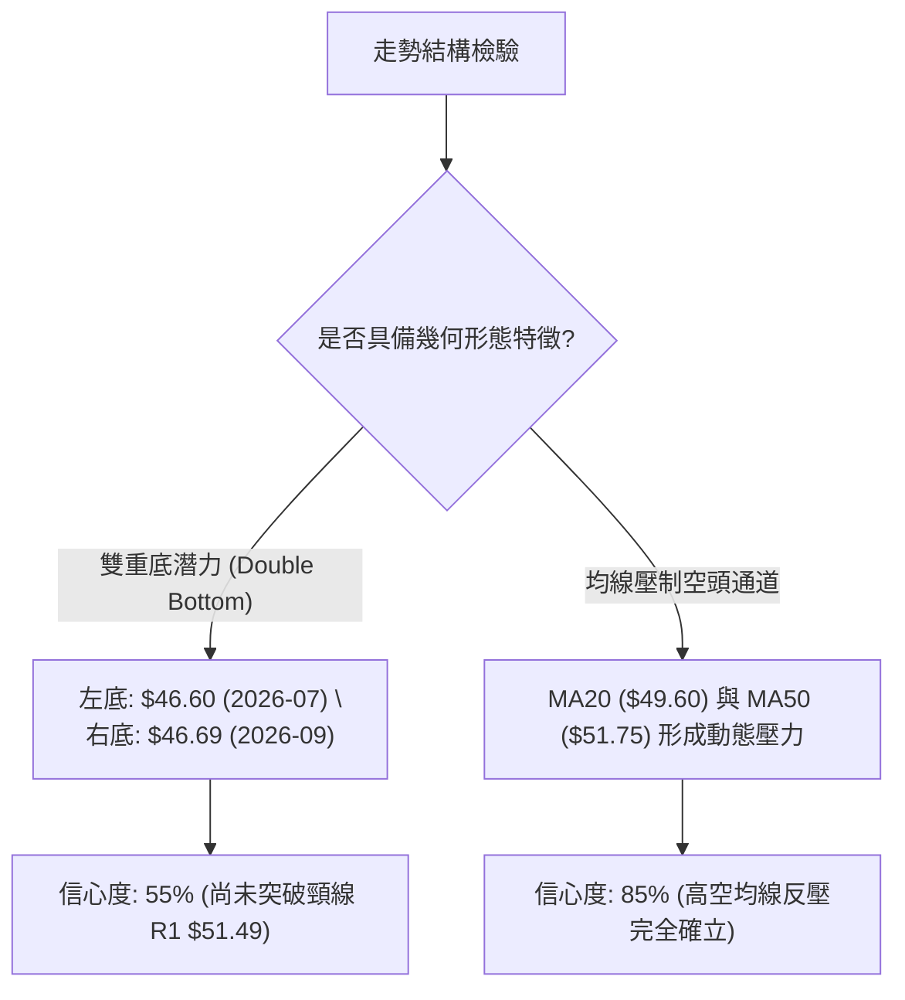
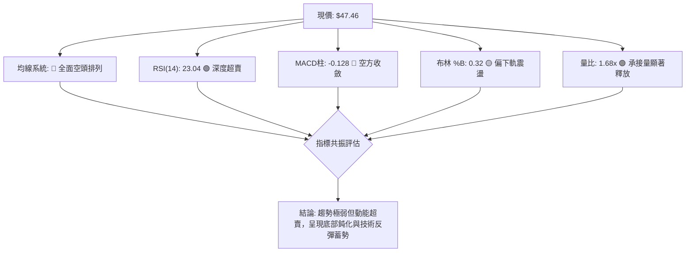
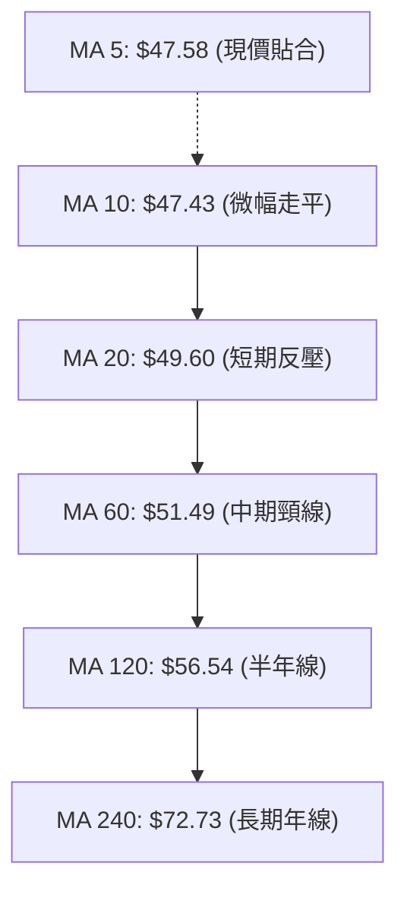
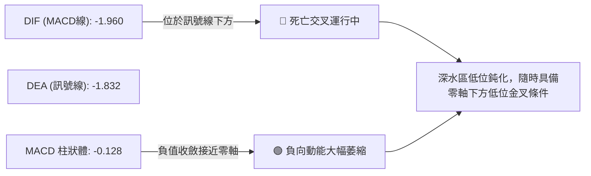
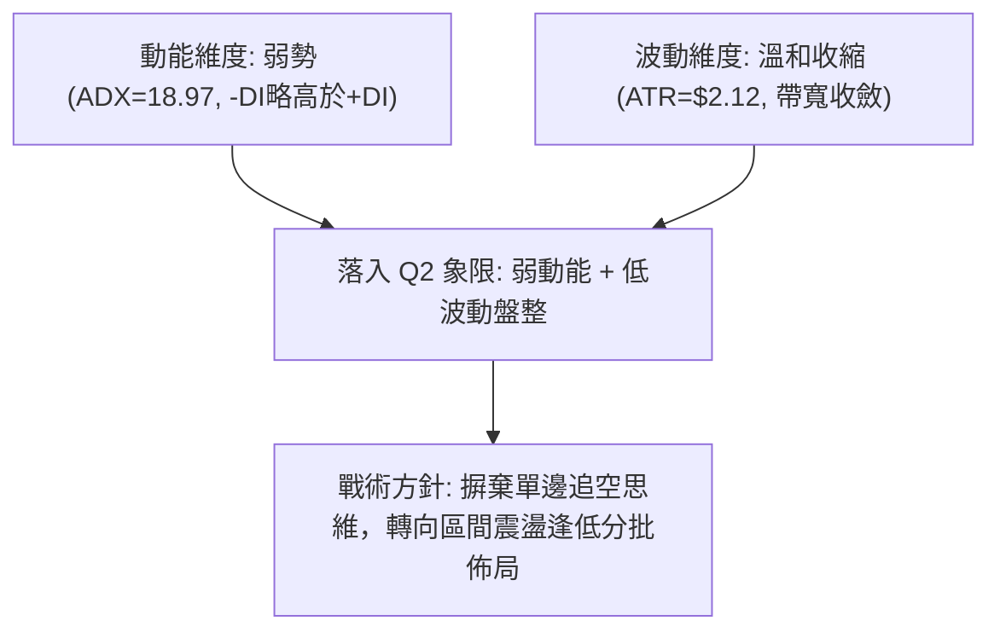
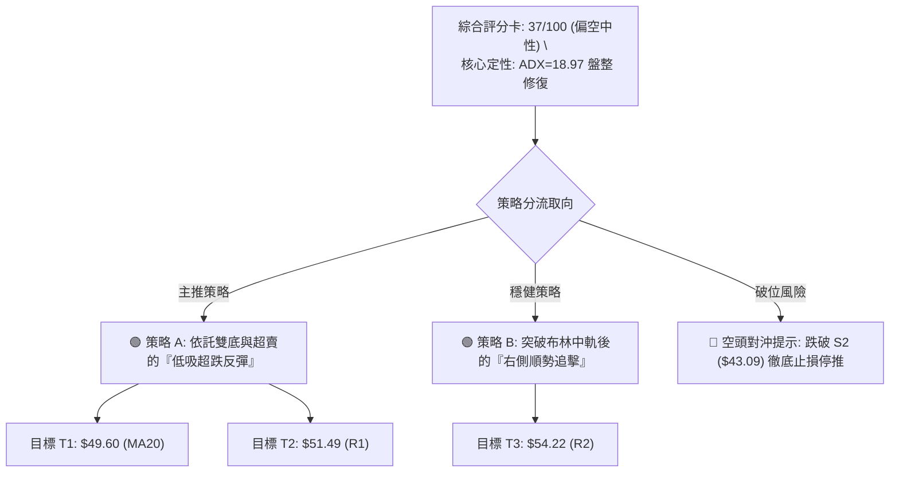
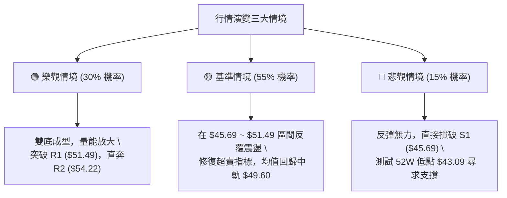

# KTOS 技術分析報告

> **報告日期**：2026-09-19 ｜ **語言**：繁體中文 ｜ **數據來源**：Yahoo Finance ｜ **當前價格**：$47.46

---

## 目錄

| 章節 | 內容 |
|------|------|
| [1. 技術面概覽](#1-技術面概覽) | 訊號儀表板、核心指標、評分卡 |
| [2. 趨勢分析](#2-趨勢分析) | 多時框趨勢、長中短期走勢 |
| [3. 圖表形態分析](#3-圖表形態分析) | 形態識別、K線組合、目標價 |
| [4. 支撐與阻力](#4-支撐與阻力) | 關鍵價位、斐波那契回調 |
| [5. 技術指標深度解讀](#5-技術指標深度解讀) | MA/RSI/MACD/布林/成交量 |
| [6. 動能與波動率](#6-動能與波動率) | 動能評估、ATR、Beta |
| [7. 多時框架總結](#7-多時框架總結) | 時框架評分矩陣 |
| [8. 交易策略建議](#8-交易策略建議) | 多空策略、風險報酬比 |
| [9. 風險提示與監控](#9-風險提示與監控) | 監控指標、風險場景 |

---

## 1. 技術面概覽

### 🎯 技術訊號儀表板



### 📊 核心指標速覽表

| 指標類別 | 指標名稱 | 當前數值 | 訊號 | 解讀 |
|----------|----------|----------|------|------|
| **價格** | 當前收盤價 | $47.46 | 🔴 | 位於 52 週低點區間 4.8%，長期下跌趨勢未扭轉 |
| **均線** | MA20 (月線) | $49.60 | 🔴 | 現價低於 MA20 (-4.32%)，短線承壓 |
| **均線** | MA50 (季線) | $51.75 | 🔴 | 現價低於 MA50，中期下行壓力強烈 |
| **均線** | MA200 (年線)| $70.49 | 🔴 | 現價低於 MA200 (-32.67%)，長線處於熊市格局 |
| **動能** | RSI(14) | 23.04 | 🟢 | 極度超賣 (<30)，技術性跌深反彈動能積聚 |
| **動能** | MACD (12,26,9) | -1.960 / -1.832 | 🔴 | MACD 處於負軸，柱狀體為 -0.128，維持偏空架構 |
| **動能** | Stochastic KD | 30.34 / 27.10 | 🟡 | K值自低檔穿越D值，處於弱勢反彈醞釀區 |
| **趨勢** | ADX (14) | 18.97 | 🟡 | ADX < 25，下行動能減速，進入低波動盤整 |
| **通道** | 布林帶 (%B) | 0.32 | 🟡 | 位於下軌 ($43.64) 與中軌 ($49.60) 之間，偏弱震盪 |
| **波動** | ATR(14) | $2.12 | 🟡 | 日波動率約 4.48%，區間振幅收窄 |
| **量能** | 20日成交均量 | 5,648,900 (1.68x)| 🟢 | 放量收小陽線，低檔承接買盤初步浮現 |

### 🏆 技術評分卡

```
╔══════════════════════════════════════════════════════════════╗
║              技術評分卡 — KTOS (2026-09-19)                  ║
╠══════════════════════════════════════════════════════════════╣
║ 趨勢強度 (Trend)     ████░░░░░░░░░░░░░░░░  20/100  🔴 極度疲弱 ║
║ 動能指標 (Momentum)  ████████░░░░░░░░░░░░  40/100  🟡 超賣醞釀 ║
║ 支撐穩定度 (Support) ████████████░░░░░░░░  60/100  🟢 雙底支撐 ║
║ 成交量配合 (Volume)  ██████████░░░░░░░░░░  50/100  🟡 局部放量 ║
║ 形態完整度 (Pattern) ████████░░░░░░░░░░░░  40/100  🟡 築底雛形 ║
║ 均線排列 (Moving Av) ██░░░░░░░░░░░░░░░░░░  10/100  🔴 空頭排列 ║
╠══════════════════════════════════════════════════════════════╣
║ 綜合評分             ███████░░░░░░░░░░░░░  37/100  🔴 偏空震盪 ║
╚══════════════════════════════════════════════════════════════╝
```

---

## 2. 趨勢分析

### 🌐 多時框趨勢分析



### 📈 長期趨勢 — 12個月走勢圖（Unicode）

```
KTOS 月線走勢圖（2025-10 至 2026-09）
價格軸 ($)
$105 ┤                ● (2026-01: $103.01 高點)
$95  ┤ ● (2025-10: $90.60)
$85  ┤                      ● (2026-02: $86.18)
$75  ┤    ●     ● (2025-12: $75.91)
$65  ┤                          ● (2026-03: $70.51)
$55  ┤                              ● (2026-05: $64.13)
$45  ┤                                    ●     ●←現在 ($47.46)
$35  ┤                                       ● (2026-07: $46.60)
     └────────────────────────────────────────────────────────
       10    11    12    01    02    03    04    05    06    07    08    09 (月份)
```

**走勢特徵分析表格**：

| 階段區間 | 起止月份 | 價格變化 | 漲跌幅 | 結構性特徵分析 |
|----------|----------|----------|--------|----------------|
| 第一階段：頂部構築 | 2025-10 ~ 2026-01 | $90.60 → $103.01 | +13.70% | 創下波段歷史新高 $103.01 後迅速力竭，伴隨高檔長上影線 |
| 第二階段：急速下墜 | 2026-01 ~ 2026-04 | $103.01 → $63.05 | -38.79% | 連續4個月實體黑K重挫，跌破各天期短期均線，呈現無支撐拋售 |
| 第三階段：破位加速 | 2026-04 ~ 2026-07 | $63.05 → $46.60  | -26.09% | 弱勢反彈至 $64.13 後再次破底，觸及 52 週低點 $43.09 附近 |
| 第四階段：底部震盪 | 2026-07 ~ 2026-09 | $46.60 → $47.46  | +1.85%  | 波動幅度顯著收窄，連續3個月於 $45.00~$51.00 築底打底 |

### 📊 中期趨勢（週線分析）

中期技術結構目前處於空頭推動後的整理期。近 20 週的收盤價從 2026-05-31 的高點 $64.13 一路反覆下探，並在 2026-09-13 創下波段收盤低點 $46.69。

```
KTOS 中期週線支撐與阻力走勢結構
$65.00 ┤        ┌───┐ (2026-08-16 高點 $64.58)
$60.00 ┤   ┌────┘   └────┐
$55.00 ┤───┘             └───────┐             阻力 R1: $51.49 (MA60)
$50.00 ┤                         └─────┬─────── ◄ 現價: $47.46
$45.00 ┤   ▲                           └───▲── 支撐 S1: $45.69 / S2: $43.09
       └───┴───────────────────────────────┴───
       2026-06                           2026-09
```

### ⚡ 趨勢強度評估（ADX 解讀）



**ADX 趨勢強度對照表**：

| 指標 | 數值 | 狀態區間 | 技術含義 |
|------|------|----------|----------|
| **ADX(14)** | 18.97 | < 25 (弱趨勢) | 當前市場並無單邊主導趨勢，追空或盲目追多勝率均低 |
| **+DI** | 21.57 | 多方進攻維度 | 多頭反撲力道疲弱，但已不再大幅創低 |
| **-DI** | 25.58 | 空方主導維度 | 空頭主導權略高於多方，但差距正在急遽收窄 |
| **動能轉換** | -4.01 | (-DI 減 +DI) | 差值小於 5，顯示空頭拋壓進入弱化平衡期 |

---

## 3. 圖表形態分析

### 🔍 形態識別系統



**形態信心度表格**（嚴格依據真實數據評估）：

| 形態類別 | 信心度 | 判斷依據（引用數據） | 完成度 | 目標價（附計算式） |
|----------|--------|----------------------|--------|--------------------|
| **雙重底 (潛在)** | 55% | 左底 2026-08-02 的 $46.60 與右底 2026-09-13 的 $46.69 構成對稱低點聚類（支撐 S1 $45.69 守穩） | 50% | 頸線位取近波高點 R1 $51.49。<br/>形態高度 = $51.49 - $46.60 = $4.89。<br/>突破目標價 = $51.49 + $4.89 = **$56.38**（接近 MA120 的 $56.54） |
| **下行通道壓制** | 85% | 均線系統全面空頭排列，近一年高點聚類壓制，自 $103.01 形成典型階梯式下挫 | 90% | 沿通道下緣測試 52 週最低點 **$43.09** (S2) |
| **布林帶下軌支撐**| 70% | 現價 $47.46 位於布林下軌 $43.64 之上，%B 數值為 0.32，呈現區間止跌形態 | 75% | 均值回歸中軌 **$49.60** (MA20) |

### 🕯️ 重要K線形態分析

| 日期 / 週別 | 收盤價 | 成交量 | K線形態 | 專業技術解讀 | 訊號 |
|-------------|--------|--------|---------|--------------|------|
| 2026-08-16 | $64.58 | 19,032,700 | 衝高長上影陽線 | 觸碰波段反彈極限，受阻於下降均線後多頭力竭 | 🔴 |
| 2026-08-30 | $52.00 | 11,852,100 | 中實體長黑K | 跌破 50 日均線 ($51.49)，呈現無量陰跌殺多格局 | 🔴 |
| 2026-09-06 | $47.82 | 16,649,900 | 下跌實體黑K | RSI(14) 摔入 11.7 的極端恐慌超賣區，空頭動能耗盡 | 🟡 |
| 2026-09-13 | $46.69 | 14,837,000 | 帶下影線錘頭K線 | 守穩 S1 ($45.69) 上方，空方拋壓明顯減輕，賣壓衰竭 | 🟢 |
| 2026-09-20 | $47.46 | 20,728,200 | 低檔放量溫和收紅K | 量增價揚（日量比達 1.68x），初步確認底部承接力道介入 | 🟢 |

### 📉 ASCII 走勢形態示意圖

```
KTOS 潛在雙重底（W底）微觀結構示意圖
──────────────────────────────────────────────────────────
$54.00 ┤                                      阻力 R2 ($54.22)
$51.50 ┤         頸線高點: $51.49 (R1)        ───────────────
       ┤         ┌───────┐
$49.00 ┤         │       │          現價: $47.46
       ┤         │       │          ┌───●
$46.50 ┤─────────┘       └──────────┘         支撐 S1 ($45.69)
       ┤  左底: $46.60         右底: $46.69
$43.00 ┤                                      強支撐 S2 ($43.09)
──────────────────────────────────────────────────────────
```

---

## 4. 支撐與阻力

### 🗺️ 關鍵價位分布圖（Unicode）

```
KTOS 價位結構分布圖
═════════════════════════════════════════════════════════════
$58.88 ║████████████████████████████████████║ 強阻力 R3 (+24.06%)
$54.22 ║████████████████████████            ║ 中期阻力 R2 (+14.24%)
$51.49 ║████████████████                    ║ 頸線/關鍵阻力 R1 (+8.49%)
$49.60 ║▒▒▒▒▒▒▒▒▒▒▒▒                        ║ 布林中軌 / MA20
$47.46 ╠════════════════════════════════════╣ ◄ 當前收盤價現位
$45.69 ║▓▓▓▓▓▓▓▓▓▓▓▓▓▓▓▓▓▓▓▓▓▓▓▓            ║ 近期密集支撐 S1 (-3.74%)
$43.09 ║████████████████████████████████████║ 52週歷史鐵底 S2 (-9.21%)
═════════════════════════════════════════════════════════════
```

### 🚧 阻力位分析表

價位完全引用自真實聚類計算數值：

| 阻力級別 | 價位 | 形成原因與技術對應 | 突破難度 | 重要性 |
|----------|------|--------------------|----------|--------|
| **R1** | **$51.49** | MA60 均線重合點、波段下行破位點頸線、近期震盪頂部聚類 | 中等偏高 | 🟢 關鍵多空分水嶺 |
| **R2** | **$54.22** | 近期密集換手套牢區間、布林通道上軌 ($55.56) 附近反壓 | 高 | 🟡 中期強反壓 |
| **R3** | **$58.88** | 近一年波段高點聚類、長天期下降趨勢壓制線位置 | 極高 | 🔴 多頭長期防線 |

### 🛡️ 支撐位分析表

價位完全引用自真實聚類計算數值：

| 支撐級別 | 價位 | 形成原因與技術對應 | 守住機率 | 重要性 |
|----------|------|--------------------|----------|--------|
| **S1** | **$45.69** | 近一年波段低點聚類、9月第二週低點測試區間、下檔買盤密集區 | 70% | 🟡 短線第一道防線 |
| **S2** | **$43.09** | 52 週最低點 (52W Low)、布林通道下軌 ($43.64) 支撐處 | 85% | 🟢 長線生命線鐵底 |

### 📐 斐波那契回調位分析

依據 52 週完整區間波動（極值 $43.09 至 $134.00，全距 $90.91）嚴密對照：

```
134.00 ┼── 0.0%  (52W High 最高點)
       │
112.55 ┼── 23.6% 回調位
       │
 99.27 ┼── 38.2% 回調位
       │
 88.55 ┼── 50.0% 中性回調位
       │
 77.82 ┼── 61.8% 黃金分割強防守位 (已跌破)
       │
 62.54 ┼── 78.6% 極限回調位 (已跌破)
       │
 47.46 ┼───◄ 當前價格落點 (處於 78.6% 與 100.0% 極端超跌區間)
       │
 43.09 ┼── 100.0% (52W Low 歷史最低支撐線)
```

- **位置解讀**：現價 $47.46 位於 78.6% 回調位（$62.54）下方、100.0% 低點（$43.09）上方，處於整個 52 週循環的最底部 4.8% 區間。
- **技術含義**：股價回撤超過 78.6% 意味著原本的多頭循環結構遭到完全破壞，行情已被深度重置；此區域不宜繼續盲目殺跌，因極為接近 100.0% 的 $43.09 終極支撐，技術上具備強烈的不對稱盈虧比（Downside 僅約 9.2%，Upside 至第一阻力位即有 8.5%）。

---

## 5. 技術指標深度解讀

### 🎛️ 指標訊號總覽



### 📈 移動平均線排列分析



當前均線排列呈標準的空頭階梯：
- **MA5 ($47.58) 與 MA10 ($47.43)**：現價 $47.46 與短期超短天期均線黏合，跌勢在短線上已出現停頓跡象。
- **MA20 ($49.60) 與 MA60 ($51.49)**：斜率持續向下，是制約任何反彈的第一道厚重反壓帶。
- **乖離率檢視**：現價距離 MA240（$72.73）負乖離高達 -34.74%，處於歷史罕見的負乖離擴大區，技術上具備向均線靠攏修正的強烈內在要求。

### 📉 RSI(14) 分析

- **當前讀數**：**23.04**（進入 <30 極度超賣區間）
```
RSI(14) 強度儀表:
[████░░░░░░░░░░░░░░░░] 23.04 / 100  (🟢 極度超賣，蓄積反彈動能)
0                   30               70                  100
```
- **區間與背離判斷**：
  - 週線數據顯示，RSI 在 2026-09-06 觸及最低點 **11.7**，隨後股價在 2026-09-13 創下較低收盤價 $46.69 時，RSI 卻回升至 **13.8**，並在最新一週走高至 **23.0**。
  - **確認結論**：日線數據中標注「無明顯背離」，但在近 3 週的微觀週線級別上，RSI 呈現低檔抬升的**隱性弱底背離雛形**，顯示殺跌力竭，賣盤無意在此價位繼續賤賣。

### 📊 MACD(12/26/9) 訊號解讀



- **數值細節**：MACD線 (-1.960) < 訊號線 (-1.832)，Hist 柱狀體為 -0.128。
- **柱狀體動態**：從週線數據觀察，MACD 柱狀體自 2026-09-06 的 -1.318，快速收斂至 -0.864，再大幅收縮至當前的 -0.128。這表明空方主導的慣性動量正以極快速度衰退，空頭動能已處於最後釋放期。

### 📦 布林通道分析

```
布林帶走勢結構 (BB Width = $11.92)
$55.56 ┬─────────────────────────────── 布林上軌 (Upper Band)
       │
$49.60 ┼─────────────────────────────── 中軌 MA20 (反彈目標)
       │               ● 現價: $47.46 (%B = 0.32)
$43.64 ┴─────────────────────────────── 布林下軌 (Lower Band)
```

- **帶寬與位置**：%B 值為 **0.32**，說明現價已自下軌 ($43.64) 展開技術性脫離，處於下軌與中軌之間的下半部區間。
- **通道開口狀態**：帶寬呈現收斂態勢，代表急跌行情結束，市場由單邊波動轉入區間壓縮整理。

### 💹 成交量分析（量價配合度）

```
最新成交量:  ██████████████████████  5,648,900
20日均量:   █████████████░░░░░░░░░  3,360,565 (量比: 1.68x)
50日均量:   ██████████████░░░░░░░░  3,685,032
```
- **量能評估**：單日成交量放大至 20 日均量的 1.68 倍，且當週成交量達到 20,728,200 股，較前一週的 14,837,000 股增長近 40%。
- **OBV 趨勢解讀**：數據提示 `OBV < MA → 量能疲弱`，說明長期的量能累積結構仍未修復；但短期的「量增價穩」屬於典型的**主力資金低檔承接換手**特徵，而非恐慌盤拋售。

---

## 6. 動能與波動率

### ⚡ 動能評估四象限

| 象限 | 動能狀態 | 波動率狀態 | KTOS 當前落點 | 戰術應對策略 |
|------|----------|------------|---------------|--------------|
| **Q1 (最佳擴張)** | 強動能 (ADX>25) | 低波動 (ATR收縮) | — | 順勢突破加碼 |
| **Q2 (盤整孕育)** | 弱動能 (ADX<25) | 低波動 (ATR收窄) | **✓ (當前處於此區間)** | **區間低吸高拋，嚴設停損** |
| **Q3 (極端行情)** | 強動能 (ADX>25) | 高波動 (ATR放大) | — | 趨勢追隨或極端防禦 |
| **Q4 (混亂洗盤)** | 弱動能 (ADX<25) | 高波動 (ATR放大) | — | 停止交易觀望 |



### 📊 ATR 波動率分析

- **ATR(14) 絕對值**：**$2.12**
- **價格百分比**：4.48%（以現價 $47.46 計算）
- **止損與部位控管建議**：
  - **常規日內波動容忍度**：1.0 × ATR = **$2.12**
  - **多頭防守止損間距**：1.5 × ATR = **$3.18**（自現價 $47.46 往下設定保護點為 **$44.28**，高於極端鐵底 S2 的 $43.09）
  - **空頭回補止損間距**：1.5 × ATR = **$3.18**（自現價往上為 **$50.64**，即突破 MA20 後停損）

### 📐 Beta 與市場相關性

- **Beta 係數**：**1.113**
- **市場特徵**：KTOS 的波動度略高於標普 500 指數約 11.3%，具備較高的高彈性屬性。在軍工防務板塊中，1.113 的 Beta 顯示其兼具防禦資產與成長科技股的雙重特性。在當前大盤震盪環境下，該股在超跌之後的反彈彈性往往高於大盤基準。

---

## 7. 多時框架總結

### 📋 時框架評分表

| 時框架 | 趨勢方向 | 動能狀態 | 均線排列 | 形態特徵 | 綜合評分 | 戰術建議 |
|--------|----------|----------|----------|----------|----------|----------|
| **月線 (長期)** | 🔴 深度空頭 | 弱勢超賣 | 空頭排列 (破MA240)| 自百元高點回落腰斬 | 25/100 | 嚴控長線總部位 |
| **週線 (中期)** | 🔴 下行主導 | 負動能收斂 | MA50/200 壓制 | 尋求 52W 低點雙底 | 35/100 | 等待頸線確認 |
| **日線 (短期)** | 🟡 止跌盤整 | RSI 深度超賣 | 貼合 MA5/MA10 | 震盪反彈初萌 | 52/100 | 區間交易逢低買 |

### 🔲 綜合訊號矩陣

```
時框維度       趨勢       動能       量價       支撐阻力     最終指向
─────────────────────────────────────────────────────────────────
長期 (月線)     🔴 偏空    🔴 弱勢    🔴 疲弱     🟡 測試鐵底   🔴 空頭防禦
中期 (週線)     🔴 偏空    🟢 收斂    🟡 放量     🟢 S1/S2支撐  🟡 築底醞釀
短期 (日線)     🟡 盤整    🟢 超賣    🟢 增量     🟢 雙底雛形   🟢 反彈在即
─────────────────────────────────────────────────────────────────
一致性檢驗：長中期空頭背景下，短週期出現極端超跌共振，技術性反彈窗口開啟。
```

### ⚖️ 多時框收斂結論

依據多時框收斂規則（嚴格要求 14）：
1. **趨勢/盤整行情定性**：當前 ADX(14) 讀數為 **18.97 (< 25)**，技術結構正式定性為**「低動能盤整行情」**。
2. **時框優先級裁決**：在盤整行情下，市場不再具備單邊延伸的主導趨勢，日線布林通道區間（下軌 $43.64 至中軌 $49.60）及密集支撐阻力（S1 $45.69 至 R1 $51.49）成為主要定價中樞。中長期週線/MA200 的空頭排列主要扮演**「上方反彈極限天花板」**角色，而非當下急迫的追空驅動力。
3. **唯一方向性結論**：**中性偏多（超跌區間反彈）**。本質為大級別空頭框架下的次級折返走勢，交易核心在於捕捉由 RSI(14)=23.04 極致超賣所引發的向布林中軌與 R1 邁進的修復反彈。

---

## 8. 交易策略建議

### 🗺️ 策略決策流程圖



### 🧭 策略路由

**當前主策略方向 = 偏多反彈（區間交易，依評分 37/100 定性為超賣均值回歸）**
- **理由陳述**：雖然總評分 37/100 處於空頭壓制區，但 ADX 僅 18.97，下行單邊走勢已失效。價格緊鄰 52 週鐵底 S2 ($43.09) 僅 9% 距離，追空盈虧比極其劣後；反之，超賣修復至 R1 ($51.49) 的盈虧比高達 1:2.3 以上。因此主推**超跌左側反彈與右側突破策應**，空頭僅列為防禦提示。

### 🎯 價格情境階梯（Price Scenarios）

價位嚴格引用真實計算之關鍵價位：

| 觸發條件 | 下一目標 | 後續延伸 | 情境含義 | 操作戰術 |
|----------|----------|----------|----------|----------|
| **突破 R1 $51.49** | R2 $54.22 | R3 $58.88 | 中期底部形態確立，翻轉短期空頭格局 | 積極加碼，目標上看布林上軌與半年線 |
| **突破 MA20 $49.60**| R1 $51.49 | R2 $54.22 | 短線超賣修復成功，多頭佔據主動 | 減持部分底倉，移動止損至成本價 |
| **站穩現價 $47.46** | MA20 $49.60| R1 $51.49 | 於 S1 ($45.69) 上方延續低檔震盪打底 | 逢低分批建倉，耐心持股守株待兔 |
| **跌破 S1 $45.69** | S2 $43.09 | 數據未偵測更低點 | 支撐轉弱，回踩 52 週最低點鐵底 | 停止買入，緊盯 $43.09 最後防線 |
| **跌破 S2 $43.09** | 數據中未偵測到更低層級 | 創歷史新低 | 徹底破位，空頭全面失控重啟主跌段 | 多頭無條件停損離場，嚴禁硬抗 |

### 📊 情境機率分佈

| 情境方向 | 機率估算 | 主要技術依據 |
|----------|----------|--------------|
| **超跌反彈 (向上)** | **55%** | RSI(14)=23.04 極端超賣、MACD柱狀體收斂至 -0.128、單日量比 1.68x 增量承接 |
| **區間震盪 (橫盤)** | **35%** | ADX(14)=18.97 無單邊趨勢、布林帶寬顯著壓縮、MA5/MA10 糾結走平 |
| **破底崩跌 (向下)** | **10%** | S2 ($43.09) 具備 52 週極端護盤買盤，除非系統性崩盤否則直接下穿機率極低 |

### 🟢 主策略詳情

| 策略要素 | 策略 A：左側超跌區間低吸 (主推) | 策略 B：右側突破加碼順勢 (穩健) |
|----------|----------------------------------|----------------------------------|
| **進場條件** | 現價 $47.46 或回踩 S1 ($45.69) 不破 | 實體日K強勢突破站穩 MA20 ($49.60) |
| **進場價格** | **$47.46** (當前市價) | **$49.80** (突破 $49.60 後確認) |
| **目標價 T1** | **$49.60** (布林中軌 / MA20，報酬 +4.51%) | **$51.49** (波段阻力 R1，報酬 +3.39%) |
| **目標價 T2** | **$51.49** (關鍵阻力 R1，報酬 +8.49%) | **$54.22** (關鍵阻力 R2，報酬 +8.88%) |
| **止損價格** | **$45.00** (有效跌破 S1 緩衝區，風險 -5.18%)| **$48.20** (跌回 MA20 之下，風險 -3.21%) |
| **風險報酬比**| **1 : 1.64** (以T2計) | **1 : 2.77** (以T2計) |
| **成功機率** | 60% | 55% |
| **建議倉位** | 10% ~ 15% (輕倉防禦型試單) | 15% ~ 20% (右側確認型增倉) |

### 🔴 反向風險觸發點（對沖提示）

若發生以下事件，本報告的主推多頭策略立即失效：
1. **收盤價跌破 S1 ($45.69)**：意味著當前反彈結構夭折，下行尋求 S2 ($43.09) 的重力加速。
2. **終極止損觸發**：任何時候只要觸及 **$43.09**，必須徹底清空所有多頭部位。
3. **MACD 負向放大**：若 MACD 柱狀體重新擴大跌破 -0.500 且伴隨放量，表明新一輪單邊主跌啟動。

### ⭐ 整體訊號強度評星

```
做多訊號強度：★★★☆☆  (3/5星 — 超賣嚴重，勝率在盈虧比)
做空訊號強度：★★☆☆☆  (2/5星 — 接近52週低點，下行空間受阻)
整體可信度：  ★★★★☆  (4/5星 — 盤整期指標特徵高度吻合)
```

---

## 9. 風險提示與監控

### ✅ 關鍵監控指標 Checklist

```
╔══════════════════════════════════════════════════════════════╗
║               KTOS 每日交易風控監控清單                      ║
╠══════════════════════════════════════════════════════════════╣
║ [ ] 價格是否跌破 S1 支撐位 $45.69？                          ║
║ [ ] 價格是否跌破 52 週歷史鐵底 $43.09？ (終極風控點)         ║
║ [ ] RSI(14) 是否順利脫離 30 以下超賣區並突破 40？            ║
║ [ ] MACD Hist 柱狀體是否由負轉正 (Cross Zero)？              ║
║ [ ] 價格能否收盤站穩布林中軌 MA20 ($49.60)？                 ║
║ [ ] 日成交量是否維持在 20 日均量 (3.36M) 之上？              ║
║ [ ] ADX(14) 是否在盤整後向上拐頭並超越 25 (確認趨勢再起)？   ║
╚══════════════════════════════════════════════════════════════╝
```

### ⚠️ 風險場景分析



### 🛡️ 風險管理重要提醒

1. **嚴禁扛單**：目前大週期均線（MA50/MA200）處於絕對空頭壓制，本報告所提之買入策略均屬**「超跌反彈交易（Mean Reversion）」**而非「反轉牛市確立」。一旦行情擊破預設停損位（如 S1 緩衝區 $45.00），必須堅決執行停損。
2. **波動度適應性部位控制**：KTOS 的 ATR 為 $2.12（佔比 4.48%），屬於高彈性標的。任何單筆交易承擔的本金虧損不應超過總投資組合的 1.0%。以 $47.46 進場、止損設於 $45.00 計算（每股風險 $2.46），10 萬美元帳戶之最大建倉股數不應超過 400 股。
3. **財報與基本面負向溢出**：公司 Operating Cash Flow 為負（$-39.60M），本益比高達 279 倍，高估值疊加虧損現金流使得該標的在市場流動性收緊時極易遭受技術性拋售，切勿抱持長期被動套牢心態。

---

## 📋 報告總結

```
╔══════════════════════════════════════════════════════════════╗
║                 KTOS 技術分析報告總結                        ║
╠══════════════════════════════════════════════════════════════╣
║ 報告日期：2026-09-19                                         ║
║ 當前價格：$47.46                                             ║
║ 分析評級：⚖️ 偏空中性 (空頭主導下的深度超賣盤整反彈)          ║
╠══════════════════════════════════════════════════════════════╣
║ 關鍵結論：                                                   ║
║ ├─ 長期趨勢：🔴 深度熊市結構 (MA200 = $70.49 反壓極為沉重)   ║
║ ├─ 中期趨勢：🔴 下降通道尋底 (週線 MACD 負動能正在收斂)      ║
║ ├─ 短期趨勢：🟢 跌深超賣反彈 (RSI = 23.04，量比 1.68x 增量) ║
║ ├─ 關鍵支撐：S1: $45.69 ｜ S2: $43.09 (52週極端鐵底)         ║
║ ├─ 關鍵阻力：R1: $51.49 ｜ R2: $54.22 ｜ R3: $58.88          ║
║ └─ 分析師目標：平均 $102.76 ｜ 最低 $60.00 (技術面嚴重折價)  ║
╠══════════════════════════════════════════════════════════════╣
║ 最優策略組合：                                               ║
║ 1. 🥇 最佳機會：於 $47.46 附近輕倉低吸，博弈均值回歸 MA20    ║
║                 ($49.60) 與 R1 ($51.49)，止損置於 $45.00    ║
║ 2. 🥈 次選機會：靜待放量實體突破 $49.60 (MA20) 後，右側順勢  ║
║                 加碼，目標上看 R2 ($54.22)                   ║
║ 3. 🥉 保守選擇：空手觀望，直至股價於 S2 ($43.09) 上方完成二  ║
║                 次底確認並站上 MA50 ($51.75) 後再行進場      ║
╚══════════════════════════════════════════════════════════════╝
```

---

> ⚠️ **免責聲明**：本報告為 AI 自動生成之技術分析，所有數據及估算均基於提供的歷史價格資訊。本報告**僅供研究與學術參考**，**不構成任何投資建議**。投資有風險，入市需謹慎。

---

*報告生成時間：2026-09-19 ｜ 數據來源：Yahoo Finance ｜ 分析框架：多時框技術分析*