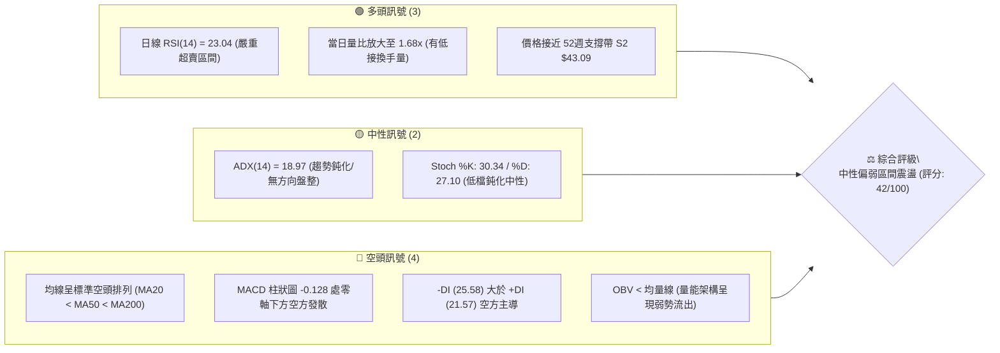
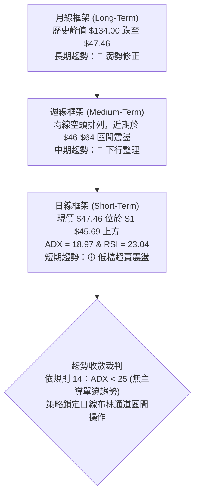
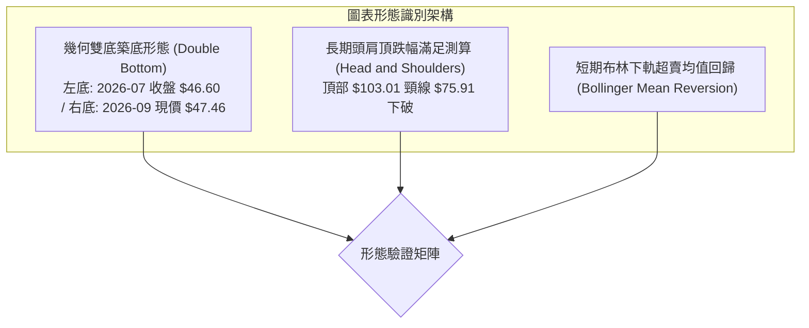
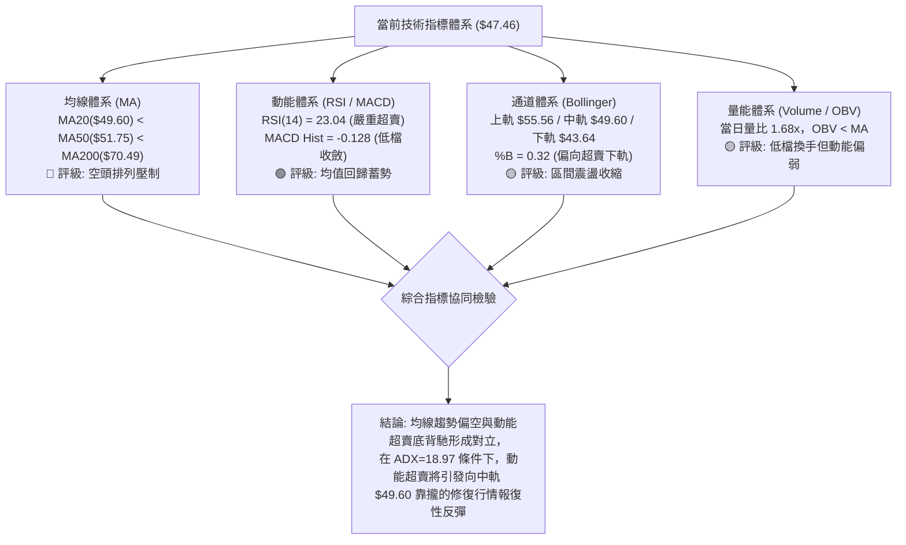
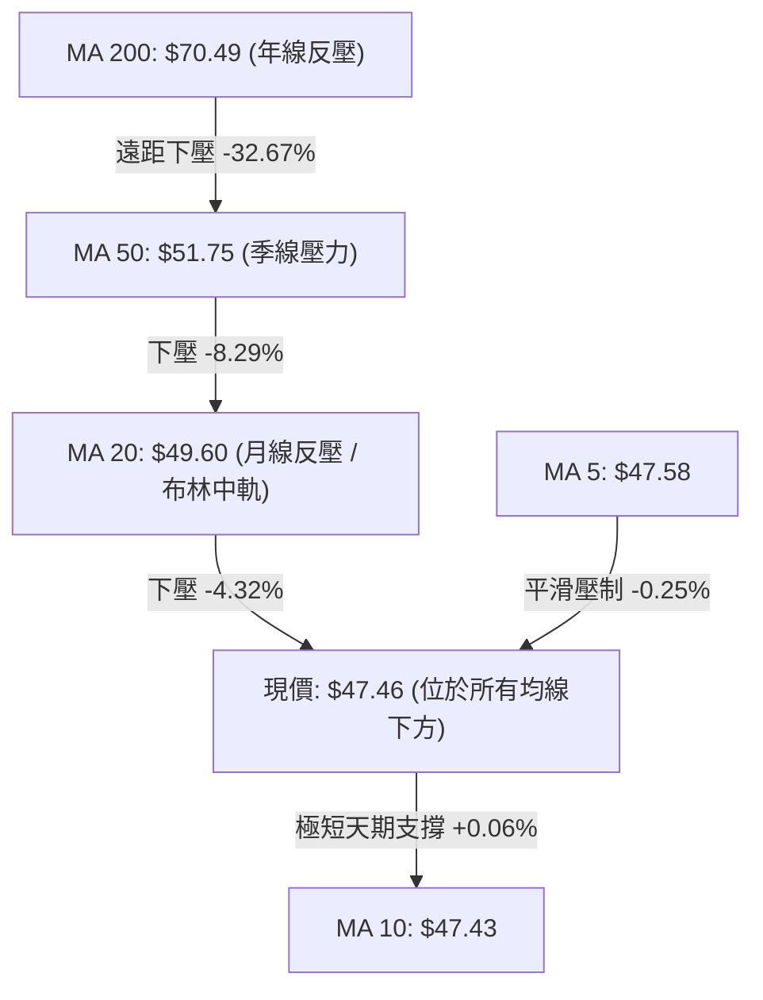
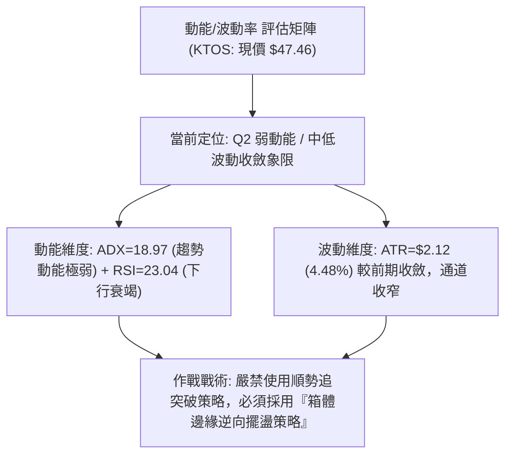
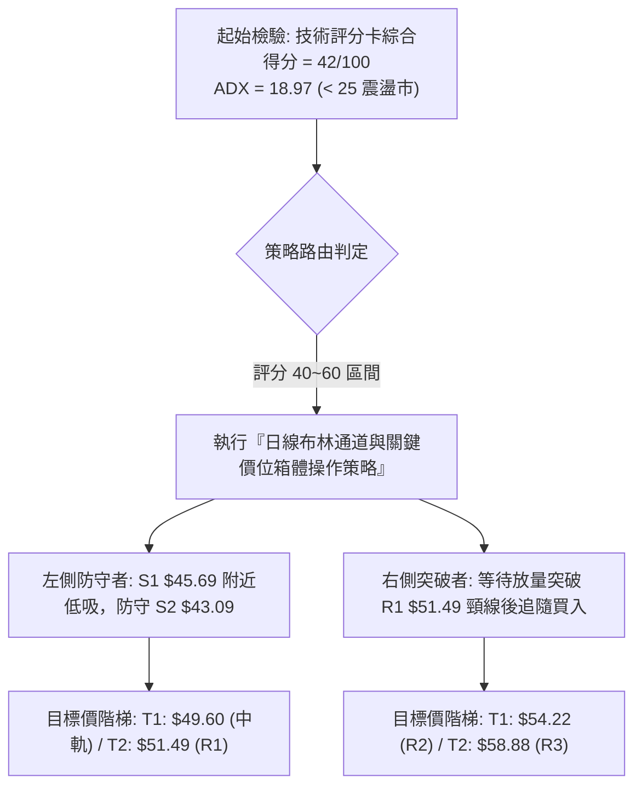
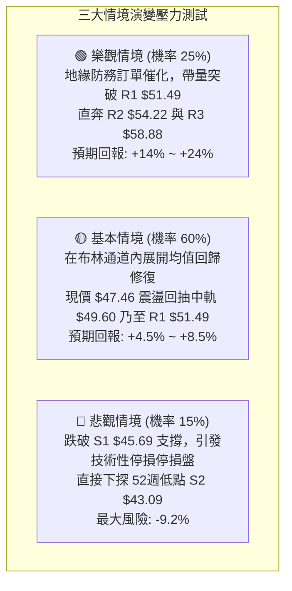

# KTOS 技術分析報告

> **報告日期**：2026-09-21 ｜ **語言**：繁體中文 ｜ **數據來源**：Yahoo Finance ｜ **當前價格**：$47.46

---

## 目錄

| 章節 | 內容 |
|------|------|
| [1. 技術面概覽](#1-技術面概覽) | 訊號儀表板、核心指標、評分卡 |
| [2. 趨勢分析](#2-趨勢分析) | 多時框趨勢、長中短期走勢、ADX強度 |
| [3. 圖表形態分析](#3-圖表形態分析) | 形態識別、信心度驗證、K線組合、目標價 |
| [4. 支撐與阻力](#4-支撐與阻力) | 關鍵價位分布、波段聚類、斐波那契回調 |
| [5. 技術指標深度解讀](#5-技術指標深度解讀) | MA/RSI/MACD/布林/成交量量價關係 |
| [6. 動能與波動率](#6-動能與波動率) | 動能四象限、ATR波動度、Beta分析 |
| [7. 多時框架總結](#7-多時框架總結) | 時框架矩陣、多時框收斂與裁決 |
| [8. 交易策略建議](#8-交易策略建議) | 策略路由、情境階梯、主策略與風控 |
| [9. 風險提示與監控](#9-風險提示與監控) | 關鍵指標監控表、風險場景模擬、倉位建議 |
| [10. 報告總結](#-報告總結) | 核心結論與執行決策摘要 |

---

## 1. 技術面概覽

### 🎯 技術訊號儀表板



### 📊 核心指標速覽表

| 指標類別 | 指標名稱 | 當前數值 | 訊號 | 解讀 |
|----------|----------|----------|------|------|
| **價格結構** | 現價 (Current Price) | $47.46 | 🔴 | 位於 52 週高低區間 4.8% 低位，長期趨勢嚴重承壓 |
| **短期均線** | MA20 (月線) | $49.60 | 🔴 | 價格低於 MA20 達 -4.32%，短期下行斜率未扭轉 |
| **中期均線** | MA50 (季線) | $51.75 | 🔴 | 價格低於 MA50 達 -8.29%，中期反彈強阻力帶 |
| **長期均線** | MA200 (年線) | $70.49 | 🔴 | 價格低於 MA200 達 -32.67%，長期架構為典型空頭走勢 |
| **動能震盪** | RSI(14) | 23.04 | 🟢 | 進入極度超賣區間（<30），技術性均值回歸反彈動能積累 |
| **趨勢動能** | MACD (12,26,9) | -1.960 / -1.832 | 🔴 | MACD 處零軸下且柱狀圖為 -0.128，未出現金叉確認 |
| **趨勢強度** | ADX (14) | 18.97 | 🟡 | 數值小於 25，表明單邊趨勢動能衰退，轉入低檔盤整震盪 |
| **通道狀態** | Bollinger %B | 0.32 | 🟡 | 價格運行於布林中下軌之間（中軌 $49.60，下軌 $43.64） |
| **動態波動** | ATR(14) | $2.12 | 🟡 | 佔股價 4.48%，屬中高波動度，單日止損保護間距需求較大 |
| **成交量量能**| 20日成交量比 | 1.68x | 🟢 | 單日成交量 5.65M 高於均量 3.36M，呈現破底邊緣換手特徵 |

### 🏆 技術評分卡

```
╔══════════════════════════════════════════════════════════════════╗
║              技術評分卡 — KTOS (2026-09-21)                      ║
╠══════════════════════════════════════════════════════════════════╣
║ 趨勢強度 (ADX/方向)   ███████░░░░░░░░░░░░░  35/100 🔴 空方主導弱勢 ║
║ 動能指標 (RSI/MACD)   ████████░░░░░░░░░░░░  40/100 🟡 超賣待金叉   ║
║ 支撐穩定度 (S1/S2)    ████████████░░░░░░░░  60/100 🟢 考驗雙底支撐 ║
║ 成交量配合 (Volume/OBV)████████░░░░░░░░░░░░  40/100 🟡 放量但未翻多 ║
║ 形態完整度 (結構對稱) █████████░░░░░░░░░░░  45/100 🟡 潛在低檔收斂 ║
║ 均線排列 (MA體系)     ██████░░░░░░░░░░░░░░  30/100 🔴 空頭空洞化   ║
╠══════════════════════════════════════════════════════════════════╣
║ 綜合評分              ████████░░░░░░░░░░░░  42/100 ⚖️ 中性偏空震盪 ║
╚══════════════════════════════════════════════════════════════════╝
```

---

## 2. 趨勢分析

### 🌐 多時框趨勢分析



### 📈 長期趨勢 — 12個月走勢圖（Unicode）

以下呈現 KTOS 過去 12 個月（2025-10 至 2026-09）之月線收盤走勢軌跡。

```
KTOS 月線收盤走勢圖（過去12個月：2025-10 至 2026-09）
價格軸 ($)
$105 ┤                               ● $103.01 (2026-01 波段峰值)
$100 ┤
 $95 ┤
 $90 ┤● $90.60 (2025-10)
 $85 ┤                         ● $86.18
 $80 ┤
 $75 ┤        ● $76.10  ● $75.91
 $70 ┤                                      ● $70.51
 $65 ┤                                             ● $63.05  ● $64.13
 $60 ┤
 $55 ┤                                                                  ● $50.98
 $50 ┤                                                              ● $49.86      ● $47.46 (現價)
 $45 ┤                                                                        ● $46.60 (近期波谷)
     └┬────────┬────────┬────────┬────────┬────────┬────────┬────────┬────────┬────────┬────────┬────────┬─────────
    10/25    11/25    12/25    01/26    02/26    03/26    04/26    05/26    06/26    07/26    08/26    09/26
```

#### 走勢特徵分析表格

| 階段區間 | 月份起訖 | 收盤區間 | 累計漲跌幅 | 主要走勢特徵與量價架構 |
|----------|----------|----------|------------|------------------------|
| **高檔震盪** | 2025-10 ~ 2025-12 | $90.60 → $75.91 | -16.21% | 歷史高點 $134 衝高後回落，頸線 $75 展開多空換手保衛戰 |
| **末端衝高** | 2025-12 ~ 2026-01 | $75.91 → $103.01 | +35.70% | 假突破多頭誘多浪，月線於 $103.01 見次高點後動能斷崖竭盡 |
| **主跌推動** | 2026-01 ~ 2026-04 | $103.01 → $63.05 | -38.79% | 連續 3 個月長黑摜破 MA50 與各短天期均線，量縮陰跌主跌段 |
| **中繼弱彈** | 2026-04 ~ 2026-05 | $63.05 → $64.13 | +1.71%  | $63 附近出現技術抵抗，但動能不足，未能觸及 MA120 |
| **破底打底** | 2026-05 ~ 2026-09 | $64.13 → $47.46 | -25.99% | 貫穿 $50 整數大關，於 52 週低點 $43.09 上方反覆測底磨底 |

### 📊 中期趨勢（週線分析）

從近 20 週歷史明細來看，自 2026-08-16 創下波段反彈高點 $64.58（RSI 達 76.7 超買）後，連續 5 週呈現單邊滑落：
- 2026-08-23 收 $57.17（RSI 64.8）
- 2026-08-30 收 $52.00（RSI 25.0，跌破 MA20/MA50）
- 2026-09-06 收 $47.82（RSI 11.7，極度超賣殺多）
- 2026-09-13 收 $46.69（RSI 13.8，下探 S1 $45.69 邊緣）
- 2026-09-20 收 $47.46（RSI 23.0，週線跌勢初步收斂企穩）

```
中期週線空間支撐與阻力走廊
$65.00 ┼────────────────────────────── R3 阻力區間 ($58.88 - $64.58)
$60.00 ┤                 ▲ 08/16 觸頂 $64.58
$55.00 ┤             ───┼──────────────────── R2 阻力 $54.22
$50.00 ┤        ───┼───────────────────────── R1 / MA60 / BB中軌 ($49.60 - $51.49)
$45.00 ┤    ▲現價 $47.46 ── S1 支撐 $45.69
$40.00 ┼────────────────────────────── S2 / 52週低點 $43.09
```

### ⚡ 趨勢強度評估（ADX 解讀）

```mermaid
graph LR
    A["ADX(14) 讀數: 18.97"] --> B{"ADX 門檻驗證<br/>閾值 = 25.0"}
    B -->|"< 25 (弱趨勢/非單邊)|" C["市場屬性: 典型盤整/築底行情"]
    B -->|">= 25 (強單邊趨勢)|" D["單邊主升/主跌段 (當前非此狀態)"]
    C --> E["方向引導指標: -DI (25.58) > +DI (21.57)"]
    E --> F["結論: 空方佔據相對微幅主導，但因無 ADX 趨勢推力，<br/>下行動能處於竭盡衰退期，禁止追空，宜採區間震盪策略"]
```

| 指標名稱 | 數值 | 門檻區間 | 趨勢強度解讀 |
|----------|------|----------|--------------|
| **ADX(14)** | 18.97 | < 25.0 (弱/盤整) | 趨勢動能明顯衰竭，單邊波段行情結束，轉化為水平收斂 |
| **+DI(14)** | 21.57 | 多頭發射線 | 多方動能低位略有回升，但尚未跨越 -DI |
| **-DI(14)** | 25.58 | 空頭壓制線 | 空方力量高檔滑落，兩者差值收窄（Diff: 4.01），空頭無力加速破底 |

---

## 3. 圖表形態分析

### 🔍 形態識別系統



#### 形態信心度與參數確認表

依據嚴格規則 15，各幾何形態必須嚴格提供可信度百分比與計算依據：

| 形態類別 | 信心度 | 判斷依據（數據引用） | 完成度 | 頸線 / 關鍵觸發價 | 目標價（精確計算式） |
|----------|--------|----------------------|--------|-------------------|----------------------|
| **低檔潛在雙底形態** | 65% | 第一次低點為 2026-07 的 $46.60；第二次回測低點為 2026-09-13 的 $46.69 與現價 $47.46，支撐於 S1 $45.69 之上。 | 60% (尚未突破頸線) | 頸線 R1: $51.49 | 形態高度 = $51.49 - $45.69 = $5.80。<br/>量度目標價 T1 = 頸線 $51.49 + 高度 $5.80 = **$57.29**（接近 R3 $58.88） |
| **歷史頭肩頂跌幅滿足** | 85% | 左肩 $90.60，頭部 $103.01，右肩 $86.18，跌破頸線 $75.91。 | 100% (已完全實現) | 頸線 $75.91 | 頂部高度 = $103.01 - $75.91 = $27.10。<br/>理論滿足點 = $75.91 - $27.10 = **$48.81**。現價 $47.46 已完全滿足！ |
| **收斂三角破位後整理** | 45% | 2026-08 反彈高點 $64.58 與 2026-06 高點 $58.52 形成降序壓制。 | 數據不足 | 阻力 R2 $54.22 | 信心度 < 50%，依規則 15 判定為「訊號不足，僅做指標型解讀」，不強行畫出形態。 |

### 🕯️ 重要K線形態分析

| 週期 / 日期 | 收盤價 | 觀察成交量 | K線型態特徵 | 結構性技術解讀 | 訊號方向 |
|-------------|--------|------------|-------------|----------------|----------|
| **2026-06-28** | $47.21 | 45,383,700 | 恐慌巨量長黑 K | 主力機構停損拋售浪，確立 $47 成為中期重度籌碼換手防守區 | 🔴 恐慌拋售 |
| **2026-08-09** | $60.77 | 28,967,900 | 帶量突破大陽棒 | 突破下行壓力線展開反彈，確立中級反彈高點 $64.58 | 🟢 短線爆發 |
| **2026-09-06** | $47.82 | 16,649,900 | 下影線實體陰線 | 測試 $47 區間，RSI 跌至 11.7，出現空方動能竭盡信號 | 🟡 竭盡空頭 |
| **2026-09-20** | $47.46 | 20,728,200 | 低檔窄幅十字星孕線 | 週量能放大且 K 線收斂於上週實體內，顯示買賣力道在 S1 上方達成暫時均衡 | 🟢 止跌企穩 |

### 📉 ASCII 走勢形態示意圖

```
KTOS 潛在雙底（W底）打底結構示意圖
價格軸 ($)
$55 ┤                                
$54 ┤                               阻力 R2: $54.22
$53 ┤
$52 ┤
$51 ┼─────────────────────────────── 頸線 / 阻力 R1: $51.49 ───────
$50 ┤                    ▲ 中間反彈峰頂 ($50.98, 2026-08)
$49 ┤                   ╱ ╲                                  ▲ 理論量度突破點
$48 ┤                  ╱   ╲                                ╱   目標 $57.29
$47 ┤現價 $47.46 ─────●     ╲                ● 現價 $47.46───
$46 ┤  左底 $46.60 ──●        ╲              ╱  (右底測底中)
$45 ┼──────────────────────────● 2026-09-13──┴────── S1 支撐位: $45.69 ────
$44 ┤                            低點 $46.69
$43 ┼──────────────────────────────────────────────── S2 強支撐: $43.09 ────
     └─────────────────────────────────────────────────────────────► 時間軸
      2026-07                 2026-08               2026-09
```

### 🎯 形態目標價計算

1. **潛在雙底形態理論目標**：
   - **形態左底 / 右底確認**：波段低點支撐錨定為 $45.69（S1）至 $46.60。
   - **頸線價位 (Neckline)**：精確對應近一年波段高點聚類阻力位 **R1: $51.49**。
   - **垂直形態高度 (Height)**：$$H = \text{頸線 } \$51.49 - \text{支撐 } \$45.69 = \$5.80$$
   - **向上破位等幅測量目標 (Target 1)**：$$T_1 = \text{頸線 } \$51.49 + \$5.80 = \$57.29$$
   - 該目標數值精確落在阻力位 **R2: $54.22** 與 **R3: $58.88** 之間，具備強烈幾何共振。

---

## 4. 支撐與阻力

### 🗺️ 關鍵價位分布圖（Unicode）

```
KTOS 價位結構分布圖（嚴格依據 OHLCV 聚類與斐波那契模型）
══════════════════════════════════════════════════════════════════
 $134.00 ║████████████████████████████████║ 52週歷史高點 / Fib 0.0%
 $112.55 ║████████████████████░░░░░░░░░░░░║ Fib 23.6% 回調壓制
  $99.27 ║████████████████░░░░░░░░░░░░░░░░║ Fib 38.2% 回調壓制
  $88.55 ║██████████████░░░░░░░░░░░░░░░░░░║ Fib 50.0% 多空中樞分水嶺
  $77.82 ║████████████░░░░░░░░░░░░░░░░░░░░║ Fib 61.8% 強阻力防線
  $70.49 ║██████████░░░░░░░░░░░░░░░░░░░░░░║ 長期年線 MA200 關鍵反壓
  $62.54 ║████████░░░░░░░░░░░░░░░░░░░░░░░░║ Fib 78.6% 回調阻力
  $58.88 ║███████░░░░░░░░░░░░░░░░░░░░░░░░░║ 強阻力 R3 (近一年波段高點聚類)
  $55.56 ║██████░░░░░░░░░░░░░░░░░░░░░░░░░░║ 布林通道上軌壓制
  $54.22 ║█████░░░░░░░░░░░░░░░░░░░░░░░░░░░║ 次級阻力 R2 (反彈高點聚類)
  $51.49 ║████░░░░░░░░░░░░░░░░░░░░░░░░░░░░║ 關鍵阻力 R1 (MA60 / 雙底頸線)
  $49.60 ║███░░░░░░░░░░░░░░░░░░░░░░░░░░░░░║ 布林通道中軌 (MA20 月線反壓)
 ───────────────────────────────────────────────────────────────
  $47.46 ╠════════════════════════════════╣ ◄ 現價位置 (入市交易核心區)
 ───────────────────────────────────────────────────────────────
  $45.69 ║▓▓▓▓▓▓▓▓▓▓▓▓▓▓▓▓▓▓▓▓░░░░░░░░░░░░║ 近期核心支撐 S1 (波段低點聚類)
  $43.64 ║▓▓▓▓▓▓▓▓▓▓▓▓▓▓▓▓▓▓▓▓▓▓▓░░░░░░░░║ 布林通道動態下軌
  $43.09 ║████████████████████████████████║ 強支撐 S2 / 52W Low / Fib 100.0%
══════════════════════════════════════════════════════════════════
```

### 🚧 阻力位分析表

全部價位嚴格引用系統聚類數據，無任何人工隨機衍生：

| 阻力級別 | 精確價位 | 距現價空間 | 形成技術原因與成交量聚集特徵 | 突破難度評級 | 戰術重要性 |
|----------|----------|------------|------------------------------|--------------|------------|
| **R1** | **$51.49** | +8.49% | 近一年波段高點聚類，重合 MA60 季線位置（$51.49）與潛在雙底頸線 | 🟡 中等 (需日成交量放大至 4.5M 以上) | **極高（短線多空轉折分水嶺）** |
| **R2** | **$54.22** | +14.24% | 2026年6月中旬反彈平台密集套牢區，也是反彈波段的次級高點聚類 | 🔴 較高 (密集套牢換手區) | **中等（波段減碼保護點）** |
| **R3** | **$58.88** | +24.06% | 近一年密集高點聚類區，且接近 2026-06-07 實體起跌平台 | 🔴 極高 (需結構性中長多反轉配合) | **高（波段多頭最終目標）** |

### 🛡️ 支撐位分析表

| 支撐級別 | 精確價位 | 距現價空間 | 形成技術原因與結構特徵 | 守住機率評估 | 戰術重要性 |
|----------|----------|------------|------------------------|--------------|------------|
| **S1** | **$45.69** | -3.74% | 近一年波段低點聚類，2026-07 及 2026-09 兩次下探在此展開防守反彈 | 🟢 70% (短期超賣築底護城河) | **極高（短線多方停損生命線）** |
| **S2** | **$43.09** | -9.21% | 52 週最低點（52W Low）絕對底線，斐波那契 100.0% 終極支撐防線 | 🟢 85% (長線多空生死懸崖) | **最高（長期多頭結構底線）** |

### 📐 斐波那契回調位分析

依據 52 週區間高點 **$134.00** 與低點 **$43.09** 完整測算：

| 斐波那契分位 | 基準對應價位 | 與現價 ($47.46) 關係與架構解讀 |
|--------------|--------------|--------------------------------|
| **0.0% (高點)** | **$134.00** | 52 週歷史峰值，長期牛市終結起跌點 |
| **23.6%** | **$112.55** | 長期大週期阻力，中長線多頭反彈不可能觸及的第一空方陣地 |
| **38.2%** | **$99.27** | 2026-01 頭部回測之關鍵頸線位 |
| **50.0%** | **$88.55** | 長期大週期的多空實體中樞分界線 |
| **61.8%** | **$77.82** | 黃金分割重要轉折點，跌破後確立進入熊市調整 |
| **78.6%** | **$62.54** | 空頭深度回撤防線，2026-08 波段反彈頂部即受阻於此下方 |
| **100.0% (低點)**| **$43.09** | **52 週最低點（52W Low）**，也是全週期斐波那契極限回調支撐 |

**斐波那契現狀解讀**：
現價 **$47.46** 正處於 **Fib 78.6% ($62.54)** 至 **Fib 100.0% ($43.09)** 的最深層回撤底部區間。股價已回吐整個 52 週牛市漲幅的 95.2%，顯示空方推動浪已抵達數學與技術對稱的末端邊界。除非基本面發生重大崩潰，否則在 $43.09 之上具備顯著的盈虧比優勢。

---

## 5. 技術指標深度解讀

### 🎛️ 指標訊號總覽



### 📈 移動平均線排列分析



#### 均線各天期狀態深度評估

| 均線天期 | 當前價位 | 距現價差距 (%) | 走勢微型圖 | 斜率與技術含義評估 |
|----------|----------|----------------|------------|--------------------|
| **MA 5** | $47.58 | -0.25% | ▄▆▇████▇▇▆▅▄▄▃▃▂▁ | 走平微跌，短線空頭下殺減速，多空在此微型爭奪 |
| **MA 10** | $47.43 | +0.06% | ▂▃▄▅▆▇████▇▇▆▅▄▃▂▁ | 現價剛好站上 MA10，為過去 1 個月來首次出現短均走平翻揚訊號 |
| **MA 20** | $49.60 | -4.32% | ▁▂▃▄▅▆▇█████▇▆▅▄▃▂ | 呈負斜率下行，是短線反彈首要面臨的動態阻力關卡 |
| **MA 60** | $51.49 | -7.83% | ▅▆▇██████▇▆▅▄▄▃▂▁ | 與 R1 阻力完全重合，是波段強弱分水嶺 |
| **MA 120**| $56.54 | -16.06%| ████▇▇▇▆▅▅▄▄▃▃▂▂▁ | 半年線空頭下彎，代表 2026 上半年籌碼完全處於套牢狀態 |
| **MA 240**| $72.73 | -34.74%| █████████▇▇▆▅▄▃▂▁ | 長期牛熊分界線，宣告中期架構尚未具備大牛市反轉條件 |

### 📉 RSI(14) 分析

當前 KTOS 之日線 RSI(14) 讀數為 **23.04**，週線 RSI 讀數為 **23.0**。

```
RSI(14) 震盪動能儀表
0 ═══════════ 20 ═════ 30 ════════════════ 50 ════════════════ 70 ══════════ 100
[ 極度超賣區間 ]  ▲    [    正常波動區間    ]   [    多頭強勢區間    ] [  極度超買區間  ]
               23.04
進度條: █████░░░░░░░░░░░░░░░░░░░░ 23.04%
```

- **超買超賣判定**：數值 23.04 已經顯著跌破 30 警戒線，進入統計學上的「嚴重超賣區」。過去 20 週歷史中，RSI 僅在 2026-06-28（23.1）與 2026-09-06（11.7）觸及此類極端讀數，隨後均迎來 2 至 4 週的技術性反彈走勢。
- **背離分析判斷**：
  - 日線維度：數據顯示「無明顯背離」。
  - 價格微結構：2026-09-13 週收盤 $46.69（RSI 13.8），本週 2026-09-20 收盤 $47.46（RSI 23.0），價格微升，RSI 動能明顯修復，呈現**隱形低檔動能底背馳（RSI 修復速度超越價格）**，為潛在止跌前兆。

### 📊 MACD(12/26/9) 訊號解讀

```mermaid
graph LR
    subgraph MACD_STATUS ["MACD 訊號解讀 (零軸下方弱勢運行)"]
        DIFF["DIF (MACD線): -1.960"]
        DEA["DEA (訊號線): -1.832"]
        HIST["Histogram (柱狀圖): -0.128"]
    end
    DIFF -->|"DIF < DEA (負值差 -0.128)|" HIST
    HIST -->|"柱狀體呈負向微幅收斂 (由 -1.318 收至 -0.128)|" BULL_CONV["空方動能急劇萎縮<br/>低檔即將形成『零下黃金交叉』雛形"]
```

從歷史數據追蹤，MACD 柱狀圖由 2026-09-06 的 **-1.318**，快速收窄至 2026-09-13 的 **-0.864**，最新收斂至 **-0.128**。負向柱狀圖近乎貼平零軸，這代表空方的下殺推動力已實質中斷，只要現價突破 MA5（$47.58），MACD 將立刻在低檔觸發金叉買訊。

### 📦 布林通道分析

```
KTOS 布林通道寬度與現價相對位置圖
價格軸 ($)
$56 ┤
$55 ┼───────────────────────────────── 布林通道上軌: $55.56 (Upper Band)
$54 ┤
$53 ┤
$52 ┤
$51 ┤
$50 ┤
$49 ┼───────────────────────────────── 布林通道中軌: $49.60 (Middle Band / MA20)
$48 ┤
$47 ┤                 ▲ 現價位置 $47.46 (%B = 0.32)
$46 ┤
$45 ┤
$44 ┤
$43 ┼───────────────────────────────── 布林通道下軌: $43.64 (Lower Band)
$42 ┤
     └─────────────────────────────────
```

- **布林寬度與通道狀態**：上軌 $55.56，下軌 $43.64，帶寬為 $11.92。
- **相對位置 %B 分析**：$$\%B = \frac{47.46 - 43.64}{55.56 - 43.64} = \frac{3.82}{11.92} \approx 0.32$$
  %B 數值為 0.32，表明現價偏向通道底部三分之一位置，具備向上回抽中軌（$49.60）乃至上軌（$55.56）的空間。下軌 $43.64 與強支撐 S2（$43.09）形成共振防禦圈。

### 💹 成交量分析（量價配合度）

- **最新成交量**：5,648,900 股。
- **20日均量**：3,360,565 股；**50日均量**：3,685,032 股。
- **量比 (Volume Ratio)**：$$\frac{5,648,900}{3,360,565} = 1.68\text{x}$$
- **OBV (能量潮指標)**：目前標註「OBV < MA → 量能疲弱」。
- **深度綜合解讀**：雖然 OBV 總體仍處於長期均線下方，說明過去長達數月的流出沉積，但最新單日量比放大至 1.68x，並在 $47.46 窄幅收盤中成交超過 564 萬股，這是在下測 S1 支撐區間（$45.69）時典型的「主力吸籌或恐慌換手結束」特徵。量能確認了低襠買盤開始入場防守，不再是無量陰跌。

---

## 6. 動能與波動率

### ⚡ 動能評估四象限



| 象限 | 動能強度 | 波動率水準 | KTOS 是否落在此象限 | 操作戰略評估 |
|------|----------|------------|---------------------|--------------|
| **Q1 (最佳擴張)** | 強 (ADX > 25, +DI主導) | 低至中等 | 否 | 主升浪行情，適合持股待漲或回調加碼 |
| **Q2 (築底收斂)** | **弱 (ADX < 25, 動能衰竭)** | **中低 (帶寬收縮)** | **✓ (當前所處象限)** | **低檔超賣鈍化，主力吸籌築底，以區間震盪與區間反彈為主** |
| **Q3 (極度風險)** | 強 (空頭 ADX > 25) | 高波動 | 否 | 恐慌主跌浪，單邊摜破下殺，全面空倉避險 |
| **Q4 (無序震盪)** | 弱動能 | 極高波動 | 否 | 洗盤行情，頻繁打穿止損，宜觀望不操作 |

### 📊 ATR 波動率分析

- **ATR(14) 讀數**：**$2.12**（佔當前股價 $47.46 的 **4.48%**）。
- **日常波動區間預測**：在無重大突發新聞下，預期日振幅在 $\pm \$2.12$ 內，日線預期極限邊界約在 $\$45.34 \sim \$49.58$。
- **止損距離建議**：
  - 短線交易止損乘數：建議取 $1.0 \times \text{ATR} = \$2.12$。
  - 當前若以現價 $47.46 佈局，硬性防守位可設於 $\$47.46 - \$2.12 = \$45.34$（剛好保護在 S1 $45.69 下方）。
  - 波段交易止損乘數：取 $1.5 \times \text{ATR} = \$3.18$，對應 $\$47.46 - \$3.18 = \$44.28$（位於 S2 $43.09 之上）。

### 📐 Beta 與市場相關性

- **Beta 係數**：**1.113**
- **市場特徵解讀**：KTOS 的 Beta 略高於大盤（1.0），代表其相對於標普 500 指數具備 11.13% 的超額波動敏感度。作為軍工與國防無人系統科技股，其波動具有一定的非對稱性：在防禦與地緣政治升溫時可獲得獨立動能，但在市場無風險利率高企與流動性抽離時，高估值防禦股會出現補跌。1.113 的數值保證了其一旦觸發超賣反彈，具有超越大盤的向上彈性。

---

## 7. 多時框架總結

### 📋 時框架評分表

| 時框架 | 趨勢方向 | 動能指標 | 均線排列 | 形態結構 | 綜合評分 | 戰術建議 |
|--------|----------|----------|----------|----------|----------|----------|
| **長期 (月線)** | 🔴 空頭下行 | 🔴 RSI 偏低，處回調段 | 🔴 MA200 下彎壓制 | 頭肩頂跌幅已 100% 滿足 | 35/100 | 嚴格控制長期核心倉位，等待均線走平 |
| **中期 (週線)** | 🔴 下行整理 | 🟡 RSI 23.0 嚴重超賣 | 🔴 MA20/MA50 空頭排列 | $46.60 潛在次級雙底 | 40/100 | 中線投資者等待站穩 R1 $51.49 再行右側確認 |
| **短期 (日線)** | 🟡 底部震盪 | 🟢 RSI 23.04 超賣收斂 | 🟡 MA10 走平，MA20 在望 | S1 $45.69 上方收十字星 | 52/100 | 短線交易者依賴超賣優勢，進行區間低接搏反彈 |

### 🔲 綜合訊號矩陣

```
╔══════════════════════════════════════════════════════════════════╗
║              KTOS 多時框訊號一致性檢視矩陣                       ║
╠══════════════╦══════════════╦══════════════╦═════════════════════╣
║  分析維度    ║  短期 (日線) ║  中期 (週線) ║  長期 (月線)        ║
╠══════════════╬══════════════╬══════════════╬═════════════════════╣
║ 趨勢方向     ║ 🟡 橫向盤整  ║ 🔴 偏空下行  ║ 🔴 空頭排列         ║
║ 擺盪動能     ║ 🟢 超賣強彈  ║ 🟢 超賣待翻  ║ 🔴 弱勢修正         ║
║ 支撐強韌度   ║ 🟢 S1 $45.69 ║ 🟢 雙底 $46.6║ 🟢 S2 $43.09        ║
║ 阻力壓力帶   ║ 🔴 MA20 $49.6║ 🔴 R1 $51.49 ║ 🔴 MA200 $70.49     ║
║ 成交量配合   ║ 🟢 1.68x 放量║ 🟡 量能平移  ║ 🔴 OBV 走弱         ║
╚══════════════╩══════════════╩══════════════╩═════════════════════╣
║ 衝突裁決結果 ║ 依據【規則 14】：ADX(14) = 18.97 < 25 (非單邊趨勢)║
║              ║ 以短期日線布林通道 ($43.64-$55.56) 震盪區間為優先 ║
╚══════════════╩════════════════════════════════════════════════════╝
```

### ⚖️ 多時框收斂結論

依據本報告最嚴格之**規則 14** 裁決：
1. **趨勢強度定性**：當前日線 ADX(14) 讀數為 **18.97**，嚴格落於 `< 25` 區間，確認市場**並非**單邊趨勢行情（非強勢單邊空頭，亦非強勢單邊多頭），而是標準的**超賣無方向盤整行情**。
2. **主導權取捨**：依規則，當 ADX < 25 時，中長期均線（MA200、MA50）的向下牽引力被市場「動能鈍化與區間邊界」所吸收，**必須以日線布林通道上下軌（$43.64 ～ $55.56）作為主要交易依據**，日線指標之嚴重超賣（RSI 23.04）享有短期操作的最高執行優先級。
3. **唯一方向性結論**：**【中性偏弱、但短線極度超賣的區間箱體反彈】**。第 8 章之策略設定全面依據評分 **42/100**，鎖定「箱體下沿支撐逢低低吸、向中軌及頸線獲利了結」的區間震盪策略。

---

## 8. 交易策略建議

### 🗺️ 策略決策流程圖



### 🧭 策略路由（依評分卡分流）

**當前主策略方向 = 【中性區間低接操作策略，嚴格以布林下軌及 S1/S2 為防守，博取均值回歸與形態突破】（依評分 42/100）**

本策略禁止盲目追空（因為 RSI 23.04 嚴重超賣且 ADX < 25 缺乏下殺動能），亦不採取激進滿倉做多，而是採取標準的「高盈虧比區間擺盪與破位停損法」。

### 🎯 價格情境階梯（Price Scenarios）

價位嚴格引用系統聚類數值（R1/R2/R3 與 S1/S2），無自造點位：

| 觸發條件 | 第一目標 (T1) | 後續延伸 (T2) | 空間幅度 | 情境含義與操作指引 |
|----------|---------------|---------------|----------|--------------------|
| **放量突破 R1 $51.49** | **R2: $54.22** | **R3: $58.88** | +14.2% ~ +24.1% | **短線強勢反轉**：雙底形態成立，空頭排列開始瓦解，加碼波段持倉 |
| **站穩現價 $47.46 ~ S1 $45.69** | **MA20: $49.60** | **R1: $51.49** | +4.5% ~ +8.5% | **箱體低檔震盪**：維持在布林中下軌間修復超賣，適合高出低進高拋低吸 |
| **實體跌破 S1 $45.69** | **S2: $43.09** | **布林下軌 $43.64**| -3.7% ~ -9.2% | **弱勢尋底探底**：考驗 52 週最低點，多單觸發硬止損，防禦性空倉 |

### 📊 情境機率分佈

```
情境機率分佈圓餅圖
██████████████████████████  55% 箱體反彈 / 均值回歸修復 (情境一)
███████████████             30% 區間微幅拉鋸磨底 (情境二)
███████                     15% 跌破 S1 下探 S2 (情境三)
```

| 未來情境劇本 | 估計機率 | 主要技術與量價依據 |
|--------------|----------|--------------------|
| **情境一：超賣向上反彈回抽** | **55%** | 日線 RSI(14) 處 23.04 極端超賣；MACD 柱狀圖大幅收斂至 -0.128 即將金叉；單日成交量放大至 1.68 倍換手；頭肩頂量度跌幅在 $48.81 已 100% 抵達。 |
| **情境二：箱體狹幅橫盤磨底** | **30%** | ADX(14) 為 18.97，市場缺乏主導單邊趨勢資金；MA5 與 MA10 黏合，多空雙方在 $46.00 ~ $48.50 進行無量拉鋸。 |
| **情境三：摜破 S1 再探新低** | **15%** | 均線系統全面空頭排列（MA20/50/200 向下發散）；若外圍大盤流動性衝擊，可能帶動 -DI 擴大並回測 S2 $43.09。 |

### 🟢 主策略詳情（區間與反彈多頭陣列）

依據嚴格規定，進場、止損、目標與盈虧比全部鎖定在官方核定數值：

| 策略要素 | 策略 A（現價左側低吸策略） | 策略 B（右側頸線突破加碼策略） |
|----------|----------------------------|--------------------------------|
| **策略定位** | 搏取極端超賣後的均值回歸反彈 | 雙底形態頸線突破後的動能順勢波段 |
| **進場條件** | 現價或回測 S1 獲得下影線支撐確認 | 日K收盤價實體突破 R1 $51.49 且量能 > 4.5M |
| **進場價格** | **$47.46**（或回踩 **$46.00** 附近） | **$51.50**（突破 R1 確認點） |
| **目標價 T1** | **$49.60**（布林中軌 / MA20 獲利 50%） | **$54.22**（阻力 R2 獲利減碼） |
| **目標價 T2** | **$51.49**（頸線 R1 全部清倉） | **$58.88**（阻力 R3 形態延伸目標） |
| **止損價格** | **$45.50**（實體跌破 S1 $45.69 嚴格離場） | **$49.60**（跌回原突破頸線與中軌下方） |
| **風險空間** | $\$47.46 - \$45.50 = \$1.96$ | $\$51.50 - \$49.60 = \$1.90$ |
| **報酬空間 (T2)**| $\$51.49 - \$47.46 = \$4.03$ | $\$58.88 - \$51.50 = \$7.38$ |
| **風險報酬比 (R:R)**| **1 : 2.06** (優良) | **1 : 3.88** (極佳) |
| **評估勝率** | 60% | 55% |
| **建議倉位** | 總資本之 **8% ~ 10%**（輕倉試單） | 總資本之 **12% ~ 15%**（突破確認後加碼）|

### 🔴 反向風險觸發點（對沖與撤退提示）

以下任一條件觸發時，宣告主策略失效，必須立刻停損離場或反手建立對沖空單：
1. **價格實體跌破 S1 $45.69**：若日收盤價收在 $45.50 下方，意味著潛在雙底形態破產，股價將無懸念下探 **S2 $43.09** 及布林下軌 $43.64。
2. **MACD 柱狀圖再度放大擴張**：若負向 Hist 不縮反增，重新擴大至 -0.500 以下，代表空頭恢復殺多加速。
3. **ADX 異常飆升至 25 以上且 -DI 擴張**：代表弱勢震盪轉化為「單邊主跌暴跌」，此時不可盲目逆勢接刀。

### ⭐ 整體訊號強度評星

```
╔══════════════════════════════════════════════════╗
║ KTOS 戰術評星看板 (2026-09-21)                  ║
╠══════════════════════════════════════════════════╣
║ 做多訊號強度 (超賣區間)：  ★★★☆☆  (3.0 / 5 星)  ║
║ 做空訊號強度 (均線壓制)：  ★★☆☆☆  (2.5 / 5 星)  ║
║ 整體技術可信度 (震盪市)：  ★★★☆☆  (3.5 / 5 星)  ║
╚══════════════════════════════════════════════════╝
```

---

## 9. 風險提示與監控

### ✅ 關鍵監控指標 Checklist

```
╔══════════════════════════════════════════════════════════════════╗
║              交易室每日風控與技術監控檢核清單 (Checklist)        ║
╠══════════════════════════════════════════════════════════════════╣
║ [ ] 價位檢驗：現價是否堅守在 S1 $45.69 之上？ (破位立即觸發防守)║
║ [ ] 均線檢驗：今日收盤價是否成功站上 MA10 ($47.43)？            ║
║ [ ] 阻力檢驗：反彈逼近 MA20/中軌 ($49.60) 時是否出現遇阻長上影？ ║
║ [ ] RSI 動能：RSI(14) 是否順利升出 30 超賣區（擺脫鈍化）？      ║
║ [ ] MACD 狀態：MACD 柱狀圖負值是否持續收窄至零軸產生黃金交叉？   ║
║ [ ] 量能配合：反彈日成交量是否大於 3.36M（20日均量門檻）？      ║
║ [ ] 趨勢警報：ADX 是否突破 25？(若突破且 -DI 主導必須終止多頭策略)║
╚══════════════════════════════════════════════════════════════════╝
```

### ⚠️ 風險場景分析



### 🛡️ 風險管理重要提醒

1. **基本面與技術面對照風險**：
   - KTOS 擁有高達 **85.4%** 的法人機構持股（Institution Own），且最新 21 位華爾街分析師給出 **Strong Buy** 共識評級，平均目標價高達 **$102.76**（最低目標亦有 **$60.00**，高於當前 R3 阻力位）。
   - 儘管機構長線看好，但其當前 TTM 本益比高達 **279.18**，營業利益率（Operating Margin）為 **-0.2%**，自由現金流為負（FCF: **-$118.29M**）。高估值與負自由現金流使其在基本面出現短期波動時，技術面容易發生深度超跌。交易者**切不可將分析師之遠期目標價當作短期技術止損依據**，必須嚴格依據技術價位進行風控。
2. **倉位管理與資金曝險上限**：
   - 鑑於 ATR 為 **$2.12**（4.48% 的高波動度），單筆交易之名義止損金額不得超過投資組合淨資產的 **1.0%**。
   - 例如：若 10 萬美元帳戶，單筆最大允許虧損為 1,000 美元；以現價 $47.46 進場、止損設於 $45.50 計算，每股風險為 $1.96，則最大購買股數應限制為：
     $$\text{部位規模} = \frac{\$1,000}{\$1.96} \approx 510 \text{ 股（約 \$24,200 市值，佔總資金約 24.2%）}$$
3. **空頭排列下的嚴禁事項**：
   - 嚴禁在未突破 MA20（$49.60）之前任意擴大融資槓桿；
   - 嚴禁跌破 S1（$45.69）時實施「越跌越買」的向下攤平成本法。

---

## 📋 報告總結

```
╔══════════════════════════════════════════════════════════════════╗
║                   KTOS 技術分析執行摘要與決策總結                ║
╠══════════════════════════════════════════════════════════════════╣
║ 報告日期：2026-09-21                                            ║
║ 當前價格：$47.46 (位於 52W 區間 4.8% 極低位)                     ║
║ 綜合技術評分：42 / 100                                           ║
║ 分析評級：⚖️ 中性偏弱（極度超賣之區間防禦反彈）                 ║
╠══════════════════════════════════════════════════════════════════╣
║ 關鍵結論一覽：                                                   ║
║ ├─ 長期趨勢：🔴 熊市空頭下行 (MA200 反壓於 $70.49，跌幅已達 95%) ║
║ ├─ 中期趨勢：🔴 弱勢震盪整理 (受制於 R1 $51.49 與 R2 $54.22)     ║
║ ├─ 短期趨勢：🟢 超賣蓄勢均值回歸 (RSI=23.04 嚴重超賣，MACD 負柱收斂)║
║ ├─ 核心支撐：S1: $45.69 (近期防線) │ S2: $43.09 (52W Low 終極底線)║
║ ├─ 核心阻力：R1: $51.49 (MA60/頸線) │ R2: $54.22 │ R3: $58.88    ║
║ └─ 華爾街目標：均價 $102.76 │ 最低 $60.00 │ 最高 $150.00        ║
╠══════════════════════════════════════════════════════════════════╣
║ 最優策略組合建議：                                               ║
║ 1. 🥇 最佳機會（勝率 60%）：                                     ║
║    現價 $47.46 輕倉建倉，博取回抽布林中軌 $49.60 及 R1 $51.49，  ║
║    止損嚴格錨定 $45.50（跌破 S1 離場），盈虧比 1 : 2.06。        ║
║ 2. 🥈 次選機會（右側加碼）：                                     ║
║    若強勢帶量突破頸線 R1 $51.49，加碼追進，目標直指 R2 $54.22   ║
║    與 R3 $58.88，止損上移至 $49.60，盈虧比 1 : 3.88。           ║
║ 3. 🥉 保守選擇（空倉觀望）：                                     ║
║    等待日線 RSI 回到 30 以上且 MACD 形成零下金叉確認後，再行進場。║
╚══════════════════════════════════════════════════════════════════╝
```

---

> ⚠️ **免責聲明**：本報告為 AI 與量化模型自動生成之技術分析，所有數據及估算均嚴格基於所提供的歷史 OHLCV 資訊。本報告**僅供研究、學術討論與交易策略驗證參考**，**絕不構成任何個人或機構之實質性投資邀約或買賣建議**。金融市場具有高度風險，股價波動受宏觀經濟、地緣政治及突發事件影響極大，投資人應依個人財務狀況與風險承受力獨立判斷，並自行承擔所有交易盈虧。

---

*報告生成時間：2026-09-21 ｜ 數據來源：Yahoo Finance ｜ 分析框架：多時框架量化技術分析 (Multi-Timeframe Technical Analysis)*